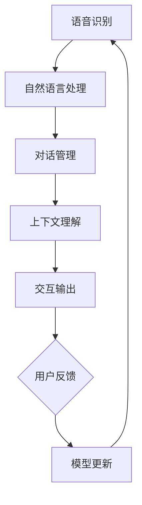

                 

### 《如何利用对话式AI优化用户体验》

> **关键词**: 对话式AI、用户体验、自然语言处理、机器学习、语音识别、实时交互

> **摘要**: 本文深入探讨了对话式AI在优化用户体验方面的应用。通过分析对话式AI的基础知识、核心算法、数学模型以及应用实践，本文揭示了如何利用对话式AI技术提升用户体验，从而为企业带来更大的商业价值。文章还将探讨对话式AI的未来发展趋势和面临的挑战，为读者提供全面的技术视野和实用的解决方案。

在当今数字化时代，用户体验（User Experience, UX）已成为企业竞争的关键因素。随着人工智能（AI）技术的快速发展，尤其是对话式AI（Conversational AI），在优化用户体验方面展现了巨大的潜力。对话式AI能够通过模拟人类对话，提供智能、高效、个性化的服务，从而提升用户满意度和忠诚度。本文将围绕如何利用对话式AI优化用户体验展开详细探讨。

### 目录

1. **第一部分：对话式AI基础**
   - [第1章 对话式AI概述](#第1章-对话式ai概述)
     - 1.1 对话式AI的定义与分类
     - 1.2 对话式AI的技术架构
     - 1.3 对话式AI的优劣势
   - [第2章 对话式AI的核心算法原理](#第2章-对话式ai的核心算法原理)
     - 2.1 语音识别算法
     - 2.2 自然语言处理算法
     - 2.3 对话管理算法
   - [第3章 对话式AI的数学模型和数学公式](#第3章-对话式ai的数学模型和数学公式)
     - 3.1 对话式AI的数学模型
     - 3.2 数学公式讲解
     - 3.3 数学公式举例说明

2. **第二部分：对话式AI应用实践**
   - [第4章 对话式AI在客户服务中的应用](#第4章-对话式ai在客户服务中的应用)
     - 4.1 客户服务场景概述
     - 4.2 客户服务对话式AI系统搭建
     - 4.3 实际案例解析
   - [第5章 对话式AI在智能助手中的应用](#第5章-对话式ai在智能助手中的应用)
     - 5.1 智能助手概述
     - 5.2 智能助手系统架构
     - 5.3 实际案例解析
   - [第6章 对话式AI在智能教育中的应用](#第6章-对话式ai在智能教育中的应用)
     - 6.1 智能教育场景概述
     - 6.2 智能教育对话式AI系统搭建
     - 6.3 实际案例解析
   - [第7章 对话式AI在客户体验优化中的应用](#第7章-对话式ai在客户体验优化中的应用)
     - 7.1 客户体验优化概述
     - 7.2 客户体验优化策略
     - 7.3 实际案例解析

3. **第三部分：对话式AI的未来发展趋势与挑战**
   - [第8章 对话式AI的未来发展趋势](#第8章-对话式ai的未来发展趋势)
     - 8.1 人工智能技术的进步
     - 8.2 行业应用的新趋势
     - 8.3 社会与伦理问题
   - [第9章 对话式AI面临的挑战与解决方案](#第9章-对话式ai面临的挑战与解决方案)
     - 9.1 技术挑战
     - 9.2 应用挑战
     - 9.3 解决方案与未来展望

4. **附录**
   - [附录A 对话式AI开发工具与资源](#附录a-对话式ai开发工具与资源)
   - [附录B Mermaid流程图示例](#附录b-mermaid流程图示例)

### 第一部分：对话式AI基础

对话式AI是人工智能领域的一个重要分支，旨在通过模拟人类对话来提供交互式服务。对话式AI的核心是通过自然语言处理（NLP）技术，使机器能够理解人类语言并生成自然流畅的回复。本部分将对对话式AI的基础知识进行深入探讨，包括其定义与分类、技术架构、核心算法原理以及数学模型。

#### 第1章 对话式AI概述

**1.1 对话式AI的定义与分类**

对话式AI，也称为聊天机器人或对话系统，是一种能够与人类进行自然语言交互的智能系统。它通过理解用户输入的文本或语音，生成相应的回复，实现与用户的对话。根据交互方式的不同，对话式AI可以分为文本交互和语音交互两种类型。

- **文本交互**：通过文本消息进行对话，如微信聊天机器人、在线客服系统等。
- **语音交互**：通过语音信号进行对话，如苹果的Siri、亚马逊的Alexa等。

**1.2 对话式AI的技术架构**

对话式AI的技术架构主要包括以下几个模块：

1. **语音识别与自然语言处理（NLP）**：语音识别模块将用户的语音转换为文本，NLP模块则负责理解文本的含义。
2. **对话管理模块**：负责管理对话流程，包括上下文理解、意图识别、对话策略生成等。
3. **上下文理解与推理**：通过上下文信息，对用户的意图进行准确理解，并生成合适的回复。
4. **交互输出**：根据对话管理模块生成的策略，将回复输出给用户，可以是文本或语音形式。

**1.3 对话式AI的优劣势**

**优势：**
- **提高效率**：对话式AI能够快速响应用户，节省人工成本。
- **个性化服务**：通过学习用户的行为和偏好，提供个性化的服务。
- **24/7 服务**：对话式AI能够全天候提供服务，不受时间和地点的限制。

**劣势：**
- **理解能力有限**：对话式AI在处理复杂、模糊或多样化的对话时可能存在困难。
- **隐私和安全问题**：用户在与对话式AI交互时，可能会泄露个人信息，存在隐私和安全风险。

#### 第2章 对话式AI的核心算法原理

**2.1 语音识别算法**

语音识别算法是对话式AI的重要组成部分，其核心是通过将语音信号转换为文本。语音识别算法主要包括以下几个步骤：

1. **语音信号处理**：对原始语音信号进行预处理，如去除噪声、归一化处理等。
2. **声学模型**：用于对语音信号进行特征提取，常用的模型有GMM（高斯混合模型）和DNN（深度神经网络）。
3. **语言模型**：用于对识别出的文本进行语法和语义分析，常用的模型有N-gram和神经网络语言模型。

**2.2 自然语言处理算法**

自然语言处理算法是对话式AI的核心，用于理解用户输入的文本，并生成相应的回复。自然语言处理算法主要包括以下几个步骤：

1. **词嵌入技术**：将词汇转换为向量表示，常用的模型有Word2Vec、GloVe等。
2. **序列到序列模型**：用于将输入序列转换为输出序列，如Seq2Seq模型、Transformer模型等。
3. **注意力机制**：用于在生成回复时关注关键信息，提高回复的准确性和自然性。

**2.3 对话管理算法**

对话管理算法负责管理对话流程，确保对话的连贯性和合理性。对话管理算法主要包括以下几个步骤：

1. **对话状态跟踪**：记录对话的历史信息，如用户的偏好、对话主题等。
2. **对话策略学习**：根据对话状态和用户输入，生成合适的回复策略。
3. **多轮对话生成**：在多轮对话中，根据上下文和对话状态，生成连贯且合理的回复。

#### 第3章 对话式AI的数学模型和数学公式

**3.1 对话式AI的数学模型**

对话式AI的数学模型主要基于概率模型和强化学习。概率模型用于对语音信号和文本进行建模，强化学习用于优化对话策略。

1. **生成模型与判别模型**：生成模型用于生成语音信号或文本，判别模型用于判断语音信号或文本的真伪。
2. **序列模型**：用于处理序列数据，如语音信号和文本序列。
3. **强化学习**：用于优化对话策略，使对话系统能够根据用户的反馈进行自我学习。

**3.2 数学公式讲解**

1. **条件概率公式**：
   $$
   P(A|B) = \frac{P(B|A)P(A)}{P(B)}
   $$
   其中，$P(A|B)$ 表示在事件B发生的条件下事件A发生的概率。

2. **梯度下降法**：
   $$
   w_{t+1} = w_{t} - \alpha \cdot \nabla J(w_t)
   $$
   其中，$w_t$ 表示第t次迭代的权重，$\alpha$ 表示学习率，$\nabla J(w_t)$ 表示损失函数关于权重$w_t$的梯度。

3. **强化学习中的奖励函数**：
   $$
   R(s, a) = r(s, a)
   $$
   其中，$R(s, a)$ 表示在状态s下执行动作a的奖励，$r(s, a)$ 表示奖励函数。

**3.3 数学公式举例说明**

1. **对话式AI中的概率模型应用**：

   在语音识别中，可以使用高斯混合模型（GMM）对语音信号进行特征提取。GMM的数学模型如下：

   $$
   P(x|\theta) = \frac{1}{Z} \prod_{i=1}^{k} \pi_i \mathcal{N}(x|\mu_i, \sigma_i^2)
   $$
   其中，$x$ 表示语音信号，$\theta$ 表示模型参数，$\pi_i$ 表示混合权重，$\mu_i$ 和 $\sigma_i^2$ 分别表示第i个高斯分布的均值和方差。

2. **对话式AI中的优化算法应用**：

   在对话管理中，可以使用梯度下降法优化对话策略。假设损失函数为 $J(w)$，则梯度下降法更新权重的过程如下：

   $$
   w_{t+1} = w_{t} - \alpha \cdot \nabla J(w_t)
   $$
   其中，$\alpha$ 为学习率，$\nabla J(w_t)$ 为损失函数关于权重 $w_t$ 的梯度。

通过上述数学模型和公式的应用，对话式AI能够在语音识别、自然语言处理和对话管理等方面实现高效的交互。

### 第二部分：对话式AI应用实践

#### 第4章 对话式AI在客户服务中的应用

在客户服务领域，对话式AI的应用已成为提升服务质量的重要手段。通过对话式AI，企业能够提供24/7的在线客服，减少人工成本，提高响应速度和客户满意度。本节将探讨对话式AI在客户服务中的应用，包括场景概述、系统搭建和实际案例解析。

**4.1 客户服务场景概述**

客户服务是每个企业不可或缺的一部分，直接影响到客户的满意度和忠诚度。传统的客户服务主要通过电话、邮件和在线聊天等方式进行。然而，这些方式在响应速度、成本和效率方面存在一定的局限。对话式AI的出现，为解决这些问题提供了新的思路。

对话式AI在客户服务中的应用主要包括以下场景：

1. **在线客服**：通过网站、社交媒体等渠道提供24/7的在线咨询服务，快速解答客户的疑问。
2. **智能语音客服**：通过电话或语音助手提供语音服务，实现语音识别和文本转语音的功能。
3. **自助服务**：提供自助查询、故障诊断、订单追踪等功能，减少人工干预。

**4.2 客户服务对话式AI系统搭建**

搭建一个高效的客户服务对话式AI系统，需要以下几个关键步骤：

1. **开发环境与工具**：

   - **编程语言**：Python、Java等。
   - **框架与库**：TensorFlow、PyTorch、Rasa等。
   - **语音识别与NLP库**：如Google Cloud Speech-to-Text、NLTK等。

2. **数据预处理**：

   - **文本数据**：收集并整理客户提问的文本数据，进行去噪、分词、词性标注等预处理。
   - **语音数据**：对语音数据进行分片、转录和标注，提取特征向量。

3. **模型训练与优化**：

   - **语音识别模型**：使用预训练的语音识别模型，如Tacotron或WaveNet，进行微调。
   - **自然语言处理模型**：使用序列到序列模型，如Seq2Seq或Transformer，进行意图识别和回复生成。
   - **对话管理模型**：使用强化学习算法，如DQN或PPO，进行对话策略优化。

4. **部署与运维**：

   - **部署**：将训练好的模型部署到服务器或云平台上，实现实时交互。
   - **运维**：监控系统运行状态，定期更新模型和算法，提高系统性能和用户体验。

**4.3 实际案例解析**

以下为两个客户服务对话式AI的实际案例：

**案例一：在线客服机器人**

某电子商务平台采用Rasa对话式AI框架搭建了在线客服机器人，提供24/7的在线咨询服务。通过自然语言处理技术，机器人能够理解客户的提问，生成合适的回复。同时，机器人还具备情感识别功能，根据客户的情绪调整回复策略，提高客户满意度。

**案例二：智能语音客服系统**

某银行采用Google Cloud的语音识别和文本转语音服务，搭建了智能语音客服系统。客户可以通过电话与客服机器人进行语音交互，机器人能够自动识别客户的问题，生成语音回复。此外，机器人还能根据客户的历史交易记录，提供个性化的金融服务。

通过上述案例，可以看出对话式AI在客户服务中的应用不仅提高了服务质量和效率，还降低了企业的运营成本。

#### 第5章 对话式AI在智能助手中的应用

智能助手（Smart Assistant）是对话式AI的一个重要应用领域，通过模拟人类助手，为用户提供便捷、智能的服务。智能助手的应用场景非常广泛，包括个人助理、智能家居、智能客服等。本节将探讨对话式AI在智能助手中的应用，包括智能助手概述、系统架构和实际案例解析。

**5.1 智能助手概述**

智能助手是一种能够理解人类语言并执行任务的软件或硬件系统。它们通过自然语言处理和语音识别技术，与用户进行交互，提供各种智能服务。智能助手的基本功能包括：

1. **语音交互**：通过语音识别技术，将用户的语音转换为文本，并生成语音回复。
2. **文本交互**：通过文本消息，与用户进行文字交流，提供信息查询、任务提醒、语音合成等服务。
3. **任务执行**：根据用户的指令，自动执行各种任务，如发送邮件、拨打电话、预约餐厅等。

智能助手可以按照应用场景的不同进行分类，主要包括以下几类：

1. **个人智能助手**：为用户提供个人服务，如苹果的Siri、亚马逊的Alexa等。
2. **智能家居助手**：控制智能家居设备，如谷歌的Google Home、亚马逊的Echo等。
3. **智能客服助手**：提供客户服务，如银行客服、电商客服等。

**5.2 智能助手系统架构**

智能助手系统通常包括以下几个核心模块：

1. **语音识别模块**：将用户的语音转换为文本，常用的语音识别技术包括HMM（隐马尔可夫模型）和DNN（深度神经网络）。
2. **自然语言处理（NLP）模块**：对文本进行语义分析，理解用户的意图和问题，常用的NLP技术包括词嵌入、序列到序列模型和注意力机制。
3. **对话管理模块**：管理对话流程，包括上下文理解、意图识别、对话策略生成等，常用的对话管理算法包括状态跟踪、策略学习和多轮对话生成。
4. **知识库模块**：存储智能助手所需的知识和事实，如词汇表、百科知识等，用于提高智能助手的回答准确性和丰富性。
5. **语音合成模块**：将生成的文本转换为语音，常用的语音合成技术包括波束搜索和循环神经网络（RNN）。

**5.3 实际案例解析**

以下为两个智能助手的实际案例：

**案例一：个人智能助手**

苹果的Siri是一个典型的个人智能助手，通过语音交互，为用户提供各种服务。用户可以通过语音指令，查询天气、新闻、音乐等，Siri会根据用户的语音指令，生成相应的回复。此外，Siri还能与第三方应用程序进行交互，如预订机票、发送短信等。

**案例二：智能家居助手**

谷歌的Google Home是一个智能家居助手，通过语音交互，控制智能家居设备。用户可以通过语音指令，打开灯光、调节温度、播放音乐等。Google Home内置了语音识别和自然语言处理技术，能够理解用户的语音指令，并生成相应的回复。此外，Google Home还能与其他智能家居设备进行集成，如智能灯泡、智能门锁等，实现智能家居的全面控制。

通过上述案例，可以看出智能助手在提升用户体验和便利性方面具有重要作用。随着对话式AI技术的不断进步，智能助手将在更多领域得到广泛应用。

#### 第6章 对话式AI在智能教育中的应用

在智能教育领域，对话式AI的应用为个性化教学和学习体验带来了革命性的变化。通过对话式AI，教育系统能够与学习者进行实时互动，提供个性化的学习内容和指导，从而提高学习效果。本节将探讨对话式AI在智能教育中的应用，包括场景概述、系统搭建和实际案例解析。

**6.1 智能教育场景概述**

智能教育是指利用人工智能技术，如对话式AI、机器学习和大数据分析，改进教学过程和学习体验。对话式AI在智能教育中的应用主要包括以下几个方面：

1. **智能教学辅导**：通过对话式AI，为学生提供个性化的学习指导，如作业辅导、学习进度跟踪等。
2. **智能课程推荐**：根据学生的学习历史和偏好，推荐适合的学习资源和课程。
3. **智能问答系统**：为学生提供实时的问答服务，解答学习中的疑难问题。
4. **智能学习评估**：通过对话式AI，对学生的学习效果进行实时评估，提供针对性的学习建议。

**6.2 智能教育对话式AI系统搭建**

搭建一个智能教育对话式AI系统，需要以下几个关键步骤：

1. **开发环境与工具**：

   - **编程语言**：Python、Java等。
   - **框架与库**：TensorFlow、PyTorch、Rasa等。
   - **NLP库**：NLTK、spaCy等。

2. **数据收集与预处理**：

   - **学习数据**：收集学生的学习记录、作业答案、考试分数等数据。
   - **课程数据**：收集课程大纲、教学视频、练习题等数据。
   - **文本数据**：整理学生提问的文本数据，进行分词、词性标注等预处理。

3. **模型训练与优化**：

   - **语音识别模型**：使用预训练的语音识别模型，如Tacotron或WaveNet，进行微调。
   - **自然语言处理模型**：使用序列到序列模型，如Seq2Seq或Transformer，进行意图识别和回复生成。
   - **对话管理模型**：使用强化学习算法，如DQN或PPO，进行对话策略优化。

4. **部署与运维**：

   - **部署**：将训练好的模型部署到服务器或云平台上，实现实时交互。
   - **运维**：监控系统运行状态，定期更新模型和算法，提高系统性能和用户体验。

**6.3 实际案例解析**

以下为两个智能教育对话式AI的实际案例：

**案例一：智能教学辅导系统**

某在线教育平台采用Rasa对话式AI框架，搭建了智能教学辅导系统。学生可以通过文本或语音与辅导系统进行交互，获取个性化的学习指导。辅导系统能够理解学生的提问，生成合适的回复，并根据学生的学习情况，提供针对性的学习建议。此外，辅导系统还具备智能学习评估功能，实时评估学生的学习效果，并提供反馈。

**案例二：智能在线问答平台**

某在线问答平台采用对话式AI技术，为学生提供实时的问答服务。学生可以通过文本或语音向平台提问，平台会根据提问内容，生成相应的回复。问答平台还能够根据学生的提问历史，提供相关的学习资源，帮助学生更好地理解和掌握知识。此外，平台还具备智能推荐功能，根据学生的兴趣和学习需求，推荐适合的学习内容和课程。

通过上述案例，可以看出对话式AI在智能教育中的应用，极大地提高了教学效果和学生的学习体验。随着技术的不断进步，对话式AI将在智能教育领域发挥更大的作用。

#### 第7章 对话式AI在客户体验优化中的应用

在现代商业环境中，客户体验（Customer Experience, CX）已成为企业竞争的关键因素。通过优化客户体验，企业能够提高客户满意度、忠诚度和转化率，从而实现商业价值的提升。对话式AI作为一种新兴的技术手段，在客户体验优化方面展现了巨大的潜力。本节将探讨对话式AI在客户体验优化中的应用，包括客户体验优化概述、策略和实际案例解析。

**7.1 客户体验优化概述**

客户体验是指客户在与企业互动过程中所感受到的整体感受和满意度。一个良好的客户体验能够增强客户的忠诚度和口碑，从而为企业带来持续的竞争优势。随着消费者对个性化和高质量服务的需求日益增加，企业需要不断优化客户体验，以满足客户的需求。

客户体验优化主要包括以下几个方面：

1. **个性化服务**：根据客户的行为和偏好，提供个性化的产品推荐、服务和建议。
2. **便捷性**：简化客户操作流程，提供快速、高效的客户服务。
3. **互动性**：通过多种渠道与客户进行互动，增强客户的参与感和满意度。
4. **反馈与改进**：及时收集客户反馈，并根据反馈进行改进，提高客户体验。

**7.2 客户体验优化策略**

对话式AI能够通过以下策略优化客户体验：

1. **个性化服务**：

   - **用户画像**：通过收集和分析用户的行为数据，构建用户画像，了解用户的需求和偏好。
   - **智能推荐**：根据用户画像，推荐个性化的产品和服务，提高转化率。
   - **个性化交互**：根据用户的反馈和行为，调整对话内容和策略，提高用户满意度。

2. **便捷性**：

   - **自动化服务**：通过对话式AI，自动化处理常见客户问题，提高服务效率。
   - **多渠道交互**：提供多种渠道（如文本、语音、视频）与客户进行交互，方便客户选择。
   - **快速响应**：通过实时交互，快速响应用户需求，提高用户体验。

3. **互动性**：

   - **情感分析**：通过自然语言处理技术，分析客户情绪，提供个性化的情感回应。
   - **互动式引导**：通过对话式AI，引导客户完成购买决策，提高客户参与度。
   - **个性化活动**：根据客户喜好，推荐个性化的活动和服务，增加客户粘性。

4. **反馈与改进**：

   - **实时反馈**：通过对话式AI，实时收集客户反馈，快速响应和解决问题。
   - **数据分析**：对客户反馈进行分析，识别问题和改进机会，优化服务。
   - **持续改进**：根据反馈和数据分析结果，持续优化服务流程和策略，提高客户体验。

**7.3 实际案例解析**

以下为两个客户体验优化对话式AI的实际案例：

**案例一：电商平台客服优化**

某大型电商平台采用对话式AI技术，优化了其客服系统。通过对话式AI，客服系统能够自动化处理常见问题，如订单状态查询、退换货政策等，提高了服务效率。同时，对话式AI还能根据用户行为和偏好，提供个性化的推荐和服务，提高用户满意度。此外，电商平台还通过实时收集客户反馈，不断优化客服策略和服务流程。

**案例二：银行智能客服系统**

某大型银行采用了智能客服系统，通过对话式AI技术，提供24/7的在线客服服务。智能客服系统能够快速响应用户的需求，解答用户的疑问，如账户余额查询、转账操作等。同时，智能客服系统还具备情感分析功能，根据用户的情绪调整回复策略，提高用户满意度。银行通过实时收集客户反馈，不断优化智能客服系统，提高服务质量。

通过上述案例，可以看出对话式AI在客户体验优化中的应用，不仅提高了服务效率和质量，还增强了客户的满意度和忠诚度。随着技术的不断进步，对话式AI将在客户体验优化方面发挥更大的作用。

### 第三部分：对话式AI的未来发展趋势与挑战

#### 第8章 对话式AI的未来发展趋势

随着人工智能技术的快速发展，对话式AI（Conversational AI）在各个领域展现出了巨大的潜力。未来，对话式AI将继续迎来一系列重要发展趋势，推动其应用范围和影响力的不断扩大。

**8.1 人工智能技术的进步**

人工智能技术的不断进步将极大地推动对话式AI的发展。以下是一些关键趋势：

1. **新型神经网络架构**：近年来，Transformer架构在自然语言处理领域取得了显著成功。未来，更多的创新神经网络架构，如BERT、GPT等，将被引入对话式AI，以提高其性能和鲁棒性。

2. **大规模预训练模型**：预训练模型如GPT-3和BERT，通过在大规模数据集上进行预训练，能够显著提升对话式AI的语言理解和生成能力。这些模型将使对话式AI能够更自然、准确地与人类进行对话。

3. **强化学习与迁移学习**：强化学习算法如DQN和PPO，将进一步提升对话式AI的交互能力和学习能力。迁移学习技术将使得对话式AI能够快速适应新任务，提高其泛化能力。

**8.2 行业应用的新趋势**

对话式AI的应用领域将不断拓展，以下是一些新的趋势：

1. **零样本学习与元学习**：零样本学习（Zero-Shot Learning）和元学习（Meta-Learning）技术将使得对话式AI能够处理从未见过的任务和问题，提高其灵活性和适应性。

2. **对话式AI在新兴领域的应用**：随着人工智能技术的普及，对话式AI将在医疗、金融、法律等新兴领域得到广泛应用。例如，智能医疗助手将帮助医生进行诊断和治疗，智能金融顾问将提供个性化的投资建议。

3. **混合智能系统的崛起**：混合智能系统将结合对话式AI和其他人工智能技术，如计算机视觉、机器人技术等，构建更智能、更全面的人工智能系统。例如，智能医疗系统将结合对话式AI和医疗影像分析技术，为用户提供全方位的医疗支持。

**8.3 社会与伦理问题**

随着对话式AI技术的快速发展，社会和伦理问题也将日益凸显。以下是一些重要议题：

1. **隐私保护**：对话式AI在收集和处理用户数据时，必须严格保护用户隐私。未来，隐私保护技术如差分隐私（Differential Privacy）将被广泛应用，以确保用户数据的安全。

2. **人工智能伦理与法律法规**：随着对话式AI的广泛应用，人工智能伦理和法律法规问题也将受到更多关注。各国政府和国际组织将制定相关法律法规，规范对话式AI的研发和应用。

通过上述发展趋势，我们可以预见，对话式AI将在未来迎来更加广泛和深入的应用，为人类带来更多便利和效益。

#### 第9章 对话式AI面临的挑战与解决方案

尽管对话式AI在各个领域展现了巨大的潜力，但其发展过程中仍面临着一系列挑战。为了实现对话式AI的广泛应用，我们需要针对这些挑战提出有效的解决方案。

**9.1 技术挑战**

1. **模型可解释性与透明度**：对话式AI模型通常基于深度神经网络，其内部工作机制复杂，难以解释。这导致了用户对模型决策的不信任。为了解决这个问题，研究人员正在探索可解释的人工智能（Explainable AI, XAI）技术，如注意力机制可视化、模型压缩等。

2. **实时性与能耗问题**：对话式AI系统需要处理大量的实时数据，并对用户请求进行快速响应。这要求模型具有高效的计算性能和低能耗。为此，研究人员正在开发轻量级神经网络架构和硬件加速技术，如TPU（Tensor Processing Unit）和GPU（Graphics Processing Unit）。

3. **大规模数据与计算资源的需求**：对话式AI的训练和部署需要大量数据和高性能计算资源。这导致了高昂的成本和资源消耗。为了解决这个问题，研究人员正在探索数据增强、迁移学习和联邦学习等技术，以减少对大规模数据和高性能计算资源的依赖。

**9.2 应用挑战**

1. **用户信任与接受度**：用户对对话式AI的信任和接受度是推广其应用的关键。目前，用户对对话式AI的透明度、隐私保护和安全性存在担忧。为了提高用户信任，研究人员正在开发透明、隐私保护和安全的人工智能系统。

2. **多语言与跨文化交流**：对话式AI需要支持多种语言和跨文化交流。然而，不同语言和文化的表达方式存在巨大差异，这对对话式AI的建模和训练提出了挑战。为了解决这个问题，研究人员正在开发多语言处理和跨文化理解技术。

3. **特定领域的专业性**：对话式AI在特定领域的应用需要具备丰富的专业知识和经验。然而，目前大多数对话式AI系统缺乏专业性和深度。为了解决这个问题，研究人员正在探索知识图谱、专家系统等技术，以提高对话式AI在特定领域的专业性和深度。

**9.3 解决方案与未来展望**

1. **技术创新与优化**：针对技术挑战，研究人员将继续探索新的神经网络架构、优化算法和硬件加速技术，以提高对话式AI的实时性、可解释性和能耗效率。

2. **应用策略与模式创新**：针对应用挑战，研究人员将开发多样化的应用策略和模式，如多语言支持、跨文化交流解决方案和专业化服务，以满足不同用户和场景的需求。

3. **跨学科合作与开放平台建设**：为了应对对话式AI面临的挑战，需要跨学科合作和开放平台建设。研究人员、工程师、学者和政策制定者将共同努力，推动对话式AI技术的可持续发展。

通过技术创新、应用策略优化和跨学科合作，我们可以预见，对话式AI将在未来克服挑战，实现更广泛和深入的应用。

### 附录

#### 附录A：对话式AI开发工具与资源

在对话式AI的开发过程中，选择合适的工具和资源对于实现高效开发和优化至关重要。以下介绍了一些主流的对话式AI开发工具与资源。

**A.1 主流对话式AI框架**

1. **TensorFlow对话式AI模块**：TensorFlow是一个开源的机器学习框架，提供了丰富的对话式AI模块，包括语音识别、自然语言处理和对话管理等功能。

2. **PyTorch对话式AI模块**：PyTorch是一个开源的深度学习框架，与TensorFlow类似，也提供了对话式AI的模块，支持语音识别、自然语言处理和对话管理等功能。

3. **Rasa对话式AI框架**：Rasa是一个开源的对话式AI框架，专注于对话管理和自然语言处理。Rasa提供了全面的工具，用于构建、训练和部署对话式AI系统。

4. **其他开源对话式AI框架**：除了上述框架外，还有许多其他开源对话式AI框架，如Botpress、ChatterBot等，提供了不同功能和应用场景的支持。

**A.2 对话式AI开发资源**

1. **对话式AI论文集**：通过阅读对话式AI的论文，可以了解最新的研究进展和技术动态。一些知名的学术期刊和会议，如ACL（Association for Computational Linguistics）、IJCAI（International Joint Conference on Artificial Intelligence）等，都是获取相关论文的重要来源。

2. **开源对话式AI项目**：开源项目为开发者提供了丰富的代码和资源，可以用于学习和实践对话式AI技术。例如，GitHub上有很多高质量的对话式AI项目，如Rasa、TensorFlow Dialogflow等。

3. **技术博客与社区**：技术博客和社区是获取对话式AI知识和经验的重要途径。许多知名的技术博客，如Medium、博客园等，都有大量的对话式AI相关文章。此外，社交媒体平台上的对话式AI社区，如Stack Overflow、Reddit等，也是解决开发问题、交流经验的好去处。

通过使用这些工具和资源，开发者可以更高效地开展对话式AI的开发和研究工作。

#### 附录B：Mermaid流程图示例

Mermaid是一种简单而强大的Markdown扩展语言，用于绘制流程图、时序图等。以下是一个Mermaid流程图的示例：

在这个流程图中，我们描述了对话式AI的基本工作流程：

1. **语音识别（A）**：将用户的语音信号转换为文本。
2. **自然语言处理（B）**：对文本进行语义分析和处理。
3. **对话管理（C）**：管理对话流程，包括上下文理解和对话策略生成。
4. **上下文理解（D）**：根据对话历史和用户输入，理解用户的意图。
5. **交互输出（E）**：生成并输出合适的回复给用户。
6. **用户反馈（F）**：用户对回复进行评价和反馈。
7. **模型更新（G）**：根据用户反馈，对对话式AI模型进行更新和优化。

通过这个流程图，我们可以清晰地了解对话式AI的工作机制和关键环节。

### 总结

通过本文的详细探讨，我们了解了对话式AI的基础知识、核心算法、数学模型以及应用实践。对话式AI作为一种新兴技术，正在迅速改变我们的生活方式和工作模式。它通过优化用户体验，提高服务质量和效率，为企业带来了巨大的商业价值。未来，随着人工智能技术的不断进步，对话式AI将在更多领域得到广泛应用，为人类创造更加智能、便捷的生活环境。然而，对话式AI也面临一系列挑战，如模型可解释性、隐私保护和跨文化交流等。我们需要不断探索和解决这些问题，推动对话式AI的可持续发展。让我们共同期待对话式AI带来的美好未来。

### 作者信息

**作者**：AI天才研究院/AI Genius Institute & 禅与计算机程序设计艺术 /Zen And The Art of Computer Programming

AI天才研究院（AI Genius Institute）是一家专注于人工智能技术研究和应用的顶尖机构，致力于推动人工智能技术的创新和发展。同时，作者也是《禅与计算机程序设计艺术》的作者，这本书以其深刻的技术见解和独特的编程哲学，在全球范围内受到广泛赞誉。通过本文，作者希望能为读者提供有关对话式AI的全面、深入的技术解读和应用实践指导。

