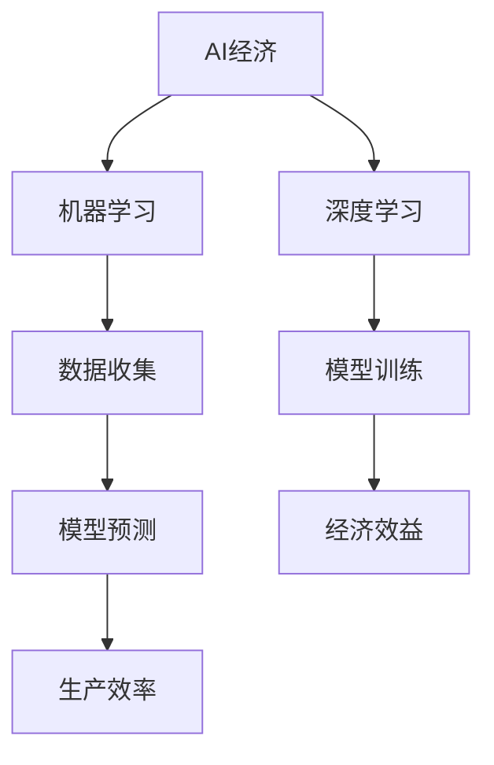
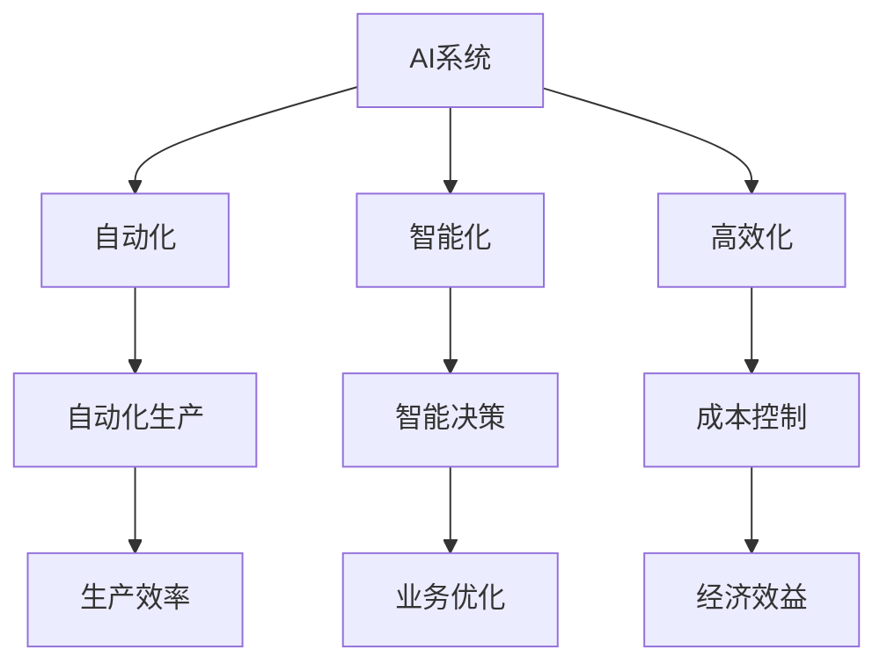

                 

# 如何在AI经济中把握商业大势

> **关键词**: AI经济、商业模式变革、行业影响、商业战略、风险管理、法律法规、创新创业

> **摘要**: 本文将深入探讨AI经济时代的商业逻辑、变革、影响、战略、风险、法律法规以及创新创业，帮助读者把握AI经济大势，制定适应未来的商业策略。

## 第一部分: AI经济时代的商业逻辑理解

### 第1章: AI经济的概念与特点

#### 1.1 AI经济的定义

AI经济，即基于人工智能技术驱动的经济模式，通过机器学习、深度学习等算法提高生产效率和经济效益。AI经济不仅改变了传统产业的生产方式，还催生了全新的商业模式和生态系统。

**概念解释**:
- **AI经济**: 利用人工智能技术进行生产、分配、交换和消费的经济形态。
- **机器学习**: 通过数据训练模型，使计算机具备自我学习和预测能力。
- **深度学习**: 一种特殊的机器学习技术，模仿人脑结构和功能，用于处理大规模数据。

**Mermaid流程图**:



#### 1.2 AI经济的特点

AI经济具有以下核心特点：

- **自动化**: 通过自动化技术减少人工干预，提高生产效率。
- **智能化**: 利用智能算法优化决策过程，提高业务智能化水平。
- **高效化**: 通过优化流程、降低成本、提高质量，实现经济效益最大化。

**架构原理**:



### 第2章: AI对商业模式的变革

#### 2.1 AI驱动的新商业模式

AI技术正在改变传统的商业模式，为各行业带来了新的机遇和挑战。以下是一些典型的AI驱动的新商业模式：

- **电子商务**: 利用AI技术进行个性化推荐、智能客服等，提升用户体验和转化率。
- **在线教育**: AI技术可以提供个性化学习路径、自动评分和智能教学等。
- **医疗健康**: AI技术在医疗影像分析、诊断辅助、智能药物研发等方面具有巨大潜力。
- **金融科技**: AI技术可以用于风险管理、信用评估、智能投顾等。

**案例解析**:

**案例一：阿里巴巴的电商模式变革**

- **背景**：阿里巴巴通过AI技术对电商业务进行优化。
- **措施**：引入个性化推荐系统、智能客服等。
- **效果**：提升了用户购物体验和转化率，实现了业务的快速增长。

**案例二：IBM的Watson健康平台**

- **背景**：IBM开发Watson健康平台，利用AI技术进行疾病诊断和药物研发。
- **措施**：结合医疗影像、基因数据等，提供精准的疾病诊断和治疗方案。
- **效果**：提升了医疗效率，降低了误诊率，取得了显著的商业成功。

### 第3章: AI对行业影响的深度分析

#### 3.1 制造业的AI应用

AI技术在制造业中的应用，主要体现在自动化生产、预测维护等方面。

- **AI在制造中的应用**:
  - **自动化生产**: 利用机器人、自动化设备等实现生产流程的自动化。
  - **预测维护**: 通过对设备运行数据的分析，预测设备故障并进行预防性维护。

**伪代码**:

```plaintext
function PredictiveMaintenance(data):
    1. 数据预处理
    2. 训练机器学习模型
    3. 预测设备故障
    4. 提前维护
    5. 提高生产效率
```

**案例解析**:

**案例一：德国工业4.0**

- **背景**：德国提出工业4.0战略，旨在通过AI技术实现制造业的智能化转型。
- **措施**：建设智能工厂，采用自动化设备和预测维护技术。
- **效果**：提高了生产效率，降低了维护成本。

#### 3.2 零售业的AI应用

AI技术在零售业的应用，主要体现在个性化推荐、库存管理等方面。

- **AI在零售中的应用**:
  - **个性化推荐**: 根据用户历史购买行为和偏好，推荐相应的商品。
  - **库存管理**: 通过对销售数据和分析，预测库存需求，优化库存配置。

**数学模型和公式**:

$$
推荐算法 = \frac{用户历史行为 \times 商品属性}{相似用户行为 \times 不同商品属性}
$$

**举例说明**:

- **用户A**的历史购买行为：购买过智能手机、平板电脑等电子产品。
- **商品B**的属性：智能手机、平板电脑。
- **相似用户C**的行为：购买过类似的电子产品。
- **推荐算法**：根据用户A的历史行为和商品B的属性，为用户A推荐智能手机和平板电脑。

**案例解析**:

**案例一：亚马逊的个性化推荐系统**

- **背景**：亚马逊利用AI技术，为用户提供个性化推荐。
- **措施**：分析用户的历史购买记录和浏览行为，实现精准推荐。
- **效果**：提升了用户购物体验和转化率，增加了销售额。

## 第二部分: 实战指南

### 第8章: AI项目的启动与实施

#### 8.1 AI项目启动流程

AI项目的启动需要经过以下步骤：

1. **项目规划**：明确项目目标、范围、时间、资源等。
2. **需求分析**：与客户沟通，了解需求，制定项目需求文档。
3. **技术选型**：根据项目需求，选择合适的AI技术和工具。
4. **数据准备**：收集、清洗和处理数据，为模型训练提供数据支持。
5. **模型训练**：利用数据训练机器学习模型，优化模型性能。
6. **系统集成**：将AI模型集成到现有系统中，实现业务功能。
7. **测试与部署**：进行系统测试，确保项目稳定运行。

### 第9章: AI技术的选型与应用

#### 9.1 技术选型原则

在AI项目的实施过程中，技术选型至关重要。以下是一些技术选型的原则：

1. **需求导向**：根据项目需求，选择合适的技术。
2. **性能优先**：选择性能稳定、高效的算法和技术。
3. **生态兼容**：选择与现有系统兼容的技术，降低集成难度。
4. **社区支持**：选择有良好社区支持的技术，便于问题解决。
5. **成本效益**：综合考虑技术成本和效益，选择性价比高的技术。

### 第10章: AI数据管理与隐私保护

#### 10.1 数据管理策略

AI项目的成功离不开高质量的数据支持。以下是一些数据管理的策略：

1. **数据采集**：从不同来源采集数据，确保数据的多样性和全面性。
2. **数据清洗**：处理数据中的噪声、错误和缺失值，提高数据质量。
3. **数据存储**：选择合适的存储方案，确保数据的安全和可扩展性。
4. **数据预处理**：对数据进行特征提取、归一化等处理，为模型训练做好准备。
5. **数据安全**：采用加密、访问控制等技术，确保数据隐私和安全。

### 第11章: AI项目的运营与优化

#### 11.1 运营策略

AI项目的运营包括以下几个方面：

1. **监控系统**：建立监控系统，实时监测系统运行状态，发现潜在问题。
2. **日志分析**：分析系统日志，了解系统运行情况，优化系统性能。
3. **版本更新**：定期更新系统版本，修复漏洞，提升系统稳定性。
4. **用户反馈**：收集用户反馈，优化产品功能和用户体验。
5. **持续学习**：利用用户数据，持续优化模型，提升系统智能水平。

### 第12章: AI项目成功案例分析

#### 12.1 成功案例分析

以下是一些AI项目的成功案例：

**案例一：谷歌的自动驾驶技术**

- **背景**：谷歌通过AI技术，开发了自动驾驶汽车。
- **措施**：利用深度学习、计算机视觉等技术，实现车辆自主驾驶。
- **效果**：提高了交通效率，降低了交通事故发生率。

**案例二：腾讯的AI医疗平台**

- **背景**：腾讯利用AI技术，打造了AI医疗平台。
- **措施**：结合医学影像、病例数据等，提供疾病诊断和治疗方案。
- **效果**：提升了医疗效率，降低了误诊率。

## 第三部分: 展望与未来

### 第13章: AI经济的发展趋势

#### 13.1 未来趋势预测

AI经济的发展趋势如下：

1. **产业智能化**: 制造业、服务业等领域将加速智能化转型。
2. **跨界融合**: 各行业将深度融合AI技术，形成新的商业生态。
3. **数据驱动**: 数据将成为企业核心资产，数据价值将不断提升。
4. **伦理与法规**: 随着AI技术的发展，伦理和法规问题将日益突出。
5. **国际化**: AI技术将加速全球化，各国将共同推动AI技术的发展。

### 第14章: AI时代的就业与教育

#### 14.1 AI时代的就业变革

AI技术将深刻影响就业市场，带来以下变革：

1. **新职业崛起**: 数据科学家、AI工程师等新兴职业将逐渐崛起。
2. **岗位变化**: 传统岗位将逐渐被智能化替代，新型岗位将出现。
3. **就业压力**: AI技术将提高生产效率，可能导致部分就业岗位减少。
4. **技能提升**: 就业者需要不断提升技能，适应AI时代的要求。

### 第15章: AI经济的全球化

#### 15.1 全球化挑战与机遇

AI经济在全球范围内的挑战与机遇如下：

1. **技术竞争**: 各国纷纷加大AI技术研发力度，形成技术竞争格局。
2. **数据跨境**: 数据跨境流动将面临隐私保护和数据安全的挑战。
3. **国际合作**: 各国需要加强合作，共同推动AI技术的发展和应用。
4. **市场机遇**: AI技术将带动全球经济增长，创造新的市场机遇。

### 附录

#### 附录A: AI经济相关的资源与工具

**A.1 资源与工具列表**

1. **书籍**:
   - 《深度学习》（Goodfellow et al.）
   - 《Python机器学习》（Sebastian Raschka）
   - 《AI超级思维：人工智能时代，如何成为不可替代的自己》（李开复）
2. **网站**:
   - [Kaggle](https://www.kaggle.com/)
   - [TensorFlow](https://www.tensorflow.org/)
   - [PyTorch](https://pytorch.org/)
3. **数据库**:
   - [UCI机器学习库](https://archive.ics.uci.edu/ml/index.php)
   - [Google Dataset Search](https://datasetsearch.research.google.com/)
4. **在线课程**:
   - [Coursera](https://www.coursera.org/)
   - [edX](https://www.edx.org/)
   - [Udacity](https://www.udacity.com/)

#### 附录B: AI项目的开发指南

**B.1 开发指南**

1. **开发环境搭建**:
   - 安装Python和必要的库（如NumPy、Pandas、TensorFlow等）。
   - 配置Jupyter Notebook或PyCharm等开发环境。
2. **源代码实现**:
   - 设计模型架构，编写模型代码。
   - 进行数据预处理，编写数据处理代码。
   - 实现训练、评估和预测等步骤。
3. **代码解读与分析**:
   - 详细解读模型代码，解释每一步的作用和原理。
   - 分析模型性能，提供优化建议。

## 结语

AI经济正在改变我们的世界，带来前所未有的机遇和挑战。本文从多个角度探讨了AI经济的特点、影响、战略和实战指南，旨在帮助读者把握AI经济大势，制定适应未来的商业策略。让我们共同迎接AI时代的到来，把握机遇，共创美好未来。

### 作者

- **作者：AI天才研究院/AI Genius Institute & 禅与计算机程序设计艺术 /Zen And The Art of Computer Programming**

