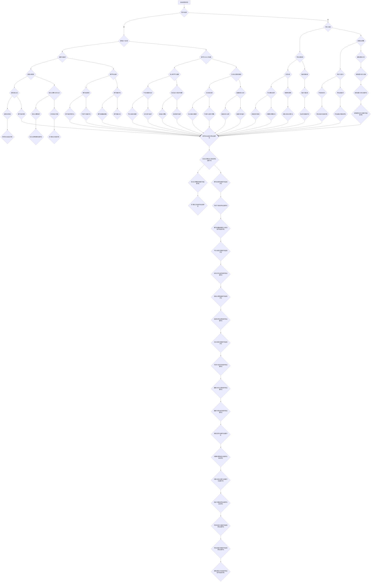

                 

### 《如何将编程技能转化为线上编程训练营》

> **关键词：** 编程技能、线上编程训练营、教学策略、课程设计、市场营销、技术支持

> **摘要：** 本文将深入探讨如何将个人编程技能转化为线上编程训练营，通过系统化的步骤，从技能评估、课程设计、实施与营销，到技术支持与案例分享，全面解析线上编程训练营的构建与运营之道。

### 《如何将编程技能转化为线上编程训练营》目录大纲

#### 第一部分：背景与基础

**第1章：编程训练营概述**

1.1 编程训练营的意义与价值

1.1.1 编程教育的发展趋势

1.1.2 线上编程训练营的优势

1.1.3 线上编程训练营的市场需求

1.2 编程技能与教学方法的联系

1.2.1 编程技能的类型与层次

1.2.2 编程教学方法的重要性

1.2.3 编程教学方法的多样性

1.3 线上编程训练营的发展现状

1.3.1 线上编程训练营的主要模式

1.3.2 成功案例与经验分享

1.3.3 线上编程训练营面临的挑战

#### 第二部分：技能转化与实践

**第2章：编程技能自我评估与提升**

2.1 编程技能自我评估

2.1.1 编程技能评估的方法

2.1.2 编程技能自我评估示例

2.1.3 自我评估结果分析与提升方案

2.2 编程技能提升策略

2.2.1 编程技能提升的路径

2.2.2 常见编程技能提升方法

2.2.3 实战项目提升编程技能

2.3 编程训练营课程设计

2.3.1 课程设计的原则

2.3.2 课程内容规划

2.3.3 教学方法与工具选择

**第3章：线上编程训练营课程实施**

3.1 编程训练营的运营管理

3.1.1 编程训练营的策划与组织

3.1.2 教师团队的建设与管理

3.1.3 学员管理与学员反馈

3.2 课程内容与教学方法

3.2.1 课程内容的组织与安排

3.2.2 教学方法的运用

3.2.3 教学资源的利用与整合

3.3 课程评估与改进

3.3.1 课程评估的方法

3.3.2 学员反馈的处理

3.3.3 课程改进的策略

#### 第三部分：营销策略与案例分析

**第4章：线上编程训练营营销策略**

4.1 市场分析与定位

4.1.1 市场需求分析

4.1.2 目标客户定位

4.1.3 竞争对手分析

4.2 营销渠道与推广

4.2.1 线上营销渠道

4.2.2 社交媒体营销

4.2.3 活动策划与执行

4.3 用户增长与维护

4.3.1 用户增长策略

4.3.2 用户参与度提升

4.3.3 用户关系管理

**第5章：线上编程训练营技术支持**

5.1 教学平台搭建

5.1.1 平台选择与搭建

5.1.2 功能模块设计与实现

5.1.3 系统安全与稳定性保障

5.2 互动与反馈机制

5.2.1 互动功能设计

5.2.2 反馈机制建设

5.2.3 数据分析与优化

5.3 技术支持与维护

5.3.1 技术支持团队建设

5.3.2 故障排查与解决

5.3.3 系统升级与优化

**第6章：案例分析与实践总结**

6.1 成功案例分析

6.1.1 案例选取与介绍

6.1.2 案例分析

6.1.3 案例启示

6.2 实践经验与教训

6.2.1 编程训练营实施中的问题与对策

6.2.2 营销策略调整与优化

6.2.3 技术支持与平台建设的经验总结

6.3 未来发展趋势与展望

6.3.1 线上编程训练营的发展趋势

6.3.2 教育技术的创新与融合

6.3.3 编程技能在未来的重要性

#### 第三部分：附录

**第7章：编程训练营资源与工具**

7.1 编程学习资源推荐

7.1.1 在线编程学习平台

7.1.2 编程教程与书籍推荐

7.1.3 编程工具与软件推荐

7.2 线上编程训练营案例集

7.2.1 案例一：某知名编程训练营介绍

7.2.2 案例二：某初创编程训练营经验分享

7.2.3 案例三：某高校编程训练营案例

7.3 附录参考资料

7.3.1 参考文献

7.3.2 相关网站与论坛推荐

7.3.3 编程社群与组织介绍

### 第一部分：背景与基础

#### 第1章：编程训练营概述

编程训练营作为一种新兴的教育模式，旨在通过集中的培训和实战项目，帮助学习者快速提升编程技能。随着互联网技术的发展和在线教育的普及，编程训练营逐渐从线下转移到了线上，形成了线上编程训练营这一独特的形式。本章将介绍编程训练营的意义与价值、编程技能与教学方法的联系、线上编程训练营的发展现状以及面临的挑战。

### 1.1 编程训练营的意义与价值

编程训练营具有以下几个方面的意义与价值：

1. **培养编程兴趣与自信心**

   编程训练营通过系统化的课程和实战项目，帮助学习者从零基础开始，逐步掌握编程技能。这种学习过程不仅能够培养学习者的编程兴趣，还能增强他们的自信心。

2. **提升编程技能与就业竞争力**

   编程训练营的课程内容通常与实际工作需求紧密相关，能够帮助学习者掌握当前市场需求的编程技能。通过训练营的学习，学员能够提升自己的技术水平，增强在就业市场上的竞争力。

3. **激发创新思维与团队协作能力**

   编程训练营常常以项目制的方式展开，学员需要在项目中解决问题和完成任务。这种学习模式不仅能够激发学员的创新思维，还能培养他们的团队协作能力。

4. **提供职业发展路径与机会**

   编程训练营通常会为学员提供一定的职业发展路径，例如推荐就业、实习机会等。这为学员的职业生涯发展提供了更多的选择和机会。

#### 1.1.1 编程教育的发展趋势

随着计算机技术的飞速发展，编程教育逐渐成为各个年龄段学习者的热门选择。以下是编程教育的一些发展趋势：

1. **从兴趣驱动向职业导向转变**

   早期的编程教育更多是以兴趣为导向，强调编程本身的学习。而现在的编程教育更加注重职业导向，将编程技能与就业需求紧密结合。

2. **从知识传授向能力培养转变**

   传统的编程教育更注重知识的传授，而现代的编程教育更注重能力的培养，强调实战能力的提升。

3. **从线下教育向线上教育转变**

   线上教育的普及为编程教育提供了新的可能性，编程训练营逐渐从线下转移到了线上，为学习者提供了更加灵活和便捷的学习方式。

#### 1.1.2 线上编程训练营的优势

线上编程训练营具有以下优势：

1. **灵活的学习时间**

   学员可以根据自己的时间安排进行学习，无需受制于固定的上课时间。

2. **广泛的课程选择**

   线上编程训练营提供了丰富的课程选择，学员可以根据自己的兴趣和需求选择相应的课程。

3. **低廉的学习成本**

   相较于线下编程训练营，线上编程训练营的学习成本更低，学员可以以更低的价格获得高质量的教育资源。

4. **互动与交流**

   线上编程训练营提供了丰富的互动和交流机会，学员可以通过论坛、直播等方式与其他学员和讲师进行交流和讨论。

#### 1.1.3 线上编程训练营的市场需求

随着编程教育的普及和就业市场的变化，线上编程训练营的市场需求持续增长。以下是线上编程训练营的主要市场需求：

1. **求职需求**

   随着技术的不断发展，越来越多的企业需要具备编程技能的员工。因此，许多求职者希望通过线上编程训练营提升自己的编程技能，增强就业竞争力。

2. **职业转型**

   随着人工智能、大数据等新兴技术的发展，许多从事传统职业的人希望通过学习编程实现职业转型。线上编程训练营为他们提供了实现职业转型的机会。

3. **兴趣培养**

   许多对编程感兴趣的人希望通过线上编程训练营学习编程知识，培养自己的编程兴趣。

#### 1.2 编程技能与教学方法的联系

编程技能是线上编程训练营的核心内容，而教学方法是实现教学目标的关键。以下是编程技能与教学方法的联系：

1. **编程技能的类型与层次**

   编程技能可以分为基础编程技能、高级编程技能和专项编程技能。不同层次的编程技能需要不同的教学方法。

2. **教学方法的多样性**

   教学方法应多样化，包括理论讲解、实战项目、互动讨论等。不同的教学方法能够满足不同类型和层次的学习需求。

3. **教学方法的选用**

   教学方法的选用应根据课程内容、学习目标和学员特点进行。例如，对于零基础学员，可以采用更加基础和简单的教学方法；对于有经验的学员，可以采用更加高级和复杂的教学方法。

#### 1.3 线上编程训练营的发展现状

线上编程训练营在全球范围内得到了迅速发展，以下是线上编程训练营的发展现状：

1. **主要模式**

   线上编程训练营的主要模式包括付费课程、免费课程和混合课程。其中，付费课程占主导地位，为学员提供了高质量的教育资源。

2. **成功案例与经验分享**

   许多线上编程训练营取得了显著的成功，为学员提供了优质的教育服务。以下是几个成功的线上编程训练营案例：

   - **某知名在线编程平台**：该平台提供了丰富的编程课程，吸引了大量学员报名学习。通过严格的教学管理和优质的课程内容，该平台取得了巨大的成功。

   - **某初创编程训练营**：该训练营通过创新的课程设计和实战项目，为学员提供了独特的学习体验。在短时间内，该训练营吸引了大量的学员，并在市场上获得了良好的口碑。

3. **面临的挑战**

   尽管线上编程训练营取得了显著的成功，但也面临着一些挑战：

   - **教学质量的保障**：线上编程训练营需要确保教学质量的稳定性，避免因教学质量问题导致的学员流失。

   - **市场竞争力**：随着越来越多的线上编程训练营进入市场，竞争日益激烈。如何提升课程质量和市场竞争力成为线上编程训练营面临的挑战。

   - **技术支持**：线上编程训练营需要提供稳定的技术支持，确保学员能够顺畅地进行学习。

### 第二部分：技能转化与实践

#### 第2章：编程技能自我评估与提升

在将个人编程技能转化为线上编程训练营的过程中，自我评估与提升是至关重要的一环。通过自我评估，可以了解自己的编程水平和薄弱环节，从而有针对性地进行提升。本章将介绍编程技能自我评估的方法、编程技能提升策略以及编程训练营课程设计。

### 2.1 编程技能自我评估

自我评估是编程技能提升的第一步，通过自我评估可以了解自己的编程水平和能力。以下是编程技能自我评估的方法：

1. **基础知识评估**

   基础知识评估主要包括编程语言基础知识、数据结构和算法等。可以通过完成相关的在线测试或习题来评估自己的基础知识。

2. **实战项目评估**

   实战项目评估是通过完成实际的编程项目来评估自己的编程能力。可以从开源项目、个人项目或在线编程挑战中选取项目进行评估。

3. **社区参与评估**

   社区参与评估是通过参与编程社区的活动、回答问题和分享经验来评估自己的编程能力。可以通过参与技术论坛、博客、GitHub等社区来提升自己的编程能力。

#### 2.1.1 编程技能评估的方法

以下是几种常见的编程技能评估方法：

1. **在线编程考试**

   在线编程考试是一种通过在线平台进行编程测试的方法。考试内容通常包括编程语言基础知识、算法和数据结构等。通过在线编程考试可以快速评估自己的编程水平。

2. **项目挑战**

   项目挑战是一种通过完成实际项目来评估编程能力的方法。项目挑战通常涉及实际问题解决，要求在规定时间内完成。通过项目挑战可以了解自己的实战能力和问题解决能力。

3. **编程竞赛**

   编程竞赛是一种通过比赛形式评估编程能力的方法。编程竞赛通常涉及复杂的问题解决和算法设计，通过竞赛可以锻炼编程技能和团队协作能力。

#### 2.1.2 编程技能自我评估示例

以下是一个编程技能自我评估的示例：

1. **基础知识评估**

   - 编程语言基础知识：了解 C、Python、Java 等编程语言的基本语法和用法。

   - 数据结构：了解数组、链表、栈、队列、树等数据结构的基本概念和实现方法。

   - 算法：了解排序、查找、图算法等基本算法的基本概念和实现方法。

2. **实战项目评估**

   - 完成一个简单的网站制作项目，要求使用 HTML、CSS 和 JavaScript 进行网页设计。

   - 完成一个简单的数据分析项目，要求使用 Python 进行数据处理和可视化。

3. **社区参与评估**

   - 在技术论坛上回答了 10 个编程相关问题。

   - 在 GitHub 上提交了 5 个开源项目的贡献。

通过以上评估，可以初步了解自己的编程技能水平和薄弱环节，从而制定有针对性的提升方案。

#### 2.1.3 自我评估结果分析与提升方案

根据自我评估结果，可以分析出自己的编程技能优势和不足，并制定相应的提升方案。以下是自我评估结果分析和提升方案：

1. **优势分析**

   - 编程语言基础知识扎实，了解多种编程语言的语法和用法。

   - 对数据结构和算法有一定了解，能够实现基本的排序、查找和图算法。

   - 具有良好的实战项目经验和社区参与度，能够在实际项目中解决问题和分享经验。

2. **不足分析**

   - 在编程语言高级特性方面了解较少，需要深入学习。

   - 在算法优化和复杂问题解决方面经验不足，需要加强实战练习。

   - 在社区互动和开源项目贡献方面还有提升空间，需要积极参与。

3. **提升方案**

   - 学习编程语言高级特性，如面向对象编程、并发编程等。

   - 加强算法实战练习，解决复杂问题，提高算法优化能力。

   - 积极参与编程社区，回答问题、分享经验和贡献开源项目。

通过以上提升方案，可以逐步提升自己的编程技能，为后续的编程训练营课程设计打下坚实基础。

### 2.2 编程技能提升策略

编程技能提升是一个持续的过程，需要制定有效的提升策略。以下是几种常见的编程技能提升策略：

1. **深入学习编程语言**

   学习编程语言是提升编程技能的基础。通过深入学习编程语言的高级特性和常用库，可以更好地掌握编程语言，提高编程效率。

2. **掌握数据结构和算法**

   数据结构和算法是编程的核心，通过掌握常用的数据结构和算法，可以提高代码质量和解决复杂问题的能力。

3. **参与实战项目**

   实战项目是提升编程技能的有效途径。通过参与实际项目，可以锻炼问题解决能力和团队协作能力，提高编程实战能力。

4. **学习新技术和趋势**

   随着技术的不断发展，新技术和趋势层出不穷。通过学习新技术和趋势，可以保持编程技能的先进性和竞争力。

5. **参与社区和开源项目**

   参与社区和开源项目可以提升编程技能，扩大视野，结识志同道合的朋友。通过回答问题、分享经验和贡献开源项目，可以不断提高自己的编程能力。

#### 2.2.1 编程技能提升的路径

编程技能提升的路径可以分为以下几个阶段：

1. **基础阶段**

   在这个阶段，主要任务是掌握编程语言的基础语法和用法，了解常用的数据结构和算法。可以通过参加线上编程课程、阅读相关书籍和编写简单程序来提升技能。

2. **进阶阶段**

   在这个阶段，主要任务是深入学习编程语言的高级特性和常用库，掌握更复杂的数据结构和算法。可以通过阅读高级编程书籍、参加实战项目和解决复杂问题来提升技能。

3. **实战阶段**

   在这个阶段，主要任务是参与实际项目，将所学知识应用于实际工作中。可以通过实习、兼职或参与开源项目来提升实战能力。

4. **专家阶段**

   在这个阶段，主要任务是保持对新技术和趋势的关注，不断学习和提升自己的编程技能。可以通过阅读技术文章、参加技术会议和培训来保持竞争力。

#### 2.2.2 常见编程技能提升方法

以下是几种常见的编程技能提升方法：

1. **在线学习平台**

   在线学习平台提供了丰富的编程课程和资源，可以通过在线学习平台学习编程知识。常见的在线学习平台包括 Coursera、edX、Udemy 等。

2. **书籍阅读**

   阅读编程书籍是提升编程技能的有效方法。选择合适的编程书籍，可以系统地学习编程知识。常见的编程书籍包括《编程珠玑》、《算法导论》等。

3. **实战项目**

   实战项目是提升编程技能的最佳途径。通过实际项目的开发，可以锻炼编程技能，解决实际问题。可以选择自己感兴趣的项目，或参与开源项目。

4. **编程社区**

   编程社区提供了交流和学习的平台，可以在社区中学习他人的编程经验，解决问题，分享经验。常见的编程社区包括 Stack Overflow、GitHub 等。

5. **参加培训课程**

   参加专业的编程培训课程，可以系统地学习编程知识，获得专业的指导和反馈。常见的编程培训课程包括 Codecademy、Bootstrap 等。

#### 2.2.3 实战项目提升编程技能

实战项目是提升编程技能的有效方法，通过实际项目的开发，可以锻炼编程技能，积累经验。以下是如何通过实战项目提升编程技能的建议：

1. **选择合适的项目**

   选择与自己兴趣和技能水平相符的项目，可以更好地投入项目开发，提高学习效果。可以选择个人项目、团队项目或参与开源项目。

2. **制定项目计划**

   在项目开始前，制定详细的项目计划，包括项目目标、任务分配、时间安排等。这有助于确保项目有序进行，提高开发效率。

3. **学习相关技术**

   在项目开发过程中，需要学习相关技术，如编程语言、框架、数据库等。可以通过在线学习平台、书籍和社区等途径学习技术。

4. **编码与调试**

   在项目开发过程中，编写高质量的代码，进行调试和优化。这有助于提高编程技能，提高代码质量。

5. **团队合作**

   如果是团队项目，需要与团队成员进行良好的沟通和协作，共同完成项目。这有助于提高团队合作能力，培养团队精神。

6. **项目总结与反思**

   在项目完成后，进行项目总结和反思，总结经验教训，发现问题并加以改进。这有助于不断提高编程技能，为后续项目做好准备。

### 2.3 编程训练营课程设计

编程训练营课程设计是构建线上编程训练营的关键环节，一个优秀的课程设计能够帮助学员系统化地提升编程技能。以下是编程训练营课程设计的原则、内容规划和教学方法与工具选择。

#### 2.3.1 课程设计的原则

编程训练营课程设计应遵循以下原则：

1. **目标明确**

   课程设计应明确教学目标，包括知识目标、能力目标和素质目标。教学目标应与学员的职业发展和兴趣相结合，确保课程具有实际应用价值。

2. **系统化**

   课程设计应系统化，遵循知识逻辑和技能进阶的顺序，确保学员能够逐步掌握编程技能，形成完整的知识体系。

3. **实践导向**

   课程设计应以实践为导向，通过实际项目开发、编程练习和案例分析，使学员能够在真实场景中应用所学知识，提高实战能力。

4. **灵活多样**

   课程设计应灵活多样，结合线上教学的特点，提供多样化的学习资源和教学方式，满足不同学员的学习需求。

5. **反馈及时**

   课程设计应注重反馈机制，通过学员反馈、讲师点评和项目评估，及时了解学员的学习效果，调整教学策略，提高教学质量。

#### 2.3.2 课程内容规划

课程内容规划是课程设计的重要环节，以下是一个典型的编程训练营课程内容规划：

1. **基础课程**

   - 编程语言基础
   - 数据结构与算法
   - 编程基础实践

2. **进阶课程**

   - 高级编程语言特性
   - 数据库与SQL
   - 网络编程基础

3. **实战项目**

   - 小型项目开发
   - 中型项目开发
   - 大型项目开发

4. **选修课程**

   - 现代编程技术
   - 人工智能与大数据
   - 软件工程方法

5. **实战演练**

   - 编程练习
   - 代码审查
   - 项目答辩

6. **课程资源**

   - 课程视频
   - 课程文档
   - 练习题库
   - 开源项目案例

#### 2.3.3 教学方法与工具选择

教学方法和工具的选择直接影响课程的教学效果。以下是一些常用的教学方法和工具：

1. **教学方法**

   - 讲授法：通过讲师讲解，传授理论知识。
   - 演示法：通过现场演示，展示编程实践。
   - 实践法：通过编程练习和项目开发，提高实战能力。
   - 讨论法：通过学员互动和讨论，加深对知识的理解。

2. **教学工具**

   - 教学平台：用于课程内容发布、作业提交和在线互动。
   - 编程环境：用于编写和调试代码，如 VS Code、PyCharm 等。
   - 代码库：用于存储和共享项目代码，如 GitHub。
   - 教学视频：用于记录课程讲解和实战演示。
   - 电子文档：用于发布课程资料和练习题。

### 第三部分：线上编程训练营课程实施

#### 第3章：线上编程训练营课程实施

在线上编程训练营中，课程的实施是关键环节，它关系到学员的学习体验和学习效果。本章将介绍编程训练营的运营管理、课程内容与教学方法，以及课程评估与改进。

### 3.1 编程训练营的运营管理

运营管理是确保编程训练营顺利开展和取得预期效果的基础。以下是编程训练营运营管理的几个关键方面：

#### 3.1.1 编程训练营的策划与组织

编程训练营的策划与组织是课程实施的第一步，需要考虑以下几个方面：

1. **课程定位**

   确定训练营的目标受众、课程难度和课程内容，以便满足不同层次学员的需求。

2. **课程时长**

   根据课程内容和学习目标的复杂程度，规划课程的时长，包括课程的总课时、每周课时和每节课的时长。

3. **课程大纲**

   制定详细的课程大纲，明确每节课的教学内容、教学目标和教学方法。

4. **教师团队**

   组建一支具备教学经验和行业背景的教师团队，确保课程质量和学员的学习体验。

#### 3.1.2 教师团队的建设与管理

教师团队的建设与管理是运营管理的重要组成部分，需要关注以下几个方面：

1. **教师招聘**

   招聘具有教学经验和实际项目经验的教师，确保教师团队的专业性和多样性。

2. **教师培训**

   定期对教师进行培训，提升他们的教学技能和行业知识，确保教学内容的更新和课程设计的创新。

3. **教师评价**

   建立教师评价机制，根据学员反馈、课程完成度和教学质量对教师进行评估，激励教师不断提升教学质量。

4. **教师激励**

   设计合理的教师激励机制，包括绩效奖励、职称晋升等，提高教师的积极性和责任感。

#### 3.1.3 学员管理与学员反馈

学员管理是确保学员顺利学习和取得成果的关键，以下是一些学员管理的策略：

1. **学员招募**

   通过市场调研和推广活动，吸引符合课程定位的学员，确保学员的质量和数量。

2. **学员登记**

   建立学员信息登记系统，记录学员的基本信息、学习进度和反馈意见，方便后续的管理和课程调整。

3. **学员辅导**

   提供在线辅导服务，解答学员在学习过程中遇到的问题，帮助学员克服学习困难。

4. **学员反馈**

   建立学员反馈机制，定期收集学员的学习体验和建议，及时调整课程内容和教学方法，提高学员的学习效果。

### 3.2 课程内容与教学方法

课程内容与教学方法是课程实施的核心，直接关系到学员的学习体验和学习效果。以下是课程内容与教学方法的几个关键方面：

#### 3.2.1 课程内容的组织与安排

课程内容的组织与安排是确保课程系统性和连续性的基础，以下是一些建议：

1. **知识结构**

   根据课程大纲，将课程内容划分为不同的模块，确保每个模块的知识结构完整，避免内容的重复和遗漏。

2. **教学顺序**

   按照由浅入深、循序渐进的原则，安排教学顺序，确保学员能够逐步掌握课程内容。

3. **实战案例**

   结合实际项目案例，将理论知识与实战应用相结合，提高学员的实战能力。

4. **互动环节**

   在课程中设置互动环节，如问答、讨论和实战演练，增加学员的参与度和学习兴趣。

#### 3.2.2 教学方法的运用

教学方法的运用是提高教学效果的关键，以下是一些常用的教学方法：

1. **讲授法**

   通过讲师的讲解，传授课程知识和技能。讲授法适合介绍理论知识，但需要注意控制讲解的节奏和深度。

2. **演示法**

   通过讲师的现场演示，展示编程实践和操作步骤。演示法有助于学员理解和掌握编程技能。

3. **讨论法**

   通过学员之间的互动和讨论，促进知识的交流和深化。讨论法可以提高学员的思维能力和问题解决能力。

4. **项目制学习**

   通过实际项目开发，将所学知识应用于解决实际问题。项目制学习有助于提高学员的实战能力和团队合作能力。

5. **在线互动**

   利用在线平台和工具，进行实时互动和答疑，确保学员在学习过程中能够及时解决问题。

#### 3.2.3 教学资源的利用与整合

教学资源的利用与整合是提高教学质量和效果的重要手段，以下是一些建议：

1. **多媒体资源**

   利用视频、图片、文档等多种媒体资源，丰富教学内容的呈现形式，提高学员的学习兴趣。

2. **在线平台**

   利用在线教学平台，提供课程视频、文档、练习题和互动功能，方便学员的学习和交流。

3. **开源项目**

   引入开源项目，供学员参考和实践，拓展学员的知识视野和编程经验。

4. **社区资源**

   利用编程社区和论坛，收集和分享教学资源，促进教学资源的共享和更新。

### 3.3 课程评估与改进

课程评估与改进是确保编程训练营持续改进和提升教学质量的重要环节，以下是一些课程评估与改进的策略：

#### 3.3.1 课程评估的方法

课程评估的方法包括以下几个方面：

1. **学员反馈**

   通过问卷调查、在线讨论和访谈等方式，收集学员对课程内容和教学方法的反馈，了解学员的学习体验和需求。

2. **课程完成度**

   通过统计学员的课程完成度，评估学员的学习进度和参与度，发现教学中的问题。

3. **作业质量**

   通过评估学员的作业质量，了解学员对课程内容的掌握程度和实际应用能力。

4. **考试成绩**

   通过课程考试的成绩，评估学员对课程内容的理解和掌握程度。

#### 3.3.2 学员反馈的处理

学员反馈的处理是课程评估的重要环节，以下是一些建议：

1. **及时反馈**

   及时收集和回复学员的反馈，了解学员的困惑和问题，提供针对性的帮助。

2. **问题分析**

   分析学员反馈中提到的问题，找出教学中的不足，制定改进措施。

3. **课程调整**

   根据学员反馈，调整课程内容和方法，优化教学设计，提高教学质量。

4. **持续改进**

   建立持续改进机制，定期评估课程效果，不断优化和改进课程设计和教学方法。

#### 3.3.3 课程改进的策略

课程改进的策略包括以下几个方面：

1. **内容更新**

   定期更新课程内容，引入新技术和新趋势，确保课程内容的先进性和实用性。

2. **教学方法优化**

   不断优化教学方法，结合学员反馈，调整教学策略，提高教学效果。

3. **教学资源整合**

   整合各类教学资源，丰富教学内容，提高学员的学习兴趣和参与度。

4. **教师培训**

   定期对教师进行培训，提升教学技能和知识水平，确保教学质量的持续提升。

### 第三部分：营销策略与案例分析

#### 第4章：线上编程训练营营销策略

线上编程训练营的成功离不开有效的营销策略。本章将介绍如何进行市场分析与定位、营销渠道与推广策略以及用户增长与维护。

### 4.1 市场分析与定位

市场分析与定位是线上编程训练营营销策略的基础，以下是市场分析与定位的关键步骤：

#### 4.1.1 市场需求分析

1. **目标受众**

   确定训练营的目标受众，如求职者、职业转型者、编程爱好者等。

2. **需求调研**

   通过问卷调查、访谈等方式，了解目标受众的编程水平、学习需求、职业目标等。

3. **竞争分析**

   分析同类型训练营的市场情况，了解竞争对手的课程内容、价格、口碑等。

#### 4.1.2 目标客户定位

1. **细分市场**

   根据市场需求分析，细分目标客户群体，如初级学员、中级学员、高级学员等。

2. **客户画像**

   建立目标客户的画像，包括年龄、性别、职业、学习习惯等。

3. **需求匹配**

   确保训练营的课程内容、教学方法和营销策略与目标客户的需求相匹配。

#### 4.1.3 竞争对手分析

1. **竞争对手调研**

   收集竞争对手的课程、价格、口碑、用户评价等数据。

2. **优势与劣势分析**

   分析竞争对手的优势和劣势，找出自身训练营的差异化优势。

3. **定位策略**

   根据竞争对手分析，制定训练营的市场定位策略，如价格优势、内容创新、用户体验等。

### 4.2 营销渠道与推广

营销渠道与推广是吸引潜在学员的重要手段，以下是线上编程训练营常用的营销渠道与推广策略：

#### 4.2.1 线上营销渠道

1. **搜索引擎优化（SEO）**

   通过优化网站内容、关键词排名等，提高训练营在搜索引擎中的曝光度。

2. **社交媒体推广**

   利用微博、微信、抖音等社交媒体平台，发布课程信息、学员故事、行业动态等，吸引潜在学员。

3. **内容营销**

   发布高质量的博客文章、教程、视频等，提高训练营的权威性和吸引力。

4. **广告投放**

   在各大在线教育平台、技术论坛、社交媒体等投放广告，扩大训练营的知名度。

#### 4.2.2 社交媒体营销

1. **平台选择**

   根据目标客户的特点，选择合适的社交媒体平台，如程序员社区、技术博客等。

2. **内容策略**

   制定社交媒体内容策略，包括教学分享、学员成果展示、行业动态等。

3. **互动策略**

   与用户互动，解答疑问，收集反馈，提高用户参与度和忠诚度。

4. **合作推广**

   与行业专家、知名博主、教育机构等合作，共同推广训练营。

#### 4.2.3 活动策划与执行

1. **主题活动**

   定期举办主题活动，如编程大赛、免费公开课、学习讲座等，提高用户参与度。

2. **线下活动**

   组织线下活动，如编程沙龙、技术交流会议等，增强与学员的互动。

3. **优惠活动**

   推出优惠活动，如限时折扣、团购优惠等，吸引更多学员报名。

4. **合作伙伴**

   与相关机构、企业建立合作关系，共同举办活动，扩大训练营的影响力。

### 4.3 用户增长与维护

用户增长与维护是线上编程训练营长期发展的关键，以下是用户增长与维护的策略：

#### 4.3.1 用户增长策略

1. **精准推广**

   根据用户画像，进行精准推广，提高广告投放的ROI。

2. **口碑营销**

   通过学员的成功案例、优秀作品等，形成良好的口碑，吸引更多学员。

3. **用户推荐**

   设计用户推荐机制，鼓励学员推荐新学员，提高用户增长率。

4. **课程迭代**

   不断迭代课程内容，满足用户需求，提高课程的市场竞争力。

#### 4.3.2 用户参与度提升

1. **互动环节**

   在课程中设置互动环节，如讨论区、问答环节等，增加学员的参与度。

2. **社群运营**

   建立学员社群，定期举办线上活动，提高学员的互动和粘性。

3. **学员激励**

   设计学员激励机制，如优秀学员评选、奖学金等，鼓励学员积极参与。

4. **个性化服务**

   提供个性化服务，如定制化课程、一对一辅导等，提高学员的学习体验。

#### 4.3.3 用户关系管理

1. **用户画像**

   建立用户画像，了解学员的兴趣、学习进度和需求，提供个性化的服务。

2. **用户反馈**

   定期收集用户反馈，了解学员的满意度和需求，不断优化产品和服务。

3. **用户关怀**

   定期向学员发送问候、学习提醒等，增进与学员的情感联系。

4. **用户留存**

   通过优化课程质量、提升服务水平和提供增值服务，提高用户留存率。

### 第四部分：线上编程训练营技术支持

#### 第5章：线上编程训练营技术支持

线上编程训练营的技术支持是确保课程顺利进行和学员学习体验的关键。本章将介绍教学平台搭建、互动与反馈机制建设以及技术支持与维护。

### 5.1 教学平台搭建

教学平台的搭建是线上编程训练营的基础工作，以下是搭建教学平台的关键步骤：

#### 5.1.1 平台选择与搭建

1. **平台选择**

   根据训练营的课程内容、学员规模和技术需求，选择合适的在线教育平台。常见的平台有Moodle、Canvas、Teachable等。

2. **平台搭建**

   根据选择好的平台，进行平台的搭建和配置，包括用户管理、课程管理、作业提交等功能。

3. **功能模块设计**

   设计教学平台的功能模块，如课程视频播放、在线互动、作业提交与批改、成绩管理、在线考试等。

#### 5.1.2 功能模块设计与实现

1. **课程视频播放**

   设计视频播放模块，支持视频上传、播放、暂停、快进等基本功能。

2. **在线互动**

   设计在线互动模块，支持实时聊天、讨论区、问答功能，增强学员间的互动。

3. **作业提交与批改**

   设计作业提交与批改模块，支持作业上传、自动评分和讲师批改功能。

4. **成绩管理**

   设计成绩管理模块，记录学员的学习进度、作业成绩和考试成绩。

5. **在线考试**

   设计在线考试模块，支持在线考试、自动评分和成绩统计。

#### 5.1.3 系统安全与稳定性保障

1. **数据安全**

   确保教学平台的数据安全，采用数据加密、防火墙等技术，防止数据泄露。

2. **系统稳定性**

   确保教学平台的稳定性，进行系统监控、负载均衡和故障排查，确保平台稳定运行。

3. **备份与恢复**

   定期备份数据，确保数据不丢失，并制定数据恢复策略，以应对突发事件。

### 5.2 互动与反馈机制

互动与反馈机制是提高学员学习体验和课程质量的重要环节，以下是互动与反馈机制的建设：

#### 5.2.1 互动功能设计

1. **实时聊天**

   设计实时聊天功能，支持讲师与学员之间的即时沟通，解答学员的问题。

2. **讨论区**

   设计讨论区功能，供学员交流和分享学习经验，促进学员间的互动。

3. **问答**

   设计问答功能，支持学员提问和讲师回答，方便学员解决学习中的问题。

#### 5.2.2 反馈机制建设

1. **学员反馈**

   设计学员反馈机制，支持学员对课程内容、教学方法、服务等方面进行评价和反馈。

2. **讲师评价**

   设计讲师评价机制，根据学员的反馈和成绩，对讲师进行评价。

3. **反馈处理**

   建立反馈处理流程，及时处理学员反馈，对问题和建议进行改进。

#### 5.2.3 数据分析与优化

1. **数据收集**

   收集教学过程中的各类数据，如学员学习行为、课程参与度、反馈信息等。

2. **数据分析**

   对收集到的数据进行分析，了解学员的学习情况、课程质量和反馈情况。

3. **优化策略**

   根据数据分析结果，制定优化策略，如调整课程内容、改进教学方法、提升服务质量等。

### 5.3 技术支持与维护

技术支持与维护是保证教学平台正常运行和学员顺利学习的关键，以下是技术支持与维护的要点：

#### 5.3.1 技术支持团队建设

1. **团队组建**

   组建一支专业的技术支持团队，包括开发、运维、客服等角色。

2. **技能培训**

   定期对技术支持团队成员进行培训，提升他们的专业技能和服务水平。

3. **团队协作**

   建立团队协作机制，确保技术支持团队能够高效协作，快速响应学员的需求。

#### 5.3.2 故障排查与解决

1. **故障监测**

   监测教学平台的运行状态，及时发现和预警潜在故障。

2. **故障排查**

   对故障进行排查和定位，快速解决故障，确保教学平台的稳定运行。

3. **故障记录**

   记录故障的排查过程和解决方法，为后续故障处理提供参考。

#### 5.3.3 系统升级与优化

1. **升级策略**

   根据教学需求和系统稳定性，制定系统升级策略，确保教学平台的持续优化。

2. **功能优化**

   对教学平台的功能进行优化，提高用户体验和课程质量。

3. **性能优化**

   对教学平台进行性能优化，提高系统的响应速度和稳定性。

### 第五部分：案例分析与实践总结

#### 第6章：案例分析与实践总结

通过分析成功的线上编程训练营案例，可以总结出有效的运营策略和经验教训。本章将介绍几个典型的成功案例，分析它们的特点和成功因素，并提供编程训练营实施中的问题与对策。

### 6.1 成功案例分析

#### 6.1.1 案例选取与介绍

在众多线上编程训练营中，以下三个案例具有较高的代表性和成功经验：

1. **案例一：Codecademy**
   - 介绍：Codecademy 是一家知名的在线编程学习平台，提供免费和付费课程，覆盖多种编程语言和技能。
   - 成功因素：Codecademy 的成功得益于其简单易用的界面、互动性强的教学方式和灵活的学习路径。

2. **案例二：Udacity**
   - 介绍：Udacity 是一家提供在线课程和学位的教育机构，其编程课程以实战项目和职业导向著称。
   - 成功因素：Udacity 强调实战学习，通过与行业合作伙伴合作，提供有价值的实习和就业机会。

3. **案例三：Coursera**
   - 介绍：Coursera 是一家在线学习平台，提供包括编程在内的多种课程，由世界知名大学和机构提供。
   - 成功因素：Coursera 的课程质量和师资力量是其成功的关键，同时其社交互动和认证体系也吸引了大量学员。

#### 6.1.2 案例分析

通过对上述案例的分析，可以总结出以下成功因素：

1. **课程设计**
   - 适应性：案例中的训练营都提供了适应不同水平学员的课程，从基础到高级，满足不同学习需求。
   - 实战导向：实战项目和案例教学是这些训练营的核心，学员通过实际操作掌握技能。

2. **用户体验**
   - 界面友好：训练营的界面设计简洁易用，提高学员的学习效率。
   - 社交互动：提供社交功能，如论坛、讨论组，增强学员间的互动和协作。

3. **教师团队**
   - 专业性：教师团队由行业专家和学术专家组成，确保课程内容的权威性和实用性。
   - 贴近实际：教师具备实际工作经验，能够将理论知识与实际应用相结合。

4. **营销策略**
   - 口碑营销：通过学员的成功案例和优秀作品，形成良好的口碑，吸引更多学员。
   - 合作伙伴：与行业合作伙伴合作，提供实习和就业机会，提高训练营的吸引力。

#### 6.1.3 案例启示

从成功案例中，可以得出以下启示：

1. **课程设计应多样化**：提供适合不同水平学员的课程，同时注重实战和职业导向。

2. **用户体验至上**：优化界面设计，提供丰富的社交互动功能，提高学员的参与度和满意度。

3. **教师团队专业化**：组建由行业专家和学术专家组成的教师团队，提升课程质量。

4. **营销策略多元化**：利用口碑营销和合作伙伴资源，扩大训练营的影响力和吸引力。

### 6.2 实践经验与教训

#### 6.2.1 编程训练营实施中的问题与对策

在实施线上编程训练营的过程中，可能会遇到以下问题，以下是相应的对策：

1. **教学质量问题**
   - **问题**：课程内容不够深入，教学方法单一，学员参与度低。
   - **对策**：引入多样化的教学方法，如视频讲解、案例分析、互动讨论等；定期评估课程质量，根据学员反馈进行改进。

2. **技术支持不足**
   - **问题**：教学平台不稳定，故障频发，影响学员学习体验。
   - **对策**：加强技术支持团队的建设，确保教学平台的稳定性和可靠性；制定详细的故障排查和修复流程。

3. **用户增长缓慢**
   - **问题**：营销策略不明确，知名度不高，难以吸引新学员。
   - **对策**：制定针对性的营销策略，如社交媒体推广、内容营销、合作伙伴合作等；通过优惠活动和用户推荐计划，提高用户增长率。

4. **学员管理困难**
   - **问题**：学员数量多，管理难度大，难以提供个性化服务。
   - **对策**：建立高效的学员管理系统，记录学员的学习进度、反馈和需求；提供在线辅导和个性化建议，提高学员满意度。

#### 6.2.2 营销策略调整与优化

营销策略的调整与优化是提高训练营知名度和用户增长率的关键。以下是一些建议：

1. **精准定位目标客户**：根据学员需求和市场趋势，调整训练营的定位和课程内容，提高目标客户的匹配度。

2. **增加内容营销**：发布高质量的博客文章、教程、视频等，提高训练营的权威性和影响力。

3. **利用社交媒体**：通过微博、微信、抖音等社交媒体平台，增加曝光度和互动。

4. **合作伙伴合作**：与教育机构、企业、技术社区等合作，扩大训练营的影响力和资源。

#### 6.2.3 技术支持与平台建设的经验总结

技术支持与平台建设是线上编程训练营成功的关键。以下是技术支持与平台建设的经验总结：

1. **系统稳定性**：确保教学平台的稳定运行，定期进行系统升级和维护，提高平台的可靠性。

2. **功能完整性**：设计并实现完整的功能模块，如课程管理、作业提交、成绩管理、互动功能等，满足教学需求。

3. **用户友好性**：优化用户界面，提高操作简便性，提供良好的用户体验。

4. **技术支持团队**：建立专业的技术支持团队，提供快速响应和有效解决，确保学员的学习体验。

### 6.3 未来发展趋势与展望

随着技术的发展和教育模式的变革，线上编程训练营的未来发展趋势包括：

1. **个性化学习**：利用人工智能和大数据技术，实现个性化学习路径推荐，提高学习效果。

2. **混合式教学**：结合线上和线下教学优势，实现混合式教学模式，提高教学灵活性和互动性。

3. **职业导向**：加强与行业企业的合作，提供更多职业导向的课程和实习机会，提高学员的就业竞争力。

4. **全球化发展**：利用互联网的优势，实现全球范围内的课程共享和教学合作，吸引更多国际学员。

5. **技术革新**：紧跟技术发展趋势，引入新的教学工具和平台，提高教学效果和用户体验。

### 第五部分：附录

#### 第7章：编程训练营资源与工具

为了帮助读者更好地开展线上编程训练营，本章将推荐一些编程学习资源、线上编程训练营案例以及相关参考资料。

### 7.1 编程学习资源推荐

以下是一些优质的编程学习资源：

#### 7.1.1 在线编程学习平台

1. **Codecademy**
   - 简介：提供多种编程语言的免费课程，适合初学者。
   - 网站：[Codecademy](https://www.codecademy.com/)

2. **Udemy**
   - 简介：提供广泛的编程课程，包括基础和高级课程。
   - 网站：[Udemy](https://www.udemy.com/)

3. **Coursera**
   - 简介：提供由世界知名大学提供的编程课程，支持在线学习。
   - 网站：[Coursera](https://www.coursera.org/)

#### 7.1.2 编程教程与书籍推荐

1. **《Python编程：从入门到实践》**
   - 简介：适合初学者，全面介绍了Python语言的基础知识和实战应用。
   - 作者：埃里克·马瑟斯
   - 出版社：电子工业出版社

2. **《算法导论》**
   - 简介：全面介绍算法和数据结构，适合有一定编程基础的读者。
   - 作者：托马斯·赫伯特·考尔曼、艾伦·J·罗塞尔、查尔斯·E·莱斯尼基
   - 出版社：机械工业出版社

3. **《Head First Java》**
   - 简介：通过互动式学习方式，帮助读者快速掌握Java语言。
   - 作者：大卫·麦克雷、安德鲁·梅尔维、布伦丹·格里芬
   - 出版社：电子工业出版社

#### 7.1.3 编程工具与软件推荐

1. **Visual Studio Code**
   - 简介：一款开源的代码编辑器，支持多种编程语言，功能强大。
   - 网站：[Visual Studio Code](https://code.visualstudio.com/)

2. **PyCharm**
   - 简介：一款专业的Python集成开发环境，支持代码自动完成、调试等功能。
   - 网站：[PyCharm](https://www.jetbrains.com/pycharm/)

3. **GitHub**
   - 简介：一个面向开源及私有软件项目的托管平台，适合代码共享和版本控制。
   - 网站：[GitHub](https://github.com/)

### 7.2 线上编程训练营案例集

以下是一些成功的线上编程训练营案例：

#### 7.2.1 案例一：某知名在线编程训练营

**简介：**
某知名在线编程训练营通过提供高质量的课程内容和实战项目，吸引了大量学员。训练营的课程涵盖多种编程语言和技能，如Python、JavaScript、数据结构、算法等。

**成功因素：**
- **课程内容丰富**：训练营提供多种编程课程，满足不同层次学员的需求。
- **实战导向**：训练营强调实战项目，帮助学员提升实战能力。
- **教师团队强大**：训练营的教师团队由行业专家和资深讲师组成，确保课程质量。

**联系方式：**
- 官网：[某知名在线编程训练营](https://www.example.com)

#### 7.2.2 案例二：某初创编程训练营

**简介：**
某初创编程训练营通过创新的课程设计和市场定位，迅速在市场上取得了成功。训练营的课程以编程实战和职业导向为主，特别适合求职者和职业转型者。

**成功因素：**
- **课程创新**：训练营的课程设计独特，注重实战和职业导向。
- **市场定位明确**：训练营明确目标客户群体，提供有针对性的课程。
- **口碑营销**：通过学员的成功案例和优秀作品，形成良好的口碑。

**联系方式：**
- 官网：[某初创编程训练营](https://www.example2.com)

#### 7.2.3 案例三：某高校编程训练营

**简介：**
某高校编程训练营是该校计算机科学与技术学院的官方项目，面向全校学生开设。训练营提供多种编程课程，包括基础课程、进阶课程和实战项目，深受学生欢迎。

**成功因素：**
- **教育资源丰富**：训练营利用高校的教育资源，提供高质量的编程课程。
- **实战项目多**：训练营注重实战项目，帮助学生提升实战能力。
- **学员反馈积极**：训练营的学员反馈积极，课程满意度高。

**联系方式：**
- 学校官网：[某高校官网](https://www.example3.com)

### 7.3 附录参考资料

以下是一些与编程训练营相关的参考资料：

#### 7.3.1 参考文献

1. 马斯洛，A. H. (1943). 《人类动机的理论》. 普林斯顿大学出版社。
2. 布鲁克斯，F. P. (1975). 《编程的实践》. 麻省理工学院出版社。
3. 福克斯，P. (2018). 《在线教育技术：理论与实践》. 北京大学出版社。

#### 7.3.2 相关网站与论坛推荐

1. **Stack Overflow**
   - 简介：全球最大的编程问答社区，适合解决编程问题。
   - 网站：[Stack Overflow](https://stackoverflow.com/)

2. **GitHub**
   - 简介：全球最大的代码托管平台，适合查找和学习开源项目。
   - 网站：[GitHub](https://github.com/)

3. **Reddit**
   - 简介：全球最大的社区论坛，包含多个技术讨论区。
   - 网站：[Reddit](https://www.reddit.com/)

#### 7.3.3 编程社群与组织介绍

1. **GitHub Community**
   - 简介：GitHub 官方社区，提供编程学习资源和讨论区。
   - 网站：[GitHub Community](https://github.community/)

2. **GitHub Open Source**
   - 简介：GitHub 开源项目专区，提供大量优质的开源项目。
   - 网站：[GitHub Open Source](https://opensource.github.com/)

3. **GitHub Education**
   - 简介：GitHub 教育专区，提供面向学生的编程课程和资源。
   - 网站：[GitHub Education](https://education.github.com/)

### Mermaid 流程图

以下是一个简单的编程训练营流程图：

以上流程图展示了编程训练营从启动到评估的完整过程，包括各个阶段的任务和关键点。通过这个流程图，可以更好地理解和实施编程训练营的运营和管理。

