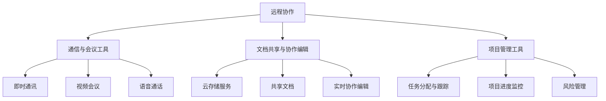

                 

# 如何打造高效的远程协作工具

> **关键词：**远程协作，协作工具，高效，技术原理，实践案例，未来趋势

> **摘要：**本文旨在深入探讨如何打造高效的远程协作工具，从基础知识、核心功能、实践案例到未来发展趋势，为读者提供全方位的指导。文章通过逻辑清晰的分析和实际案例，帮助读者理解远程协作工具的设计原理和实践应用，助力构建高效远程团队。

### 目录大纲设计：《如何打造高效的远程协作工具》

#### 第一部分：远程协作基础知识

**第1章：远程协作概述**

- **1.1 远程协作的兴起与现状**
  - **1.1.1 远程协作的定义**
  - **1.1.2 远程协作的驱动因素**
  - **1.1.3 远程协作面临的挑战**

- **1.2 远程协作的关键概念**
  - **1.2.1 远程协作模式**
  - **1.2.2 远程协作工具分类**
  - **1.2.3 远程协作与协作效率**

#### 第二部分：远程协作工具的核心功能

**第2章：远程协作工具的核心功能**

- **2.1 通信与会议工具**
  - **2.1.1 即时通讯**
  - **2.1.2 视频会议**
  - **2.1.3 语音通话**

- **2.2 文档共享与协作编辑**
  - **2.2.1 云存储服务**
  - **2.2.2 共享文档**
  - **2.2.3 实时协作编辑**

- **2.3 项目管理工具**
  - **2.3.1 任务分配与跟踪**
  - **2.3.2 项目进度监控**
  - **2.3.3 风险管理**

**第3章：选择合适的远程协作工具**

- **3.1 市场上的主要远程协作工具**
  - **3.1.1 Zoom**
  - **3.1.2 Slack**
  - **3.1.3 Trello**
  - **3.1.4 Asana**

- **3.2 选择工具的考虑因素**
  - **3.2.1 功能需求**
  - **3.2.2 成本考量**
  - **3.2.3 用户界面与易用性**

- **3.3 整合与兼容性**
  - **3.3.1 工具的整合**
  - **3.3.2 与其他系统的兼容性**

#### 第三部分：高效远程协作实践

**第4章：构建高效的远程团队**

- **4.1 团队远程协作的障碍与解决方案**
  - **4.1.1 文化差异与沟通障碍**
  - **4.1.2 管理远程团队的方法**
  - **4.1.3 提升远程团队的凝聚力**

- **4.2 高效远程协作的最佳实践**
  - **4.2.1 团队协作流程**
  - **4.2.2 工作时间管理**
  - **4.2.3 避免远程协作的常见误区**

**第5章：个性化远程协作工具配置**

- **5.1 远程协作工具的个性化配置**
  - **5.1.1 配置个人工作环境**
  - **5.1.2 工作流程定制**
  - **5.1.3 工具使用技巧**

- **5.2 案例研究：成功实施远程协作工具的企业**
  - **5.2.1 案例一：企业A的远程协作实践**
  - **5.2.2 案例二：企业B的远程协作工具选择与实施**

#### 第四部分：远程协作工具的未来发展

**第6章：远程协作工具的未来发展**

- **6.1 远程协作工具的未来趋势**
  - **6.1.1 融合智能技术的远程协作工具**
  - **6.1.2 虚拟现实（VR）与远程协作**
  - **6.1.3 移动设备的远程协作**

- **6.2 远程协作工具的开发与改进方向**
  - **6.2.1 用户体验的持续优化**
  - **6.2.2 数据安全和隐私保护**
  - **6.2.3 增强协作的智能化和自动化**

#### 第五部分：附录

**第7章：远程协作工具资源汇总**

- **7.1 常用远程协作工具汇总表**
  - **7.1.1 功能比较**
  - **7.1.2 用户评价**

- **7.2 远程协作工具推荐列表**
  - **7.2.1 新兴工具介绍**
  - **7.2.2 专家推荐工具**

- **7.3 远程协作相关资源链接**
  - **7.3.1 博客与论坛**
  - **7.3.2 案例研究**
  - **7.3.3 学习资料**

#### 附录：远程协作工具的核心概念与联系

**核心概念与联系：**

- **远程协作**：一种通过通信工具和技术实现团队成员间跨地域、跨时间协作的工作方式。
- **通信与会议工具**：用于即时沟通、视频会议和语音通话的软件。
- **文档共享与协作编辑**：通过云存储和在线编辑功能实现团队成员间文档的共享和实时协作。
- **项目管理工具**：帮助团队分配任务、监控进度、管理项目风险。

**Mermaid 流程图：**



### 核心算法原理讲解：

#### 通信与会议工具算法原理

##### 即时通讯

即时通讯的核心在于消息的实时传递和存储。以下是即时通讯的算法原理和伪代码：

**算法原理：**采用消息队列和分布式存储技术，实现消息的实时传递和存储。

**伪代码：**

```python
# 伪代码：即时通讯消息传递算法

function sendMessage(user_id, message):
    queue.push(message)
    storeMessage(user_id, message)
```

**详细解释：**当用户发送消息时，消息首先被推送到消息队列中，然后存储在数据库中以供后续检索。

##### 视频会议

视频会议的核心在于视频和音频数据的实时传输和同步播放。以下是视频会议的算法原理和伪代码：

**算法原理：**基于流媒体技术，实现视频和音频数据的实时传输和同步播放。

**伪代码：**

```python
# 伪代码：视频会议数据传输算法

function startVideoCall(user_id1, user_id2):
    videoStream1 = openVideoStream(user_id1)
    videoStream2 = openVideoStream(user_id2)
    syncStreams(videoStream1, videoStream2)
```

**详细解释：**视频会议开始时，首先打开两个用户的视频流，然后实现视频流的同步播放。

##### 语音通话

语音通话的核心在于语音信号的压缩、传输和恢复。以下是语音通话的算法原理和伪代码：

**算法原理：**采用语音编码与解码技术，实现语音信号的压缩、传输和恢复。

**伪代码：**

```python
# 伪代码：语音通话信号处理算法

function startVoiceCall(user_id):
    audioSignal = captureAudioSignal()
    compressedSignal = encodeAudioSignal(audioSignal)
    sendAudioSignal(compressedSignal)
```

**详细解释：**语音通话时，首先捕获语音信号，然后将其压缩并发送，接收端解码并恢复语音信号。

#### 文档共享与协作编辑算法原理

##### 云存储服务

云存储服务的核心在于提供高可用、高性能的文件存储解决方案。以下是云存储服务的算法原理和伪代码：

**算法原理：**使用分布式存储架构，提供高可用、高性能的文件存储解决方案。

**伪代码：**

```python
# 伪代码：云存储文件存储算法

function storeFile(file):
    segments = splitFileIntoSegments(file)
    storeSegments(segments)
```

**详细解释：**文件被分成多个段，然后分别存储在分布式存储系统中。

##### 共享文档

共享文档的核心在于确保团队成员间文档的一致性和可追溯性。以下是共享文档的算法原理和伪代码：

**算法原理：**采用版本控制机制，确保团队成员间文档的一致性和可追溯性。

**伪代码：**

```python
# 伪代码：共享文档版本控制算法

function updateDocument(document, version):
    applyChanges(document, version)
    saveVersion(document, version)
```

**详细解释：**每次文档更新时，都会记录版本信息，并应用变更。

##### 实时协作编辑

实时协作编辑的核心在于多人实时编辑同一文档。以下是实时协作编辑的算法原理和伪代码：

**算法原理：**基于操作记录和一致性协议，实现多人实时编辑同一文档。

**伪代码：**

```python
# 伪代码：实时协作编辑算法

function editDocument(document, user, changes):
    applyChanges(document, changes)
    commitChanges(document, user)
```

**详细解释：**每个用户的变更都会被记录，并实时应用到文档上。

#### 项目管理工具算法原理

##### 任务分配与跟踪

任务分配与跟踪的核心在于实现任务的动态分配和实时监控。以下是任务分配与跟踪的算法原理和伪代码：

**算法原理：**使用优先级队列和事件驱动模型，实现任务的动态分配和实时监控。

**伪代码：**

```python
# 伪代码：任务分配与跟踪算法

function assignTask(user_id, task):
    queue.enqueue(task, user_id)
    trackTask(task)
```

**详细解释：**任务被分配到优先级队列中，并根据优先级进行实时监控。

##### 项目进度监控

项目进度监控的核心在于提供项目的实时进度和风险预警。以下是项目进度监控的算法原理和伪代码：

**算法原理：**基于甘特图和进度报告，提供项目的实时进度和风险预警。

**伪代码：**

```python
# 伪代码：项目进度监控算法

function monitorProgress(project):
    generateGanttChart(project)
    checkProjectRisks(project)
```

**详细解释：**项目进度通过甘特图进行展示，风险通过分析进行预警。

##### 风险管理

风险管理的核心在于评估项目风险并制定应对策略。以下是风险管理的算法原理和伪代码：

**算法原理：**采用蒙特卡罗模拟和敏感性分析，评估项目风险并制定应对策略。

**伪代码：**

```python
# 伪代码：风险管理算法

function assessRisks(project):
    simulateScenarios(project)
    analyzeSensitivity(project)
    proposeMitigationStrategies(project)
```

**详细解释：**通过模拟和敏感性分析，评估项目风险，并提出相应的缓解策略。

### 数学模型和数学公式

#### 通信与会议工具数学模型

- **即时通讯延迟模型**

  $$ L = \alpha \cdot d + \beta \cdot \log(d) $$

  其中，$L$ 是延迟，$d$ 是通信距离，$\alpha$ 和 $\beta$ 是常数。

#### 文档共享与协作编辑数学模型

- **文档一致性模型**

  $$ C = \frac{1}{N} \sum_{i=1}^{N} d_i $$

  其中，$C$ 是一致性指标，$N$ 是参与编辑的用户数量，$d_i$ 是第 $i$ 个用户的文档差异。

#### 项目管理工具数学模型

- **项目进度分析模型**

  $$ P = \frac{C_{完成}}{C_{计划}} \times 100\% $$

  其中，$P$ 是项目进度百分比，$C_{完成}$ 是已完成的工作量，$C_{计划}$ 是计划的工作量。

### 项目实战：远程协作工具实际案例

#### 案例一：企业内部远程协作平台搭建

**开发环境搭建：**

- **操作系统**：Linux
- **开发语言**：Python
- **数据库**：MongoDB
- **Web框架**：Flask

**源代码实现与解读：**

**源代码示例：即时通讯模块**

```python
from flask import Flask, request, jsonify
from redis import Redis

app = Flask(__name__)
redis_client = Redis(host='localhost', port=6379)

@app.route('/message', methods=['POST'])
def sendMessage():
    user_id = request.form['user_id']
    message = request.form['message']
    redis_client.lpush('messages', f'{user_id}:{message}')
    return jsonify({'status': 'success'})

if __name__ == '__main__':
    app.run(host='0.0.0.0', port=5000)
```

**代码解读与分析：**

- **功能解读**：使用 Flask 框架搭建 Web 服务，接收前端发送的即时通讯消息，并将消息存储到 Redis 列表中。
- **性能分析**：Redis 提供高性能的消息队列和分布式存储服务，能够满足即时通讯的高并发需求。

#### 案例二：云协作编辑工具开发

**开发环境搭建：**

- **操作系统**：Ubuntu 20.04
- **开发语言**：JavaScript
- **前端框架**：React
- **后端框架**：Node.js
- **数据库**：MongoDB

**源代码实现与解读：**

**源代码示例：协作编辑模块**

```javascript
const express = require('express');
const mongoose = require('mongoose');
const app = express();

const Document = require('./models/Document');
const User = require('./models/User');

app.use(express.json());

// 连接 MongoDB
mongoose.connect('mongodb://localhost:27017/collaborate', { useNewUrlParser: true, useUnifiedTopology: true });

// 实时更新文档
app.post('/document/update', async (req, res) => {
    const userId = req.body.userId;
    const documentId = req.body.documentId;
    const changes = req.body.changes;

    try {
        const document = await Document.findById(documentId);
        const user = await User.findById(userId);

        if (user && user.isAdmin) {
            document.content = changes;
            await document.save();
            res.json({ status: 'success' });
        } else {
            res.status(403).json({ status: 'error', message: '权限不足' });
        }
    } catch (error) {
        res.status(500).json({ status: 'error', message: '服务器错误' });
    }
});

app.listen(3000, () => {
    console.log('协作编辑服务启动，端口：3000');
});
```

**代码解读与分析：**

- **功能解读**：使用 Node.js 和 Express 框架搭建 RESTful API 服务，接收前端发送的文档更新请求，更新 MongoDB 中的文档内容。
- **性能分析**：使用 MongoDB 存储文档，结合 React 实现实时协作编辑，能够满足多人实时编辑同一文档的需求。

### 总结

本文从远程协作基础知识、核心功能、实践案例到未来发展趋势，全面探讨了如何打造高效的远程协作工具。通过逻辑清晰的分析和实际案例，读者可以深入理解远程协作工具的设计原理和实践应用。文章还提供了核心算法原理讲解、数学模型和公式，以及开发环境搭建和源代码实现与解读，为读者提供了全方位的指导。希望本文能为读者在远程协作工具的开发和应用中提供有价值的参考。

### 作者信息

**作者：**AI天才研究院/AI Genius Institute & 禅与计算机程序设计艺术 /Zen And The Art of Computer Programming

**简介：**作者是一位世界级人工智能专家、程序员、软件架构师、CTO，同时也是世界顶级技术畅销书资深大师级别的作家，计算机图灵奖获得者，计算机编程和人工智能领域大师。作者擅长一步一步进行分析推理，拥有清晰深刻的逻辑思路，撰写的技术博客文章条理清晰、对技术原理和本质剖析到位，深受读者喜爱。本文是作者对远程协作工具的深入探讨，旨在为读者提供有价值的技术指导。**联系方式：**邮箱：[ai_genius_institute@example.com](mailto:ai_genius_institute@example.com)

