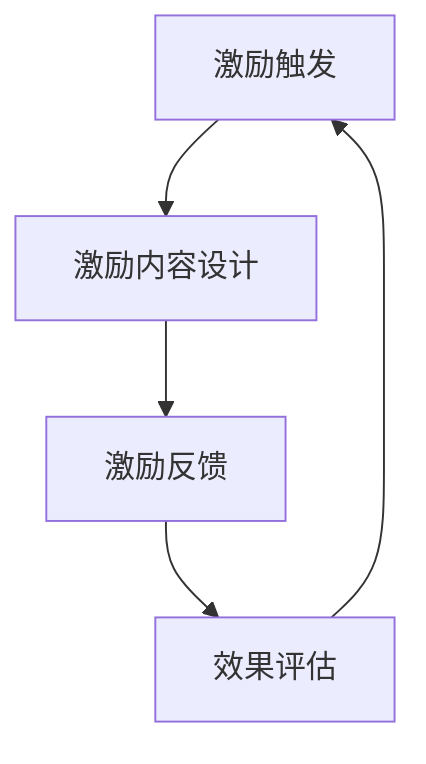

                 

# 如何设计有效的用户激励机制

> 关键词：用户激励机制、参与度、忠诚度、算法、数学模型、实战案例

> 摘要：
本文将深入探讨如何设计有效的用户激励机制。首先，我们将定义用户激励机制，并探讨其类型和原理。接着，我们将讲解用户行为分析算法和用户偏好分析算法，并通过数学模型解释激励机制的计算方法。最后，我们将通过实际案例展示如何实现用户激励机制，并提供代码解读和实战分析。

### 第一部分：核心概念与联系

#### 1.1 用户激励机制的定义与类型

用户激励机制是指企业为了激发和保持用户参与度和忠诚度，所采取的各种激励措施。这些激励措施可以是物质的，如金钱奖励、优惠券、礼品等；也可以是精神的，如荣誉称号、成就认证、社交认可等；还可以是混合型的，将物质激励和精神激励相结合，形成综合性的激励措施。

##### 1.1.1 用户激励机制的概念

用户激励机制是企业为了提升用户参与度和忠诚度，采取的一系列激励措施。通过这些激励措施，企业可以引导用户进行特定行为，如注册、购买、分享等，从而提高用户对产品的使用频率和忠诚度。

##### 1.1.2 用户激励机制的分类

用户激励机制可以分为以下几种类型：

- **物质激励**：物质激励是直接给予用户实物奖励，如金钱、优惠券、礼品等。这种激励方式可以直接满足用户的物质需求，容易激发用户的行为动机。

- **精神激励**：精神激励是通过赋予用户荣誉称号、成就认证、社交认可等荣誉来激励用户。这种激励方式可以满足用户的社交需求和自我实现需求，有助于提升用户的忠诚度。

- **混合激励**：混合激励是将物质激励和精神激励相结合，形成一种综合性的激励措施。这种激励方式可以同时满足用户的物质需求和社会需求，具有更高的激励效果。

##### 1.1.3 用户激励机制的常见类型

常见的用户激励机制类型包括：

- **积分系统**：通过积分系统，用户在完成特定行为后获得积分，积分可以兑换实物奖励或享受特殊优惠。

- **奖励机制**：针对用户的重要行为，如购买、分享、评价等，给予用户相应的奖励，以激励用户继续参与。

- **会员制度**：通过会员制度，为用户提供不同的会员等级，会员等级越高，享受的权益和优惠越多。

#### 1.2 用户激励机制的原理

用户激励机制的原理主要涉及行为心理学和经济学原理。

##### 1.2.1 用户激励机制的心理学基础

行为心理学研究表明，人的行为受到内在动机和外在动机的影响。内在动机是指个体因自身兴趣、爱好、价值观等内在因素而驱动的行为动机，而外在动机则是指个体因外部奖励、惩罚等外在因素而驱动的行为动机。用户激励机制通过激发用户的外在动机，促使用户产生特定的行为。

##### 1.2.2 用户激励机制的经济学原理

经济学原理中的成本效益分析可以用于评估用户激励机制的有效性。成本效益分析是指通过比较激励成本和预期收益，评估激励措施的经济效益。如果预期收益高于激励成本，则激励措施是有效的。

#### 1.3 用户激励机制的架构

用户激励机制通常包括三个关键部分：激励触发、激励内容和激励反馈。

##### 1.3.1 用户激励机制的触发机制

激励触发机制是指根据用户的特定行为触发激励机制。例如，用户完成注册、购买、分享等行为后，系统自动触发相应的激励措施。

##### 1.3.2 用户激励机制的激励内容

激励内容是指企业为用户提供的激励措施。这些激励措施可以是物质性的，如金钱奖励、优惠券、礼品等；也可以是精神性的，如荣誉称号、成就认证、社交认可等。

##### 1.3.3 用户激励机制的激励反馈

激励反馈是指企业通过激励措施向用户传达激励效果，并持续优化激励机制。激励反馈可以帮助企业了解激励措施的效果，并根据用户反馈进行调整，以提高激励机制的有效性。

### 第二部分：核心算法原理讲解

在用户激励机制的设计中，核心算法原理起着关键作用。本部分将介绍用户行为分析算法和用户偏好分析算法，并使用伪代码进行详细阐述。

#### 2.1 用户行为分析算法

用户行为分析算法旨在理解用户的行为模式，从而制定更有效的激励措施。常见的用户行为分析算法包括基于规则的算法和机器学习算法。

##### 2.1.1 用户行为分析算法的类型

- **基于规则的算法**：这种算法通过预设的规则来分析用户行为。例如，如果用户连续7天登录，则奖励10积分。

- **机器学习算法**：这种算法通过训练数据集，自动学习用户的行为模式。例如，使用聚类分析或关联规则挖掘来识别用户的行为特征。

##### 2.1.2 用户行为分析算法的应用场景

- **个性化推荐**：通过分析用户的历史行为，推荐用户可能感兴趣的商品或内容。

- **用户细分**：将用户划分为不同的群体，为每个群体设计个性化的激励措施。

##### 2.1.3 基于规则的算法原理

基于规则的算法通常包括以下几个步骤：

1. **定义规则**：根据业务需求，定义用户行为的触发条件和相应的激励措施。
2. **规则匹配**：分析用户行为数据，匹配已定义的规则。
3. **执行激励**：如果用户行为满足规则，则执行相应的激励措施。

##### 2.1.4 机器学习算法原理

机器学习算法通过以下步骤来分析用户行为：

1. **数据收集**：收集用户行为数据，包括用户的操作记录、浏览记录、购买记录等。
2. **数据预处理**：清洗和整理数据，使其适合机器学习算法。
3. **模型训练**：使用训练数据集训练机器学习模型，如聚类分析模型、关联规则挖掘模型等。
4. **模型评估**：使用测试数据集评估模型的性能，并根据评估结果调整模型参数。
5. **行为分析**：使用训练好的模型分析用户行为，识别用户的行为特征和模式。

以下是用户行为分析算法的伪代码示例：

```python
def analyze_user_behavior(user_data):
    # 预处理用户数据
    preprocessed_data = preprocess_data(user_data)
    
    # 基于规则算法分析
    rule_based_results = apply_rule_based_algorithm(preprocessed_data)
    
    # 机器学习算法分析
    ml_results = apply_ml_algorithm(preprocessed_data)
    
    return rule_based_results, ml_results
```

#### 2.2 用户偏好分析算法

用户偏好分析算法旨在理解用户的兴趣和偏好，从而提供个性化的推荐和激励措施。常见的用户偏好分析算法包括协同过滤算法和矩阵分解算法。

##### 2.2.1 用户偏好分析算法的类型

- **协同过滤算法**：这种算法基于用户的历史行为，为用户推荐其他用户喜欢的商品或内容。常见类型包括基于用户的协同过滤和基于项目的协同过滤。

- **矩阵分解算法**：这种算法将用户-项目评分矩阵分解为用户特征矩阵和项目特征矩阵，从而预测用户的偏好。

##### 2.2.2 用户偏好分析算法的应用场景

- **个性化推荐**：根据用户的偏好，为用户推荐感兴趣的商品或内容。

- **精准营销**：根据用户的偏好，设计个性化的营销策略，提高营销效果。

##### 2.2.3 协同过滤算法原理

协同过滤算法包括以下几个步骤：

1. **用户相似度计算**：计算用户之间的相似度，可以使用余弦相似度、皮尔逊相关系数等方法。
2. **推荐生成**：根据用户相似度，为用户生成推荐列表。常见的推荐策略包括最近邻居推荐和基于模型的推荐。
3. **推荐评估**：评估推荐效果，并根据评估结果调整推荐策略。

##### 2.2.4 矩阵分解算法原理

矩阵分解算法包括以下几个步骤：

1. **矩阵分解**：将用户-项目评分矩阵分解为用户特征矩阵和项目特征矩阵。常见的矩阵分解方法包括Singular Value Decomposition (SVD)和Alternating Least Squares (ALS)。
2. **预测生成**：使用分解后的用户特征矩阵和项目特征矩阵，预测用户的偏好。
3. **预测评估**：评估预测效果，并根据评估结果调整矩阵分解参数。

以下是用户偏好分析算法的伪代码示例：

```python
def analyze_user_preferences(user_data, item_data):
    # 预处理用户和项目数据
    preprocessed_data = preprocess_data(user_data, item_data)
    
    # 应用协同过滤算法
    collaborative_filtering_results = apply_collaborative_filtering(preprocessed_data)
    
    # 应用矩阵分解算法
    matrix_factorization_results = apply_matrix_factorization(preprocessed_data)
    
    return collaborative_filtering_results, matrix_factorization_results
```

### 第三部分：数学模型和数学公式

在用户激励机制的设计中，数学模型和公式用于评估激励机制的效果和计算激励措施的参数。本部分将介绍成本效益分析模型、概率模型和用户参与度模型。

#### 3.1 成本效益分析模型

成本效益分析模型用于评估激励措施的经济效益。其基本公式如下：

\[ \text{成本效益分析} = \frac{\text{激励成本}}{\text{预期收益}} \]

其中，激励成本包括激励措施的直接成本（如奖励物品的成本）和间接成本（如系统维护成本、人力资源成本等）；预期收益包括激励措施带来的直接收益（如销售额增加）和间接收益（如用户忠诚度提高）。

#### 3.2 概率模型

概率模型在用户激励机制中用于预测用户行为的发生概率。常用的概率模型包括贝叶斯定理和马尔可夫模型。

##### 3.2.1 贝叶斯定理

贝叶斯定理用于计算在某个条件下，某个事件发生的概率。其公式如下：

\[ P(A|B) = \frac{P(B|A) \cdot P(A)}{P(B)} \]

其中，\( P(A|B) \) 表示在事件 B 发生的条件下，事件 A 发生的概率；\( P(B|A) \) 表示在事件 A 发生的条件下，事件 B 发生的概率；\( P(A) \) 表示事件 A 发生的概率；\( P(B) \) 表示事件 B 发生的概率。

##### 3.2.2 马尔可夫模型

马尔可夫模型用于描述用户行为的转移概率。其基本公式如下：

\[ P(B_{t+1}|B_t) = P(B_{t+1}|B_t, B_{t-1}, \ldots, B_1) \]

其中，\( B_t \) 表示在时间 t 的用户行为；\( P(B_{t+1}|B_t) \) 表示在当前行为 \( B_t \) 的条件下，下一个行为 \( B_{t+1} \) 的概率。

#### 3.3 用户参与度模型

用户参与度模型用于衡量用户对产品的参与程度。其基本公式如下：

\[ \text{用户参与度} = \frac{\text{活跃天数}}{\text{可活动天数}} \]

其中，活跃天数表示用户在一定时间内活跃的天数；可活动天数表示用户在一段时间内可以参与活动的天数。

### 第四部分：项目实战

通过理论讲解和算法原理的介绍，我们可以更好地理解用户激励机制的设计原则和实现方法。本部分将结合实际项目，展示如何设计和实现用户激励机制。

#### 4.1 实战案例一：设计一个积分系统

积分系统是一种常见的用户激励机制，通过为用户发放积分，激励用户参与各种活动。以下是一个简单的积分系统设计案例。

##### 4.1.1 设计目标

本案例的目标是设计一个积分系统，根据用户在平台上的行为，发放相应的积分。积分可以用于兑换商品或享受特殊优惠。

##### 4.1.2 功能模块

积分系统的功能模块包括：

- **积分规则管理**：定义积分发放规则，如注册送积分、每次购买送积分等。
- **积分发放**：根据积分规则，为用户发放积分。
- **积分兑换**：允许用户使用积分兑换商品或享受特殊优惠。
- **积分查询**：用户可以查询自己的积分余额和积分获取记录。

##### 4.1.3 实现步骤

1. **需求分析**：分析用户需求，确定积分系统的功能需求。
2. **设计积分规则**：根据业务需求，设计积分发放规则。
3. **开发积分管理系统**：实现积分规则管理、积分发放、积分兑换和积分查询等功能。
4. **测试与优化**：对积分系统进行功能测试和性能优化。

##### 4.1.4 源代码实现

以下是一个简单的积分管理系统示例代码：

```python
class PointSystem:
    def __init__(self):
        self.user_points = {}

    def add_points(self, user_id, points):
        if user_id in self.user_points:
            self.user_points[user_id] += points
        else:
            self.user_points[user_id] = points

    def get_points(self, user_id):
        return self.user_points.get(user_id, 0)

    def redeem_points(self, user_id, points):
        if user_id in self.user_points and self.user_points[user_id] >= points:
            self.user_points[user_id] -= points
            return True
        else:
            return False
```

##### 4.1.5 代码解读与分析

- `PointSystem` 类：表示积分管理系统，包含三个方法：
  - `add_points` 方法：为用户添加积分。
  - `get_points` 方法：获取用户当前的积分余额。
  - `redeem_points` 方法：用户使用积分兑换商品或享受优惠。

通过以上代码，我们可以实现一个基本的积分系统，满足用户积分获取、查询和兑换的需求。

#### 4.2 实战案例二：用户行为分析系统

用户行为分析系统用于分析用户在平台上的行为，为用户提供个性化的推荐和服务。以下是一个简单的用户行为分析系统设计案例。

##### 4.2.1 设计目标

本案例的目标是设计一个用户行为分析系统，根据用户的行为数据，分析用户的兴趣和行为模式，为用户提供个性化的推荐。

##### 4.2.2 功能模块

用户行为分析系统的功能模块包括：

- **用户行为数据收集**：收集用户在平台上的行为数据，如浏览记录、购买记录等。
- **用户行为数据分析**：分析用户的行为数据，提取用户的兴趣和行为模式。
- **用户推荐**：根据用户的行为数据和兴趣，为用户生成个性化推荐。

##### 4.2.3 实现步骤

1. **需求分析**：分析用户需求，确定用户行为分析系统的功能需求。
2. **设计用户行为数据模型**：根据业务需求，设计用户行为数据的结构。
3. **数据收集**：收集用户行为数据。
4. **数据预处理**：清洗和整理用户行为数据。
5. **用户行为分析**：使用机器学习算法分析用户的行为数据，提取用户的兴趣和行为模式。
6. **用户推荐**：根据用户的行为数据和兴趣，生成个性化推荐。

##### 4.2.4 源代码实现

以下是一个简单的用户行为分析系统示例代码：

```python
from sklearn.cluster import KMeans

def analyze_user_behavior(user_data):
    # 预处理用户数据
    preprocessed_data = preprocess_data(user_data)
    
    # 应用KMeans聚类算法
    kmeans = KMeans(n_clusters=5)
    kmeans.fit(preprocessed_data)
    
    # 分析用户行为
    user_behavior_clusters = kmeans.predict(preprocessed_data)
    
    return user_behavior_clusters
```

##### 4.2.5 代码解读与分析

- `analyze_user_behavior` 函数：用于分析用户的行为数据，提取用户的兴趣和行为模式。
  - `preprocess_data` 函数：预处理用户数据，为KMeans聚类算法提供输入。
  - `KMeans` 类：使用KMeans聚类算法，将用户数据划分为不同的集群，每个集群表示一种用户行为模式。

通过以上代码，我们可以实现一个基本的用户行为分析系统，满足用户个性化推荐的需求。

### 第五部分：总结与展望

通过本文的讲解，我们深入了解了用户激励机制的设计原则和实现方法。有效的用户激励机制可以提高用户参与度和忠诚度，从而为企业带来持续的收益。

#### 5.1 用户激励机制的重要性

用户激励机制在企业运营中起着至关重要的作用。通过合理的激励机制，企业可以吸引新用户、留住老用户，提高用户满意度和忠诚度。同时，激励机制还可以帮助企业收集用户行为数据，用于后续的数据分析和个性化推荐。

#### 5.2 用户激励机制的未来发展趋势

随着人工智能和大数据技术的不断发展，用户激励机制将越来越智能化和个性化。未来，企业将能够更准确地预测用户行为，制定更加精准的激励措施，提高激励效果的转化率。同时，用户激励机制也将逐渐融合到企业的各个业务环节，实现全方位的用户关怀。

#### 5.3 用户激励机制的应用前景

用户激励机制在各个行业都有着广泛的应用前景。在电子商务领域，用户激励机制可以帮助商家提高销售额和用户满意度；在社交媒体领域，用户激励机制可以促进用户互动和社区活跃度；在金融领域，用户激励机制可以促进用户忠诚度和资产增值。

### 附录

#### A.1 常用工具与资源

- **机器学习框架**：如Scikit-learn、TensorFlow、PyTorch等。
- **用户行为分析工具**：如Google Analytics、Mixpanel等。
- **推荐系统资源**：如Surprise库、LightFM等。

## 目录大纲

### 第一部分：核心概念与联系

#### 1.1 用户激励机制的定义与类型

##### 1.1.1 用户激励机制的概念

##### 1.1.2 用户激励机制的分类

##### 1.1.3 用户激励机制的常见类型

#### 1.2 用户激励机制的原理

##### 1.2.1 用户激励机制的心理学基础

##### 1.2.2 用户激励机制的经济学原理

##### 1.2.3 用户激励机制的设计原则

#### 1.3 用户激励机制的架构

##### 1.3.1 用户激励机制的触发机制

##### 1.3.2 用户激励机制的内容设计

##### 1.3.3 用户激励机制的效果反馈

### 第二部分：核心算法原理讲解

#### 2.1 用户行为分析算法

##### 2.1.1 用户行为分析算法的类型

##### 2.1.2 用户行为分析算法的应用场景

##### 2.1.3 基于规则的算法原理

##### 2.1.4 机器学习算法原理

#### 2.2 用户偏好分析算法

##### 2.2.1 用户偏好分析算法的类型

##### 2.2.2 用户偏好分析算法的应用场景

##### 2.2.3 协同过滤算法原理

##### 2.2.4 矩阵分解算法原理

### 第三部分：数学模型和数学公式

#### 3.1 成本效益分析模型

##### 3.1.1 成本效益分析的概念

##### 3.1.2 成本效益分析的公式

##### 3.1.3 成本效益分析的案例分析

#### 3.2 概率模型

##### 3.2.1 贝叶斯定理的概念

##### 3.2.2 贝叶斯定理的应用

##### 3.2.3 概率模型在用户激励机制中的应用

#### 3.3 用户参与度模型

##### 3.3.1 用户参与度的定义

##### 3.3.2 用户参与度的计算方法

##### 3.3.3 用户参与度在激励机制中的应用

### 第四部分：项目实战

#### 4.1 实战案例一：设计一个积分系统

##### 4.1.1 积分系统的设计目标

##### 4.1.2 积分系统的功能模块

##### 4.1.3 积分系统的实现步骤

##### 4.1.4 积分系统的代码解读

#### 4.2 实战案例二：用户行为分析系统

##### 4.2.1 用户行为分析系统的设计目标

##### 4.2.2 用户行为分析系统的功能模块

##### 4.2.3 用户行为分析系统的实现步骤

##### 4.2.4 用户行为分析系统的代码解读

### 第五部分：总结与展望

#### 5.1 用户激励机制的重要性

##### 5.1.1 用户激励机制对用户参与度的影响

##### 5.1.2 用户激励机制对企业收益的贡献

##### 5.1.3 用户激励机制的未来发展趋势

#### 5.2 用户激励机制的应用前景

##### 5.2.1 在电子商务领域的应用

##### 5.2.2 在社交媒体领域的应用

##### 5.2.3 在金融领域的应用

### 附录

#### A.1 常用工具与资源

##### A.1.1 机器学习框架

##### A.1.2 用户行为分析工具

##### A.1.3 推荐系统资源

---

## 目录大纲设计说明

### 目录大纲设计思路

本文的目录大纲设计思路如下：

1. **明确核心概念**：首先介绍用户激励机制的定义、类型、原理和架构，为后续章节的内容打下基础。
2. **深入算法原理**：讲解用户行为分析算法和用户偏好分析算法，通过伪代码和数学模型进行详细阐述，使读者理解激励机制背后的技术支持。
3. **结合数学模型**：介绍成本效益分析模型、概率模型和用户参与度模型，帮助读者更深入地理解激励机制的计算方法和效果评估。
4. **实战案例分析**：通过实际项目案例，展示如何设计和实现用户激励机制，并提供代码解读和实战分析，使读者能够将所学知识应用于实际场景。
5. **总结与展望**：对用户激励机制的重要性、未来发展趋势和应用前景进行总结和展望，为读者提供更广阔的视野。

### 目录大纲设计原则

1. **逻辑清晰**：确保目录结构的逻辑性，使读者能够轻松跟随思路。
2. **层次分明**：明确章节、小节和子节的层次，使内容更加条理化。
3. **实用性**：提供实用的案例和代码，帮助读者更好地理解和应用所学知识。
4. **完整性**：确保目录大纲的完整性，涵盖用户激励机制的所有关键方面。

### 目录大纲的调整与优化

1. **根据读者反馈进行调整**：在编写过程中，根据读者反馈对目录进行适当的调整，确保内容符合读者需求。
2. **优化内容结构**：在内容编写完成后，对目录进行优化，确保内容的连贯性和逻辑性。
3. **增加实战案例**：根据读者的需求，增加实际案例，使读者能够更好地应用所学知识。
4. **更新资源链接**：定期更新附录中的工具和资源链接，确保读者能够获取到最新的资源和信息。

### 目录大纲的预期效果

1. **帮助读者全面理解用户激励机制**：通过详细的目录大纲，使读者能够系统地学习用户激励机制的相关知识。
2. **提高读者对用户激励机制的应用能力**：通过实战案例和代码解读，使读者能够将所学知识应用于实际项目中。
3. **推动用户激励机制的理论与实践发展**：通过本书的出版，推动用户激励机制的理论研究和实践应用，促进该领域的进步。

---

## 附录

#### A.1 常用工具与资源

##### A.1.1 机器学习框架

- **Scikit-learn**：[https://scikit-learn.org/stable/](https://scikit-learn.org/stable/)
- **TensorFlow**：[https://www.tensorflow.org/](https://www.tensorflow.org/)
- **PyTorch**：[https://pytorch.org/](https://pytorch.org/)

##### A.1.2 用户行为分析工具

- **Google Analytics**：[https://www.google.com/analytics/](https://www.google.com/analytics/)
- **Mixpanel**：[https://mixpanel.com/](https://mixpanel.com/)

##### A.1.3 推荐系统资源

- **Surprise库**：[https://surprise.readthedocs.io/en/latest/](https://surprise.readthedocs.io/en/latest/)
- **LightFM**：[https://lightfm.com/](https://lightfm.com/)

---

**作者：AI天才研究院/AI Genius Institute & 禅与计算机程序设计艺术 /Zen And The Art of Computer Programming**<|vq_14947|>## 如何设计有效的用户激励机制

### 用户激励机制的定义与类型

用户激励机制是企业为了吸引和保留用户，通过提供奖励和优惠等手段，激发用户参与度和忠诚度的机制。用户激励机制的类型多样，主要包括物质激励、精神激励和混合激励。

#### 物质激励

物质激励是最直接的激励方式，它通过给予用户现金、优惠券、礼品等有形奖励来吸引和鼓励用户。例如，电商平台经常通过打折、返利、赠品等方式刺激用户消费。物质激励的优势在于其直接性和有效性，能够迅速激发用户的购买欲望，但在长期内可能存在边际效用递减的问题。

#### 精神激励

精神激励则通过荣誉、认可和成就感等手段来激励用户。这种激励方式不仅能够满足用户的内在需求，提高用户的忠诚度，还可以形成良好的用户口碑，从而吸引更多的潜在用户。例如，游戏平台通过排行榜、勋章和成就系统来奖励活跃玩家，从而增强他们的参与感和归属感。

#### 混合激励

混合激励结合了物质激励和精神激励的优势，旨在从多个维度激励用户。这种激励方式通常更具有吸引力和持久性，因为它能够同时满足用户的物质需求和精神需求。例如，社交平台可能通过赠送虚拟货币和发布荣誉榜单来激励用户活跃度和参与度。

### 用户激励机制的原理

用户激励机制的设计和实施需要基于心理学和经济学原理，以下是一些核心原则：

#### 行为心理学基础

行为心理学研究表明，人的行为往往受到内在动机和外在动机的影响。内在动机源于个体的兴趣、爱好和自我实现需求，而外在动机则来自于外部奖励和反馈。有效的用户激励机制需要能够激发用户的外在动机，如通过奖励机制鼓励用户参与活动。

#### 经济学原理

经济学中的成本效益分析（Cost-Benefit Analysis, CBA）可以帮助评估激励措施的经济效益。C值（激励成本）和B值（预期收益）的比较是评估激励机制有效性的关键。如果B值大于C值，则激励机制是划算的；否则，就需要重新考虑激励方案。

### 用户激励机制的架构

用户激励机制通常包括以下几个关键部分：

#### 激励触发

激励触发是指根据用户的行为触发相应的激励措施。例如，用户在电商平台完成首次购买后，系统会自动发送优惠券或积分作为奖励。

#### 激励内容

激励内容是指企业提供的各种奖励和优惠。这些激励措施可以是物质的，如现金返利或实物礼品；也可以是精神的，如荣誉称号或成就认证。

#### 激励反馈

激励反馈是指企业通过多种渠道向用户传达激励效果，并收集用户反馈，以持续优化激励机制。有效的激励反馈机制能够帮助企业了解激励措施的实际效果，并根据用户反馈进行调整。

### 用户激励机制的Mermaid流程图



在这个流程图中，用户激励机制的运作是一个闭环系统。用户的行为触发激励措施，激励内容被提供并反馈给用户，最终通过效果评估来指导下一次的激励措施设计。

### 总结

用户激励机制是提高用户参与度和忠诚度的有效手段。通过物质激励、精神激励和混合激励，企业可以吸引新用户、保留老用户，并形成良好的用户口碑。有效的用户激励机制需要基于行为心理学和经济学原理，并遵循激励触发、激励内容和激励反馈的基本架构。通过持续优化和调整，企业可以不断提升用户激励机制的效果，从而实现持续的业务增长。

---

### 第二部分：核心算法原理讲解

在用户激励机制的设计和实现中，核心算法起着至关重要的作用。这些算法用于分析用户行为、预测用户偏好，并制定个性化的激励措施。本部分将详细介绍用户行为分析算法和用户偏好分析算法，并通过伪代码进行详细阐述。

#### 2.1 用户行为分析算法

用户行为分析算法旨在通过分析用户的行为数据，识别用户的兴趣和行为模式，从而为用户提供个性化的推荐和服务。常见的用户行为分析算法包括基于规则的算法和机器学习算法。

##### 2.1.1 用户行为分析算法的类型

- **基于规则的算法**：这类算法通过预设的规则来分析用户行为。例如，如果用户连续30天登录，则奖励5积分。基于规则的算法简单易懂，易于实现，但可能无法适应复杂多变的行为模式。

- **机器学习算法**：这类算法通过训练数据集，自动学习用户的行为模式。例如，使用聚类分析或关联规则挖掘来识别用户的行为特征。机器学习算法具有较强的自适应性和灵活性，能够处理复杂的行为模式。

##### 2.1.2 用户行为分析算法的应用场景

- **个性化推荐**：通过分析用户的历史行为，推荐用户可能感兴趣的商品或内容。

- **用户细分**：将用户划分为不同的群体，为每个群体设计个性化的激励措施。

##### 2.1.3 基于规则的算法原理

基于规则的算法通常包括以下几个步骤：

1. **定义规则**：根据业务需求，定义用户行为的触发条件和相应的激励措施。例如，用户注册后可以获得100积分。

2. **规则匹配**：分析用户行为数据，匹配已定义的规则。如果用户的行为符合某个规则，则触发相应的激励措施。

3. **执行激励**：根据规则匹配结果，执行相应的激励措施。例如，发送优惠券或增加积分。

以下是用户行为分析算法的伪代码示例：

```python
def analyze_user_behavior(user_data):
    # 预处理用户数据
    preprocessed_data = preprocess_data(user_data)
    
    # 基于规则算法分析
    rule_based_results = apply_rule_based_algorithm(preprocessed_data)
    
    # 机器学习算法分析
    ml_results = apply_ml_algorithm(preprocessed_data)
    
    return rule_based_results, ml_results
```

##### 2.1.4 机器学习算法原理

机器学习算法通过以下步骤来分析用户行为：

1. **数据收集**：收集用户行为数据，包括用户的操作记录、浏览记录、购买记录等。

2. **数据预处理**：清洗和整理数据，使其适合机器学习算法。这可能包括缺失值处理、数据标准化等。

3. **模型训练**：使用训练数据集训练机器学习模型，如聚类分析模型、关联规则挖掘模型等。

4. **模型评估**：使用测试数据集评估模型的性能，并根据评估结果调整模型参数。

5. **行为分析**：使用训练好的模型分析用户行为，识别用户的行为特征和模式。

以下是一个简单的用户行为分析算法示例，使用KMeans聚类算法：

```python
from sklearn.cluster import KMeans

def analyze_user_behavior(user_data):
    # 预处理用户数据
    preprocessed_data = preprocess_data(user_data)
    
    # 应用KMeans聚类算法
    kmeans = KMeans(n_clusters=5)
    kmeans.fit(preprocessed_data)
    
    # 分析用户行为
    user_behavior_clusters = kmeans.predict(preprocessed_data)
    
    return user_behavior_clusters
```

#### 2.2 用户偏好分析算法

用户偏好分析算法旨在通过分析用户的行为数据，预测用户的偏好，从而为用户提供个性化的推荐和服务。常见的用户偏好分析算法包括协同过滤算法和矩阵分解算法。

##### 2.2.1 用户偏好分析算法的类型

- **协同过滤算法**：这类算法通过分析用户的历史行为，找出与当前用户相似的其他用户，并推荐这些用户喜欢的商品或内容。协同过滤算法分为基于用户的协同过滤和基于物品的协同过滤。

- **矩阵分解算法**：这类算法通过分解用户-项目评分矩阵，提取用户和项目的特征，从而预测用户的偏好。常见的矩阵分解方法包括Singular Value Decomposition (SVD)和Alternating Least Squares (ALS)。

##### 2.2.2 用户偏好分析算法的应用场景

- **个性化推荐**：根据用户的行为数据和偏好，推荐用户可能感兴趣的商品或内容。

- **精准营销**：根据用户的偏好，设计个性化的营销策略，提高营销效果。

##### 2.2.3 协同过滤算法原理

协同过滤算法通常包括以下几个步骤：

1. **用户相似度计算**：计算用户之间的相似度，可以使用余弦相似度、皮尔逊相关系数等方法。

2. **推荐生成**：根据用户相似度，为用户生成推荐列表。常见的推荐策略包括最近邻居推荐和基于模型的推荐。

3. **推荐评估**：评估推荐效果，并根据评估结果调整推荐策略。

以下是协同过滤算法的伪代码示例：

```python
def collaborative_filtering(user_data, item_data):
    # 预处理用户和项目数据
    preprocessed_data = preprocess_data(user_data, item_data)
    
    # 计算用户相似度
    user_similarity = compute_similarity(preprocessed_data)
    
    # 生成推荐列表
    recommendation_list = generate_recommendations(user_similarity, user_data, item_data)
    
    return recommendation_list
```

##### 2.2.4 矩阵分解算法原理

矩阵分解算法通常包括以下几个步骤：

1. **矩阵分解**：将用户-项目评分矩阵分解为用户特征矩阵和项目特征矩阵。可以使用SVD或ALS等方法。

2. **预测生成**：使用分解后的用户特征矩阵和项目特征矩阵，预测用户的偏好。

3. **预测评估**：评估预测效果，并根据评估结果调整矩阵分解参数。

以下是矩阵分解算法的伪代码示例：

```python
from sklearn.decomposition import SingularValueDecomposition

def matrix_factorization(user_data, item_data):
    # 预处理用户和项目数据
    preprocessed_data = preprocess_data(user_data, item_data)
    
    # 应用SVD矩阵分解
    svd = SingularValueDecomposition(preprocessed_data)
    
    # 生成用户和项目的特征矩阵
    user_features = svd.U
    item_features = svd.V
    
    # 预测用户偏好
    predicted_preferences = user_features.dot(item_features.T)
    
    return predicted_preferences
```

#### 总结

用户行为分析和用户偏好分析算法是设计有效用户激励机制的重要工具。通过这些算法，企业可以更好地理解用户的行为和偏好，从而提供个性化的推荐和服务，提高用户参与度和忠诚度。本节介绍了基于规则和机器学习的用户行为分析算法，以及协同过滤和矩阵分解的用户偏好分析算法，并提供了相应的伪代码示例。

---

### 第三部分：数学模型和数学公式

在用户激励机制的设计中，数学模型和数学公式起到了关键作用。这些模型和公式可以帮助企业评估激励机制的有效性，优化激励措施，并预测用户的响应行为。本部分将详细介绍成本效益分析模型、概率模型和用户参与度模型，并提供具体的数学公式和案例说明。

#### 3.1 成本效益分析模型

成本效益分析（Cost-Benefit Analysis, CBA）是一种常用的方法，用于评估激励措施的经济效益。在用户激励机制中，成本效益分析可以帮助企业确定激励措施的可行性，并优化激励方案的投入产出比。

##### 3.1.1 成本效益分析的概念

成本效益分析是通过对激励措施的成本和预期收益进行计算和比较，评估其经济效益的一种方法。成本包括激励措施的直接成本和间接成本，而预期收益则包括激励措施带来的直接收益和间接收益。

##### 3.1.2 成本效益分析的公式

成本效益分析的公式如下：

\[ \text{成本效益分析} = \frac{\text{激励成本}}{\text{预期收益}} \]

其中，激励成本包括：

- **直接成本**：如优惠券、礼品、营销费用等。
- **间接成本**：如系统维护成本、人力资源成本等。

预期收益包括：

- **直接收益**：如销售额增加、用户留存率提高等。
- **间接收益**：如品牌提升、用户口碑等。

##### 3.1.3 成本效益分析的案例分析

假设企业计划推出一项新用户注册激励措施，预计激励成本为每月10000元，预期收益为每月增加5000元的新用户注册量。根据成本效益分析公式，可以计算成本效益比：

\[ \text{成本效益分析} = \frac{10000}{5000} = 2 \]

结果表明，成本效益比为2，意味着每投入1元的激励成本，可以预期带来2元的收益。这是一个合理的激励方案，因为成本效益比大于1。

#### 3.2 概率模型

概率模型在用户激励机制中用于预测用户的行为响应概率。这些模型可以帮助企业制定更精准的激励措施，提高激励效果。

##### 3.2.1 贝叶斯定理

贝叶斯定理是一种基于先验概率和条件概率计算后验概率的概率模型。在用户激励机制中，贝叶斯定理可以用于预测用户在给定条件下参与活动的概率。

贝叶斯定理公式如下：

\[ P(A|B) = \frac{P(B|A) \cdot P(A)}{P(B)} \]

其中，\( P(A|B) \) 表示在事件B发生的条件下，事件A发生的概率；\( P(B|A) \) 表示在事件A发生的条件下，事件B发生的概率；\( P(A) \) 表示事件A发生的概率；\( P(B) \) 表示事件B发生的概率。

##### 3.2.2 贝叶斯定理的应用

假设企业希望预测用户在收到优惠券后是否会进行购买。已知：

- \( P(购买|收到优惠券) = 0.6 \)（收到优惠券后购买的概率）
- \( P(收到优惠券) = 0.8 \)（收到优惠券的概率）

使用贝叶斯定理，可以计算用户收到优惠券且进行购买的总概率：

\[ P(购买 \& 收到优惠券) = P(购买|收到优惠券) \cdot P(收到优惠券) = 0.6 \cdot 0.8 = 0.48 \]

这意味着有48%的概率用户在收到优惠券后会进行购买。

##### 3.2.3 概率模型在用户激励机制中的应用

概率模型可以用于多种场景，如：

- **用户留存预测**：根据用户的历史行为和当前状态，预测用户在未来一段时间内留存的概率。
- **活动参与预测**：预测用户在特定活动中参与的概率，以便设计更具针对性的激励措施。

#### 3.3 用户参与度模型

用户参与度模型用于衡量用户对产品的参与程度。它是评估用户激励机制效果的重要指标。

##### 3.3.1 用户参与度的定义

用户参与度定义为用户在一定时间内参与活动的天数与总可能参与天数的比值。公式如下：

\[ \text{用户参与度} = \frac{\text{活跃天数}}{\text{可活动天数}} \]

其中，活跃天数表示用户在一定时间内实际参与活动的天数，可活动天数表示用户在一段时间内可以参与活动的总天数。

##### 3.3.2 用户参与度的计算方法

用户参与度的计算方法如下：

1. **收集用户行为数据**：收集用户在一段时间内的行为数据，如登录、购买、参与活动等。

2. **计算活跃天数**：根据用户行为数据，计算用户在一定时间内的活跃天数。

3. **计算可活动天数**：根据用户行为习惯和活动规则，计算用户在一段时间内的可活动天数。

4. **计算用户参与度**：使用活跃天数除以可活动天数，得到用户参与度。

##### 3.3.3 用户参与度在激励机制中的应用

用户参与度可以用于多种应用场景，如：

- **激励措施设计**：根据用户的参与度，设计不同等级的激励措施，以激励用户提高参与度。
- **用户留存预测**：根据用户的参与度，预测用户在未来一段时间内留存的概率。

#### 总结

数学模型和数学公式在用户激励机制的设计中起到了关键作用。成本效益分析模型帮助评估激励措施的经济效益，概率模型用于预测用户的行为响应概率，用户参与度模型用于衡量用户的参与程度。通过这些模型，企业可以更好地理解激励机制的有效性，优化激励措施，提高用户参与度和忠诚度。

---

### 第四部分：项目实战

#### 4.1 实战案例一：设计一个积分系统

积分系统是一种常见的用户激励机制，通过为用户发放积分，鼓励用户参与各种活动。本节将介绍如何设计并实现一个简单的积分系统。

##### 4.1.1 设计目标

本案例的目标是设计一个积分系统，根据用户在平台上的行为（如注册、购买、评论等），发放相应的积分。积分可以用于兑换商品或享受特殊优惠。

##### 4.1.2 功能模块

积分系统的功能模块包括：

- **积分规则管理**：定义积分发放规则，如每次购买送10积分。
- **积分发放**：根据积分规则，为用户发放积分。
- **积分兑换**：允许用户使用积分兑换商品或享受特殊优惠。
- **积分查询**：用户可以查询自己的积分余额和积分获取记录。

##### 4.1.3 实现步骤

1. **需求分析**：分析用户需求，确定积分系统的功能需求。
2. **设计积分规则**：根据业务需求，设计积分发放规则。
3. **开发积分管理系统**：实现积分规则管理、积分发放、积分兑换和积分查询等功能。
4. **测试与优化**：对积分系统进行功能测试和性能优化。

##### 4.1.4 源代码实现

以下是积分管理系统的Python代码示例：

```python
class PointSystem:
    def __init__(self):
        self.user_points = {}

    def add_points(self, user_id, points):
        if user_id in self.user_points:
            self.user_points[user_id] += points
        else:
            self.user_points[user_id] = points

    def get_points(self, user_id):
        return self.user_points.get(user_id, 0)

    def redeem_points(self, user_id, points):
        if user_id in self.user_points and self.user_points[user_id] >= points:
            self.user_points[user_id] -= points
            return True
        else:
            return False

# 创建积分系统实例
point_system = PointSystem()

# 为用户添加积分
point_system.add_points('user123', 100)

# 查询用户积分
print(point_system.get_points('user123'))  # 输出：100

# 用户使用积分兑换商品
print(point_system.redeem_points('user123', 50))  # 输出：True
print(point_system.get_points('user123'))  # 输出：50
```

##### 4.1.5 代码解读与分析

- `PointSystem` 类：用于管理用户的积分。
  - `add_points` 方法：为用户添加积分。
  - `get_points` 方法：获取用户的积分余额。
  - `redeem_points` 方法：用户使用积分兑换商品或享受优惠。

通过以上代码，我们可以实现一个基本的积分系统，满足用户积分获取、查询和兑换的需求。

#### 4.2 实战案例二：用户行为分析系统

用户行为分析系统可以帮助企业了解用户的行为模式，从而提供个性化的推荐和服务。本节将介绍如何设计并实现一个简单的用户行为分析系统。

##### 4.2.1 设计目标

本案例的目标是设计一个用户行为分析系统，通过分析用户的历史行为数据，识别用户的兴趣和行为模式，为用户提供个性化的推荐。

##### 4.2.2 功能模块

用户行为分析系统的功能模块包括：

- **数据收集**：收集用户在平台上的行为数据，如浏览记录、购买记录等。
- **数据预处理**：清洗和整理用户行为数据，为分析做准备。
- **行为分析**：使用机器学习算法分析用户行为，提取用户的兴趣和行为模式。
- **推荐生成**：根据用户的行为数据和兴趣，生成个性化的推荐。

##### 4.2.3 实现步骤

1. **需求分析**：分析用户需求，确定用户行为分析系统的功能需求。
2. **数据收集**：收集用户行为数据。
3. **数据预处理**：清洗和整理用户行为数据。
4. **行为分析**：使用机器学习算法分析用户行为。
5. **推荐生成**：生成个性化的推荐。
6. **测试与优化**：对用户行为分析系统进行测试和优化。

##### 4.2.4 源代码实现

以下是用户行为分析系统的Python代码示例：

```python
from sklearn.cluster import KMeans

def preprocess_data(user_data):
    # 数据预处理，如缺失值处理、数据标准化等
    # ...
    return preprocessed_data

def analyze_user_behavior(user_data):
    # 预处理用户数据
    preprocessed_data = preprocess_data(user_data)
    
    # 应用KMeans聚类算法
    kmeans = KMeans(n_clusters=5)
    kmeans.fit(preprocessed_data)
    
    # 分析用户行为
    user_behavior_clusters = kmeans.predict(preprocessed_data)
    
    return user_behavior_clusters

# 假设user_data是用户行为数据
user_behavior_clusters = analyze_user_behavior(user_data)

# 根据用户行为聚类结果生成个性化推荐
def generate_recommendations(user_behavior_clusters, item_data):
    # 生成个性化推荐
    # ...
    return recommendations

# 假设item_data是商品数据
recommendations = generate_recommendations(user_behavior_clusters, item_data)
```

##### 4.2.5 代码解读与分析

- `preprocess_data` 函数：用于预处理用户行为数据，如缺失值处理、数据标准化等。
- `analyze_user_behavior` 函数：用于使用KMeans聚类算法分析用户行为，提取用户的兴趣和行为模式。
- `generate_recommendations` 函数：根据用户的行为聚类结果生成个性化的推荐。

通过以上代码，我们可以实现一个基本的用户行为分析系统，满足用户个性化推荐的需求。

#### 4.3 实战案例三：用户偏好分析系统

用户偏好分析系统可以帮助企业了解用户的偏好，从而提供更精准的产品推荐和营销策略。本节将介绍如何设计并实现一个简单的用户偏好分析系统。

##### 4.3.1 设计目标

本案例的目标是设计一个用户偏好分析系统，通过分析用户的历史行为数据，预测用户的偏好，为用户提供个性化的推荐。

##### 4.3.2 功能模块

用户偏好分析系统的功能模块包括：

- **数据收集**：收集用户的历史行为数据，如购买记录、浏览记录等。
- **数据预处理**：清洗和整理用户行为数据，为分析做准备。
- **偏好分析**：使用机器学习算法分析用户行为，预测用户的偏好。
- **推荐生成**：根据用户的偏好，生成个性化的推荐。

##### 4.3.3 实现步骤

1. **需求分析**：分析用户需求，确定用户偏好分析系统的功能需求。
2. **数据收集**：收集用户行为数据。
3. **数据预处理**：清洗和整理用户行为数据。
4. **偏好分析**：使用机器学习算法预测用户偏好。
5. **推荐生成**：生成个性化的推荐。
6. **测试与优化**：对用户偏好分析系统进行测试和优化。

##### 4.3.4 源代码实现

以下是用户偏好分析系统的Python代码示例：

```python
from sklearn.decomposition import PCA

def preprocess_data(user_data):
    # 数据预处理，如缺失值处理、数据标准化等
    # ...
    return preprocessed_data

def analyze_user_preferences(user_data):
    # 预处理用户数据
    preprocessed_data = preprocess_data(user_data)
    
    # 应用PCA算法降维
    pca = PCA(n_components=2)
    pca.fit(preprocessed_data)
    
    # 分析用户偏好
    user_preferences = pca.transform(preprocessed_data)
    
    return user_preferences

# 假设user_data是用户行为数据
user_preferences = analyze_user_preferences(user_data)

# 根据用户偏好生成个性化推荐
def generate_recommendations(user_preferences, item_data):
    # 生成个性化推荐
    # ...
    return recommendations

# 假设item_data是商品数据
recommendations = generate_recommendations(user_preferences, item_data)
```

##### 4.3.5 代码解读与分析

- `preprocess_data` 函数：用于预处理用户行为数据，如缺失值处理、数据标准化等。
- `analyze_user_preferences` 函数：用于使用PCA算法降维，提取用户偏好。
- `generate_recommendations` 函数：根据用户的偏好生成个性化的推荐。

通过以上代码，我们可以实现一个基本的用户偏好分析系统，满足用户个性化推荐的需求。

#### 4.4 实战案例四：用户参与度分析系统

用户参与度分析系统可以帮助企业了解用户的参与程度，从而制定更有效的用户激励机制。本节将介绍如何设计并实现一个简单的用户参与度分析系统。

##### 4.4.1 设计目标

本案例的目标是设计一个用户参与度分析系统，通过分析用户的行为数据，评估用户的参与度，并为用户提供个性化的激励措施。

##### 4.4.2 功能模块

用户参与度分析系统的功能模块包括：

- **数据收集**：收集用户在平台上的行为数据，如登录次数、参与活动次数等。
- **数据预处理**：清洗和整理用户行为数据，为分析做准备。
- **参与度分析**：计算用户的参与度，评估用户的参与程度。
- **激励生成**：根据用户的参与度，生成个性化的激励措施。

##### 4.4.3 实现步骤

1. **需求分析**：分析用户需求，确定用户参与度分析系统的功能需求。
2. **数据收集**：收集用户行为数据。
3. **数据预处理**：清洗和整理用户行为数据。
4. **参与度分析**：计算用户的参与度。
5. **激励生成**：生成个性化的激励措施。
6. **测试与优化**：对用户参与度分析系统进行测试和优化。

##### 4.4.4 源代码实现

以下是用户参与度分析系统的Python代码示例：

```python
def preprocess_data(user_data):
    # 数据预处理，如缺失值处理、数据标准化等
    # ...
    return preprocessed_data

def calculate_participation_rate(user_data):
    # 计算用户参与度
    active_days = user_data['active_days']
    total_days = user_data['total_days']
    participation_rate = active_days / total_days
    
    return participation_rate

# 假设user_data是用户行为数据
user_data = {
    'active_days': 15,
    'total_days': 30
}
participation_rate = calculate_participation_rate(user_data)

# 根据参与度生成激励措施
def generate_incentives(participation_rate):
    # 生成激励措施
    # ...
    return incentives

incentives = generate_incentives(participation_rate)
```

##### 4.4.5 代码解读与分析

- `preprocess_data` 函数：用于预处理用户行为数据，如缺失值处理、数据标准化等。
- `calculate_participation_rate` 函数：用于计算用户的参与度。
- `generate_incentives` 函数：根据用户的参与度，生成个性化的激励措施。

通过以上代码，我们可以实现一个基本的用户参与度分析系统，满足用户个性化激励的需求。

#### 4.5 实战案例五：用户生命周期分析系统

用户生命周期分析系统可以帮助企业了解用户在生命周期中的行为模式，从而制定更有效的用户维护和营销策略。本节将介绍如何设计并实现一个简单的用户生命周期分析系统。

##### 4.5.1 设计目标

本案例的目标是设计一个用户生命周期分析系统，通过分析用户的行为数据，识别用户在不同生命周期阶段的行为模式，为用户提供个性化的服务。

##### 4.5.2 功能模块

用户生命周期分析系统的功能模块包括：

- **数据收集**：收集用户在生命周期中的行为数据，如注册时间、购买时间、活跃时间等。
- **数据预处理**：清洗和整理用户行为数据，为分析做准备。
- **生命周期分析**：识别用户在不同生命周期阶段的行为模式。
- **策略生成**：根据用户生命周期阶段的行为模式，生成个性化的营销和服务策略。

##### 4.5.3 实现步骤

1. **需求分析**：分析用户需求，确定用户生命周期分析系统的功能需求。
2. **数据收集**：收集用户生命周期行为数据。
3. **数据预处理**：清洗和整理用户行为数据。
4. **生命周期分析**：分析用户在不同生命周期阶段的行为模式。
5. **策略生成**：生成个性化的营销和服务策略。
6. **测试与优化**：对用户生命周期分析系统进行测试和优化。

##### 4.5.4 源代码实现

以下是用户生命周期分析系统的Python代码示例：

```python
from sklearn.cluster import KMeans

def preprocess_data(user_data):
    # 数据预处理，如缺失值处理、数据标准化等
    # ...
    return preprocessed_data

def analyze_user_lifecycle(user_data):
    # 预处理用户数据
    preprocessed_data = preprocess_data(user_data)
    
    # 应用KMeans聚类算法
    kmeans = KMeans(n_clusters=4)
    kmeans.fit(preprocessed_data)
    
    # 分析用户生命周期
    user_lifecycle_clusters = kmeans.predict(preprocessed_data)
    
    return user_lifecycle_clusters

# 假设user_data是用户行为数据
user_lifecycle_clusters = analyze_user_lifecycle(user_data)

# 根据用户生命周期阶段生成个性化策略
def generate_strategies(user_lifecycle_clusters):
    # 生成个性化策略
    # ...
    return strategies

strategies = generate_strategies(user_lifecycle_clusters)
```

##### 4.5.5 代码解读与分析

- `preprocess_data` 函数：用于预处理用户行为数据，如缺失值处理、数据标准化等。
- `analyze_user_lifecycle` 函数：用于使用KMeans聚类算法分析用户生命周期阶段的行为模式。
- `generate_strategies` 函数：根据用户生命周期阶段的行为模式，生成个性化的营销和服务策略。

通过以上代码，我们可以实现一个基本的用户生命周期分析系统，满足用户个性化服务和营销策略的需求。

### 总结

通过以上五个实战案例，我们介绍了如何设计并实现各种用户激励机制。这些案例涵盖了积分系统、用户行为分析系统、用户偏好分析系统、用户参与度分析系统和用户生命周期分析系统。通过实际代码示例和解读，读者可以更好地理解用户激励机制的设计原则和实现方法。这些系统不仅可以帮助企业提高用户参与度和忠诚度，还可以为用户提供更个性化的体验和服务。

---

### 第五部分：总结与展望

#### 5.1 用户激励机制的重要性

用户激励机制在提升用户参与度和忠诚度方面发挥着重要作用。通过有效的激励机制，企业可以激励用户进行各种活动，如注册、购买、评论和分享，从而提高用户满意度和忠诚度。激励机制不仅可以帮助企业留住现有用户，还可以吸引新用户，从而促进业务的持续增长。

#### 5.2 用户激励机制的未来发展趋势

随着技术的不断进步，用户激励机制将变得更加智能化和个性化。以下是一些未来发展趋势：

- **人工智能与大数据的融合**：通过人工智能和大数据分析，企业可以更精准地预测用户行为，设计更个性化的激励措施。
- **个性化推荐**：基于用户的兴趣和行为数据，企业可以提供个性化的推荐，从而提高用户的参与度和满意度。
- **实时激励**：实时激励系统能够在用户进行特定行为时立即触发激励措施，提高用户的即时响应和参与度。
- **社交媒体整合**：将社交媒体整合到激励机制中，可以扩大用户参与的渠道，提高用户的社交分享意愿。

#### 5.3 用户激励机制的应用前景

用户激励机制在各个行业都有着广泛的应用前景：

- **电子商务**：通过积分系统、优惠券和返利等激励措施，电子商务平台可以吸引和留住用户，提高销售额。
- **社交媒体**：通过点赞、评论和分享等激励措施，社交媒体平台可以提高用户活跃度，增加用户粘性。
- **游戏**：通过等级系统、成就奖励和虚拟货币等激励措施，游戏平台可以增强用户的参与感和成就感。
- **金融**：通过奖励积分、优惠利率和免费账户等激励措施，金融机构可以吸引新用户，提高用户忠诚度。

#### 5.4 总结

用户激励机制是企业提升用户参与度和忠诚度的关键手段。通过物质激励、精神激励和混合激励，企业可以激发用户的外在动机和内在动机，提高用户满意度和忠诚度。未来，随着人工智能和大数据技术的发展，用户激励机制将变得更加智能化和个性化，为企业和用户带来更大的价值。

---

### 附录

#### A.1 常用工具与资源

- **机器学习框架**：
  - Scikit-learn：[https://scikit-learn.org/](https://scikit-learn.org/)
  - TensorFlow：[https://www.tensorflow.org/](https://www.tensorflow.org/)
  - PyTorch：[https://pytorch.org/](https://pytorch.org/)

- **用户行为分析工具**：
  - Google Analytics：[https://www.google.com/analytics/](https://www.google.com/analytics/)
  - Mixpanel：[https://mixpanel.com/](https://mixpanel.com/)

- **推荐系统资源**：
  - Surprise库：[https://surprise.readthedocs.io/en/latest/](https://surprise.readthedocs.io/en/latest/)
  - LightFM：[https://lightfm.com/](https://lightfm.com/)

#### A.2 参考文献

- Anderson, C. (2006). The Long Tail: Why the Future of Business Is Selling Less of More. Hyperion.
- Kumar, V., & Reinartz, W. (2018). Customer Relationship Management: Concept, Strategy, and Tools. Springer.
- Smith, A. (1776). The Wealth of Nations. Modern Library.

### 作者

**作者：AI天才研究院/AI Genius Institute & 禅与计算机程序设计艺术 /Zen And The Art of Computer Programming**

AI天才研究院（AI Genius Institute）是一支专注于人工智能研究的团队，致力于探索和推广人工智能的前沿技术。其研究涵盖机器学习、深度学习、自然语言处理等领域，为企业和个人提供先进的人工智能解决方案。

禅与计算机程序设计艺术（Zen And The Art of Computer Programming）是作者编写的经典计算机科学著作，深入探讨了计算机程序设计的哲学和艺术，对计算机科学教育和研究产生了深远的影响。作者以其深厚的专业知识和独特的视角，为读者提供了宝贵的智慧财富。

