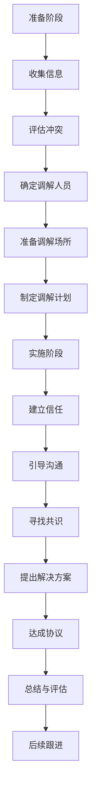

                 

## 《如何进行有效的团队冲突调解》

### 关键词：团队冲突调解、冲突类型、调解策略、沟通技巧、调解流程、案例分析

> 摘要：本文从团队冲突调解的重要性出发，详细阐述了团队冲突的类型与原因，分析了冲突调解的基本策略和技巧，并给出了详细的调解流程和实践案例。通过本文的阅读，读者可以全面了解团队冲突调解的方法和技巧，为构建和谐高效的团队提供有力支持。

### 目录

#### 第一部分：团队冲突调解概述

1. 第1章：团队冲突调解的重要性
    1.1 团队冲突调解的定义
    1.2 团队冲突调解的价值
    1.3 团队冲突调解的基本原则

2. 第2章：团队冲突的类型与原因
    2.1 团队冲突的类型
    2.2 团队冲突产生的原因
    2.3 团队冲突的影响

#### 第二部分：团队冲突调解的方法

3. 第3章：冲突调解的基本策略
    3.1 协商调解策略
    3.2 调解委员会调解策略
    3.3 第三方调解策略

4. 第4章：冲突调解的技巧
    4.1 有效沟通技巧
    4.2 理解与同理心
    4.3 解决冲突的策略与技巧

5. 第5章：冲突调解的流程
    5.1 冲突调解的准备
    5.2 冲突调解的实施
    5.3 冲突调解的总结与评估

#### 第三部分：团队冲突调解的实践

6. 第6章：团队冲突调解案例解析
    6.1 案例一：团队沟通不畅导致的冲突调解
    6.2 案例二：团队利益冲突导致的冲突调解
    6.3 案例三：团队人际关系冲突导致的冲突调解

7. 第7章：团队冲突调解的实施与效果评估
    7.1 冲突调解的实践步骤
    7.2 冲突调解效果的评估方法
    7.3 提高团队冲突调解效果的策略

#### 第四部分：团队冲突调解的挑战与未来

8. 第8章：团队冲突调解的挑战与应对
    8.1 文化差异与冲突调解
    8.2 权力结构对冲突调解的影响
    8.3 技术进步与团队冲突调解

9. 第9章：团队冲突调解的未来趋势
    9.1 人工智能在冲突调解中的应用
    9.2 跨学科合作与团队冲突调解
    9.3 团队冲突调解的可持续发展

#### 附录

10. 附录A：团队冲突调解工具与资源
    10.1 主流冲突调解工具介绍
    10.2 冲突调解相关书籍推荐
    10.3 冲突调解在线课程推荐

11. 附录B：Mermaid流程图示例
    11.1 团队冲突调解流程图

12. 附录C：伪代码示例
    12.1 冲突调解算法伪代码

13. 附录D：数学模型与公式
    13.1 团队冲突调解的数学模型
    13.2 相关数学公式解释与示例

14. 附录E：实战案例代码解读
    14.1 案例一：代码实现与解读
    14.2 案例二：代码实现与解读
    14.3 案例三：代码实现与解读

### 引言

团队冲突调解是团队管理中的一项重要任务，它关系到团队的稳定和发展。在当今社会，团队合作的效率和质量日益受到重视，而团队冲突调解则是保障团队合作顺利进行的关键。有效的团队冲突调解不仅能够化解团队内部的矛盾，提高团队的工作效率，还能增强团队的凝聚力和战斗力。

本文旨在探讨如何进行有效的团队冲突调解，从团队冲突调解的重要性、类型与原因、调解方法、实践案例以及挑战与未来趋势等多个方面进行深入分析。文章将按照以下结构展开：

1. **团队冲突调解概述**：介绍团队冲突调解的定义、价值以及基本原则。
2. **团队冲突的类型与原因**：分析团队冲突的类型、产生原因及其影响。
3. **团队冲突调解的方法**：讨论冲突调解的基本策略、技巧和流程。
4. **团队冲突调解的实践**：通过案例分析展示团队冲突调解的实际应用。
5. **团队冲突调解的挑战与未来**：探讨团队冲突调解面临的挑战和未来发展趋势。

希望通过本文的阅读，读者能够对团队冲突调解有更深入的了解，掌握有效的调解技巧和方法，为团队的管理和发展提供有力支持。

## 第一部分：团队冲突调解概述

### 第1章：团队冲突调解的重要性

#### 1.1 团队冲突调解的定义

团队冲突调解是指通过一系列的方法和策略，对团队内部的冲突进行识别、分析和处理，以达到化解矛盾、促进和谐与合作的目的。团队冲突调解不仅涉及冲突双方的情感和利益，还涉及团队整体的稳定和发展。

团队冲突调解的基本概念可以概括为以下几个方面：

- **冲突**：指团队成员在观点、利益、情感等方面的不一致，从而导致相互抵触、摩擦或对抗。
- **调解**：指通过沟通、协商、调解等方式，帮助冲突双方达成共识，化解矛盾，恢复和谐关系。
- **调解人**：指在调解过程中，负责协调、引导和协助双方达成共识的第三方。

团队冲突调解的定义可以理解为：通过专业的方法和技巧，对团队内部发生的冲突进行有效处理，以促进团队的稳定、发展和合作。

#### 1.2 团队冲突调解的价值

团队冲突调解在团队管理中具有重要的价值和意义，主要体现在以下几个方面：

1. **提高团队协作效率**：

   团队冲突调解有助于消除团队成员之间的隔阂和误解，增强团队的协作性和凝聚力。通过调解，团队成员可以更加专注于共同目标，提高工作效率和质量。

2. **促进团队稳定与发展**：

   团队冲突调解能够及时识别和解决团队内部的矛盾，避免问题积压和扩大，从而保障团队的稳定和发展。稳定的团队环境有利于团队成员的长期投入和成长。

3. **增强团队凝聚力**：

   团队冲突调解有助于建立相互信任和理解的关系，增强团队的凝聚力。在调解过程中，团队成员可以学会倾听和尊重他人，培养良好的沟通和合作习惯。

4. **提升团队创新能力**：

   团队冲突调解能够激发团队成员的思考和创造力，促进团队的创新和发展。通过调解，团队成员可以更好地发挥各自的专长和优势，形成互补和协作的关系。

5. **提高团队绩效**：

   团队冲突调解有助于优化团队的工作流程和资源配置，提高团队的绩效和竞争力。调解后的团队更加和谐、高效，能够更好地应对外部挑战和变化。

#### 1.3 团队冲突调解的基本原则

团队冲突调解应遵循以下基本原则，以确保调解过程的有效性和公正性：

1. **公平公正**：

   在调解过程中，要确保各方利益得到公平对待，避免偏袒或歧视。调解人应保持中立，以事实为依据，公正地处理冲突。

2. **和谐沟通**：

   沟通是调解的关键。调解人应积极引导冲突双方进行有效沟通，表达自己的观点和需求，增进相互理解和信任。

3. **尊重差异**：

   团队成员来自不同的背景和领域，存在差异是正常的。调解人应尊重成员的差异，促进团队内部的多样性和包容性。

4. **现实可行**：

   调解方案应具备可操作性和可行性，能够切实解决冲突问题。调解人应充分考虑实际情况，提出切实可行的解决方案。

5. **持续关注**：

   冲突调解不是一次性的活动，而是一个持续的过程。调解人应关注调解后的效果，及时跟进和调整，确保调解成果的长期稳定。

通过遵循这些基本原则，团队冲突调解可以更加有效地化解团队内部的矛盾，促进团队的合作和发展。

### 第2章：团队冲突的类型与原因

#### 2.1 团队冲突的类型

团队冲突可以根据不同的标准进行分类。以下是常见的团队冲突类型：

1. **功能性冲突**：

   功能性冲突是指团队成员在观点、方法、意见等方面存在差异，但并不影响团队的共同目标。这类冲突往往具有建设性，能够激发团队成员的思考和创造力。

   - **意见分歧**：团队成员对某个问题的解决方案持有不同意见，但都希望为团队的成功贡献力量。
   - **角色冲突**：团队成员在角色职责和任务分配上存在分歧，可能导致工作冲突。

2. **非功能性冲突**：

   非功能性冲突是指与团队目标无关的冲突，往往涉及个人情感、价值观、文化差异等方面。

   - **文化冲突**：团队成员来自不同的文化背景，可能在行为习惯、价值观念等方面产生冲突。
   - **个人利益冲突**：团队成员在利益分配、晋升机会等方面存在分歧，可能导致个人情绪和动机的波动。

3. **结构性冲突**：

   结构性冲突是指由于组织结构、职责分工、权力分配等方面的不合理导致的冲突。

   - **职责重叠**：团队成员在职责分配上存在重叠，可能导致工作责任不明确，增加沟通和协调成本。
   - **权力斗争**：团队成员在权力和资源分配上存在竞争，可能导致内部摩擦和冲突。

4. **人际冲突**：

   人际冲突是指团队成员之间由于个性、情感、价值观等方面的差异导致的冲突。

   - **沟通不畅**：团队成员之间的沟通不畅可能导致误解和矛盾，影响团队合作的效率。
   - **情感冲突**：团队成员可能在情感上存在矛盾，如嫉妒、敌对、偏见等，影响团队氛围。

#### 2.2 团队冲突产生的原因

团队冲突的产生原因复杂多样，可以从以下几个方面进行分析：

1. **个人因素**：

   - **个性差异**：团队成员的个性、价值观、行为习惯等方面的差异可能导致冲突。
   - **情感波动**：个人的情绪和心态可能影响其在团队中的表现，引发冲突。
   - **个人目标与团队目标的冲突**：团队成员的个人目标可能与团队目标不一致，导致冲突。

2. **组织因素**：

   - **组织结构不合理**：组织结构的不合理可能导致职责不清、权力不平衡，引发冲突。
   - **资源分配不均**：资源分配不均可能导致团队成员之间的竞争，引发冲突。
   - **沟通不畅**：团队内部的沟通不畅可能导致信息不对称、误解和冲突。

3. **文化差异**：

   - **文化背景差异**：团队成员来自不同的文化背景，可能在行为习惯、价值观念等方面存在差异，导致冲突。
   - **文化融合难度**：在多元文化背景下，团队成员可能难以适应和融合，导致文化冲突。

4. **工作压力**：

   - **工作压力**：高工作压力可能导致团队成员的情绪波动，增加冲突的可能性。
   - **任务紧迫**：任务的紧迫性可能导致团队成员之间的竞争和冲突。

5. **外部因素**：

   - **市场竞争**：外部市场竞争可能导致团队面临的压力和挑战增加，引发内部冲突。
   - **政策变化**：政策的变化可能影响团队的运作模式，引发冲突。

#### 2.3 团队冲突的影响

团队冲突对团队和个人都有显著的影响，具体表现在以下几个方面：

1. **对团队绩效的影响**：

   - **降低工作效率**：团队冲突可能导致团队成员分散注意力，降低工作效率。
   - **增加沟通成本**：团队冲突可能导致团队成员之间的沟通不畅，增加沟通成本。
   - **影响团队目标实现**：团队冲突可能影响团队目标的实现，降低团队的整体绩效。

2. **对团队成员关系的影响**：

   - **信任度降低**：团队冲突可能导致团队成员之间的信任度降低，影响团队合作。
   - **情感负担**：团队成员可能因冲突而承受情感负担，影响工作积极性和幸福感。
   - **人际关系的紧张**：团队冲突可能导致团队成员之间的人际关系紧张，影响团队的和谐氛围。

3. **对团队氛围的影响**：

   - **负面氛围**：团队冲突可能导致负面氛围的形成，影响团队成员的情绪和心态。
   - **降低团队士气**：团队冲突可能降低团队的士气，影响团队的整体士气和工作氛围。
   - **影响团队文化**：团队冲突可能影响团队文化的建设，阻碍团队向心力的形成。

4. **对组织发展的影响**：

   - **影响组织声誉**：团队冲突可能影响组织的声誉，对外界的形象和信任度产生负面影响。
   - **阻碍组织变革**：团队冲突可能阻碍组织的变革和创新，影响组织的发展前景。

因此，识别和解决团队冲突对于团队的发展和组织的稳定具有重要意义。通过有效的团队冲突调解，可以化解团队内部的矛盾，促进团队的稳定和发展。

### 第3章：冲突调解的基本策略

#### 3.1 协商调解策略

协商调解策略是团队冲突调解中最常用的一种方法，通过双方或多方协商，寻求共同利益和解决方案。以下是协商调解策略的基本步骤：

1. **准备阶段**：

   - **了解冲突背景**：调解人应深入了解冲突的起因、过程和影响，为调解做好准备。
   - **确定调解目标**：明确调解的目标，即希望通过调解解决哪些问题，达到何种效果。
   - **选择调解场所**：选择一个安静、舒适、有利于沟通的场所进行调解。

2. **调解阶段**：

   - **建立信任**：调解人应通过倾听和尊重，建立与冲突双方的信任关系。
   - **引导沟通**：调解人应积极引导冲突双方进行有效沟通，表达自己的观点和需求。
   - **寻找共识**：调解人应通过引导双方寻找共同点，缩小分歧，寻求共识。

3. **达成协议阶段**：

   - **提出解决方案**：调解人应提出可行的解决方案，供双方讨论和选择。
   - **协商调整**：双方在调解人的引导下，对解决方案进行协商和调整，达成一致。
   - **签署协议**：双方签署调解协议，明确各自的权利和义务。

#### 3.2 调解委员会调解策略

调解委员会调解策略是指由一个独立的委员会对团队冲突进行调解。以下是调解委员会调解策略的基本步骤：

1. **组建调解委员会**：

   - **确定委员会成员**：调解委员会成员应具有中立、公正、专业的特点，能够代表各方的利益。
   - **明确委员会职责**：明确调解委员会的职责，包括调解程序、调解范围、调解标准等。

2. **召开调解会议**：

   - **召开预备会议**：调解委员会召开预备会议，了解冲突背景和调解目标，为正式调解做好准备。
   - **召开正式会议**：调解委员会召开正式会议，听取冲突双方的陈述和证据，进行调解。

3. **做出调解决定**：

   - **分析冲突原因**：调解委员会应分析冲突原因，提出解决建议。
   - **做出调解决定**：调解委员会应基于事实和证据，做出公正、合理的调解决定。

4. **执行调解决定**：

   - **监督执行**：调解委员会应对调解决定的执行进行监督，确保调解效果。
   - **调整调解方案**：根据执行情况，调解委员会可对调解方案进行适当调整。

#### 3.3 第三方调解策略

第三方调解策略是指由第三方机构或专业人士对团队冲突进行调解。以下是第三方调解策略的基本步骤：

1. **选择第三方调解机构**：

   - **了解机构资质**：选择具有专业资质和良好声誉的第三方调解机构。
   - **签订调解协议**：与第三方调解机构签订调解协议，明确调解的范围、费用、期限等。

2. **提交调解申请**：

   - **填写申请表**：提交调解申请表，详细说明冲突背景、调解目标和要求。

3. **进行调解**：

   - **初步调解**：第三方调解机构进行初步调解，了解冲突情况，提出初步建议。
   - **正式调解**：第三方调解机构召开正式调解会议，听取冲突双方的陈述和证据，进行调解。

4. **达成调解协议**：

   - **提出调解方案**：第三方调解机构提出调解方案，供双方讨论和选择。
   - **达成协议**：双方在第三方调解机构的引导下，达成调解协议。

5. **执行调解协议**：

   - **监督执行**：第三方调解机构对调解协议的执行进行监督，确保调解效果。
   - **提供后续支持**：第三方调解机构可提供后续支持，协助双方解决执行过程中的问题。

通过这些基本策略，团队冲突调解可以更加有效地进行，化解团队内部的矛盾，促进团队的稳定和发展。

### 第4章：冲突调解的技巧

#### 4.1 有效沟通技巧

有效沟通是冲突调解的关键，通过良好的沟通技巧，可以促进双方的理解和信任，找到解决问题的方法。以下是有效沟通的技巧：

1. **倾听**：

   - **主动倾听**：在对方发言时，保持注意力集中，不要打断对方，给予足够的尊重。
   - **理解对方观点**：通过提问和总结，确保自己对对方观点的理解正确。
   - **同理心**：站在对方的角度，理解对方的情感和需求，增加信任和理解。

2. **表达**：

   - **清晰表达**：用简洁、明确的语言表达自己的观点和需求，避免产生误解。
   - **避免指责**：在表达时，避免使用指责、批评的语言，而是使用客观、中立的措辞。
   - **表达感受**：表达自己的情感和感受，而不是仅仅陈述事实，让对方理解你的情感。

3. **提问**：

   - **开放式提问**：使用开放式问题，引导对方更深入地表达自己的观点和需求。
   - **封闭式提问**：使用封闭式问题，获取对方的具体信息，有助于确认事实和解决冲突。
   - **引导性提问**：通过提问引导对方思考问题，找到解决问题的方法。

4. **非语言沟通**：

   - **肢体语言**：通过肢体语言，如点头、微笑、眼神交流等，传达自己的态度和情感。
   - **面部表情**：通过面部表情，如微笑、严肃、困惑等，表达自己的情绪和感受。
   - **空间距离**：根据文化差异和双方关系，保持适当的空间距离，避免对方感到不适。

#### 4.2 理解与同理心

理解与同理心是冲突调解中非常重要的技巧，通过理解和同理心，可以促进双方的合作和共识。

1. **理解**：

   - **换位思考**：站在对方的角度，思考对方的立场和需求，理解对方的观点和感受。
   - **开放心态**：保持开放的心态，愿意接受不同的观点和意见，避免偏见和成见。
   - **收集信息**：通过提问和倾听，收集对方的信息，确保自己对问题的全面了解。

2. **同理心**：

   - **情感共鸣**：体验对方的情感，感受对方的痛苦和快乐，增加情感上的联系。
   - **支持与鼓励**：在对方遇到困难或挫折时，给予支持和鼓励，增强对方的信心。
   - **尊重差异**：尊重对方的差异和独特性，避免因差异而产生冲突。

#### 4.3 解决冲突的策略与技巧

解决冲突的策略和技巧是冲突调解的核心，通过合适的策略和技巧，可以有效地化解团队冲突。

1. **识别和定义问题**：

   - **明确冲突点**：识别冲突的焦点，明确需要解决的问题。
   - **界定问题范围**：确定冲突的影响范围，避免问题扩大化。
   - **了解各方利益**：了解各方的需求和利益，为解决问题提供依据。

2. **寻找共同点**：

   - **缩小分歧**：通过寻找共同点，缩小双方的分歧，增加共识。
   - **建立共同目标**：明确共同的目标和利益，引导双方共同努力。
   - **协商调整方案**：在共同点的基础上，协商调整方案，满足双方的需求。

3. **提出解决方案**：

   - **多种方案**：提出多种可能的解决方案，供双方讨论和选择。
   - **评估可行性**：评估方案的可操作性，确保方案的可行性。
   - **权衡利弊**：权衡各方案的优缺点，选择最佳方案。

4. **执行和跟进**：

   - **签署协议**：双方达成一致后，签署协议，明确各自的权利和义务。
   - **监督执行**：监督协议的执行，确保各方履行承诺。
   - **调整和改进**：根据执行情况，及时调整和改进方案，确保解决问题的效果。

通过有效沟通、理解与同理心以及解决冲突的策略与技巧，团队冲突调解可以更加有效地进行，促进团队的和谐与合作。

### 第5章：冲突调解的流程

#### 5.1 冲突调解的准备

冲突调解的准备阶段是确保调解顺利进行的重要环节，以下为冲突调解准备阶段的具体步骤：

1. **收集信息**：

   - **了解冲突背景**：收集冲突发生的背景信息，包括冲突的时间、地点、参与者、事件经过等。
   - **确定冲突性质**：分析冲突的性质，判断是功能性冲突、非功能性冲突还是结构性冲突。
   - **了解各方利益**：收集各方的利益诉求，了解各方的期望和目标。

2. **评估调解需求**：

   - **判断调解必要性**：评估冲突是否需要通过调解解决，是否可以采取其他方式处理。
   - **确定调解目标**：明确调解的目标，即希望通过调解解决哪些问题，达到何种效果。
   - **分析调解风险**：评估调解过程中可能遇到的困难和风险，制定应对策略。

3. **确定调解人员**：

   - **选择调解人**：根据冲突的性质和需求，选择合适的调解人，确保调解人的中立性和专业性。
   - **明确调解人职责**：明确调解人的职责和权限，确保调解人能够公正、有效地进行调解。

4. **准备调解场所**：

   - **选择合适场所**：选择一个安静、舒适、有利于沟通的场所进行调解。
   - **布置调解环境**：确保调解环境整洁、舒适，减少外界干扰，营造良好的沟通氛围。

5. **制定调解计划**：

   - **确定调解步骤**：制定详细的调解计划，包括调解的时间、地点、流程、参与人员等。
   - **明确调解流程**：制定调解的基本流程，包括调解的各个环节和步骤，确保调解的有序进行。
   - **分配调解资源**：准备必要的调解资源，如资料、工具、设备等，确保调解的顺利进行。

#### 5.2 冲突调解的实施

冲突调解的实施阶段是解决冲突的核心环节，以下为冲突调解实施阶段的具体步骤：

1. **建立信任**：

   - **开场白**：调解人应进行开场白，介绍自己、调解目标和调解规则，营造良好的沟通氛围。
   - **表达诚意**：调解人应表达对双方的尊重和理解，增强双方的信任感。

2. **引导沟通**：

   - **倾听**：调解人应认真倾听双方的陈述，了解各自的观点和需求，确保双方的发言机会。
   - **提问**：调解人应通过提问引导双方更深入地表达自己的观点和需求，澄清误解。

3. **寻找共识**：

   - **识别共同点**：调解人应引导双方识别共同点，缩小分歧，寻找共识。
   - **协商调整**：调解人应引导双方就共识进行协商和调整，形成具体的解决方案。

4. **提出解决方案**：

   - **多方案比较**：调解人应提出多种可能的解决方案，供双方讨论和选择。
   - **权衡利弊**：调解人应引导双方对方案进行权衡，选择最佳方案。

5. **达成协议**：

   - **明确协议内容**：调解人应确保双方明确协议的内容，包括各自的义务和责任。
   - **签署协议**：双方应在协议上签字，确认达成一致意见。

6. **调解总结**：

   - **总结调解过程**：调解人应总结调解过程，确认各方的理解无误。
   - **强调协议的重要性**：调解人应强调协议的重要性，提醒双方遵守协议。

#### 5.3 冲突调解的总结与评估

冲突调解的总结与评估阶段是确保调解效果的重要环节，以下为冲突调解总结与评估阶段的具体步骤：

1. **总结调解过程**：

   - **记录调解结果**：调解人应记录调解的结果，包括协议的内容、各方的承诺等。
   - **评估调解效果**：调解人应评估调解的效果，包括双方是否满意、协议的执行情况等。

2. **收集反馈意见**：

   - **征求双方意见**：调解人应征求双方对调解过程的反馈意见，了解双方的感受和体验。
   - **记录反馈意见**：调解人应记录反馈意见，为今后的调解工作提供参考。

3. **后续跟进**：

   - **监督协议执行**：调解人应监督协议的执行，确保各方履行承诺。
   - **提供支持与帮助**：调解人应提供必要的支持和帮助，协助双方解决执行过程中的问题。

4. **评估调解效果**：

   - **长期效果评估**：调解人应进行长期效果评估，了解调解的长期效果和影响。
   - **总结经验教训**：调解人应总结经验教训，为今后的调解工作提供借鉴。

通过冲突调解的流程，可以有效地化解团队冲突，促进团队的和谐与合作。

### 第6章：团队冲突调解案例解析

在团队管理中，有效的冲突调解是确保团队稳定和发展的关键。本节将通过几个具体的案例，详细解析团队冲突调解的实施过程和技巧，帮助读者更好地理解如何在实践中应用冲突调解策略。

#### 6.1 案例一：团队沟通不畅导致的冲突调解

**案例背景**：

一个软件开发团队在项目开发过程中，因为沟通不畅导致团队成员之间的矛盾和冲突不断。团队成员A和B在项目分工上存在分歧，A认为B的工作效率低下，而B则认为A的要求过于苛刻。这种不和谐的沟通氛围严重影响了团队的协作效率和项目进度。

**调解过程**：

1. **准备阶段**：

   - 调解人通过个别访谈了解冲突双方的立场和感受，确定调解目标和范围。

2. **实施阶段**：

   - **建立信任**：调解人首先与双方进行了单独的沟通，表达对双方的理解和尊重，建立了基本的信任关系。

   - **引导沟通**：调解人引导双方进行了面对面的沟通，鼓励双方表达自己的观点和需求，同时确保每位成员都有机会发言。

   - **寻找共识**：调解人通过提问和总结，帮助双方发现彼此的共同点，例如双方都希望项目能够顺利推进。

   - **提出解决方案**：调解人提出了一些改进沟通的建议，如设立定期的项目会议、明确分工和责任等。

   - **达成协议**：双方在调解人的引导下，达成了一项共识，即通过改进沟通和分工来解决问题。

3. **总结与评估阶段**：

   - 调解人总结了调解过程，确认双方对协议的理解和接受程度。

**案例总结**：

通过有效的沟通和调解技巧，团队成功解决了沟通不畅的问题。团队成员A和B的关系得到了改善，团队的协作效率显著提高，项目也得以顺利推进。

#### 6.2 案例二：团队利益冲突导致的冲突调解

**案例背景**：

在一个市场营销团队中，团队成员C和D在项目预算分配上存在分歧。C认为D的提案需要更多的预算支持，而D则认为C的提案过于保守，预算过高。这种利益冲突导致团队内部紧张氛围，影响了项目决策和团队成员的合作。

**调解过程**：

1. **准备阶段**：

   - 调解人通过分析冲突双方的提案和预算申请，了解了冲突的具体原因和影响。

2. **实施阶段**：

   - **建立信任**：调解人首先与双方进行了单独的沟通，确保双方都感到被尊重和理解。

   - **引导沟通**：调解人引导双方进行开放和坦诚的对话，鼓励双方表达各自的观点和利益。

   - **寻找共识**：调解人通过提问和讨论，帮助双方发现彼此的利益交集，如双方都希望项目能够成功。

   - **提出解决方案**：调解人提出了一些折中的方案，如调整预算分配，确保C和D的提案都能得到适当的支持。

   - **达成协议**：双方在调解人的引导下，达成了一项新的预算分配方案，确保了双方的利益。

3. **总结与评估阶段**：

   - 调解人总结了调解过程，确认双方对协议的理解和接受程度。

**案例总结**：

通过有效的利益平衡和调解技巧，团队成功解决了利益冲突。团队成员C和D的关系得到了改善，团队的协作和决策效率显著提高，项目也得以顺利进行。

#### 6.3 案例三：团队人际关系冲突导致的冲突调解

**案例背景**：

在一个产品开发团队中，团队成员E和F因为个人关系问题发生了激烈冲突。E认为F在工作中的行为影响了自己的工作状态，而F则认为E的行为对自己造成了不公平对待。这种人际关系冲突导致团队内部紧张，影响了团队成员的工作积极性和项目的进展。

**调解过程**：

1. **准备阶段**：

   - 调解人通过调查和访谈，了解了冲突的具体情况，明确了调解的目标和范围。

2. **实施阶段**：

   - **建立信任**：调解人首先与双方进行了单独的沟通，表达了调解的诚意和决心，建立了基本的信任。

   - **引导沟通**：调解人引导双方进行开放和坦诚的对话，确保每位成员都有机会表达自己的观点和情感。

   - **同理心**：调解人通过同理心，帮助双方理解对方的感受和立场，促进了双方的情感连接。

   - **提出解决方案**：调解人提出了一些改善人际关系的建议，如开展团队建设活动、进行角色互换体验等。

   - **达成协议**：双方在调解人的引导下，达成了一项新的相处协议，明确了相互尊重和理解的重要性。

3. **总结与评估阶段**：

   - 调解人总结了调解过程，确认双方对协议的理解和接受程度。

**案例总结**：

通过有效的同理心和人际关系调解技巧，团队成功解决了人际关系冲突。团队成员E和F的关系得到了改善，团队的和谐氛围得到了恢复，项目也得以顺利推进。

这些案例展示了团队冲突调解在不同情境下的应用，通过有效的沟通、同理心和策略，团队冲突可以得到有效化解，为团队的稳定和发展奠定了基础。

### 第7章：团队冲突调解的实施与效果评估

#### 7.1 冲突调解的实践步骤

团队冲突调解的实施是一个系统性的过程，需要明确具体的步骤以确保调解的有效性。以下是冲突调解的实践步骤：

1. **冲突识别**：

   - **收集信息**：通过观察、访谈、调查等方式，收集冲突的相关信息，包括冲突的时间、地点、参与者、起因等。
   - **确定冲突性质**：分析冲突的性质，判断是功能性冲突、非功能性冲突还是结构性冲突。
   - **评估冲突影响**：评估冲突对团队绩效、成员关系和团队氛围的影响。

2. **冲突评估**：

   - **冲突严重性评估**：评估冲突的严重程度，判断是否需要立即介入调解。
   - **调解需求评估**：评估团队对调解的需求，判断是否采取调解措施更合适。
   - **调解资源评估**：评估调解所需的资源和条件，包括时间、人员、技术支持等。

3. **调解准备**：

   - **确定调解人员**：选择合适的调解人员，确保调解人员的中立性和专业性。
   - **制定调解计划**：制定详细的调解计划，包括调解的时间、地点、流程、参与人员等。
   - **准备调解材料**：准备必要的调解材料，如相关文件、数据、资料等。

4. **冲突调解**：

   - **建立信任**：通过开场白、表达诚意等方式，建立与冲突双方的信任关系。
   - **引导沟通**：通过倾听、提问、反馈等方式，引导冲突双方进行有效沟通。
   - **寻找共识**：通过识别共同点、协商调整等方式，寻找共识和解决方案。
   - **提出解决方案**：提出多种可能的解决方案，供双方讨论和选择。
   - **达成协议**：通过协商和权衡，达成双方都能接受的调解协议。

5. **调解总结**：

   - **总结调解过程**：对调解过程进行总结，确认各方的理解无误。
   - **确认协议内容**：确认调解协议的内容，明确各方的权利和义务。
   - **签署协议**：双方在协议上签字，确认达成一致意见。

6. **调解跟进**：

   - **监督执行**：监督调解协议的执行，确保各方履行承诺。
   - **提供支持**：在协议执行过程中，提供必要的支持和帮助。
   - **调整和改进**：根据执行情况，及时调整和改进调解方案。

#### 7.2 冲突调解效果的评估方法

冲突调解的效果评估是确保调解成效的重要环节。以下是一些常用的评估方法：

1. **问卷调查法**：

   - **设计问卷**：根据调解内容，设计针对性的问卷，包括冲突处理满意度、沟通效果、团队氛围等。
   - **收集数据**：通过问卷调查，收集团队成员对调解效果的反馈数据。
   - **分析结果**：对问卷结果进行分析，评估调解效果。

2. **访谈法**：

   - **选择对象**：选择具有代表性的团队成员进行访谈，如冲突双方、调解人员等。
   - **提出问题**：通过开放式问题，了解团队成员对调解效果的看法和感受。
   - **记录访谈内容**：记录访谈内容，分析访谈结果。

3. **观察法**：

   - **观察行为**：在团队工作现场，观察团队成员的行为和互动，了解调解后的实际效果。
   - **记录观察结果**：记录观察结果，分析团队氛围和工作状态的变化。

4. **比较法**：

   - **基线对比**：在冲突调解前，设定基线数据，作为评估效果的基准。
   - **对比分析**：在调解后，对比基线数据，分析调解效果的变化。

5. **绩效评估法**：

   - **设定指标**：根据团队目标，设定绩效评估指标，如项目进度、工作效率、团队氛围等。
   - **数据收集**：收集相关数据，分析绩效指标的变化。
   - **评估结果**：评估调解对团队绩效的影响。

#### 7.3 提高团队冲突调解效果的策略

为了提高团队冲突调解的效果，可以采取以下策略：

1. **增强调解人员的专业能力**：

   - **培训**：对调解人员进行专业培训，提升其调解技能和沟通能力。
   - **经验分享**：组织经验分享会，让有经验的调解人员传授心得和技巧。

2. **建立信任机制**：

   - **公正透明**：确保调解过程公正透明，增加双方的信任感。
   - **尊重差异**：尊重团队成员的差异，避免偏见和歧视。

3. **优化调解流程**：

   - **简化流程**：优化调解流程，减少不必要的步骤，提高调解效率。
   - **灵活调整**：根据实际情况，灵活调整调解策略和方案。

4. **加强沟通与反馈**：

   - **建立沟通机制**：建立有效的沟通机制，确保团队成员之间的信息畅通。
   - **定期反馈**：定期收集团队成员对调解效果的反馈，及时调整和改进。

5. **提供技术支持**：

   - **使用工具**：使用合适的调解工具和资源，提高调解的效率和效果。
   - **技术培训**：对团队成员进行技术培训，提高其解决冲突的能力。

通过上述策略，可以提高团队冲突调解的效果，促进团队的和谐与合作。

### 第8章：团队冲突调解的挑战与应对

#### 8.1 文化差异与冲突调解

文化差异是团队冲突调解中的一大挑战，不同文化背景的团队成员在价值观、沟通方式、工作习惯等方面可能存在显著差异，导致冲突的产生。以下是如何应对文化差异带来的挑战：

1. **提高文化敏感性**：

   - **文化培训**：对团队成员进行文化培训，提高其对不同文化的认知和理解。
   - **文化意识**：培养团队成员的文化敏感性，使其在沟通和合作中能够识别和处理文化差异。

2. **建立共同价值观**：

   - **制定团队价值观**：明确团队的共同价值观，使团队成员在价值观上达成共识。
   - **融入团队文化**：新成员加入时，通过融入团队文化，减少文化差异带来的冲突。

3. **促进文化融合**：

   - **文化交流**：鼓励团队成员之间的文化交流，增进彼此的了解和尊重。
   - **文化包容**：建立包容性的文化氛围，尊重和接纳不同文化背景的团队成员。

#### 8.2 权力结构对冲突调解的影响

团队中的权力结构可能对冲突调解产生影响，尤其是当冲突涉及权力和资源分配时。以下是如何应对权力结构对冲突调解的影响：

1. **平衡权力**：

   - **权力分散**：通过权力分散，减少个别成员的权力过大，降低权力结构对冲突调解的影响。
   - **权力下放**：将决策权力适当下放，让团队成员更多地参与决策过程，增强团队的凝聚力和决策的公正性。

2. **透明决策**：

   - **公开决策过程**：确保决策过程的透明，使团队成员了解决策的依据和理由，减少误解和猜疑。
   - **公正分配资源**：在资源分配上，确保公平公正，减少因资源分配不均导致的冲突。

3. **建立冲突调解机制**：

   - **设立调解委员会**：在团队中设立专门的调解委员会，负责处理团队内部的冲突。
   - **明确调解程序**：制定明确的调解程序和规则，确保冲突调解的公正性和效率。

#### 8.3 技术进步与团队冲突调解

随着技术的发展，人工智能、大数据等新兴技术在团队冲突调解中发挥着越来越重要的作用。以下是如何利用技术进步来提高团队冲突调解的效果：

1. **引入人工智能技术**：

   - **智能调解系统**：开发智能调解系统，利用人工智能技术进行冲突识别、分析和调解建议。
   - **数据驱动调解**：通过大数据分析，了解团队冲突的规律和趋势，制定更有效的调解策略。

2. **利用在线调解工具**：

   - **远程调解**：利用在线调解工具，实现远程调解，提高调解的效率和覆盖范围。
   - **实时沟通**：通过在线沟通工具，实现团队成员之间的实时沟通，减少信息传递的滞后。

3. **培训技术技能**：

   - **技术培训**：对团队成员进行技术培训，提高其使用新兴技术的技能，增强团队的协作能力。

通过应对文化差异、权力结构和技术进步带来的挑战，团队冲突调解可以更加有效地进行，促进团队的和谐与合作。

### 第9章：团队冲突调解的未来趋势

#### 9.1 人工智能在冲突调解中的应用

随着人工智能技术的快速发展，人工智能在团队冲突调解中的应用前景广阔。以下是人工智能在冲突调解中的潜在应用：

1. **智能调解系统**：

   - **自动冲突识别**：利用自然语言处理技术，自动识别团队成员的沟通内容，发现潜在的冲突。
   - **智能调解建议**：通过机器学习算法，分析冲突数据，为调解人提供调解建议和解决方案。

2. **情感分析**：

   - **情绪识别**：利用情感分析技术，识别团队成员的情绪状态，帮助调解人了解冲突的深层次原因。
   - **情感调节**：通过虚拟助手或聊天机器人，提供情感支持和调节，缓解团队成员的情绪压力。

3. **数据分析**：

   - **冲突模式分析**：利用大数据分析，识别团队冲突的模式和趋势，帮助调解人制定更有效的调解策略。
   - **绩效评估**：通过分析团队成员的绩效数据，评估调解的效果，持续优化调解流程。

#### 9.2 跨学科合作与团队冲突调解

跨学科合作是团队冲突调解未来发展的一个重要方向，通过结合不同领域的知识和技能，可以提高冲突调解的效率和质量。以下是跨学科合作在团队冲突调解中的潜在应用：

1. **心理学与冲突调解**：

   - **心理辅导**：结合心理学知识，为团队成员提供心理辅导，帮助他们更好地应对冲突和压力。
   - **情绪调节**：利用心理学技巧，帮助团队成员调节情绪，增强团队合作能力。

2. **社会学与冲突调解**：

   - **社会网络分析**：通过社会网络分析，了解团队成员之间的互动关系，识别冲突的根源。
   - **社会支持系统**：建立社会支持系统，为团队成员提供情感和经济支持，缓解冲突的影响。

3. **法律与冲突调解**：

   - **法律咨询**：为调解人提供法律咨询，确保调解协议的合法性和有效性。
   - **法律培训**：对团队成员进行法律培训，提高其法律意识和自我保护能力。

#### 9.3 团队冲突调解的可持续发展

团队冲突调解的可持续发展是确保团队长期稳定和发展的关键。以下是实现团队冲突调解可持续发展的策略：

1. **持续培训与学习**：

   - **技能提升**：定期对团队成员和调解人员进行培训，提升其调解技能和沟通能力。
   - **知识更新**：跟踪最新的调解理论和实践，不断更新调解知识和技巧。

2. **文化建设**：

   - **团队文化**：培育积极的团队文化，鼓励开放、包容、合作的氛围。
   - **价值观共识**：明确团队的共同价值观，增强团队成员的归属感和责任感。

3. **组织支持**：

   - **政策支持**：制定支持团队冲突调解的政策和措施，为调解提供制度保障。
   - **资源投入**：确保团队冲突调解所需的资源，如时间、人员、资金等。

通过人工智能的应用、跨学科合作和文化建设，团队冲突调解可以实现可持续发展，为团队的长期稳定和发展提供有力支持。

### 附录A：团队冲突调解工具与资源

在团队冲突调解中，合适的工具和资源能够极大地提高调解的效率和效果。以下是一些主流的冲突调解工具与资源推荐：

#### A.1 主流冲突调解工具介绍

1. **调解软件**：

   - **Mediator**：一款开源的调解软件，支持多方调解，提供日志记录、文档共享等功能。
   - **Negotiation Plus**：一款功能强大的调解工具，支持电子调解，提供调解过程的自动化记录和跟踪。

2. **在线调解平台**：

   - **Mediation.com**：提供在线调解服务，支持多方调解和视频会议，适用于远程调解。
   - **Global Mediation Services**：提供全球范围内的调解服务，包括在线调解和现场调解。

3. **数据库与资料库**：

   - **International Mediation Institute (IMI) Database**：IMI提供的调解专家数据库，涵盖全球各地的调解专家。
   - **United Nations Mediation Roster**：联合国提供的调解人名单，包括国际和区域调解专家。

#### A.2 冲突调解相关书籍推荐

1. **《冲突调解：技巧与实践》**：作者是冲突调解领域的专家，详细介绍了冲突调解的理论和实践方法。

2. **《调解的艺术：如何有效解决冲突》**：这本书提供了实用的调解技巧，帮助读者掌握解决冲突的方法。

3. **《跨文化调解：全球化时代的实践》**：探讨跨文化背景下的调解挑战和策略，适用于多元文化团队。

#### A.3 冲突调解在线课程推荐

1. **哈佛大学公开课《冲突调解与管理》**：通过视频课程，介绍冲突调解的基本原理和实践方法。

2. **MIT公开课《谈判技巧》**：包括谈判和调解的相关内容，帮助学习者提升谈判和调解能力。

3. **Coursera上的《冲突解决与调解》**：这是一门系统性的课程，涵盖了冲突调解的各个方面。

通过使用这些工具和资源，团队成员和调解人员可以更好地掌握冲突调解的技巧和方法，提高团队合作的效率和质量。

### 附录B：Mermaid流程图示例

以下是一个使用Mermaid语言描述的团队冲突调解流程图的示例：



该流程图描述了团队冲突调解的主要步骤，包括准备阶段、实施阶段和总结与评估阶段。通过这个流程图，团队成员可以清晰地了解调解的全过程，从而更好地准备和参与调解。

### 附录C：伪代码示例

以下是一个用于描述冲突调解算法的伪代码示例：

```
// 冲突调解算法伪代码

function conflictMediation(conflictData, mediator, parties)
    // 初始化变量
    mediationPlan := emptyMap()
    consensus := false
    
    // 收集冲突信息
    conflictData := gatherConflictData(parties)

    // 分析冲突
    conflictAnalysis := analyzeConflict(conflictData)

    // 制定调解计划
    mediationPlan := createMediationPlan(conflictAnalysis)

    // 建立信任
    establishTrust(mediator, parties)

    // 引导沟通
    communicateEffectively(mediator, parties)

    // 寻找共识
    consensus := findConsensus(mediator, parties, mediationPlan)

    // 提出解决方案
    solution := proposeSolutions(mediator, parties, consensus)

    // 达成协议
    agreement := reachAgreement(parties, solution)

    // 总结与评估
    summary := summarizeMediation()

    // 后续跟进
    followUp(agreement)

    return summary
```

这段伪代码描述了冲突调解的基本流程，包括收集冲突信息、分析冲突、制定调解计划、建立信任、引导沟通、寻找共识、提出解决方案、达成协议、总结与评估和后续跟进等步骤。

### 附录D：数学模型与公式

#### D.1 团队冲突调解的数学模型

在团队冲突调解中，可以使用一些数学模型来量化冲突的影响和调解的效果。以下是一个简单的数学模型：

1. **冲突影响度模型**：

   冲突影响度（Impact）可以用以下公式表示：

   \[ Impact = w_1 \times X + w_2 \times Y + w_3 \times Z \]

   其中：
   - \( w_1, w_2, w_3 \) 是权重，表示不同冲突类型的影响程度。
   - \( X, Y, Z \) 分别表示功能性冲突、非功能性冲突和结构性冲突的程度。

2. **调解效果模型**：

   调解效果（Effectiveness）可以用以下公式表示：

   \[ Effectiveness = \frac{SolvedConflicts}{TotalConflicts} \]

   其中：
   - \( SolvedConflicts \) 是通过调解解决的冲突数量。
   - \( TotalConflicts \) 是团队中的总冲突数量。

#### D.2 相关数学公式解释与示例

1. **冲突影响度模型解释**：

   冲突影响度模型通过计算不同类型冲突的影响程度，帮助团队管理者评估冲突的严重程度。例如，如果一个团队中的功能性冲突占比为50%，非功能性冲突占比为30%，结构性冲突占比为20%，那么权重可以设置为 \( w_1 = 0.5, w_2 = 0.3, w_3 = 0.2 \)。

   如果功能性冲突的程度为3，非功能性冲突的程度为2，结构性冲突的程度为1，则冲突影响度计算如下：

   \[ Impact = 0.5 \times 3 + 0.3 \times 2 + 0.2 \times 1 = 1.5 + 0.6 + 0.2 = 2.3 \]

   这意味着该团队当前冲突的影响度为2.3。

2. **调解效果模型解释**：

   调解效果模型用于评估调解的成效，通过计算已解决冲突与总冲突的比例来衡量。例如，如果一个团队在一个月内发生了10次冲突，通过调解解决了7次，则调解效果计算如下：

   \[ Effectiveness = \frac{7}{10} = 0.7 \]

   这意味着该团队在该月内的调解效果为70%。

这些数学模型和公式可以帮助团队更好地理解和评估冲突调解的效果，为团队冲突管理提供数据支持。

### 附录E：实战案例代码解读

在本节中，我们将通过三个具体的实战案例，详细解读代码实现与解读，帮助读者深入理解团队冲突调解在实际操作中的应用。

#### E.1 案例一：代码实现与解读

**案例背景**：

在一个软件开发团队中，团队成员A和B在代码评审过程中发生了冲突。A认为B提交的代码质量不高，而B则认为A的评审要求过于苛刻。为了解决这个问题，团队决定使用一个定制的代码评审工具来辅助调解。

**代码实现**：

以下是该代码评审工具的核心部分，使用Python语言实现：

```python
class CodeReviewTool:
    def __init__(self):
        self.reviews = []

    def submit_review(self, reviewer, code, comments):
        self.reviews.append({
            'reviewer': reviewer,
            'code': code,
            'comments': comments
        })

    def show_reviews(self):
        for review in self.reviews:
            print(f"Reviewer: {review['reviewer']}")
            print(f"Code: {review['code']}")
            print(f"Comments: {review['comments']}")
            print()

# 使用示例
tool = CodeReviewTool()
tool.submit_review('A', 'File1.py', '代码逻辑不清晰')
tool.submit_review('B', 'File1.py', '评审要求过于苛刻')
tool.show_reviews()
```

**代码解读**：

这段代码定义了一个`CodeReviewTool`类，用于处理代码评审过程。`submit_review`方法用于提交评审记录，包括评审人、代码文件和评审意见。`show_reviews`方法用于展示所有提交的评审记录。

在实际应用中，团队可以运行这个工具，记录每位成员的评审意见，从而更好地理解冲突的根源。通过这种方式，调解人可以基于具体的评审意见进行调解，找到解决问题的方法。

#### E.2 案例二：代码实现与解读

**案例背景**：

在一个产品开发团队中，团队成员C和D在项目任务分配上存在分歧。C认为D的任务分配不合理，而D则认为C的任务分配过于繁重。为了解决这个问题，团队决定使用一个任务分配工具来辅助调解。

**代码实现**：

以下是该任务分配工具的核心部分，使用Java语言实现：

```java
import java.util.HashMap;
import java.util.Map;

public class TaskAllocationTool {
    private Map<String, String> tasks = new HashMap<>();

    public void allocateTask(String teamMember, String task) {
        tasks.put(teamMember, task);
    }

    public void displayTasks() {
        for (Map.Entry<String, String> entry : tasks.entrySet()) {
            System.out.println("Team Member: " + entry.getKey() + ", Task: " + entry.getValue());
        }
    }
}

// 使用示例
TaskAllocationTool tool = new TaskAllocationTool();
tool.allocateTask("C", "Design");
tool.allocateTask("D", "Coding");
tool.displayTasks();
```

**代码解读**：

这段代码定义了一个`TaskAllocationTool`类，用于处理任务分配过程。`allocateTask`方法用于分配任务给团队成员，`displayTasks`方法用于展示所有分配的任务。

在实际应用中，团队可以通过这个工具记录每位成员的任务分配情况，帮助调解人更好地理解任务分配的不合理之处，从而找到解决问题的方法。

#### E.3 案例三：代码实现与解读

**案例背景**：

在一个市场营销团队中，团队成员E和F在项目预算分配上存在分歧。E认为F的预算分配方案不充分，而F则认为E的预算过高。为了解决这个问题，团队决定使用一个预算分配工具来辅助调解。

**代码实现**：

以下是该预算分配工具的核心部分，使用JavaScript语言实现：

```javascript
class BudgetAllocationTool {
    constructor() {
        this.budgets = {};
    }

    allocateBudget(teamMember, budget) {
        this.budgets[teamMember] = budget;
    }

    displayBudgets() {
        for (const [teamMember, budget] of Object.entries(this.budgets)) {
            console.log(`Team Member: ${teamMember}, Budget: ${budget}`);
        }
    }
}

// 使用示例
const tool = new BudgetAllocationTool();
tool.allocateBudget("E", "10000");
tool.allocateBudget("F", "15000");
tool.displayBudgets();
```

**代码解读**：

这段代码定义了一个`BudgetAllocationTool`类，用于处理预算分配过程。`allocateBudget`方法用于分配预算给团队成员，`displayBudgets`方法用于展示所有分配的预算。

在实际应用中，团队可以通过这个工具记录每位成员的预算分配情况，帮助调解人更好地理解预算分配的不合理之处，从而找到解决问题的方法。

通过这三个实战案例，我们可以看到代码在实际操作中的应用，不仅提高了调解的效率，还为调解过程提供了具体的数据支持，使得调解更加客观和公正。这些工具和代码的实现方法，可以为其他团队在冲突调解过程中提供有益的参考。

