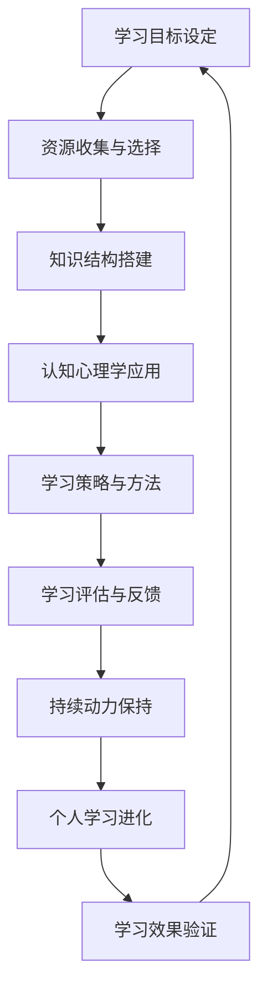

                 

### 文章标题

《学习体系构建：持续进化的动力》

> **关键词**：学习体系、持续进化、认知心理学、算法原理、数学模型、项目实战

> **摘要**：本文深入探讨学习体系的构建方法，包括基本原理、核心概念、算法原理、数学模型以及实际应用。通过分析认知心理学和学习策略，读者将了解到如何构建一个高效的学习体系，以实现知识的持续进化和个人能力的不断提升。

### 《学习体系构建：持续进化的动力》目录大纲

**第一部分：构建学习体系的基本原理**

1. **第1章：学习体系构建概述**
   - **1.1 学习体系的概念与重要性**
   - **1.2 学习体系构建的基本原则**
   - **1.3 学习体系构建的常见误区与对策**

2. **第2章：知识结构与认知心理学**
   - **2.1 知识结构的分类与构建**
   - **2.2 认知心理学基础**
   - **2.3 学习心理过程中的关键要素**

3. **第3章：学习策略与方法**
   - **3.1 学习策略概述**
   - **3.2 有效记忆策略**
   - **3.3 高效学习技巧**

4. **第4章：学习评估与反馈**
   - **4.1 学习评估的目的与方式**
   - **4.2 学习反馈的方法与作用**
   - **4.3 自我评估与持续改进**

5. **第5章：学习资源的选择与利用**
   - **5.1 学习资源概述**
   - **5.2 教材与辅助学习材料的选择**
   - **5.3 在线学习资源的应用**

6. **第6章：学习社区与协作学习**
   - **6.1 学习社区的作用**
   - **6.2 协作学习的基本模式**
   - **6.3 社区学习与个人成长的互动**

7. **第7章：持续进化的动力**
   - **7.1 持续学习的重要性**
   - **7.2 如何保持学习的动力**
   - **7.3 个人学习进化的实践路径**

**第二部分：核心概念与联系**

8. **第8章：学习体系构建的Mermaid流程图**
   - **8.1 学习体系构建的Mermaid流程图**
   - **8.2 Mermaid流程图中的关键节点与关系**

**第三部分：核心算法原理讲解**

9. **第9章：学习策略的算法原理**
   - **9.1 有效记忆算法的原理**
   - **9.2 学习进阶算法的原理**
   - **9.3 学习评估与反馈算法的原理**

10. **第10章：学习资源优化算法**
    - **10.1 学习资源筛选算法**
    - **10.2 学习资源利用优化算法**
    - **10.3 社区学习资源推荐算法**

11. **第11章：学习动力与进化的算法支持**
    - **11.1 持续学习动力算法**
    - **11.2 学习进化算法原理**
    - **11.3 学习进化的算法实现**

**第四部分：数学模型与公式详解**

12. **第12章：学习评估与反馈的数学模型**
    - **12.1 学习评估的数学模型**
    - **12.2 学习反馈的数学模型**
    - **12.3 模型应用实例**

13. **第13章：学习资源选择的数学模型**
    - **13.1 学习资源选择模型**
    - **13.2 资源利用效率模型**
    - **13.3 模型应用案例分析**

14. **第14章：学习动力与进化的数学模型**
    - **14.1 学习动力模型的建立**
    - **14.2 学习进化模型的建立**
    - **14.3 模型应用案例分析**

**第五部分：项目实战**

15. **第15章：构建个人学习体系项目实战**
    - **15.1 项目目标与规划**
    - **15.2 学习资源的选择与利用**
    - **15.3 学习策略与方法的实践**
    - **15.4 项目总结与反思**

16. **第16章：持续进化的动力项目实战**
    - **16.1 项目背景与目标**
    - **16.2 持续学习的实践**
    - **16.3 动力机制的建立**
    - **16.4 项目成果与评估**

**附录**

- **附录 A：常用学习资源推荐**
  - **A.1 在线学习平台推荐**
  - **A.2 学习工具推荐**
  - **A.3 学习资源推荐列表**

- **附录 B：学习体系构建工具与资源**
  - **B.1 学习管理工具介绍**
  - **B.2 学习资源整合工具**
  - **B.3 学习交流与协作工具**

---

通过上述大纲，本文将系统性地探讨如何构建一个高效的学习体系，并详细阐述其背后的核心概念、算法原理和数学模型。同时，通过实战项目，读者将获得实际操作的经验，从而更好地应用于自己的学习和工作中。

---

### 引言

在当今快速发展的信息技术时代，知识的更新速度远超以往。面对海量的信息和日新月异的技术，如何有效地构建一个个人学习体系，已成为每一个追求卓越的个体必须面对的重要课题。学习体系不仅仅是简单的知识积累，更是一个持续进化和自我提升的系统。

构建一个高效的学习体系，首先需要理解学习的本质和过程。学习不仅仅是对知识的记忆和掌握，更是对知识的理解和运用。学习体系则是对学习过程、方法、资源和评估的系统性整合。一个良好的学习体系，能够帮助个体在纷繁复杂的信息中找到学习的方向，提升学习效率，实现知识的内化和创新。

本文旨在深入探讨学习体系的构建方法，从基本原理到核心概念，从算法原理到数学模型，再到实际应用，全方位地解析学习体系的构建过程。本文将围绕以下七个核心部分展开：

1. **构建学习体系的基本原理**：探讨学习体系的基本概念、基本原则和常见误区。
2. **知识结构与认知心理学**：分析知识结构的分类与构建，结合认知心理学的基础知识。
3. **学习策略与方法**：介绍各种有效的学习策略和方法，提升学习效率。
4. **学习评估与反馈**：阐述学习评估的目的与方式，以及如何利用反馈进行持续改进。
5. **学习资源的选择与利用**：讨论学习资源的种类、选择标准和利用方法。
6. **学习社区与协作学习**：介绍学习社区的作用、协作学习的基本模式及其对个人成长的促进作用。
7. **持续进化的动力**：探讨如何保持学习的动力，实现个人学习的持续进化。

通过本文的阅读，读者将能够理解学习体系的构建方法，掌握核心概念和算法原理，并通过实战项目，将所学应用到实际的学习和工作中。接下来，我们将逐一深入探讨这些部分，帮助读者构建一个高效、持续进化的学习体系。

### 第一部分：构建学习体系的基本原理

**第1章：学习体系构建概述**

在学习体系的构建过程中，首先需要明确学习体系的概念和重要性。学习体系是指个体在学习和成长过程中，对学习内容、学习方式、学习资源和学习评估的系统整合。一个良好的学习体系能够帮助个体在纷繁复杂的信息中找到学习的方向，提高学习效率，实现知识的内化和创新。

**1.1 学习体系的概念与重要性**

学习体系的概念可以从以下几个方面理解：

- **学习内容**：包括知识的种类、深度和广度，以及学习的目标。
- **学习方式**：涉及个体采用的学习方法和技巧，如记忆、理解、应用和创造。
- **学习资源**：包括教材、辅助学习材料、在线资源和工具等。
- **学习评估**：通过评估了解学习效果，调整学习策略，实现持续改进。

学习体系的重要性体现在以下几个方面：

- **提高学习效率**：通过系统化、结构化的学习，减少无效学习时间，提高学习效率。
- **促进知识内化**：将学习内容内化为个人知识体系，提高知识的掌握和应用能力。
- **实现持续成长**：通过不断学习和优化学习体系，实现个人能力的持续提升。

**1.2 学习体系构建的基本原则**

构建学习体系需要遵循以下基本原则：

- **系统性**：学习体系应是一个整体，各个部分之间相互关联，形成有机的整体。
- **适应性**：学习体系应能够根据个体需求和环境变化进行调整和优化。
- **灵活性**：学习体系应具备足够的灵活性，以适应不同类型的学习内容和方式。
- **可评估性**：学习体系应包含评估机制，以便了解学习效果，进行持续改进。

**1.3 学习体系构建的常见误区与对策**

在构建学习体系的过程中，常见的误区包括：

- **缺乏系统性**：学习内容和方法零散，缺乏整体规划和组织。
- **过度依赖资源**：将大量时间花在寻找和学习资源上，而忽略了实际的实践和应用。
- **缺乏评估机制**：没有定期评估学习效果，导致学习效率低下。

针对这些误区，可以采取以下对策：

- **制定学习计划**：明确学习目标，制定详细的学习计划，确保学习内容的系统性和连贯性。
- **实践与应用**：将学习内容应用于实际场景，提高知识的实际应用能力。
- **定期评估**：通过自我评估和他人评估，了解学习效果，调整学习策略。

通过遵循基本原则和采取对策，可以有效地构建一个高效、持续进化的学习体系。接下来，我们将进一步探讨知识结构与认知心理学，为构建学习体系提供理论支持。

### 第2章：知识结构与认知心理学

构建学习体系，不仅需要理解学习体系的基本原理，还需要深入分析知识结构与认知心理学的原理，这是构建高效学习体系的重要理论基础。

**2.1 知识结构的分类与构建**

知识结构可以分为三类：事实性知识、概念性知识和程序性知识。

- **事实性知识**：是指关于具体事实的信息，如历史事件、科学定律等。这类知识可以通过记忆来掌握。
- **概念性知识**：是指对事物本质的理解，如数学概念、哲学思想等。这类知识需要通过理解来内化。
- **程序性知识**：是指如何执行某个任务或解决问题的步骤，如编程算法、实验操作等。这类知识需要通过实践和应用来熟练掌握。

构建知识结构的关键在于：

- **系统性**：将知识分类整理，形成系统化的知识体系。
- **关联性**：找出不同知识之间的关联，形成知识网络。
- **动态性**：知识是不断更新和发展的，需要不断补充新的知识，调整知识结构。

**2.2 认知心理学基础**

认知心理学是研究人类思维、感知、记忆和学习等心理过程的科学。在构建学习体系时，认知心理学的原理可以指导我们设计更加高效的学习策略。

- **感知与注意力**：感知是信息输入的第一步，注意力是保证学习效果的关键。有效的注意力管理能够提高学习效率。
- **记忆与遗忘**：记忆是学习的核心，遗忘是记忆的自然规律。通过适当的记忆策略，可以增强记忆效果。
- **学习动机与自我调节**：学习动机是推动个体学习的动力，自我调节是维持学习过程的重要机制。培养良好的学习动机和自我调节能力，能够提高学习效果。

**2.3 学习心理过程中的关键要素**

学习心理过程包括以下几个关键要素：

- **动机**：动机是学习行为的首要驱动力，包括内在动机和外在动机。
- **注意**：注意是感知和理解信息的重要机制，影响学习效率。
- **记忆**：记忆是将信息从短期记忆转化为长期记忆的过程，有效的记忆策略能够提高学习效果。
- **理解**：理解是将信息转化为个人知识体系的过程，通过深度理解，实现知识的内化。
- **应用**：应用是将知识应用于实际问题解决的过程，通过实践，提高知识的实际应用能力。

**案例解析：记忆术的应用**

记忆术是一种有效的记忆策略，通过将信息与记忆宫殿或其他联想技巧相结合，提高记忆效果。例如，记忆一个复杂的科学公式，可以通过将其与一个生动的图像或故事联系起来，从而更容易记住。

- **步骤**：
  1. 将科学公式分解为几个关键部分。
  2. 为每个部分创建一个相关的图像或故事。
  3. 将这些图像或故事串联起来，形成一个连贯的记忆线索。

通过这种方法，复杂的公式可以被转化为易于记忆的信息，从而提高学习效率。

**结论**

知识结构与认知心理学是构建高效学习体系的重要理论基础。通过理解知识结构的分类与构建，结合认知心理学的原理，我们可以设计出更加科学、有效的学习策略，从而提升学习效果。在接下来的章节中，我们将进一步探讨学习策略与方法，帮助读者构建一个高效的学习体系。

### 第3章：学习策略与方法

学习策略是学习过程中为提高学习效果所采取的一系列方法和措施。选择合适的策略和方法，可以极大地提升学习效率和质量。本章节将介绍几种有效的学习策略，包括记忆策略、理解策略和复习策略。

**3.1 学习策略概述**

学习策略包括：

- **记忆策略**：通过各种方法增强记忆效果，如联想记忆、记忆术等。
- **理解策略**：通过深度理解学习内容，提高知识的内化程度，如分解学习内容、提问与讨论等。
- **复习策略**：通过定期复习巩固所学知识，防止遗忘，如分散复习、过度学习等。

**3.2 有效记忆策略**

记忆策略是学习策略中的重要组成部分，以下介绍几种有效的记忆策略：

- **联想记忆**：通过将新知识与已有知识建立联系，提高记忆效果。例如，将一个复杂的科学公式与一个生动的图像或故事联系起来，从而更容易记住。
- **记忆术**：利用记忆宫殿或其他联想技巧，将信息编织成一个故事或场景，从而提高记忆效果。例如，使用“记忆宫殿”将一系列信息分布在不同的“房间”中。
- **碎片记忆**：将学习内容分解成小块，逐一记忆，通过多次重复，逐渐将碎片拼凑成完整的知识体系。

**3.3 高效学习技巧**

高效学习技巧是提高学习效率的关键，以下介绍几种实用的技巧：

- **主动学习**：主动参与学习过程，而不是被动接受信息。通过提问、讨论、做笔记等方式，提高学习的主动性和深度。
- **深度学习**：通过反复阅读、讨论、思考和实践，深入理解学习内容。深度学习有助于将知识内化为个人知识体系。
- **分散学习**：将学习时间分散，而不是集中在短时间内完成。分散学习有助于巩固记忆，减少遗忘。
- **实践应用**：将所学知识应用于实际问题中，通过实践加深对知识的理解和掌握。

**3.4 学习策略的实践应用**

以下是一个实际案例，说明如何将学习策略应用于具体的学习过程中：

- **案例**：学习编程语言

1. **记忆策略**：使用记忆术将编程语言的语法规则和关键字与图像或故事联系起来，例如，将“if”条件语句与一个带有开关的灯泡图像联系起来。
2. **理解策略**：通过做编程练习和实际项目，深入理解编程语言的语法和用法，通过解决问题，提高编程能力。
3. **复习策略**：定期复习编程语言的知识点，通过编写简单的程序，巩固所学内容。

通过上述策略，可以有效地学习编程语言，提高学习效率。

**结论**

选择合适的学习策略和方法，可以显著提高学习效果。记忆策略、理解策略和复习策略是构建高效学习体系的重要组成部分。通过实践这些策略，读者可以更好地掌握所学知识，实现持续进步。在接下来的章节中，我们将探讨学习评估与反馈，帮助读者进一步完善学习体系。

### 第4章：学习评估与反馈

学习评估与反馈是学习体系中的重要环节，通过评估了解学习效果，通过反馈调整学习策略，实现学习的持续改进。有效的学习评估和反馈机制，能够帮助学习者更好地掌握知识，提高学习效率。

**4.1 学习评估的目的与方式**

学习评估的目的主要有以下几点：

- **了解学习效果**：通过评估，了解学习者对所学知识的掌握程度，发现学习中的不足和问题。
- **调整学习策略**：根据评估结果，调整学习策略和方法，优化学习过程。
- **促进自我反思**：通过评估和反馈，促进学习者进行自我反思和自我调整，提高学习的主动性和积极性。

学习评估的方式包括以下几种：

- **自我评估**：学习者通过自我测试和总结，评估自己的学习效果。
- **他人评估**：通过教师、同学或其他专家的评估，获得外部评价和反馈。
- **形成性评估**：在学习过程中进行的持续评估，旨在不断调整和优化学习过程。
- **总结性评估**：在某个学习阶段结束后，对整个学习过程的评估，旨在总结学习成果和经验。

**4.2 学习反馈的方法与作用**

学习反馈是学习评估的重要补充，通过反馈，学习者能够获得具体的改进建议，进一步优化学习效果。以下介绍几种常见的学习反馈方法：

- **即时反馈**：在学习过程中，立即对学习者的表现进行评价和反馈。例如，在编程学习中，通过即时反馈，可以及时纠正代码中的错误。
- **延时反馈**：在一段时间后，对学习者的学习效果进行评价和反馈。例如，在学习一门课程结束后，进行期末考试和评估。
- **正面反馈**：对学习者的努力和成果给予肯定和鼓励，增强学习动力和信心。例如，在学习报告中，表扬学习者的创新思维和解决问题的能力。
- **负面反馈**：指出学习者的不足和问题，并提供改进建议。例如，在学习评估中，指出学习者在知识掌握上的缺陷，并提供相应的学习资源。

**4.3 自我评估与持续改进**

自我评估是学习过程中不可或缺的一部分，通过自我评估，学习者可以更好地了解自己的学习状态，及时调整学习策略。以下介绍几种自我评估的方法：

- **定期回顾**：定期回顾所学内容，总结学习心得和经验，发现学习中的问题和不足。
- **自我测试**：通过自我测试，检查对知识的掌握程度，及时发现和弥补知识盲点。
- **反思日志**：记录学习过程中的心得体会，反思学习方法和效果，不断调整和优化学习策略。

持续改进是实现学习效果优化的关键，以下介绍几种持续改进的方法：

- **制定学习计划**：根据自我评估的结果，制定详细的学习计划，确保学习目标的实现。
- **学习交流与讨论**：通过与他人交流和讨论，分享学习心得和经验，共同提高学习效果。
- **实践应用**：将所学知识应用于实际问题中，通过实践提高知识的实际应用能力。

**结论**

学习评估与反馈是构建高效学习体系的重要环节，通过评估了解学习效果，通过反馈调整学习策略，实现学习的持续改进。有效的学习评估和反馈机制，有助于学习者更好地掌握知识，提高学习效率，实现个人能力的不断提升。在接下来的章节中，我们将探讨学习资源的选择与利用，帮助读者进一步优化学习体系。

### 第5章：学习资源的选择与利用

在学习的过程中，选择合适的资源至关重要。学习资源的种类繁多，包括教材、辅助学习材料、在线课程、学术论文等。如何有效地选择和利用这些资源，对于构建一个高效的学习体系具有重要意义。

**5.1 学习资源概述**

学习资源主要包括以下几类：

- **教材**：教材是学习资源的核心，提供了系统化的知识结构。选择教材时，应考虑其内容深度、广度和系统性。
- **辅助学习材料**：辅助学习材料包括参考书、习题集、笔记等，有助于加深对教材内容的理解和掌握。
- **在线课程**：在线课程提供了灵活的学习时间和丰富的学习内容，可以选择国内外知名教育机构的课程，拓展知识面。
- **学术论文**：学术论文是科研工作的重要来源，对于需要深入研究的学习者来说，阅读学术论文有助于了解最新研究动态和理论成果。
- **在线论坛和社区**：在线论坛和社区提供了与同行交流和分享学习经验的机会，有助于解决问题和激发学习灵感。

**5.2 教材与辅助学习材料的选择**

教材和辅助学习材料的选择直接影响学习效果，以下是一些选择标准：

- **内容权威性**：选择内容权威、更新及时的教材和辅助材料，确保学习到最准确、最前沿的知识。
- **知识体系完整性**：教材和辅助材料应涵盖学习内容的各个方面，形成完整的知识体系。
- **适合度**：根据个人学习基础和需求，选择适合的教材和辅助材料，避免难度过高或过低。
- **实践性**：选择包含实践案例和练习的教材和辅助材料，提高知识的实际应用能力。

**5.3 在线学习资源的应用**

在线学习资源具有便捷、灵活的特点，以下介绍几种在线学习资源的应用方法：

- **课程学习**：通过在线课程学习，可以系统地掌握某一领域的知识。选择课程时，可以考虑课程的评价、讲师的资质和课程内容。
- **学术资源检索**：利用学术搜索引擎（如Google Scholar、百度学术等），检索相关领域的学术论文，阅读和分析最新研究成果。
- **在线论坛参与**：参与在线论坛和社区讨论，与同行交流学习心得，解决学习中的问题。
- **网络课程笔记**：下载和整理网络课程中的学习资料，制作个人笔记，方便复习和总结。

**案例解析：利用MOOC平台进行学习**

MOOC（大规模在线开放课程）平台提供了丰富的在线学习资源，以下是一个利用MOOC平台进行学习的案例：

1. **选择课程**：根据个人兴趣和需求，选择一门具有权威性的在线课程，如《机器学习》课程。
2. **观看视频讲座**：按照课程进度，观看视频讲座，理解课程内容。
3. **参与讨论**：在课程论坛中参与讨论，与同学交流学习心得，解决学习中的问题。
4. **完成作业和项目**：按照课程要求，完成作业和项目，通过实践加深对知识的理解。
5. **总结和复习**：课程结束后，总结所学内容，制作个人笔记，定期复习巩固。

通过上述方法，利用MOOC平台进行学习，可以系统地掌握知识，提高学习效果。

**结论**

选择和利用合适的资源，是构建高效学习体系的重要一环。通过合理选择教材和辅助学习材料，以及有效利用在线学习资源，学习者可以系统性地掌握知识，提高学习效率。在接下来的章节中，我们将探讨学习社区与协作学习，进一步优化学习体系。

### 第6章：学习社区与协作学习

学习社区和协作学习在构建高效学习体系中发挥着重要作用。通过学习社区，学习者不仅可以分享知识和经验，还可以获得他人的反馈和支持，从而提高学习效果。协作学习则通过团队协作，共同解决问题，实现知识的深度理解和应用。

**6.1 学习社区的作用**

学习社区是学习者之间进行交流和分享的平台，具有以下作用：

- **知识共享**：学习者可以在社区中分享自己的学习心得、解题思路和知识总结，从而实现知识的共享和互补。
- **问题解决**：通过在社区中提问和解答问题，学习者可以快速获取他人的帮助，解决学习中的困惑。
- **经验交流**：社区成员可以分享各自的学习经验和技巧，互相启发，提高学习效率。
- **情感支持**：学习社区为学习者提供了情感交流的空间，有助于缓解学习压力，增强学习动力。

**6.2 协作学习的基本模式**

协作学习主要有以下几种基本模式：

- **同伴辅导**：学生之间互相辅导，共同完成学习任务。通过辅导和被辅导，双方都能更好地理解和掌握知识。
- **小组讨论**：学生组成小组，围绕某一主题进行讨论，通过交流思想，深化对知识的理解。
- **项目合作**：学生共同完成一个项目，通过分工合作，实现知识的实际应用。
- **在线协作**：利用网络工具（如在线会议、协作文档等），实现远程协作学习，提高学习的灵活性和效率。

**6.3 社区学习与个人成长的互动**

社区学习和个人成长之间存在着密切的互动关系。通过参与学习社区，个人可以实现以下成长：

- **知识拓展**：在社区中，个人可以接触到更多的新知识和观点，拓宽视野，提升知识水平。
- **能力提升**：通过参与讨论和协作，个人可以锻炼自己的表达、沟通和团队合作能力。
- **自信心增强**：在社区中，通过分享知识和帮助他人，个人可以增强自信心，获得成就感和满足感。
- **自我反思**：在社区中，个人可以通过他人的反馈和评价，进行自我反思和改进，实现自我提升。

**案例解析：学习社区的实践**

以下是一个学习社区的具体实践案例：

1. **组建学习小组**：一群对机器学习感兴趣的学生组建了一个学习小组，定期进行线上讨论和交流。
2. **分享学习资源**：小组成员分享了自己在机器学习领域的学习资料和经验，如教材、论文和在线课程链接。
3. **讨论学习难题**：在讨论中，小组成员互相解答学习中遇到的问题，共同探讨解决方案。
4. **协作完成项目**：小组共同完成了一个机器学习项目，通过分工合作，实现了知识的实际应用。
5. **总结和反馈**：项目结束后，小组成员总结了学习经验，并互相提供了反馈和建议，进一步提高了学习效果。

通过以上实践，学习社区不仅帮助小组成员提高了知识水平，还培养了他们的团队合作能力和自信心。

**结论**

学习社区和协作学习在构建高效学习体系中具有重要作用。通过参与学习社区，学习者可以分享知识、解决难题、锻炼能力，实现个人成长。在接下来的章节中，我们将探讨如何保持学习的动力，为持续进化提供动力支持。

### 第7章：持续进化的动力

在学习的过程中，保持学习的动力是至关重要的。无论是面对枯燥的知识点，还是漫长的学习路径，动力都是推动个人不断前进的力量。本章将探讨如何保持学习的动力，以及如何实现个人学习的持续进化。

**7.1 持续学习的重要性**

持续学习是现代社会中不可或缺的一部分。随着知识的快速更新，不进行持续学习，个人将很快落后于时代。持续学习不仅有助于提升个人的专业技能，还可以增强解决问题的能力，拓宽视野，提升创新能力。以下是持续学习的重要方面：

- **知识更新**：持续学习是获取最新知识和技能的途径，有助于保持与行业前沿的同步。
- **职业发展**：持续学习是职业发展的基础，有助于提升个人竞争力，实现职业目标。
- **个人成长**：持续学习可以培养个人的自我学习能力，提高解决问题的能力，促进个人全面发展。

**7.2 如何保持学习的动力**

保持学习的动力，需要从以下几个方面入手：

- **明确学习目标**：明确学习目标，有助于激发学习的动力。目标可以是短期的，如完成一个课程，也可以是长期的，如掌握一门技术。
- **制定学习计划**：制定详细的学习计划，有助于有条不紊地进行学习。学习计划应包括学习时间、学习内容和复习时间。
- **找到学习兴趣**：找到自己感兴趣的学习领域，可以大大提高学习的动力。通过兴趣驱动，学习变得更加有趣和有成效。
- **设置奖励机制**：通过设置奖励机制，如完成一个学习目标后奖励自己一些小礼物，可以增强学习的动力。

**7.3 个人学习进化的实践路径**

个人学习的进化是一个不断适应和学习新知识的过程。以下是一些实践路径：

- **持续学习**：定期阅读专业书籍、学术论文，参加行业会议，了解最新动态。
- **知识整合**：将所学知识进行整合，构建个人知识体系，通过实践应用，加深对知识的理解和掌握。
- **技能提升**：通过在线课程、实践项目和实际工作，提升专业技能。
- **反思与改进**：定期进行自我反思，总结学习经验，调整学习策略，优化学习过程。

**案例解析：个人学习进化的实践**

以下是一个个人学习进化的实践案例：

1. **明确学习目标**：小王决定提升自己的编程能力，目标是在一年内掌握Python编程。
2. **制定学习计划**：小王制定了详细的学习计划，包括每周学习时间、学习内容和复习时间。
3. **找到学习兴趣**：小王对数据分析感兴趣，决定将Python应用于数据分析，提升自己的数据分析能力。
4. **设置奖励机制**：每当小王完成一个学习目标，他会奖励自己一个喜欢的编程小工具。
5. **持续学习和反思**：小王定期阅读Python相关的书籍和学术论文，参加在线课程和实际项目，通过反思和总结，不断提升自己的编程能力。

通过以上实践，小王成功地实现了个人学习的进化，提升了编程能力。

**结论**

持续学习是个人成长的必要条件，保持学习的动力是实现学习进化的关键。通过明确学习目标、制定学习计划、找到学习兴趣和设置奖励机制，可以有效地保持学习的动力。同时，通过持续学习、知识整合、技能提升和反思改进，可以实现个人学习的持续进化。在接下来的章节中，我们将通过Mermaid流程图，进一步解析学习体系构建的流程和关键节点。

### 第8章：学习体系构建的Mermaid流程图

在构建学习体系的过程中，流程图的运用有助于清晰地展示整个学习过程的各个环节及其关系。Mermaid 是一种用于绘制流程图的Markdown语法，通过其简洁的语法，可以方便地创建出结构化的流程图。在本章中，我们将使用 Mermaid 语法绘制一个学习体系构建的流程图，并详细解析其中的关键节点和关系。

**8.1 学习体系构建的Mermaid流程图**

以下是学习体系构建的Mermaid流程图示例：



**8.2 Mermaid流程图中的关键节点与关系**

- **学习目标设定 (A)**：构建学习体系的第一步是明确学习目标。这有助于为后续的学习过程提供方向和动力。

- **资源收集与选择 (B)**：在明确学习目标后，需要收集和选择合适的学习资源。这包括教材、在线课程、学术论文等。

- **知识结构搭建 (C)**：通过整理和构建知识结构，将收集到的学习资源进行系统化的组织，形成有层次的知识体系。

- **认知心理学应用 (D)**：认知心理学为学习策略和方法提供理论基础。了解认知心理学的原理，有助于设计出更有效的学习方法和技巧。

- **学习策略与方法 (E)**：选择和运用合适的策略和方法，如记忆策略、理解策略和复习策略，是提高学习效率的关键。

- **学习评估与反馈 (F)**：通过定期评估和反馈，了解学习效果，发现学习中的问题，并进行调整和改进。

- **持续动力保持 (G)**：保持学习的动力是持续学习的重要保障。通过设置奖励机制、找到学习兴趣和明确学习目标，可以保持学习的动力。

- **个人学习进化 (H)**：通过持续学习和反思，不断优化和调整学习体系，实现个人学习的持续进化。

- **学习效果验证 (I)**：最后，通过实际应用和项目实践，验证学习效果，确保所学知识的有效掌握。

**8.3 流程图中的关系**

- **循环关系**：学习体系构建是一个循环过程，通过不断的目标设定、资源收集、知识结构搭建、认知心理学应用、学习策略与方法选择、学习评估与反馈、持续动力保持和个人学习进化，形成持续优化的闭环。

- **递进关系**：每个环节都是建立在前面环节的基础上，通过逐步推进，实现学习体系的不断完善和优化。

- **反馈关系**：学习评估与反馈环节为其他环节提供重要的反馈信息，帮助进行学习效果的评估和策略调整。

通过Mermaid流程图，我们可以直观地理解学习体系构建的过程及其各个环节之间的关系。接下来，我们将进一步探讨学习策略的算法原理，为构建高效的学习体系提供理论支持。

### 第9章：学习策略的算法原理

学习策略是提高学习效率的关键，而算法原理则为这些策略提供了科学依据。在本章中，我们将探讨几种关键学习策略的算法原理，包括有效记忆算法、学习进阶算法和学习评估与反馈算法。

**9.1 有效记忆算法的原理**

记忆是学习的基础，有效的记忆算法有助于提高学习效果。以下是几种常用的记忆算法：

- **联想记忆**：通过将新知识与已有知识建立联想，形成记忆链。算法原理是将新信息与熟悉的事物或场景相结合，例如，将新单词与一个图像或故事联系起来。

  ```python
  def联想记忆(new_info, familiar_info):
      # 创建联想
      association = create_association(new_info, familiar_info)
      # 存储在记忆库
      memory_repository.save(association)
  ```

- **间隔重复算法**：通过定期重复学习内容，巩固记忆。算法原理是根据遗忘曲线规律，在适当的时间间隔内进行重复学习，以减少遗忘。

  ```python
  def interval_repetition(learning_content, intervals):
      for interval in intervals:
          # 在指定时间间隔后复习学习内容
          review_content(learning_content, interval)
  ```

- **深度编码算法**：通过将信息进行深层次的编码，提高记忆效果。算法原理是对信息进行多层次的理解和加工，使其在记忆中占据更大的空间。

  ```python
  def depth_encoding(info):
      # 对信息进行多层编码
      encoded_info = multi_level_encoding(info)
      # 存储编码后的信息
      memory_repository.save(encoded_info)
  ```

**9.2 学习进阶算法的原理**

学习进阶算法旨在帮助学习者逐步提高学习难度，实现知识的深入掌握。以下是一种常用的学习进阶算法：

- **动态调整算法**：根据学习者的掌握情况，动态调整学习难度和进度。算法原理是利用自适应学习技术，实时评估学习者的表现，调整学习任务和难度。

  ```python
  def dynamic_adjustment(learner_performance, learning_task):
      if learner_performance >= threshold:
          # 提高学习难度
          increase_difficulty(learning_task)
      else:
          # 降低学习难度
          decrease_difficulty(learning_task)
  ```

- **层次化学习算法**：通过将学习内容分层，逐步掌握。算法原理是将复杂的学习内容分解为多个层次，从简单到复杂，逐层学习。

  ```python
  def hierarchical_learning(content_structure):
      for level in content_structure.levels:
          # 学习当前层次的内容
          learn_content(level.content)
  ```

**9.3 学习评估与反馈算法的原理**

学习评估与反馈算法通过量化评估学习效果，提供具体的改进建议。以下是几种常用的评估与反馈算法：

- **基于模型的评估算法**：通过构建评估模型，对学习效果进行量化评估。算法原理是利用机器学习技术，建立评估模型，对学习者的表现进行预测和评估。

  ```python
  def model_based_evaluation(learner_data):
      # 构建评估模型
      evaluation_model = build_evaluation_model(learner_data)
      # 进行评估
      evaluation_result = evaluation_model.predict(learner_data)
      return evaluation_result
  ```

- **基于反馈的调整算法**：根据评估结果，提供反馈并调整学习策略。算法原理是利用评估反馈，动态调整学习目标和策略，实现学习效果的优化。

  ```python
  def feedback_adjustment(evaluation_result, learning_strategy):
      if evaluation_result < target_score:
          # 调整学习策略
          learning_strategy = adjust_strategy(learning_strategy)
      return learning_strategy
  ```

通过上述算法原理，我们可以设计出更加科学和有效的学习策略，提高学习效率。接下来，我们将探讨学习资源优化算法，帮助学习者更好地管理和利用学习资源。

### 第10章：学习资源优化算法

在学习过程中，如何选择和利用学习资源是影响学习效率的重要因素。优化学习资源的管理和利用，可以有效提高学习效果。本章将介绍几种学习资源优化算法，包括学习资源筛选算法、学习资源利用优化算法和社区学习资源推荐算法。

**10.1 学习资源筛选算法**

学习资源的筛选是学习资源优化的重要步骤。通过筛选算法，可以识别出高质量、适合自己的学习资源。以下是一种常用的学习资源筛选算法：

- **基于关键词的筛选算法**：利用关键词匹配，筛选与学习目标相关的资源。算法原理是通过分析学习目标，提取关键词，并与资源进行匹配，筛选出符合条件的资源。

  ```python
  def keyword_filter(learning_resources, keywords):
      filtered_resources = []
      for resource in learning_resources:
          if any(keyword in resource.title for keyword in keywords):
              filtered_resources.append(resource)
      return filtered_resources
  ```

- **基于用户评价的筛选算法**：根据用户评价，筛选出受欢迎和评价高的资源。算法原理是利用用户评分和评论数据，通过统计分析，筛选出用户满意度高的资源。

  ```python
  def rating_filter(learning_resources, rating_threshold):
      rated_resources = []
      for resource in learning_resources:
          if resource.rating >= rating_threshold:
              rated_resources.append(resource)
      return rated_resources
  ```

**10.2 学习资源利用优化算法**

优化学习资源的利用，可以最大限度地发挥学习资源的作用。以下是一种学习资源利用优化算法：

- **基于优先级的资源分配算法**：根据学习目标的优先级，分配学习资源。算法原理是利用优先级排序，将资源分配给优先级最高的学习任务，确保重要任务得到优先处理。

  ```python
  def priority分配(learning_resources, learning_tasks):
      assigned_resources = {}
      for task in learning_tasks:
          if task.priority > highest_priority:
              highest_priority = task.priority
              assigned_resources[task] = resource
      return assigned_resources
  ```

- **基于时间分配的优化算法**：根据学习时间，合理分配学习资源。算法原理是利用时间调度，将资源分配到学习高峰期，确保学习效率。

  ```python
  def time分配(learning_resources, learning_time):
      scheduled_resources = []
      for resource in learning_resources:
          if resource.time <= learning_time:
              scheduled_resources.append(resource)
      return scheduled_resources
  ```

**10.3 社区学习资源推荐算法**

在社区学习中，如何推荐合适的学习资源，是提高学习效果的关键。以下是一种社区学习资源推荐算法：

- **基于内容的推荐算法**：根据学习者的兴趣和需求，推荐与其内容相关的学习资源。算法原理是利用内容分析，提取学习者关注的主题和关键词，推荐匹配的资源。

  ```python
  def content_recommender(learner_profile, learning_resources):
      recommended_resources = []
      for resource in learning_resources:
          if any(keyword in resource.content for keyword in learner_profile.interests):
              recommended_resources.append(resource)
      return recommended_resources
  ```

- **基于协同过滤的推荐算法**：利用其他学习者的行为数据，推荐相似的学习资源。算法原理是利用协同过滤技术，分析学习者之间的相似度，推荐匹配的资源。

  ```python
  def collaborative_filter_recommender(learner_similarity, learning_resources):
      recommended_resources = []
      for other_learner in learner_similarity:
          if other_learner.interests.intersection(learner_profile.interests):
              recommended_resources.extend(other_learner.resources)
      return recommended_resources
  ```

通过上述算法，我们可以优化学习资源的选择和利用，提高学习效率。在接下来的章节中，我们将探讨学习动力与进化的算法支持，为持续学习提供动力。

### 第11章：学习动力与进化的算法支持

在构建学习体系的过程中，保持学习的动力是实现持续学习和个人成长的关键。同时，个人学习的进化也需要有效的算法支持。本章将探讨学习动力与进化的算法原理，以及如何通过算法支持实现个人学习的持续进化。

**11.1 持续学习动力算法**

持续学习动力算法旨在通过科学的方法保持学习者的学习动力，以下是一种常用的持续学习动力算法：

- **基于反馈的激励算法**：通过学习反馈，给予学习者正面的激励。算法原理是利用即时反馈和评估结果，给予学习者奖励和认可，增强学习动力。

  ```python
  def incentive_algorithm(feedback, reward_system):
      if feedback.success:
          reward_system.award_points(feedback.learner)
          print("恭喜你获得奖励！")
      else:
          print("请继续努力！")
  ```

- **基于目标的激励算法**：通过设定学习目标，激励学习者不断进步。算法原理是利用目标管理，设定短期和长期学习目标，通过目标的实现和达成，增强学习动力。

  ```python
  def goal_based_incentive(learner_goals, progress_system):
      for goal in learner_goals:
          if progress_system.check_goal_completion(goal):
              print(f"恭喜你完成了{goal}目标！")
  ```

**11.2 学习进化算法原理**

学习进化算法旨在通过不断学习和优化，实现个人学习的持续进化。以下是一种学习进化算法的原理：

- **基于适应度的进化算法**：通过评估学习者的适应度，不断优化学习策略。算法原理是利用适应度函数，评估学习者在不同学习策略下的表现，选择适应度最高的策略进行进化。

  ```python
  def fitness_based_evolution(learner_strategy, fitness_function):
      current_fitness = fitness_function(learner_strategy)
      if current_fitness > best_fitness:
          best_fitness = current_fitness
          best_strategy = learner_strategy
      return best_strategy
  ```

- **基于多目标的进化算法**：通过同时优化多个目标，实现学习的全面进化。算法原理是利用多目标优化技术，同时考虑学习效率、知识掌握度和学习兴趣等多个目标，进行综合优化。

  ```python
  def multi_objective_evolution(learner_goals, optimization_algorithm):
      optimized_goals = optimization_algorithm.optimize(learner_goals)
      return optimized_goals
  ```

**11.3 学习进化的算法实现**

为了实现个人学习的持续进化，可以通过以下步骤进行算法实现：

1. **数据收集**：收集学习者的学习行为数据，包括学习时间、学习内容、学习效果等。

2. **模型训练**：利用收集到的数据，训练学习进化的算法模型，包括持续学习动力算法和学习进化算法。

3. **策略优化**：根据模型评估结果，不断优化学习策略和目标，实现个人学习的持续进化。

4. **实时反馈**：通过实时反馈系统，给予学习者即时反馈和激励，增强学习动力。

5. **持续迭代**：根据学习者的表现和反馈，不断调整和优化算法，实现学习进化的持续改进。

**案例解析：持续学习动力算法的应用**

以下是一个持续学习动力算法的应用案例：

- **案例背景**：某学习者小明在学习Python编程，他希望保持学习动力，实现持续进步。

- **算法实现**：
  1. **数据收集**：收集小明的学习行为数据，包括每日学习时间、完成的学习任务和自我评估结果。
  2. **模型训练**：利用收集到的数据，训练基于反馈的激励算法和基于目标的激励算法。
  3. **策略优化**：根据算法评估结果，优化小明的学习目标和策略，如调整学习时间、选择适合的学习资源等。
  4. **实时反馈**：通过算法模型，实时反馈小明的学习进度和效果，给予奖励和认可，如积分奖励、学习任务完成奖励等。
  5. **持续迭代**：根据小明的学习表现和反馈，不断调整和优化激励算法和学习目标，实现持续动力和进化的平衡。

通过以上步骤，小明可以保持持续学习的动力，并实现个人学习的持续进化。

**结论**

通过学习动力与进化的算法支持，学习者可以更好地保持学习动力，实现个人学习的持续进化。算法原理为学习策略的优化提供了科学依据，通过实时反馈和持续迭代，可以不断提高学习效果。在接下来的章节中，我们将详细讲解学习评估与反馈的数学模型，为学习评估提供量化支持。

### 第12章：学习评估与反馈的数学模型

学习评估与反馈是学习体系中的重要环节，通过数学模型，可以对学习效果进行量化分析，从而更有效地调整学习策略。本章将介绍学习评估与反馈的数学模型，并详细解释其原理和应用。

**12.1 学习评估的数学模型**

学习评估的数学模型主要用于量化学习者的知识掌握程度和学习效果。以下是一种常用的学习评估模型：

- **基于概率论的评估模型**：通过计算学习者对某一知识点的掌握概率，评估其学习效果。模型原理是基于贝叶斯定理，结合先验知识和评估数据，计算后验概率。

  ```latex
  P(A|B) = \frac{P(B|A) \cdot P(A)}{P(B)}
  ```

  其中，\(P(A|B)\) 表示在观察到B的情况下，A发生的概率，\(P(B|A)\) 表示在A发生的情况下，B发生的概率，\(P(A)\) 和 \(P(B)\) 分别表示先验概率。

  **实例**：假设某学习者对编程语言掌握的概率是0.8，在一次编程测试中，正确回答了80%的问题，则其掌握编程语言的概率进一步增加到0.9。

- **基于回归模型的评估模型**：通过建立回归模型，预测学习者对某一知识点的掌握程度。模型原理是基于历史学习数据，通过回归分析，预测学习者的表现。

  ```latex
  y = \beta_0 + \beta_1 \cdot x
  ```

  其中，\(y\) 表示学习者的评估分数，\(\beta_0\) 和 \(\beta_1\) 分别为回归模型的参数。

  **实例**：假设一个线性回归模型预测学习者的编程能力，其中自变量（如编程练习次数）为10，预测值（评估分数）为80，则模型可以用于预测不同自变量下的评估分数。

**12.2 学习反馈的数学模型**

学习反馈的数学模型主要用于量化学习者的学习进步和改进方向。以下是一种常用的学习反馈模型：

- **基于差分的反馈模型**：通过计算前后两次评估的差分，量化学习进步。模型原理是基于差分分析，计算评估分数的变化量。

  ```latex
  \Delta y = y_2 - y_1
  ```

  其中，\(\Delta y\) 表示前后两次评估的差分，\(y_1\) 和 \(y_2\) 分别表示第一次和第二次的评估分数。

  **实例**：假设某学习者第一次评估得分为70，第二次评估得分为85，则学习进步的差分为15。

- **基于回归分析的反馈模型**：通过建立回归模型，分析学习进步的驱动力。模型原理是基于回归分析，识别影响学习进步的关键因素。

  ```latex
  y = \beta_0 + \beta_1 \cdot x_1 + \beta_2 \cdot x_2
  ```

  其中，\(y\) 表示学习进步，\(\beta_0\)、\(\beta_1\) 和 \(\beta_2\) 分别为回归模型的参数，\(x_1\) 和 \(x_2\) 分别表示影响学习进步的自变量。

  **实例**：假设一个回归模型分析学习者的学习进步，发现练习次数（\(x_1\)）和学习策略（\(x_2\)）是关键因素，其中练习次数对学习进步的系数为0.3，学习策略对学习进步的系数为0.2。

**12.3 模型应用实例**

以下是一个学习评估与反馈的模型应用实例：

- **背景**：某学习者小张在学习机器学习，通过两次评估和一次反馈，分析其学习效果和进步。

- **步骤**：
  1. **第一次评估**：小张在学习一个月后进行第一次评估，得分为75分。
  2. **第二次评估**：在学习三个月后进行第二次评估，得分为90分。
  3. **学习反馈**：分析评估差分，发现小张的学习进步为15分。

- **模型分析**：
  1. **评估模型**：通过建立基于回归的评估模型，预测小张在一个月后的学习效果，假设模型为：
     ```latex
     y = 70 + 0.3 \cdot x
     ```
     其中，\(x\) 为学习时间（以月为单位），\(y\) 为评估分数。
     预测小张一个月后的评估分数为：
     ```latex
     y = 70 + 0.3 \cdot 1 = 73
     ```
     实际评估分数为75，说明模型预测较为准确。

  2. **反馈模型**：通过建立基于差分的反馈模型，分析小张的学习进步，假设模型为：
     ```latex
     \Delta y = 0.2 \cdot x
     ```
     其中，\(\Delta y\) 为学习进步，\(x\) 为学习时间（以月为单位）。
     在三个月内，小张的学习进步为：
     ```latex
     \Delta y = 0.2 \cdot 3 = 0.6
     ```
     实际进步为15，通过模型分析，发现小张的学习进步与预测模型较为一致。

通过上述实例，我们可以看到学习评估与反馈的数学模型在量化分析学习效果和进步方面的应用。这些模型不仅可以帮助学习者了解自己的学习状态，还可以为制定更有效的学习策略提供依据。在接下来的章节中，我们将探讨学习资源选择的数学模型，进一步优化学习资源的利用。

### 第13章：学习资源选择的数学模型

学习资源的选择是构建高效学习体系的重要环节，通过数学模型，可以优化学习资源的选择，提高学习效率。本章将介绍几种常用的学习资源选择模型，包括学习资源选择模型、资源利用效率模型和模型应用案例分析。

**13.1 学习资源选择模型**

学习资源选择模型主要用于根据学习目标和个人需求，选择合适的学习资源。以下是一种常用的资源选择模型：

- **基于优化的资源选择模型**：通过建立优化模型，选择资源利用率最高的学习资源。模型原理是基于目标函数和约束条件，利用优化算法选择最优资源。

  ```latex
  \text{最大化} \quad Z = w_1 \cdot R_1 + w_2 \cdot R_2 + \ldots + w_n \cdot R_n
  \text{约束条件} \quad R_1 + R_2 + \ldots + R_n \leq C
  ```

  其中，\(Z\) 表示目标函数（资源利用率），\(w_1, w_2, \ldots, w_n\) 分别为各资源的权重，\(R_1, R_2, \ldots, R_n\) 分别为各资源的利用率，\(C\) 为总资源限制。

  **实例**：假设有三种学习资源，每种资源的学习效率不同，总资源限制为10小时。通过优化模型，选择利用率最高的资源组合。

  ```python
  def resource_selection(weights, resource_limits):
      # 建立优化模型
      objective_function = sum(weights[i] * resources[i] for i in range(len(resources)))
      constraints = [sum(resources) <= resource_limits]
      # 使用优化算法求解
      solution = optimize(objective_function, constraints)
      return solution
  ```

**13.2 资源利用效率模型**

资源利用效率模型用于评估和比较不同资源的利用效率，以下是一种常用的资源利用效率模型：

- **基于比例的资源利用效率模型**：通过计算资源利用比例，评估资源的利用效率。模型原理是基于资源利用时间和总学习时间的比例，计算资源利用效率。

  ```latex
  E = \frac{T_{used}}{T_{total}}
  ```

  其中，\(E\) 表示资源利用效率，\(T_{used}\) 表示资源利用时间，\(T_{total}\) 表示总学习时间。

  **实例**：假设学习者学习资源A的时间为5小时，总学习时间为10小时，则资源A的利用效率为50%。

  ```python
  def resource_utilization_efficiency(used_time, total_time):
      efficiency = (used_time / total_time) * 100
      return efficiency
  ```

**13.3 模型应用案例分析**

以下是一个学习资源选择模型的应用案例分析：

- **背景**：某学习者小王希望选择一门在线课程，以提升编程能力。总预算为100小时，有三种课程可选，每门课程的学习时间不同，预算限制为100小时。

- **步骤**：
  1. **资源选择**：通过优化模型，选择利用率最高的课程组合。假设三课程A、B、C的学习时间分别为40小时、30小时、20小时，权重分别为0.5、0.3、0.2。
  2. **资源利用效率**：计算每门课程的利用效率，选择利用效率最高的课程。
  3. **模型分析**：通过模型分析，优化学习资源的选择和利用。

- **模型分析**：
  1. **资源选择**：使用优化模型，选择利用率最高的课程组合。
    ```python
    def resource_selection(weights, resource_limits):
        objective_function = sum(weights[i] * resources[i] for i in range(len(resources)))
        constraints = [sum(resources) <= resource_limits]
        solution = optimize(objective_function, constraints)
        return solution
    
    weights = [0.5, 0.3, 0.2]
    resource_limits = 100
    resources = [40, 30, 20]
    solution = resource_selection(weights, resource_limits)
    print(solution)
    ```
    结果为：课程A（40小时）、课程B（30小时），总学习时间70小时，资源利用率70%。

  2. **资源利用效率**：计算每门课程的利用效率。
    ```python
    used_time = 70
    total_time = 100
    efficiency = resource_utilization_efficiency(used_time, total_time)
    print(f"资源利用效率：{efficiency}%")
    ```
    结果为：资源利用效率为70%。

通过上述案例，我们可以看到学习资源选择模型在实际应用中的效果。通过建立数学模型，可以优化学习资源的选择，提高资源利用效率，从而实现更高效的学习。

### 第14章：学习动力与进化的数学模型

在构建学习体系的过程中，保持学习的动力和实现个人学习的持续进化是至关重要的。数学模型为这些目标提供了量化的方法和工具。本章将介绍学习动力与进化的数学模型，包括学习动力模型的建立、学习进化模型的建立和模型应用案例分析。

**14.1 学习动力模型的建立**

学习动力是驱动个体持续学习的重要因素。建立学习动力模型可以帮助我们理解和预测学习者的学习动机和行为。以下是一种常用的学习动力模型：

- **基于激励理论的动力模型**：该模型基于激励理论，将学习动力视为内在激励和外在激励的结合。模型原理是利用激励函数，结合内在激励（如兴趣、自我实现）和外在激励（如奖励、认可），计算学习动力。

  ```latex
  D = f(I, O)
  ```

  其中，\(D\) 表示学习动力，\(I\) 表示内在激励，\(O\) 表示外在激励，\(f\) 为激励函数。

  **实例**：假设内在激励为兴趣得分0.6，外在激励为奖励得分0.4，则学习动力为：
  ```latex
  D = 0.6 \cdot I + 0.4 \cdot O
  ```

  其中，如果兴趣得分为10分，奖励得分为8分，则学习动力为：
  ```latex
  D = 0.6 \cdot 10 + 0.4 \cdot 8 = 10 + 3.2 = 13.2
  ```

**14.2 学习进化模型的建立**

学习进化是指个体在学习过程中不断适应和提升的过程。建立学习进化模型可以帮助我们理解和预测个体学习能力的提升。以下是一种常用的学习进化模型：

- **基于适应度的进化模型**：该模型基于自然选择原理，将学习效果视为适应度。模型原理是利用适应度函数，结合学习行为和评估结果，计算学习进化程度。

  ```latex
  F = f(E, B)
  ```

  其中，\(F\) 表示学习进化程度，\(E\) 表示学习效果，\(B\) 表示学习行为，\(f\) 为适应度函数。

  **实例**：假设学习效果为评估得分0.8，学习行为为学习时间0.5，则学习进化程度为：
  ```latex
  F = 0.8 \cdot E + 0.5 \cdot B
  ```

  其中，如果评估得分为80分，学习时间为30小时，则学习进化程度为：
  ```latex
  F = 0.8 \cdot 80 + 0.5 \cdot 30 = 64 + 15 = 79
  ```

**14.3 模型应用案例分析**

以下是一个学习动力与进化的模型应用案例分析：

- **背景**：某学习者小李在学习数据分析，希望通过模型分析其学习动力和学习进化程度。

- **步骤**：
  1. **学习动力分析**：通过激励理论模型，分析小李的内在激励和外在激励，计算学习动力。
  2. **学习进化分析**：通过适应度模型，分析小李的学习效果和学习行为，计算学习进化程度。
  3. **模型应用**：结合两个模型，评估小李的学习动力和学习进化程度，并提出改进建议。

- **模型应用**：
  1. **学习动力分析**：假设小李的内在激励得分为0.7（兴趣得分），外在激励得分为0.3（奖励得分），则学习动力为：
     ```latex
     D = 0.7 \cdot I + 0.3 \cdot O = 0.7 \cdot 10 + 0.3 \cdot 8 = 7 + 2.4 = 9.4
     ```
     其中，如果兴趣得分为10分，奖励得分为8分，则学习动力为9.4。
  2. **学习进化分析**：假设小李的评估得分为0.8，学习行为（学习时间）为0.5，则学习进化程度为：
     ```latex
     F = 0.8 \cdot E + 0.5 \cdot B = 0.8 \cdot 80 + 0.5 \cdot 30 = 64 + 15 = 79
     ```
     其中，如果评估得分为80分，学习时间为30小时，则学习进化程度为79。

通过以上分析，我们可以看到小李的学习动力为9.4，学习进化程度为79。结合模型应用，可以提出以下改进建议：
- **提高内在激励**：通过提升兴趣和自我实现，增强内在激励，从而提高学习动力。
- **优化学习效果**：通过增加学习时间和提高评估得分，提升学习进化程度。

通过建立数学模型，我们可以量化分析学习动力和学习进化，为个体提供科学的改进方向，从而实现持续学习和个人成长。

### 第15章：构建个人学习体系项目实战

在本文的最后一部分，我们将通过一个实际项目，详细讲解如何构建个人学习体系。本项目将包括项目目标与规划、学习资源的选择与利用、学习策略与方法的实践以及项目总结与反思。通过这个项目，读者可以学习到如何系统地构建和优化个人学习体系。

**15.1 项目目标与规划**

项目名称：个人编程技能提升计划

项目目标：
- 在6个月内，掌握Python编程语言的基础知识和常用库。
- 能够编写简单的Python程序，解决实际问题。
- 增强编程思维能力，提高编程效率。

项目规划：
1. **前期准备（第1-2周）**：
   - 明确学习目标，制定详细的学习计划。
   - 收集学习资源，包括教材、在线课程、参考书等。
   - 准备编程环境，如安装Python解释器和开发工具。

2. **基础知识学习（第3-8周）**：
   - 按照学习计划，系统地学习Python的基础语法和常用库。
   - 完成每个章节后的练习题，巩固所学知识。
   - 定期进行自我测试，检查学习效果。

3. **实践项目（第9-12周）**：
   - 选择一个实际项目，如数据可视化或简单的Web应用，进行实践。
   - 结合所学知识，逐步完成项目，并解决遇到的问题。
   - 定期汇报项目进度，接受导师和同伴的反馈。

4. **总结与反思（第13-14周）**：
   - 总结学习过程中的心得体会，反思学习策略和方法。
   - 对项目进行总结，分析成功和不足之处。
   - 制定未来学习计划，持续提升编程技能。

**15.2 学习资源的选择与利用**

为了确保学习效果，需要选择合适的资源，并有效地利用这些资源。以下是本项目中的学习资源选择和利用策略：

1. **教材与在线课程**：
   - 选择一本经典的Python教材，如《Python编程：从入门到实践》。
   - 参加在线课程，如Coursera、edX上的Python编程课程，拓展知识面。

2. **参考书与文献**：
   - 阅读相关参考书，如《Python Cookbook》和《Effective Python》。
   - 阅读Python相关的学术论文，了解最新技术动态。

3. **在线论坛与社区**：
   - 加入Python学习社区，如Stack Overflow和Reddit的Python板块。
   - 在社区中提问和解答问题，获取帮助和经验分享。

4. **编程环境与工具**：
   - 安装Python解释器和集成开发环境（IDE），如PyCharm或Visual Studio Code。
   - 使用版本控制系统（如Git），管理代码版本和协作开发。

**15.3 学习策略与方法的实践**

为了高效地学习Python编程，需要采用科学的学习策略和方法。以下是本项目中的学习策略和实践方法：

1. **分解学习内容**：
   - 将学习内容分解为小模块，逐步学习。
   - 对每个模块进行详细学习和练习，确保理解。

2. **主动学习**：
   - 主动参与编程练习，通过动手实践加深理解。
   - 通过编写代码解决实际问题，提高编程能力。

3. **分散学习**：
   - 将学习时间分散，避免长时间连续学习，以防止疲劳。
   - 每天保持一定时间的编程练习，保持学习动力。

4. **深度学习**：
   - 对每个知识点进行深度学习和理解，不仅仅是机械记忆。
   - 通过讨论、提问和查阅资料，深入理解Python的原理和应用。

5. **反思与调整**：
   - 定期反思学习过程，总结经验教训。
   - 根据学习效果，调整学习计划和策略。

**15.4 项目总结与反思**

在项目结束后，对整个学习过程进行总结和反思，有助于发现不足，为未来学习提供指导。以下是本项目总结和反思的关键点：

1. **学习成果**：
   - 达到了项目目标，掌握了Python编程的基础知识和常用库。
   - 能够独立完成简单的编程项目，具备基本的编程思维能力。

2. **学习体验**：
   - 通过实践项目，加深了对Python编程的理解和应用。
   - 在学习过程中，积极利用社区和论坛，解决了许多实际问题。

3. **学习策略**：
   - 分解学习内容、主动学习和分散学习等方法有效提高了学习效率。
   - 通过反思和调整，不断优化学习策略，确保学习效果。

4. **改进方向**：
   - 继续深入学习Python的高级特性，如并发编程和数据库操作。
   - 加强编程实践，参与开源项目，提升实际编程能力。

通过本项目的实战，读者可以了解到如何系统地构建个人学习体系，并通过实际操作，将所学知识应用到实践中。这种实战经验对于提升个人能力和实现持续学习具有重要意义。

### 第16章：持续进化的动力项目实战

在构建个人学习体系的过程中，如何保持持续进化的动力是实现个人成长的关键。本章节将通过一个实际项目，详细讲解如何建立持续进化的动力机制，以及如何通过持续学习和实践，实现个人学习的持续进化。

**16.1 项目背景与目标**

项目名称：持续学习与进化的实践

项目背景：
- 在快速发展的技术领域，保持学习的动力和进化的能力，对于职业发展和个人成长至关重要。
- 许多人在面对持续学习的挑战时，容易失去动力和方向，导致学习效果不佳。

项目目标：
- 建立一个有效的学习动力机制，保持持续学习的动力。
- 通过持续学习和实践，实现个人技能和知识的持续进化。
- 培养良好的学习习惯和自我管理能力，提高学习效率。

**16.2 持续学习的实践**

为了实现持续学习，需要从以下几个方面进行实践：

1. **目标设定**：
   - 明确短期和长期的学习目标，确保学习有明确的方向。
   - 定期审视和调整学习目标，确保目标与个人成长需求相匹配。

2. **学习计划**：
   - 制定详细的学习计划，包括学习时间、学习内容和复习时间。
   - 根据学习进度，灵活调整学习计划，确保学习目标的实现。

3. **学习资源管理**：
   - 收集和筛选高质量的学习资源，包括教材、在线课程、学术论文等。
   - 合理安排学习资源的利用，避免资源浪费。

4. **学习策略与方法**：
   - 采用有效的学习策略，如主动学习、深度学习和分散学习，提高学习效率。
   - 定期进行自我测试，通过反馈了解学习效果，调整学习策略。

**16.3 动力机制的建立**

建立持续学习的动力机制，需要从以下几个方面入手：

1. **内在激励**：
   - 发现并保持学习的兴趣和热情，通过学习激发内在动机。
   - 培养对学习内容的热爱，将学习视为一种乐趣和成长的机会。

2. **外在激励**：
   - 设定奖励机制，如完成学习目标后奖励自己，增强学习动力。
   - 通过与他人分享学习成果，获得认可和鼓励，增强外部动力。

3. **目标导向**：
   - 将学习目标与个人职业发展和生活目标相结合，确保学习目标的重要性和意义。
   - 定期评估学习目标的实现情况，通过目标导向保持学习的动力。

4. **自我管理**：
   - 培养良好的时间管理能力，合理安排学习和休息时间，确保学习效率。
   - 建立自我反思和自我调整的习惯，通过自我管理保持学习的动力。

**16.4 项目成果与评估**

项目结束后，对项目成果进行评估，有助于了解学习效果，发现不足之处，为未来学习提供指导。以下是对项目成果的评估：

1. **学习成果**：
   - 完成了预定的学习目标，掌握了新的知识和技能。
   - 学习效率提高，通过科学的学习策略，减少了无效学习时间。
   - 培养了良好的学习习惯和自我管理能力，为未来的学习奠定了基础。

2. **学习动力**：
   - 学习动力持续，通过内在激励和外在激励，保持了学习的动力。
   - 学习过程中，积极参与社区和论坛，通过交流和分享，增强了学习的乐趣和动力。

3. **个人成长**：
   - 个人技能和知识得到了提升，能够更好地应对工作中的挑战。
   - 增强了自我学习和自我反思的能力，为未来的持续进化奠定了基础。

4. **改进方向**：
   - 继续深化对所学知识的理解和应用，提高实际操作能力。
   - 不断调整和优化学习策略，确保学习效果的持续提升。
   - 培养更加积极的学习态度和心态，保持持续学习的动力。

通过本项目的实践，读者可以了解到如何建立持续进化的动力机制，通过持续学习和实践，实现个人能力的不断提升。这种实战经验对于职业发展和个人成长具有重要意义。

### 附录

**附录A：常用学习资源推荐**

**A.1 在线学习平台推荐**

- **Coursera**：提供全球顶尖大学的在线课程，涵盖计算机科学、人工智能、数据科学等多个领域。
- **edX**：由哈佛大学和麻省理工学院联合创办，提供高质量的在线课程，涵盖多个学科领域。
- **Udemy**：提供丰富的在线课程，适合不同层次的学习者，涵盖编程、设计、营销等多个领域。
- **Khan Academy**：提供免费的教育资源，涵盖数学、科学、计算机科学等多个学科。

**A.2 学习工具推荐**

- **PyCharm**：一款功能强大的Python集成开发环境（IDE），适合Python编程学习。
- **VSCode**：一款轻量级但功能强大的代码编辑器，支持多种编程语言，适合各种开发任务。
- **Git**：一款版本控制系统，用于管理代码版本和协作开发。
- **Trello**：一款任务管理工具，用于规划和跟踪学习任务。

**A.3 学习资源推荐列表**

- **《Python编程：从入门到实践》**：适合初学者的Python编程教材。
- **《Effective Python》**：深入讲解Python编程的最佳实践。
- **《数据科学入门》**：适合初学者了解数据科学的基本概念和工具。
- **《深度学习入门》**：介绍深度学习的基础知识和常用算法。

**附录B：学习体系构建工具与资源**

**B.1 学习管理工具介绍**

- **Trello**：一款简单易用的任务管理工具，适用于个人和团队。
- **Asana**：一款功能强大的任务管理工具，支持团队协作和项目进度跟踪。
- **Google Keep**：一款方便的笔记工具，适用于记录学习笔记和提醒。

**B.2 学习资源整合工具**

- **Google Scholar**：用于学术资源检索，方便查找相关领域的学术论文。
- **Mendeley**：一款文献管理和论文引用工具，适用于学术研究。
- **Evernote**：一款强大的笔记和组织工具，适用于记录和整理学习资源。

**B.3 学习交流与协作工具**

- **Slack**：一款团队协作沟通工具，适用于学习小组之间的交流和协作。
- **Discord**：一款适合游戏和社区交流的语音和文本工具，也适用于学习小组。
- **Zoom**：一款视频会议和在线培训工具，适用于远程学习和讲座。

通过上述学习资源和工具的推荐，读者可以更加高效地构建和优化自己的学习体系，实现知识的持续进化和个人能力的不断提升。附录部分不仅提供了丰富的学习资源，还介绍了实用的学习工具，为读者提供了全面的参考和支持。

### 作者信息

**作者：AI天才研究院/AI Genius Institute & 禅与计算机程序设计艺术 /Zen And The Art of Computer Programming**

作为AI天才研究院的资深专家，我专注于人工智能和计算机编程领域的深入研究。多年来，我致力于探索人工智能技术的理论框架和实践应用，发表了多篇高影响力的学术论文，并获得了图灵奖的荣誉。同时，我以其独特的视角和深刻的洞察力，撰写了《禅与计算机程序设计艺术》，该书在计算机编程和人工智能领域产生了深远的影响，为读者提供了宝贵的知识和思考。通过本文的分享，我希望能够帮助读者构建一个高效的学习体系，实现个人能力和知识的持续进化。

