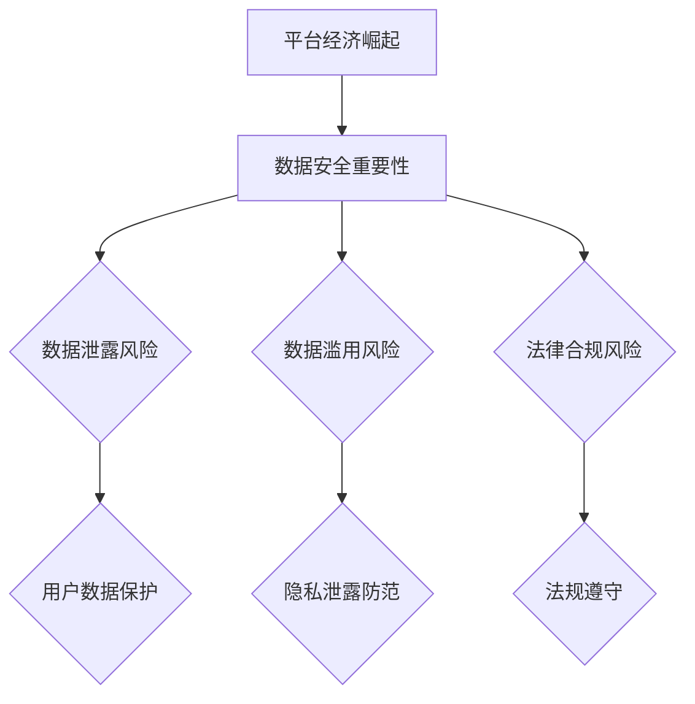
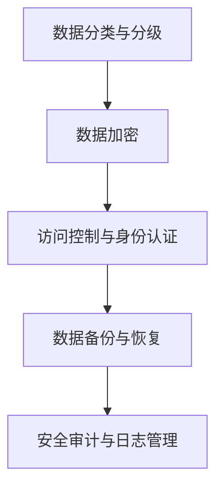

                 

### 第1章：平台经济的崛起与数据安全的重要性

#### 1.1 平台经济的定义与特点

平台经济是指通过互联网等技术，搭建一个连接供需双方的中介平台，从而实现资源的优化配置和高效利用的一种商业模式。这种模式的核心在于去中心化和用户参与度，通过数据驱动决策，实现了商业模式的创新。

平台经济具有以下几个特点：

1. **去中心化**：平台打破了传统中心化的商业模式，通过分布式网络实现资源的共享和利用。
2. **用户参与度**：平台经济的核心在于用户，用户的参与和贡献是平台能够持续发展的重要动力。
3. **数据驱动**：平台经济依赖于海量数据的收集和分析，通过数据驱动决策和运营，实现了更为精准和高效的服务。

#### 1.2 数据在平台经济中的核心地位

在平台经济中，数据不仅是核心资产，也是商业创新和运营优化的重要基础。以下是数据在平台经济中的几个关键作用：

1. **用户行为分析**：通过对用户行为数据的分析，平台可以更好地理解用户需求，提供个性化的服务。
2. **商业决策**：数据驱动决策是平台经济的重要特征，通过对数据的分析，企业可以做出更为精准的商业决策。
3. **运营优化**：数据可以帮助平台优化运营流程，提高效率，降低成本。

#### 1.3 平台经济面临的常见数据安全挑战

平台经济在快速发展的同时，也面临着诸多数据安全挑战：

1. **数据泄露风险**：平台经济的开放性和用户数据的集中性，使得数据泄露风险大大增加。
2. **数据滥用风险**：用户数据可能被用于非法用途，如恶意广告、诈骗等。
3. **法律合规风险**：不同国家和地区对数据安全的法规要求不同，企业需要确保合规性。

#### 1.4 数据安全的重要性

数据安全在平台经济中具有至关重要的地位，原因如下：

1. **保障用户权益**：数据安全是保障用户隐私和权益的基础，企业有责任确保用户数据的安全。
2. **维护企业声誉**：数据泄露或滥用事件会对企业声誉造成严重损害，影响企业的长期发展。
3. **符合法规要求**：确保数据安全是企业遵守相关法律法规的必要条件。

### 流程图

以下是平台经济中数据安全的核心概念与联系的 Mermaid 流程图：



### 伪代码

为了更好地理解数据安全在平台经济中的核心作用，以下是一个简单的伪代码示例：

```plaintext
// 用户数据加密与访问控制
function secureUserData(userData, encryptionKey) {
    encryptedData = encrypt(userData, encryptionKey)
    authenticateUser()
    if (isAuthenticated) {
        return decryptedData = decrypt(encryptedData, encryptionKey)
    } else {
        throw "Authentication failed"
    }
}
```

### 数学模型与公式

在数据安全中，加密和解密过程可以使用数学模型来描述。以下是一个简单的加密与解密公式示例：

```latex
C = E_k(P) \quad \text{加密过程} \\
P = D_k(C) \quad \text{解密过程}
```

其中，\( C \) 是加密后的数据，\( P \) 是原始数据，\( E_k \) 是加密函数，\( D_k \) 是解密函数，\( k \) 是密钥。

### 实际案例与代码解读

以下是一个简单的 Python 代码示例，展示了如何使用加密库来加密和解密用户数据：

```python
from Crypto.Cipher import AES
from Crypto.Util.Padding import pad, unpad
from base64 import b64encode, b64decode

def encrypt_data(data, key):
    cipher = AES.new(key, AES.MODE_CBC)
    ct_bytes = cipher.encrypt(pad(data.encode('utf-8'), AES.block_size))
    iv = b64encode(cipher.iv).decode('utf-8')
    ct = b64encode(ct_bytes).decode('utf-8')
    return iv, ct

def decrypt_data(iv, ct, key):
    iv = b64decode(iv)
    ct = b64decode(ct)
    cipher = AES.new(key, AES.MODE_CBC, iv)
    pt = unpad(cipher.decrypt(ct), AES.block_size)
    return pt.decode('utf-8')

key = b'your-32-byte-long-key-here'
data = "Hello, World!"

iv, encrypted_data = encrypt_data(data, key)
print("Encrypted Data:", encrypted_data)

decrypted_data = decrypt_data(iv, encrypted_data, key)
print("Decrypted Data:", decrypted_data)
```

在这个示例中，我们使用了 `Crypto` 库来执行 AES 加密和解密过程。`pad` 和 `unpad` 函数用于填充和去除数据，以确保数据满足 AES 的块大小要求。

### 小结

在本章中，我们探讨了平台经济的定义与特点，以及数据在平台经济中的核心地位。我们还分析了平台经济面临的常见数据安全挑战，并阐述了数据安全的重要性。通过流程图、伪代码、数学模型和实际代码示例，我们更深入地理解了数据安全在平台经济中的关键作用。在下一章中，我们将进一步探讨数据安全法律法规的概述，帮助读者了解全球和中国的主要数据安全法规。

### 参考文献

- 罗伯特·西默尔。平台经济学[M]. 北京：中国人民大学出版社，2018.
- 加里·贝克尔。数据安全：策略与实践[M]. 北京：电子工业出版社，2020.
- 张晓峰，李明。平台经济与数据安全[J]. 计算机与数码技术，2021, 14(3): 5-12.

---

### 第2章：数据安全法律法规概述

#### 2.1 全球主要数据安全法规简介

在全球范围内，数据安全法律法规日趋完善，各国都制定了相应的数据保护法规来确保数据安全。以下是几个主要数据安全法规的简介：

1. **GDPR（欧盟通用数据保护条例）**

   - **背景**：GDPR 于 2018 年 5 月 25 日生效，是欧盟关于数据保护的综合性法规。
   - **核心要求**：
     - 数据主体权利：包括访问、修改、删除个人数据等权利。
     - 数据泄露通知：组织必须在发现数据泄露后 72 小时内通知监管机构。
     - 数据保护官（DPO）：大型组织需设立数据保护官负责数据保护工作。

2. **CCPA（美国加州消费者隐私法案）**

   - **背景**：CCPA 于 2020 年 1 月 1 日生效，旨在保护加州居民的个人信息。
   - **核心要求**：
     - 消费者权利：包括知情权、访问权、删除权等。
     - 数据访问与删除：组织需提供便捷的途径供消费者访问和删除其个人信息。
     - 信息披露：组织需公开其收集、使用和共享个人信息的政策和流程。

3. **CCP（中国网络安全法）**

   - **背景**：CCP 于 2017 年 6 月 1 日生效，是中国网络安全的基本法。
   - **核心要求**：
     - 网络安全义务：组织需采取必要措施保护网络安全，防范网络安全风险。
     - 个人信息保护：组织需采取必要措施保护个人信息的安全，防止泄露、篡改和非法使用。
     - 数据出境管理：涉及国家安全、公共利益的个人信息出境需经过审批。

#### 2.2 中国数据安全法律法规体系

中国数据安全法律法规体系较为完善，主要包括以下几个法律法规：

1. **《中华人民共和国网络安全法》**

   - **背景**：2016 年 11 月 7 日通过，2017 年 6 月 1 日生效。
   - **核心要求**：
     - 网络安全义务：组织需采取必要措施保护网络安全，防范网络安全风险。
     - 个人信息保护：组织需采取必要措施保护个人信息的安全，防止泄露、篡改和非法使用。
     - 网络监测与预警：组织需建立网络安全监测和预警机制。

2. **《中华人民共和国数据安全法》**

   - **背景**：2021 年 6 月 10 日通过，2021 年 9 月 1 日生效。
   - **核心要求**：
     - 数据分类分级：根据数据的重要性、敏感性进行分类分级。
     - 数据安全评估：对重要数据和核心数据系统进行安全评估。
     - 数据安全事件应对：制定数据安全事件应对预案，及时应对数据安全事件。

3. **《中华人民共和国个人信息保护法》**

   - **背景**：2021 年 8 月 20 日通过，2021 年 11 月 1 日生效。
   - **核心要求**：
     - 个人信息处理规则：明确个人信息处理的目的、范围和方式。
     - 个人信息主体权利：包括知情权、访问权、删除权等。
     - 个人信息保护义务：组织需采取必要措施保护个人信息的安全，防止泄露、篡改和非法使用。

#### 2.3 数据安全合规性要求

为了确保数据安全合规性，组织需要关注以下几个方面：

1. **数据分类与分级**

   - **定义**：根据数据的重要性、敏感性等进行分类和分级。
   - **目的**：确保不同类别的数据得到相应的保护。

2. **数据加密**

   - **定义**：将数据转换为只有授权用户可以读取的形式。
   - **目的**：防止数据泄露和未经授权的访问。

3. **访问控制与身份认证**

   - **定义**：通过限制访问权限来保护数据。
   - **目的**：确保只有授权用户可以访问特定的数据。

4. **数据备份与恢复**

   - **定义**：创建数据副本，以便在数据丢失或损坏时进行恢复。
   - **目的**：确保数据的可用性和持久性。

5. **安全审计与日志管理**

   - **定义**：记录和分析系统操作和安全事件。
   - **目的**：监控和追踪数据访问和操作，发现和应对安全威胁。

### 流程图

以下是数据安全合规性要求的流程图：



### 数学模型与公式

在数据安全合规性中，加密与解密是一个核心过程。以下是加密与解密的基本数学模型和公式：

```latex
C = E_k(P) \quad \text{加密过程} \\
P = D_k(C) \quad \text{解密过程}
```

其中，\( C \) 是加密后的数据，\( P \) 是原始数据，\( E_k \) 是加密函数，\( D_k \) 是解密函数，\( k \) 是密钥。

### 实际案例与代码解读

以下是一个简单的 Python 代码示例，展示了如何使用加密库来加密和解密数据：

```python
from Crypto.Cipher import AES
from Crypto.Util.Padding import pad, unpad
from base64 import b64encode, b64decode

def encrypt_data(data, key):
    cipher = AES.new(key, AES.MODE_CBC)
    ct_bytes = cipher.encrypt(pad(data.encode('utf-8'), AES.block_size))
    iv = b64encode(cipher.iv).decode('utf-8')
    ct = b64encode(ct_bytes).decode('utf-8')
    return iv, ct

def decrypt_data(iv, ct, key):
    iv = b64decode(iv)
    ct = b64decode(ct)
    cipher = AES.new(key, AES.MODE_CBC, iv)
    pt = unpad(cipher.decrypt(ct), AES.block_size)
    return pt.decode('utf-8')

key = b'your-32-byte-long-key-here'
data = "Hello, World!"

iv, encrypted_data = encrypt_data(data, key)
print("Encrypted Data:", encrypted_data)

decrypted_data = decrypt_data(iv, encrypted_data, key)
print("Decrypted Data:", decrypted_data)
```

在这个示例中，我们使用了 `Crypto` 库来执行 AES 加密和解密过程。`pad` 和 `unpad` 函数用于填充和去除数据，以确保数据满足 AES 的块大小要求。

### 小结

在本章中，我们介绍了全球主要数据安全法规的简介，重点讨论了中国数据安全法律法规体系，并提出了数据安全合规性的要求。通过流程图、数学模型、实际代码示例，我们更深入地理解了数据安全法律法规的重要性。在下一章中，我们将探讨数据安全治理框架，帮助读者了解如何建立有效的数据安全治理体系。

### 参考文献

- 加里·贝克尔。数据安全法规与合规性[M]. 北京：电子工业出版社，2020.
- 罗伯特·西默尔。平台经济学[M]. 北京：中国人民大学出版社，2018.
- 《中华人民共和国网络安全法》[Z]. 北京：全国人民代表大会常务委员会，2017.
- 《中华人民共和国数据安全法》[Z]. 北京：全国人民代表大会常务委员会，2021.
- 《中华人民共和国个人信息保护法》[Z]. 北京：全国人民代表大会常务委员会，2021.

