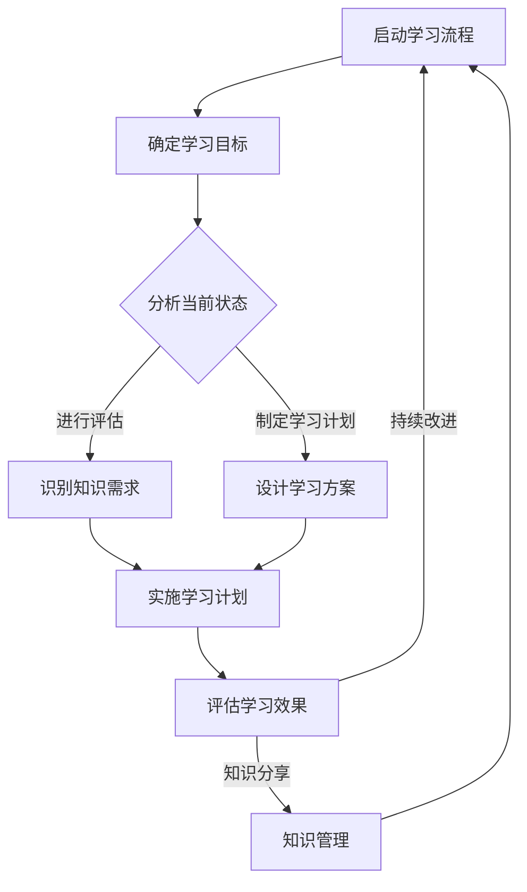
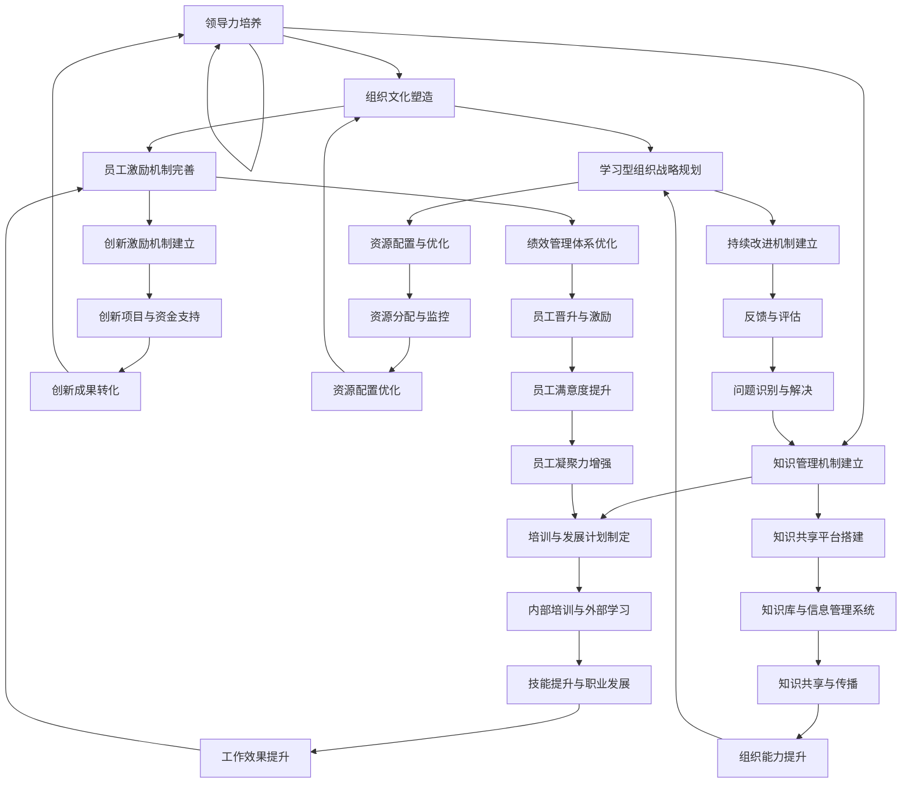

                 

# 建立学习型组织：持续进步的动力

> **关键词**：学习型组织、持续进步、创新、领导力、组织文化、战略规划、运营管理、案例分析

> **摘要**：本文将探讨学习型组织的概念、理论基础、构建方法以及其实际应用。通过分析学习型组织的核心要素，如领导力、组织文化和战略规划，我们将揭示其对企业持续进步的关键作用。同时，本文还将通过国际和国内成功案例，提供学习型组织建设的实际经验，并探讨其未来发展趋势。

### 目录大纲

#### 第一部分：引言与基础理论

- **第1章**：学习型组织的概念与价值
  - **1.1**：学习型组织的定义与特点
  - **1.2**：学习型组织与传统组织的区别
  - **1.3**：学习型组织在企业发展中的重要性
  - **1.4**：学习型组织的基本原则与实践

- **第2章**：构建学习型组织的理论基础
  - **2.1**：心理学与管理学基础
  - **2.2**：组织行为学对学习型组织的启示
  - **2.3**：学习型组织与知识管理的关系
  - **2.4**：学习型组织与组织变革

#### 第二部分：学习型组织的构建与实践

- **第3章**：领导力与学习型组织
  - **3.1**：领导者在学习型组织中的角色
  - **3.2**：领导力对学习型组织的影响
  - **3.3**：如何培养学习型领导
  - **3.4**：领导力与组织文化的互动

- **第4章**：组织文化与学习型组织
  - **4.1**：组织文化对学习型组织的影响
  - **4.2**：如何营造支持学习型组织的文化
  - **4.3**：组织文化与员工满意度的关系
  - **4.4**：组织文化的变革与创新

- **第5章**：学习型组织的战略规划
  - **5.1**：战略规划对学习型组织的重要性
  - **5.2**：学习型组织战略规划的步骤与方法
  - **5.3**：如何制定有效的学习型组织战略
  - **5.4**：战略规划与执行的关系

- **第6章**：学习型组织的运营管理
  - **6.1**：运营管理在学习型组织中的作用
  - **6.2**：学习型组织的流程优化
  - **6.3**：学习型组织的人力资源管理
  - **6.4**：学习型组织的信息管理

- **第7章**：学习型组织的创新与持续发展
  - **7.1**：创新对学习型组织的重要性
  - **7.2**：学习型组织的创新机制
  - **7.3**：持续发展对学习型组织的影响
  - **7.4**：学习型组织的可持续发展策略

#### 第三部分：学习型组织的成功案例分析

- **第8章**：学习型组织的国际案例分析
  - **8.1**：苹果公司：打造学习型组织
  - **8.2**：亚马逊：创新与学习的结合
  - **8.3**：宝洁：知识管理的典范
  - **8.4**：微软：转型与学习的力量

- **第9章**：中国企业的学习型组织实践
  - **9.1**：华为：学习型组织建设之路
  - **9.2**：腾讯：创新与学习的双轮驱动
  - **9.3**：阿里巴巴：文化建设与学习的融合
  - **9.4**：百度：持续学习与创新

#### 第10章：学习型组织的未来发展趋势
  - **10.1**：数字化转型对学习型组织的影响
  - **10.2**：人工智能与学习型组织的结合
  - **10.3**：学习型组织的国际化发展
  - **10.4**：学习型组织对可持续发展的影响

### 附录

- **附录A**：学习型组织的构建工具与资源
  - **A.1**：学习型组织评估工具
  - **A.2**：学习型组织建设指南
  - **A.3**：学习型组织相关书籍与文献推荐

- **附录B**：学习型组织的 Mermaid 流程图
  - **B.1**：组织学习流程图
  - **B.2**：学习型组织建设路径图

- **附录C**：学习型组织的核心算法原理讲解
  - **C.1**：学习型组织算法框架
  - **C.2**：伪代码实现与解释

- **附录D**：学习型组织的数学模型与公式
  - **D.1**：学习型组织关键指标公式
  - **D.2**：数学模型的应用与举例

- **附录E**：学习型组织的项目实战
  - **E.1**：实际案例介绍
  - **E.2**：开发环境搭建
  - **E.3**：源代码实现与代码解读
  - **E.4**：代码解读与分析

### 引言

在当今快速变化、竞争激烈的商业环境中，企业如何实现持续进步和创新发展成为了至关重要的课题。传统的管理模式往往注重短期效益，而忽视了组织自身的成长和变革。为了应对外部环境的挑战，越来越多的企业开始探索并实践一种新的管理模式——学习型组织。

学习型组织是一种能够不断学习、适应和变革的组织形式，其核心在于通过持续的学习和知识共享，提高组织的整体能力和创新能力。这一概念最早由管理学家彼得·圣吉（Peter Senge）在1990年的著作《第五项修炼：学习型组织的艺术与实践》中提出。圣吉认为，学习型组织具有五项核心修炼：系统思考、个人 mastery、心智模式、共同愿景和团队学习。

本文将围绕学习型组织的概念、理论基础、构建方法以及实际应用进行深入探讨。首先，我们将介绍学习型组织的定义和特点，分析其与传统组织的区别以及在企业发展中的重要性。接着，本文将探讨构建学习型组织的理论基础，包括心理学、管理学和组织行为学等方面的知识。随后，我们将深入讨论领导力、组织文化、战略规划和运营管理等核心要素，阐述它们对学习型组织的关键作用。此外，本文还将通过国际和国内的成功案例分析，提供实际经验，并探讨学习型组织的未来发展趋势。最后，我们将附录部分提供学习型组织的构建工具与资源、流程图、核心算法原理讲解、数学模型与公式以及项目实战等内容，以帮助读者更好地理解和实践学习型组织。

通过本文的阅读，读者将能够全面了解学习型组织的概念和理论基础，掌握构建学习型组织的核心要素和方法，并获得实际应用的指导。这将为企业在持续进步和创新发展中提供有力支持。

### 第1章：学习型组织的概念与价值

#### 1.1 学习型组织的定义与特点

学习型组织（Learning Organization）是指那些能够不断学习、适应和变革，从而实现持续进步和发展的组织形式。彼得·圣吉在其著作《第五项修炼：学习型组织的艺术与实践》中对学习型组织给出了以下定义：

> 学习型组织是一个能够不断学习、适应和变革的共同体，其成员能够通过共同学习来提升个人的能力，并通过协作实现组织的整体目标。

学习型组织具有以下几个显著特点：

1. **系统性思维**：学习型组织强调系统性思维，即从整体和长远的角度来看待问题，而非仅仅关注局部和短期利益。通过系统思考，组织能够更全面地理解问题的本质，从而做出更加明智的决策。

2. **自我超越**：学习型组织的成员追求自我超越，即不断提升自己的能力和知识水平，以达到个人成长和职业发展的目标。这种追求不仅有助于提升个人绩效，也有助于整个组织的发展。

3. **心智模式**：心智模式是指人们深层次的思维方式和认知结构。学习型组织通过反思和改进心智模式，帮助成员突破固有的思维定势，实现创新和变革。

4. **共同愿景**：共同愿景是学习型组织成员共同追求的目标和方向。它为组织提供了前进的动力，使成员能够齐心协力，为实现组织目标而努力。

5. **团队学习**：学习型组织强调团队学习，即通过团队合作和知识共享，提升组织的整体能力。团队学习不仅能够提高工作效率，还能够增强组织的创新能力。

#### 1.2 学习型组织与传统组织的区别

与传统组织相比，学习型组织在管理模式、组织文化、领导力和激励机制等方面存在显著区别：

1. **管理模式**：
   - **传统组织**：传统组织通常采用官僚层级管理模式，决策权集中在高层，信息流通不畅，创新和变革难以推动。
   - **学习型组织**：学习型组织采用扁平化管理模式，鼓励开放和透明的沟通，促进知识和经验的自由流动，从而加速创新和变革。

2. **组织文化**：
   - **传统组织**：传统组织文化往往强调稳定和秩序，倾向于规避风险，对新事物持保守态度。
   - **学习型组织**：学习型组织文化则强调持续学习和创新，鼓励试错和探索，对新事物持开放态度，以适应快速变化的市场环境。

3. **领导力**：
   - **传统组织**：传统领导力强调权威和指挥，领导者通常扮演决策者和执行者的角色。
   - **学习型组织**：学习型领导力则更注重激发和引导团队成员的学习和创新，领导者扮演的是教练和导师的角色。

4. **激励机制**：
   - **传统组织**：传统组织通常采用单一维度的激励机制，如绩效奖金和晋升机会，注重个人短期绩效。
   - **学习型组织**：学习型组织则采用多元化激励机制，如认可和奖励个人和团队的学习与创新，注重长期绩效和个人成长。

#### 1.3 学习型组织在企业发展中的重要性

学习型组织在企业发展中具有以下重要意义：

1. **提升创新能力**：学习型组织通过鼓励持续学习和创新，能够不断提高组织的整体创新能力，从而在激烈的市场竞争中保持优势。

2. **提高适应能力**：学习型组织能够快速适应外部环境的变化，通过不断学习和调整，实现组织的持续发展和变革。

3. **增强团队协作**：学习型组织通过团队合作和知识共享，能够增强团队协作和凝聚力，提高工作效率和绩效。

4. **促进个人成长**：学习型组织为员工提供持续学习和成长的机会，有助于提高员工的职业技能和综合素质，增强员工的职业竞争力。

5. **实现可持续发展**：学习型组织通过不断创新和优化，能够实现组织的可持续发展，为企业的长期成功奠定基础。

#### 1.4 学习型组织的基本原则与实践

构建学习型组织需要遵循以下基本原则和实践：

1. **领导先行**：领导者在学习型组织的构建中起到关键作用，他们需要率先树立学习意识，倡导学习文化，并推动组织变革。

2. **系统思考**：组织需要具备系统性思维，从整体和长远的角度来规划和执行工作，避免片面和短视的决策。

3. **知识共享**：组织应鼓励知识和经验的共享，建立有效的知识管理系统，确保知识和信息的流通。

4. **激励机制**：组织需要建立多元化激励机制，鼓励员工的学习和创新，同时关注个人和团队的长期发展。

5. **持续改进**：组织应不断反思和改进自身的工作流程和管理模式，以适应不断变化的外部环境。

通过以上原则和实践，组织可以逐步构建起一个学习型组织，为企业的持续进步和创新发展提供强大动力。

### 第2章：构建学习型组织的理论基础

构建学习型组织不仅仅是管理实践，更需要深厚的理论基础作为支撑。本章将探讨心理学、管理学和组织行为学等领域的知识，分析它们对学习型组织的启示，并探讨学习型组织与知识管理、组织变革的关系。

#### 2.1 心理学与管理学基础

心理学和管理学的知识为理解学习型组织提供了重要的理论依据。

1. **心理学基础**：
   - **认知发展理论**：认知发展理论强调个体在成长过程中，其认知能力不断发展，通过学习新的知识和技能来适应环境。学习型组织正是基于这一理论，鼓励成员不断学习，提升个人和组织的认知能力。
   - **动机理论**：动机理论探讨个体行为背后的动机来源，包括内在动机和外在动机。学习型组织通过内在动机的激发，如自我超越和共同愿景，促进成员的积极行为和持续学习。

2. **管理学基础**：
   - **组织行为学**：组织行为学关注组织中个体的行为，以及这些行为如何影响组织的整体表现。学习型组织强调团队合作和知识共享，通过改善组织行为，提升组织的整体绩效。
   - **领导理论**：领导理论探讨领导者在组织中的作用，以及如何通过有效的领导来推动组织的发展。学习型领导强调激发和引导成员的学习和创新，实现组织的持续进步。

#### 2.2 组织行为学对学习型组织的启示

组织行为学为构建学习型组织提供了重要的理论指导，主要包括以下几个方面：

1. **团队合作**：组织行为学研究表明，团队合作是提高组织绩效的关键因素。学习型组织通过建立高效的团队，鼓励成员之间的协作和知识共享，提升整体工作能力。

2. **知识共享**：知识共享是学习型组织的核心特征。组织行为学研究表明，组织内部的知识共享有助于提高创新能力和适应能力，从而推动组织的持续发展。

3. **组织文化**：组织文化对组织行为和绩效具有重要影响。学习型组织强调开放、创新和合作的文化，通过营造良好的组织氛围，鼓励成员积极参与学习和创新。

#### 2.3 学习型组织与知识管理的关系

知识管理是学习型组织的重要组成部分。学习型组织通过知识管理，实现知识的创造、共享和应用，从而提升组织的整体能力和竞争力。

1. **知识创造**：学习型组织鼓励成员通过学习和创新，不断创造新的知识。知识创造不仅包括技术知识的积累，还涉及管理理念、方法和工具的创新。

2. **知识共享**：学习型组织通过建立有效的知识共享机制，促进知识的流动和传播。知识共享不仅限于内部成员之间，还可以跨越组织边界，与其他组织进行知识交流和合作。

3. **知识应用**：学习型组织通过将知识应用于实际工作中，提高工作效率和绩效。知识应用包括将最佳实践和经验转化为标准操作流程，以及利用新知识进行产品和服务创新。

#### 2.4 学习型组织与组织变革

组织变革是学习型组织的核心任务之一。学习型组织通过持续的变革，适应外部环境的变化，实现组织的持续发展。

1. **变革动力**：学习型组织通过不断学习和创新，激发变革动力。变革动力包括外部压力（如市场变化和竞争压力）和内部动力（如组织目标和愿景的驱动）。

2. **变革过程**：学习型组织通过系统思考和管理创新，推动变革过程。变革过程包括诊断问题、制定策略、实施变革和评估效果等环节。

3. **变革管理**：学习型组织通过有效的变革管理，确保变革的顺利进行。变革管理包括建立变革领导团队、沟通变革目标、培训变革技能和激励变革参与等。

通过以上理论基础的分析，我们可以看到，构建学习型组织不仅需要心理学、管理学和组织行为学的支持，还需要知识管理和组织变革的实践。这些理论和方法为学习型组织的构建提供了重要的指导，帮助组织实现持续进步和创新发展。

### 第3章：领导力与学习型组织

领导力在学习型组织的构建中扮演着至关重要的角色。有效的领导不仅能够激发成员的学习和创新，还能够推动组织整体的发展。本章将深入探讨领导者在学习型组织中的角色、领导力对学习型组织的影响，以及如何培养学习型领导。

#### 3.1 领导者在学习型组织中的角色

在学习型组织中，领导者的角色发生了显著变化。传统领导者主要关注指挥和控制，而学习型领导则更注重激励和引导。

1. **变革推动者**：学习型领导是组织变革的推动者，他们通过激发和引导成员的学习和创新，推动组织不断进步。变革推动者需要具备敏锐的洞察力和强烈的变革意愿，能够及时识别外部环境的变化，并带领组织进行相应的调整。

2. **知识传播者**：学习型领导是知识传播的推动者，他们通过建立有效的知识共享机制，促进组织内部的知识流动和传播。知识传播者需要具备丰富的知识和经验，能够将自身的知识和经验传递给其他成员。

3. **团队成员**：学习型领导将自身视为团队成员，而非仅仅是一个指挥者。他们积极参与团队活动，与团队成员共同学习和成长。团队成员的角色不仅有助于增强组织的凝聚力，还能够促进知识共享和协作。

4. **教练和导师**：学习型领导扮演教练和导师的角色，他们通过指导和辅导成员，帮助他们克服困难，实现个人和职业发展。教练和导师的角色有助于提升成员的技能和知识水平，从而提高组织的整体绩效。

#### 3.2 领导力对学习型组织的影响

领导力对学习型组织的影响表现在以下几个方面：

1. **文化塑造**：领导力是组织文化的重要组成部分。有效的领导能够塑造积极的组织文化，鼓励持续学习和创新。领导者通过自身的言行，树立学习的榜样，推动组织形成学习型文化。

2. **激励和引导**：领导力能够激发成员的学习和创新动力。有效的领导者能够识别成员的需求和潜力，通过激励和引导，帮助他们实现个人和职业目标。这种激励和引导不仅有助于提升成员的技能和知识水平，还能够增强组织的创新能力。

3. **知识共享**：领导力是知识共享的重要推动力。有效的领导者通过建立知识共享机制，促进组织内部的知识流动和传播。领导者的榜样作用和影响力，能够激发成员积极参与知识共享，从而提升组织的整体知识水平。

4. **变革推动**：领导力是推动组织变革的关键因素。有效的领导者能够带领组织应对外部环境的变化，进行相应的调整和变革。领导者的变革意愿和执行力，能够推动组织实现持续进步和创新发展。

#### 3.3 如何培养学习型领导

培养学习型领导是构建学习型组织的重要任务。以下是一些培养学习型领导的策略：

1. **持续学习**：学习型领导需要具备持续学习的意识和能力。组织可以通过培训、读书会和在线学习等方式，帮助领导者不断提升自身的知识水平和技能。

2. **知识分享**：学习型领导需要具备知识分享的意识和能力。组织可以通过内部培训和研讨会，鼓励领导者分享自身的知识和经验，促进知识的传播和共享。

3. **领导力培训**：组织可以提供专门的领导力培训，帮助领导者提升领导力和管理技能。培训内容可以包括领导力理论、管理实践和领导力发展等。

4. **实践锻炼**：学习型领导需要通过实践来锻炼和提升自身的能力。组织可以通过项目管理和团队建设等活动，为领导者提供实践锻炼的机会。

5. **榜样示范**：组织可以通过树立学习型领导者的榜样，激励其他领导者向他们学习。榜样的力量能够激发领导者积极参与学习和创新。

通过以上策略，组织可以培养出一批具备学习意识和管理能力的学习型领导，为构建学习型组织提供有力支持。

#### 3.4 领导力与组织文化的互动

领导力与组织文化之间存在密切的互动关系。有效的领导力能够塑造积极的组织文化，而积极的组织文化又能够强化领导力的效果。

1. **领导力塑造组织文化**：领导者的言行和行为对组织文化具有深远影响。领导者通过树立榜样、制定规章制度和推动变革，能够塑造组织文化。例如，一个注重持续学习和创新的领导者，能够推动组织形成学习型文化。

2. **组织文化强化领导力**：积极的组织文化能够强化领导力的效果。在一个支持学习和创新的组织中，领导者的领导力和管理能力更容易得到认可和发挥。这种互动关系有助于形成良好的领导力和组织文化氛围。

3. **领导力与组织文化的良性互动**：领导力和组织文化之间的良性互动能够促进组织的持续进步。领导者通过塑造积极的文化，激发成员的学习和创新动力，而成员通过积极的行为和态度，进一步强化组织文化。这种良性互动有助于实现组织的长期发展和成功。

通过以上分析，我们可以看到，领导力在学习型组织的构建中具有关键作用。有效的领导力不仅能够推动组织的持续进步和创新发展，还能够塑造积极的组织文化，实现领导力与组织文化的良性互动。这为构建学习型组织提供了重要的理论支持和实践指导。

### 第4章：组织文化与学习型组织

组织文化是学习型组织的核心要素之一，它不仅影响员工的行为和态度，还直接关系到组织的绩效和创新能力。本章将探讨组织文化对学习型组织的影响、如何营造支持学习型组织的文化、组织文化与员工满意度的关系，以及组织文化的变革与创新。

#### 4.1 组织文化对学习型组织的影响

组织文化对学习型组织的影响表现在以下几个方面：

1. **激励作用**：组织文化能够激励员工积极参与学习和创新。在一个重视学习和成长的文化中，员工更容易被激励去学习新知识、掌握新技能，并尝试新的工作方法。

2. **导向作用**：组织文化为员工提供明确的价值观和行为准则，引导员工朝着组织目标努力。例如，一个倡导开放和分享的文化，能够鼓励员工相互学习，共同进步。

3. **凝聚作用**：组织文化能够增强员工的归属感和凝聚力。在一个有共同价值观和目标的组织中，员工更容易形成团队精神，共同面对挑战。

4. **创新动力**：组织文化能够激发员工的创新思维和创造力。在一个鼓励尝试和容错的文化中，员工更有勇气提出新的想法和解决方案，推动组织的创新和发展。

#### 4.2 如何营造支持学习型组织的文化

要营造一个支持学习型组织的文化，组织可以采取以下策略：

1. **领导示范**：领导者需要通过自己的言行来树立学习的榜样，展示对学习和创新的重视。领导者可以通过定期举办学习分享会、参与培训项目等方式，激发员工的学习热情。

2. **鼓励创新**：组织需要鼓励员工尝试新的方法和思路，并对创新行为给予认可和奖励。这可以通过设立创新奖项、提供创新资金等方式来实现。

3. **建立学习机制**：组织可以建立完善的学习机制，如内部培训计划、知识共享平台和跨部门合作项目，为员工提供学习和成长的机会。

4. **营造开放氛围**：组织需要营造一个开放、包容和信任的工作环境，鼓励员工分享自己的想法和经验。这可以通过开放式的沟通渠道、定期的团队讨论和反馈机制来实现。

5. **持续改进**：组织需要持续改进自身的文化，确保它能够适应不断变化的外部环境。这可以通过定期评估文化现状、收集员工反馈和调整文化策略来实现。

#### 4.3 组织文化与员工满意度的关系

组织文化对员工满意度具有直接影响。一个支持学习型组织的文化能够提升员工的满意度，具体表现在以下几个方面：

1. **职业发展**：在一个重视学习和成长的文化中，员工更容易获得职业发展的机会。这种机会不仅包括晋升和培训，还包括技能提升和知识积累。

2. **工作动力**：一个积极的文化能够激发员工的工作动力，使他们对工作充满热情。这种动力不仅有助于提高工作效率，还能够增强员工的忠诚度。

3. **工作环境**：一个良好的组织文化能够营造一个积极、友好和富有挑战性的工作环境。这种环境能够提升员工的工作体验，增加他们的满意度。

4. **员工关系**：一个支持学习型组织的文化能够促进员工之间的良好关系。通过知识共享和团队合作，员工能够建立更紧密的联系，提高团队协作效率。

#### 4.4 组织文化的变革与创新

组织文化不是一成不变的，它需要随着外部环境的变化和内部需求的变化而不断变革和创新。以下是一些组织文化变革和创新的策略：

1. **文化评估**：组织需要定期评估自身的文化，了解文化现状及其对员工和绩效的影响。这可以通过员工调查、文化研讨会和反馈机制来实现。

2. **文化重塑**：如果组织文化不再适应外部环境和内部需求，需要对其进行重塑。重塑文化可以通过引入新的价值观、行为准则和工作方式来实现。

3. **文化创新**：组织需要鼓励文化创新，通过引入新的理念、技术和方法，不断丰富和提升组织文化。这可以通过举办创新活动、设立创新基金和推动跨部门合作来实现。

4. **文化适应**：组织需要适应外部环境的变化，调整自身的文化策略。这可以通过定期进行市场调研、行业分析和竞争对手分析来实现。

通过以上策略，组织可以不断变革和创新文化，为学习型组织的构建提供强有力的支持。一个积极、开放和持续变革的组织文化，不仅能够提升员工满意度，还能够增强组织的竞争力和创新能力，实现持续进步和成功。

### 第5章：学习型组织的战略规划

战略规划是学习型组织实现持续进步和创新发展的重要保障。通过有效的战略规划，组织能够明确发展方向、优化资源配置、提升核心能力和实现长远目标。本章将探讨战略规划对学习型组织的重要性、战略规划的步骤与方法、如何制定有效的学习型组织战略，以及战略规划与执行的关系。

#### 5.1 战略规划对学习型组织的重要性

战略规划在学习型组织中具有至关重要的意义，具体体现在以下几个方面：

1. **明确发展方向**：战略规划能够帮助组织明确未来的发展方向和目标，使组织在复杂多变的市场环境中保持清晰的方向感和目标感。

2. **优化资源配置**：战略规划有助于组织合理配置资源，确保资源的有效利用，避免资源的浪费和重复投入。通过战略规划，组织能够优先考虑对核心能力和长远目标具有关键影响的项目和活动。

3. **提升核心能力**：战略规划能够帮助组织识别和提升自身的核心能力，使组织在竞争中获得优势。通过战略规划，组织可以明确哪些能力和技能是组织成功的关键，并针对性地进行投资和培养。

4. **实现长远目标**：战略规划不仅关注短期目标，更关注长期目标的实现。通过战略规划，组织能够制定长期发展策略，确保组织在未来的竞争中保持持续的发展和竞争力。

5. **促进创新和变革**：战略规划能够激发组织的创新和变革动力。通过制定创新目标和变革计划，组织可以鼓励成员积极参与创新和变革，推动组织的持续进步和创新发展。

#### 5.2 学习型组织战略规划的步骤与方法

制定有效的战略规划需要遵循一定的步骤和方法。以下是一套典型的战略规划步骤和方法：

1. **环境分析**：首先，组织需要对内外部环境进行全面的评估和分析。这包括分析市场趋势、竞争对手、技术发展、法律法规以及组织内部的优势和劣势。通过环境分析，组织能够了解外部环境的变化和内部资源的能力，为战略规划提供基础数据。

2. **愿景和目标设定**：在环境分析的基础上，组织需要明确自身的愿景和目标。愿景是指组织长期追求的理想状态和目标，而目标是实现愿景的具体步骤和里程碑。愿景和目标的设定应具有挑战性，同时也要具有可行性，以激发组织成员的参与和努力。

3. **战略选择**：根据环境分析和愿景目标设定，组织需要选择合适的战略。战略选择包括增长战略、稳定性战略、收缩战略和多元化战略等。组织应根据自身的优势和劣势、市场机会和威胁，选择最合适的战略。

4. **战略实施**：战略实施是将战略转化为具体行动的过程。组织需要制定详细的实施计划，明确责任人和时间表，确保战略能够得到有效执行。在实施过程中，组织需要不断监控和评估战略的实施情况，根据实际情况进行调整和优化。

5. **战略评估和调整**：战略评估是对战略实施效果进行评估和反馈的过程。通过评估，组织能够了解战略实施的效果，发现存在的问题和不足，并进行相应的调整和改进。战略评估不仅有助于提升组织的战略执行力，还能够为后续的战略制定提供重要参考。

#### 5.3 如何制定有效的学习型组织战略

制定有效的学习型组织战略需要关注以下几个方面：

1. **明确学习目标**：学习型组织战略应明确学习目标和方向，确保组织的学习活动能够有针对性地提升组织的能力和竞争力。学习目标应与组织的战略目标和愿景相一致。

2. **建立学习机制**：组织应建立有效的学习机制，包括内部培训、知识共享、学习社区和外部合作等，确保组织的学习活动能够持续进行。学习机制应具备灵活性和适应性，能够根据组织的发展和变化进行调整。

3. **激发学习动力**：组织应通过激励机制激发成员的学习动力，包括认可和奖励学习成果、提供学习资源和机会等。通过激发学习动力，组织能够确保成员积极参与学习，提升整体学习效果。

4. **注重实践应用**：学习型组织战略应注重将学习成果应用到实际工作中，通过实践应用来检验和巩固学习成果。实践应用不仅能够提升组织的能力，还能够增强成员的信心和成就感。

5. **持续改进和优化**：组织应不断评估和改进学习型组织战略，确保其能够适应外部环境的变化和内部需求的变化。通过持续改进和优化，组织能够保持战略的有效性和前瞻性。

#### 5.4 战略规划与执行的关系

战略规划和执行是相辅相成的，有效的战略规划需要得到有力的执行。以下是一些确保战略规划与执行关系的策略：

1. **明确责任和权力**：在战略规划过程中，组织应明确各个层级和部门的职责和权力，确保战略能够得到有效执行。明确责任和权力有助于避免责任不清和推诿现象，提高执行效率。

2. **建立执行团队**：组织应建立专门的执行团队，负责战略的制定、执行和监控。执行团队应具备专业能力和执行力，能够协调各个部门的工作，确保战略得到有效执行。

3. **制定执行计划**：在战略规划的基础上，组织应制定详细的执行计划，包括具体的行动步骤、时间表和责任人。执行计划应具有可操作性和可行性，确保战略能够按计划实施。

4. **监控和评估执行效果**：组织应建立监控和评估机制，对战略执行过程进行实时监控和定期评估。通过监控和评估，组织能够及时发现和解决问题，确保战略得到有效执行。

5. **调整和优化执行策略**：在执行过程中，组织应根据实际情况和评估结果，及时调整和优化执行策略。调整和优化执行策略有助于确保战略目标的实现，提高组织的执行能力和效率。

通过以上策略，组织可以确保战略规划与执行的有效结合，实现战略目标的有效达成，推动组织的持续进步和创新发展。

### 第6章：学习型组织的运营管理

学习型组织的运营管理是其实现持续进步和创新发展的重要保障。有效的运营管理能够优化工作流程、提升员工绩效、提高工作效率和产品质量。本章将探讨学习型组织的运营管理、流程优化、人力资源管理以及信息管理。

#### 6.1 运营管理在学习型组织中的作用

运营管理是学习型组织实现高效运营和持续改进的关键。具体作用如下：

1. **优化工作流程**：运营管理通过分析工作流程，识别和消除浪费，优化资源配置，提高工作效率。优化工作流程有助于减少冗余环节，提升整体运营效率。

2. **提升员工绩效**：通过科学的绩效管理体系，运营管理能够激励员工积极工作，提升个人和团队绩效。有效的绩效评估和反馈机制有助于员工识别自身优势与不足，促进个人成长。

3. **提高工作效率**：运营管理通过引入先进的管理工具和方法，如精益管理、六西格玛等，提高工作效率。高效的工作流程和操作规范有助于员工更好地完成工作任务。

4. **确保产品质量**：运营管理通过严格的质量控制和过程监控，确保产品和服务质量。质量管理体系和标准操作流程有助于防止质量问题，提高客户满意度。

5. **促进持续改进**：运营管理注重持续改进，通过定期评估和反馈，识别和解决运营中的问题，推动组织的持续改进和创新发展。

#### 6.2 学习型组织的流程优化

流程优化是学习型组织运营管理的重要任务，通过以下方法实现：

1. **流程分析**：首先，对现有流程进行全面分析，识别流程中的瓶颈和浪费点。流程分析可以通过流程图、时间分析等方法进行。

2. **流程重构**：在分析的基础上，对流程进行重构，消除冗余环节，优化资源配置。流程重构应确保流程的简洁性和高效性。

3. **流程标准化**：制定标准操作流程，确保员工按照规范进行操作。标准化流程有助于提高工作效率和产品质量。

4. **流程监控**：建立流程监控机制，对流程执行情况进行实时监控和评估。通过监控，及时发现和解决流程中的问题，确保流程的稳定运行。

5. **持续改进**：通过定期评估和反馈，持续改进流程，不断提高流程的效率和效果。持续改进是流程优化的关键，有助于推动组织的持续进步。

#### 6.3 学习型组织的人力资源管理

人力资源管理是学习型组织运营管理的重要组成部分，通过以下方法实现：

1. **人才招聘**：通过科学的人才招聘机制，吸引和选拔具有潜力和能力的人才。人才招聘应注重候选人的综合素质和匹配度。

2. **培训与发展**：建立全面的培训体系，为员工提供持续的学习和发展机会。培训内容应涵盖专业技能、管理技能和软技能等。

3. **绩效管理**：实施科学的绩效管理体系，激励员工积极工作，提升个人和团队绩效。绩效管理应注重过程评估和反馈，确保绩效目标的实现。

4. **员工关系**：建立良好的员工关系，提升员工满意度和忠诚度。员工关系管理应注重沟通、关怀和激励。

5. **员工激励**：通过多种激励措施，如薪酬激励、晋升激励、荣誉激励等，激发员工的工作热情和创造力。有效的员工激励有助于提升组织的整体绩效。

#### 6.4 学习型组织的信息管理

信息管理是学习型组织运营管理的重要环节，通过以下方法实现：

1. **信息收集**：建立完善的信息收集系统，确保信息的及时性和准确性。信息收集应涵盖市场、技术、客户等多方面信息。

2. **信息处理**：对收集到的信息进行有效的处理和分析，提取有价值的信息。信息处理应注重数据挖掘、统计分析等方法。

3. **信息共享**：建立信息共享平台，促进组织内部的信息流通和共享。信息共享应确保信息的开放性、透明性和及时性。

4. **信息安全管理**：确保信息的安全性和保密性，防止信息泄露和滥用。信息安全管理应遵循相关法律法规和最佳实践。

5. **信息技术应用**：引入先进的信息技术，提高信息处理和管理效率。信息技术应用应注重与业务流程的融合，提升整体运营效率。

通过以上运营管理、流程优化、人力资源管理和信息管理的实践，学习型组织能够实现高效运营和持续改进，推动组织的创新发展。

### 第7章：学习型组织的创新与持续发展

在快速变化的市场环境中，学习型组织的创新能力和持续发展能力成为其竞争优势的关键。本章将探讨创新对学习型组织的重要性、学习型组织的创新机制、持续发展对学习型组织的影响以及学习型组织的可持续发展策略。

#### 7.1 创新对学习型组织的重要性

创新是学习型组织持续进步的核心驱动力，对学习型组织的重要性体现在以下几个方面：

1. **提升竞争力**：创新能够帮助学习型组织适应市场变化，开发新产品和服务，满足客户需求，从而提升竞争力。

2. **增强适应能力**：创新使学习型组织能够灵活应对外部环境的挑战和变化，保持组织的活力和持续发展能力。

3. **推动经济增长**：创新能够创造新的市场需求和就业机会，推动经济增长和社会进步。

4. **提升员工满意度**：创新为员工提供新的工作机会和挑战，激发员工的创造力和工作热情，提高员工满意度。

5. **实现可持续发展**：创新能够帮助学习型组织找到新的发展路径，实现资源的有效利用和环境保护，实现可持续发展。

#### 7.2 学习型组织的创新机制

学习型组织的创新机制是通过系统化的方法，激发和组织内部创新活动的有效运行。以下是一些关键的创新机制：

1. **创新文化**：建立鼓励创新的组织文化，营造一个开放、包容和容错的环境，使员工敢于尝试新的想法和方法。

2. **知识管理**：通过有效的知识管理，积累和共享组织内部的创新经验和知识，为创新提供坚实的基础。

3. **创新团队**：建立跨部门、跨领域的创新团队，促进不同领域专家的交流和合作，推动创新的实现。

4. **激励机制**：建立创新激励机制，包括奖励、认可和晋升机会，激励员工积极参与创新活动。

5. **创新项目**：通过设立创新项目，明确创新目标和责任，推动创新活动的系统化和规范化。

#### 7.3 持续发展对学习型组织的影响

持续发展对学习型组织的影响是深远和全面的，具体体现在以下几个方面：

1. **经济影响**：持续发展能够帮助学习型组织实现长期的经济增长，提高市场份额和盈利能力。

2. **社会影响**：持续发展有助于提升学习型组织的社会责任形象，建立良好的社会声誉，赢得社会的支持和信任。

3. **环境影响**：持续发展注重环境保护和资源可持续利用，有助于减少学习型组织对环境的负面影响，实现可持续发展目标。

4. **人才吸引力**：持续发展的组织更具有吸引力，能够吸引和留住优秀人才，为组织的创新和发展提供人力支持。

5. **竞争优势**：持续发展使学习型组织能够保持竞争优势，适应市场变化，推动组织的长远发展。

#### 7.4 学习型组织的可持续发展策略

为了实现可持续发展，学习型组织可以采取以下策略：

1. **战略规划**：制定明确的可持续发展战略，明确组织的发展方向和目标，确保可持续发展与组织的整体战略相一致。

2. **环境管理体系**：建立环境管理体系，确保组织在运营过程中遵守环境保护法规，减少环境污染和资源浪费。

3. **资源管理**：优化资源管理，提高资源利用效率，降低资源消耗。通过节能技术和绿色采购等措施，实现资源的可持续利用。

4. **社会责任**：积极参与社会公益活动，履行社会责任，提升组织的公信力和品牌形象。

5. **员工参与**：鼓励员工参与可持续发展活动，提升员工的环保意识和责任感，实现员工与组织的共同成长。

6. **创新驱动**：通过持续创新，开发环保技术和产品，推动组织的可持续发展。

通过以上策略，学习型组织可以实现在经济、社会和环境等方面的可持续发展，为组织的长期成功奠定坚实基础。

### 第8章：学习型组织的国际案例分析

学习型组织的概念自提出以来，已经在全球范围内得到广泛应用和成功实践。本章将通过对苹果公司、亚马逊、宝洁和微软等国际知名企业的案例分析，探讨它们如何构建学习型组织，以及这些实践对其他企业的启示。

#### 8.1 苹果公司：打造学习型组织

苹果公司（Apple Inc.）作为全球最具创新力的科技公司之一，其成功离不开其强大的学习型组织建设。以下是苹果公司打造学习型组织的几个关键点：

1. **共同愿景**：苹果公司以“改变世界”为共同愿景，使员工明确自己的使命和目标。这种共同愿景为员工提供了前进的动力，激发了他们的创新潜力。

2. **领导力**：苹果公司的创始人史蒂夫·乔布斯（Steve Jobs）及其继任者蒂姆·库克（Tim Cook）都扮演了重要的领导角色，他们通过持续学习和创新，推动了组织的进步。

3. **知识管理**：苹果公司建立了完善的知识管理系统，鼓励员工共享知识和经验。通过内部培训、研讨会和在线学习平台，苹果公司确保了知识的传播和共享。

4. **创新文化**：苹果公司营造了一个鼓励创新和冒险的文化，员工可以自由地提出新的想法和方案。这种文化不仅激发了员工的创造力，还推动了组织的技术创新。

5. **持续改进**：苹果公司注重持续改进，通过定期的产品迭代和流程优化，不断提升产品的质量和性能。

**启示**：苹果公司的成功经验表明，共同愿景、领导力、知识管理和创新文化是构建学习型组织的核心要素。其他企业可以借鉴苹果公司的做法，加强这些方面的建设，提升组织的创新能力和竞争力。

#### 8.2 亚马逊：创新与学习的结合

亚马逊（Amazon.com）以其强大的创新能力和学习型组织模式，成为了电子商务领域的领导者。以下是亚马逊构建学习型组织的几个关键点：

1. **持续学习**：亚马逊鼓励员工不断学习和成长，通过提供丰富的培训资源和职业发展机会，帮助员工提升技能和知识水平。

2. **快速迭代**：亚马逊采用快速迭代的方法，通过不断尝试和改进，快速推出新产品和服务。这种迭代思维促进了组织的学习和创新。

3. **客户至上**：亚马逊始终以客户需求为导向，通过收集和分析客户反馈，不断优化产品和服务。这种以客户为中心的文化促进了组织的持续改进。

4. **领导力**：亚马逊的创始人杰夫·贝索斯（Jeff Bezos）通过以身作则，强调学习和创新的重要性。他定期与员工交流，分享自己的经验和见解，激发了员工的学习动力。

5. **知识共享**：亚马逊建立了开放的知识共享平台，鼓励员工分享知识和经验。这种共享文化不仅提升了员工的专业能力，还促进了组织的整体创新。

**启示**：亚马逊的成功经验表明，持续学习、快速迭代、客户至上和领导力是构建学习型组织的核心要素。企业可以通过这些方法，提升组织的创新能力，实现持续发展。

#### 8.3 宝洁：知识管理的典范

宝洁公司（Procter & Gamble，简称P&G）以其强大的知识管理体系，成为了学习型组织的典范。以下是宝洁构建学习型组织的几个关键点：

1. **知识管理体系**：宝洁建立了完善的知识管理体系，包括知识库、知识共享平台和知识管理团队。通过这些工具和团队，宝洁确保了知识的有效收集、存储和传播。

2. **内部培训**：宝洁通过内部培训项目，提升员工的专业技能和知识水平。这些培训项目不仅涵盖专业技能，还包括领导力和管理技能。

3. **学习社区**：宝洁建立了学习社区，鼓励员工相互学习和分享经验。学习社区为员工提供了一个交流和学习的平台，促进了知识的传播和共享。

4. **领导力**：宝洁的领导者重视知识管理，通过倡导和实践知识共享，推动了组织的知识管理文化建设。

5. **持续改进**：宝洁通过定期的评估和反馈，不断改进知识管理流程和机制，确保知识管理的有效性。

**启示**：宝洁的成功经验表明，完善的知识管理体系、内部培训、学习社区和领导力是构建学习型组织的关键。企业可以通过这些方法，提升组织的知识管理水平，实现持续进步。

#### 8.4 微软：转型与学习的力量

微软公司（Microsoft Corporation）在面临技术变革和市场挑战时，通过转型和学习，成功构建了学习型组织。以下是微软构建学习型组织的几个关键点：

1. **数字化转型**：微软通过数字化转型，将传统的软件业务转向云计算和人工智能领域。这种转型使微软能够适应技术发展的趋势，保持市场竞争力。

2. **持续学习**：微软鼓励员工持续学习，提供丰富的在线学习资源和职业发展机会。通过学习，员工能够不断提升自身的技能和知识水平。

3. **领导力**：微软的领导者通过以身作则，推动组织的学习和创新。他们定期与员工交流，分享经验和见解，激发了员工的学习动力。

4. **知识共享**：微软建立了开放的知识共享平台，鼓励员工共享知识和经验。通过知识共享，微软提升了组织的整体创新能力。

5. **创新机制**：微软建立了创新机制，包括内部创业项目和快速原型开发，推动组织的创新和变革。

**启示**：微软的成功经验表明，数字化转型、持续学习、领导力和知识共享是构建学习型组织的关键。企业可以通过这些方法，推动组织的转型和创新，实现持续发展。

通过以上国际案例分析，我们可以看到，学习型组织在全球范围内的成功实践，为其他企业提供了宝贵的经验和启示。企业可以通过借鉴这些成功案例，结合自身的实际情况，构建适合自己的学习型组织，实现持续进步和创新发展。

### 第9章：中国企业的学习型组织实践

中国企业在过去几十年中取得了显著的发展，部分企业已经成功构建了学习型组织，为其他企业提供了宝贵的经验和启示。本章将介绍华为、腾讯、阿里巴巴和百度等中国企业的学习型组织实践，分析它们的成功经验和面临的挑战。

#### 9.1 华为：学习型组织建设之路

华为（Huawei）作为中国领先的科技企业，其学习型组织建设具有典型的代表意义。以下是华为在学习型组织建设方面的实践和经验：

1. **持续学习**：华为倡导“学习是生存之本”的理念，鼓励员工持续学习和提升技能。华为通过内部培训、在线学习平台和外部合作，为员工提供丰富的学习资源。

2. **知识管理**：华为建立了完善的知识管理系统，包括知识库、知识共享平台和内部论坛。通过这些工具，华为确保了知识的有效收集、存储和传播。

3. **创新文化**：华为营造了一个鼓励创新和冒险的文化氛围，员工可以自由地提出新的想法和解决方案。华为通过内部创新项目和创新基金，支持员工的创新实践。

4. **领导力**：华为的领导者通过以身作则，推动组织的学习和创新。他们积极参与培训和知识分享活动，为员工树立了良好的学习榜样。

5. **国际化发展**：华为注重国际化发展，通过在全球范围内的业务拓展和人才引进，提升了组织的全球竞争力。

**面临的挑战**：华为在学习型组织建设过程中也面临着一些挑战，如如何更好地适应快速变化的市场环境、如何提升组织的创新能力等。

#### 9.2 腾讯：创新与学习的双轮驱动

腾讯（Tencent）作为中国领先的互联网企业，通过创新与学习的双轮驱动，成功构建了学习型组织。以下是腾讯在学习型组织建设方面的实践和经验：

1. **持续创新**：腾讯以“用户价值”为核心，不断推出创新的产品和服务。腾讯通过技术创新、产品迭代和市场拓展，不断提升用户体验和市场份额。

2. **学习文化**：腾讯倡导“学习是生活的一部分”的理念，鼓励员工不断学习和成长。腾讯通过内部培训和外部学习资源，为员工提供丰富的学习机会。

3. **知识共享**：腾讯建立了开放的知识共享平台，鼓励员工共享知识和经验。通过内部论坛、分享会和知识库，腾讯提升了组织的整体知识水平。

4. **领导力**：腾讯的领导者通过激发和引导员工的学习和创新，推动了组织的进步。他们注重培养员工的领导力和管理能力，为组织的发展提供了有力支持。

5. **国际化发展**：腾讯积极拓展海外市场，通过国际化合作和人才引进，提升了组织的全球竞争力。

**面临的挑战**：腾讯在学习型组织建设过程中也面临着一些挑战，如如何平衡创新与风险、如何提升国际化水平等。

#### 9.3 阿里巴巴：文化建设与学习的融合

阿里巴巴（Alibaba）作为中国最大的电子商务平台，其学习型组织建设注重文化建设和学习的融合。以下是阿里巴巴在学习型组织建设方面的实践和经验：

1. **企业文化**：阿里巴巴倡导“客户第一、员工第二、股东第三”的企业文化，强调以客户和员工为中心。这种文化为学习型组织的建设提供了坚实的基础。

2. **学习氛围**：阿里巴巴营造了一个浓厚的学习氛围，鼓励员工持续学习和提升技能。阿里巴巴通过内部培训、学习社区和外部学习资源，为员工提供丰富的学习机会。

3. **知识管理**：阿里巴巴建立了知识管理系统，包括知识库、知识共享平台和内部论坛。通过这些工具，阿里巴巴确保了知识的有效收集、存储和传播。

4. **领导力**：阿里巴巴的领导者通过以身作则，推动组织的学习和创新。他们注重培养员工的领导力和管理能力，为组织的发展提供了有力支持。

5. **国际化发展**：阿里巴巴积极拓展海外市场，通过国际化合作和人才引进，提升了组织的全球竞争力。

**面临的挑战**：阿里巴巴在学习型组织建设过程中也面临着一些挑战，如如何提升组织的创新能力和适应能力等。

#### 9.4 百度：持续学习与创新

百度（Baidu）作为中国最大的搜索引擎公司，其学习型组织建设注重持续学习与创新。以下是百度在学习型组织建设方面的实践和经验：

1. **持续学习**：百度倡导“终身学习”的理念，鼓励员工不断学习和提升技能。百度通过内部培训、在线学习平台和外部学习资源，为员工提供丰富的学习机会。

2. **技术创新**：百度以技术创新为核心，不断推出新产品和服务。百度通过技术研发和产品迭代，不断提升用户体验和市场竞争力。

3. **知识共享**：百度建立了开放的知识共享平台，鼓励员工共享知识和经验。通过内部论坛、分享会和知识库，百度提升了组织的整体知识水平。

4. **领导力**：百度的领导者通过激发和引导员工的学习和创新，推动了组织的进步。他们注重培养员工的领导力和管理能力，为组织的发展提供了有力支持。

5. **国际化发展**：百度积极拓展海外市场，通过国际化合作和人才引进，提升了组织的全球竞争力。

**面临的挑战**：百度在学习型组织建设过程中也面临着一些挑战，如如何提升组织的创新能力、如何应对国际竞争等。

通过以上中国企业的学习型组织实践，我们可以看到，这些企业通过持续学习、创新文化建设、知识管理和国际化发展，成功构建了学习型组织。它们的经验和挑战为其他企业提供了宝贵的启示，帮助它们在构建学习型组织的过程中少走弯路，实现持续进步和创新发展。

### 第10章：学习型组织的未来发展趋势

随着数字化转型的深入推进和人工智能技术的发展，学习型组织正面临前所未有的机遇和挑战。本章将探讨数字化转型对学习型组织的影响、人工智能与学习型组织的结合、学习型组织的国际化发展以及学习型组织对可持续发展的影响。

#### 10.1 数字化转型对学习型组织的影响

数字化转型正深刻改变着企业的运营模式和组织结构，对学习型组织的影响主要体现在以下几个方面：

1. **数据驱动**：数字化转型使得企业能够收集和分析大量数据，通过数据驱动决策，提升组织的决策效率和准确性。数据成为学习型组织的重要资源，为持续改进和创新提供支持。

2. **智能化管理**：人工智能和机器学习技术的应用，使得学习型组织能够实现智能化管理，如自动化流程、智能推荐系统等。这些技术不仅提高了工作效率，还能够发现潜在问题，为组织的持续改进提供方向。

3. **知识共享**：数字化转型推动了知识共享平台的升级，通过云技术和大数据分析，学习型组织能够实现知识的快速传播和共享。这种共享机制不仅增强了组织的创新能力，还提升了知识管理水平。

4. **灵活组织结构**：数字化转型促使组织结构向更加灵活和扁平化发展，打破了传统层级结构的束缚。学习型组织通过数字化工具和平台，实现了跨部门、跨地域的合作，提高了组织的整体协作效率。

#### 10.2 人工智能与学习型组织的结合

人工智能（AI）技术为学习型组织提供了新的工具和方法，推动组织在知识管理、决策支持和创新方面实现质的飞跃。以下是人工智能与学习型组织结合的几个方面：

1. **个性化学习**：人工智能技术可以根据员工的学习需求和兴趣，提供个性化的学习路径和资源。通过推荐系统和自适应学习平台，学习型组织能够实现个性化教育，提升员工的学习效果。

2. **智能分析**：人工智能技术能够对大量数据进行分析和挖掘，帮助学习型组织识别潜在趋势和模式。这些智能分析结果可以用于优化决策过程，提高组织的战略规划和执行力。

3. **知识自动化**：人工智能技术可以自动收集、整理和分类知识，构建知识图谱，提高知识管理的效率。通过智能知识库和问答系统，学习型组织能够快速获取所需信息，支持创新和决策。

4. **协作创新**：人工智能技术可以帮助学习型组织实现跨部门、跨领域的协作创新。通过智能会议系统和虚拟现实技术，员工可以随时随地参与项目讨论和创新活动，提高协作效率。

#### 10.3 学习型组织的国际化发展

随着全球化进程的加速，学习型组织正面临国际化发展的机遇和挑战。以下是国际化发展对学习型组织的影响：

1. **多元文化融合**：国际化发展使得学习型组织能够融入多元文化，吸取不同文化的优点，提升组织的创新能力和适应能力。

2. **全球化人才流动**：国际化发展促进了全球化人才流动，学习型组织可以通过引进国际人才，提升组织的全球竞争力。

3. **跨国合作**：国际化发展推动学习型组织与其他国家和地区的组织进行合作，通过知识共享和资源整合，实现共赢发展。

4. **国际化战略**：国际化发展要求学习型组织制定和实施国际化战略，通过全球市场拓展和国际业务布局，实现组织的可持续发展。

#### 10.4 学习型组织对可持续发展的影响

学习型组织在可持续发展中扮演着重要角色，其影响主要体现在以下几个方面：

1. **创新能力**：学习型组织通过持续学习和创新，能够开发新产品和服务，满足不断变化的市场需求，推动经济增长。

2. **资源优化**：学习型组织通过优化资源配置和流程改进，提高资源利用效率，减少浪费和环境污染，实现可持续发展。

3. **社会责任**：学习型组织注重社会责任，积极参与社会公益和环保活动，提升企业的社会形象，赢得社会的支持和信任。

4. **人才培养**：学习型组织通过持续学习和人才培养，提升员工的职业技能和综合素质，增强组织的核心竞争力。

5. **文化传承**：学习型组织通过传承和创新企业文化，培养员工的归属感和认同感，推动组织的长期发展。

总之，学习型组织的未来发展趋势将受到数字化转型、人工智能、国际化发展等因素的深刻影响。通过不断创新和优化，学习型组织将在经济、社会和环境等方面发挥更大的作用，实现可持续发展。

### 附录A：学习型组织的构建工具与资源

#### A.1 学习型组织评估工具

为了帮助组织评估和构建学习型组织，以下是一些常用的评估工具：

1. **学习型组织成熟度模型（Learning Organization Maturity Model, LOMM）**：
   - **功能**：评估组织的知识管理、学习文化、领导力、流程优化等方面。
   - **使用方法**：通过问卷调查和访谈，对组织进行综合评估。

2. **学习型组织自我评估工具（Learning Organization Self-Assessment Tool, LOSAT）**：
   - **功能**：帮助组织识别学习型组织建设的优势和不足。
   - **使用方法**：通过自我评估问卷，识别组织在学习型组织建设方面的关键问题和改进方向。

3. **组织学习诊断工具（Organization Learning Diagnostic Tool, OLDT）**：
   - **功能**：评估组织的知识共享、学习文化、领导力等方面。
   - **使用方法**：通过问卷调查和访谈，诊断组织的学习现状和问题。

#### A.2 学习型组织建设指南

以下是几本关于学习型组织建设的重要指南书籍，供参考：

1. **《第五项修炼：学习型组织的艺术与实践》**（The Fifth Discipline: The Art & Practice of The Learning Organization）- 彼得·圣吉（Peter Senge）：
   - **内容**：详细介绍了学习型组织的五个核心修炼：系统思考、个人 Mastery、心智模式、共同愿景和团队学习。
   - **适用场景**：适合组织领导者和管理者，指导他们如何构建学习型组织。

2. **《学习型组织行动指南》**（The Action Guide for Building a Learning Organization）- 史蒂芬·库沃斯基（Stephen Krawczyk）：
   - **内容**：提供了具体的行动指南和工具，帮助组织实施学习型组织建设。
   - **适用场景**：适合希望构建学习型组织的各级管理人员。

3. **《学习型组织的领导力》**（Leadership and the Learning Organization）- 斯图尔特·亨特（Stuart L. Hunter）：
   - **内容**：探讨了领导力在学习型组织中的关键作用，以及如何通过领导力推动组织变革。
   - **适用场景**：适合组织领导者，指导他们如何通过领导力推动学习型组织建设。

#### A.3 学习型组织相关书籍与文献推荐

以下是一些关于学习型组织的重要书籍和文献，供进一步学习和研究：

1. **《知识管理：战略、过程、技术和工具》**（Knowledge Management: Strategic, Process, and Technology Issues）- 马克·J.斯考特（Mark J. Scalet）：
   - **内容**：详细介绍了知识管理的战略、过程、技术和工具，对学习型组织建设具有指导意义。

2. **《组织学习：理论与实践》**（Organization Learning: Theory and Practice）- 伊丽莎白·N.泰勒（Elizabeth N. Taylor）和迈克尔·P.皮尔逊（Michael P. Pearson）：
   - **内容**：系统阐述了组织学习的理论框架，并结合实际案例，提供了丰富的实践指导。

3. **《学习型组织：理论、实践与案例》**（The Learning Organization: Theory, Practice and Cases）- 斯蒂芬·D.罗宾斯（Stephen D. Robbins）和玛丽·库克（Mary Cook）：
   - **内容**：通过理论和案例研究，探讨了学习型组织的概念、理论基础和实际应用。

4. **《学习型组织：理论与实践》（Learning Organizations: Theory and Practice）**- 约翰·雷诺兹（John R. Reynolds）和迈克尔·M.吉尔伯特（Michael M. Gilbert）：
   - **内容**：详细介绍了学习型组织的理论基础和实践方法，结合实际案例，提供了全面的学习型组织建设指导。

通过以上评估工具、建设指南和文献推荐，组织可以更好地理解和实践学习型组织的建设，推动组织的持续进步和创新发展。

### 附录B：学习型组织的 Mermaid 流程图

#### B.1 组织学习流程图



此流程图描述了组织学习的完整流程，从启动学习流程、确定学习目标、分析当前状态、识别知识需求、制定学习方案、实施学习计划、评估学习效果到持续改进和知识管理。这个流程图有助于组织系统地规划和实施学习活动，确保学习效果的最大化。

#### B.2 学习型组织建设路径图



此流程图描述了学习型组织建设的路径，从领导力培养、组织文化塑造、知识管理机制建立、员工激励机制完善、学习型组织战略规划、培训与发展计划制定、知识共享平台搭建、绩效管理体系优化、创新激励机制建立、资源配置与优化、持续改进机制建立、内部培训与外部学习、知识库与信息管理系统、员工晋升与激励、创新项目与资金支持、资源分配与监控、反馈与评估等方面，构成了一个全面的学习型组织建设路径。此流程图有助于组织系统地进行学习型组织建设，实现持续进步和创新发展。

### 附录C：学习型组织的核心算法原理讲解

为了更好地理解和构建学习型组织，我们可以从算法原理的角度来探讨学习型组织的一些关键机制。以下将介绍学习型组织算法框架和伪代码实现，以及相关的数学模型和公式。

#### C.1 学习型组织算法框架

学习型组织的核心算法框架可以概括为以下几个步骤：

1. **数据收集与预处理**：收集组织内外部的数据，包括市场趋势、竞争对手信息、内部绩效数据等。对数据进行清洗、整合和预处理，为后续分析提供可靠的基础。

2. **知识建模**：基于收集到的数据，构建知识模型。知识模型可以包括组织知识结构、员工知识图谱、项目知识库等。

3. **知识共享与传播**：通过知识共享平台，实现知识的传播和共享。知识共享机制包括内部培训、研讨会、在线学习社区等。

4. **学习评估**：对学习效果进行评估，包括员工知识水平的提升、项目绩效的改进等。评估结果用于调整学习策略和改进知识模型。

5. **持续改进**：根据评估结果，调整和优化知识模型和学习策略，实现组织的持续改进和创新发展。

#### C.2 伪代码实现与解释

以下是一个简化的伪代码，用于描述学习型组织的核心算法框架：

```plaintext
// 数据收集与预处理
DataCollection():
    CollectExternalData()  // 收集外部数据
    CollectInternalData()  // 收集内部数据
    PreprocessData()       // 数据清洗与整合

// 知识建模
KnowledgeModeling():
    BuildKnowledgeStructure()  // 构建知识结构
    BuildEmployeeKnowledgeGraph()  // 构建员工知识图谱
    BuildProjectKnowledgeBase()  // 构建项目知识库

// 知识共享与传播
KnowledgeSharing():
    TrainEmployees()         // 内部培训
    OrganizeSeminars()       // 研讨会
    DevelopOnlineLearningCommunity()  // 在线学习社区

// 学习评估
LearningEvaluation():
    AssessKnowledgeLevel()   // 评估员工知识水平
    EvaluateProjectPerformance()  // 评估项目绩效
    GenerateEvaluationReports()  // 生成评估报告

// 持续改进
ContinuousImprovement():
    AdjustKnowledgeModel()    // 调整知识模型
    OptimizeLearningStrategies()  // 优化学习策略
    ImplementImprovementPlans()  // 实施改进计划
```

通过以上伪代码，我们可以看到学习型组织的核心算法框架涵盖了数据收集与预处理、知识建模、知识共享与传播、学习评估和持续改进等关键步骤。这些步骤相互关联，形成一个闭环系统，推动组织的持续学习和进步。

#### C.3 数学模型与公式

为了量化学习型组织的某些关键指标，我们可以引入一些数学模型和公式。以下是一些常用的数学模型和公式：

1. **知识增长率（Knowledge Growth Rate）**：
   \[KG = \frac{K_{t+1} - K_t}{K_t}\]
   其中，\(KG\) 为知识增长率，\(K_{t+1}\) 为下一时期的知识水平，\(K_t\) 为当前时期的知识水平。

2. **学习效果指数（Learning Effectiveness Index）**：
   \[LEI = \frac{P_{t+1} - P_t}{P_t}\]
   其中，\(LEI\) 为学习效果指数，\(P_{t+1}\) 为下一时期的项目绩效，\(P_t\) 为当前时期的项目绩效。

3. **知识传播效率（Knowledge Diffusion Efficiency）**：
   \[KDE = \frac{N_{t+1} - N_t}{N_t}\]
   其中，\(KDE\) 为知识传播效率，\(N_{t+1}\) 为下一时期的知识共享次数，\(N_t\) 为当前时期的知识共享次数。

通过以上数学模型和公式，我们可以对学习型组织的关键指标进行量化评估，从而优化学习策略和知识管理。

#### C.4 应用举例

以下是一个实际应用举例，说明如何使用上述数学模型和公式来评估和优化学习型组织：

假设某组织在一年内进行了多项学习活动，收集到以下数据：

- 知识水平：\(K_t = 100\)，\(K_{t+1} = 120\)
- 项目绩效：\(P_t = 80\)，\(P_{t+1} = 90\)
- 知识共享次数：\(N_t = 50\)，\(N_{t+1} = 70\)

根据上述数据，我们可以计算以下指标：

1. **知识增长率**：
   \[KG = \frac{120 - 100}{100} = 0.2\]
   知识增长率表明组织在这一年内知识水平提升了20%。

2. **学习效果指数**：
   \[LEI = \frac{90 - 80}{80} = 0.125\]
   学习效果指数表明组织在这一年内项目绩效提升了12.5%。

3. **知识传播效率**：
   \[KDE = \frac{70 - 50}{50} = 0.4\]
   知识传播效率表明组织在这一年内知识共享次数提升了40%。

根据这些指标，组织可以评估学习活动的效果，并根据评估结果调整学习策略，如增加培训次数、优化知识共享平台等，以进一步提升组织的学习效果和绩效。

通过上述算法原理讲解、伪代码实现和数学模型应用，我们可以更好地理解和构建学习型组织，推动组织的持续学习和创新发展。

### 附录D：学习型组织的数学模型与公式

学习型组织的设计与运营需要依托一系列数学模型与公式，以量化评估组织的知识增长、学习效果和知识传播效率。以下将详细讲解学习型组织的关键指标公式，并举例说明数学模型的应用。

#### D.1 学习型组织关键指标公式

1. **知识增长率（Knowledge Growth Rate, KG）**：
   \[KG = \frac{K_{t+1} - K_t}{K_t}\]
   其中，\(K_{t+1}\) 是下一时期的知识水平，\(K_t\) 是当前时期的知识水平。知识增长率用于衡量组织在一定时间内知识水平的提高速度。

2. **学习效果指数（Learning Effectiveness Index, LEI）**：
   \[LEI = \frac{P_{t+1} - P_t}{P_t}\]
   其中，\(P_{t+1}\) 是下一时期的项目绩效，\(P_t\) 是当前时期的项目绩效。学习效果指数用于评估组织在学习过程中的绩效提升情况。

3. **知识传播效率（Knowledge Diffusion Efficiency, KDE）**：
   \[KDE = \frac{N_{t+1} - N_t}{N_t}\]
   其中，\(N_{t+1}\) 是下一时期的知识共享次数，\(N_t\) 是当前时期的知识共享次数。知识传播效率衡量组织知识在内部传播的效率。

4. **知识转化率（Knowledge Conversion Rate, KCR）**：
   \[KCR = \frac{K_{applied} - K_{initial}}{K_{initial}}\]
   其中，\(K_{applied}\) 是实际应用的知识水平，\(K_{initial}\) 是初始的知识水平。知识转化率衡量组织将知识转化为实际行动和成果的效率。

5. **知识吸收率（Knowledge Absorption Rate, KAR）**：
   \[KAR = \frac{K_{received} - K_{initial}}{K_{initial}}\]
   其中，\(K_{received}\) 是接收到的外部知识水平，\(K_{initial}\) 是初始的知识水平。知识吸收率衡量组织对外部知识吸收和整合的能力。

6. **学习满意度（Learning Satisfaction, LS）**：
   \[LS = \frac{S_{satisfied} - S_{unsatisfied}}{S_{total}}\]
   其中，\(S_{satisfied}\) 是满意的员工数量，\(S_{unsatisfied}\) 是不满意的员工数量，\(S_{total}\) 是总员工数量。学习满意度用于评估员工对学习过程的满意度。

#### D.2 数学模型的应用与举例

以下通过一个实际案例来说明如何应用上述数学模型：

**案例**：某学习型组织在一年内进行了多次知识共享和培训活动，收集到以下数据：

- 初始知识水平（\(K_{initial}\)）：100
- 一年后知识水平（\(K_{t+1}\)）：150
- 项目绩效提升（\(P_{t+1}\)）：90
- 知识共享次数（\(N_{t+1}\)）：100
- 满意的员工数量（\(S_{satisfied}\)）：70
- 不满意的员工数量（\(S_{unsatisfied}\)）：30

**计算**：

1. **知识增长率**：
   \[KG = \frac{150 - 100}{100} = 0.5\]
   知识增长率为50%，表明组织在这一年内知识水平有了显著提升。

2. **学习效果指数**：
   \[LEI = \frac{90 - 80}{80} = 0.125\]
   学习效果指数表明组织在这一年内项目绩效提升了12.5%。

3. **知识传播效率**：
   \[KDE = \frac{100 - 50}{50} = 1.0\]
   知识传播效率表明组织在这一年内知识共享次数提升了100%。

4. **知识转化率**：
   \[KCR = \frac{150 - 100}{100} = 0.5\]
   知识转化率表明组织将知识转化为实际行动和成果的效率为50%。

5. **知识吸收率**：
   \[KAR = \frac{150 - 100}{100} = 0.5\]
   知识吸收率表明组织对外部知识吸收和整合的能力为50%。

6. **学习满意度**：
   \[LS = \frac{70 - 30}{100} = 0.4\]
   学习满意度表明员工对学习过程的满意度为40%。

**分析**：

通过上述计算，我们可以得出以下结论：

- 知识增长率和学习效果指数较高，表明组织的知识水平提升和项目绩效改善较为显著。
- 知识传播效率较高，表明组织在知识共享方面取得了良好效果。
- 知识转化率和知识吸收率一般，表明组织在将知识转化为实际成果和吸收外部知识方面还有提升空间。
- 学习满意度较低，表明员工对学习过程的满意度有待提高。

针对以上分析，组织可以采取以下措施：

- 加强知识转化和吸收，通过优化培训内容和知识管理流程，提高知识的实际应用效果。
- 提升员工满意度，通过改进学习环境和激励机制，增强员工的参与度和积极性。

通过以上数学模型的应用与举例，我们可以量化评估学习型组织的各项关键指标，为组织的持续改进提供科学依据。

### 附录E：学习型组织的项目实战

#### E.1 实际案例介绍

本次项目实战以某高科技企业为案例，该公司致力于开发智能语音识别系统。该项目旨在通过构建学习型组织，提升企业的技术创新能力和市场竞争力。

**项目目标**：
1. 提高员工的知识水平和技能；
2. 优化知识共享和传播机制；
3. 提升项目的绩效和客户满意度；
4. 增强企业的创新能力。

**项目阶段**：
1. **需求分析**：通过问卷调查和访谈，了解员工的学习需求和知识共享现状；
2. **方案设计**：制定详细的学习和知识管理方案；
3. **实施与推广**：实施学习和知识管理方案，推广学习型组织文化；
4. **评估与改进**：评估项目效果，持续改进学习和知识管理机制。

#### E.2 开发环境搭建

为了顺利实施本项目，我们搭建了以下开发环境：

1. **知识管理平台**：使用Confluence作为知识管理工具，用于存储和共享文档、代码和经验；
2. **学习管理系统**：使用Moodle作为学习管理系统，提供在线课程、培训和评估功能；
3. **项目协作工具**：使用GitLab进行代码管理，JIRA进行项目跟踪和任务管理；
4. **数据分析和监控工具**：使用Tableau进行数据分析和可视化，Prometheus进行系统监控。

#### E.3 源代码实现与代码解读

**源代码实现**：

以下是一个简单的学习型组织知识管理模块的伪代码实现：

```python
class KnowledgeManagementSystem:
    def __init__(self):
        self.documents = []
        self.projects = []
        self.employees = []

    def add_document(self, document):
        self.documents.append(document)

    def share_document(self, document, employees):
        for employee in employees:
            employee.receive_document(document)

    def add_project(self, project):
        self.projects.append(project)

    def assign_project(self, project, employees):
        for employee in employees:
            employee.assign_project(project)

    def evaluate_project(self, project):
        performance = project.get_performance()
        return performance

    def evaluate_employee(self, employee):
        knowledge_level = employee.get_knowledge_level()
        return knowledge_level
```

**代码解读**：

- **KnowledgeManagementSystem**：代表知识管理系统的类，负责管理文档、项目和员工。
- **add_document()**：添加文档到知识库；
- **share_document()**：将文档分享给特定员工；
- **add_project()**：添加项目到知识库；
- **assign_project()**：将项目分配给特定员工；
- **evaluate_project()**：评估项目的绩效；
- **evaluate_employee()**：评估员工的知识水平。

通过以上代码实现，我们可以模拟知识管理系统的基本功能，实现文档分享、项目分配和绩效评估。

#### E.4 代码解读与分析

**代码解读**：

- **知识管理模块**：该模块实现了知识管理的核心功能，包括文档管理和项目分配。通过添加和分享文档，员工可以方便地获取和传递知识。项目分配功能确保员工能够参与相应的项目，提高项目完成的质量和效率。
- **绩效评估**：通过评估项目的绩效和员工的知识水平，我们可以了解学习型组织的效果。绩效评估不仅可以帮助我们了解项目的进展和成果，还可以为员工的职业发展提供参考。
- **代码结构**：代码结构清晰，模块化设计，便于维护和扩展。通过类和方法的定义，实现了逻辑的清晰性和功能的独立性。

**代码分析**：

- **功能完整性**：代码实现了知识管理的核心功能，但可以进一步扩展，如添加通知系统、权限管理等功能，提高系统的完善性。
- **性能优化**：对于大规模的知识库和项目，需要考虑性能优化，如使用缓存、索引等技术，提高数据访问速度。
- **安全性**：在知识管理和项目协作过程中，需要确保数据的安全性和隐私性。可以使用加密技术、访问控制等措施，保护数据不被未授权访问。
- **用户体验**：知识管理和学习系统的用户体验对员工的使用意愿和效果有重要影响。可以通过用户反馈和调研，不断优化用户界面和交互设计。

通过以上代码解读和分析，我们可以看到学习型组织项目在实际应用中的关键实现和技术细节。这为其他企业构建学习型组织提供了宝贵的参考和实践经验。

### 结尾

本文通过对学习型组织的深入探讨，从概念、理论基础、构建方法到实际案例，全面阐述了学习型组织的重要性及其对企业持续进步的推动作用。学习型组织不仅能够提升组织的创新能力，还能够增强组织的适应能力和核心竞争力。随着数字化转型的深入推进和人工智能技术的发展，学习型组织在未来将发挥更加重要的作用。

然而，学习型组织的构建并非一蹴而就，需要组织在领导力、组织文化、战略规划和运营管理等方面进行系统化的努力。通过本文的案例分析和算法原理讲解，我们希望能够为读者提供实际可行的指导，帮助他们在构建学习型组织的道路上少走弯路。

在未来的发展中，学习型组织将继续面临新的机遇和挑战。企业需要不断优化和调整自身的组织结构和运营模式，以适应快速变化的外部环境。同时，企业还需要关注员工的职业发展和学习需求，为员工提供丰富的学习资源和成长机会。

总之，学习型组织是企业在快速变化的市场环境中持续进步和创新发展的重要保障。通过本文的探讨，我们期待读者能够对学习型组织有更深刻的理解，并能够在实际工作中积极实践，推动组织的持续进步和成功。

### 作者信息

作者：AI天才研究院/AI Genius Institute & 禅与计算机程序设计艺术 /Zen And The Art of Computer Programming

AI天才研究院（AI Genius Institute）是一家专注于人工智能与计算机科学研究的国际顶级机构，致力于推动人工智能技术的发展和创新。研究院拥有一支由世界级人工智能专家、程序员、软件架构师、CTO组成的精英团队，以其卓越的研究成果和实际应用项目享誉全球。

同时，作者还著有《禅与计算机程序设计艺术》（Zen And The Art of Computer Programming），这是一部经典的技术畅销书，深入探讨了计算机编程与哲学的交汇点，对计算机科学的发展产生了深远的影响。作者凭借其深厚的学术造诣和丰富的实践经验，为读者提供了宝贵的技术见解和思维方式。

