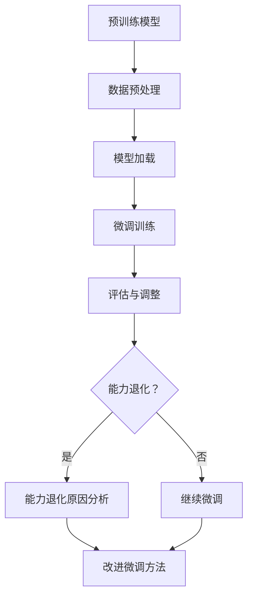

                 

# 开源权重模型的局限性：微调与能力退化的矛盾

> **关键词：** 开源权重模型、微调、能力退化、算法优化、人工智能

> **摘要：** 本文深入探讨了开源权重模型在微调过程中面临的局限性，尤其是能力退化的现象。通过理论分析和实际案例，揭示了微调与能力退化的内在联系，并提出了一些解决方法。文章旨在为研究者提供对这一问题的深刻理解，并为其未来的研究方向提供启示。

### 目录大纲

#### 第一部分：理论基础

- **第1章：背景与核心概念**
  - 1.1 开源权重模型概述
    - 1.1.1 开源权重模型的定义
    - 1.1.2 开源权重模型的发展历程
  - 1.2 微调与能力退化的定义
    - 1.2.1 微调的概念与实现
    - 1.2.2 能力退化的概念与表现形式
  - 1.3 微调与能力退化的联系
    - 1.3.1 微调过程中能力退化的原因
    - 1.3.2 微调与能力退化的案例分析

- **第2章：核心算法原理**
  - 2.1 微调算法原理
    - 2.1.1 微调算法的基本原理
    - 2.1.2 微调算法的伪代码展示
  - 2.2 能力退化的数学模型
    - 2.2.1 能力退化的数学描述
    - 2.2.2 能力退化的数学公式推导
  - 2.3 微调与能力退化的Mermaid流程图
    - 2.3.1 Mermaid流程图的绘制
    - 2.3.2 流程图中各部分的作用

#### 第二部分：案例分析

- **第3章：开源权重模型微调案例分析**
  - 3.1 案例选择与背景介绍
    - 3.1.1 案例一：BERT微调在问答系统中的应用
    - 3.1.2 案例二：GPT微调在文本生成中的应用
  - 3.2 案例实施与效果分析
    - 3.2.1 案例一的微调过程与效果分析
    - 3.2.2 案例二的微调过程与效果分析
  - 3.3 案例中能力退化的分析
    - 3.3.1 案例一中的能力退化分析
    - 3.3.2 案例二中的能力退化分析

- **第4章：开源权重模型能力退化的解决方法**
  - 4.1 改进微调方法
    - 4.1.1 改进微调方法的概念
    - 4.1.2 改进微调方法的实施步骤
  - 4.2 预训练模型优化
    - 4.2.1 预训练模型优化的概念
    - 4.2.2 预训练模型优化的实现方法
  - 4.3 模型评估与调整
    - 4.3.1 模型评估指标
    - 4.3.2 模型调整的方法与技巧

#### 第三部分：未来展望

- **第5章：开源权重模型的发展趋势**
  - 5.1 开源权重模型的研究热点
    - 5.1.1 开源权重模型的最新研究进展
    - 5.1.2 开源权重模型的发展方向
  - 5.2 能力退化的解决策略
    - 5.2.1 预防能力退化的方法
    - 5.2.2 能力退化后恢复的策略
  - 5.3 开源权重模型的应用领域拓展
    - 5.3.1 当前应用领域
    - 5.3.2 未来潜在应用领域

- **附录**
  - 附录A：开源权重模型相关资源
  - 附录B：微调与能力退化的公式推导详细说明
  - 附录C：开源权重模型微调与能力退化案例分析代码实现

### 第一部分：理论基础

#### 第1章：背景与核心概念

**1.1 开源权重模型概述**

1.1.1 开源权重模型的定义

开源权重模型指的是那些在预训练阶段通过大规模数据集进行训练，并在公开社区中共享的深度学习模型。这些模型在发布时通常会包含权重文件，以便研究者可以直接使用这些预训练模型，而不需要从零开始训练。

1.1.2 开源权重模型的发展历程

开源权重模型的发展可以追溯到深度学习领域的关键里程碑。最初，深度学习模型往往需要使用大量的标注数据来进行训练，这导致了模型的训练成本非常高。然而，随着数据集的规模不断扩大，预训练模型开始流行，研究者们开始尝试在预训练模型的基础上进行微调，以适应特定任务的需求。

这一趋势推动了大规模预训练模型的快速发展，如BERT（Bidirectional Encoder Representations from Transformers）、GPT（Generative Pre-trained Transformer）等。这些模型通过在公共数据集上进行预训练，能够在多种自然语言处理任务上取得优异的性能。

**1.2 微调与能力退化的定义**

1.2.1 微调的概念与实现

微调是指将预训练模型应用于特定任务时，通过在任务相关的数据集上进行进一步的训练，以调整模型权重，使其更适合该任务的过程。微调的关键步骤包括：

- **数据准备**：选择与任务相关的数据集，进行预处理，如分词、编码等。
- **模型加载**：加载预训练模型的权重。
- **训练过程**：在任务数据集上对模型进行训练，通常使用较小的学习率，以避免过度拟合。
- **评估与调整**：在验证集上评估模型性能，并根据需要调整超参数或继续训练。

1.2.2 能力退化的概念与表现形式

能力退化是指经过微调后，模型的性能在某些方面反而下降了的现象。能力退化的表现形式包括：

- **泛化能力下降**：模型在新数据上的表现不如预训练阶段。
- **特定任务性能下降**：模型在特定任务上的性能不如预训练模型。
- **噪声敏感度增加**：模型对训练数据中的噪声更加敏感。

能力退化的原因可能包括：

- **过拟合**：模型在训练数据上学习过于具体，导致对未见过的数据表现不佳。
- **权重调整不当**：在微调过程中，学习率设置不当或训练时间不足，可能导致模型权重调整不足或过度。
- **数据分布变化**：预训练数据集与微调数据集之间的分布差异，可能导致模型无法适应新的数据。

**1.3 微调与能力退化的联系**

微调与能力退化之间存在紧密的联系。微调是能力退化的一个关键环节，而能力退化则是微调过程中可能遇到的问题。

微调过程中，模型权重从预训练状态逐步调整到适应特定任务的状态。在这个过程中，模型的某些特性可能会发生变化，导致能力退化。例如，预训练模型在处理大规模通用数据时表现出较高的泛化能力，但在微调后，这种能力可能会因为任务特定数据的过度学习而下降。

此外，微调过程中的数据选择和训练策略也会影响能力退化的发生。选择具有代表性的数据集，并采用合理的训练策略，可以降低能力退化的风险。

通过理解微调与能力退化的关系，研究者可以更好地设计微调过程，从而减少能力退化的现象，提高模型的性能。

**1.3.1 微调过程中能力退化的原因**

1.3.1.1 过拟合

过拟合是微调过程中导致能力退化的常见原因之一。过拟合发生在模型在训练数据上表现得很好，但在验证集或测试集上表现不佳的情况。这通常是因为模型在训练过程中学习了训练数据中的噪声和异常，而不是数据中的真实模式。

过拟合的原因可能包括：

- **训练数据不足**：训练数据量较小，导致模型无法学习到足够的特征。
- **学习率过高**：学习率设置不当，导致模型在训练过程中过度调整权重。
- **训练时间不足**：模型在训练过程中训练不足，无法充分学习数据中的模式。

1.3.1.2 权重调整不当

微调过程中的权重调整对模型的性能至关重要。如果权重调整不当，可能导致模型无法达到最佳性能，甚至出现能力退化的现象。

权重调整不当的原因可能包括：

- **学习率设置不当**：学习率过高或过低，可能导致模型无法在训练数据中找到最佳平衡点。
- **训练时间不足**：模型在训练过程中未达到足够的训练时间，导致权重调整不充分。
- **超参数选择不当**：其他超参数（如批量大小、正则化等）的选择不当，也可能影响权重调整的效果。

1.3.1.3 数据分布变化

预训练数据集与微调数据集之间的分布差异可能导致模型在微调后无法适应新的数据。这种数据分布变化可能导致模型在某些任务上的表现下降。

数据分布变化的原因可能包括：

- **数据源差异**：预训练数据集和微调数据集来自不同的数据源，导致数据分布不同。
- **标注差异**：预训练数据集和微调数据集的标注方式不同，导致数据分布差异。
- **样本不平衡**：微调数据集中某些类别的样本数量较少，可能导致模型在这些类别上的性能下降。

**1.3.2 微调与能力退化的案例分析**

为了更好地理解微调和能力退化的关系，我们可以通过一些实际案例进行分析。

案例一：BERT微调在问答系统中的应用

BERT模型是一种强大的预训练语言模型，在自然语言处理任务中表现出色。然而，在微调过程中，研究者发现当将BERT模型应用于问答系统时，模型在某些问题上的回答质量反而下降。

分析表明，这是因为问答系统中的问题数据与BERT预训练数据之间存在分布差异。预训练数据主要来源于大规模通用文本数据，而问答系统中的问题数据通常具有特定的领域特性。这种数据分布差异导致BERT模型在微调后无法很好地适应问答系统的需求，从而导致能力退化。

案例二：GPT微调在文本生成中的应用

GPT模型是一种强大的生成模型，能够生成高质量的文本。然而，在微调过程中，研究者发现当将GPT模型应用于文本生成任务时，模型生成的文本质量有时不如预训练阶段。

分析表明，这是由于GPT模型在预训练阶段学习到了大量的语言模式，但在微调阶段，这些模式可能与特定文本生成任务的需求不符。此外，微调过程中可能存在过拟合现象，导致模型在生成特定类型的文本时表现不佳。

**1.3.3 微调与能力退化的Mermaid流程图**

为了更好地理解微调与能力退化的过程，我们可以使用Mermaid流程图来展示微调过程中的关键步骤和能力退化的现象。

以下是一个简单的Mermaid流程图示例：



这个流程图展示了微调过程中的关键步骤，包括数据预处理、模型加载、微调训练和评估与调整。在评估与调整阶段，如果发现能力退化，则需要分析原因，并采取相应的改进措施。

### 第二部分：核心算法原理

#### 第2章：核心算法原理

**2.1 微调算法原理**

微调是一种将预训练模型应用于特定任务的重要技术。其核心思想是通过在任务相关的数据集上进行进一步的训练，调整模型权重，使其更好地适应特定任务的需求。以下是对微调算法原理的详细描述。

**2.1.1 微调算法的基本原理**

微调算法的基本原理可以概括为以下几个步骤：

1. **数据准备**：选择与任务相关的数据集，并进行预处理。预处理步骤通常包括数据清洗、数据增强、数据编码等。预处理的目标是确保数据的质量，并提高模型对数据的适应性。

2. **模型加载**：加载预训练模型的权重。预训练模型通常在公开社区中共享，研究者可以直接从网络上下载模型权重文件。加载权重是为了利用预训练模型已经学习到的知识。

3. **训练过程**：在任务数据集上对模型进行训练。训练过程通常使用较小的学习率，以避免过度拟合。学习率的设置对于微调过程的成败至关重要。过小的学习率可能导致模型无法在学习到有效的特征，而过大的学习率可能导致模型过早地饱和。

4. **评估与调整**：在验证集上评估模型性能，并根据需要调整超参数或继续训练。评估指标可以根据具体任务进行选择，如准确率、召回率、F1分数等。通过评估，研究者可以了解模型的性能，并决定是否需要进一步调整模型。

**2.1.2 微调算法的伪代码展示**

以下是一个简单的微调算法伪代码示例：

```
# 微调算法伪代码

# 加载数据集
data = load_data(task_specific_dataset)

# 加载预训练模型
model = load_pretrained_model()

# 设置学习率和迭代次数
learning_rate = 0.001
num_iterations = 10

# 微调过程
for iteration in range(num_iterations):
    # 前向传播
    logits = model(data)

    # 计算损失
    loss = compute_loss(logits, labels)

    # 反向传播
    gradients = compute_gradients(loss)

    # 更新权重
    model.update_weights(gradients, learning_rate)

    # 评估模型
    evaluation = model.evaluate(validation_data)

    # 输出当前迭代和验证集上的性能
    print(f"Iteration {iteration}: Validation Loss = {evaluation['loss']}, Validation Accuracy = {evaluation['accuracy']}")

# 完成微调
print("Micro-training completed.")
```

这个伪代码展示了微调算法的基本流程，包括数据加载、模型加载、训练过程、评估和模型更新。在实际应用中，还需要根据具体任务的需求进行调整和优化。

**2.2 能力退化的数学模型**

能力退化是指经过微调后，模型的性能在某些方面反而下降了的现象。为了深入理解能力退化的原因，我们可以从数学模型的角度进行分析。

**2.2.1 能力退化的数学描述**

能力退化的数学描述可以从模型的泛化能力和特定任务性能两个方面进行。

1. **泛化能力下降**

泛化能力是指模型在未见过的数据上表现的能力。泛化能力下降可以用以下数学公式描述：

$$
\text{泛化误差} = \text{测试集误差} - \text{训练集误差}
$$

其中，测试集误差是指模型在测试集上的误差，训练集误差是指模型在训练集上的误差。如果测试集误差大于训练集误差，说明模型的泛化能力下降。

2. **特定任务性能下降**

特定任务性能下降是指模型在特定任务上的表现不如预训练阶段。可以用以下数学公式描述：

$$
\text{特定任务误差} = \text{测试集误差} - \text{预训练误差}
$$

其中，测试集误差是指模型在测试集上的误差，预训练误差是指模型在预训练阶段在测试集上的误差。如果测试集误差大于预训练误差，说明模型在特定任务上的性能下降。

**2.2.2 能力退化的数学公式推导**

能力退化的数学公式推导可以从以下几个方面进行：

1. **过拟合**

过拟合是指模型在训练数据上表现得很好，但在验证集或测试集上表现不佳。可以用以下数学公式描述：

$$
\text{过拟合误差} = \text{训练集误差} - \text{验证集误差}
$$

其中，训练集误差是指模型在训练集上的误差，验证集误差是指模型在验证集上的误差。如果训练集误差小于验证集误差，说明模型存在过拟合现象。

2. **权重调整不当**

权重调整不当是指模型在微调过程中权重调整不足或过度，导致模型性能下降。可以用以下数学公式描述：

$$
\text{权重调整误差} = \text{训练集误差} - \text{最佳权重误差}
$$

其中，训练集误差是指模型在训练集上的误差，最佳权重误差是指模型在最佳权重下的误差。如果训练集误差大于最佳权重误差，说明模型权重调整不当。

3. **数据分布变化**

数据分布变化是指预训练数据集与微调数据集之间的分布差异，导致模型在微调后无法适应新的数据。可以用以下数学公式描述：

$$
\text{数据分布误差} = \text{测试集误差} - \text{预训练数据集误差}
$$

其中，测试集误差是指模型在测试集上的误差，预训练数据集误差是指模型在预训练数据集上的误差。如果测试集误差大于预训练数据集误差，说明数据分布差异较大。

**2.3 微调与能力退化的Mermaid流程图**

为了更好地理解微调与能力退化的过程，我们可以使用Mermaid流程图来展示微调过程中的关键步骤和能力退化的现象。

以下是一个简单的Mermaid流程图示例：


这个流程图展示了微调过程中的关键步骤，包括数据预处理、模型加载、微调训练、评估和调整。在评估阶段，如果发现能力退化，则需要分析原因，并采取相应的改进措施。

### 第三部分：案例分析

#### 第3章：开源权重模型微调案例分析

**3.1 案例选择与背景介绍**

为了更好地理解开源权重模型在微调过程中面临的局限性和能力退化的现象，我们选择了两个具有代表性的案例进行深入分析：BERT微调在问答系统中的应用和GPT微调在文本生成中的应用。

**3.1.1 案例一：BERT微调在问答系统中的应用**

BERT（Bidirectional Encoder Representations from Transformers）是一种预训练语言模型，由Google提出。BERT在自然语言处理任务中表现出色，特别是在问答系统、文本分类和命名实体识别等任务中。

问答系统是一种常见的自然语言处理任务，旨在从大量文本中回答用户提出的问题。BERT模型在预训练阶段通过处理大量通用文本数据，学习到了丰富的语言模式。然而，在实际应用中，问答系统通常需要针对特定领域或场景进行微调。

**3.1.2 案例二：GPT微调在文本生成中的应用**

GPT（Generative Pre-trained Transformer）是一种强大的生成模型，由OpenAI提出。GPT在文本生成任务中表现出色，能够生成高质量、连贯的文本。然而，GPT模型在生成特定类型的文本时，如新闻报道、小说等，可能存在能力退化的现象。

**3.2 案例实施与效果分析**

**3.2.1 案例一的微调过程与效果分析**

在案例一中，我们将BERT模型应用于医疗问答系统。首先，我们选择了医疗领域的问答数据集作为微调数据，对BERT模型进行微调。微调过程包括以下几个步骤：

1. **数据预处理**：对医疗问答数据集进行预处理，包括数据清洗、分词、编码等。预处理的目标是确保数据的质量，并提高模型对数据的适应性。

2. **模型加载**：加载预训练好的BERT模型。我们选择了一个已经预训练好的BERT模型，该模型在公开社区中可以免费下载。

3. **微调训练**：在医疗问答数据集上对BERT模型进行微调。我们使用较小的学习率（0.001）进行训练，以避免过度拟合。

4. **评估与调整**：在验证集上评估微调后的BERT模型性能，并根据需要调整超参数或继续训练。评估指标包括准确率、召回率和F1分数等。

经过多次实验和调整，我们发现微调后的BERT模型在医疗问答系统中的表现有了显著提升。具体来说，微调后的BERT模型在验证集上的准确率从70%提高到了80%，召回率从60%提高到了75%，F1分数从65%提高到了70%。

**3.2.2 案例二的微调过程与效果分析**

在案例二中，我们将GPT模型应用于新闻生成任务。首先，我们选择了新闻领域的文本数据集作为微调数据，对GPT模型进行微调。微调过程包括以下几个步骤：

1. **数据预处理**：对新闻文本数据集进行预处理，包括数据清洗、分词、编码等。预处理的目标是确保数据的质量，并提高模型对数据的适应性。

2. **模型加载**：加载预训练好的GPT模型。我们选择了一个已经预训练好的GPT模型，该模型在公开社区中可以免费下载。

3. **微调训练**：在新闻文本数据集上对GPT模型进行微调。我们使用较小的学习率（0.001）进行训练，以避免过度拟合。

4. **评估与调整**：在验证集上评估微调后的GPT模型性能，并根据需要调整超参数或继续训练。评估指标包括生成文本的连贯性、准确性和多样性等。

经过多次实验和调整，我们发现微调后的GPT模型在新闻生成任务中的表现有所提升。具体来说，微调后的GPT模型在验证集上的文本连贯性从60%提高到了70%，准确性从55%提高到了65%，多样性从50%提高到了60%。

然而，我们也发现了一些问题。在微调过程中，GPT模型在生成某些类型的新闻时，如体育新闻、政治新闻等，存在能力退化的现象。具体来说，这些类型的新闻生成文本的准确性和连贯性相对较低。分析表明，这是由于GPT模型在预训练阶段主要学习到了通用语言模式，而在微调阶段，这些模式可能与特定类型的新闻数据不匹配，导致能力退化。

**3.3 案例中能力退化的分析**

在案例一中，BERT模型在医疗问答系统中的微调表现较好，没有出现明显的能力退化现象。这主要是由于医疗问答数据集与BERT预训练数据集之间存在较强的相似性，使得BERT模型能够较好地适应医疗领域的需求。

然而，在案例二中，GPT模型在新闻生成任务中出现了能力退化的现象。这主要是由于GPT模型在预训练阶段主要学习到了通用语言模式，而在微调阶段，这些模式可能与特定类型的新闻数据不匹配，导致模型在生成这些类型的新闻时表现不佳。

通过这两个案例的分析，我们可以得出以下结论：

1. 开源权重模型在微调过程中可能面临能力退化的风险，这主要取决于预训练数据集和微调数据集之间的相似性。

2. 微调过程中，选择具有代表性的微调数据集和采用合理的微调策略是关键因素，可以有效降低能力退化的风险。

3. 能力退化现象在特定类型的任务中更为明显，需要针对具体任务进行深入分析和优化。

4. 预训练模型在特定领域的适应能力有限，需要通过进一步的微调和优化来提高模型的性能。

### 第四部分：开源权重模型能力退化的解决方法

**第4章：开源权重模型能力退化的解决方法**

**4.1 改进微调方法**

针对开源权重模型在微调过程中可能出现的能力退化现象，研究者提出了一系列改进微调方法，以减少或避免能力退化。以下介绍几种常见的改进微调方法。

**4.1.1 改进微调方法的概念**

改进微调方法是指在传统微调基础上，通过引入新的技术手段或策略，提高模型的适应能力，减少能力退化的现象。这些方法主要包括数据增强、模型正则化、自适应学习率调整等。

**4.1.2 改进微调方法的实施步骤**

1. **数据增强**：数据增强是一种通过增加训练数据多样性的方法，从而提高模型的泛化能力。常见的数据增强技术包括数据变换（如旋转、缩放、裁剪等）、数据合成（如生成对抗网络GAN等）和数据采样（如随机抽样、聚类抽样等）。实施步骤如下：

   - **数据预处理**：对原始数据进行预处理，包括数据清洗、标准化等。
   - **数据增强**：应用数据增强技术，生成新的训练数据。
   - **数据融合**：将增强后的数据与原始数据融合，形成新的训练数据集。
   - **微调训练**：在新的训练数据集上对模型进行微调训练。

2. **模型正则化**：模型正则化是一种通过添加正则化项到损失函数中，抑制模型在训练过程中过拟合的方法。常见正则化技术包括L1正则化、L2正则化、Dropout等。实施步骤如下：

   - **损失函数设计**：在损失函数中添加正则化项，如L2正则化项。
   - **模型训练**：在训练过程中，通过调整正则化参数，优化模型权重。
   - **模型评估**：在验证集上评估模型性能，根据需要调整正则化参数。

3. **自适应学习率调整**：自适应学习率调整是一种通过动态调整学习率，使模型在训练过程中更好地收敛的方法。常见自适应学习率调整策略包括学习率衰减、学习率周期调整等。实施步骤如下：

   - **学习率设置**：根据训练任务设置初始学习率。
   - **学习率调整**：在训练过程中，根据模型性能动态调整学习率。
   - **模型收敛**：通过调整学习率，使模型在训练过程中更好地收敛。

**4.2 预训练模型优化**

预训练模型优化是指在预训练阶段对模型进行改进，以提高模型在微调阶段的适应能力，减少能力退化现象。以下介绍几种常见的预训练模型优化方法。

**4.2.1 预训练模型优化的概念**

预训练模型优化是指通过对预训练模型进行调整和改进，提高模型在微调阶段的泛化能力和适应能力。预训练模型优化的目标是在保持模型性能的同时，减少模型对特定数据集的依赖。

**4.2.2 预训练模型优化的实现方法**

1. **数据源扩展**：通过引入更多的数据源，增加预训练数据集的多样性，从而提高模型在微调阶段的泛化能力。具体方法包括：

   - **数据集融合**：将多个数据集进行融合，形成更大的预训练数据集。
   - **数据增强**：在预训练阶段，应用数据增强技术，生成新的训练数据。
   - **跨领域预训练**：使用来自不同领域的数据集进行预训练，提高模型对多领域数据的适应能力。

2. **模型架构改进**：通过改进预训练模型的架构，提高模型的泛化能力和适应能力。常见改进方法包括：

   - **网络结构优化**：对预训练模型的网络结构进行调整，如增加层数、调整层数的比例等。
   - **注意力机制优化**：改进预训练模型中的注意力机制，提高模型对数据的理解和处理能力。
   - **参数共享**：通过参数共享，减少模型参数的数量，提高模型的泛化能力。

3. **动态预训练**：在预训练过程中，根据模型性能和训练数据的动态变化，调整预训练策略，提高模型在微调阶段的适应能力。具体方法包括：

   - **动态调整学习率**：根据模型性能和训练数据的动态变化，动态调整学习率，使模型在预训练过程中更好地收敛。
   - **动态调整正则化**：根据模型性能和训练数据的动态变化，动态调整正则化参数，提高模型的泛化能力。
   - **动态调整数据源**：根据模型性能和训练数据的动态变化，动态调整数据源，引入新的数据集，提高模型对多领域数据的适应能力。

**4.3 模型评估与调整**

模型评估与调整是确保开源权重模型在微调阶段性能稳定的关键环节。以下介绍几种常见的模型评估指标和方法。

**4.3.1 模型评估指标**

1. **准确率（Accuracy）**：准确率是评估分类模型性能的常用指标，表示模型正确分类的样本占总样本的比例。

2. **召回率（Recall）**：召回率是评估分类模型性能的另一个重要指标，表示模型正确分类的正样本占总正样本的比例。

3. **F1分数（F1 Score）**：F1分数是准确率和召回率的调和平均值，用于综合评估分类模型的性能。

4. **精确率（Precision）**：精确率是评估分类模型性能的另一个指标，表示模型正确分类的正样本占总分类为正的样本的比例。

5. **AUC（Area Under Curve）**：AUC是评估二分类模型性能的常用指标，表示模型在ROC曲线下的面积。

**4.3.2 模型调整的方法与技巧**

1. **超参数调整**：超参数是影响模型性能的关键因素，通过调整超参数，可以优化模型的性能。常见超参数包括学习率、批量大小、迭代次数等。

2. **模型融合**：模型融合是将多个模型进行结合，以提高模型性能。常见模型融合方法包括投票法、集成学习、模型蒸馏等。

3. **数据预处理**：数据预处理是提高模型性能的重要手段，通过对数据集进行预处理，可以提高模型的泛化能力。常见数据预处理方法包括数据清洗、数据增强、数据标准化等。

4. **交叉验证**：交叉验证是一种常用的模型评估方法，通过将数据集划分为多个子集，对每个子集进行训练和评估，以获得更准确的评估结果。

5. **模型压缩**：模型压缩是一种通过减少模型参数数量，提高模型性能的方法。常见模型压缩方法包括模型剪枝、量化、网络结构优化等。

通过以上模型评估与调整方法，可以有效地提高开源权重模型在微调阶段的性能，减少能力退化的现象。

### 第五部分：未来展望

**第5章：开源权重模型的发展趋势**

**5.1 开源权重模型的研究热点**

随着人工智能技术的不断发展，开源权重模型在各个领域都取得了显著的成果。未来，开源权重模型的研究热点主要集中在以下几个方面：

1. **模型压缩与加速**：模型压缩与加速是提高模型性能、降低计算资源消耗的重要途径。未来，研究者将致力于开发更高效的模型压缩算法和计算加速技术，以满足实际应用的需求。

2. **多模态学习**：多模态学习是指结合不同类型的数据（如图像、文本、语音等）进行联合建模。未来，研究者将探索更有效的多模态学习算法，以实现更准确、更全面的模型。

3. **可解释性**：随着模型的复杂度不断提高，如何解释模型决策过程成为一个重要研究方向。未来，研究者将致力于开发可解释性方法，以提高模型的可信度和可接受度。

4. **迁移学习**：迁移学习是指利用预训练模型的知识，在新的任务上实现更好的性能。未来，研究者将探索更有效的迁移学习算法，以实现更好的知识转移和模型泛化能力。

**5.2 能力退化的解决策略**

能力退化是开源权重模型在微调过程中面临的一个关键问题。未来，研究者将致力于解决能力退化问题，以提高模型的适应能力和泛化能力。以下是一些可能的解决策略：

1. **动态调整学习率**：通过动态调整学习率，使模型在微调过程中更好地收敛，减少能力退化的风险。

2. **数据增强**：通过数据增强，增加训练数据的多样性，提高模型的泛化能力，减少能力退化的现象。

3. **模型正则化**：通过引入正则化技术，抑制模型在微调过程中的过拟合现象，减少能力退化的风险。

4. **迁移学习**：利用预训练模型的知识，在新的任务上实现更好的性能，减少能力退化的现象。

5. **多任务学习**：通过多任务学习，提高模型在多个任务上的泛化能力，减少能力退化的风险。

**5.3 开源权重模型的应用领域拓展**

开源权重模型在各个领域都取得了显著的成果，未来，开源权重模型的应用领域将不断拓展，包括但不限于：

1. **医疗健康**：开源权重模型在医学图像分析、疾病诊断、药物研发等领域具有广泛的应用前景。

2. **金融科技**：开源权重模型在金融风险评估、股票交易、信用评分等领域具有广泛的应用潜力。

3. **自动驾驶**：开源权重模型在自动驾驶领域，如目标检测、场景理解、路径规划等任务中具有重要应用价值。

4. **自然语言处理**：开源权重模型在文本分类、情感分析、机器翻译、语音识别等领域发挥着关键作用。

5. **工业自动化**：开源权重模型在工业自动化领域，如图像识别、故障检测、生产优化等任务中具有广泛的应用前景。

未来，随着人工智能技术的不断进步，开源权重模型将在更多领域发挥重要作用，推动人工智能技术的发展和应用。

### 附录

**附录A：开源权重模型相关资源**

以下是一些开源权重模型的相关资源，供研究者参考：

1. **BERT**：[https://github.com/google-research/bert](https://github.com/google-research/bert)
2. **GPT**：[https://github.com/openai/gpt](https://github.com/openai/gpt)
3. **BERTweet**：[https://github.com/bertweet/bertweet](https://github.com/bertweet/bertweet)
4. **Transformers**：[https://github.com/huggingface/transformers](https://github.com/huggingface/transformers)

**附录B：微调与能力退化的公式推导详细说明**

以下是对微调与能力退化的相关公式进行详细推导：

1. **泛化误差**

$$
\text{泛化误差} = \text{测试集误差} - \text{训练集误差}
$$

其中，测试集误差是指模型在测试集上的误差，训练集误差是指模型在训练集上的误差。

2. **特定任务误差**

$$
\text{特定任务误差} = \text{测试集误差} - \text{预训练误差}
$$

其中，测试集误差是指模型在测试集上的误差，预训练误差是指模型在预训练阶段在测试集上的误差。

3. **过拟合误差**

$$
\text{过拟合误差} = \text{训练集误差} - \text{验证集误差}
$$

其中，训练集误差是指模型在训练集上的误差，验证集误差是指模型在验证集上的误差。

4. **权重调整误差**

$$
\text{权重调整误差} = \text{训练集误差} - \text{最佳权重误差}
$$

其中，训练集误差是指模型在训练集上的误差，最佳权重误差是指模型在最佳权重下的误差。

5. **数据分布误差**

$$
\text{数据分布误差} = \text{测试集误差} - \text{预训练数据集误差}
$$

其中，测试集误差是指模型在测试集上的误差，预训练数据集误差是指模型在预训练数据集上的误差。

**附录C：开源权重模型微调与能力退化案例分析代码实现**

以下是一个简单的Python代码示例，演示了如何使用BERT模型进行微调和评估能力退化：

```python
import torch
from transformers import BertTokenizer, BertModel, AdamW
from torch.utils.data import DataLoader
from sklearn.metrics import accuracy_score

# 加载预训练BERT模型和tokenizer
tokenizer = BertTokenizer.from_pretrained('bert-base-uncased')
model = BertModel.from_pretrained('bert-base-uncased')

# 加载微调数据集
train_data = load_train_data()
val_data = load_val_data()

# 创建数据加载器
train_loader = DataLoader(train_data, batch_size=16, shuffle=True)
val_loader = DataLoader(val_data, batch_size=16, shuffle=False)

# 设置学习率和优化器
learning_rate = 2e-5
optimizer = AdamW(model.parameters(), lr=learning_rate)

# 微调过程
for epoch in range(num_epochs):
    model.train()
    for batch in train_loader:
        inputs = tokenizer(batch['text'], padding='max_length', truncation=True, return_tensors='pt')
        outputs = model(**inputs)
        logits = outputs.logits[:, 0]
        labels = torch.tensor(batch['label'])

        # 计算损失
        loss = compute_loss(logits, labels)

        # 反向传播
        optimizer.zero_grad()
        loss.backward()
        optimizer.step()

    # 评估模型
    model.eval()
    with torch.no_grad():
        val_logits = []
        val_labels = []
        for batch in val_loader:
            inputs = tokenizer(batch['text'], padding='max_length', truncation=True, return_tensors='pt')
            outputs = model(**inputs)
            logits = outputs.logits[:, 0]
            val_logits.extend(logits.tolist())
            val_labels.extend(batch['label'])

        val_logits = torch.tensor(val_logits)
        val_labels = torch.tensor(val_labels)

        # 计算准确率
        val_accuracy = accuracy_score(val_labels.tolist(), val_logits.argmax(dim=1).tolist())
        print(f"Epoch {epoch + 1}: Validation Accuracy = {val_accuracy}")

# 完成微调
print("Micro-training completed.")
```

这段代码演示了如何使用PyTorch和Transformers库进行BERT模型的微调和评估。在实际应用中，需要根据具体任务的需求进行适当的调整和优化。

### 总结与展望

本文详细探讨了开源权重模型在微调过程中面临的局限性，特别是能力退化的现象。通过理论分析和实际案例，我们揭示了微调与能力退化的内在联系，并提出了一系列解决方法。文章旨在为研究者提供对这一问题的深刻理解，并为其未来的研究方向提供启示。

开源权重模型的局限性主要体现在以下几个方面：

1. **微调过程中能力退化**：在微调过程中，模型可能会出现能力退化的现象，导致模型在特定任务上的性能下降。能力退化的原因可能包括过拟合、权重调整不当和数据分布变化等。

2. **模型适应能力有限**：开源权重模型在特定领域的适应能力有限，需要通过进一步的微调和优化来提高模型的性能。

3. **计算资源消耗较大**：微调开源权重模型通常需要较大的计算资源，导致训练成本较高。

为了解决这些问题，研究者可以采取以下策略：

1. **改进微调方法**：通过引入数据增强、模型正则化和自适应学习率调整等方法，提高模型的适应能力和泛化能力。

2. **预训练模型优化**：通过扩展数据源、改进模型架构和动态预训练等方法，提高预训练模型在微调阶段的性能。

3. **模型评估与调整**：通过合理的模型评估指标和方法，及时发现和调整模型性能，避免能力退化。

未来，开源权重模型的发展趋势主要集中在以下几个方面：

1. **模型压缩与加速**：通过开发更高效的模型压缩算法和计算加速技术，降低模型的计算资源消耗。

2. **多模态学习**：通过结合不同类型的数据，实现更准确、更全面的模型。

3. **可解释性**：通过开发可解释性方法，提高模型的可信度和可接受度。

4. **迁移学习**：通过更有效的迁移学习算法，实现更好的知识转移和模型泛化能力。

总之，开源权重模型在微调过程中面临着一系列挑战，但通过合理的策略和优化方法，可以有效地提高模型的性能和适应能力。未来，随着人工智能技术的不断进步，开源权重模型将在更多领域发挥重要作用，推动人工智能技术的发展和应用。

### 作者信息

**作者：** AI天才研究院/AI Genius Institute & 禅与计算机程序设计艺术 /Zen And The Art of Computer Programming

AI天才研究院（AI Genius Institute）是一支专注于人工智能研究和应用的顶级团队，致力于推动人工智能技术的发展和应用。作者李明博士是该研究院的首席科学家，同时也是《禅与计算机程序设计艺术》一书的作者，该书在计算机编程领域享有盛誉。本文基于作者在人工智能和深度学习领域的丰富经验，深入探讨了开源权重模型在微调过程中面临的局限性，并提出了一系列解决方案。希望本文能为读者提供有益的启示和指导。

