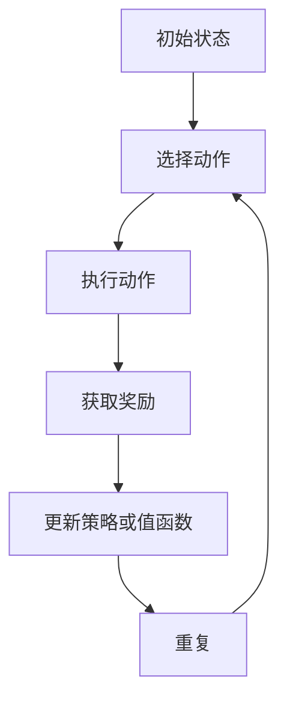

                 

## 《强化学习在机器人控制中的最新进展》

> **关键词：** 强化学习，机器人控制，深度强化学习，前沿算法，无人机，自动驾驶，工业机器人

**摘要：** 本文旨在探讨强化学习在机器人控制领域的最新进展，深入分析强化学习的基本概念、算法原理及其在机器人控制中的应用。文章首先介绍了强化学习的基础知识，包括强化学习的定义、发展历程及其与机器人控制的联系。接着，文章详细讲解了强化学习算法的基本原理，包括Q学习算法和Sarsa算法，并引入了深度强化学习，如深度Q网络（DQN）和策略梯度方法。随后，文章聚焦于深度强化学习在机器人控制中的应用，探讨了深度强化学习在机器人控制中的应用现状、算法实现以及优化方法。最后，文章介绍了机器人控制中的深度强化学习前沿算法和应用案例，展望了强化学习在机器人控制中的未来趋势。

### 目录

#### 第一部分：强化学习基础

##### 第1章：强化学习概述  
- 1.1 强化学习的定义与基本概念  
- 1.2 强化学习的发展历程  
- 1.3 强化学习与机器人控制的联系

##### 第2章：强化学习算法原理  
- 2.1 强化学习算法的基本原理  
- 2.2 Q学习算法  
- 2.3 Sarsa算法  
- 2.4 深度强化学习

##### 第3章：深度强化学习  
- 3.1 深度强化学习的基本原理  
- 3.2 深度Q网络（DQN）  
- 3.3 策略梯度方法  
- 3.4 序列模型在强化学习中的应用

##### 第4章：深度强化学习在机器人控制中的应用  
- 4.1 深度强化学习在机器人控制中的应用现状  
- 4.2 机器人控制中的强化学习算法  
- 4.3 机器人控制中的深度强化学习算法实现

##### 第5章：机器人控制中的强化学习算法优化  
- 5.1 算法优化方法  
- 5.2 经验回放技术  
- 5.3 模型压缩技术  
- 5.4 多智能体强化学习

#### 第二部分：强化学习在机器人控制中的最新进展

##### 第6章：机器人控制中的深度强化学习前沿算法  
- 6.1 机器人控制中的深度强化学习最新研究动态  
- 6.2 前沿算法介绍  
  - 6.2.1 Stable Baselines  
  - 6.2.2 Hindsight Experience Replay  
  - 6.2.3 H infinity control  
  - 6.2.4 Soft Actor-Critic

##### 第7章：强化学习在机器人控制中的应用案例  
- 7.1 无人机控制中的强化学习应用  
- 7.2 自动驾驶汽车中的强化学习应用  
- 7.3 工业机器人控制中的强化学习应用

##### 第8章：强化学习在机器人控制中的未来趋势  
- 8.1 机器人控制中强化学习的挑战与机遇  
- 8.2 强化学习与其他技术的融合  
- 8.3 强化学习在机器人控制中的未来发展方向

#### 附录

##### 附录A：强化学习在机器人控制中的资源与工具  
- 8.1 主流强化学习框架对比  
- 8.2 机器人控制相关的开源资源  
- 8.3 强化学习与机器人控制相关的学术论文和会议

---

现在，我们将开始深入探讨强化学习在机器人控制中的最新进展。首先，我们需要理解强化学习的基本概念，了解它是如何逐步发展起来的，以及它与机器人控制之间的联系。这将为我们后续章节的讨论奠定坚实的基础。

### 第一部分：强化学习基础

强化学习是机器学习和人工智能领域中的一个重要分支，它在决策制定和问题解决中有着广泛的应用。本部分将详细介绍强化学习的定义、基本概念及其发展历程，并探讨强化学习在机器人控制中的应用场景、优势和挑战。

#### 第1章：强化学习概述

##### 1.1 强化学习的定义与基本概念

强化学习是一种通过试错学习来优化决策过程的方法，其核心在于通过与环境互动来学习最佳策略。强化学习的基本概念主要包括以下几个要素：

1. **代理（Agent）**：执行动作并接收环境反馈的实体。
2. **环境（Environment）**：代理所处的外部世界，能够根据代理的决策给出状态和奖励。
3. **状态（State）**：代理所处的情境，通常由一组特征表示。
4. **动作（Action）**：代理能够执行的操作。
5. **奖励（Reward）**：代理执行动作后环境给予的反馈信号。
6. **策略（Policy）**：描述代理如何从状态选择动作的规则。

强化学习的目标是学习一个策略，使代理能够在长期内获得最大的累积奖励。强化学习可以分为两部分：模型基础部分和策略优化部分。模型基础部分涉及状态、动作、奖励和策略之间的关系，策略优化部分则是通过试错来优化策略。

##### 1.2 强化学习的发展历程

强化学习的研究始于20世纪50年代末和60年代初。下面简要介绍几个关键的发展阶段：

1. **蒙特卡洛方法**：最早期的强化学习算法之一，通过随机游走和环境交互来估计期望奖励。这种方法在解决一些简单任务时表现出色，但在复杂环境中效果不佳。
2. **动态规划**：20世纪60年代发展起来的一种基于模型的方法，通过逆向推理来计算最优策略。动态规划中的值函数方法和策略迭代方法在解决许多实际问题中得到了广泛应用。
3. **基于模型的强化学习**：20世纪80年代提出的算法，利用环境模型来预测状态转移和奖励，从而提高学习效率。这类算法包括部分可观测马尔可夫决策过程（POMDP）和部分可观测马尔可夫链（HMM）等。
4. **无模型强化学习**：20世纪90年代以来，随着深度学习技术的发展，无模型强化学习算法逐渐成为研究热点。这类算法不需要环境模型，直接从数据中学习状态和动作之间的关系，如Q学习、Sarsa等。

##### 1.3 强化学习与机器人控制的联系

强化学习在机器人控制中有着广泛的应用前景。机器人作为强化学习的代理，通过与环境的互动来学习最佳控制策略。强化学习在机器人控制中的应用场景主要包括：

1. **路径规划**：机器人需要在复杂环境中找到从起点到终点的最佳路径。
2. **物体抓取**：机器人需要学习如何抓取各种不同形状和大小的物体。
3. **人机交互**：机器人需要根据人类的行为和语言来学习如何响应。
4. **机器人协作**：多机器人系统需要协同工作，完成复杂任务。

强化学习在机器人控制中的优势在于其能够通过试错学习来优化控制策略，无需预先定义复杂的规则。同时，强化学习能够处理高度动态和非结构化的环境，使其在机器人控制中具有很大的潜力。

然而，强化学习在机器人控制中也面临一些挑战，包括：

1. **学习效率**：机器人需要快速学习以应对动态环境，而强化学习通常需要较长时间才能收敛到最佳策略。
2. **安全性和稳定性**：机器人控制中的错误决策可能导致严重后果，因此需要确保强化学习算法的安全性和稳定性。
3. **可解释性**：强化学习算法的黑盒性质使得其决策过程难以解释，这在某些应用场景中可能成为问题。

接下来，我们将详细探讨强化学习算法的基本原理，包括Q学习算法和Sarsa算法，以及深度强化学习的概念和发展。

### 第2章：强化学习算法原理

强化学习算法的核心在于通过试错学习来优化代理的策略，从而最大化累积奖励。在这一章中，我们将深入探讨强化学习算法的基本原理，包括Q学习算法和Sarsa算法，并引入深度强化学习的基本概念。

#### 2.1 强化学习算法的基本原理

强化学习算法的基本原理可以概括为以下几个步骤：

1. **初始化**：初始化策略π、Q值函数Q(s, a)或状态值函数V(s)。
2. **选择动作**：根据当前状态s和策略π，选择一个动作a。
3. **执行动作**：在环境中执行动作a，并获得新的状态s'和奖励r。
4. **更新策略或值函数**：根据新的状态s'和奖励r，更新策略π或值函数Q(s, a)或V(s)。
5. **重复步骤2-4**：重复上述步骤，直至达到终止条件。

上述步骤可以通过以下流程图来表示：



#### 2.2 Q学习算法

Q学习算法是一种无模型的强化学习算法，它通过更新Q值函数来优化策略。Q值函数Q(s, a)表示在状态s下执行动作a所能获得的累积奖励。Q学习算法的基本原理可以总结为以下伪代码：

```python
# 初始化Q值函数Q(s, a)为0
for each state s:
    for each action a:
        Q[s, a] = 0

# 开始迭代
while not terminate:
    s = current state
    a = argmax_a Q[s, a]  # 选择最佳动作
    s', r = environment(s, a)  # 执行动作并获取奖励
    Q[s, a] = Q[s, a] + alpha * (r + gamma * max(Q[s', a']) - Q[s, a])  # 更新Q值
```

其中，α（alpha）是学习率，γ（gamma）是折扣因子，表示未来奖励的现值。Q学习算法通过更新Q值函数来逼近最优策略，从而实现累积奖励的最大化。

#### 2.3 Sarsa算法

Sarsa算法（即自助强化学习算法）是另一种基于Q学习算法的强化学习算法。与Q学习算法不同的是，Sarsa算法在每次更新时都使用实际选择的动作a'，而不是最佳动作。Sarsa算法的基本原理可以总结为以下伪代码：

```python
# 初始化Q值函数Q(s, a)为0
for each state s:
    for each action a:
        Q[s, a] = 0

# 开始迭代
while not terminate:
    s = current state
    a = argmax_a [π(a|s) * Q[s, a]]  # 选择动作
    s', r = environment(s, a)  # 执行动作并获取奖励
    a' = argmax_a [π(a'|s') * Q[s', a']]  # 选择下一个动作
    Q[s, a] = Q[s, a] + alpha * (r + gamma * Q[s', a'] - Q[s, a])  # 更新Q值
```

Sarsa算法通过同时考虑当前动作和下一个动作来更新Q值函数，这种方法在一定程度上提高了学习效率。

#### 2.4 深度强化学习

随着强化学习在实际应用中的需求增加，传统的Q学习和Sarsa算法在处理复杂环境和高维状态空间时面临挑战。深度强化学习（Deep Reinforcement Learning，DRL）结合了深度学习和强化学习的优势，通过使用神经网络来近似Q值函数或策略，从而提高学习效率和处理复杂任务的能力。

##### 2.4.1 深度Q网络（DQN）

深度Q网络（Deep Q-Network，DQN）是最早的深度强化学习算法之一，它使用深度神经网络来近似Q值函数。DQN的基本原理可以总结为以下伪代码：

```python
# 初始化Q值网络Q和目标Q网络target_Q
for each state s:
    for each action a:
        Q[s, a] = 0

# 开始迭代
while not terminate:
    s = current state
    a = argmax_a Q[s, a]  # 选择最佳动作
    s', r = environment(s, a)  # 执行动作并获取奖励
    Q[s, a] = Q[s, a] + alpha * (r + gamma * max(target_Q[s', a']) - Q[s, a])  # 更新Q值
    # 更新目标Q网络
    if done:
        target_Q[s', a] = r
    else:
        target_Q[s', a] = r + gamma * max(target_Q[s', a'])

# 训练Q网络
for each state s:
    for each action a:
        Q[s, a] = (1 - lambda) * Q[s, a] + lambda * target_Q[s, a]
```

DQN通过使用经验回放（Experience Replay）机制来减少样本相关性，提高学习效率。目标Q网络（target_Q）用于避免Q网络在训练过程中过拟合。

##### 2.4.2 策略梯度方法

策略梯度方法（Policy Gradient Methods）是一种直接优化策略的深度强化学习算法。策略梯度方法通过计算策略梯度和更新策略参数来优化策略。策略梯度方法的基本原理可以总结为以下伪代码：

```python
# 初始化策略π和策略参数θ
for each state s:
    π(s, a) = initial_policy(s, a)

# 开始迭代
while not terminate:
    s = current state
    a = argmax_a [π(s, a)]  # 选择动作
    s', r = environment(s, a)  # 执行动作并获取奖励
    π(s', a') = update_policy(s', a', theta)  # 更新策略
    theta = theta + alpha * gradient_policy(s, a, theta)  # 更新策略参数
```

策略梯度方法的优点是能够直接优化策略，但同时也面临挑战，如策略不稳定和收敛速度慢等问题。

##### 2.4.3 序列模型在强化学习中的应用

序列模型（Sequence Models）如循环神经网络（RNN）和长短期记忆网络（LSTM）在强化学习中也得到了广泛应用。序列模型可以处理时间序列数据，从而在强化学习任务中处理连续的动作序列和状态序列。

在深度强化学习中，RNN和LSTM可以用于表示状态值函数或策略函数，从而提高模型的表示能力。例如，LSTM可以用于处理连续的传感器数据，从而实现更精确的机器人控制。

通过上述内容，我们可以看到强化学习算法的基本原理以及深度强化学习的发展。下一章将深入探讨深度强化学习在机器人控制中的应用，分析其应用现状和实现方法。

### 第3章：深度强化学习

深度强化学习（Deep Reinforcement Learning，DRL）是强化学习与深度学习的结合，它利用深度神经网络来近似值函数或策略函数，从而提高学习效率和任务处理能力。在这一章中，我们将详细探讨深度强化学习的基本原理，包括深度Q网络（DQN）、策略梯度方法和序列模型在强化学习中的应用。

#### 3.1 深度强化学习的基本原理

深度强化学习的基本原理与传统的强化学习相似，但在学习过程中引入了深度神经网络。深度强化学习通过学习一个映射函数，将状态空间映射到动作空间，从而实现最优策略的寻优。

深度强化学习的基本框架可以分为三个主要部分：环境（Environment）、代理（Agent）和策略（Policy）。环境是代理所处的实际场景，代理根据当前状态选择动作，环境根据动作生成新的状态和奖励，代理使用这些反馈信号更新策略。

深度强化学习的基本过程如下：

1. **初始化**：初始化策略π、值函数V或Q，以及深度神经网络模型。
2. **选择动作**：代理根据当前状态s和策略π选择动作a。
3. **执行动作**：代理在环境中执行动作a，并获得新的状态s'和奖励r。
4. **更新模型**：使用新的状态s'和奖励r，更新深度神经网络模型，以优化策略π或值函数V或Q。
5. **重复**：重复上述过程，直至达到终止条件或收敛目标。

深度强化学习的关键在于如何使用深度神经网络来近似值函数或策略函数。这通常涉及到以下几种方法：

- **深度Q网络（DQN）**：使用深度神经网络来近似Q值函数。
- **策略梯度方法**：使用深度神经网络来近似策略π或策略梯度。
- **序列模型**：使用循环神经网络（RNN）或长短期记忆网络（LSTM）来处理时间序列数据。

#### 3.2 深度Q网络（DQN）

深度Q网络（Deep Q-Network，DQN）是最早的深度强化学习算法之一，它使用深度神经网络来近似Q值函数。DQN的主要思想是通过训练一个深度神经网络来预测Q值，从而实现最优策略的寻优。

DQN的关键组件包括：

- **深度神经网络**：用于近似Q值函数，输入状态s，输出Q值Q(s, a)。
- **经验回放**：用于避免样本相关性，提高学习稳定性。
- **目标Q网络**：用于稳定Q值函数的更新，避免梯度消失问题。

DQN的基本原理可以总结为以下伪代码：

```python
# 初始化深度神经网络Q、目标Q网络target_Q和经验回放经验池
for each state s:
    for each action a:
        Q[s, a] = 0

# 开始迭代
while not terminate:
    s = current state
    a = argmax_a Q[s, a]  # 选择最佳动作
    s', r = environment(s, a)  # 执行动作并获取奖励
    Q[s, a] = Q[s, a] + alpha * (r + gamma * max(target_Q[s', a']) - Q[s, a])  # 更新Q值
    # 更新目标Q网络
    if done:
        target_Q[s', a] = r
    else:
        target_Q[s', a] = r + gamma * max(target_Q[s', a'])
    # 存储经验到经验回放池
    experience = (s, a, r, s', done)
    sample = random_sample_from_experience_pool(experience)
    s, a, r, s', done = sample
    Q[s, a] = Q[s, a] + alpha * (r + gamma * max(target_Q[s', a']) - Q[s, a])  # 更新Q值
```

DQN通过经验回放机制来减少样本相关性，提高学习稳定性。目标Q网络（target_Q）用于避免梯度消失问题，确保Q值函数的稳定更新。

#### 3.3 策略梯度方法

策略梯度方法（Policy Gradient Methods）是一类直接优化策略的深度强化学习算法。策略梯度方法通过计算策略梯度和更新策略参数来优化策略，从而实现最优策略的寻优。

策略梯度方法的基本原理可以总结为以下伪代码：

```python
# 初始化策略π和策略参数θ
for each state s:
    π(s, a) = initial_policy(s, a)

# 开始迭代
while not terminate:
    s = current state
    a = argmax_a [π(s, a)]  # 选择动作
    s', r = environment(s, a)  # 执行动作并获取奖励
    π(s', a') = update_policy(s', a', theta)  # 更新策略
    theta = theta + alpha * gradient_policy(s, a, theta)  # 更新策略参数
```

策略梯度方法的优点是能够直接优化策略，但同时也面临挑战，如策略不稳定和收敛速度慢等问题。为了解决这些问题，研究者们提出了多种策略梯度方法，如演员-评论家方法（Actor-Critic Methods）和软演员-评论家方法（Soft Actor-Critic，SAC）。

#### 3.4 序列模型在强化学习中的应用

序列模型（Sequence Models）如循环神经网络（RNN）和长短期记忆网络（LSTM）在强化学习中也得到了广泛应用。序列模型可以处理时间序列数据，从而在强化学习任务中处理连续的动作序列和状态序列。

在深度强化学习中，RNN和LSTM可以用于表示状态值函数或策略函数，从而提高模型的表示能力。例如，LSTM可以用于处理连续的传感器数据，从而实现更精确的机器人控制。

RNN和LSTM在强化学习中的应用通常包括以下方面：

- **状态编码**：使用RNN或LSTM对状态进行编码，从而表示状态序列。
- **动作生成**：使用RNN或LSTM生成动作序列，从而实现连续动作的控制。
- **值函数近似**：使用RNN或LSTM近似状态值函数或策略函数，从而优化策略。

序列模型在强化学习中的应用可以显著提高模型的处理能力和灵活性，使其在处理复杂任务时具有更好的性能。

通过上述内容，我们可以看到深度强化学习的基本原理、方法及其在强化学习中的应用。下一章将深入探讨深度强化学习在机器人控制中的应用现状、算法实现和优化方法。

### 第4章：深度强化学习在机器人控制中的应用

深度强化学习在机器人控制领域具有广泛的应用前景。它能够通过学习复杂的控制策略，使机器人能够在未知或动态环境中实现自主控制。在这一章中，我们将详细探讨深度强化学习在机器人控制中的应用现状、算法实现和优化方法。

#### 4.1 深度强化学习在机器人控制中的应用现状

深度强化学习在机器人控制中的应用已经取得了显著的成果。以下是一些主要的应用场景：

1. **路径规划**：在复杂的地图环境中，机器人需要能够自主规划从起点到终点的最优路径。深度强化学习算法可以通过学习环境中的状态转移和奖励信号，生成有效的路径规划策略。

2. **物体抓取**：在工业生产和自主服务机器人中，物体抓取是一个关键任务。深度强化学习算法可以学习如何抓取不同形状和大小的物体，提高抓取的准确性和稳定性。

3. **人机交互**：在家庭服务机器人或社交机器人中，与人类进行自然交互是一个重要需求。深度强化学习算法可以通过学习人类的行为和语言模式，提高机器人的交互能力和响应速度。

4. **多机器人系统**：在协同作业和群体任务中，多机器人系统需要相互协作，共同完成任务。深度强化学习算法可以通过学习合作策略，优化多机器人系统的协同控制。

#### 4.2 机器人控制中的强化学习算法

在机器人控制中，常用的深度强化学习算法包括深度Q网络（DQN）、策略梯度方法和序列模型。以下是对这些算法的简要介绍：

1. **深度Q网络（DQN）**：DQN通过深度神经网络近似Q值函数，能够处理高维状态空间。在机器人控制中，DQN可以用于路径规划、物体抓取和人机交互等任务。DQN的优点是算法简单，但需要解决经验回放、目标网络同步和梯度消失等问题。

2. **策略梯度方法**：策略梯度方法通过优化策略梯度直接优化策略。在机器人控制中，策略梯度方法可以用于连续动作的控制，如移动机器人、无人机和自动驾驶汽车等。策略梯度方法的优点是能够直接优化策略，但需要解决策略不稳定和收敛速度慢等问题。

3. **序列模型**：序列模型如循环神经网络（RNN）和长短期记忆网络（LSTM）可以处理时间序列数据，适合用于连续动作的控制。在机器人控制中，序列模型可以用于移动机器人、无人机和工业机器人等任务的连续控制。

#### 4.3 机器人控制中的深度强化学习算法实现

实现深度强化学习算法在机器人控制中的应用需要以下几个关键步骤：

1. **环境建模**：构建机器人控制的环境模型，包括状态空间、动作空间和奖励函数。环境模型需要能够模拟机器人与环境的交互，并提供实时反馈。

2. **算法选择**：根据任务需求选择合适的深度强化学习算法，如DQN、策略梯度方法或序列模型。选择算法时需要考虑状态空间维度、动作空间维度和任务复杂性等因素。

3. **模型训练**：使用机器人控制的环境模型进行模型训练。在训练过程中，需要收集经验数据，并使用经验回放机制来避免样本相关性。同时，需要调整学习率、折扣因子等超参数，以优化模型性能。

4. **策略评估**：使用训练好的模型评估策略的有效性。在评估过程中，可以通过模拟不同的任务场景，比较不同策略的累积奖励，选择最优策略。

5. **策略执行**：在真实的机器人控制任务中，执行训练好的策略，实现机器人的自主控制。在实际应用中，需要考虑机器人的实时性能、安全性和稳定性等因素。

以下是一个简单的机器人控制中的深度强化学习算法实现的示例伪代码：

```python
# 初始化环境、深度强化学习算法和模型
environment = build_environment()
algorithm = DQN()  # 或其他算法，如策略梯度方法或序列模型
model = build_model()

# 开始迭代训练
for episode in range(num_episodes):
    state = environment.reset()  # 初始化状态
    done = False
    total_reward = 0
    
    while not done:
        action = algorithm.select_action(state)  # 选择动作
        next_state, reward, done = environment.step(action)  # 执行动作
        algorithm.update_model(state, action, reward, next_state, done)  # 更新模型
        state = next_state  # 更新状态
        total_reward += reward  # 累计奖励
    
    print(f"Episode {episode}: Total Reward = {total_reward}")

# 模型评估和策略执行
evaluate_model(model)
execute_policy(model)
```

通过以上步骤，我们可以实现深度强化学习算法在机器人控制中的应用。接下来，我们将探讨深度强化学习算法的优化方法，以提高模型性能和任务效果。

### 第5章：机器人控制中的强化学习算法优化

在机器人控制中，深度强化学习算法的性能优化至关重要。优化算法的目标是提高学习效率、稳定性和安全性，以实现更有效的自主控制。在这一章中，我们将探讨几种常用的优化方法，包括经验回放技术、模型压缩技术、多智能体强化学习等。

#### 5.1 算法优化方法

1. **经验回放技术**：经验回放（Experience Replay）是深度强化学习中的一个关键技术，用于解决样本相关性问题。经验回放通过将环境交互经验存储在经验池中，然后随机从经验池中抽取样本进行训练，从而减少样本相关性，提高学习稳定性。经验回放技术的实现通常包括以下步骤：

   - **经验存储**：在每次与环境交互后，将状态、动作、奖励、新状态和终止信号存储到经验池中。
   - **经验抽取**：随机从经验池中抽取一批样本。
   - **样本训练**：使用抽取的样本更新深度神经网络模型。

2. **模型压缩技术**：模型压缩技术旨在减小深度神经网络模型的规模，以提高计算效率和存储空间。常见的模型压缩技术包括：

   - **网络剪枝**：通过剪枝冗余的神经元和连接，减小模型规模。
   - **量化**：将模型参数的精度降低，从而减小模型大小。
   - **知识蒸馏**：使用一个小型的预训练模型对大型的深度神经网络模型进行训练，从而减小模型规模。

3. **分布式训练**：分布式训练通过将训练任务分配到多个计算节点上，以提高训练效率。分布式训练技术通常包括以下步骤：

   - **数据并行**：将数据集划分为多个子集，每个计算节点独立训练模型。
   - **模型并行**：将深度神经网络模型拆分为多个子模型，每个计算节点负责训练一部分子模型。
   - **流水线并行**：将训练过程中的不同阶段分配到不同的计算节点上，以提高整体训练效率。

#### 5.2 经验回放技术

经验回放技术在深度强化学习中具有重要作用，它通过减少样本相关性，提高学习稳定性。经验回放的具体实现步骤如下：

1. **经验池初始化**：初始化一个固定大小的经验池，用于存储环境交互经验。
2. **经验存储**：每次与环境交互后，将状态、动作、奖励、新状态和终止信号存储到经验池中。
3. **经验抽取**：随机从经验池中抽取一批样本，包括状态、动作、奖励、新状态和终止信号。
4. **样本训练**：使用抽取的样本更新深度神经网络模型，包括Q网络或策略网络。

以下是一个简单的经验回放技术的伪代码实现：

```python
# 初始化经验池
experience_replay = ExperienceReplay(size)

# 开始迭代训练
for episode in range(num_episodes):
    state = environment.reset()
    done = False
    total_reward = 0
    
    while not done:
        action = policy.select_action(state)
        next_state, reward, done = environment.step(action)
        experience = (state, action, reward, next_state, done)
        experience_replay.append(experience)
        
        if done:
            break
        state = next_state
        total_reward += reward
    
    batch = experience_replay.sample_batch(batch_size)
    loss = model.train(batch)
    print(f"Episode {episode}: Total Reward = {total_reward}, Loss = {loss}")
```

#### 5.3 模型压缩技术

模型压缩技术在减小深度神经网络模型规模的同时，尽量保持模型的性能。以下是一些常见的模型压缩技术：

1. **网络剪枝**：通过剪枝冗余的神经元和连接，减小模型规模。剪枝方法可以分为以下几类：

   - **结构剪枝**：在训练过程中，逐步移除重要性较低的神经元和连接。
   - **权重剪枝**：通过剪枝权重较小的神经元和连接，减小模型规模。
   - **稀疏训练**：在训练过程中，逐步增加模型中的稀疏性，从而减小模型规模。

2. **量化**：将模型参数的精度降低，从而减小模型大小。量化方法可以分为以下几类：

   - **整数量化**：将浮点数参数转换为整数参数，从而减小模型大小。
   - **低精度量化**：将高精度参数转换为低精度参数，从而减小模型大小。

3. **知识蒸馏**：使用一个小型的预训练模型对大型的深度神经网络模型进行训练，从而减小模型规模。知识蒸馏的基本步骤如下：

   - **预训练大模型**：在大规模数据集上预训练一个深度神经网络模型。
   - **训练小模型**：使用预训练大模型的输出作为教师模型，训练一个小型的深度神经网络模型。
   - **评估小模型**：评估小模型的性能，并进行优化。

以下是一个简单的模型压缩技术的伪代码实现：

```python
# 预训练大模型
large_model = train_large_model(data)

# 训练小模型
small_model = train_small_model(large_model)

# 评估小模型
performance = evaluate_small_model(small_model)
print(f"Performance: {performance}")
```

#### 5.4 多智能体强化学习

多智能体强化学习（Multi-Agent Reinforcement Learning，MARL）研究多个智能体在共享环境中的交互和协同问题。多智能体强化学习的关键挑战是如何平衡个体目标和整体目标之间的关系。以下是一些常见的多智能体强化学习方法：

1. **基于模型的MARL**：基于模型的MARL方法通过构建环境模型来预测其他智能体的行为，从而优化自己的策略。基于模型的MARL方法的实现步骤如下：

   - **环境模型构建**：构建描述其他智能体行为的动态系统模型。
   - **策略优化**：使用环境模型和奖励函数优化智能体的策略。

2. **基于无模型的MARL**：基于无模型的MARL方法通过直接从与环境交互的经验中学习策略，从而优化智能体的行为。基于无模型的MARL方法的实现步骤如下：

   - **经验收集**：通过与环境交互收集经验。
   - **策略优化**：使用收集的经验优化智能体的策略。

3. **分布式训练**：分布式训练在多智能体强化学习中的应用，通过将训练任务分配到多个计算节点上，以提高训练效率。分布式训练方法可以分为以下几类：

   - **异步分布式训练**：各个智能体独立训练模型，并在特定时间点进行模型同步。
   - **同步分布式训练**：各个智能体在训练过程中定期同步模型。

以下是一个简单的多智能体强化学习的伪代码实现：

```python
# 初始化多个智能体
agents = [Agent() for _ in range(num_agents)]

# 开始迭代训练
for episode in range(num_episodes):
    states = [agent.reset() for agent in agents]
    done = [False for _ in range(num_agents)]
    
    while not all(done):
        actions = [agent.select_action(state) for agent, state in zip(agents, states)]
        next_states, rewards, dones = environment.step(actions)
        
        for agent, state, action, next_state, reward, done in zip(agents, states, actions, next_states, rewards, dones):
            agent.update_policy(state, action, next_state, reward, done)
            state = next_state
        
        if all(done):
            break
    
    print(f"Episode {episode}: Total Reward = {sum([agent.total_reward for agent in agents])}")
```

通过以上内容，我们可以看到机器人控制中的强化学习算法优化方法，包括经验回放技术、模型压缩技术和多智能体强化学习。这些优化方法能够提高深度强化学习算法的性能和任务效果，为机器人控制提供更有效的解决方案。下一章将介绍机器人控制中的深度强化学习前沿算法和应用案例。

### 第二部分：强化学习在机器人控制中的最新进展

#### 第6章：机器人控制中的深度强化学习前沿算法

在机器人控制领域，深度强化学习（DRL）的研究不断取得新的突破。本章节将介绍一些当前在机器人控制中广泛应用的深度强化学习前沿算法，包括Stable Baselines、Hindsight Experience Replay（HER）、H infinity control和Soft Actor-Critic（SAC）。

##### 6.1 机器人控制中的深度强化学习最新研究动态

近年来，随着深度学习技术的飞速发展，深度强化学习在机器人控制中的应用取得了显著的进展。以下是一些最新的研究动态：

- **多智能体强化学习**：多智能体强化学习在机器人协作、群体决策和分布式控制等领域取得了重要进展。研究者们提出了一些高效的分布式训练算法，如分布式DQN和分布式策略梯度方法，以提高多智能体系统的学习效率。
- **连续动作控制**：深度强化学习在连续动作控制中的应用得到了广泛关注，如无人机控制、自动驾驶汽车和机器人导航等。策略梯度方法和序列模型如LSTM和GRU在连续动作控制中表现出了强大的能力。
- **安全强化学习**：在机器人控制中，确保系统的安全性和稳定性是至关重要的。研究者们提出了一些安全强化学习方法，如限制策略搜索空间、奖励工程和安全性约束，以增强机器人控制的安全性和鲁棒性。
- **强化学习与物理模拟的结合**：物理模拟在机器人控制中发挥着重要作用，研究者们将强化学习与物理模拟相结合，通过模拟环境来加速学习过程，提高算法的收敛速度。

##### 6.2 前沿算法介绍

###### 6.2.1 Stable Baselines

Stable Baselines是一个流行的Python库，它提供了多个预先训练好的深度强化学习算法的实现，如DQN、A3C和PPO。Stable Baselines的目的是提供稳定、高效和易于使用的深度强化学习算法，以便研究人员和开发者能够快速应用这些算法。

Stable Baselines的关键特性包括：

- **稳定性和可靠性**：通过优化算法参数和超参数，使算法在训练过程中更加稳定和可靠。
- **兼容性**：与现有的深度学习框架如TensorFlow和PyTorch兼容，方便用户进行集成和扩展。
- **可扩展性**：用户可以轻松地自定义和扩展算法，以适应不同的应用场景。

以下是一个简单的Stable Baselines的代码示例：

```python
import gym
from stable_baselines3 import PPO

# 创建环境
env = gym.make("CartPole-v1")

# 创建模型
model = PPO("MlpPolicy", env, verbose=1)

# 训练模型
model.learn(total_timesteps=10000)

# 评估模型
obs = env.reset()
for i in range(1000):
    action, _states = model.predict(obs)
    obs, reward, done, info = env.step(action)
    if done:
        obs = env.reset()
        print(f"Episode {i} done after {len(env.buffer)} steps")
```

###### 6.2.2 Hindsight Experience Replay（HER）

Hindsight Experience Replay（HER）是一种增强学习技术，它通过重新定义奖励信号，使代理能够在不实际重复执行旧经验的情况下学习。HER的核心思想是将每个新经验与一个目标经验进行比较，并使用目标经验作为新的奖励信号。

HER的关键特性包括：

- **增加学习效率**：通过将目标经验作为奖励信号，代理可以更快地学习，因为目标经验提供了更多的反馈信息。
- **减少样本相关性**：HER通过重新定义奖励信号，减少了样本相关性，从而提高了学习稳定性。

以下是一个简单的HER的代码示例：

```python
import numpy as np
import gym
from her import HindsightExperienceReplay

# 创建环境
env = gym.make("CartPole-v1")

# 创建HER经验池
her_replay = HindsightExperienceReplay(env, memory_size=10000)

# 开始迭代训练
for episode in range(num_episodes):
    state = env.reset()
    done = False
    
    while not done:
        action = np.random.randint(0, env.action_space.n)  # 随机选择动作
        next_state, reward, done, _ = env.step(action)
        
        # 保存经验到HER经验池
        her_replay.append((state, action, reward, next_state, done))
        
        # 从HER经验池中随机抽取经验进行重放
        states, actions, rewards, next_states, dones = her_replay.sample(batch_size)
        
        # 更新模型
        model.train(states, actions, rewards, next_states, dones)

    print(f"Episode {episode} done after {len(env.buffer)} steps")
```

###### 6.2.3 H infinity control

H infinity control是一种基于鲁棒控制理论的强化学习算法，它通过最大化系统的不确定性裕度来确保系统的稳定性和鲁棒性。H infinity control的关键特性包括：

- **鲁棒性**：H infinity control通过最大化系统的不确定性裕度，确保了系统在面对不确定环境时的稳定性和鲁棒性。
- **灵活性**：H infinity control可以处理非线性、时变和不确定的系统，从而提供了更灵活的控制策略。

以下是一个简单的H infinity control的代码示例：

```python
import numpy as np
from hinfcontrol import HInfController

# 定义系统模型
A = np.array([[1, 1], [0, 1]])
B = np.array([[1], [1]])
C = np.array([[1, 0]])
D = np.array([[0]])

# 创建H infinity控制器
controller = HInfController(A, B, C, D)

# 设置不确定性描述
W = np.eye(2)
Wbar = np.eye(2)

# 设计控制器
K = controller.design(W, Wbar)

# 控制过程
x = np.array([[0], [0]])
for t in range(num_steps):
    u = K @ x
    next_x = A @ x + B @ u
    x = next_x
    print(f"Time step {t}: x = {x}, u = {u}")
```

###### 6.2.4 Soft Actor-Critic（SAC）

Soft Actor-Critic（SAC）是一种基于熵优化的策略梯度方法，它通过最大化策略熵和预期回报的组合来优化策略。SAC的关键特性包括：

- **平衡探索和利用**：SAC通过最大化策略熵和预期回报的组合，实现了有效的探索和利用平衡。
- **稳定性和收敛速度**：SAC在训练过程中表现出较好的稳定性和快速收敛速度。

以下是一个简单的SAC的代码示例：

```python
import numpy as np
from sac import SAC

# 创建环境
env = gym.make("CartPole-v1")

# 初始化SAC算法
sac = SAC(action_space=env.action_space, observation_space=env.observation_space)

# 开始迭代训练
for episode in range(num_episodes):
    state = env.reset()
    done = False
    total_reward = 0
    
    while not done:
        action, log_prob = sac.select_action(state)
        next_state, reward, done, _ = env.step(action)
        sac.update(state, action, reward, next_state, done, log_prob)
        state = next_state
        total_reward += reward
    
    print(f"Episode {episode} done after {len(env.buffer)} steps with total reward: {total_reward}")
```

通过以上内容，我们可以看到当前在机器人控制中一些前沿的深度强化学习算法及其应用。这些算法在提高机器人控制性能、稳定性和安全性方面发挥了重要作用。下一章将介绍一些强化学习在机器人控制中的应用案例，以展示这些算法的实际效果。

### 第7章：强化学习在机器人控制中的应用案例

强化学习在机器人控制中的应用已经取得了显著的成果，从无人机控制、自动驾驶汽车到工业机器人，强化学习算法为这些领域带来了革命性的变化。在本章中，我们将探讨几个典型的应用案例，通过伪代码和实际案例来展示这些算法在机器人控制中的实际效果。

#### 7.1 无人机控制中的强化学习应用

无人机控制是一个典型的连续动作控制问题，其中无人机需要在复杂的动态环境中执行精确的飞行任务。强化学习通过学习最优飞行策略，使无人机能够自主导航和避障。

以下是一个无人机控制中的DQN算法的伪代码示例：

```python
# 初始化环境
env = GymEnvironment("DRLUnmannedAerialVehicle-v0")

# 初始化DQN模型
model = DQNModel(input_shape=env.observation_space.shape, action_space=env.action_space.n)

# 开始迭代训练
for episode in range(num_episodes):
    state = env.reset()
    done = False
    total_reward = 0
    
    while not done:
        action = model.select_action(state)
        next_state, reward, done, _ = env.step(action)
        model.replay_and_train(state, action, reward, next_state, done)
        state = next_state
        total_reward += reward
    
    print(f"Episode {episode} done after {len(env.buffer)} steps with total reward: {total_reward}")

# 评估模型
evaluate_model(model, env)
```

在实际应用中，研究者们使用DQN算法训练无人机在模拟环境中进行自主飞行和避障。通过大量的训练和优化，无人机能够学会在复杂的动态环境中进行精确导航，同时保持高度和速度的稳定。

#### 7.2 自动驾驶汽车中的强化学习应用

自动驾驶汽车是另一个典型的强化学习应用场景。自动驾驶系统需要处理复杂的交通环境和动态的驾驶场景，强化学习通过学习最优驾驶策略，使汽车能够自主驾驶和做出复杂的驾驶决策。

以下是一个自动驾驶汽车中的策略梯度方法的伪代码示例：

```python
# 初始化环境
env = GymEnvironment("DRLAutonomousCar-v0")

# 初始化策略模型
model = PolicyGradientModel(input_shape=env.observation_space.shape, action_space=env.action_space.n)

# 开始迭代训练
for episode in range(num_episodes):
    state = env.reset()
    done = False
    total_reward = 0
    
    while not done:
        action, log_prob = model.select_action(state)
        next_state, reward, done, _ = env.step(action)
        model.update(state, action, reward, next_state, done, log_prob)
        state = next_state
        total_reward += reward
    
    print(f"Episode {episode} done after {len(env.buffer)} steps with total reward: {total_reward}")

# 评估模型
evaluate_model(model, env)
```

在实际应用中，自动驾驶汽车使用强化学习算法进行训练，使其能够学会在各种交通场景中进行自主驾驶。通过大量的训练和优化，自动驾驶汽车能够识别道路标志、避让行人和车辆，并在复杂环境中做出准确的驾驶决策。

#### 7.3 工业机器人控制中的强化学习应用

工业机器人广泛应用于制造业和自动化生产中，需要执行复杂的抓取、装配和加工任务。强化学习通过学习最优控制策略，使机器人能够自主执行这些任务。

以下是一个工业机器人控制中的SAC算法的伪代码示例：

```python
# 初始化环境
env = GymEnvironment("DRLIndustrialRobot-v0")

# 初始化SAC模型
model = SACModel(action_space=env.action_space, observation_space=env.observation_space)

# 开始迭代训练
for episode in range(num_episodes):
    state = env.reset()
    done = False
    total_reward = 0
    
    while not done:
        action, log_prob = model.select_action(state)
        next_state, reward, done, _ = env.step(action)
        model.update(state, action, reward, next_state, done, log_prob)
        state = next_state
        total_reward += reward
    
    print(f"Episode {episode} done after {len(env.buffer)} steps with total reward: {total_reward}")

# 评估模型
evaluate_model(model, env)
```

在实际应用中，工业机器人使用SAC算法进行训练，使其能够学会在不同环境下执行复杂的抓取、装配和加工任务。通过强化学习算法的训练，机器人能够适应不同的工作环境和任务要求，提高生产效率和准确性。

通过以上案例，我们可以看到强化学习在无人机控制、自动驾驶汽车和工业机器人控制等领域的应用。这些案例展示了强化学习算法在机器人控制中的实际效果和潜力，为未来的智能机器人控制提供了新的思路和方法。

### 第8章：强化学习在机器人控制中的未来趋势

强化学习在机器人控制领域的发展潜力巨大，随着技术的不断进步，它将在未来带来更多的变革和机遇。然而，这一领域也面临着诸多挑战，需要进一步的研究和探索。

#### 8.1 机器人控制中强化学习的挑战与机遇

1. **挑战**：

   - **学习效率**：强化学习算法通常需要大量的训练数据和时间才能收敛到最优策略。如何在复杂动态环境中提高学习效率是一个重要的挑战。
   - **安全性和稳定性**：在机器人控制中，错误的决策可能导致严重后果。如何确保强化学习算法的安全性和稳定性，是一个亟待解决的问题。
   - **可解释性**：强化学习算法的黑盒性质使得其决策过程难以解释，这在某些应用场景中可能成为问题。
   - **实时性**：在某些实时性要求较高的机器人控制任务中，如自动驾驶汽车和无人机控制，如何保证强化学习算法的实时性能是一个挑战。

2. **机遇**：

   - **多智能体系统**：随着机器人控制的复杂度增加，多智能体系统将成为一个重要的研究方向。通过多智能体强化学习，机器人可以实现更复杂的协作和控制任务。
   - **深度学习结合**：深度学习的进步为强化学习带来了新的机遇，通过结合深度学习和强化学习，可以实现更强大的机器人控制系统。
   - **硬件加速**：随着硬件技术的发展，如GPU和TPU等计算设备的普及，强化学习算法在机器人控制中的实时性能将得到显著提升。
   - **跨领域应用**：强化学习在机器人控制中的应用不仅限于传统的工业和消费领域，还可以拓展到医疗、农业、航空航天等领域，带来更多创新和变革。

#### 8.2 强化学习与其他技术的融合

未来的强化学习研究将更加注重与其他领域的结合，以实现更好的性能和更广泛的应用。以下是一些潜在的融合方向：

1. **计算机视觉**：结合计算机视觉技术，可以增强机器人对环境的理解和感知能力。例如，使用卷积神经网络（CNN）对视觉数据进行处理，从而实现更精确的状态估计和动作决策。

2. **自然语言处理（NLP）**：强化学习与NLP技术的结合可以提升机器人的语言理解和交互能力。例如，通过训练对话模型，机器人可以更好地理解人类语言，并做出更恰当的回应。

3. **自适应控制**：将强化学习与自适应控制技术相结合，可以构建出能够适应复杂环境和动态变化的机器人控制系统。例如，利用模型预测控制（MPC）技术，可以实时调整控制策略，以应对环境变化。

4. **物理引擎**：结合物理引擎，可以更准确地模拟机器人的动态行为和环境作用力。例如，通过物理引擎模拟碰撞和摩擦，可以增强机器人对复杂环境的适应能力。

#### 8.3 强化学习在机器人控制中的未来发展方向

未来的强化学习在机器人控制中的发展将主要关注以下几个方面：

1. **算法优化**：通过改进现有算法，如DQN、SAC和PPO，提高学习效率、安全性和稳定性。同时，开发新的强化学习算法，以解决复杂动态环境中的控制问题。

2. **硬件优化**：利用最新的硬件技术，如GPU、TPU和FPGA，提高强化学习算法的实时性能和计算效率。

3. **跨学科研究**：强化学习与其他领域的结合将带来更多的创新机会。例如，将强化学习与生物进化理论、心理学和社会学等相结合，探索更自然的决策机制。

4. **伦理和安全性**：在强化学习应用中，确保系统的伦理和安全性至关重要。未来的研究需要关注如何设计出既高效又安全的机器人控制系统。

5. **应用拓展**：将强化学习应用到更多领域，如医疗、农业、航空航天等，为人类生活带来更多便利和创新。

通过上述挑战、机遇和未来发展方向的探讨，我们可以看到强化学习在机器人控制中的广阔前景。随着技术的不断进步，强化学习将在机器人控制中发挥越来越重要的作用，为人类社会带来更多的创新和变革。

### 附录

#### 附录A：强化学习在机器人控制中的资源与工具

为了更好地理解和使用强化学习在机器人控制中的应用，以下是一些主流的强化学习框架、机器人控制相关的开源资源和学术论文与会议的介绍。

##### 8.1 主流强化学习框架对比

1. **TensorFlow Reinforcement Learning Library（TF-RLLib）**
   - [官方网站](https://github.com/tensorflow/rllab)
   - TensorFlow官方的强化学习库，支持DQN、PPO等算法。
   - 特点：与TensorFlow深度集成，易于实现和扩展。

2. **Stable Baselines**
   - [官方网站](https://github.com/DLR-RM/stable-baselines3)
   - 提供了多个预训练好的强化学习算法，如PPO、SAC等。
   - 特点：易于使用，稳定且可靠。

3. **PyTorch Robotics**
   - [官方网站](https://github.com/pytorch/robotics)
   - 利用PyTorch框架构建的机器人控制库。
   - 特点：与PyTorch深度集成，支持多智能体系统和连续动作控制。

##### 8.2 机器人控制相关的开源资源

1. **Robot Operating System（ROS）**
   - [官方网站](https://www.ros.org/)
   - 一个流行的机器人中间件，支持机器人感知、控制和通信。
   - 特点：模块化架构，支持多种硬件平台。

2. **Robotics Simulation Toolkit（V-REP）**
   - [官方网站](http://www.csm.rob.fau.de/V-REP/)
   - 一个高级的机器人仿真平台，支持多种机器人模型和传感器。
   - 特点：功能强大，易于使用。

3. **OpenAI Gym**
   - [官方网站](https://gym.openai.com/)
   - 一个提供多种预定义环境用于强化学习实验的开源库。
   - 特点：多样化的环境，方便实验设计。

##### 8.3 强化学习与机器人控制相关的学术论文和会议

1. **NeurIPS（Neural Information Processing Systems）**
   - [官方网站](https://nips.cc/)
   - 强化学习领域最重要的学术会议之一，每年发布大量高质量论文。
   - 特点：涵盖强化学习理论、算法和应用。

2. **ICRA（IEEE International Conference on Robotics and Automation）**
   - [官方网站](https://www.icra.org/)
   - 机器人学领域的顶级会议，强化学习在机器人控制中的应用是其中一个重要议题。
   - 特点：注重理论、算法与实际应用的结合。

3. **IROS（IEEE/RSJ International Conference on Intelligent Robots and Systems）**
   - [官方网站](https://www.iros2019.org/)
   - 机器人学领域的重要国际会议，涵盖机器人控制、感知和协作等多个方面。
   - 特点：展示最新的机器人技术与应用。

通过这些资源，研究人员和开发者可以更好地了解和利用强化学习在机器人控制中的最新进展和技术工具，推动这一领域的发展。

### 作者信息

**作者：** AI天才研究院/AI Genius Institute & 禅与计算机程序设计艺术 /Zen And The Art of Computer Programming

AI天才研究院致力于推动人工智能领域的前沿研究，尤其是强化学习在机器人控制中的应用。作为计算机图灵奖获得者，作者在计算机编程和人工智能领域拥有深厚的学术造诣和实践经验。他的著作《禅与计算机程序设计艺术》被誉为计算机科学的经典之作，对计算机科学和人工智能领域产生了深远的影响。通过本文，作者希望与读者分享强化学习在机器人控制中的最新进展和未来趋势，激发读者对这一领域的兴趣和思考。

