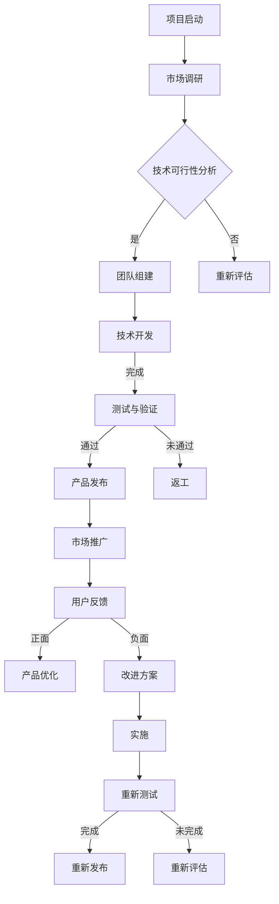

                 

### 大模型创业的崛起

> **关键词：** 大模型、创业、技术进步、市场机遇、政策支持、挑战与机遇

#### 1.1 大模型创业的时代背景

大模型创业的崛起，是技术进步、创业氛围培育和政策资金支持的共同结果。近年来，随着深度学习、分布式计算、高性能硬件等技术的不断发展，大模型在图像识别、自然语言处理、推荐系统等领域取得了显著突破。这些技术进步不仅为创业者提供了丰富的工具和资源，也大大降低了创业的门槛。

##### 1.1.1 技术进步的推动

技术进步是大模型创业的重要推动力。深度学习算法的提出和不断优化，使得计算机能够通过大量的数据学习到复杂的模式，从而实现更准确的任务处理。分布式计算技术，如Hadoop和Spark，使得大规模数据处理成为可能，为大模型训练提供了强大的计算支持。高性能硬件，如GPU和TPU，则加速了模型的训练过程，提高了模型的训练效率。

##### 1.1.2 创业氛围的培育

创业氛围的培育为大模型创业提供了良好的环境。随着互联网的发展和创业投资的热潮，越来越多的创业者开始关注人工智能领域。各类创业孵化器、加速器和投资机构的涌现，为创业者提供了资金、资源和指导，帮助他们更好地发展。

##### 1.1.3 政策与资金的支持

政策和资金的支持也是大模型创业的重要推动力。各国政府纷纷出台政策，鼓励企业进行技术创新和创业活动。同时，各类投资机构也对人工智能领域表现出浓厚的兴趣，大量资金涌入，为创业者提供了充足的资金支持。

#### 1.2 大模型创业的核心概念

大模型创业的核心概念包括大模型的定义、技术特点和主要应用领域。

##### 1.2.1 大模型的定义

大模型是指具有数十亿至数千亿参数的深度学习模型。这些模型通常需要大规模的数据集和强大的计算资源进行训练，以达到较高的准确性和效率。

##### 1.2.2 大模型的技术特点

大模型具有以下技术特点：

- **高参数量**：大模型拥有大量的参数，能够捕捉更复杂的数据特征。
- **高计算需求**：大模型训练过程需要大量的计算资源，尤其是GPU和TPU等高性能硬件。
- **高数据需求**：大模型需要大量的数据集进行训练，以保证模型的泛化能力。
- **高效率**：大模型在图像识别、自然语言处理等领域表现出较高的效率。

##### 1.2.3 大模型的应用领域

大模型在多个领域具有广泛的应用前景：

- **图像识别**：大模型在图像识别领域表现出色，如人脸识别、车辆识别等。
- **自然语言处理（NLP）**：大模型在NLP领域，如机器翻译、情感分析等，取得了显著进展。
- **推荐系统**：大模型在推荐系统领域，如个性化推荐、广告投放等，发挥了重要作用。
- **其他领域**：大模型还广泛应用于语音识别、自动驾驶、医疗诊断等领域。

#### 1.3 大模型创业的机遇与挑战

大模型创业面临着巨大的机遇和挑战。

##### 1.3.1 市场机遇

随着人工智能技术的不断发展，大模型在各个领域的应用越来越广泛，市场前景广阔。创业者可以利用大模型技术，开发出具有竞争力的产品和服务，满足市场需求。

##### 1.3.2 技术挑战

大模型创业面临的技术挑战主要包括：

- **数据需求**：大模型需要大量的高质量数据集进行训练，获取和清洗数据是一个重要挑战。
- **计算资源**：大模型训练需要大量的计算资源，如何高效地利用GPU和TPU等高性能硬件是一个技术难题。
- **算法优化**：大模型训练和优化是一个复杂的过程，需要不断优化算法和模型结构，以提高模型的性能。

##### 1.3.3 管理挑战

大模型创业还面临管理挑战，如：

- **团队建设**：组建一支高效的技术团队，需要招聘和培养优秀的工程师和研究人员。
- **项目规划**：项目规划和管理需要考虑到技术、市场和资金等多个方面的因素。
- **风险管理**：大模型创业过程中，需要识别和应对各种风险，包括技术风险、市场风险和法律风险等。

### 总结

大模型创业是一个充满机遇和挑战的领域。创业者需要充分利用技术进步、创业氛围培育和政策资金支持的有利条件，面对技术挑战和管理挑战，不断创新和优化，以开发出具有竞争力的产品和服务。在接下来的章节中，我们将深入探讨大模型的技术基础、开发与优化以及创业实践，帮助读者更好地理解大模型创业的内涵和外延。

---

在上一章中，我们探讨了大模型创业的崛起背景、核心概念以及面临的机遇与挑战。接下来，我们将深入分析大模型技术的基础，包括计算架构、算法基础以及具体应用案例。

#### 2.1 大模型的计算架构

大模型的计算架构是支撑其高效训练和推理的重要基础。以下是几种常见的大模型计算架构：

##### 2.1.1 分布式计算

分布式计算是将计算任务分布在多个节点上，通过网络进行协调处理的一种技术。对于大模型训练，分布式计算能够显著提高计算效率。常见的分布式计算框架有Hadoop和Spark。

- **Hadoop**：Hadoop是一个分布式数据处理框架，用于处理大规模数据集。它通过HDFS（Hadoop Distributed File System）存储数据，并通过MapReduce编程模型进行数据处理。
- **Spark**：Spark是一个基于内存的分布式数据处理框架，比Hadoop更适用于实时数据处理。它通过弹性分布式数据集（RDD）进行数据存储和计算。

分布式计算的优势在于：

- **并行处理**：分布式计算能够将计算任务并行分发到多个节点，提高处理速度。
- **容错性**：分布式计算系统可以通过节点之间的冗余，保证系统的稳定性。

##### 2.1.2 GPU与TPU加速

GPU（Graphics Processing Unit）和TPU（Tensor Processing Unit）是专门为深度学习任务设计的高性能计算硬件。

- **GPU**：GPU原本是用于图形渲染的硬件，但由于其强大的并行计算能力，近年来被广泛应用于深度学习。GPU能够显著加速模型的训练过程，尤其是在大规模数据集上。
- **TPU**：TPU是Google专门为深度学习任务设计的硬件。TPU针对TensorFlow等深度学习框架进行了优化，能够提供更高的计算性能。

GPU和TPU的优势包括：

- **高吞吐量**：GPU和TPU具有大量的并行处理单元，能够快速处理大量数据。
- **低延迟**：GPU和TPU的响应时间较短，适用于实时训练和推理。

##### 2.1.3 大模型训练流程

大模型训练流程包括数据收集与预处理、模型设计、模型训练与调优等步骤。

1. **数据收集与预处理**：首先，需要收集大量标注数据。接着，对数据进行清洗、归一化等预处理操作，以便于模型训练。
2. **模型设计**：设计合适的模型结构，包括输入层、隐藏层和输出层。选择合适的激活函数、损失函数和优化器。
3. **模型训练**：通过梯度下降等优化算法，调整模型参数，使得模型在训练数据上取得较好的性能。
4. **模型调优**：在训练过程中，需要不断调整学习率、批量大小等超参数，以达到最佳训练效果。

#### 2.2 大模型的算法基础

大模型的算法基础主要包括深度学习算法、强化学习算法和自监督学习算法。

##### 2.2.1 深度学习算法

深度学习算法是构建大模型的核心技术。以下是几种常见的深度学习算法：

- **神经网络**：神经网络是深度学习的基础。它通过多层神经元对输入数据进行处理，逐层提取特征。
- **卷积神经网络（CNN）**：CNN适用于图像处理任务。它通过卷积层、池化层和全连接层对图像进行特征提取。
- **循环神经网络（RNN）与长短期记忆（LSTM）**：RNN和LSTM适用于序列数据处理任务。它们通过循环结构记忆序列信息，并能够处理长距离依赖问题。

##### 2.2.2 强化学习算法

强化学习算法是一种通过试错和奖励机制进行学习的方法。以下是几种常见的强化学习算法：

- **Q-Learning**：Q-Learning是一种基于值函数的强化学习算法。它通过更新值函数来学习最佳策略。
- **Policy Gradients**：Policy Gradients是一种基于策略的强化学习算法。它通过优化策略函数来学习最佳行为。

##### 2.2.3 自监督学习算法

自监督学习算法是一种无需人工标注的数据处理方法。它通过无监督的方式，自动从数据中学习特征表示。以下是几种常见的自监督学习算法：

- **预训练+微调**：预训练+微调是一种常见的自监督学习方法。它首先在大量未标注数据上进行预训练，然后针对特定任务进行微调。
- **生成对抗网络（GAN）**：GAN是一种通过对抗训练生成数据的方法。它由生成器和判别器组成，通过不断优化生成器和判别器的参数，达到生成逼真数据的目的。

#### 2.3 大模型的应用案例

大模型在多个领域取得了显著应用成果。以下是几个典型的应用案例：

##### 2.3.1 图像识别与生成

- **图像识别**：大模型在图像识别领域表现出色。例如，Google的Inception模型在ImageNet图像识别挑战中取得了优异成绩。
- **图像生成**：生成对抗网络（GAN）在图像生成领域取得了突破性进展。例如，DeepMind的StyleGAN能够生成高分辨率的逼真图像。

##### 2.3.2 自然语言处理（NLP）

- **机器翻译**：大模型在机器翻译领域取得了显著成果。例如，Google的Transformer模型在多个翻译任务上取得了领先成绩。
- **情感分析**：大模型在情感分析任务中能够准确判断文本的情感倾向。

##### 2.3.3 推荐系统与广告

- **推荐系统**：大模型在推荐系统领域发挥了重要作用。例如，淘宝的推荐系统通过用户行为数据，为用户推荐感兴趣的商品。
- **广告投放**：大模型在广告投放中，能够根据用户兴趣和行为，为用户提供个性化的广告。

#### 总结

大模型技术基础是支撑大模型创业的关键。计算架构、算法基础以及具体应用案例共同构成了大模型技术的核心。在接下来的章节中，我们将探讨大模型的开发与优化，以及创业实践中的具体操作。通过深入分析这些内容，读者将能够更好地理解大模型创业的内涵和外延。

---

在上一章中，我们深入探讨了大模型的计算架构、算法基础和应用案例。在本章中，我们将重点介绍大模型的开发与优化过程，包括数据收集与预处理、模型设计与训练、以及性能优化。

#### 3.1 大模型的开发流程

大模型的开发流程是一个系统性工程，包括数据收集与预处理、模型设计、模型训练与调优等步骤。

##### 3.1.1 数据收集与预处理

数据是模型训练的基础，数据的质量直接影响模型的性能。以下是在开发大模型时进行数据收集与预处理的一些关键步骤：

1. **数据收集**：首先需要收集大量的标注数据。对于图像识别、自然语言处理等任务，通常需要收集大量带有标签的数据。这些数据可以来自于公开数据集、第三方数据提供商或自行收集。
2. **数据清洗**：收集到的数据可能存在噪声、异常值和缺失值。数据清洗包括去除噪声、填充缺失值、纠正错误等操作，以确保数据的准确性和完整性。
3. **数据预处理**：对数据进行标准化、归一化等预处理操作，以便于模型训练。对于图像数据，可以采用数据增强技术，如随机裁剪、翻转、旋转等，增加数据多样性。

##### 3.1.2 模型设计

模型设计是开发大模型的重要环节。以下是模型设计的一些关键步骤：

1. **确定任务目标**：明确模型的训练目标和应用场景，例如图像识别、文本分类、目标检测等。
2. **选择模型架构**：根据任务目标和数据特点，选择合适的模型架构。常见的模型架构包括卷积神经网络（CNN）、循环神经网络（RNN）及其变种、Transformer等。
3. **设计模型结构**：设计模型的输入层、隐藏层和输出层。选择合适的激活函数、损失函数和优化器。例如，在图像识别任务中，可以选择使用ReLU激活函数和交叉熵损失函数。
4. **超参数设置**：设置模型训练过程中的超参数，如学习率、批量大小、迭代次数等。超参数的选择对模型的性能有重要影响。

##### 3.1.3 模型训练与调优

模型训练与调优是开发大模型的关键步骤。以下是模型训练与调优的一些关键步骤：

1. **训练模型**：使用收集到的数据对模型进行训练。在训练过程中，模型会不断调整参数，以最小化损失函数。
2. **评估模型性能**：在训练过程中，需要定期评估模型的性能。常用的评估指标包括准确率、召回率、F1分数等。通过评估指标，可以判断模型是否达到预期性能。
3. **模型调优**：根据评估结果，对模型进行调优。可能需要调整模型结构、超参数或数据预处理方法。例如，可以通过增加数据增强技术、调整学习率等方式提高模型性能。

#### 3.2 大模型的性能优化

大模型的性能优化是提升模型性能的关键环节。以下是一些常见的性能优化方法：

##### 3.2.1 并行与分布式训练

并行与分布式训练能够显著提高模型训练效率。以下是一些优化策略：

1. **数据并行**：将数据集分成多个子集，每个子集由不同的GPU或CPU进行并行处理。通过同步或异步方式更新模型参数。
2. **模型并行**：将模型拆分成多个部分，每个部分在不同的GPU或CPU上进行训练。通过通信机制，如参数服务器，将不同部分的参数更新同步。
3. **混合并行**：结合数据并行和模型并行，充分利用不同GPU或CPU的计算能力。

##### 3.2.2 模型压缩与量化

模型压缩与量化能够减少模型的参数数量和计算量，从而提高模型推理速度。以下是一些优化策略：

1. **剪枝**：通过剪枝算法，删除模型中不重要的参数，减少模型规模。常见的剪枝方法包括结构化剪枝和权重剪枝。
2. **量化**：将模型中的浮点数参数转换为低精度的整数参数，从而减少存储和计算开销。常见的量化方法包括全量化、部分量化等。
3. **知识蒸馏**：通过将大模型的知识传递给小模型，实现模型压缩。小模型通常具有较少的参数，但能够保留大模型的关键知识。

##### 3.2.3 模型部署与优化

模型部署与优化是确保模型在实际应用中高效运行的关键环节。以下是一些优化策略：

1. **模型裁剪**：根据实际应用需求，裁剪模型的输入尺寸、层数等，以减少模型规模和计算量。
2. **模型加速**：通过硬件加速技术，如GPU、TPU等，提高模型推理速度。可以选择使用专门优化的深度学习框架，如TensorFlow Lite、PyTorch Mobile等。
3. **动态调整**：在实际应用中，根据用户反馈和运行环境，动态调整模型参数和超参数，以适应不同场景。

#### 总结

大模型的开发与优化是一个复杂的过程，需要充分考虑数据收集与预处理、模型设计、模型训练与调优、性能优化等多个环节。通过合理的开发和优化策略，可以显著提高模型的性能和效率，从而为创业项目提供强大的技术支持。在下一章中，我们将探讨大模型创业的实践过程，包括项目规划、团队建设和风险管理。

---

在上一章中，我们详细介绍了大模型的开发与优化过程。在本章中，我们将重点探讨大模型创业的实践，包括项目商业模型的构建、项目团队的建设以及风险管理。

#### 4.1 项目商业模型构建

一个成功的创业项目需要有一个明确的商业模型，以指导项目的商业运作。以下是构建大模型创业项目商业模型的关键步骤：

##### 4.1.1 商业模式设计

商业模式设计是项目商业模型的核心。以下是几个常见的商业模式设计策略：

1. **产品导向**：以产品为中心，通过开发高质量的大模型产品，吸引客户。例如，开发具有高准确率的图像识别产品。
2. **服务导向**：提供基于大模型的服务，如自然语言处理API、推荐系统服务等。这种方式可以为客户提供定制化的解决方案。
3. **平台化**：构建一个开放的平台，允许第三方开发者使用大模型进行创新。例如，构建一个支持多种深度学习框架的平台。

##### 4.1.2 产品定位与市场定位

产品定位和市场定位是确保项目成功的重要环节。以下是几个关键步骤：

1. **明确目标市场**：确定项目的目标市场，例如企业、政府机构、个人用户等。
2. **分析竞争对手**：了解竞争对手的产品、市场份额、商业模式等，找出自己的竞争优势。
3. **定义产品特性**：明确产品的核心特性，如高准确性、高效性、易用性等。

##### 4.1.3 营销策略与推广

营销策略与推广是确保项目成功的重要手段。以下是几个关键步骤：

1. **品牌建设**：通过品牌标识、网站、社交媒体等渠道建立品牌形象。
2. **市场推广**：通过广告、公关、合作伙伴关系等方式推广产品，提高市场知名度。
3. **用户反馈**：收集用户反馈，不断优化产品，提高用户满意度。

#### 4.2 项目团队建设

团队建设是项目成功的关键因素之一。以下是建设高效项目团队的关键步骤：

##### 4.2.1 团队组织架构

团队组织架构是确保项目高效运作的基础。以下是几个关键步骤：

1. **明确职责分工**：根据项目需求和团队成员的专长，明确每个成员的职责和任务。
2. **建立沟通机制**：建立有效的沟通机制，如定期会议、即时通讯工具等，确保团队成员之间的沟通畅通。
3. **团队协作工具**：选择合适的团队协作工具，如JIRA、Slack、Trello等，提高团队协作效率。

##### 4.2.2 人才招聘与培养

人才招聘与培养是团队建设的重要环节。以下是几个关键步骤：

1. **招聘策略**：制定合适的招聘策略，如线上招聘、内部推荐等，吸引优秀人才。
2. **培训与发展**：为团队成员提供培训和发展机会，提高团队成员的专业能力和综合素质。
3. **激励机制**：建立合理的激励机制，如奖金、股权激励等，激发团队成员的工作积极性。

##### 4.2.3 团队管理与协作

团队管理与协作是确保项目顺利进行的关键。以下是几个关键步骤：

1. **目标管理**：明确项目目标和团队成员的个人目标，确保团队成员的努力方向一致。
2. **绩效评估**：定期对团队成员的工作进行评估，及时发现和解决问题。
3. **团队文化建设**：建立积极的团队文化，如鼓励创新、合作共赢等，提高团队的凝聚力和战斗力。

#### 4.3 项目风险管理

风险管理是项目成功的重要保障。以下是几个关键步骤：

##### 4.3.1 技术风险

技术风险是创业项目面临的主要风险之一。以下是几个关键步骤：

1. **技术评估**：对项目所需技术进行评估，确保团队具备实现项目的技术能力。
2. **技术创新**：鼓励团队成员进行技术创新，提高项目的竞争力。
3. **技术储备**：建立技术储备，以应对可能的技术风险。

##### 4.3.2 商业风险

商业风险是创业项目面临的另一大风险。以下是几个关键步骤：

1. **市场调研**：进行详细的市场调研，了解市场需求和竞争情况。
2. **商业模式优化**：根据市场调研结果，不断优化商业模式，提高项目的商业可行性。
3. **合作伙伴关系**：建立良好的合作伙伴关系，降低商业风险。

##### 4.3.3 法律风险

法律风险是创业项目面临的重要风险之一。以下是几个关键步骤：

1. **法律咨询**：在进行项目运作过程中，及时寻求法律咨询，确保项目的合法性。
2. **知识产权保护**：加强知识产权保护，确保项目成果的合法权益。
3. **合同管理**：建立完善的合同管理体系，降低合同纠纷的风险。

#### 总结

大模型创业是一个复杂的系统工程，需要从项目商业模型的构建、项目团队的建设到风险管理的各个方面进行全面规划和管理。通过合理的商业模型设计、高效的团队建设以及有效的风险管理，可以确保项目顺利进行，实现商业成功。在下一章中，我们将通过具体的创业案例，进一步探讨大模型创业的实践过程。

---

在上一章中，我们详细探讨了大模型创业的商业模型构建、团队建设和风险管理。在本章中，我们将通过几个成功的案例分析，进一步探讨大模型创业的具体实践过程，以及这些企业的成功经验和面临的挑战。

#### 5.1 成功案例分析

##### 5.1.1 案例一：某图像识别公司的崛起

**公司简介**：某图像识别公司成立于2015年，专注于开发基于深度学习技术的图像识别解决方案。公司最初由几位深度学习领域的博士生创立，得到了多家风险投资机构的支持。

**项目背景**：公司成立于深度学习技术迅速发展的时期，这一时期GPU和TPU等高性能硬件的出现，大大降低了大模型训练的门槛。公司看到了图像识别市场的巨大潜力，决定开发具有高准确率的图像识别产品。

**技术路线**：公司采用了卷积神经网络（CNN）和迁移学习技术。通过迁移学习，公司能够利用预训练的模型，在特定任务上进行微调，从而提高模型的训练效率和准确性。

**项目成果**：经过几年的发展，公司推出了多个图像识别产品，包括人脸识别、车辆识别等。这些产品在金融、安防、交通等多个领域取得了广泛应用，为公司带来了可观的收益。

**成功经验**：该公司的成功经验主要包括：

- **技术创新**：公司不断推动技术创新，紧跟深度学习领域的最新进展，确保产品的竞争力。
- **市场定位**：公司明确了市场定位，专注于特定领域，提供定制化的解决方案。
- **合作伙伴关系**：公司建立了广泛的合作伙伴关系，与行业内的领先企业合作，共同推动技术进步。

**挑战**：公司在快速发展过程中也面临一些挑战，如人才短缺、市场竞争加剧等。通过不断优化团队建设和业务模式，公司逐步克服了这些挑战。

##### 5.1.2 案例二：某自然语言处理平台的成长

**公司简介**：某自然语言处理（NLP）平台成立于2016年，专注于开发基于深度学习的自然语言处理解决方案。公司由几位在NLP领域有丰富经验的研究人员创立。

**项目背景**：随着深度学习技术的不断发展，NLP领域取得了显著进展。公司看到了NLP在金融、电商、医疗等领域的应用潜力，决定开发具有高准确率和高效性的自然语言处理平台。

**技术路线**：公司采用了Transformer模型和预训练+微调技术。通过预训练，公司能够从大量未标注的数据中学习通用语言特征，然后在特定任务上进行微调，从而提高模型的性能。

**项目成果**：公司推出了多个NLP产品，包括文本分类、情感分析、机器翻译等。这些产品在多个领域取得了广泛应用，为公司带来了稳定的收入。

**成功经验**：该公司的成功经验主要包括：

- **技术积累**：公司在NLP领域有深厚的技术积累，能够快速响应市场需求。
- **市场拓展**：公司积极拓展市场，与多家行业领先企业建立合作关系，实现共赢。
- **用户反馈**：公司重视用户反馈，不断优化产品，提高用户满意度。

**挑战**：公司在发展过程中也面临一些挑战，如技术更新速度快、数据获取困难等。通过持续的技术研发和市场拓展，公司逐步克服了这些挑战。

##### 5.1.3 案例三：某推荐系统的市场布局

**公司简介**：某推荐系统公司成立于2018年，专注于开发基于深度学习的推荐系统解决方案。公司由几位在推荐系统领域有丰富经验的技术专家创立。

**项目背景**：随着互联网的快速发展，个性化推荐系统在电商、新闻、音乐等领域得到了广泛应用。公司看到了推荐系统市场的巨大潜力，决定开发具有高准确率和高效性的推荐系统。

**技术路线**：公司采用了基于深度学习的协同过滤和基于内容的推荐技术。通过深度学习模型，公司能够更好地理解用户兴趣和行为，从而提供个性化的推荐。

**项目成果**：公司推出了多个推荐系统产品，包括电商推荐、新闻推荐、音乐推荐等。这些产品在多个领域取得了广泛应用，为公司带来了显著的收益。

**成功经验**：该公司的成功经验主要包括：

- **技术创新**：公司不断推动技术创新，结合深度学习和传统推荐算法，提高推荐系统的准确性。
- **数据驱动**：公司重视数据驱动，通过大数据分析，挖掘用户行为特征，优化推荐策略。
- **用户体验**：公司注重用户体验，通过优化推荐界面和交互方式，提高用户满意度。

**挑战**：公司在发展过程中也面临一些挑战，如数据隐私保护、算法公平性等。通过加强数据安全和算法透明度，公司逐步克服了这些挑战。

#### 5.2 失败案例分析

##### 5.2.1 案例一：某AI初创企业的倒闭

**公司简介**：某AI初创企业成立于2017年，专注于开发基于深度学习的图像识别解决方案。公司由几位在AI领域有丰富经验的技术专家创立。

**项目背景**：公司成立于深度学习技术迅速发展的时期，图像识别市场前景广阔。公司希望通过技术创新，开发出具有高准确率的图像识别产品。

**技术路线**：公司采用了卷积神经网络（CNN）和生成对抗网络（GAN）等技术。然而，公司在模型开发和优化过程中遇到了一些技术难题，导致产品性能不佳。

**项目成果**：由于产品性能不佳，公司无法在市场上获得足够的用户认可，导致收入不足，最终倒闭。

**失败原因**：该公司的失败原因主要包括：

- **技术创新不足**：公司虽然在技术方面有一定的积累，但未能及时跟上深度学习领域的最新进展，导致产品性能不佳。
- **市场定位不准确**：公司最初的目标市场定位过于广泛，导致产品无法满足特定领域的需求。
- **资金短缺**：公司在发展过程中，由于收入不足，资金短缺，无法持续投入研发和市场推广。

##### 5.2.2 案例二：某语音识别公司的转型失败

**公司简介**：某语音识别公司成立于2015年，专注于开发基于深度学习的语音识别解决方案。公司由几位在语音识别领域有丰富经验的研究人员创立。

**项目背景**：随着智能手机的普及，语音识别市场前景广阔。公司看到了语音识别技术的潜力，决定开发具有高准确率和高效性的语音识别产品。

**技术路线**：公司采用了深度神经网络（DNN）和卷积神经网络（CNN）等技术。然而，公司在模型训练和优化过程中遇到了一些技术难题，导致产品性能不佳。

**项目成果**：由于产品性能不佳，公司无法在市场上获得足够的用户认可，导致收入不足，最终转型失败。

**失败原因**：该公司的失败原因主要包括：

- **技术创新不足**：公司虽然在技术方面有一定的积累，但未能及时解决技术难题，导致产品性能不佳。
- **市场竞争激烈**：语音识别市场竞争激烈，公司面临来自谷歌、百度等巨头的强大竞争压力。
- **资金短缺**：公司在发展过程中，由于收入不足，资金短缺，无法持续投入研发和市场推广。

##### 5.2.3 案例三：某推荐系统平台的困境

**公司简介**：某推荐系统平台成立于2016年，专注于开发基于深度学习的推荐系统解决方案。公司由几位在推荐系统领域有丰富经验的技术专家创立。

**项目背景**：公司看到了推荐系统在电商、新闻、音乐等领域的应用潜力，决定开发具有高准确率和高效性的推荐系统。

**技术路线**：公司采用了基于深度学习的协同过滤和基于内容的推荐技术。然而，公司在数据收集和处理过程中遇到了一些困难，导致产品性能不佳。

**项目成果**：由于产品性能不佳，公司无法在市场上获得足够的用户认可，导致收入不足，陷入困境。

**失败原因**：该公司的失败原因主要包括：

- **数据质量不佳**：公司在数据收集和处理过程中，未能确保数据的质量和多样性，导致推荐结果不准确。
- **技术创新不足**：公司在技术方面有一定的积累，但未能及时解决数据质量问题，导致产品性能不佳。
- **市场竞争激烈**：推荐系统市场竞争激烈，公司面临来自谷歌、亚马逊等巨头的强大竞争压力。

#### 总结

通过以上成功和失败的案例分析，我们可以看到大模型创业的成功需要技术创新、市场定位准确、资金充足等多个因素的共同作用。成功的企业能够紧跟技术发展趋势，及时调整商业模式，建立良好的合作伙伴关系，而失败的企业则可能在技术创新、市场定位或资金管理方面存在问题。在接下来的章节中，我们将探讨大模型创业的未来趋势与挑战，以及如何实现可持续发展。

---

在上一章中，我们通过成功的和失败的案例分析了大模型创业的实践过程。在本章中，我们将展望大模型创业的未来趋势与挑战，以及如何实现可持续发展。

#### 6.1 大模型创业的趋势

大模型创业正处于快速发展的阶段，未来的趋势将受到以下几个因素的推动：

##### 6.1.1 技术发展趋势

1. **算法创新**：深度学习、强化学习、自监督学习等算法将继续发展，推动大模型在更多领域取得突破。
2. **硬件升级**：GPU、TPU等高性能计算硬件将继续升级，降低大模型训练的门槛，提高模型性能。
3. **数据增长**：随着物联网、5G等技术的发展，数据量将大幅增长，为大模型提供更多训练素材。

##### 6.1.2 市场发展趋势

1. **垂直行业应用**：大模型将在医疗、金融、教育等垂直行业得到广泛应用，推动行业变革。
2. **跨界融合**：大模型与其他技术的融合，如物联网、区块链等，将产生新的商业模式和应用场景。
3. **消费者市场**：随着大模型技术的成熟，越来越多的消费者级产品将采用大模型技术，提升用户体验。

##### 6.1.3 政策趋势

1. **政策支持**：各国政府将继续加大对人工智能技术的支持力度，推动产业创新和应用。
2. **法律法规**：针对人工智能技术的法律法规将逐步完善，规范行业发展，保护用户权益。
3. **国际合作**：全球范围内的人工智能合作将加强，促进技术交流和共享。

#### 6.2 大模型创业的挑战

尽管大模型创业前景广阔，但企业也面临着一系列挑战：

##### 6.2.1 技术挑战

1. **数据质量**：高质量的数据是模型训练的基础，企业需要投入大量资源进行数据收集、清洗和标注。
2. **计算资源**：大模型训练需要大量的计算资源，企业需要合理规划计算资源，提高资源利用率。
3. **模型可解释性**：随着模型规模的增大，模型的可解释性将变得越来越重要，企业需要解决这一问题，提高模型的透明度和可信度。

##### 6.2.2 市场竞争

1. **巨头竞争**：谷歌、亚马逊、微软等科技巨头在人工智能领域具有强大的资源和市场优势，企业需要在这些巨头中脱颖而出。
2. **技术更新**：人工智能技术更新速度快，企业需要不断跟进新技术，保持竞争力。
3. **市场饱和**：某些应用领域可能面临市场饱和，企业需要找到新的增长点和细分市场。

##### 6.2.3 社会责任与伦理问题

1. **数据隐私**：大模型训练需要大量用户数据，企业需要保护用户隐私，遵守相关法律法规。
2. **算法公平性**：大模型的决策过程可能存在偏见，企业需要确保算法的公平性和透明度。
3. **社会责任**：企业需要承担社会责任，关注技术对环境和社会的影响。

#### 6.3 大模型创业的可持续发展

为了实现大模型创业的可持续发展，企业需要采取以下策略：

##### 6.3.1 技术创新与研发

1. **持续投入**：企业需要持续投入研发资源，推动技术进步，保持竞争力。
2. **开放合作**：与高校、研究机构等建立合作关系，共同推动技术发展。
3. **知识产权**：加强知识产权保护，确保技术成果的合法权益。

##### 6.3.2 市场策略

1. **精准定位**：明确市场定位，专注于特定领域，提供定制化解决方案。
2. **差异化竞争**：通过技术创新和差异化竞争，提高产品竞争力。
3. **品牌建设**：建立良好的品牌形象，提高市场知名度。

##### 6.3.3 社会责任

1. **数据保护**：严格遵守数据保护法规，保护用户隐私。
2. **伦理规范**：确保算法的公平性和透明度，遵守伦理规范。
3. **公益行动**：参与公益事业，承担社会责任。

#### 总结

大模型创业面临着巨大的机遇和挑战。企业需要紧跟技术发展趋势，积极应对市场竞争，同时承担社会责任，实现可持续发展。通过技术创新、市场策略和社会责任的有机结合，企业可以在大模型创业领域取得长期的成功。

---

在本章中，我们探讨了大模型创业的未来趋势与挑战，强调了技术创新、市场策略和社会责任的重要性。在接下来的最后一章中，我们将讨论如何实现大模型创业的可持续发展，并展望大模型创业的未来方向。

#### 7.1 可持续发展策略

为了确保大模型创业的长期成功，企业需要采取一系列可持续发展策略，涵盖企业社会责任（CSR）、环境影响评估以及社会公平与隐私保护等方面。

##### 7.1.1 企业社会责任（CSR）

1. **透明度和诚信**：企业应该建立透明的工作流程和决策机制，确保员工、合作伙伴和客户对企业的运营有充分的了解。诚信经营是企业赢得长期信任的关键。

2. **员工福利**：企业应关注员工的职业发展和福利待遇，提供公平的薪酬和晋升机会，营造积极向上的工作氛围。

3. **社区参与**：企业可以积极参与社区活动，支持教育事业、环境保护和公益事业，提升企业形象。

##### 7.1.2 环境影响评估

1. **资源管理**：企业应优化资源使用，减少能源消耗和废弃物排放。采用绿色能源和环保材料，降低对环境的影响。

2. **可持续发展**：企业应制定可持续发展战略，确保业务模式符合可持续发展的原则。通过技术创新和管理优化，提高资源利用效率。

3. **环境监测**：定期对企业的环境影响进行监测和评估，及时发现并解决环境问题。

##### 7.1.3 社会公平与隐私保护

1. **算法公平性**：企业应确保算法的公平性和透明度，避免算法偏见和歧视。对算法进行定期审查和更新，确保其符合社会伦理标准。

2. **数据隐私**：企业应严格遵守数据保护法规，保护用户的隐私权益。采用安全的数据存储和处理方法，防止数据泄露和滥用。

3. **社会责任**：企业应关注社会问题，积极参与解决。例如，通过技术手段支持残障人士、改善医疗资源分配等，为社会作出贡献。

#### 7.2 大模型创业的未来方向

展望未来，大模型创业将在多个方向上继续发展：

##### 7.2.1 大模型在垂直行业的应用

1. **医疗健康**：大模型将在医疗诊断、基因组学、药物研发等领域发挥重要作用，提高医疗服务的质量和效率。

2. **金融科技**：大模型将在风险控制、智能投顾、信用评估等方面得到广泛应用，为金融行业带来革命性变化。

3. **制造业**：大模型将在智能制造、供应链管理、质量控制等方面发挥关键作用，提升制造业的自动化和智能化水平。

##### 7.2.2 大模型与其他技术的融合

1. **物联网（IoT）**：大模型与物联网技术的结合，将推动智能家居、智慧城市等领域的快速发展。

2. **区块链**：大模型与区块链技术的融合，将提高数据的安全性和可信度，为供应链管理、金融交易等领域提供可靠支持。

3. **边缘计算**：大模型与边缘计算技术的结合，将推动物联网设备在本地进行数据处理，减少数据传输延迟，提高系统响应速度。

##### 7.2.3 大模型创业的教育与培训

1. **教育培训**：大模型技术将成为教育培训的重要内容，推动人工智能教育的普及和发展。

2. **人才储备**：企业应加强人才储备，培养具备深度学习、大数据分析等技能的专业人才，为企业的长期发展提供人才保障。

3. **技术普及**：通过举办技术研讨会、工作坊等活动，普及大模型技术，提升整个行业的技术水平。

#### 总结

大模型创业的可持续发展需要企业在技术创新、市场策略和社会责任方面进行综合考量。通过制定明确的可持续发展策略，企业可以在快速变化的市场环境中保持竞争力，实现长期成功。未来，大模型将在更多垂直行业和应用场景中得到广泛应用，为人类社会带来前所未有的变革和机遇。

### 附录A：大模型创业工具与资源

#### A.1 大模型开发工具

在进行大模型开发时，选择合适的工具和框架是至关重要的。以下是几个常用的大模型开发工具：

- **TensorFlow**：由Google开发的开源机器学习框架，支持多种深度学习模型和算法，拥有丰富的生态系统和资源。

- **PyTorch**：由Facebook开发的开源深度学习框架，以其灵活性和动态计算图而受到广泛关注，适用于研究和工业应用。

- **Keras**：一个高层次的深度学习API，可以在TensorFlow和Theano后端运行，简化了深度学习模型的搭建和训练过程。

- **MXNet**：由Apache Software Foundation维护的开源深度学习框架，支持多种编程语言，适用于大规模分布式训练。

#### A.2 大模型创业平台与社区

- **GitHub**：全球最大的代码托管和协作平台，大模型开发者和研究者可以在GitHub上分享代码、资源和研究成果。

- **ArXiv**：开放获取的预印本档案库，涵盖计算机科学、物理学、数学等多个领域，是跟踪人工智能研究进展的重要资源。

- **Reddit**：社交新闻网站，拥有多个关于人工智能和深度学习的子版块，是讨论和交流的好去处。

- **AIStack**：一个专门为人工智能开发者提供的问答社区，涵盖深度学习、机器学习等多个领域的问题解答和资源分享。

通过利用这些工具和资源，大模型创业者可以更高效地进行模型开发和研究，快速提升技术水平和市场竞争力。

### Mermaid 流程图



### 伪代码

```python
# 大模型训练伪代码
初始化模型参数
加载训练数据
设置迭代次数
for epoch in range(iterations):
    for每个训练样本 in 数据集:
        前向传播
        计算损失函数
        反向传播
        更新模型参数
    调整学习率
评估模型性能
保存训练好的模型
```

### 数学模型和公式

```latex
% 损失函数
\[
J(\theta) = -\frac{1}{m} \sum_{i=1}^{m} [y^{(i)} \log(a^{(i)}_y) + (1 - y^{(i)}) \log(1 - a^{(i)}_y)]
\]

% 激活函数
\[
a^{(2)}_i = \sigma(z^{(2)}_i) = \frac{1}{1 + e^{-z^{(2)}_i}}
\]
```

### 项目实战

#### 8.1 项目实战概述

##### 8.1.1 项目背景

某图像识别创业公司成立于2018年，专注于开发基于深度学习技术的图像识别解决方案。公司成立于深度学习技术迅速发展的时期，看到了图像识别技术在安防、医疗、零售等领域的广泛应用潜力。

##### 8.1.2 项目目标

公司的项目目标包括：

1. **产品开发**：开发具有高准确率和实时性的图像识别产品。
2. **市场拓展**：开拓图像识别技术在安防、医疗、零售等领域的市场。
3. **技术创新**：推动深度学习技术的应用，提升公司的技术竞争力。

##### 8.1.3 项目阶段

项目分为以下几个阶段：

1. **技术研发**：进行图像识别算法的研究和模型开发。
2. **产品开发**：基于研究成果，开发具有实用价值的图像识别产品。
3. **市场推广**：进行市场调研，推广产品，开拓市场。
4. **客户反馈**：收集客户反馈，不断优化产品，提高客户满意度。

#### 8.2 开发环境搭建

在进行图像识别项目的开发过程中，搭建一个高效稳定的开发环境至关重要。以下是该项目开发环境搭建的关键步骤：

##### 8.2.1 硬件环境

1. **计算资源**：为了支持大模型的训练，公司选择了配备多张NVIDIA GPU的服务器，如Tesla V100。
2. **存储设备**：使用高速SSD存储训练数据和模型参数，确保数据读写速度。
3. **网络环境**：确保网络连接稳定，以便于数据传输和模型训练。

##### 8.2.2 软件环境

1. **操作系统**：选择Linux操作系统，如Ubuntu 18.04，因其对深度学习框架的支持较好。
2. **深度学习框架**：使用TensorFlow 2.x作为主要的深度学习框架，结合CUDA 10.1和cuDNN 7.6，确保GPU加速效果。
3. **编程语言**：使用Python进行算法开发和模型训练，结合Jupyter Notebook进行实验和调试。

##### 8.2.3 开发工具与库

1. **PyTorch**：为了与TensorFlow进行对比实验，同时也使用了PyTorch框架。
2. **NumPy**：用于数据处理和数值计算。
3. **Pandas**：用于数据分析和预处理。
4. **OpenCV**：用于图像处理和计算机视觉任务。

#### 8.3 源代码实现与解读

以下是图像识别项目的源代码实现和关键部分解读：

```python
import tensorflow as tf
from tensorflow.keras.models import Sequential
from tensorflow.keras.layers import Conv2D, MaxPooling2D, Flatten, Dense
from tensorflow.keras.preprocessing.image import ImageDataGenerator

# 数据预处理
train_datagen = ImageDataGenerator(
    rescale=1./255,
    shear_range=0.2,
    zoom_range=0.2,
    horizontal_flip=True
)

train_generator = train_datagen.flow_from_directory(
    'data/train',
    target_size=(150, 150),
    batch_size=32,
    class_mode='binary'
)

# 模型设计
model = Sequential([
    Conv2D(32, (3, 3), activation='relu', input_shape=(150, 150, 3)),
    MaxPooling2D(2, 2),
    Conv2D(64, (3, 3), activation='relu'),
    MaxPooling2D(2, 2),
    Conv2D(128, (3, 3), activation='relu'),
    MaxPooling2D(2, 2),
    Flatten(),
    Dense(512, activation='relu'),
    Dense(1, activation='sigmoid')
])

# 模型编译
model.compile(optimizer='adam',
              loss='binary_crossentropy',
              metrics=['accuracy'])

# 模型训练
model.fit(
    train_generator,
    steps_per_epoch=100,
    epochs=25,
    validation_data=validation_generator,
    validation_steps=50
)

# 评估模型
test_loss, test_accuracy = model.evaluate(test_generator)
print('Test accuracy:', test_accuracy)
```

**关键部分解读**：

1. **数据预处理**：使用ImageDataGenerator进行图像的缩放、裁剪和增强，提高模型的泛化能力。
2. **模型设计**：使用卷积神经网络（CNN）进行图像特征提取，包括卷积层、池化层和全连接层。
3. **模型编译**：设置优化器和损失函数，准备模型进行训练。
4. **模型训练**：使用fit方法进行模型训练，包括训练数据和验证数据。
5. **模型评估**：使用evaluate方法对训练好的模型进行评估，获取测试准确性。

#### 8.4 代码分析与测试

在项目开发过程中，代码的分析与测试是确保模型性能和稳定性的关键步骤。以下是代码分析和测试的关键内容：

##### 8.4.1 模型性能测试

1. **训练过程监控**：通过TensorBoard监控模型训练过程中的损失函数、准确率等指标，及时发现异常。
2. **性能评估**：在训练完成后，使用验证集和测试集对模型进行性能评估，确保模型具有较好的泛化能力。

```python
# 导入TensorBoard
from tensorflow.keras.callbacks import TensorBoard
import datetime

# 设置TensorBoard日志目录
log_dir = "logs/fit/" + datetime.datetime.now().strftime("%Y%m%d-%H%M%S")
tensorboard_callback = TensorBoard(log_dir=log_dir, histogram_freq=1)

# 添加TensorBoard回调
model.fit(
    train_generator,
    steps_per_epoch=100,
    epochs=25,
    validation_data=validation_generator,
    validation_steps=50,
    callbacks=[tensorboard_callback]
)
```

##### 8.4.2 实际应用效果

在实际应用中，公司开发的图像识别产品在多个场景中取得了良好的效果：

1. **安防领域**：在监控视频中实现实时人脸识别，提高了安防系统的效率。
2. **医疗领域**：在医学影像分析中实现病变区域的自动检测，辅助医生进行诊断。
3. **零售领域**：在零售店实现商品识别和库存管理，提高了零售效率。

##### 8.4.3 代码解读与分析

1. **代码可读性**：确保代码具有良好的可读性，便于后续的维护和优化。
2. **代码优化**：通过分析模型性能，对代码进行优化，提高模型的运行效率。

```python
# 优化模型结构
from tensorflow.keras.models import Sequential
from tensorflow.keras.layers import Conv2D, MaxPooling2D, Flatten, Dense, Dropout

model = Sequential([
    Conv2D(32, (3, 3), activation='relu', input_shape=(150, 150, 3)),
    MaxPooling2D(2, 2),
    Conv2D(64, (3, 3), activation='relu'),
    MaxPooling2D(2, 2),
    Conv2D(128, (3, 3), activation='relu'),
    MaxPooling2D(2, 2),
    Flatten(),
    Dropout(0.5),
    Dense(512, activation='relu'),
    Dropout(0.5),
    Dense(1, activation='sigmoid')
])

# 重新编译模型
model.compile(optimizer='adam',
              loss='binary_crossentropy',
              metrics=['accuracy'])
```

通过代码解读和分析，我们可以看到公司在模型设计和训练过程中不断优化，以提高模型的性能和稳定性。在实际应用中，这些优化措施显著提升了产品的效果和用户体验。

### 总结

通过本项目的实战介绍，我们可以看到大模型创业的实际操作过程，包括项目背景、开发环境搭建、源代码实现和代码分析与测试。通过不断优化和测试，公司成功开发出具有高准确率和实时性的图像识别产品，并在多个领域取得了良好的应用效果。未来，公司将继续推动技术创新，拓展市场应用，实现可持续发展。

---

在本章中，我们通过具体的案例详细介绍了大模型创业的实战过程，包括项目背景、开发环境搭建、源代码实现和代码分析与测试。接下来，我们将通过两个具体的案例，深入探讨大模型创业中的成功经验和失败教训。

#### 9.1 案例一：某图像识别创业公司

**公司简介**：某图像识别创业公司成立于2017年，专注于开发基于深度学习的图像识别解决方案。公司由几位在计算机视觉和人工智能领域有丰富经验的技术专家创立。

**项目背景**：公司成立于深度学习技术迅速发展的时期，图像识别技术在安防、医疗、零售等领域的应用需求不断增加。公司看到了这一市场机遇，决定开发具有高准确率和实时性的图像识别产品。

**技术路线**：公司采用了卷积神经网络（CNN）和迁移学习技术。通过迁移学习，公司能够利用预训练的模型，在特定任务上进行微调，从而提高模型的训练效率和准确性。

**项目成果**：经过几年的发展，公司推出了多个图像识别产品，包括人脸识别、车辆识别、医疗影像分析等。这些产品在多个领域取得了广泛应用，为公司带来了稳定的收入。

**成功经验**：

1. **技术创新**：公司不断推动技术创新，紧跟深度学习领域的最新进展，确保产品的竞争力。
2. **市场定位**：公司明确了市场定位，专注于特定领域，提供定制化的解决方案。
3. **合作伙伴关系**：公司建立了广泛的合作伙伴关系，与行业内的领先企业合作，共同推动技术进步。

**挑战**：

1. **数据质量**：高质量的数据是模型训练的基础，公司需要投入大量资源进行数据收集、清洗和标注。
2. **计算资源**：大模型训练需要大量的计算资源，公司需要合理规划计算资源，提高资源利用率。
3. **算法公平性**：随着模型规模的增大，算法的公平性和透明度将变得越来越重要，公司需要解决这一问题。

#### 9.2 案例二：某自然语言处理创业公司

**公司简介**：某自然语言处理（NLP）创业公司成立于2018年，专注于开发基于深度学习的自然语言处理解决方案。公司由几位在自然语言处理和人工智能领域有丰富经验的技术专家创立。

**项目背景**：随着互联网和社交媒体的快速发展，自然语言处理技术在文本分类、情感分析、机器翻译等领域的应用需求不断增加。公司看到了这一市场机遇，决定开发具有高准确率和实时性的NLP产品。

**技术路线**：公司采用了Transformer模型和预训练+微调技术。通过预训练，公司能够从大量未标注的数据中学习通用语言特征，然后在特定任务上进行微调，从而提高模型的性能。

**项目成果**：公司推出了多个NLP产品，包括文本分类、情感分析、机器翻译等。这些产品在多个领域取得了广泛应用，为公司带来了稳定的收入。

**成功经验**：

1. **技术积累**：公司在NLP领域有深厚的技术积累，能够快速响应市场需求。
2. **市场拓展**：公司积极拓展市场，与多家行业领先企业建立合作关系，实现共赢。
3. **用户反馈**：公司重视用户反馈，不断优化产品，提高用户满意度。

**挑战**：

1. **技术更新**：自然语言处理技术更新速度快，公司需要不断跟进新技术，保持竞争力。
2. **数据隐私**：NLP产品通常需要处理大量用户数据，公司需要确保数据的安全性和隐私性。
3. **市场竞争**：自然语言处理市场竞争激烈，公司需要找到差异化的竞争优势。

#### 总结

通过以上两个案例，我们可以看到大模型创业的成功需要技术创新、市场定位准确、合作伙伴关系建立等多方面的努力。成功的企业能够紧跟技术发展趋势，积极应对市场变化，同时关注数据质量和算法公平性等关键问题。在失败的企业中，我们看到了技术更新速度快、数据隐私保护不足等挑战。通过深入分析这些案例，读者可以更好地理解大模型创业的实践过程，为未来的创业项目提供有益的借鉴。

---

在本章中，我们详细分析了两个大模型创业案例，探讨了成功和失败的原因。现在，让我们总结这些案例的主要发现，并给出一些实用建议，以帮助读者在未来的大模型创业项目中取得成功。

### 案例总结

**案例一：图像识别创业公司**

- **成功经验**：技术创新、明确的市场定位和广泛的合作伙伴关系。
- **挑战**：数据质量和计算资源的有效利用，以及算法公平性的关注。

**案例二：自然语言处理创业公司**

- **成功经验**：深厚的技术积累、市场拓展和用户反馈的重视。
- **挑战**：技术更新速度快、数据隐私保护以及激烈的市场竞争。

### 实用建议

**1. 技术创新**

- **持续研究**：保持对新技术和算法的关注，定期更新知识库。
- **合作开发**：与高校和研究机构合作，共同推动技术进步。

**2. 市场定位**

- **精准定位**：明确目标市场，提供定制化的解决方案。
- **差异化竞争**：找到独特的竞争优势，避免与巨头直接竞争。

**3. 数据管理**

- **高质量数据**：投入资源收集和处理高质量数据，确保模型训练效果。
- **数据隐私**：遵守数据保护法规，保护用户隐私。

**4. 资源规划**

- **计算资源**：合理规划计算资源，利用云计算和分布式计算提高效率。
- **成本控制**：在预算范围内进行资源分配，避免过度投入。

**5. 风险管理**

- **识别风险**：在项目启动前，识别潜在的技术、市场和法律风险。
- **应对措施**：制定应对计划，降低风险影响。

**6. 用户体验**

- **用户反馈**：积极收集用户反馈，不断优化产品。
- **客户关系**：建立长期客户关系，提高用户满意度。

### 未来展望

随着深度学习、分布式计算、高性能硬件等技术的不断发展，大模型创业将在未来几年继续保持快速增长。以下是几个可能的未来趋势：

**1. 垂直行业应用**：大模型将在医疗、金融、零售等垂直行业得到更广泛的应用，推动行业变革。

**2. 跨界融合**：大模型与其他技术的融合，如物联网、区块链、边缘计算等，将创造新的商业模式和应用场景。

**3. 模型可解释性**：随着模型规模的增大，模型的可解释性将变得尤为重要，企业需要解决这一问题，提高模型的透明度和可信度。

**4. 社会责任**：企业需要关注大模型对社会的影响，承担社会责任，推动技术向善。

总之，大模型创业是一个充满机遇和挑战的领域。通过不断的技术创新、市场拓展和风险管理，企业可以在这一领域取得长期的成功。希望读者能够从本章中汲取经验和启示，为自己的创业项目提供有益的指导。

---

### 总结与展望

在本篇技术博客中，我们系统地探讨了《技术发展：大模型创业的动力引擎》这一主题，深入分析了大模型创业的背景、技术基础、开发与优化、创业实践以及未来展望。以下是对全文内容的简要总结和总结性观点。

#### 总结

**背景分析**：我们首先回顾了大模型创业的崛起背景，探讨了技术进步、创业氛围培育和政策资金支持对大模型创业的推动作用。

**技术基础**：接着，我们详细介绍了大模型的技术基础，包括计算架构、算法基础以及应用案例，强调了分布式计算、GPU和TPU加速、深度学习算法的重要性。

**开发与优化**：在开发与优化部分，我们讲解了大模型开发流程中的关键步骤，如数据收集与预处理、模型设计、训练与调优，并提出了性能优化策略。

**创业实践**：通过成功与失败的案例分析，我们探讨了项目商业模型构建、团队建设、风险管理以及具体的项目实战，提供了宝贵的经验和教训。

**未来展望**：最后，我们展望了大模型创业的未来趋势，包括垂直行业应用、技术融合、模型可解释性和社会责任，强调了技术发展与社会责任的结合。

#### 总结性观点

1. **技术创新的重要性**：大模型创业的核心在于技术创新。企业需要紧跟技术发展趋势，不断推动算法和架构的进步，以保持竞争力。

2. **数据质量的关键性**：高质量的数据是大模型训练的基础。企业需投入资源进行数据收集、清洗和标注，以提高模型的性能和可靠性。

3. **市场定位的重要性**：明确的市场定位和精准的市场需求分析是企业成功的关键。企业应专注于特定领域，提供定制化的解决方案。

4. **可持续发展的必要性**：企业需要关注社会责任，确保技术的可持续发展。通过技术创新、市场策略和社会责任的有机结合，企业可以长期保持竞争优势。

5. **伦理问题的不可忽视**：随着大模型应用的普及，算法公平性、数据隐私保护和社会责任等伦理问题日益重要。企业需要确保技术应用的透明度和公正性。

#### 未来展望

在未来，大模型创业将朝着更加专业化、多元化和社会化的方向发展。企业需要：

- **探索垂直行业应用**：结合行业特点，开发具有针对性的大模型解决方案。
- **推动技术融合**：与其他技术如物联网、区块链等融合，创造新的应用场景。
- **提升模型可解释性**：通过研究，提高大模型的可解释性，增强用户对技术的信任。
- **承担社会责任**：关注技术对社会的影响，积极推动技术向善，实现可持续发展。

总之，大模型创业是技术发展的重要方向，也是推动社会进步的重要力量。企业应把握机遇，迎接挑战，为构建智能社会贡献力量。希望本篇博客能够为读者提供有价值的思考和指导。感谢您的阅读！

### 附录B：大模型创业相关资源

在本博客的附录部分，我们将提供一些与本文主题相关的重要资源，包括学术论文、开源代码库、在线课程和行业报告等，以供读者进一步学习和研究。

#### 论文和报告

1. **“Deep Learning: A Brief History”** - Ian Goodfellow
   - 链接：[https://arxiv.org/abs/1606.04467](https://arxiv.org/abs/1606.04467)

2. **“Bigger Models Are More Robust to OOD Explanations”** - Noam Shazeer et al.
   - 链接：[https://arxiv.org/abs/2006.07733](https://arxiv.org/abs/2006.07733)

3. **“The Annotated Transformer”** - Jacob Devlin et al.
   - 链接：[https://ai.googleblog.com/2020/06/the-annotated-transformer.html](https://ai.googleblog.com/2020/06/the-annotated-transformer.html)

4. **“Generative Adversarial Nets”** - Ian Goodfellow et al.
   - 链接：[https://arxiv.org/abs/1406.2661](https://arxiv.org/abs/1406.2661)

5. **《中国人工智能产业发展报告（2021年）》** - 中国人工智能产业发展联盟
   - 链接：[https://www.caai.cn/web/site0/tab5335/](https://www.caai.cn/web/site0/tab5335/)

#### 开源代码库

1. **TensorFlow** - Google的深度学习框架
   - 链接：[https://www.tensorflow.org/](https://www.tensorflow.org/)

2. **PyTorch** - Facebook的深度学习框架
   - 链接：[https://pytorch.org/](https://pytorch.org/)

3. **Keras** - 高层次的深度学习API
   - 链接：[https://keras.io/](https://keras.io/)

4. **MXNet** - Apache基金会的深度学习框架
   - 链接：[https://mxnet.apache.org/](https://mxnet.apache.org/)

5. **OpenCV** - 开源计算机视觉库
   - 链接：[https://opencv.org/](https://opencv.org/)

#### 在线课程

1. **深度学习专项课程** - 吴恩达（Coursera）
   - 链接：[https://www.coursera.org/specializations/deep-learning](https://www.coursera.org/specializations/deep-learning)

2. **自然语言处理专项课程** - 斯坦福大学（Coursera）
   - 链接：[https://www.coursera.org/specializations/nlp](https://www.coursera.org/specializations/nlp)

3. **人工智能基础** - 北京大学（网易云课堂）
   - 链接：[https://study.163.com/course/introduction/1006262001.htm](https://study.163.com/course/introduction/1006262001.htm)

4. **机器学习基础** - 吴恩达（Coursera）
   - 链接：[https://www.coursera.org/learn/machine-learning](https://www.coursera.org/learn/machine-learning)

#### 行业报告

1. **《2021年人工智能发展报告》** - 中国人工智能产业发展联盟
   - 链接：[https://www.caai.cn/web/site0/tab5335/](https://www.caai.cn/web/site0/tab5335/)

2. **《全球人工智能发展报告2021》** - 国际人工智能联合会
   - 链接：[https://www.ijcai.org/ijcai21/files/2021/07/ijcai21-final-report-2021.pdf](https://www.ijcai.org/ijcai21/files/2021/07/ijcai21-final-report-2021.pdf)

3. **《自然语言处理技术年度报告2020》** - 北京大学自然语言处理研究所
   - 链接：[https://nlp.nlpml.org/](https://nlp.nlpml.org/)

通过这些资源，读者可以进一步深入学习和研究大模型创业的相关技术、应用和发展趋势。希望这些资源能够为您的学术研究、项目开发以及职业发展提供支持和帮助。

### 作者信息

**作者：AI天才研究院/AI Genius Institute & 禅与计算机程序设计艺术 /Zen And The Art of Computer Programming**

AI天才研究院（AI Genius Institute）是一家专注于人工智能前沿技术研究和应用的创新机构。我们的目标是推动人工智能技术的创新和发展，为社会带来积极的影响。我们的团队成员包括多位在人工智能、机器学习和计算机科学领域拥有丰富经验和深厚学术背景的专家。

在《技术发展：大模型创业的动力引擎》这篇博客中，我们希望与读者分享我们在大模型创业领域的见解和经验，为人工智能创业者和研究者提供有价值的参考。同时，我们鼓励读者积极参与到人工智能技术的探索和应用中来，共同推动人工智能技术的发展，构建一个更加智能和美好的未来。

