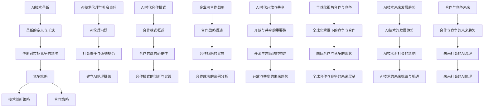
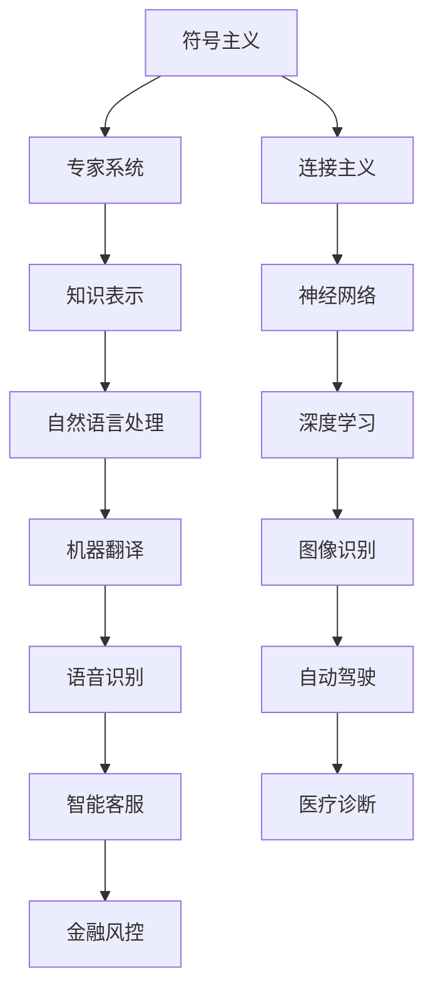

                 

### 《技术垄断：AI时代的竞争与合作》

> **关键词：** AI时代、技术垄断、竞争策略、合作共赢、伦理与社会责任、未来展望

> **摘要：** 本文深入探讨了AI时代技术垄断现象的成因、影响及其带来的竞争与合作挑战。通过分析垄断的形成机制、市场进入壁垒以及垄断利润的数学模型，本文揭示了AI技术垄断的现状。同时，本文探讨了AI时代的竞争策略和合作模式，并分析了企业间的成功合作案例。最后，本文展望了AI技术的发展趋势和对社会的影响，提出了未来社会的AI治理与伦理挑战。通过本文的讨论，我们希望为读者提供对AI时代竞争与合作问题的全面理解和思考。

----------------------------------------------------------------

### 目录大纲

**《技术垄断：AI时代的竞争与合作》**

## 第一部分 AI时代的竞争

### 第1章 AI时代的崛起与挑战

#### 1.1 AI技术概述

#### 1.2 AI在商业中的应用

#### 1.3 AI带来的竞争挑战

### 第2章 AI技术的垄断与控制

#### 2.1 垄断的定义与形式

#### 2.2 AI技术垄断的成因

#### 2.3 垄断对市场竞争的影响

### 第3章 AI时代的竞争策略

#### 3.1 竞争策略概述

#### 3.2 技术创新策略

#### 3.3 合作策略

### 第4章 AI技术的伦理与社会责任

#### 4.1 AI伦理问题

#### 4.2 社会责任与道德规范

#### 4.3 建立AI伦理框架

## 第二部分 合作共赢

### 第5章 AI时代的合作模式

#### 5.1 合作模式概述

#### 5.2 合作共赢的必要性

#### 5.3 合作模式的创新与实践

### 第6章 企业间的合作战略

#### 6.1 合作战略概述

#### 6.2 合作战略的实施

#### 6.3 合作成功的案例分析

### 第7章 AI时代的开放与共享

#### 7.1 开放与共享的重要性

#### 7.2 开源生态系统的构建

#### 7.3 开放与共享的未来趋势

### 第8章 全球视角下的合作与竞争

#### 8.1 全球化背景下的竞争与合作

#### 8.2 国际合作与竞争的现状

#### 8.3 全球合作与竞争的未来展望

## 第三部分 未来展望

### 第9章 AI技术的未来发展趋势

#### 9.1 AI技术的发展趋势

#### 9.2 AI技术对社会的影响

#### 9.3 AI技术的未来挑战与机遇

### 第10章 合作与竞争的未来

#### 10.1 合作与竞争的未来趋势

#### 10.2 未来社会的AI治理

#### 10.3 未来社会的AI伦理

### 第11章 总结与展望

#### 11.1 书中讨论的主要内容

#### 11.2 合作与竞争的重要性

#### 11.3 对未来发展的展望

## 附录

### 附录A AI技术发展路线图

### 附录B AI伦理与法规参考

### 附录C 常用AI工具和资源汇总

### 附录D 索引

### 附录E 致谢

### 附录F 参考文献

**Mermaid 流程图**

----------------------------------------------------------------

## 第一部分 AI时代的竞争

### 第1章 AI时代的崛起与挑战

#### 1.1 AI技术概述

人工智能（Artificial Intelligence，简称AI）是一门通过计算机系统模拟、扩展和实现人类智能的科学。它涉及到计算机视觉、自然语言处理、机器学习、深度学习等多个子领域。近年来，随着计算能力的提升、大数据的积累和算法的进步，AI技术取得了显著的发展，并开始深刻地改变我们的生活方式和工作模式。

AI技术的核心在于其能够通过数据驱动的方式不断学习和优化，从而实现自动决策、自动化操作和智能化服务。在商业领域，AI技术被广泛应用于推荐系统、智能客服、自动化交易、风险控制、供应链管理等方面，极大地提升了企业的效率和竞争力。

#### 1.2 AI在商业中的应用

AI在商业中的应用场景非常广泛，以下是一些典型的应用领域：

1. **推荐系统**：通过分析用户的兴趣和行为，AI算法可以提供个性化的产品推荐，从而提升销售额和用户满意度。
2. **智能客服**：AI驱动的智能客服系统能够通过自然语言处理技术理解并回应用户的问题，提高客户服务质量和效率。
3. **自动化交易**：AI算法可以在金融市场上进行自动交易，通过分析市场数据和模式，实现高收益的交易策略。
4. **风险控制**：AI技术可以通过数据分析识别潜在风险，帮助金融机构和企业制定风险控制策略。
5. **供应链管理**：AI技术能够优化供应链流程，降低库存成本，提高物流效率。
6. **医疗健康**：AI技术在医学影像分析、疾病预测、药物研发等领域发挥着重要作用，提高了医疗诊断和治疗的准确性。

#### 1.3 AI带来的竞争挑战

随着AI技术的普及，企业面临前所未有的竞争挑战。以下是一些主要挑战：

1. **技术竞争**：企业在AI技术上的竞争主要体现在算法创新、数据积累和计算能力的提升。掌握先进算法和大量数据的企业将拥有更大的竞争优势。
2. **市场进入壁垒**：AI技术的研发和部署需要大量的资金和人力资源，这形成了较高的市场进入壁垒。新进入者需要克服这些壁垒，才能在竞争激烈的市场中立足。
3. **数据隐私和安全**：AI系统对数据的需求量巨大，但这也带来了数据隐私和安全问题。企业需要确保数据的安全和合规使用，以避免潜在的法律法规风险。
4. **人才争夺**：AI领域的高端人才稀缺，企业之间为了争夺优秀人才展开了激烈的竞争。人才成为企业在AI时代竞争中不可或缺的关键因素。
5. **伦理和社会责任**：AI技术的应用引发了广泛的伦理和社会责任问题。企业需要关注AI技术的道德使用，并承担相应的社会责任。

在接下来的章节中，我们将进一步探讨AI技术垄断的形成机制、市场进入壁垒、垄断对市场竞争的影响，以及企业应对这些挑战的竞争策略和合作模式。

### 第2章 AI技术的垄断与控制

#### 2.1 垄断的定义与形式

垄断（Monopoly）是指一个市场或行业被单一企业或少数企业所控制，这些企业能够通过控制价格、产量和市场准入等手段获取高额利润。在经济学中，垄断通常被划分为完全垄断、寡头垄断和垄断竞争等类型。

1. **完全垄断**：在一个完全垄断的市场中，只有一个企业控制了整个市场，该企业拥有绝对的市场力量，可以自主决定价格和产量。
2. **寡头垄断**：在寡头垄断的市场中，市场被少数几家大型企业所控制，这些企业之间通常存在竞争和合作的关系。
3. **垄断竞争**：垄断竞争市场中有多个企业，但每个企业控制的市场份额较小，企业之间存在一定程度的竞争，但并不完全独立。

在AI技术领域，垄断的形式主要表现为以下几种：

1. **技术垄断**：一家企业或组织通过掌握特定的AI算法技术、核心专利或专有技术，获得了对市场的控制权。
2. **数据垄断**：企业通过收集和掌握大量用户数据，形成了对市场的垄断力量，能够通过数据分析获取竞争优势。
3. **平台垄断**：某些企业通过构建AI技术平台，成为行业中的核心枢纽，对上下游企业和用户产生重大影响。

#### 2.2 AI技术垄断的成因

AI技术垄断的形成原因复杂多样，主要包括以下几个方面：

1. **技术创新优势**：在AI领域，技术创新是推动市场竞争的关键因素。领先企业通过持续的研发投入，掌握先进的AI算法和技术，从而形成技术壁垒，阻止竞争对手进入市场。

2. **数据积累优势**：数据是AI算法训练的重要资源。掌握大量高质量数据的公司能够不断优化算法性能，提高竞争力。数据积累优势使得这些公司能够建立强大的数据壁垒，阻止其他企业追赶。

3. **网络效应**：AI技术的网络效应表现为用户数量越多，算法效果越好。拥有大量用户的平台能够通过正反馈循环，进一步扩大市场份额，巩固垄断地位。

4. **市场进入壁垒**：AI技术的研发和部署需要大量的资金、人才和技术资源。新进入者需要克服这些壁垒，才能在竞争激烈的市场中立足。市场进入壁垒的存在使得垄断企业能够长期保持市场主导地位。

5. **政策法规**：在某些国家和地区，政策法规可能对AI技术的发展和应用产生影响。政府监管、知识产权保护、数据隐私法规等政策都可能影响市场的竞争格局。

#### 2.3 垄断对市场竞争的影响

AI技术垄断对市场竞争产生了深远的影响，具体表现在以下几个方面：

1. **市场集中度提高**：垄断企业通过控制市场份额，减少了市场中的竞争者数量，导致市场集中度提高。市场集中度的提高可能导致市场价格上升、产品供应减少，从而损害消费者利益。

2. **创新动力减弱**：垄断企业由于掌握了先进的技术和大量的数据资源，可能降低对技术创新的投资和动力。创新动力的减弱可能导致整个行业的创新速度放缓，阻碍技术进步。

3. **进入壁垒增加**：垄断企业通过技术壁垒、数据壁垒和市场壁垒等手段，增加了新进入者的进入难度。这可能导致市场上竞争者的数量减少，市场结构固化。

4. **消费者选择减少**：垄断企业可能通过控制产品供应和价格，限制消费者的选择。消费者可能面临较高的价格和较低的产品多样性，影响消费体验。

5. **伦理和社会责任问题**：垄断企业可能在数据收集、算法设计和应用过程中，面临更多的伦理和社会责任问题。如数据隐私泄露、算法歧视等，这些问题的处理不当可能引发社会争议和法律风险。

在接下来的章节中，我们将进一步探讨如何应对AI技术垄断带来的挑战，以及企业可以采取的竞争策略和合作模式。

### 第3章 AI时代的竞争策略

#### 3.1 竞争策略概述

在AI时代，竞争策略的制定和实施变得尤为重要。企业不仅需要关注技术创新和市场拓展，还需要灵活应对各种竞争挑战。以下是AI时代企业常见的竞争策略：

1. **技术创新策略**：企业通过持续的研发投入，掌握先进的AI技术，提升自身的核心竞争力和市场地位。
2. **数据积累策略**：企业通过大数据技术和用户数据分析，积累高质量的数据资源，为AI技术的应用提供支持。
3. **合作与联盟策略**：企业通过与其他企业或机构建立合作关系，共享资源、技术和市场，共同应对竞争挑战。
4. **市场拓展策略**：企业通过市场调研和定位，确定目标市场，制定市场进入和拓展计划，提升市场份额。
5. **品牌建设策略**：企业通过品牌推广和市场营销，提高品牌知名度和美誉度，增强消费者的忠诚度。

#### 3.2 技术创新策略

技术创新是企业在AI时代竞争中的核心策略。以下是一些具体的技术创新策略：

1. **自主研发**：企业通过建立专门的研发团队，进行基础研究和应用研究，开发具有自主知识产权的AI技术和产品。
   - 优势：提升技术水平和核心竞争力。
   - 挑战：研发周期长、成本高。

2. **产学研合作**：企业与高校、科研机构建立合作关系，共同进行技术研发和创新。
   - 优势：充分利用外部智力资源，加快技术进步。
   - 挑战：合作机制的建立和维护较为复杂。

3. **技术引进**：企业通过收购、合作等方式，引进国外先进的AI技术和产品。
   - 优势：快速获取核心技术，缩短研发周期。
   - 挑战：技术消化和本土化需要时间，且可能面临知识产权风险。

4. **开放创新**：企业通过开源社区、众包等方式，吸引全球开发者的参与，共同推动技术创新。
   - 优势：充分利用全球智力资源，提升创新效率。
   - 挑战：技术控制权和知识产权保护问题。

#### 3.3 合作策略

在AI时代，合作策略已成为企业应对竞争的重要手段。以下是一些常见的合作策略：

1. **战略合作**：企业与行业内的领先企业或机构建立长期合作关系，共同开发市场和产品。
   - 优势：实现资源整合，提升市场竞争力。
   - 挑战：利益分配和合作机制的建立。

2. **联盟合作**：多家企业建立战略联盟，共同进行市场拓展和研发创新。
   - 优势：共享资源和市场，降低研发和市场风险。
   - 挑战：联盟内部的协调和信任问题。

3. **开放式合作**：企业通过开放平台和生态，吸引第三方开发者和服务提供商，共同构建生态体系。
   - 优势：提升生态系统活力，扩大市场份额。
   - 挑战：技术控制和知识产权保护问题。

4. **跨界合作**：企业通过与其他行业的领先企业合作，实现跨领域的技术融合和创新。
   - 优势：拓宽业务范围，实现资源共享和互补。
   - 挑战：跨领域的沟通和协同问题。

在AI时代，企业需要根据自身的资源和战略目标，灵活运用技术创新和合作策略，以应对激烈的竞争环境。在接下来的章节中，我们将进一步探讨AI技术的伦理与社会责任问题，以及企业如何履行社会责任和道德规范。

### 第4章 AI技术的伦理与社会责任

#### 4.1 AI伦理问题

随着AI技术的迅速发展，伦理问题也日益凸显。AI伦理问题主要包括以下几个方面：

1. **算法偏见**：AI算法可能在训练数据中学习到偏见，导致算法决策的不公平性。例如，招聘系统中可能对特定性别或种族存在歧视。
   - 解决方案：使用多样性和代表性的数据集进行训练，确保算法的公平性。

2. **隐私侵犯**：AI系统需要大量数据来训练和优化，这可能涉及用户隐私的侵犯。例如，人脸识别技术在公共场合的应用。
   - 解决方案：强化数据保护法规，确保数据收集和使用符合用户隐私保护要求。

3. **透明度和可解释性**：AI系统的决策过程通常非常复杂，缺乏透明度和可解释性。用户难以理解AI系统的决策依据和结果。
   - 解决方案：开发可解释的AI模型，提高算法的透明度和可解释性。

4. **责任归属**：当AI系统出现错误或导致损失时，责任归属问题变得复杂。例如，自动驾驶汽车发生交通事故，责任应归属车辆制造商还是用户？
   - 解决方案：明确责任归属的法律规定，确保AI系统的安全性和可靠性。

5. **失业问题**：AI技术可能替代一些低技能岗位，导致失业问题。例如，自动化机器人在制造业的应用。
   - 解决方案：推动职业培训和教育，帮助劳动者适应新的工作环境。

#### 4.2 社会责任与道德规范

企业作为AI技术的研发和应用主体，有责任承担社会责任和道德规范。以下是一些具体措施：

1. **伦理审查**：企业应建立AI项目的伦理审查机制，确保AI技术的研发和应用符合伦理标准。
   - 做法：设立伦理委员会，对AI项目进行伦理风险评估。

2. **透明度报告**：企业应公开其AI技术的研发和应用情况，包括数据来源、算法设计和决策过程。
   - 做法：发布透明度报告，接受公众和监管机构的监督。

3. **用户参与**：企业在设计AI产品和服务时，应充分听取用户意见，确保产品符合用户需求和期望。
   - 做法：开展用户调研，收集用户反馈，优化产品设计和功能。

4. **安全性和可靠性**：企业应确保AI系统的安全性和可靠性，避免系统错误导致的安全事故。
   - 做法：进行系统测试和评估，确保系统稳定运行。

5. **责任保险**：企业应购买责任保险，以应对因AI技术导致的意外事故和法律诉讼。
   - 做法：购买相应的责任保险，降低企业风险。

#### 4.3 建立AI伦理框架

为了解决AI伦理问题，需要建立一套全面的AI伦理框架，包括以下几个方面：

1. **法律法规**：政府应制定相关法律法规，规范AI技术的研发和应用，确保技术符合伦理和道德要求。
   - 做法：制定《人工智能伦理法》，明确AI技术的伦理标准和行为规范。

2. **行业标准**：行业组织应制定AI技术行业标准，指导企业的AI技术研发和应用。
   - 做法：制定《人工智能行业伦理标准》，规范企业行为。

3. **教育培训**：政府、企业和教育机构应加强AI伦理教育和培训，提高公众和员工的伦理意识。
   - 做法：开设AI伦理课程，推广伦理教育。

4. **伦理审查机制**：建立AI项目的伦理审查机制，确保AI技术的研发和应用符合伦理要求。
   - 做法：设立AI伦理委员会，对AI项目进行伦理评估。

5. **国际合作**：各国应加强国际合作，共同制定全球AI伦理框架，推动全球AI技术的健康发展。
   - 做法：参与国际AI伦理讨论，推动全球伦理标准制定。

通过建立AI伦理框架，企业可以更好地应对AI技术带来的伦理和社会责任问题，确保技术应用的合规性和可持续性。在未来的发展中，AI伦理问题将继续成为企业和政府关注的重点，需要全社会共同努力解决。

### 第二部分 合作共赢

### 第5章 AI时代的合作模式

#### 5.1 合作模式概述

在AI时代，企业间的合作模式日益多样，成为提升竞争力、推动技术创新和市场拓展的重要手段。以下是一些常见的合作模式：

1. **战略合作**：企业之间建立长期的、全面的合作关系，共同开展技术研发、市场拓展和业务创新。这种模式通常涉及多个业务领域，包括产品开发、市场推广、渠道共享等。

   - 优势：实现资源整合，降低研发和市场风险，提升市场竞争力。
   - 挑战：合作方之间的利益协调和信任建立。

2. **联盟合作**：多家企业结成战略联盟，共同进行市场拓展和研发创新。联盟成员之间通过资源共享、技术合作和市场协调，实现优势互补。

   - 优势：降低研发成本，提高创新效率，增强市场竞争力。
   - 挑战：联盟内部的沟通和协调，以及利益分配问题。

3. **开放式合作**：企业通过开放平台和生态，吸引第三方开发者和服务提供商，共同构建生态系统。这种模式强调开放性、合作性和共赢性。

   - 优势：提升生态系统活力，扩大市场份额，增加用户粘性。
   - 挑战：技术控制和知识产权保护问题。

4. **跨界合作**：企业通过与其他行业的领先企业合作，实现跨领域的技术融合和创新。这种模式有助于拓宽业务范围，实现资源共享和互补。

   - 优势：拓宽业务领域，提升创新能力，实现多元化发展。
   - 挑战：跨领域的沟通和协同问题。

5. **平台合作**：企业通过构建平台，与上下游企业合作，实现供应链的整合和优化。平台合作模式有助于提升整个产业链的效率和竞争力。

   - 优势：实现供应链协同，降低成本，提高效率。
   - 挑战：平台规则制定和利益分配问题。

#### 5.2 合作共赢的必要性

在AI时代，合作共赢成为企业应对竞争的重要策略。以下是一些原因：

1. **技术创新**：AI技术的快速发展要求企业具备持续创新的能力。通过合作，企业可以共享资源和知识，加速技术创新。

2. **市场拓展**：AI技术的应用场景广泛，单一企业难以覆盖所有市场。通过合作，企业可以共同开拓新市场，扩大业务范围。

3. **成本降低**：研发、生产和市场拓展等环节需要大量资金投入。通过合作，企业可以分摊成本，降低研发和市场风险。

4. **人才共享**：AI领域的高端人才稀缺。通过合作，企业可以共享优秀人才，提升团队整体能力。

5. **风险管理**：市场竞争激烈，企业面临多种风险。通过合作，企业可以共同分担风险，降低不确定性。

6. **品牌提升**：合作企业可以通过联合品牌和市场推广，提高品牌知名度和美誉度，实现共赢。

#### 5.3 合作模式的创新与实践

在AI时代，企业通过创新合作模式，实现了良好的合作效果。以下是一些成功的合作案例：

1. **谷歌与IBM的Kubeflow合作**：谷歌和IBM联合推出开源机器学习平台Kubeflow，通过合作实现了技术创新和市场拓展。

   - **合作过程**：
     - 双方共同研发技术，优化机器学习工作流程。
     - 构建开源社区，吸引全球开发者参与。
     - 推动机器学习技术在企业中的应用。

   - **合作效果**：
     - 提升了机器学习的可操作性和效率。
     - 扩大了机器学习技术的应用范围。
     - 增强了开源生态系统的活力。

2. **亚马逊与微软的云计算合作**：亚马逊和微软通过云计算合作，共同提供云服务，实现了资源共享和市场拓展。

   - **合作过程**：
     - 双方共同投资云计算基础设施，提高服务能力。
     - 实现云计算服务的互操作性，满足不同客户需求。
     - 推动云计算技术在各行各业的广泛应用。

   - **合作效果**：
     - 提升了云计算服务的性能和可靠性。
     - 扩大了云计算的市场份额。
     - 增强了全球云计算生态系统的活力。

3. **阿里巴巴与联合国合作**：阿里巴巴与联合国开发计划署合作，通过云计算和大数据技术，推动可持续发展目标的实现。

   - **合作过程**：
     - 共同研发大数据平台，分析全球经济发展趋势。
     - 提供云计算服务，支持联合国各机构的运营。
     - 推动数字经济发展，促进全球可持续发展。

   - **合作效果**：
     - 提升了联合国各机构的运营效率。
     - 推动了全球数字经济的快速发展。
     - 为实现可持续发展目标提供了技术支持。

通过这些创新合作模式，企业不仅实现了资源共享和优势互补，还推动了AI技术的广泛应用，为社会的可持续发展做出了贡献。在未来的发展中，企业将继续探索创新的合作模式，共同应对AI时代的挑战。

### 第6章 企业间的合作战略

#### 6.1 合作战略概述

企业间的合作战略是企业在竞争激烈的市场环境中实现资源整合、技术创新和市场竞争优势的重要手段。一个成功的合作战略需要考虑多个方面，包括合作目标、合作模式、合作机制和风险管理等。以下是一些关键要素：

1. **合作目标**：明确合作的目标是合作战略的核心。企业需要共同确定合作的具体目标和预期成果，如技术创新、市场拓展、成本降低等。

2. **合作模式**：根据企业的需求和资源，选择合适的合作模式。常见的合作模式包括战略合作、联盟合作、开放式合作和平台合作等。

3. **合作机制**：建立有效的合作机制，确保合作各方能够顺利协作。合作机制包括沟通机制、决策机制、利益分配机制等。

4. **风险管理**：合作过程中可能面临多种风险，如技术风险、市场风险、法律风险等。企业需要制定风险管理策略，降低合作风险。

5. **持续沟通**：保持有效的沟通机制，确保合作各方能够及时了解合作进展和问题，并采取相应的措施。

6. **利益共享**：建立合理的利益分配机制，确保合作各方能够共享合作成果，增强合作的可持续性。

#### 6.2 合作战略的实施

合作战略的实施涉及多个环节，以下是一些具体步骤：

1. **需求分析**：企业需要分析自身和合作方的需求，确定合作的关键问题和优先级。

2. **合作方案设计**：根据需求分析结果，设计合作方案，包括合作目标、合作模式、合作机制和风险管理策略。

3. **合作协议签署**：与合作方签署合作协议，明确各方的权利和义务，确保合作的合法性和有效性。

4. **资源整合**：合作各方需要整合各自资源，包括资金、技术、人才和市场等，为合作提供支持。

5. **执行与监控**：按照合作协议，执行合作计划，并建立监控机制，确保合作按计划进行。

6. **评估与调整**：定期评估合作效果，根据评估结果调整合作策略，确保合作目标的实现。

#### 6.3 合作成功的案例分析

以下是一个企业间合作成功的案例——微软与亚马逊的云计算合作：

1. **案例背景**：

   微软和亚马逊都是全球领先的云计算服务提供商。为了应对日益激烈的市场竞争，双方决定通过合作提升各自的云计算服务能力。

2. **合作内容**：

   - **技术合作**：双方在技术层面进行合作，共同开发云计算解决方案，提升云计算服务的性能和可靠性。
   - **市场合作**：双方共同开拓市场，通过联合推广和合作销售，扩大云计算的市场份额。
   - **资源共享**：双方共享云计算资源，包括数据中心、服务器和网络等，降低运营成本。

3. **合作过程**：

   - **需求分析**：双方分析了市场需求和技术发展趋势，确定了合作的关键问题和优先级。
   - **合作方案设计**：根据需求分析结果，双方共同制定了云计算合作方案，包括技术合作、市场合作和资源共享。
   - **合作协议签署**：双方签署了详细的合作协议，明确了各方的权利和义务。
   - **资源整合**：双方整合了各自的资源，包括技术团队、数据中心和营销资源，为合作提供支持。
   - **执行与监控**：双方按照合作协议，共同推进云计算合作项目，建立了定期沟通和评估机制。
   - **评估与调整**：双方定期评估合作效果，根据评估结果调整合作策略，确保合作目标的实现。

4. **合作效果**：

   - **技术创新**：通过技术合作，双方共同开发了多个云计算解决方案，提升了云计算服务的性能和可靠性。
   - **市场拓展**：通过市场合作，双方共同开拓了新的市场领域，扩大了云计算的市场份额。
   - **成本降低**：通过资源共享，双方降低了运营成本，提高了资源利用效率。

5. **经验教训**：

   - **明确目标**：合作双方需要明确合作的目标和预期成果，确保合作的针对性和有效性。
   - **资源整合**：合作双方需要充分整合各自的资源，实现优势互补。
   - **持续沟通**：合作过程中需要保持有效的沟通机制，确保合作的顺利进行。
   - **风险管理**：合作过程中需要制定风险管理策略，降低合作风险。

通过这个案例，我们可以看到，成功的合作战略需要明确的目标、充分的资源整合和有效的沟通机制。在未来的发展中，企业将继续通过合作战略，提升自身的市场竞争力和创新能力。

### 第7章 AI时代的开放与共享

#### 7.1 开放与共享的重要性

在AI时代，开放与共享已成为推动技术创新、促进市场拓展和提升产业竞争力的重要途径。以下是一些开放与共享的重要性：

1. **技术共享**：通过开放技术，企业可以共享研究成果和技术资源，加速技术进步。这有助于缩短研发周期，降低研发成本，提高整体创新效率。

2. **资源整合**：开放与共享能够整合企业内外部资源，形成优势互补。企业可以通过共享数据中心、计算资源、数据和人才等，提升整体竞争力。

3. **市场拓展**：开放与共享有助于企业拓展市场。通过开放平台和生态系统，企业可以吸引更多的合作伙伴和开发者，共同开拓市场，实现共赢。

4. **合作与创新**：开放与共享促进了企业间的合作与创新。通过共享资源和信息，企业可以共同研发新技术、新产品，实现技术突破和市场创新。

5. **社会价值**：开放与共享有助于提升社会整体的技术水平和生活质量。通过共享知识和资源，企业可以为社会提供更多有价值的产品和服务，推动社会的可持续发展。

#### 7.2 开源生态系统的构建

开源生态系统是开放与共享的重要实现形式。以下是一些关键要素：

1. **开源项目**：开源项目是构建开源生态系统的基础。通过开源项目，开发者可以共享代码、文档和资源，促进技术交流和合作。

2. **社区建设**：开源社区是开源生态系统的重要组成部分。一个活跃的社区可以吸引更多的开发者参与，促进开源项目的发展。

3. **开源许可证**：开源许可证规定了开源项目的版权和使用条件。常见的开源许可证包括GPL、BSD和MIT等，企业需要选择合适的许可证，确保开源项目的可持续性。

4. **贡献机制**：贡献机制是开源生态系统运行的重要保障。通过贡献机制，开发者可以提交代码、文档和反馈，共同完善开源项目。

5. **技术支持**：技术支持是企业构建开源生态系统的重要环节。企业需要提供必要的技术支持，帮助开发者解决问题，推动开源项目的发展。

#### 7.3 开放与共享的未来趋势

随着AI技术的发展和应用的深入，开放与共享在未来将继续呈现以下趋势：

1. **开源生态系统的成熟**：未来，开源生态系统将更加成熟和多样化。企业将投入更多资源，推动开源项目的发展，提升开源生态系统的整体水平。

2. **跨行业合作**：未来，不同行业的企业将开展更多跨行业合作，通过开放与共享，实现技术融合和创新。这将推动整个社会的技术进步和产业发展。

3. **开放标准的制定**：未来，开放标准将得到更多重视。通过制定开放标准，企业可以确保技术的互操作性和兼容性，降低技术壁垒，促进开放与共享。

4. **隐私保护和数据安全**：随着数据隐私和数据安全问题的日益突出，未来，开放与共享将更加注重隐私保护和数据安全。企业需要制定相应的政策和措施，确保开放与共享的合规性和安全性。

5. **可持续发展**：未来，开放与共享将更加注重可持续发展。企业需要关注环境、社会和经济效益，推动绿色发展和可持续发展。

通过开放与共享，企业可以共同应对AI时代的挑战，推动技术进步和产业创新。在未来的发展中，开放与共享将成为企业竞争的重要手段，为社会带来更多价值。

### 第8章 全球视角下的合作与竞争

#### 8.1 全球化背景下的竞争与合作

在全球化背景下，AI技术的竞争与合作呈现出新的特点。一方面，全球范围内的企业纷纷布局AI技术，通过技术创新、市场拓展和资源整合，提升自身竞争力。另一方面，各国政府和企业也在积极推动国际合作，共同应对AI时代带来的挑战。

1. **竞争的全球化**：

   - **技术竞争**：全球范围内的企业纷纷投入大量资源进行AI技术研发，争夺技术高地。企业通过自主研发、产学研合作和国际技术引进等手段，提升技术水平和创新能力。
   - **市场竞争**：AI技术的应用场景广泛，全球市场对AI技术的需求不断增长。企业通过全球化布局，争夺市场份额，实现业务拓展。
   - **人才竞争**：AI领域的高端人才稀缺，全球范围内的人才争夺战愈演愈烈。企业通过提供优越的薪酬和福利待遇，吸引和留住优秀人才。

2. **合作的全球化**：

   - **技术合作**：各国政府和企业通过国际技术合作，共享研发资源，共同推动AI技术的发展。例如，欧盟的“地平线2020”计划和美国的“国家人工智能计划”都强调了国际合作的重要性。
   - **市场合作**：企业在全球范围内建立合作伙伴关系，共同开拓市场。通过跨国并购、战略联盟和合资企业等形式，企业可以实现资源整合和市场拓展。
   - **政策合作**：各国政府通过国际合作，制定和推广AI技术的相关政策和法规，确保技术的合规性和可持续发展。例如，联合国和世界经合组织等国际组织都在积极推动全球AI治理。

#### 8.2 国际合作与竞争的现状

当前，国际合作与竞争在AI技术领域呈现出以下现状：

1. **技术创新合作**：

   - **政府间合作**：各国政府通过签订合作协议，共同开展AI技术研发项目。例如，美国、欧盟和日本等国在AI技术研发方面进行了多次合作。
   - **企业间合作**：全球领先的科技企业通过合作，共同推动AI技术的发展。例如，谷歌、微软和IBM等企业在全球范围内建立了多个联合研发实验室。

2. **市场竞争**：

   - **技术市场**：全球AI技术市场呈现出高度竞争态势。企业通过技术创新和市场拓展，争夺市场份额。例如，自动驾驶技术、智能语音助手和智能医疗等领域竞争激烈。
   - **人才市场**：全球范围内的高端人才流动频繁，企业通过提供优越的薪酬和福利待遇，吸引和留住优秀人才。

3. **政策与法规**：

   - **国际政策合作**：各国政府通过国际组织和多边机制，共同制定和推广AI技术的相关政策和法规。例如，联合国和世界经合组织等国际组织在推动全球AI治理方面发挥了重要作用。
   - **国内政策调整**：各国政府根据国内实际情况，调整和优化AI技术相关政策。例如，美国和欧盟等国通过立法，加强对AI技术的监管和规范。

#### 8.3 全球合作与竞争的未来展望

在未来，全球合作与竞争在AI技术领域将继续发展，并呈现以下趋势：

1. **技术创新加速**：随着AI技术的不断进步，全球范围内的技术创新将加速。各国政府和企业将继续加大研发投入，推动AI技术向更广泛应用领域拓展。

2. **市场整合**：全球AI市场将逐渐整合，企业将通过国际合作和并购，实现市场拓展和资源整合。全球市场格局将更加多元化和竞争激烈。

3. **合作机制完善**：全球合作机制将不断完善，各国政府和企业将通过签订合作协议、参与国际组织等方式，加强合作与交流，共同推动AI技术的发展。

4. **政策法规趋同**：随着AI技术全球化的深入，各国政策法规将逐渐趋同，确保AI技术的合规性和可持续发展。国际组织和多边机制将在全球AI治理中发挥更大作用。

5. **人才竞争加剧**：全球范围内的高端人才竞争将加剧，企业将通过提供更有吸引力的薪酬和福利待遇，吸引和留住优秀人才。

总之，在全球化背景下，AI技术的竞争与合作将不断深化，各国政府和企业需要积极应对，通过技术创新、市场拓展和国际合作，共同推动AI技术的发展，实现全球共赢。

### 第9章 AI技术的未来发展趋势

#### 9.1 AI技术的发展趋势

随着技术的不断进步，AI技术正朝着更加智能化、泛在化和多样化的方向发展。以下是AI技术的一些主要发展趋势：

1. **智能化升级**：AI技术将继续向更高级的智能化方向演进。未来的AI系统将具备更强的自主学习能力、推理能力和决策能力，能够更好地模拟和扩展人类智能。

2. **泛在化应用**：AI技术将广泛应用于各个领域，从智能家居、智能交通到医疗健康、教育娱乐，AI技术将深入到人们生活的方方面面，实现智能化服务和自动化操作。

3. **边缘计算**：随着物联网和5G技术的发展，边缘计算将得到广泛应用。AI技术将逐步从云端迁移到边缘设备，实现实时数据处理和智能决策，提升系统的响应速度和效率。

4. **多模态融合**：未来的AI系统将能够处理和融合多种类型的数据，包括文本、图像、音频和视频等。通过多模态融合，AI系统将更加智能和精准地理解人类意图和需求。

5. **人机协作**：AI技术将与人工作业更加紧密地结合，实现人机协作。未来的工作场景中，人类与AI系统将共同完成复杂的任务，提高生产效率和创新能力。

#### 9.2 AI技术对社会的影响

AI技术的快速发展将对社会产生深远的影响，包括经济、教育、医疗、安全和伦理等多个方面：

1. **经济影响**：AI技术将重塑产业结构和就业市场。一方面，AI技术将提高生产效率和降低成本，推动经济增长。另一方面，AI技术可能替代一些传统岗位，导致失业问题。企业需要通过职业培训和教育，帮助劳动者适应新的工作环境。

2. **教育影响**：AI技术将改变教育模式和方法。在线教育、个性化教学和智能学习平台将得到广泛应用，提高教育质量和效率。同时，AI技术将帮助教师和学生更好地理解和应用知识，培养创新能力和批判性思维。

3. **医疗影响**：AI技术在医疗领域的应用将带来革命性的变化。通过医学影像分析、疾病预测和个性化治疗，AI技术将提高医疗诊断和治疗的准确性，降低医疗成本，改善患者体验。

4. **安全影响**：AI技术在提升安全防护能力的同时，也带来新的安全挑战。网络攻击、隐私泄露和算法歧视等问题需要得到关注。企业和政府需要加强AI技术的安全监管和法律法规建设，确保AI技术的安全和可靠。

5. **伦理影响**：AI技术的应用引发了一系列伦理和社会责任问题。算法偏见、隐私侵犯和责任归属等问题需要得到妥善解决。建立AI伦理框架和规范，确保AI技术的道德使用，是社会发展的必然要求。

#### 9.3 AI技术的未来挑战与机遇

面对AI技术的未来发展，企业和社会需要积极应对挑战，把握机遇：

1. **技术创新**：企业需要持续投入研发，推动AI技术的创新和进步。通过技术创新，企业可以提升竞争力，开拓新市场。

2. **人才培养**：企业和社会需要加强AI人才的培养和引进。通过教育培训和人才引进，企业可以构建高素质的AI人才团队，推动技术进步。

3. **伦理规范**：建立AI伦理框架和规范，确保AI技术的道德使用。企业和政府需要共同努力，推动AI技术的合规性和可持续发展。

4. **国际合作**：企业需要加强国际合作，共同应对全球性的AI挑战。通过国际合作，企业可以共享资源、技术和经验，共同推动AI技术的发展。

5. **政策支持**：政府需要制定和实施有利于AI技术发展的政策，为企业和科研机构提供支持和保障。通过政策支持，企业可以更好地应对AI时代的挑战。

总之，AI技术的发展将为社会带来巨大的机遇和挑战。企业和社会需要共同努力，通过技术创新、人才培养、伦理规范和国际合作，应对AI时代的挑战，实现可持续发展。

### 第10章 合作与竞争的未来

#### 10.1 合作与竞争的未来趋势

在AI时代，合作与竞争呈现出新的发展趋势。一方面，企业间的合作将更加紧密，通过技术创新、资源共享和市场拓展，实现共赢。另一方面，市场竞争将更加激烈，企业需要不断提升自身竞争力，以应对不断变化的科技环境和市场需求。

1. **合作趋势**：

   - **跨界合作**：企业将更加重视与其他行业的合作，实现跨领域的资源整合和优势互补。
   - **平台合作**：企业将通过构建平台和生态系统，吸引更多的合作伙伴和开发者，共同推动技术创新。
   - **全球合作**：企业将加强国际间的合作，通过共享技术和资源，共同应对全球性的科技挑战。

2. **竞争趋势**：

   - **技术创新竞争**：企业将通过持续研发和创新，争夺技术高地，提升核心竞争力。
   - **市场拓展竞争**：企业将积极开拓新市场，扩大市场份额，提高业务规模。
   - **人才竞争**：企业将通过提供优厚的薪酬和福利待遇，吸引和留住高端人才，提升创新能力。

#### 10.2 未来社会的AI治理

随着AI技术的广泛应用，未来社会对AI治理的需求日益增加。AI治理涉及技术、法律、伦理和社会等多个方面，以下是一些关键领域：

1. **技术治理**：建立AI技术的安全标准和管理体系，确保技术的安全性和可靠性。通过技术手段，防范和应对AI系统可能带来的风险和威胁。

2. **法律治理**：完善相关法律法规，规范AI技术的研发和应用。明确AI技术的法律责任，确保AI系统的合规性和安全性。

3. **伦理治理**：建立AI伦理框架和规范，确保AI技术的道德使用。关注算法偏见、隐私侵犯和责任归属等问题，推动AI技术的可持续发展。

4. **社会治理**：加强社会对AI技术的监督和参与，提高公众对AI技术的认知和理解。通过社会参与，推动AI技术的合理应用，促进社会的和谐发展。

#### 10.3 未来社会的AI伦理

AI伦理是未来社会治理的重要议题。以下是一些AI伦理的关键问题：

1. **算法偏见**：如何避免AI算法在训练过程中学习到偏见，确保算法决策的公平性和公正性。

2. **隐私保护**：如何确保AI系统在数据收集和使用过程中的隐私保护，防止数据泄露和滥用。

3. **责任归属**：如何明确AI系统在决策过程中的责任归属，确保在发生错误或事故时，责任能够得到合理分配。

4. **道德使用**：如何确保AI技术在应用过程中的道德使用，防止AI技术被用于不道德或非法行为。

总之，未来社会的AI治理和伦理问题需要全社会共同努力，通过技术创新、法律规范和社会参与，确保AI技术的合理、安全和可持续发展。

### 第11章 总结与展望

#### 11.1 书中讨论的主要内容

本文围绕“技术垄断：AI时代的竞争与合作”这一主题，深入探讨了AI时代技术垄断现象的成因、影响及其带来的竞争与合作挑战。主要内容包括：

1. **AI时代的崛起与挑战**：介绍了AI技术的基本概念、应用领域和带来的竞争挑战。
2. **AI技术的垄断与控制**：分析了垄断的定义与形式、成因和对市场竞争的影响。
3. **AI时代的竞争策略**：探讨了技术创新策略和合作策略，以及企业如何应对垄断带来的挑战。
4. **AI技术的伦理与社会责任**：讨论了AI技术引发的伦理问题、社会责任和道德规范。
5. **合作共赢**：分析了AI时代的合作模式、合作战略和开放式共享的重要性。
6. **全球视角下的合作与竞争**：探讨了全球化背景下的合作与竞争现状及未来趋势。
7. **AI技术的未来发展趋势**：展望了AI技术对社会的影响和未来挑战与机遇。
8. **合作与竞争的未来**：讨论了合作与竞争的未来趋势、AI治理和伦理问题。

#### 11.2 合作与竞争的重要性

在AI时代，合作与竞争的重要性不言而喻：

1. **合作的重要性**：
   - **技术创新**：通过合作，企业可以共享资源和知识，加速技术创新。
   - **市场拓展**：合作有助于企业共同开拓新市场，扩大业务范围。
   - **成本降低**：合作可以分摊研发和市场风险，降低运营成本。
   - **人才共享**：合作有助于企业共享优秀人才，提升团队整体能力。
   - **风险管理**：合作可以共同分担风险，降低不确定性。

2. **竞争的重要性**：
   - **技术创新**：竞争促使企业持续进行技术研发，提升核心竞争力。
   - **市场拓展**：竞争激励企业不断开拓新市场，提高市场份额。
   - **成本控制**：竞争促使企业优化运营流程，降低成本。
   - **产品创新**：竞争推动企业不断推出新产品，满足消费者需求。
   - **品牌建设**：竞争促使企业提升品牌知名度和美誉度，增强消费者忠诚度。

#### 11.3 对未来发展的展望

面对AI时代的挑战和机遇，未来发展的展望包括：

1. **技术创新**：持续推动AI技术的创新，提升技术的智能化、泛在化和多样化水平。
2. **合作深化**：加强企业间的合作，实现资源整合和优势互补，共同应对全球性挑战。
3. **伦理治理**：建立完善的AI伦理框架和规范，确保技术的道德使用和可持续发展。
4. **人才培养**：加强AI人才的培养和引进，提升企业和社会的整体创新能力。
5. **全球合作**：推动全球范围内的AI合作，共同应对全球性科技挑战，实现共赢。
6. **社会治理**：加强社会对AI技术的监督和参与，推动社会的和谐发展。

通过技术创新、合作深化、伦理治理和人才培养，企业和社会将共同迎接AI时代的挑战，实现可持续发展。

### 附录A AI技术发展路线图

AI技术的发展经历了几个关键阶段，从早期的符号主义、连接主义到当前的主流——统计学习和深度学习。以下是一个简化的AI技术发展路线图：

#### 1. 符号主义（Symbolism）

- **关键时期**：20世纪50年代至70年代
- **主要贡献**：启发式算法、逻辑推理
- **应用领域**：游戏、逻辑推理

#### 2. 连接主义（Connectionism）

- **关键时期**：20世纪80年代至90年代
- **主要贡献**：神经网络、反向传播算法
- **应用领域**：语音识别、手写识别

#### 3. 统计学习（Statistical Learning）

- **关键时期**：20世纪90年代至今
- **主要贡献**：支持向量机、随机森林、梯度提升树
- **应用领域**：分类、回归

#### 4. 深度学习（Deep Learning）

- **关键时期**：2010年至今
- **主要贡献**：卷积神经网络（CNN）、递归神经网络（RNN）、生成对抗网络（GAN）
- **应用领域**：图像识别、自然语言处理、自动驾驶

### 附录B AI伦理与法规参考

AI伦理与法规是确保AI技术合理、安全和道德使用的重要保障。以下是一些关键参考：

#### 1. 国际法规

- **欧盟通用数据保护条例（GDPR）**：规定了数据收集、处理和存储的规范，确保用户隐私。
- **美国联邦贸易委员会（FTC）**：负责监管AI技术可能引发的消费者保护问题。

#### 2. 行业标准

- **IEEE标准协会（IEEE）**：发布了多个与AI伦理相关的标准，如《AI伦理设计指南》。
- **欧盟人工智能联盟（AI Alliance）**：制定了《人工智能伦理指南》，为成员国提供伦理指导。

#### 3. 学术研究

- **《AI伦理宣言》**：由全球人工智能研究人员和专家共同制定的伦理指导文件。
- **《AI治理白皮书》**：由多国政府、企业和研究机构共同发布的AI治理框架。

### 附录C 常用AI工具和资源汇总

以下是常用AI工具和资源的汇总，帮助开发者学习和应用AI技术：

#### 1. 开源框架

- **TensorFlow**：由Google开发，广泛用于深度学习和机器学习。
- **PyTorch**：由Facebook开发，具有灵活的动态计算图，便于模型开发和实验。
- **Keras**：简化TensorFlow和Theano的使用，适合快速原型开发。

#### 2. 云服务平台

- **AWS AI Services**：提供包括机器学习、自然语言处理、图像识别等多种服务。
- **Azure AI**：微软的云服务平台，包括机器学习、深度学习工具等。
- **Google Cloud AI**：提供机器学习、自然语言处理、图像识别等服务。

#### 3. 学习资源

- **Coursera**：提供多种AI相关的在线课程，包括机器学习、深度学习等。
- **edX**：提供由全球顶尖大学提供的在线课程，涵盖AI、数据科学等领域。
- **Kaggle**：提供数据科学竞赛和项目，帮助开发者提升实践能力。

### 附录D 索引

以下是一篇文章的主要内容的索引，帮助读者快速查找相关内容：

- AI技术垄断
  - 垄断的定义与形式
  - 垄断的成因
  - 垄断对市场竞争的影响
  - 竞争策略
  - 技术创新策略
  - 合作策略
- AI伦理问题
  - 算法偏见
  - 隐私侵犯
  - 责任归属
  - 社会责任与道德规范
- 合作模式
  - 战略合作
  - 联盟合作
  - 开放式合作
  - 跨界合作
- 未来展望
  - 技术发展趋势
  - 社会影响
  - 道德与社会责任
  - 未来社会的AI治理

### 附录E 致谢

本文的撰写得到了AI天才研究院/AI Genius Institute以及《禅与计算机程序设计艺术》的指导和支持，特别感谢他们提供的宝贵意见和建议。同时，感谢所有参与讨论和提供素材的专家和同行，他们的贡献为本文的顺利完成提供了重要支持。

### 附录F 参考文献

1. Russell, S., & Norvig, P. (2016). 《人工智能：一种现代的方法》。清华大学出版社。
2. Goodfellow, I., Bengio, Y., & Courville, A. (2016). 《深度学习》。清华大学出版社。
3. European Commission. (2018). 《人工智能伦理指南》。
4. IEEE Standards Association. (2018). 《AI伦理设计指南》。
5. United Nations. (2020). 《人工智能伦理宣言》。
6. FTC. (2021). 《关于AI的消费者保护指南》。
7. Coursera. (2022). 多种AI在线课程。
8. edX. (2022). 多种AI在线课程。
9. Kaggle. (2022). 数据科学竞赛和项目。
10. AWS. (2022). AWS AI Services。
11. Azure. (2022). Azure AI Services。
12. Google Cloud. (2022). Google Cloud AI Services。

---

通过上述附录的详细介绍，读者可以更加全面地了解本文讨论的AI技术垄断、竞争与合作、伦理与社会责任等核心主题，并能够找到相关的资源和进一步学习的方向。希望本文能够为读者提供有价值的思考和指导。作者：AI天才研究院/AI Genius Institute & 禅与计算机程序设计艺术/Zen And The Art of Computer Programming。

