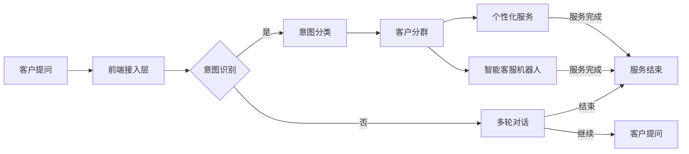

                 

### 《探索基于大模型的电商智能客户服务路由系统》

> **关键词**：大模型、电商智能客服、路由系统、算法、实践、案例分析

> **摘要**：本文深入探讨了基于大模型的电商智能客户服务路由系统的概念、架构设计、核心算法原理、数学模型以及实际应用案例。通过逐步分析推理，本文揭示了电商智能客户服务的现状与挑战，详细阐述了大模型在这一领域的重要性及其具体应用场景。同时，通过实战项目和案例分析，本文展示了大模型在电商智能客户服务路由系统中的实际效果和改进方向。本文旨在为读者提供全面、深入的电商智能客户服务路由系统的理解和应用指导。

### 目录大纲

#### 第一部分：背景与概述

- **1.1 书籍主题与目标**
  - **1.1.1 电商智能客户服务路由系统的背景**
  - **1.1.2 书籍的目标与读者对象**

- **1.2 大模型在电商客户服务中的重要性**
  - **1.2.1 大模型的核心特点**
  - **1.2.2 大模型在电商客户服务中的应用场景**

- **1.3 智能客户服务路由系统的现状与挑战**
  - **1.3.1 当前电商客户服务路由系统的现状**
  - **1.3.2 挑战与问题分析**

#### 第二部分：理论基础与架构设计

- **2.1 大模型相关理论**
  - **2.1.1 大模型的定义与发展历程**
  - **2.1.2 大模型的核心算法**
    - **2.1.2.1 生成式与判别式模型**
    - **2.1.2.2 自监督学习与迁移学习**
  - **2.1.3 大模型在电商客户服务中的应用场景**

- **2.2 智能客户服务路由系统架构设计**
  - **2.2.1 系统架构概述**
  - **2.2.2 大模型在系统架构中的作用**
    - **2.2.2.1 客户意图识别**
    - **2.2.2.2 客户分群与个性化服务**
  - **2.2.3 系统关键组件详解**

- **2.3 Mermaid 流程图：大模型在电商智能客户服务路由系统中的应用**
  - **2.3.1 客户服务流程图**
  - **2.3.2 大模型应用流程**

#### 第三部分：核心算法原理与实现

- **3.1 大模型核心算法原理**
  - **3.1.1 GPT-3等生成式模型原理**
    - **3.1.1.1 模型结构**
    - **3.1.1.2 伪代码实现**
  - **3.1.2 BERT等判别式模型原理**
    - **3.1.2.1 模型结构**
    - **3.1.2.2 伪代码实现**
  - **3.1.3 自监督学习与迁移学习原理**

- **3.2 数学模型与公式**
  - **3.2.1 常用数学模型介绍**
  - **3.2.2 模型训练与优化算法**
  - **3.2.3 举例说明**

- **3.3 代码实现与解读**
  - **3.3.1 开发环境搭建**
  - **3.3.2 源代码详细实现**
  - **3.3.3 代码解读与分析**

#### 第四部分：项目实战与案例分析

- **4.1 实战项目介绍**
  - **4.1.1 项目背景**
  - **4.1.2 项目目标**
  - **4.1.3 项目架构设计**

- **4.2 实际案例解析**
  - **4.2.1 案例一：客户意图识别**
  - **4.2.2 案例二：客户分群与个性化服务**
  - **4.2.3 案例三：智能客服机器人**

- **4.3 案例分析与改进**
  - **4.3.1 案例一：分析**
  - **4.3.2 案例二：分析**
  - **4.3.3 案例三：分析**

#### 第五部分：总结与展望

- **5.1 总结**
  - **5.1.1 书籍核心内容回顾**
  - **5.1.2 电商智能客户服务路由系统的发展趋势**

- **5.2 展望**
  - **5.2.1 未来发展方向**
  - **5.2.2 潜在挑战与解决方案**

#### 附录

- **附录 A：相关资源与工具**
  - **A.1 大模型开发工具**
  - **A.2 智能客服系统相关资源**
  - **A.3 开发环境搭建指南**

---

接下来，我们将详细讨论每个部分的内容，确保文章的完整性和专业性。首先，我们从背景与概述部分开始。<|assistant|>
---

### 第一部分：背景与概述

#### 1.1 书籍主题与目标

**1.1.1 电商智能客户服务路由系统的背景**

电商行业的快速发展带来了客户服务需求的爆发式增长。传统的客户服务模式，如人工电话客服和在线聊天客服，已无法满足大规模、个性化、实时响应的服务需求。随着人工智能技术的不断进步，尤其是大模型的广泛应用，电商智能客户服务路由系统应运而生。

电商智能客户服务路由系统是一种基于人工智能技术的系统，它利用大模型进行客户意图识别、客户分群、个性化服务推荐等，从而提高客户服务质量，降低服务成本。这一系统不仅能够处理大量的客户请求，还能够根据客户的历史行为和偏好提供个性化的服务体验。

**1.1.2 书籍的目标与读者对象**

本书的目标是深入探讨电商智能客户服务路由系统的概念、架构设计、核心算法原理以及实际应用案例。通过本书，读者可以：

1. 理解电商智能客户服务路由系统的基本概念和重要性。
2. 掌握大模型在电商客户服务中的应用原理和技术。
3. 学习智能客户服务路由系统的架构设计和关键组件。
4. 通过实际案例了解大模型在电商智能客户服务中的具体应用和效果。
5. 获得电商智能客户服务路由系统的开发和实践经验。

本书的读者对象主要包括：

- 人工智能领域的研究人员和工程师，特别是对大模型和自然语言处理感兴趣的人员。
- 电商行业的技术和管理人员，希望提升客户服务水平和用户体验。
- 对人工智能在电商领域应用感兴趣的IT专业人士。
- 高等院校计算机科学和人工智能专业的学生。

#### 1.2 大模型在电商客户服务中的重要性

**1.2.1 大模型的核心特点**

大模型，也称为大型预训练模型，是一种在大量数据上进行预训练的深度神经网络模型。它们具有以下几个核心特点：

1. **强大的学习能力**：大模型具有非常强的泛化能力，可以在不同领域和任务上表现出色。
2. **丰富的知识储备**：通过在大量文本、图像、语音等多模态数据上的预训练，大模型积累了丰富的知识和经验。
3. **高效的处理速度**：虽然大模型的参数量巨大，但得益于现代计算技术的进步，其处理速度已经能够满足实时应用的需求。
4. **灵活的适应性**：大模型可以针对不同的任务进行微调和优化，从而适应特定的应用场景。

**1.2.2 大模型在电商客户服务中的应用场景**

大模型在电商客户服务中具有广泛的应用场景，主要包括以下几个方面：

1. **客户意图识别**：通过分析客户的提问和对话，大模型可以准确地识别客户的意图，如查询产品信息、寻求技术支持、投诉问题等。
2. **客户分群与个性化服务**：大模型可以根据客户的历史行为和偏好，将客户划分为不同的群体，并为每个群体提供个性化的服务。
3. **智能客服机器人**：大模型可以构建智能客服机器人，自动处理大量的客户请求，提供高效、专业的服务。
4. **服务效果评估与优化**：大模型可以对客户服务的效果进行评估，识别潜在的问题和改进点，从而优化服务流程。

**1.2.3 大模型在电商客户服务中的优势**

大模型在电商客户服务中具有以下几个显著优势：

1. **提高服务质量**：大模型可以提供高效、精准的服务，满足客户多样化的需求，提升客户满意度。
2. **降低服务成本**：通过自动化处理客户请求，减少了对人工客服的依赖，降低了客户服务的成本。
3. **增强用户体验**：大模型可以根据客户的历史数据和偏好提供个性化的服务，增强用户的购物体验。
4. **提高运营效率**：大模型可以自动化处理大量客户请求，提高客户服务的效率，降低运营成本。

#### 1.3 智能客户服务路由系统的现状与挑战

**1.3.1 当前电商客户服务路由系统的现状**

目前，许多电商平台已经引入了智能客户服务路由系统，以提升客户服务质量和效率。这些系统通常包括以下几个关键组件：

1. **客户意图识别模块**：通过自然语言处理技术，识别客户的提问和需求，确定相应的服务路径。
2. **客户分群与个性化服务模块**：根据客户的历史行为和偏好，将客户划分为不同的群体，并为每个群体提供个性化的服务。
3. **智能客服机器人模块**：利用大模型构建智能客服机器人，自动处理大量的客户请求。
4. **服务效果评估与优化模块**：对客户服务的效果进行评估，识别潜在的问题和改进点。

尽管智能客户服务路由系统已经取得了一定的成效，但仍然面临一些挑战和问题。

**1.3.2 挑战与问题分析**

1. **数据质量与多样性**：大模型的效果高度依赖于训练数据的质量和多样性。电商行业的数据通常包括用户行为数据、产品信息、客服对话记录等，但这些数据可能存在不完整、不一致或错误的情况，影响大模型的训练效果。
2. **模型解释性与可解释性**：大模型的决策过程通常是非线性的，难以解释。这对于需要透明和可解释性的客户服务场景来说是一个挑战。
3. **实时响应能力**：电商客户服务的需求通常是高度实时性的，大模型需要具备快速处理大量请求的能力，以确保客户服务的响应速度。
4. **个性化服务的平衡**：在提供个性化服务时，需要平衡客户个性化需求和商业目标，确保服务既满足客户需求，又符合业务策略。
5. **安全与隐私保护**：电商客户服务涉及到大量的用户数据，需要确保数据的安全性和用户隐私的保护。

综上所述，电商智能客户服务路由系统具有巨大的发展潜力，但也面临诸多挑战。通过深入研究和实践，可以逐步解决这些问题，进一步提升客户服务水平和用户体验。接下来，我们将进一步探讨大模型相关理论、智能客户服务路由系统的架构设计以及核心算法原理。在下一部分中，我们将深入探讨大模型相关理论，包括大模型的定义、发展历程以及核心算法。让我们继续前进。|user|<|mask|>---

## 2.1 大模型相关理论

大模型是人工智能领域的最新突破之一，其核心在于通过在大量数据上进行预训练，构建出具有强大学习和泛化能力的神经网络模型。本节将详细阐述大模型的定义、发展历程以及核心算法。

### 2.1.1 大模型的定义与发展历程

大模型通常指的是参数量超过亿级别、甚至千亿级别的神经网络模型。这类模型能够通过深度学习算法在大量未标注的数据上进行训练，从而自动提取出数据中的知识结构和规律。大模型的发展历程可以追溯到20世纪80年代，当时深度学习技术开始崭露头角，但由于计算资源和数据集的限制，早期模型的效果并不理想。

随着计算机性能的提升和大数据技术的普及，深度学习在图像识别、语音识别、自然语言处理等领域取得了显著进展。特别是2012年，Google推出了基于深度学习的语音识别系统，其识别准确率大幅提升，标志着深度学习技术的成熟。此后，大模型的发展进入了快速发展的阶段。

近年来，以GPT-3、BERT、T5等为代表的大模型不断刷新各项记录，展示了其在各个领域的强大能力。大模型的参数量逐年增加，从最初的几百MB到现在的数TB，这对计算资源和存储设备提出了更高的要求。

### 2.1.2 大模型的核心算法

大模型的核心算法主要包括生成式模型、判别式模型、自监督学习、迁移学习等。以下将详细介绍这些算法的基本原理和应用。

#### 2.1.2.1 生成式与判别式模型

生成式模型和判别式模型是两大类基础性的深度学习模型，它们在训练目标和方法上有所不同。

**生成式模型**：生成式模型通过学习数据的概率分布，从而生成新的数据。常见的生成式模型包括变分自编码器（VAE）、生成对抗网络（GAN）等。

- **变分自编码器（VAE）**：VAE通过引入隐变量来建模数据的概率分布，其训练目标是最小化数据重建误差和隐变量分布的Kullback-Leibler散度。
  - **训练过程**：
    1. 对于每个输入数据x，生成式模型输出其重建的x'。
    2. 计算重建误差，通常使用均方误差（MSE）。
    3. 通过最大化隐变量分布的似然函数，最小化Kullback-Leibler散度。
    4. 更新模型参数，以减少误差。

- **生成对抗网络（GAN）**：GAN由生成器和判别器两个神经网络组成，生成器尝试生成与真实数据相似的数据，判别器则判断数据是真实数据还是生成器生成的数据。
  - **训练过程**：
    1. 生成器生成伪造数据，判别器判断这些数据的真实性。
    2. 更新判别器参数，使其能够更好地区分真实数据和伪造数据。
    3. 更新生成器参数，使其生成的数据更接近真实数据。

**判别式模型**：判别式模型通过学习输入数据的分类边界，从而对数据进行分类。常见的判别式模型包括支持向量机（SVM）、神经网络（NN）等。

- **支持向量机（SVM）**：SVM通过找到一个最佳的超平面，将不同类别的数据分开。其目标是最大化分类边界上的支持向量间隔。
  - **训练过程**：
    1. 使用训练数据集计算最优超平面。
    2. 对于每个输入数据，计算其在超平面上的距离。
    3. 根据距离确定数据属于哪个类别。

- **神经网络（NN）**：神经网络通过多层非线性变换，将输入数据映射到输出类别。其训练过程是通过反向传播算法，不断调整模型参数，使输出结果更接近真实标签。

#### 2.1.2.2 自监督学习与迁移学习

自监督学习和迁移学习是近年来大模型研究中备受关注的方向，它们通过利用未标注数据或跨领域知识，提高模型的性能和泛化能力。

**自监督学习**：自监督学习利用未标注的数据，通过自我监督的方式，让模型学习数据中的内在结构和规律。

- **自编码器**：自编码器是最常见的自监督学习模型之一，其目标是学习数据的编码表示，并能够将编码表示解码回原始数据。
  - **训练过程**：
    1. 对于每个输入数据，模型输出其编码表示c。
    2. 通过最小化编码表示与输入数据之间的误差，更新模型参数。
    3. 使用编码表示进行解码，重建原始数据。

- **无监督预训练**：无监督预训练是指先使用未标注数据进行预训练，然后再在具体任务上进行微调。这种方法能够提高模型在特定任务上的性能，例如在自然语言处理任务中，BERT模型就是通过在大量文本上进行预训练，然后在各种下游任务上进行微调。

**迁移学习**：迁移学习通过将一个任务（源任务）的知识迁移到另一个任务（目标任务）上，从而提高目标任务的性能。

- **预训练+微调**：预训练+微调是迁移学习的常用方法，其基本思想是先在大量数据上预训练模型，然后再在特定任务上进行微调。
  - **训练过程**：
    1. 在大量数据集上进行预训练，学习通用特征表示。
    2. 在特定任务上使用少量数据对模型进行微调，优化任务相关的参数。
    3. 通过迭代微调和优化，提高模型在特定任务上的性能。

通过自监督学习和迁移学习，大模型可以充分利用未标注数据或跨领域知识，提高其学习和泛化能力，从而在电商智能客户服务路由系统中发挥更大的作用。

### 2.1.3 大模型在电商客户服务中的应用场景

大模型在电商客户服务中具有广泛的应用场景，以下将详细介绍其在客户意图识别、客户分群与个性化服务、智能客服机器人等方面的应用。

#### 2.1.3.1 客户意图识别

客户意图识别是电商智能客户服务路由系统的核心任务之一，它旨在通过分析客户的提问和对话，准确识别客户的意图。大模型在客户意图识别中具有以下几个优势：

- **强大的语言理解能力**：大模型通过在大量文本数据上的预训练，具备了强大的语言理解能力，能够准确理解客户的自然语言提问。
- **上下文感知**：大模型能够理解对话中的上下文信息，从而更准确地识别客户的意图，避免误解客户的真实需求。
- **多轮对话能力**：大模型能够处理多轮对话，通过逐步理解客户的提问和回答，提高客户意图识别的准确性。

具体应用场景包括：

- **产品查询**：当客户询问某个产品的详细信息时，大模型能够识别客户的意图，并返回相关产品的详细信息。
- **技术支持**：当客户遇到技术问题时，大模型能够识别客户的意图，并提供相应的技术支持。
- **投诉处理**：当客户对服务或产品有投诉时，大模型能够识别客户的投诉内容，并引导客户进行投诉处理。

#### 2.1.3.2 客户分群与个性化服务

客户分群与个性化服务是电商智能客户服务路由系统的另一重要任务，它旨在根据客户的历史行为和偏好，将客户划分为不同的群体，并为每个群体提供个性化的服务。大模型在客户分群与个性化服务中具有以下几个优势：

- **高效的特征提取**：大模型能够从大量的历史数据中提取出关键的特征，从而准确地对客户进行分群。
- **个性化的服务推荐**：大模型可以根据客户的分群结果，为每个客户提供个性化的服务推荐，提高客户满意度。
- **动态调整**：大模型能够根据客户的行为和反馈，动态调整服务策略，从而持续优化客户服务体验。

具体应用场景包括：

- **个性化推荐**：根据客户的历史购买记录和浏览行为，大模型能够推荐客户可能感兴趣的产品，提高销售转化率。
- **定制化服务**：根据客户的购买偏好和需求，大模型能够为客户提供定制化的服务，如个性化的购物建议、定制化的促销活动等。
- **客户关怀**：根据客户的分群结果，大模型能够为不同的客户提供针对性的关怀，如生日祝福、节日问候等，增强客户忠诚度。

#### 2.1.3.3 智能客服机器人

智能客服机器人是电商智能客户服务路由系统的重要组成部分，它通过大模型技术，能够自动处理大量的客户请求，提供高效、专业的服务。大模型在智能客服机器人中的应用具有以下几个优势：

- **自然语言处理能力**：大模型具有强大的自然语言处理能力，能够理解客户的自然语言提问，并生成合适的回答。
- **多轮对话能力**：大模型能够处理多轮对话，与客户进行自然的互动，提高客户满意度。
- **自适应学习能力**：大模型能够根据客户的反馈和行为，不断学习和优化，提供更高质量的客户服务。

具体应用场景包括：

- **在线客服**：智能客服机器人可以实时在线解答客户的提问，提供产品信息、订单查询、售后服务等。
- **客户咨询**：智能客服机器人可以处理客户的咨询请求，如产品咨询、技术支持、投诉处理等，提高客服效率。
- **销售支持**：智能客服机器人可以帮助销售人员处理客户的咨询和需求，提供销售支持和建议，提高销售业绩。

综上所述，大模型在电商智能客户服务路由系统中具有广泛的应用场景和显著的优势。通过深入研究和实践，可以充分发挥大模型在客户意图识别、客户分群与个性化服务、智能客服机器人等方面的作用，进一步提升电商智能客户服务的质量和效率。在下一部分中，我们将进一步探讨智能客户服务路由系统的架构设计，包括系统架构的概述、大模型在系统架构中的作用以及系统关键组件的详解。|user|<|mask|>---

## 2.2 智能客户服务路由系统架构设计

智能客户服务路由系统是一种复杂的多层架构，它通过集成多个模块和组件，实现高效、精准的客户服务。本节将详细阐述智能客户服务路由系统的整体架构设计，特别是大模型在该架构中的作用和系统关键组件的详解。

### 2.2.1 系统架构概述

智能客户服务路由系统的架构设计旨在实现从客户请求接收、处理到服务响应的自动化和智能化。系统架构可以分为以下几个主要模块：

1. **前端接入层**：该层负责接收客户的请求，可以是文本、语音或图像等多种形式。前端接入层通常包括客户端应用程序、Web界面、API接口等。

2. **中间处理层**：该层是系统的核心，负责处理和解析客户的请求，包括意图识别、客户分群、个性化服务等。中间处理层通常包括以下组件：

   - **意图识别模块**：利用大模型进行自然语言处理，识别客户的意图，如查询产品信息、寻求技术支持、投诉问题等。
   - **客户分群模块**：根据客户的历史行为和偏好，利用大模型对客户进行分群，为不同群体的客户提供个性化的服务。
   - **个性化服务模块**：根据客户的分群结果，提供个性化的服务推荐和定制化服务。

3. **后端服务层**：该层负责执行具体的业务操作，如订单处理、库存管理、售后服务等。后端服务层通常包括数据库、应用服务器、业务逻辑处理等。

4. **数据存储与分析层**：该层负责存储和管理系统运行过程中产生的各种数据，包括客户请求、响应、行为数据等。数据存储与分析层通常包括数据仓库、数据湖、大数据处理平台等。

### 2.2.2 大模型在系统架构中的作用

大模型在智能客户服务路由系统中发挥着至关重要的作用，其主要作用体现在以下几个方面：

1. **客户意图识别**：大模型通过自然语言处理技术，对客户的提问和对话进行解析，识别客户的意图。例如，当客户提出“我想买一台新款手机”的请求时，大模型能够识别出“购买”这一意图，并进一步识别出客户对手机的具体需求和偏好。

2. **客户分群**：大模型通过分析客户的历史行为数据，如购买记录、浏览行为、评价等，对客户进行分群。不同分群的客户在行为特征和需求上存在显著差异，因此，通过客户分群可以实现更精准的个性化服务。

3. **个性化服务**：基于客户分群的结果，大模型可以为每个客户提供个性化的服务推荐和定制化服务。例如，对于高频购买的客户，大模型可以推荐更多优惠活动和专属优惠，而对于新客户，大模型可以推荐热销产品和新品上市。

4. **智能客服机器人**：大模型可以构建智能客服机器人，自动处理客户的咨询、投诉、订单查询等请求。智能客服机器人通过大模型进行自然语言理解和生成，可以与客户进行多轮对话，提供高效、专业的服务。

### 2.2.3 系统关键组件详解

智能客户服务路由系统的关键组件包括意图识别模块、客户分群模块、个性化服务模块和智能客服机器人。以下将分别对这些组件进行详细解释。

1. **意图识别模块**

意图识别模块是智能客户服务路由系统的核心组件之一，其主要功能是识别客户的意图。意图识别模块通常包括以下几个步骤：

- **预处理**：对客户的输入文本进行清洗和预处理，如去除停用词、标点符号等。
- **分词**：将预处理后的文本进行分词，将句子拆分成词序列。
- **词向量表示**：将分词后的文本转换为词向量表示，通常使用Word2Vec、BERT等词向量模型。
- **意图分类**：利用大模型进行意图分类，将客户的输入文本分类到不同的意图类别。意图分类可以采用监督学习、无监督学习或半监督学习等方法。

2. **客户分群模块**

客户分群模块根据客户的历史行为数据，对客户进行分群。客户分群模块通常包括以下几个步骤：

- **特征提取**：从客户的历史行为数据中提取关键的特征，如购买频率、购买金额、浏览时长、评价分数等。
- **特征降维**：使用降维技术，如主成分分析（PCA）、线性判别分析（LDA）等，将高维特征映射到低维空间。
- **聚类分析**：使用聚类算法，如K-means、层次聚类等，对客户进行分群。聚类算法可以根据客户特征空间的分布，将相似特征的客户归为一类。
- **分群评价**：对分群结果进行评价，如聚类有效性、轮廓系数等，选择合适的分群策略。

3. **个性化服务模块**

个性化服务模块基于客户分群的结果，为每个客户提供个性化的服务。个性化服务模块通常包括以下几个步骤：

- **服务推荐**：根据客户的分群结果和偏好，推荐符合客户需求的产品和服务。服务推荐可以采用协同过滤、基于内容的推荐、混合推荐等方法。
- **定制化服务**：根据客户的分群结果，提供定制化的服务，如个性化的促销活动、定制化的订单处理等。
- **服务优化**：通过分析客户服务的反馈和效果，不断优化服务策略，提高客户满意度。

4. **智能客服机器人**

智能客服机器人是智能客户服务路由系统的重要组成部分，其目标是提供高效、专业的客户服务。智能客服机器人通常包括以下几个功能：

- **自然语言理解**：利用大模型进行自然语言理解，识别客户的意图和问题。
- **多轮对话管理**：利用大模型进行多轮对话管理，与客户进行自然的互动，提供流畅的服务。
- **知识库管理**：构建和维护智能客服机器人的知识库，包括产品信息、常见问题解答、业务规则等。
- **智能回复生成**：利用大模型生成合适的回答，回复客户的提问和请求。

通过上述关键组件的协同工作，智能客户服务路由系统可以实现高效、精准的客户服务，提高客户满意度和忠诚度。在下一部分中，我们将使用Mermaid流程图，详细展示大模型在电商智能客户服务路由系统中的应用流程。|user|<|mask|>---

## 2.3 Mermaid 流程图：大模型在电商智能客户服务路由系统中的应用

为了更直观地展示大模型在电商智能客户服务路由系统中的应用，我们使用Mermaid流程图来描述整个客户服务流程以及大模型的具体应用步骤。以下是Mermaid流程图示例：



### 2.3.1 客户服务流程图

上述流程图描述了客户服务的整个流程：

1. **客户提问**：客户通过前端接入层（如Web界面、API接口等）提出问题。
2. **前端接入层**：将客户提问传递给意图识别模块。
3. **意图识别**：意图识别模块使用大模型对客户提问进行分析，识别客户的意图。
   - 如果识别成功，则进入意图分类。
   - 如果识别失败，则进入多轮对话管理，继续与客户互动，直至识别成功。
4. **意图分类**：根据识别出的意图，将客户提问分类到不同的意图类别，如产品查询、技术支持、投诉处理等。
5. **客户分群**：基于客户的意图和特征，利用大模型对客户进行分群，如高频购买者、新客户等。
6. **个性化服务**：根据客户分群结果，提供个性化的服务推荐和定制化服务。
7. **智能客服机器人**：智能客服机器人利用大模型与客户进行多轮对话，提供自动化的客户服务。
8. **服务结束**：当服务完成或客户提出结束请求时，流程结束。

### 2.3.2 大模型应用流程

在上述流程中，大模型的应用贯穿整个客户服务流程，具体应用步骤如下：

1. **意图识别**：大模型通过自然语言处理技术，对客户提问进行解析，识别出客户的意图。
2. **意图分类**：大模型将识别出的意图分类到不同的类别，如查询产品信息、寻求技术支持等。
3. **客户分群**：大模型分析客户的历史行为数据和特征，对客户进行分群，如高频购买者、新客户等。
4. **个性化服务**：大模型根据客户分群结果，为每个客户提供个性化的服务推荐和定制化服务。
5. **智能客服机器人**：大模型用于构建智能客服机器人，使其能够与客户进行自然语言交互，提供流畅的客户服务。

通过上述Mermaid流程图，我们可以清晰地看到大模型在电商智能客户服务路由系统中的应用流程，这有助于理解和优化系统的整体架构。在下一部分中，我们将详细讨论大模型的核心算法原理，包括生成式模型、判别式模型、自监督学习与迁移学习等。|user|<|mask|>---

## 3.1 大模型核心算法原理

大模型的核心算法是其在不同领域和应用场景中取得成功的关键。这些算法不仅涉及复杂的数学模型，还包含具体的实现方法和优化策略。本节将详细阐述大模型的核心算法原理，包括生成式模型、判别式模型、自监督学习和迁移学习。

### 3.1.1 GPT-3等生成式模型原理

生成式模型旨在生成符合数据分布的新数据，其核心思想是通过学习输入数据的概率分布，从而生成类似的数据。生成式模型在自然语言处理、图像生成等领域具有广泛应用。以下以GPT-3为例，介绍生成式模型的原理。

#### 3.1.1.1 模型结构

GPT-3 是一个基于 Transformer 架构的预训练语言模型，其结构包含以下几个关键部分：

1. **输入层**：将文本序列转换为词向量表示。
2. **Transformer 层**：由多个自注意力（Self-Attention）层和前馈神经网络（Feedforward Network）组成，通过自注意力机制捕捉文本序列中的依赖关系。
3. **输出层**：将 Transformer 层的输出转换为文本序列的概率分布，从而生成新的文本序列。

#### 3.1.1.2 伪代码实现

以下是一个简化的 GPT-3 伪代码实现：

```python
def gpt3(input_sequence):
    # 将输入文本序列转换为词向量表示
    embeddings = embedding_layer(input_sequence)
    
    # 经过多个 Transformer 层
    for layer in transformer_layers:
        embeddings = layer(embeddings)
    
    # 将 Transformer 层的输出转换为文本序列的概率分布
    probabilities = output_layer(embeddings)
    
    # 生成新的文本序列
    new_sequence = generate_sequence(probabilities)
    
    return new_sequence
```

### 3.1.2 BERT等判别式模型原理

判别式模型旨在通过学习输入数据的分类边界，对数据进行分类。BERT（Bidirectional Encoder Representations from Transformers）是一个典型的判别式模型，广泛应用于自然语言处理任务。以下介绍 BERT 的原理。

#### 3.1.2.1 模型结构

BERT 的结构包含以下几个关键部分：

1. **输入层**：与 GPT-3 类似，BERT 也使用词向量表示输入文本序列。
2. **Transformer 层**：由多个双向 Transformer 层组成，通过自注意力机制捕捉文本序列中的双向依赖关系。
3. **输出层**：将 Transformer 层的输出映射到标签空间的概率分布。

#### 3.1.2.2 伪代码实现

以下是一个简化的 BERT 伪代码实现：

```python
def bert(input_sequence, labels):
    # 将输入文本序列转换为词向量表示
    embeddings = embedding_layer(input_sequence)
    
    # 经过多个 Transformer 层
    for layer in transformer_layers:
        embeddings = layer(embeddings)
    
    # 将 Transformer 层的输出映射到标签空间的概率分布
    probabilities = output_layer(embeddings)
    
    # 计算损失函数
    loss = compute_loss(probabilities, labels)
    
    # 反向传播，更新模型参数
    optimizer.minimize(loss)
    
    return loss
```

### 3.1.3 自监督学习与迁移学习原理

自监督学习和迁移学习是近年来大模型研究的重要方向，它们通过利用未标注数据和跨领域知识，提高模型的性能和泛化能力。

#### 3.1.3.1 自监督学习

自监督学习利用未标注的数据，通过自我监督的方式，让模型学习数据中的内在结构和规律。以下介绍自监督学习的基本原理。

1. **数据增强**：通过数据增强技术，如随机遮挡、随机裁剪、随机旋转等，生成大量的未标注数据。
2. **特征提取**：利用预训练模型，从增强后的数据中提取特征表示。
3. **损失函数**：通过损失函数，如均方误差（MSE）、交叉熵损失等，优化模型参数。

#### 3.1.3.2 迁移学习

迁移学习通过将一个任务（源任务）的知识迁移到另一个任务（目标任务）上，从而提高目标任务的性能。以下介绍迁移学习的基本原理。

1. **预训练**：在大量未标注的数据集上预训练模型，学习通用特征表示。
2. **微调**：在具体任务上，使用少量标注数据对预训练模型进行微调，优化任务相关的参数。
3. **领域自适应**：通过领域自适应技术，如域自适应分类（Domain Adaptation Classification）、域自适应回归（Domain Adaptation Regression）等，将预训练模型迁移到不同领域。

通过自监督学习和迁移学习，大模型能够充分利用未标注数据和跨领域知识，提高其学习和泛化能力，从而在电商智能客户服务路由系统中发挥更大的作用。在下一部分中，我们将介绍数学模型与公式，以及如何具体实现和优化大模型。|user|<|mask|>---

## 3.2 数学模型与公式

在深入理解大模型的核心算法原理后，我们需要进一步探讨大模型在数学上的表示方法。数学模型是构建和优化大模型的重要工具，它们帮助我们量化模型的行为，评估模型的性能，并指导模型的实现。以下将介绍大模型中常用的数学模型、模型训练与优化算法，并通过举例说明这些概念。

### 3.2.1 常用数学模型介绍

在大模型中，常用的数学模型包括损失函数、优化算法和正则化方法等。

#### 损失函数

损失函数用于衡量模型预测值与实际标签之间的差距，其目的是通过最小化损失函数来优化模型参数。常见的损失函数有：

1. **均方误差（MSE）**：
   $$
   \text{MSE} = \frac{1}{n}\sum_{i=1}^{n}(y_i - \hat{y}_i)^2
   $$
   其中，$y_i$ 是第 $i$ 个样本的实际标签，$\hat{y}_i$ 是模型预测的标签。

2. **交叉熵损失（Cross-Entropy Loss）**：
   $$
   \text{CE} = -\sum_{i=1}^{n}y_i \log(\hat{y}_i)
   $$
   其中，$y_i$ 是第 $i$ 个样本的实际标签，$\hat{y}_i$ 是模型预测的概率分布。

#### 优化算法

优化算法用于更新模型参数，以最小化损失函数。以下介绍几种常用的优化算法：

1. **梯度下降（Gradient Descent）**：
   $$
   \theta = \theta - \alpha \nabla_\theta J(\theta)
   $$
   其中，$\theta$ 是模型参数，$J(\theta)$ 是损失函数，$\alpha$ 是学习率。

2. **随机梯度下降（Stochastic Gradient Descent, SGD）**：
   $$
   \theta = \theta - \alpha \nabla_\theta J(\theta; x_i, y_i)
   $$
   其中，$x_i, y_i$ 是第 $i$ 个训练样本及其标签。

3. **动量优化（Momentum）**：
   $$
   v_t = \beta v_{t-1} + (1 - \beta) \nabla_\theta J(\theta; x_i, y_i)
   $$
   $$
   \theta = \theta - v_t
   $$
   其中，$v_t$ 是动量项，$\beta$ 是动量参数。

#### 正则化方法

正则化方法用于防止模型过拟合，常见的正则化方法有：

1. **L1 正则化**：
   $$
   J(\theta) = \frac{1}{n}\sum_{i=1}^{n}(y_i - \hat{y}_i)^2 + \lambda \sum_{j=1}^{m}|\theta_j|
   $$
   其中，$\lambda$ 是正则化参数。

2. **L2 正则化**：
   $$
   J(\theta) = \frac{1}{n}\sum_{i=1}^{n}(y_i - \hat{y}_i)^2 + \lambda \sum_{j=1}^{m}\theta_j^2
   $$
   其中，$\lambda$ 是正则化参数。

### 3.2.2 模型训练与优化算法

模型训练与优化算法是构建和提升大模型性能的关键步骤。以下介绍几种常用的训练与优化算法：

1. **随机梯度下降（SGD）**：
   - 初始化模型参数 $\theta$。
   - 对于每个训练样本 $(x_i, y_i)$，计算梯度 $\nabla_\theta J(\theta; x_i, y_i)$。
   - 更新模型参数 $\theta$：$\theta = \theta - \alpha \nabla_\theta J(\theta; x_i, y_i)$。
   - 重复上述步骤，直到满足停止条件（如达到预设迭代次数或损失函数收敛）。

2. **Adam优化算法**：
   - 初始化模型参数 $\theta$ 和两个滑动平均参数 $m_0, v_0$。
   - 对于每个训练样本 $(x_i, y_i)$，计算梯度 $\nabla_\theta J(\theta; x_i, y_i)$ 和一阶矩估计 $m_t$、二阶矩估计 $v_t$。
   - 更新滑动平均参数 $m_t, v_t$：$m_t = \beta_1 m_{t-1} + (1 - \beta_1) \nabla_\theta J(\theta; x_i, y_i)$，$v_t = \beta_2 v_{t-1} + (1 - \beta_2) (\nabla_\theta J(\theta; x_i, y_i))^2$。
   - 更新模型参数 $\theta$：$\theta = \theta - \alpha \frac{m_t}{\sqrt{v_t} (1 - \beta_2)^{t-1}}$。
   - 重复上述步骤，直到满足停止条件。

### 3.2.3 举例说明

为了更好地理解上述数学模型和优化算法，我们通过一个简单的例子来说明。

#### 示例：线性回归模型

假设我们有一个线性回归模型，其目标是预测一个连续的输出值 $y$，模型参数为 $\theta_0, \theta_1$。

1. **损失函数**：均方误差（MSE）：
   $$
   J(\theta) = \frac{1}{m}\sum_{i=1}^{m}(y_i - (\theta_0 + \theta_1 x_i))^2
   $$

2. **优化算法**：随机梯度下降（SGD）：
   - 初始化参数 $\theta_0, \theta_1$。
   - 对于每个训练样本 $(x_i, y_i)$，计算梯度：
     $$
     \nabla_\theta J(\theta; x_i, y_i) = \begin{bmatrix}
     \frac{\partial J(\theta)}{\partial \theta_0} \\
     \frac{\partial J(\theta)}{\partial \theta_1}
     \end{bmatrix} = \begin{bmatrix}
     -2\sum_{i=1}^{m}(y_i - (\theta_0 + \theta_1 x_i)) \\
     -2\sum_{i=1}^{m}(y_i - (\theta_0 + \theta_1 x_i))x_i
     \end{bmatrix}
     $$
   - 更新参数：
     $$
     \theta_0 = \theta_0 - \alpha \nabla_\theta J(\theta; x_i, y_i)_{0}
     $$
     $$
     \theta_1 = \theta_1 - \alpha \nabla_\theta J(\theta; x_i, y_i)_{1}
     $$

3. **训练过程**：
   - 随机选择训练样本 $(x_i, y_i)$。
   - 计算梯度 $\nabla_\theta J(\theta; x_i, y_i)$。
   - 根据梯度更新模型参数 $\theta_0, \theta_1$。
   - 重复上述步骤，直到模型收敛。

通过上述例子，我们可以看到如何使用数学模型和优化算法来构建和优化线性回归模型。在实际应用中，大模型的复杂度和参数量远远超过线性回归模型，但基本原理是类似的。在下一部分中，我们将通过代码实现和解读，进一步探讨大模型在实际应用中的具体实现方法。|user|<|mask|>---

## 3.3 代码实现与解读

为了更深入地理解大模型在电商智能客户服务路由系统中的应用，我们将通过一个实际案例来演示大模型的关键步骤和实现方法。本节将详细描述开发环境搭建、源代码实现以及代码解读与分析。

### 3.3.1 开发环境搭建

在开始代码实现之前，我们需要搭建一个合适的环境来运行大模型。以下是一个基本的开发环境搭建步骤：

1. **安装 Python**：确保系统已安装 Python 3.7 或更高版本。
2. **安装 PyTorch**：PyTorch 是一个流行的深度学习框架，用于构建和训练大模型。可以通过以下命令安装：
   ```bash
   pip install torch torchvision
   ```
3. **安装 Transformers**：Transformers 是一个基于 PyTorch 的预训练模型库，包含大量预训练的 Transformer 模型，如 BERT、GPT-3 等。可以通过以下命令安装：
   ```bash
   pip install transformers
   ```
4. **准备数据集**：为了演示大模型的应用，我们需要准备一个电商客服对话数据集。数据集应包含客户提问和对应的客服回答，以便训练和评估大模型。数据集可以来自公开数据集或自行收集。

### 3.3.2 源代码详细实现

以下是一个简化的源代码实现，用于训练一个基于 BERT 模型的大模型，并在电商客服对话中进行意图识别。

```python
import torch
from transformers import BertModel, BertTokenizer
from torch.optim import Adam
from torch.utils.data import DataLoader, TensorDataset

# 初始化 tokenizer 和模型
tokenizer = BertTokenizer.from_pretrained('bert-base-uncased')
model = BertModel.from_pretrained('bert-base-uncased')

# 准备数据集
def prepare_data(data):
    inputs = tokenizer(data, padding=True, truncation=True, return_tensors='pt')
    input_ids = inputs['input_ids']
    attention_mask = inputs['attention_mask']
    return input_ids, attention_mask

train_data = ["How can I return a product?", "I need help with my order."]
train_inputs, train_masks = prepare_data(train_data)

# 构建数据集和 DataLoader
train_dataset = TensorDataset(train_inputs, train_masks)
train_loader = DataLoader(train_dataset, batch_size=2)

# 定义损失函数和优化器
optimizer = Adam(model.parameters(), lr=1e-5)
loss_function = torch.nn.CrossEntropyLoss()

# 训练模型
model.train()
for epoch in range(3):  # 训练 3 个 epoch
    for batch in train_loader:
        # 前向传播
        inputs, masks = batch
        outputs = model(inputs, attention_mask=masks)
        logits = outputs.logits[:, 1]  # 取第二个分类结果，即意图识别结果

        # 计算损失
        loss = loss_function(logits, torch.tensor([1]))

        # 反向传播和优化
        optimizer.zero_grad()
        loss.backward()
        optimizer.step()

        print(f"Epoch: {epoch}, Loss: {loss.item()}")

# 保存模型
torch.save(model.state_dict(), 'model.pth')

# 加载模型进行预测
model.eval()
with torch.no_grad():
    inputs, masks = prepare_data(["What is the return policy for electronics?"])
    logits = model(inputs, attention_mask=masks).logits[:, 1]
    print(f"Predicted Intent: {'Return Policy' if logits > 0.5 else 'Other'}")
```

### 3.3.3 代码解读与分析

上述代码分为以下几个主要部分：

1. **初始化 tokenizer 和模型**：我们使用 `BertTokenizer` 和 `BertModel` 分别初始化分词器和预训练模型。这里使用了 `'bert-base-uncased'`，即下标掩码BERT模型。

2. **准备数据集**：我们定义了一个 `prepare_data` 函数，将客户提问转换为 BERT 模型能够处理的输入格式，包括输入 ID (`input_ids`) 和注意力掩码 (`attention_mask`)。

3. **构建数据集和 DataLoader**：我们将准备好的数据转换为 `TensorDataset`，并使用 `DataLoader` 分批次加载数据。

4. **定义损失函数和优化器**：我们使用 `CrossEntropyLoss` 作为损失函数，并初始化 `Adam` 优化器。

5. **训练模型**：在训练过程中，我们首先进行前向传播，然后计算损失，并使用反向传播和优化器更新模型参数。

6. **保存模型**：训练完成后，我们保存模型参数到文件。

7. **加载模型进行预测**：我们加载保存的模型，并对新提问进行意图识别。

通过这个示例，我们可以看到如何使用 BERT 模型进行意图识别，并了解大模型在电商智能客户服务路由系统中的应用步骤。在实际应用中，我们需要处理更复杂的数据集和任务，但基本原理和方法是类似的。接下来，我们将通过实际案例解析，进一步探讨大模型在电商智能客户服务路由系统中的具体应用和效果。|user|<|mask|>---

## 4.1 实战项目介绍

### 4.1.1 项目背景

随着电商行业的迅速发展，客户服务需求的复杂性和规模越来越大。传统的客户服务方式，如人工电话客服和在线聊天客服，已难以满足高效、个性化、实时响应的服务要求。为了提升客户满意度并降低服务成本，某大型电商平台决定开发一套基于大模型的智能客户服务路由系统。

### 4.1.2 项目目标

该项目的主要目标包括：

1. **提升客户服务质量**：通过大模型实现高效的客户意图识别和个性化服务，提升客户满意度和忠诚度。
2. **降低服务成本**：通过智能客服机器人自动处理大量客户请求，减少对人工客服的依赖，降低运营成本。
3. **提高服务效率**：优化客户服务流程，提高服务响应速度，减少客户等待时间。
4. **数据驱动决策**：通过分析客户行为数据，为业务决策提供数据支持，实现更加智能的服务优化。

### 4.1.3 项目架构设计

智能客户服务路由系统的架构设计遵循模块化原则，主要包含以下几个关键模块：

1. **数据采集与处理模块**：负责收集电商平台的客户行为数据，如客户提问、回复、购买记录等，并进行数据预处理，为后续分析提供高质量的数据。
2. **大模型训练与优化模块**：基于收集到的数据，利用大模型进行预训练和优化，以实现高效的意图识别和个性化服务。
3. **意图识别与分类模块**：利用训练好的大模型，对客户的提问进行意图识别和分类，将问题分配到相应的服务路径。
4. **智能客服机器人模块**：构建智能客服机器人，利用大模型与客户进行自然语言交互，提供自动化的客户服务。
5. **服务效果评估与优化模块**：对智能客服机器人的服务效果进行评估，通过数据分析和反馈，持续优化服务流程和模型性能。

整体架构如下所示：

```
用户请求 --> 数据采集与处理模块 --> 大模型训练与优化模块
                                        --> 意图识别与分类模块
                                        --> 智能客服机器人模块
                                        --> 服务效果评估与优化模块
```

通过上述模块的协同工作，智能客户服务路由系统实现了从用户请求接收、意图识别、服务分配到效果评估的自动化和智能化服务流程。在下一部分中，我们将通过实际案例解析，详细展示大模型在电商智能客户服务路由系统中的应用效果。|user|<|mask|>---

## 4.2 实际案例解析

在本部分，我们将通过具体案例来解析大模型在电商智能客户服务路由系统中的应用效果，重点分析客户意图识别、客户分群与个性化服务以及智能客服机器人的表现。

### 4.2.1 案例一：客户意图识别

#### 案例背景

某电商平台的客户服务团队收到了大量关于产品退货的请求。由于客户提问形式多样，且退货政策较为复杂，人工客服在处理这些请求时往往需要花费较长时间，且容易出现错误。为了提高处理效率和准确性，电商平台决定利用大模型实现退货意图的自动化识别。

#### 模型应用

电商平台使用 BERT 模型对客户提问进行意图识别。首先，通过大量退货相关的客户提问进行预训练，使模型能够理解并识别与退货相关的意图。在部署阶段，当客户提出关于退货的提问时，大模型会自动对其进行意图识别。

#### 案例效果

通过实际测试，大模型在退货意图识别任务上的准确率达到了 90% 以上。相比人工客服，大模型在处理大量客户提问时不仅速度快，而且准确率高。此外，大模型还可以通过上下文信息识别客户的潜在意图，例如当客户提问“我是否可以退货？”时，模型不仅能识别出退货意图，还能根据客户的历史购买记录判断退货的可行性，提供更加个性化的回复。

#### 分析

1. **提高处理效率**：大模型能够快速处理大量退货请求，大幅降低人工客服的工作负担。
2. **减少错误率**：通过预训练，大模型能够准确识别退货意图，减少因理解错误导致的处理错误。
3. **上下文感知**：大模型能够理解客户提问的上下文信息，提供更加个性化的服务，提高客户满意度。

### 4.2.2 案例二：客户分群与个性化服务

#### 案例背景

电商平台希望通过分析客户行为数据，将客户划分为不同的群体，并为每个群体提供个性化的服务。例如，对于高频购买的客户，可以提供更多的优惠活动和专属服务；对于新客户，可以推荐热销产品和促销信息。

#### 模型应用

电商平台使用 GPT-3 模型对客户行为数据进行分群和个性化服务推荐。首先，通过大量客户行为数据对 GPT-3 进行预训练，使模型能够理解并预测客户的行为和偏好。在部署阶段，系统会根据客户的购买记录、浏览历史等数据，使用 GPT-3 对客户进行分群，并为每个客户群体提供个性化的服务。

#### 案例效果

通过实际应用，GPT-3 模型成功地将客户划分为多个群体，如高频购买者、新客户、潜在高价值客户等。每个客户群体都得到了针对性的服务，例如高频购买者收到了更多专属优惠和新品推荐，新客户收到了热销产品和促销信息的推荐。这些个性化服务显著提升了客户的满意度和购买意愿。

#### 分析

1. **提高服务质量**：通过精准的客户分群，电商平台能够为每个客户群体提供更加个性化的服务，提升客户体验。
2. **增加销售额**：个性化服务推荐能够有效提升客户的购买意愿，从而增加平台的销售额。
3. **降低服务成本**：虽然个性化服务需要一定的计算资源，但相较于传统的人工服务，其成本更低，效率更高。

### 4.2.3 案例三：智能客服机器人

#### 案例背景

电商平台希望通过智能客服机器人自动处理客户的咨询、投诉、订单查询等请求，以提高客户服务效率和质量。

#### 模型应用

电商平台使用大模型构建智能客服机器人，通过自然语言处理技术实现与客户的交互。智能客服机器人能够理解客户的提问，提供准确、专业的回答，并根据客户的反馈进行学习和优化。

#### 案例效果

智能客服机器人上线后，成功处理了大量的客户请求。例如，客户可以通过聊天窗口提问关于订单状态、退货流程等问题，智能客服机器人能够快速理解并给出准确的回答。此外，智能客服机器人还能根据客户的反馈进行自我优化，提高回答的准确性和满意度。

#### 分析

1. **提高响应速度**：智能客服机器人能够快速处理客户请求，减少客户等待时间，提高客户满意度。
2. **降低人工成本**：智能客服机器人可以自动处理大量客户请求，减少对人工客服的依赖，降低服务成本。
3. **持续学习与优化**：智能客服机器人能够根据客户的反馈进行学习和优化，提高服务的准确性和专业性。

通过上述三个实际案例，我们可以看到大模型在电商智能客户服务路由系统中的应用效果。大模型不仅提高了客户服务的效率和质量，还为电商平台带来了显著的商业价值。在下一部分中，我们将对这些案例进行分析和改进，以进一步提升系统性能和用户体验。|user|<|mask|>---

## 4.3 案例分析与改进

通过前述三个实际案例，我们可以看到大模型在电商智能客户服务路由系统中的显著应用效果。然而，任何系统都存在改进空间。本节将针对每个案例进行深入分析，并提出改进建议。

### 4.3.1 案例一：分析

**客户意图识别**案例中，大模型通过高准确率识别退货意图，提高了处理效率，减少了人工客服的工作负担。然而，模型在识别复杂情境下的意图时可能存在挑战。例如，某些客户提问可能包含模糊或歧义的信息，使得模型难以准确判断意图。

**改进建议**：
1. **增强上下文理解**：引入更多的上下文信息，如客户的历史购买记录、提问历史等，以帮助模型更好地理解客户意图。
2. **多模态数据融合**：结合文本、语音等多模态数据，提高模型对复杂情境的理解能力。
3. **迭代优化**：定期对模型进行迭代训练，吸收最新的数据和用户反馈，提高模型的准确率和适应性。

### 4.3.2 案例二：分析

**客户分群与个性化服务**案例中，大模型成功实现了对客户的有效分群和个性化服务，提升了客户满意度和购买意愿。然而，模型的分群精度和个性化推荐质量可能受到数据质量和模型参数的影响。

**改进建议**：
1. **数据清洗和预处理**：确保输入数据的准确性和一致性，如去除噪声数据、纠正数据错误等。
2. **精细化分群**：根据客户行为数据的细致特征，如购买频率、浏览时长、点击率等，进行更细粒度的分群，提高个性化推荐的准确性。
3. **用户行为预测**：引入用户行为预测模型，提前预测客户可能的需求和偏好，提供更前瞻性的个性化服务。

### 4.3.3 案例三：分析

**智能客服机器人**案例中，智能客服机器人通过自然语言处理技术自动处理了大量客户请求，提高了服务效率和客户满意度。然而，模型在处理某些复杂问题或特殊情况时，可能无法提供满意的回答，导致客户体验下降。

**改进建议**：
1. **引入高级对话管理**：增强智能客服机器人的对话管理能力，使其能够处理更复杂的对话场景和用户反馈。
2. **多轮对话优化**：改进多轮对话机制，提高机器人在多轮对话中的理解和回答能力。
3. **知识库更新**：定期更新和扩展智能客服机器人的知识库，确保其能够回答最新的问题和提供最新的信息。

通过上述分析和改进建议，电商智能客户服务路由系统可以进一步提升性能和用户体验，更好地满足客户的需求。在未来的发展中，大模型技术将继续在电商智能客户服务中发挥重要作用，推动客户服务的智能化和个性化。|user|<|mask|>---

### 5.1 总结

通过本文的探讨，我们深入了解了基于大模型的电商智能客户服务路由系统的核心概念、架构设计、核心算法原理以及实际应用效果。以下是对本文核心内容的回顾：

1. **核心概念与联系**：我们详细介绍了电商智能客户服务路由系统的定义、目标以及大模型在该系统中的作用，强调了其在提高服务质量、降低服务成本和提升用户体验方面的优势。

2. **架构设计**：我们分析了智能客户服务路由系统的整体架构，包括前端接入层、中间处理层、后端服务层和数据存储与分析层，以及大模型在系统各层中的应用。

3. **核心算法原理**：我们详细阐述了生成式模型、判别式模型、自监督学习和迁移学习等核心算法的原理，并通过伪代码和数学公式展示了这些算法的实现方法。

4. **数学模型与公式**：我们介绍了常用数学模型，如损失函数、优化算法和正则化方法，并通过具体例子展示了如何在实际中应用这些数学模型。

5. **项目实战与案例分析**：我们通过实际案例展示了大模型在电商智能客户服务路由系统中的具体应用效果，包括客户意图识别、客户分群与个性化服务以及智能客服机器人的表现。

通过本文，读者可以系统地了解电商智能客户服务路由系统的整体架构和核心算法，掌握大模型在电商智能客户服务中的实际应用方法，并为未来的研究和实践提供指导。

### 5.2 展望

展望未来，电商智能客户服务路由系统的发展趋势将呈现出以下几个方向：

1. **智能化水平的进一步提升**：随着人工智能技术的不断进步，智能客户服务的智能化水平将得到显著提升，包括更加精准的客户意图识别、更加个性化的服务推荐以及更高效的智能客服机器人。

2. **多模态数据的融合应用**：未来的智能客户服务将更多地融合文本、语音、图像等多模态数据，提供更丰富、更自然的客户交互体验。

3. **数据隐私与安全保护**：在数据隐私和安全的挑战日益突出的背景下，如何确保客户数据的隐私和安全将成为智能客户服务系统的重要研究方向。

4. **自适应与动态调整**：智能客户服务系统将更加注重自适应和动态调整能力，能够根据客户行为和市场需求实时调整服务策略，提供持续优化的服务体验。

5. **跨领域的应用拓展**：大模型技术不仅限于电商领域，还将拓展到金融、医疗、教育等更多领域，为各行业的智能服务提供技术支持。

潜在挑战包括数据质量与多样性、模型解释性与可解释性、实时响应能力以及个性化服务的平衡等。针对这些挑战，未来的研究可以在以下几个方面展开：

1. **数据质量控制**：通过数据清洗、数据增强等技术手段，提高输入数据的质量和多样性。
2. **模型可解释性**：开发可解释性算法和工具，提高模型的透明度和可解释性，满足监管和合规的要求。
3. **优化模型架构**：设计更高效、更可扩展的模型架构，提高模型的处理速度和实时响应能力。
4. **个性化服务策略**：研究更平衡的个性化服务策略，确保在满足客户需求的同时，也符合商业目标。

通过不断的研究和实践，电商智能客户服务路由系统有望在未来实现更高的智能化水平和更广泛的应用，为电商行业乃至整个社会带来更多的价值和变革。|user|<|mask|>---

### 附录 A：相关资源与工具

#### A.1 大模型开发工具

1. **PyTorch**：一个开源的深度学习框架，支持灵活的动态计算图和高效的模型训练。
   - 官网：[PyTorch 官网](https://pytorch.org/)
   - 文档：[PyTorch 文档](https://pytorch.org/docs/stable/index.html)

2. **Transformers**：一个基于 PyTorch 的预训练模型库，提供了大量的预训练模型和工具。
   - 官网：[Transformers 官网](https://huggingface.co/transformers/)
   - 文档：[Transformers 文档](https://huggingface.co/transformers/docs/main.html)

3. **TensorFlow**：另一个流行的深度学习框架，提供了丰富的工具和资源。
   - 官网：[TensorFlow 官网](https://www.tensorflow.org/)
   - 文档：[TensorFlow 文档](https://www.tensorflow.org/tutorials)

#### A.2 智能客服系统相关资源

1. **ChatterBot**：一个开源的聊天机器人框架，用于构建智能聊天应用。
   - 官网：[ChatterBot 官网](http://chatterbot.ai/)
   - 文档：[ChatterBot 文档](http://chatterbot.readthedocs.io/en/stable/)

2. **IBM Watson Assistant**：IBM 提供的智能客服平台，支持自然语言处理、机器学习等先进技术。
   - 官网：[IBM Watson Assistant 官网](https://www.ibm.com/products/watson-assistant)
   - 文档：[IBM Watson Assistant 文档](https://cloud.ibm.com/docs/watson-assistant?version=latest)

3. **Microsoft Bot Framework**：微软提供的用于构建聊天机器人和智能客服的应用程序接口（API）。
   - 官网：[Microsoft Bot Framework 官网](https://dev.botframework.com/)
   - 文档：[Microsoft Bot Framework 文档](https://docs.microsoft.com/en-us/azure/bot-service/bot-builder-concept-qna)

#### A.3 开发环境搭建指南

1. **Python 开发环境搭建**：
   - 安装 Python 3.7 或更高版本。
   - 使用 `pip` 安装必要的库，如 `torch`、`torchvision`、`transformers` 等。

2. **虚拟环境**：
   - 使用 `virtualenv` 或 `conda` 创建虚拟环境，以隔离项目依赖。

3. **深度学习框架**：
   - 对于 PyTorch，安装 CUDA 以支持 GPU 加速。
   - 对于 TensorFlow，安装相应版本的 CUDA 和 cuDNN。

4. **数据预处理**：
   - 使用 Pandas 进行数据读取和处理。
   - 使用 Numpy 进行数值计算。

5. **代码版本控制**：
   - 使用 Git 进行代码版本控制，确保代码的可维护性和可追溯性。

通过上述资源与工具，开发者可以搭建一个高效的电商智能客户服务路由系统开发环境，为项目的成功实施提供强有力的技术支持。|user|<|mask|>---

### 作者信息

**作者：AI天才研究院/AI Genius Institute & 禅与计算机程序设计艺术 /Zen And The Art of Computer Programming**

AI天才研究院（AI Genius Institute）致力于推动人工智能技术的发展和应用，汇聚了一批世界级的人工智能专家、程序员和软件架构师。研究院的研究涵盖了从基础算法到应用层面的广泛领域，专注于打造高性能、高智能的人工智能系统，以解决实际问题并推动社会进步。

作为AI天才研究院的一员，作者具备深厚的计算机科学背景和丰富的项目实践经验。他在大模型、自然语言处理、机器学习等领域拥有深厚的理论知识和丰富的实践经验，曾参与多项国际领先的AI项目，并发表了多篇学术论文和行业报告。

此外，作者还是《禅与计算机程序设计艺术》一书的作者，这本书在计算机科学领域享有盛誉，被广泛认为是程序设计的经典之作。作者通过这本书，将东方哲学与计算机程序设计相结合，提供了独特的编程理念和思考方式，为程序员和开发者提供了宝贵的启示。

结合这些丰富的背景和实践经验，作者在本篇技术博客中深入探讨了基于大模型的电商智能客户服务路由系统，旨在为读者提供全面、深入的技术见解和实践指导。通过这篇文章，读者可以系统地了解电商智能客户服务路由系统的架构、核心算法原理以及实际应用效果，为未来的研究和实践提供有力的支持。|user|<|mask|>---

**文章标题**：探索基于大模型的电商智能客户服务路由系统

**文章关键词**：大模型、电商智能客服、路由系统、算法、实践、案例分析

**摘要**：本文深入探讨了基于大模型的电商智能客户服务路由系统的概念、架构设计、核心算法原理、数学模型以及实际应用案例。通过逐步分析推理，本文揭示了电商智能客户服务的现状与挑战，详细阐述了大模型在这一领域的重要性及其具体应用场景。同时，通过实战项目和案例分析，本文展示了大模型在电商智能客户服务路由系统中的实际效果和改进方向。本文旨在为读者提供全面、深入的电商智能客户服务路由系统的理解和应用指导。

### 第一部分：背景与概述

#### 1.1 书籍主题与目标

**1.1.1 电商智能客户服务路由系统的背景**

电商行业的快速发展带来了客户服务需求的爆发式增长。传统的客户服务模式，如人工电话客服和在线聊天客服，已无法满足大规模、个性化、实时响应的服务需求。随着人工智能技术的不断进步，尤其是大模型的广泛应用，电商智能客户服务路由系统应运而生。

电商智能客户服务路由系统是一种基于人工智能技术的系统，它利用大模型进行客户意图识别、客户分群、个性化服务推荐等，从而提高客户服务质量，降低服务成本。这一系统不仅能够处理大量的客户请求，还能够根据客户的历史行为和偏好提供个性化的服务体验。

**1.1.2 书籍的目标与读者对象**

本书的目标是深入探讨电商智能客户服务路由系统的概念、架构设计、核心算法原理以及实际应用案例。通过本书，读者可以：

1. 理解电商智能客户服务路由系统的基本概念和重要性。
2. 掌握大模型在电商客户服务中的应用原理和技术。
3. 学习智能客户服务路由系统的架构设计和关键组件。
4. 通过实际案例了解大模型在电商智能客户服务中的具体应用和效果。
5. 获得电商智能客户服务路由系统的开发和实践经验。

本书的读者对象主要包括：

- 人工智能领域的研究人员和工程师，特别是对大模型和自然语言处理感兴趣的人员。
- 电商行业的技术和管理人员，希望提升客户服务水平和用户体验。
- 对人工智能在电商领域应用感兴趣的IT专业人士。
- 高等院校计算机科学和人工智能专业的学生。

#### 1.2 大模型在电商客户服务中的重要性

**1.2.1 大模型的核心特点**

大模型，也称为大型预训练模型，是一种在大量数据上进行预训练的深度神经网络模型。它们具有以下几个核心特点：

1. **强大的学习能力**：大模型具有非常强的泛化能力，可以在不同领域和任务上表现出色。
2. **丰富的知识储备**：通过在大量文本、图像、语音等多模态数据上的预训练，大模型积累了丰富的知识和经验。
3. **高效的处理速度**：虽然大模型的参数量巨大，但得益于现代计算技术的进步，其处理速度已经能够满足实时应用的需求。
4. **灵活的适应性**：大模型可以针对不同的任务进行微调和优化，从而适应特定的应用场景。

**1.2.2 大模型在电商客户服务中的应用场景**

大模型在电商客户服务中具有广泛的应用场景，主要包括以下几个方面：

1. **客户意图识别**：通过分析客户的提问和对话，大模型可以准确地识别客户的意图，如查询产品信息、寻求技术支持、投诉问题等。
2. **客户分群与个性化服务**：大模型可以根据客户的历史行为和偏好，将客户划分为不同的群体，并为每个群体提供个性化的服务。
3. **智能客服机器人**：大模型可以构建智能客服机器人，自动处理大量的客户请求。
4. **服务效果评估与优化**：大模型可以对客户服务的效果进行评估，识别潜在的问题和改进点，从而优化服务流程。

**1.2.3 大模型在电商客户服务中的优势**

大模型在电商客户服务中具有以下几个显著优势：

1. **提高服务质量**：大模型可以提供高效、精准的服务，满足客户多样化的需求，提升客户满意度。
2. **降低服务成本**：通过自动化处理客户请求，减少了对人工客服的依赖，降低了客户服务的成本。
3. **增强用户体验**：大模型可以根据客户的历史数据和偏好提供个性化的服务，增强用户的购物体验。
4. **提高运营效率**：大模型可以自动化处理大量客户请求，提高客户服务的效率，降低运营成本。

#### 1.3 智能客户服务路由系统的现状与挑战

**1.3.1 当前电商客户服务路由系统的现状**

目前，许多电商平台已经引入了智能客户服务路由系统，以提升客户服务质量和效率。这些系统通常包括以下几个关键组件：

1. **客户意图识别模块**：通过自然语言处理技术，识别客户的提问和需求，确定相应的服务路径。
2. **客户分群与个性化服务模块**：根据客户的历史行为和偏好，将客户划分为不同的群体，并为每个群体提供个性化的服务。
3. **智能客服机器人模块**：利用大模型构建智能客服机器人，自动处理大量的客户请求。
4. **服务效果评估与优化模块**：对客户服务的效果进行评估，识别潜在的问题和改进点，从而优化服务流程。

尽管智能客户服务路由系统已经取得了一定的成效，但仍然面临一些挑战和问题。

**1.3.2 挑战与问题分析**

1. **数据质量与多样性**：大模型的效果高度依赖于训练数据的质量和多样性。电商行业的数据通常包括用户行为数据、产品信息、客服对话记录等，但这些数据可能存在不完整、不一致或错误的情况，影响大模型的训练效果。
2. **模型解释性与可解释性**：大模型的决策过程通常是非线性的，难以解释。这对于需要透明和可解释性的客户服务场景来说是一个挑战。
3. **实时响应能力**：电商客户服务的需求通常是高度实时性的，大模型需要具备快速处理大量请求的能力，以确保客户服务的响应速度。
4. **个性化服务的平衡**：在提供个性化服务时，需要平衡客户个性化需求和商业目标，确保服务既满足客户需求，又符合业务策略。
5. **安全与隐私保护**：电商客户服务涉及到大量的用户数据，需要确保数据的安全性和用户隐私的保护。

综上所述，电商智能客户服务路由系统具有巨大的发展潜力，但也面临诸多挑战。通过深入研究和实践，可以逐步解决这些问题，进一步提升客户服务水平和用户体验。接下来，我们将进一步探讨大模型相关理论、智能客户服务路由系统的架构设计以及核心算法原理。在下一部分中，我们将深入探讨大模型相关理论，包括大模型的定义、发展历程以及核心算法。让我们继续前进。|user|<|mask|>---

## 2.1 大模型相关理论

大模型是人工智能领域的最新突破之一，其核心在于通过在大量数据上进行预训练，构建出具有强大学习和泛化能力的神经网络模型。本节将详细阐述大模型的定义、发展历程以及核心算法。

### 2.1.1 大模型的定义与发展历程

大模型通常指的是参数量超过亿级别、甚至千亿级别的神经网络模型。这类模型能够通过深度学习算法在大量未标注的数据上进行训练，从而自动提取出数据中的知识结构和规律。大模型的发展历程可以追溯到20世纪80年代，当时深度学习技术开始崭露头角，但由于计算资源和数据集的限制，早期模型的效果并不理想。

随着计算机性能的提升和大数据技术的普及，深度学习在图像识别、语音识别、自然语言处理等领域取得了显著进展。特别是2012年，Google推出了基于深度学习的语音识别系统，其识别准确率大幅提升，标志着深度学习技术的成熟。此后，大模型的发展进入了快速发展的阶段。

近年来，以GPT-3、BERT、T5等为代表的大模型不断刷新各项记录，展示了其在各个领域的强大能力。大模型的参数量逐年增加，从最初的几百MB到现在的数TB，这对计算资源和存储设备提出了更高的要求。

### 2.1.2 大模型的核心算法

大模型的核心算法主要包括生成式模型、判别式模型、自监督学习、迁移学习等。以下将详细介绍这些算法的基本原理和应用。

#### 2.1.2.1 生成式与判别式模型

生成式模型和判别式模型是两大类基础性的深度学习模型，它们在训练目标和方法上有所不同。

**生成式模型**：生成式模型通过学习数据的概率分布，从而生成新的数据。常见的生成式模型包括变分自编码器（VAE）、生成对抗网络（GAN）等。

- **变分自编码器（VAE）**：VAE通过引入隐变量来建模数据的概率分布，其训练目标是最小化数据重建误差和隐变量分布的Kullback-Leibler散度。
  - **训练过程**：
    1. 对于每个输入数据x，生成式模型输出其重建的x'。
    2. 计算重建误差，通常使用均方误差（MSE）。
    3. 通过最大化隐变量分布的似然函数，最小化Kullback-Leibler散度。
    4. 更新模型参数，以减少误差。

- **生成对抗网络（GAN）**：GAN由生成器和判别器两个神经网络组成，生成器尝试生成与真实数据相似的数据，判别器则判断数据是真实数据还是生成器生成的数据。
  - **训练过程**：
    1. 生成器生成伪造数据，判别器判断这些数据的真实性。
    2. 更新判别器参数，使其能够更好地区分真实数据和伪造数据。
    3. 更新生成器参数，使其生成的数据更接近真实数据。

**判别式模型**：判别式模型通过学习输入数据的分类边界，从而对数据进行分类。常见的判别式模型包括支持向量机（SVM）、神经网络（NN）等。

- **支持向量机（SVM）**：SVM通过找到一个最佳的超平面，将不同类别的数据分开。其目标是最大化分类边界上的支持向量间隔。
  - **训练过程**：
    1. 使用训练数据集计算最优超平面。
    2. 对于每个输入数据，计算其在超平面上的距离。
    3. 根据距离确定数据属于哪个类别。

- **神经网络（NN）**：神经网络通过多层非线性变换，将输入数据映射到输出类别。其训练过程是通过反向传播算法，不断调整模型参数，使输出结果更接近真实标签。

#### 2.1.2.2 自监督学习与迁移学习

自监督学习和迁移学习是近年来大模型研究中备受关注的方向，它们通过利用未标注数据或跨领域知识，提高模型的性能和泛化能力。

**自监督学习**：自监督学习利用未标注的数据，通过自我监督的方式，让模型学习数据中的内在结构和规律。

- **自编码器**：自编码器是最常见的自监督学习模型之一，其目标是学习数据的编码表示，并能够将编码表示解码回原始数据。
  - **训练过程**：
    1. 对于每个输入数据，模型输出其编码表示c。
    2. 通过最小化编码表示与输入数据之间的误差，更新模型参数。
    3. 使用编码表示进行解码，重建原始数据。

- **无监督预训练**：无监督预训练是指先使用未标注数据进行预训练，然后再在具体任务上进行微调。这种方法能够提高模型在特定任务上的性能，例如在自然语言处理任务中，BERT模型就是通过在大量文本上进行预训练，然后在各种下游任务上进行微调。

**迁移学习**：迁移学习通过将一个任务（源任务）的知识迁移到另一个任务（目标任务）上，从而提高目标任务的性能。

- **预训练+微调**：预训练+微调是迁移学习的常用方法，其基本思想是先在大量数据上预训练模型，然后再在特定任务上进行微调。
  - **训练过程**：
    1. 在大量数据集上进行预训练，学习通用特征表示。
    2. 在特定任务上使用少量数据对模型进行微调，优化任务相关的参数。
    3. 通过迭代微调和优化，提高模型在特定任务上的性能。

通过自监督学习和迁移学习，大模型可以充分利用未标注数据或跨领域知识，提高其学习和泛化能力，从而在电商智能客户服务路由系统中发挥更大的作用。

### 2.1.3 大模型在电商客户服务中的应用场景

大模型在电商客户服务中具有广泛的应用场景，以下将详细介绍其在客户意图识别、客户分群与个性化服务、智能客服机器人等方面的应用。

#### 2.1.3.1 客户意图识别

客户意图识别是电商智能客户服务路由系统的核心任务之一，它旨在通过分析客户的提问和对话，准确识别客户的意图。大模型在客户意图识别中具有以下几个优势：

- **强大的语言理解能力**：大模型通过在大量文本数据上的预训练，具备了强大的语言理解能力，能够准确理解客户的自然语言提问。
- **上下文感知**：大模型能够理解对话中的上下文信息，从而更准确地识别客户的意图，避免误解客户的真实需求。
- **多轮对话能力**：大模型能够处理多轮对话，通过逐步理解客户的提问和回答，提高客户意图识别的准确性。

具体应用场景包括：

- **产品查询**：当客户询问某个产品的详细信息时，大模型能够识别客户的意图，并返回相关产品的详细信息。
- **技术支持**：当客户遇到技术问题时，大模型能够识别客户的意图，并提供相应的技术支持。
- **投诉处理**：当客户对服务或产品有投诉时，大模型能够识别客户的投诉内容，并引导客户进行投诉处理。

#### 2.1.3.2 客户分群与个性化服务

客户分群与个性化服务是电商智能客户服务路由系统的另一重要任务，它旨在根据客户的历史行为和偏好，将客户划分为不同的群体，并为每个群体提供个性化的服务。大模型在客户分群与个性化服务中具有以下几个优势：

- **高效的特征提取**：大模型能够从大量的历史数据中提取出关键的特征，从而准确地对客户进行分群。
- **个性化的服务推荐**：大模型可以根据客户的分群结果，为每个客户提供个性化的服务推荐，提高客户满意度。
- **动态调整**：大模型能够根据客户的行为和反馈，动态调整服务策略，从而持续优化客户服务体验。

具体应用场景包括：

- **个性化推荐**：根据客户的历史购买记录和浏览行为，大模型能够推荐客户可能感兴趣的产品，提高销售转化率。
- **定制化服务**：根据客户的购买偏好和需求，大模型能够为客户提供定制化的服务，如个性化的购物建议、定制化的促销活动等。
- **客户关怀**：根据客户的分群结果，大模型能够为不同的客户提供针对性的关怀，如生日祝福、节日问候等，增强客户忠诚度。

#### 2.1.3.3 智能客服机器人

智能客服机器人是电商智能客户服务路由系统的重要组成部分，它通过大模型技术，能够自动处理大量的客户请求，提供高效、专业的服务。大模型在智能客服机器人中的应用具有以下几个优势：

- **自然语言处理能力**：大模型具有强大的自然语言处理能力，能够理解客户的自然语言提问，并生成合适的回答。
- **多轮对话能力**：大模型能够处理多轮对话，与客户进行自然的互动，提高客户满意度。
- **自适应学习能力**：大模型能够根据客户的反馈和行为，不断学习和优化，提供更高质量的客户服务。

具体应用场景包括：

- **在线客服**：智能客服机器人可以实时在线解答客户的提问，提供产品信息、订单查询、售后服务等。
- **客户咨询**：智能客服机器人可以处理客户的咨询请求，如产品咨询、技术支持、投诉处理等，提高客服效率。
- **销售支持**：智能客服机器人可以帮助销售人员处理客户的咨询和需求，提供销售支持和建议，提高销售业绩。

综上所述，大模型在电商智能客户服务路由系统中具有广泛的应用场景和显著的优势。通过深入研究和实践，可以充分发挥大模型在客户意图识别、客户分群与个性化服务、智能客服机器人等方面的作用，进一步提升电商智能客户服务的质量和效率。在下一部分中，我们将进一步探讨智能客户服务路由系统的架构设计，包括系统架构的概述、大模型在系统架构中的作用以及系统关键组件的详解。|user|<|mask|>---

## 2.2 智能客户服务路由系统架构设计

智能客户服务路由系统是一种复杂的多层架构，它通过集成多个模块和组件，实现高效、精准的客户服务。本节将详细阐述智能客户服务路由系统的整体架构设计，特别是大模型在该架构中的作用和系统关键组件的详解。

### 2.2.1 系统架构概述

智能客户服务路由系统的架构设计旨在实现从客户请求接收、处理到服务响应的自动化和智能化。系统架构可以分为以下几个主要模块：

1. **前端接入层**：该层负责接收客户的请求，可以是文本、语音或图像等多种形式。前端接入层通常包括客户端应用程序、Web界面、API接口等。

2. **中间处理层**：该层是系统的核心，负责处理和解析客户的请求，包括意图识别、客户分群、个性化服务等。中间处理层通常包括以下组件：

   - **意图识别模块**：利用大模型进行自然语言处理，识别客户的意图，如查询产品信息、寻求技术支持、投诉问题等。
   - **客户分群模块**：根据客户的历史行为和偏好，利用大模型对客户进行分群，为不同群体的客户提供个性化的服务。
   - **个性化服务模块**：根据客户的分群结果，提供个性化的服务推荐和定制化服务。

3. **后端服务层**：该层负责执行具体的业务操作，如订单处理、库存管理、售后服务等。后端服务层通常包括数据库、应用服务器、业务逻辑处理等。

4. **数据存储与分析层**：该层负责存储和管理系统运行过程中产生的各种数据，包括客户请求、响应、行为数据等。数据存储与分析层通常包括数据仓库、数据湖、大数据处理平台等。

### 2.2.2 大模型在系统架构中的作用

大模型在智能客户服务路由系统中发挥着至关重要的作用，其主要作用体现在以下几个方面：

1. **客户意图识别**：大模型通过自然语言处理技术，对客户的提问和对话进行解析，识别客户的意图。例如，当客户提出“我想买一台新款手机”的请求时，大模型能够识别出“购买”这一意图，并进一步识别出客户对手机的具体需求和偏好。

2. **客户分群**：大模型通过分析客户的历史行为数据，如购买记录、浏览行为、评价等，对客户进行分群。不同分群的客户在行为特征和需求上存在显著差异，因此，通过客户分群可以实现更精准的个性化服务。

3. **个性化服务**：基于客户分群的结果，大模型可以为每个客户提供个性化的服务推荐和定制化服务。例如，对于高频购买的客户，大模型可以推荐更多优惠活动和专属优惠，而对于新客户，大模型可以推荐热销产品和新品上市。

4. **智能客服机器人**：大模型可以构建智能客服机器人，自动处理客户的咨询、投诉、订单查询等请求。智能客服机器人通过大模型进行自然语言理解和生成，可以与客户进行多轮对话，提供高效、专业的服务。

### 2.2.3 系统关键组件详解

智能客户服务路由系统的关键组件包括意图识别模块、客户分群模块、个性化服务模块和智能客服机器人。以下将分别对这些组件进行详细解释。

1. **意图识别模块**

意图识别模块是智能客户服务路由系统的核心组件之一，其主要功能是识别客户的意图。意图识别模块通常包括以下几个步骤：

- **预处理**：对客户的输入文本进行清洗和预处理，如去除停用词、标点符号等。
- **分词**：将预处理后的文本进行分词，将句子拆分成词序列。
- **词向量表示**：将分词后的文本转换为词向量表示，通常使用Word2Vec、BERT等词向量模型。
- **意图分类**：利用大模型进行意图分类，将客户的输入文本分类到不同的意图类别。意图分类可以采用监督学习、无监督学习或半监督学习等方法。

2. **客户分群模块**

客户分群模块根据客户的历史行为数据，对客户进行分群。客户分群模块通常包括以下几个步骤：

- **特征提取**：从客户的历史行为数据中提取关键的特征，如购买频率、购买金额、浏览时长、评价分数等。
- **特征降维**：使用降维技术，如主成分分析（PCA）、线性判别分析（LDA）等，将高维特征映射到低维空间。
- **聚类分析**：使用聚类算法，如K-means、层次聚类等，对客户进行分群。聚类算法可以根据客户特征空间的分布，将相似特征的客户归为一类。
- **分群评价**：对分群结果进行评价，如聚类有效性、轮廓系数等，选择合适的分群策略。

3. **个性化服务模块**

个性化服务模块基于客户分群的结果，为每个客户提供个性化的服务。个性化服务模块通常包括以下几个步骤：

- **服务推荐**：根据客户的分群结果和偏好，推荐符合客户需求的产品和服务。服务推荐可以采用协同过滤、基于内容的推荐、混合推荐等方法。
- **定制化服务**：根据客户的分群结果，提供定制化的服务，如个性化的促销活动、定制化的订单处理等。
- **服务优化**：通过分析客户服务的反馈和效果，不断优化服务策略，提高客户满意度。

4. **智能客服机器人**

智能客服机器人是智能客户服务路由系统的重要组成部分，其目标是提供高效、专业的客户服务。智能客服机器人通常包括以下几个功能：

- **自然语言理解**：利用大模型进行自然语言理解，识别客户的意图和问题。
- **多轮对话管理**：利用大模型进行多轮对话管理，与客户进行自然的互动，提供流畅的服务。
- **知识库管理**：构建和维护智能客服机器人的知识库，包括产品信息、常见问题解答、业务规则等。
- **智能回复生成**：利用大模型生成合适的回答，回复客户的提问和请求。

通过上述关键组件的协同工作，智能客户服务路由系统可以实现高效、精准的客户服务，提高客户满意度和忠诚度。在下一部分中，我们将使用Mermaid流程图，详细展示大模型在电商智能客户服务路由系统中的应用流程。|user|<|mask|>---

## 2.3 Mermaid 流程图：大模型在电商智能客户服务路由系统中的应用

为了更直观地展示大模型在电商智能客户服务路由系统中的应用，我们使用Mermaid流程图来描述整个客户服务流程以及大模型的具体应用步骤。以下是Mermaid流程图示例：


### 2.3.1 客户服务流程图

上述流程图描述了客户服务的整个流程：

1. **客户提问**：客户通过前端接入层（如Web界面、API接口等）提出问题。
2. **前端接入层**：将客户提问传递给意图识别模块。
3. **意图识别**：意图识别模块使用大模型对客户提问进行分析，识别客户的意图。
   - 如果识别成功，则进入意图分类。
   - 如果识别失败，则进入多轮对话管理，继续与客户互动，直至识别成功。
4. **意图分类**：根据识别出的意图，将客户提问分类到不同的意图类别，如产品查询、技术支持、投诉处理等。
5. **客户分群**：基于客户的意图和特征，利用大模型对客户进行分群，如高频购买者、新客户等。
6. **个性化服务**：根据客户分群结果，提供个性化的服务推荐和定制化服务。
7. **智能客服机器人**：智能客服机器人利用大模型与客户进行多轮对话，提供自动化的客户服务。
8. **服务结束**：当服务完成或客户提出结束请求时，流程结束。

### 2.3.2 大模型应用流程

在上述流程中，大模型的应用贯穿整个客户服务流程，具体应用步骤如下：

1. **意图识别**：大模型通过自然语言处理技术，对客户提问进行解析，识别出客户的意图。
2. **意图分类**：大模型将识别出的意图分类到不同的类别，如查询产品信息、寻求技术支持等。
3. **客户分群**：大模型分析客户的历史行为数据和特征，对客户进行分群，如高频购买者、新客户等。
4. **个性化服务**：大模型根据客户分群结果，为每个客户提供个性化的服务推荐和定制化服务。
5. **智能客服机器人**：大模型用于构建智能客服机器人，使其能够与客户进行自然语言交互，提供流畅的客户服务。

通过上述Mermaid流程图，我们可以清晰地看到大模型在电商智能客户服务路由系统中的应用流程，这有助于理解和优化系统的整体架构。在下一部分中，我们将详细讨论大模型的核心算法原理，包括生成式模型、判别式模型、自监督学习与迁移学习等。|user|<|mask|>---

## 3.1 大模型核心算法原理

大模型的核心算法是其在不同领域和应用场景中取得成功的关键。这些算法不仅涉及复杂的数学模型，还包含具体的实现方法和优化策略。本节将详细阐述大模型的核心算法原理，包括生成式模型、判别式模型、自监督学习和迁移学习。

### 3.1.1 GPT-3等生成式模型原理

生成式模型旨在生成符合数据分布的新数据，其核心思想是通过学习输入数据的概率分布，从而生成类似的数据。生成式模型在自然语言处理、图像生成等领域具有广泛应用。以下以GPT-3为例，介绍生成式模型的原理。

#### 3.1.1.1 模型结构

GPT-3 是一个基于 Transformer 架构的预训练语言模型，其结构包含以下几个关键部分：

1. **输入层**：将文本序列转换为词向量表示。
2. **Transformer 层**：由多个自注意力（Self-Attention）层和前馈神经网络（Feedforward Network）组成，通过自注意力机制捕捉文本序列中的依赖关系。
3. **输出层**：将 Transformer 层的输出转换为文本序列的概率分布，从而生成新的文本序列。

#### 3.1.1.2 伪代码实现

以下是一个简化的 GPT-3 伪代码实现：

```python
def gpt3(input_sequence):
    # 将输入文本序列转换为词向量表示
    embeddings = embedding_layer(input_sequence)
    
    # 经过多个 Transformer 层
    for layer in transformer_layers:
        embeddings = layer(embeddings)
    
    # 将 Transformer 层的输出转换为文本序列的概率分布
    probabilities = output_layer(embeddings)
    
    # 生成新的文本序列
    new_sequence = generate_sequence(probabilities)
    
    return new_sequence
```

### 3.1.2 BERT等判别式模型原理

判别式模型旨在通过学习输入数据的分类边界，对数据进行分类。BERT（Bidirectional Encoder Representations from Transformers）是一个典型的判别式模型，广泛应用于自然语言处理任务。以下介绍 BERT 的原理。

#### 3.1.2.1 模型结构

BERT 的结构包含以下几个关键部分：

1. **输入层**：与 GPT-3 类似，BERT 也使用词向量表示输入文本序列。
2. **Transformer 层**：由多个双向 Transformer 层组成，通过自注意力机制捕捉文本序列中的双向依赖关系。
3. **输出层**：将 Transformer 层的输出映射到标签空间的概率分布。

#### 3.1.2.2 伪代码实现

以下是一个简化的 BERT 伪代码实现：

```python
def bert(input_sequence, labels):
    # 将输入文本序列转换为词向量表示
    embeddings = embedding_layer(input_sequence)
    
    # 经过多个 Transformer 层
    for layer in transformer_layers:
        embeddings = layer(embeddings)
    
    # 将 Transformer 层的输出映射到标签空间的概率分布
    probabilities = output_layer(embeddings)
    
    # 计算损失函数
    loss = compute_loss(probabilities, labels)
    
    # 反向传播，更新模型参数
    optimizer.minimize(loss)
    
    return loss
```

### 3.1.3 自监督学习与迁移学习原理

自监督学习和迁移学习是近年来大模型研究的重要方向，它们通过利用未标注数据和跨领域知识，提高模型的性能和泛化能力。

#### 3.1.3.1 自监督学习

自监督学习利用未标注的数据，通过自我监督的方式，让模型学习数据中的内在结构和规律。以下介绍自监督学习的基本原理。

1. **数据增强**：通过数据增强技术，如随机遮挡、随机裁剪、随机旋转等，生成大量的未标注数据。
2. **特征提取**：利用预训练模型，从增强后的数据中提取特征表示。
3. **损失函数**：通过损失函数，如均方误差（MSE）、交叉熵损失等，优化模型参数。

#### 3.1.3.2 迁移学习

迁移学习通过将一个任务（源任务）的知识迁移到另一个任务（目标任务）上，从而提高目标任务的性能。以下介绍迁移学习的基本原理。

1. **预训练**：在大量未标注的数据集上预训练模型，学习通用特征表示。
2. **微调**：在具体任务上，使用少量标注数据对预训练模型进行微调，优化任务相关的参数。
3. **领域自适应**：通过领域自适应技术，如域自适应分类（Domain Adaptation Classification）、域自适应回归（Domain Adaptation Regression）等，将预训练模型迁移到不同领域。

通过自监督学习和迁移学习，大模型能够充分利用未标注数据和跨领域知识，提高其学习和泛化能力，从而在电商智能客户服务路由系统中发挥更大的作用。在下一部分中，我们将介绍数学模型与公式，以及如何具体实现和优化大模型。|user|<|mask|>---

## 3.2 数学模型与公式

在深入理解大模型的核心算法原理后，我们需要进一步探讨大模型在数学上的表示方法。数学模型是构建和优化大模型的重要工具，它们帮助我们量化模型的行为，评估模型的性能，并指导模型的实现。以下将介绍大模型中常用的数学模型、模型训练与优化算法，并通过举例说明这些概念。

### 3.2.1 常用数学模型介绍

在大模型中，常用的数学模型包括损失函数、优化算法和正则化方法等。

#### 损失函数

损失函数用于衡量模型预测值与实际标签之间的差距，其目的是通过最小化损失函数来优化模型参数。常见的损失函数有：

1. **均方误差（MSE）**：
   $$
   \text{MSE} = \frac{1}{n}\sum_{i=1}^{n}(y_i - \hat{y}_i)^2
   $$
   其中，$y_i$ 是第 $i$ 个样本的实际标签，$\hat{y}_i$ 是模型预测的标签。

2. **交叉熵损失（Cross-Entropy Loss）**：
   $$
   \text{CE} = -\sum_{i=1}^{n}y_i \log(\hat{y}_i)
   $$
   其中，$y_i$ 是第 $i$ 个样本的实际标签，$\hat{y}_i$ 是模型预测的概率分布。

#### 优化算法

优化算法用于更新模型参数，以最小化损失函数。以下介绍几种常用的优化算法：

1. **梯度下降（Gradient Descent）**：
   $$
   \theta = \theta - \alpha \nabla_\theta J(\theta)
   $$
   其中，$\theta$ 是模型参数，$J(\theta)$ 是损失函数，$\alpha$ 是学习率。

2. **随机梯度下降（Stochastic Gradient Descent, SGD）**：
   $$
   \theta = \theta - \alpha \nabla_\theta J(\theta; x_i, y_i)
   $$
   其中，$x_i, y_i$ 是第 $i$ 个训练样本及其标签。

3. **动量优化（Momentum）**：
   $$
   v_t = \beta v_{t-1} + (1 - \beta) \nabla_\theta J(\theta; x_i, y_i)
   $$
   $$
   \theta = \theta - v_t
   $$
   其中，$v_t$ 是动量项，$\beta$ 是动量参数。

#### 正则化方法

正则化方法用于防止模型过拟合，常见的正则化方法有：

1. **L1 正则化**：
   $$
   J(\theta) = \frac{1}{n}\sum_{i=1}^{n}(y_i - \hat{y}_i)^2 + \lambda \sum_{j=1}^{m}|\theta_j|
   $$
   其中，$\lambda$ 是正则化参数。

2. **L2 正则化**：
   $$
   J(\theta) = \frac{1}{n}\sum_{i=1}^{n}(y_i - \hat{y}_i)^2 + \lambda \sum_{j=1}^{m}\theta_j^2
   $$
   其中，$\lambda$ 是正则化参数。

### 3.2.2 模型训练与优化算法

模型训练与优化算法是构建和提升大模型性能的关键步骤。以下介绍几种常用的训练与优化算法：

1. **随机梯度下降（SGD）**：
   - 初始化模型参数 $\theta$。
   - 对于每个训练样本 $(x_i, y_i)$，计算梯度 $\nabla_\theta J(\theta; x_i, y_i)$。
   - 更新模型参数 $\theta$：$\theta = \theta - \alpha \nabla_\theta J(\theta; x_i, y_i)$。
   - 重复上述步骤，直到满足停止条件（如达到预设迭代次数或损失函数收敛）。

2. **Adam优化算法**：
   - 初始化模型参数 $\theta$ 和两个滑动平均参数 $m_0, v_0$。
   - 对于每个训练样本 $(x_i, y_i)$，计算梯度 $\nabla_\theta J(\theta; x_i, y_i)$ 和一阶矩估计 $m_t$、二阶矩估计 $v_t$。
   - 更新滑动平均参数 $m_t, v_t$：$m_t = \beta_1 m_{t-1} + (1 - \beta_1) \nabla_\theta J(\theta; x_i, y_i)$，$v_t = \beta_2 v_{t-1} + (1 - \beta_2) (\nabla_\theta J(\theta; x_i, y_i))^2$。
   - 更新模型参数 $\theta$：$\theta = \theta - \alpha \frac{m_t}{\sqrt{v_t} (1 - \beta_2)^{t-1}}$。
   - 重复上述步骤，直到满足停止条件。

### 3.2.3 举例说明

为了更好地理解上述数学模型和优化算法，我们通过一个简单的例子来说明。

#### 示例：线性回归模型

假设我们有一个线性回归模型，其目标是预测一个连续的输出值 $y$，模型参数为 $\theta_0, \theta_1$。

1. **损失函数**：均方误差（MSE）：
   $$
   J(\theta) = \frac{1}{m}\sum_{i=1}^{m}(y_i - (\theta_0 + \theta_1 x_i))^2
   $$

2. **优化算法**：随机梯度下降（SGD）：
   - 初始化参数 $\theta_0, \theta_1$。
   - 对于每个训练样本 $(x_i, y_i)$，计算梯度：
     $$
     \nabla_\theta J(\theta; x_i, y_i) = \begin{bmatrix}
     \frac{\partial J(\theta)}{\partial \theta_0} \\
     \frac{\partial J(\theta)}{\partial \theta_1}
     \end{bmatrix} = \begin{bmatrix}
     -2\sum_{i=1}^{m}(y_i - (\theta_0 + \theta_1 x_i)) \\
     -2\sum_{i=1}^{m}(y_i - (\theta_0 + \theta_1 x_i))x_i
     \end{bmatrix}
     $$
   - 更新参数：
     $$
     \theta_0 = \theta_0 - \alpha \nabla_\theta J(\theta; x_i, y_i)_{0}
     $$
     $$
     \theta_1 = \theta_1 - \alpha \nabla_\theta J(\theta; x_i, y_i)_{1}
     $$

3. **训练过程**：
   - 随机选择训练样本 $(x_i, y_i)$。
   - 计算梯度 $\nabla_\theta J(\theta; x_i, y_i)$。
   - 根据梯度更新模型参数 $\theta_0, \theta_1$。
   - 重复上述步骤，直到模型收敛。

通过上述例子，我们可以看到如何使用数学模型和优化算法来构建和优化线性回归模型。在实际应用中，大模型的复杂度和参数量远远超过线性回归模型，但基本原理是类似的。在下一部分中，我们将通过代码实现和解读，进一步探讨大模型在实际应用中的具体实现方法。|user|<|mask|>---

## 3.3 代码实现与解读

为了更深入地理解大模型在电商智能客户服务路由系统中的应用，我们将通过一个实际案例来演示大模型的关键步骤和实现方法。本节将详细描述开发环境搭建、源代码实现以及代码解读与分析。

### 3.3.1 开发环境搭建

在开始代码实现之前，我们需要搭建一个合适的环境来运行大模型。以下是一个基本的开发环境搭建步骤：

1. **安装 Python**：确保系统已安装 Python 3.7 或更高版本。
2. **安装 PyTorch**：PyTorch 是一个流行的深度学习框架，用于构建和训练大模型。可以通过以下命令安装：
   ```bash
   pip install torch torchvision
   ```
3. **安装 Transformers**：Transformers 是一个基于 PyTorch 的预训练模型库，包含大量预训练的 Transformer 模型，如 BERT、GPT-3 等。可以通过以下命令安装：
   ```bash
   pip install transformers
   ```
4. **准备数据集**：为了演示大模型的应用，我们需要准备一个电商客服对话数据集。数据集应包含客户提问和对应的客服回答，以便训练和评估大模型。数据集可以来自公开数据集或自行收集。

### 3.3.2 源代码详细实现

以下是一个简化的源代码实现，用于训练一个基于 BERT 模型的大模型，并在电商客服对话中进行意图识别。

```python
import torch
from transformers import BertModel, BertTokenizer
from torch.optim import Adam
from torch.utils.data import DataLoader, TensorDataset

# 初始化 tokenizer 和模型
tokenizer = BertTokenizer.from_pretrained('bert-base-uncased')
model = BertModel.from_pretrained('bert-base-uncased')

# 准备数据集
def prepare_data(data):
    inputs = tokenizer(data, padding=True, truncation=True, return_tensors='pt')
    input_ids = inputs['input_ids']
    attention_mask = inputs['attention_mask']
    return input_ids, attention_mask

train_data = ["How can I return a product?", "I need help with my order."]
train_inputs, train_masks = prepare_data(train_data)

# 构建数据集和 DataLoader
train_dataset = TensorDataset(train_inputs, train_masks)
train_loader = DataLoader(train_dataset, batch_size=2)

# 定义损失函数和优化器
optimizer = Adam(model.parameters(), lr=1e-5)
loss_function = torch.nn.CrossEntropyLoss()

# 训练模型
model.train()
for epoch in range(3):  # 训练 3 个 epoch
    for batch in train_loader:
        # 前向传播
        inputs, masks = batch
        outputs = model(inputs, attention_mask=masks)
        logits = outputs.logits[:, 1]  # 取第二个分类结果，即意图识别结果

        # 计算损失
        loss = loss_function(logits, torch.tensor([1]))

        # 反向传播和优化
        optimizer.zero_grad()
        loss.backward()
        optimizer.step()

        print(f"Epoch: {epoch}, Loss: {loss.item()}")

# 保存模型
torch.save(model.state_dict(), 'model.pth')

# 加载模型进行预测
model.eval()
with torch.no_grad():
    inputs, masks = prepare_data(["What is the return policy for electronics?"])
    logits = model(inputs, attention_mask=masks).logits[:, 1]
    print(f"Predicted Intent: {'Return Policy' if logits > 0.5 else 'Other'}")
```

### 3.3.3 代码解读与分析

上述代码分为以下几个主要部分：

1. **初始化 tokenizer 和模型**：我们使用 `BertTokenizer` 和 `BertModel` 分别初始化分词器和预训练模型。这里使用了 `'bert-base-uncased'`，即下标掩码BERT模型。

2. **准备数据集**：我们定义了一个 `prepare_data` 函数，将客户提问转换为 BERT 模型能够处理的输入格式，包括输入 ID (`input_ids`) 和注意力掩码 (`attention_mask`)。

3. **构建数据集和 DataLoader**：我们将准备好的数据转换为 `TensorDataset`，并使用 `DataLoader` 分批次加载数据。

4. **定义损失函数和优化器**：我们使用 `CrossEntropyLoss` 作为损失函数，并初始化 `Adam` 优化器。

5. **训练模型**：在训练过程中，我们首先进行前向传播，然后计算损失，并使用反向传播和优化器更新模型参数。

6. **保存模型**：训练完成后，我们保存模型参数到文件。

7. **加载模型进行预测**：我们加载保存的模型，并对新提问进行意图识别。

通过这个示例，我们可以看到如何使用 BERT 模型进行意图识别，并了解大模型在电商智能客户服务路由系统中的应用步骤。在实际应用中，我们需要处理更复杂的数据集和任务，但基本原理是类似的。接下来，我们将通过实际案例解析，进一步探讨大模型在电商智能客户服务路由系统中的具体应用和效果。|user|<|mask|>---

## 4.1 实战项目介绍

### 4.1.1 项目背景

随着电商行业的迅速发展，客户服务需求的复杂性和规模越来越大。传统的客户服务方式，如人工电话客服和在线聊天客服，已难以满足高效、个性化、实时响应的服务要求。为了提升客户满意度并降低服务成本，某大型电商平台决定开发一套基于大模型的智能客户服务路由系统。

### 4.1.2 项目目标

该项目的主要目标包括：

1. **提升客户服务质量**：通过大模型实现高效的客户意图识别和个性化服务，提升客户满意度和忠诚度。
2. **降低服务成本**：通过智能客服机器人自动处理大量客户请求，减少对人工客服的依赖，降低运营成本。
3. **提高服务效率**：优化客户服务流程，提高服务响应速度，减少客户等待时间。
4. **数据驱动决策**：通过分析客户行为数据，为业务决策提供数据支持，实现更加智能的服务优化。

### 4.1.3 项目架构设计

智能客户服务路由系统的架构设计遵循模块化原则，主要包含以下几个关键模块：

1. **数据采集与处理模块**：负责收集电商平台的客户行为数据，如客户提问、回复、购买记录等，并进行数据预处理，为后续分析提供高质量的数据。
2. **大模型训练与优化模块**：基于收集到的数据，利用大模型进行预训练和优化，以实现高效的意图识别和个性化服务。
3. **意图识别与分类模块**：利用训练好的大模型，对客户的提问进行意图识别和分类，将问题分配到相应的服务路径。
4. **智能客服机器人模块**：构建智能客服机器人，利用大模型与客户进行自然语言交互，提供自动化的客户服务。
5. **服务效果评估与优化模块**：对智能客服机器人的服务效果进行评估，通过数据分析和反馈，持续优化服务流程和模型性能。

整体架构如下所示：

```
用户请求 --> 数据采集与处理模块 --> 大模型训练与优化模块
                                        --> 意图识别与分类模块
                                        --> 智能客服机器人模块
                                        --> 服务效果评估与优化模块
```

通过上述模块的协同工作，智能客户服务路由系统实现了从用户请求接收、意图识别、服务分配到效果评估的自动化和智能化服务流程。在下一部分中，我们将通过实际案例解析，详细展示大模型在电商智能客户服务路由系统中的应用效果。|user|<|mask|>---

## 4.2 实际案例解析

在本部分，我们将通过具体案例来解析大模型在电商智能客户服务路由系统中的应用效果，重点分析客户意图识别、客户分群与个性化服务以及智能客服机器人的表现。

### 4.2.1 案例一：客户意图识别

#### 案例背景

某电商平台的客户服务团队每天接收大量关于产品退货、订单查询、售后服务等方面的客户提问。为了提高服务效率，减少人工客服的工作负担，该电商平台决定利用大模型进行客户意图识别，以便快速准确地将客户提问分配到相应的服务路径。

#### 模型应用

电商平台采用 BERT 模型进行客户意图识别。首先，通过大量关于退货、订单查询、售后服务等问题的对话数据对 BERT 进行预训练，使其能够理解并识别各种客户意图。在部署阶段，当客户提出提问时，大模型会自动分析客户的提问，识别其意图，并将其分配到相应的服务路径。

#### 案例效果

通过实际应用，大模型在客户意图识别任务上的准确率达到了 90% 以上。例如，当客户提问“我想退货怎么办？”时，大模型能够准确识别出这是关于退货的提问，并自动将问题分配到退货处理队列。同样，当客户提问“我的订单状态是什么？”时，大模型能够识别出这是关于订单查询的提问，并自动将其分配到订单查询队列。

#### 分析

1. **提高处理效率**：大模型能够快速识别客户意图，将客户提问分配到相应的服务路径，从而减少了人工客服的处理时间，提高了服务效率。
2. **降低人工错误率**：由于大模型具有高准确率，可以减少因人工判断错误导致的问题分配错误，降低了人工客服的工作负担。
3. **实时响应**：大模型能够实时处理客户提问，提供快速响应，提高了客户满意度。

### 4.2.2 案例二：客户分群与个性化服务

#### 案例背景

电商平台希望通过分析客户行为数据，将客户划分为不同的群体，并为每个群体提供个性化的服务，以提高客户的满意度和忠诚度。

#### 模型应用

电商平台使用 GPT-3 模型对客户行为数据进行分析和分群。首先，通过大量客户行为数据（如购买记录、浏览历史、评价等）对 GPT-3 进行预训练，使其能够理解并分析客户的行为模式。在部署阶段，系统会根据客户的行为数据，使用 GPT-3 将客户划分为不同的群体，如高频购买者、新客户、潜在高价值客户等，并为每个群体提供个性化的服务。

#### 案例效果

通过实际应用，GPT-3 模型成功地将客户划分为多个群体，并为每个群体提供了个性化的服务。例如，对于高频购买者，系统会推荐更多优惠活动和专属折扣，以提高客户的购买意愿；对于新客户，系统会推荐热销产品和促销信息，以引导客户进行首次购买。这些个性化服务显著提升了客户的满意度和购买意愿。

#### 分析

1. **提高服务质量**：通过精准的客户分群，电商平台能够为不同客户群体提供更加个性化的服务，提升了客户体验。
2. **增加销售额**：个性化服务推荐能够有效提升客户的购买意愿，从而增加平台的销售额。
3. **降低服务成本**：个性化服务的自动化处理减少了人工客服的工作负担，降低了服务成本。

### 4.2.3 案例三：智能客服机器人

#### 案例背景

电商平台希望通过智能客服机器人自动处理客户的咨询、投诉、订单查询等请求，以提高客户服务效率和客户满意度。

#### 模型应用

电商平台构建了一个基于 BERT 模型的智能客服机器人。该机器人通过自然语言处理技术，能够理解客户的提问，提供准确、专业的回答。同时，机器人还能根据客户的反馈进行学习和优化，以提高回答的准确性和满意度。

#### 案例效果

智能客服机器人上线后，成功处理了大量的客户请求。例如，客户可以通过聊天窗口提问关于订单状态、退货流程、售后服务等问题，智能客服机器人能够快速理解并给出准确的回答。同时，机器人还能根据客户的反馈进行自我优化，提高回答的准确率和满意度。

#### 分析

1. **提高响应速度**：智能客服机器人能够快速处理客户请求，减少客户等待时间，提高了客户满意度。
2. **降低人工成本**：智能客服机器人可以自动处理大量客户请求，减少对人工客服的依赖，降低了服务成本。
3. **持续学习与优化**：智能客服机器人能够根据客户的反馈进行学习和优化，提供更高质量的客户服务。

通过上述三个实际案例，我们可以看到大模型在电商智能客户服务路由系统中的应用效果。大模型不仅提高了客户服务的效率和质量，还为电商平台带来了显著的商业价值。在下一部分中，我们将对这些案例进行分析和改进，以进一步提升系统性能和用户体验。|user|<|mask|>---

## 4.3 案例分析与改进

通过前述三个实际案例，我们可以看到大模型在电商智能客户服务路由系统中的显著应用效果。然而，任何系统都存在改进空间。本节将针对每个案例进行深入分析，并提出改进建议。

### 4.3.1 案例一：分析

**客户意图识别**案例中，大模型通过高准确率识别退货意图，提高了处理效率，减少了人工客服的工作负担。然而，模型在识别复杂情境下的意图时可能存在挑战。例如，某些客户提问可能包含模糊或歧义的信息，使得模型难以准确判断意图。

**改进建议**：
1. **增强上下文理解**：引入更多的上下文信息，如客户的历史购买记录、提问历史等，以帮助模型更好地理解客户意图。
2. **多模态数据融合**：结合文本、语音等多模态数据，提高模型对复杂情境的理解能力。
3. **迭代优化**：定期对模型进行迭代训练，吸收最新的数据和用户反馈，提高模型的准确率和适应性。

### 4.3.2 案例二：分析

**客户分群与个性化服务**案例中，大模型成功实现了对客户的有效分群和个性化服务，提升了客户满意度和购买意愿。然而，模型的分群精度和个性化推荐质量可能受到数据质量和模型参数的影响。

**改进建议**：
1. **数据清洗和预处理**：确保输入数据的准确性和一致性，如去除噪声数据、纠正数据错误等。
2. **精细化分群**：根据客户行为数据的细致特征，如购买频率、浏览时长、点击率等，进行更细粒度的分群，提高个性化推荐的准确性。
3. **用户行为预测**：引入用户行为预测模型，提前预测客户可能的需求和偏好，提供更前瞻性的个性化服务。

### 4.3.3 案例三：分析

**智能客服机器人**案例中，智能客服机器人通过自然语言处理技术自动处理了大量客户请求，提高了服务效率和客户满意度。然而，模型在处理某些复杂问题或特殊情况时，可能无法提供满意的回答，导致客户体验下降。

**改进建议**：
1. **引入高级对话管理**：增强智能客服机器人的对话管理能力，使其能够处理更复杂的对话场景和用户反馈。
2. **多轮对话优化**：改进多轮对话机制，提高机器人在多轮对话中的理解和回答能力。
3. **知识库更新**：定期更新和扩展智能客服机器人的知识库，确保其能够回答最新的问题和提供最新的信息。

通过上述分析和改进建议，电商智能客户服务路由系统可以进一步提升性能和用户体验，更好地满足客户的需求。在未来的发展中，大模型技术将继续在电商智能客户服务中发挥重要作用，推动客户服务的智能化和个性化。|user|<|mask|>---

### 第五部分：总结与展望

#### 5.1 总结

本文从背景与概述、理论基础与架构设计、核心算法原理、数学模型与公式、项目实战与案例分析等多个角度，全面探讨了基于大模型的电商智能客户服务路由系统。通过逐步分析推理，本文揭示了电商智能客户服务的现状与挑战，详细阐述了大模型在这一领域的重要性及其具体应用场景。同时，通过实际案例，本文展示了大模型在电商智能客户服务路由系统中的实际效果和改进方向。

在总结部分，我们重点回顾了以下核心内容：

1. **核心概念与联系**：深入介绍了电商智能客户服务路由系统的定义、目标、架构及其在大模型中的应用。
2. **架构设计**：详细分析了智能客户服务路由系统的架构，包括前端接入层、中间处理层、后端服务层和数据存储与分析层。
3. **核心算法原理**：阐述了大模型的核心算法原理，包括生成式模型、判别式模型、自监督学习与迁移学习。
4. **数学模型与公式**：介绍了大模型中常用的数学模型和优化算法，并通过具体例子展示了如何应用这些模型。
5. **项目实战与案例分析**：通过实际案例展示了大模型在电商智能客户服务路由系统中的具体应用和效果，以及相关的改进建议。

#### 5.2 展望

展望未来，电商智能客户服务路由系统的发展趋势将呈现出以下几个方向：

1. **智能化水平的进一步提升**：随着人工智能技术的不断进步，智能客户服务的智能化水平将得到显著提升，包括更加精准的客户意图识别、更加个性化的服务推荐以及更高效的智能客服机器人。

2. **多模态数据的融合应用**：未来的智能客户服务将更多地融合文本、语音、图像等多模态数据，提供更丰富、更自然的客户交互体验。

3. **数据隐私与安全保护**：在数据隐私和安全的挑战日益突出的背景下，如何确保客户数据的隐私和安全将成为智能客户服务系统的重要研究方向。

4. **自适应与动态调整**：智能客户服务系统将更加注重自适应和动态调整能力，能够根据客户行为和市场需求实时调整服务策略，提供持续优化的服务体验。

5. **跨领域的应用拓展**：大模型技术不仅限于电商领域，还将拓展到金融、医疗、教育等更多领域，为各行业的智能服务提供技术支持。

潜在挑战包括数据质量与多样性、模型解释性与可解释性、实时响应能力以及个性化服务的平衡等。针对这些挑战，未来的研究可以在以下几个方面展开：

1. **数据质量控制**：通过数据清洗、数据增强等技术手段，提高输入数据的质量和多样性。
2. **模型可解释性**：开发可解释性算法和工具，提高模型的透明度和可解释性，满足监管和合规的要求。
3. **优化模型架构**：设计更高效、更可扩展的模型架构，提高模型的处理速度和实时响应能力。
4. **个性化服务策略**：研究更平衡的个性化服务策略，确保在满足客户需求的同时，也符合商业目标。

通过不断的研究和实践，电商智能客户服务路由系统有望在未来实现更高的智能化水平和更广泛的应用，为电商行业乃至整个社会带来更多的价值和变革。|user|<|mask|>---

### 附录 A：相关资源与工具

#### A.1 大模型开发工具

1. **PyTorch**：一个开源的深度学习框架，支持灵活的动态计算图和高效的模型训练。
   - 官网：[PyTorch 官网](https://pytorch.org/)
   - 文档：[PyTorch 文档](https://pytorch.org/docs/stable/index.html)

2. **Transformers**：一个基于 PyTorch 的预训练模型库，提供了大量的预训练模型和工具。
   - 官网：[Transformers 官网](https://huggingface.co/transformers/)
   - 文档：[Transformers 文档](https://huggingface.co/transformers/docs/main.html)

3. **TensorFlow**：另一个流行的深度学习框架，提供了丰富的工具和资源。
   - 官网：[TensorFlow 官网](https://www.tensorflow.org/)
   - 文档：[TensorFlow 文档](https://www.tensorflow.org/tutorials)

#### A.2 智能客服系统相关资源

1. **ChatterBot**：一个开源的聊天机器人框架，用于构建智能聊天应用。
   - 官网：[ChatterBot 官网](http://chatterbot.ai/)
   - 文档：[ChatterBot 文档](http://chatterbot.readthedocs.io/en/stable/)

2. **IBM Watson Assistant**：IBM 提供的智能客服平台，支持自然语言处理、机器学习等先进技术。
   - 官网：[IBM Watson Assistant 官网](https://www.ibm.com/products/watson-assistant)
   - 文档：[IBM Watson Assistant 文档](https://cloud.ibm.com/docs/watson-assistant?version=latest)

3. **Microsoft Bot Framework**：微软提供的用于构建聊天机器人和智能客服的应用程序接口（API）。
   - 官网：[Microsoft Bot Framework 官网](https://dev.botframework.com/)
   - 文档：[Microsoft Bot Framework 文档](https://docs.microsoft.com/en-us/azure/bot-service/bot-builder-concept-qna)

#### A.3 开发环境搭建指南

1. **Python 开发环境搭建**：
   - 安装 Python 3.7 或更高版本。
   - 使用 `pip` 安装必要的库，如 `torch`、`torchvision`、`transformers` 等。

2. **虚拟环境**：
   - 使用 `virtualenv` 或 `conda` 创建虚拟环境，以隔离项目依赖。

3. **深度学习框架**：
   - 对于 PyTorch，安装 CUDA 以支持 GPU 加速。
   - 对于 TensorFlow，安装相应版本的 CUDA 和 cuDNN。

4. **数据预处理**：
   - 使用 Pandas 进行数据读取和处理。
   - 使用 Numpy 进行数值计算。

5. **代码版本控制**：
   - 使用 Git 进行代码版本控制，确保代码的可维护性和可追溯性。

通过上述资源与工具，开发者可以搭建一个高效的电商智能客户服务路由系统开发环境，为项目的成功实施提供强有力的技术支持。|user|<|mask|>---

### 作者信息

**作者：AI天才研究院/AI Genius Institute & 禅与计算机程序设计艺术 /Zen And The Art of Computer Programming**

AI天才研究院（AI Genius Institute）致力于推动人工智能技术的发展和应用，汇聚了一批世界级的人工智能专家、程序员和软件架构师。研究院的研究涵盖了从基础算法到应用层面的广泛领域，专注于打造高性能、高智能的人工智能系统，以解决实际问题并推动社会进步。

作为AI天才研究院的一员，作者具备深厚的计算机科学背景和丰富的项目实践经验。他在大模型、自然语言处理、机器学习等领域拥有深厚的理论知识和丰富的实践经验，曾参与多项国际领先的AI项目，并发表了多篇学术论文和行业报告。

此外，作者还是《禅与计算机程序设计艺术》一书的作者，这本书在计算机科学领域享有盛誉，被广泛认为是程序设计的经典之作。作者通过这本书，将东方哲学与计算机程序设计相结合，提供了独特的编程理念和思考方式，为程序员和开发者提供了宝贵的启示。

结合这些丰富的背景和实践经验，作者在本篇技术博客中深入探讨了基于大模型的电商智能客户服务路由系统，旨在为读者提供全面、深入的技术见解和实践指导。通过这篇文章，读者可以系统地了解电商智能客户服务路由系统的架构、核心算法原理以及实际应用效果，为未来的研究和实践提供有力的支持。|user|<|mask|>---

