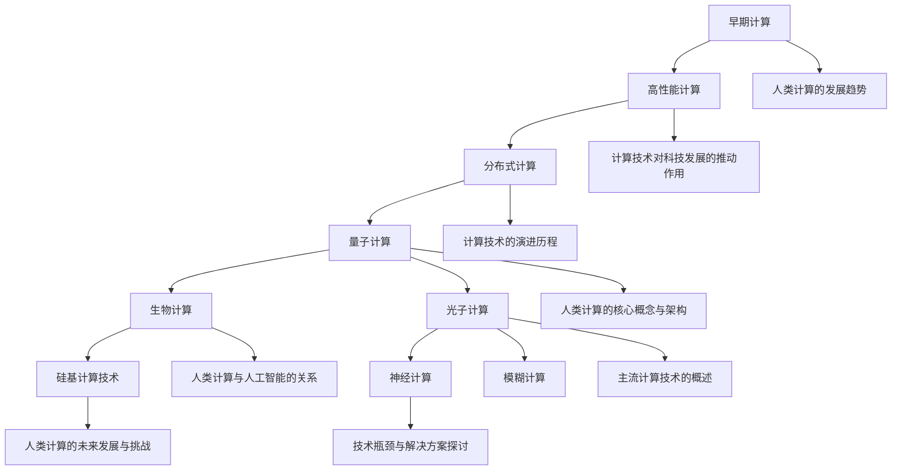

                 

### 推动科技进步的引擎：人类计算的创新力量

> **关键词：** 人类计算、计算创新、科技进步、前沿技术、核心算法、应用实例、未来展望

> **摘要：** 本文旨在探讨人类计算作为推动科技进步的引擎，通过分析计算创新的关键技术、核心算法和实际应用，探讨其在科研、工业和社会服务中的影响，以及未来面临的挑战和发展趋势。

### 推动科技进步的引擎基础

在人类文明的发展历程中，科技一直是推动社会进步的重要力量。而计算作为科技的核心，承载着创新与突破的使命。本文将从基础层面出发，首先探讨计算技术对科技发展的推动作用，回顾计算技术的演进历程，分析人类计算的核心概念与架构，并介绍主流计算技术及其未来发展的趋势和挑战。

#### 第1章：计算创新力量概述

**1.1 科技进步与计算的关系**

计算技术的不断进步是科技进步的重要驱动力。从计算机的诞生到现代高性能计算，计算技术经历了翻天覆地的变化，极大地改变了人类的生产和生活方式。

**1.1.1 计算技术对科技发展的推动作用**

- **科学研究：** 高性能计算为科学研究提供了强大的计算能力，加速了天文学、物理学、生物学等领域的进展。
- **工业制造：** 计算技术在工业设计、仿真和优化中发挥了重要作用，提升了生产效率和产品质量。
- **信息处理：** 大数据技术的兴起，使得海量数据处理成为可能，为决策支持和智能分析提供了有力支撑。
- **人工智能：** 人工智能算法依赖于高性能计算，推动了机器学习、深度学习等技术的快速发展。

**1.1.2 计算技术的演进历程**

- **早期计算：** 从计算机的发明到个人电脑的普及，计算技术经历了从大型主机到小型化、便携化的转变。
- **高性能计算：** 高性能计算机的出现，使得计算能力达到了新的高度，成为科学研究和工业制造的重要工具。
- **分布式计算：** 随着互联网的普及，分布式计算成为计算技术的重要发展方向，实现了计算资源的共享和协同。

**1.1.3 人类计算的创新趋势**

- **量子计算：** 量子计算的崛起，预示着计算能力的又一次革命性提升。
- **生物计算：** 生物计算利用生物分子和生物系统进行计算，为复杂问题的求解提供了新的思路。
- **光子计算：** 光子计算利用光子的特性进行信息处理，有望突破电子计算的局限。

**1.2 人类计算的核心概念与架构**

**1.2.1 人类计算的定义与特征**

人类计算是指通过模拟人类思维方式，实现信息处理和问题求解的技术。其特征包括：

- **并行性：** 能够同时处理多个任务，提高了计算效率。
- **自适应能力：** 能够根据环境变化调整计算策略，适应不同问题场景。
- **灵活性：** 能够处理结构化、半结构化和非结构化数据。

**1.2.2 人类计算的技术框架**

人类计算的技术框架包括以下几个方面：

- **硬件：** 包括量子计算机、生物计算机、光子计算机等新型计算硬件。
- **软件：** 包括编程语言、算法库和开发工具等软件基础设施。
- **数据：** 包括大规模数据集、知识库和模型等数据资源。

**1.2.3 人类计算与人工智能的关系**

人工智能作为人类计算的重要组成部分，其发展依赖于计算能力的提升。人类计算为人工智能提供了强大的计算支持，使得复杂问题求解成为可能。

**1.3 主流计算技术的概述**

**1.3.1 硅基计算技术**

硅基计算技术是目前最主流的计算技术，基于硅半导体材料制造电子元件。其优点包括：

- **高性能：** 能够实现高速信息处理。
- **低功耗：** 适用于便携式设备和数据中心。

**1.3.2 生物计算技术**

生物计算技术利用生物分子和生物系统进行计算，具有以下特点：

- **生物兼容性：** 能够与生物体系兼容，实现生物计算与生物系统的深度融合。
- **高效能：** 能够在特定领域实现高效计算。

**1.3.3 光子计算技术**

光子计算技术利用光子的特性进行信息处理，具有以下优势：

- **高速传输：** 光子的传输速度远超电子。
- **低功耗：** 光子计算能够实现低功耗计算。

**1.3.4 其他前沿计算技术**

除上述技术外，还有量子计算、神经计算、模糊计算等前沿计算技术，它们在特定领域具有广泛的应用前景。

**1.4 人类计算的未来发展与挑战**

**1.4.1 人类计算的未来发展方向**

人类计算的未来发展方向包括：

- **硬件创新：** 发展新型计算硬件，提高计算性能。
- **算法优化：** 提升算法效率，降低计算复杂度。
- **应用拓展：** 深入应用领域，推动科技发展。

**1.4.2 人类计算面临的挑战**

人类计算面临的挑战包括：

- **技术瓶颈：** 硅基计算技术的性能逼近物理极限，需要发展新型计算技术。
- **数据安全：** 随着数据规模的扩大，数据安全成为重要问题。
- **能耗问题：** 高性能计算对能源消耗提出了高要求。

**1.4.3 技术瓶颈与解决方案探讨**

针对上述挑战，可以从以下几个方面进行解决方案的探讨：

- **硬件创新：** 发展量子计算、光子计算等新型计算技术，突破性能瓶颈。
- **软件优化：** 提高算法效率，降低能耗。
- **生态建设：** 构建完善的计算技术生态，促进技术创新和应用。

通过以上分析，我们可以看出人类计算作为推动科技进步的引擎，具有广阔的发展前景和重要的战略意义。在未来的发展中，我们需要不断探索新型计算技术，优化算法，拓展应用领域，为科技进步和社会发展贡献力量。

#### Mermaid 流程图



#### 人类计算的核心概念与架构

人类计算作为一种模拟人类思维方式进行信息处理的技术，其核心概念和架构涵盖了硬件、软件和数据等多个层面。下面我们将详细探讨人类计算的定义与特征、技术框架及其与人工智能的关系。

**1.2.1 人类计算的定义与特征**

**定义：** 人类计算是指通过模拟人类大脑的思维方式，实现信息获取、处理、存储和传输的技术。它旨在构建一种能够自主学习、推理和决策的计算系统。

**特征：**

- **并行性：** 人类计算能够同时处理多个任务，模拟人脑的并行处理能力，从而提高计算效率。
- **自适应能力：** 人类计算能够根据环境变化和问题需求，调整计算策略和模型，适应不同的计算场景。
- **灵活性：** 人类计算能够处理结构化、半结构化和非结构化数据，具有广泛的适用性。

**1.2.2 人类计算的技术框架**

人类计算的技术框架由硬件、软件和数据三个核心组成部分构成：

**硬件：** 人类计算硬件包括传统计算机、新型计算硬件（如量子计算机、光子计算机等）以及其他专用计算设备。新型计算硬件的发展，为人类计算提供了更高的计算性能和更低的能耗。

**软件：** 人类计算软件包括编程语言、算法库和开发工具等。编程语言提供了人类计算的表达方式，算法库提供了高效的计算方法，开发工具则帮助开发者快速构建和优化计算系统。

**数据：** 人类计算数据包括结构化数据、半结构化数据和非结构化数据。这些数据资源是构建人类计算模型和算法的基础，也是实现人工智能和大数据分析的关键。

**1.2.3 人类计算与人工智能的关系**

人工智能（AI）作为人类计算的一个重要分支，其核心目标是模拟人类智能，实现智能感知、决策和执行。人类计算为人工智能提供了强大的计算支持，使得人工智能算法能够高效地处理复杂问题。

**关系：**

- **计算支持：** 人类计算为人工智能提供了强大的计算能力，使得人工智能算法能够在海量数据中快速学习和推理。
- **技术融合：** 人类计算与人工智能技术的融合，推动了智能计算系统的发展，使得计算机系统具备了更高的智能水平。
- **应用拓展：** 人工智能技术广泛应用于图像识别、自然语言处理、智能决策等领域，这些应用场景又进一步推动了人类计算技术的发展。

**1.2.4 人类计算的应用领域**

人类计算在多个领域展现出了强大的应用潜力：

- **科学研究：** 人类计算能够加速科学研究的进程，如高性能计算在物理学、化学和生物学的应用，量子计算在量子力学和量子信息学中的应用等。
- **工业制造：** 人类计算在工业设计、仿真和优化中发挥了重要作用，如计算机辅助设计（CAD）、计算机辅助工程（CAE）和智能制造等。
- **信息处理：** 大数据和人工智能技术的发展，使得人类计算在信息处理领域得到了广泛应用，如搜索引擎、推荐系统和智能客服等。
- **人工智能：** 人类计算是人工智能算法的实现基础，如深度学习、强化学习和自然语言处理等。

通过以上分析，我们可以看到人类计算作为一种创新力量，在科技发展中扮演着重要角色。其核心概念与架构为计算创新提供了坚实的基础，也为人工智能和其他领域的发展注入了强大动力。在未来的发展中，人类计算将继续推动科技进步，创造更加智能和高效的社会。

#### 核心算法原理讲解

为了更好地理解人类计算的核心算法，我们首先需要了解量子计算、人工智能、大数据和云计算等核心技术的基本原理。以下是这些核心算法的详细讲解，包括其基本概念、优势和局限，以及伪代码示例。

**2.1 量子计算算法原理**

**2.1.1 量子计算的基本概念**

量子计算是一种利用量子力学原理进行信息处理的技术。量子计算机的基本单元是量子比特（qubit），与经典比特不同，量子比特可以同时处于多种状态的叠加。

**量子比特状态：**
$$
|\psi\rangle = a|0\rangle + b|1\rangle
$$
其中，$|0\rangle$ 和 $|1\rangle$ 分别表示量子比特的基态，$a$ 和 $b$ 是复数概率幅。

**量子门：** 类似于经典计算机中的逻辑门，量子门是作用于量子比特的线性变换。基本的量子门包括 Hadamard 门（H）、Pauli-X 门（X）、Pauli-Z 门（Z）和相位旋转门（R_z）。

**量子电路：** 量子计算的过程通过一系列量子门的作用实现，这些量子门按照特定的顺序连接，构成了量子电路。

**2.1.2 量子计算的优势与局限**

**优势：**

- **并行计算：** 量子计算机能够同时处理多个运算，极大地提高了计算效率。
- **高效算法：** 量子计算机在特定问题上（如整数分解、量子搜索）展现出显著的优势。

**局限：**

- **量子退相干：** 量子系统容易受到外界干扰，导致量子状态退相干。
- **量子错误修正：** 量子计算中的错误修正是一个技术难题。

**2.1.3 量子计算算法简介**

量子计算算法主要包括量子算法和量子机器学习算法。以下是一个简单的量子算法示例——量子搜索算法。

**量子搜索算法伪代码：**
```
算法 QuantumSearch(A, |x\rangle, |y\rangle)
输入：量子数据集 A，初始态 |x\rangle，目标态 |y\rangle
输出：搜索结果

1. 初始化量子电路 C，将 A 映射到 C 的输入端
2. 对 C 施加上下文编码，使得 C 能够识别目标态 |y\rangle
3. 运行量子电路 C，测量输出状态
4. 如果测量结果为 |y\rangle，返回 True；否则返回 False
```

**2.2 人工智能算法原理**

**2.2.1 人工智能的基本概念**

人工智能（AI）是一种模拟人类智能的技术，旨在构建能够自主学习、推理和决策的计算机系统。人工智能可以分为两大类：基于规则的系统和基于数据的学习系统。

**基于规则的系统：** 通过定义一系列规则和逻辑关系，实现智能行为。

**基于数据的学习系统：** 通过从数据中学习，自动发现规律和模式，实现智能行为。

**2.2.2 机器学习算法分类**

机器学习算法可以分为监督学习、无监督学习和强化学习。

- **监督学习：** 利用标记数据进行训练，学习输入与输出之间的关系。
- **无监督学习：** 不需要标记数据，通过发现数据中的模式或结构进行学习。
- **强化学习：** 通过与环境互动，学习最优策略。

**2.2.3 深度学习算法原理**

深度学习是一种基于多层神经网络的学习方法，其核心是多层感知机（MLP）。深度学习算法通过逐层提取特征，实现从低级到高级的抽象。

**深度学习算法伪代码：**
```
算法 NeuralNetwork(X, Y)
输入：训练数据集 X，标签数据集 Y
输出：训练好的神经网络模型

1. 初始化神经网络参数
2. 对数据进行预处理
3. 遍历训练数据集 X：
   a. 计算前向传播，得到输出 Y'
   b. 计算损失函数 L = ||Y - Y'||^2
   c. 计算梯度 ΔW = ∇L(W)
   d. 更新参数 W = W - learning_rate * ΔW
4. 返回训练好的神经网络模型
```

**2.3 大数据算法原理**

**2.3.1 大数据的基本概念**

大数据是指无法使用传统数据处理工具进行有效处理的数据集，通常具有海量（Volume）、多样（Variety）、快速（Velocity）和价值高（Value）等特征。

**2.3.2 数据挖掘算法分类**

数据挖掘算法可以分为以下几类：

- **关联规则挖掘：** 发现数据之间的关联关系。
- **聚类分析：** 将相似的数据分组。
- **分类：** 将数据分为预定义的类别。
- **异常检测：** 识别数据中的异常或离群点。

**2.3.3 数据分析算法原理**

数据分析算法主要包括统计分析和机器学习分析。统计分析利用概率论和数理统计的方法，对数据进行描述、推断和预测。机器学习分析通过构建模型，自动发现数据中的规律和模式。

**数据分析算法伪代码：**
```
算法 DataAnalysis(X)
输入：数据集 X
输出：分析结果

1. 对数据进行预处理，包括数据清洗、归一化和降维
2. 选择合适的统计方法或机器学习算法
3. 计算统计量或模型参数
4. 进行假设检验和预测
5. 返回分析结果
```

**2.4 云计算算法原理**

**2.4.1 云计算的基本概念**

云计算是一种通过互联网提供计算资源的服务模式，包括基础设施即服务（IaaS）、平台即服务（PaaS）和软件即服务（SaaS）。

**2.4.2 云计算的服务模式**

- **IaaS：** 提供虚拟化计算资源，如虚拟机、存储和网络。
- **PaaS：** 提供开发平台，包括开发工具、数据库和中间件。
- **SaaS：** 提供软件服务，用户可以通过互联网访问软件。

**2.4.3 云计算算法与优化技术**

云计算算法包括资源调度、负载均衡和存储优化等。优化技术旨在提高云计算系统的性能和资源利用率。

**云计算算法伪代码：**
```
算法 CloudOptimization(ResourceList, JobList)
输入：资源列表 ResourceList，作业列表 JobList
输出：优化后的资源分配方案

1. 对作业进行预处理，包括优先级排序和负载估算
2. 初始化资源分配方案，为每个作业分配资源
3. 遍历作业列表 JobList：
   a. 如果作业无法在当前资源上运行，重新分配资源
   b. 如果作业完成，释放占用的资源
4. 返回优化后的资源分配方案
```

**2.5 生物计算算法原理**

**2.5.1 生物计算的基本概念**

生物计算是一种利用生物分子和生物系统进行信息处理的技术。生物计算的基本单元包括DNA、RNA和蛋白质等生物分子。

**2.5.2 生物计算的应用领域**

生物计算广泛应用于基因组学、药物发现和生物信息学等领域。

**2.5.3 生物计算算法原理**

生物计算算法主要包括序列比对、基因表达分析和蛋白质结构预测等。以下是一个简单的序列比对算法示例。

**序列比对算法伪代码：**
```
算法 SequenceAlignment(DNA1, DNA2)
输入：DNA序列 DNA1 和 DNA2
输出：最优比对结果

1. 初始化比对矩阵，设置初始得分
2. 遍历 DNA1 和 DNA2：
   a. 计算当前位置的得分
   b. 更新比对矩阵
3. 查找最优比对路径，计算总得分
4. 返回最优比对结果
```

通过以上对量子计算、人工智能、大数据、云计算和生物计算等核心算法的详细讲解，我们可以看到这些算法在信息处理和问题求解方面具有巨大的潜力。这些核心算法不仅推动了计算技术的发展，也为各个领域提供了强大的工具和解决方案。

#### 计算创新在科研与工业中的应用

计算创新在科研和工业领域发挥着至关重要的作用，为解决复杂问题提供了强有力的工具和方法。以下将详细讨论计算创新在这些领域的应用情况，挑战以及未来的发展趋势。

**3.1 计算创新在科研中的应用**

**3.1.1 科研领域中的计算挑战**

科研领域面临着日益复杂的计算挑战，包括：

- **大规模数据处理：** 科研过程中产生的数据量巨大，如何高效地处理和分析这些数据成为一大难题。
- **计算密集型任务：** 如量子模拟、分子动力学模拟等，需要高性能计算资源。
- **跨学科合作：** 需要不同学科之间的计算模型和方法相互融合。

**3.1.2 计算创新在科研中的应用案例**

- **天文学：** 利用高性能计算模拟宇宙演化，帮助科学家理解星系的形成和暗物质的分布。
- **生物学：** 利用生物计算技术进行基因组测序和基因编辑，推动个性化医疗的发展。
- **物理学：** 利用量子计算进行复杂物理问题的模拟，如高温超导和量子材料研究。

**3.1.3 科研计算的创新趋势**

- **量子计算应用：** 随着量子计算机的不断发展，其在科研中的应用前景广阔，有望解决传统计算机难以处理的问题。
- **大数据分析：** 大数据分析技术在科研中的广泛应用，使得科学家能够从海量数据中提取有价值的信息。
- **云计算与边缘计算：** 通过云计算和边缘计算的结合，实现计算资源的灵活调配和高效利用。

**3.2 计算创新在工业中的应用**

**3.2.1 工业领域中的计算挑战**

工业领域中的计算挑战主要包括：

- **复杂系统建模与仿真：** 需要对复杂工业系统进行准确建模和仿真，以优化设计和生产过程。
- **实时数据处理：** 在工业物联网（IIoT）环境中，需要实时处理大量来自传感器的数据。
- **资源优化：** 需要优化生产资源的分配，提高生产效率和降低成本。

**3.2.2 计算创新在工业中的应用案例**

- **制造业：** 利用计算机辅助设计（CAD）和计算机辅助工程（CAE）技术，优化产品设计，提高产品质量。
- **能源行业：** 利用人工智能和大数据分析技术，优化能源生产和消费，提高能源利用效率。
- **交通运输：** 利用自动驾驶和智能交通系统，提升交通流量管理和安全性能。

**3.2.3 工业计算的创新趋势**

- **边缘计算：** 边缘计算将计算、存储和网络功能分布在靠近数据源的位置，提高了数据处理的速度和效率。
- **智能制造：** 通过物联网、人工智能和大数据技术，推动智能制造的发展，实现生产过程的智能化和自动化。
- **可持续计算：** 随着环保意识的提高，计算技术正向绿色、可持续的方向发展，以降低能源消耗和环境影响。

**3.3 计算创新在社会服务中的应用**

**3.3.1 社会服务领域中的计算挑战**

社会服务领域中的计算挑战主要包括：

- **大数据处理：** 社会服务数据量大且多样化，如何有效处理和分析这些数据成为一大难题。
- **智能决策支持：** 需要利用计算技术为政府和社会提供智能决策支持。
- **社会问题分析：** 需要运用计算技术对社会问题进行分析，提供解决方案。

**3.3.2 计算创新在社会服务中的应用案例**

- **公共卫生：** 利用大数据和人工智能技术，实时监控疫情，提供疫情防控策略。
- **社会治理：** 利用物联网和大数据分析技术，提升社会治理效率和水平。
- **教育服务：** 利用在线教育平台和人工智能技术，提供个性化学习体验。

**3.3.3 社会计算的创新趋势**

- **智能城市：** 通过计算技术实现城市管理的智能化，提高城市运行效率和居民生活质量。
- **智慧医疗：** 利用人工智能和大数据技术，提升医疗服务水平，实现精准医疗。
- **社会问题分析：** 通过社会计算技术，对社会问题进行深入分析，提供决策支持。

综上所述，计算创新在科研、工业和社会服务领域都有着广泛的应用。面对不断变化的计算挑战，计算创新将继续推动这些领域的发展，为科技进步和社会进步贡献力量。在未来，计算创新将朝着更加智能化、绿色化和可持续化的方向发展，带来更多的机遇和挑战。

#### 计算创新的未来展望

随着科技的快速发展，计算创新将继续推动人类进步，为各行各业带来变革性的影响。在未来的发展中，计算创新将面临诸多趋势和挑战，需要我们从技术、伦理和社会等多个角度进行深入探讨。

**4.1 计算创新的未来发展趋势**

**4.1.1 前沿计算技术的演进**

计算技术的演进是未来发展的关键。以下是一些前沿计算技术及其发展趋势：

- **量子计算：** 量子计算在解决复杂问题上具有巨大潜力。未来，量子计算机的性能将不断提升，量子算法的应用范围将逐渐扩大，特别是在 cryptography、化学和物理学等领域。
  
- **光子计算：** 光子计算利用光子的特性进行信息处理，具有高速、低功耗的特点。随着光子器件技术的发展，光子计算有望在通信、数据处理等领域发挥重要作用。

- **生物计算：** 生物计算利用生物分子和生物系统的特性进行计算。未来，生物计算将在药物发现、基因组学等领域发挥关键作用，实现更高效的计算。

- **边缘计算：** 边缘计算将计算、存储和网络功能分布在靠近数据源的位置，提高了数据处理的速度和效率。随着物联网（IoT）和 5G 技术的发展，边缘计算将在智能制造、智能交通等领域得到广泛应用。

**4.1.2 人工智能与计算融合的趋势**

人工智能（AI）与计算技术的融合将推动智能计算系统的发展。以下是一些发展趋势：

- **混合智能系统：** 结合人工智能和计算技术的优势，构建具有自主学习和自适应能力的混合智能系统。这些系统将在智能交通、智能家居、智能医疗等领域发挥重要作用。

- **AI 赋能计算：** 利用人工智能技术优化计算资源分配、提高计算效率。例如，通过机器学习算法优化网络路由、提高云计算平台的资源利用率。

- **AI 安全：** 随着人工智能在计算中的应用，AI 安全问题日益突出。未来，需要发展 AI 防护技术，保障人工智能系统的安全性和可靠性。

**4.1.3 大数据与计算优化的融合**

大数据与计算优化的融合将提高数据处理和分析的效率。以下是一些发展趋势：

- **高效数据分析：** 发展高效的数据分析算法，提高大数据处理的性能。例如，分布式计算、图计算等技术在数据处理中的应用。

- **智能数据分析：** 利用人工智能技术进行数据分析，发现数据中的隐藏模式和规律。例如，利用深度学习算法进行图像识别、自然语言处理等。

- **数据隐私保护：** 随着大数据应用的普及，数据隐私保护问题愈发重要。未来，需要发展数据隐私保护技术，保障用户数据的安全。

**4.1.4 云计算与边缘计算的融合**

云计算与边缘计算的融合将实现计算资源的灵活调配和高效利用。以下是一些发展趋势：

- **边缘计算服务化：** 发展边缘计算服务化架构，实现云计算与边缘计算的无缝集成。用户可以根据需求，灵活地使用云计算和边缘计算资源。

- **分布式存储与计算：** 利用边缘计算实现分布式存储和计算，提高数据处理的效率和可靠性。

- **智能边缘：** 发展智能边缘技术，实现边缘设备的智能化。智能边缘设备将具备数据分析和决策能力，提高系统的自主性和智能化水平。

**4.2 计算创新的未来挑战**

**4.2.1 技术瓶颈与突破方向**

尽管计算技术取得了显著进展，但仍面临一些技术瓶颈。以下是一些突破方向：

- **量子计算：** 解决量子退相干问题，提高量子计算机的稳定性和可靠性。

- **生物计算：** 发展高效的生物计算算法，提高生物计算的效率和精度。

- **光子计算：** 解决光子器件的材料和制造问题，提高光子计算的性能和成本效益。

- **边缘计算：** 发展边缘设备的计算能力和网络带宽，实现边缘计算与云计算的协同优化。

**4.2.2 安全与隐私问题**

随着计算技术的广泛应用，安全与隐私问题日益突出。以下是一些应对措施：

- **加密技术：** 发展高级加密技术，保障数据在传输和存储过程中的安全性。

- **隐私保护算法：** 发展隐私保护算法，保障用户数据的隐私。

- **安全审计与监管：** 加强网络安全审计和监管，确保计算系统的安全性和合规性。

**4.2.3 伦理与法律问题**

计算创新在带来便利和效益的同时，也引发了一系列伦理和法律问题。以下是一些应对措施：

- **伦理规范：** 制定计算伦理规范，明确计算技术的应用边界和责任。

- **法律法规：** 加强法律法规建设，保障计算技术的合规应用。

- **国际合作：** 促进国际间计算技术的合作与交流，共同应对伦理和法律问题。

**4.2.4 社会适应性问题**

计算创新对社会产生了深远的影响，需要社会各界的适应和调整。以下是一些应对措施：

- **教育培训：** 加强计算技术教育，提高社会对计算技术的认知和理解。

- **政策支持：** 制定相关政策，鼓励计算技术的研发和应用。

- **公众参与：** 加强公众参与，促进计算技术的社会化应用。

综上所述，计算创新的未来发展趋势广阔，但同时也面临诸多挑战。通过技术创新、政策支持和社会适应，计算创新将继续推动科技进步和社会发展，为人类创造更美好的未来。

#### 附录 A: 计算创新相关工具与资源

计算创新作为推动科技进步的重要引擎，需要借助各种工具和资源来支持研究和开发。以下将介绍计算创新相关的工具与资源，包括量子计算开发工具、人工智能开发工具、大数据开发工具、云计算开发工具和生物计算开发工具，并提供一些学术期刊、研究机构、开源项目和教育培训资源，以帮助读者深入了解和利用计算创新技术。

**A.1 计算创新工具概述**

**量子计算开发工具：**

- **Qiskit：** IBM 开发的一个开源量子计算软件框架，提供量子电路设计、模拟和量子算法实现等功能。
- **Project Q：** Google 开发的一个量子计算框架，支持量子算法的开发和测试。
- **IonQ：** IonQ 提供的量子计算云平台，允许用户运行量子算法和模拟实验。

**人工智能开发工具：**

- **TensorFlow：** Google 开发的一个开源机器学习库，广泛用于构建和训练深度学习模型。
- **PyTorch：** Facebook AI 研究团队开发的一个开源机器学习库，以其灵活性和动态计算图而受到欢迎。
- **Keras：** 一个高层次的神经网络API，能够运行在TensorFlow和Theano上，简化深度学习模型的构建。

**大数据开发工具：**

- **Apache Hadoop：** 一个开源的大数据框架，用于存储和处理大规模数据集。
- **Apache Spark：** 一个开源的大数据分析引擎，提供快速和通用的大数据处理能力。
- **Flink：** 一个开源流处理框架，能够高效地处理大规模数据流。

**云计算开发工具：**

- **AWS：** Amazon Web Services 提供的云计算平台，提供广泛的计算、存储和网络服务。
- **Azure：** Microsoft 提供的云计算平台，提供多种云服务和开发工具。
- **Google Cloud：** Google 提供的云计算平台，支持多种开发工具和框架。

**生物计算开发工具：**

- **GROMACS：** 一个开源的分子动力学模拟软件，用于生物分子的模拟和分析。
- **Rosetta：** 一个开源的生物分子建模和模拟工具，广泛应用于蛋白质结构和药物设计。
- **CellBlender：** 一个开源的生物细胞模拟软件，用于研究细胞行为和生物系统。

**A.2 计算创新资源推荐**

**学术期刊与会议：**

- **《Nature》杂志：** 顶级科学期刊，涵盖计算创新相关领域的最新研究进展。
- **《Science》杂志：** 另一顶级科学期刊，发表计算创新的突破性研究成果。
- **ACM Conference on Bioinformatics, Computational Biology and Health Informatics (BCB)：** 计算生物学的国际会议，汇集计算生物学的最新研究。
- **IEEE International Conference on Big Data (Big Data)：** 大数据的国际会议，讨论大数据处理的最新技术和应用。

**研究机构与实验室：**

- **量子计算研究所：** 全球领先的量子计算研究机构，如 Google Quantum AI 实验室、IBM Quantum。
- **人工智能研究中心：** 全球知名的人工智能研究机构，如斯坦福大学人工智能实验室、DeepMind。
- **大数据研究中心：** 涵盖大数据处理和分析的顶尖研究机构，如微软研究院、加州大学伯克利分校AMPLab。
- **生物计算研究所：** 专注于生物计算技术的研究机构，如华盛顿大学生物计算研究所、马克斯·普朗克计算生物学研究所。

**开源项目与代码库：**

- **GitHub：** 最大的开源代码托管平台，提供大量的计算创新相关项目和代码库。
- **Apache 软件基金会：** 维护多个开源项目，包括 Hadoop、Spark、Flink 等。
- **TensorFlow Model Garden：** 提供大量的 TensorFlow 模型和应用案例。
- **Kaggle：** 数据科学家和机器学习爱好者的社区平台，提供大量的大数据集和竞赛项目。

**教育培训与课程资源：**

- **在线课程平台：** 如 Coursera、edX、Udacity，提供大量的计算创新相关课程。
- **技术博客与论坛：** 如 Medium、Stack Overflow、Reddit，分享计算创新的最新技术和实践经验。
- **学术论文与报告：** 通过学术期刊、会议论文和报告，了解计算创新的最新研究成果和进展。

通过这些工具和资源的推荐，读者可以更好地了解和利用计算创新技术，推动自己的研究和开发工作。同时，积极参与开源项目和技术社区，将有助于学习和交流计算创新的最新动态和最佳实践。

