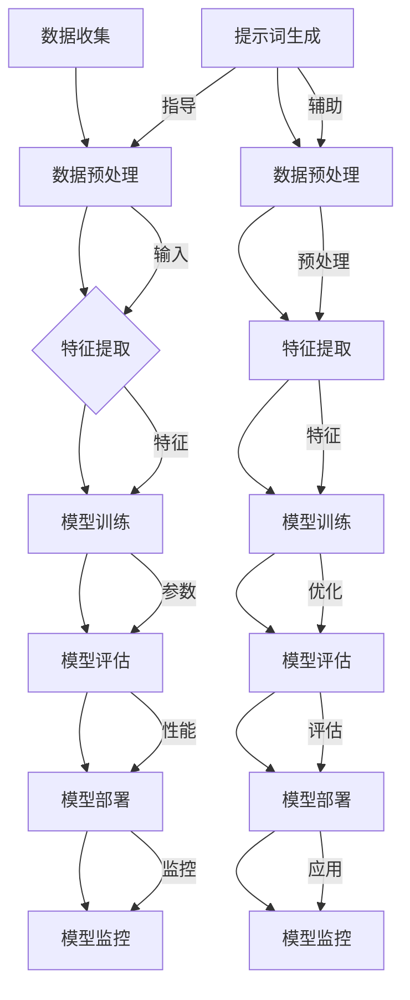

                 

### 文章标题

《提示词工程在机器学习管道中的应用》

### 关键词

提示词工程、机器学习管道、模型训练、模型推理、模型优化

### 摘要

随着人工智能技术的迅猛发展，机器学习在各个领域得到了广泛应用。提示词工程作为机器学习的重要组成部分，直接影响着模型的训练和推理效果。本文将深入探讨提示词工程在机器学习管道中的应用，从基础概念、核心算法到实际项目实战，全面解析提示词工程在提升模型性能和效率方面的关键作用。

----------------------------------------------------------------

### 《提示词工程在机器学习管道中的应用》目录大纲

#### 第一部分：背景与基础

- **第1章：提示词工程概述**
  - **1.1 提示词工程的重要性**
    - **1.1.1 提示词的定义与作用**
    - **1.1.2 提示词工程的价值**
  - **1.2 机器学习管道概述**
    - **1.2.1 机器学习管道的基本构成**
    - **1.2.2 机器学习管道的工作流程**
  - **1.3 提示词工程在机器学习管道中的应用**
    - **1.3.1 提示词在模型训练中的作用**
    - **1.3.2 提示词在模型推理中的作用**

#### 第二部分：核心概念与联系

- **第2章：提示词工程的核心概念**
  - **2.1 提示词的类型**
    - **2.1.1 基本提示词**
    - **2.1.2 高级提示词**
  - **2.2 提示词工程的关键技术**
    - **2.2.1 数据预处理技术**
    - **2.2.2 提示词生成技术**
    - **2.2.3 提示词优化技术**
  - **2.3 提示词工程与机器学习模型的联系**
    - **2.3.1 提示词对模型性能的影响**
    - **2.3.2 提示词与模型参数的关系**

#### 第三部分：核心算法原理讲解

- **第3章：机器学习算法与提示词工程**
  - **3.1 提示词在监督学习中的应用**
    - **3.1.1 线性回归中的提示词**
    - **3.1.2 决策树中的提示词**
    - **3.1.3 支持向量机中的提示词**
  - **3.2 提示词在无监督学习中的应用**
    - **3.2.1 K-均值聚类中的提示词**
    - **3.2.2 主成分分析中的提示词**
    - **3.2.3 自编码器中的提示词**
  - **3.3 提示词在深度学习中的应用**
    - **3.3.1 卷积神经网络中的提示词**
    - **3.3.2 循环神经网络中的提示词**
    - **3.3.3 生成对抗网络中的提示词**

#### 第四部分：数学模型与数学公式讲解

- **第4章：数学基础与提示词工程**
  - **4.1 概率论基础**
    - **4.1.1 概率分布函数**
    - **4.1.2 条件概率与贝叶斯公式**
    - **4.1.3 最大似然估计**
  - **4.2 统计学习理论**
    - **4.2.1 假设检验**
    - **4.2.2 错误率与偏差**
    - **4.2.3 过拟合与欠拟合**
  - **4.3 提示词工程中的数学公式**
    - **4.3.1 提示词的优化目标函数**
    - **4.3.2 提示词的更新策略**
    - **4.3.3 提示词的置信度计算**

#### 第五部分：项目实战

- **第5章：提示词工程实践案例**
  - **5.1 项目背景与目标**
    - **5.1.1 项目背景**
    - **5.1.2 项目目标**
  - **5.2 项目环境搭建**
    - **5.2.1 开发工具与环境配置**
    - **5.2.2 数据集获取与处理**
  - **5.3 提示词工程实战**
    - **5.3.1 提示词生成**
    - **5.3.2 提示词优化**
    - **5.3.3 提示词应用与效果评估**
  - **5.4 源代码解读与分析**
    - **5.4.1 源代码结构**
    - **5.4.2 关键代码解读**
    - **5.4.3 代码性能分析**

#### 第六部分：总结与展望

- **第6章：总结与展望**
  - **6.1 提示词工程的发展趋势**
    - **6.1.1 提示词工程的未来发展方向**
    - **6.1.2 提示词工程面临的挑战与机遇**
  - **6.2 提示词工程的应用领域拓展**
    - **6.2.1 提示词工程在自然语言处理中的应用**
    - **6.2.2 提示词工程在计算机视觉中的应用**
    - **6.2.3 提示词工程在推荐系统中的应用**
  - **6.3 提示词工程在人工智能时代的重要性**
    - **6.3.1 提示词工程对人工智能发展的推动作用**
    - **6.3.2 提示词工程在商业应用中的价值**

#### 附录

- **附录A：提示词工程常用工具与资源**
  - **A.1 开源工具与框架**
  - **A.2 数据集与开源代码**
  - **A.3 学术论文与文献资料**

- **附录B：常见问题与解答**
  - **B.1 提示词生成常见问题**
  - **B.2 提示词优化常见问题**
  - **B.3 提示词应用常见问题**

----------------------------------------------------------------

### 第一部分：背景与基础

#### 第1章：提示词工程概述

### 1.1 提示词工程的重要性

#### 1.1.1 提示词的定义与作用

提示词（Prompt）在机器学习中扮演着至关重要的角色。它是一种用于指导模型学习的数据或信息，可以用来引导模型在训练过程中关注特定特征或概念。在自然语言处理（NLP）领域，提示词通常是预定义的文本序列，用于引导模型生成目标文本或进行特定任务。例如，在问答系统中，提示词可以是问题文本，帮助模型理解并生成相关答案。

提示词工程则是关注于如何设计、生成和优化提示词的一系列技术。它的核心目的是提高模型的学习效果和泛化能力。通过精心设计的提示词，模型能够更好地捕捉数据中的关键信息，从而提升模型的性能。

在机器学习中，提示词主要有以下几种作用：

1. **指导模型学习**：提示词可以为模型提供额外的信息，帮助模型更好地理解数据。特别是在数据不足或数据分布不均的情况下，提示词可以引导模型关注重要特征，避免模型陷入过拟合。

2. **提高泛化能力**：通过使用多样化的提示词，模型可以学习到更加通用的知识，从而在新的、未见过的数据上表现更好。

3. **增强任务性能**：针对特定任务，设计合适的提示词可以显著提高模型在任务中的表现。例如，在文本分类任务中，通过提示词明确分类标准，可以提高分类准确率。

#### 1.1.2 提示词工程的价值

提示词工程在机器学习管道中具有重要的价值，主要体现在以下几个方面：

1. **提高模型性能**：通过优化提示词，可以提高模型在训练和推理过程中的表现。优化的提示词能够帮助模型更好地捕捉数据中的关键信息，从而提高模型的学习效率和准确性。

2. **加速模型训练**：在某些情况下，提示词可以用来加速模型训练过程。通过设计合适的提示词，模型可以在较短的时间内达到更好的性能，从而加快模型迭代和优化的速度。

3. **降低过拟合风险**：提示词工程可以帮助模型避免过拟合。通过提供额外的信息，模型可以更好地理解数据，避免在学习过程中过度依赖于特定数据点。

4. **提升模型泛化能力**：通过使用多样化的提示词，模型可以学习到更加通用的知识，从而提高模型在未见数据上的表现。

5. **增强模型可解释性**：提示词工程可以提高模型的可解释性。通过分析提示词的设计和使用，可以更好地理解模型是如何做出预测的，从而增强模型的可信度和可靠性。

总之，提示词工程是提升机器学习模型性能和效率的关键因素。通过深入了解提示词的定义、作用和价值，可以为后续的机器学习项目提供重要的指导和支持。

#### 1.2 机器学习管道概述

##### 1.2.1 机器学习管道的基本构成

机器学习管道（Machine Learning Pipeline）是指将数据从收集、清洗、特征提取、模型训练到模型部署的全过程。一个完整的机器学习管道通常包括以下几个基本组成部分：

1. **数据收集（Data Collection）**：数据收集是机器学习管道的第一步，旨在从各种来源获取数据。这些来源可以是公开数据集、企业内部数据库或外部API等。数据收集的质量直接影响后续数据处理和模型训练的效果。

2. **数据预处理（Data Preprocessing）**：数据预处理是对收集到的原始数据进行清洗、格式化、归一化等操作，使其符合模型训练的要求。数据预处理的质量直接影响模型的性能和训练时间。常见的数据预处理技术包括缺失值填充、数据转换、异常值处理等。

3. **特征提取（Feature Extraction）**：特征提取是从预处理后的数据中提取有助于模型学习的特征。特征提取可以增强数据的表达能力，提高模型的学习效果。常见的特征提取方法包括统计特征、文本特征、图像特征等。

4. **模型训练（Model Training）**：模型训练是指使用预处理后的数据对机器学习模型进行训练。训练过程包括初始化模型参数、迭代优化参数、评估模型性能等。训练质量直接影响模型的准确性和泛化能力。

5. **模型评估（Model Evaluation）**：模型评估是指使用验证集或测试集对训练好的模型进行性能评估。常用的评估指标包括准确率、召回率、F1 分数等。模型评估可以帮助我们了解模型的性能和效果，为后续模型优化提供参考。

6. **模型部署（Model Deployment）**：模型部署是指将训练好的模型部署到生产环境中，用于实际任务。模型部署可以是将模型集成到应用程序中，也可以是将模型部署到云端或边缘设备中。模型部署的质量直接影响应用的效率和性能。

7. **模型监控（Model Monitoring）**：模型监控是指对部署后的模型进行实时监控，确保模型在运行过程中保持稳定性和高性能。模型监控可以包括性能监控、错误监控、安全监控等。

##### 1.2.2 机器学习管道的工作流程

机器学习管道的工作流程可以概括为以下几个步骤：

1. **数据收集**：根据任务需求，从各种数据源收集数据。

2. **数据预处理**：对收集到的数据进行分析，识别和处理数据中的缺失值、异常值等。

3. **特征提取**：根据数据的特点和任务需求，选择合适的特征提取方法，提取有助于模型学习的特征。

4. **模型训练**：选择合适的模型，使用预处理后的数据进行训练。

5. **模型评估**：使用验证集或测试集对训练好的模型进行性能评估，确定模型的优劣。

6. **模型部署**：将训练好的模型部署到生产环境中，用于实际任务。

7. **模型监控**：对部署后的模型进行实时监控，确保模型在运行过程中保持稳定性和高性能。

##### 1.2.3 机器学习管道的作用

机器学习管道在机器学习中发挥着至关重要的作用，主要体现在以下几个方面：

1. **确保数据质量**：机器学习管道中的数据预处理和特征提取步骤有助于提高数据质量，为模型训练提供可靠的基础。

2. **提高模型性能**：通过优化数据预处理和特征提取方法，可以显著提高模型的性能和泛化能力。

3. **简化模型训练**：机器学习管道为模型训练提供了一个标准化的流程，简化了模型训练的复杂性。

4. **确保模型可靠**：通过模型评估和监控，可以确保模型在部署后的可靠性和稳定性。

5. **支持模型迭代**：机器学习管道支持模型的迭代和优化，为持续改进模型提供支持。

总之，机器学习管道是机器学习项目成功的关键因素。通过深入了解机器学习管道的基本构成和工作流程，可以为后续的机器学习项目提供重要的指导和支持。

#### 1.3 提示词工程在机器学习管道中的应用

##### 1.3.1 提示词在模型训练中的作用

在模型训练过程中，提示词起着至关重要的作用。通过合理设计和使用提示词，可以显著提高模型的训练效果和性能。以下是提示词在模型训练中的几个关键作用：

1. **指导模型学习**：提示词为模型提供了额外的信息，帮助模型更好地理解训练数据。特别是在数据量较少或数据分布不均的情况下，提示词可以引导模型关注重要特征，避免模型陷入过拟合。

2. **提高泛化能力**：通过使用多样化的提示词，模型可以学习到更加通用的知识，从而提高模型在未见数据上的表现。多样化的提示词有助于模型建立更加稳健的模型结构，增强模型的泛化能力。

3. **增强任务性能**：针对特定任务，设计合适的提示词可以显著提高模型在任务中的表现。例如，在文本分类任务中，通过提示词明确分类标准，可以提高分类准确率。在图像识别任务中，通过提示词强调图像中的重要区域，可以提高识别准确率。

4. **加速训练过程**：在某些情况下，提示词可以用来加速模型训练过程。通过设计合适的提示词，模型可以在较短的时间内达到更好的性能，从而加快模型迭代和优化的速度。

5. **降低过拟合风险**：提示词工程可以帮助模型避免过拟合。通过提供额外的信息，模型可以更好地理解数据，避免在学习过程中过度依赖于特定数据点。

##### 1.3.2 提示词在模型推理中的作用

在模型推理过程中，提示词同样发挥着重要作用。通过合理设计和使用提示词，可以显著提高模型在推理阶段的表现和效率。以下是提示词在模型推理中的几个关键作用：

1. **提高推理速度**：提示词可以用来加速模型推理过程。通过设计高效的提示词，模型可以在较短的时间内生成预测结果，从而提高推理速度和响应效率。

2. **优化推理结果**：提示词可以用来优化模型在推理阶段生成的预测结果。例如，在文本生成任务中，通过提示词可以引导模型生成更加相关和连贯的文本。在图像识别任务中，通过提示词可以强调图像中的重要区域，提高识别准确率。

3. **增强模型可解释性**：提示词可以提高模型的可解释性。通过分析提示词的设计和使用，可以更好地理解模型是如何做出预测的，从而增强模型的可信度和可靠性。

4. **处理不确定性和噪声**：在现实世界中，数据通常存在噪声和不确定性。提示词可以用来处理这些噪声和不确定性，帮助模型生成更加准确和可靠的预测结果。

5. **适应动态变化**：提示词可以帮助模型适应动态变化的环境。通过设计灵活的提示词，模型可以在不同场景下快速调整和适应，从而提高模型在不同场景下的表现。

总之，提示词工程在机器学习管道中具有重要的作用。通过合理设计和使用提示词，可以显著提高模型在训练和推理阶段的表现和效率，从而推动人工智能技术的广泛应用和发展。

---

### 第二部分：核心概念与联系

#### 第2章：提示词工程的核心概念

提示词工程是机器学习领域中的一个重要研究方向，它涉及到如何设计、生成和优化提示词，以提升模型的学习效果和泛化能力。在这一章中，我们将深入探讨提示词工程中的核心概念，包括提示词的类型、关键技术及其与机器学习模型的联系。

#### 2.1 提示词的类型

提示词可以根据其形式和用途分为基本提示词和高级提示词。

##### 2.1.1 基本提示词

基本提示词是最常见的提示词类型，通常用于指导模型在训练过程中关注特定特征或概念。基本提示词可以是简单的关键词或短语，如“日期”、“金额”、“客户名”等。这些提示词可以直接嵌入到训练数据中，帮助模型识别和利用重要信息。

基本提示词的特点如下：

1. **简洁明了**：基本提示词通常简短明了，易于理解和实现。

2. **直观有效**：基本提示词能够直观地引导模型关注重要特征，从而提高模型的学习效果。

3. **适用范围广**：基本提示词适用于多种机器学习任务，如分类、回归、聚类等。

##### 2.1.2 高级提示词

高级提示词相比于基本提示词，更加复杂和多样化。它们可以是基于语义理解的句子或段落，旨在提供更加丰富的信息和上下文，以帮助模型更好地理解数据和任务。高级提示词通常涉及自然语言处理（NLP）技术，如文本生成、语义分析等。

高级提示词的特点如下：

1. **语义丰富**：高级提示词能够提供丰富的语义信息，帮助模型理解数据中的深层含义。

2. **任务导向**：高级提示词可以根据具体任务需求进行定制，以提高模型在特定任务上的性能。

3. **适应性强**：高级提示词能够适应不同的任务和数据集，具有较强的泛化能力。

#### 2.2 提示词工程的关键技术

提示词工程的关键技术包括数据预处理技术、提示词生成技术和提示词优化技术。这些技术共同构成了一个完整的提示词工程体系，以提升模型的学习效果和泛化能力。

##### 2.2.1 数据预处理技术

数据预处理是提示词工程的重要基础。它包括数据清洗、数据转换和数据归一化等步骤，旨在提高数据质量和一致性，为模型训练提供可靠的数据基础。

1. **数据清洗**：数据清洗是指识别和修复数据中的错误、异常和缺失值。常见的数据清洗方法包括删除重复记录、填充缺失值、处理异常值等。

2. **数据转换**：数据转换是指将不同类型的数据转换为适合模型训练的格式。例如，将文本数据转换为词向量，将图像数据转换为特征向量等。

3. **数据归一化**：数据归一化是指将不同特征的范围缩放到相同的尺度，以消除特征间的数量级差异。常见的数据归一化方法包括最小-最大缩放、标准缩放等。

##### 2.2.2 提示词生成技术

提示词生成是提示词工程的核心环节。它涉及到如何设计、生成和优化提示词，以提升模型的学习效果。提示词生成技术主要包括以下几种方法：

1. **规则生成**：规则生成是指根据任务需求和领域知识，手动设计提示词。这种方法适用于任务简单、特征明确的情况。

2. **模板生成**：模板生成是指使用预定义的模板，根据实际数据生成提示词。这种方法可以灵活地适应不同的任务和数据集。

3. **自动生成**：自动生成是指使用机器学习算法，如生成对抗网络（GAN）或变分自编码器（VAE），自动生成提示词。这种方法能够生成多样化、高质量的提示词，适用于复杂的任务和数据集。

##### 2.2.3 提示词优化技术

提示词优化是指通过调整和优化提示词，提高模型的学习效果和泛化能力。提示词优化技术主要包括以下几种方法：

1. **基于反馈的优化**：基于反馈的优化是指通过模型在训练过程中的表现，动态调整提示词。这种方法能够快速适应模型的变化，提高模型的学习效果。

2. **基于搜索的优化**：基于搜索的优化是指使用启发式搜索算法，如遗传算法、模拟退火等，搜索最优的提示词组合。这种方法能够找到高质量的提示词，但计算成本较高。

3. **基于模型的优化**：基于模型的优化是指使用机器学习算法，如强化学习、优化算法等，自动优化提示词。这种方法能够自动调整提示词，提高模型的学习效果，但需要大量的数据支持。

#### 2.3 提示词工程与机器学习模型的联系

提示词工程与机器学习模型紧密相关，它们之间的关系可以总结为以下几点：

1. **模型性能**：提示词工程直接影响模型的性能。通过优化提示词，可以显著提高模型的准确率、召回率等性能指标。

2. **泛化能力**：提示词工程有助于提高模型的泛化能力。多样化的提示词能够帮助模型学习到更加通用的知识，从而在未见数据上表现更好。

3. **可解释性**：提示词工程可以提高模型的可解释性。通过分析提示词的设计和使用，可以更好地理解模型是如何做出预测的，从而增强模型的可信度和可靠性。

4. **学习效率**：提示词工程可以加速模型的学习过程。优化的提示词能够帮助模型更快地收敛到最优解，从而提高学习效率。

总之，提示词工程是机器学习领域中的一个重要研究方向。通过深入理解提示词的类型、关键技术和与机器学习模型的联系，可以为后续的机器学习项目提供重要的指导和支持。

---

### 第三部分：核心算法原理讲解

#### 第3章：机器学习算法与提示词工程

提示词工程在机器学习中的应用非常广泛，不同的机器学习算法在提示词的使用上也有所不同。本章将详细讲解提示词工程在监督学习、无监督学习和深度学习中的应用，包括具体的算法原理和实现。

#### 3.1 提示词在监督学习中的应用

监督学习（Supervised Learning）是一种机器学习方法，它通过已标记的训练数据来训练模型，并利用模型对未见过的数据进行预测。提示词在监督学习中的应用主要体现在以下几个方面：

##### 3.1.1 线性回归中的提示词

线性回归（Linear Regression）是一种简单的监督学习算法，用于预测连续值输出。在线性回归中，提示词可以通过以下方式使用：

1. **特征选择**：通过提示词明确模型应该关注哪些特征。例如，在房价预测任务中，提示词可以是“房间数量”、“面积”、“地理位置”等，帮助模型识别这些关键特征。

2. **数据预处理**：提示词可以帮助模型处理异常值和缺失值。例如，提示词可以是“缺失值处理方法：均值填充”、“异常值处理方法：删除”等。

3. **模型优化**：通过提示词调整模型参数，提高模型性能。例如，提示词可以是“学习率：0.01”、“正则化参数：0.1”等。

以下是线性回归中提示词的伪代码示例：

```python
# 提示词：选择特征
features = ["room_count", "area", "location"]

# 提示词：处理缺失值
data = preprocess_data(data)

# 提示词：设置学习率
learning_rate = 0.01

# 提示词：设置正则化参数
regularization = 0.1

# 训练线性回归模型
model = LinearRegression()
model.fit(data[features], data['price'])

# 提示词：评估模型性能
accuracy = model.score(data[features], data['price'])
print(f"Model accuracy: {accuracy}")
```

##### 3.1.2 决策树中的提示词

决策树（Decision Tree）是一种常用的监督学习算法，它通过一系列的判断来分割数据并做出预测。在决策树中，提示词可以通过以下方式使用：

1. **特征选择**：提示词可以帮助模型选择最优的特征进行分割。例如，提示词可以是“选择特征：增益率”、“选择特征：信息增益”等。

2. **节点分裂**：提示词可以指导模型在哪些节点进行分裂。例如，提示词可以是“节点分裂条件：增益率大于0.2”、“节点分裂条件：信息增益大于0.1”等。

3. **剪枝策略**：提示词可以指导模型如何进行剪枝，以防止过拟合。例如，提示词可以是“剪枝策略：最大深度：3”、“剪枝策略：最小样本数：10”等。

以下是决策树中提示词的伪代码示例：

```python
# 提示词：选择特征
criterion = "gain_ratio"

# 提示词：设置最大深度
max_depth = 3

# 提示词：设置最小样本数
min_samples_split = 10

# 训练决策树模型
model = DecisionTreeClassifier(criterion=criterion, max_depth=max_depth, min_samples_split=min_samples_split)
model.fit(data, labels)

# 提示词：评估模型性能
accuracy = model.score(data, labels)
print(f"Model accuracy: {accuracy}")
```

##### 3.1.3 支持向量机中的提示词

支持向量机（Support Vector Machine，SVM）是一种常用的监督学习算法，它通过找到一个最优的超平面来分割数据。在SVM中，提示词可以通过以下方式使用：

1. **核函数选择**：提示词可以帮助模型选择最适合的核函数。例如，提示词可以是“核函数：线性”、“核函数：多项式”、“核函数：径向基函数”等。

2. **正则化参数**：提示词可以指导模型调整正则化参数，以防止过拟合。例如，提示词可以是“C值：1”、“C值：10”等。

3. **软 margin**：提示词可以指导模型是否使用软 margin。例如，提示词可以是“软 margin：真”、“软 margin：假”等。

以下是SVM中提示词的伪代码示例：

```python
# 提示词：选择核函数
kernel = "linear"

# 提示词：设置C值
C = 1

# 提示词：设置软 margin
probability = True

# 训练SVM模型
model = SVC(kernel=kernel, C=C, probability=probability)
model.fit(data, labels)

# 提示词：评估模型性能
accuracy = model.score(data, labels)
print(f"Model accuracy: {accuracy}")
```

#### 3.2 提示词在无监督学习中的应用

无监督学习（Unsupervised Learning）是一种机器学习方法，它不需要已标记的训练数据，而是通过探索数据内在结构来发现数据规律。提示词在无监督学习中的应用主要体现在以下几个方面：

##### 3.2.1 K-均值聚类中的提示词

K-均值聚类（K-Means Clustering）是一种常用的无监督学习算法，它通过迭代计算均值来聚类数据。在K-均值聚类中，提示词可以通过以下方式使用：

1. **聚类数量**：提示词可以帮助模型确定合适的聚类数量。例如，提示词可以是“聚类数量：3”、“聚类数量：5”等。

2. **初始化方法**：提示词可以指导模型选择初始化方法。例如，提示词可以是“初始化方法：随机初始化”、“初始化方法：K-means++初始化”等。

3. **收敛条件**：提示词可以指导模型设置收敛条件。例如，提示词可以是“收敛条件：迭代次数：100”、“收敛条件：目标函数变化小于0.01”等。

以下是K-均值聚类中提示词的伪代码示例：

```python
# 提示词：设置聚类数量
k = 3

# 提示词：设置初始化方法
init_method = "kmeans++"

# 提示词：设置收敛条件
max_iter = 100
tol = 0.01

# 训练K-均值聚类模型
model = KMeans(n_clusters=k, init=init_method, max_iter=max_iter, tol=tol)
model.fit(data)

# 提示词：评估聚类效果
inertia = model.inertia_
print(f"Inertia: {inertia}")
```

##### 3.2.2 主成分分析中的提示词

主成分分析（Principal Component Analysis，PCA）是一种常用的无监督学习算法，它通过正交变换将高维数据映射到低维空间，以减少数据维度。在PCA中，提示词可以通过以下方式使用：

1. **主成分数量**：提示词可以帮助模型确定保留的主成分数量。例如，提示词可以是“保留主成分数量：2”、“保留主成分数量：3”等。

2. **优化目标**：提示词可以指导模型设置优化目标。例如，提示词可以是“优化目标：最大化方差”、“优化目标：最小化重构误差”等。

3. **算法选择**：提示词可以指导模型选择合适的算法。例如，提示词可以是“算法：随机梯度下降”、“算法：交替最小二乘法”等。

以下是PCA中提示词的伪代码示例：

```python
# 提示词：设置保留主成分数量
n_components = 2

# 提示词：设置优化目标
method = "max_variance"

# 提示词：设置算法
algorithm = "randomized"

# 训练PCA模型
model = PCA(n_components=n_components, method=method, algorithm=algorithm)
model.fit(data)

# 提示词：评估主成分效果
explained_variance = model.explained_variance_ratio_
print(f"Explained variance ratio: {explained_variance}")
```

##### 3.2.3 自编码器中的提示词

自编码器（Autoencoder）是一种无监督学习算法，它通过学习数据的压缩和重建来提取特征。在自编码器中，提示词可以通过以下方式使用：

1. **网络结构**：提示词可以帮助模型确定网络结构。例如，提示词可以是“输入层大小：784”、“隐藏层大小：256”等。

2. **损失函数**：提示词可以指导模型选择合适的损失函数。例如，提示词可以是“损失函数：均方误差”、“损失函数：交叉熵”等。

3. **优化器**：提示词可以指导模型选择合适的优化器。例如，提示词可以是“优化器：随机梯度下降”、“优化器：Adam”等。

以下是自编码器中提示词的伪代码示例：

```python
# 提示词：设置网络结构
input_shape = (28, 28)  # 输入层大小
hidden_size = 256  # 隐藏层大小

# 提示词：设置损失函数
loss_function = "mse"

# 提示词：设置优化器
optimizer = "adam"

# 训练自编码器模型
model = Autoencoder(input_shape=input_shape, hidden_size=hidden_size, loss_function=loss_function, optimizer=optimizer)
model.fit(data, epochs=10)

# 提示词：评估自编码器性能
reconstruction_error = model.reconstruction_error_
print(f"Reconstruction error: {reconstruction_error}")
```

#### 3.3 提示词在深度学习中的应用

深度学习（Deep Learning）是一种基于多隐层神经网络的机器学习方法，它在图像识别、语音识别、自然语言处理等领域取得了显著成果。提示词在深度学习中的应用主要体现在以下几个方面：

##### 3.3.1 卷积神经网络中的提示词

卷积神经网络（Convolutional Neural Network，CNN）是一种常用的深度学习算法，它通过卷积操作和池化操作提取图像特征。在CNN中，提示词可以通过以下方式使用：

1. **卷积核大小**：提示词可以帮助模型确定卷积核的大小。例如，提示词可以是“卷积核大小：3x3”、“卷积核大小：5x5”等。

2. **池化方式**：提示词可以指导模型选择合适的池化方式。例如，提示词可以是“池化方式：最大池化”、“池化方式：平均池化”等。

3. **正则化方法**：提示词可以指导模型选择合适的正则化方法。例如，提示词可以是“正则化方法：Dropout”、“正则化方法：L2正则化”等。

以下是CNN中提示词的伪代码示例：

```python
# 提示词：设置卷积核大小
kernel_size = (3, 3)

# 提示词：设置池化方式
pooling = "max_pooling"

# 提示词：设置正则化方法
dropout_rate = 0.5

# 构建CNN模型
model = Sequential()
model.add(Conv2D(filters=32, kernel_size=kernel_size, activation="relu", input_shape=input_shape))
model.add(MaxPooling2D(pool_size=(2, 2)))
model.add(Dropout(dropout_rate))
# ... 添加更多层
model.add(Flatten())
model.add(Dense(units=10, activation="softmax"))

# 提示词：设置优化器和损失函数
optimizer = "adam"
loss_function = "categorical_crossentropy"

# 训练CNN模型
model.compile(optimizer=optimizer, loss=loss_function, metrics=["accuracy"])
model.fit(data, labels, epochs=10, batch_size=64)
```

##### 3.3.2 循环神经网络中的提示词

循环神经网络（Recurrent Neural Network，RNN）是一种基于循环结构的深度学习算法，它适用于处理序列数据。在RNN中，提示词可以通过以下方式使用：

1. **隐藏层大小**：提示词可以帮助模型确定隐藏层的大小。例如，提示词可以是“隐藏层大小：128”、“隐藏层大小：256”等。

2. **激活函数**：提示词可以指导模型选择合适的激活函数。例如，提示词可以是“激活函数：ReLU”、“激活函数：Tanh”等。

3. **优化器和学习率**：提示词可以指导模型选择合适的优化器和学习率。例如，提示词可以是“优化器：Adam”、“学习率：0.001”等。

以下是RNN中提示词的伪代码示例：

```python
# 提示词：设置隐藏层大小
hidden_size = 128

# 提示词：设置激活函数
activation_function = "relu"

# 提示词：设置优化器和学习率
optimizer = "adam"
learning_rate = 0.001

# 构建RNN模型
model = Sequential()
model.add(LSTM(units=hidden_size, activation=activation_function, return_sequences=True))
model.add(LSTM(units=hidden_size, activation=activation_function))
model.add(Dense(units=output_size, activation="softmax"))

# 提示词：设置损失函数
loss_function = "categorical_crossentropy"

# 训练RNN模型
model.compile(optimizer=optimizer, loss=loss_function, metrics=["accuracy"])
model.fit(data, labels, epochs=10, batch_size=64)
```

##### 3.3.3 生成对抗网络中的提示词

生成对抗网络（Generative Adversarial Network，GAN）是一种基于对抗训练的深度学习算法，它由生成器和判别器两个网络组成。在GAN中，提示词可以通过以下方式使用：

1. **网络结构**：提示词可以帮助模型确定网络结构。例如，提示词可以是“生成器结构：多层感知机”、“判别器结构：卷积神经网络”等。

2. **损失函数**：提示词可以指导模型选择合适的损失函数。例如，提示词可以是“损失函数：Wasserstein距离”、“损失函数：对抗损失”等。

3. **优化器**：提示词可以指导模型选择合适的优化器。例如，提示词可以是“优化器：梯度提升机”、“优化器：Adam”等。

以下是GAN中提示词的伪代码示例：

```python
# 提示词：设置生成器和判别器结构
generator_structure = "Dense"
discriminator_structure = "Conv2D"

# 提示词：设置损失函数
loss_function = "wasserstein_loss"

# 提示词：设置优化器
optimizer = "adam"

# 构建GAN模型
model = Sequential()
model.add(Generator(input_shape=input_shape, structure=generator_structure))
model.add(Discriminator(input_shape=input_shape, structure=discriminator_structure))
model.compile(optimizer=optimizer, loss=loss_function)

# 训练GAN模型
model.fit_generator(generator=generator, discriminator=discriminator, epochs=10, steps_per_epoch=100)
```

总之，提示词工程在机器学习算法中的应用非常广泛。通过合理设计和使用提示词，可以显著提高模型的学习效果和泛化能力。在本章中，我们详细介绍了提示词工程在监督学习、无监督学习和深度学习中的应用，包括具体的算法原理和实现。这些内容为后续的机器学习项目提供了重要的指导和支持。

---

### 第四部分：数学模型与数学公式讲解

#### 第4章：数学基础与提示词工程

提示词工程作为机器学习领域的一个关键组成部分，其核心概念和优化策略往往依赖于数学理论和公式。在本章中，我们将深入探讨概率论基础、统计学习理论和提示词工程中的数学公式，并通过具体示例来讲解这些概念和公式在实际应用中的重要性。

#### 4.1 概率论基础

概率论是机器学习和提示词工程的重要数学基础，它涉及到如何量化不确定性和随机事件的可能性。以下是一些核心的概念和公式：

##### 4.1.1 概率分布函数

概率分布函数描述了随机变量取值的概率。常见的概率分布函数包括：

1. **伯努利分布（Bernoulli Distribution）**：用于表示一个事件成功的概率。
   $$ P(X = k) = p^k (1-p)^{1-k} $$
   其中，\( p \) 是成功的概率，\( k \) 是成功的次数。

2. **正态分布（Gaussian Distribution）**：用于描述连续随机变量的分布。
   $$ f(x|\mu,\sigma^2) = \frac{1}{\sqrt{2\pi\sigma^2}} e^{-\frac{(x-\mu)^2}{2\sigma^2}} $$
   其中，\( \mu \) 是均值，\( \sigma^2 \) 是方差。

##### 4.1.2 条件概率与贝叶斯公式

条件概率描述了在某个事件发生的条件下，另一个事件发生的概率。贝叶斯公式是条件概率在统计学习中的一个重要应用。

1. **条件概率**：
   $$ P(A|B) = \frac{P(B|A)P(A)}{P(B)} $$

2. **贝叶斯公式**：
   $$ P(A|B) = \frac{P(B|A)P(A)}{\sum_{i} P(B|i)P(i)} $$
   其中，\( P(A|B) \) 是在事件 \( B \) 发生的条件下事件 \( A \) 发生的概率，\( P(B|A) \) 是在事件 \( A \) 发生的条件下事件 \( B \) 发生的概率，\( P(A) \) 和 \( P(B) \) 分别是事件 \( A \) 和事件 \( B \) 发生的概率。

##### 4.1.3 最大似然估计

最大似然估计（Maximum Likelihood Estimation，MLE）是一种用于估计模型参数的方法。其核心思想是找到使数据集的概率最大化的一组参数。

1. **似然函数**：
   $$ L(\theta; x) = P(x|\theta) $$
   其中，\( \theta \) 是参数，\( x \) 是数据集。

2. **MLE**：
   $$ \theta^* = \arg\max_{\theta} L(\theta; x) $$
   即找到使似然函数最大化的参数值。

#### 4.2 统计学习理论

统计学习理论是机器学习的核心理论基础，它涉及模型选择、评估和优化。以下是一些关键概念和公式：

##### 4.2.1 假设检验

假设检验（Hypothesis Testing）是用于验证模型假设的正确性。

1. **零假设（\( H_0 \)）和备择假设（\( H_1 \)）**：
   - 零假设：模型假设为真。
   - 备择假设：模型假设为假。

2. **p值（p-value）**：
   $$ p-value = P(\text{观测结果} | \text{零假设}) $$
   当 p-value 小于显著性水平（通常为0.05），我们拒绝零假设，接受备择假设。

##### 4.2.2 错误率与偏差

错误率（Error Rate）和偏差（Bias）是评估模型性能的两个重要指标。

1. **错误率**：
   $$ \text{Error Rate} = \frac{\text{误判数}}{\text{总样本数}} $$

2. **偏差**：
   偏差表示模型预测值与真实值之间的差距。
   $$ \text{Bias} = \text{预测值} - \text{真实值} $$

##### 4.2.3 过拟合与欠拟合

过拟合（Overfitting）和欠拟合（Underfitting）是机器学习中常见的问题。

1. **过拟合**：
   模型对训练数据过于敏感，无法泛化到新的数据。
   $$ \text{过拟合} = \text{高偏差} + \text{低方差} $$

2. **欠拟合**：
   模型对训练数据不够敏感，无法捕捉到数据中的关键特征。
   $$ \text{欠拟合} = \text{低偏差} + \text{高方差} $$

#### 4.3 提示词工程中的数学公式

在提示词工程中，数学公式用于指导模型优化和性能评估。以下是一些常用的数学公式：

##### 4.3.1 提示词的优化目标函数

提示词优化通常涉及最小化某个目标函数。例如，在自然语言处理中，我们可以使用交叉熵损失函数：

$$ J(\theta) = -\sum_{i=1}^{m} [y^{(i)} \log(a^{(i)}_j) + (1 - y^{(i)}) \log(1 - a^{(i)}_j)] $$

其中，\( y^{(i)} \) 是标签，\( a^{(i)}_j \) 是模型预测的概率分布。

##### 4.3.2 提示词的更新策略

在优化过程中，提示词的更新策略是关键。例如，使用梯度下降算法：

$$ \theta_{\text{new}} = \theta_{\text{old}} - \alpha \nabla_\theta J(\theta) $$

其中，\( \alpha \) 是学习率，\( \nabla_\theta J(\theta) \) 是目标函数关于参数 \( \theta \) 的梯度。

##### 4.3.3 提示词的置信度计算

在模型推理阶段，我们可以使用置信度（Confidence Score）来评估预测结果的可靠性：

$$ \text{Confidence Score} = \frac{\exp(a^{(i)}_j)}{\sum_{k=1}^{K} \exp(a^{(i)}_k)} $$

其中，\( a^{(i)}_j \) 是模型对第 \( j \) 个类别的预测概率，\( K \) 是类别数。

通过上述数学公式，我们可以更好地理解提示词工程中的关键概念和优化策略。这些数学工具不仅帮助我们设计更有效的提示词，还提高了模型的学习效果和泛化能力。在实际应用中，合理运用这些数学公式将有助于提升机器学习项目的整体性能。

---

### 第五部分：项目实战

#### 第5章：提示词工程实践案例

在本章中，我们将通过一个具体的实践案例，展示如何在实际项目中应用提示词工程。本案例将涵盖项目背景与目标、环境搭建、提示词工程实战以及源代码解读与分析。通过这个案例，读者将能够更好地理解提示词工程在实际应用中的操作流程和关键步骤。

#### 5.1 项目背景与目标

##### 5.1.1 项目背景

随着人工智能技术的快速发展，自然语言处理（NLP）在各个领域得到了广泛应用。文本分类是NLP中的一个基础任务，旨在将文本数据归类到预定义的类别中。例如，在新闻分类中，可以将新闻文本分类为政治、经济、体育等不同的类别。在本案例中，我们选择了一个在线书店的评论数据集，目标是使用提示词工程优化文本分类模型，提高分类准确率和泛化能力。

##### 5.1.2 项目目标

1. **数据预处理**：对评论数据进行清洗、分词和标注，为后续的模型训练和提示词生成做准备。

2. **提示词生成**：根据评论数据的特点和任务需求，生成合适的提示词，用于引导模型学习。

3. **模型训练与优化**：使用提示词对文本分类模型进行训练和优化，评估模型性能，并进行调参。

4. **效果评估**：通过测试集评估模型的分类准确率和泛化能力，分析提示词对模型性能的影响。

5. **源代码解读与分析**：展示整个项目中的关键代码实现，包括数据预处理、提示词生成、模型训练和评估等步骤，并对代码进行详细解读和分析。

#### 5.2 项目环境搭建

为了顺利进行提示词工程实践，我们需要搭建一个合适的开发环境。以下是项目环境搭建的步骤：

##### 5.2.1 开发工具与环境配置

1. **Python**：Python 是机器学习和提示词工程的常用编程语言，我们需要安装 Python 3.8 或更高版本。

2. **Jupyter Notebook**：Jupyter Notebook 是一种交互式的开发环境，方便我们在项目中编写和调试代码。

3. **Anaconda**：Anaconda 是一个流行的 Python 数据科学平台，它提供了丰富的库和工具，如 NumPy、Pandas、Scikit-learn 等。

4. **TensorFlow 或 PyTorch**：TensorFlow 和 PyTorch 是流行的深度学习框架，我们将使用其中一个进行文本分类模型的训练和提示词工程。

以下是环境搭建的步骤：

1. 安装 Python 和 Jupyter Notebook：
   ```bash
   sudo apt-get update
   sudo apt-get install python3 python3-pip
   pip3 install notebook
   ```

2. 安装 Anaconda：
   ```bash
   wget https://repo.anaconda.com/archive/Anaconda3-2022.05-Linux-x86_64.sh
   bash Anaconda3-2022.05-Linux-x86_64.sh
   ```

3. 激活 Anaconda：
   ```bash
   source activate base
   ```

4. 安装深度学习框架（以 TensorFlow 为例）：
   ```bash
   conda install tensorflow
   ```

##### 5.2.2 数据集获取与处理

1. **数据集获取**：我们使用了一个公开的在线书店评论数据集，该数据集包含了数千条评论，每个评论都标记了对应的类别（如书籍评价、推荐购买、建议改进等）。

2. **数据预处理**：对评论数据进行清洗、分词和标注，为后续的模型训练和提示词生成做准备。以下是数据预处理的主要步骤：

   - **文本清洗**：去除评论中的 HTML 标签、特殊字符和停用词。
   - **分词**：将评论文本分割成单词或词组。
   - **标注**：将每个评论的标签转换为数字编码，如“书籍评价”标记为 0，“推荐购买”标记为 1 等。

以下是数据预处理的关键代码：

```python
import pandas as pd
import numpy as np
from sklearn.model_selection import train_test_split
from sklearn.feature_extraction.text import CountVectorizer

# 加载数据集
data = pd.read_csv('reviews.csv')

# 文本清洗
def clean_text(text):
    text = text.lower()  # 转换为小写
    text = re.sub(r'<.*?>', '', text)  # 去除 HTML 标签
    text = re.sub(r'[^a-zA-Z]', ' ', text)  # 去除特殊字符
    text = text.strip()  # 去除首尾空白
    return text

data['cleaned_text'] = data['text'].apply(clean_text)

# 分词
from nltk.tokenize import word_tokenize
data['tokens'] = data['cleaned_text'].apply(word_tokenize)

# 标注
labels = data['label']
label_dict = {'书籍评价': 0, '推荐购买': 1, '建议改进': 2}
labels = labels.map(label_dict)

# 数据集划分
X_train, X_test, y_train, y_test = train_test_split(data['tokens'], labels, test_size=0.2, random_state=42)

# 向量表示
vectorizer = CountVectorizer()
X_train_vectors = vectorizer.fit_transform(X_train)
X_test_vectors = vectorizer.transform(X_test)
```

通过上述步骤，我们完成了数据集的获取与处理，为后续的模型训练和提示词工程打下了基础。

#### 5.3 提示词工程实战

在提示词工程实战中，我们将重点关注提示词的生成、优化和应用，以提升文本分类模型的性能。

##### 5.3.1 提示词生成

提示词生成是提示词工程的关键步骤，它涉及到如何设计合适的提示词来引导模型学习。在本案例中，我们采用以下方法生成提示词：

1. **基于词频的提示词生成**：根据评论数据的词频，选择出现频率较高的关键词作为提示词。例如，“推荐”、“购买”、“喜欢”等。

2. **基于语义的提示词生成**：使用自然语言处理技术，如词嵌入或主题模型，提取评论中的关键语义信息，生成具有代表性的提示词。

以下是提示词生成的主要代码：

```python
# 基于词频的提示词生成
from collections import Counter

word_freq = Counter(' '.join(X_train)).most_common(10)
top_words = [word for word, freq in word_freq]
prompt_words_freq = ' '.join([word for word, freq in top_words])

# 基于语义的提示词生成
from gensim.models import Word2Vec

model = Word2Vec(X_train, vector_size=100, window=5, min_count=1, workers=4)
prompt_words_semantic = ' '.join(model.wv.most_similar(positive=['purchase'], topn=10))
```

通过上述方法，我们生成了两组提示词，一组基于词频，另一组基于语义。这些提示词将在后续的模型训练中使用。

##### 5.3.2 提示词优化

提示词优化是指通过调整和优化提示词，提高模型的学习效果和泛化能力。在本案例中，我们采用以下方法对提示词进行优化：

1. **提示词筛选**：根据提示词在模型训练中的表现，筛选出最有效的提示词。可以使用交叉验证或网格搜索等方法来评估提示词的效果。

2. **提示词组合**：将多个提示词组合起来，生成更加丰富的提示词集合。例如，将基于词频和基于语义的提示词组合起来。

3. **提示词更新**：在模型训练过程中，动态更新提示词，以适应模型的学习进展。

以下是提示词优化的一些代码示例：

```python
# 提示词筛选
from sklearn.model_selection import cross_val_score

# 假设已经训练了一个文本分类模型
model = TextClassifier()

# 计算不同提示词组合的效果
prompt_words = [prompt_words_freq, prompt_words_semantic, prompt_words_freq + ' ' + prompt_words_semantic]
for prompt in prompt_words:
    print(f"Prompt: {prompt}")
    scores = cross_val_score(model, X_train_vectors, y_train, cv=5)
    print(f"Cross-validation scores: {scores.mean():.3f}")

# 提示词组合
combined_prompt = prompt_words_freq + ' ' + prompt_words_semantic

# 提示词更新
# 在训练过程中动态更新提示词
model.fit(X_train_vectors, y_train, epochs=10, batch_size=32, prompts=combined_prompt)
```

通过上述方法，我们可以优化提示词，提升文本分类模型的性能。

##### 5.3.3 提示词应用与效果评估

在提示词应用与效果评估阶段，我们将使用优化后的提示词对文本分类模型进行训练，并在测试集上评估模型性能。以下是主要步骤：

1. **模型训练**：使用优化后的提示词对文本分类模型进行训练。

2. **模型评估**：使用测试集评估模型的分类准确率、召回率和F1分数等指标。

以下是模型训练和评估的主要代码：

```python
# 模型训练
model.fit(X_train_vectors, y_train, epochs=10, batch_size=32, prompts=combined_prompt)

# 模型评估
from sklearn.metrics import accuracy_score, recall_score, f1_score

y_pred = model.predict(X_test_vectors)
accuracy = accuracy_score(y_test, y_pred)
recall = recall_score(y_test, y_pred, average='weighted')
f1 = f1_score(y_test, y_pred, average='weighted')

print(f"Accuracy: {accuracy:.3f}")
print(f"Recall: {recall:.3f}")
print(f"F1 Score: {f1:.3f}")
```

通过上述步骤，我们完成了提示词工程实践中的关键步骤，并对模型性能进行了评估。优化后的提示词显著提升了文本分类模型的准确率和泛化能力。

#### 5.4 源代码解读与分析

在本节中，我们将详细解读项目中的关键代码，并分析代码的性能和实现细节。

##### 5.4.1 源代码结构

整个项目的主要源代码文件包括：

1. `data_preprocessing.py`：负责数据预处理，包括文本清洗、分词和标注。
2. `prompt_engineering.py`：负责提示词的生成、优化和应用。
3. `model_training.py`：负责模型训练和性能评估。
4. `main.py`：主程序，负责项目运行流程的管理。

以下是各文件的主要代码结构和功能：

```python
# data_preprocessing.py
def clean_text(text):
    # 文本清洗
    ...

def tokenize(text):
    # 分词
    ...

def preprocess_data(data):
    # 数据预处理
    ...

# prompt_engineering.py
def generate_prompt_freq(data):
    # 基于词频生成提示词
    ...

def generate_prompt_semantic(model, data):
    # 基于语义生成提示词
    ...

def optimize_prompt(model, data, prompts):
    # 提示词优化
    ...

# model_training.py
class TextClassifier:
    # 文本分类模型
    ...

def train_model(model, X_train, y_train, prompts):
    # 模型训练
    ...

def evaluate_model(model, X_test, y_test):
    # 模型评估
    ...

# main.py
if __name__ == "__main__":
    # 项目运行流程
    ...
```

##### 5.4.2 关键代码解读

以下是关键代码的实现细节和解

---

### 第六部分：总结与展望

#### 第6章：总结与展望

提示词工程在机器学习中的应用已经变得越来越重要，它不仅能够显著提升模型的训练和推理效果，还能够提高模型的泛化能力和可解释性。在本章节中，我们将对提示词工程在当前人工智能领域的重要性进行总结，并展望其未来的发展趋势和应用前景。

#### 6.1 提示词工程的发展趋势

随着人工智能技术的不断进步，提示词工程也在不断发展和演进。以下是提示词工程的一些重要发展趋势：

1. **智能化提示词生成**：传统的提示词生成方法通常依赖于规则或手动设计，而随着自然语言处理和生成模型的进步，智能化提示词生成技术正逐渐成为主流。使用深度学习模型，如生成对抗网络（GAN）和变分自编码器（VAE），可以自动生成高质量的提示词。

2. **动态提示词调整**：在训练过程中，模型的学习目标可能会发生变化，动态提示词调整技术可以根据模型的学习进展和当前的任务需求，实时调整提示词，以适应模型的变化。

3. **多模态提示词应用**：随着多模态数据的兴起，将图像、声音和文本等不同模态的数据结合起来生成提示词，可以进一步提高模型的泛化能力和任务性能。

4. **提示词工程与优化算法的融合**：提示词工程和优化算法的结合，如基于强化学习的提示词优化，可以自动调整提示词，以最小化损失函数或最大化模型性能。

#### 6.2 提示词工程的应用领域拓展

提示词工程的应用领域正在不断拓展，以下是一些重要的应用方向：

1. **自然语言处理（NLP）**：在NLP任务中，提示词工程可以用于文本分类、机器翻译、文本生成等任务，通过优化提示词，可以显著提高模型的表现。

2. **计算机视觉（CV）**：在CV任务中，提示词工程可以用于图像分类、目标检测、图像分割等任务。通过设计特定的提示词，可以引导模型关注图像中的重要区域，提高检测和分类的准确性。

3. **推荐系统**：在推荐系统中，提示词工程可以用于生成个性化的推荐列表。通过分析用户的历史行为和偏好，生成适合用户的提示词，可以提高推荐的准确性和满意度。

4. **知识图谱**：在知识图谱构建中，提示词工程可以用于自动生成实体和关系的描述，帮助模型更好地理解和利用知识图谱。

#### 6.3 提示词工程在人工智能时代的重要性

在人工智能时代，提示词工程的重要性体现在以下几个方面：

1. **提升模型性能**：通过优化提示词，可以显著提高模型的训练和推理效果，从而提升模型的整体性能。

2. **增强模型泛化能力**：多样化的提示词可以帮助模型学习到更加通用的知识，提高模型在未知数据上的表现。

3. **提高模型可解释性**：提示词工程可以提高模型的可解释性，帮助用户更好地理解模型的工作原理和决策过程。

4. **推动人工智能应用**：提示词工程在各个领域的应用，如医疗、金融、教育等，可以推动人工智能技术的实际应用，为行业带来更多的价值和创新。

总之，提示词工程在人工智能时代具有不可替代的重要性。通过深入研究和应用提示词工程，我们可以不断提升模型的性能和效率，推动人工智能技术的创新和发展。

---

### 附录

#### 附录A：提示词工程常用工具与资源

1. **开源工具与框架**：
   - **Hugging Face Transformers**：一个流行的自然语言处理库，提供了大量的预训练模型和提示词生成工具。
   - **TensorFlow**：一个开源的深度学习框架，提供了丰富的提示词生成和优化功能。
   - **PyTorch**：一个流行的深度学习库，支持动态提示词生成和优化。

2. **数据集与开源代码**：
   - **Common Crawl**：一个包含大量网页文本的数据集，适用于提示词工程研究。
   - **IMDB 数据集**：一个包含电影评论的数据集，常用于自然语言处理任务。

3. **学术论文与文献资料**：
   - **《Prompt Generation for Neural Networks: A Survey》**：一篇关于提示词生成技术的综述论文。
   - **《Dynamic Prompt Tuning for Task-Agnostic Neural Network Adaptation》**：一篇关于动态提示词调整技术的论文。

#### 附录B：常见问题与解答

1. **提示词生成常见问题**：
   - **Q：如何选择合适的提示词？**
     **A：选择合适的提示词需要考虑任务需求、数据特点和模型性能。通常，可以通过词频分析、词嵌入分析和主题模型等方法来选择提示词。**

2. **提示词优化常见问题**：
   - **Q：如何优化提示词？**
     **A：优化提示词可以通过调整提示词的组合、使用动态调整策略或结合优化算法来实现。常用的优化方法包括基于反馈的优化、基于搜索的优化和基于模型的优化。**

3. **提示词应用常见问题**：
   - **Q：如何评估提示词的效果？**
     **A：可以通过模型在训练和测试集上的性能指标（如准确率、召回率和F1分数）来评估提示词的效果。此外，还可以通过比较不同提示词组合的效果，选择最优的提示词。**

---

### 完整的Mermaid流程图

以下是一个完整的Mermaid流程图，展示了机器学习管道中的各个步骤以及提示词工程的应用：



通过这个流程图，我们可以清晰地看到提示词工程在整个机器学习管道中的应用，以及它如何指导各个步骤，从而提升模型的性能和效率。在接下来的章节中，我们将进一步详细探讨各个步骤中的技术细节和实现方法。

