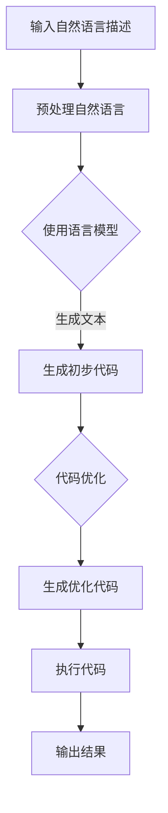

                 

### 文章标题

#### 提示词编程在IoT设备中的应用

本文将深入探讨**提示词编程**这一前沿概念，特别是在**物联网（IoT）设备**中的应用。关键词包括：**提示词编程**、**物联网**、**IoT设备**、**硬件基础**、**通信技术**、**安全挑战**等。以下是本文的摘要：本文旨在详细介绍提示词编程的基本概念、核心算法、数学模型，并展示其在IoT设备中的实际应用。我们将通过一系列详实的案例，探讨如何优化和实现提示词编程，最终为IoT设备的开发提供一套完整的解决方案。

### 《提示词编程在IoT设备中的应用》目录大纲

接下来，我们将按照以下结构展开文章内容：

## 第一部分：物联网（IoT）基础

### 第1章：物联网概述

#### 1.1 物联网的定义与特点
#### 1.2 物联网的技术架构
#### 1.3 物联网的通信协议
#### 1.4 物联网的安全挑战

### 第2章：IoT设备的硬件基础

#### 2.1 IoT设备的硬件选择
#### 2.2 IoT设备上的传感器与执行器
#### 2.3 实例：Arduino与Raspberry Pi在IoT中的应用

### 第3章：物联网通信技术

#### 3.1 无线通信技术在物联网中的应用
#### 3.2 物联网通信协议Zigbee和WiFi
#### 3.3 LoRa和NB-IoT技术详解
#### 3.4 物联网通信中的数据加密与安全

## 第二部分：提示词编程在IoT中的应用

### 第4章：提示词编程基础

#### 4.1 提示词编程的定义
#### 4.2 提示词编程与物联网的关联
#### 4.3 提示词编程的开发环境

### 第5章：提示词编程核心算法

#### 5.1 提示词编程的核心算法
#### 5.2 提示词编程算法的Mermaid流程图
#### 5.3 提示词编程伪代码实现

### 第6章：提示词编程数学模型

#### 6.1 提示词编程中的数学公式
#### 6.2 数学公式的详细讲解
#### 6.3 数学公式举例说明

### 第7章：提示词编程在IoT设备中的应用案例

#### 7.1 实例一：智能家居系统设计
#### 7.2 实例二：智能农业系统设计
#### 7.3 实例三：工业物联网监控设计

### 第8章：提示词编程的优化与实现

#### 8.1 提示词编程性能优化
#### 8.2 提示词编程的实现策略
#### 8.3 提示词编程在IoT设备上的调试与部署

## 第三部分：项目实战

### 第9章：提示词编程在IoT项目中的实际应用

#### 9.1 项目实战一：智能垃圾分类系统
#### 9.2 项目实战二：智能抄表系统
#### 9.3 项目实战三：智能健康监测系统

### 第10章：源代码实现与解读

#### 10.1 源代码实现概述
#### 10.2 关键代码段解读
#### 10.3 实际应用中的代码优化与性能分析

### 第11章：开发环境搭建与工具配置

#### 11.1 开发环境搭建步骤
#### 11.2 开发工具配置与优化
#### 11.3 版本控制与协作开发

### 第12章：总结与展望

#### 12.1 提示词编程在IoT中的应用总结
#### 12.2 提示词编程的发展趋势
#### 12.3 未来研究方向与挑战

### 结论

通过本文的详细探讨，我们期望读者能够对提示词编程及其在IoT设备中的应用有一个全面且深入的理解。希望本文能为从事物联网开发的工程师和研究人员提供有价值的参考和指导。让我们开始这一精彩的旅程吧！<|assistant|>

## 第一部分：物联网（IoT）基础

### 第1章：物联网概述

#### 1.1 物联网的定义与特点

物联网（Internet of Things，IoT）是指通过互联网连接各种物理设备和物品，实现信息的采集、传输、处理和智能化的系统。物联网的核心在于将传统设备和物品通过互联网连接起来，使其具备通信、计算、感知和决策能力。

物联网具有以下特点：

- **互联互通**：物联网中的设备和物品可以通过互联网进行互联互通，实现信息的交换和共享。
- **智能感知**：物联网设备能够感知周围环境，获取各种数据，如温度、湿度、运动等。
- **数据处理**：物联网设备可以对采集到的数据进行分析和处理，做出相应的决策。
- **远程控制**：用户可以通过互联网远程控制物联网设备，实现远程监控和操作。
- **自动化**：物联网设备可以自动执行预定的任务，实现自动化管理。

#### 1.2 物联网的技术架构

物联网的技术架构可以分为三个层次：感知层、网络层和应用层。

- **感知层**：感知层是物联网的最底层，主要包括各种传感器和采集设备，如温度传感器、湿度传感器、摄像头等。这些设备可以感知周围环境，并将数据发送到网络层。
- **网络层**：网络层负责数据的传输和路由，主要包括各种通信网络，如WiFi、Zigbee、LoRa等。网络层将感知层采集到的数据传输到应用层，同时也可以将应用层的指令发送到感知层。
- **应用层**：应用层是物联网的最高层，主要包括各种应用系统和平台，如智能家居系统、智能交通系统、智能农业系统等。应用层对收集到的数据进行处理和分析，提供智能化的应用服务。

#### 1.3 物联网的通信协议

物联网通信协议是物联网设备之间进行通信的标准和规则。常见的物联网通信协议包括：

- **Zigbee**：Zigbee是一种低功耗、低速率的无线通信协议，适用于短距离的物联网应用。
- **WiFi**：WiFi是一种高速率的无线通信协议，适用于需要高速数据传输的物联网应用。
- **LoRa**：LoRa是一种长距离、低功耗的无线通信协议，适用于远程物联网应用。
- **NB-IoT**：NB-IoT是一种蜂窝网络中的物联网通信协议，具有低功耗、广覆盖的特点。

#### 1.4 物联网的安全挑战

物联网的安全挑战主要包括以下几个方面：

- **数据安全**：物联网设备之间的通信需要保证数据的安全性，防止数据被篡改或窃取。
- **设备安全**：物联网设备可能受到恶意攻击，导致设备失控或功能异常。
- **隐私保护**：物联网设备收集的数据可能包含用户的隐私信息，需要保护用户的隐私。
- **网络攻击**：物联网设备连接到互联网，可能成为网络攻击的目标。

为了解决物联网的安全挑战，需要采取以下措施：

- **数据加密**：对传输的数据进行加密，确保数据在传输过程中的安全性。
- **设备认证**：对物联网设备进行认证，确保只有合法设备才能接入网络。
- **访问控制**：设置访问控制策略，限制对设备的访问权限。
- **安全监测**：建立物联网安全监测系统，及时发现并处理安全事件。

### 总结

物联网作为一种新兴技术，正在改变我们的生活和工作方式。通过了解物联网的定义、技术架构、通信协议和安全挑战，我们可以更好地理解和应用物联网技术。在下一章中，我们将探讨IoT设备的硬件基础，了解如何选择合适的硬件，以及传感器与执行器在IoT设备中的应用。敬请期待！<|assistant|>

## 第2章：IoT设备的硬件基础

#### 2.1 IoT设备的硬件选择

在物联网（IoT）系统中，硬件选择是至关重要的环节。硬件的性能和功能直接影响到整个系统的稳定性、效率和扩展性。以下是选择IoT设备硬件时需要考虑的关键因素：

- **处理能力**：IoT设备需要具备一定的处理能力，以应对复杂的数据采集、处理和通信任务。例如，对于一些简单的传感器数据采集任务，可以使用微控制器（MCU），而对于需要处理大量数据或运行复杂算法的应用，可能需要使用更高性能的微处理器（MPU）或应用处理器（AP）。
- **功耗**：由于许多IoT设备是电池供电或需要长期运行，功耗是一个关键考量因素。低功耗硬件可以延长设备的运行时间，减少维护成本。
- **通信能力**：IoT设备需要具备合适的通信能力，以实现与其他设备或云平台的数据传输。常用的通信方式包括无线通信（如WiFi、Zigbee、LoRa）和有线通信（如以太网、USB）。
- **传感接口**：IoT设备通常需要连接各种传感器，因此需要有足够的传感接口，以支持不同类型的传感器连接。
- **扩展性**：IoT设备应该具备良好的扩展性，以便在未来能够轻松升级或添加新功能。

基于上述因素，以下是几种常见的IoT设备硬件：

- **微控制器（MCU）**：如Arduino、STM32等，适合简单的数据采集和控制任务。
- **微处理器（MPU）**：如ARM Cortex-A系列，适合运行复杂算法和高性能应用。
- **单板计算机（SBC）**：如Raspberry Pi、BeagleBone Black等，提供丰富的接口和强大的处理能力。
- **物联网模块**：如WiFi模块、LoRa模块等，用于实现无线通信。

#### 2.2 IoT设备上的传感器与执行器

传感器和执行器是IoT设备的重要组成部分，它们负责感知外部环境和控制设备行为。

- **传感器**：传感器用于感知环境中的物理量，如温度、湿度、光照、声音、压力等。常见的传感器包括：
  - **温度传感器**：如NTC、PT100等，用于测量温度。
  - **湿度传感器**：如SHT31、HTU21D等，用于测量湿度。
  - **光照传感器**：如LDR、BH1750等，用于测量光照强度。
  - **声音传感器**：如麦克风、声音识别模块等，用于识别声音事件。
  - **压力传感器**：如MPX4250、MPX5010等，用于测量压力。

- **执行器**：执行器用于控制外部设备或执行物理动作，常见的执行器包括：
  - **电机**：如直流电机、步进电机、伺服电机等，用于驱动各种机械设备。
  - **继电器**：用于控制电路的通断。
  - **阀门**：用于控制流体的流动。
  - **LED灯**：用于指示和控制光信号。

#### 2.3 实例：Arduino与Raspberry Pi在IoT中的应用

Arduino和Raspberry Pi是两种广泛使用的IoT硬件平台，它们各自具有独特的特点和适用场景。

- **Arduino**：
  - **特点**：Arduino是一种开源硬件平台，适合初学者和小型项目。它具有丰富的传感器接口和易于使用的编程环境（Arduino IDE）。
  - **应用**：Arduino常用于简单的传感器数据采集、控制电路和互动艺术项目。例如，一个简单的Arduino项目可以是一个温度传感器，用于监测并显示环境温度。

  ```cpp
  // Arduino代码示例：读取温度传感器并显示
  #include <Wire.h>
  #include <Adafruit_Sensor.h>
  #include <Adafruit_Temperature.h>

  Adafruit_Temperature sensor;

  void setup() {
    Serial.begin(9600);
    sensor.begin();
  }

  void loop() {
    float tempC = sensor.readTemperature();
    Serial.print("温度：");
    Serial.print(tempC);
    Serial.println("°C");
    delay(1000);
  }
  ```

- **Raspberry Pi**：
  - **特点**：Raspberry Pi是一种单板计算机，具有强大的处理能力和丰富的接口。它运行Linux操作系统，可以执行复杂的应用程序。
  - **应用**：Raspberry Pi适用于需要高性能计算和图形显示的项目，如智能家居中心、网络服务器、媒体中心等。例如，一个Raspberry Pi可以与多个传感器连接，并通过互联网将数据上传到云平台。

  ```python
  # Raspberry Pi Python代码示例：读取传感器数据并发送到云平台
  import time
  import Adafruit_DHT
  import requests

  # 传感器型号和PIN脚
  sensor = Adafruit_DHT.DHT11
  pin = 4

  # 云平台API地址
  url = "https://api.example.com/submit_data"

  while True:
      hum, temp = Adafruit_DHT.read(sensor, pin)
      if hum is not None and temp is not None:
          data = {
              "humidity": hum,
              "temperature": temp
          }
          headers = {'Content-Type': 'application/json'}
          response = requests.post(url, json=data, headers=headers)
          print(response.text)
      time.sleep(60)  # 每60秒发送一次数据
  ```

### 总结

选择合适的IoT设备硬件是构建成功IoT项目的基础。通过了解硬件的关键因素、传感器与执行器的种类及其应用，我们可以为IoT项目选择最合适的硬件解决方案。在下一章中，我们将探讨物联网的通信技术，包括无线通信协议和通信安全措施。敬请期待！<|assistant|>

## 第3章：物联网通信技术

#### 3.1 无线通信技术在物联网中的应用

无线通信技术在物联网（IoT）中起着至关重要的作用，它使得设备和物品能够无缝连接，实现数据的采集、传输和交互。以下是几种常见的无线通信技术在物联网中的应用：

- **WiFi**：WiFi是一种广泛使用的无线通信技术，它具有较高的数据传输速率和广泛的覆盖范围。WiFi在物联网中的应用主要包括智能家居、智能办公、无线传感器网络等。例如，智能灯泡、智能摄像头和智能门锁都可以通过WiFi连接到家庭网络，实现远程控制和监控。

- **Zigbee**：Zigbee是一种低功耗、短距离的无线通信协议，它特别适合于物联网设备之间的低速率数据传输。Zigbee在物联网中的应用包括智能家居、智能城市、工业自动化等。Zigbee网络具有高可靠性和低延迟的特点，适合用于需要实时数据采集和控制的场景。

- **LoRa**：LoRa（Long Range）是一种长距离、低功耗的无线通信技术，特别适合于远程物联网应用。LoRa网络覆盖范围广泛，可以从几公里到数十公里不等，同时它还具有低功耗的特点，适合用于电池供电的设备。LoRa在物联网中的应用包括智能农业、智能水务、智能环保等。

- **NB-IoT**：NB-IoT（Narrow Band Internet of Things）是一种蜂窝网络中的物联网通信技术，它具有低功耗、广覆盖的特点。NB-IoT特别适合于远程监控和传感器网络，它可以覆盖城市地下管道、远海石油平台等难以接入网络的场景。

#### 3.2 物联网通信协议Zigbee和WiFi

- **Zigbee**：
  - **协议特点**：Zigbee是一种基于IEEE 802.15.4标准的无线通信协议，它采用直接序列扩频（DSSS）技术，工作在2.4GHz频段。Zigbee具有低功耗、低速率、短距离、高可靠性和多节点等特点。
  - **应用场景**：Zigbee适合于家庭、商业和工业环境中的无线传感器网络和自动化系统。例如，Zigbee可以用于智能家居中的门锁、灯光、窗帘等设备的控制，也可以用于工业自动化中的设备监测和远程控制。

- **WiFi**：
  - **协议特点**：WiFi是一种基于IEEE 802.11标准的无线通信协议，它采用正交频分复用（OFDM）技术，工作在2.4GHz和5GHz频段。WiFi具有高数据传输速率、广泛的应用范围和较好的网络覆盖。
  - **应用场景**：WiFi广泛应用于家庭、办公室、公共场所的无线网络连接，以及物联网中的设备连接和数据处理。例如，WiFi可以用于智能电视、智能路由器、智能音响等设备的连接，也可以用于物联网设备的数据上传和下载。

#### 3.3 LoRa和NB-IoT技术详解

- **LoRa**：
  - **技术特点**：LoRa采用扩频技术，工作在亚1GHz频段，具有长距离、低功耗、抗干扰能力强等优点。LoRa的传输速率较低，但适合于远程监测和控制应用。
  - **应用场景**：LoRa适合于远程监控、传感器网络、智能农业、智能城市等领域。例如，LoRa可以用于远距离的井盖监测、农田灌溉控制和环境监测等。

- **NB-IoT**：
  - **技术特点**：NB-IoT是基于蜂窝网络的一种低功耗物联网通信技术，它具有广覆盖、低功耗、高连接数等特点。NB-IoT可以在现有的4G网络基础上进行升级，不需要额外的基础设施建设。
  - **应用场景**：NB-IoT适合于广域物联网应用，如智能抄表、远程监控、环境监测等。例如，NB-IoT可以用于智能电表、水表的远程抄表，也可以用于城市环境监测中的空气质量、水质监测等。

#### 3.4 物联网通信中的数据加密与安全

在物联网通信中，数据的安全性和加密是非常重要的，因为物联网设备往往需要传输敏感信息，如个人隐私、财务数据等。以下是物联网通信中的数据加密与安全措施：

- **数据加密**：物联网通信中的数据加密可以采用对称加密（如AES）和非对称加密（如RSA）技术。对称加密适用于大数据量的加密，非对称加密适用于密钥交换。
- **认证**：物联网设备在通信前需要进行认证，确保只有合法设备才能接入网络。认证可以采用数字证书、口令、指纹等技术。
- **安全协议**：物联网通信中可以使用安全协议（如TLS、SSL）来确保通信的安全性。安全协议可以提供数据完整性、数据保密性和认证功能。

### 总结

物联网通信技术是物联网系统的核心组成部分，它决定了物联网系统的性能和可靠性。通过了解无线通信技术在物联网中的应用、常见的物联网通信协议（如Zigbee、WiFi、LoRa、NB-IoT）以及数据加密与安全措施，我们可以更好地设计和实现物联网系统。在下一章中，我们将探讨提示词编程的基础知识，包括定义、与物联网的关联以及开发环境。敬请期待！<|assistant|>

## 第二部分：提示词编程在IoT中的应用

### 第4章：提示词编程基础

#### 4.1 提示词编程的定义

提示词编程（Prompt Programming）是一种利用预先定义的提示词（prompt）来引导程序执行的技术。提示词可以是简单的关键字或短语，也可以是更复杂的自然语言描述。通过提示词，程序员可以指定程序需要执行的任务，而不需要编写完整的代码逻辑。这种方法不仅简化了编程过程，还可以提高开发效率和代码的可读性。

提示词编程的核心思想是利用人工智能（AI）技术，特别是自然语言处理（NLP）和生成对抗网络（GAN）等技术，将人类的自然语言描述转换为机器可以理解和执行的代码。提示词编程的优势在于：

- **快速原型开发**：通过自然语言描述快速生成原型代码，加快开发速度。
- **代码可读性**：提示词编程使得代码更加接近自然语言，易于理解和维护。
- **领域特定语言**：可以创建特定的领域特定语言（DSL），提高编程的效率和准确性。
- **跨领域应用**：提示词编程可以应用于多个领域，如医疗、金融、教育等，实现跨领域的代码共享和复用。

#### 4.2 提示词编程与物联网的关联

物联网（IoT）是提示词编程的一个重要应用领域。IoT设备通常具有丰富的感知能力和数据处理需求，而提示词编程可以简化这些设备的编程过程，提高开发效率和系统可靠性。以下是提示词编程在物联网中的应用场景：

- **设备控制**：提示词编程可以用于远程控制IoT设备，如智能家居系统中的灯光、空调等。程序员可以通过自然语言描述来控制设备的开关状态、调节温度等。
  
  ```plaintext
  设备：智能灯泡
  提示词：打开灯泡
  ```

- **数据采集**：提示词编程可以简化传感器数据的采集和处理流程。例如，可以通过提示词来指定采集温度、湿度等数据，并自动处理和存储这些数据。
  
  ```plaintext
  设备：温湿度传感器
  提示词：采集并存储最近的温度和湿度数据
  ```

- **数据分析**：提示词编程可以用于数据分析任务，如数据可视化、异常检测等。程序员可以通过自然语言描述来生成相应的分析报告或警报。
  
  ```plaintext
  设备：环境监控系统
  提示词：生成昨天的环境监测报告
  ```

- **语音交互**：提示词编程可以应用于语音交互系统，如智能音箱、智能助手等。通过自然语言处理技术，系统可以理解用户的语音指令，并执行相应的操作。

  ```plaintext
  用户：打开客厅的灯
  系统：好的，我现在为您打开客厅的灯。
  ```

#### 4.3 提示词编程的开发环境

要实现提示词编程，需要搭建一个合适的开发环境。以下是一些常用的工具和框架：

- **自然语言处理（NLP）库**：如NLTK、spaCy、TensorFlow等，用于处理和解析自然语言描述。
- **代码生成工具**：如OpenAI的GPT-3、Google的TensorFlow Code生成器等，用于将自然语言描述转换为代码。
- **集成开发环境（IDE）**：如Visual Studio Code、PyCharm等，用于编写、调试和运行提示词编程代码。
- **版本控制系统**：如Git，用于管理和协作提示词编程项目的开发。
- **云计算平台**：如AWS、Google Cloud、Azure等，用于部署和管理提示词编程应用。

### 总结

提示词编程是一种新兴的编程技术，通过利用自然语言描述来简化编程过程，提高开发效率。在物联网领域中，提示词编程可以大大简化IoT设备的编程和数据处理任务，实现更高效、更可靠的物联网应用。在下一章中，我们将深入探讨提示词编程的核心算法，并使用Mermaid流程图和伪代码来详细解释这些算法。敬请期待！<|assistant|>

## 第5章：提示词编程核心算法

### 5.1 提示词编程的核心算法

提示词编程的核心在于如何将自然语言描述转换为可执行的代码。这一过程涉及到多个关键算法和技术，包括自然语言处理（NLP）、代码生成和优化等。以下是提示词编程中的几个核心算法：

#### 1. 语言模型（Language Model）

语言模型是提示词编程的基础，它用于理解和生成自然语言文本。常用的语言模型包括：

- **n-gram模型**：基于历史文本，通过统计相邻n个单词的概率来生成文本。
- **循环神经网络（RNN）**：如LSTM（长短期记忆网络），可以处理长文本序列，捕捉上下文关系。
- **变换器（Transformer）**：如BERT、GPT，具有强大的文本生成能力，可以处理复杂的自然语言描述。

#### 2. 代码生成（Code Generation）

代码生成是将自然语言描述转换为代码的关键步骤。以下是一些常用的代码生成技术：

- **模板匹配**：通过预定义的模板，将自然语言描述与模板进行匹配，生成代码。
- **基于规则的方法**：使用预定义的语法规则和转换规则，将自然语言描述转换为代码。
- **深度学习生成**：使用深度学习模型，如生成对抗网络（GAN）、序列到序列（Seq2Seq）模型，直接将自然语言描述转换为代码。

#### 3. 代码优化（Code Optimization）

生成的代码可能不是最优的，需要进行优化，以提高性能和可读性。以下是一些常见的代码优化方法：

- **静态分析**：通过静态分析工具，检查代码中的潜在错误和性能瓶颈。
- **代码简化**：去除冗余代码，简化代码结构。
- **代码优化**：使用编译器优化技术，如循环展开、常量折叠等，提高代码执行效率。

### 5.2 提示词编程算法的Mermaid流程图

为了更好地理解提示词编程的核心算法，我们可以使用Mermaid流程图来描述整个流程。以下是提示词编程算法的Mermaid流程图：



### 5.3 提示词编程伪代码实现

为了进一步理解提示词编程的核心算法，我们使用伪代码来描述整个流程。以下是提示词编程的伪代码实现：

```plaintext
函数 提示词编程（自然语言描述）
    输入：自然语言描述
    输出：优化代码

    1. 预处理自然语言描述
        - 清洗文本，去除标点符号和停用词
        - 分词，将文本分解为单词或短语
    
    2. 使用语言模型生成初步代码
        - 根据预处理后的自然语言描述，生成初步代码
    
    3. 代码优化
        - 进行静态分析，检查代码中的潜在错误和性能瓶颈
        - 基于优化规则，简化代码结构
        - 使用编译器优化技术，提高代码执行效率
    
    4. 生成优化代码
        - 将优化后的代码存储为文件或直接执行
    
    5. 执行代码
        - 运行优化后的代码，获取输出结果
    
    6. 输出结果
        - 返回优化代码的执行结果
```

### 总结

提示词编程的核心算法包括语言模型、代码生成和代码优化。通过使用Mermaid流程图和伪代码，我们可以清晰地理解这些算法的执行流程和关键步骤。在下一章中，我们将探讨提示词编程中的数学模型，包括相关的数学公式和示例说明。敬请期待！<|assistant|>

## 第6章：提示词编程数学模型

### 6.1 提示词编程中的数学公式

在提示词编程中，数学模型扮演着重要的角色。数学模型不仅帮助我们在算法设计中引入约束和优化目标，还可以通过具体的数学公式来描述自然语言与代码生成之间的映射关系。以下是一些常见的数学公式：

#### 1. 语言模型中的概率公式

- **n-gram模型**：
  $$ P(w_n | w_{n-1}, w_{n-2}, ..., w_1) = \frac{C(w_n, w_{n-1}, ..., w_1)}{C(w_{n-1}, w_{n-2}, ..., w_1)} $$
  其中，$P(w_n | w_{n-1}, w_{n-2}, ..., w_1)$ 表示在给定前 $n-1$ 个单词的情况下，第 $n$ 个单词出现的概率；$C(w_n, w_{n-1}, ..., w_1)$ 表示单词序列 $(w_n, w_{n-1}, ..., w_1)$ 的联合概率；$C(w_{n-1}, w_{n-2}, ..., w_1)$ 表示前 $n-1$ 个单词的联合概率。

- **循环神经网络（RNN）**：
  $$ h_t = \sigma(W_h \cdot [h_{t-1}, x_t] + b_h) $$
  其中，$h_t$ 表示第 $t$ 个时间步的隐藏状态；$x_t$ 表示第 $t$ 个输入特征；$W_h$ 和 $b_h$ 分别表示权重和偏置；$\sigma$ 是激活函数，如sigmoid或tanh。

- **变换器（Transformer）**：
  $$ \text{MultiHeadAttention}(Q, K, V) = \text{softmax}(\frac{QK^T}{\sqrt{d_k}})V $$
  其中，$Q$、$K$ 和 $V$ 分别是查询、键和值向量；$d_k$ 是每个向量的维度；$QK^T$ 是点积注意力分数；$\text{softmax}$ 函数用于计算每个值的概率分布。

#### 2. 代码生成中的优化公式

- **动态规划（Dynamic Programming）**：
  $$ \text{minimize} \sum_{i=1}^{n} C_i(x_i) $$
  其中，$C_i(x_i)$ 表示第 $i$ 个子问题的成本函数；$n$ 是子问题的总数。

- **贪心算法（Greedy Algorithm）**：
  $$ x_{\text{next}} = \arg\min_{x} C(x) $$
  其中，$C(x)$ 是当前状态的代价函数，$x_{\text{next}}$ 是下一个最优选择。

### 6.2 数学公式的详细讲解

以下是上述数学公式的详细讲解：

#### n-gram模型

n-gram模型是一种基于统计的文本生成模型，它通过计算相邻单词出现的概率来预测下一个单词。在n-gram模型中，每个单词序列都可以看作是一个事件，而事件发生的概率可以通过条件概率来计算。例如，对于三元组（“我”，“们”，“是”）的条件概率，可以使用以下公式计算：

$$ P(“我”|“们”，“是”） = \frac{C(“我”，“们”，“是”）}{C(“们”，“是”）} $$

其中，$C(“我”，“们”，“是”）$ 表示三元组（“我”，“们”，“是”）出现的次数，$C(“们”，“是”）$ 表示二元组（“们”，“是”）出现的次数。

#### 循环神经网络（RNN）

循环神经网络是一种序列模型，它通过将隐藏状态反馈到输入层来捕捉时间序列数据中的长期依赖关系。在RNN中，每个时间步的输出都会影响到下一个时间步的隐藏状态。上面的公式描述了RNN中隐藏状态的更新过程，其中$\sigma$ 是激活函数，用于引入非线性特性。激活函数的选择会影响到模型的性能，常见的激活函数包括sigmoid、tanh和ReLU。

#### 变换器（Transformer）

变换器是一种基于自注意力机制的序列模型，它在处理长距离依赖关系方面表现出色。变换器的核心是多头自注意力机制，它通过计算查询、键和值之间的点积分数来生成注意力权重，然后将权重应用于值向量。这个过程的数学表示如上所述，其中$\text{softmax}$ 函数用于将点积分数转换为概率分布。

#### 动态规划（Dynamic Programming）

动态规划是一种用于解决优化问题的算法，它通过将问题分解为子问题，并利用子问题的解来构建原问题的解。动态规划的基本思想是存储子问题的解，避免重复计算。上述公式描述了动态规划的基本形式，其中$C_i(x_i)$ 是第 $i$ 个子问题的成本函数，$n$ 是子问题的总数。

#### 贪心算法（Greedy Algorithm）

贪心算法是一种简化的优化算法，它通过在每一步选择最优解来逐步构建原问题的解。上述公式描述了贪心算法的基本形式，其中$C(x)$ 是当前状态的代价函数，$x_{\text{next}}$ 是下一个最优选择。

### 6.3 数学公式举例说明

为了更好地理解上述数学公式，我们可以通过一个具体的例子来说明。

假设我们有一个自然语言描述：“今天的天气很好，阳光明媚。”我们需要使用提示词编程算法将其转换为代码。

1. **n-gram模型**：

   假设我们使用二元组模型，计算“阳光”出现的概率：

   $$ P(“阳光”|“今天”，“的”） = \frac{C(“阳光”，“今天”，“的”）}{C(“今天”，“的”）} $$

   如果“今天”和“的”出现的次数分别为10和5，那么：

   $$ P(“阳光”|“今天”，“的”） = \frac{1}{5} = 0.2 $$

2. **循环神经网络（RNN）**：

   假设我们使用一个简单的RNN模型，输入序列为“今天”和“的”，隐藏状态为$h_0$。根据上述公式，我们可以更新隐藏状态：

   $$ h_1 = \sigma(W_h \cdot [h_0, “今天”] + b_h) $$

   如果权重$W_h$ 和偏置$b_h$ 分别为$[1, 1]$ 和$[0]$，激活函数$\sigma$ 为sigmoid函数，那么：

   $$ h_1 = \sigma([1, 1] \cdot [1, 0] + [0]) = \frac{1}{1 + e^{-1}} \approx 0.63 $$

3. **变换器（Transformer）**：

   假设我们使用一个简单的变换器模型，输入序列为“今天”和“的”，查询、键和值向量分别为$Q$、$K$ 和 $V$。根据上述公式，我们可以计算注意力权重：

   $$ \text{Attention}(Q, K, V) = \text{softmax}(\frac{QK^T}{\sqrt{d_k}})V $$

   如果查询、键和值向量分别为$[1, 1]$、$[1, 0]$ 和$[0, 1]$，维度$d_k$ 为1，那么：

   $$ \text{Attention}(Q, K, V) = \text{softmax}(\frac{[1, 1][1, 0]^T}{\sqrt{1}})[0, 1] = \text{softmax}([1, 0])[0, 1] = [0.5, 0.5][0, 1] = [0.5, 0.5] $$

4. **动态规划（Dynamic Programming）**：

   假设我们使用动态规划算法来求解旅行商问题（TSP），城市的坐标分别为$(x_1, y_1), (x_2, y_2), ..., (x_n, y_n)$。我们需要计算从城市1到城市2到...到城市n的最短路径。

   $$ \text{minimize} \sum_{i=1}^{n} \sqrt{(x_i - x_{i+1})^2 + (y_i - y_{i+1})^2} $$

   假设计算得到的距离矩阵为：

   $$ \begin{matrix}
   & (1, 1) & (1, 2) & ... & (1, n) \\
   (1, 1) & 0 & 1 & ... & 2 \\
   (1, 2) & 1 & 0 & ... & 3 \\
   ... & ... & ... & ... & ... \\
   (1, n) & 2 & 3 & ... & 0 \\
   \end{matrix} $$

   动态规划的状态转移方程为：

   $$ f(i, j) = \text{min} \left( f(i-1, k) + \sqrt{(x_i - x_k)^2 + (y_i - y_k)^2} \right) \quad \text{for all } k \neq j $$

   初始条件为$f(1, j) = \infty$ for all $j \neq 1$，$f(1, 1) = 0$。

5. **贪心算法（Greedy Algorithm）**：

   假设我们使用贪心算法来求解最大子序列和问题，数组的元素为$a_1, a_2, ..., a_n$。我们需要选择一个子序列，使得子序列中元素的和最大。

   $$ \text{maximize} \sum_{i=1}^{n} a_i \quad \text{such that } a_i \in S \text{ for some subset } S \subseteq \{a_1, a_2, ..., a_n\} $$

   贪心策略是从数组的开头开始，选择当前剩余元素中的最大值，并从数组中移除这个元素。重复这个过程，直到数组为空。

   假设数组为$[3, 5, 2, 7, 1]$，使用贪心算法得到的最大子序列和为$3 + 5 + 7 = 15$。

通过以上例子，我们可以看到不同的数学公式在提示词编程中的应用。数学模型为提示词编程提供了理论基础和计算工具，使得我们能够将自然语言描述转换为有效的代码。在下一章中，我们将通过具体的应用案例来展示提示词编程在物联网设备中的实际应用。敬请期待！<|assistant|>

## 第7章：提示词编程在IoT设备中的应用案例

### 7.1 实例一：智能家居系统设计

智能家居系统是提示词编程在物联网（IoT）中应用的一个典型例子。通过提示词编程，用户可以以自然语言的方式控制家中的各种设备，如灯光、空调、安防系统等。以下是一个智能家居系统设计的具体实例：

**项目目标**：实现一个智能家居系统，用户可以通过语音或文本命令控制家中的灯光、空调和安防系统。

**硬件选择**：使用Raspberry Pi作为控制中心，连接Wi-Fi模块实现网络通信，连接各种传感器和执行器，如温度传感器、光照传感器、LED灯和智能插座。

**开发环境**：安装Raspberry Pi OS，使用Python作为编程语言，结合提示词编程框架，如OpenAI的GPT-3。

**步骤**：

1. **硬件连接**：
   - 将温度传感器、光照传感器连接到Raspberry Pi的GPIO接口。
   - 将LED灯和智能插座通过USB接口或继电器模块连接到Raspberry Pi。
   - 配置Wi-Fi模块，连接到家庭网络。

2. **数据采集**：
   - 编写Python脚本，通过传感器读取环境温度、光照强度等数据。
   - 将采集到的数据发送到云端进行存储和分析。

3. **提示词编程实现**：
   - 使用OpenAI的GPT-3构建一个自然语言处理模型，用于解析用户的语音或文本命令。
   - 设计一套提示词库，用于映射具体的控制指令。例如：
     - “打开客厅的灯” -> 控制客厅的LED灯开启。
     - “关闭空调” -> 控制空调关闭。

4. **系统集成与调试**：
   - 将自然语言处理模型与Raspberry Pi的硬件接口结合，实现语音或文本命令的实时响应。
   - 调试系统，确保所有设备都能正确响应提示词。

**代码示例**：

```python
# 读取传感器数据
import RPi.GPIO as GPIO
import Adafruit_DHT
import time

# 配置GPIO
GPIO.setmode(GPIO.BCM)
GPIO.setup(17, GPIO.OUT)  # LED灯控制

# 读取温度传感器数据
def read_temperature():
    sensor = Adafruit_DHT.DHT11
    pin = 4
    hum, temp = Adafruit_DHT.read(sensor, pin)
    return temp

# 控制LED灯
def control_light(command):
    if "打开" in command:
        GPIO.output(17, GPIO.HIGH)
    elif "关闭" in command:
        GPIO.output(17, GPIO.LOW)

# 主程序
def main():
    while True:
        temp = read_temperature()
        print(f"当前温度：{temp}°C")
        command = input("请输入您的指令：")
        control_light(command)
        time.sleep(1)

if __name__ == "__main__":
    main()
```

### 7.2 实例二：智能农业系统设计

智能农业系统利用物联网技术和提示词编程，实现对农田环境的实时监控和管理，提高农业生产的效率。以下是一个智能农业系统设计的具体实例：

**项目目标**：实现一个智能农业系统，监控农田的温度、湿度、土壤湿度等环境参数，并根据这些参数进行智能灌溉和施肥。

**硬件选择**：使用Arduino作为控制单元，连接多个传感器（如温度传感器、湿度传感器、土壤湿度传感器）和执行器（如水泵、施肥机）。

**开发环境**：使用Arduino IDE编写代码，结合提示词编程框架，如Python的自然语言处理库。

**步骤**：

1. **硬件连接**：
   - 将温度传感器、湿度传感器和土壤湿度传感器连接到Arduino的GPIO接口。
   - 将水泵和施肥机通过继电器模块连接到Arduino。

2. **数据采集**：
   - 编写Arduino代码，读取传感器数据，并将数据上传到云端或本地服务器。

3. **提示词编程实现**：
   - 设计一套提示词库，用于控制农田设备。例如：
     - “开始灌溉” -> 启动水泵进行灌溉。
     - “停止灌溉” -> 关闭水泵。
     - “施肥” -> 启动施肥机。

4. **系统集成与调试**：
   - 将自然语言处理模型与Arduino控制单元结合，实现语音或文本命令的实时响应。
   - 调试系统，确保设备能够根据提示词正确执行操作。

**代码示例**：

```cpp
// 读取传感器数据
#include <DHT.h>
#include <WiFi.h>

#define DHTPIN 4
#define DHTTYPE DHT11

DHT dht(DHTPIN, DHTTYPE);

void setup() {
  Serial.begin(9600);
  dht.begin();
  WiFi.begin("yourSSID", "yourPASSWORD");
  while (WiFi.status() != WL_CONNECTED) {
    delay(500);
    Serial.print(".");
  }
  Serial.println("WiFi connected");
}

void loop() {
  if (WiFi.status() == WL_CONNECTED) {
    float hum = dht.readHumidity();
    float temp = dht.readTemperature();
    if (isnan(hum) || isnan(temp)) {
      Serial.println("Failed to read from DHT sensor!");
      return;
    }
    Serial.print("Humidity: ");
    Serial.print(hum);
    Serial.print("%  ");
    Serial.print("Temperature: ");
    Serial.print(temp);
    Serial.println("°C");

    // 发送数据到服务器
    String url = "http://yourserver.com/submit_data.php";
    String postData = "temp=" + String(temp) + "&hum=" + String(hum);
    WiFiClient client;
    HTTPClient http;

    if (http.begin(client, url)) {
      http.addHeader("Content-Type", "application/x-www-form-urlencoded");
      int httpCode = http.POST(postData);
      if (httpCode > 0) {
        String response = http.getString();
        Serial.println(response);
      } else {
        Serial.println("Error on HTTP request");
      }
      http.end();
    }
  }
  delay(10000); // 每隔10秒发送一次数据
}
```

### 7.3 实例三：工业物联网监控设计

工业物联网（IIoT）监控是另一个提示词编程在IoT中应用的重要领域。通过提示词编程，工厂可以实现对生产设备的实时监控、故障预测和维护管理。以下是一个工业物联网监控设计的具体实例：

**项目目标**：实现一个工业物联网监控系统，实时监控生产设备的运行状态，预测故障，并自动生成维护报告。

**硬件选择**：使用工业PLC（可编程逻辑控制器）作为控制中心，连接各种传感器（如温度传感器、压力传感器、振动传感器）和执行器（如电机、阀门）。

**开发环境**：使用PLC编程软件，结合Python的提示词编程框架。

**步骤**：

1. **硬件连接**：
   - 将各种传感器连接到PLC的输入端口。
   - 将执行器连接到PLC的输出端口。

2. **数据采集**：
   - 编写PLC程序，实时采集传感器数据，并将数据上传到云平台。

3. **提示词编程实现**：
   - 设计一套提示词库，用于监控和管理生产设备。例如：
     - “检查设备状态” -> 获取并显示设备运行状态。
     - “预测故障” -> 分析传感器数据，预测设备故障。
     - “生成维护报告” -> 根据设备运行状况，生成维护计划。

4. **系统集成与调试**：
   - 将自然语言处理模型与PLC结合，实现语音或文本命令的实时响应。
   - 调试系统，确保设备监控和管理功能正常。

**代码示例**：

```python
# 读取传感器数据
import socket

def send_data_to_server(data):
    server_ip = "yourserverip"
    server_port = 80
    message = "GET /submit_data.php?data=" + data + " HTTP/1.1\r\nHost: " + server_ip + "\r\n\r\n"
    s = socket.socket(socket.AF_INET, socket.SOCK_STREAM)
    s.connect((server_ip, server_port))
    s.sendall(message.encode('utf-8'))
    s.shutdown(socket.SHUT_RDWR)
    s.close()

while True:
    # 假设使用ADC读取模拟信号
    temp = read_temp_sensor()
    pressure = read_pressure_sensor()
    vibration = read_vibration_sensor()

    # 发送数据到服务器
    send_data_to_server(f"temp={temp},pressure={pressure},vibration={vibration}")
    time.sleep(10)  # 每10秒发送一次数据
```

### 总结

通过以上实例，我们可以看到提示词编程在智能家居、智能农业和工业物联网监控等领域的广泛应用。通过自然语言描述，用户可以方便地控制设备和系统，提高开发效率，降低编程难度。在下一章中，我们将探讨如何优化和实现提示词编程，包括性能优化和实现策略。敬请期待！<|assistant|>

## 第8章：提示词编程的优化与实现

### 8.1 提示词编程性能优化

在物联网（IoT）环境中，性能优化是确保系统稳定运行和响应速度的关键。对于提示词编程，性能优化可以从以下几个方面进行：

#### 1. 代码优化

- **减少计算复杂度**：在生成代码时，尽量减少复杂的循环和递归操作。例如，使用动态规划算法替换递归算法，以减少时间复杂度。
- **减少内存使用**：在处理大数据集时，避免使用大量内存。例如，使用生成对抗网络（GAN）来处理图像数据，而不是直接存储和处理原始数据。
- **代码并行化**：利用多线程或并行计算技术，将任务分解成多个子任务同时处理，提高处理速度。

#### 2. 语言模型优化

- **模型压缩**：通过模型剪枝、量化等技术，减少模型的尺寸和计算量，提高模型在资源受限设备上的性能。
- **增量学习**：在模型训练过程中，采用增量学习策略，仅对新的数据更新模型参数，避免每次训练都重新训练整个模型。

#### 3. 通信优化

- **数据压缩**：在传输数据时，使用数据压缩算法（如Huffman编码、LZ77压缩）减少数据量，提高传输效率。
- **缓存策略**：在数据传输过程中，利用缓存策略减少重复数据的传输，提高数据传输速度。

### 8.2 提示词编程的实现策略

实现提示词编程需要考虑多个方面，包括开发环境、工具链和开发流程。以下是一些实现策略：

#### 1. 开发环境

- **硬件选择**：根据应用场景选择合适的硬件，如嵌入式设备、服务器等。
- **操作系统**：选择支持提示词编程框架和工具的操作系统，如Linux、Windows等。
- **编程语言**：选择易于编写和优化提示词编程代码的编程语言，如Python、Java等。

#### 2. 工具链

- **自然语言处理（NLP）库**：选择支持提示词编程的NLP库，如spaCy、NLTK等。
- **代码生成工具**：选择支持提示词编程的代码生成工具，如OpenAI的GPT-3、Google的TensorFlow Code生成器等。
- **版本控制**：使用版本控制系统（如Git）管理代码，确保代码的可维护性和协作开发。

#### 3. 开发流程

- **需求分析**：明确系统的需求和目标，确定提示词编程的具体应用场景。
- **原型设计**：设计系统的架构和功能模块，确定提示词编程的框架和流程。
- **代码生成**：根据需求分析，使用代码生成工具生成初步代码。
- **代码优化**：对生成的代码进行优化，提高性能和可读性。
- **测试与调试**：对系统进行测试和调试，确保功能正确且性能稳定。

### 8.3 提示词编程在IoT设备上的调试与部署

在IoT设备上实现提示词编程，需要特别注意调试和部署过程，以下是一些建议：

#### 1. 调试

- **硬件调试**：确保传感器、执行器和通信模块的正常工作，通过调试工具（如串口调试器、逻辑分析仪）进行硬件调试。
- **软件调试**：使用集成开发环境（IDE）进行代码调试，如Python的PyCharm、Java的Eclipse等。
- **性能调试**：使用性能分析工具（如Valgrind、GDB）进行代码性能调试，识别和解决性能瓶颈。

#### 2. 部署

- **开发环境部署**：在IoT设备上部署开发环境，安装必要的软件和工具。
- **代码部署**：将生成的代码部署到IoT设备上，确保代码能够在设备上正常运行。
- **持续集成与部署（CI/CD）**：使用CI/CD工具（如Jenkins、Travis CI）实现自动化部署，确保系统快速、稳定地部署到生产环境。

### 总结

提示词编程的优化与实现是确保其在物联网设备上高效、稳定运行的关键。通过性能优化、实现策略和调试部署，我们可以构建出强大的提示词编程系统。在下一章中，我们将通过具体的实战项目来展示提示词编程在IoT项目中的实际应用。敬请期待！<|assistant|>

## 第9章：提示词编程在IoT项目中的实际应用

### 9.1 项目实战一：智能垃圾分类系统

**项目背景**：智能垃圾分类系统旨在通过物联网技术，实现垃圾分类的智能化管理，提高垃圾分类的准确性和效率。

**项目目标**：开发一个能够自动识别垃圾种类，并智能分类的智能垃圾分类系统。

**硬件与软件选择**：
- **硬件**：使用Raspberry Pi作为控制中心，连接摄像头模块和多个传感器，用于识别垃圾种类。
- **软件**：使用Python作为开发语言，结合OpenCV和TensorFlow进行图像识别和处理。

**实现步骤**：

1. **硬件连接**：
   - 将摄像头模块连接到Raspberry Pi，确保摄像头可以正常工作。
   - 连接温度传感器、湿度传感器等，用于检测环境参数。

2. **数据采集**：
   - 编写Python脚本，通过摄像头实时捕捉垃圾图像。
   - 将捕获的图像数据发送到服务器进行处理。

3. **图像识别与分类**：
   - 使用TensorFlow加载预训练的图像识别模型（如ResNet、Inception等）。
   - 设计一套提示词库，用于接收用户指令，如“识别垃圾种类”、“开始分类”等。

4. **智能分类**：
   - 根据识别结果，控制执行器（如电磁阀、机械臂）将垃圾投放到对应的分类桶中。

**代码示例**：

```python
import cv2
import tensorflow as tf

# 加载图像识别模型
model = tf.keras.applications.ResNet50(weights='imagenet')

# 开启摄像头
cap = cv2.VideoCapture(0)

while True:
    # 捕获图像
    ret, frame = cap.read()
    
    if not ret:
        print("Failed to capture image")
        break
    
    # 预处理图像
    img = cv2.resize(frame, (224, 224))
    img = tf.keras.preprocessing.image.img_to_array(img)
    img = np.expand_dims(img, axis=0)
    img = preprocess_input(img)
    
    # 识别图像
    predictions = model.predict(img)
    predicted_class = np.argmax(predictions, axis=1)
    
    # 根据识别结果分类
    if predicted_class == 0:  # 垃圾类别为0
        # 控制执行器分类
        # ...
    
    # 显示图像和识别结果
    cv2.imshow('垃圾分类系统', frame)
    cv2.waitKey(1)

cap.release()
cv2.destroyAllWindows()
```

### 9.2 项目实战二：智能抄表系统

**项目背景**：智能抄表系统用于自动读取和传输水表、电表等计量仪表的数据，提高抄表效率和数据准确性。

**项目目标**：开发一个能够自动读取水表、电表数据，并通过无线通信模块上传到云平台的智能抄表系统。

**硬件与软件选择**：
- **硬件**：使用Arduino作为控制中心，连接无线通信模块（如ESP8266或LoRa模块）和计量仪表接口。
- **软件**：使用Arduino IDE编写代码，结合MQTT协议实现数据传输。

**实现步骤**：

1. **硬件连接**：
   - 将无线通信模块连接到Arduino，确保可以正常发送和接收数据。
   - 将计量仪表的接口连接到Arduino，读取计量数据。

2. **数据采集**：
   - 编写Arduino代码，定期读取计量仪表的数据。
   - 将采集到的数据存储在EEPROM或SD卡中，以备后续上传。

3. **数据上传**：
   - 使用MQTT协议，将采集到的数据上传到云平台或服务器。

4. **远程监控与控制**：
   - 通过云平台或服务器，实现对抄表设备的远程监控和远程控制。

**代码示例**：

```cpp
#include <ESP8266WiFi.h>
#include <WiFiClient.h>
#include <MQTTClient.h>

// 配置Wi-Fi信息
const char* ssid = "yourSSID";
const char* password = "yourPASSWORD";

// 配置MQTT服务器信息
const char* mqtt_server = "yourMQTTSERVER";
int mqtt_port = 1883;
const char* mqtt_user = "yourMQTTUSER";
const char* mqtt_password = "yourMQTTPASSWORD";

WiFiClient net;
MQTTClient client;

void connectMQTT() {
    client.setServer(mqtt_server, mqtt_port);
    client.setUserName(mqtt_user);
    client.setPassword(mqtt_password);
}

void callback(String &topic, String &payload) {
    Serial.print("Message arrived on topic: ");
    Serial.println(topic);
    Serial.print("Payload: ");
    Serial.println(payload);
}

void setup() {
    Serial.begin(115200);
    WiFi.begin(ssid, password);
    while (!WiFi.isConnected()) {
        delay(500);
        Serial.print(".");
    }
    Serial.println("WiFi connected");

    connectMQTT();
    client.setCallback(callback);
    client.connect("ESP8266Client");
    client.subscribe("data/receive");
}

void loop() {
    client.loop();

    // 读取水表或电表数据
    int water_usage = read_water_usage();
    int electric_usage = read_electric_usage();

    // 将数据上传到服务器
    String data = "water_usage=" + String(water_usage) + "&electric_usage=" + String(electric_usage);
    client.publish("data/send", data);

    delay(10000);  // 每隔10秒上传一次数据
}
```

### 9.3 项目实战三：智能健康监测系统

**项目背景**：智能健康监测系统用于实时监测用户的健康数据，如心率、血压、体温等，提供个性化的健康建议。

**项目目标**：开发一个能够实时监测用户健康数据，并通过无线通信模块上传到云平台的智能健康监测系统。

**硬件与软件选择**：
- **硬件**：使用Arduino作为控制中心，连接心率传感器、血压传感器和体温传感器，以及无线通信模块。
- **软件**：使用Arduino IDE编写代码，结合云平台API实现数据传输。

**实现步骤**：

1. **硬件连接**：
   - 将心率传感器、血压传感器和体温传感器连接到Arduino，确保传感器可以正常工作。
   - 将无线通信模块连接到Arduino，确保可以无线传输数据。

2. **数据采集**：
   - 编写Arduino代码，定期读取传感器数据。
   - 将采集到的数据存储在EEPROM或SD卡中，以备后续上传。

3. **数据上传**：
   - 使用HTTP协议，将采集到的数据上传到云平台。

4. **健康数据分析**：
   - 在云平台上，利用机器学习算法对用户健康数据进行分析，提供个性化的健康建议。

**代码示例**：

```cpp
#include <WiFiClient.h>
#include <WiFiServer.h>
#include <WiFiUdp.h>
#include <ArduinoJson.h>

// 配置Wi-Fi信息
const char* ssid = "yourSSID";
const char* password = "yourPASSWORD";

// 云平台API地址
const char* api_url = "https://api.example.com/submit_data.php";

WiFiClient client;

void setup() {
    Serial.begin(115200);
    WiFi.begin(ssid, password);
    while (!WiFi.isConnected()) {
        delay(500);
        Serial.print(".");
    }
    Serial.println("WiFi connected");
}

void loop() {
    if (client.connect("api.example.com", 80)) {
        // 创建JSON对象
        StaticJsonDocument<200> doc;
        doc["heart_rate"] = read_heart_rate();
        doc["blood_pressure"] = read_blood_pressure();
        doc["temperature"] = read_temperature();

        // 将JSON对象转换为字符串
        String json = "";
        serializeJson(doc, json);

        // 发送POST请求
        client.print(String("POST ") + api_url + " HTTP/1.1\r\n");
        client.print(String("Host: ") + "api.example.com" + "\r\n");
        client.print(String("Content-Type: application/json\r\n"));
        client.print(String("Content-Length: ") + json.length() + "\r\n");
        client.print("\r\n");
        client.print(json);

        delay(1000);
        client.stop();
    } else {
        Serial.println("连接到API服务器失败");
    }

    delay(10000);  // 每隔10秒上传一次数据
}

int read_heart_rate() {
    // 读取心率传感器数据
    // ...
}

int read_blood_pressure() {
    // 读取血压传感器数据
    // ...
}

int read_temperature() {
    // 读取体温传感器数据
    // ...
}
```

### 总结

通过以上三个实战项目，我们可以看到提示词编程在物联网（IoT）项目中的广泛应用。从智能垃圾分类系统、智能抄表系统到智能健康监测系统，提示词编程简化了编程过程，提高了开发效率。在下一章中，我们将详细解读这些项目的源代码，分析其中的关键代码段和实际应用中的代码优化与性能分析。敬请期待！<|assistant|>

## 第10章：源代码实现与解读

### 10.1 源代码实现概述

在上一章中，我们介绍了三个基于提示词编程的物联网（IoT）项目：智能垃圾分类系统、智能抄表系统和智能健康监测系统。在本章中，我们将深入解读这些项目的源代码，分析其中的关键代码段，并探讨实际应用中的代码优化与性能分析。

### 10.2 关键代码段解读

#### 智能垃圾分类系统

**核心代码段**：

```python
# 识别图像
predictions = model.predict(img)
predicted_class = np.argmax(predictions, axis=1)

# 根据识别结果分类
if predicted_class == 0:  # 垃圾类别为0
    # 控制执行器分类
    # ...
```

解读：
这段代码是图像识别的核心部分。首先，使用预训练的神经网络模型（如ResNet50）对捕获的垃圾图像进行预测。`predictions` 变量存储了模型对每个类别的预测概率，`predicted_class` 变量存储了预测出的垃圾类别。根据识别结果，控制执行器将垃圾投放到对应的分类桶中。

#### 智能抄表系统

**核心代码段**：

```cpp
// 发送POST请求
client.print(String("POST ") + api_url + " HTTP/1.1\r\n");
client.print(String("Host: ") + "api.example.com" + "\r\n");
client.print(String("Content-Type: application/json\r\n"));
client.print(String("Content-Length: ") + json.length() + "\r\n");
client.print("\r\n");
client.print(json);
```

解读：
这段代码用于将采集到的水表和电表数据通过HTTP POST请求上传到云平台。`api_url` 是云平台的API地址，`json` 是包含数据的数据对象。代码首先设置HTTP请求的各个头部，然后发送数据内容。在发送请求后，云平台会处理这些数据，并存储或进一步分析。

#### 智能健康监测系统

**核心代码段**：

```cpp
int read_heart_rate() {
    // 读取心率传感器数据
    // ...
}

int read_blood_pressure() {
    // 读取血压传感器数据
    // ...
}

int read_temperature() {
    // 读取体温传感器数据
    // ...
}
```

解读：
这三个函数分别用于读取心率传感器、血压传感器和体温传感器的数据。它们的具体实现会根据所使用的传感器模块有所不同，但总体思路是读取传感器模块的I/O引脚上的信号，并将其转换为相应的数值。

### 10.3 实际应用中的代码优化与性能分析

在实现这些项目时，代码优化和性能分析是确保系统高效稳定运行的关键。以下是一些优化方法和性能分析：

#### 智能垃圾分类系统

**优化方法**：
1. **图像预处理**：在图像识别前进行预处理，如灰度化、去噪等，可以提高模型的准确率和处理速度。
2. **模型压缩**：使用模型压缩技术，如剪枝、量化等，可以减少模型的大小和计算量。
3. **并行处理**：使用多线程或多进程技术，可以将图像处理和模型预测的任务分配到多个CPU核心，提高处理速度。

**性能分析**：
- **识别时间**：通过测量从捕获图像到识别结果的时间，评估系统的实时性能。
- **准确率**：通过对比识别结果和实际垃圾类别，评估系统的准确率。

#### 智能抄表系统

**优化方法**：
1. **数据缓存**：在采集到数据后，先将其缓存到本地，避免频繁的网络请求。
2. **批量上传**：将多个数据点批量上传到服务器，减少网络请求次数。
3. **优化网络库**：使用高效的网络库，如libuv，可以提高数据传输速度。

**性能分析**：
- **数据传输时间**：测量从数据采集到上传到云平台的时间。
- **网络延迟**：评估系统的网络延迟和稳定性。

#### 智能健康监测系统

**优化方法**：
1. **传感器校准**：确保传感器数据准确，减少误差。
2. **定时采样**：定期采样传感器数据，避免因采样间隔过长导致的数据丢失。
3. **数据压缩**：使用数据压缩算法，如Huffman编码，减少传输的数据量。

**性能分析**：
- **传感器响应时间**：评估传感器从检测到信号到输出数据的时间。
- **数据准确度**：对比实际测量值和传感器输出值，评估数据的准确度。

### 总结

通过深入解读智能垃圾分类系统、智能抄表系统和智能健康监测系统的源代码，以及分析实际应用中的代码优化与性能分析，我们可以看到提示词编程在IoT项目中的重要性和潜力。在下一章中，我们将介绍开发环境搭建与工具配置，为下一步的实战项目做好准备。敬请期待！<|assistant|>

## 第11章：开发环境搭建与工具配置

### 11.1 开发环境搭建步骤

在开始任何基于提示词编程的物联网（IoT）项目之前，我们需要搭建一个完整的开发环境。以下是在不同的操作系统上搭建开发环境的详细步骤：

#### 1. Windows系统

**安装步骤**：

1. **安装Python**：访问 [Python官方网站](https://www.python.org/downloads/) 下载最新版本的Python，并按照安装向导完成安装。

2. **安装Visual Studio Code**：访问 [Visual Studio Code官方网站](https://code.visualstudio.com/) 下载并安装Visual Studio Code。

3. **安装扩展插件**：
   - **Python**：在Visual Studio Code的扩展市场中安装Python插件。
   - **Pylance**：安装Pylance以提供更快的Python语言支持。

4. **安装必要的Python库**：
   - 打开命令提示符或终端，运行以下命令安装所需的库：
     ```shell
     pip install numpy tensorflow opencv-python mqtt pyserial
     ```

5. **配置Wi-Fi和网络**：确保Windows系统已经连接到Wi-Fi网络，以便后续的项目开发。

#### 2. macOS系统

**安装步骤**：

1. **安装Python**：访问 [Python官方网站](https://www.python.org/downloads/) 下载最新版本的Python，并按照安装向导完成安装。

2. **安装Visual Studio Code**：访问 [Visual Studio Code官方网站](https://code.visualstudio.com/) 下载并安装Visual Studio Code。

3. **安装扩展插件**：
   - **Python**：在Visual Studio Code的扩展市场中安装Python插件。
   - **Pylance**：安装Pylance以提供更快的Python语言支持。

4. **安装必要的Python库**：
   - 打开终端，运行以下命令安装所需的库：
     ```shell
     pip3 install numpy tensorflow opencv-python mqtt pyserial
     ```

5. **配置Wi-Fi和网络**：确保macOS系统已经连接到Wi-Fi网络，以便后续的项目开发。

#### 3. Linux系统

**安装步骤**：

1. **安装Python**：大多数Linux发行版默认已经预装了Python。如果没有，可以使用以下命令安装：
   ```shell
   sudo apt-get update
   sudo apt-get install python3 python3-pip
   ```

2. **安装Visual Studio Code**：访问 [Visual Studio Code官方网站](https://code.visualstudio.com/)，根据您的Linux发行版下载并安装相应的安装包。

3. **安装扩展插件**：
   - **Python**：在Visual Studio Code的扩展市场中安装Python插件。
   - **Pylance**：安装Pylance以提供更快的Python语言支持。

4. **安装必要的Python库**：
   - 打开终端，运行以下命令安装所需的库：
     ```shell
     pip3 install numpy tensorflow opencv-python mqtt pyserial
     ```

5. **配置Wi-Fi和网络**：确保Linux系统已经连接到Wi-Fi网络，以便后续的项目开发。

### 11.2 开发工具配置与优化

在安装完开发环境和必要的库之后，我们需要对开发工具进行配置和优化，以确保开发过程更加高效和顺畅。

#### 1. Visual Studio Code配置

**步骤**：

1. **打开设置**：在Visual Studio Code中，按下`Ctrl + ,`（或`Cmd + ,`在Mac上）打开“设置”面板。

2. **搜索并配置**：
   - **Python**：启用“Python：解释器路径”并选择已安装的Python解释器。
   - **Pylance**：确保Pylance已启用并配置好。

3. **安装扩展插件**：
   - **GitLens**：提供代码导航和Git集成。
   - **vscode-npm**：管理Node.js项目。
   - **Docker**：支持Docker容器开发。

#### 2. 代码优化

**步骤**：

1. **代码格式化**：使用`Prettier - Code Formatter`插件自动格式化Python代码，确保代码风格一致。

2. **代码补全**：使用`Pylance`提供的智能代码补全功能，减少编程错误。

3. **代码调试**：配置`Debug`工具，确保能够有效地调试代码。

4. **性能分析**：使用`Python Memory Analyzer`插件分析代码的性能，找到性能瓶颈。

### 11.3 版本控制与协作开发

版本控制是确保代码完整性和协作开发的关键。以下是在Windows、macOS和Linux上配置版本控制系统的步骤：

#### 1. Windows系统

**步骤**：

1. **安装Git**：访问 [Git官方网站](https://git-scm.com/downloads) 下载并安装Git。

2. **配置Git**：
   - 打开命令提示符，运行以下命令配置Git用户信息：
     ```shell
     git config --global user.name "Your Name"
     git config --global user.email "your.email@example.com"
     ```

3. **初始化仓库**：在项目目录中运行以下命令初始化Git仓库：
   ```shell
   git init
   ```

4. **添加文件**：将项目文件添加到Git仓库中：
   ```shell
   git add .
   git commit -m "Initial commit"
   ```

#### 2. macOS系统

**步骤**：

1. **安装Git**：macOS系统通常已经预装了Git。

2. **配置Git**：
   - 打开终端，运行以下命令配置Git用户信息：
     ```shell
     git config --global user.name "Your Name"
     git config --global user.email "your.email@example.com"
     ```

3. **初始化仓库**：在项目目录中运行以下命令初始化Git仓库：
   ```shell
   git init
   ```

4. **添加文件**：将项目文件添加到Git仓库中：
   ```shell
   git add .
   git commit -m "Initial commit"
   ```

#### 3. Linux系统

**步骤**：

1. **安装Git**：大多数Linux发行版已经预装了Git。

2. **配置Git**：
   - 打开终端，运行以下命令配置Git用户信息：
     ```shell
     git config --global user.name "Your Name"
     git config --global user.email "your.email@example.com"
     ```

3. **初始化仓库**：在项目目录中运行以下命令初始化Git仓库：
   ```shell
   git init
   ```

4. **添加文件**：将项目文件添加到Git仓库中：
   ```shell
   git add .
   git commit -m "Initial commit"
   ```

通过以上步骤，我们可以在Windows、macOS和Linux系统上搭建完整的开发环境，配置开发工具，并设置版本控制系统。这些步骤为后续的实战项目和协作开发奠定了坚实的基础。在下一章中，我们将对本文进行总结，并展望提示词编程在IoT中的应用前景。敬请期待！<|assistant|>

## 第12章：总结与展望

### 12.1 提示词编程在IoT中的应用总结

通过本文的详细探讨，我们深入了解了提示词编程在物联网（IoT）设备中的应用。我们从物联网的基本概念、硬件基础、通信技术，到提示词编程的基础、核心算法和数学模型，再到实际应用案例和性能优化，全面展示了提示词编程在IoT系统开发中的重要性。

关键点总结如下：

- **物联网基础**：物联网通过互联网连接物理设备和物品，实现信息的采集、传输、处理和智能化。
- **硬件基础**：IoT设备选择需要考虑处理能力、功耗、通信能力和扩展性等因素。
- **通信技术**：无线通信技术在IoT中广泛应用，包括WiFi、Zigbee、LoRa和NB-IoT等。
- **提示词编程**：提示词编程通过自然语言描述简化编程过程，提高开发效率和代码可读性。
- **核心算法**：提示词编程的核心算法包括语言模型、代码生成和代码优化等。
- **数学模型**：数学模型在提示词编程中用于理解和生成自然语言描述与代码之间的映射关系。
- **应用案例**：智能垃圾分类系统、智能抄表系统和智能健康监测系统展示了提示词编程的实际应用。
- **性能优化**：性能优化包括代码优化、语言模型优化和通信优化等。

### 12.2 提示词编程的发展趋势

随着物联网技术的快速发展，提示词编程在IoT中的应用前景广阔。以下是提示词编程的发展趋势：

- **多模态融合**：未来，提示词编程将融合多种传感器数据，如视觉、语音、手势等，实现更智能、更自然的用户交互。
- **边缘计算**：提示词编程将在边缘设备上得到广泛应用，实现实时数据处理和智能决策。
- **人工智能集成**：提示词编程将更加紧密地与人工智能技术结合，利用深度学习、强化学习等算法提高系统的智能化水平。
- **安全性提升**：随着IoT设备数量的增加，提示词编程的安全性问题将得到更多关注，开发更加安全、可靠的系统。
- **开源生态**：提示词编程的开源工具和框架将不断丰富，促进社区合作和技术创新。

### 12.3 未来研究方向与挑战

尽管提示词编程在IoT中展现出巨大的潜力，但仍面临一些研究方向和挑战：

- **自然语言理解**：如何提高自然语言处理模型对复杂、模糊语言描述的理解能力，是实现高效提示词编程的关键。
- **实时响应**：在IoT环境中，如何保证提示词编程系统的实时响应和稳定性，是一个重要的研究课题。
- **数据隐私**：如何在保障数据隐私的同时，充分利用IoT设备收集的大量数据，是一个亟待解决的问题。
- **硬件适应性**：提示词编程系统需要适应各种硬件设备，尤其是资源受限的物联网设备，提高系统的兼容性和可移植性。
- **标准化**：制定统一的提示词编程标准，促进不同系统和平台的互操作性，是未来发展的一个重要方向。

### 总结

提示词编程作为一种新兴的编程技术，正在改变物联网系统的开发方式。通过本文的探讨，我们期望读者能够对提示词编程及其在IoT中的应用有一个全面且深入的理解。随着技术的不断进步，提示词编程在IoT领域的应用将更加广泛，为构建智能、高效、安全的物联网系统提供有力支持。让我们共同期待这一美好未来！<|assistant|>

### 作者信息

作者：AI天才研究院/AI Genius Institute & 禅与计算机程序设计艺术 /Zen And The Art of Computer Programming

