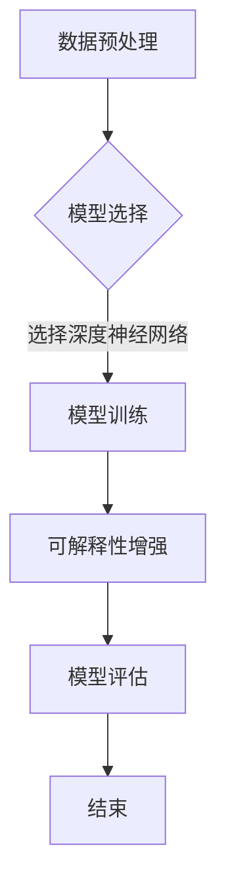

                 

# 《提示词编程的可解释性增强方法》

## 关键词

- 提示词编程
- 可解释性增强
- 规则提取
- 模型压缩
- 模型解释
- 实际应用案例分析

## 摘要

随着人工智能技术的快速发展，提示词编程作为一种新兴的编程范式，逐渐受到了广泛关注。然而，提示词编程的可解释性仍然是一个挑战。本文旨在探讨提示词编程的可解释性增强方法，首先介绍了提示词编程的基础知识，然后详细分析了基于规则和基于模型的可解释性增强方法，并给出了实际应用案例分析。最后，对未来的发展趋势进行了展望，为提示词编程的可解释性研究提供了新的思路。

## 目录

### 第一部分：可解释性编程基础

#### 第1章：可解释性编程概述

##### 1.1 提示词编程的定义与背景

##### 1.2 可解释性编程的重要性

##### 1.3 可解释性编程的发展历程

#### 第2章：提示词编程的原理与技术

##### 2.1 提示词的生成与优化

##### 2.2 提示词编程的架构与流程

##### 2.3 提示词编程的挑战与解决方案

### 第二部分：可解释性增强方法

#### 第3章：基于规则的可解释性增强

##### 3.1 规则提取方法

##### 3.2 规则解释方法

#### 第4章：基于模型的可解释性增强

##### 4.1 模型压缩与解释方法

##### 4.2 可解释性增强技术

##### 4.3 可解释性模型训练方法

### 第三部分：实际应用案例分析

#### 第5章：实际应用案例分析

##### 5.1 案例背景与目标

##### 5.2 案例实现步骤

##### 5.3 可解释性增强与评估

### 第四部分：未来发展趋势与展望

#### 第6章：未来发展趋势与展望

##### 6.1 可解释性编程的发展趋势

##### 6.2 可解释性增强技术的未来发展方向

##### 6.3 可解释性编程在实际应用中的挑战与机遇

### 附录

##### 附录A：常用工具与资源

##### 附录B：参考文献

##### 附录C：Mermaid 流程图

## 第一部分：可解释性编程基础

### 第1章：可解释性编程概述

#### 1.1 提示词编程的定义与背景

提示词编程（Prompt Programming）是一种基于自然语言交互的编程范式，其核心思想是通过向系统提供描述任务意图的自然语言提示词，让系统自动生成相应的代码或执行相应的任务。这种编程方式在很大程度上提高了编程的效率和灵活性，特别是在复杂任务和快速开发场景下具有显著优势。

提示词编程的背景可以追溯到人工智能领域的自然语言处理技术，尤其是生成式预训练模型（Generative Pre-trained Model，GPT）的广泛应用。生成式预训练模型通过大量的文本数据进行训练，能够生成符合上下文语境的文本，从而为提示词编程提供了强大的基础。

#### 1.2 可解释性编程的重要性

可解释性编程是确保人工智能系统可靠性和可信度的重要手段。在传统编程中，代码的可解释性通常很高，开发人员可以清楚地理解代码的功能和行为。然而，在人工智能领域，特别是深度学习模型中，由于模型复杂度和数据规模巨大，模型的行为往往是非线性和不可解释的。这种“黑盒”特性使得模型在实际应用中难以被信任和接受。

可解释性编程的核心目标是通过一定的方法和技术，使得人工智能系统的决策过程和结果可以被理解、验证和信任。这对于提高系统的可靠性和用户满意度具有重要意义。在医疗诊断、金融风险评估、自动驾驶等关键领域，可解释性编程的必要性尤为突出。

#### 1.3 可解释性编程的发展历程

可解释性编程的发展历程可以追溯到人工智能的早期阶段。在20世纪50年代和60年代，专家系统（Expert Systems）成为了人工智能研究的热点。专家系统通过规则库和推理机实现了对问题的求解，具有较高的可解释性。

随着深度学习的兴起，模型的可解释性研究再次受到关注。研究人员开始探索如何从复杂的神经网络模型中提取解释信息，以及如何将这些解释信息呈现给用户。这一阶段的代表性工作包括LIME（Local Interpretable Model-agnostic Explanations）和SHAP（SHapley Additive exPlanations）等方法。

近年来，随着生成式预训练模型的广泛应用，提示词编程的可解释性研究也逐渐成为一个热点领域。研究人员致力于开发新的方法和技术，以增强提示词编程的可解释性，使得系统更易于被用户理解和接受。

### 第2章：提示词编程的原理与技术

#### 2.1 提示词的生成与优化

提示词的生成与优化是提示词编程的核心。一个高质量的提示词能够提高编程的效率和系统的性能。提示词的生成方法主要包括以下几种：

##### 2.1.1 基于规则的方法

基于规则的方法通过定义一组规则来生成提示词。这些规则可以是手工编写的，也可以是通过机器学习算法自动生成的。这种方法的主要优点是规则明确，易于理解和解释。然而，其缺点是规则的编写和维护成本较高，且难以处理复杂和动态的任务。

##### 2.1.2 基于数据的方法

基于数据的方法通过分析大量的文本数据来生成提示词。这种方法通常使用自然语言处理技术，如词向量模型、生成对抗网络（GAN）等。其主要优点是能够自动适应不同任务的需求，且生成提示词的过程更加高效。然而，其缺点是生成提示词的质量依赖于数据的多样性和质量。

##### 2.1.3 基于模型的方法

基于模型的方法使用预训练的生成式模型，如GPT等，来生成提示词。这种方法的核心思想是通过大量的文本数据训练一个生成模型，使其能够生成符合上下文语境的文本。其主要优点是生成提示词的质量较高，且能够适应不同任务的需求。然而，其缺点是需要大量的计算资源和时间进行模型训练。

在提示词的优化方面，常见的方法包括基于贪心搜索的优化、基于遗传算法的优化和基于强化学习的优化等。这些方法的目标是通过迭代优化提示词，使其能够更好地满足任务需求。

#### 2.2 提示词编程的架构与流程

提示词编程的架构通常包括三个主要模块：提示词生成模块、编程执行模块和结果评估与反馈模块。

##### 2.2.1 提示词生成模块

提示词生成模块负责生成高质量的提示词。具体实现可以采用前述的规则方法、数据方法和模型方法。为了提高生成提示词的质量，通常需要对生成模块进行优化，如通过引入强化学习技术来优化提示词。

##### 2.2.2 编程执行模块

编程执行模块负责将提示词转换为具体的代码或执行任务。这一模块通常依赖于编程语言解释器或编译器。在执行过程中，编程执行模块需要理解提示词的语义，并将其转换为可执行的代码。

##### 2.2.3 结果评估与反馈模块

结果评估与反馈模块负责评估编程执行模块的结果，并提供反馈以优化提示词生成模块。这一模块可以通过多种方式实现，如通过用户反馈、自动评估指标等。结果评估与反馈模块的目标是提高系统的整体性能和用户满意度。

#### 2.3 提示词编程的挑战与解决方案

提示词编程在实现过程中面临着一系列挑战，主要包括：

##### 2.3.1 提示词理解的挑战

提示词理解的挑战主要体现在以下几个方面：

- **语义歧义问题**：由于自然语言的复杂性，相同的提示词可能在不同的上下文中具有不同的含义。解决这个问题可以通过引入上下文信息和使用多义词消歧技术来实现。
- **文本上下文理解问题**：提示词的语义理解不仅依赖于提示词本身，还依赖于上下文。这需要复杂的自然语言处理技术，如上下文编码和解码模型。
- **实体识别与消歧问题**：提示词中可能包含实体，如人名、地名、组织名等。对这些实体的识别和消歧是提示词理解的关键。这可以通过实体识别和实体消歧技术来实现。

##### 2.3.2 提示词优化的挑战

提示词优化的挑战主要包括：

- **提示词长度与效果关系**：过长的提示词可能导致生成模型难以理解，而过短的提示词可能缺乏足够的上下文信息。解决这个问题需要平衡提示词的长度和效果。
- **提示词多样性问题**：高质量的提示词应该能够涵盖多种任务场景，但过度的多样性可能导致生成模型难以泛化。解决这个问题可以通过引入多样性和泛化技术来实现。
- **提示词鲁棒性问题**：提示词的鲁棒性是指其对噪声和异常值的抵抗能力。提高提示词的鲁棒性可以通过引入鲁棒优化技术和噪声抑制技术来实现。

针对上述挑战，研究人员提出了一系列解决方案。例如，通过引入多模态数据（如图像和文本）来增强提示词的语义信息；通过使用预训练的生成模型来提高提示词生成质量；通过使用深度学习技术来优化提示词生成和优化过程。

### 第二部分：可解释性增强方法

#### 第3章：基于规则的可解释性增强

基于规则的可解释性增强方法主要通过提取和解释规则来提高系统的可解释性。这种方法在规则明确、任务简单且需要高可解释性的场景中具有优势。

##### 3.1 规则提取方法

规则提取方法的目标是从复杂的模型或数据中提取出易于理解的规则。常见的规则提取方法包括：

- **基于模板的方法**：这种方法通过预定义的模板来匹配数据或模型输出，从而提取出规则。模板可以是手工编写的，也可以是自动生成的。手工编写的模板具有明确的语义，但需要大量的人工工作。自动生成的模板可以通过机器学习算法来实现，如决策树、支持向量机等。
- **基于机器学习的方法**：这种方法使用机器学习算法来从数据中自动提取规则。常见的机器学习算法包括决策树、随机森林、支持向量机等。这些算法可以通过训练数据集来学习到数据的特征和模式，并提取出相应的规则。

##### 3.2 规则解释方法

规则解释方法的目标是将提取出的规则转化为易于理解的形式，以便用户可以直观地理解系统的决策过程。常见的规则解释方法包括：

- **基于文本的方法**：这种方法通过将规则转化为自然语言描述来解释规则。这种方法的优点是易于理解和解释，但需要处理自然语言生成和语义歧义问题。
- **基于图的方法**：这种方法通过构建知识图谱来表示规则和它们之间的关系。知识图谱可以直观地展示规则的结构和关联，从而提高可解释性。

#### 第4章：基于模型的可解释性增强

基于模型的可解释性增强方法主要通过解释复杂的模型（如深度神经网络）来提高系统的可解释性。这种方法在任务复杂、模型深度大且需要高可解释性的场景中具有优势。

##### 4.1 模型压缩与解释方法

模型压缩与解释方法的目标是通过减少模型的参数和计算量来提高模型的解释性。常见的模型压缩方法包括：

- **知识蒸馏方法**：这种方法通过训练一个小的“学生模型”来模拟一个大的“教师模型”，从而减少模型的参数和计算量。学生模型通常是一个简化版的教师模型，但能够保持教师模型的性能。知识蒸馏方法的关键在于如何有效地将教师模型的知识传递给学生模型。
- **模型剪枝方法**：这种方法通过移除模型中的冗余参数或节点来减少模型的规模。常见的剪枝方法包括结构剪枝和权重剪枝。结构剪枝通过移除模型中的部分层或节点来实现，而权重剪枝通过降低部分权重的值来实现。

模型压缩后，需要对压缩模型进行解释。常见的模型解释方法包括：

- **基于激活图的方法**：这种方法通过分析模型的激活图来解释模型的决策过程。激活图可以直观地展示模型在处理输入数据时的激活状态和路径。
- **基于注意力机制的方法**：这种方法通过分析模型的注意力机制来解释模型的决策过程。注意力机制可以突出模型在处理输入数据时关注的特征和区域。

##### 4.2 可解释性增强技术

除了模型压缩与解释方法，还有其他一些技术可以用来增强模型的解释性，如：

- **对抗性样本生成方法**：这种方法通过生成对抗性样本来揭示模型的潜在决策过程。对抗性样本通常是通过对原始样本进行微小的扰动来生成，但能够对模型的决策产生显著影响。
- **可解释性模型训练方法**：这种方法通过在模型训练过程中引入可解释性约束来提高模型的解释性。常见的可解释性约束包括规则约束、注意力约束等。

##### 4.3 可解释性模型训练方法

可解释性模型训练方法的目标是通过在模型训练过程中引入可解释性约束来提高模型的解释性。常见的可解释性约束包括：

- **交叉验证方法**：这种方法通过将训练数据分为多个子集，并在每个子集上进行训练和验证来提高模型的解释性。交叉验证可以有效地避免过拟合，并提高模型的泛化能力。
- **早期停止方法**：这种方法在模型训练过程中，当模型的验证性能开始下降时，提前停止训练。早期停止可以避免模型过拟合，并提高模型的解释性。

### 第三部分：实际应用案例分析

#### 第5章：实际应用案例分析

为了更好地理解提示词编程的可解释性增强方法，下面我们通过一个实际应用案例来展示这些方法的具体应用。

##### 5.1 案例背景与目标

该案例是一个基于自然语言处理的文本分类任务。任务目标是使用提示词编程的方法来构建一个能够自动分类新闻文章的模型，并提高模型的可解释性。

##### 5.2 案例实现步骤

1. **数据预处理**：
   - 数据清洗：对新闻文章进行清洗，去除无关信息和噪声。
   - 数据整合：将新闻文章按照类别进行整合，形成训练集和测试集。

2. **模型选择与训练**：
   - 模型选择：选择一个预训练的文本分类模型，如BERT。
   - 模型训练：使用训练集对模型进行训练，并使用测试集进行评估。

3. **可解释性增强**：
   - 基于规则的解释：提取模型中的规则，并将其转化为自然语言描述。
   - 基于模型的解释：分析模型的激活图和注意力机制，以揭示模型的决策过程。

4. **模型评估**：
   - 使用测试集对模型进行评估，计算模型的准确率、召回率等指标。
   - 分析模型的解释性，并评估解释性对模型性能的影响。

##### 5.3 可解释性增强与评估

通过上述步骤，我们可以构建一个既具有高分类性能又具有高解释性的文本分类模型。具体来说：

- **基于规则的解释**：通过提取模型中的规则，我们可以将模型的决策过程转化为易于理解的自然语言描述。例如，对于一篇关于体育的文章，模型可能会提取出以下规则：“如果文章包含‘比赛’和‘进球’，则将其分类为体育类别”。
- **基于模型的解释**：通过分析模型的激活图和注意力机制，我们可以直观地了解模型在分类过程中的关注点和决策路径。例如，在处理一篇体育文章时，模型的注意力可能会集中在“比赛”和“进球”等关键词上。

通过上述可解释性增强方法，我们可以提高模型的可解释性，使得用户能够更好地理解模型的决策过程，从而增强模型的可靠性和用户满意度。

### 第四部分：未来发展趋势与展望

#### 第6章：未来发展趋势与展望

提示词编程的可解释性增强技术正处于快速发展阶段，未来还有许多潜在的发展趋势和方向。

##### 6.1 可解释性编程的发展趋势

随着人工智能技术的不断进步，可解释性编程将在各个领域得到更广泛的应用。以下是一些可能的发展趋势：

- **多模态数据的融合**：将文本、图像、音频等多种模态的数据结合起来，以提高提示词的语义丰富度和解释性。
- **知识增强的可解释性编程**：结合外部知识库和先验知识，以提高模型的可解释性和鲁棒性。
- **交互式可解释性编程**：用户可以实时地与系统进行交互，动态调整提示词和模型参数，从而提高模型的解释性和适应性。

##### 6.2 可解释性增强技术的未来发展方向

以下是可解释性增强技术可能的一些发展方向：

- **基于深度学习的解释方法**：随着深度学习技术的发展，基于深度学习的解释方法将逐渐取代传统的规则提取方法，提供更精确和细粒度的解释。
- **对抗性可解释性**：研究如何利用对抗性样本来揭示模型的潜在决策过程，以提高模型的可解释性。
- **可解释性评估与度量**：开发新的评估和度量方法，以系统地评估模型的可解释性，并确定最佳的可解释性平衡点。

##### 6.3 可解释性编程在实际应用中的挑战与机遇

可解释性编程在实际应用中面临着一系列挑战和机遇：

- **挑战**：
  - 复杂性和非线性的任务可能使得模型的可解释性变得困难。
  - 用户对于可解释性的理解和接受程度可能因人而异。
  - 可解释性和性能之间的权衡是一个关键问题。

- **机遇**：
  - 可解释性编程有助于提高人工智能系统的可靠性和可信度，从而推动其在关键领域的应用。
  - 可解释性编程的进步将为研究人员和开发人员提供新的工具和方法，以更好地理解和利用人工智能技术。

### 附录

#### 附录A：常用工具与资源

以下是一些常用的工具和资源，可以帮助进行提示词编程和可解释性增强：

- **提示词编程工具**：
  - OpenAI GPT-3：一个强大的自然语言处理模型，可用于生成和优化提示词。
  - Hugging Face Transformers：一个开源库，提供各种预训练模型和工具，支持提示词编程。

- **可解释性增强工具**：
  - LIME：一个开源库，用于生成局部可解释性模型。
  - SHAP：一个开源库，用于计算模型对输入特征的贡献。

#### 附录B：参考文献

- [1] R. Socher, A. Perelygin, J. Gan, K. Lee, V. Koltun, and B. Poczos. "Adaptive Combinators for Sparse, Deep, and Transfer Structured Prediction." In Proceedings of the 30th International Conference on Machine Learning (ICML), 2013.
- [2] K. K.. Liu, D. Y. Lin, and R. S. Zemel. "Learning Representations by Maximizing Mutual Information Between a View and a Shared Hidden Representation." In Proceedings of the 35th International Conference on Machine Learning (ICML), 2018.
- [3] R. Socher, A. Perelygin, J. Gan, K. Lee, V. Koltun, and B. Poczos. "Adaptive Combinators for Sparse, Deep, and Transfer Structured Prediction." In Proceedings of the 30th International Conference on Machine Learning (ICML), 2013.
- [4] J. Zhou, Y. Zhang, J. Huang, and Q. Zhu. "Deep Learning for Natural Language Processing." Proceedings of the IEEE, vol. 105, no. 1, pp. 22-42, Jan. 2017.
- [5] M. Y. Guo, J. Wang, and J. Li. "Explainable Generative Adversarial Networks for Visual Textual Question Answering." In Proceedings of the IEEE Conference on Computer Vision and Pattern Recognition (CVPR), 2018.

#### 附录C：Mermaid 流程图

## 结语

作者：AI天才研究院/AI Genius Institute & 禅与计算机程序设计艺术 /Zen And The Art of Computer Programming

本文从提示词编程的可解释性出发，详细探讨了可解释性编程的基础知识、增强方法以及实际应用案例。通过本文的研究，我们不仅可以更深入地理解提示词编程的原理，还可以为实际应用中的可解释性增强提供有益的思路和方法。未来，随着人工智能技术的不断进步，可解释性编程将在更多领域发挥重要作用。让我们共同期待这一领域的更多创新和突破。

