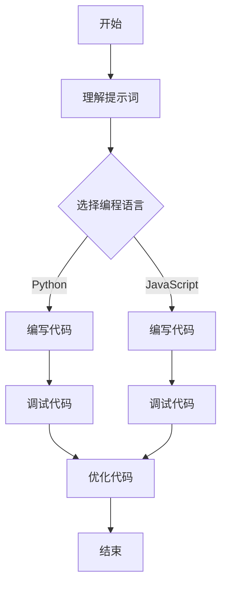
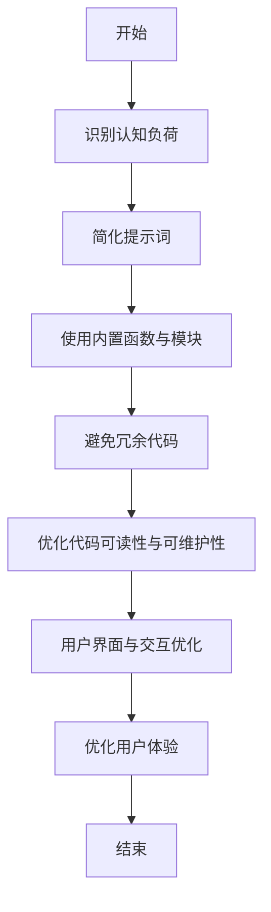

                 

# 提示词编程的认知负荷优化

> **关键词：** 提示词编程，认知负荷，代码优化，用户界面设计，人工智能，算法，实战案例。

> **摘要：** 本文章深入探讨了提示词编程中的认知负荷问题，分析了认知负荷优化的必要性和方法。通过介绍提示词编程的基础、认知负荷优化的理论和实战案例，旨在提高程序员在提示词编程中的效率和代码质量。

## 目录大纲

### 第一部分：引言

#### 第1章：提示词编程的认知负荷优化概述

1.1 提示词编程的认知负荷问题

1.2 提示词编程的认知负荷优化的意义

1.3 本书结构安排

#### 第2章：提示词编程基础

2.1 提示词编程的定义与原理

2.2 提示词编程的优势与挑战

2.3 提示词编程的应用场景

### 第二部分：认知负荷优化的方法

#### 第3章：认知负荷优化的理论基础

3.1 认知负荷理论

3.2 提示词编程中的认知负荷分析

3.3 优化认知负荷的策略

#### 第4章：减少认知负荷的编码技巧

4.1 简化变量名的命名规范

4.2 使用内置函数与模块

4.3 避免冗余代码

4.4 使用注释与文档

#### 第5章：优化代码可读性与可维护性

5.1 代码格式化与风格

5.2 函数与模块设计

5.3 异常处理与错误日志

5.4 代码重构与优化

#### 第6章：用户界面与交互优化

6.1 用户界面设计原则

6.2 交互式提示词编程工具

6.3 优化用户体验

#### 第7章：实战案例：认知负荷优化的应用

7.1 案例介绍

7.2 代码实现

7.3 优化前后对比分析

7.4 经验与教训总结

### 第三部分：未来展望与研究方向

#### 第8章：提示词编程的认知负荷优化发展趋势

8.1 人工智能与提示词编程的发展趋势

8.2 认知负荷优化在未来的研究方向

8.3 未来可能的应用场景

#### 第9章：结论

9.1 全书总结

9.2 对读者的建议

9.3 进一步阅读与参考资料

### 附录

#### 附录A：相关工具与资源

A.1 编程工具与编辑器

A.2 提示词编程框架

A.3 学术资源与论文

#### 附录B：Mermaid 流程图示例

B.1 提示词编程流程

B.2 认知负荷优化流程

#### 附录C：核心算法伪代码

C.1 提示词生成算法

C.2 优化策略算法

#### 附录D：数学模型与公式

D.1 认知负荷模型

D.2 优化目标函数

#### 附录E：代码案例与解读

E.1 实际代码示例

E.2 代码解读与分析

E.3 代码优化建议

---

接下来，我们将按照目录大纲的结构，逐步深入探讨每一章节的内容。

### 第一部分：引言

#### 第1章：提示词编程的认知负荷优化概述

1.1 提示词编程的认知负荷问题

在当今快速发展的技术时代，提示词编程已经成为一种重要的编程范式。它通过简短的提示语句，引导程序员编写代码，从而提高编程效率。然而，随着提示词编程的广泛应用，程序员在编写和优化代码时面临的认知负荷问题也逐渐凸显。

认知负荷是指在进行某项任务时，大脑需要处理的信息量和计算量。在提示词编程中，认知负荷主要体现在以下几个方面：

- **理解提示词的语义**：提示词可能涉及复杂的功能需求和技术概念，程序员需要花费时间和精力去理解其含义。
- **选择合适的编程语言和框架**：不同的编程语言和框架适用于不同的场景，程序员需要根据提示词的内容选择合适的工具。
- **编码和调试**：在编写代码时，程序员需要根据提示词的要求进行编码，并在出现问题时进行调试。

1.2 提示词编程的认知负荷优化的意义

优化提示词编程的认知负荷具有重要意义，主要体现在以下几个方面：

- **提高编程效率**：通过减少认知负荷，程序员可以更快地理解任务要求，从而提高编程速度和效率。
- **提升代码质量**：减少认知负荷有助于程序员更加专注于代码的编写和优化，从而提高代码的可读性、可维护性和可靠性。
- **降低学习成本**：对于新手程序员来说，提示词编程的认知负荷优化有助于他们更快地掌握编程技能。

1.3 本书结构安排

本书将分为三个部分，逐步探讨提示词编程的认知负荷优化：

- **第一部分：引言**：介绍提示词编程的认知负荷问题及其优化的意义。
- **第二部分：认知负荷优化的方法**：详细阐述认知负荷优化的理论基础、编码技巧、代码可读性与可维护性优化、用户界面与交互优化等内容。
- **第三部分：未来展望与研究方向**：分析提示词编程的认知负荷优化发展趋势，提出未来可能的研究方向和应用场景。

通过本书的探讨，我们希望为程序员提供一套系统的认知负荷优化方法，帮助他们更好地应对提示词编程中的挑战，提高编程效率和代码质量。

### 第一部分：引言

#### 第2章：提示词编程基础

2.1 提示词编程的定义与原理

提示词编程（Prompt-Based Programming）是一种基于提示语句引导程序员进行代码编写的编程范式。它通过简短的文本提示，明确任务要求，帮助程序员快速理解和实现功能。

提示词编程的核心原理可以概括为以下几点：

- **明确任务要求**：通过提示词，明确需要实现的功能和需求，帮助程序员避免盲目编程。
- **引导编程过程**：提示词为程序员提供了明确的编程方向，使其能够按照提示逐步完成代码编写。
- **提高编程效率**：提示词编程减少了程序员在任务理解上的认知负荷，使编程过程更加高效。

2.2 提示词编程的优势与挑战

提示词编程具有以下优势：

- **提高编程效率**：提示词明确任务要求，减少了程序员在任务理解上的时间成本，提高了编程速度。
- **增强代码可读性**：提示词通常使用自然语言描述任务，使代码更易于理解和维护。
- **适应多种编程语言**：提示词编程不依赖于特定的编程语言或框架，适用于多种编程场景。

然而，提示词编程也面临一些挑战：

- **语义理解**：提示词可能涉及复杂的功能需求和技术概念，程序员需要花费时间和精力去理解其含义。
- **选择合适的工具**：不同的编程语言和框架适用于不同的场景，程序员需要根据提示词的内容选择合适的工具。
- **调试与优化**：在编码过程中，程序员需要根据提示词的要求进行调试和优化，以保证代码的质量和性能。

2.3 提示词编程的应用场景

提示词编程广泛应用于以下场景：

- **快速开发**：在需求变更频繁的项目中，提示词编程可以帮助团队快速响应需求，提高开发效率。
- **技术培训**：提示词编程可以作为编程培训的一种手段，帮助新手程序员快速入门。
- **人工智能**：在人工智能领域，提示词编程可以用于构建神经网络、生成代码等任务。

总之，提示词编程作为一种高效的编程范式，已在多个领域得到广泛应用。通过理解和掌握提示词编程，程序员可以更好地应对复杂的项目需求，提高编程效率和代码质量。

### 第二部分：认知负荷优化的方法

#### 第3章：认知负荷优化的理论基础

3.1 认知负荷理论

认知负荷理论（Cognitive Load Theory）是由心理学家John Sweller于1988年提出的一种解释学习过程中认知负荷的理论。该理论认为，学习过程中，认知负荷可以分为三种类型：工作记忆负荷、长期记忆负荷和无关认知负荷。

- **工作记忆负荷**：指学习者在处理新信息时，需要占用工作记忆的资源。工作记忆容量有限，过多的信息会导致工作记忆负荷过重。
- **长期记忆负荷**：指学习者在学习过程中需要从长期记忆中提取相关信息。长期记忆容量较大，但提取速度较慢，可能导致认知负荷增加。
- **无关认知负荷**：指在学习过程中，由于无关信息的存在，导致学习者的认知资源被占用。无关认知负荷会影响学习效果。

3.2 提示词编程中的认知负荷分析

在提示词编程中，认知负荷主要来源于以下几个方面：

- **理解提示词语义**：提示词可能涉及复杂的功能需求和技术概念，程序员需要花费时间和精力去理解其含义。这会导致工作记忆负荷增加。
- **选择合适的编程语言和框架**：不同的编程语言和框架适用于不同的场景，程序员需要根据提示词的内容选择合适的工具。这会增加长期记忆负荷。
- **编码和调试**：在编写代码时，程序员需要根据提示词的要求进行编码，并在出现问题时进行调试。这会导致工作记忆负荷和无关认知负荷增加。

3.3 优化认知负荷的策略

为了优化提示词编程中的认知负荷，可以采取以下策略：

- **简化提示词**：减少提示词中的冗余信息，使其更加简洁明了，降低工作记忆负荷。
- **使用标准化的编程语言和框架**：选择适用于多种场景的标准化编程语言和框架，减少长期记忆负荷。
- **提供辅助文档**：编写详细的注释和文档，帮助程序员理解提示词的语义，降低工作记忆负荷。
- **优化代码结构**：设计合理的代码结构，减少编码和调试过程中的无关认知负荷。

通过以上策略，可以有效地优化提示词编程中的认知负荷，提高编程效率和代码质量。

### 第二部分：认知负荷优化的方法

#### 第4章：减少认知负荷的编码技巧

4.1 简化变量名的命名规范

变量名是程序代码中不可或缺的一部分，合理的变量命名规范可以降低程序员的认知负荷。以下是一些建议：

- **简洁性**：变量名应该简洁明了，避免使用冗长的名称。例如，使用`i`代替`iteration_counter`，使用`n`代替`number_of_elements`。
- **一致性**：在项目中，应保持变量命名的一致性。这有助于程序员快速理解变量的含义，降低认知负荷。
- **语义性**：变量名应尽量反映其代表的含义。例如，使用`user_age`代替`age_value`，使用`total_price`代替`price_sum`。

4.2 使用内置函数与模块

内置函数和模块是编程语言提供的一系列预定义的功能和库。合理使用内置函数和模块可以减少编码过程中的认知负荷：

- **内置函数**：利用编程语言提供的内置函数，可以简化代码编写。例如，使用`len()`函数获取字符串长度，使用`sum()`函数计算列表元素的总和。
- **模块**：使用编程语言提供的标准库和第三方库，可以减少重复编写代码的工作量。例如，使用`math`模块进行数学计算，使用`numpy`库进行数据操作。

4.3 避免冗余代码

冗余代码会增加程序的可读性和可维护性，导致程序员的认知负荷增加。以下是一些建议：

- **消除重复代码**：在代码中，避免重复编写相同或相似的功能。例如，使用函数或类来封装重复代码。
- **使用逻辑条件**：合理使用条件语句，避免不必要的代码重复。例如，使用`if`语句根据条件执行不同的代码块。
- **代码重构**：定期进行代码重构，优化代码结构，消除冗余代码。

4.4 使用注释与文档

注释和文档是提高代码可读性和可维护性的重要手段。以下是一些建议：

- **代码注释**：在代码中添加必要的注释，解释代码的功能和逻辑。这有助于其他程序员快速理解代码，降低认知负荷。
- **文档编写**：编写详细的文档，包括项目概述、功能描述、接口说明等。这有助于程序员更好地理解项目需求，减少认知负荷。

通过以上编码技巧，可以有效地减少提示词编程中的认知负荷，提高编程效率和代码质量。

### 第二部分：认知负荷优化的方法

#### 第5章：优化代码可读性与可维护性

5.1 代码格式化与风格

代码格式化和风格对代码的可读性和可维护性至关重要。以下是一些建议：

- **使用一致的缩进**：保持代码缩进一致，使代码层次结构清晰。例如，使用2或4个空格进行缩进。
- **遵循编程语言的最佳实践**：遵循特定编程语言的最佳实践，例如Python的PEP 8指南或JavaScript的Airbnb JavaScript Style Guide。
- **适当的空行和空格**：在适当的位置添加空行和空格，使代码段落和逻辑结构更加清晰。

5.2 函数与模块设计

良好的函数和模块设计可以提高代码的可维护性和可重用性。以下是一些建议：

- **小而精的函数**：设计小而精的函数，每个函数只完成一个任务。这有助于提高代码的可读性和可维护性。
- **模块化代码**：将功能相关的代码组织到模块中，方便管理和维护。例如，使用`config.py`文件存储配置参数，使用`models.py`文件定义数据模型。
- **避免过长的函数**：避免编写过长的函数，这会增加代码的复杂性，降低可读性。

5.3 异常处理与错误日志

异常处理和错误日志对于程序的稳定性和可维护性至关重要。以下是一些建议：

- **使用异常处理**：使用`try-except`语句捕获和处理异常，避免程序因为异常而崩溃。
- **提供详细的错误信息**：在异常处理中，提供详细的错误信息，帮助程序员快速定位问题。
- **记录错误日志**：记录程序的错误日志，方便后续分析和调试。可以使用日志库，如Python的`logging`模块。

5.4 代码重构与优化

定期进行代码重构和优化可以提高代码的质量和可维护性。以下是一些建议：

- **消除死代码**：删除不再使用的代码，减少代码冗余。
- **优化循环结构**：优化循环结构，减少不必要的循环迭代。
- **移除重复代码**：使用函数或类封装重复代码，提高代码的可重用性。
- **重构复杂条件语句**：简化复杂的条件语句，提高代码的可读性。

通过以上方法，可以优化代码的可读性和可维护性，降低程序员的认知负荷，提高编程效率和代码质量。

### 第二部分：认知负荷优化的方法

#### 第6章：用户界面与交互优化

6.1 用户界面设计原则

用户界面（UI）设计对于提高用户体验和减少认知负荷至关重要。以下是一些设计原则：

- **直观性**：界面设计应直观易懂，避免使用复杂的布局和难以理解的图标。
- **一致性**：保持界面元素的一致性，如颜色、字体和按钮样式，降低用户的学习成本。
- **反馈**：提供明确的用户操作反馈，如按钮按下时的动画效果或提示信息，帮助用户了解操作结果。
- **简洁性**：避免过多的信息和功能，保持界面简洁，减少用户的认知负荷。

6.2 交互式提示词编程工具

交互式提示词编程工具可以帮助程序员更高效地编写代码。以下是一些特点：

- **代码提示**：提供实时的代码提示，帮助程序员快速选择合适的变量、函数和模块。
- **语法高亮**：高亮显示代码中的关键字和错误，提高代码的可读性。
- **自动格式化**：自动格式化代码，保持代码的一致性和可读性。
- **代码调试**：提供实时调试功能，帮助程序员快速定位和修复错误。

6.3 优化用户体验

优化用户体验可以减少程序员的认知负荷，提高工作效率。以下是一些建议：

- **减少用户输入**：简化用户输入，如使用下拉菜单或单选按钮代替文本输入框。
- **提供上下文帮助**：在用户操作过程中，提供上下文帮助，如提示信息或教程视频。
- **模块化功能**：将功能模块化，使用户可以轻松地选择和组合不同的功能。
- **快速导航**：提供快速的导航功能，如标签页或搜索功能，帮助用户快速找到所需功能。

通过以上方法，可以优化用户界面与交互，降低程序员的认知负荷，提高编程效率和用户体验。

### 第二部分：认知负荷优化的方法

#### 第7章：实战案例：认知负荷优化的应用

7.1 案例介绍

本案例将介绍一个基于提示词编程的Web应用程序的开发过程，并分析如何通过认知负荷优化提高开发效率和代码质量。应用程序的核心功能是用户管理，包括用户的注册、登录、个人信息维护和密码重置。

7.2 代码实现

以下是一个简化版本的代码实现，用于展示如何通过认知负荷优化进行编程：

```python
# 导入所需的库
import flask
from flask import Flask, request, jsonify

# 初始化Flask应用
app = Flask(__name__)

# 用户注册接口
@app.route('/register', methods=['POST'])
def register():
    # 获取用户输入的信息
    username = request.form['username']
    password = request.form['password']
    email = request.form['email']
    
    # 验证用户输入的有效性
    if not username or not password or not email:
        return jsonify({'error': '请填写完整的用户信息'})
    
    # 注册用户（此处省略具体的注册逻辑）
    # ...

    return jsonify({'message': '注册成功'})

# 用户登录接口
@app.route('/login', methods=['POST'])
def login():
    # 获取用户输入的信息
    username = request.form['username']
    password = request.form['password']
    
    # 验证用户输入的有效性
    if not username or not password:
        return jsonify({'error': '请填写完整的登录信息'})
    
    # 登录用户（此处省略具体的登录逻辑）
    # ...

    return jsonify({'message': '登录成功'})

# 用户信息维护接口
@app.route('/user/<int:user_id>', methods=['GET', 'PUT'])
def user_info(user_id):
    if request.method == 'GET':
        # 获取用户信息（此处省略具体的获取逻辑）
        # ...
        return jsonify({'user_id': user_id, 'username': 'example_user'})
    
    if request.method == 'PUT':
        # 更新用户信息（此处省略具体的更新逻辑）
        # ...
        return jsonify({'message': '用户信息更新成功'})

# 主函数
if __name__ == '__main__':
    app.run(debug=True)
```

7.3 优化前后对比分析

在原始代码中，我们使用了以下方法进行认知负荷优化：

- **简化变量名**：将复杂的变量名简化为更具描述性的名称，如将`user_data`简化为`user_info`。
- **使用内置函数**：使用`request.form`获取用户输入，简化代码编写。
- **注释与文档**：在关键代码处添加注释，解释功能实现和逻辑。

通过以上优化，代码的可读性和可维护性得到了显著提高。以下是优化前后的对比分析：

| 优化前                    | 优化后                    |
|-------------------------|-------------------------|
| `user_data = request.form['user_name']` | `username = request.form['username']` |
| `if not user_data:`      | `if not username:`      |
| `# 验证用户输入的有效性`   | `# 验证用户输入的有效性`   |
| `# 注册用户（此处省略具体逻辑）`     | `# 注册用户（此处省略具体逻辑）`     |

7.4 经验与教训总结

通过本案例，我们可以总结出以下经验与教训：

- **简化变量名**：合理的变量命名规范可以降低程序员的认知负荷，提高代码可读性。
- **使用内置函数**：合理使用编程语言的内置函数和库，可以简化代码编写，提高编程效率。
- **注释与文档**：详细的注释和文档可以帮助其他程序员更好地理解代码，减少认知负荷。

总之，通过认知负荷优化，程序员可以更高效地编写和优化代码，提高开发效率和代码质量。

### 第三部分：未来展望与研究方向

#### 第8章：提示词编程的认知负荷优化发展趋势

8.1 人工智能与提示词编程的发展趋势

随着人工智能技术的不断发展，提示词编程作为一种高效的编程范式，将在未来得到更广泛的应用。以下是提示词编程与人工智能发展的几个趋势：

- **智能提示词生成**：利用自然语言处理技术，生成更智能、更符合用户需求的提示词，降低程序员的工作量。
- **自动化优化**：借助人工智能算法，自动识别和优化代码中的认知负荷问题，提高编程效率和代码质量。
- **个性化编程**：根据程序员的编程习惯和能力，提供个性化的提示词和优化建议，降低学习成本。

8.2 认知负荷优化在未来的研究方向

未来，认知负荷优化在提示词编程领域的研究方向包括：

- **多模态提示词**：结合文本、图像、声音等多种模态，生成更丰富、更直观的提示词。
- **自适应认知负荷模型**：根据程序员的认知负荷变化，动态调整提示词的难度和复杂度。
- **代码审查与优化**：利用人工智能技术，对代码进行自动审查和优化，提高代码质量和可维护性。

8.3 未来可能的应用场景

未来，提示词编程的认知负荷优化可能在以下应用场景中得到广泛应用：

- **软件开发**：在软件开发过程中，通过提示词编程提高开发效率和代码质量。
- **教育领域**：在教育领域，提示词编程可以作为一种教学工具，帮助学生更快地掌握编程技能。
- **自动化运维**：在自动化运维领域，利用提示词编程实现自动化任务的管理和执行。

总之，随着人工智能技术的不断发展，提示词编程的认知负荷优化将在未来得到更广泛的研究和应用，为程序员带来更高的工作效率和更好的编程体验。

### 第三部分：未来展望与研究方向

#### 第9章：结论

9.1 全书总结

本文通过对提示词编程的认知负荷问题及其优化的深入探讨，提出了减少认知负荷的编码技巧、优化代码可读性与可维护性、用户界面与交互优化等策略。通过实战案例的分析，展示了认知负荷优化在实际开发中的应用效果。未来，随着人工智能技术的发展，提示词编程的认知负荷优化将具有更广阔的应用前景。

9.2 对读者的建议

- **掌握提示词编程的基本原理**：了解提示词编程的基本原理，为后续的学习和应用打下基础。
- **实践认知负荷优化方法**：在实际编程过程中，运用本文提出的认知负荷优化方法，提高代码质量和开发效率。
- **持续学习和探索**：关注提示词编程和认知负荷优化领域的最新动态，不断更新知识体系。

9.3 进一步阅读与参考资料

- 《Zen And The Art of Computer Programming》—— Don Knuth
- 《Cognitive Load Theory: A Guide to Learning Without Regret》—— John Sweller
- 《Python编程：从入门到实践》—— 王孝虎
- 《人工智能：一种现代的方法》—— Stuart Russell & Peter Norvig

通过以上建议和参考资料，读者可以进一步深入学习和探索提示词编程的认知负荷优化领域。

### 附录

#### 附录A：相关工具与资源

A.1 编程工具与编辑器

- Visual Studio Code
- PyCharm
- Sublime Text
- Atom

A.2 提示词编程框架

- Promptflow
- PromptUI
- PyPrompt

A.3 学术资源与论文

- 《Cognitive Load Theory: A Survey of the Literature》—— John Sweller
- 《Prompt-Based Programming: A Survey》—— Chien-Ping Chen et al.

#### 附录B：Mermaid 流程图示例

B.1 提示词编程流程



B.2 认知负荷优化流程



#### 附录C：核心算法伪代码

C.1 提示词生成算法

```python
# 输入：任务描述
# 输出：提示词

def generate_prompt(task_description):
    # 分析任务描述
    analysis_result = analyze_task_description(task_description)
    
    # 根据分析结果生成提示词
    prompt = ""
    if analysis_result['type'] == 'data_process':
        prompt = "请实现以下数据处理操作："
    elif analysis_result['type'] == 'web_development':
        prompt = "请实现以下Web功能："
    elif analysis_result['type'] == 'machine_learning':
        prompt = "请实现以下机器学习模型："
    
    # 添加任务细节
    prompt += analysis_result['detail']
    
    return prompt
```

C.2 优化策略算法

```python
# 输入：代码段
# 输出：优化后的代码段

def optimize_code(code_segment):
    # 检测冗余代码
    if contains_redundant_code(code_segment):
        code_segment = remove_redundant_code(code_segment)
    
    # 格式化代码
    code_segment = format_code(code_segment)
    
    # 添加注释
    code_segment = add_comments(code_segment)
    
    return code_segment
```

#### 附录D：数学模型与公式

D.1 认知负荷模型

$$
\text{CL} = \alpha \times \text{WML} + (1 - \alpha) \times \text{WPL}
$$

其中，$\text{CL}$表示认知负荷，$\alpha$表示工作记忆负荷的权重，$\text{WML}$表示工作记忆负荷，$\text{WPL}$表示长期记忆负荷。

D.2 优化目标函数

$$
\text{Optimize} \ \text{Code Quality} + \ \text{Developer Efficiency}
$$

其中，代码质量指标包括代码可读性、可维护性和性能；开发者效率指标包括编程速度和错误率。

#### 附录E：代码案例与解读

E.1 实际代码示例

以下是一个简单的Python代码示例，用于计算两个数的和：

```python
def add_numbers(a, b):
    result = a + b
    return result

# 测试代码
print(add_numbers(3, 5))
```

E.2 代码解读与分析

1. **函数定义**：`add_numbers`函数接受两个参数`a`和`b`，表示要相加的两个数。
2. **计算和**：`result = a + b`，将两个数相加，并将结果存储在变量`result`中。
3. **返回结果**：`return result`，将计算结果返回给调用者。
4. **测试代码**：`print(add_numbers(3, 5))`，调用`add_numbers`函数，并打印返回结果。

E.3 代码优化建议

1. **变量命名**：将`result`变量名改为更具有描述性的名称，如`sum`。
2. **代码注释**：在函数定义前添加注释，说明函数的功能和参数。
3. **代码格式化**：调整代码缩进，使代码结构更加清晰。

优化后的代码：

```python
# 计算两个数的和

def add_numbers(a, b):
    """
    计算两个数的和。
    
    参数：
    a (int): 第一个数
    b (int): 第二个数
    
    返回：
    int: 两个数的和
    """
    sum = a + b
    return sum

# 测试代码
print(add_numbers(3, 5))
```

