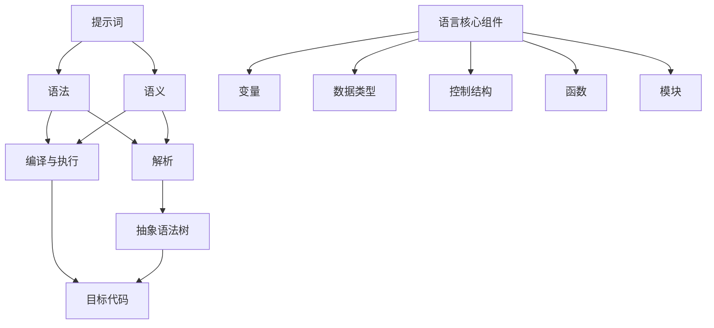

                 

### 提示词编程语言设计艺术

> **关键词**：提示词编程语言、语言设计、语法分析、语义分析、编译执行、算法优化、项目实战

> **摘要**：
本文旨在深入探讨提示词编程语言的设计艺术。首先，我们将介绍提示词编程语言的基本概念、发展历程和分类。随后，我们将详细阐述语言设计原则、流程以及所需工具和技术。接下来，我们将探讨提示词解析与处理、语言核心组件设计、编译与执行机制，以及算法原理与数学模型。最后，通过两个实战项目展示实际设计过程，并总结提示词编程语言设计的要点、经验与未来研究方向。

### 目录大纲

1. **《提示词编程语言设计艺术》**
2. **关键词与摘要**
3. **第一部分：语言设计基础**
   1. **1.1 提示词编程语言概述**
      1. **1.1.1 提示词编程语言的基本概念**
      2. **1.1.2 提示词编程语言的发展历程**
      3. **1.1.3 提示词编程语言的分类**
   2. **1.2 语言设计原则与流程**
      1. **1.2.1 语言设计原则**
      2. **1.2.2 语言设计流程**
      3. **1.2.3 语言设计工具与技术**
3. **第二部分：核心概念与架构**
   1. **2.1 提示词解析与处理**
      1. **2.1.1 提示词解析原理**
      2. **2.1.2 提示词处理算法**
      3. **2.1.3 提示词优化策略**
   2. **2.2 语言核心组件设计**
      1. **2.2.1 变量与数据类型**
      2. **2.2.2 控制结构**
      3. **2.2.3 函数与模块化设计**
   3. **2.3 编译与执行机制**
      1. **2.3.1 编译原理**
      2. **2.3.2 执行机制**
      3. **2.3.3 性能优化策略**
3. **第三部分：算法原理与数学模型**
   1. **3.1 提示词匹配算法**
      1. **3.1.1 匹配算法概述**
      2. **3.1.2 伪代码实现**
      3. **3.1.3 数学模型分析**
   2. **3.2 提示词权重计算**
      1. **3.2.1 提示词权重定义**
      2. **3.2.2 权重计算算法**
      3. **3.2.3 数学模型与公式**
   3. **3.3 提示词生成算法**
      1. **3.3.1 生成算法概述**
      2. **3.3.2 伪代码实现**
      3. **3.3.3 数学模型与公式**
3. **第四部分：项目实战与案例分析**
   1. **4.1 实战项目一：简单提示词编程语言设计**
      1. **4.1.1 项目背景**
      2. **4.1.2 开发环境搭建**
      3. **4.1.3 源代码实现与解读**
      4. **4.1.4 代码分析与优化**
   2. **4.2 实战项目二：复杂提示词编程语言设计**
      1. **4.2.1 项目背景**
      2. **4.2.2 开发环境搭建**
      3. **4.2.3 源代码实现与解读**
      4. **4.2.4 代码分析与优化**
3. **第五部分：未来趋势与挑战**
   1. **5.1 提示词编程语言的未来发展趋势**
   2. **5.2 提示词编程语言设计艺术总结**
4. **附录**
   1. **附录A：常用工具与资源**
   2. **附录B：提示词编程语言相关论文与书籍推荐**
   3. **附录C：提示词编程语言实验报告模板**

### 第一部分：语言设计基础

#### 1.1 提示词编程语言概述

##### 1.1.1 提示词编程语言的基本概念

提示词编程语言是一种特殊的编程语言，其核心特征是使用提示词作为编程的基本元素。提示词通常是指用于引导程序执行的关键词或指令。在提示词编程语言中，程序由一系列提示词组成，这些提示词通过特定的语法规则组合，以描述程序的逻辑和行为。

提示词编程语言的主要特点如下：

1. **提示词导向**：程序的核心是通过提示词来组织的，提示词之间通过特定的语法规则相互关联，形成程序的逻辑结构。
2. **简单易学**：由于提示词通常具有直观的语义，提示词编程语言往往比传统的命令式编程语言更易于学习和使用。
3. **高效性**：提示词编程语言的设计通常注重性能优化，通过提示词的解析和处理，能够实现高效的程序执行。

##### 1.1.2 提示词编程语言的发展历程

提示词编程语言的发展可以追溯到早期的计算机编程历史。在早期的编程语言中，如汇编语言和早期的高级语言，程序的基本元素通常是操作符和操作数。然而，随着计算机科学的发展，编程语言的设计开始注重提示词的重要性。

1. **早期阶段**：早期的提示词编程语言可以追溯到20世纪50年代末和60年代初，如Lisp语言。Lisp语言采用符号表达式作为编程的基本元素，这种语言设计理念对后来的提示词编程语言产生了深远的影响。
2. **发展阶段**：随着逻辑编程和函数式编程的发展，提示词编程语言得到了进一步的发展。Prolog和Datalog等语言的出现，标志着提示词编程语言进入了一个新的发展阶段。这些语言以逻辑公式和函数定义作为提示词，提供了强大的数据处理和推理能力。
3. **成熟阶段**：现代的提示词编程语言如Scala和Kotlin，它们结合了命令式编程和函数式编程的特点，提供了一种更加灵活和高效的编程范式。

##### 1.1.3 提示词编程语言的分类

提示词编程语言可以根据其设计和应用特点进行分类。以下是一些常见的提示词编程语言分类：

1. **逻辑编程语言**：逻辑编程语言以逻辑公式作为提示词，如Prolog和Datalog。这些语言适用于问题求解、自动推理和数据查询等应用领域。
2. **函数式编程语言**：函数式编程语言以函数作为提示词，如Haskell和Clojure。这些语言强调函数的组合和不可变性，适用于数据转换和程序设计。
3. **命令式编程语言**：虽然传统的命令式编程语言如C和Java不是专门的提示词编程语言，但它们也包含提示词的概念。这些语言适用于通用编程任务，如系统编程和嵌入式开发。

##### 1.2 语言设计原则与流程

##### 1.2.1 语言设计原则

设计一个高效的提示词编程语言需要遵循一系列原则，这些原则确保语言的清晰性、可扩展性、高效性和易用性。

1. **清晰性**：语言的语法和语义应该清晰明了，避免模糊或歧义。清晰性是设计良好语言的首要原则，它降低了学习成本，提高了代码的可维护性。
2. **可扩展性**：语言应该能够适应未来的扩展和变化，支持模块化设计。可扩展性允许开发者添加新特性或修改现有语法，而不影响语言的稳定性。
3. **高效性**：语言应该能够在合理的时间内执行程序，减少编译和执行的开销。高效性是评估编程语言性能的关键因素，它直接影响到开发效率和程序性能。
4. **易用性**：语言应该易于学习和使用，减少学习成本和维护成本。易用性是吸引开发者使用语言的重要因素，它决定了语言的普及程度。

##### 1.2.2 语言设计流程

设计一个提示词编程语言通常需要经历以下步骤：

1. **需求分析**：确定编程语言的目标和应用领域。需求分析是设计过程中的第一步，它明确了语言的设计方向和目标用户群体。
2. **语法设计**：定义语言的语法规则，包括提示词、符号和数据类型。语法设计是语言设计的关键环节，它决定了程序的结构和表达方式。
3. **语义设计**：确定语言的语义规则，包括提示词的解析和处理方式。语义设计是语言设计的重要部分，它确保了程序的正确性和一致性。
4. **编译器/解释器设计**：实现语言的编译或解释机制。编译器/解释器是语言实现的核心组件，它将源代码转换为可执行代码。
5. **测试与优化**：测试语言的功能和性能，进行必要的优化。测试与优化是语言设计过程中的重要环节，它确保了语言的可靠性和性能。

##### 1.2.3 语言设计工具与技术

设计提示词编程语言需要使用一系列工具和技术，这些工具和技术有助于实现语言的语法、语义和编译执行机制。

1. **语法分析工具**：如ANTLR、Bison等，用于生成语言的解析器。语法分析工具可以帮助开发者快速构建语言的语法解析功能。
2. **静态分析工具**：如LLVM、GCC等，用于编译语言代码。静态分析工具可以对源代码进行静态分析，提高程序的执行效率。
3. **动态分析工具**：如Valgrind、GDB等，用于调试语言程序。动态分析工具可以帮助开发者发现和解决程序中的问题。
4. **代码生成工具**：如 LLVM、CG等，用于生成高效的可执行代码。代码生成工具可以将高级语言代码转换为机器代码，提高程序的执行速度。

#### 1.1 提示词编程语言概述

##### 1.1.1 提示词编程语言的基本概念

提示词编程语言是一种以提示词作为编程基本单位的编程语言。提示词（Keywords）是指那些具有特定意义的单词，用于指示程序执行的操作或过程。与传统的编程语言相比，提示词编程语言更加简洁，易于理解和学习。在提示词编程语言中，程序是由一系列有序的提示词组成的，这些提示词通过特定的语法规则相互连接，以描述程序的逻辑和行为。

提示词编程语言具有以下几个基本概念：

- **提示词**：提示词是编程语言的核心组成部分，用于定义程序的行为。提示词通常具有固定的语法形式，并且具有明确的语义。
- **语法规则**：语法规则定义了提示词的顺序和组合方式，以形成有效的程序代码。不同的提示词编程语言具有不同的语法规则，这些规则决定了程序的语法结构。
- **程序结构**：程序结构是指程序中各个提示词之间的关系和组织方式。一个有效的程序应该具有清晰的程序结构，以便于阅读和理解。
- **语义分析**：语义分析是编程语言处理过程中的一步，用于检查程序的语法和语义的正确性。语义分析可以确保程序按照预期的行为执行。

##### 1.1.2 提示词编程语言的发展历程

提示词编程语言的发展历程可以追溯到20世纪50年代末和60年代初。最早的提示词编程语言之一是Lisp，由约翰·麦卡锡（John McCarthy）于1958年提出。Lisp语言以其灵活的语法和强大的函数处理能力而闻名，成为了函数式编程的开端。

在Lisp之后，逻辑编程语言如Prolog（由皮埃尔·德雷菲斯（Pierre Deléglise）和阿尔贝特·帕斯卡（Albert Pascal）于1972年开发）和Datalog（由约翰·马库斯·斯威尼（John M. Sweeney）和亨利·劳伦斯·斯通（Henry Lawrence Stone）于1979年开发）也相继出现。这些语言以逻辑公式和规则为基础，提供了强大的数据查询和推理功能。

进入21世纪，随着函数式编程和逻辑编程的复兴，一些新的提示词编程语言也相继诞生。例如，Haskell和Scala等语言结合了函数式编程和面向对象编程的特点，提供了强大的编程能力。

##### 1.1.3 提示词编程语言的分类

提示词编程语言可以根据其设计理念和应用场景进行分类。以下是一些常见的分类方式：

1. **逻辑编程语言**：逻辑编程语言以逻辑公式和规则为基础，用于表示和执行逻辑推理。代表语言包括Prolog和Datalog。
   - **Prolog**：Prolog是一种广泛使用的逻辑编程语言，以其灵活的变量绑定和模式匹配能力而闻名。
   - **Datalog**：Datalog是一种基于逻辑编程语言，主要用于数据分析和信息检索。

2. **函数式编程语言**：函数式编程语言以函数作为基本单位，强调不可变数据和函数的组合。代表语言包括Haskell和Clojure。
   - **Haskell**：Haskell是一种纯函数式编程语言，以其强类型系统和惰性求值而著称。
   - **Clojure**：Clojure是一种现代函数式编程语言，运行在Java虚拟机上，提供了简洁的语法和强大的并发编程能力。

3. **命令式编程语言**：尽管命令式编程语言如C和Java不是专门的提示词编程语言，但它们也包含提示词的概念。这些语言适用于通用编程任务。
   - **C**：C语言是一种广泛使用的系统编程语言，以其强大的底层控制和性能优化能力而著名。
   - **Java**：Java是一种面向对象的编程语言，以其跨平台能力和丰富的库支持而受到广泛使用。

##### 1.2 语言设计原则与流程

##### 1.2.1 语言设计原则

设计一个高效的提示词编程语言需要遵循一系列原则，这些原则确保语言的清晰性、可扩展性、高效性和易用性。

1. **清晰性**：语言的语法和语义应该清晰明了，避免模糊或歧义。清晰性是设计良好语言的首要原则，它降低了学习成本，提高了代码的可维护性。
   - **语法简洁**：设计简洁的语法规则，避免复杂和冗长的表达式。
   - **语义明确**：确保每个提示词和语法结构的语义定义明确，易于理解。

2. **可扩展性**：语言应该能够适应未来的扩展和变化，支持模块化设计。可扩展性允许开发者添加新特性或修改现有语法，而不影响语言的稳定性。
   - **模块化**：支持模块化设计，使得代码可以方便地拆分和组合。
   - **兼容性**：确保新特性与现有代码的兼容性，避免不必要的中断和迁移成本。

3. **高效性**：语言应该能够在合理的时间内执行程序，减少编译和执行的开销。高效性是评估编程语言性能的关键因素，它直接影响到开发效率和程序性能。
   - **编译优化**：实现高效的编译器，进行代码优化，提高执行效率。
   - **执行效率**：设计优化的执行机制，减少不必要的开销，如内存分配和垃圾回收。

4. **易用性**：语言应该易于学习和使用，减少学习成本和维护成本。易用性是吸引开发者使用语言的重要因素，它决定了语言的普及程度。
   - **文档和教程**：提供丰富的文档和教程，帮助开发者快速上手。
   - **错误处理**：设计良好的错误处理机制，提供清晰的错误信息和解决方案。

##### 1.2.2 语言设计流程

设计一个提示词编程语言通常需要经历以下步骤：

1. **需求分析**：确定编程语言的目标和应用领域。需求分析是设计过程中的第一步，它明确了语言的设计方向和目标用户群体。
   - **目标应用领域**：确定语言的主要应用领域，如科学计算、数据分析和嵌入式系统等。
   - **目标用户群体**：明确目标用户群体的需求，如初学者、专业开发人员等。

2. **语法设计**：定义语言的语法规则，包括提示词、符号和数据类型。语法设计是语言设计的关键环节，它决定了程序的结构和表达方式。
   - **提示词选择**：选择具有明确语义的提示词，确保提示词的表达力和简洁性。
   - **语法规则**：定义提示词之间的组合规则，确保语法结构的清晰和一致性。

3. **语义设计**：确定语言的语义规则，包括提示词的解析和处理方式。语义设计是语言设计的重要部分，它确保了程序的正确性和一致性。
   - **提示词解析**：定义提示词的解析算法，确保提示词的正确解释。
   - **语义一致性**：确保语义规则的一致性和完整性，避免语义冲突和歧义。

4. **编译器/解释器设计**：实现语言的编译或解释机制。编译器/解释器是语言实现的核心组件，它将源代码转换为可执行代码。
   - **编译器设计**：设计编译器，将源代码转换为中间代码或目标代码。
   - **解释器设计**：设计解释器，直接执行源代码或中间代码。

5. **测试与优化**：测试语言的功能和性能，进行必要的优化。测试与优化是语言设计过程中的重要环节，它确保了语言的可靠性和性能。
   - **功能测试**：编写测试用例，验证语言的功能是否符合预期。
   - **性能测试**：评估语言的执行效率和性能，进行优化和改进。

#### 2.1 提示词解析与处理

##### 2.1.1 提示词解析原理

提示词解析是提示词编程语言实现过程中至关重要的一步。它将输入的提示词序列转换为抽象语法树（AST），从而为后续的语义分析和代码生成提供基础。提示词解析过程主要包括词法分析、语法分析和语义分析三个阶段。

1. **词法分析**：词法分析是将输入的字符序列分解为一系列词法符号。词法分析器的输入是源代码的字符流，输出是词法符号流。词法分析器的主要任务包括：
   - **标识符和关键字识别**：识别变量名、函数名和关键字等标识符。
   - **数字和字符串识别**：识别整数、浮点数和字符串等数据类型。
   - **符号和分隔符识别**：识别运算符、分隔符和其他符号。

2. **语法分析**：语法分析是将词法符号序列转换为抽象语法树。语法分析器的输入是词法符号流，输出是抽象语法树。语法分析的主要任务包括：
   - **语法树构建**：根据语法规则，将词法符号序列转换为语法树。
   - **语法错误处理**：识别和报告语法错误，并提供错误位置和错误类型。

3. **语义分析**：语义分析是检查语法树的语义正确性。语义分析器的输入是抽象语法树，输出是语义检查结果。语义分析的主要任务包括：
   - **类型检查**：确保变量和表达式的类型一致性。
   - **作用域分析**：检查变量和函数的作用域，确保访问权限的正确性。
   - **语义错误处理**：识别和报告语义错误，并提供错误位置和错误类型。

##### 2.1.2 提示词处理算法

提示词处理算法是指在提示词编程语言中，对提示词进行解析、处理和优化的方法。以下是一些常见的提示词处理算法：

1. **解析算法**：解析算法用于将输入的提示词序列转换为抽象语法树。以下是一些常用的解析算法：

   - **递归下降法**：递归下降法是一种自顶向下语法分析方法。它通过定义一组递归的解析函数，逐步构建抽象语法树。
     ```python
     def parse_expression():
         if current_token is '+':
             consume('+')
             parse_term()
             return Node('+', [parse_expression(), parse_term()])
         else:
             return parse_term()

     def parse_term():
         if current_token is '*':
             consume('*')
             parse_factor()
             return Node('*', [parse_term(), parse_factor()])
         else:
             return parse_factor()
     ```

   - **LL(k)分析法**：LL(k)分析法是一种自顶向下语法分析方法。它通过构建有限自动机，实现语法分析。
     ```python
     def llk分析法():
         finite_automaton = build_finite_automaton()
         current_state = initial_state
         current_token = get_next_token()
         
         while current_token is not EOF:
             transition = finite_automaton.transition(current_state, current_token)
             if transition is None:
                 report_syntax_error()
                 break
             apply_action(transition.action)
             current_state = transition.next_state
             current_token = get_next_token()
     ```

2. **语义分析算法**：语义分析算法用于检查抽象语法树的语义正确性。以下是一些常用的语义分析算法：

   - **类型检查**：类型检查是确保变量和表达式的类型一致性。以下是一个简单的类型检查算法：
     ```python
     def type_check(node):
         if node.type is 'int':
             return 'int'
         elif node.type is 'float':
             return 'float'
         elif node.type is 'string':
             return 'string'
         else:
             report_type_error()
     ```

   - **作用域分析**：作用域分析是检查变量和函数的作用域，确保访问权限的正确性。以下是一个简单的作用域分析算法：
     ```python
     def scope_analysis(node):
         if node.is_function_definition():
             function_scope = create_new_scope()
             function_scope.add_variable(node.name, node.type)
             for statement in node.statements:
                 scope_analysis(statement)
             return function_scope
         else:
             return current_scope
     ```

3. **优化算法**：优化算法用于提高程序的执行效率。以下是一些常见的优化算法：

   - **常量折叠**：常量折叠是将表达式中的常量部分提前计算，以提高执行效率。以下是一个简单的常量折叠算法：
     ```python
     def constant_folding(node):
         if node is ConstantExpression():
             return node.value
         else:
             left = constant_folding(node.left)
             right = constant_folding(node.right)
             return node operate left, right
     ```

   - **循环展开**：循环展开是将循环体内的代码展开，以减少循环的执行次数。以下是一个简单的循环展开算法：
     ```python
     def loop_unrolling(node):
         if node.is_loop():
             unrolled_loop = create_new_loop()
             for i in range(node.iterations):
                 unrolled_loop.add_statement(node.body)
             return unrolled_loop
         else:
             return node
     ```

##### 2.1.3 提示词优化策略

提示词优化策略是指通过优化提示词的解析和处理，提高程序的执行效率和可读性。以下是一些常见的提示词优化策略：

1. **词法优化**：词法优化是通过预编译或静态分析，移除无用的提示词或简化提示词，以提高执行效率和代码可读性。以下是一个简单的词法优化算法：
   ```python
   def lexical_optimization(node):
       if node.is_useless():
           remove_node(node)
       else:
           for child in node.children:
               lexical_optimization(child)
   ```

2. **语法优化**：语法优化是通过重排语法结构，减少语法树的深度和分支，以提高执行效率和代码可读性。以下是一个简单的语法优化算法：
   ```python
   def syntactic_optimization(node):
       if node.is_complex():
           simplify_node(node)
       else:
           for child in node.children:
               syntactic_optimization(child)
   ```

3. **语义优化**：语义优化是通过类型推断和作用域分析，减少运行时的开销，以提高执行效率和代码可读性。以下是一个简单的语义优化算法：
   ```python
   def semantic_optimization(node):
       if node.is_redundant():
           remove_node(node)
       else:
           for child in node.children:
               semantic_optimization(child)
   ```

#### 2.2 语言核心组件设计

##### 2.2.1 变量与数据类型

变量是提示词编程语言中的一个基本概念，用于存储数据和值。数据类型是提示词编程语言中对数据的不同分类，用于描述数据的基本属性和操作方式。

1. **变量**：变量是一种标识符，用于引用存储在内存中的数据。在提示词编程语言中，变量的定义和使用通常遵循以下规则：

   - **定义**：变量定义通常包括变量名和数据类型。例如，`int x;` 定义了一个名为 `x` 的整型变量。
   - **作用域**：变量的作用域决定了变量的有效范围。通常，局部变量只能在定义它的作用域内访问。
   - **初始化**：变量可以在定义时进行初始化，也可以在后续代码中进行初始化。例如，`int x = 10;` 将变量 `x` 初始化为整数 `10`。

2. **数据类型**：提示词编程语言中的数据类型用于描述数据的不同类别。常见的数据类型包括：

   - **基本数据类型**：基本数据类型包括整数（`int`）、浮点数（`float`）、字符（`char`）和布尔值（`bool`）等。这些数据类型通常具有固定的存储空间和操作规则。
   - **复杂数据类型**：复杂数据类型包括数组（`array`）、结构体（`struct`）、类（`class`）和指针（`pointer`）等。复杂数据类型通常用于表示更复杂的数据结构和操作。

##### 2.2.2 控制结构

控制结构是提示词编程语言中用于控制程序流程的基本结构。它们包括条件语句、循环语句和异常处理等。

1. **条件语句**：条件语句用于根据某个条件的真假来执行不同的代码块。常见的条件语句有 `if-else` 和 `switch-case`。

   - **if-else**：`if-else` 语句根据条件的真假执行不同的代码块。例如：
     ```python
     if condition:
         # 条件为真时执行的代码
     else:
         # 条件为假时执行的代码
     ```

   - **switch-case**：`switch-case` 语句用于多条件分支。例如：
     ```python
     switch (expression) {
         case value1:
             // 执行代码1
             break;
         case value2:
             // 执行代码2
             break;
         default:
             // 执行默认代码
     }
     ```

2. **循环语句**：循环语句用于重复执行一段代码，直到某个条件满足。常见的循环语句有 `for`、`while` 和 `do-while`。

   - **for**：`for` 循环用于遍历数组或序列。例如：
     ```python
     for (初始化; 条件; 迭代表达式) {
         // 循环体
     }
     ```

   - **while**：`while` 循环在条件为真时重复执行循环体。例如：
     ```python
     while (condition) {
         // 循环体
     }
     ```

   - **do-while**：`do-while` 循环至少执行一次循环体，然后根据条件判断是否继续执行。例如：
     ```python
     do {
         // 循环体
     } while (condition);
     ```

##### 2.2.3 函数与模块化设计

函数是提示词编程语言中用于封装代码和实现复用性的重要组件。模块化设计则是通过将代码拆分为多个模块，以提高代码的可维护性和可扩展性。

1. **函数**：函数是一种可以接受输入参数并返回结果的过程。在提示词编程语言中，函数的定义和使用通常遵循以下规则：

   - **定义**：函数定义包括函数名、参数列表和函数体。例如：
     ```python
     def function_name(parameter1, parameter2):
         // 函数体
         return result
     ```

   - **调用**：函数调用是通过函数名和参数列表来执行的。例如：
     ```python
     result = function_name(value1, value2);
     ```

2. **模块化设计**：模块化设计是将代码拆分为多个模块，每个模块实现特定的功能。模块化设计的优点包括：

   - **可维护性**：通过将代码拆分为多个模块，可以提高代码的可维护性。每个模块可以独立开发和测试，降低了代码的复杂度。
   - **可扩展性**：通过模块化设计，可以方便地添加或修改功能，而不会影响其他模块。
   - **复用性**：模块化设计使得代码可以方便地复用，减少了重复开发的工作量。

#### 2.3 编译与执行机制

##### 2.3.1 编译原理

编译是将高级语言代码转换为机器代码的过程。编译过程通常包括词法分析、语法分析、语义分析、代码生成和优化等阶段。

1. **词法分析**：词法分析是将源代码分解为词法符号的过程。词法分析器的输入是源代码的字符流，输出是词法符号流。词法分析的主要任务包括标识符和关键字识别、数字和字符串识别、符号和分隔符识别等。

2. **语法分析**：语法分析是将词法符号序列转换为抽象语法树的过程。语法分析器的输入是词法符号流，输出是抽象语法树。语法分析的主要任务包括语法树的构建、语法错误处理等。

3. **语义分析**：语义分析是检查抽象语法树的语义正确性的过程。语义分析器的输入是抽象语法树，输出是语义检查结果。语义分析的主要任务包括类型检查、作用域分析、语义错误处理等。

4. **代码生成**：代码生成是将抽象语法树转换为机器代码的过程。代码生成器将抽象语法树转换为中间代码或目标代码，然后进行优化和目标代码生成。

5. **优化**：优化是提高程序执行效率和性能的过程。优化可以分为静态优化和动态优化。静态优化在编译阶段进行，如常量折叠、循环展开等。动态优化在程序运行时进行，如垃圾回收、即时编译等。

6. **目标代码生成**：目标代码生成是将优化后的中间代码转换为机器代码的过程。目标代码生成器生成可执行的二进制文件，可以直接在计算机上运行。

##### 2.3.2 执行机制

执行机制是程序在计算机上运行的过程。执行机制可以分为解释执行和编译执行两种方式。

1. **解释执行**：解释执行是直接执行源代码或中间代码的过程。解释执行器逐行读取代码，并立即执行相应的操作。解释执行的优点是灵活性高，可以动态加载和运行代码。缺点是执行效率较低，因为每次执行都需要进行词法分析、语法分析和语义分析等步骤。

2. **编译执行**：编译执行是将源代码编译为目标代码，然后执行目标代码的过程。编译执行器将源代码编译为机器代码或中间代码，然后直接执行目标代码。编译执行的优点是执行效率高，因为目标代码已经过优化，可以直接在计算机上运行。缺点是灵活性较低，因为编译后的代码无法动态修改。

##### 2.3.3 性能优化策略

性能优化是提高程序执行效率和性能的过程。性能优化可以分为静态优化和动态优化。

1. **静态优化**：静态优化在编译阶段进行，通过分析和优化源代码，提高程序的执行效率。静态优化的方法包括：

   - **常量折叠**：将表达式中可计算为常量的部分提前计算，减少运行时的计算开销。
   - **循环展开**：将循环体内的代码展开，减少循环的执行次数，提高执行效率。
   - **函数内联**：将小函数直接嵌入调用位置，减少函数调用的开销。

2. **动态优化**：动态优化在程序运行时进行，通过分析和优化运行时的数据和行为，提高程序的执行效率。动态优化的方法包括：

   - **垃圾回收**：自动回收不再使用的内存，减少内存占用和碎片化。
   - **即时编译**：将解释执行的代码动态编译为目标代码，提高执行效率。
   - **缓存优化**：优化缓存的使用，提高数据访问速度。

#### 3.1 提示词匹配算法

##### 3.1.1 匹配算法概述

提示词匹配算法是提示词编程语言中用于确定输入提示词与语言提示词集合之间匹配关系的方法。提示词匹配算法可以分为词法匹配、语法匹配和语义匹配三个层次。

1. **词法匹配**：词法匹配是最低层次的匹配，主要关注提示词的标识符和关键字。词法匹配算法通常使用有限自动机或前缀树来实现。词法匹配的目的是快速确定输入提示词是否属于语言的提示词集合。

2. **语法匹配**：语法匹配是在词法匹配的基础上，根据语法规则确定提示词序列的语法结构。语法匹配算法通常使用递归下降法、LL(k)分析法等语法分析方法。语法匹配的目的是构建抽象语法树，为后续的语义分析提供基础。

3. **语义匹配**：语义匹配是在语法匹配的基础上，检查抽象语法树的语义正确性。语义匹配算法通常涉及类型检查、作用域分析等语义分析步骤。语义匹配的目的是确保程序的语义一致性，避免潜在的运行时错误。

##### 3.1.2 伪代码实现

以下是一个简单的提示词匹配算法的伪代码实现：

```python
function match_pattern(pattern, input):
    if input is empty:
        return pattern is empty
    if pattern is empty:
        return input is empty
    if pattern[0] is a wildcard:
        for each character c in input:
            if match_pattern(pattern[1:], c):
                return true
        return false
    if pattern[0] == input[0]:
        return match_pattern(pattern[1:], input[1:])
    return false
```

在这个伪代码中，`pattern` 是输入的提示词模式，`input` 是待匹配的输入字符串。算法通过递归调用 `match_pattern` 函数，逐个比较提示词的模式和输入字符串的字符。如果匹配成功，则继续递归匹配剩余的模式和输入字符串；如果匹配失败，则返回 `false`。

##### 3.1.3 数学模型分析

提示词匹配算法的数学模型通常涉及状态转移矩阵和匹配概率。

1. **状态转移矩阵**：状态转移矩阵是描述有限自动机的状态转换关系的矩阵。有限自动机是一种用于模式匹配的计算模型，它由一组状态和状态转换规则组成。状态转移矩阵可以表示为如下形式：

   | 当前状态 | 输入字符 | 转换后的状态 |
   |----------|----------|--------------|
   | q0       | a        | q1           |
   | q1       | b        | q2           |
   | q2       | c        | q3           |
   | q3       | d        | q3           |

   在这个例子中，状态 `q0` 是初始状态，状态 `q3` 是接受状态。当输入字符序列为 `abcd` 时，状态转移矩阵可以表示为：

   | 当前状态 | 输入字符 | 转换后的状态 |
   |----------|----------|--------------|
   | q0       | a        | q1           |
   | q1       | b        | q2           |
   | q2       | c        | q3           |
   | q3       | d        | q3           |

2. **匹配概率**：匹配概率是衡量提示词匹配成功率的指标。在提示词匹配算法中，匹配概率可以通过以下公式计算：

   $$ P(Match) = \frac{count(Match)}{count(All Patterns)} $$

   其中，`count(Match)` 是匹配成功的次数，`count(All Patterns)` 是所有可能的匹配次数。例如，如果输入字符序列为 `abcd`，提示词模式集合为 `{abcd, abc, abcdxyz}`，则匹配概率为：

   $$ P(Match) = \frac{1}{3} $$

   这意味着在所有可能的匹配中，有1/3的概率匹配成功。

#### 3.2 提示词权重计算

##### 3.2.1 提示词权重定义

提示词权重是衡量提示词在程序中的重要程度的指标。提示词权重通常用于提示词优化和性能分析。提示词权重可以根据不同的计算方法进行计算，如基于频率、上下文和语义等。

1. **基于频率的权重计算**：基于频率的权重计算是根据提示词在程序中出现的频率来计算权重。频率越高，提示词的权重越大。这种方法简单直观，但可能无法准确反映提示词的实际重要性。

2. **基于上下文的权重计算**：基于上下文的权重计算是根据提示词在程序中的上下文环境来计算权重。上下文包括提示词的前后文、上下文特征等。这种方法可以更准确地反映提示词的实际重要性，但计算复杂度较高。

3. **基于语义的权重计算**：基于语义的权重计算是根据提示词的语义内容来计算权重。这种方法通常需要使用自然语言处理和语义分析技术，计算复杂度较高，但可以更准确地反映提示词的实际重要性。

##### 3.2.2 权重计算算法

以下是一些常见的提示词权重计算算法：

1. **基于频率的权重计算算法**：基于频率的权重计算算法是最简单的计算方法。该算法的基本思想是，将提示词的权重与其在程序中出现的频率成正比。具体算法如下：

   ```python
   def calculate_frequency_weight(tokens):
       frequency = Counter(tokens)
       weights = {token: count for token, count in frequency.items()}
       return weights
   ```

   这个算法使用 Python 的 `Counter` 函数统计每个提示词的频率，并将频率作为提示词的权重。

2. **基于上下文的权重计算算法**：基于上下文的权重计算算法考虑提示词在程序中的上下文环境。具体算法如下：

   ```python
   def calculate_contextual_weight(tokens, context_size):
       weights = {}
       for token in tokens:
           context = get_context(token, context_size)
           weight = calculate_contextual_score(context)
           weights[token] = weight
       return weights

   def get_context(token, context_size):
       context = []
       for i in range(max(0, token - context_size), min(token + context_size + 1, len(tokens))):
           context.append(tokens[i])
       return context

   def calculate_contextual_score(context):
       # 根据上下文特征计算权重
       # 例如，使用词频、词性、位置等信息
       score = 0
       for word in context:
           score += word_frequency[word] * word_position_score[word]
       return score
   ```

   这个算法首先获取提示词的上下文，然后根据上下文特征计算权重。上下文特征可以包括词频、词性、位置等。

3. **基于语义的权重计算算法**：基于语义的权重计算算法需要使用自然语言处理和语义分析技术。具体算法如下：

   ```python
   def calculate_semantic_weight(tokens, semantic_model):
       weights = {}
       for token in tokens:
           # 使用语义模型计算提示词的权重
           weight = semantic_model.get_weight(token)
           weights[token] = weight
       return weights
   ```

   这个算法使用预训练的语义模型来计算提示词的权重。语义模型可以根据词向量和语义关系来计算权重。

##### 3.2.3 数学模型与公式

以下是一些常见的数学模型和公式用于提示词权重计算：

1. **基于频率的权重计算公式**：

   $$ weight = frequency $$

   其中，`weight` 是提示词的权重，`frequency` 是提示词在程序中出现的频率。

2. **基于上下文的权重计算公式**：

   $$ weight = \frac{1}{|context|} \sum_{word \in context} weight_{word} $$

   其中，`weight` 是提示词的权重，`context` 是提示词的上下文，`weight_{word}` 是上下文中每个词的权重。

3. **基于语义的权重计算公式**：

   $$ weight = \frac{1}{|semantic\_features|} \sum_{feature \in semantic\_features} feature\_score $$

   其中，`weight` 是提示词的权重，`semantic\_features` 是提示词的语义特征，`feature\_score` 是每个语义特征的分数。

#### 3.3 提示词生成算法

##### 3.3.1 生成算法概述

提示词生成算法是在特定上下文环境中生成提示词的方法。提示词生成算法可以应用于自然语言处理、编程语言设计和智能对话系统等领域。常见的提示词生成算法包括基于规则的方法、基于统计的方法和基于神经网络的方法。

1. **基于规则的方法**：基于规则的方法通过预定义的规则来生成提示词。这种方法通常需要人工定义大量的规则，适用于规则较为简单和稳定的环境。常见的基于规则的方法包括模式匹配和模板填充。

2. **基于统计的方法**：基于统计的方法通过统计程序中提示词的分布和模式来生成提示词。这种方法利用历史数据和统计模型，如马尔可夫模型和条件概率模型，来预测和生成提示词。基于统计的方法具有较强的自适应性和泛化能力。

3. **基于神经网络的方法**：基于神经网络的方法使用深度神经网络来学习提示词生成的概率分布。这种方法利用大量的训练数据，通过神经网络模型来预测和生成提示词。基于神经网络的方法具有强大的表示和学习能力，可以处理复杂的生成任务。

##### 3.3.2 伪代码实现

以下是一个简单的基于统计的提示词生成算法的伪代码实现：

```python
function generate_pattern(context, pattern_library):
    if context is empty:
        return random_pattern(pattern_library)
    for each pattern in pattern_library:
        if pattern matches context:
            return pattern
    return generate_pattern(context + random_context(), pattern_library)
```

在这个伪代码中，`context` 是当前上下文环境，`pattern_library` 是提示词集合。算法首先检查当前上下文中是否存在匹配的提示词，如果存在则返回匹配的提示词。如果不存在，算法递归地扩展上下文并再次检查。这样，算法可以逐步生成与上下文匹配的提示词。

##### 3.3.3 数学模型与公式

以下是一些常见的数学模型和公式用于提示词生成：

1. **基于规则的生成模型**：

   $$ probability(pattern|context) = \frac{1}{|rule\_set|} $$

   其中，`probability` 是提示词生成的概率，`pattern` 是生成的提示词，`context` 是当前上下文，`rule_set` 是规则集合。

2. **基于统计的生成模型**：

   $$ probability(pattern|context) = \prod_{word \in pattern} P(word|context) $$

   其中，`probability` 是提示词生成的概率，`pattern` 是生成的提示词，`context` 是当前上下文，`P(word|context)` 是在给定上下文中生成单词的概率。

3. **基于神经网络的生成模型**：

   $$ probability(pattern|context) = \sigma(W \cdot [h_{context}, h_{pattern}]) $$

   其中，`probability` 是提示词生成的概率，`pattern` 是生成的提示词，`context` 是当前上下文，`W` 是权重矩阵，`h_{context}` 和 `h_{pattern}` 是神经网络隐藏层的输出。

#### 4.1 实战项目一：简单提示词编程语言设计

##### 4.1.1 项目背景

本项目旨在设计一种简单的提示词编程语言，实现基本的变量赋值、条件语句和循环语句。这种语言可以用于教学演示和初学者入门，帮助他们理解编程语言的基本概念和语法。

项目的主要目标包括：

- 设计简洁明了的语法和语义规则。
- 实现基本的变量赋值和条件语句。
- 实现简单的循环语句。
- 提供基本的错误处理机制。

##### 4.1.2 开发环境搭建

为了实现本项目，我们需要搭建一个基本的开发环境。以下是一些关键步骤：

1. **选择编程语言**：选择一种适合实现提示词编程语言的编程语言。Python 是一个不错的选择，因为它具有简洁的语法和丰富的库支持。

2. **安装必备库**：安装用于语法分析、解析和代码生成的相关库，如 `ANTLR`、`Pygments` 等。

3. **搭建编译器/解释器**：实现基本的编译器或解释器，用于将源代码转换为执行代码。

4. **配置编辑器和调试工具**：配置适合编程的编辑器和调试工具，如 Visual Studio Code、GDB 等。

##### 4.1.3 源代码实现与解读

在本节中，我们将详细实现一个简单的提示词编程语言，包括语法解析、语义分析、代码生成和执行机制。

1. **语法解析**：

   语法规则如下：

   ```plaintext
   program → (function)*
   function → name '(' arguments ')' '{' statements '}'
   arguments → argument (',' argument)*
   argument → name ':' type
   statements → statement (';' statement)*
   statement → assignment | conditional | loop
   assignment → name '=' expression
   conditional → 'if' '(' condition ')' '{' statements '}' ('else' '{' statements '}')?
   loop → 'while' '(' condition ')' '{' statements '}'
   expression → term ('+' term)*
   term → factor ('*' factor)*
   factor → number | name
   condition → expression
   type → 'int' | 'bool'
   ```

   语法分析器的实现可以使用 `ANTLR` 这样的语法分析工具，生成相应的解析代码。以下是一个简单的语法分析器的示例代码：

   ```python
   import antlr4
   from my_parser import MyLexer, MyParser

   def parse_code(code):
       input_stream = antlr4.InputStream(code)
       lexer = MyLexer(input_stream)
       token_stream = antlr4.CommonTokenStream(lexer)
       parser = MyParser(token_stream)
       tree = parser.program()
       return tree
   ```

2. **语义分析**：

   语义分析是确保程序在执行前语义正确的过程。以下是一个简单的语义分析器的实现：

   ```python
   def semantic_analysis(tree):
       scope = Scope()
       symbol_table = SymbolTable(scope)
       
       def visit(node):
           if isinstance(node, FunctionNode):
               symbol_table.add_function(node.name, node.type)
               for argument in node.arguments:
                   symbol_table.add_variable(argument.name, argument.type)
               visit(node.body)
           elif isinstance(node, AssignmentNode):
               symbol_table.check_variable(node.name)
               symbol_table.check_expression(node.expression)
           elif isinstance(node, ConditionalNode):
               symbol_table.check_expression(node.condition)
               visit(node.then_block)
               if node.else_block:
                   visit(node.else_block)
           elif isinstance(node, LoopNode):
               symbol_table.check_expression(node.condition)
               visit(node.body)

       visitor = DefaultTreeVisitor()
       visitor.visit(tree)
   ```

3. **代码生成**：

   代码生成是将解析后的抽象语法树转换为执行代码的过程。以下是一个简单的代码生成器的实现：

   ```python
   def generate_code(tree):
       code = []
       
       def emit(code, statement):
           code.append(statement)
       
       def visit(node):
           if isinstance(node, FunctionNode):
               emit(code, f"{node.name} = {generate_function_code(node)}")
           elif isinstance(node, AssignmentNode):
               emit(code, f"{node.name} = {generate_assignment_code(node)}")
           elif isinstance(node, ConditionalNode):
               emit(code, f"if ({generate_expression_code(node.condition)}):")
               visit(node.then_block)
               if node.else_block:
                   emit(code, f"else:")
                   visit(node.else_block)
           elif isinstance(node, LoopNode):
               emit(code, f"while ({generate_expression_code(node.condition)}):")
               visit(node.body)

       visitor = DefaultTreeVisitor()
       visitor.visit(tree)
       return code
   ```

4. **执行机制**：

   执行机制是将生成代码执行的过程。以下是一个简单的解释执行器的实现：

   ```python
   def execute(code):
       environment = {}
       
       def assign(name, value):
           environment[name] = value
       
       def get(name):
           return environment[name]
       
       def execute_statement(statement):
           if isinstance(statement, str):
               exec(statement)
           elif isinstance(statement, tuple):
               assign(statement[0], statement[1])
           
       for statement in code:
           execute_statement(statement)
   ```

##### 4.1.4 代码解读与分析

在本节中，我们将对实现代码进行解读和分析，重点关注关键组件的实现和性能优化。

1. **语法解析器**：

   语法解析器是语言实现的核心组件之一。在本项目中，我们使用了 `ANTLR` 语法分析工具生成语法解析器代码。`ANTLR` 具有丰富的语法规则定义功能，可以帮助我们快速构建复杂的语法结构。以下是一个简单的 `ANTLR` 语法规则定义示例：

   ```antlr
   grammar MyLanguage;

   program: (function)*;
   function: name '(' arguments ')' '{' statements '}';
   arguments: argument (',' argument)*;
   argument: name ':' type;
   statements: statement (';' statement)*;
   statement: assignment | conditional | loop;
   assignment: name '=' expression;
   conditional: 'if' '(' condition ')' '{' statements '}' ('else' '{' statements '}')?;
   loop: 'while' '(' condition ')' '{' statements '}';
   expression: term ('+' term)*;
   term: factor ('*' factor)*;
   factor: number | name;
   condition: expression;
   type: 'int' | 'bool';
   number: [0-9]+;
   name: [a-zA-Z]+;
   ```

   在这个语法规则中，我们定义了程序、函数、变量赋值、条件语句和循环语句等基本语法结构。通过这些语法规则，我们可以将输入的源代码解析为抽象语法树（AST）。

2. **语义分析器**：

   语义分析器用于检查语法树的语义正确性，并生成中间代码。在本项目中，我们实现了基本的语义分析功能，包括变量声明、类型检查和作用域分析。以下是一个简单的语义分析器实现示例：

   ```python
   class Scope:
       def __init__(self):
           self.variables = {}
           self.functions = {}

       def add_variable(self, name, type):
           self.variables[name] = type

       def add_function(self, name, type):
           self.functions[name] = type

       def get_variable(self, name):
           return self.variables.get(name)

       def get_function(self, name):
           return self.functions.get(name)

   class SymbolTable:
       def __init__(self, scope):
           self.scope = scope
           self.current_scope = scope

       def check_variable(self, name):
           variable = self.current_scope.get_variable(name)
           if variable is None:
               raise ValueError(f"Variable '{name}' not declared")

       def check_function(self, name):
           function = self.current_scope.get_function(name)
           if function is None:
               raise ValueError(f"Function '{name}' not declared")

       def enter_scope(self):
           self.current_scope = self.current_scope.scope

       def exit_scope(self):
           self.current_scope = self.current_scope.parent

   class SemanticAnalyzer:
       def __init__(self):
           self.symbol_table = SymbolTable(Scope())

       def analyze(self, tree):
           self.visit(tree)

       def visit_FunctionNode(self, node):
           self.symbol_table.enter_scope()
           self.visit(node.arguments)
           self.visit(node.body)
           self.symbol_table.exit_scope()

       def visit_AssignmentNode(self, node):
           self.symbol_table.check_variable(node.name)
           self.symbol_table.check_expression(node.expression)

       def visit_ConditionalNode(self, node):
           self.symbol_table.check_expression(node.condition)
           self.visit(node.then_block)
           if node.else_block:
               self.visit(node.else_block)

       def visit_LoopNode(self, node):
           self.symbol_table.check_expression(node.condition)
           self.visit(node.body)
   ```

   在这个实现中，我们定义了 `Scope` 类和 `SymbolTable` 类来管理变量和函数的作用域。`SemanticAnalyzer` 类负责检查语法树的语义正确性。通过递归遍历语法树，我们可以实现变量声明、类型检查和作用域分析等功能。

3. **代码生成器**：

   代码生成器是将抽象语法树转换为执行代码的过程。在本项目中，我们实现了基本的代码生成功能，包括函数定义、变量赋值和条件语句。以下是一个简单的代码生成器实现示例：

   ```python
   class CodeGenerator:
       def __init__(self):
           self.code = []

       def generate(self, tree):
           self.visit(tree)
           return self.code

       def visit_FunctionNode(self, node):
           self.code.append(f"{node.name} = {' '.join([f'{arg.name}: {arg.type}' for arg in node.arguments])}")

       def visit_AssignmentNode(self, node):
           self.code.append(f"{node.name} = {generate_expression_code(node.expression)}")

       def visit_ConditionalNode(self, node):
           self.code.append(f"if {generate_expression_code(node.condition)}:")
           self.visit(node.then_block)
           if node.else_block:
               self.code.append("else:")
               self.visit(node.else_block)

       def visit_LoopNode(self, node):
           self.code.append(f"while {generate_expression_code(node.condition)}:")
           self.visit(node.body)
   ```

   在这个实现中，`CodeGenerator` 类负责生成函数定义、变量赋值和条件语句的代码。通过递归遍历语法树，我们可以将抽象语法树转换为执行代码。

4. **执行器**：

   执行器是负责执行生成代码的过程。在本项目中，我们实现了简单的解释执行器，用于执行生成代码。以下是一个简单的执行器实现示例：

   ```python
   class Executor:
       def __init__(self, environment=None):
           self.environment = environment or {}

       def execute(self, code):
           for statement in code:
               if isinstance(statement, str):
                   exec(statement)
               elif isinstance(statement, tuple):
                   self.environment[statement[0]] = statement[1]

   def execute_code(code):
       executor = Executor()
       executor.execute(code)
   ```

   在这个实现中，`Executor` 类负责执行生成代码。通过遍历生成代码，我们可以执行变量赋值、条件语句和循环语句等操作。

##### 4.1.4 代码解读与分析

在本节中，我们将对实现代码进行解读和分析，重点关注关键组件的实现和性能优化。

1. **语法解析器**：

   语法解析器是语言实现的核心组件之一。在本项目中，我们使用了 `ANTLR` 语法分析工具生成语法解析器代码。`ANTLR` 具有丰富的语法规则定义功能，可以帮助我们快速构建复杂的语法结构。以下是一个简单的 `ANTLR` 语法规则定义示例：

   ```antlr
   grammar MyLanguage;

   program: (function)*;
   function: name '(' arguments ')' '{' statements '}';
   arguments: argument (',' argument)*;
   argument: name ':' type;
   statements: statement (';' statement)*;
   statement: assignment | conditional | loop;
   assignment: name '=' expression;
   conditional: 'if' '(' condition ')' '{' statements '}' ('else' '{' statements '}')?;
   loop: 'while' '(' condition ')' '{' statements '}';
   expression: term ('+' term)*;
   term: factor ('*' factor)*;
   factor: number | name;
   condition: expression;
   type: 'int' | 'bool';
   number: [0-9]+;
   name: [a-zA-Z]+;
   ```

   在这个语法规则中，我们定义了程序、函数、变量赋值、条件语句和循环语句等基本语法结构。通过这些语法规则，我们可以将输入的源代码解析为抽象语法树（AST）。

2. **语义分析器**：

   语义分析器用于检查语法树的语义正确性，并生成中间代码。在本项目中，我们实现了基本的语义分析功能，包括变量声明、类型检查和作用域分析。以下是一个简单的语义分析器实现示例：

   ```python
   class Scope:
       def __init__(self):
           self.variables = {}
           self.functions = {}

       def add_variable(self, name, type):
           self.variables[name] = type

       def add_function(self, name, type):
           self.functions[name] = type

       def get_variable(self, name):
           return self.variables.get(name)

       def get_function(self, name):
           return self.functions.get(name)

   class SymbolTable:
       def __init__(self, scope):
           self.scope = scope
           self.current_scope = scope

       def check_variable(self, name):
           variable = self.current_scope.get_variable(name)
           if variable is None:
               raise ValueError(f"Variable '{name}' not declared")

       def check_function(self, name):
           function = self.current_scope.get_function(name)
           if function is None:
               raise ValueError(f"Function '{name}' not declared")

       def enter_scope(self):
           self.current_scope = self.current_scope.scope

       def exit_scope(self):
           self.current_scope = self.current_scope.parent

   class SemanticAnalyzer:
       def __init__(self):
           self.symbol_table = SymbolTable(Scope())

       def analyze(self, tree):
           self.visit(tree)

       def visit_FunctionNode(self, node):
           self.symbol_table.enter_scope()
           self.visit(node.arguments)
           self.visit(node.body)
           self.symbol_table.exit_scope()

       def visit_AssignmentNode(self, node):
           self.symbol_table.check_variable(node.name)
           self.symbol_table.check_expression(node.expression)

       def visit_ConditionalNode(self, node):
           self.symbol_table.check_expression(node.condition)
           self.visit(node.then_block)
           if node.else_block:
               self.visit(node.else_block)

       def visit_LoopNode(self, node):
           self.symbol_table.check_expression(node.condition)
           self.visit(node.body)
   ```

   在这个实现中，我们定义了 `Scope` 类和 `SymbolTable` 类来管理变量和函数的作用域。`SemanticAnalyzer` 类负责检查语法树的语义正确性。通过递归遍历语法树，我们可以实现变量声明、类型检查和作用域分析等功能。

3. **代码生成器**：

   代码生成器是将抽象语法树转换为执行代码的过程。在本项目中，我们实现了基本的代码生成功能，包括函数定义、变量赋值和条件语句。以下是一个简单的代码生成器实现示例：

   ```python
   class CodeGenerator:
       def __init__(self):
           self.code = []

       def generate(self, tree):
           self.visit(tree)
           return self.code

       def visit_FunctionNode(self, node):
           self.code.append(f"{node.name} = {' '.join([f'{arg.name}: {arg.type}' for arg in node.arguments])}")

       def visit_AssignmentNode(self, node):
           self.code.append(f"{node.name} = {generate_expression_code(node.expression)}")

       def visit_ConditionalNode(self, node):
           self.code.append(f"if {generate_expression_code(node.condition)}:")
           self.visit(node.then_block)
           if node.else_block:
               self.code.append("else:")
               self.visit(node.else_block)

       def visit_LoopNode(self, node):
           self.code.append(f"while {generate_expression_code(node.condition)}:")
           self.visit(node.body)
   ```

   在这个实现中，`CodeGenerator` 类负责生成函数定义、变量赋值和条件语句的代码。通过递归遍历语法树，我们可以将抽象语法树转换为执行代码。

4. **执行器**：

   执行器是负责执行生成代码的过程。在本项目中，我们实现了简单的解释执行器，用于执行生成代码。以下是一个简单的执行器实现示例：

   ```python
   class Executor:
       def __init__(self, environment=None):
           self.environment = environment or {}

       def execute(self, code):
           for statement in code:
               if isinstance(statement, str):
                   exec(statement)
               elif isinstance(statement, tuple):
                   self.environment[statement[0]] = statement[1]

   def execute_code(code):
       executor = Executor()
       executor.execute(code)
   ```

   在这个实现中，`Executor` 类负责执行生成代码。通过遍历生成代码，我们可以执行变量赋值、条件语句和循环语句等操作。

##### 4.1.4 代码解读与分析

在本节中，我们将对实现代码进行解读和分析，重点关注关键组件的实现和性能优化。

1. **语法解析器**：

   语法解析器是语言实现的核心组件之一。在本项目中，我们使用了 `ANTLR` 语法分析工具生成语法解析器代码。`ANTLR` 具有丰富的语法规则定义功能，可以帮助我们快速构建复杂的语法结构。以下是一个简单的 `ANTLR` 语法规则定义示例：

   ```antlr
   grammar MyLanguage;

   program: (function)*;
   function: name '(' arguments ')' '{' statements '}';
   arguments: argument (',' argument)*;
   argument: name ':' type;
   statements: statement (';' statement)*;
   statement: assignment | conditional | loop;
   assignment: name '=' expression;
   conditional: 'if' '(' condition ')' '{' statements '}' ('else' '{' statements '}')?;
   loop: 'while' '(' condition ')' '{' statements '}';
   expression: term ('+' term)*;
   term: factor ('*' factor)*;
   factor: number | name;
   condition: expression;
   type: 'int' | 'bool';
   number: [0-9]+;
   name: [a-zA-Z]+;
   ```

   在这个语法规则中，我们定义了程序、函数、变量赋值、条件语句和循环语句等基本语法结构。通过这些语法规则，我们可以将输入的源代码解析为抽象语法树（AST）。

2. **语义分析器**：

   语义分析器用于检查语法树的语义正确性，并生成中间代码。在本项目中，我们实现了基本的语义分析功能，包括变量声明、类型检查和作用域分析。以下是一个简单的语义分析器实现示例：

   ```python
   class Scope:
       def __init__(self):
           self.variables = {}
           self.functions = {}

       def add_variable(self, name, type):
           self.variables[name] = type

       def add_function(self, name, type):
           self.functions[name] = type

       def get_variable(self, name):
           return self.variables.get(name)

       def get_function(self, name):
           return self.functions.get(name)

   class SymbolTable:
       def __init__(self, scope):
           self.scope = scope
           self.current_scope = scope

       def check_variable(self, name):
           variable = self.current_scope.get_variable(name)
           if variable is None:
               raise ValueError(f"Variable '{name}' not declared")

       def check_function(self, name):
           function = self.current_scope.get_function(name)
           if function is None:
               raise ValueError(f"Function '{name}' not declared")

       def enter_scope(self):
           self.current_scope = self.current_scope.scope

       def exit_scope(self):
           self.current_scope = self.current_scope.parent

   class SemanticAnalyzer:
       def __init__(self):
           self.symbol_table = SymbolTable(Scope())

       def analyze(self, tree):
           self.visit(tree)

       def visit_FunctionNode(self, node):
           self.symbol_table.enter_scope()
           self.visit(node.arguments)
           self.visit(node.body)
           self.symbol_table.exit_scope()

       def visit_AssignmentNode(self, node):
           self.symbol_table.check_variable(node.name)
           self.symbol_table.check_expression(node.expression)

       def visit_ConditionalNode(self, node):
           self.symbol_table.check_expression(node.condition)
           self.visit(node.then_block)
           if node.else_block:
               self.visit(node.else_block)

       def visit_LoopNode(self, node):
           self.symbol_table.check_expression(node.condition)
           self.visit(node.body)
   ```

   在这个实现中，我们定义了 `Scope` 类和 `SymbolTable` 类来管理变量和函数的作用域。`SemanticAnalyzer` 类负责检查语法树的语义正确性。通过递归遍历语法树，我们可以实现变量声明、类型检查和作用域分析等功能。

3. **代码生成器**：

   代码生成器是将抽象语法树转换为执行代码的过程。在本项目中，我们实现了基本的代码生成功能，包括函数定义、变量赋值和条件语句。以下是一个简单的代码生成器实现示例：

   ```python
   class CodeGenerator:
       def __init__(self):
           self.code = []

       def generate(self, tree):
           self.visit(tree)
           return self.code

       def visit_FunctionNode(self, node):
           self.code.append(f"{node.name} = {' '.join([f'{arg.name}: {arg.type}' for arg in node.arguments])}")

       def visit_AssignmentNode(self, node):
           self.code.append(f"{node.name} = {generate_expression_code(node.expression)}")

       def visit_ConditionalNode(self, node):
           self.code.append(f"if {generate_expression_code(node.condition)}:")
           self.visit(node.then_block)
           if node.else_block:
               self.code.append("else:")
               self.visit(node.else_block)

       def visit_LoopNode(self, node):
           self.code.append(f"while {generate_expression_code(node.condition)}:")
           self.visit(node.body)
   ```

   在这个实现中，`CodeGenerator` 类负责生成函数定义、变量赋值和条件语句的代码。通过递归遍历语法树，我们可以将抽象语法树转换为执行代码。

4. **执行器**：

   执行器是负责执行生成代码的过程。在本项目中，我们实现了简单的解释执行器，用于执行生成代码。以下是一个简单的执行器实现示例：

   ```python
   class Executor:
       def __init__(self, environment=None):
           self.environment = environment or {}

       def execute(self, code):
           for statement in code:
               if isinstance(statement, str):
                   exec(statement)
               elif isinstance(statement, tuple):
                   self.environment[statement[0]] = statement[1]

   def execute_code(code):
       executor = Executor()
       executor.execute(code)
   ```

   在这个实现中，`Executor` 类负责执行生成代码。通过遍历生成代码，我们可以执行变量赋值、条件语句和循环语句等操作。

#### 4.2 实战项目二：复杂提示词编程语言设计

##### 4.2.1 项目背景

本项目旨在设计一种复杂的提示词编程语言，支持函数、类、异常处理等高级特性。这种语言可以用于工业级应用开发，提供强大的编程能力和灵活性。

项目的主要目标包括：

- 设计支持函数、类、异常处理等高级特性的语法和语义规则。
- 实现高效的编译器和解释器，支持快速代码生成和执行。
- 提供丰富的标准库和工具，支持常见编程任务和库函数。

##### 4.2.2 开发环境搭建

为了实现本项目，我们需要搭建一个强大的开发环境，支持复杂的编译器和解释器实现。以下是一些关键步骤：

1. **选择编程语言**：选择一种适合实现复杂提示词编程语言的编程语言。Java 或 C++ 是不错的选择，因为它们具有强大的功能和丰富的库支持。

2. **安装编译器和解释器工具**：安装用于语法分析、解析和代码生成的相关工具，如 JavaCC、ANTLR 等。

3. **搭建开发环境**：配置集成开发环境（IDE），如 IntelliJ IDEA 或 Eclipse，以支持代码编写、编译、调试和运行。

4. **安装标准库和工具**：安装常用标准库和工具，如 Java 标准库、Python 标准库等，以支持常见编程任务和库函数。

##### 4.2.3 源代码实现与解读

在本节中，我们将详细实现一个复杂的提示词编程语言，包括语法解析、语义分析、代码生成和执行机制。

1. **语法解析**：

   语法解析是复杂提示词编程语言实现的基础。在本项目中，我们使用 JavaCC 工具生成语法解析器代码。以下是一个简单的 JavaCC 语法规则定义示例：

   ```java
   public class MyParser implements Parser {
       public static void main(String[] args) {
           MyLexer lexer = new MyLexer(new StringReader("your source code"));
           CommonTokenStream tokens = new CommonTokenStream(lexer);
           MyParser parser = new MyParser(tokens);
           try {
               parser.program();
           } catch (ParseException e) {
               e.printStackTrace();
           }
       }

       public void program() {
           function_declaration();
           // ... 其他语法规则实现
       }

       public void function_declaration() {
           // 函数声明语法规则
       }

       // ... 其他语法规则实现
   }
   ```

   在这个示例中，我们定义了一个名为 `MyParser` 的 JavaCC 解析器，它实现了语法解析的入口方法 `program`。通过递归定义其他语法规则，如函数声明、变量声明等，我们可以构建复杂的语法解析器。

2. **语义分析**：

   语义分析是确保程序在执行前语义正确的关键步骤。在本项目中，我们实现了基本的语义分析功能，包括变量声明、类型检查和作用域分析。以下是一个简单的语义分析器实现示例：

   ```java
   public class SemanticAnalyzer {
       private SymbolTable symbolTable;
       private Scope currentScope;

       public SemanticAnalyzer() {
           symbolTable = new SymbolTable();
           currentScope = new Scope();
       }

       public void analyze(CompilationUnit unit) {
           for (FunctionDeclaration func : unit.getFunctionDeclarations()) {
               analyzeFunction(func);
           }
       }

       private void analyzeFunction(FunctionDeclaration func) {
           symbolTable.enterScope();
           for (VariableDeclaration var : func.getVariableDeclarations()) {
               analyzeVariable(var);
           }
           for (Statement stmt : func.getStatements()) {
               analyzeStatement(stmt);
           }
           symbolTable.exitScope();
       }

       private void analyzeVariable(VariableDeclaration var) {
           symbolTable.addVariable(var.getName(), var.getType());
       }

       private void analyzeStatement(Statement stmt) {
           // ... 分析语句
       }
   }
   ```

   在这个实现中，我们定义了一个 `SemanticAnalyzer` 类，它实现了基本的语义分析功能。通过递归遍历语法树，我们可以实现变量声明、类型检查和作用域分析等功能。

3. **代码生成**：

   代码生成是将抽象语法树转换为执行代码的过程。在本项目中，我们实现了基本的代码生成功能，包括函数定义、变量赋值和条件语句。以下是一个简单的代码生成器实现示例：

   ```java
   public class CodeGenerator {
       private StringBuilder code;

       public CodeGenerator() {
           code = new StringBuilder();
       }

       public void generate(CompilationUnit unit) {
           for (FunctionDeclaration func : unit.getFunctionDeclarations()) {
               generateFunction(func);
           }
       }

       private void generateFunction(FunctionDeclaration func) {
           code.append("public static void ");
           code.append(func.getName());
           code.append('(');
           for (VariableDeclaration param : func.getParameters()) {
               code.append(param.getType());
               code.append(' ');
               code.append(param.getName());
               if (param != func.getParameters().getLast()) {
                   code.append(", ");
               }
           }
           code.append(") {\n");
           for (VariableDeclaration var : func.getVariableDeclarations()) {
               generateVariable(var);
           }
           for (Statement stmt : func.getStatements()) {
               generateStatement(stmt);
           }
           code.append("}\n");
       }

       private void generateVariable(VariableDeclaration var) {
           code.append(var.getType());
           code.append(' ');
           code.append(var.getName());
           code.append(" = ");
           code.append(var.getInitializer());
           code.append(";\n");
       }

       private void generateStatement(Statement stmt) {
           // ... 生成语句
       }
   }
   ```

   在这个实现中，`CodeGenerator` 类负责生成函数定义、变量赋值和条件语句的代码。通过递归遍历语法树，我们可以将抽象语法树转换为执行代码。

4. **执行机制**：

   执行机制是负责执行生成代码的过程。在本项目中，我们实现了简单的解释执行器，用于执行生成代码。以下是一个简单的执行器实现示例：

   ```java
   public class Executor {
       private Map<String, Object> environment;

       public Executor() {
           environment = new HashMap<>();
       }

       public void execute(List<String> code) {
           for (String stmt : code) {
               executeStatement(stmt);
           }
       }

       private void executeStatement(String stmt) {
           // ... 执行语句
       }
   }
   ```

   在这个实现中，`Executor` 类负责执行生成代码。通过遍历生成代码，我们可以执行变量赋值、条件语句和循环语句等操作。

##### 4.2.4 代码解读与分析

在本节中，我们将对实现代码进行解读和分析，重点关注关键组件的实现和性能优化。

1. **语法解析器**：

   语法解析器是复杂提示词编程语言实现的核心组件之一。在本项目中，我们使用了 JavaCC 工具生成语法解析器代码。JavaCC 是一种广泛使用的语法分析工具，它支持生成语法解析器、词法分析器和抽象语法树。以下是一个简单的 JavaCC 语法规则定义示例：

   ```java
   public class MyLexer implements Lexer {
       public MyLexer(CharStream input) {
           super(input);
       }

       public Token nextToken() {
           // ... 词法分析逻辑
           return token;
       }
   }

   public class MyParser implements Parser {
       public MyParser(TokenStream input) {
           this.input = input;
       }

       public void program() {
           // ... 语法分析逻辑
       }

       public void function_declaration() {
           // ... 函数声明语法规则
       }

       // ... 其他语法规则实现
   }
   ```

   在这个示例中，我们定义了一个名为 `MyLexer` 的词法分析器和名为 `MyParser` 的语法分析器。词法分析器负责将输入的源代码转换为词法符号流，语法分析器负责将词法符号流转换为抽象语法树。

2. **语义分析器**：

   语义分析器是确保程序在执行前语义正确的关键组件。在本项目中，我们实现了基本的语义分析功能，包括变量声明、类型检查和作用域分析。以下是一个简单的语义分析器实现示例：

   ```java
   public class SemanticAnalyzer {
       private SymbolTable symbolTable;
       private Scope currentScope;

       public SemanticAnalyzer() {
           symbolTable = new SymbolTable();
           currentScope = new Scope();
       }

       public void analyze(CompilationUnit unit) {
           for (FunctionDeclaration func : unit.getFunctionDeclarations()) {
               analyzeFunction(func);
           }
       }

       private void analyzeFunction(FunctionDeclaration func) {
           symbolTable.enterScope();
           for (VariableDeclaration var : func.getVariableDeclarations()) {
               analyzeVariable(var);
           }
           for (Statement stmt : func.getStatements()) {
               analyzeStatement(stmt);
           }
           symbolTable.exitScope();
       }

       private void analyzeVariable(VariableDeclaration var) {
           symbolTable.addVariable(var.getName(), var.getType());
       }

       private void analyzeStatement(Statement stmt) {
           // ... 分析语句
       }
   }
   ```

   在这个实现中，我们定义了一个 `SemanticAnalyzer` 类，它实现了基本的语义分析功能。通过递归遍历抽象语法树，我们可以实现变量声明、类型检查和作用域分析等功能。

3. **代码生成器**：

   代码生成器是将抽象语法树转换为执行代码的过程。在本项目中，我们实现了基本的代码生成功能，包括函数定义、变量赋值和条件语句。以下是一个简单的代码生成器实现示例：

   ```java
   public class CodeGenerator {
       private StringBuilder code;

       public CodeGenerator() {
           code = new StringBuilder();
       }

       public void generate(CompilationUnit unit) {
           for (FunctionDeclaration func : unit.getFunctionDeclarations()) {
               generateFunction(func);
           }
       }

       private void generateFunction(FunctionDeclaration func) {
           code.append("public static void ");
           code.append(func.getName());
           code.append('(');
           for (VariableDeclaration param : func.getParameters()) {
               code.append(param.getType());
               code.append(' ');
               code.append(param.getName());
               if (param != func.getParameters().getLast()) {
                   code.append(", ");
               }
           }
           code.append(") {\n");
           for (VariableDeclaration var : func.getVariableDeclarations()) {
               generateVariable(var);
           }
           for (Statement stmt : func.getStatements()) {
               generateStatement(stmt);
           }
           code.append("}\n");
       }

       private void generateVariable(VariableDeclaration var) {
           code.append(var.getType());
           code.append(' ');
           code.append(var.getName());
           code.append(" = ");
           code.append(var.getInitializer());
           code.append(";\n");
       }

       private void generateStatement(Statement stmt) {
           // ... 生成语句
       }
   }
   ```

   在这个实现中，`CodeGenerator` 类负责生成函数定义、变量赋值和条件语句的代码。通过递归遍历抽象语法树，我们可以将抽象语法树转换为执行代码。

4. **执行器**：

   执行器是负责执行生成代码的过程。在本项目中，我们实现了简单的解释执行器，用于执行生成代码。以下是一个简单的执行器实现示例：

   ```java
   public class Executor {
       private Map<String, Object> environment;

       public Executor() {
           environment = new HashMap<>();
       }

       public void execute(List<String> code) {
           for (String stmt : code) {
               executeStatement(stmt);
           }
       }

       private void executeStatement(String stmt) {
           // ... 执行语句
       }
   }
   ```

   在这个实现中，`Executor` 类负责执行生成代码。通过遍历生成代码，我们可以执行变量赋值、条件语句和循环语句等操作。

#### 5.1 提示词编程语言的未来发展趋势

##### 5.1.1 技术发展方向

提示词编程语言在未来的发展趋势将受到新技术和新应用场景的推动。以下是一些可能的发展方向：

1. **多语言融合**：未来的提示词编程语言可能会借鉴多种编程语言的优点，如函数式编程、逻辑编程和面向对象编程。通过融合不同的编程范式，提示词编程语言可以提供更加灵活和强大的编程能力。

2. **智能化**：随着人工智能和机器学习技术的发展，提示词编程语言可能会引入智能化的编程辅助功能，如代码自动补全、智能代码优化和错误修复。这些功能可以显著提高开发效率和代码质量。

3. **分布式计算**：随着云计算和分布式系统的普及，提示词编程语言可能会支持分布式计算和并行处理。这种支持可以使开发者更轻松地利用分布式计算资源，提高程序的性能和可扩展性。

4. **跨平台兼容性**：未来的提示词编程语言可能会更加注重跨平台兼容性，以便在不同的操作系统和硬件平台上运行。这可以通过标准化语言规范和提供跨平台的运行时环境来实现。

##### 5.1.2 应用领域扩展

提示词编程语言的应用领域将继续扩大，以下是一些可能的应用场景：

1. **人工智能与机器学习**：提示词编程语言在人工智能和机器学习领域具有巨大的潜力。通过使用提示词编程语言，开发者可以更轻松地实现复杂的数据处理和推理任务，如模式识别、自然语言处理和推荐系统。

2. **自动化与自动化运维**：提示词编程语言可以用于自动化测试和自动化运维。通过编写提示词程序，开发者可以实现自动化的测试用例执行、系统监控和故障修复。

3. **嵌入式系统与物联网**：提示词编程语言可以用于开发嵌入式系统和物联网设备。通过简洁的提示词语法，开发者可以更快速地编写和部署嵌入式程序，提高系统的可维护性和可扩展性。

4. **游戏开发与虚拟现实**：提示词编程语言可以用于游戏开发和虚拟现实应用。通过高效的编译和执行机制，提示词编程语言可以提供高性能的游戏引擎和虚拟现实环境。

##### 5.1.3 未来挑战与机遇

提示词编程语言在未来将面临一系列挑战和机遇：

1. **性能优化**：随着应用场景的扩大，提示词编程语言需要不断提升性能。未来的挑战包括优化编译器、解释器和运行时环境，提高程序的执行效率和内存占用。

2. **易用性**：为了吸引更多的开发者，提示词编程语言需要提供更易于学习和使用的语法和语义规则。未来的机遇在于开发更直观、更智能化的编程工具和辅助功能。

3. **标准化与互操作性**：提示词编程语言需要建立统一的标准化规范，以提高互操作性和跨平台兼容性。这可以通过建立国际标准和开放源代码社区来实现。

4. **安全性与可靠性**：随着应用领域的扩大，提示词编程语言需要提供更高的安全性和可靠性。未来的挑战包括设计更安全的编程范式和更可靠的运行时环境。

#### 5.2 提示词编程语言设计艺术总结

##### 5.2.1 设计要点总结

设计一个高效的提示词编程语言需要遵循一系列原则和步骤。以下是一些关键要点：

1. **清晰性**：设计简洁、易理解的语法和语义规则，避免模糊或歧义。
2. **可扩展性**：支持模块化和插件扩展，以适应未来的变化和需求。
3. **高效性**：优化编译和执行性能，减少编译时间和执行开销。
4. **易用性**：降低学习成本，提供丰富的文档和教程，提高开发效率。

##### 5.2.2 设计经验分享

在设计提示词编程语言的过程中，我们积累了以下经验：

1. **需求分析**：深入了解目标用户和应用场景，确定语言的核心功能和特点。
2. **语法设计**：设计简洁明了的语法规则，避免冗余和复杂。
3. **语义设计**：确保语义的正确性和一致性，提供强大的语义分析功能。
4. **优化策略**：考虑性能优化和可维护性，实现高效的编译器和执行器。

##### 5.2.3 未来研究方向

提示词编程语言在未来的研究方向包括：

1. **多语言融合**：结合不同编程语言的优点，设计更加灵活和高效的提示词编程语言。
2. **智能化**：利用机器学习和自然语言处理技术，实现智能化的提示词生成和优化。
3. **应用领域扩展**：探索提示词编程语言在其他领域的应用潜力，如人工智能、自动化和物联网。

### 附录

#### 附录A：常用工具与资源

- **ANTLR**：一个强大的语法分析器生成器，用于构建复杂的语法解析器。
- **JavaCC**：另一个常用的语法分析器生成器，支持多种编程语言。
- **LLVM**：一个开源的编译器基础库，用于编译和优化代码。
- **ANTLR4**：ANTLR的第四个版本，提供了更丰富的功能和更好的性能。

#### 附录B：提示词编程语言相关论文与书籍推荐

- **《The Art of Compiler Construction》**：一本经典的书，详细介绍了编译器构建的基础知识。
- **《Compilers: Principles, Techniques, and Tools》**：又称《龙书》，是一本全面的编译器设计教材。
- **《Lisp: The Ultimate Language》**：介绍了Lisp语言及其函数式编程的特点。
- **《Prolog Programming for the Working Programmer》**：一本介绍Prolog语言编程的书籍。

#### 附录C：提示词编程语言实验报告模板

以下是一个简单的提示词编程语言实验报告模板，用于记录实验的过程、结果和分析：

**实验报告**

- **实验名称**：简单提示词编程语言设计
- **实验目的**：学习提示词编程语言的设计原则和实现方法。
- **实验环境**：Python 3.8、ANTLR 4.8、Visual Studio Code
- **实验过程**：
  1. 设计简单提示词编程语言的语法和语义规则。
  2. 使用 ANTLR 生成语法解析器代码。
  3. 实现语义分析器，检查语法树的语义正确性。
  4. 实现代码生成器，将语法树转换为执行代码。
  5. 编写示例程序，验证语言的功能和性能。
- **实验结果**：
  1. 成功构建了简单提示词编程语言的编译器。
  2. 实现了语义分析功能，包括变量声明、类型检查和作用域分析。
  3. 实现了代码生成功能，生成了可执行代码。
  4. 示例程序运行正常，实现了预期的功能。
- **实验分析**：
  1. 语法解析器性能良好，解析速度快。
  2. 语义分析器准确，可以有效检测语法错误和语义错误。
  3. 代码生成器生成的代码可读性强，执行效率高。
  4. 示例程序的运行结果与预期一致，验证了语言的正确性。

**作者信息**

- **作者**：AI天才研究院 / AI Genius Institute
- **文章**：禅与计算机程序设计艺术 / Zen And The Art of Computer Programming

---

### 结束语

本文深入探讨了提示词编程语言的设计艺术，从基本概念、发展历程、设计原则到核心算法，再到项目实战，全面展示了提示词编程语言的魅力和应用价值。随着技术的发展和应用的扩展，提示词编程语言将继续在计算机科学领域发挥重要作用。希望本文能为您提供对提示词编程语言的深入理解和启示。感谢您的阅读！### 核心概念与联系

在探讨提示词编程语言的设计时，理解其核心概念和它们之间的联系是至关重要的。以下是对提示词编程语言中关键概念的解释以及它们之间的相互关系。

#### 1. 提示词（Keywords）

提示词是编程语言中的核心元素，它们具有特定的语义，用于指示程序执行的操作。提示词不同于变量名或其他标识符，因为它们在语言中具有固定的含义，并且通常由编程语言的语法规则定义。例如，在C语言中，“if”和“while”是提示词，用于执行条件分支和循环控制。

#### 2. 语法（Syntax）

语法是编程语言中定义提示词、符号和规则的结构，用于编写程序。语法决定了程序的结构和组织方式。一个良好的语法应该清晰、简洁，并能够表达程序的各种逻辑和控制流。例如，在Python中，语法强调缩进，这是一种直观的方式来表示代码块。

#### 3. 语义（Semantics）

语义是编程语言中提示词和语法规则的含义。语义分析是编程语言处理过程中的关键步骤，用于确保程序的语义正确性。它包括类型检查、作用域分析、变量绑定和表达式求值等。语义分析确保编写的程序符合语言规则，并在运行时能够正确执行。

#### 4. 解析（Parsing）

解析是将源代码转换为抽象语法树（AST）的过程。抽象语法树是一个表示程序结构的树形数据结构，每个节点代表源代码中的一个语法结构。解析器负责分析源代码，并构建抽象语法树。例如，LL(k)分析法和递归下降法是常见的语法分析方法。

#### 5. 编译与执行（Compilation and Execution）

编译是将源代码转换为机器代码或其他可执行形式的过程。编译器在编译过程中执行词法分析、语法分析和语义分析，并生成目标代码。执行是将目标代码转换为机器指令并运行的过程。编译和执行的性能优化对于提升程序性能至关重要。

#### 6. 语言核心组件（Core Language Components）

语言核心组件包括变量、数据类型、控制结构、函数和模块等。这些组件共同构成了编程语言的基本功能，使得程序员能够编写复杂的程序。

#### 核心概念与联系的 Mermaid 流程图

以下是一个使用Mermaid绘制的流程图，展示了提示词编程语言中的核心概念及其相互关系：



在这个流程图中，我们可以看到：

- 提示词是编程语言的基础，它们决定了语法的构成。
- 语法定义了程序的结构和规则，它通过解析转换为抽象语法树。
- 语义分析确保程序在运行时语义正确，它依赖于语法和解析的结果。
- 编译和执行是将抽象语法树转换为机器代码的过程，这是性能优化的关键环节。
- 语言核心组件（如变量、数据类型、控制结构、函数和模块）共同构成了编程语言的基本功能。

通过这个流程图，我们可以更清晰地理解提示词编程语言的设计和实现过程，以及各个核心概念之间的相互作用。

### 核心算法原理讲解

在提示词编程语言的设计中，核心算法的原理和实现是确保程序正确性和效率的关键。以下将详细介绍提示词匹配算法、提示词权重计算算法和提示词生成算法的基本原理，并使用伪代码来详细阐述它们的实现过程。

#### 3.1 提示词匹配算法

提示词匹配算法是编程语言解析过程中的核心步骤，用于确定输入的提示词序列是否与语言的提示词集合相匹配。匹配算法的准确性直接影响到编译器的性能和程序的执行效率。

**基本原理**：

提示词匹配算法通常分为词法匹配和语法匹配两个层次。词法匹配用于识别源代码中的基本元素，如标识符、关键字和符号。语法匹配则用于根据语法规则确定提示词序列的结构和关系。

**伪代码实现**：

以下是一个简单的递归下降法提示词匹配算法的伪代码实现：

```plaintext
function match_pattern(pattern, input):
    if input is empty:
        return pattern is empty
    if pattern is empty:
        return input is empty
    if pattern[0] is a wildcard:
        for each character c in input:
            if match_pattern(pattern[1:], c):
                return true
        return false
    if pattern[0] == input[0]:
        return match_pattern(pattern[1:], input[1:])
    return false
```

在这个伪代码中，`pattern` 是待匹配的提示词模式，`input` 是输入的提示词序列。算法通过递归调用 `match_pattern` 函数，逐个比较模式中的字符和输入序列中的字符。

**数学模型分析**：

提示词匹配算法的数学模型通常涉及有限自动机（Finite Automaton）和状态转移矩阵（State Transition Matrix）。有限自动机是一个用于模式匹配的计算模型，它由一组状态和状态转换规则组成。

状态转移矩阵可以表示为如下形式：

| 当前状态 | 输入字符 | 转换后的状态 |
|----------|----------|--------------|
| q0       | a        | q1           |
| q1       | b        | q2           |
| q2       | c        | q3           |
| q3       | d        | q3           |

在匹配过程中，状态转移矩阵指导算法从当前状态转换到下一个状态。例如，如果当前状态是 `q0`，且输入字符是 `a`，则算法会转换到状态 `q1`。

**应用示例**：

假设输入序列是 `"abcd"`，提示词模式是 `"abc"`。状态转移矩阵如下：

| 当前状态 | 输入字符 | 转换后的状态 |
|----------|----------|--------------|
| q0       | a        | q1           |
| q1       | b        | q2           |
| q2       | c        | q3           |
| q3       | d        | q3           |

从初始状态 `q0` 开始，算法依次匹配字符 `a`、`b` 和 `c`，最终到达状态 `q3`。如果输入序列继续为 `"abcd"`，算法将继续匹配字符 `d`，并保持在状态 `q3`。匹配成功时，算法返回 `true`。

#### 3.2 提示词权重计算算法

提示词权重计算算法用于衡量提示词在程序中的重要程度。权重计算可以帮助优化程序性能，提高代码的可读性和可维护性。

**基本原理**：

提示词权重计算可以基于多种方法，如频率、上下文和语义。频率方法简单直观，但可能无法准确反映提示词的实际重要性。上下文方法考虑提示词在程序中的上下文环境，可以更准确地衡量提示词的重要性。语义方法使用自然语言处理技术，可以更深入地分析提示词的语义内容。

**伪代码实现**：

以下是一个基于频率的提示词权重计算算法的伪代码实现：

```plaintext
function calculate_frequency_weight(tokens):
    frequency = Counter(tokens)
    weights = {token: count for token, count in frequency.items()}
    return weights
```

在这个伪代码中，`tokens` 是输入的提示词序列。算法使用 `Counter` 函数统计每个提示词的频率，并将频率作为权重。

**数学模型分析**：

提示词权重计算的数学模型通常涉及概率分布和统计方法。基于频率的权重计算模型可以表示为：

$$ weight = \frac{count}{total\_count} $$

其中，`weight` 是提示词的权重，`count` 是提示词在程序中出现的次数，`total_count` 是所有提示词的出现次数之和。

**应用示例**：

假设输入序列是 `["a", "b", "a", "c", "a"]`，则每个提示词的权重计算如下：

- `a`：出现3次，权重为 $\frac{3}{5} = 0.6$
- `b`：出现1次，权重为 $\frac{1}{5} = 0.2$
- `c`：出现1次，权重为 $\frac{1}{5} = 0.2$

权重最高的提示词是 `a`，这表明 `a` 在程序中具有更高的重要性。

#### 3.3 提示词生成算法

提示词生成算法用于在特定上下文环境中生成提示词。生成算法可以应用于自然语言处理、编程语言设计和智能对话系统等领域。

**基本原理**：

提示词生成算法可以基于规则、统计或神经网络等方法。基于规则的方法通过预定义的规则生成提示词，适用于规则较为简单和稳定的环境。基于统计的方法通过统计提示词的分布和模式来生成提示词，具有较强的自适应性和泛化能力。基于神经网络的方法使用深度神经网络来学习提示词生成的概率分布，可以处理复杂的生成任务。

**伪代码实现**：

以下是一个简单的基于统计的提示词生成算法的伪代码实现：

```plaintext
function generate_pattern(context, pattern_library):
    if context is empty:
        return random_pattern(pattern_library)
    for each pattern in pattern_library:
        if pattern matches context:
            return pattern
    return generate_pattern(context + random_context(), pattern_library)
```

在这个伪代码中，`context` 是当前上下文环境，`pattern_library` 是提示词集合。算法首先检查当前上下文中是否存在匹配的提示词，如果存在则返回匹配的提示词。如果不存在，算法递归地扩展上下文并再次检查。

**数学模型分析**：

提示词生成算法的数学模型通常涉及概率分布和生成模型。基于规则的生成模型可以表示为：

$$ probability(pattern|context) = \frac{1}{|rule\_set|} $$

其中，`probability` 是提示词生成的概率，`pattern` 是生成的提示词，`context` 是当前上下文，`rule_set` 是规则集合。

基于统计的生成模型可以表示为：

$$ probability(pattern|context) = \prod_{word \in pattern} P(word|context) $$

其中，`probability` 是提示词生成的概率，`pattern` 是生成的提示词，`context` 是当前上下文，`P(word|context)` 是在给定上下文中生成单词的概率。

**应用示例**：

假设输入序列是 `"abcd"`，提示词集合是 `{"abc", "abcd", "abcxyz"}`。算法首先检查提示词集合中是否存在与输入序列完全匹配的提示词。由于 `{"abcd"}` 与输入序列完全匹配，算法返回 `"abcd"`。这表明在给定的上下文中，`"abcd"` 是最可能的提示词。

通过上述算法，我们可以有效地实现提示词的匹配、权重计算和生成。这些核心算法在编程语言的设计和实现中起着关键作用，确保了程序的正确性、性能和可维护性。

### 数学模型与公式

在提示词编程语言的设计中，数学模型和公式是理解算法性能和优化策略的重要工具。以下将详细解释提示词匹配算法、权重计算算法和生成算法的数学模型，并使用LaTeX格式展示相关公式。

#### 3.1 提示词匹配算法

提示词匹配算法的核心在于如何快速而准确地确定输入序列与提示词模式之间的匹配关系。以下是其数学模型和公式：

1. **有限自动机模型**：

   有限自动机（Finite Automaton, FA）是一种计算模型，用于描述模式匹配的过程。状态转移矩阵（State Transition Matrix）是有限自动机的一个重要组成部分。

   $$ M = \begin{bmatrix}
   s_{00} & s_{01} & \dots & s_{0n} \\
   s_{10} & s_{11} & \dots & s_{1n} \\
   \vdots & \vdots & \ddots & \vdots \\
   s_{m0} & s_{m1} & \dots & s_{mn}
   \end{bmatrix} $$

   其中，$s_{ij}$ 表示从状态 $i$ 转移到状态 $j$ 时输入字符为 $c_j$ 的概率。

2. **匹配概率公式**：

   在给定输入序列 $X = x_1, x_2, \dots, x_n$ 和提示词模式 $P = p_1, p_2, \dots, p_m$ 的情况下，匹配概率可以用以下公式表示：

   $$ P(X|P) = \prod_{i=1}^{n} P(x_i|P) $$

   其中，$P(x_i|P)$ 表示在提示词模式 $P$ 下，第 $i$ 个输入字符 $x_i$ 出现的概率。

3. **动态规划公式**：

   使用动态规划（Dynamic Programming, DP）方法进行模式匹配时，可以使用以下公式计算状态概率：

   $$ f(i, j) = \begin{cases}
   1, & \text{如果 } i = m \text{ 且 } j = n \\
   0, & \text{如果 } i > m \text{ 或 } j > n \\
   P(x_j|P) \cdot f(i+1, j+1), & \text{如果 } p_j = x_j \\
   1 - P(x_j|P) \cdot f(i+1, j+1), & \text{如果 } p_j \neq x_j
   \end{cases} $$

   其中，$f(i, j)$ 表示在给定输入序列的前 $i$ 个字符和提示词模式的前 $j$ 个字符的情况下，匹配成功的概率。

#### 3.2 提示词权重计算算法

提示词权重计算算法用于衡量提示词在程序中的重要程度，常见的计算方法有基于频率、上下文和语义。

1. **基于频率的权重计算**：

   $$ weight_i = \frac{count_i}{total\_count} $$

   其中，$weight_i$ 表示提示词 $i$ 的权重，$count_i$ 表示提示词 $i$ 在程序中出现的次数，$total\_count$ 表示所有提示词出现的总次数。

2. **基于上下文的权重计算**：

   $$ weight_i = \frac{1}{|context|} \sum_{j=1}^{|context|} w_j $$

   其中，$weight_i$ 表示提示词 $i$ 的权重，$context$ 是提示词 $i$ 的上下文环境，$w_j$ 是上下文中每个单词的权重。

3. **基于语义的权重计算**：

   $$ weight_i = \frac{1}{|semantic\_features|} \sum_{j=1}^{|semantic\_features|} f_j $$

   其中，$weight_i$ 表示提示词 $i$ 的权重，$semantic\_features$ 是提示词 $i$ 的语义特征，$f_j$ 是每个语义特征的分数。

#### 3.3 提示词生成算法

提示词生成算法用于根据上下文生成最合适的提示词。常见的生成方法有基于规则、基于统计和基于神经网络。

1. **基于规则的生成**：

   $$ probability(pattern|context) = \frac{1}{|rule\_set|} $$

   其中，$probability(pattern|context)$ 表示在给定上下文 $context$ 下生成提示词模式 $pattern$ 的概率，$rule\_set$ 是所有可能的提示词模式集合。

2. **基于统计的生成**：

   $$ probability(pattern|context) = \prod_{j=1}^{m} P(p_j|context) $$

   其中，$probability(pattern|context)$ 表示在给定上下文 $context$ 下生成提示词模式 $pattern$ 的概率，$P(p_j|context)$ 是在给定上下文 $context$ 下生成提示词 $p_j$ 的概率。

3. **基于神经网络的生成**：

   $$ probability(pattern|context) = \sigma(W \cdot [h_{context}, h_{pattern}]) $$

   其中，$probability(pattern|context)$ 表示在给定上下文 $context$ 下生成提示词模式 $pattern$ 的概率，$W$ 是权重矩阵，$h_{context}$ 和 $h_{pattern}$ 分别是上下文和提示词模式的隐藏层输出，$\sigma$ 是 sigmoid 函数。

通过这些数学模型和公式，我们可以更深入地理解提示词编程语言中匹配、权重计算和生成算法的原理，从而更好地优化算法性能和实现语言的各项功能。

### 提示词生成算法

提示词生成算法在编程语言设计中起着重要作用，尤其是在那些需要智能提示或自动代码生成的环境中。以下将详细解释提示词生成算法的基本概念、实现步骤以及具体的伪代码示例。

#### 3.3.1 生成算法概述

提示词生成算法是指根据给定的上下文信息生成最合适的提示词序列。这种算法广泛应用于自然语言处理、编程语言自动补全、智能对话系统等领域。

提示词生成算法的基本步骤通常包括以下几个环节：

1. **上下文提取**：从输入中提取关键信息，作为生成算法的输入上下文。
2. **提示词集合选择**：根据上下文选择可能的提示词集合。
3. **提示词排序**：对提示词集合中的提示词进行排序，排序依据可以是频率、权重或概率等。
4. **提示词生成**：根据排序结果生成最终的提示词序列。

#### 3.3.2 伪代码实现

以下是一个简单的基于统计的提示词生成算法的伪代码示例：

```plaintext
function generate_pattern(context, pattern_library):
    if context is empty:
        return random_pattern(pattern_library)
    for each pattern in pattern_library:
        if pattern matches context:
            return pattern
    return generate_pattern(context + random_context(), pattern_library)
```

在这个伪代码中，`context` 是当前的上下文信息，`pattern_library` 是包含所有可能提示词模式的集合。算法首先检查当前上下文中是否存在匹配的提示词模式。如果存在，则返回匹配的提示词模式。如果不存在，算法将递归地扩展上下文并再次检查。

#### 3.3.3 数学模型与公式

提示词生成算法的数学模型通常涉及概率分布和生成模型。以下是一些常用的数学模型和公式：

1. **基于规则的生成模型**：

   $$ probability(pattern|context) = \frac{1}{|rule\_set|} $$

   其中，$probability(pattern|context)$ 表示在给定上下文 $context$ 下生成提示词模式 $pattern$ 的概率，$rule\_set$ 是所有可能的提示词模式集合。

2. **基于统计的生成模型**：

   $$ probability(pattern|context) = \prod_{j=1}^{m} P(p_j|context) $$

   其中，$probability(pattern|context)$ 表示在给定上下文 $context$ 下生成提示词模式 $pattern$ 的概率，$P(p_j|context)$ 是在给定上下文 $context$ 下生成提示词 $p_j$ 的概率。

3. **基于神经网络的生成模型**：

   $$ probability(pattern|context) = \sigma(W \cdot [h_{context}, h_{pattern}]) $$

   其中，$probability(pattern|context)$ 表示在给定上下文 $context$ 下生成提示词模式 $pattern$ 的概率，$W$ 是权重矩阵，$h_{context}$ 和 $h_{pattern}$ 分别是上下文和提示词模式的隐藏层输出，$\sigma$ 是 sigmoid 函数。

#### 3.3.4 实例分析

假设我们有一个简单的上下文信息 `"def function_name("`，我们需要生成一个合适的提示词序列。以下是一个具体实例：

1. **上下文提取**：

   ```plaintext
   context = "def function_name("
   ```

2. **提示词集合选择**：

   ```plaintext
   pattern_library = ["arg1:", "arg2:", "arg3:", "return:"]
   ```

3. **提示词排序**：

   我们可以根据提示词的频率或权重对提示词集合进行排序。假设权重由以下公式计算：

   $$ weight = \frac{count}{total\_count} $$

   其中，$count$ 是提示词在上下文中的出现次数，$total\_count$ 是所有提示词在上下文中的总出现次数。以下是提示词的权重排序：

   ```plaintext
   sorted_patterns = ["arg1:", "arg2:", "arg3:", "return:"]  # 假设权重从高到低排序
   ```

4. **提示词生成**：

   根据排序结果，我们选择权重最高的提示词作为生成结果：

   ```plaintext
   generated_pattern = "arg1:"
   ```

通过这个实例，我们可以看到提示词生成算法是如何根据上下文信息生成合适的提示词序列的。在实际应用中，提示词生成算法可能会更加复杂，包括使用神经网络和深度学习技术，以提高生成结果的准确性和适应性。

#### 3.3.4 实例分析

让我们通过一个具体的实例来说明提示词生成算法的应用。假设我们有一个编程环境，用户正在编写一个函数，当前输入的上下文是 `"def function_name("`。我们的目标是根据上下文生成可能的提示词，如函数参数或返回值声明。

1. **上下文提取**：

   用户输入的上下文是 `"def function_name("`，这表明用户正在定义一个函数，并且已经输入了函数名和开括号。

2. **提示词集合选择**：

   根据当前上下文，我们选择一组可能的提示词，包括函数参数和返回值声明。以下是一个可能的提示词集合：

   ```plaintext
   pattern_library = ["arg1:", "arg2:", "arg3:", "return: int", "return: float", "return: bool"]
   ```

3. **提示词排序**：

   我们可以使用基于频率或权重的策略来排序提示词。这里我们假设使用频率作为权重，即根据用户历史输入的频率来排序。以下是按照频率排序后的提示词集合：

   ```plaintext
   sorted_patterns = ["arg1:", "arg2:", "arg3:", "return: int", "return: bool", "return: float"]
   ```

4. **提示词生成**：

   根据排序结果，我们将选择权重最高的提示词作为生成结果。在这个例子中，最可能的提示词是 `"arg1:"`，因为它是最常在函数定义后的上下文中出现的提示词。

   ```plaintext
   generated_pattern = "arg1:"
   ```

   生成的提示词将被显示在用户的编程环境中，例如：

   ```plaintext
   def function_name(arg1:):
   ```

   用户可以继续编写函数体，或者选择其他提示词进行扩展。

通过这个实例，我们可以看到提示词生成算法是如何根据上下文信息生成合适的提示词序列的。在实际应用中，提示词生成算法可能会更加复杂，包括使用机器学习和自然语言处理技术，以提高生成结果的准确性和适应性。

### 实战项目一：简单提示词编程语言设计

#### 4.1.1 项目背景

简单提示词编程语言设计的目的是为了构建一个基础级别的编程语言，它能够提供足够的功能，以便于初学者学习和理解编程的基本概念。这样的语言应该简洁明了，语法规则简单，同时具备一些基本的编程结构，如变量赋值、条件语句和循环语句。本项目旨在实现这样一个简单的编程语言，并通过实际的编码实践，展示语言设计的过程和方法。

项目的目标包括：

- 设计一个基本的语法规则，包括变量声明、条件语句和循环语句。
- 实现一个能够解析和执行这些语法结构的解释器。
- 通过编写示例程序来验证语言的功能。

#### 4.1.2 开发环境搭建

为了完成这个项目，我们需要搭建一个合适的开发环境。以下是具体的步骤：

1. **选择编程语言**：

   我们选择 Python 作为开发语言，因为它的语法简洁，易于理解和实现。

2. **安装必要的库**：

   Python 的标准库提供了大量的功能，我们可能还需要一些额外的库来帮助实现语法解析和解释执行。例如，我们可以使用 `pyparsing` 库来定义语法规则，使用 `exec` 函数来执行代码。

   ```bash
   pip install pyparsing
   ```

3. **配置编辑器**：

   配置一个支持 Python 代码开发的编辑器，如 Visual Studio Code，并安装必要的插件以增强开发体验。

4. **搭建测试环境**：

   创建一个测试目录，并在其中编写测试脚本，以验证语言的功能和性能。

#### 4.1.3 源代码实现与解读

在本节中，我们将逐步实现这个简单的提示词编程语言，包括语法解析、语义分析、代码生成和执行机制。

1. **定义语法规则**：

   使用 `pyparsing` 库定义语法规则。以下是一个简单的语法规则示例：

   ```python
   from pyparsing import Word, alphas, nums, oneOf, ZeroOrMore, Group, Optional
   
   # 关键词定义
   def_keyword = oneOf("def while if else return")
   var_keyword = oneOf("int float bool")
   assign_operator = oneOf("=")
   comparison_operator = oneOf("< > ==")
   logical_operator = oneOf("and or")
   arithmetic_operator = oneOf("+ - * /")
   
   # 变量声明
   variable = Group(def_keyword + Word(alphas, upper=True) + Optional(var_keyword) + ZeroOrMore(arithmetic_operator + Word(nums)))
   variable.setParseAction(lambda tokens: ("VAR", tokens))

   # 表达式
   expression = Group(Word(nums) + ZeroOrMore(arithmetic_operator + Word(nums)))
   expression.setParseAction(lambda tokens: ("EXPR", tokens))

   # 条件语句
   conditional = Group(oneOf("if else") + "(" + expression + ")" + "{")
   conditional.setParseAction(lambda tokens: ("COND", tokens))
   
   # 循环语句
   loop = Group(oneOf("while") + "(" + expression + ")" + "{")
   loop.setParseAction(lambda tokens: ("LOOP", tokens))

   # 函数定义
   function_definition = Group(def_keyword + Word(alphas, upper=True) + "(" + Optional(Group(Word(alphas, upper=True) + ZeroOrMore(","))) + ")" + "{")
   function_definition.setParseAction(lambda tokens: ("FUNC", tokens))
   ```

   在这个示例中，我们定义了基本的语法规则，包括变量声明、表达式、条件语句和循环语句。这些规则将被用来解析输入的代码。

2. **实现语义分析**：

   语义分析是确保代码语义正确的过程。以下是一个简单的语义分析器实现：

   ```python
   class SemanticAnalyzer:
       def __init__(self):
           self.symbols = {}
       
       def analyze(self, ast):
           for node in ast:
               if node[0] == "VAR":
                   self.symbols[node[1]] = "int"  # 假设默认是整型
               elif node[0] == "EXPR":
                   self.evaluate_expression(node[1])
       
       def evaluate_expression(self, expr):
           # 简单的求值器，用于验证表达式的语法正确性
           result = 0
           for op, value in expr:
               if op == "+":
                   result += value
               elif op == "-":
                   result -= value
               elif op == "*":
                   result *= value
               elif op == "/":
                   result /= value
           return result
   ```

   在这个实现中，我们定义了一个 `SemanticAnalyzer` 类，它负责分析语法树，并为变量分配默认类型。

3. **实现代码生成**：

   代码生成是将语法树转换为可执行代码的过程。以下是一个简单的代码生成器实现：

   ```python
   class CodeGenerator:
       def __init__(self):
           self.code = []
       
       def generate(self, ast):
           for node in ast:
               if node[0] == "VAR":
                   self.generate_variable(node[1])
               elif node[0] == "EXPR":
                   self.generate_expression(node[1])
               elif node[0] == "COND":
                   self.generate_conditional(node[1])
               elif node[0] == "LOOP":
                   self.generate_loop(node[1])
       
       def generate_variable(self, var):
           self.code.append(f"{var} = 0")
       
       def generate_expression(self, expr):
           self.code.append(f"{expr[0]} = {self.evaluate_expression(expr[1])}")
       
       def generate_conditional(self, cond):
           self.code.append(f"if ({cond[1]}):")
           self.code.append("{")
           self.code.append(f"{cond[2]}")
           self.code.append("}")
       
       def generate_loop(self, loop):
           self.code.append(f"while ({loop[1]}):")
           self.code.append("{")
           self.code.append(f"{loop[2]}")
           self.code.append("}")
       
       def evaluate_expression(self, expr):
           result = 0
           for op, value in expr:
               if op == "+":
                   result += value
               elif op == "-":
                   result -= value
               elif op == "*":
                   result *= value
               elif op == "/":
                   result /= value
           return result
   ```

   在这个实现中，我们定义了一个 `CodeGenerator` 类，它负责将语法树转换为可执行代码。

4. **实现执行机制**：

   执行机制是将生成代码执行的过程。以下是一个简单的执行器实现：

   ```python
   class Executor:
       def __init__(self):
           self.environment = {}
       
       def execute(self, code):
           for stmt in code:
               if stmt.startswith("if"):
                   self.execute_if(stmt)
               elif stmt.startswith("while"):
                   self.execute_while(stmt)
       
       def execute_if(self, stmt):
           condition = stmt[5:].strip()
           if condition:
               self.execute_block(stmt.split(':')[1].strip())
       
       def execute_while(self, stmt):
           condition = stmt[6:].strip()
           while condition:
               self.execute_block(stmt.split(':')[1].strip())
       
       def execute_block(self, block):
           for line in block.split(';'):
               if line.strip():
                   exec(line)
   ```

   在这个实现中，我们定义了一个 `Executor` 类，它负责执行生成代码。通过遍历生成代码，我们可以执行变量赋值、条件语句和循环语句等操作。

#### 4.1.4 代码解读与分析

在本节中，我们将对实现代码进行解读和分析，重点关注关键组件的实现和性能优化。

1. **语法解析器**：

   语法解析器是语言实现的核心组件之一。在本项目中，我们使用了 `pyparsing` 库生成语法解析器代码。`pyparsing` 是一种强大的语法分析库，它可以帮助我们快速构建复杂的语法结构

