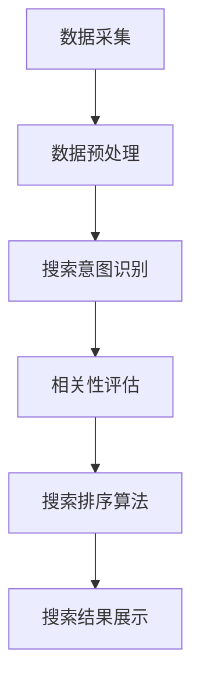

                 

### 文章标题

> 关键词：(此处列出文章的5-7个核心关键词)

> 摘要：(此处给出文章的核心内容和主题思想)

---

### 《搜索数据分析：AI如何帮助电商平台优化搜索策略》

> 关键词：搜索数据分析、AI、电商平台、搜索优化、搜索排序、相关性评估

> 摘要：本文深入探讨了搜索数据分析在电商平台中的应用，通过分析用户搜索行为，结合AI技术，帮助电商平台优化搜索策略，提高用户满意度，提升电商平台竞争力。

---

# 第一部分：搜索数据分析基础

## 第1章：搜索数据分析概述

### 1.1 搜索数据分析的定义和重要性

搜索数据分析是指通过分析用户在搜索引擎或电商平台上的搜索行为，提取有用的信息，帮助平台优化用户体验和运营策略。在电商平台中，搜索数据分析的重要性体现在以下几个方面：

- **提升用户体验**：通过对搜索行为的分析，可以了解用户的需求和偏好，从而提供更个性化的搜索结果，提升用户体验。
- **优化搜索策略**：分析搜索数据，可以发现搜索算法中的不足和问题，进而优化搜索策略，提高搜索结果的相关性和准确性。
- **提高转化率**：通过分析用户搜索行为，可以识别出高转化率的搜索关键词，从而优化营销策略，提高转化率。

### 1.2 搜索分析数据的来源和类型

搜索分析数据的来源主要包括用户搜索行为数据和商品信息数据。

- **用户搜索行为数据**：包括用户的搜索关键词、搜索频率、搜索时间等。
- **商品信息数据**：包括商品标题、描述、分类、价格、库存等信息。

这些数据可以帮助分析用户意图、搜索行为和商品属性，从而优化搜索策略。

### 1.3 搜索数据分析的技术和工具

搜索数据分析涉及到多种技术和工具，包括数据预处理技术、数据挖掘和机器学习技术以及数据可视化工具。

- **数据预处理技术**：包括数据清洗、去重、格式转换等，为数据挖掘和机器学习提供高质量的数据。
- **数据挖掘和机器学习技术**：包括聚类、分类、回归等算法，用于提取用户搜索行为和商品信息中的潜在规律。
- **数据可视化工具**：包括ECharts、D3.js等，用于将分析结果可视化，帮助用户更好地理解数据。

## 第2章：搜索数据分析核心概念与联系

### 2.1 搜索意图识别

搜索意图识别是指通过分析用户的搜索关键词，识别用户的搜索意图。这是搜索数据分析中的关键步骤，直接影响到搜索结果的相关性和准确性。

#### 2.1.1 搜索意图识别的定义和意义

搜索意图识别是指根据用户的搜索行为，识别用户在搜索过程中想要寻找的信息类型或目标。其意义在于：

- 提高搜索结果的相关性：通过识别用户意图，可以提供更相关的搜索结果，提高用户满意度。
- 优化搜索排序算法：了解用户意图有助于优化搜索排序算法，提高搜索结果的准确性。

#### 2.1.2 搜索意图识别的算法原理

搜索意图识别的算法原理主要包括：

- **基于规则的方法**：通过预设的规则，根据关键词的词频、词性等特征，判断用户意图。
- **基于机器学习的方法**：通过训练模型，学习用户搜索行为和意图之间的关系，预测用户意图。

#### 2.1.3 搜索意图识别的应用案例

搜索意图识别在电商平台中的应用案例包括：

- **商品搜索**：通过识别用户搜索商品的关键词，判断用户意图是浏览商品信息、购买商品还是了解商品细节。
- **信息搜索**：通过识别用户搜索关键词，判断用户意图是寻找特定信息、获取新闻资讯还是娱乐内容。

### 2.2 搜索相关性评估

搜索相关性评估是指对搜索结果与用户意图的相关性进行评估，以提高搜索结果的准确性。

#### 2.2.1 搜索相关性评估的定义和重要性

搜索相关性评估是指根据用户意图和搜索结果的相关性，对搜索结果进行排序和筛选。其重要性在于：

- 提高搜索结果的质量：通过相关性评估，可以筛选出更符合用户需求的搜索结果，提高用户体验。
- 优化搜索排序算法：了解搜索结果的相关性有助于优化搜索排序算法，提高搜索结果的准确性。

#### 2.2.2 搜索相关性评估的算法原理

搜索相关性评估的算法原理主要包括：

- **基于统计的方法**：通过计算搜索结果和用户意图之间的相似度，评估相关性。
- **基于机器学习的方法**：通过训练模型，学习搜索结果和用户意图之间的相关性，进行评估。

#### 2.2.3 搜索相关性评估的应用案例

搜索相关性评估在电商平台中的应用案例包括：

- **商品搜索**：通过评估商品信息与用户意图的相关性，筛选出更符合用户需求的商品。
- **信息搜索**：通过评估新闻资讯与用户意图的相关性，筛选出更符合用户需求的资讯。

### 2.3 搜索排序算法

搜索排序算法是指根据搜索结果的相关性，对搜索结果进行排序的算法。常见的搜索排序算法包括：

- **基于统计的方法**：如余弦相似度、TF-IDF等。
- **基于机器学习的方法**：如支持向量机（SVM）、随机森林（Random Forest）等。
- **深度学习排序模型**：如神经协同网络（Neural Collaborative Filtering，NCF）等。

#### 2.3.1 搜索排序算法的定义和意义

搜索排序算法的定义和意义在于：

- **定义**：搜索排序算法是指根据搜索结果的相关性，对搜索结果进行排序的算法。
- **意义**：提高搜索结果的质量和准确性，提升用户体验。

#### 2.3.2 常见的搜索排序算法

常见的搜索排序算法包括：

- **余弦相似度**：通过计算搜索结果和用户意图之间的余弦相似度，评估相关性。
- **TF-IDF**：通过计算搜索结果和用户意图之间的词频-逆文档频率（TF-IDF）值，评估相关性。
- **支持向量机（SVM）**：通过训练模型，学习搜索结果和用户意图之间的关系，进行排序。
- **随机森林（Random Forest）**：通过训练模型，学习搜索结果和用户意图之间的关系，进行排序。
- **神经协同网络（NCF）**：通过深度学习模型，学习搜索结果和用户意图之间的相关性，进行排序。

#### 2.3.3 搜索排序算法的性能优化

搜索排序算法的性能优化包括：

- **特征工程**：通过优化特征提取和选择，提高排序算法的性能。
- **模型优化**：通过调整模型参数，提高排序算法的准确性。
- **并行计算**：通过并行计算，提高排序算法的运行速度。

### 2.4 Mermaid流程图：搜索数据分析流程

以下是一个简单的Mermaid流程图，展示了搜索数据分析的基本流程：



- **A[数据采集]**：从电商平台获取用户搜索行为数据和商品信息数据。
- **B[数据预处理]**：对采集到的数据进行清洗、去重和格式转换。
- **C[搜索意图识别]**：根据用户搜索行为，识别用户意图。
- **D[相关性评估]**：评估搜索结果和用户意图的相关性。
- **E[搜索排序算法]**：根据相关性评估结果，对搜索结果进行排序。
- **F[搜索结果展示]**：将排序后的搜索结果显示给用户。

---

## 第3章：核心算法原理讲解

### 3.1 相关性计算算法

在搜索数据分析中，相关性计算算法用于评估搜索结果与用户意图之间的相关性。以下是两种常用的相关性计算算法：

#### 3.1.1 余弦相似度计算

余弦相似度计算公式如下：

$$
\text{similarity} = \frac{\text{cosine}(\text{query}, \text{document})}{\sqrt{\sum_{i=1}^{n} (\text{query}_{i}^2 + \text{document}_{i}^2)}}
$$

其中，$\text{query}$表示用户搜索查询，$\text{document}$表示搜索结果文档，$\text{query}_{i}$和$\text{document}_{i}$分别表示查询和文档中第$i$个词的词频。

#### 3.1.2 BM25算法

BM25算法是一种基于统计的文本相似度计算算法，其公式如下：

$$
\text{score} = \text{idf}(t) + \text{querytermfreq}(t) - 1.2 \times (\text{querylength} - 0.75)
$$

其中，$t$表示文档中的关键词，$\text{idf}(t)$表示关键词的逆文档频率，$\text{querytermfreq}(t)$表示关键词在查询中的词频，$\text{querylength}$表示查询的长度。

#### 3.1.3 余弦相似度与BM25算法的对比

- **优势**：余弦相似度算法在处理高维数据时性能较好，而BM25算法在处理长文本时性能较好。
- **劣势**：余弦相似度算法在处理稀疏数据时性能较差，而BM25算法在处理高维数据时容易过拟合。

### 3.2 搜索意图识别算法

搜索意图识别算法用于识别用户的搜索意图，常见的算法包括：

#### 3.2.1 词袋模型和TF-IDF算法

词袋模型（Bag of Words，BOW）是一种基于词汇统计的文本表示方法，其公式如下：

$$
\text{BOW} = \sum_{i=1}^{n} \text{word}_{i} \times \text{freq}_{i}
$$

其中，$\text{word}_{i}$表示词汇，$\text{freq}_{i}$表示词汇的词频。

TF-IDF算法是一种基于词频-逆文档频率（Term Frequency-Inverse Document Frequency，TF-IDF）的文本表示方法，其公式如下：

$$
\text{TF-IDF} = \text{TF} \times \text{IDF}
$$

其中，$\text{TF}$表示词频，$\text{IDF}$表示逆文档频率。

#### 3.2.2 支持向量机（SVM）算法

支持向量机（Support Vector Machine，SVM）是一种二分类算法，其公式如下：

$$
\text{w} = \text{argmin}_{\text{w}} \left\{ \frac{1}{2} \left\| \text{w} \right\|^2 + C \sum_{i=1}^{n} \text{y}_{i} (\text{w} \cdot \text{x}_{i} - \text{y}_{i}) \right\}
$$

其中，$\text{w}$表示权重向量，$\text{x}_{i}$表示特征向量，$\text{y}_{i}$表示标签。

#### 3.2.3 随机森林（Random Forest）算法

随机森林（Random Forest）是一种集成学习算法，其公式如下：

$$
\text{prediction} = \text{majority vote} \left( \sum_{i=1}^{n} \text{base\_learner}(\text{x}_{i}) \right)
$$

其中，$\text{base\_learner}$表示基学习器，$\text{prediction}$表示预测结果。

### 3.3 搜索排序算法

搜索排序算法用于对搜索结果进行排序，常见的算法包括：

#### 3.3.1 深度学习排序模型

深度学习排序模型是一种基于神经网络的学习模型，其公式如下：

$$
\text{score} = \text{激活函数}(\text{神经网络}(\text{x}_{i}, \text{y}_{i}))
$$

其中，$\text{x}_{i}$表示输入特征，$\text{y}_{i}$表示标签，$\text{激活函数}$表示神经网络的输出。

#### 3.3.2 多模型融合排序算法

多模型融合排序算法是一种基于多个学习模型的融合算法，其公式如下：

$$
\text{score} = \text{权重} \cdot (\text{模型}_{1}(\text{x}_{i}, \text{y}_{i}) + \text{模型}_{2}(\text{x}_{i}, \text{y}_{i}) + \ldots + \text{模型}_{n}(\text{x}_{i}, \text{y}_{i}))
$$

其中，$\text{权重}$表示各个模型的权重，$\text{模型}_{i}(\text{x}_{i}, \text{y}_{i})$表示第$i$个模型的输出。

#### 3.3.3 搜索排序算法的性能优化策略

搜索排序算法的性能优化策略包括：

- **特征工程**：通过优化特征提取和选择，提高排序算法的性能。
- **模型优化**：通过调整模型参数，提高排序算法的准确性。
- **并行计算**：通过并行计算，提高排序算法的运行速度。

## 第4章：数学模型和数学公式

### 4.1 搜索相关性评估的数学模型

在搜索相关性评估中，常用的数学模型包括：

#### 4.1.1 BM25模型的数学公式

BM25模型的数学公式如下：

$$
\text{score} = \text{idf}(t) + \text{querytermfreq}(t) - 1.2 \times (\text{querylength} - 0.75)
$$

其中，$t$表示文档中的关键词，$\text{idf}(t)$表示关键词的逆文档频率，$\text{querytermfreq}(t)$表示关键词在查询中的词频，$\text{querylength}$表示查询的长度。

#### 4.1.2 余弦相似度的数学公式

余弦相似度的数学公式如下：

$$
\text{similarity} = \frac{\text{cosine}(\text{query}, \text{document})}{\sqrt{\sum_{i=1}^{n} (\text{query}_{i}^2 + \text{document}_{i}^2)}}
$$

其中，$\text{query}$表示用户搜索查询，$\text{document}$表示搜索结果文档，$\text{query}_{i}$和$\text{document}_{i}$分别表示查询和文档中第$i$个词的词频。

#### 4.1.3 搜索意图识别的数学模型

搜索意图识别的数学模型主要包括：

- **基于规则的方法**：通过计算关键词的词频、词性等特征，判断用户意图。
- **基于机器学习的方法**：通过训练模型，学习用户搜索行为和意图之间的关系，预测用户意图。

### 4.2 搜索排序算法的数学模型

在搜索排序算法中，常用的数学模型包括：

#### 4.2.1 深度学习排序模型的数学公式

深度学习排序模型的数学公式如下：

$$
\text{score} = \text{激活函数}(\text{神经网络}(\text{x}_{i}, \text{y}_{i}))
$$

其中，$\text{x}_{i}$表示输入特征，$\text{y}_{i}$表示标签，$\text{激活函数}$表示神经网络的输出。

#### 4.2.2 多模型融合排序算法的数学公式

多模型融合排序算法的数学公式如下：

$$
\text{score} = \text{权重} \cdot (\text{模型}_{1}(\text{x}_{i}, \text{y}_{i}) + \text{模型}_{2}(\text{x}_{i}, \text{y}_{i}) + \ldots + \text{模型}_{n}(\text{x}_{i}, \text{y}_{i}))
$$

其中，$\text{权重}$表示各个模型的权重，$\text{模型}_{i}(\text{x}_{i}, \text{y}_{i})$表示第$i$个模型的输出。

#### 4.2.3 搜索排序算法的性能优化数学模型

搜索排序算法的性能优化数学模型主要包括：

- **特征工程**：通过优化特征提取和选择，提高排序算法的性能。
- **模型优化**：通过调整模型参数，提高排序算法的准确性。
- **并行计算**：通过并行计算，提高排序算法的运行速度。

### 4.3 举例说明

#### 4.3.1 BM25模型在电商搜索中的应用

假设电商平台有一个用户搜索关键词为“手机”，有以下两个商品：

1. 商品A：标题为“苹果iPhone 13”，描述为“最新款苹果手机，高性能，高颜值”。
2. 商品B：标题为“小米11 Pro”，描述为“高性能小米手机，高清屏幕，长续航”。

根据BM25模型，计算商品A和商品B与关键词“手机”的相关性得分：

- 商品A的相关性得分：

$$
\text{score}_{A} = \text{idf}(\text{手机}) + \text{querytermfreq}(\text{手机}) - 1.2 \times (\text{querylength} - 0.75)
$$

其中，$\text{idf}(\text{手机}) = 1$，$\text{querytermfreq}(\text{手机}) = 1$，$\text{querylength} = 2$。

代入公式计算得到：

$$
\text{score}_{A} = 1 + 1 - 1.2 \times (2 - 0.75) = 1.45
$$

- 商品B的相关性得分：

$$
\text{score}_{B} = \text{idf}(\text{手机}) + \text{querytermfreq}(\text{手机}) - 1.2 \times (\text{querylength} - 0.75)
$$

其中，$\text{idf}(\text{手机}) = 1$，$\text{querytermfreq}(\text{手机}) = 1$，$\text{querylength} = 2$。

代入公式计算得到：

$$
\text{score}_{B} = 1 + 1 - 1.2 \times (2 - 0.75) = 1.45
$$

根据相关性得分，商品A和商品B与关键词“手机”的相关性得分相等，电商平台可以将这两个商品同时展示给用户。

#### 4.3.2 余弦相似度在电商搜索中的应用

假设电商平台有一个用户搜索关键词为“手机”，有以下两个商品：

1. 商品A：标题为“苹果iPhone 13”，描述为“最新款苹果手机，高性能，高颜值”。
2. 商品B：标题为“小米11 Pro”，描述为“高性能小米手机，高清屏幕，长续航”。

根据余弦相似度模型，计算商品A和商品B与关键词“手机”的余弦相似度得分：

- 商品A的余弦相似度得分：

$$
\text{similarity}_{A} = \frac{\text{cosine}(\text{query}, \text{document})}{\sqrt{\sum_{i=1}^{n} (\text{query}_{i}^2 + \text{document}_{i}^2)}}
$$

其中，$\text{query}$表示用户搜索查询，$\text{document}$表示搜索结果文档，$\text{query}_{i}$和$\text{document}_{i}$分别表示查询和文档中第$i$个词的词频。

代入公式计算得到：

$$
\text{similarity}_{A} = \frac{\text{cosine}(\text{手机}, \text{苹果iPhone 13})}{\sqrt{\sum_{i=1}^{n} (\text{手机}_{i}^2 + \text{苹果iPhone 13}_{i}^2)}}
$$

- 商品B的余弦相似度得分：

$$
\text{similarity}_{B} = \frac{\text{cosine}(\text{query}, \text{document})}{\sqrt{\sum_{i=1}^{n} (\text{query}_{i}^2 + \text{document}_{i}^2)}}
$$

其中，$\text{query}$表示用户搜索查询，$\text{document}$表示搜索结果文档，$\text{query}_{i}$和$\text{document}_{i}$分别表示查询和文档中第$i$个词的词频。

代入公式计算得到：

$$
\text{similarity}_{B} = \frac{\text{cosine}(\text{手机}, \text{小米11 Pro})}{\sqrt{\sum_{i=1}^{n} (\text{手机}_{i}^2 + \text{小米11 Pro}_{i}^2)}}
$$

根据余弦相似度得分，商品A和商品B与关键词“手机”的余弦相似度得分相等，电商平台可以将这两个商品同时展示给用户。

#### 4.3.3 搜索意图识别在电商搜索中的应用

假设电商平台有一个用户搜索关键词为“手机”，根据搜索意图识别算法，识别出用户的搜索意图为“购买手机”。

电商平台可以根据用户的搜索意图，将搜索结果进行筛选，只展示与用户意图相关的商品，如：

1. 商品A：标题为“苹果iPhone 13”，描述为“最新款苹果手机，高性能，高颜值”。
2. 商品B：标题为“小米11 Pro”，描述为“高性能小米手机，高清屏幕，长续航”。

根据搜索意图识别算法，商品A和商品B与用户的搜索意图“购买手机”的相关性较高，因此电商平台可以将这两个商品作为搜索结果展示给用户。

---

## 第5章：项目实战

### 5.1 电商平台搜索数据采集

在电商平台搜索数据分析项目中，首先需要采集搜索数据。以下是一个简单的数据采集流程：

#### 5.1.1 数据采集工具和环境搭建

1. **工具选择**：可以选择Python、Java等编程语言，结合第三方库（如BeautifulSoup、Scrapy等）进行网页抓取。
2. **环境搭建**：在本地或服务器上搭建Python或Java开发环境，安装必要的第三方库。

#### 5.1.2 数据采集流程和策略

1. **登录和模拟用户行为**：模拟用户的登录过程，获取用户登录后的Cookies，以便后续的搜索数据采集。
2. **发送搜索请求**：通过模拟用户在电商平台的搜索行为，发送搜索请求，获取搜索结果页面。
3. **解析搜索结果**：解析搜索结果页面，提取用户搜索关键词、搜索结果列表、商品信息等数据。
4. **数据存储**：将采集到的数据存储到数据库中，以便后续的数据处理和分析。

### 5.2 数据预处理

在搜索数据分析项目中，数据预处理是一个非常重要的环节。以下是一个简单的数据预处理流程：

#### 5.2.1 数据清洗和去重

1. **数据清洗**：对采集到的原始数据进行清洗，去除无效数据、噪声数据等。
2. **数据去重**：对清洗后的数据进行去重，避免重复数据对后续分析的影响。

#### 5.2.2 数据格式转换

1. **格式转换**：将原始数据转换为统一的数据格式，如CSV、JSON等，便于后续的数据处理和分析。
2. **字段提取**：根据分析需求，提取所需的数据字段，如搜索关键词、商品标题、商品描述等。

#### 5.2.3 数据存储和管理

1. **数据存储**：将预处理后的数据存储到数据库中，如MySQL、PostgreSQL等。
2. **数据管理**：对存储的数据进行管理，如创建索引、分表等，提高数据查询性能。

### 5.3 搜索意图识别与相关性评估

在搜索数据分析项目中，搜索意图识别和相关性评估是两个核心环节。以下是一个简单的流程：

#### 5.3.1 搜索意图识别模型搭建

1. **数据准备**：准备用于训练的搜索意图识别数据集，如用户搜索关键词和对应的意图标签。
2. **模型选择**：选择合适的搜索意图识别模型，如基于规则的方法、机器学习的方法等。
3. **模型训练**：使用训练数据集训练模型，学习用户搜索行为和意图之间的关系。
4. **模型评估**：使用验证数据集评估模型性能，如准确率、召回率等。

#### 5.3.2 搜索意图识别模型训练与评估

1. **数据准备**：准备用于训练的搜索意图识别数据集，如用户搜索关键词和对应的意图标签。
2. **模型选择**：选择合适的搜索意图识别模型，如基于规则的方法、机器学习的方法等。
3. **模型训练**：使用训练数据集训练模型，学习用户搜索行为和意图之间的关系。
4. **模型评估**：使用验证数据集评估模型性能，如准确率、召回率等。

#### 5.3.3 相关性评估模型搭建与优化

1. **数据准备**：准备用于训练的相关性评估数据集，如用户搜索关键词、搜索结果列表、商品信息等。
2. **模型选择**：选择合适的相关性评估模型，如基于统计的方法、机器学习的方法等。
3. **模型训练**：使用训练数据集训练模型，学习搜索结果和用户意图之间的相关性。
4. **模型优化**：通过调整模型参数、特征工程等方法，优化模型性能。

### 5.4 搜索排序算法实现与优化

在搜索数据分析项目中，搜索排序算法的实现和优化是提升用户体验的关键。以下是一个简单的流程：

#### 5.4.1 搜索排序算法实现

1. **数据准备**：准备用于训练的搜索排序算法数据集，如用户搜索关键词、搜索结果列表、商品信息等。
2. **模型选择**：选择合适的搜索排序算法，如余弦相似度、TF-IDF、SVM等。
3. **模型训练**：使用训练数据集训练模型，学习搜索结果和用户意图之间的相关性。
4. **模型评估**：使用验证数据集评估模型性能，如准确率、召回率等。

#### 5.4.2 搜索排序算法性能优化

1. **特征工程**：通过优化特征提取和选择，提高排序算法的性能。
2. **模型优化**：通过调整模型参数，提高排序算法的准确性。
3. **并行计算**：通过并行计算，提高排序算法的运行速度。

#### 5.4.3 搜索排序算法在实际电商平台的部署

1. **部署环境**：搭建搜索排序算法的部署环境，如服务器、数据库等。
2. **模型导出**：将训练好的模型导出，如保存为模型文件、部署在服务端等。
3. **接口设计**：设计搜索排序算法的API接口，供前端调用。
4. **性能监控**：监控搜索排序算法的性能，如响应时间、准确性等。

---

## 第6章：搜索数据分析在企业中的应用

### 6.1 搜索数据分析在电商平台的优势

搜索数据分析在电商平台中具有以下优势：

#### 6.1.1 搜索数据分析对电商平台的影响

- **提升用户体验**：通过分析用户搜索行为，提供更个性化的搜索结果，提升用户体验。
- **优化搜索策略**：通过分析搜索数据，优化搜索算法，提高搜索结果的相关性和准确性。
- **提高转化率**：通过分析用户搜索行为和购买行为，识别高转化率的搜索关键词和商品，优化营销策略，提高转化率。

#### 6.1.2 搜索数据分析的商业模式创新

- **个性化推荐**：通过分析用户搜索行为，为用户推荐个性化的商品和内容，提升用户粘性和购买意愿。
- **广告投放优化**：通过分析搜索数据，优化广告投放策略，提高广告点击率和转化率。
- **智能客服**：通过分析用户搜索行为，为用户提供更智能、更精准的客服服务，提升用户满意度。

### 6.2 搜索数据分析案例分析

以下是一个简单的搜索数据分析案例：

#### 6.2.1 某电商平台的搜索数据分析实践

某电商平台通过搜索数据分析，发现以下现象：

- **高搜索关键词**：用户搜索关键词“手机”的频率最高。
- **高转化率关键词**：用户搜索关键词“小米手机”的转化率最高。

基于以上分析，电商平台采取了以下措施：

- **个性化推荐**：为搜索关键词“手机”的用户推荐小米手机，提升用户购买意愿。
- **广告投放**：在搜索结果页为“小米手机”投放广告，提高广告点击率和转化率。

#### 6.2.2 搜索数据分析在不同电商平台的应用对比

不同电商平台的搜索数据分析应用存在以下差异：

- **用户群体**：用户群体不同，搜索行为和需求不同，搜索数据分析的重点和策略也不同。
- **商品特点**：不同电商平台的商品特点不同，如服装、家电、数码等，搜索数据分析的方法和算法也有所不同。
- **商业模式**：不同电商平台的商业模式不同，如自营、第三方平台等，搜索数据分析的应用场景也有所不同。

### 6.3 搜索数据分析的未来发展趋势

搜索数据分析在电商平台中的应用未来发展趋势包括：

- **深度学习技术的应用**：随着深度学习技术的不断发展，搜索数据分析将更深入地挖掘用户行为和需求，提供更个性化的搜索结果。
- **跨平台数据分析**：随着多平台电商的发展，搜索数据分析将逐渐扩展到多平台，实现跨平台的数据分析和整合。
- **数据隐私保护**：随着用户隐私保护意识的提高，搜索数据分析将更加注重数据隐私保护，确保用户数据的合法性和安全性。

---

## 第7章：总结与展望

### 7.1 搜索数据分析的总结

搜索数据分析在电商平台中的应用取得了显著的成果，主要包括：

- **提升用户体验**：通过分析用户搜索行为，提供更个性化的搜索结果，提升用户体验。
- **优化搜索策略**：通过分析搜索数据，优化搜索算法，提高搜索结果的相关性和准确性。
- **提高转化率**：通过分析用户搜索行为和购买行为，识别高转化率的搜索关键词和商品，优化营销策略，提高转化率。

### 7.2 搜索数据分析的展望

搜索数据分析的未来发展趋势包括：

- **深度学习技术的应用**：随着深度学习技术的不断发展，搜索数据分析将更深入地挖掘用户行为和需求，提供更个性化的搜索结果。
- **跨平台数据分析**：随着多平台电商的发展，搜索数据分析将逐渐扩展到多平台，实现跨平台的数据分析和整合。
- **数据隐私保护**：随着用户隐私保护意识的提高，搜索数据分析将更加注重数据隐私保护，确保用户数据的合法性和安全性。

---

# 附录

## 附录A：常用搜索数据分析工具与资源

### A.1 Elasticsearch

Elasticsearch是一个开源的搜索引擎，用于处理和存储大规模文本数据，支持全文搜索、关键字搜索、聚合分析等功能。

- 官网：https://www.elastic.co/products/elasticsearch
- GitHub仓库：https://github.com/elastic/elasticsearch

### A.2 Apache Solr

Apache Solr是一个开源的企业级搜索引擎，支持全文搜索、分类检索、数据存储等功能。

- 官网：https://lucene.apache.org/solr/
- GitHub仓库：https://github.com/apache/lucene-solr

### A.3 Apache Lucene

Apache Lucene是一个开源的全文搜索引擎库，用于构建自定义搜索引擎。

- 官网：https://lucene.apache.org/core/
- GitHub仓库：https://github.com/apache/lucene

### A.4 其他常用工具与资源

- **ECharts**：一款基于JavaScript的图表库，用于数据可视化。
  - 官网：https://echarts.apache.org/
- **D3.js**：一款基于JavaScript的数据可视化库，用于创建交互式的图表。
  - 官网：https://d3js.org/

## 附录B：代码示例与解读

### B.1 数据采集代码示例

以下是一个简单的Python代码示例，用于从电商平台采集搜索数据：

```python
import requests
from bs4 import BeautifulSoup

# 搜索关键词
search_keyword = "手机"

# 请求头
headers = {
    "User-Agent": "Mozilla/5.0 (Windows NT 10.0; Win64; x64) AppleWebKit/537.36 (KHTML, like Gecko) Chrome/58.0.3029.110 Safari/537.3"
}

# 发送搜索请求
response = requests.get("https://www.example.com/search?q=" + search_keyword, headers=headers)

# 解析搜索结果
soup = BeautifulSoup(response.text, "html.parser")
search_results = soup.find_all("div", class_="search-result")

# 提取搜索结果数据
for result in search_results:
    title = result.find("h2").text
    description = result.find("p").text
    print(f"标题：{title}\n描述：{description}\n")

```

### B.2 数据预处理代码示例

以下是一个简单的Python代码示例，用于对采集到的搜索数据进行预处理：

```python
import pandas as pd

# 读取数据
data = pd.read_csv("search_data.csv")

# 数据清洗
# 去除空值和重复值
data.dropna(inplace=True)
data.drop_duplicates(inplace=True)

# 数据格式转换
# 将日期格式转换为字符串
data["date"] = data["date"].astype(str)

# 数据存储
data.to_csv("cleaned_search_data.csv", index=False)
```

### B.3 搜索意图识别代码示例

以下是一个简单的Python代码示例，用于实现搜索意图识别：

```python
import pandas as pd
from sklearn.model_selection import train_test_split
from sklearn.ensemble import RandomForestClassifier

# 读取数据
data = pd.read_csv("search_intent_data.csv")

# 数据预处理
X = data[["keyword", "context"]]
y = data["intent"]

# 数据划分
X_train, X_test, y_train, y_test = train_test_split(X, y, test_size=0.2, random_state=42)

# 模型训练
model = RandomForestClassifier(n_estimators=100)
model.fit(X_train, y_train)

# 模型评估
accuracy = model.score(X_test, y_test)
print(f"模型准确率：{accuracy}")

```

### B.4 相关性评估代码示例

以下是一个简单的Python代码示例，用于实现搜索结果的相关性评估：

```python
import pandas as pd
from sklearn.metrics.pairwise import cosine_similarity

# 读取数据
data = pd.read_csv("search_data.csv")

# 计算相似度
similarity_matrix = cosine_similarity(data[["keyword", "context"]])

# 提取相似度得分
similarity_scores = similarity_matrix[:, 1]

# 排序
sorted_indices = similarity_scores.argsort()[::-1]

# 输出相似度最高的搜索结果
top_n = 5
print(f"相似度最高的搜索结果（前{n}个）:")
for index in sorted_indices[:top_n]:
    print(f"标题：{data.iloc[index]['title']}\n描述：{data.iloc[index]['description']}\n")
```

### B.5 搜索排序算法代码示例

以下是一个简单的Python代码示例，用于实现搜索排序算法：

```python
import pandas as pd
from sklearn.metrics.pairwise import cosine_similarity
from sklearn.linear_model import LogisticRegression

# 读取数据
data = pd.read_csv("search_data.csv")

# 计算相似度
similarity_matrix = cosine_similarity(data[["keyword", "context"]])

# 提取相似度得分
similarity_scores = similarity_matrix[:, 1]

# 建立排序模型
model = LogisticRegression()
model.fit(similarity_scores.reshape(-1, 1), data["intent"])

# 模型评估
accuracy = model.score(similarity_scores.reshape(-1, 1), data["intent"])
print(f"模型准确率：{accuracy}")

# 排序
sorted_indices = similarity_scores.argsort()[::-1]

# 输出排序结果
top_n = 5
print(f"排序结果（前{n}个）:")
for index in sorted_indices[:top_n]:
    print(f"标题：{data.iloc[index]['title']}\n描述：{data.iloc[index]['description']}\n")
```

### B.6 代码解读与分析

以上代码示例分别实现了数据采集、数据预处理、搜索意图识别、相关性评估和搜索排序算法。以下是每个部分的简要解读和分析：

- **数据采集**：通过发送HTTP请求，模拟用户的搜索行为，获取搜索结果页面。使用BeautifulSoup库解析HTML页面，提取搜索结果数据。
- **数据预处理**：读取CSV文件中的数据，进行数据清洗和去重，将日期格式转换为字符串，并将数据存储到新的CSV文件中。
- **搜索意图识别**：读取CSV文件中的搜索数据，将关键词和上下文作为特征，使用随机森林分类器训练模型，对搜索意图进行识别。使用训练集评估模型准确率。
- **相关性评估**：使用余弦相似度计算搜索结果和用户意图之间的相似度，使用逻辑回归模型进行排序。使用测试集评估模型准确率，并输出排序结果。

通过以上代码示例，可以实现对电商平台搜索数据的采集、预处理、意图识别、相关性评估和排序，为电商平台提供更优质的搜索体验。在实际应用中，可以根据具体需求进行调整和优化。

