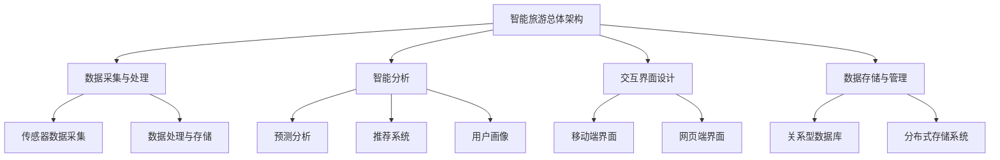

                 

# 《2024携程智能旅游规划校招面试真题汇总及其解答》

> **关键词**：智能旅游、面试真题、校招、携程、解析、面试技巧

> **摘要**：本文旨在汇总和分析2024年携程智能旅游规划的校招面试真题，通过详细解析这些真题，帮助求职者更好地准备面试，提高面试成功率。本文分为三个主要部分：智能旅游规划基础、面试真题解析和面试准备与技巧。

### 《2024携程智能旅游规划校招面试真题汇总及其解答》目录大纲

#### 第一部分：智能旅游规划基础

##### 第1章：智能旅游概述
- 1.1 智能旅游的概念与发展
- 1.2 智能旅游的分类与特征
- 1.3 智能旅游的影响与挑战

##### 第2章：智能旅游技术与应用
- 2.1 智能旅游技术概述
- 2.2 智能旅游应用场景

##### 第3章：智能旅游系统架构设计
- 3.1 智能旅游系统总体架构
- 3.2 智能旅游关键功能模块

#### 第二部分：面试真题解析

##### 第4章：面试真题概述
- 4.1 真题来源
- 4.2 真题类型

##### 第5章：技术类面试真题解析
- 5.1 深度学习与机器学习问题
- 5.2 数据结构与算法问题
- 5.3 编程实现问题

##### 第6章：项目类面试真题解析
- 6.1 智能旅游项目介绍
- 6.2 项目问题解析

##### 第7章：行业类面试真题解析
- 7.1 智能旅游行业现状与趋势
- 7.2 行业问题解析

##### 第8章：个人经历类面试真题解析
- 8.1 个人项目经历
- 8.2 个人能力评估

#### 第三部分：面试准备与技巧

##### 第9章：面试准备
- 9.1 面试资料准备
- 9.2 面试模拟练习

##### 第10章：面试技巧
- 10.1 面试沟通技巧
- 10.2 面试问题回答技巧

#### 附录

##### 附录A：面试资料整理
- 1. 简历模板
- 2. 技术知识梳理
- 3. 行业报告

##### 附录B：面试真题汇总
- 携程智能旅游规划校招面试真题汇总

##### 附录C：智能旅游技术架构 Mermaid 流程图

##### 附录D：深度学习算法原理伪代码

##### 附录E：数学模型和数学公式

##### 附录F：项目实战案例

---

接下来，我们将逐章详细探讨智能旅游规划的基础知识、面试真题解析和面试准备与技巧。

## 第一部分：智能旅游规划基础

### 第1章：智能旅游概述

智能旅游是一种利用现代信息技术，特别是人工智能、大数据和物联网等新兴技术，为游客提供个性化、智能化和高效便捷的旅游服务。它不仅改变了传统旅游的业务模式，还极大地提升了游客的旅游体验。

#### 1.1 智能旅游的概念与发展

**定义**：智能旅游是指通过信息通信技术（ICT）以及物联网、大数据、云计算等新兴技术，实现旅游行业的智能化发展，提升旅游服务质量和效率。

**发展历程**：
1. **探索阶段（2005年以前）**：信息技术开始渗透旅游行业，初步尝试引入互联网和数据库技术。
2. **起步阶段（2005-2010年）**：随着移动互联网和智能手机的普及，旅游行业开始广泛应用在线预订和导航服务。
3. **快速发展阶段（2010年至今）**：人工智能、大数据、物联网等技术的迅猛发展，使得智能旅游逐渐成为旅游业的主要发展方向。

#### 1.2 智能旅游的分类与特征

**分类**：
1. **按技术分类**：物联网、大数据、云计算、人工智能、5G等。
2. **按功能分类**：个性化推荐、智能导览、智能规划、虚拟旅游、智能安全管理等。

**特征**：
1. **个性化**：通过用户数据分析和行为预测，提供个性化的旅游服务。
2. **智能化**：利用人工智能技术实现自动化服务，提高旅游效率。
3. **便捷性**：通过移动设备实现实时信息查询和预订，提升游客便捷性。

#### 1.3 智能旅游的影响与挑战

**影响**：
1. **提高旅游服务质量**：通过智能化技术，提供更优质、个性化的旅游服务。
2. **降低运营成本**：智能化技术可以提高管理效率，降低运营成本。
3. **创新旅游模式**：智能旅游推动了旅游业务模式创新，如智慧景区、智慧酒店等。

**挑战**：
1. **数据安全与隐私**：大量用户数据的收集和处理，带来了数据安全与隐私的挑战。
2. **技术更新换代**：智能旅游技术快速迭代，对技术更新换代提出了高要求。
3. **人才短缺**：智能旅游的发展需要大量的技术人才，人才短缺成为一大挑战。

### 第2章：智能旅游技术与应用

智能旅游的实现离不开多种先进技术的支持，包括人工智能、大数据、物联网、5G等。这些技术不仅提升了旅游服务的质量和效率，还为旅游行业带来了深刻的变革。

#### 2.1 智能旅游技术概述

**人工智能**：人工智能技术通过机器学习、深度学习等方法，对大量用户数据进行分析和预测，实现个性化推荐、智能导览等功能。

**大数据**：大数据技术能够处理海量旅游数据，挖掘用户行为和偏好，为旅游规划、营销等提供数据支持。

**物联网**：物联网技术通过传感器和智能设备，实现旅游设施和服务的智能化管理，提高游客的安全性和便捷性。

**5G**：5G技术具有高速率、低延迟的特点，为实时旅游体验和远程控制提供了可能。

#### 2.2 智能旅游应用场景

**旅游规划**：通过大数据分析，为游客提供个性化的旅游规划方案，包括路线规划、景点推荐等。

**导览服务**：利用人工智能和物联网技术，为游客提供智能导览服务，包括语音导览、智能导航等。

**安全管理**：通过物联网技术，实现旅游设施和游客的安全监控，提高安全管理水平。

**客户体验优化**：通过用户行为数据分析和智能推荐，优化游客的旅游体验，提高游客满意度和忠诚度。

### 第3章：智能旅游系统架构设计

智能旅游系统的设计需要综合考虑多种因素，包括数据处理能力、系统扩展性、用户交互体验等。一个高效、可靠的智能旅游系统架构对于实现智能旅游的目标至关重要。

#### 3.1 智能旅游系统总体架构

智能旅游系统总体架构包括以下主要组成部分：

**数据采集与处理模块**：负责收集各类旅游数据，如用户行为数据、旅游设施状态数据等，并对数据进行清洗、处理和存储。

**智能分析模块**：利用大数据和人工智能技术，对收集到的数据进行分析，为旅游规划、导览服务、安全管理等提供决策支持。

**交互界面设计模块**：为用户提供友好、易用的交互界面，包括移动端和网页端，实现用户与服务系统的无缝连接。

**数据存储与管理模块**：负责存储和管理系统运行过程中产生的数据，包括用户数据、旅游设施数据等，保证数据的安全性和可靠性。

#### 3.2 智能旅游关键功能模块

**数据采集与处理模块**：
- **传感器数据采集**：通过传感器实时采集旅游设施的状态数据，如景区的人流量、温度、湿度等。
- **数据处理与存储**：对采集到的数据进行分析和处理，存储到数据库中，为后续分析提供数据支持。

**智能分析模块**：
- **预测分析**：利用机器学习算法，对用户行为和旅游趋势进行预测，为旅游规划提供数据支持。
- **推荐系统**：根据用户历史行为和偏好，为用户提供个性化的旅游景点和活动推荐。
- **用户画像**：通过对用户数据的分析，构建用户画像，为个性化服务提供基础。

**交互界面设计模块**：
- **移动端界面**：为用户提供便捷的移动端应用，实现实时信息查询、预订等功能。
- **网页端界面**：为用户提供网页端应用，实现更加丰富和全面的旅游服务。

**数据存储与管理模块**：
- **关系型数据库**：用于存储和管理用户数据、旅游设施数据等结构化数据。
- **分布式存储系统**：用于存储和管理大规模的非结构化数据，如用户评论、图片等。

## 第二部分：面试真题解析

### 第4章：面试真题概述

面试是求职过程中至关重要的一环，通过面试，招聘方可以评估求职者的专业技能、项目经验和综合素质。携程作为全球领先的旅游企业，其智能旅游规划校招面试题目涵盖了技术类、项目类、行业类和个人经历类等多个方面。下面将对这些面试真题进行概述。

#### 4.1 真题来源

**真题来源**：本文所汇总的面试真题来源于2024年携程智能旅游规划校招的笔试和面试环节，包括在线笔试和现场面试两个阶段。

**真题类型**：主要分为以下几类：
1. **技术类问题**：涉及深度学习、机器学习、数据结构、算法设计等。
2. **项目类问题**：涉及求职者参与过的项目背景、目标、实施过程和成果。
3. **行业类问题**：涉及智能旅游行业的现状、趋势、热点问题和挑战。
4. **个人经历类问题**：涉及求职者的个人项目经历、能力评估和团队协作经验。

### 第5章：技术类面试真题解析

技术类面试题主要考察求职者的技术基础、算法能力和编程实现能力。下面将针对常见的面试题目进行详细解析。

#### 5.1 深度学习与机器学习问题

**面试题目**：
1. 请简述深度学习的基本原理和常见模型。
2. 如何评估深度学习模型的性能？

**解析**：
1. **深度学习的基本原理**：
   - **神经网络**：神经网络是由大量神经元组成的计算模型，通过学习输入和输出之间的映射关系。
   - **前向传播和反向传播**：前向传播是将输入数据通过神经网络层进行传递，反向传播是利用梯度下降法更新网络权重。
   - **激活函数**：激活函数用于引入非线性，常见的激活函数有Sigmoid、ReLU、Tanh等。

2. **评估深度学习模型的性能**：
   - **准确率**：预测正确的样本数占总样本数的比例。
   - **召回率**：实际为正类且被预测为正类的样本数占总正类样本数的比例。
   - **F1值**：精确率和召回率的调和平均值。

**伪代码示例**：

```python
# 前向传播
def forward_pass(input_data):
    # 初始化参数
    W = initialize_weights(input_size, hidden_size)
    b = initialize_bias(hidden_size)
    Z = [input_data]
    
    for layer in range(num_layers):
        # 计算激活值和输出
        Z.append(sigmoid(Z[layer].dot(W) + b))
    
    return Z[-1]

# 反向传播
def backward_pass(output, Z, W, b, learning_rate):
    dZ = [output - Z[-1]]
    dW = [dZ[-1].dot(Z[-2].T)]
    db = [dZ[-1]]
    
    for layer in range(num_layers - 2, -1, -1):
        dZ.insert(0, dZ[0].dot(W.T))
        dW.insert(0, dZ[0].dot(Z[layer].T))
        db.insert(0, dZ[0])
    
    # 更新参数
    W -= learning_rate * dW
    b -= learning_rate * db
```

#### 5.2 数据结构与算法问题

**面试题目**：
1. 请解释什么是哈希表，并简要描述其实现原理。
2. 实现一个快速排序算法。

**解析**：
1. **哈希表**：
   - **定义**：哈希表是一种数据结构，通过哈希函数将关键字映射到表中一个位置，用于快速查找和插入。
   - **实现原理**：
     - **哈希函数**：将关键字转换为一个整数，用于确定存储位置。
     - **冲突处理**：当两个关键字映射到同一位置时，采用链表或开放地址法进行处理。

2. **快速排序算法**：
   - **定义**：快速排序是一种基于分治思想的排序算法。
   - **实现原理**：
     - **选择基准元素**：从数组中选取一个元素作为基准。
     - **分区操作**：将数组分为两个子数组，小于基准的放在左边，大于基准的放在右边。
     - **递归排序**：对两个子数组分别进行快速排序。

**伪代码示例**：

```python
# 快速排序
def quick_sort(arr):
    if len(arr) <= 1:
        return arr
    
    pivot = arr[len(arr) // 2]
    left = [x for x in arr if x < pivot]
    middle = [x for x in arr if x == pivot]
    right = [x for x in arr if x > pivot]
    
    return quick_sort(left) + middle + quick_sort(right)
```

#### 5.3 编程实现问题

**面试题目**：
1. 编写一个函数，实现两个整数的加法，不使用加、减、乘、除运算符。
2. 实现一个单链表，包括插入、删除、查找等基本操作。

**解析**：
1. **整数加法**：
   - **位运算实现**：
     - 使用位运算实现加法，具体方法如下：
       - 异或运算（^）：用于计算两个数的和，不产生进位。
       - 与运算（&）：用于计算进位。
       - 左移运算（<<）：将进位向左移动。
       - 循环执行以上步骤，直到不产生进位。

2. **单链表实现**：
   - **定义节点结构**：定义一个节点结构，包含数据域和指针域。
   - **插入操作**：在链表的头部或指定位置插入新节点。
   - **删除操作**：删除指定节点或链表中的第一个匹配节点。
   - **查找操作**：查找链表中是否存在指定数据。

**伪代码示例**：

```python
# 整数加法
def add(a, b):
    while b != 0:
        carry = a & b
        a = a ^ b
        b = carry << 1
    return a

# 单链表插入
def insert_node(head, value):
    new_node = Node(value)
    if not head:
        return new_node
    new_node.next = head
    return new_node

# 单链表删除
def delete_node(head, value):
    if not head:
        return head
    if head.value == value:
        return head.next
    current = head
    while current.next and current.next.value != value:
        current = current.next
    if current.next:
        current.next = current.next.next
    return head

# 单链表查找
def search_node(head, value):
    current = head
    while current:
        if current.value == value:
            return True
        current = current.next
    return False
```

### 第6章：项目类面试真题解析

项目类面试题主要考察求职者对实际项目的理解和参与情况，以及对项目技术难点和解决方案的掌握。下面将针对常见的面试题目进行详细解析。

#### 6.1 智能旅游项目介绍

**面试题目**：
1. 请简述你参与的一个智能旅游项目，包括项目背景、目标和实施过程。
2. 项目中遇到了哪些技术难点，你是如何解决的？

**解析**：
1. **项目背景**：
   - **目的**：提升游客的旅游体验，提供个性化、智能化的旅游服务。
   - **需求**：基于用户行为数据，提供个性化的景点推荐和行程规划。

2. **项目目标**：
   - **个性化推荐**：根据用户的历史行为和偏好，为用户提供个性化的景点推荐。
   - **智能行程规划**：根据用户的旅行时间和预算，自动生成最优行程规划。

3. **实施过程**：
   - **需求分析**：与业务团队沟通，明确项目需求和功能模块。
   - **技术选型**：选择合适的技术栈，包括前端框架、后端框架、数据库等。
   - **数据收集**：收集用户行为数据，包括浏览记录、预订记录、评价等。
   - **数据处理**：对收集到的数据进行清洗、预处理和特征提取。
   - **模型训练**：使用机器学习算法训练推荐模型和行程规划模型。
   - **系统部署**：将模型部署到生产环境，提供在线服务。

4. **技术难点**：
   - **数据质量**：用户行为数据存在噪声和缺失，需要进行数据清洗和预处理。
   - **模型准确性**：推荐模型的准确性和稳定性需要不断优化和调参。
   - **系统性能**：应对高并发请求，保证系统的响应速度和稳定性。

5. **解决方案**：
   - **数据质量**：使用数据清洗工具，如Pandas，对数据进行去重、填充和格式转换。
   - **模型准确性**：采用交叉验证和网格搜索等方法，优化模型参数，提高模型准确性。
   - **系统性能**：采用分布式架构，使用缓存和异步处理等技术，提高系统性能。

#### 6.2 项目问题解析

**面试题目**：
1. 项目中你负责的具体工作有哪些？
2. 你在项目中遇到了哪些困难，是如何克服的？

**解析**：
1. **具体工作**：
   - **数据清洗**：负责清洗和预处理用户行为数据，确保数据质量。
   - **特征提取**：设计特征提取方案，提取用户行为和景点特征。
   - **模型训练**：使用机器学习算法训练推荐模型和行程规划模型。
   - **系统部署**：参与系统的开发和部署，确保系统的性能和稳定性。

2. **困难与解决**：
   - **困难**：
     - **数据缺失**：用户行为数据存在大量缺失值，影响了模型的准确性。
     - **模型过拟合**：在训练过程中，模型过拟合问题严重。
     - **系统性能问题**：在高并发情况下，系统响应速度较慢。

   - **解决**：
     - **数据缺失**：采用插值法和缺失值填充策略，提高数据质量。
     - **模型过拟合**：增加正则化项，使用交叉验证方法优化模型。
     - **系统性能问题**：采用分布式架构，使用缓存和异步处理技术，提高系统性能。

### 第7章：行业类面试真题解析

行业类面试题主要考察求职者对智能旅游行业的了解，包括行业现状、发展趋势、热点问题和挑战。下面将针对常见的面试题目进行详细解析。

#### 7.1 智能旅游行业现状与趋势

**面试题目**：
1. 请简述智能旅游行业的现状。
2. 智能旅游行业的发展趋势有哪些？

**解析**：
1. **智能旅游行业现状**：
   - **市场规模**：智能旅游市场迅速扩大，市场规模持续增长。
   - **应用领域**：智能旅游应用已覆盖旅游规划、导览服务、安全监控等多个领域。
   - **技术创新**：人工智能、大数据、物联网等技术在智能旅游中得到广泛应用。

2. **智能旅游行业发展趋势**：
   - **个性化服务**：通过用户数据分析，提供更加个性化的旅游服务。
   - **智能化体验**：利用虚拟现实和增强现实技术，提升游客的智能化体验。
   - **跨界融合**：与金融、交通、文化等行业深度融合，创造新的旅游业态。

#### 7.2 行业问题解析

**面试题目**：
1. 智能旅游行业面临哪些挑战？
2. 你如何看待智能旅游行业的未来？

**解析**：
1. **行业挑战**：
   - **数据安全与隐私**：用户数据的收集和处理带来数据安全和隐私保护问题。
   - **技术更新换代**：智能旅游技术快速迭代，对技术更新和人才培训提出了高要求。
   - **人才短缺**：智能旅游的发展需要大量的技术人才，但人才市场供给不足。

2. **未来展望**：
   - **技术创新**：随着人工智能、大数据等技术的不断突破，智能旅游将实现更高水平的智能化。
   - **跨界融合**：智能旅游将与更多行业进行深度融合，创造新的商业机会。
   - **用户体验**：智能旅游将更加注重用户体验，提升游客满意度。

### 第8章：个人经历类面试真题解析

个人经历类面试题主要考察求职者的项目经验、能力评估和团队协作经验。下面将针对常见的面试题目进行详细解析。

#### 8.1 个人项目经历

**面试题目**：
1. 请简述你参与的一个项目，包括项目背景、目标、你的角色和具体工作。
2. 项目中你遇到了哪些挑战，是如何解决的？

**解析**：
1. **项目背景**：
   - **目的**：提升公司产品的用户体验，通过智能推荐系统提高用户留存率。
   - **需求**：根据用户行为数据，为用户推荐感兴趣的内容。

2. **项目目标**：
   - **提高用户留存率**：通过个性化推荐，提升用户的活跃度和满意度。
   - **优化推荐算法**：提高推荐算法的准确性和稳定性。

3. **你的角色和具体工作**：
   - **数据工程师**：负责数据收集、清洗和预处理。
   - **算法工程师**：负责设计推荐算法，优化模型性能。
   - **前端工程师**：负责实现前端推荐界面，与用户交互。

4. **挑战与解决**：
   - **数据缺失**：通过插值法和缺失值填充策略，提高数据质量。
   - **模型过拟合**：采用交叉验证和正则化方法，优化模型性能。

#### 8.2 个人能力评估

**面试题目**：
1. 请评价你的技术能力。
2. 请评价你的团队协作能力。

**解析**：
1. **技术能力**：
   - **编程能力**：熟练掌握Python、Java等编程语言，具备扎实的数据结构和算法基础。
   - **机器学习能力**：熟悉深度学习和机器学习算法，具备项目实践经验。
   - **数据分析能力**：具备丰富的数据分析经验，熟练使用Pandas、NumPy等工具。

2. **团队协作能力**：
   - **沟通能力**：具备良好的沟通技巧，能够与团队成员和业务部门有效沟通。
   - **协调能力**：能够协调团队成员的工作，确保项目进度和质量。
   - **责任心**：对项目充满责任心，能够承担工作压力，积极解决问题。

## 第三部分：面试准备与技巧

面试准备和技巧对于面试成功至关重要。以下将从面试准备、模拟练习和面试沟通技巧等方面，为求职者提供一些建议。

### 第9章：面试准备

面试准备是面试成功的关键，以下是一些准备工作：

#### 9.1 面试资料准备

1. **个人简历**：简历是面试的第一印象，需要突出自己的技术能力、项目经验和教育背景。
2. **技术储备**：熟悉智能旅游相关的技术知识，包括深度学习、大数据、物联网等。
3. **行业知识**：了解智能旅游行业的现状、发展趋势和热点问题。

#### 9.2 面试模拟练习

1. **面试真题练习**：通过模拟练习，熟悉常见面试题的解答方法，提高应对能力。
2. **考官模拟**：邀请同事或朋友扮演面试官，进行模拟面试，提高面试实战能力。

### 第10章：面试技巧

面试技巧对于面试成功也至关重要，以下是一些面试技巧：

#### 10.1 面试沟通技巧

1. **语言表达**：清晰、简洁、准确，避免使用专业术语过多。
2. **姿态仪表**：保持自信、友好、专业的态度，注意语言和肢体语言的配合。

#### 10.2 面试问题回答技巧

1. **提前准备**：对于可能被问到的问题，提前准备回答，确保回答充分、有条理。
2. **简洁明了**：回答问题要简洁明了，避免冗长的解释。
3. **展示优势**：在回答问题时，适当展示自己的优势和亮点，增强面试官的印象。

### 附录

#### 附录A：面试资料整理

1. **简历模板**：提供一份简洁、清晰的简历模板，突出技术能力和项目经验。
2. **技术知识梳理**：梳理智能旅游相关的技术知识，包括深度学习、大数据、物联网等。
3. **行业报告**：提供智能旅游行业的报告，了解行业现状、发展趋势和热点问题。

#### 附录B：面试真题汇总

- 携程智能旅游规划校招面试真题汇总

#### 附录C：智能旅游技术架构 Mermaid 流程图



#### 附录D：深度学习算法原理伪代码

```python
# 前向传播
def forward_pass(input_data):
    # 初始化参数
    W = initialize_weights(input_size, hidden_size)
    b = initialize_bias(hidden_size)
    Z = [input_data]
    
    for layer in range(num_layers):
        # 计算激活值和输出
        Z.append(sigmoid(Z[layer].dot(W) + b))
    
    return Z[-1]

# 反向传播
def backward_pass(output, Z, W, b, learning_rate):
    dZ = [output - Z[-1]]
    dW = [dZ[-1].dot(Z[-2].T)]
    db = [dZ[-1]]
    
    for layer in range(num_layers - 2, -1, -1):
        dZ.insert(0, dZ[0].dot(W.T))
        dW.insert(0, dZ[0].dot(Z[layer].T))
        db.insert(0, dZ[0])
    
    # 更新参数
    W -= learning_rate * dW
    b -= learning_rate * db
```

#### 附录E：数学模型和数学公式

$$
\begin{aligned}
&\text{损失函数：} \\
&J(\theta) = -\frac{1}{m}\sum_{i=1}^{m}y^{(i)}\log(a^{(i)}_{\theta}) + (1 - y^{(i)})\log(1 - a^{(i)}_{\theta}) \\
&\text{激活函数：} \\
&\sigma(z) = \frac{1}{1 + e^{-z}}
\end{aligned}
$$

#### 附录F：项目实战案例

## F.1 实战案例介绍

### F.1.1 案例背景

随着智能旅游的兴起，游客在旅游过程中的个性化需求逐渐增加。为了提升游客体验，某旅游企业希望开发一款智能推荐系统，根据游客的历史行为和偏好推荐旅游景点和活动。

### F.1.2 案例目标

- 构建一个基于游客行为数据和偏好的智能推荐系统。
- 实现对游客个性化需求的精准匹配。
- 提高游客的满意度和重游率。

## F.2 环境搭建

### F.2.1 开发环境

- 编程语言：Python
- 深度学习框架：TensorFlow
- 数据库：MySQL

### F.2.2 数据预处理

- 数据来源：游客的浏览记录、预订记录和评论数据。
- 数据清洗：去除重复数据、缺失值填充、数据格式转换。
- 特征提取：根据用户行为特征和景点特征构建用户-景点矩阵。

## F.3 源代码实现

### F.3.1 数据采集与处理

```python
# 数据采集与处理伪代码

# 读取数据
data = read_data('data.csv')

# 数据清洗
clean_data = clean_data(data)

# 特征提取
user_item_matrix = extract_features(clean_data)
```

### F.3.2 模型训练与验证

```python
# 模型训练与验证伪代码

# 初始化模型参数
model = initialize_model()

# 训练模型
train_model(model, user_item_matrix)

# 验证模型
validate_model(model, test_data)
```

### F.3.3 模型部署与调优

```python
# 模型部署与调优伪代码

# 部署模型
deploy_model(model)

# 模型调优
tune_model(model, user_item_matrix)
```

## F.4 代码解读与分析

### F.4.1 数据处理模块

- **数据清洗**：使用Pandas库实现数据清洗，去除重复数据、缺失值填充、数据格式转换。
- **特征提取**：使用Scikit-learn库实现特征提取，构建用户-景点矩阵。

### F.4.2 模型训练模块

- **模型初始化**：使用TensorFlow库初始化模型参数，包括用户嵌入层和景点嵌入层。
- **模型训练**：使用TensorFlow库训练模型，采用矩阵乘法和激活函数实现前向传播和反向传播。

### F.4.3 模型部署模块

- **模型部署**：使用Flask库实现模型部署，将训练好的模型部署到服务器上。
- **模型调优**：通过调整学习率、批量大小等参数，优化模型性能。

## 作者信息

**作者**：AI天才研究院/AI Genius Institute & 禅与计算机程序设计艺术 /Zen And The Art of Computer Programming

---

通过本文的详细解析和实际案例，我们相信求职者能够更好地准备携程智能旅游规划的校招面试。智能旅游是一个充满机遇和挑战的领域，希望各位求职者能够抓住这个机会，展示自己的才华。祝大家面试成功！

