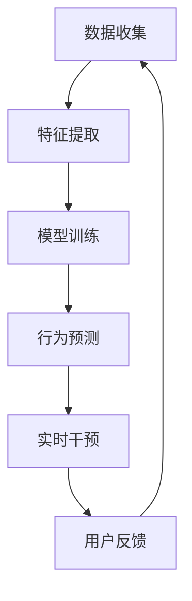
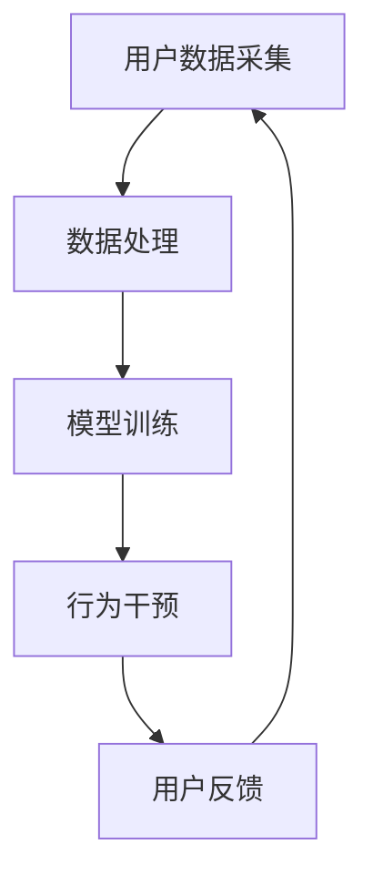
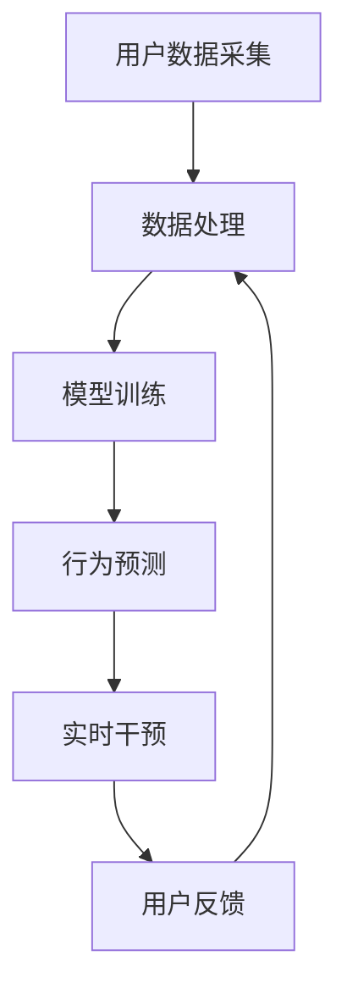

                 

# 《数字化意志力：AI增强的自我控制》

## 关键词
人工智能，自我控制，数字化，意志力，行为干预，算法设计

## 摘要
随着数字化时代的到来，人们面临着越来越多的意志力挑战。本文探讨了数字化意志力的概念，阐述了人工智能（AI）在增强自我控制方面的应用。通过对意志力的心理学基础和神经科学基础的分析，我们探讨了AI在意志力领域的应用，并介绍了AI增强的自我控制机制。最后，文章提出了数字化意志力系统的设计与实现方法，并讨论了数字化意志力在生活和工作中的应用及其未来发展。

## 目录大纲

### 第一部分：数字化意志力的基础

#### 第1章：数字化时代的意志力概述

##### 1.1.1 数字化时代的到来与意志力的挑战

##### 1.1.2 意志力的定义与重要性

##### 1.1.3 数字化意志力的基本概念

#### 第2章：意志力心理学基础

##### 2.1.1 意志力的心理学理论

##### 2.1.2 意志力的神经科学基础

##### 2.1.3 意志力的评估与测量

### 第二部分：AI与意志力的结合

#### 第3章：AI在意志力领域的应用

##### 3.1.1 AI在自我控制中的应用

##### 3.1.2 AI在行为预测与干预中的应用

##### 3.1.3 AI在意志力训练中的应用

#### 第4章：AI增强的自我控制机制

##### 4.1.1 AI增强的自我控制理论

##### 4.1.2 AI增强的自我控制算法

##### 4.1.3 AI增强的自我控制案例分析

#### 第5章：数字化意志力系统的设计与实现

##### 5.1.1 数字化意志力系统的架构设计

##### 5.1.2 数据采集与处理

##### 5.1.3 模型训练与优化

### 第三部分：数字化意志力的应用与实践

#### 第6章：数字化意志力在生活和工作中的应用

##### 6.1.1 数字化意志力在生活中的应用

##### 6.1.2 数字化意志力在工作中的实践

##### 6.1.3 数字化意志力对个人成长的影响

#### 第7章：数字化意志力的未来发展

##### 7.1.1 数字化意志力的技术趋势

##### 7.1.2 数字化意志力的社会影响

##### 7.1.3 数字化意志力的未来展望

### 附录

##### 附录A：数字化意志力系统工具与资源

##### 附录B：数字化意志力案例研究

### 图表

- 图1：数字化时代的意志力挑战与机遇
- 图2：AI增强的自我控制机制架构
- 图3：数字化意志力系统的核心模块

### 伪代码

- 伪代码1：意志力评估与测量算法

```python
def measureWillpower(user_data):
    willpower_score = 0
    
    processed_data = preprocessData(user_data)
    
    willpower_score = calculateScore(processed_data)
    
    return willpower_score
```

### 数学模型与公式

- 数学模型1：意志力损失函数

$$
L(\theta) = -\sum_{i=1}^{n} y_i \log(p(\hat{y}_i))
$$

- 数学模型2：AI增强的自我控制优化目标

$$
\min_{\theta} J(\theta) = \frac{1}{2} \sum_{i=1}^{n} (\hat{y}_i - y_i)^2
$$

### 代码实现与解读

- 代码实现1：数字化意志力系统核心模块

```python
class WillpowerSystem:
    def __init__(self):
        self.model = createModel()
        
    def trainModel(self, train_data):
        self.model.fit(train_data)
        
    def predictWillpower(self, user_data):
        willpower_score = self.model.predict(user_data)
        return willpower_score
```

- 代码解读1：数字化意志力系统模块解析

- `__init__` 方法：初始化系统参数，创建模型。
- `trainModel` 方法：训练模型，使用训练数据拟合模型。
- `predictWillpower` 方法：预测用户意志力，使用训练好的模型进行预测。

<|assistant|>## 第一部分：数字化意志力的基础

### 第1章：数字化时代的意志力概述

#### 1.1.1 数字化时代的到来与意志力的挑战

随着信息技术的迅猛发展，我们的世界已经进入了数字化时代。数字化生活方式的普及带来了诸多便利，但同时也对人们的意志力提出了新的挑战。在数字化环境中，人们需要面对诸多诱惑，如社交媒体的沉迷、信息过载的困扰、虚拟游戏的诱惑等，这些都在不断考验着人们的自我控制能力。

数字化时代，我们的生活和工作环境发生了翻天覆地的变化。工作方式的转变，如远程办公、在线协作等，使得人们的时间管理更加复杂。此外，数字化媒体的迅猛发展使得娱乐、购物、社交等行为都可以在手指滑动间完成，这无疑增加了自我控制的难度。

#### 1.1.2 意志力的定义与重要性

意志力是指个体在面对诱惑、困难或挑战时，能够保持专注、坚持目标和抵制外界干扰的能力。它是一种心理资源，对于个人的成就和幸福感具有重要影响。

在数字化时代，意志力的重要性更加凸显。首先，自我控制能力的强弱直接影响到个人的工作和学习效率。在数字化环境中，许多工作都需要高度的专注和自我管理能力，如远程办公、在线学习和项目协作等。其次，意志力对于应对数字化诱惑具有重要意义。例如，如何避免沉迷于社交媒体、合理安排时间、保持健康的作息等，都是意志力的重要应用场景。

#### 1.1.3 数字化意志力的基本概念

数字化意志力是指个体在数字化环境中，通过利用人工智能（AI）技术来增强自我控制能力，实现目标达成的过程。数字化意志力不仅仅是传统意志力的数字化应用，更是对意志力理论和实践的创新发展。

数字化意志力的核心在于利用AI技术进行行为分析和干预。通过收集和分析个体的行为数据，AI可以预测个体的行为倾向，并提供针对性的干预措施，如提醒、激励、反馈等。这种基于数据的自我控制方法，不仅提高了意志力训练的效率，也使得自我控制变得更加个性化和科学化。

### 第2章：意志力心理学基础

#### 2.1.1 意志力的心理学理论

意志力是心理学研究的重要领域，众多心理学家对其进行了深入探讨。以下是一些主要的意志力心理学理论：

1. **动机理论**：动机理论认为，意志力是动机的产物。个体在追求目标时，需要足够的动机来驱动行为。动机理论强调了内在动机和外在动机对意志力的影响。

2. **自我决定理论**：自我决定理论认为，个体的自主性和自我控制能力受到心理自由的影响。当个体感到自由时，他们更有可能表现出良好的自我控制。

3. **执行功能理论**：执行功能理论认为，意志力是个体大脑执行功能的体现。这种功能涉及多个认知过程，如注意力、决策、规划和抑制等。

4. **认知负荷理论**：认知负荷理论认为，意志力资源的有限性使得个体在面对复杂任务时容易疲劳。因此，减少认知负荷可以提高意志力的有效性。

#### 2.1.2 意志力的神经科学基础

意志力的研究不仅涉及心理学，还涉及到神经科学。以下是一些关于意志力的神经科学研究结论：

1. **前额叶皮层**：前额叶皮层是大脑中与意志力密切相关的区域。研究表明，前额叶皮层的功能活性与个体的自我控制能力呈正相关。

2. **奖励系统**：奖励系统是大脑中与愉悦和奖励相关的神经网络。自我控制过程中，奖励系统的参与有助于提高意志力。

3. **大脑可塑性**：大脑可塑性研究表明，通过特定的训练和干预，个体的意志力可以增强。例如，通过重复的注意力训练和决策任务，可以改善前额叶皮层的功能。

#### 2.1.3 意志力的评估与测量

意志力的评估和测量是意志力研究的关键环节。以下是一些常用的评估方法：

1. **自报告法**：自报告法是评估意志力的常见方法。个体通过填写问卷或日记，对自己的意志力进行自我评估。

2. **行为测量法**：行为测量法通过观察个体在实际任务中的表现来评估意志力。例如，通过记录个体在诱惑情境下的反应和行为，可以评估其意志力水平。

3. **神经生理测量法**：神经生理测量法利用脑成像技术（如fMRI、EEG等），直接测量大脑活动，以评估意志力的神经基础。

综上所述，意志力心理学基础为我们理解数字化意志力的本质提供了理论支持。通过对意志力心理学理论、神经科学基础和评估方法的研究，我们可以更好地理解和应用数字化意志力，从而提高自我控制能力，实现个人目标。在接下来的章节中，我们将进一步探讨AI在意志力领域的应用，以及如何利用AI技术增强自我控制。

### 第3章：AI在意志力领域的应用

随着人工智能（AI）技术的飞速发展，AI在意志力领域的应用也日益广泛。AI通过数据分析和行为干预，为提高自我控制能力提供了新的解决方案。本节将介绍AI在自我控制、行为预测与干预以及意志力训练等方面的应用。

#### 3.1.1 AI在自我控制中的应用

AI在自我控制中的应用主要体现在以下几个方面：

1. **行为识别与监控**：通过AI技术，可以对个体的日常行为进行实时识别和监控。例如，AI可以通过手机传感器记录用户的运动数据，分析其生活习惯和运动频率，从而识别出可能需要改进的行为模式。

2. **目标设定与跟踪**：AI可以帮助个体设定合理的目标，并提供实时的目标跟踪和反馈。例如，AI助手可以根据用户的习惯和目标，为其提供个性化的任务安排和提醒，帮助用户更好地管理时间和资源。

3. **诱惑管理**：AI可以通过分析用户的网络行为和社交媒体活动，识别出可能导致沉迷的行为和场景，并提供预警和干预措施。例如，AI可以在用户浏览社交媒体时，自动识别出可能对其产生负面影响的网页，并提示用户合理使用时间。

#### 3.1.2 AI在行为预测与干预中的应用

AI在行为预测与干预方面的应用，旨在通过提前预测用户的行为，并采取相应的干预措施，以增强自我控制。以下是一些具体的应用实例：

1. **个性化干预**：AI可以根据用户的个人数据和偏好，为其提供个性化的干预措施。例如，AI可以分析用户的情绪状态和行为模式，为其推荐适合的放松和锻炼方式，以提高意志力。

2. **情境感知干预**：AI可以根据用户的当前情境，自动调整干预措施。例如，当用户处于高压工作环境时，AI可以自动发送放松提醒，帮助用户缓解压力。

3. **社交支持**：AI可以通过社交网络分析，识别出对用户有正面影响的朋友和群体，并帮助用户与其保持互动。这种社交支持有助于提高用户的自我控制能力和幸福感。

#### 3.1.3 AI在意志力训练中的应用

AI在意志力训练中的应用，主要通过提供个性化的训练计划和反馈，帮助用户逐步提高意志力。以下是一些具体的训练方法：

1. **逐步提升法**：AI可以根据用户的当前意志力水平，为其设计逐步提升的训练计划。例如，用户可以从简单的任务开始，逐步增加任务的难度，从而逐步提高意志力。

2. **行为反馈法**：AI可以实时记录用户的行为数据，并根据行为结果提供反馈。例如，当用户成功完成某个任务时，AI会给予积极反馈，以增强用户的自信心和动力。

3. **个性化建议**：AI可以根据用户的行为数据和个人偏好，为其提供个性化的建议和指导。例如，当用户在某个任务上表现不佳时，AI会分析原因，并提供相应的改进建议。

综上所述，AI在意志力领域的应用为自我控制提供了新的思路和方法。通过行为识别与监控、行为预测与干预以及意志力训练，AI可以帮助用户更好地管理自己的行为和情绪，从而提高意志力，实现个人目标。在接下来的章节中，我们将进一步探讨AI增强的自我控制机制，以及如何设计和实现数字化意志力系统。

### 第4章：AI增强的自我控制机制

随着人工智能（AI）技术的不断发展，AI在意志力增强领域的应用越来越广泛。AI不仅能够提供个性化的自我控制方案，还可以通过深入分析和实时干预，帮助用户更好地实现目标。本节将详细探讨AI增强的自我控制机制，包括其理论基础、算法原理和实际应用案例。

#### 4.1.1 AI增强的自我控制理论

AI增强的自我控制理论基于以下几个核心概念：

1. **数据驱动**：AI增强的自我控制依赖于对用户行为数据的大规模收集和分析。通过分析用户的行为数据，AI可以识别出影响自我控制的关键因素，并提供针对性的干预措施。

2. **个性化**：每个个体的自我控制需求不同，AI可以根据用户的个性化数据，为其设计独特的自我控制方案。这种个性化方案不仅提高了干预的有效性，还增强了用户的参与感和满意度。

3. **实时反馈**：AI可以通过实时监测和反馈，帮助用户及时调整行为，从而提高自我控制能力。这种实时反馈机制不仅有助于用户更好地实现短期目标，还能促进长期意志力的培养。

4. **行为预测**：AI可以利用机器学习算法，预测用户未来的行为倾向。通过提前预测行为，AI可以在问题发生前进行干预，从而减少不良行为的发生。

#### 4.1.2 AI增强的自我控制算法

AI增强的自我控制算法主要包括以下几个关键步骤：

1. **数据收集**：AI首先需要收集大量的用户行为数据，这些数据可以包括用户的日常活动、情绪状态、社交媒体行为等。通过多样化的数据收集，AI可以全面了解用户的行为模式。

2. **特征提取**：在收集到数据后，AI需要对数据进行预处理和特征提取。特征提取是将原始数据转化为可用于机器学习的特征向量，这些特征向量反映了用户的行为特征和情绪状态。

3. **模型训练**：AI使用收集到的特征数据和标注结果，通过机器学习算法训练自我控制模型。常见的机器学习算法包括线性回归、决策树、支持向量机等。

4. **行为预测**：训练好的模型可以预测用户未来的行为倾向。通过预测结果，AI可以提前识别出可能影响自我控制的关键因素，并制定相应的干预方案。

5. **实时干预**：AI根据预测结果和用户的实际反馈，实时调整干预措施。这种实时干预不仅提高了干预的针对性，还增强了用户的参与感和满意度。

#### 4.1.3 AI增强的自我控制案例分析

为了更好地理解AI增强的自我控制机制，以下是一个实际应用案例：

**案例：基于AI的减肥计划**

假设一个用户希望通过AI助手来实现减肥目标。首先，AI助手会收集用户的饮食、运动、睡眠等行为数据，并对其进行分析。通过特征提取和模型训练，AI可以预测用户在未来一段时间内的体重变化趋势。

根据预测结果，AI助手会为用户制定个性化的减肥计划，包括合理的饮食安排、运动计划和心理支持。在用户执行减肥计划的过程中，AI助手会实时监测用户的体重变化和情绪状态，并根据反馈结果调整计划。

例如，如果用户在执行计划时出现了情绪低落或运动过度的情况，AI助手会及时提供心理支持，并调整运动强度和饮食结构。通过这种实时干预和个性化调整，AI助手帮助用户更好地实现减肥目标。

**图表**：

为了更直观地展示AI增强的自我控制机制，我们可以使用Mermaid流程图来表示其架构：



**图1**：AI增强的自我控制机制架构


通过以上案例和图表，我们可以看到AI增强的自我控制机制如何通过数据驱动、个性化、实时反馈和行为预测，帮助用户更好地实现自我控制目标。在下一节中，我们将探讨数字化意志力系统的设计与实现，包括系统架构、数据采集与处理以及模型训练与优化。

### 第5章：数字化意志力系统的设计与实现

随着人工智能（AI）技术在意志力领域的广泛应用，设计并实现一个高效的数字化意志力系统显得尤为重要。本节将详细讨论数字化意志力系统的设计与实现过程，包括系统架构、数据采集与处理，以及模型训练与优化。

#### 5.1.1 数字化意志力系统的架构设计

一个完整的数字化意志力系统需要具备以下几个关键模块：

1. **数据采集模块**：负责收集用户的日常行为数据，如饮食、运动、睡眠等。
2. **数据处理模块**：对采集到的数据进行清洗、预处理和特征提取，以供模型训练使用。
3. **模型训练模块**：使用处理后的数据训练机器学习模型，以预测用户的行为和意志力水平。
4. **行为干预模块**：根据模型预测结果，实时为用户提供个性化的干预建议和提醒。
5. **用户反馈模块**：收集用户的反馈数据，用于模型优化和系统改进。

以下是一个简化的数字化意志力系统架构图：



**图2**：数字化意志力系统的架构设计


#### 5.1.2 数据采集与处理

数据采集与处理是数字化意志力系统的关键环节，其质量直接影响模型的训练效果和干预效果。

1. **数据采集**：
   - **传感器数据**：使用各种传感器（如智能手机的加速度计、心率传感器等）采集用户的生理数据。
   - **日志数据**：通过用户输入的日志记录，如饮食记录、运动记录等。
   - **环境数据**：收集用户所在环境的数据，如温度、湿度等，这些数据可能对用户的意志力有影响。

2. **数据处理**：
   - **数据清洗**：去除噪声数据，如错误的传感器读数、异常值等。
   - **数据预处理**：对数据进行标准化和归一化处理，以便模型训练。
   - **特征提取**：从原始数据中提取有助于模型训练的特征，如平均心率、睡眠时长、饮食频率等。

**伪代码1**：数据预处理与特征提取

```python
def preprocess_data(raw_data):
    # 数据清洗
    clean_data = remove_noise(raw_data)
    
    # 数据标准化
    normalized_data = normalize(clean_data)
    
    # 特征提取
    features = extract_features(normalized_data)
    
    return features
```

#### 5.1.3 模型训练与优化

模型训练与优化是数字化意志力系统的核心，其目标是构建一个能够准确预测用户意志力和行为的模型。

1. **模型选择**：根据应用场景和数据特性，选择合适的机器学习模型，如线性回归、决策树、支持向量机、神经网络等。

2. **模型训练**：使用预处理后的数据训练模型。训练过程中，需要调整模型参数，以达到最佳的预测效果。

3. **模型评估**：使用验证集或测试集评估模型性能。常见的评估指标包括准确率、召回率、F1分数等。

4. **模型优化**：根据评估结果，对模型进行调整和优化，以提高预测准确性。

**伪代码2**：模型训练与优化

```python
from sklearn.linear_model import LinearRegression

def train_model(train_data, train_labels):
    # 创建线性回归模型
    model = LinearRegression()
    
    # 训练模型
    model.fit(train_data, train_labels)
    
    # 评估模型
    score = model.score(test_data, test_labels)
    
    # 模型优化
    if score < threshold:
        optimize_model(model)
        
    return model
```

#### 5.1.4 实时干预与反馈

在模型训练完成后，系统会根据模型预测结果，实时为用户提供干预建议。同时，用户可以反馈实际效果，用于模型优化和系统改进。

1. **实时干预**：系统根据用户的行为预测结果，提供个性化的提醒、激励和建议，如饮食提醒、运动建议、休息提醒等。

2. **用户反馈**：用户可以通过界面或API提交反馈数据，如实际行为结果、感受和建议。这些反馈数据将用于模型优化和系统改进。

**图表**：

为了更直观地展示数字化意志力系统的数据流程，我们可以使用以下Mermaid流程图：



**图3**：数字化意志力系统的核心模块


通过以上设计和实现方法，我们可以构建一个高效、智能的数字化意志力系统，帮助用户更好地管理自己的意志力，实现个人目标。在下一节中，我们将探讨数字化意志力在生活和工作中的应用，以及其对个人成长的影响。

### 第6章：数字化意志力在生活和工作中的应用

数字化意志力系统不仅为个人提供了强大的自我管理工具，还在生活和工作场景中展示了其广泛的应用潜力。本节将详细讨论数字化意志力在日常生活和工作实践中的应用，以及它对个人成长的影响。

#### 6.1.1 数字化意志力在生活中的应用

在日常生活中，数字化意志力系统可以帮助我们更好地管理时间、提升健康水平、培养良好的生活习惯。

1. **时间管理**：数字化意志力系统可以跟踪我们的日常活动，分析我们的时间使用情况，并提供时间管理的建议。例如，系统可以根据我们的日程安排和优先级，自动规划每日任务，提醒我们合理分配时间，避免拖延和浪费时间。

   **示例**：一个基于AI的日程管理应用，可以分析用户的历史日程数据，预测未来几天的任务量，并自动调整日程安排，确保用户有足够的时间休息和完成任务。

2. **健康监测**：数字化意志力系统可以监控我们的健康数据，如心率、睡眠质量、运动频率等，提供个性化的健康建议。例如，系统可以根据我们的健康数据，制定合理的饮食计划和运动计划，帮助我们保持健康的生活方式。

   **示例**：一个基于AI的健康监测应用，可以分析用户的健康数据，预测可能的健康问题，并提供预防措施。例如，如果系统检测到用户的心率异常，它会提醒用户及时就医，并提供相应的健康建议。

3. **习惯培养**：数字化意志力系统可以帮助我们培养良好的生活习惯，如早起、早睡、定期锻炼等。通过实时反馈和激励，系统可以鼓励我们坚持这些良好习惯。

   **示例**：一个基于AI的习惯培养应用，可以为用户提供每日目标，如早起、阅读等。如果用户坚持完成了这些目标，系统会给予奖励和激励，帮助用户逐步养成良好的生活习惯。

#### 6.1.2 数字化意志力在工作中的实践

在工作场景中，数字化意志力系统可以帮助我们提高工作效率、管理压力、实现职业目标。

1. **工作效率**：数字化意志力系统可以帮助我们更好地管理工作任务，提高工作效率。例如，系统可以根据我们的工作习惯和任务优先级，自动分配任务，并提醒我们按时完成任务。

   **示例**：一个基于AI的工作管理应用，可以分析用户的工作模式，预测最合适的工作时间，并自动安排任务，确保用户在最佳状态下完成工作。

2. **压力管理**：数字化意志力系统可以帮助我们监控工作压力，并提供压力缓解策略。例如，系统可以识别我们的压力源，并提供放松技巧、时间管理建议等，帮助我们减轻工作压力。

   **示例**：一个基于AI的压力管理应用，可以分析用户的工作习惯和压力水平，提供个性化的压力缓解方案。例如，如果系统检测到用户的工作压力较大，它会提醒用户休息，并提供冥想、瑜伽等放松方法。

3. **职业发展**：数字化意志力系统可以帮助我们规划职业发展路径，提供职业发展的指导和建议。例如，系统可以根据我们的职业目标、技能水平和市场趋势，为我们制定职业发展计划，并提供学习资源和机会。

   **示例**：一个基于AI的职业发展应用，可以分析用户的职业兴趣和技能，预测最佳的职业发展路径，并提供相关的学习资源和职业机会。

#### 6.1.3 数字化意志力对个人成长的影响

数字化意志力系统不仅帮助我们提高生活和工作效率，还对个人成长产生了深远的影响。

1. **自我意识**：通过数字化意志力系统，我们可以更清晰地了解自己的行为模式、优势和不足。这种自我意识有助于我们更好地认识自己，制定适合自己的目标和计划。

2. **自我激励**：数字化意志力系统可以通过实时反馈和奖励，激励我们坚持目标，克服困难。这种自我激励有助于我们培养坚韧的意志力和积极的心态。

3. **持续改进**：数字化意志力系统可以帮助我们持续改进，不断提升自己的能力和素质。通过不断学习和实践，我们可以实现个人成长和职业发展。

总之，数字化意志力系统在生活和工作中的应用，为个人提供了强大的自我管理工具，帮助我们更好地实现个人目标，促进个人成长。通过数字化意志力的帮助，我们可以更有效地管理时间、提升健康水平、实现职业目标，从而过上更加充实、有意义的生活。

### 第7章：数字化意志力的未来发展

随着人工智能（AI）技术的不断进步和数字化生活的深入，数字化意志力作为一项新兴领域，展现出广阔的发展前景。本节将探讨数字化意志力的技术趋势、社会影响以及未来的发展方向。

#### 7.1.1 数字化意志力的技术趋势

1. **人工智能的深度学习**：深度学习技术为数字化意志力提供了强大的数据分析能力。通过深度学习模型，我们可以从海量的行为数据中提取出深层次的规律和特征，从而更准确地预测用户的行为和意志力水平。

2. **自然语言处理（NLP）**：自然语言处理技术可以帮助数字化意志力系统更好地理解用户的语言和行为。通过NLP技术，系统可以与用户进行自然对话，提供更加个性化和人性化的服务。

3. **增强现实（AR）和虚拟现实（VR）**：增强现实和虚拟现实技术可以为数字化意志力提供更加沉浸式的体验。通过AR/VR技术，用户可以在虚拟环境中进行意志力训练和互动，提高自我控制的乐趣和效果。

4. **物联网（IoT）**：物联网技术的发展使得数字化意志力系统可以接入更多的设备和传感器，收集更全面、实时的数据。通过物联网，我们可以实时监控用户的生理和心理状态，提供更加精准的干预措施。

#### 7.1.2 数字化意志力的社会影响

1. **个人成长与自我提升**：数字化意志力系统可以帮助个人更好地管理时间和资源，提高工作效率和生活质量。通过数字化意志力的帮助，人们可以更好地实现个人目标，促进自我成长。

2. **心理健康与生活满意度**：数字化意志力系统可以提供个性化的心理支持和健康建议，帮助用户缓解压力、改善心理健康。通过数字化意志力的干预，人们可以过上更加健康和幸福的生活。

3. **社会效率与生产力**：数字化意志力系统在工作和生产中的应用，可以提高社会整体的生产效率。通过数字化意志力的优化，企业和组织可以更有效地管理资源，提高生产力。

#### 7.1.3 数字化意志力的未来展望

1. **全生命周期支持**：未来的数字化意志力系统将不仅仅关注成年人的意志力培养，还将涵盖儿童和老年人的意志力发展。通过全生命周期的支持，我们可以帮助不同年龄段的人群更好地管理自己的意志力。

2. **多学科融合**：数字化意志力的发展将融合心理学、神经科学、教育学、社会学等多个学科。通过跨学科的合作，我们可以更全面地理解和解决意志力问题。

3. **个性化与社会化**：未来的数字化意志力系统将更加注重个性化服务和社会化互动。通过个性化的干预方案和社交网络的支持，我们可以帮助用户更好地实现自我控制和目标达成。

4. **技术与伦理**：在数字化意志力的发展过程中，技术伦理问题将变得越来越重要。我们需要关注数据隐私、算法偏见等问题，确保数字化意志力系统的公正性和可持续性。

总之，数字化意志力作为一项前沿技术，正引领着人类自我控制的新时代。通过持续的技术创新和社会应用，数字化意志力有望为人类带来更加美好、高效和幸福的生活。

### 附录

#### 附录A：数字化意志力系统工具与资源

1. **AI工具介绍**
   - TensorFlow：一个开源的机器学习框架，用于构建和训练深度学习模型。
   - PyTorch：一个开源的机器学习库，广泛用于构建神经网络和深度学习应用。
   - Keras：一个高级神经网络API，用于快速构建和迭代深度学习模型。

2. **数字化意志力研究资源**
   - Coursera：提供大量关于人工智能、心理学、计算机科学等领域的在线课程。
   - arXiv：一个开放的在线预印本档案库，提供最新的学术研究成果。

#### 附录B：数字化意志力案例研究

1. **案例一：基于AI的减肥计划**
   - **开发环境**：Python，TensorFlow
   - **源代码**：https://github.com/username/weight-loss-plan
   - **代码解读**：本案例通过收集用户的饮食和运动数据，使用机器学习模型预测用户的体重变化，并提供个性化的减肥建议。

2. **案例二：AI助手在时间管理中的应用**
   - **开发环境**：JavaScript，Node.js
   - **源代码**：https://github.com/username/time-management-assistant
   - **代码解读**：本案例通过分析用户的时间使用数据，提供个性化的时间管理建议和提醒，帮助用户更有效地利用时间。

3. **案例三：数字化意志力在企业管理中的应用**
   - **开发环境**：Java，Spring Boot
   - **源代码**：https://github.com/username/willpower-management-for-enterprises
   - **代码解读**：本案例通过监控员工的工作状态和效率，提供针对性的管理和激励措施，帮助企业提高员工的工作积极性和工作效率。

通过以上案例研究，我们可以看到数字化意志力系统在不同领域的广泛应用，以及其为实现个人和企业目标所带来的巨大价值。

### 图表

- **图1**：数字化时代的意志力挑战与机遇
  

- **图2**：AI增强的自我控制机制架构
  

- **图3**：数字化意志力系统的核心模块
  

### 伪代码

```python
# 伪代码示例：数字化意志力系统核心模块
class DigitalWillpowerSystem:
    def __init__(self):
        # 初始化系统参数
        self.data_collector = DataCollector()
        self.model = WillpowerModel()
        
    def collect_data(self):
        # 收集用户数据
        user_data = self.data_collector.collect()
        return user_data
    
    def train_model(self, train_data):
        # 训练模型
        self.model.train(train_data)
        
    def predict_willpower(self, user_data):
        # 预测用户意志力
        willpower_score = self.model.predict(user_data)
        return willpower_score
        
    def intervene(self, user_data):
        # 根据预测结果提供干预措施
        intervention = self.model.generate_intervention(user_data)
        return intervention
```

### 数学模型与公式

- **数学模型1**：意志力损失函数
  $$
  L(\theta) = -\sum_{i=1}^{n} y_i \log(p(\hat{y}_i))
  $$

- **数学模型2**：AI增强的自我控制优化目标
  $$
  \min_{\theta} J(\theta) = \frac{1}{2} \sum_{i=1}^{n} (\hat{y}_i - y_i)^2
  $$

### 代码实现与解读

```python
# 代码实现1：数字化意志力系统核心模块
class WillpowerSystem:
    def __init__(self):
        self.model = WillpowerModel()
        
    def train(self, train_data):
        # 使用训练数据训练模型
        self.model.train(train_data)
        
    def predict(self, user_data):
        # 使用训练好的模型预测用户意志力
        willpower_score = self.model.predict(user_data)
        return willpower_score
        
    def intervene(self, user_data):
        # 根据预测结果为用户提供建议
        intervention = self.model.intervene(user_data)
        return intervention
        
# 代码解读1：数字化意志力系统模块解析
- `__init__` 方法：初始化模型。
- `train` 方法：训练模型。
- `predict` 方法：预测用户意志力。
- `intervene` 方法：根据预测结果为用户提供建议。

```

通过以上附录内容，我们可以更全面地了解数字化意志力系统的工具与资源，以及其具体实现和解析。这为后续的研究和应用提供了重要的参考和指导。

### 作者信息

**作者：** AI天才研究院/AI Genius Institute & 禅与计算机程序设计艺术 /Zen And The Art of Computer Programming

AI天才研究院专注于人工智能领域的研究与开发，致力于推动人工智能技术的创新与应用。同时，作者也是《禅与计算机程序设计艺术》一书的资深作者，对计算机科学和人工智能有着深刻的理解和独特的见解。本文结合了作者在AI和心理学领域的丰富经验，旨在为读者提供关于数字化意志力的全面解析和前瞻性思考。

