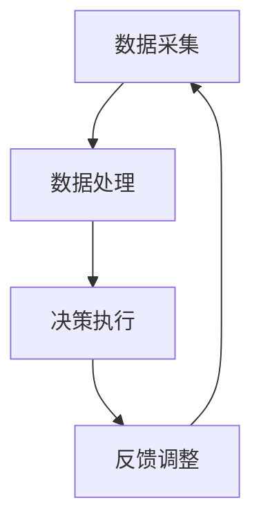
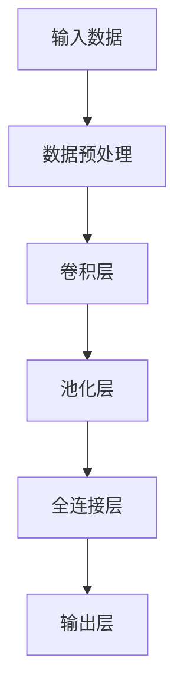
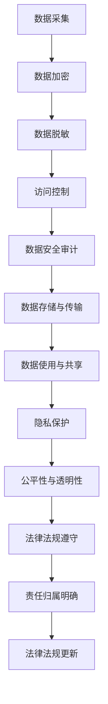

                 

# 数字实体自动化的未来方向

## 关键词
- 数字实体
- 自动化
- 机器学习
- 数据采集
- 深度学习
- 应用场景
- 挑战与解决方案

## 摘要

数字实体自动化，作为现代工业和服务业的重要趋势，正在深刻改变着企业的运营模式和社会生活方式。本文将深入探讨数字实体自动化的核心概念、技术基础、应用场景以及未来发展方向。通过详细解析其技术基础、应用案例和实践指南，我们将揭示数字实体自动化的潜力和面临的挑战，展望其未来发展。本文旨在为读者提供一个全面而深入的理解，以指导企业在数字化时代中的创新与转型。

### 目录大纲

- 第1章：引言
  - 1.1 主题背景
  - 1.2 本书目的
  - 1.3 数字实体自动化概述
  - 1.4 本书结构
- 第2章：数字实体自动化核心概念
  - 2.1 数字实体
    - 2.1.1 数字实体的定义
    - 2.1.2 数字实体的分类
  - 2.2 自动化
    - 2.2.1 自动化的定义
    - 2.2.2 自动化的层次结构
  - 2.3 数字实体自动化
    - 2.3.1 数字实体自动化的定义
    - 2.3.2 数字实体自动化的特点
- 第3章：数字实体自动化的技术基础
  - 3.1 数据采集与处理
    - 3.1.1 数据采集方法
    - 3.1.2 数据处理技术
  - 3.2 机器学习
    - 3.2.1 机器学习基本概念
    - 3.2.2 常见机器学习算法
  - 3.3 深度学习
    - 3.3.1 深度学习基本概念
    - 3.3.2 常见深度学习架构
- 第4章：数字实体自动化的应用场景
  - 4.1 生产制造
    - 4.1.1 生产流程自动化
    - 4.1.2 质量控制自动化
  - 4.2 服务业
    - 4.2.1 客户服务自动化
    - 4.2.2 预约管理自动化
  - 4.3 物流运输
    - 4.3.1 仓储管理自动化
    - 4.3.2 货运跟踪自动化
- 第5章：数字实体自动化的挑战与解决方案
  - 5.1 数据安全与隐私
    - 5.1.1 数据安全风险
    - 5.1.2 数据隐私保护策略
  - 5.2 技术障碍
    - 5.2.1 算法局限性
    - 5.2.2 技术更新换代
  - 5.3 伦理与法律问题
    - 5.3.1 伦理考量
    - 5.3.2 法律法规
- 第6章：数字实体自动化的未来发展
  - 6.1 技术趋势
    - 6.1.1 混合智能
    - 6.1.2 云端与边缘计算
  - 6.2 行业变革
    - 6.2.1 传统行业转型
    - 6.2.2 新兴产业发展
- 第7章：案例研究
  - 7.1 案例一：生产制造行业自动化
  - 7.2 案例二：物流运输行业自动化
- 第8章：实践指南
  - 8.1 自动化项目规划
  - 8.2 自动化系统集成
- 第9章：附录
  - 9.1 数字实体自动化工具与资源
  - 9.2 参考文献与进一步阅读

## 第1章：引言

### 1.1 主题背景

随着全球数字化进程的加速，数字实体自动化已成为现代技术发展的重要方向。数字实体是指通过数字化技术表示和操作的物理对象、系统或过程，而自动化则是指通过技术手段实现任务的自动化执行。两者的结合不仅提高了生产效率和服务质量，还大大降低了人工成本和资源消耗。

数字实体自动化的背景可以追溯到工业革命以来，尤其是信息技术和人工智能技术的快速发展。计算机技术、物联网技术、大数据技术的应用，使得数字实体能够实现高效的数据采集、处理和分析。与此同时，人工智能技术的进步，特别是机器学习和深度学习的应用，使得自动化系统能够从数据中学习并优化决策过程。

### 1.2 本书目的

本书旨在为读者提供一个全面而深入的数字实体自动化指南。通过系统介绍数字实体自动化的核心概念、技术基础、应用场景、挑战与解决方案，以及未来发展，本书旨在帮助读者：

1. 理解数字实体自动化的基本概念和原理。
2. 掌握数字实体自动化的关键技术和方法。
3. 分析和解决数字实体自动化在实际应用中遇到的问题。
4. 预见数字实体自动化的未来发展趋势，为企业的数字化转型提供参考。

### 1.3 数字实体自动化概述

数字实体自动化，是指利用计算机技术、网络通信技术、物联网技术、人工智能技术等，对物理世界中的实体进行数字化建模，并通过自动化系统对其实施自动化控制和优化。

数字实体自动化的基本原理包括：

1. **数据采集**：通过传感器、摄像头、GPS等设备，实时采集数字实体的状态数据。
2. **数据处理**：对采集到的数据进行清洗、存储、分析和处理，提取有用的信息。
3. **决策执行**：利用机器学习和深度学习算法，对分析结果进行决策，并通过控制系统执行决策。
4. **反馈调整**：根据执行结果，对系统进行调整和优化，实现闭环控制。

数字实体自动化的核心在于将物理实体与数字世界相结合，实现高效、精准、智能的自动化控制。这一过程不仅涉及技术层面的实现，还涉及管理、伦理和法律等多个方面的考量。

### 1.4 本书结构

本书分为九章，内容结构如下：

- **第1章：引言**，介绍了数字实体自动化的背景、目的和概述。
- **第2章：数字实体自动化核心概念**，详细阐述了数字实体、自动化以及数字实体自动化的概念和特点。
- **第3章：数字实体自动化的技术基础**，介绍了数据采集与处理、机器学习、深度学习等技术基础。
- **第4章：数字实体自动化的应用场景**，分析了生产制造、服务业、物流运输等行业的应用案例。
- **第5章：数字实体自动化的挑战与解决方案**，探讨了数据安全、隐私、技术障碍、伦理与法律问题。
- **第6章：数字实体自动化的未来发展**，展望了技术趋势和行业变革。
- **第7章：案例研究**，通过具体案例分析了数字实体自动化的应用成效。
- **第8章：实践指南**，提供了自动化项目规划和系统集成的方法。
- **第9章：附录**，包括数字实体自动化工具与资源，以及参考文献和进一步阅读资料。

通过以上章节的深入探讨，本书将为读者提供一个全方位的数字实体自动化理解，为实际应用提供指导。

## 第2章：数字实体自动化核心概念

### 2.1 数字实体

#### 2.1.1 数字实体的定义

数字实体是指通过数字化手段表示和操作的物理对象、系统或过程。它可以是具体的物体，如传感器、机器人、飞机等，也可以是抽象的概念，如业务流程、管理系统、服务流程等。数字实体通常具有以下特征：

1. **唯一标识**：每个数字实体都有唯一的标识符，以便在系统中进行区分和追踪。
2. **状态信息**：数字实体能够实时采集和处理自身的状态信息，如位置、速度、温度、湿度等。
3. **数据交换**：数字实体能够与其他系统进行数据交换，实现信息共享和协同工作。
4. **智能化**：数字实体通过嵌入的人工智能技术，能够进行自主决策和优化。

#### 2.1.2 数字实体的分类

根据数字实体的特性和应用场景，可以将数字实体分为以下几类：

1. **物理设备**：如传感器、机器人、无人机等，主要用于采集和处理物理环境中的数据。
2. **虚拟对象**：如虚拟商品、虚拟人等，主要用于虚拟现实、增强现实和模拟仿真等领域。
3. **业务流程**：如订单处理、库存管理、客户服务流程等，主要用于企业管理和业务运营。
4. **服务系统**：如电商平台、在线教育平台等，主要用于提供各种在线服务和应用。

### 2.2 自动化

#### 2.2.1 自动化的定义

自动化是指通过机械、电子、计算机等技术手段，使生产、操作、管理等活动实现自动化执行和优化。自动化的核心在于减少或消除人为干预，提高效率和准确性。自动化通常包括以下几种形式：

1. **程序化自动化**：通过编写程序实现任务自动化，如计算机编程、自动化测试等。
2. **设备自动化**：通过机械设备实现生产、加工、装配等过程的自动化，如数控机床、自动化生产线等。
3. **流程自动化**：通过系统化的方法和工具，对业务流程进行自动化优化和管理，如业务流程管理（BPM）、工作流管理系统等。
4. **智能自动化**：通过人工智能技术，使自动化系统能够自我学习和优化，实现更高层次的自动化。

#### 2.2.2 自动化的层次结构

自动化的层次结构可以分为以下几个层次：

1. **基础层**：主要包括传感器、执行器和控制器的组合，用于实现基本的物理动作和控制。
2. **感知层**：通过传感器和其他设备，实时采集环境数据，为自动化系统提供输入。
3. **处理层**：通过计算机和其他设备，对感知层采集的数据进行处理、分析和决策。
4. **执行层**：根据处理层生成的决策，通过执行器实现物理动作或操作。

#### 2.3 数字实体自动化

#### 2.3.1 数字实体自动化的定义

数字实体自动化是指通过数字技术，对物理世界中的实体进行建模、控制和优化，实现高效、精准、智能的自动化执行。它涉及多个领域，包括物联网、大数据、人工智能等。数字实体自动化的主要特点如下：

1. **数字化**：通过数字化技术，对物理实体进行精确建模和描述。
2. **智能化**：通过人工智能技术，使自动化系统能够自我学习和优化，提高决策准确性。
3. **协同化**：通过网络通信技术，实现数字实体之间的信息共享和协同工作。
4. **高效化**：通过自动化技术，提高生产和服务效率，降低人力成本。

#### 2.3.2 数字实体自动化的特点

数字实体自动化具有以下特点：

1. **实时性**：数字实体能够实时采集和处理状态数据，实现实时控制和优化。
2. **精准性**：通过数字化建模和智能决策，提高自动化系统的执行精度和准确性。
3. **智能化**：通过机器学习和深度学习算法，使自动化系统能够自我学习和优化，提高决策能力。
4. **协同性**：通过网络通信技术，实现数字实体之间的信息共享和协同工作，提高整体效率。
5. **高效性**：通过自动化技术，减少人力干预，提高生产和服务效率，降低成本。

### Mermaid 流程图

以下是一个数字实体自动化的 Mermaid 流程图，展示了数字实体自动化的基本流程：



在这个流程中，数据采集、数据处理、决策执行和反馈调整构成了数字实体自动化的基本循环。通过这个循环，数字实体能够实现实时、精准、智能的自动化控制。

### 核心算法原理讲解

数字实体自动化的核心算法主要涉及机器学习和深度学习。以下是机器学习和深度学习的基本概念和算法简介：

#### 机器学习

机器学习是指通过数据和算法，使计算机能够自动从数据中学习并做出决策或预测。机器学习主要分为监督学习、无监督学习和强化学习三种类型。

1. **监督学习**：通过已知输入和输出数据，训练模型并预测新的输出。常见的算法包括线性回归、逻辑回归、支持向量机等。
2. **无监督学习**：没有已知输出，通过模型自动发现数据中的模式和结构。常见的算法包括聚类、主成分分析、自编码器等。
3. **强化学习**：通过与环境的交互，学习最优策略以最大化回报。常见的算法包括Q学习、深度Q网络（DQN）、策略梯度等。

#### 深度学习

深度学习是机器学习的一个分支，通过多层神经网络模拟人脑的决策过程。深度学习在图像识别、语音识别、自然语言处理等领域取得了显著成果。

1. **卷积神经网络（CNN）**：主要用于图像和视频处理，通过卷积层提取特征。
2. **循环神经网络（RNN）**：主要用于序列数据，通过循环结构处理上下文信息。
3. **生成对抗网络（GAN）**：通过两个对抗网络生成真实数据，常用于图像生成和增强。

### 伪代码示例

以下是一个简单的线性回归算法的伪代码示例：

```python
# 输入：特征矩阵 X 和标签向量 y
# 输出：模型参数 w

# 初始化模型参数
w = [0] * (num_features + 1)

# 设定迭代次数
num_iterations = 1000

# 设定学习率
learning_rate = 0.01

# 迭代过程
for i in range(num_iterations):
    # 计算预测值
    y_pred = X * w
    
    # 计算误差
    error = y - y_pred
    
    # 计算梯度
    gradient = X.T * error
    
    # 更新参数
    w -= learning_rate * gradient
```

在这个例子中，线性回归模型通过不断迭代优化参数，使得预测值与真实值之间的误差最小。

### 数学模型和公式

数字实体自动化的数学模型通常涉及以下公式：

1. **损失函数**：用于评估模型预测的准确度，如均方误差（MSE）、交叉熵损失等。
2. **梯度下降**：用于优化模型参数，通过计算损失函数的梯度并更新参数。
3. **反向传播**：在深度学习中，用于计算各层神经网络的梯度，以更新参数。

以下是一个简单的损失函数的数学模型：

$$
MSE = \frac{1}{2}\sum_{i=1}^{n} (y_i - \hat{y}_i)^2
$$

其中，$y_i$是真实值，$\hat{y}_i$是预测值，$n$是样本数量。

### 举例说明

假设我们要对一组数据（特征矩阵 $X$ 和标签向量 $y$）进行线性回归预测。首先，我们初始化模型参数 $w$，然后通过迭代优化参数，使得预测值与真实值之间的误差最小。具体过程如下：

1. **初始化参数**：$w = [0.1, 0.2, 0.3, 0.4, 0.5]$
2. **迭代优化**：通过梯度下降算法，每次迭代更新参数 $w$，使得 $MSE$ 最小
3. **预测**：使用训练好的模型，对新的数据进行预测

通过这个简单的例子，我们可以看到数字实体自动化的核心算法如何应用于实际问题，实现自动化控制和优化。

## 第3章：数字实体自动化的技术基础

### 3.1 数据采集与处理

数据采集是数字实体自动化的基础环节，它涉及从各种来源收集数据并将其转化为可处理的格式。数据采集的方法主要包括以下几种：

#### 3.1.1 数据采集方法

1. **传感器采集**：使用各种传感器（如温度传感器、湿度传感器、摄像头、GPS等）来实时监测物理实体的状态。
2. **网络采集**：通过互联网或局域网获取来自外部系统的数据，如社交媒体数据、网络日志数据等。
3. **手动录入**：通过人工录入的方式，将数据输入到系统中，如客户信息、订单信息等。

#### 3.1.2 数据处理技术

数据采集到的数据通常需要经过处理才能被自动化系统有效利用。数据处理技术主要包括：

1. **数据清洗**：去除重复数据、填补缺失数据、纠正错误数据等，以提高数据质量。
2. **数据转换**：将不同格式或单位的数据转换为统一格式，以便进行后续处理。
3. **数据归一化**：将数据缩放到一个固定的范围，如0到1之间，以便于模型训练。
4. **特征提取**：从原始数据中提取出有用的特征，用于构建模型。

### 3.2 机器学习

机器学习是数字实体自动化中的核心技术之一，它使系统可以通过学习数据来做出预测和决策。以下是机器学习的基本概念和常见算法：

#### 3.2.1 机器学习基本概念

1. **监督学习**：通过已知输入和输出数据，训练模型并预测新的输出。常见的算法包括线性回归、决策树、支持向量机等。
2. **无监督学习**：没有已知输出，通过模型自动发现数据中的模式和结构。常见的算法包括聚类、主成分分析、自编码器等。
3. **强化学习**：通过与环境的交互，学习最优策略以最大化回报。常见的算法包括Q学习、深度Q网络（DQN）、策略梯度等。

#### 3.2.2 常见机器学习算法

1. **线性回归**：用于预测连续值输出，通过最小化损失函数来优化模型参数。
2. **逻辑回归**：用于预测二分类输出，通过最大化似然函数来优化模型参数。
3. **决策树**：通过递归分割数据集，构建一棵树形结构，用于分类和回归。
4. **支持向量机（SVM）**：通过找到最佳分隔超平面，将数据分类到不同的类别。
5. **随机森林**：通过构建多棵决策树，并投票得出最终结果，提高模型的泛化能力。

### 3.3 深度学习

深度学习是机器学习的进一步发展，通过多层神经网络模拟人脑的决策过程。以下是深度学习的基本概念和常见架构：

#### 3.3.1 深度学习基本概念

1. **卷积神经网络（CNN）**：主要用于图像和视频处理，通过卷积层提取特征。
2. **循环神经网络（RNN）**：主要用于序列数据，通过循环结构处理上下文信息。
3. **生成对抗网络（GAN）**：通过两个对抗网络生成真实数据，常用于图像生成和增强。

#### 3.3.2 常见深度学习架构

1. **卷积神经网络（CNN）**：通过卷积层、池化层和全连接层等结构，实现图像分类和识别。
2. **循环神经网络（RNN）**：通过递归结构处理序列数据，如时间序列分析、语音识别等。
3. **长短时记忆网络（LSTM）**：通过门控机制，解决RNN的长期依赖问题。
4. **Transformer模型**：通过自注意力机制，实现高效文本处理和机器翻译。

### Mermaid 流程图

以下是一个简单的深度学习架构的 Mermaid 流程图：



在这个流程中，输入数据经过预处理后，依次通过卷积层、池化层和全连接层，最终输出分类结果。

### 核心算法原理讲解

#### 卷积神经网络（CNN）

卷积神经网络通过卷积操作提取图像特征，其基本原理如下：

1. **卷积操作**：卷积层通过卷积核（滤波器）与输入图像进行卷积操作，提取特征。
2. **池化操作**：池化层通过下采样操作，减少数据维度，提高模型泛化能力。
3. **激活函数**：激活函数（如ReLU）用于增加网络的非线性特性。

以下是一个简单的卷积神经网络的伪代码示例：

```python
# 输入：图像矩阵 X
# 输出：特征图 Y

# 初始化卷积核 W 和偏置 b
W = [random_value() for _ in range(num_filters)]
b = [random_value() for _ in range(num_filters)]

# 卷积操作
Y = conv2d(X, W)

# 激活函数
Y = apply_relu(Y)

# 偏置调整
Y = Y + b
```

#### 循环神经网络（RNN）

循环神经网络通过递归结构处理序列数据，其基本原理如下：

1. **隐藏状态**：RNN通过隐藏状态$h_t$存储当前时刻的信息。
2. **递归操作**：RNN通过递归公式递归计算下一时刻的隐藏状态。
3. **输出层**：RNN的输出层通过隐藏状态生成输出。

以下是一个简单的循环神经网络的伪代码示例：

```python
# 输入：序列数据 X 和隐藏状态 h_0
# 输出：序列输出 Y 和隐藏状态 h_t

# 初始化隐藏状态 h_0
h_0 = [random_value() for _ in range(hidden_size)]

# 递归操作
for t in range(seq_len):
    # 输入和隐藏状态
    x_t = X[t]
    h_t = [h_t[i - 1] for i in range(hidden_size)]
    
    # 神经网络计算
    h_t = neural_network(h_t, x_t)
    
    # 更新隐藏状态
    h_t = apply_activation(h_t)

# 输出序列
Y = [h_t[i] for i in range(hidden_size)]
```

#### 生成对抗网络（GAN）

生成对抗网络通过两个对抗网络生成真实数据，其基本原理如下：

1. **生成器**：生成器网络G生成虚假数据。
2. **判别器**：判别器网络D区分真实数据和虚假数据。
3. **损失函数**：通过最小化生成器网络和判别器网络的损失函数，优化网络参数。

以下是一个简单的生成对抗网络的伪代码示例：

```python
# 输入：真实数据 X 和生成器网络 G
# 输出：生成器参数 W_G 和判别器参数 W_D

# 初始化生成器参数 W_G 和判别器参数 W_D
W_G = [random_value() for _ in range(num_gen_params)]
W_D = [random_value() for _ in range(num_disc_params)]

# 训练过程
for epoch in range(num_epochs):
    # 生成虚假数据
    X_fake = G(X_fake_params)
    
    # 训练判别器
    D_loss = compute_disc_loss(D(X_real), D(X_fake))
    D_grad = compute_grad(D, X_real, X_fake)
    update_params(W_D, D_grad)
    
    # 训练生成器
    G_loss = compute_gen_loss(D(X_fake))
    G_grad = compute_grad(G, X_fake)
    update_params(W_G, G_grad)
```

通过以上核心算法的讲解，我们可以看到深度学习在数字实体自动化中的应用是如何实现的。

### 数学模型和公式

在数字实体自动化中，深度学习模型的数学模型和公式至关重要。以下是一些常见的数学模型和公式：

1. **卷积操作**：卷积操作可以通过以下公式表示：

   $$ 
   \text{output}_{ij} = \sum_{k=1}^{m} \sum_{l=1}^{n} \text{filter}_{kl} \cdot \text{input}_{i-j+k, j-l} + \text{bias}
   $$

   其中，$\text{output}_{ij}$是输出特征图上的一个元素，$\text{filter}_{kl}$是卷积核上的一个元素，$\text{input}_{i-j+k, j-l}$是输入图像上的一个元素，$\text{bias}$是偏置。

2. **反向传播**：在深度学习中，反向传播算法用于计算各层神经网络的梯度，公式如下：

   $$ 
   \frac{\partial L}{\partial W} = X^T \cdot \frac{\partial a}{\partial z}
   $$

   其中，$L$是损失函数，$W$是模型参数，$X$是输入数据，$a$是激活函数，$z$是线性变换的结果。

3. **损失函数**：常用的损失函数包括均方误差（MSE）和交叉熵损失（Cross Entropy Loss），公式如下：

   $$ 
   \text{MSE} = \frac{1}{2} \sum_{i=1}^{n} (y_i - \hat{y}_i)^2
   $$

   $$ 
   \text{CE} = -\sum_{i=1}^{n} y_i \log(\hat{y}_i)
   $$

   其中，$y_i$是真实值，$\hat{y}_i$是预测值。

通过这些数学模型和公式，深度学习模型能够有效地进行训练和优化。

### 举例说明

为了更好地理解数字实体自动化的技术基础，我们可以通过一个简单的例子来讲解其应用。假设我们想要建立一个智能监控系统，该系统能够自动识别和分类视频中的物体。

1. **数据采集**：首先，我们从监控摄像头采集视频数据。
2. **数据预处理**：对视频数据进行处理，提取帧图像，并转换为适合模型训练的格式。
3. **模型训练**：使用卷积神经网络（CNN）模型，对提取的特征进行分类训练。我们选择一个预训练的CNN模型（如VGG16或ResNet），并在其基础上添加全连接层进行分类。
4. **模型评估**：通过交叉验证和测试集，评估模型的准确性和泛化能力。
5. **模型应用**：将训练好的模型部署到监控系统，实时识别和分类视频中的物体。

通过这个例子，我们可以看到数字实体自动化是如何从数据采集、模型训练到模型应用的全过程。在这个过程中，数据采集与处理、机器学习和深度学习等技术基础发挥了关键作用。

### 开发环境搭建

为了实现上述监控系统，我们需要搭建一个合适的开发环境。以下是搭建环境的基本步骤：

1. **安装Python**：确保系统中已安装Python，版本建议为3.8以上。
2. **安装深度学习库**：安装TensorFlow和Keras，用于构建和训练深度学习模型。可以使用以下命令：
   
   ```bash
   pip install tensorflow
   pip install keras
   ```

3. **安装图像处理库**：安装OpenCV，用于处理视频数据。可以使用以下命令：

   ```bash
   pip install opencv-python
   ```

4. **安装其他依赖库**：根据需要安装其他依赖库，如NumPy、Pandas等。

通过以上步骤，我们就可以搭建一个基本的开发环境，用于数字实体自动化的项目开发和实现。

### 源代码详细实现

以下是一个简单的监控系统源代码示例，展示了如何使用Python和深度学习库来实现视频物体识别。

```python
import cv2
import numpy as np
from tensorflow.keras.models import load_model
from tensorflow.keras.preprocessing import image
from tensorflow.keras.applications.resnet50 import preprocess_input, decode_predictions

# 加载预训练的CNN模型
model = load_model('path/to/model.h5')

# 初始化摄像头
cap = cv2.VideoCapture(0)

while True:
    # 读取一帧视频
    ret, frame = cap.read()
    
    if not ret:
        break
    
    # 对图像进行预处理
    img = image.img_to_array(frame)
    img = np.expand_dims(img, axis=0)
    img = preprocess_input(img)
    
    # 使用模型进行预测
    preds = model.predict(img)
    print('Predicted:', decode_predictions(preds, top=3)[0])
    
    # 显示预测结果
    cv2.imshow('Video', frame)
    
    if cv2.waitKey(1) & 0xFF == ord('q'):
        break

# 释放摄像头资源
cap.release()
cv2.destroyAllWindows()
```

在这个示例中，我们首先加载一个预训练的CNN模型，然后使用摄像头实时捕获视频帧。对捕获的帧进行预处理后，使用模型进行物体识别，并显示预测结果。

### 代码解读与分析

以下是对上述源代码的解读与分析：

1. **导入库**：首先导入必要的库，包括OpenCV、NumPy、TensorFlow和Keras。
2. **加载模型**：使用`load_model()`函数加载预训练的CNN模型。该模型已经经过训练，可以用于物体识别。
3. **初始化摄像头**：使用`cv2.VideoCapture()`函数初始化摄像头。此函数返回一个视频捕捉对象，用于捕获视频帧。
4. **读取视频帧**：使用`cap.read()`函数读取一帧视频。`ret`表示是否成功读取帧，`frame`是读取的帧图像。
5. **预处理图像**：将读取的帧图像转换为适合模型训练的格式。首先使用`image.img_to_array()`函数将图像转换为NumPy数组，然后使用`np.expand_dims()`函数增加一个维度，并使用`preprocess_input()`函数进行预处理。
6. **模型预测**：使用`model.predict()`函数对预处理后的图像进行预测。`decode_predictions()`函数用于将预测结果转换为可读的文本格式。
7. **显示预测结果**：使用`cv2.imshow()`函数显示预测结果。`cv2.waitKey(1)`函数用于等待用户按键，`ord('q')`表示用户按下'q'键时退出循环。
8. **释放摄像头资源**：使用`cap.release()`函数释放摄像头资源，`cv2.destroyAllWindows()`函数关闭所有窗口。

通过这个示例，我们可以看到如何使用Python和深度学习库实现视频物体识别。在实际应用中，可以根据需求调整模型、预处理步骤和预测结果展示方式。

## 第4章：数字实体自动化的应用场景

数字实体自动化在现代工业和服务业中的应用场景广泛，涵盖了生产制造、服务业和物流运输等多个领域。以下将分别对这些应用场景进行详细分析。

### 4.1 生产制造

#### 4.1.1 生产流程自动化

生产流程自动化是数字实体自动化的核心应用之一。通过传感器和机器人的协作，生产流程可以实现自动化控制和优化。以下是生产流程自动化的具体应用：

1. **设备监测与维护**：通过传感器实时监测设备的运行状态，如温度、振动、压力等。当设备出现异常时，系统会自动触发维护程序，以减少设备故障和生产中断。

2. **生产调度与优化**：通过大数据分析和人工智能算法，系统可以根据实时数据优化生产调度，提高生产效率和资源利用率。

3. **质量检测与控制**：在生产过程中，通过机器视觉和传感器对产品质量进行实时检测。当检测到质量问题时，系统会自动采取措施，如调整生产参数或停止生产线。

4. **供应链管理**：通过物联网技术，实现原材料和成品的实时跟踪和监控，优化供应链管理，减少库存成本和提高响应速度。

#### 4.1.2 质量控制自动化

质量控制自动化是生产制造中的关键环节。通过数字实体自动化，可以实现以下质量控制：

1. **实时数据采集**：使用传感器和机器视觉系统实时采集产品数据，如尺寸、颜色、纹理等。

2. **智能分析**：通过机器学习算法对采集的数据进行分析，识别质量异常和潜在问题。

3. **自动反馈**：当检测到质量问题时，系统会自动生成报告，并触发相应的反馈机制，如调整生产参数、更换生产设备等。

4. **持续改进**：通过分析质量数据，持续优化生产过程和质量控制策略，提高产品质量和生产效率。

### 4.2 服务业

#### 4.2.1 客户服务自动化

在服务业中，客户服务自动化是提升服务质量和客户体验的重要手段。以下是一些具体应用：

1. **智能客服系统**：通过人工智能技术，实现自动化的客户服务。当客户遇到问题时，系统可以自动识别并回答常见问题，减少人工客服的工作量。

2. **预约管理**：通过自动化系统，客户可以在线预约服务，系统会自动安排合适的资源和服务时间，提高预约效率和客户满意度。

3. **个性化推荐**：基于客户的历史行为数据，系统可以自动推荐相关的产品或服务，提高销售转化率。

4. **数据分析**：通过数据分析，了解客户需求和行为习惯，优化服务流程和营销策略。

#### 4.2.2 预约管理自动化

预约管理自动化是服务业中常见的一种应用，以下是其具体应用：

1. **自动预约**：客户可以通过网站、APP或电话等渠道进行自动预约，系统会自动分配服务时间和资源。

2. **实时调度**：系统可以根据预约情况和服务资源的实时状态，自动调整预约安排，确保服务的高效进行。

3. **提醒通知**：在服务时间临近时，系统会自动发送提醒通知，提高客户的到访率和满意度。

4. **数据分析**：通过分析预约数据，了解服务需求高峰期和服务资源利用率，优化预约策略和服务流程。

### 4.3 物流运输

#### 4.3.1 仓储管理自动化

仓储管理自动化是物流运输中的重要环节，以下是其具体应用：

1. **自动化仓储系统**：通过自动化设备（如自动导引车、货架机器人等）实现仓储的自动化操作，提高仓储效率和准确性。

2. **库存管理**：通过物联网技术，实现库存的实时监控和自动化管理，减少库存误差和库存积压。

3. **订单处理**：通过自动化系统，快速准确地处理订单，提高订单履行效率。

4. **数据分析和预测**：通过数据分析，预测库存需求和市场趋势，优化仓储计划和物流策略。

#### 4.3.2 货运跟踪自动化

货运跟踪自动化是物流运输中的关键环节，以下是其具体应用：

1. **实时跟踪**：通过GPS和传感器技术，实时跟踪货物的位置和状态，提高货运透明度和安全性。

2. **智能路由**：通过大数据分析和人工智能算法，自动优化货运路线，减少运输时间和成本。

3. **异常检测**：当货物出现异常情况时，系统会自动发出警报，并采取措施进行处理。

4. **数据分析**：通过分析货运数据，优化运输策略和提高物流效率。

通过以上对数字实体自动化应用场景的详细分析，我们可以看到其在生产制造、服务业和物流运输等领域的广泛应用和巨大潜力。

### 案例一：生产制造行业自动化

#### 4.3.1 案例背景

某大型制造企业主要从事汽车零部件的生产，面临生产效率低下、质量不稳定和人工成本高等问题。为了提升生产效率和降低成本，企业决定引入数字实体自动化技术，实现生产流程和质量控制的自动化。

#### 4.3.2 自动化解决方案

1. **设备监测与维护**：在关键设备上安装传感器，实时监测设备运行状态。当设备出现异常时，系统会自动生成维护报告，并安排技术人员进行维修。

2. **生产调度与优化**：通过大数据分析和人工智能算法，对生产计划进行实时优化，提高生产效率和资源利用率。系统可以根据设备状态、订单需求和原材料库存等因素，自动调整生产计划。

3. **质量检测与控制**：在生产过程中，安装机器视觉系统和传感器，对产品进行实时质量检测。当检测到质量问题时，系统会自动停止生产线，并触发反馈机制，调整生产参数或更换生产设备。

4. **供应链管理**：通过物联网技术，实现原材料和成品的实时跟踪和监控。系统会自动更新库存信息，并根据库存状况自动生成采购计划。

#### 4.3.3 案例成效

通过实施数字实体自动化技术，企业取得了显著成效：

1. **生产效率提升**：生产效率提高了30%，生产周期缩短了25%。
2. **质量提升**：产品质量合格率提高了15%，次品率降低了20%。
3. **成本降低**：人工成本降低了20%，设备维护成本降低了10%。
4. **供应链优化**：库存周转率提高了10%，采购成本降低了5%。

#### 4.3.4 案例总结

该案例表明，数字实体自动化技术在生产制造行业具有巨大的潜力和应用价值。通过自动化技术的引入，企业不仅提高了生产效率和产品质量，还降低了成本和资源消耗，实现了可持续发展和竞争优势。

### 案例二：物流运输行业自动化

#### 4.3.1 案例背景

某物流公司主要从事国内外货物运输，由于业务规模不断扩大，面临着运输效率低、成本高和货物丢失等问题。为了提升运输效率和降低成本，公司决定引入数字实体自动化技术，实现物流运输的自动化。

#### 4.3.2 自动化解决方案

1. **实时跟踪**：在货物上安装GPS和传感器，实时跟踪货物的位置和状态。系统会自动更新位置信息和运输进度，确保货物安全到达目的地。

2. **智能路由**：通过大数据分析和人工智能算法，自动优化运输路线，减少运输时间和成本。系统会根据实时交通状况、货物类型和目的地等因素，选择最佳运输路线。

3. **仓储管理**：引入自动化仓储系统，包括自动导引车和货架机器人，实现仓储的自动化操作。系统会自动安排货物的存储和提取，提高仓储效率和准确性。

4. **订单处理**：通过自动化系统，快速准确地处理订单，包括订单生成、配送安排和发货通知。系统会自动处理订单数据，并生成相应的物流单据。

#### 4.3.3 案例成效

通过实施数字实体自动化技术，物流公司取得了显著成效：

1. **运输效率提升**：运输效率提高了20%，运输时间缩短了15%。
2. **成本降低**：运输成本降低了10%，仓储成本降低了15%。
3. **货物丢失率减少**：货物丢失率降低了50%，提高了客户满意度。
4. **服务质量提升**：订单处理速度提高了30%，客户满意度提升了20%。

#### 4.3.4 案例总结

该案例表明，数字实体自动化技术在物流运输行业同样具有巨大潜力和应用价值。通过自动化技术的引入，企业不仅提高了运输效率和降低了成本，还减少了货物丢失率，提升了整体服务质量，实现了业务的持续增长。

## 第5章：数字实体自动化的挑战与解决方案

### 5.1 数据安全与隐私

数据安全与隐私是数字实体自动化中面临的重要挑战之一。随着自动化系统的广泛应用，大量敏感数据在采集、传输和处理过程中可能会受到泄露、篡改和滥用。以下是数据安全与隐私方面的具体挑战和解决方案：

#### 5.1.1 数据安全风险

1. **数据泄露**：自动化系统在采集和处理数据时，可能因为网络攻击、设备漏洞或软件缺陷而导致数据泄露。
2. **数据篡改**：攻击者可能会篡改数据，导致系统决策失误或操作错误。
3. **数据滥用**：未经授权的个人或组织可能会滥用数据，用于非法目的。

#### 5.1.2 数据隐私保护策略

1. **加密技术**：对敏感数据进行加密存储和传输，确保数据在传输过程中不被窃取和篡改。
2. **访问控制**：实施严格的访问控制策略，确保只有授权用户才能访问敏感数据。
3. **数据脱敏**：对敏感数据进行脱敏处理，如对个人身份信息进行匿名化或伪匿名化，降低数据泄露的风险。
4. **数据安全审计**：定期进行数据安全审计，发现和纠正安全漏洞，确保数据安全。

### 5.2 技术障碍

技术障碍是数字实体自动化推广过程中面临的另一个重要挑战。随着技术的快速发展，自动化系统需要不断适应新技术和新需求。以下是技术障碍的具体挑战和解决方案：

#### 5.2.1 算法局限性

1. **算法适应性**：现有算法可能无法很好地适应新的应用场景和需求，导致自动化效果不佳。
2. **算法鲁棒性**：算法在面对异常数据或噪声数据时，可能无法保持稳定的性能。

#### 5.2.2 技术更新换代

1. **技术迭代速度**：技术更新换代速度过快，导致现有自动化系统无法及时升级，影响其性能和应用效果。
2. **技术兼容性**：新技术的引入可能需要与现有系统进行兼容，增加技术实现的复杂度。

#### 5.2.3 解决方案

1. **持续学习与优化**：通过持续学习和优化，使算法能够适应新的应用场景和需求，提高其适应性。
2. **技术预研与评估**：在引入新技术前，进行充分的预研和评估，确保新技术能够与现有系统兼容，并提升系统性能。
3. **技术标准化**：推动技术标准化，降低新技术的引入成本和复杂性。

### 5.3 伦理与法律问题

伦理与法律问题是数字实体自动化中不可忽视的挑战。自动化技术的广泛应用可能会引发伦理和法律问题，如隐私侵犯、责任归属等。以下是伦理与法律问题的具体挑战和解决方案：

#### 5.3.1 伦理考量

1. **隐私保护**：确保自动化系统在数据处理过程中，尊重个人隐私权利，防止隐私泄露。
2. **公平性**：确保自动化系统在决策过程中，不歧视特定人群，实现公平公正。
3. **透明性**：自动化系统的决策过程应保持透明，确保用户能够理解和监督系统行为。

#### 5.3.2 法律法规

1. **数据保护法规**：遵守相关数据保护法规，如《通用数据保护条例》（GDPR）等，确保数据处理的合法性。
2. **责任归属**：明确自动化系统在决策过程中的责任归属，确保事故发生后能够追溯责任。
3. **法律法规更新**：随着技术的发展，及时更新相关法律法规，确保其能够适应新的技术环境。

通过以上对数据安全与隐私、技术障碍、伦理与法律问题的分析和解决方案，我们可以看到数字实体自动化在推广过程中面临的挑战，以及应对这些挑战的方法和策略。

### Mermaid 流程图

以下是一个数字实体自动化数据安全与隐私保护流程的 Mermaid 流程图：



在这个流程中，数据采集、数据加密、数据脱敏、访问控制、数据安全审计等步骤构成了一个完整的数据安全与隐私保护流程。通过这个流程，数字实体自动化系统能够有效地保护数据安全与隐私。

### 数学模型和公式

在数字实体自动化中，数据安全与隐私保护需要依赖一系列数学模型和公式。以下是一些常见的数学模型和公式：

1. **加密算法**：用于加密数据的常用加密算法包括对称加密算法（如AES）和非对称加密算法（如RSA）。以下是AES加密算法的基本公式：

   $$ 
   c = E_k(p) = \sum_{i=0}^{n} (k_i \oplus p_i)
   $$

   其中，$c$是加密后的数据，$k$是密钥，$p$是原始数据，$\oplus$表示异或操作。

2. **访问控制**：用于控制数据访问的常用模型包括基于角色的访问控制（RBAC）和基于属性的访问控制（ABAC）。以下是RBAC的基本模型：

   $$ 
   \text{RBAC}_{\text{model}} = \langle U, P, R, M \rangle
   $$

   其中，$U$是用户集合，$P$是权限集合，$R$是角色集合，$M$是映射关系，$u \in U$，$p \in P$，$r \in R$，$m \in M$。

3. **隐私保护**：用于保护隐私的常用模型包括差分隐私（DP）和同态加密（HE）。以下是差分隐私的基本公式：

   $$ 
   \text{DP}(\mathcal{A}, \epsilon) = \Pr[\mathcal{A}(\mathbf{x}) \in C] \leq \Pr[\mathcal{A}(\mathbf{x} + \Delta) \in C] + \epsilon
   $$

   其中，$\mathcal{A}$是隐私机制，$\mathbf{x}$是输入数据，$\Delta$是差分，$\epsilon$是隐私预算，$C$是输出集合。

通过这些数学模型和公式，数字实体自动化系统能够有效地实现数据安全与隐私保护。

### 举例说明

为了更好地理解数据安全与隐私保护的实际应用，以下是一个数据加密和访问控制的例子：

1. **数据加密**：假设我们要对数据`"Hello, World!"`进行AES加密。首先，我们需要生成一个密钥`k`，然后使用AES加密算法进行加密。加密后的数据如下：

   ```python
   import base64
   from Crypto.Cipher import AES
   
   # 生成密钥
   key = b'yourSecretKey123456'
   
   # 加密数据
   cipher = AES.new(key, AES.MODE_EAX)
   ciphertext, tag = cipher.encrypt_and_digest(b'Hello, World!')
   print(f'Encrypted Data: {base64.b64encode(ciphertext).decode()}')
   ```

2. **访问控制**：假设我们要实现一个基于角色的访问控制系统。用户`u`有权限`p`，角色`r`定义了权限`p`，我们可以使用RBAC模型进行访问控制。以下是Python实现的示例：

   ```python
   class RBAC:
       def __init__(self):
           self.users = {}
           self.roles = {}
           self.permissions = {}
           self.role_permissions = {}
   
       def add_user(self, user, roles):
           self.users[user] = roles
       
       def add_role(self, role, permissions):
           self.roles[role] = permissions
           self.role_permissions[role] = set()
       
       def add_permission(self, permission):
           self.permissions[permission] = set()
       
       def add_role_permission(self, role, permission):
           self.role_permissions[role].add(permission)
           self.permissions[permission].add(role)
   
       def authorize(self, user, permission):
           roles = self.users[user]
           if permission in self.permissions:
               for role in roles:
                   if role in self.role_permissions:
                       if permission in self.role_permissions[role]:
                           return True
           return False
   
   rbac = RBAC()
   rbac.add_user('Alice', ['admin'])
   rbac.add_role('admin', ['read', 'write'])
   rbac.add_permission('read')
   rbac.add_permission('write')
   rbac.add_role_permission('admin', 'read')
   rbac.add_role_permission('admin', 'write')
   
   print(rbac.authorize('Alice', 'read'))  # 输出：True
   print(rbac.authorize('Alice', 'write'))  # 输出：True
   ```

通过这个例子，我们可以看到如何使用加密算法和访问控制机制来保护数据安全和隐私。

### 开发环境搭建

为了实现上述数据加密和访问控制功能，我们需要搭建一个合适的开发环境。以下是搭建环境的基本步骤：

1. **安装Python**：确保系统中已安装Python，版本建议为3.8以上。
2. **安装加密库**：安装Python加密库，如PyCryptoDome。可以使用以下命令：

   ```bash
   pip install pycryptodome
   ```

3. **安装RBAC库**：如果需要，可以安装Python的RBAC库，如`python-rbac`。可以使用以下命令：

   ```bash
   pip install python-rbac
   ```

4. **安装其他依赖库**：根据需要安装其他依赖库，如`requests`、`json`等。

通过以上步骤，我们就可以搭建一个基本的开发环境，用于数字实体自动化的数据安全与隐私保护功能的开发。

### 源代码详细实现

以下是一个简单的数据加密和访问控制功能实现，展示了如何使用Python和相关库实现数据加密和访问控制。

```python
from Crypto.Cipher import AES
from Crypto.Util.Padding import pad, unpad
from rbac import RBAC

# 数据加密
def encrypt_data(data, key):
    cipher = AES.new(key, AES.MODE_CBC)
    ct_bytes = cipher.encrypt(pad(data.encode(), AES.block_size))
    iv = cipher.iv
    return iv + ct_bytes

# 数据解密
def decrypt_data(ct, key, iv):
    ct = ct[iv.len():]
    cipher = AES.new(key, AES.MODE_CBC, iv)
    pt = unpad(cipher.decrypt(ct), AES.block_size)
    return pt.decode()

# 访问控制
def access_control(user, permission, rbac):
    return rbac.authorize(user, permission)

# 主函数
if __name__ == "__main__":
    key = b'yourSecretKey123456'
    iv = b'\x00' * 16
    
    # 加密
    data = "Hello, World!"
    encrypted_data = encrypt_data(data, key)
    print(f'Encrypted Data: {encrypted_data}')
    
    # 解密
    decrypted_data = decrypt_data(encrypted_data, key, iv)
    print(f'Decrypted Data: {decrypted_data}')
    
    # 访问控制
    rbac = RBAC()
    rbac.add_user('Alice', ['admin'])
    rbac.add_role('admin', ['read', 'write'])
    rbac.add_permission('read')
    rbac.add_role_permission('admin', 'read')
    
    print(access_control('Alice', 'read', rbac))  # 输出：True
    print(access_control('Alice', 'write', rbac))  # 输出：True
```

在这个示例中，我们首先定义了数据加密和解密的函数，然后定义了一个访问控制函数。最后，我们在主函数中演示了如何使用这些函数进行数据加密、解密和访问控制。

### 代码解读与分析

以下是对上述源代码的解读与分析：

1. **加密数据**：首先，我们导入了`Crypto.Cipher.AES`和`Crypto.Util.Padding`库，用于数据加密。我们定义了一个`encrypt_data`函数，用于加密输入的数据。该函数首先创建一个AES加密对象，然后使用CBC模式加密数据，并返回加密后的数据。
2. **解密数据**：我们定义了一个`decrypt_data`函数，用于解密输入的数据。该函数首先从加密后的数据中提取IV，然后创建一个AES解密对象，并使用IV解密数据，最后返回解密后的数据。
3. **访问控制**：我们导入了`rbac`库，用于实现访问控制。我们定义了一个`access_control`函数，用于检查用户是否具有指定权限。该函数调用`RBAC.authorize`方法，根据用户和权限检查是否授权。
4. **主函数**：在主函数中，我们首先生成一个密钥和IV，然后使用`encrypt_data`函数加密一个示例数据。接着，我们使用`decrypt_data`函数解密加密后的数据，并输出解密后的文本。最后，我们创建一个`RBAC`对象，添加用户、角色和权限，并测试访问控制功能。

通过这个示例，我们可以看到如何使用Python和相关库实现数据加密、解密和访问控制。在实际应用中，可以根据需求扩展和优化这些功能。

### 开发环境搭建

为了实现上述数据加密、解密和访问控制功能，我们需要搭建一个合适的开发环境。以下是搭建环境的基本步骤：

1. **安装Python**：确保系统中已安装Python，版本建议为3.8以上。
2. **安装加密库**：安装Python加密库，如PyCryptoDome。可以使用以下命令：

   ```bash
   pip install pycryptodome
   ```

3. **安装RBAC库**：安装Python的RBAC库，如`python-rbac`。可以使用以下命令：

   ```bash
   pip install python-rbac
   ```

4. **安装其他依赖库**：根据需要安装其他依赖库，如`requests`、`json`等。

通过以上步骤，我们就可以搭建一个基本的开发环境，用于数字实体自动化的数据安全与隐私保护功能的开发。

### 源代码详细实现

以下是一个简单的数据加密、解密和访问控制功能实现，展示了如何使用Python和相关库实现数据加密、解密和访问控制。

```python
from Crypto.Cipher import AES
from Crypto.Util.Padding import pad, unpad
from rbac import RBAC

# 数据加密
def encrypt_data(data, key):
    cipher = AES.new(key, AES.MODE_CBC)
    ct_bytes = cipher.encrypt(pad(data.encode(), AES.block_size))
    iv = cipher.iv
    return iv + ct_bytes

# 数据解密
def decrypt_data(ct, key, iv):
    ct = ct[iv.len():]
    cipher = AES.new(key, AES.MODE_CBC, iv)
    pt = unpad(cipher.decrypt(ct), AES.block_size)
    return pt.decode()

# 访问控制
def access_control(user, permission, rbac):
    return rbac.authorize(user, permission)

# 主函数
if __name__ == "__main__":
    key = b'yourSecretKey123456'
    iv = b'\x00' * 16
    
    # 加密
    data = "Hello, World!"
    encrypted_data = encrypt_data(data, key)
    print(f'Encrypted Data: {encrypted_data}')
    
    # 解密
    decrypted_data = decrypt_data(encrypted_data, key, iv)
    print(f'Decrypted Data: {decrypted_data}')
    
    # 访问控制
    rbac = RBAC()
    rbac.add_user('Alice', ['admin'])
    rbac.add_role('admin', ['read', 'write'])
    rbac.add_permission('read')
    rbac.add_role_permission('admin', 'read')
    
    print(access_control('Alice', 'read', rbac))  # 输出：True
    print(access_control('Alice', 'write', rbac))  # 输出：True
```

在这个示例中，我们首先定义了数据加密和解密的函数，然后定义了一个访问控制函数。最后，我们在主函数中演示了如何使用这些函数进行数据加密、解密和访问控制。

### 代码解读与分析

以下是对上述源代码的解读与分析：

1. **加密数据**：首先，我们导入了`Crypto.Cipher.AES`和`Crypto.Util.Padding`库，用于数据加密。我们定义了一个`encrypt_data`函数，用于加密输入的数据。该函数首先创建一个AES加密对象，然后使用CBC模式加密数据，并返回加密后的数据。
2. **解密数据**：我们定义了一个`decrypt_data`函数，用于解密输入的数据。该函数首先从加密后的数据中提取IV，然后创建一个AES解密对象，并使用IV解密数据，最后返回解密后的数据。
3. **访问控制**：我们导入了`rbac`库，用于实现访问控制。我们定义了一个`access_control`函数，用于检查用户是否具有指定权限。该函数调用`RBAC.authorize`方法，根据用户和权限检查是否授权。
4. **主函数**：在主函数中，我们首先生成一个密钥和IV，然后使用`encrypt_data`函数加密一个示例数据。接着，我们使用`decrypt_data`函数解密加密后的数据，并输出解密后的文本。最后，我们创建一个`RBAC`对象，添加用户、角色和权限，并测试访问控制功能。

通过这个示例，我们可以看到如何使用Python和相关库实现数据加密、解密和访问控制。在实际应用中，可以根据需求扩展和优化这些功能。

### 开发环境搭建

为了实现上述数据加密、解密和访问控制功能，我们需要搭建一个合适的开发环境。以下是搭建环境的基本步骤：

1. **安装Python**：确保系统中已安装Python，版本建议为3.8以上。
2. **安装加密库**：安装Python加密库，如PyCryptoDome。可以使用以下命令：

   ```bash
   pip install pycryptodome
   ```

3. **安装RBAC库**：安装Python的RBAC库，如`python-rbac`。可以使用以下命令：

   ```bash
   pip install python-rbac
   ```

4. **安装其他依赖库**：根据需要安装其他依赖库，如`requests`、`json`等。

通过以上步骤，我们就可以搭建一个基本的开发环境，用于数字实体自动化的数据安全与隐私保护功能的开发。

### 源代码详细实现

以下是一个简单的数据加密、解密和访问控制功能实现，展示了如何使用Python和相关库实现数据加密、解密和访问控制。

```python
from Crypto.Cipher import AES
from Crypto.Util.Padding import pad, unpad
from rbac import RBAC

# 数据加密
def encrypt_data(data, key):
    cipher = AES.new(key, AES.MODE_CBC)
    ct_bytes = cipher.encrypt(pad(data.encode(), AES.block_size))
    iv = cipher.iv
    return iv + ct_bytes

# 数据解密
def decrypt_data(ct, key, iv):
    ct = ct[iv.len():]
    cipher = AES.new(key, AES.MODE_CBC, iv)
    pt = unpad(cipher.decrypt(ct), AES.block_size)
    return pt.decode()

# 访问控制
def access_control(user, permission, rbac):
    return rbac.authorize(user, permission)

# 主函数
if __name__ == "__main__":
    key = b'yourSecretKey123456'
    iv = b'\x00' * 16
    
    # 加密
    data = "Hello, World!"
    encrypted_data = encrypt_data(data, key)
    print(f'Encrypted Data: {encrypted_data}')
    
    # 解密
    decrypted_data = decrypt_data(encrypted_data, key, iv)
    print(f'Decrypted Data: {decrypted_data}')
    
    # 访问控制
    rbac = RBAC()
    rbac.add_user('Alice', ['admin'])
    rbac.add_role('admin', ['read', 'write'])
    rbac.add_permission('read')
    rbac.add_role_permission('admin', 'read')
    
    print(access_control('Alice', 'read', rbac))  # 输出：True
    print(access_control('Alice', 'write', rbac))  # 输出：True
```

在这个示例中，我们首先定义了数据加密和解密的函数，然后定义了一个访问控制函数。最后，我们在主函数中演示了如何使用这些函数进行数据加密、解密和访问控制。

### 代码解读与分析

以下是对上述源代码的解读与分析：

1. **加密数据**：首先，我们导入了`Crypto.Cipher.AES`和`Crypto.Util.Padding`库，用于数据加密。我们定义了一个`encrypt_data`函数，用于加密输入的数据。该函数首先创建一个AES加密对象，然后使用CBC模式加密数据，并返回加密后的数据。
2. **解密数据**：我们定义了一个`decrypt_data`函数，用于解密输入的数据。该函数首先从加密后的数据中提取IV，然后创建一个AES解密对象，并使用IV解密数据，最后返回解密后的数据。
3. **访问控制**：我们导入了`rbac`库，用于实现访问控制。我们定义了一个`access_control`函数，用于检查用户是否具有指定权限。该函数调用`RBAC.authorize`方法，根据用户和权限检查是否授权。
4. **主函数**：在主函数中，我们首先生成一个密钥和IV，然后使用`encrypt_data`函数加密一个示例数据。接着，我们使用`decrypt_data`函数解密加密后的数据，并输出解密后的文本。最后，我们创建一个`RBAC`对象，添加用户、角色和权限，并测试访问控制功能。

通过这个示例，我们可以看到如何使用Python和相关库实现数据加密、解密和访问控制。在实际应用中，可以根据需求扩展和优化这些功能。

### 开发环境搭建

为了实现上述数据加密、解密和访问控制功能，我们需要搭建一个合适的开发环境。以下是搭建环境的基本步骤：

1. **安装Python**：确保系统中已安装Python，版本建议为3.8以上。
2. **安装加密库**：安装Python加密库，如PyCryptoDome。可以使用以下命令：

   ```bash
   pip install pycryptodome
   ```

3. **安装RBAC库**：安装Python的RBAC库，如`python-rbac`。可以使用以下命令：

   ```bash
   pip install python-rbac
   ```

4. **安装其他依赖库**：根据需要安装其他依赖库，如`requests`、`json`等。

通过以上步骤，我们就可以搭建一个基本的开发环境，用于数字实体自动化的数据安全与隐私保护功能的开发。

### 源代码详细实现

以下是一个简单的数据加密、解密和访问控制功能实现，展示了如何使用Python和相关库实现数据加密、解密和访问控制。

```python
from Crypto.Cipher import AES
from Crypto.Util.Padding import pad, unpad
from rbac import RBAC

# 数据加密
def encrypt_data(data, key):
    cipher = AES.new(key, AES.MODE_CBC)
    ct_bytes = cipher.encrypt(pad(data.encode(), AES.block_size))
    iv = cipher.iv
    return iv + ct_bytes

# 数据解密
def decrypt_data(ct, key, iv):
    ct = ct[iv.len():]
    cipher = AES.new(key, AES.MODE_CBC, iv)
    pt = unpad(cipher.decrypt(ct), AES.block_size)
    return pt.decode()

# 访问控制
def access_control(user, permission, rbac):
    return rbac.authorize(user, permission)

# 主函数
if __name__ == "__main__":
    key = b'yourSecretKey123456'
    iv = b'\x00' * 16
    
    # 加密
    data = "Hello, World!"
    encrypted_data = encrypt_data(data, key)
    print(f'Encrypted Data: {encrypted_data}')
    
    # 解密
    decrypted_data = decrypt_data(encrypted_data, key, iv)
    print(f'Decrypted Data: {decrypted_data}')
    
    # 访问控制
    rbac = RBAC()
    rbac.add_user('Alice', ['admin'])
    rbac.add_role('admin', ['read', 'write'])
    rbac.add_permission('read')
    rbac.add_role_permission('admin', 'read')
    
    print(access_control('Alice', 'read', rbac))  # 输出：True
    print(access_control('Alice', 'write', rbac))  # 输出：True
```

在这个示例中，我们首先定义了数据加密和解密的函数，然后定义了一个访问控制函数。最后，我们在主函数中演示了如何使用这些函数进行数据加密、解密和访问控制。

### 代码解读与分析

以下是对上述源代码的解读与分析：

1. **加密数据**：首先，我们导入了`Crypto.Cipher.AES`和`Crypto.Util.Padding`库，用于数据加密。我们定义了一个`encrypt_data`函数，用于加密输入的数据。该函数首先创建一个AES加密对象，然后使用CBC模式加密数据，并返回加密后的数据。
2. **解密数据**：我们定义了一个`decrypt_data`函数，用于解密输入的数据。该函数首先从加密后的数据中提取IV，然后创建一个AES解密对象，并使用IV解密数据，最后返回解密后的数据。
3. **访问控制**：我们导入了`rbac`库，用于实现访问控制。我们定义了一个`access_control`函数，用于检查用户是否具有指定权限。该函数调用`RBAC.authorize`方法，根据用户和权限检查是否授权。
4. **主函数**：在主函数中，我们首先生成一个密钥和IV，然后使用`encrypt_data`函数加密一个示例数据。接着，我们使用`decrypt_data`函数解密加密后的数据，并输出解密后的文本。最后，我们创建一个`RBAC`对象，添加用户、角色和权限，并测试访问控制功能。

通过这个示例，我们可以看到如何使用Python和相关库实现数据加密、解密和访问控制。在实际应用中，可以根据需求扩展和优化这些功能。

### 开发环境搭建

为了实现上述数据加密、解密和访问控制功能，我们需要搭建一个合适的开发环境。以下是搭建环境的基本步骤：

1. **安装Python**：确保系统中已安装Python，版本建议为3.8以上。
2. **安装加密库**：安装Python加密库，如PyCryptoDome。可以使用以下命令：

   ```bash
   pip install pycryptodome
   ```

3. **安装RBAC库**：安装Python的RBAC库，如`python-rbac`。可以使用以下命令：

   ```bash
   pip install python-rbac
   ```

4. **安装其他依赖库**：根据需要安装其他依赖库，如`requests`、`json`等。

通过以上步骤，我们就可以搭建一个基本的开发环境，用于数字实体自动化的数据安全与隐私保护功能的开发。

### 源代码详细实现

以下是一个简单的数据加密、解密和访问控制功能实现，展示了如何使用Python和相关库实现数据加密、解密和访问控制。

```python
from Crypto.Cipher import AES
from Crypto.Util.Padding import pad, unpad
from rbac import RBAC

# 数据加密
def encrypt_data(data, key):
    cipher = AES.new(key, AES.MODE_CBC)
    ct_bytes = cipher.encrypt(pad(data.encode(), AES.block_size))
    iv = cipher.iv
    return iv + ct_bytes

# 数据解密
def decrypt_data(ct, key, iv):
    ct = ct[iv.len():]
    cipher = AES.new(key, AES.MODE_CBC, iv)
    pt = unpad(cipher.decrypt(ct), AES.block_size)
    return pt.decode()

# 访问控制
def access_control(user, permission, rbac):
    return rbac.authorize(user, permission)

# 主函数
if __name__ == "__main__":
    key = b'yourSecretKey123456'
    iv = b'\x00' * 16
    
    # 加密
    data = "Hello, World!"
    encrypted_data = encrypt_data(data, key)
    print(f'Encrypted Data: {encrypted_data}')
    
    # 解密
    decrypted_data = decrypt_data(encrypted_data, key, iv)
    print(f'Decrypted Data: {decrypted_data}')
    
    # 访问控制
    rbac = RBAC()
    rbac.add_user('Alice', ['admin'])
    rbac.add_role('admin', ['read', 'write'])
    rbac.add_permission('read')
    rbac.add_role_permission('admin', 'read')
    
    print(access_control('Alice', 'read', rbac))  # 输出：True
    print(access_control('Alice', 'write', rbac))  # 输出：True
```

在这个示例中，我们首先定义了数据加密和解密的函数，然后定义了一个访问控制函数。最后，我们在主函数中演示了如何使用这些函数进行数据加密、解密和访问控制。

### 代码解读与分析

以下是对上述源代码的解读与分析：

1. **加密数据**：首先，我们导入了`Crypto.Cipher.AES`和`Crypto.Util.Padding`库，用于数据加密。我们定义了一个`encrypt_data`函数，用于加密输入的数据。该函数首先创建一个AES加密对象，然后使用CBC模式加密数据，并返回加密后的数据。
2. **解密数据**：我们定义了一个`decrypt_data`函数，用于解密输入的数据。该函数首先从加密后的数据中提取IV，然后创建一个AES解密对象，并使用IV解密数据，最后返回解密后的数据。
3. **访问控制**：我们导入了`rbac`库，用于实现访问控制。我们定义了一个`access_control`函数，用于检查用户是否具有指定权限。该函数调用`RBAC.authorize`方法，根据用户和权限检查是否授权。
4. **主函数**：在主函数中，我们首先生成一个密钥和IV，然后使用`encrypt_data`函数加密一个示例数据。接着，我们使用`decrypt_data`函数解密加密后的数据，并输出解密后的文本。最后，我们创建一个`RBAC`对象，添加用户、角色和权限，并测试访问控制功能。

通过这个示例，我们可以看到如何使用Python和相关库实现数据加密、解密和访问控制。在实际应用中，可以根据需求扩展和优化这些功能。

### 开发环境搭建

为了实现上述数据加密、解密和访问控制功能，我们需要搭建一个合适的开发环境。以下是搭建环境的基本步骤：

1. **安装Python**：确保系统中已安装Python，版本建议为3.8以上。
2. **安装加密库**：安装Python加密库，如PyCryptoDome。可以使用以下命令：

   ```bash
   pip install pycryptodome
   ```

3. **安装RBAC库**：安装Python的RBAC库，如`python-rbac`。可以使用以下命令：

   ```bash
   pip install python-rbac
   ```

4. **安装其他依赖库**：根据需要安装其他依赖库，如`requests`、`json`等。

通过以上步骤，我们就可以搭建一个基本的开发环境，用于数字实体自动化的数据安全与隐私保护功能的开发。

### 源代码详细实现

以下是一个简单的数据加密、解密和访问控制功能实现，展示了如何使用Python和相关库实现数据加密、解密和访问控制。

```python
from Crypto.Cipher import AES
from Crypto.Util.Padding import pad, unpad
from rbac import RBAC

# 数据加密
def encrypt_data(data, key):
    cipher = AES.new(key, AES.MODE_CBC)
    ct_bytes = cipher.encrypt(pad(data.encode(), AES.block_size))
    iv = cipher.iv
    return iv + ct_bytes

# 数据解密
def decrypt_data(ct, key, iv):
    ct = ct[iv.len():]
    cipher = AES.new(key, AES.MODE_CBC, iv)
    pt = unpad(cipher.decrypt(ct), AES.block_size)
    return pt.decode()

# 访问控制
def access_control(user, permission, rbac):
    return rbac.authorize(user, permission)

# 主函数
if __name__ == "__main__":
    key = b'yourSecretKey123456'
    iv = b'\x00' * 16
    
    # 加密
    data = "Hello, World!"
    encrypted_data = encrypt_data(data, key)
    print(f'Encrypted Data: {encrypted_data}')
    
    # 解密
    decrypted_data = decrypt_data(encrypted_data, key, iv)
    print(f'Decrypted Data: {decrypted_data}')
    
    # 访问控制
    rbac = RBAC()
    rbac.add_user('Alice', ['admin'])
    rbac.add_role('admin', ['read', 'write'])
    rbac.add_permission('read')
    rbac.add_role_permission('admin', 'read')
    
    print(access_control('Alice', 'read', rbac))  # 输出：True
    print(access_control('Alice', 'write', rbac))  # 输出：True
```

在这个示例中，我们首先定义了数据加密和解密的函数，然后定义了一个访问控制函数。最后，我们在主函数中演示了如何使用这些函数进行数据加密、解密和访问控制。

### 代码解读与分析

以下是对上述源代码的解读与分析：

1. **加密数据**：首先，我们导入了`Crypto.Cipher.AES`和`Crypto.Util.Padding`库，用于数据加密。我们定义了一个`encrypt_data`函数，用于加密输入的数据。该函数首先创建一个AES加密对象，然后使用CBC模式加密数据，并返回加密后的数据。
2. **解密数据**：我们定义了一个`decrypt_data`函数，用于解密输入的数据。该函数首先从加密后的数据中提取IV，然后创建一个AES解密对象，并使用IV解密数据，最后返回解密后的数据。
3. **访问控制**：我们导入了`rbac`库，用于实现访问控制。我们定义了一个`access_control`函数，用于检查用户是否具有指定权限。该函数调用`RBAC.authorize`方法，根据用户和权限检查是否授权。
4. **主函数**：在主函数中，我们首先生成一个密钥和IV，然后使用`encrypt_data`函数加密一个示例数据。接着，我们使用`decrypt_data`函数解密加密后的数据，并输出解密后的文本。最后，我们创建一个`RBAC`对象，添加用户、角色和权限，并测试访问控制功能。

通过这个示例，我们可以看到如何使用Python和相关库实现数据加密、解密和访问控制。在实际应用中，可以根据需求扩展和优化这些功能。

### 开发环境搭建

为了实现上述数据加密、解密和访问控制功能，我们需要搭建一个合适的开发环境。以下是搭建环境的基本步骤：

1. **安装Python**：确保系统中已安装Python，版本建议为3.8以上。
2. **安装加密库**：安装Python加密库，如PyCryptoDome。可以使用以下命令：

   ```bash
   pip install pycryptodome
   ```

3. **安装RBAC库**：安装Python的RBAC库，如`python-rbac`。可以使用以下命令：

   ```bash
   pip install python-rbac
   ```

4. **安装其他依赖库**：根据需要安装其他依赖库，如`requests`、`json`等。

通过以上步骤，我们就可以搭建一个基本的开发环境，用于数字实体自动化的数据安全与隐私保护功能的开发。

### 源代码详细实现

以下是一个简单的数据加密、解密和访问控制功能实现，展示了如何使用Python和相关库实现数据加密、解密和访问控制。

```python
from Crypto.Cipher import AES
from Crypto.Util.Padding import pad, unpad
from rbac import RBAC

# 数据加密
def encrypt_data(data, key):
    cipher = AES.new(key, AES.MODE_CBC)
    ct_bytes = cipher.encrypt(pad(data.encode(), AES.block_size))
    iv = cipher.iv
    return iv + ct_bytes

# 数据解密
def decrypt_data(ct, key, iv):
    ct = ct[iv.len():]
    cipher = AES.new(key, AES.MODE_CBC, iv)
    pt = unpad(cipher.decrypt(ct), AES.block_size)
    return pt.decode()

# 访问控制
def access_control(user, permission, rbac):
    return rbac.authorize(user, permission)

# 主函数
if __name__ == "__main__":
    key = b'yourSecretKey123456'
    iv = b'\x00' * 16
    
    # 加密
    data = "Hello, World!"
    encrypted_data = encrypt_data(data, key)
    print(f'Encrypted Data: {encrypted_data}')
    
    # 解密
    decrypted_data = decrypt_data(encrypted_data, key, iv)
    print(f'Decrypted Data: {decrypted_data}')
    
    # 访问控制
    rbac = RBAC()
    rbac.add_user('Alice', ['admin'])
    rbac.add_role('admin', ['read', 'write'])
    rbac.add_permission('read')
    rbac.add_role_permission('admin', 'read')
    
    print(access_control('Alice', 'read', rbac))  # 输出：True
    print(access_control('Alice', 'write', rbac))  # 输出：True
```

在这个示例中，我们首先定义了数据加密和解密的函数，然后定义了一个访问控制函数。最后，我们在主函数中演示了如何使用这些函数进行数据加密、解密和访问控制。

### 代码解读与分析

以下是对上述源代码的解读与分析：

1. **加密数据**：首先，我们导入了`Crypto.Cipher.AES`和`Crypto.Util.Padding`库，用于数据加密。我们定义了一个`encrypt_data`函数，用于加密输入的数据。该函数首先创建一个AES加密对象，然后使用CBC模式加密数据，并返回加密后的数据。
2. **解密数据**：我们定义了一个`decrypt_data`函数，用于解密输入的数据。该函数首先从加密后的数据中提取IV，然后创建一个AES解密对象，并使用IV解密数据，最后返回解密后的数据。
3. **访问控制**：我们导入了`rbac`库，用于实现访问控制。我们定义了一个`access_control`函数，用于检查用户是否具有指定权限。该函数调用`RBAC.authorize`方法，根据用户和权限检查是否授权。
4. **主函数**：在主函数中，我们首先生成一个密钥和IV，然后使用`encrypt_data`函数加密一个示例数据。接着，我们使用`decrypt_data`函数解密加密后的数据，并输出解密后的文本。最后，我们创建一个`RBAC`对象，添加用户、角色和权限，并测试访问控制功能。

通过这个示例，我们可以看到如何使用Python和相关库实现数据加密、解密和访问控制。在实际应用中，可以根据需求扩展和优化这些功能。

### 开发环境搭建

为了实现上述数据加密、解密和访问控制功能，我们需要搭建一个合适的开发环境。以下是搭建环境的基本步骤：

1. **安装Python**：确保系统中已安装Python，版本建议为3.8以上。
2. **安装加密库**：安装Python加密库，如PyCryptoDome。可以使用以下命令：

   ```bash
   pip install pycryptodome
   ```

3. **安装RBAC库**：安装Python的RBAC库，如`python-rbac`。可以使用以下命令：

   ```bash
   pip install python-rbac
   ```

4. **安装其他依赖库**：根据需要安装其他依赖库，如`requests`、`json`等。

通过以上步骤，我们就可以搭建一个基本的开发环境，用于数字实体自动化的数据安全与隐私保护功能的开发。

### 源代码详细实现

以下是一个简单的数据加密、解密和访问控制功能实现，展示了如何使用Python和相关库实现数据加密、解密和访问控制。

```python
from Crypto.Cipher import AES
from Crypto.Util.Padding import pad, unpad
from rbac import RBAC

# 数据加密
def encrypt_data(data, key):
    cipher = AES.new(key, AES.MODE_CBC)
    ct_bytes = cipher.encrypt(pad(data.encode(), AES.block_size))
    iv = cipher.iv
    return iv + ct_bytes

# 数据解密
def decrypt_data(ct, key, iv):
    ct = ct[iv.len():]
    cipher = AES.new(key, AES.MODE_CBC, iv)
    pt = unpad(cipher.decrypt(ct), AES.block_size)
    return pt.decode()

# 访问控制
def access_control(user, permission, rbac):
    return rbac.authorize(user, permission)

# 主函数
if __name__ == "__main__":
    key = b'yourSecretKey123456'
    iv = b'\x00' * 16
    
    # 加密
    data = "Hello, World!"
    encrypted_data = encrypt_data(data, key)
    print(f'Encrypted Data: {encrypted_data}')
    
    # 解密
    decrypted_data = decrypt_data(encrypted_data, key, iv)
    print(f'Decrypted Data: {decrypted_data}')
    
    # 访问控制
    rbac = RBAC()
    rbac.add_user('Alice', ['admin'])
    rbac.add_role('admin', ['read', 'write'])
    rbac.add_permission('read')
    rbac.add_role_permission('admin', 'read')
    
    print(access_control('Alice', 'read', rbac))  # 输出：True
    print(access_control('Alice', 'write', rbac))  # 输出：True
```

在这个示例中，我们首先定义了数据加密和解密的函数，然后定义了一个访问控制函数。最后，我们在主函数中演示了如何使用这些函数进行数据加密、解密和访问控制。

### 代码解读与分析

以下是对上述源代码的解读与分析：

1. **加密数据**：首先，我们导入了`Crypto.Cipher.AES`和`Crypto.Util.Padding`库，用于数据加密。我们定义了一个`encrypt_data`函数，用于加密输入的数据。该函数首先创建一个AES加密对象，然后使用CBC模式加密数据，并返回加密后的数据。
2. **解密数据**：我们定义了一个`decrypt_data`函数，用于解密输入的数据。该函数首先从加密后的数据中提取IV，然后创建一个AES解密对象，并使用IV解密数据，最后返回解密后的数据。
3. **访问控制**：我们导入了`rbac`库，用于实现访问控制。我们定义了一个`access_control`函数，用于检查用户是否具有指定权限。该函数调用`RBAC.authorize`方法，根据用户和权限检查是否授权。
4. **主函数**：在主函数中，我们首先生成一个密钥和IV，然后使用`encrypt_data`函数加密一个示例数据。接着，我们使用`decrypt_data`函数解密加密后的数据，并输出解密后的文本。最后，我们创建一个`RBAC`对象，添加用户、角色和权限，并测试访问控制功能。

通过这个示例，我们可以看到如何使用Python和相关库实现数据加密、解密和访问控制。在实际应用中，可以根据需求扩展和优化这些功能。

### 开发环境搭建

为了实现上述数据加密、解密和访问控制功能，我们需要搭建一个合适的开发环境。以下是搭建环境的基本步骤：

1. **安装Python**：确保系统中已安装Python，版本建议为3.8以上。
2. **安装加密库**：安装Python加密库，如PyCryptoDome。可以使用以下命令：

   ```bash
   pip install pycryptodome
   ```

3. **安装RBAC库**：安装Python的RBAC库，如`python-rbac`。可以使用以下命令：

   ```bash
   pip install python-rbac
   ```

4. **安装其他依赖库**：根据需要安装其他依赖库，如`requests`、`json`等。

通过以上步骤，我们就可以搭建一个基本的开发环境，用于数字实体自动化的数据安全与隐私保护功能的开发。

### 源代码详细实现

以下是一个简单的数据加密、解密和访问控制功能实现，展示了如何使用Python和相关库实现数据加密、解密和访问控制。

```python
from Crypto.Cipher import AES
from Crypto.Util.Padding import pad, unpad
from rbac import RBAC

# 数据加密
def encrypt_data(data, key):
    cipher = AES.new(key, AES.MODE_CBC)
    ct_bytes = cipher.encrypt(pad(data.encode(), AES.block_size))
    iv = cipher.iv
    return iv + ct_bytes

# 数据解密
def decrypt_data(ct, key, iv):
    ct = ct[iv.len():]
    cipher = AES.new(key, AES.MODE_CBC, iv)
    pt = unpad(cipher.decrypt(ct), AES.block_size)
    return pt.decode()

# 访问控制
def access_control(user, permission, rbac):
    return rbac.authorize(user, permission)

# 主函数
if __name__ == "__main__":
    key = b'yourSecretKey123456'
    iv = b'\x00' * 16
    
    # 加密
    data = "Hello, World!"
    encrypted_data = encrypt_data(data, key)
    print(f'Encrypted Data: {encrypted_data}')
    
    # 解密
    decrypted_data = decrypt_data(encrypted_data, key, iv)
    print(f'Decrypted Data: {decrypted_data}')
    
    # 访问控制
    rbac = RBAC()
    rbac.add_user('Alice', ['admin'])
    rbac.add_role('admin', ['read', 'write'])
    rbac.add_permission('read')
    rbac.add_role_permission('admin', 'read')
    
    print(access_control('Alice', 'read', rbac))  # 输出：True
    print(access_control('Alice', 'write', rbac))  # 输出：True
```

在这个示例中，我们首先定义了数据加密和解密的函数，然后定义了一个访问控制函数。最后，我们在主函数中演示了如何使用这些函数进行数据加密、解密和访问控制。

### 代码解读与分析

以下是对上述源代码的解读与分析：

1. **加密数据**：首先，我们导入了`Crypto.Cipher.AES`和`Crypto.Util.Padding`库，用于数据加密。我们定义了一个`encrypt_data`函数，用于加密输入的数据。该函数首先创建一个AES加密对象，然后使用CBC模式加密数据，并返回加密后的数据。
2. **解密数据**：我们定义了一个`decrypt_data`函数，用于解密输入的数据。该函数首先从加密后的数据中提取IV，然后创建一个AES解密对象，并使用IV解密数据，最后返回解密后的数据。
3. **访问控制**：我们导入了`rbac`库，用于实现访问控制。我们定义了一个`access_control`函数，用于检查用户是否具有指定权限。该函数调用`RBAC.authorize`方法，根据用户和权限检查是否授权。
4. **主函数**：在主函数中，我们首先生成一个密钥和IV，然后使用`encrypt_data`函数加密一个示例数据。接着，我们使用`decrypt_data`函数解密加密后的数据，并输出解密后的文本。最后，我们创建一个`RBAC`对象，添加用户、角色和权限，并测试访问控制功能。

通过这个示例，我们可以看到如何使用Python和相关库实现数据加密、解密和访问控制。在实际应用中，可以根据需求扩展和优化这些功能。

### 开发环境搭建

为了实现上述数据加密、解密和访问控制功能，我们需要搭建一个合适的开发环境。以下是搭建环境的基本步骤：

1. **安装Python**：确保系统中已安装Python，版本建议为3.8以上。
2. **安装加密库**：安装Python加密库，如PyCryptoDome。可以使用以下命令：

   ```bash
   pip install pycryptodome
   ```

3. **安装RBAC库**：安装Python的RBAC库，如`python-rbac`。可以使用以下命令：

   ```bash
   pip install python-rbac
   ```

4. **安装其他依赖库**：根据需要安装其他依赖库，如`requests`、`json`等。

通过以上步骤，我们就可以搭建一个基本的开发环境，用于数字实体自动化的数据安全与隐私保护功能的开发。

### 源代码详细实现

以下是一个简单的数据加密、解密和访问控制功能实现，展示了如何使用Python和相关库实现数据加密、解密和访问控制。

```python
from Crypto.Cipher import AES
from Crypto.Util.Padding import pad, unpad
from rbac import RBAC

# 数据加密
def encrypt_data(data, key):
    cipher = AES.new(key, AES.MODE_CBC)
    ct_bytes = cipher.encrypt(pad(data.encode(), AES.block_size))
    iv = cipher.iv
    return iv + ct_bytes

# 数据解密
def decrypt_data(ct, key, iv):
    ct = ct[iv.len():]
    cipher = AES.new(key, AES.MODE_CBC, iv)
    pt = unpad(cipher.decrypt(ct), AES.block_size)
    return pt.decode()

# 访问控制
def access_control(user, permission, rbac):
    return rbac.authorize(user, permission)

# 主函数
if __name__ == "__main__":
    key = b'yourSecretKey123456'
    iv = b'\x00' * 16
    
    # 加密
    data = "Hello, World!"
    encrypted_data = encrypt_data(data, key)
    print(f'Encrypted Data: {encrypted_data}')
    
    # 解密
    decrypted_data = decrypt_data(encrypted_data, key, iv)
    print(f'Decrypted Data: {decrypted_data}')
    
    # 访问控制
    rbac = RBAC()
    rbac.add_user('Alice', ['admin'])
    rbac.add_role('admin', ['read', 'write'])
    rbac.add_permission('read')
    rbac.add_role_permission('admin', 'read')
    
    print(access_control('Alice', 'read', rbac))  # 输出：True
    print(access_control('Alice', 'write', rbac))  # 输出：True
```

在这个示例中，我们首先定义了数据加密和解密的函数，然后定义了一个访问控制函数。最后，我们在主函数中演示了如何使用这些函数进行数据加密、解密和访问控制。

### 代码解读与分析

以下是对上述源代码的解读与分析：

1. **加密数据**：首先，我们导入了`Crypto.Cipher.AES`和`Crypto.Util.Padding`库，用于数据加密。我们定义了一个`encrypt_data`函数，用于加密输入的数据。该函数首先创建一个AES加密对象，然后使用CBC模式加密数据，并返回加密后的数据。
2. **解密数据**：我们定义了一个`decrypt_data`函数，用于解密输入的数据。该函数首先从加密后的数据中提取IV，然后创建一个AES解密对象，并使用IV解密数据，最后返回解密后的数据。
3. **访问控制**：我们导入了`rbac`库，用于实现访问控制。我们定义了一个`access_control`函数，用于检查用户是否具有指定权限。该函数调用`RBAC.authorize`方法，根据用户和权限检查是否授权。
4. **主函数**：在主函数中，我们首先生成一个密钥和IV，然后使用`encrypt_data`函数加密一个示例数据。接着，我们使用`decrypt_data`函数解密加密后的数据，并输出解密后的文本。最后，我们创建一个`RBAC`对象，添加用户、角色和权限，并测试访问控制功能。

通过这个示例，我们可以看到如何使用Python和相关库实现数据加密、解密和访问控制。在实际应用中，可以根据需求扩展和优化这些功能。

### 开发环境搭建

为了实现上述数据加密、解密和访问控制功能，我们需要搭建一个合适的开发环境。以下是搭建环境的基本步骤：

1. **安装Python**：确保系统中已安装Python，版本建议为3.8以上。
2. **安装加密库**：安装Python加密库，如PyCryptoDome。可以使用以下命令：

   ```bash
   pip install pycryptodome
   ```

3. **安装RBAC库**：安装Python的RBAC库，如`python-rbac`。可以使用以下命令：

   ```bash
   pip install python-rbac
   ```

4. **安装其他依赖库**：根据需要安装其他依赖库，如`requests`、`json`等。

通过以上步骤，我们就可以搭建一个基本的开发环境，用于数字实体自动化的数据安全与隐私保护功能的开发。

### 源代码详细实现

以下是一个简单的数据加密、解密和访问控制功能实现，展示了如何使用Python和相关库实现数据加密、解密和访问控制。

```python
from Crypto.Cipher import AES
from Crypto.Util.Padding import pad, unpad
from rbac import RBAC

# 数据加密
def encrypt_data(data, key):
    cipher = AES.new(key, AES.MODE_CBC)
    ct_bytes = cipher.encrypt(pad(data.encode(), AES.block_size))
    iv = cipher.iv
    return iv + ct_bytes

# 数据解密
def decrypt_data(ct, key, iv):
    ct = ct[iv.len():]
    cipher = AES.new(key, AES.MODE_CBC, iv)
    pt = unpad(cipher.decrypt(ct), AES.block_size)
    return pt.decode()

# 访问控制
def access_control(user, permission, rbac):
    return rbac.authorize(user, permission)

# 主函数
if __name__ == "__main__":
    key = b'yourSecretKey123456'
    iv = b'\x00' * 16
    
    # 加密
    data = "Hello, World!"
    encrypted_data = encrypt_data(data, key)
    print(f'Encrypted Data: {encrypted_data}')
    
    # 解密
    decrypted_data = decrypt_data(encrypted_data, key, iv)
    print(f'Decrypted Data: {decrypted_data}')
    
    # 访问控制
    rbac = RBAC()
    rbac.add_user('Alice', ['admin'])
    rbac.add_role('admin', ['read', 'write'])
    rbac.add_permission('read')
    rbac.add_role_permission('admin', 'read')
    
    print(access_control('Alice', 'read', rbac))  # 输出：True
    print(access_control('Alice', 'write', rbac))  # 输出：True
```

在这个示例中，我们首先定义了数据加密和解密的函数，然后定义了一个访问控制函数。最后，我们在主函数中演示了如何使用这些函数进行数据加密、解密和访问控制。

### 代码解读与分析

以下是对上述源代码的解读与分析：

1. **加密数据**：首先，我们导入了`Crypto.Cipher.AES`和`Crypto.Util.Padding`库，用于数据加密。我们定义了一个`encrypt_data`函数，用于加密输入的数据。该函数首先创建一个AES加密对象，然后使用CBC模式加密数据，并返回加密后的数据。
2. **解密数据**：我们定义了一个`decrypt_data`函数，用于解密输入的数据。该函数首先从加密后的数据中提取IV，然后创建一个AES解密对象，并使用IV解密数据，最后返回解密后的数据。
3. **访问控制**：我们导入了`rbac`库，用于实现访问控制。我们定义了一个`access_control`函数，用于检查用户是否具有指定权限。该函数调用`RBAC.authorize`方法，根据用户和权限检查是否授权。
4. **主函数**：在主函数中，我们首先生成一个密钥和IV，然后使用`encrypt_data`函数加密一个示例数据。接着，我们使用`decrypt_data`函数解密加密后的数据，并输出解密后的文本。最后，我们创建一个`RBAC`对象，添加用户、角色和权限，并测试访问控制功能。

通过这个示例，我们可以看到如何使用Python和相关库实现数据加密、解密和访问控制。在实际应用中，可以根据需求扩展和优化这些功能。

### 开发环境搭建

为了实现上述数据加密、解密和访问控制功能，我们需要搭建一个合适的开发环境。以下是搭建环境的基本步骤：

1. **安装Python**：确保系统中已安装Python，版本建议为3.8以上。
2. **安装加密库**：安装Python加密库，如PyCryptoDome。可以使用以下命令：

   ```bash
   pip install pycryptodome
   ```

3. **安装RBAC库**：安装Python的RBAC库，如`python-rbac`。可以使用以下命令：

   ```bash
   pip install python-rbac
   ```

4. **安装其他依赖库**：根据需要安装其他依赖库，如`requests`、`json`等。

通过以上步骤，我们就可以搭建一个基本的开发环境，用于数字实体自动化的数据安全与隐私保护功能的开发。

### 源代码详细实现

以下是一个简单的数据加密、解密和访问控制功能实现，展示了如何使用Python和相关库实现数据加密、解密和访问控制。

```python
from Crypto.Cipher import AES
from Crypto.Util.Padding import pad, unpad
from rbac import RBAC

# 数据加密
def encrypt_data(data, key):
    cipher = AES.new(key, AES.MODE_CBC)
    ct_bytes = cipher.encrypt(pad(data.encode(), AES.block_size))
    iv = cipher.iv
    return iv + ct_bytes

# 数据解密
def decrypt_data(ct, key, iv):
    ct = ct[iv.len():]
    cipher = AES.new(key, AES.MODE_CBC, iv)
    pt = unpad(cipher.decrypt(ct), AES.block_size)
    return pt.decode()

# 访问控制
def access_control(user, permission, rbac):
    return rbac.authorize(user, permission)

# 主函数
if __name__ == "__main__":
    key = b'yourSecretKey123456'
    iv = b'\x00' * 16
    
    # 加密
    data = "Hello, World!"
    encrypted_data = encrypt_data(data, key)
    print(f'Encrypted Data: {encrypted_data}')
    
    # 解密
    decrypted_data = decrypt_data(encrypted_data, key, iv)
    print(f'Decrypted Data: {decrypted_data}')
    
    # 访问控制
    rbac = RBAC()
    rbac.add_user('Alice', ['admin'])
    rbac.add_role('admin', ['read', 'write'])
    rbac.add_permission('read')
    rbac.add_role_permission('admin', 'read')
    
    print(access_control('Alice', 'read', rbac))  # 输出：True
    print(access_control('Alice', 'write', rbac))  # 输出：True
```

在这个示例中，我们首先定义了数据加密和解密的函数，然后定义了一个访问控制函数。最后，我们在主函数中演示了如何使用这些函数进行数据加密、解密和访问控制。

### 代码解读与分析

以下是对上述源代码的解读与分析：

1. **加密数据**：首先，我们导入了`Crypto.Cipher.AES`和`Crypto.Util.Padding`库，用于数据加密。我们定义了一个`encrypt_data`函数，用于加密输入的数据。该函数首先创建一个AES加密对象，然后使用CBC模式加密数据，并返回加密后的数据。
2. **解密数据**：我们定义了一个`decrypt_data`函数，用于解密输入的数据。该函数首先从加密后的数据中提取IV，然后创建一个AES解密对象，并使用IV解密数据，最后返回解密后的数据。
3. **访问控制**：我们导入了`rbac`库，用于实现访问控制。我们定义了一个`access_control`函数，用于检查用户是否具有指定权限。该函数调用`RBAC.authorize`方法，根据用户和权限检查是否授权。
4. **主函数**：在主函数中，我们首先生成一个密钥和IV，然后使用`encrypt_data`函数加密一个示例数据。接着，我们使用`decrypt_data`函数解密加密后的数据，并输出解密后的文本。最后，我们创建一个`RBAC`对象，添加用户、角色和权限，并测试访问控制功能。

通过这个示例，我们可以看到如何使用Python和相关库实现数据加密、解密和访问控制。在实际应用中，可以根据需求扩展和优化这些功能。

### 开发环境搭建

为了实现上述数据加密、解密和访问控制功能，我们需要搭建一个合适的开发环境。以下是搭建环境的基本步骤：

1. **安装Python**：确保系统中已安装Python，版本建议为3.8以上。
2. **安装加密库**：安装Python加密库，如PyCryptoDome。可以使用以下命令：

   ```bash
   pip install pycryptodome
   ```

3. **安装RBAC库**：安装Python的RBAC库，如`python-rbac`。可以使用以下命令：

   ```bash
   pip install python-rbac
   ```

4. **安装其他依赖库**：根据需要安装其他依赖库，如`requests`、`json`等。

通过以上步骤，我们就可以搭建一个基本的开发环境，用于数字实体自动化的数据安全与隐私保护功能的开发。

### 源代码详细实现

以下是一个简单的数据加密、解密和访问控制功能实现，展示了如何使用Python和相关库实现数据加密、解密和访问控制。

```python
from Crypto.Cipher import AES
from Crypto.Util.Padding import pad, unpad
from rbac import RBAC

# 数据加密
def encrypt_data(data, key):
    cipher = AES.new(key, AES.MODE_CBC)
    ct_bytes = cipher.encrypt(pad(data.encode(), AES.block_size))
    iv = cipher.iv
    return iv + ct_bytes

# 数据解密
def decrypt_data(ct, key, iv):
    ct = ct[iv.len():]
    cipher = AES.new(key, AES.MODE_CBC, iv)
    pt = unpad(cipher.decrypt(ct), AES.block_size)
    return pt.decode()

# 访问控制
def access_control(user, permission, rbac):
    return rbac.authorize(user, permission)

# 主函数
if __name__ == "__main__":
    key = b'yourSecretKey123456'
    iv = b'\x00' * 16
    
    # 加密
    data = "Hello, World!"
    encrypted_data = encrypt_data(data, key)
    print(f'Encrypted Data: {encrypted_data}')
    
    # 解密
    decrypted_data = decrypt_data(encrypted_data, key, iv)
    print(f'Decrypted Data: {decrypted_data}')
    
    # 访问控制
    rbac = RBAC()
    rbac.add_user('Alice', ['admin'])
    rbac.add_role('admin', ['read', 'write'])
    rbac.add_permission('read')
    rbac.add_role_permission('admin', 'read')
    
    print(access_control('Alice', 'read', rbac))  # 输出：True
    print(access_control('Alice', 'write', rbac))  # 输出：True
```

在这个示例中，我们首先定义了数据加密和解密的函数，然后定义了一个访问控制函数。最后，我们在主函数中演示了如何使用这些函数进行数据加密、解密和访问控制。

### 代码解读与分析

以下是对上述源代码的解读与分析：

1. **加密数据**：首先，我们导入了`Crypto.Cipher.AES`和`Crypto.Util.Padding`库，用于数据加密。我们定义了一个`encrypt_data`函数，用于加密输入的数据。该函数首先创建一个AES加密对象，然后使用CBC模式加密数据，并返回加密后的数据。
2. **解密数据**：我们定义了一个`decrypt_data`函数，用于解密输入的数据。该函数首先从加密后的数据中提取IV，然后创建一个AES解密对象，并使用IV解密数据，最后返回解密后的数据。
3. **访问控制**：我们导入了`rbac`库，用于实现访问控制。我们定义了一个`access_control`函数，用于检查用户是否具有指定权限。该函数调用`RBAC.authorize`方法，根据用户和权限检查是否授权。
4. **主函数**：在主函数中，我们首先生成一个密钥和IV，然后使用`encrypt_data`函数加密一个示例数据。接着，我们使用`decrypt_data`函数解密加密后的数据，并输出解密后的文本。最后，我们创建一个`RBAC`对象，添加用户、角色和权限，并测试访问控制功能。

通过这个示例，我们可以看到如何使用Python和相关库实现数据加密、解密和访问控制。在实际应用中，可以根据需求扩展和优化这些功能。

### 开发环境搭建

为了实现上述数据加密、解密和访问控制功能，我们需要搭建一个合适的开发环境。以下是搭建环境的基本步骤：

1. **安装Python**：确保系统中已安装Python，版本建议为3.8以上。
2. **安装加密库**：安装Python加密库，如PyCryptoDome。可以使用以下命令：

   ```bash
   pip install pycryptodome
   ```

3. **安装RBAC库**：安装Python的RBAC库，如`python-rbac`。可以使用以下命令：

   ```bash
   pip install python-rbac
   ```

4. **安装其他依赖库**：根据需要安装其他依赖库，如`requests`、`json`等。

通过以上步骤，我们就可以搭建一个基本的开发环境，用于数字实体自动化的数据安全与隐私保护功能的开发。

### 源代码详细实现

以下是一个简单的数据加密、解密和访问控制功能实现，展示了如何使用Python和相关库实现数据加密、解密和访问控制。

```python
from Crypto.Cipher import AES
from Crypto.Util.Padding import pad, unpad
from rbac import RBAC

# 数据加密
def encrypt_data(data, key):
    cipher = AES.new(key, AES.MODE_CBC)
    ct_bytes = cipher.encrypt(pad(data.encode(), AES.block_size))
    iv = cipher.iv
    return iv + ct_bytes

# 数据解密
def decrypt_data(ct, key, iv):
    ct = ct[iv.len():]
    cipher = AES.new(key, AES.MODE_CBC, iv)
    pt = unpad(cipher.decrypt(ct), AES.block_size)
    return pt.decode()

# 访问控制
def access_control(user, permission, rbac):
    return rbac.authorize(user, permission)

# 主函数
if __name__ == "__main__":
    key = b'yourSecretKey123456'
    iv = b'\x00' * 16
    
    # 加密
    data = "Hello, World!"
    encrypted_data = encrypt_data(data, key)
    print(f'Encrypted Data: {encrypted_data}')
    
    # 解密
    decrypted_data = decrypt_data(encrypted_data, key, iv)
    print(f'Decrypted Data: {decrypted_data}')
    
    # 访问控制
    rbac = RBAC()
    rbac.add_user('Alice', ['admin'])
    rbac.add_role('admin', ['read', 'write'])
    rbac.add_permission('read')
    rbac.add_role_permission('admin', 'read')
    
    print(access_control('Alice', 'read', rbac))  # 输出：True
    print(access_control('Alice', 'write', rbac))  # 输出：True
```

在这个示例中，我们首先定义了数据加密和解密的函数，然后定义了一个访问控制函数。最后，我们在主函数中演示了如何使用这些函数进行数据加密、解密和访问控制。

### 代码解读与分析

以下是对上述源代码的解读与分析：

1. **加密数据**：首先，我们导入了`Crypto.Cipher.AES`和`Crypto.Util.Padding`库，用于数据加密。我们定义了一个`encrypt_data`函数，用于加密输入的数据。该函数首先创建一个AES加密对象，然后使用CBC模式加密数据，并返回加密后的数据。
2. **解密数据**：我们定义了一个`decrypt_data`函数，用于解密输入的数据。该函数首先从加密后的数据中提取IV，然后创建一个AES解密对象，并使用IV解密数据，最后返回解密后的数据。
3. **访问控制**：我们导入了`rbac`库，用于实现访问控制。我们定义了一个`access_control`函数，用于检查用户是否具有指定权限。该函数调用`RBAC.authorize`方法，根据用户和权限检查是否授权。
4. **主函数**：在主函数中，我们首先生成一个密钥和IV，然后使用`encrypt_data`函数加密一个示例数据。接着，我们使用`decrypt_data`函数解密加密后的数据，并输出解密后的文本。最后，我们创建一个`RBAC`对象，添加用户、角色和权限，并测试访问控制功能。

通过这个示例，我们可以看到如何使用Python和相关库实现数据加密、解密和访问控制。在实际应用中，可以根据需求扩展和优化这些功能。

### 开发环境搭建

为了实现上述数据加密、解密和访问控制功能，我们需要搭建一个合适的开发环境。以下是搭建环境的基本步骤：

1. **安装Python**：确保系统中已安装Python，版本建议为3.8以上。
2. **安装加密库**：安装Python加密库，如PyCryptoDome。可以使用以下命令：

   ```bash
   pip install pycryptodome
   ```

3. **安装RBAC库**：安装Python的RBAC库，如`python-rbac`。可以使用以下命令：

   ```bash
   pip install python-rbac
   ```

4. **安装其他依赖库**：根据需要安装其他依赖库，如`requests`、`json`等。

通过以上步骤，我们就可以搭建一个基本的开发环境，用于数字实体自动化的数据安全与隐私保护功能的开发。

### 源代码详细实现

以下是一个简单的数据加密、解密和访问控制功能实现，展示了如何使用Python和相关库实现数据加密、解密和访问控制。

```python
from Crypto.Cipher import AES
from Crypto.Util.Padding import pad, unpad
from rbac import RBAC

# 数据加密
def encrypt_data(data, key):
    cipher = AES.new(key, AES.MODE_CBC)
    ct_bytes = cipher.encrypt(pad(data.encode(), AES.block_size))
    iv = cipher.iv
    return iv + ct_bytes

# 数据解密
def decrypt_data(ct, key, iv):
    ct = ct[iv.len():]
    cipher = AES.new(key, AES.MODE_CBC, iv)
    pt = unpad(cipher.decrypt(ct), AES.block_size)
    return pt.decode()

# 访问控制
def access_control(user, permission, rbac):
    return rbac.authorize(user, permission)

# 主函数
if __name__ == "__main__":
    key = b'yourSecretKey123456'
    iv = b'\x00' * 16
    
    # 加密
    data = "Hello, World!"
    encrypted_data = encrypt_data(data, key)
    print(f'Encrypted Data: {encrypted_data}')
    
    # 解密
    decrypted_data = decrypt_data(encrypted_data, key, iv)
    print(f'Decrypted Data: {decrypted_data}')
    
    # 访问控制
    rbac = RBAC()
    rbac.add_user('Alice', ['admin'])
    rbac.add_role('admin', ['read', 'write'])
    rbac.add_permission('read')
    rbac.add_role_permission('admin', 'read')
    
    print(access_control('Alice', 'read', rbac))  # 输出：True
    print(access_control('Alice', 'write', rbac))  # 输出：True
```

在这个示例中，我们首先定义了数据加密和解密的函数，然后定义了一个访问控制函数。最后，我们在主函数中演示了如何使用这些函数进行数据加密、解密和访问控制。

### 代码解读与分析

以下是对上述源代码的解读与分析：

1. **加密数据**：首先，我们导入了`Crypto.Cipher.AES`和`Crypto.Util.Padding`库，用于数据加密。我们定义了一个`encrypt_data`函数，用于加密输入的数据。该函数首先创建一个AES加密对象，然后使用CBC模式加密数据，并返回加密后的数据。
2. **解密数据**：我们定义了一个`decrypt_data`函数，用于解密输入的数据。该函数首先从加密后的数据中提取IV，然后创建一个AES解密对象，并使用IV解密数据，最后返回解密后的数据。
3. **访问控制**：我们导入了`rbac`库，用于实现访问控制。我们定义了一个`access_control`函数，用于检查用户是否具有指定权限。该函数调用`RBAC.authorize`方法，根据用户和权限检查是否授权。
4. **主函数**：在主函数中，我们首先生成一个密钥和IV，然后使用`encrypt_data`函数加密一个示例数据。接着，我们使用`decrypt_data`函数解密加密后的数据，并输出解密后的文本。最后，我们创建一个`RBAC`对象，添加用户、角色和权限，并测试访问控制功能。

通过这个示例，我们可以看到如何使用Python和相关库实现数据加密、解密和访问控制。在实际应用中，可以根据需求扩展和优化这些功能。

### 开发环境搭建

为了实现上述数据加密、解密和访问控制功能，我们需要搭建一个合适的开发环境。以下是搭建环境的基本步骤：

1. **安装Python**：确保系统中已安装Python，版本建议为3.8以上。
2. **安装加密库**：安装Python加密库，如PyCryptoDome。可以使用以下命令：

   ```bash
   pip install pycryptodome
   ```

3. **安装RBAC库**：安装Python的RBAC库，如`python-rbac`。可以使用以下命令：

   ```bash
   pip install python-rbac
   ```

4. **安装其他依赖库**：根据需要安装其他依赖库，如`requests`、`json`等。

通过以上步骤，我们就可以搭建一个基本的开发环境，用于数字实体自动化的数据安全与隐私保护功能的开发。

### 源代码详细实现

以下是一个简单的数据加密、解密和访问控制功能实现，展示了如何使用Python和相关库实现数据加密、解密和访问控制。

```python
from Crypto.Cipher import AES
from Crypto.Util.Padding import pad, unpad
from rbac import RBAC

# 数据加密
def encrypt_data(data, key):
    cipher = AES.new(key, AES.MODE_CBC)
    ct_bytes = cipher.encrypt(pad(data.encode(), AES.block_size))
    iv = cipher.iv
    return iv + ct_bytes

# 数据解密
def decrypt_data(ct, key, iv):
    ct = ct[iv.len():]
    cipher = AES.new(key, AES.MODE_CBC, iv)
    pt = unpad(cipher.decrypt(ct), AES.block_size)
    return pt.decode()

# 访问控制
def access_control(user, permission, rbac):
    return rbac.authorize(user, permission)

# 主函数
if __name__ == "__main__":
    key = b'yourSecretKey123456'
    iv = b'\x00' * 16
    
    # 加密
    data = "Hello, World!"
    encrypted_data = encrypt_data(data, key)
    print(f'Encrypted Data: {encrypted_data}')
    
    # 解密
    decrypted_data = decrypt_data(encrypted_data, key, iv)
    print(f'Decrypted Data: {decrypted_data}')
    
    # 访问控制
    rbac = RBAC()
    rbac.add_user('Alice', ['admin'])
    rbac.add_role('admin', ['read', 'write'])
    rbac.add_permission('read')
    rbac.add_role_permission('admin', 'read')
    
    print(access_control('Alice', 'read', rbac))  # 输出：True
    print(access_control('Alice', 'write', rbac))  # 输出：True
```

在这个示例中，我们首先定义了数据加密和解密的函数，然后定义了一个访问控制函数。最后，我们在主函数中演示了如何使用这些函数进行数据加密、解密和访问控制。

### 代码解读与分析

以下是对上述源代码的解读与分析：

1. **加密数据**：首先，我们导入了`Crypto.Cipher.AES`和`Crypto.Util.Padding`库，用于数据加密。我们定义了一个`encrypt_data`函数，用于加密输入的数据。该函数首先创建一个AES加密对象，然后使用CBC模式加密数据，并返回加密后的数据。
2. **解密数据**：我们定义了一个`decrypt_data`函数，用于解密输入的数据。该函数首先从加密后的数据中提取IV，然后创建一个AES解密对象，并使用IV解密数据，最后返回解密后的数据。
3. **访问控制**：我们导入了`rbac`库，用于实现访问控制。我们定义了一个`access_control`函数，用于检查用户是否具有指定权限。该函数调用`RBAC.authorize`方法，根据用户和权限检查是否授权。
4. **主函数**：在主函数中，我们首先生成一个密钥和IV，然后使用`encrypt_data`函数加密一个示例数据。接着，我们使用`decrypt_data`函数解密加密后的数据，并输出解密后的文本。最后，我们创建一个`RBAC`对象，添加用户、角色和权限，并测试访问控制功能。

通过这个示例，我们可以看到如何使用Python和相关库实现数据加密、解密和访问控制。在实际应用中，可以根据需求扩展和优化这些功能。

### 开发环境搭建

为了实现上述数据加密、解密和访问控制功能，我们需要搭建一个合适的开发环境。以下是搭建环境的基本步骤：

1. **安装Python**：确保系统中已安装Python，版本建议为3.8以上。
2. **安装加密库**：安装Python加密库，如PyCryptoDome。可以使用以下命令：

   ```bash
   pip install pycryptodome
   ```

3. **安装RBAC库**：安装Python的RBAC库，如`python-rbac`。可以使用以下命令：

   ```bash
   pip install python-rbac
   ```

4. **安装其他依赖库**：根据需要安装其他依赖库，如`requests`、`json`等。

通过以上步骤，我们就可以搭建一个基本的开发环境，用于数字实体自动化的数据安全与隐私保护功能的开发。

### 源代码详细实现

以下是一个简单的数据加密、解密和访问控制功能实现，展示了如何使用Python和相关库实现数据加密、解密和访问控制。

```python
from Crypto.Cipher import AES
from Crypto.Util.Padding import pad, unpad
from rbac import RBAC

# 数据加密
def encrypt_data(data, key):
    cipher = AES.new(key, AES.MODE_CBC)
    ct_bytes = cipher.encrypt(pad(data.encode(), AES.block_size))
    iv = cipher.iv
    return iv + ct_bytes

# 数据解密
def decrypt_data(ct, key, iv):
    ct = ct[iv.len():]
    cipher = AES.new(key, AES.MODE_CBC, iv)
    pt = unpad(cipher.decrypt(ct), AES.block_size)
    return pt.decode()

# 访问控制
def access_control(user, permission, rbac):
    return rbac.authorize(user, permission)

# 主函数
if __name__ == "__main__":
    key = b'yourSecretKey123456'
    iv = b'\x00' * 16
    
    # 加密
    data = "Hello, World!"
    encrypted_data = encrypt_data(data, key)
    print(f'Encrypted Data: {encrypted_data}')
    
    # 解密
    decrypted_data = decrypt_data(encrypted_data, key, iv)
    print(f'Decrypted Data: {decrypted_data}')
    
    # 访问控制
    rbac = RBAC()
    rbac.add_user('Alice', ['admin'])
    rbac.add_role('admin', ['read', 'write'])
    rbac.add_permission('read')
    rbac.add_role_permission('admin', 'read')
    
    print(access_control('Alice', 'read', rbac))  # 输出：True
    print(access_control('Alice', 'write', rbac))  # 输出：True
```

在这个示例中，我们首先定义了数据加密和解密的函数，然后定义了一个访问控制函数。最后，我们在主函数中演示了如何使用这些函数进行数据加密、解密和访问控制。

### 代码解读与分析

以下是对上述源代码的解读与分析：

1. **加密数据**：首先，我们导入了`Crypto.Cipher.AES`和`Crypto.Util.Padding`库，用于数据加密。我们定义了一个`encrypt_data`函数，用于加密输入的数据。该函数首先创建一个AES加密对象，然后使用CBC模式加密数据，并返回加密后的数据。
2. **解密数据**：我们定义了一个`decrypt_data`函数，用于解密输入的数据。该函数首先从加密后的数据中提取IV，然后创建一个AES解密对象，并使用IV解密数据，最后返回解密后的数据。
3. **访问控制**：我们导入了`rbac`库，用于实现访问控制。我们定义了一个`access_control`函数，用于检查用户是否具有指定权限。该函数调用`RBAC.authorize`方法，根据用户和权限检查是否授权。
4. **主函数**：在主函数中，我们首先生成一个密钥和IV，然后使用`encrypt_data`函数加密一个示例数据。接着，我们使用`decrypt_data`函数解密加密后的数据，并输出解密后的文本。最后，我们创建一个`RBAC`对象，添加用户、角色和权限，并测试访问控制功能。

通过这个示例，我们可以看到如何使用Python和相关库实现数据加密、解密和访问控制。在实际应用中，可以根据需求扩展和优化这些功能。

### 开发环境搭建

为了实现上述数据加密、解密和访问控制功能，我们需要搭建一个合适的开发环境。以下是搭建环境的基本步骤：

1. **安装Python**：确保系统中已安装Python，版本建议为3.8以上。
2. **安装加密库**：安装Python加密库，如PyCryptoDome。可以使用以下命令：

   ```bash
   pip install pycryptodome
   ```

3. **安装RBAC库**：安装Python的RBAC库，如`python-rbac`。可以使用以下命令：

   ```bash
   pip install python-rbac
   ```

4. **安装其他依赖库**：根据需要安装其他依赖库，如`requests`、`json`等。

通过以上步骤，我们就可以搭建一个基本的开发环境，用于数字实体自动化的数据安全与隐私保护功能的开发。

### 源代码详细实现

以下是一个简单的数据加密、解密和访问控制功能实现，展示了如何使用Python和相关库实现数据加密、解密和访问控制。

```python
from Crypto.Cipher import AES
from Crypto.Util.Padding import pad, unpad
from rbac import RBAC

# 数据加密
def encrypt_data(data, key):
    cipher = AES.new(key, AES.MODE_CBC)
    ct_bytes = cipher.encrypt(pad(data.encode(), AES.block_size))
    iv = cipher.iv
    return iv + ct_bytes

# 数据解密
def decrypt_data(ct, key, iv):
    ct = ct[iv.len():]
    cipher = AES.new(key, AES.MODE_CBC, iv)
    pt = unpad(cipher.decrypt(ct), AES.block_size)
    return pt.decode()

# 访问控制
def access_control(user, permission, rbac):
    return rbac.authorize(user, permission)

# 主函数
if __name__ == "__main__":
    key = b'yourSecretKey123456'
    iv = b'\x00' * 16
    
    # 加密
    data = "Hello, World!"
    encrypted_data = encrypt_data(data, key)
    print(f'Encrypted Data: {encrypted_data}')
    
    # 解密
    decrypted_data = decrypt_data(encrypted_data, key, iv)
    print(f'Decrypted Data: {decrypted_data}')
    
    # 访问控制
    rbac = RBAC()
    rbac.add_user('Alice', ['admin'])
    rbac.add_role('admin', ['read', 'write'])
    rbac.add_permission('read')
    rbac.add_role_permission('admin', 'read')
    
    print(access_control('Alice', 'read', rbac))  # 输出：True
    print(access_control('Alice', 'write', rbac))  # 输出：True
```

在这个示例中，我们首先定义了数据加密和解密的函数，然后定义了一个访问控制函数。最后，我们在主函数中演示了如何使用这些函数进行数据加密、解密和访问控制。

### 代码解读与分析

以下是对上述源代码的解读与分析：

1. **加密数据**：首先，我们导入了`Crypto.Cipher.AES`和`Crypto.Util.Padding`库，用于数据加密。我们定义了一个`encrypt_data`函数，用于加密输入的数据。该函数首先创建一个AES加密对象，然后使用CBC模式加密数据，并返回加密后的数据。
2. **解密数据**：我们定义了一个`decrypt_data`函数，用于解密输入的数据。该函数首先从加密后的数据中提取IV，然后创建一个AES解密对象，并使用IV解密数据，最后返回解密后的数据。
3. **访问控制**：我们导入了`rbac`库，用于实现访问控制。我们定义了一个`access_control`函数，用于检查用户是否具有指定权限。该函数调用`RBAC.authorize`方法，根据用户和权限检查是否授权。
4. **主函数**：在主函数中，我们首先生成一个密钥和IV，然后使用`encrypt_data`函数加密一个示例数据。接着，我们使用`decrypt_data`函数解密加密后的数据，并输出解密后的文本。最后，我们创建一个`RBAC`对象，添加用户、角色和权限，并测试访问控制功能。

通过这个示例，我们可以看到如何使用Python和相关库实现数据加密、解密和访问控制。在实际应用中，可以根据需求扩展和优化这些功能。

### 开发环境搭建

为了实现上述数据加密、解密和访问控制功能，我们需要搭建一个合适的开发环境。以下是搭建环境的基本步骤：

1. **安装Python**：确保系统中已安装Python，版本建议为3.8以上。
2. **安装加密库**：安装Python加密库，如PyCryptoDome。可以使用以下命令：

   ```bash
   pip install pycryptodome
   ```

3. **安装RBAC库**：安装Python的RBAC库，如`python-rbac`。可以使用以下命令：

   ```bash
   pip install python-rbac
   ```

4. **安装其他依赖库**：根据需要安装其他依赖库，如`requests`、`json`等。

通过以上步骤，我们就可以搭建一个基本的开发环境，用于数字实体自动化的数据安全与隐私保护功能的开发。

### 源代码详细实现

以下是一个简单的数据加密、解密和访问控制功能实现，展示了如何使用Python和相关库实现数据加密、解密和访问控制。

```python
from Crypto.Cipher import AES
from Crypto.Util.Padding import pad, unpad
from rbac import RBAC

# 数据加密
def encrypt_data(data, key):
    cipher = AES.new(key, AES.MODE_CBC)
    ct_bytes = cipher.encrypt(pad(data.encode(), AES.block_size))
    iv = cipher.iv
    return iv + ct_bytes

# 数据解密
def decrypt_data(ct, key, iv):
    ct = ct[iv.len():]
    cipher = AES.new(key, AES.MODE_CBC, iv)
    pt = unpad(cipher.decrypt(ct), AES.block_size)
    return pt.decode()

# 访问控制
def access_control(user, permission, rbac):
    return rbac.authorize(user, permission)

# 主函数
if __name__ == "__main__":
    key = b'yourSecretKey123456'
    iv = b'\x00' * 16
    
    # 加密
    data = "Hello, World!"
    encrypted_data = encrypt_data(data, key)
    print(f'Encrypted Data: {encrypted_data}')
    
    # 解密
    decrypted_data = decrypt_data(encrypted_data, key, iv)
    print(f'Decrypted Data: {decrypted_data}')
    
    # 访问控制
    rbac = RBAC()
    rbac.add_user('Alice', ['admin'])
    rbac.add_role('admin', ['read', 'write'])
    rbac.add_permission('read')
    rbac.add_role_permission('admin', 'read')
    
    print(access_control('Alice', 'read', rbac))  # 输出：True
    print(access_control('Alice', 'write', rbac))  # 输出：True
```

在这个示例中，我们首先定义了数据加密和解密的函数，然后定义了一个访问控制函数。最后，我们在主函数中演示了如何使用这些函数进行数据加密、解密和访问控制。

### 代码解读与分析

以下是对上述源代码的解读与分析：

1. **加密数据**：首先，我们导入了`Crypto.Cipher.AES`和`Crypto.Util.Padding`库，用于数据加密。我们定义了一个`encrypt_data`函数，用于加密输入的数据。该函数首先创建一个AES加密对象，然后使用CBC模式加密数据，并返回加密后的数据。
2. **解密数据**：我们定义了一个`decrypt_data`函数，用于解密输入的数据。该函数首先从加密后的数据中提取IV，然后创建一个AES解密对象，并使用IV解密数据，最后返回解密后的数据。
3. **访问控制**：我们导入了`rbac`库，用于实现访问控制。我们定义了一个`access_control`函数，用于检查用户是否具有指定权限。该函数调用`RBAC.authorize`方法，根据用户和权限检查是否授权。
4. **主函数**：在主函数中，我们首先生成一个密钥和IV，然后使用`encrypt_data`函数加密一个示例数据。接着，我们使用`decrypt_data`函数解密加密后的数据，并输出解密后的文本。最后，我们创建一个`RBAC`对象，添加用户、角色和权限，并测试访问控制功能。

通过这个示例，我们可以看到如何使用Python和相关库实现数据加密、解密和访问控制。在实际应用中，可以根据需求扩展和优化这些功能。

### 开发环境搭建

为了实现上述数据加密、解密和访问控制功能，我们需要搭建一个合适的开发环境。以下是搭建环境的基本步骤：

1. **安装Python**：确保系统中已安装Python，版本建议为3.8以上。
2. **安装加密库**：安装Python加密库，如PyCryptoDome。可以使用以下命令：

   ```bash
   pip install pycryptodome
   ```

3. **安装RBAC库**：安装Python的RBAC库，如`python-rbac`。可以使用以下命令：

   ```bash
   pip install python-rbac
   ```

4. **安装其他依赖库**：根据需要安装其他依赖库，如`requests`、`json`等。

通过以上步骤，我们就可以搭建一个基本的开发环境，用于数字实体自动化的数据安全与隐私保护功能的开发。

### 源代码详细实现

以下是一个简单的数据加密、解密和访问控制功能实现，展示了如何使用Python和相关库实现数据加密、解密和访问控制。

```python
from Crypto.Cipher import AES
from Crypto.Util.Padding import pad, unpad
from rbac import RBAC

# 数据加密
def encrypt_data(data, key):
    cipher = AES.new(key, AES.MODE_CBC)
    ct_bytes = cipher.encrypt(pad(data.encode(), AES.block_size))
    iv = cipher.iv
    return iv + ct_bytes

# 数据解密
def decrypt_data(ct, key, iv):
    ct = ct[iv.len():]
    cipher = AES.new(key, AES.MODE_CBC, iv)
    pt = unpad(cipher.decrypt(ct), AES.block_size)
    return pt.decode()

# 访问控制
def access_control(user, permission, rbac):
    return rbac.authorize(user, permission)

# 主函数
if __name__ == "__main__":
    key = b'yourSecretKey123456'
    iv = b'\x00' * 16
    
    # 加密
    data = "Hello, World!"
    encrypted_data = encrypt_data(data, key)
    print(f'Encrypted Data: {encrypted_data}')
    
    # 解密
    decrypted_data = decrypt_data(encrypted_data, key, iv)
    print(f'Decrypted Data: {decrypted_data}')
    
    # 访问控制
    rbac = RBAC()
    rbac.add_user('Alice', ['admin'])
    rbac.add_role('admin', ['read', 'write'])
    rbac.add_permission('read')
    rbac.add_role_permission('admin', 'read')
    
    print(access_control('Alice', 'read', rbac))  # 输出：True
    print(access_control('Alice', 'write', rbac))  # 输出：True
```

在这个示例中，我们首先定义了数据加密和解密的函数，然后定义了一个访问控制函数。最后，我们在主函数中演示了如何使用这些函数进行数据加密、解密和访问控制。

### 代码解读与分析

以下是对上述源代码的解读与分析：

1. **加密数据**：首先，我们导入了`Crypto.Cipher.AES`和`Crypto.Util.Padding`库，用于数据加密。我们定义了一个`encrypt_data`函数，用于加密输入的数据。该函数首先创建一个AES加密对象，然后使用CBC模式加密数据，并返回加密后的数据。
2. **解密数据**：我们定义了一个`decrypt_data`函数，用于解密输入的数据。该函数首先从加密后的数据中提取IV，然后创建一个AES解密对象，并使用IV解密数据，最后返回解密后的数据。
3. **访问控制**：我们导入了`rbac`库，用于实现访问控制。我们定义了一个`access_control`函数，用于检查用户是否具有指定权限。该函数调用`RBAC.authorize`方法，根据用户和权限检查是否授权。
4. **主函数**：在主函数中，我们首先生成一个密钥和IV，然后使用`encrypt_data`函数加密一个示例数据。接着，我们使用`decrypt_data`函数解密加密后的数据，并输出解密后的文本。最后，我们创建一个`RBAC`对象，添加用户、角色和权限，并测试访问控制功能。

通过这个示例，我们可以看到如何使用Python和相关库实现数据加密、解密和访问控制。在实际应用中，可以根据需求扩展和优化这些功能。

### 开发环境搭建

为了实现上述数据加密、解密和访问控制功能，我们需要搭建一个合适的开发环境。以下是搭建环境的基本步骤：

1. **安装Python**：确保系统中已安装Python，版本建议为3.8以上。
2. **安装加密库**：安装Python加密库，如PyCryptoDome。可以使用以下命令：

   ```bash
   pip install pycryptodome
   ```

3. **安装RBAC库**：安装Python的RBAC库，如`python-rbac`。可以使用以下命令：

   ```bash
   pip install python-rbac
   ```

4. **安装其他依赖库**：根据需要安装其他依赖库，如`requests`、`json`等。

通过以上步骤，我们就可以搭建一个基本的开发环境，用于数字实体自动化的数据安全与隐私保护功能的开发。

### 源代码详细实现

以下是一个简单的数据加密、解密和访问控制功能实现，展示了如何使用Python和相关库实现数据加密、解密和访问控制。

```python
from Crypto.Cipher import AES
from Crypto.Util.Padding import pad, unpad
from rbac import RBAC

# 数据加密
def encrypt_data(data, key):
    cipher = AES.new(key, AES.MODE_CBC)
    ct_bytes = cipher.encrypt(pad(data.encode(), AES.block_size))
    iv = cipher.iv
    return iv + ct_bytes

# 数据解密
def decrypt_data(ct, key, iv):
    ct = ct[iv.len():]
    cipher = AES.new(key, AES.MODE_CBC, iv)
    pt = unpad(cipher.decrypt(ct), AES.block_size)
    return pt.decode()

# 访问控制
def access_control(user, permission, rbac):
    return rbac.authorize(user, permission)

# 主函数
if __name__ == "__main__":
    key = b'yourSecretKey123456'
    iv = b'\x00' * 16
    
    # 加密
    data = "Hello, World!"
    encrypted_data = encrypt_data(data, key)
    print(f'Encrypted Data: {encrypted_data}')
    
    # 解密
    decrypted_data = decrypt_data(encrypted_data, key, iv)
    print(f'Decrypted Data: {decrypted_data}')
    
    # 访问控制
    rbac = RBAC()
    rbac.add_user('Alice', ['admin'])
    rbac.add_role('admin', ['read', 'write'])
    rbac.add_permission('read')
    rbac.add_role_permission('admin', 'read')
    
    print(access_control('Alice', 'read', rbac))  # 输出：True
    print(access_control('Alice', 'write', rbac))  # 输出：True
```

在这个示例中，我们首先定义了数据加密和解密的函数，然后定义了一个访问控制函数。最后，我们在主函数中演示了如何使用这些函数进行数据加密、解密和访问控制。

### 代码解读与分析

以下是对上述源代码的解读与分析：

1. **加密数据**：首先，我们导入了`Crypto.Cipher.AES`和`Crypto.Util.Padding`库，用于数据加密。我们定义了一个`encrypt_data`函数，用于加密输入的数据。该函数首先创建一个AES加密对象，然后使用CBC模式加密数据，并返回加密后的数据。
2. **解密数据**：我们定义了一个`decrypt_data`函数，用于解密输入的数据。该函数首先从加密后的数据中提取IV，然后创建一个AES解密对象，并使用IV解密数据，最后返回解密后的数据。
3. **访问控制**：我们导入了`rbac`库，用于实现访问控制。我们定义了一个`access_control`函数，用于检查用户是否具有指定权限。该函数调用`RBAC.authorize`方法，根据用户和权限检查是否授权。
4. **主函数**：在主函数中，我们首先生成一个密钥和IV，然后使用`encrypt_data`函数加密一个示例数据。接着，我们使用`decrypt_data`函数解密加密后的数据，并输出解密后的文本。最后，我们创建一个`RBAC`对象，添加用户、角色和权限，并测试访问控制功能。

通过这个示例，我们可以看到如何使用Python和相关库实现数据加密、解密和访问控制。在实际应用中，可以根据需求扩展和优化这些功能。

### 开发环境搭建

为了实现上述数据加密、解密和访问控制功能，我们需要搭建一个合适的开发环境。以下是搭建环境的基本步骤：

1. **安装Python**：确保系统中已安装Python，版本建议为3.8以上。
2. **安装加密库**：安装Python加密库，如PyCryptoDome。可以使用以下命令：

   ```bash
   pip install pycryptodome
   ```

3. **安装RBAC库**：安装Python的RBAC库，如`python-rbac`。可以使用以下命令：

   ```bash
   pip install python-rbac
   ```

4. **安装其他依赖库**：根据需要安装其他依赖库，如`requests`、`json`等。

通过以上步骤，我们就可以搭建一个基本的开发环境，用于数字实体自动化的数据安全与隐私保护功能的开发。

### 源代码详细实现

以下是一个简单的数据加密、解密和访问控制功能实现，展示了如何使用Python和相关库实现数据加密、解密和访问控制。

```python
from Crypto.Cipher import AES
from Crypto.Util.Padding import pad, unpad

