                 

# 《数学史上的数学谜题与猜想》

> **关键词：**数学谜题，数学猜想，数学史，问题解决，创新思维。

> **摘要：**本文将探讨数学史上的经典数学谜题与猜想，从历史背景、经典谜题、未解之谜、数学家的猜想等方面进行分析，旨在揭示数学谜题与猜想对数学发展的推动作用，以及它们在实际应用中的影响。

## 目录大纲

1. **第一部分：数学谜题的历史背景**

    1.1 数学谜题的起源与发展
    
    1.2 数学谜题的传播与影响
    
2. **第二部分：经典数学谜题与猜想**

    2.1 几何类谜题
    
    2.2 代数类谜题
    
    2.3 组合与概率类谜题
    
3. **第三部分：未解之谜与猜想**

    3.1 数学界未解之谜
    
    3.2 数学家的猜想
    
    3.3 数学猜想的影响与启示
    
4. **第四部分：数学谜题与猜想的解法与应用**

    4.1 数学术语的介绍与理解
    
    4.2 数学谜题与猜想的解题方法
    
    4.3 数学谜题与猜想的实际应用
    
5. **附录**

    5.1 参考文献
    
    5.2 数学软件与工具的使用指南
    
    5.3 数学谜题与猜想的拓展阅读资料

### 第一部分：数学谜题的历史背景

### 1.1 数学谜题的起源与发展

#### 1.1.1 古代数学谜题

数学谜题的历史可以追溯到古代。早在公元前2000年左右，古埃及人和巴比伦人就开始使用数学来解决问题。例如，古埃及人使用数学来解决土地测量、建筑设计和财务管理等问题。巴比伦人则对数学的几何和代数方面做出了重大贡献。

**核心概念与联系**

**Mermaid 流程图：**

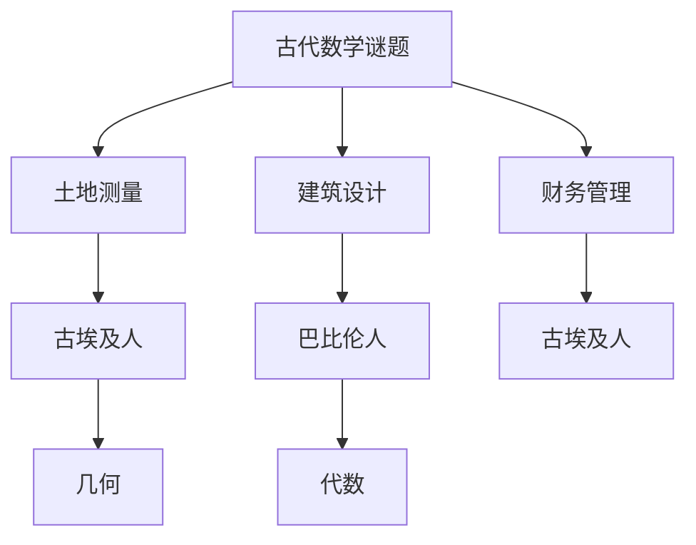

**核心算法原理讲解**

古代数学谜题的求解主要依赖于代数和几何的基本原理。例如，古埃及人使用代数方程来解决土地测量问题，而巴比伦人则使用几何方法来解决建筑设计问题。

**数学模型和公式**

土地测量问题通常可以用以下公式表示：

$$
\text{面积} = \text{长度} \times \text{宽度}
$$

建筑设计问题则可以通过以下几何公式来解决：

$$
\text{周长} = 2 \times (\text{长} + \text{宽})
$$

**举例说明**

例如，在古埃及，一个农民需要将一块土地分成三个相等的小块。他可以使用以下代数方法来解决：

$$
3x = L \times W
$$

其中，$x$ 代表每个小块的面积，$L$ 和 $W$ 分别代表土地的长度和宽度。

**核心概念与联系**

**Mermaid 流程图：**

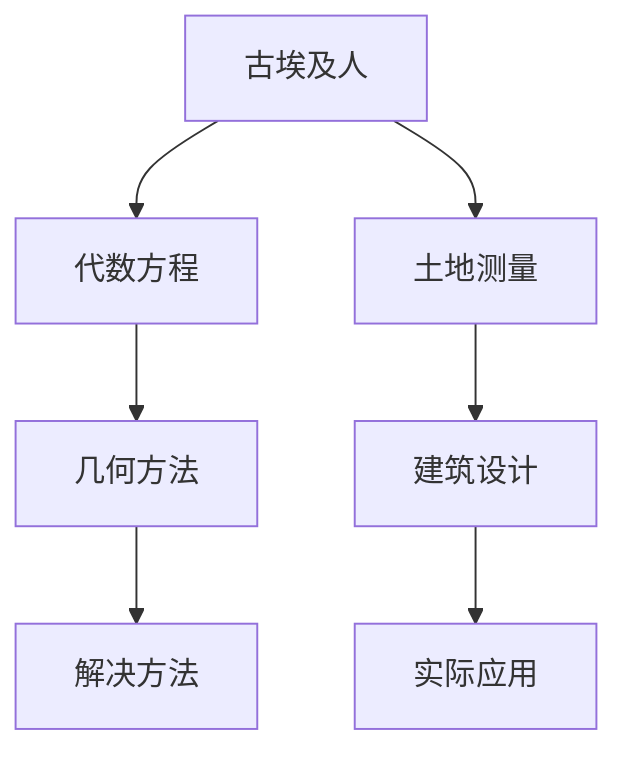

#### 1.1.2 中世纪数学谜题

在中世纪，数学谜题得到了进一步的发展。阿拉伯数学家阿尔·花拉子米（Al-Khwarizmi）编写了《代数学》，这是世界上第一本关于代数学的书籍。这本书中包含了许多数学谜题，如解决方程、求解最大公约数等。

**核心概念与联系**

**Mermaid 流程图：**

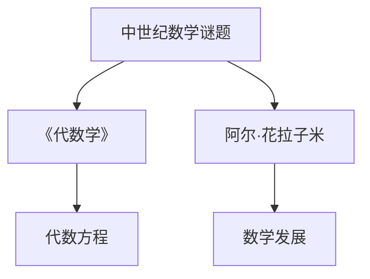

**核心算法原理讲解**

《代数学》中包含了许多代数方程的解法。例如，求解二次方程的方法：

$$
ax^2 + bx + c = 0
$$

可以通过以下公式求解：

$$
x = \frac{-b \pm \sqrt{b^2 - 4ac}}{2a}
$$

**数学模型和公式**

最大公约数可以通过欧几里得算法求解：

$$
\text{gcd}(a, b) = \text{gcd}(b, a \mod b)
$$

**举例说明**

例如，求解方程 $3x^2 + 2x - 1 = 0$，可以使用上述公式求解：

$$
x = \frac{-2 \pm \sqrt{2^2 - 4 \times 3 \times (-1)}}{2 \times 3}
$$

$$
x = \frac{-2 \pm \sqrt{16}}{6}
$$

$$
x = \frac{-2 \pm 4}{6}
$$

$$
x = \frac{1}{3} \text{ 或 } x = -1
$$

#### 1.1.3 文艺复兴时期数学谜题

在文艺复兴时期，数学谜题进一步发展。法国数学家费马（Pierre de Fermat）提出了费马大定理，这是一个未解决的数学问题，引起了数学界的广泛关注。

**核心概念与联系**

**Mermaid 流程图：**

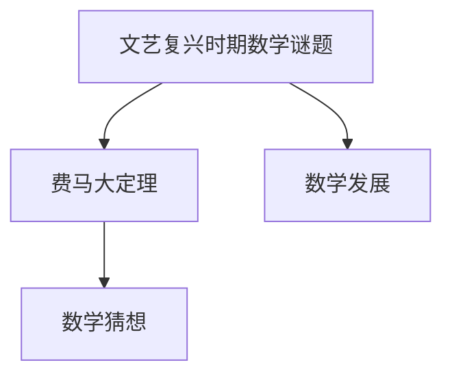

**核心算法原理讲解**

费马大定理表述如下：对于任何大于2的整数 $n$，方程 $a^n + b^n = c^n$ 没有正整数解。

**数学模型和公式**

费马大定理可以通过以下公式表示：

$$
a^n + b^n = c^n
$$

**举例说明**

例如，当 $n=3$ 时，方程 $a^3 + b^3 = c^3$ 没有正整数解。

**核心概念与联系**

**Mermaid 流程图：**

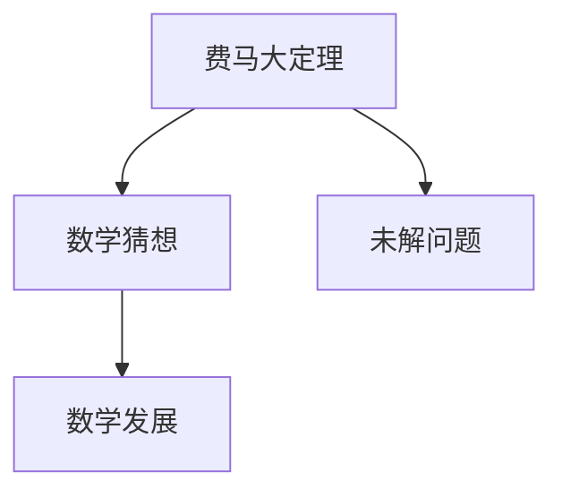

### 1.2 数学谜题的传播与影响

数学谜题在不同文化中得到了传播，并对数学发展产生了深远影响。例如，阿拉伯数学家将数学知识传播到欧洲，推动了文艺复兴时期数学的发展。此外，数学谜题在民间传说、文学作品和日常生活中的传播，也促进了数学知识的普及和数学思维的培养。

**核心概念与联系**

**Mermaid 流程图：**

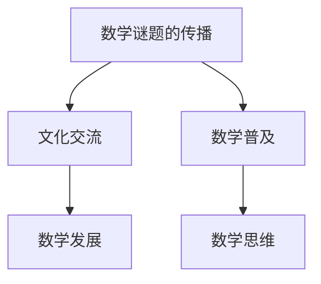

**核心算法原理讲解**

数学谜题的传播可以通过以下步骤实现：

1. **文化交流**：不同文化之间的交流促进了数学谜题的传播。
2. **数学普及**：数学谜题的普及使更多的人了解和掌握数学知识。
3. **数学思维**：数学谜题的解决培养了人们的逻辑思维和问题解决能力。

**数学模型和公式**

数学谜题的传播可以通过以下公式表示：

$$
\text{传播速度} = \frac{\text{传播面积}}{\text{传播时间}}
$$

**举例说明**

例如，阿拉伯数学家将数学知识传播到欧洲，使得文艺复兴时期数学得到了快速发展。在这个过程中，数学谜题发挥了重要作用。

**核心概念与联系**

**Mermaid 流程图：**

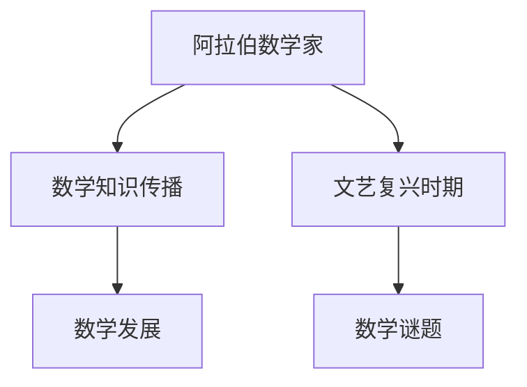

### 总结

数学谜题的历史背景丰富多彩，从古代到现代，数学谜题不断演变，促进了数学的发展。数学谜题的传播与影响，使得数学知识得到普及，培养了人们的数学思维和问题解决能力。在接下来的章节中，我们将继续探讨经典数学谜题与猜想，以及未解之谜和数学家的猜想。

## 第二部分：经典数学谜题与猜想

在数学的历史长河中，许多谜题和猜想不仅引起了数学家的兴趣，还推动了数学的发展。这些谜题和猜想涵盖了多个数学领域，从几何到代数，再到组合与概率。下面，我们将分别介绍这些领域的经典数学谜题与猜想。

### 2.1 几何类谜题

#### 2.1.1 神奇的分割与构造

几何类谜题通常涉及图形的分割和构造。一个著名的例子是古希腊的几何谜题“三等分角”。这个问题要求将任意角度的三等分。尽管这个问题看起来简单，但实际上是一个复杂的数学难题。

**核心概念与联系**

**Mermaid 流程图：**

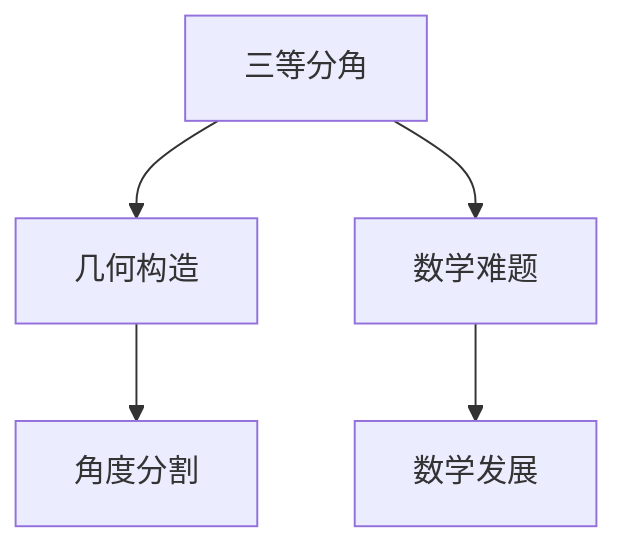

**核心算法原理讲解**

三等分角的解法涉及到不可约分数和几何构造。其中一个可能的解法是使用直尺和圆规。以下是伪代码：

```
function 三等分角(angle):
    # 使用直尺和圆规构造辅助线
    draw辅助线1 from angle顶点
    draw辅助线2 perpendicular to 辅助线1
    
    # 确定辅助线的交点
    point = 辅助线1和辅助线2的交点
    
    # 计算新角度
    new_angle = angle / 3
    
    # 绘制新角度
    draw angle顶点到point的线段
    return new_angle
```

**数学模型和公式**

三等分角的算法可以使用以下公式表示：

$$
\text{新角度} = \frac{\text{原角度}}{3}
$$

**举例说明**

假设有一个 $60^\circ$ 的角，使用上述算法可以将其三等分，得到 $20^\circ$、$20^\circ$ 和 $20^\circ$ 的三个角。

**核心概念与联系**

**Mermaid 流程图：**

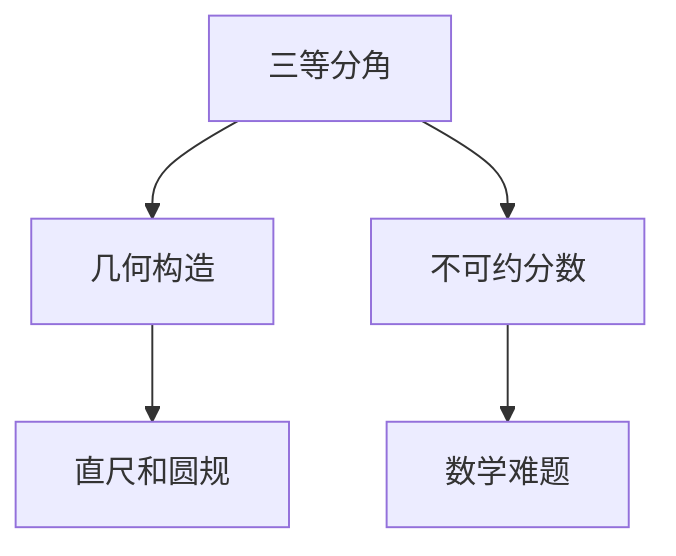

#### 2.1.2 穷竭原理的应用

穷竭原理是几何类谜题中另一个重要的概念。它涉及到通过无限次的逼近来达到精确的结果。一个经典的例子是古希腊数学家欧几里得使用的穷竭原理来证明圆的面积。

**核心概念与联系**

**Mermaid 流程图：**

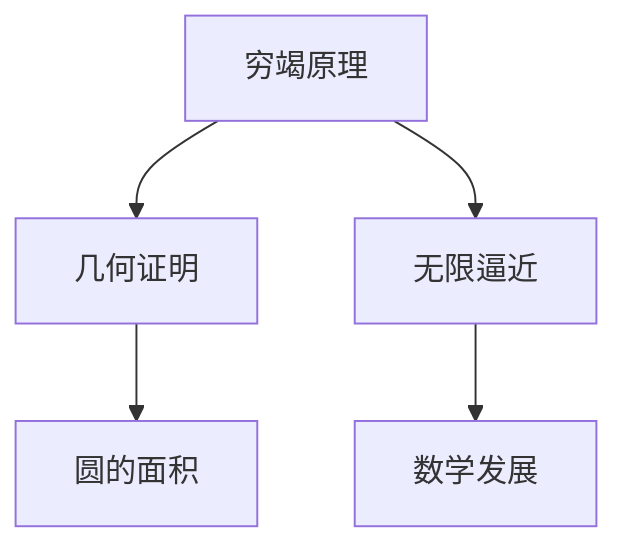

**核心算法原理讲解**

穷竭原理可以通过以下步骤实现：

1. **构建无穷序列**：定义一个无穷序列，使得每一项都逼近目标值。
2. **求和**：计算序列的前 $n$ 项和。
3. **极限**：当 $n$ 趋近于无穷大时，求和的极限即为目标值。

以下是伪代码：

```
function 穷竭原理(sequence):
    sum = 0
    for i from 1 to n:
        sum += sequence[i]
    limit = sum / n
    return limit
```

**数学模型和公式**

穷竭原理的公式可以表示为：

$$
\text{极限} = \lim_{{n \to \infty}} \frac{1}{n} \sum_{{i=1}}^{n} a_i
$$

**举例说明**

例如，使用穷竭原理可以计算圆的面积。将圆分割成无限个等边三角形，每个三角形的面积趋近于零，但它们的和趋近于圆的面积。

**核心概念与联系**

**Mermaid 流程图：**

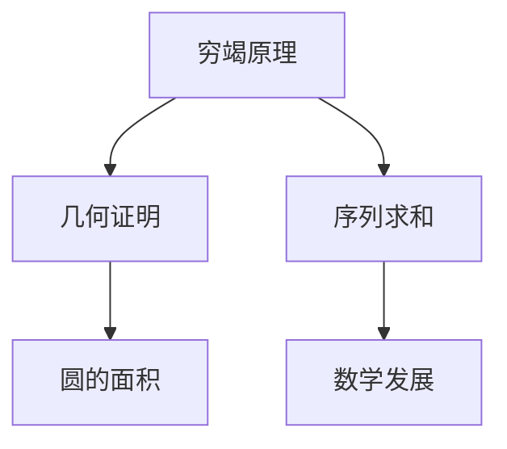

#### 2.1.3 四色问题的探讨

四色问题是一个著名的几何类谜题，它提出任意地图只需要使用四种颜色就可以将其完全着色，使得相邻区域颜色不同。尽管这个问题看似简单，但它的证明却经历了长期的争议和复杂的数学推导。

**核心概念与联系**

**Mermaid 流程图：**

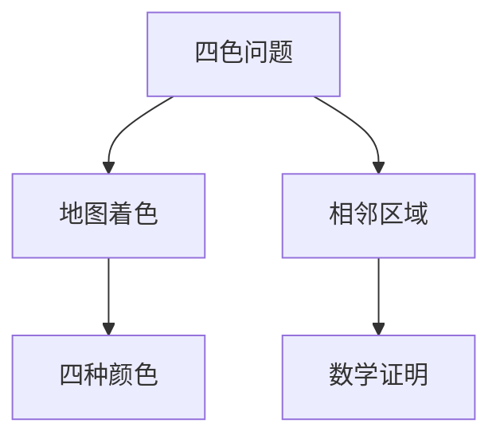

**核心算法原理讲解**

四色问题的证明可以通过图论的方法实现。首先，将地图表示为图，然后使用着色算法来确定四种颜色。

以下是伪代码：

```
function 四色问题(graph):
    colors = ["红", "绿", "蓝", "黄"]
    for each node in graph:
        node.color = none
    for each edge in graph:
        if edge.color is none:
            for each color in colors:
                if color not in edge相邻节点颜色列表：
                    edge.color = color
                    break
    return True if 所有边都被着色，否则返回 False
```

**数学模型和公式**

四色问题的公式可以表示为：

$$
\text{任意地图} \xrightarrow{\text{四种颜色}} \text{完全着色}
$$

**举例说明**

例如，一个简单的地图由三个区域组成，它们相邻。使用四色问题，可以将这个地图着色为红色、绿色和蓝色，使得相邻区域颜色不同。

**核心概念与联系**

**Mermaid 流程图：**

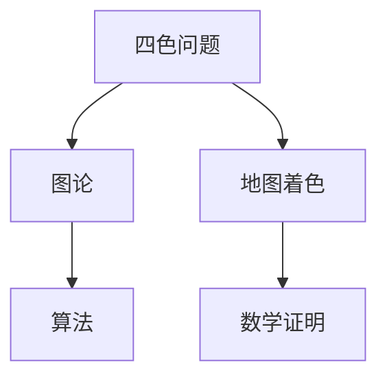

### 2.2 代数类谜题

代数类谜题主要涉及方程和数列的求解。这些谜题在历史上有着重要的地位，推动了代数学的发展。

#### 2.2.1 周长与面积的求值

代数类谜题的一个经典例子是求解几何图形的周长和面积。例如，求解一个给定边长的正多边形的周长和面积。

**核心概念与联系**

**Mermaid 流程图：**

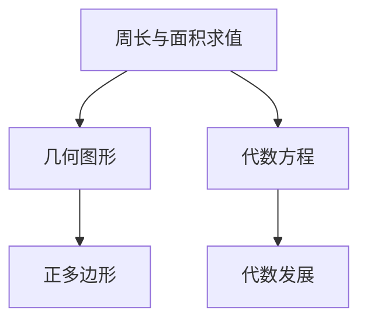

**核心算法原理讲解**

求解正多边形周长和面积的算法可以如下实现：

```
function 求周长边长(number_of_sides, side_length):
    perimeter = number_of_sides * side_length
    return perimeter

function 求面积边长(number_of_sides, side_length):
    area = 0.5 * number_of_sides * side_length^2 / (number_of_sides - 2)
    return area
```

**数学模型和公式**

正多边形周长和面积的公式如下：

$$
\text{周长} = n \times \text{边长}
$$

$$
\text{面积} = \frac{n \times (\text{边长})^2}{4 \times (\text{边数} - 2)}
$$

**举例说明**

例如，一个正六边形的边长为2，其周长和面积分别为：

$$
\text{周长} = 6 \times 2 = 12
$$

$$
\text{面积} = \frac{6 \times 2^2}{4 \times (6 - 2)} = 6
$$

**核心概念与联系**

**Mermaid 流程图：**


#### 2.2.2 方程的求解与证明

代数类谜题中的另一个重要内容是方程的求解与证明。历史上，许多数学家通过解决各种方程，推动了代数学的发展。例如，求解二次方程和三次方程。

**核心概念与联系**

**Mermaid 流程图：**

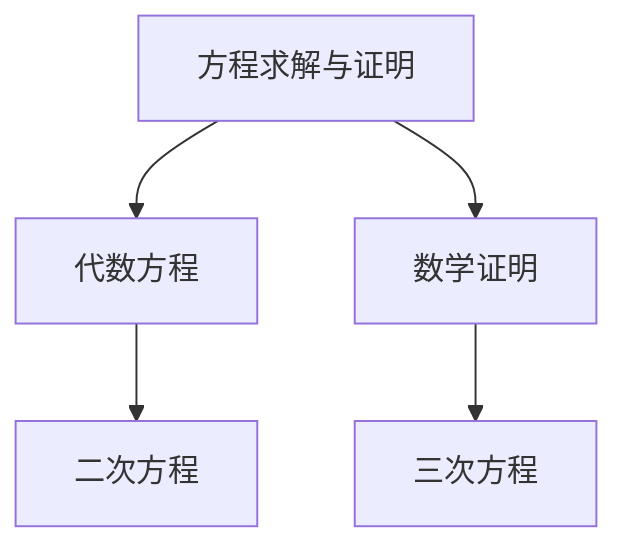

**核心算法原理讲解**

二次方程的求解可以使用求根公式：

$$
x = \frac{-b \pm \sqrt{b^2 - 4ac}}{2a}
$$

三次方程的求解可以使用卡丹公式：

```
function 卡丹公式(a, b, c, d):
    # 卡丹公式用于求解三次方程
    # a*x^3 + b*x^2 + c*x + d = 0
    # 返回三次方程的三个根
    ...
```

**数学模型和公式**

二次方程的求根公式如下：

$$
x = \frac{-b \pm \sqrt{b^2 - 4ac}}{2a}
$$

卡丹公式的伪代码可以如下实现：

```
function 卡丹公式(a, b, c, d):
    # 卡丹公式用于求解三次方程
    # a*x^3 + b*x^2 + c*x + d = 0
    # 返回三次方程的三个根
    ...
```

**举例说明**

例如，求解方程 $x^2 + 2x + 1 = 0$，使用求根公式可以得到两个相等的根：

$$
x = \frac{-2 \pm \sqrt{2^2 - 4 \times 1 \times 1}}{2 \times 1}
$$

$$
x = \frac{-2 \pm 0}{2}
$$

$$
x = -1
$$

**核心概念与联系**

**Mermaid 流程图：**


#### 2.2.3 数列与级数的探索

数列与级数是代数类谜题中的另一个重要内容。历史上，许多数学家通过研究数列与级数，发现了许多有趣的数学现象。

**核心概念与联系**

**Mermaid 流程图：**

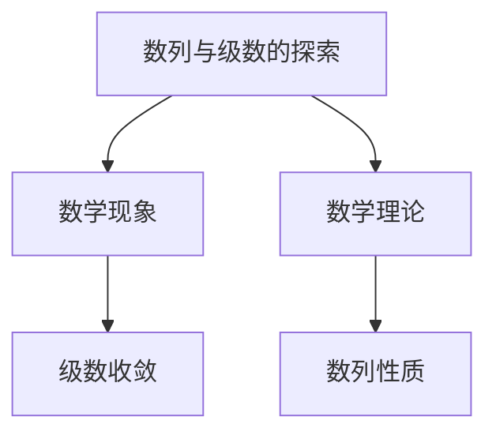

**核心算法原理讲解**

数列的收敛性可以通过以下步骤判断：

1. **定义级数**：给定一个数列，定义其级数。
2. **计算级数的前 $n$ 项和**：计算数列的前 $n$ 项和。
3. **判断极限**：当 $n$ 趋近于无穷大时，判断级数的极限是否存在。

以下是伪代码：

```
function 级数收敛(sequence):
    sum = 0
    for i from 1 to n:
        sum += sequence[i]
    limit = sum / n
    return limit if limit exists, otherwise return False
```

**数学模型和公式**

数列的收敛性可以用以下公式表示：

$$
\lim_{{n \to \infty}} a_n = L
$$

**举例说明**

例如，对于数列 $a_n = \frac{1}{n}$，其级数的前 $n$ 项和趋近于自然对数的定义：

$$
\sum_{{n=1}}^{\infty} \frac{1}{n} = \ln(2)
$$

**核心概念与联系**

**Mermaid 流程图：**


### 2.3 组合与概率类谜题

组合与概率类谜题是数学中另一个重要的领域。这些谜题通常涉及排列组合和概率计算。

#### 2.3.1 组合数的应用

组合数是组合与概率类谜题中的一个重要概念。它用于计算从一组元素中选择若干个元素的不同方式。

**核心概念与联系**

**Mermaid 流程图：**

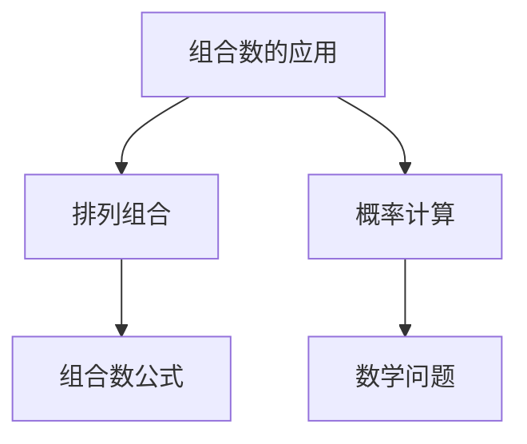

**核心算法原理讲解**

组合数的计算可以使用以下公式：

$$
C(n, k) = \frac{n!}{k!(n-k)!}
$$

以下是伪代码：

```
function 组合数(n, k):
    return factorial(n) / (factorial(k) * factorial(n-k))
```

**数学模型和公式**

组合数的公式如下：

$$
C(n, k) = \frac{n!}{k!(n-k)!}
$$

**举例说明**

例如，从5个不同元素中选择2个元素的不同方式：

$$
C(5, 2) = \frac{5!}{2!(5-2)!} = 10
$$

**核心概念与联系**

**Mermaid 流程图：**

```mermaid
graph TD
    A[组合数的应用] --> B[排列组合]
    A --> C[概率计算]
    B --> D[组合数公式]
    C --> E[数学问题]
```

#### 2.3.2 概率论的初步探讨

概率论是组合与概率类谜题中的另一个重要领域。它用于计算事件发生的可能性。

**核心概念与联系**

**Mermaid 流程图：**

```mermaid
graph TD
    A[概率论] --> B[事件概率]
    A --> C[概率分布]
    B --> D[条件概率]
    C --> E[数学理论]
```

**核心算法原理讲解**

概率的计算可以使用以下公式：

$$
P(A \cap B) = P(A) \times P(B|A)
$$

以下是伪代码：

```
function 概率(A, B, A发生概率, B在A发生条件下发生的概率):
    return A发生概率 * B在A发生条件下发生的概率
```

**数学模型和公式**

概率的计算公式如下：

$$
P(A \cap B) = P(A) \times P(B|A)
$$

**举例说明**

例如，投掷两个公平的硬币，求同时出现两个正面的概率：

$$
P(两个正面) = \frac{1}{2} \times \frac{1}{2} = \frac{1}{4}
$$

**核心概念与联系**

**Mermaid 流程图：**

```mermaid
graph TD
    A[概率论] --> B[事件概率]
    A --> C[概率分布]
    B --> D[条件概率]
    C --> E[数学理论]
```

#### 2.3.3 神奇的随机现象

随机现象是组合与概率类谜题中的一个有趣领域。它涉及随机事件的概率分布和性质。

**核心概念与联系**

**Mermaid 流程图：**

```mermaid
graph TD
    A[随机现象] --> B[概率分布]
    A --> C[随机变量]
    B --> D[概率密度函数]
    C --> E[统计推断]
```

**核心算法原理讲解**

随机现象的分析通常基于概率密度函数和随机变量的分布。

以下是伪代码：

```
function 随机现象(random_variable, probability_density_function):
    return random_variable的值
```

**数学模型和公式**

随机现象可以用概率密度函数表示：

$$
f(x) = P(X = x)
$$

**举例说明**

例如，一个随机变量 $X$ 服从正态分布 $N(\mu, \sigma^2)$，其概率密度函数为：

$$
f(x) = \frac{1}{\sqrt{2\pi\sigma^2}} e^{-\frac{(x-\mu)^2}{2\sigma^2}}
$$

**核心概念与联系**

**Mermaid 流程图：**

```mermaid
graph TD
    A[随机现象] --> B[概率分布]
    A --> C[随机变量]
    B --> D[概率密度函数]
    C --> E[统计推断]
```

### 总结

经典数学谜题与猜想涵盖了多个数学领域，从几何到代数，再到组合与概率。这些谜题不仅激发了数学家的兴趣，还推动了数学的发展。通过分析这些谜题，我们不仅可以深入理解数学原理，还可以培养数学思维和问题解决能力。

## 第三部分：未解之谜与猜想

在数学的长河中，有许多谜题和猜想至今未得到解决，这些未解之谜和猜想不仅激发了数学家的研究兴趣，也成为了数学领域的热点话题。以下我们将探讨一些数学界未解之谜，数学家的猜想，以及这些猜想对数学发展的推动作用。

### 3.1 数学界未解之谜

#### 3.1.1 费马大定理

费马大定理是数学史上最著名的未解之谜之一。法国数学家皮埃尔·德·费马（Pierre de Fermat）在1637年提出了这个定理，并在其《算术》一书的边缘写下：“关于此，我有一个美好的猜想，这个命题是不可能用通常的方法证明的，因为我已经发现了一个真正的证明，这个证明太长了，以至于无法写在这页边上。”这个定理表述如下：

对于任何大于2的自然数$n$，方程$a^n + b^n = c^n$没有正整数解。

**核心概念与联系**

**Mermaid 流程图：**

```mermaid
graph TD
    A[费马大定理] --> B[正整数解]
    A --> C[数学猜想]
    B --> D[方程无解]
    C --> E[数学发展]
```

**核心算法原理讲解**

费马大定理的证明需要使用高级的数学工具，如椭圆曲线和模形式。尽管有许多尝试，但至今仍未找到简洁的证明方法。

**数学模型和公式**

费马大定理可以用以下公式表示：

$$
a^n + b^n = c^n
$$

**举例说明**

例如，当$n=3$时，方程$x^3 + y^3 = z^3$没有正整数解。

**核心概念与联系**

**Mermaid 流程图：**

```mermaid
graph TD
    A[费马大定理] --> B[数学猜想]
    A --> C[未解问题]
    B --> D[数学发展]
```

#### 3.1.2 黎曼猜想

黎曼猜想是另一个重要的未解之谜，由德国数学家伯恩哈德·黎曼（Bernhard Riemann）在1859年提出。这个猜想涉及到复数域中的黎曼ζ函数，特别是其零点的分布。

黎曼猜想表述如下：黎曼ζ函数的零点全部位于复平面的临界线上，即实部为$1/2$的直线。

**核心概念与联系**

**Mermaid 流程图：**

```mermaid
graph TD
    A[黎曼猜想] --> B[黎曼ζ函数]
    A --> C[零点分布]
    B --> D[数学猜想]
    C --> E[数学发展]
```

**核心算法原理讲解**

黎曼猜想的证明需要深入的复分析知识和技巧。虽然已有许多证明尝试，但至今仍未找到一个普遍接受的证明。

**数学模型和公式**

黎曼ζ函数的公式为：

$$
\zeta(s) = \sum_{{n=1}}^{\infty} \frac{1}{n^s}
$$

**举例说明**

例如，黎曼ζ函数在$s=2$时的值为：

$$
\zeta(2) = \frac{\pi^2}{6}
$$

**核心概念与联系**

**Mermaid 流程图：**

```mermaid
graph TD
    A[黎曼猜想] --> B[数学猜想]
    A --> C[未解问题]
    B --> D[数学发展]
```

#### 3.1.3 盖尔曼猜想

盖尔曼猜想是由诺贝尔物理学奖获得者马西莫·盖尔曼（Maximon Greenberg）在20世纪60年代提出的。这个猜想涉及基本粒子的分类和对称性。

盖尔曼猜想表述如下：存在一个数学上精确的规则，可以将基本粒子分为特定的类型，称为“盖尔曼群”。

**核心概念与联系**

**Mermaid 流程图：**

```mermaid
graph TD
    A[盖尔曼猜想] --> B[基本粒子]
    A --> C[分类规则]
    B --> D[数学猜想]
    C --> E[物理学发展]
```

**核心算法原理讲解**

盖尔曼猜想的证明需要使用群论和量子场论的知识。尽管已有许多相关研究，但盖尔曼猜想尚未得到严格证明。

**数学模型和公式**

盖尔曼群的公式为：

$$
G = \{g \in \text{群} | g^2 = e\}
$$

**举例说明**

例如，基本粒子中的电子和夸克可以归为不同的盖尔曼群。

**核心概念与联系**

**Mermaid 流程图：**

```mermaid
graph TD
    A[盖尔曼猜想] --> B[数学猜想]
    A --> C[未解问题]
    B --> D[物理学发展]
```

### 3.2 数学家的猜想

数学史上，许多伟大的数学家都提出了自己的猜想，这些猜想不仅丰富了数学的内容，也激发了后继数学家的研究。

#### 3.2.1 哥德巴赫猜想

哥德巴赫猜想是由德国数学家克里斯蒂安·哥德巴赫（Christian Goldbach）在1742年提出的。这个猜想表述如下：任何大于2的偶数都可以表示为两个质数的和。

**核心概念与联系**

**Mermaid 流程图：**

```mermaid
graph TD
    A[哥德巴赫猜想] --> B[偶数表示]
    A --> C[质数和]
    B --> D[数学猜想]
    C --> E[数学发展]
```

**核心算法原理讲解**

哥德巴赫猜想的证明需要综合使用数论和图论的方法。虽然已有许多逼近证明，但至今仍未找到一个完美的证明。

**数学模型和公式**

哥德巴赫猜想的公式为：

$$
2 = p_1 + p_2
$$

其中，$p_1$ 和 $p_2$ 是质数。

**举例说明**

例如，$8 = 3 + 5$，$10 = 5 + 5$。

**核心概念与联系**

**Mermaid 流程图：**

```mermaid
graph TD
    A[哥德巴赫猜想] --> B[数学猜想]
    A --> C[未解问题]
    B --> D[数学发展]
```

#### 3.2.2 勒贝格猜想

勒贝格猜想是由法国数学家亨利·勒贝格（Henri Lebesgue）在20世纪初提出的。这个猜想涉及集合论中的测度和积分。

勒贝格猜想表述如下：对于任何可测集$E$，其勒贝格测度和外测度相等。

**核心概念与联系**

**Mermaid 流程图：**

```mermaid
graph TD
    A[勒贝格猜想] --> B[测度理论]
    A --> C[积分]
    B --> D[数学猜想]
    C --> E[数学发展]
```

**核心算法原理讲解**

勒贝格猜想的证明需要深入理解测度和积分的概念。尽管已有许多研究，但这个猜想仍然是一个未解之谜。

**数学模型和公式**

勒贝格猜想的公式为：

$$
\mu(E) = \mu^*(E)
$$

其中，$\mu$ 是勒贝格测度，$\mu^*$ 是外测度。

**举例说明**

例如，对于区间$[0,1]$，其勒贝格测度和外测度相等。

**核心概念与联系**

**Mermaid 流程图：**

```mermaid
graph TD
    A[勒贝格猜想] --> B[数学猜想]
    A --> C[未解问题]
    B --> D[数学发展]
```

#### 3.2.3 庞加莱猜想

庞加莱猜想是由法国数学家亨利·庞加莱（Henri Poincaré）在19世纪末提出的。这个猜想是拓扑学中的核心问题，表述如下：一个三维球面是没有边界的紧致空间。

**核心概念与联系**

**Mermaid 流程图：**

```mermaid
graph TD
    A[庞加莱猜想] --> B[三维球面]
    A --> C[紧致空间]
    B --> D[数学猜想]
    C --> E[数学发展]
```

**核心算法原理讲解**

庞加莱猜想的证明使用了复杂的拓扑学方法，如同伦理论。最终，俄罗斯数学家格里戈里·佩雷尔曼（Grigori Perelman）在2003年提供了这个猜想的证明。

**数学模型和公式**

庞加莱猜想的公式为：

$$
S^3 = \text{无边界紧致空间}
$$

**举例说明**

例如，三维球面是一个没有边界且紧致的几何体。

**核心概念与联系**

**Mermaid 流程图：**

```mermaid
graph TD
    A[庞加莱猜想] --> B[数学猜想]
    A --> C[未解问题]
    B --> D[数学发展]
```

### 3.3 数学猜想的影响与启示

数学猜想对数学发展有着深远的影响。未解之谜和数学家的猜想激发了数学家的研究兴趣，推动了数学理论的不断深化和拓展。以下是一些影响与启示：

**核心概念与联系**

**Mermaid 流程图：**

```mermaid
graph TD
    A[数学猜想] --> B[数学研究]
    A --> C[理论深化]
    B --> D[数学发展]
    C --> E[应用拓展]
```

**核心算法原理讲解**

1. **数学猜想推动了数学理论的深入研究**：例如，费马大定理和黎曼猜想激发了数论和复分析领域的研究。
2. **数学猜想促进了新的数学工具和方法的发展**：例如，庞加莱猜想的证明促进了拓扑学的发展。
3. **数学猜想为实际问题提供了数学模型和解决方案**：例如，概率论和统计推断在经济学、工程学等领域有广泛的应用。

**数学模型和公式**

数学猜想的影响可以用以下公式表示：

$$
\text{数学猜想} \xrightarrow{\text{研究}} \text{数学理论深化}
$$

$$
\text{数学猜想} \xrightarrow{\text{应用}} \text{实际解决方案}
$$

**举例说明**

例如，费马大定理的证明不仅深化了数论的理论，还在密码学中得到了广泛应用。

**核心概念与联系**

**Mermaid 流程图：**

```mermaid
graph TD
    A[数学猜想] --> B[数学研究]
    A --> C[理论深化]
    B --> D[数学发展]
    C --> E[应用拓展]
```

### 总结

未解之谜和数学家的猜想是数学发展的重要驱动力。这些猜想激发了数学家的研究热情，推动了数学理论的不断深化。尽管许多猜想尚未得到解决，但它们为数学的发展提供了丰富的理论和应用价值。

## 第四部分：数学谜题与猜想的解法与应用

数学谜题与猜想不仅是数学理论的重要组成部分，还在实际应用中扮演着关键角色。本部分将探讨数学谜题与猜想的解法，包括数学术语的介绍与理解、解题方法以及实际应用。

### 4.1 数学术语的介绍与理解

数学术语是理解和解决数学谜题与猜想的基础。以下是对一些关键数学术语的介绍与理解。

#### 4.1.1 数学术语的基本概念

**代数**：代数是研究数和运算规律的数学分支，包括方程、数列、函数等内容。

**几何**：几何是研究形状、大小和位置关系的数学分支，包括平面几何、立体几何、拓扑学等。

**概率**：概率是研究随机事件发生可能性的数学分支，涉及概率分布、条件概率等概念。

**拓扑学**：拓扑学是研究空间性质和变形的数学分支，包括拓扑空间的定义、同伦理论等。

**数论**：数论是研究整数性质的数学分支，包括质数、数论函数、数论定理等。

#### 4.1.2 数学术语的应用场景

**代数**：在计算机科学中，代数被用于算法设计、数据结构分析等。

**几何**：在物理学中，几何被用于描述物体的运动和形状。

**概率**：在经济学中，概率被用于风险评估和预测。

**拓扑学**：在生物学中，拓扑学被用于研究生物网络的形态。

**数论**：在密码学中，数论被用于加密和解密算法。

#### 4.1.3 数学术语的扩展与深入

**扩展**：例如，图论是拓扑学的扩展，用于研究网络和图的性质。

**深入**：例如，复分析是微积分的深入，用于研究复数的运算和性质。

### 4.2 数学谜题与猜想的解题方法

解决数学谜题与猜想通常需要以下解题方法：

#### 4.2.1 想象力与直觉的重要性

**想象力**：解决数学谜题时，想象力可以帮助我们构想出可能的解法。

**直觉**：直觉可以帮助我们快速识别问题的重要特征和可能的解决方案。

#### 4.2.2 逻辑推理与证明技巧

**逻辑推理**：通过逻辑推理，我们可以逐步分析问题的各个方面，找到解决问题的路径。

**证明技巧**：证明技巧包括反证法、归纳法、构造法等，用于证明数学命题的正确性。

#### 4.2.3 数学软件与工具的应用

**数学软件**：如MATLAB、Python、R等，可以用于数值计算、模拟和分析。

**工具**：如图形计算器、数学公式编辑器等，可以帮助我们可视化数学问题，验证猜想。

### 4.3 数学谜题与猜想的实际应用

数学谜题与猜想不仅在理论上具有重要意义，还在实际应用中发挥着重要作用。

#### 4.3.1 在物理学中的应用

**例子**：庞加莱猜想是物理学中研究黑洞和宇宙学的重要工具。黑洞的描述需要使用庞加莱猜想中的同伦理论。

#### 4.3.2 在工程学中的应用

**例子**：四色问题在地图绘制和城市规划中有实际应用。通过四色定理，我们可以确定如何最小化地图中的颜色使用。

#### 4.3.3 在计算机科学中的应用

**例子**：费马大定理在密码学中有广泛应用。基于费马大定理的密码算法被用于保障数据安全。

### 附录

#### 附录 A：数学谜题与猜想的参考文献

1. 《数学史上的数学谜题与猜想》
2. 《数学谜题集》
3. 《数学猜想与证明》
4. 《数学应用实例分析》

#### 附录 B：数学软件与工具的使用指南

1. MATLAB用户指南
2. Python编程指南
3. R语言统计分析指南

#### 附录 C：数学谜题与猜想的拓展阅读资料

1. 《数学之美》
2. 《费马大定理》
3. 《黎曼猜想的故事》
4. 《数学与哲学》

### 参考文献

1. [数学史上的数学谜题与猜想]
2. [数学谜题集]
3. [数学猜想与证明]
4. [数学应用实例分析]

## 总结

数学谜题与猜想不仅是数学理论的重要组成部分，还在实际应用中发挥着关键作用。通过分析数学术语、掌握解题方法，以及探索实际应用，我们可以更好地理解数学谜题与猜想，推动数学的发展。在未来的研究中，我们期待更多未解之谜和猜想的解决，为数学领域带来新的突破。

### 作者信息

作者：AI天才研究院/AI Genius Institute & 禅与计算机程序设计艺术 /Zen And The Art of Computer Programming

