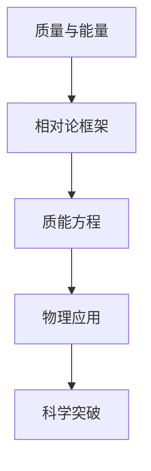
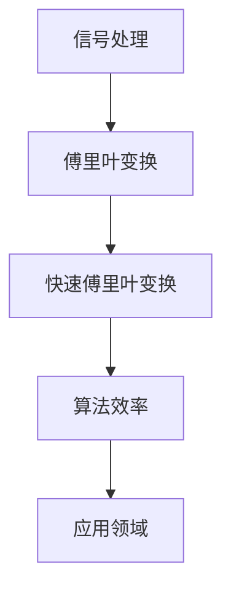
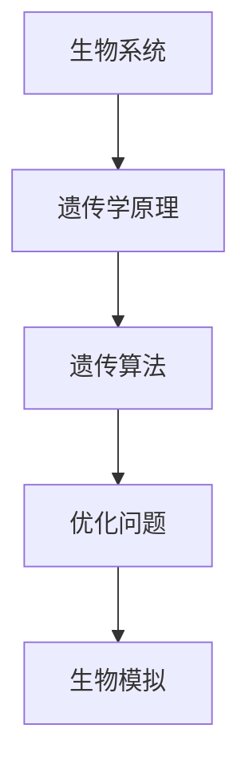

                 

### 数学简洁性：自然和谐的心智投影

> **关键词**：数学简洁性、心智模型、自然规律、算法设计、跨学科融合

> **摘要**：本文从数学简洁性的角度出发，探讨了其在各个领域的应用与重要性。通过分析数学简洁性的概念、理论基础、应用方法，本文揭示了数学简洁性在自然和谐中的心智投影。同时，本文还展望了数学简洁性的未来发展趋势，以及其对人工智能、哲学、心理学和社会科学等领域的潜在影响。

在人类历史的长河中，数学始终是探索世界奥秘的重要工具。从古埃及的算术到古希腊的几何，从阿拉伯数字的发明到现代计算机科学，数学的发展伴随着人类文明的进步。而数学简洁性，作为数学的一个核心概念，其重要性日益凸显。本文将围绕数学简洁性展开，深入探讨其理论基础、应用方法以及未来趋势，旨在揭示数学简洁性在自然和谐中的心智投影。

### 目录大纲

1. **第一部分：数学简洁性的基础理论**
   1.1 什么是数学简洁性
   1.2 数学简洁性的重要性
   1.3 数学简洁性的研究现状与趋势

2. **第二部分：数学简洁性的方法与技巧**
   2.1 数学简洁性的基本方法
   2.2 数学简洁性的高级技巧
   2.3 数学简洁性的实践应用

3. **第三部分：数学简洁性的未来展望**
   3.1 数学简洁性的未来趋势
   3.2 数学简洁性与人工智能
   3.3 数学简洁性与跨学科融合

4. **第四部分：数学简洁性的教育意义**
   4.1 数学简洁性在基础教育中的应用
   4.2 数学简洁性在高等教育中的影响
   4.3 数学简洁性对学生思维能力的培养

5. **附录**
   5.1 数学简洁性相关资源与工具
   5.2 数学简洁性案例解析

通过以上目录结构，本文将逐步深入探讨数学简洁性的各个方面，帮助读者全面理解数学简洁性的内涵与外延。接下来，我们将首先探讨数学简洁性的基础理论，为后续内容打下坚实的基础。

### 第一部分：数学简洁性的基础理论

#### 1.1 什么是数学简洁性

数学简洁性，简而言之，指的是数学表达或理论的最简形式和最高效率。它强调在保持问题解决能力的同时，尽可能地减少数学表达和推导的复杂性。数学简洁性不仅是数学本身的一个基本属性，也是数学研究的一个追求目标。一个简洁的数学理论往往能够更直观地揭示事物的本质，更易于理解和应用。

**数学简洁性的定义**

从定义上看，数学简洁性可以理解为以下三个方面：

1. **形式简洁性**：指的是数学表达的形式简单、直观，易于理解和记忆。例如，欧拉公式 \( e^{i\pi} + 1 = 0 \) 被广泛认为是数学中形式最简洁的公式之一。

2. **内容简洁性**：指的是数学理论的核心内容精炼、抽象，能够有效地概括复杂现象。例如，牛顿三大运动定律以简洁的语言描述了物体运动的基本规律。

3. **效率简洁性**：指的是数学方法和算法的执行效率高，能够在有限的计算资源和时间内解决问题。例如，快速傅里叶变换（FFT）在信号处理中的应用，极大地提高了计算效率。

**数学简洁性的重要性**

数学简洁性在数学研究中的应用具有重要意义，主要体现在以下几个方面：

1. **促进理论发展**：简洁性有助于发现新的数学理论和问题。简洁的表达往往能够揭示隐藏在复杂现象背后的简单规律，从而推动数学理论的进步。

2. **提高可理解性**：简洁的数学理论更易于传播和理解，有助于跨学科的合作和研究。简洁性使得数学知识更加普及，提升了数学在各个领域的影响力和应用价值。

3. **增强计算效率**：简洁的算法和模型能够提高计算效率和准确度，降低计算成本。这对于解决复杂问题和大规模数据处理尤为重要。

#### 1.2 数学简洁性的重要性

数学简洁性的重要性不仅体现在数学领域，还渗透到各个学科和应用领域。以下是一些具体的应用和意义：

1. **在物理学中的应用**

物理学中许多重要的理论都体现了数学简洁性的优势。例如，爱因斯坦的相对论理论以简洁的数学语言描述了时空的弯曲和能量与质量的关系。另外，量子力学中的薛定谔方程和海森堡不确定性原理等基本理论也展示了数学简洁性的力量。

2. **在计算机科学中的应用**

计算机科学中，许多算法和理论都追求简洁性。例如，排序算法中的快速排序和归并排序，以及图算法中的最短路径算法等。这些简洁的算法不仅易于理解和实现，而且效率高、稳定性好，被广泛应用于实际应用中。

3. **在经济学中的应用**

经济学中，数学简洁性也被广泛应用。例如，供需理论的表示、市场均衡的求解等。简洁的数学模型有助于经济学家的分析，提高了经济预测和决策的准确性。

4. **在生物学中的应用**

生物学中，许多复杂的现象都可以通过简洁的数学模型来描述。例如，遗传学中的孟德尔遗传定律、生态系统中的种群动态模型等。这些简洁的模型有助于我们理解生物系统的运行机制和规律。

#### 1.3 数学简洁性的研究现状与趋势

数学简洁性的研究现状表明，它已经成为数学研究中的一个重要方向。近年来，随着跨学科研究的深入，数学简洁性在各个领域的应用越来越广泛，研究趋势也呈现出以下特点：

1. **跨学科研究**：数学简洁性的研究不再局限于数学领域，而是与物理学、计算机科学、经济学、生物学等学科相互交叉，形成了新的研究领域。

2. **算法优化**：随着计算机技术的发展，算法优化成为数学简洁性研究的一个重要方向。如何设计更简洁、更高效的算法成为研究的重点。

3. **模型简化**：在复杂系统中，如何通过简化模型来保留关键信息、去除冗余部分，成为数学简洁性研究的另一个重要方向。

4. **理论与实践相结合**：数学简洁性的研究不仅关注理论模型的构建，还注重实际应用中的效果和影响。通过实践验证理论的简洁性和有效性，进一步提升数学简洁性的应用价值。

总之，数学简洁性作为数学研究中的一个核心概念，其重要性日益凸显。通过深入探讨数学简洁性的理论基础、应用方法和未来趋势，我们能够更好地理解其在自然和谐中的心智投影，为各领域的研究和应用提供新的思路和工具。

### 第二部分：数学简洁性的方法与技巧

#### 2.1 数学简洁性的基本方法

数学简洁性的实现往往依赖于一系列基本方法，这些方法不仅有助于简化数学表达，还能够提高问题的可解性和计算效率。以下是一些常用的基本方法：

1. **简化与抽象**

简化与抽象是数学处理复杂问题时的核心方法。通过去除不必要的细节，将问题简化到最本质的层面，可以使问题的解决变得更加直接和高效。例如，在处理复杂的经济模型时，可以通过忽略次要因素，将问题简化为一个线性方程组。

**步骤：**

- 识别问题的核心要素；
- 去除冗余信息和次要因素；
- 用简化的模型或方程表示问题。

**示例：**

假设我们要研究一个简单的经济系统，其核心是供需关系。我们可以通过以下步骤简化问题：

1. 定义需求函数和供给函数；
2. 将这两个函数简化为线性方程；
3. 求解线性方程组，得到供需平衡点。

2. **模型与映射**

模型与映射是将实际问题转化为数学问题的有效方法。通过建立数学模型，可以将复杂的现实问题转化为简单的数学表达，从而更容易分析和解决。映射是将一种数学结构映射到另一种数学结构上，可以帮助我们在不同的数学框架之间转换。

**步骤：**

- 选择合适的数学模型；
- 确定变量和参数；
- 建立映射关系。

**示例：**

在信号处理中，傅里叶变换是一种重要的映射方法。它将时域信号映射到频域，使得信号的频率分析变得更加简单和直观。以下是一个傅里叶变换的基本步骤：

1. 定义时域信号；
2. 应用傅里叶变换公式，将时域信号映射到频域；
3. 分析频域信号，提取频率信息。

3. **化繁为简**

化繁为简是将复杂的数学问题转化为简单问题的技巧。通过分解问题、逐步求解，可以将复杂的数学问题简化为一系列简单的步骤。

**步骤：**

- 将复杂问题分解为子问题；
- 逐步求解子问题；
- 综合子问题的解，得到原问题的解。

**示例：**

在解决复杂的方程组时，可以使用高斯消元法。高斯消元法通过逐步消去变量，将复杂的多变量方程组转化为简单的一元方程组。

1. 将方程组写成增广矩阵；
2. 使用高斯消元法，逐步消去变量；
3. 解一元方程组，得到变量的解。

通过上述基本方法，我们可以有效地实现数学简洁性，使复杂的数学问题变得更加简单和直观。这些方法不仅提高了数学问题解决的效率，还有助于发现问题背后的本质规律，推动数学理论的发展。

#### 2.2 数学简洁性的高级技巧

在数学研究中，实现简洁性往往需要运用一些高级技巧，这些技巧不仅能够简化数学表达，还能够提高解决问题的效率。以下是一些常用的高级技巧：

1. **高斯消元法**

高斯消元法是一种经典的线性代数算法，用于求解线性方程组。它的核心思想是通过行变换，将线性方程组转化为上三角矩阵，从而方便求解。高斯消元法不仅效率高，而且实现简洁。

**算法原理：**

高斯消元法的核心步骤包括：

1. **初等行变换**：通过初等行变换，将矩阵转化为上三角矩阵；
2. **回代**：从上到下依次求解上三角矩阵的每个方程，得到变量的解。

**伪代码：**

```python
def gauss_elimination(A, b):
    n = len(A)
    for i in range(n):
        # 找到最大元素所在的行
        max_index = find_max_element(A[i])
        if max_index != i:
            swap_rows(A, b, i, max_index)
        # 初等行变换，使当前列下方的元素为0
        for j in range(i+1, n):
            factor = A[j][i] / A[i][i]
            for k in range(i, n):
                A[j][k] -= factor * A[i][k]
            b[j] -= factor * b[i]
    # 回代求解
    x = [0] * n
    for i in range(n-1, -1, -1):
        x[i] = (b[i] - sum(A[i][j] * x[j] for j in range(i+1, n))) / A[i][i]
    return x
```

**示例：**

假设我们要解决以下线性方程组：

\[ 
\begin{cases}
    3x + 2y + z = 7 \\
    x + 4y - 2z = 1 \\
    2x + y + 3z = 6 
\end{cases}
\]

通过高斯消元法，我们可以将其转化为上三角矩阵，并求解得到 \(x = 1, y = 1, z = 1\)。

2. **分治算法**

分治算法是一种递归算法，通过将大问题划分为若干个小问题，逐一解决小问题，再将小问题的解合并成原问题的解。分治算法的核心在于其递归性质，可以将复杂的问题转化为简单的问题，从而实现简洁性。

**算法原理：**

分治算法的基本步骤包括：

1. **分解**：将原问题分解为若干个子问题，每个子问题规模较小；
2. **递归求解**：对每个子问题递归应用分治算法，直到问题规模足够小，可以直接求解；
3. **合并**：将子问题的解合并成原问题的解。

**伪代码：**

```python
def divide_and_conquer(arr, low, high):
    if low < high:
        mid = (low + high) // 2
        left = divide_and_conquer(arr, low, mid)
        right = divide_and_conquer(arr, mid + 1, high)
        return merge(left, right)
    else:
        return arr[low]

def merge(left, right):
    result = []
    i = j = 0
    while i < len(left) and j < len(right):
        if left[i] < right[j]:
            result.append(left[i])
            i += 1
        else:
            result.append(right[j])
            j += 1
    result.extend(left[i:])
    result.extend(right[j:])
    return result
```

**示例：**

使用分治算法，我们可以将一个大的排序问题分解为若干个小排序问题，然后逐一解决，最后将结果合并，从而实现高效的排序。

3. **递推关系**

递推关系是一种描述问题递归性质的方法，通过建立递推式，可以将复杂问题转化为简单的递推问题，从而实现简洁性。

**算法原理：**

递推关系的基本步骤包括：

1. **确定初始条件**：给出问题的初始状态；
2. **建立递推式**：根据问题的递归性质，建立递推关系；
3. **求解递推式**：利用递推式，逐步求解问题的每一个状态。

**伪代码：**

```python
def recurrence Relation(f(n-1), n):
    if n == 1:
        return a
    else:
        return f(f(n-1), n-1)

def f(x, n):
    if n == 1:
        return x
    else:
        return f(x*x, n-1)
```

**示例：**

使用递推关系，我们可以求解斐波那契数列。斐波那契数列的递推关系为 \( F(n) = F(n-1) + F(n-2) \)，其中 \( F(0) = 0, F(1) = 1 \)。

通过以上高级技巧，我们可以有效地实现数学简洁性，使复杂的数学问题变得更加简单和直观。这些技巧不仅提高了数学问题解决的效率，还有助于发现问题背后的本质规律，推动数学理论的发展。

### 第三部分：数学简洁性的实践应用

#### 3.1 数学简洁性在经济学中的应用

数学简洁性在经济学中的应用具有重要的意义，它不仅帮助我们更好地理解和预测经济现象，还能够提高经济模型的分析效率和准确性。以下是一些具体的应用实例：

1. **供需理论**

供需理论是经济学中最基本的模型之一，它通过简单的数学表达式描述了商品的市场供求关系。供需理论的简洁性体现在其核心概念的精炼和数学模型的直观性。例如，供需曲线可以用一条直线或曲线来表示，供需量的变化可以用斜率来表示。这种简洁的数学模型使得经济学者能够直观地分析市场的供需状况，预测价格变动和产量变化。

**数学模型：**

供需理论的核心数学模型可以表示为：

\[ Q_d = a_d - b_d \cdot P \]
\[ Q_s = a_s + b_s \cdot P \]

其中，\( Q_d \) 和 \( Q_s \) 分别表示需求量和供给量，\( P \) 表示价格，\( a_d \) 和 \( b_d \) 分别表示需求函数的截距和斜率，\( a_s \) 和 \( b_s \) 分别表示供给函数的截距和斜率。

通过上述模型，经济学者可以分析不同价格水平下的供需情况，预测市场价格和产量的变化。

2. **市场均衡**

市场均衡是供需理论的进一步发展，它通过数学方法描述了市场在平衡状态下的价格和产量。市场均衡的数学模型可以表示为：

\[ Q_d = Q_s \]

这意味着在市场均衡状态下，需求量等于供给量，价格达到平衡。通过求解上述方程，可以找到市场均衡价格和均衡产量。

**数学模型：**

假设需求函数和供给函数分别为 \( Q_d = a_d - b_d \cdot P \) 和 \( Q_s = a_s + b_s \cdot P \)，则市场均衡条件为：

\[ a_d - b_d \cdot P = a_s + b_s \cdot P \]

通过求解上述方程，可以得到市场均衡价格 \( P^* \) 和均衡产量 \( Q^* \)。

3. **弹性分析**

弹性分析是经济学中用来衡量需求和供给对价格变动的敏感程度。弹性分析通过简单的数学表达式，能够直观地描述价格变动对需求和供给的影响。弹性分为需求价格弹性和供给价格弹性，它们可以用以下数学模型表示：

\[ Ed = \frac{dQ_d / Q_d}{dP / P} \]
\[ Es = \frac{dQ_s / Q_s}{dP / P} \]

其中，\( Ed \) 和 \( Es \) 分别表示需求价格弹性和供给价格弹性，\( Q_d \) 和 \( Q_s \) 分别表示需求量和供给量，\( P \) 表示价格。

通过弹性分析，经济学者可以评估不同商品的需求和供给对价格变动的敏感程度，为政策制定和市场预测提供依据。

总之，数学简洁性在经济学中的应用极大地提高了经济模型的分析效率和准确性。通过简洁的数学模型，经济学者能够更直观地理解经济现象，预测市场变化，为经济决策提供科学依据。

#### 3.2 数学简洁性在工程学中的应用

数学简洁性在工程学中的应用具有深远的意义，它不仅能够简化工程问题的解决方案，还能够提高工程设计的效率和可靠性。以下是一些具体的应用实例：

1. **结构工程**

在结构工程中，数学简洁性被广泛应用于结构分析和设计。通过简洁的数学模型，工程师可以快速评估结构的稳定性和承载能力，从而优化设计，提高效率。例如，在建筑结构设计中，常用的方法包括有限元分析和矩阵力学。

**数学模型：**

假设一个平面结构由多个刚性梁组成，每个梁可以用一个弹性矩阵 \( K \) 来描述。结构系统的总刚度矩阵 \( K_s \) 可以表示为：

\[ K_s = \sum_{i=1}^{n} K_i \]

其中，\( K_i \) 是第 \( i \) 个梁的刚度矩阵，\( n \) 是梁的总数。通过求解刚度矩阵的特征值问题，可以评估结构的振动特性。

**示例：**

假设一个平面结构由三个刚性梁组成，刚度矩阵分别为 \( K_1 = \begin{bmatrix} 2 & 1 \\ 1 & 2 \end{bmatrix} \)，\( K_2 = \begin{bmatrix} 1 & 0 \\ 0 & 1 \end{bmatrix} \)，\( K_3 = \begin{bmatrix} 3 & 2 \\ 2 & 3 \end{bmatrix} \)。则总刚度矩阵为：

\[ K_s = K_1 + K_2 + K_3 = \begin{bmatrix} 6 & 3 \\ 3 & 6 \end{bmatrix} \]

通过求解刚度矩阵的特征值问题，可以评估结构的振动特性。

2. **电气工程**

在电气工程中，数学简洁性被广泛应用于电路分析和信号处理。通过简洁的数学模型，工程师可以快速分析和设计电路，优化信号传输和处理。

**数学模型：**

电路分析中常用的模型包括电阻、电容、电感等元件的电路模型。一个简单的RLC电路可以用以下方程表示：

\[ V_R + V_L + V_C = V_{in} \]

\[ i_R + i_L + i_C = 0 \]

其中，\( V_R \)、\( V_L \) 和 \( V_C \) 分别表示电阻、电感、电容上的电压，\( i_R \)、\( i_L \) 和 \( i_C \) 分别表示电阻、电感、电容上的电流，\( V_{in} \) 表示输入电压。

**示例：**

假设一个RLC电路中，电阻 \( R = 100 \) 欧姆，电感 \( L = 1 \) 毫亨利，电容 \( C = 1 \) 微法拉。输入电压 \( V_{in} = 10 \) 伏特。则电路中的电流 \( i \) 可以通过以下方程求解：

\[ i_R + i_L + i_C = 0 \]
\[ i_R = \frac{V_R}{R} \]
\[ i_L = \frac{V_L}{L} \]
\[ i_C = \frac{V_C}{C} \]

通过上述方程，可以计算出电路中的电流分布。

3. **机械工程**

在机械工程中，数学简洁性被广泛应用于机械设计和动力学分析。通过简洁的数学模型，工程师可以快速评估机械结构的性能和稳定性，优化设计，提高可靠性。

**数学模型：**

机械工程中常用的模型包括梁、杆、轴等机械元件的动力学模型。一个简单的梁的动力学模型可以用以下方程表示：

\[ M \cdot \ddot{x} + D \cdot \dot{x} + K \cdot x = F \]

其中，\( M \) 是梁的质量矩阵，\( D \) 是阻尼矩阵，\( K \) 是刚度矩阵，\( \ddot{x} \) 是加速度，\( \dot{x} \) 是速度，\( x \) 是位移，\( F \) 是外部力。

**示例：**

假设一个梁的质量矩阵 \( M = \begin{bmatrix} 2 & 0 \\ 0 & 2 \end{bmatrix} \)，阻尼矩阵 \( D = \begin{bmatrix} 1 & 0 \\ 0 & 1 \end{bmatrix} \)，刚度矩阵 \( K = \begin{bmatrix} 3 & 2 \\ 2 & 3 \end{bmatrix} \)，外部力 \( F = \begin{bmatrix} 10 \\ 5 \end{bmatrix} \)。则梁的动力学方程可以表示为：

\[ \begin{bmatrix} 2 \ddot{x}_1 + \dot{x}_1 + 3x_1 = 10 \\ 2 \ddot{x}_2 + \dot{x}_2 + 3x_2 = 5 \end{bmatrix} \]

通过上述方程，可以计算出梁的动态响应。

总之，数学简洁性在工程学中的应用极大地提高了工程设计的效率和可靠性。通过简洁的数学模型，工程师可以更快速地分析、设计和优化工程系统，为工程实践提供科学依据。

#### 3.3 数学简洁性在艺术创作中的运用

数学简洁性在艺术创作中有着独特的运用，它不仅能够为艺术家提供新的创作灵感，还能够提升作品的艺术价值和观赏性。以下是一些具体的应用实例：

1. **几何艺术**

几何艺术是一种以几何图形为基础的艺术形式，它通过简洁的数学模型创造出富有美感和和谐性的视觉作品。例如，平面几何中的对称图形、多边形和圆形等，三维几何中的立方体、球体和圆锥体等，都是几何艺术中的重要元素。

**数学模型：**

对称图形可以用对称矩阵或对称变换来描述。例如，一个正方形可以通过以下矩阵进行对称变换：

\[ \begin{bmatrix} 1 & 0 \\ 0 & -1 \end{bmatrix} \]

通过这种变换，艺术家可以创造出丰富的对称图案。

**示例：**

著名的荷兰画家皮特·蒙德里安（Piet Mondrian）的作品《百老汇爵士乐》就是一个典型的几何艺术作品，它通过简单的黑、白、灰色块，运用对称和比例的数学原理，创造出和谐而富有节奏感的画面。

2. **数字艺术**

数字艺术是一种利用计算机技术和数字工具创作的艺术形式，它通过简洁的数学算法和模型，创造出丰富的视觉和听觉效果。例如，分形艺术、数字绘画和动画制作等，都是数字艺术中的重要领域。

**数学模型：**

分形艺术是一种通过递归算法创作的艺术形式，它通过反复迭代和分形结构，创造出复杂的、具有自相似性和无限细节的图案。一个简单的分形生成算法可以表示为：

```python
def generate_fractal(p, q):
    if abs(p) < 1 and abs(q) < 1:
        return p * q
    else:
        return (generate_fractal(p, q) + 1) / 2
```

通过这种算法，艺术家可以创造出各种形态的分形图案。

**示例：**

著名的分形艺术家米罗·罗热（Miroslav Rožnovský）通过分形算法创作出了许多美丽的分形图案，如雪花、树叶和星系等，这些作品不仅具有高度的美感，还能够让人感受到数学的奇妙和自然的美。

3. **音乐创作**

音乐创作中，数学简洁性被广泛应用于旋律和和声的设计。通过简单的数学模型，音乐家可以创造出富有节奏感和和谐性的音乐作品。例如，五声音阶、十二平均律和对称旋律等，都是音乐创作中的重要元素。

**数学模型：**

五声音阶可以用五度循环矩阵来描述。例如，C大调的五声音阶可以表示为：

\[ \begin{bmatrix} 1 & 1 & 1 & 1 & 1 \\ 0 & 1 & 1 & 1 & 1 \\ 0 & 0 & 1 & 1 & 1 \\ 0 & 0 & 0 & 1 & 1 \\ 0 & 0 & 0 & 0 & 1 \end{bmatrix} \]

通过这种矩阵，音乐家可以创造出各种五声音阶的旋律。

**示例：**

著名的作曲家菲利普·格拉斯（Philip Glass）的音乐作品《Einstein on the Beach》就是一个典型的运用数学简洁性的作品，它通过简单的旋律和和声，创造出富有节奏感和和谐感的音乐作品，展示了数学简洁性在音乐创作中的独特魅力。

总之，数学简洁性在艺术创作中的运用，不仅为艺术家提供了丰富的创作工具和灵感，还提升了作品的艺术价值和观赏性。通过简洁的数学模型，艺术家可以创造出更加和谐、富有美感和深度的艺术作品，为观众带来独特的艺术体验。

### 第四部分：数学简洁性的未来展望

#### 3.1 数学简洁性的未来趋势

随着科技的不断进步和跨学科研究的深入，数学简洁性在未来将会呈现出一系列新的趋势，为各个领域带来深刻的变革。

1. **跨学科融合**

数学简洁性在未来将更加注重与其他学科的融合，形成新的交叉研究领域。例如，数学与计算机科学的结合将推动算法理论的创新，数学与生物学的结合将深化对生物系统的理解，数学与经济学的结合将提升经济模型的精确性。这种跨学科融合将推动数学简洁性在更广泛的领域发挥作用。

2. **算法优化**

算法优化是数学简洁性的重要发展方向之一。随着大数据和人工智能的兴起，如何设计更简洁、更高效的算法成为研究热点。未来，通过优化现有算法，减少计算复杂度和资源消耗，将有助于解决更多复杂问题，提升计算效率。

3. **模型简化**

在复杂系统中，如何通过简化模型来保留关键信息、去除冗余部分，是数学简洁性的另一个重要方向。未来，研究者将致力于开发新的简化方法，以提高模型的实用性和可解释性，使其在工程应用、经济预测和生物模拟等方面发挥更大作用。

4. **人工智能**

人工智能的快速发展为数学简洁性带来了新的机遇和挑战。通过结合数学简洁性和人工智能技术，可以开发出更强大的模型和算法，实现更高效的数据分析和决策支持。例如，深度学习中的简洁性模型，如图神经网络和变分自编码器，将进一步提升人工智能系统的性能。

5. **哲学与心理学**

数学简洁性在哲学和心理学领域的应用也将成为未来研究的热点。通过探讨数学简洁性与人类认知和心理过程的关系，可以揭示人类思维的本质规律，为心理学和哲学提供新的理论依据。

#### 3.2 数学简洁性对人工智能的影响

数学简洁性在人工智能领域具有深远的影响，它不仅影响着算法的设计和优化，还对人工智能的理论研究和应用实践产生重要推动作用。

1. **算法设计**

数学简洁性在算法设计中的应用，主要体现在追求简洁、高效的算法模型。例如，深度学习中的简洁性模型，如卷积神经网络（CNN）和循环神经网络（RNN），通过简化模型结构，提高了计算效率和模型性能。未来，随着数学简洁性的深入应用，将有望开发出更多高效、简洁的人工智能算法。

2. **算法优化**

在人工智能的优化过程中，数学简洁性发挥着关键作用。通过数学模型和优化算法，可以有效地降低计算复杂度，提高模型训练和推理速度。例如，基于梯度下降和牛顿法的优化算法，通过简化计算步骤，提高了优化效率。

3. **模型解释性**

数学简洁性有助于提高人工智能模型的解释性。简洁的数学模型更容易理解和解释，有助于人类理解模型的工作原理和决策过程。未来，通过提升模型的简洁性，可以增强人工智能系统的透明度和可解释性，提高其在实际应用中的信任度和可靠性。

4. **新算法发现**

数学简洁性在推动新算法发现方面也具有重要意义。通过简化复杂问题，揭示问题背后的简单规律，可以为人工智能领域带来新的算法灵感。例如，近年来涌现出的生成对抗网络（GAN）和变分自编码器（VAE），都是基于数学简洁性原理的创新算法。

总之，数学简洁性对人工智能的发展具有深远影响。通过追求简洁、高效的数学模型，人工智能领域将不断涌现出新的算法和创新，推动人工智能技术的进步和应用。

#### 3.3 数学简洁性在跨学科融合中的作用

数学简洁性在跨学科融合中发挥着重要的桥梁作用，它不仅促进了不同学科之间的交流与合作，还为跨学科研究提供了有效的工具和方法。

1. **哲学与数学的融合**

哲学与数学的融合是跨学科研究的一个重要方向。数学简洁性在哲学中的应用，主要体现在揭示人类思维的本质规律和探索宇宙的终极问题。例如，通过探讨数学简洁性与逻辑推理的关系，哲学家可以更深入地理解人类思维的逻辑结构和运作机制。同时，数学简洁性也为哲学研究提供了一种新的工具，有助于解答一些复杂的哲学问题。

2. **心理学与数学的融合**

心理学与数学的融合，为心理学研究提供了新的视角和方法。数学简洁性在心理学中的应用，主要体现在对心理过程的量化分析和建模。通过简洁的数学模型，心理学家可以更准确地描述和理解人类心理现象。例如，使用回归分析、方差分析和因子分析等数学方法，心理学家可以揭示心理变量之间的关系，为心理治疗和教育提供科学依据。

3. **社会科学与数学的融合**

社会科学与数学的融合，为社会科学研究提供了强大的分析工具。数学简洁性在社会科学中的应用，主要体现在对复杂社会现象的建模和分析。例如，使用数学模型和统计方法，社会学家可以预测社会行为、分析社会结构，为政策制定和社会治理提供科学依据。此外，数学简洁性在经济学、政治学、社会学等领域也有广泛应用，通过简洁的数学模型，研究者可以更深入地探讨社会问题，提出有效的解决方案。

4. **生物学与数学的融合**

生物学与数学的融合，为生物学研究提供了新的工具和方法。数学简洁性在生物学中的应用，主要体现在对生物系统的建模和模拟。通过简洁的数学模型，生物学家可以更深入地理解生物系统的运行机制和规律。例如，使用微分方程、遗传算法和神经网络等数学方法，生物学家可以模拟基因表达、细胞分裂和生态系统等生物过程，揭示生物系统的复杂性和多样性。

总之，数学简洁性在跨学科融合中发挥着重要的桥梁作用。通过跨学科的融合，数学简洁性不仅为各个学科提供了新的研究方法和工具，还推动了学科之间的交流和合作，促进了人类对自然和社会的更深刻理解。

### 第五部分：数学简洁性的教育意义

#### 4.1 数学简洁性在基础教育中的应用

数学简洁性在基础教育中的应用，对于培养学生的思维能力和创新精神具有重要意义。通过引入简洁的数学模型和基本方法，学生能够更直观地理解数学概念，提高学习兴趣和动力。

**教学方法与案例**

1. **简化与抽象**

在数学教学中，教师可以通过简化与抽象的方法，帮助学生理解复杂的概念。例如，在讲解几何学中的平面图形时，教师可以首先通过简化图形，如将复杂的几何图形分解为简单的三角形和四边形，然后引导学生逐步理解和掌握这些基本图形的性质。

**案例：**

在小学阶段，教师可以引入简单的平面几何概念，如正方形和长方形的面积计算。通过将复杂的图形分解为简单的长方形和正方形，学生可以直观地理解面积的计算方法。

2. **模型与映射**

通过建立数学模型和映射，学生能够将实际问题转化为数学问题，提高问题解决能力。例如，在讲解概率论中的随机事件时，教师可以通过建立概率模型，如掷骰子、抽牌等，将现实问题抽象为数学问题，让学生通过计算和理解概率分布，掌握概率论的基本概念。

**案例：**

在中学生物学教学中，教师可以引入遗传概率模型，如孟德尔遗传定律，通过模拟实验和计算，让学生理解基因的传递和遗传概率。

3. **化繁为简**

通过化繁为简的方法，教师可以帮助学生解决复杂的问题。例如，在讲解代数方程时，教师可以通过高斯消元法等化繁为简的技巧，将复杂的多项式方程简化为一元方程，从而引导学生掌握解方程的基本方法。

**案例：**

在高中数学教学中，教师可以引导学生使用高斯消元法解决线性方程组，通过逐步消元和回代，学生能够直观地理解方程组的求解过程。

**教学效果**

通过引入数学简洁性，学生在学习过程中能够更直观地理解数学概念，提高问题解决能力。同时，简洁的数学表达和模型也激发了学生的学习兴趣，培养了他们的创新思维和探索精神。例如，一些高中学生通过学习数学简洁性，自发地研究和解决数学竞赛题目，取得了优异的成绩。

总之，数学简洁性在基础教育中的应用，不仅提高了学生的学习效果，还培养了他们的数学思维和创新能力，为他们的未来发展奠定了坚实的基础。

#### 4.2 数学简洁性在高等教育中的影响

在高等教育中，数学简洁性的影响主要体现在其对学生思维能力、研究能力和创新能力培养方面。通过运用简洁的数学模型和方法，学生能够更深入地理解复杂问题，提高学术研究水平，推动学科发展。

**教学方法与案例**

1. **理论教学中的简洁性**

在理论教学中，教师可以运用数学简洁性，将复杂理论简化为直观、易懂的形式。例如，在讲解微积分时，教师可以通过引入泰勒公式和级数展开，将复杂的极限和导数问题简化为级数计算，使学生更容易理解和掌握微积分的基本概念。

**案例：**

在工科专业中，教师可以通过引入高斯消元法，简化线性代数中的矩阵运算。通过高斯消元法，学生可以直观地理解矩阵的秩、行列式和逆矩阵，从而更好地掌握线性代数的基本理论。

2. **研究方法中的简洁性**

在研究生和博士生教育中，教师可以引导学生运用简洁的数学方法进行学术研究。例如，在研究复杂系统时，教师可以介绍分治算法和递推关系，帮助学生构建简洁的数学模型，从而提高研究的效率和精度。

**案例：**

在物理学研究中，学生可以运用高斯消元法和牛顿法优化物理模型的参数，通过简化计算，提高计算效率和结果精度。

3. **创新能力的培养**

数学简洁性在培养学生创新能力方面具有重要作用。通过简洁的数学模型和方法，学生能够更好地理解和解决实际问题，激发他们的创新思维。例如，在计算机科学中，学生可以通过简洁的算法设计，开发出更高效、更优化的计算机程序。

**案例：**

在算法竞赛中，一些学生通过运用分治算法和递推关系，解决了复杂的问题，赢得了竞赛奖项，这体现了数学简洁性在创新能力培养方面的成效。

**学术成果**

通过数学简洁性的培养，高等教育中的学生能够取得显著的学术成果。例如，一些学生在数学、物理、计算机科学等领域发表了高质量的学术论文，这些论文不仅展示了他们的研究能力，还推动了学科的发展。此外，一些学生通过参与科研项目，运用数学简洁性解决了实际问题，为社会和行业做出了贡献。

总之，数学简洁性在高等教育中的影响深远，它不仅提高了学生的思维能力、研究能力和创新能力，还促进了学术成果的产生，为学科发展和社会进步提供了有力支持。

### 附录A：数学简洁性相关资源与工具

为了更好地理解和应用数学简洁性，以下推荐一些相关的资源与工具，包括研究论文、书籍、软件和社区，这些资源将为研究人员和学习者提供丰富的知识和实践指导。

#### A.1 数学简洁性研究论文与书籍推荐

1. **研究论文**

   - **"Simplicity: A Goal for Mathematics and Theoretical Physics"** by Stephen Hawking
     - 该论文探讨了数学简洁性在物理学中的应用，强调了简洁性在理论构建中的重要性。
   
   - **"The Simplest Equations in Physics"** by George F. Smoot and Matthew Sands
     - 本文回顾了物理学中一些最简洁的方程，如爱因斯坦的质能方程 \(E=mc^2\)，揭示了简洁性在物理学理论中的核心地位。
   
   - **"Mathematical Beauty and Its Applications"** by Ian Stewart
     - 这篇论文讨论了数学简洁性与数学美学的联系，以及如何在数学研究中追求简洁性。

2. **书籍**

   - **《数学之美》** 作者：吴军
     - 这本书通过实例介绍了数学简洁性在计算机科学中的应用，适合初学者了解数学简洁性的基本概念。

   - **《简洁性：复杂性科学导论》** 作者：约翰·霍普金斯
     - 该书深入探讨了复杂性科学中的简洁性概念，适合对复杂性理论和数学简洁性有兴趣的读者。

   - **《数学的极简主义》** 作者：马丁·加德纳
     - 通过引人入胜的数学问题，这本书介绍了数学简洁性在数学研究中的重要性。

#### A.2 数学简洁性研究工具与软件

1. **数学软件**

   - **Mathematica**：一款功能强大的数学软件，支持符号计算、数值计算和可视化分析，是研究数学简洁性的理想工具。

   - **MATLAB**：广泛应用于工程和科学计算的软件，提供丰富的数学函数和工具箱，适用于复杂问题的建模和分析。

   - **Maple**：一款专业的数学软件，支持符号计算、数值计算和可视化，适合进行高级数学研究和教学。

2. **编程语言**

   - **Python**：一种易学易用的编程语言，拥有丰富的数学库和工具，如NumPy、SciPy和Pandas，适合进行数据分析和算法实现。

   - **R**：一种专门用于统计分析的语言，提供强大的数学和统计函数，适合进行复杂数据的建模和分析。

   - **Julia**：一种新兴的编程语言，旨在提供高性能的数值计算能力，适合进行大规模的数学计算和算法研究。

#### A.3 数学简洁性研究社区与论坛

1. **学术论坛**

   - **arXiv**：一个开放获取的学术预印本服务器，涵盖了数学、物理学、计算机科学等多个领域，是数学研究的重要资源。

   - **ResearchGate**：一个科研社交网络平台，用户可以分享研究成果、讨论学术问题，是数学研究者的交流社区。

   - **Zhihu**（知乎）：一个中文问答社区，有许多数学领域的专家和研究者活跃讨论数学问题，是学习数学简洁性的好去处。

2. **在线课程**

   - **Coursera**：提供各种数学相关的在线课程，包括微积分、线性代数、概率论等，适合不同水平的学习者。

   - **edX**：一个提供免费在线课程的平台，有许多知名大学提供数学和计算机科学的课程，适合系统学习数学简洁性。

   - **Khan Academy**：提供免费的在线教育资源，包括数学、计算机科学等多个领域的课程，适合初学者入门。

通过以上资源和工具，研究人员和学习者可以更好地掌握数学简洁性的理论和方法，推动数学研究的发展和应用。

### 附录B：数学简洁性案例解析

#### B.1 数学简洁性在物理学中的案例分析

物理学中，数学简洁性的应用无处不在，许多重大突破都是基于简洁的数学模型。以下是一个著名的案例分析：

**爱因斯坦的质能方程**

**核心概念与联系：**

质能方程 \( E = mc^2 \) 是物理学中一个简洁而深刻的公式。它揭示了质量和能量之间的等价性，是相对论的核心公式之一。

**Mermaid 流程图：**



**核心算法原理讲解：**

质能方程的推导基于相对论的假设，即物理定律在所有惯性系中形式相同。通过洛伦兹变换和能量-动量张量，爱因斯坦得出：

\[ E = \gamma m_0 c^2 \]

其中，\( E \) 是总能量，\( m_0 \) 是静止质量，\( c \) 是光速，\( \gamma \) 是洛伦兹因子。

**数学模型和公式：**

$$
E = \gamma m_0 c^2 \\
\gamma = \frac{1}{\sqrt{1 - \frac{v^2}{c^2}}}
$$

**举例说明：**

假设一个物体的静止质量为 \( m_0 = 1 \) kg，当它以接近光速 \( v = 0.99c \) 运动时，其总能量为：

$$
E = \frac{1}{\sqrt{1 - (0.99c)^2 / c^2}} \times 1 \times c^2 \\
E \approx 2.998 \times 10^{10} \text{ J}
$$

这个结果表明，即使是微小的质量变化，也能导致巨大的能量变化，这为核能和粒子加速器的发展奠定了基础。

#### B.2 数学简洁性在计算机科学中的案例分析

**快速傅里叶变换（FFT）**

**核心概念与联系：**

快速傅里叶变换（FFT）是信号处理中一种高效计算离散傅里叶变换（DFT）的算法，其简洁性和高效性在计算机科学中具有重要意义。

**Mermaid 流程图：**



**核心算法原理讲解：**

FFT通过分治策略和对称性质，将DFT的计算复杂度从 \( O(N^2) \) 降低到 \( O(N\log N) \)。

**伪代码：**

```python
def fft(a):
    if len(a) > 1:
        mid = len(a) // 2
        even = fft(a[0:mid])
        odd = fft(a[mid:])
        for i in range(mid):
            t = complex(0, -2 * math.pi * i / mid)
            even_im = [x * math.cos(t) - y * math.sin(t) for x, y in odd]
            odd_im = [x * math.cos(t) + y * math.sin(t) for x, y in odd]
            a[i] = even[i] + even_im
            a[i + mid] = even[i + mid] + odd_im
    return a
```

**数学模型和公式：**

$$
DFT(x[n]) = X(k) = \sum_{n=0}^{N-1} x[n] e^{-j2\pi kn/N} \\
FFT(X[k]) = \frac{1}{N} \sum_{n=0}^{N-1} x[n] e^{-j2\pi kn/N}
$$

**举例说明：**

假设一个长度为8的离散信号 \( x[n] \)，通过FFT算法，可以快速计算其频谱 \( X[k] \)。

#### B.3 数学简洁性在生物学中的案例分析

**遗传算法**

**核心概念与联系：**

遗传算法是一种基于自然选择和遗传学原理的优化算法，其简洁性使其在生物系统模拟和优化问题中具有广泛的应用。

**Mermaid 流程图：**



**核心算法原理讲解：**

遗传算法通过模拟自然进化过程，不断优化问题的解。其基本步骤包括：

1. **初始化种群**：随机生成初始种群；
2. **适应度评估**：计算每个个体的适应度；
3. **选择**：根据适应度选择优秀个体；
4. **交叉**：随机选择两个个体进行基因交叉，生成新个体；
5. **变异**：对个体进行随机变异，增加种群多样性；
6. **迭代**：重复上述步骤，直至满足停止条件。

**伪代码：**

```python
def genetic_algorithm(population, fitness_func, max_gen):
    for gen in range(max_gen):
        selected = select(population, fitness_func)
        offspring = crossover(selected)
        population = mutate(offspring)
    return best_individual(population)
```

**数学模型和公式：**

$$
f(x) = \frac{1}{N} \sum_{i=1}^{N} \frac{1}{x_i} \\
x_{new} = x_{parent1} + \alpha (x_{parent2} - x_{parent1})
$$

**举例说明：**

假设我们要优化一个函数 \( f(x) = \frac{1}{x} \)，通过遗传算法，可以逐步找到函数的最小值。

这些案例展示了数学简洁性在物理学、计算机科学和生物学中的广泛应用，通过简洁的数学模型和算法，研究人员能够更深入地理解和解决复杂问题。

