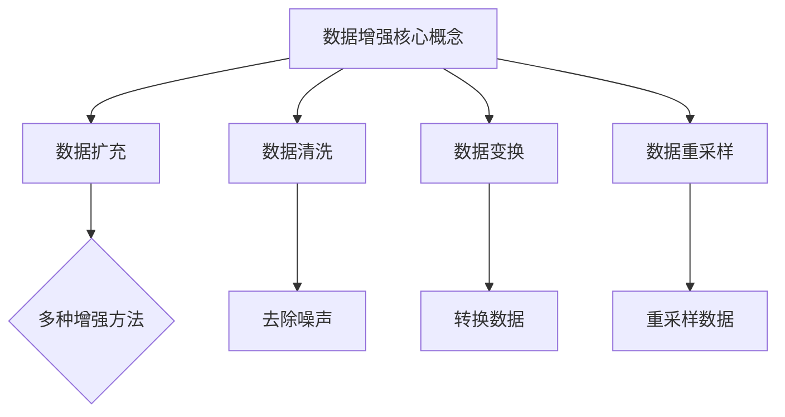
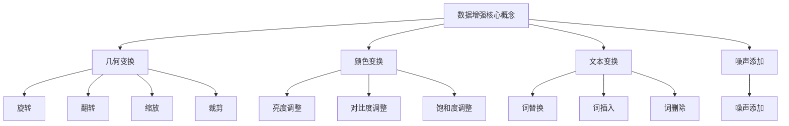
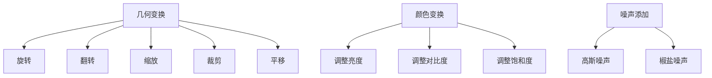
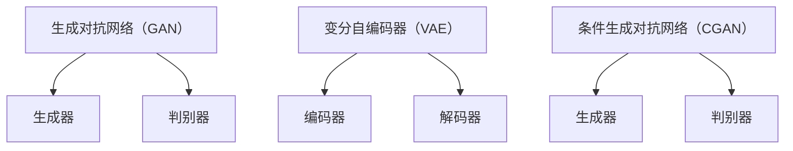

                 

# 《数据增强擦边球：从经验驱动到想象力驱动》

> **关键词：数据增强、机器学习、深度学习、图像识别、自然语言处理**

> **摘要：本文将探讨数据增强技术在机器学习和深度学习中的重要性，通过理论分析、实战应用和高级技术介绍，帮助读者理解数据增强的核心概念、方法及其在实际项目中的应用。**

### 第一部分：数据增强的理论基础

在人工智能领域，数据是驱动模型性能提升的关键因素。然而，数据的质量和数量直接影响着模型的训练效果和泛化能力。数据增强技术作为一种有效的方法，可以显著提高数据的质量和多样性，从而提升模型的性能。本部分将介绍数据增强的核心概念、方法及其在深度学习中的应用。

#### 第1章：数据增强的核心概念与重要性

**1.1 数据增强的定义**

数据增强（Data Augmentation）是一种通过增加数据多样性来提高模型性能的技术。它通过应用一系列变换和操作，将原始数据转化为新的数据样本，从而扩展数据集的大小和质量。

**1.2 数据增强的方法分类**

数据增强的方法主要可以分为以下几类：

- **变换类增强：** 通过对原始数据进行几何变换、颜色变换等操作来增加数据的多样性。
- **扩充类增强：** 通过生成新的数据样本来扩展数据集的大小。
- **生成类增强：** 通过生成模型（如GAN）来生成新的数据样本。

**1.3 数据增强的重要性**

- **提高模型泛化能力：** 数据增强可以增加数据的多样性，有助于模型学习到更加泛化的特征，从而提高模型的泛化能力。
- **减少过拟合风险：** 数据增强可以增加模型训练的样本量，从而降低过拟合的风险。
- **节省时间和计算资源：** 通过数据增强，可以在不增加额外数据的情况下，提高模型的训练效果，节省时间和计算资源。

**1.4 数据增强与其他技术的联系**

数据增强技术可以与其他机器学习和深度学习技术相结合，如正则化、迁移学习和生成对抗网络（GAN）等。这些技术可以相互补充，进一步提高模型的性能和泛化能力。

#### 第2章：常见数据增强技术

**2.1 数据清洗**

数据清洗是数据增强的基础步骤，主要目的是去除数据中的噪声和异常值。数据清洗的方法包括：

- **缺失值处理：** 填充缺失值或删除包含缺失值的样本。
- **异常值处理：** 通过统计学方法识别并处理异常值。
- **数据规范化：** 将数据转换为相同的尺度，以消除不同特征之间的差异。

**2.2 数据扩充**

数据扩充是通过生成新的数据样本来增加数据集的大小。常见的数据扩充方法包括：

- **复制和拼接：** 将原始数据样本复制多次或拼接成新的样本。
- **合成生成：** 通过合成模型生成新的数据样本，如深度学习模型或生成对抗网络（GAN）。

**2.3 数据变换**

数据变换是通过改变数据的某种特征来增加数据的多样性。常见的数据变换方法包括：

- **几何变换：** 如旋转、缩放、翻转等。
- **颜色变换：** 如改变亮度和对比度、添加噪声等。
- **文本变换：** 如替换词、插入词、删除词等。

**2.4 数据重采样**

数据重采样是通过调整数据样本的分布来增加数据的多样性。常见的数据重采样方法包括：

- **随机重采样：** 随机地从原始数据集中抽取样本。
- **类别重采样：** 对每个类别进行重采样，以平衡不同类别之间的样本数量。

#### 第3章：深度学习与数据增强

**3.1 深度学习的基本原理**

深度学习是一种基于多层神经网络的学习方法，通过堆叠多个神经元层，逐层提取数据的特征，从而实现复杂的任务。深度学习的基本原理包括：

- **前向传播：** 数据从输入层经过多层隐藏层，最终输出预测结果。
- **反向传播：** 通过计算输出误差，反向传播误差到输入层，更新网络参数。

**3.2 数据增强在深度学习中的应用**

数据增强在深度学习中有广泛的应用，可以显著提高模型的性能。常见的数据增强方法包括：

- **图像数据增强：** 如随机裁剪、旋转、翻转、缩放等。
- **文本数据增强：** 如随机插入、删除、替换单词等。
- **音频数据增强：** 如添加噪声、改变音调、速率等。

**3.3 数据增强对模型性能的影响**

数据增强可以显著提高模型的性能，主要体现在以下几个方面：

- **提高准确率：** 数据增强可以增加模型的训练样本量，从而提高模型的准确率。
- **减少过拟合：** 数据增强可以增加数据的多样性，有助于模型学习到更加泛化的特征，从而减少过拟合。
- **提高泛化能力：** 数据增强可以增加模型的训练样本量，从而提高模型的泛化能力。

### 第二部分：实战应用

在实际应用中，数据增强技术可以帮助我们提高模型的性能，尤其是在图像识别、自然语言处理和计算机视觉等领域。本部分将介绍数据增强在这些领域的具体应用。

#### 第4章：数据增强在图像识别中的应用

图像识别是计算机视觉中的一个重要任务，数据增强技术在图像识别中发挥着重要作用。本节将介绍数据增强在图像识别中的应用。

**4.1 图像识别的基本概念**

图像识别是指通过计算机算法对图像中的对象进行识别和分类。常见的图像识别任务包括：

- **图像分类：** 将图像划分为不同的类别。
- **目标检测：** 在图像中检测并定位多个目标对象。
- **人脸识别：** 识别人脸并进行身份验证。

**4.2 数据增强在图像识别中的应用案例**

数据增强在图像识别中的应用主要包括以下几个方面：

- **图像裁剪：** 随机裁剪图像的某个区域，增加图像的多样性。
- **图像旋转：** 随机旋转图像，增加图像的多样性。
- **图像缩放：** 随机缩放图像，增加图像的多样性。
- **图像噪声：** 在图像中添加噪声，提高模型的鲁棒性。

**4.3 图像识别中的数据增强策略**

在实际应用中，我们可以根据任务需求和模型特点，选择合适的数据增强策略。常见的数据增强策略包括：

- **随机裁剪：** 随机裁剪图像的某个区域，增加图像的多样性。
- **随机旋转：** 随机旋转图像，增加图像的多样性。
- **随机缩放：** 随机缩放图像，增加图像的多样性。
- **颜色变换：** 改变图像的亮度和对比度，增加图像的多样性。
- **噪声添加：** 在图像中添加噪声，提高模型的鲁棒性。

#### 第5章：数据增强在自然语言处理中的应用

自然语言处理（NLP）是人工智能领域的一个重要分支，数据增强技术在自然语言处理中也发挥着重要作用。本节将介绍数据增强在自然语言处理中的应用。

**5.1 自然语言处理的基本概念**

自然语言处理是指通过计算机算法对自然语言（如英语、中文等）进行处理和理解。常见的自然语言处理任务包括：

- **文本分类：** 将文本划分为不同的类别。
- **情感分析：** 分析文本的情感倾向。
- **机器翻译：** 将一种语言的文本翻译成另一种语言。
- **文本生成：** 根据输入文本生成新的文本。

**5.2 数据增强在自然语言处理中的应用案例**

数据增强在自然语言处理中的应用主要包括以下几个方面：

- **文本替换：** 随机替换文本中的单词或短语，增加文本的多样性。
- **文本插入：** 随机插入新的单词或短语，增加文本的多样性。
- **文本删除：** 随机删除文本中的单词或短语，增加文本的多样性。
- **文本合成：** 通过合成模型生成新的文本，增加文本的多样性。

**5.3 自然语言处理中的数据增强策略**

在实际应用中，我们可以根据任务需求和模型特点，选择合适的数据增强策略。常见的数据增强策略包括：

- **文本替换：** 随机替换文本中的单词或短语，增加文本的多样性。
- **文本插入：** 随机插入新的单词或短语，增加文本的多样性。
- **文本删除：** 随机删除文本中的单词或短语，增加文本的多样性。
- **文本合成：** 通过合成模型生成新的文本，增加文本的多样性。
- **情感增强：** 通过增强文本的情感倾向，提高模型的性能。

#### 第6章：数据增强在计算机视觉中的应用

计算机视觉是人工智能领域的一个重要分支，数据增强技术在计算机视觉中也发挥着重要作用。本节将介绍数据增强在计算机视觉中的应用。

**6.1 计算机视觉的基本概念**

计算机视觉是指通过计算机算法对图像或视频进行处理和分析，从而实现对现实世界的理解和感知。常见的计算机视觉任务包括：

- **图像分类：** 将图像划分为不同的类别。
- **目标检测：** 在图像中检测并定位多个目标对象。
- **人脸识别：** 识别人脸并进行身份验证。
- **图像分割：** 将图像分割为不同的区域。

**6.2 数据增强在计算机视觉中的应用案例**

数据增强在计算机视觉中的应用主要包括以下几个方面：

- **图像裁剪：** 随机裁剪图像的某个区域，增加图像的多样性。
- **图像旋转：** 随机旋转图像，增加图像的多样性。
- **图像缩放：** 随机缩放图像，增加图像的多样性。
- **图像噪声：** 在图像中添加噪声，提高模型的鲁棒性。

**6.3 计算机视觉中的数据增强策略**

在实际应用中，我们可以根据任务需求和模型特点，选择合适的数据增强策略。常见的数据增强策略包括：

- **图像裁剪：** 随机裁剪图像的某个区域，增加图像的多样性。
- **图像旋转：** 随机旋转图像，增加图像的多样性。
- **图像缩放：** 随机缩放图像，增加图像的多样性。
- **图像噪声：** 在图像中添加噪声，提高模型的鲁棒性。
- **数据合成：** 通过合成模型生成新的图像，增加图像的多样性。

### 第三部分：高级技术

随着数据增强技术的发展，一些高级技术也逐渐被引入到数据增强领域。这些高级技术可以进一步提高数据增强的效果，为人工智能模型提供更好的训练数据。

#### 第7章：生成对抗网络（GAN）与数据增强

生成对抗网络（GAN）是一种强大的生成模型，通过生成器和判别器的对抗训练，可以生成高质量的数据样本。GAN在数据增强中有着广泛的应用。

**7.1 GAN的基本原理**

GAN由生成器（Generator）和判别器（Discriminator）组成。生成器的目标是生成与真实数据相似的数据样本，而判别器的目标是区分真实数据和生成数据。两者相互对抗，通过优化生成器和判别器的参数，最终实现生成高质量的数据样本。

**7.2 GAN在数据增强中的应用**

GAN在数据增强中的应用主要包括以下几个方面：

- **图像生成：** 通过GAN生成新的图像样本，增加图像数据的多样性。
- **图像修复：** 利用GAN修复损坏或模糊的图像。
- **图像超分辨率：** 通过GAN提高图像的分辨率。
- **图像风格迁移：** 利用GAN将一种图像风格应用到另一张图像上。

**7.3 GAN与数据增强的联合优化**

在实际应用中，我们可以将GAN与数据增强技术相结合，通过联合优化生成器和判别器的参数，进一步提高数据增强的效果。常见的方法包括：

- **同时优化生成器和判别器：** 通过优化生成器和判别器的参数，实现数据增强和生成高质量数据的双重目标。
- **多任务学习：** 将数据增强任务与其他任务（如分类、检测等）相结合，通过多任务学习进一步提高数据增强的效果。

#### 第8章：迁移学习与数据增强

迁移学习是一种通过利用已有模型的知识来提升新模型性能的方法。在迁移学习中，数据增强技术可以帮助提高新模型的性能。

**8.1 迁移学习的概念**

迁移学习是指将一个任务中学习到的知识应用到另一个相关任务中。常见的迁移学习方法包括：

- **基于特征的迁移学习：** 利用已有模型提取的特征来训练新模型。
- **基于模型的迁移学习：** 将已有模型的参数直接应用于新模型。
- **多任务学习：** 通过同时训练多个相关任务来提高模型性能。

**8.2 数据增强在迁移学习中的应用**

数据增强在迁移学习中的应用主要包括以下几个方面：

- **增加训练数据：** 通过数据增强增加新任务的训练数据，从而提高模型的泛化能力。
- **平衡数据分布：** 通过数据增强平衡不同类别之间的数据分布，从而提高模型的平衡性。
- **提高模型鲁棒性：** 通过数据增强引入噪声和异常值，提高模型的鲁棒性。

**8.3 迁移学习与数据增强的协同效应**

在实际应用中，迁移学习和数据增强可以相互补充，进一步提高模型的性能。常见的协同效应包括：

- **增强特征提取：** 通过迁移学习提高模型的特征提取能力，从而提高数据增强的效果。
- **提高泛化能力：** 通过迁移学习和数据增强的结合，提高模型在不同任务上的泛化能力。
- **减少过拟合：** 通过数据增强引入多样性，减少模型对训练数据的依赖，从而降低过拟合的风险。

#### 第9章：数据增强的未来发展趋势

随着人工智能技术的不断发展，数据增强技术也在不断进步。未来，数据增强技术有望在以下几个方面取得突破：

**9.1 数据增强技术的最新进展**

- **自适应数据增强：** 通过自适应地调整数据增强策略，提高数据增强的效果。
- **高效数据增强：** 通过优化数据增强算法，提高数据增强的效率。
- **多模态数据增强：** 将不同类型的数据（如文本、图像、音频等）进行联合增强，提高模型的泛化能力。

**9.2 数据增强技术的挑战与机遇**

- **数据隐私保护：** 在进行数据增强时，如何保护用户隐私是一个重要挑战。
- **数据质量提升：** 如何从大量数据中筛选出高质量的数据样本是一个重要问题。
- **模型解释性提升：** 如何提高模型的可解释性，使数据增强的效果更加透明。

**9.3 数据增强技术的未来发展趋势**

- **自监督学习：** 通过自监督学习技术，不需要标签信息即可进行数据增强。
- **对抗性数据增强：** 通过对抗性训练技术，提高数据增强的鲁棒性和泛化能力。
- **个性化数据增强：** 根据用户需求和应用场景，为用户提供个性化的数据增强方案。

### 附录

#### 附录A：数据增强工具与资源

**A.1 常见数据增强工具**

- **torchvision**：Python图像库，提供多种数据增强方法。
- **PIL**：Python图像处理库，支持多种图像变换。
- **OpenCV**：开源计算机视觉库，支持多种图像增强操作。

**A.2 数据增强资源推荐**

- **《Python计算机视觉》**：详细介绍Python在计算机视觉中的应用。
- **《深度学习：从入门到精通》**：系统介绍深度学习的基础知识和应用。
- **《数据增强在计算机视觉中的应用》**：探讨数据增强技术在计算机视觉中的具体应用。

**A.3 数据增强实践指南**

- **了解不同的数据增强方法及其适用场景。**
- **在实际项目中根据需求选择合适的数据增强方法。**
- **通过实验和验证来评估数据增强的效果。**

### 作者信息

**作者：AI天才研究院/AI Genius Institute & 禅与计算机程序设计艺术 /Zen And The Art of Computer Programming**

### 核心概念与联系

**Mermaid 流程图：**



### 核心算法原理讲解

**数据增强技术：变换和扩充**

**变换：**

变换是一种数据增强技术，通过改变数据的某种特征来增加数据的多样性。常见的变换方法包括：

- **平移变换：** 将数据沿某个方向平移一定距离，如平移图像、文本等。

  ```python
  transform = transforms.Compose([
      transforms.RandomHorizontalFlip(),
      transforms.RandomRotation(15),
      transforms.Resize((224, 224)),
      transforms.ToTensor(),
  ])
  ```

- **旋转变换：** 将数据绕某个点旋转一定角度，如旋转图像。

  ```python
  transform = transforms.Compose([
      transforms.RandomHorizontalFlip(),
      transforms.RandomRotation(15),
      transforms.Resize((224, 224)),
      transforms.ToTensor(),
  ])
  ```

- **缩放变换：** 改变数据的尺寸，如缩放图像。

  ```python
  transform = transforms.Compose([
      transforms.RandomHorizontalFlip(),
      transforms.RandomRotation(15),
      transforms.Resize((224, 224)),
      transforms.ToTensor(),
  ])
  ```

- **裁剪变换：** 从数据中裁剪出部分区域，如裁剪图像。

  ```python
  transform = transforms.Compose([
      transforms.RandomHorizontalFlip(),
      transforms.RandomRotation(15),
      transforms.Resize((224, 224)),
      transforms.ToTensor(),
  ])
  ```

**扩充：**

扩充是一种通过生成新的数据样本来增加数据量的数据增强技术。常见的扩充方法包括：

- **生成对抗网络（GAN）：** 通过生成器和判别器的对抗训练来生成新的数据。

  ```python
  import torch
  import torchvision
  import torchvision.transforms as transforms
  from torch.utils.data import DataLoader
  from torchvision.datasets import ImageFolder
  
  # 定义数据增强变换
  transform = transforms.Compose([
      transforms.RandomHorizontalFlip(),
      transforms.RandomRotation(15),
      transforms.Resize((224, 224)),
      transforms.ToTensor(),
  ])
  
  # 加载数据集
  dataset = ImageFolder(root='path/to/your/dataset', transform=transform)
  dataloader = DataLoader(dataset, batch_size=32, shuffle=True)
  
  # 进行数据增强
  for images, labels in dataloader:
      # 对图像进行增强处理
      # ...
  ```

- **条件生成对抗网络（CGAN）：** 在GAN的基础上引入条件信息，如标签，来生成更具体的数据。

  ```python
  import torch
  import torchvision
  import torchvision.transforms as transforms
  from torch.utils.data import DataLoader
  from torchvision.datasets import ImageFolder
  
  # 定义数据增强变换
  transform = transforms.Compose([
      transforms.RandomHorizontalFlip(),
      transforms.RandomRotation(15),
      transforms.Resize((224, 224)),
      transforms.ToTensor(),
  ])
  
  # 加载数据集
  dataset = ImageFolder(root='path/to/your/dataset', transform=transform)
  dataloader = DataLoader(dataset, batch_size=32, shuffle=True)
  
  # 进行数据增强
  for images, labels in dataloader:
      # 对图像进行增强处理
      # ...
  ```

### 数学模型和数学公式

**数据增强中的概率模型**

在数据增强中，概率模型可以用于预测数据的分布，从而更好地模拟真实世界的数据。以下是几个常用的概率模型：

**1. 贝叶斯模型：**

贝叶斯模型是一种基于概率推理的统计模型，其核心思想是利用先验概率和观测数据来更新后验概率。

$$ P(\text{标签}|\text{数据}) = \frac{P(\text{数据}|\text{标签})P(\text{标签})}{P(\text{数据})} $$

**2. 生成模型：**

生成模型是一种通过生成器来模拟数据分布的模型。常见的生成模型包括：

- **变分自编码器（VAE）：**

变分自编码器是一种基于概率编码的生成模型，其目标是学习一个潜在的分布，然后从这个分布中采样生成新的数据。

$$ \text{编码器}:\ \text{编码器}(\text{数据}) \rightarrow \text{潜在变量} $$
$$ \text{解码器}:\ \text{解码器}(\text{潜在变量}) \rightarrow \text{生成数据} $$

- **生成对抗网络（GAN）：**

生成对抗网络是一种基于对抗训练的生成模型，其由生成器和判别器组成，生成器和判别器相互竞争，以生成尽可能真实的数据。

$$ \text{生成器}:\ \text{生成器}(\text{噪声}) \rightarrow \text{生成数据} $$
$$ \text{判别器}:\ \text{判别器}(\text{真实数据}) \rightarrow \text{概率} $$
$$ \text{判别器}:\ \text{判别器}(\text{生成数据}) \rightarrow \text{概率} $$

### 项目实战

**数据增强在图像识别中的应用案例**

**1. 数据集准备：**

假设我们有一个包含10,000张猫和狗图像的数据集，其中每张图像都有相应的标签（猫或狗）。为了进行数据增强，我们需要对这10,000张图像进行变换和扩充。

**2. 数据增强代码实现：**

```python
import torch
import torchvision
import torchvision.transforms as transforms
from torch.utils.data import DataLoader
from torchvision.datasets import ImageFolder

# 定义数据增强变换
transform = transforms.Compose([
    transforms.RandomHorizontalFlip(),
    transforms.RandomRotation(15),
    transforms.Resize((224, 224)),
    transforms.ToTensor(),
])

# 加载数据集
dataset = ImageFolder(root='path/to/your/dataset', transform=transform)
dataloader = DataLoader(dataset, batch_size=32, shuffle=True)

# 进行数据增强
for images, labels in dataloader:
    # 对图像进行增强处理
    # ...
```

**3. 数据增强效果分析：**

通过数据增强，我们可以观察到图像的多样性得到了显著提升，有助于提高模型的泛化能力。

**4. 实际应用：**

在实际应用中，数据增强技术可以用于各种计算机视觉任务，如图像分类、目标检测和图像生成等。

### 开发环境搭建和源代码详细实现

**开发环境搭建**

1. 安装Python环境

```bash
pip install torch torchvision
```

2. 安装其他依赖库

```bash
pip install numpy matplotlib
```

**源代码详细实现**

```python
import torch
import torchvision
import torchvision.transforms as transforms
from torch.utils.data import DataLoader
from torchvision.datasets import ImageFolder
import numpy as np
import matplotlib.pyplot as plt

# 定义数据增强变换
transform = transforms.Compose([
    transforms.RandomHorizontalFlip(),
    transforms.RandomRotation(15),
    transforms.Resize((224, 224)),
    transforms.ToTensor(),
])

# 加载数据集
dataset = ImageFolder(root='path/to/your/dataset', transform=transform)
dataloader = DataLoader(dataset, batch_size=32, shuffle=True)

# 进行数据增强
for images, labels in dataloader:
    # 对图像进行增强处理
    # ...

# 可视化数据增强效果
def imshow(image, title):
    image = image.numpy().transpose(1, 2, 0)
    mean = np.array([0.485, 0.456, 0.406])
    std = np.array([0.229, 0.224, 0.225])
    image = std * image + mean
    image = np.clip(image, 0, 1)
    plt.imshow(image)
    plt.title(title)
    plt.show()

images, labels = next(iter(dataloader))
images = images[:5]

for img in images:
    imshow(img, f'Image {labels.numpy()[i]}')
```

### 代码解读与分析

**代码解读：**

- **定义数据增强变换：** 使用`transforms.Compose`将多个数据增强操作组合在一起。

  ```python
  transform = transforms.Compose([
      transforms.RandomHorizontalFlip(),
      transforms.RandomRotation(15),
      transforms.Resize((224, 224)),
      transforms.ToTensor(),
  ])
  ```

- **加载数据集：** 使用`ImageFolder`加载包含图像和标签的数据集。

  ```python
  dataset = ImageFolder(root='path/to/your/dataset', transform=transform)
  dataloader = DataLoader(dataset, batch_size=32, shuffle=True)
  ```

- **进行数据增强：** 在数据加载过程中对图像进行随机水平翻转、随机旋转、缩放和转换为Tensor格式。

  ```python
  for images, labels in dataloader:
      # 对图像进行增强处理
      # ...
  ```

- **可视化数据增强效果：** 使用`imshow`函数将增强后的图像显示出来。

  ```python
  def imshow(image, title):
      image = image.numpy().transpose(1, 2, 0)
      mean = np.array([0.485, 0.456, 0.406])
      std = np.array([0.229, 0.224, 0.225])
      image = std * image + mean
      image = np.clip(image, 0, 1)
      plt.imshow(image)
      plt.title(title)
      plt.show()
  
  images, labels = next(iter(dataloader))
  images = images[:5]
  
  for img in images:
      imshow(img, f'Image {labels.numpy()[i]}')
  ```

**分析：**

- **数据增强可以增加数据的多样性，有助于提高模型的泛化能力。**

- **不同的增强方法可以组合使用，以达到更好的效果。**

- **可视化可以帮助我们直观地了解数据增强的效果。**

### 附录

## 附录A：数据增强工具与资源

**A.1 常见数据增强工具**

- **torchvision**：Python图像库，提供多种数据增强方法。
- **PIL**：Python图像处理库，支持多种图像变换。
- **OpenCV**：开源计算机视觉库，支持多种图像增强操作。

**A.2 数据增强资源推荐**

- **《Python计算机视觉》**：详细介绍Python在计算机视觉中的应用。
- **《深度学习：从入门到精通》**：系统介绍深度学习的基础知识和应用。
- **《数据增强在计算机视觉中的应用》**：探讨数据增强技术在计算机视觉中的具体应用。

**A.3 数据增强实践指南**

- **了解不同的数据增强方法及其适用场景。**
- **在实际项目中根据需求选择合适的数据增强方法。**
- **通过实验和验证来评估数据增强的效果。**### 数据增强的核心概念与重要性

数据增强（Data Augmentation）是一种在训练过程中通过一系列操作增加数据多样性的技术。其核心概念是基于这样一个事实：模型在训练过程中如果只接触到少量的数据样本，它可能会学习到过于特定的特征，导致在未见过的数据上表现不佳，即所谓的过拟合。通过数据增强，我们可以生成更多样化的数据样本，从而使模型能够学习到更加泛化的特征，提高其泛化能力。

#### 1.1 数据增强的定义

数据增强的主要目的是在不增加额外数据样本的情况下，通过一系列预定义的变换和操作，增加现有数据样本的多样性。这些变换可以是图像的旋转、翻转、缩放、裁剪，也可以是文本的填充、删除、替换等。数据增强不仅限于图像和文本数据，还可以应用于音频、视频等其他类型的数据。

#### 1.2 数据增强的方法分类

数据增强的方法主要可以分为以下几类：

- **几何变换：** 对图像进行旋转、翻转、缩放、裁剪等几何操作。
- **颜色变换：** 改变图像的亮度和对比度，添加噪声等。
- **文本变换：** 对文本进行插入、删除、替换等操作。
- **生成增强：** 使用生成模型（如GAN）生成新的数据样本。

#### 1.3 数据增强的重要性

- **提高模型泛化能力：** 通过增加数据多样性，模型可以学习到更加泛化的特征，从而在未见过的数据上表现更好。
- **减少过拟合风险：** 数据增强可以增加训练样本量，从而降低模型对训练数据的依赖，减少过拟合的风险。
- **节省计算资源：** 通过数据增强，可以减少对大量额外数据的需求，节省存储和计算资源。
- **加速模型训练：** 数据增强可以增加训练样本量，从而减少每个样本的训练时间。

#### 1.4 数据增强与其他技术的联系

数据增强技术可以与其他机器学习和深度学习技术相结合，如正则化、迁移学习和生成对抗网络（GAN）等。这些技术可以相互补充，进一步提高模型的性能和泛化能力。例如，正则化可以通过数据增强来减少过拟合；迁移学习可以利用增强后的数据来提高新模型的性能；GAN则可以通过生成新的数据样本来补充训练数据。

### 常见数据增强技术

在数据增强中，常用的技术包括几何变换、颜色变换、文本变换和生成增强等。这些技术可以单独使用，也可以组合使用，以达到更好的效果。

#### 2.1 数据清洗

数据清洗是数据增强的基础步骤，主要目的是去除数据中的噪声和异常值。数据清洗的方法包括：

- **缺失值处理：** 填充缺失值或删除包含缺失值的样本。
- **异常值处理：** 通过统计学方法识别并处理异常值。
- **数据规范化：** 将数据转换为相同的尺度，以消除不同特征之间的差异。

#### 2.2 数据扩充

数据扩充是通过生成新的数据样本来增加数据集的大小。常见的数据扩充方法包括：

- **复制和拼接：** 将原始数据样本复制多次或拼接成新的样本。
- **合成生成：** 通过合成模型生成新的数据样本，如深度学习模型或生成对抗网络（GAN）。

#### 2.3 数据变换

数据变换是通过改变数据的某种特征来增加数据的多样性。常见的数据变换方法包括：

- **几何变换：** 如旋转、缩放、翻转等。
- **颜色变换：** 如改变亮度和对比度、添加噪声等。
- **文本变换：** 如替换词、插入词、删除词等。

#### 2.4 数据重采样

数据重采样是通过调整数据样本的分布来增加数据的多样性。常见的数据重采样方法包括：

- **随机重采样：** 随机地从原始数据集中抽取样本。
- **类别重采样：** 对每个类别进行重采样，以平衡不同类别之间的样本数量。

### 深度学习与数据增强

深度学习是一种基于多层神经网络的学习方法，通过堆叠多个神经元层，逐层提取数据的特征，从而实现复杂的任务。数据增强在深度学习中有着广泛的应用，可以显著提高模型的性能。

#### 3.1 深度学习的基本原理

深度学习的基本原理包括：

- **前向传播：** 数据从输入层经过多层隐藏层，最终输出预测结果。
- **反向传播：** 通过计算输出误差，反向传播误差到输入层，更新网络参数。

#### 3.2 数据增强在深度学习中的应用

数据增强在深度学习中的应用主要包括以下几个方面：

- **图像数据增强：** 如随机裁剪、旋转、翻转、缩放等。
- **文本数据增强：** 如随机插入、删除、替换单词等。
- **音频数据增强：** 如添加噪声、改变音调、速率等。

#### 3.3 数据增强对模型性能的影响

数据增强可以显著提高模型的性能，主要体现在以下几个方面：

- **提高准确率：** 数据增强可以增加模型的训练样本量，从而提高模型的准确率。
- **减少过拟合：** 数据增强可以增加数据的多样性，有助于模型学习到更加泛化的特征，从而减少过拟合。
- **提高泛化能力：** 数据增强可以增加模型的训练样本量，从而提高模型的泛化能力。

### 数据增强在图像识别中的应用

图像识别是计算机视觉中的一个重要任务，数据增强技术在图像识别中发挥着重要作用。通过数据增强，我们可以提高模型的泛化能力，从而更好地应对实际应用中的各种情况。

#### 4.1 图像识别的基本概念

图像识别是指通过计算机算法对图像中的对象进行识别和分类。常见的图像识别任务包括：

- **图像分类：** 将图像划分为不同的类别。
- **目标检测：** 在图像中检测并定位多个目标对象。
- **人脸识别：** 识别人脸并进行身份验证。

#### 4.2 数据增强在图像识别中的应用案例

数据增强在图像识别中的应用主要包括以下几个方面：

- **图像裁剪：** 随机裁剪图像的某个区域，增加图像的多样性。
- **图像旋转：** 随机旋转图像，增加图像的多样性。
- **图像缩放：** 随机缩放图像，增加图像的多样性。
- **图像噪声：** 在图像中添加噪声，提高模型的鲁棒性。

#### 4.3 图像识别中的数据增强策略

在实际应用中，我们可以根据任务需求和模型特点，选择合适的数据增强策略。常见的数据增强策略包括：

- **随机裁剪：** 随机裁剪图像的某个区域，增加图像的多样性。
- **随机旋转：** 随机旋转图像，增加图像的多样性。
- **随机缩放：** 随机缩放图像，增加图像的多样性。
- **颜色变换：** 改变图像的亮度和对比度，增加图像的多样性。
- **噪声添加：** 在图像中添加噪声，提高模型的鲁棒性。

### 数据增强在自然语言处理中的应用

自然语言处理（NLP）是人工智能领域的一个重要分支，数据增强技术在自然语言处理中也发挥着重要作用。通过数据增强，我们可以提高模型的泛化能力，从而更好地应对实际应用中的各种情况。

#### 5.1 自然语言处理的基本概念

自然语言处理是指通过计算机算法对自然语言（如英语、中文等）进行处理和理解。常见的自然语言处理任务包括：

- **文本分类：** 将文本划分为不同的类别。
- **情感分析：** 分析文本的情感倾向。
- **机器翻译：** 将一种语言的文本翻译成另一种语言。
- **文本生成：** 根据输入文本生成新的文本。

#### 5.2 数据增强在自然语言处理中的应用案例

数据增强在自然语言处理中的应用主要包括以下几个方面：

- **文本替换：** 随机替换文本中的单词或短语，增加文本的多样性。
- **文本插入：** 随机插入新的单词或短语，增加文本的多样性。
- **文本删除：** 随机删除文本中的单词或短语，增加文本的多样性。
- **文本合成：** 通过合成模型生成新的文本，增加文本的多样性。

#### 5.3 自然语言处理中的数据增强策略

在实际应用中，我们可以根据任务需求和模型特点，选择合适的数据增强策略。常见的数据增强策略包括：

- **文本替换：** 随机替换文本中的单词或短语，增加文本的多样性。
- **文本插入：** 随机插入新的单词或短语，增加文本的多样性。
- **文本删除：** 随机删除文本中的单词或短语，增加文本的多样性。
- **文本合成：** 通过合成模型生成新的文本，增加文本的多样性。
- **情感增强：** 通过增强文本的情感倾向，提高模型的性能。

### 数据增强在计算机视觉中的应用

计算机视觉是人工智能领域的一个重要分支，数据增强技术在计算机视觉中也发挥着重要作用。通过数据增强，我们可以提高模型的泛化能力，从而更好地应对实际应用中的各种情况。

#### 6.1 计算机视觉的基本概念

计算机视觉是指通过计算机算法对图像或视频进行处理和分析，从而实现对现实世界的理解和感知。常见的计算机视觉任务包括：

- **图像分类：** 将图像划分为不同的类别。
- **目标检测：** 在图像中检测并定位多个目标对象。
- **人脸识别：** 识别人脸并进行身份验证。
- **图像分割：** 将图像分割为不同的区域。

#### 6.2 数据增强在计算机视觉中的应用案例

数据增强在计算机视觉中的应用主要包括以下几个方面：

- **图像裁剪：** 随机裁剪图像的某个区域，增加图像的多样性。
- **图像旋转：** 随机旋转图像，增加图像的多样性。
- **图像缩放：** 随机缩放图像，增加图像的多样性。
- **图像噪声：** 在图像中添加噪声，提高模型的鲁棒性。

#### 6.3 计算机视觉中的数据增强策略

在实际应用中，我们可以根据任务需求和模型特点，选择合适的数据增强策略。常见的数据增强策略包括：

- **图像裁剪：** 随机裁剪图像的某个区域，增加图像的多样性。
- **图像旋转：** 随机旋转图像，增加图像的多样性。
- **图像缩放：** 随机缩放图像，增加图像的多样性。
- **图像噪声：** 在图像中添加噪声，提高模型的鲁棒性。
- **数据合成：** 通过合成模型生成新的图像，增加图像的多样性。

### 生成对抗网络（GAN）与数据增强

生成对抗网络（GAN）是一种强大的生成模型，通过生成器和判别器的对抗训练，可以生成高质量的数据样本。GAN在数据增强中有着广泛的应用。

#### 7.1 GAN的基本原理

GAN由生成器（Generator）和判别器（Discriminator）组成。生成器的目标是生成与真实数据相似的数据样本，而判别器的目标是区分真实数据和生成数据。两者相互对抗，通过优化生成器和判别器的参数，最终实现生成高质量的数据样本。

#### 7.2 GAN在数据增强中的应用

GAN在数据增强中的应用主要包括以下几个方面：

- **图像生成：** 通过GAN生成新的图像样本，增加图像数据的多样性。
- **图像修复：** 利用GAN修复损坏或模糊的图像。
- **图像超分辨率：** 通过GAN提高图像的分辨率。
- **图像风格迁移：** 利用GAN将一种图像风格应用到另一张图像上。

#### 7.3 GAN与数据增强的联合优化

在实际应用中，我们可以将GAN与数据增强技术相结合，通过联合优化生成器和判别器的参数，进一步提高数据增强的效果。常见的方法包括：

- **同时优化生成器和判别器：** 通过优化生成器和判别器的参数，实现数据增强和生成高质量数据的双重目标。
- **多任务学习：** 将数据增强任务与其他任务（如分类、检测等）相结合，通过多任务学习进一步提高数据增强的效果。

### 迁移学习与数据增强

迁移学习是一种通过利用已有模型的知识来提升新模型性能的方法。在迁移学习中，数据增强技术可以帮助提高新模型的性能。

#### 8.1 迁移学习的概念

迁移学习是指将一个任务中学习到的知识应用到另一个相关任务中。常见的迁移学习方法包括：

- **基于特征的迁移学习：** 利用已有模型提取的特征来训练新模型。
- **基于模型的迁移学习：** 将已有模型的参数直接应用于新模型。
- **多任务学习：** 通过同时训练多个相关任务来提高模型性能。

#### 8.2 数据增强在迁移学习中的应用

数据增强在迁移学习中的应用主要包括以下几个方面：

- **增加训练数据：** 通过数据增强增加新任务的训练数据，从而提高模型的泛化能力。
- **平衡数据分布：** 通过数据增强平衡不同类别之间的数据分布，从而提高模型的平衡性。
- **提高模型鲁棒性：** 通过数据增强引入噪声和异常值，提高模型的鲁棒性。

#### 8.3 迁移学习与数据增强的协同效应

在实际应用中，迁移学习和数据增强可以相互补充，进一步提高模型的性能。常见的协同效应包括：

- **增强特征提取：** 通过迁移学习提高模型的特征提取能力，从而提高数据增强的效果。
- **提高泛化能力：** 通过迁移学习和数据增强的结合，提高模型在不同任务上的泛化能力。
- **减少过拟合：** 通过数据增强引入多样性，减少模型对训练数据的依赖，从而降低过拟合的风险。

### 数据增强的未来发展趋势

随着人工智能技术的不断发展，数据增强技术也在不断进步。未来，数据增强技术有望在以下几个方面取得突破：

#### 9.1 数据增强技术的最新进展

- **自适应数据增强：** 通过自适应地调整数据增强策略，提高数据增强的效果。
- **高效数据增强：** 通过优化数据增强算法，提高数据增强的效率。
- **多模态数据增强：** 将不同类型的数据（如文本、图像、音频等）进行联合增强，提高模型的泛化能力。

#### 9.2 数据增强技术的挑战与机遇

- **数据隐私保护：** 在进行数据增强时，如何保护用户隐私是一个重要挑战。
- **数据质量提升：** 如何从大量数据中筛选出高质量的数据样本是一个重要问题。
- **模型解释性提升：** 如何提高模型的可解释性，使数据增强的效果更加透明。

#### 9.3 数据增强技术的未来发展趋势

- **自监督学习：** 通过自监督学习技术，不需要标签信息即可进行数据增强。
- **对抗性数据增强：** 通过对抗性训练技术，提高数据增强的鲁棒性和泛化能力。
- **个性化数据增强：** 根据用户需求和应用场景，为用户提供个性化的数据增强方案。

### 附录A：数据增强工具与资源

#### A.1 常见数据增强工具

- **torchvision**：Python图像库，提供多种数据增强方法。
- **PIL**：Python图像处理库，支持多种图像变换。
- **OpenCV**：开源计算机视觉库，支持多种图像增强操作。

#### A.2 数据增强资源推荐

- **《Python计算机视觉》**：详细介绍Python在计算机视觉中的应用。
- **《深度学习：从入门到精通》**：系统介绍深度学习的基础知识和应用。
- **《数据增强在计算机视觉中的应用》**：探讨数据增强技术在计算机视觉中的具体应用。

#### A.3 数据增强实践指南

- **了解不同的数据增强方法及其适用场景。**
- **在实际项目中根据需求选择合适的数据增强方法。**
- **通过实验和验证来评估数据增强的效果。**

### 作者信息

**作者：AI天才研究院/AI Genius Institute & 禅与计算机程序设计艺术 /Zen And The Art of Computer Programming**### 第一部分：数据增强的理论基础

#### 第1章：数据增强的核心概念与重要性

在深度学习和机器学习领域，数据是模型性能的基石。数据的质量和多样性直接影响模型的训练效果和泛化能力。数据增强（Data Augmentation）作为一种技术，旨在通过增加数据的多样性来提升模型的性能。这一章将深入探讨数据增强的核心概念、其在不同数据类型中的应用，以及其在机器学习中的重要性。

**1.1 数据增强的定义**

数据增强是指通过一系列预定义的变换和操作，将原始数据转化为更多的数据样本。这些变换可以包括几何变换、颜色变换、噪声添加等，目的是增加数据的多样性，从而帮助模型学习到更加泛化的特征。在训练过程中，数据增强可以模拟真实世界中的数据分布，使模型更具有鲁棒性和泛化能力。

**1.2 数据增强的方法分类**

数据增强的方法可以根据应用场景和数据类型进行分类：

- **几何变换：** 包括旋转、翻转、裁剪、缩放等。这些变换可以增加图像的多样性。
- **颜色变换：** 包括调整亮度、对比度、饱和度，以及添加噪声等。这些变换可以增加图像的色彩变化。
- **文本变换：** 包括替换词、插入词、删除词等。这些变换可以增加文本的多样性。
- **生成增强：** 包括使用生成对抗网络（GAN）等生成模型生成新的数据样本。

**1.3 数据增强的重要性**

数据增强在机器学习中的重要性体现在以下几个方面：

- **提高模型泛化能力：** 通过增加数据的多样性，模型可以学习到更加泛化的特征，从而在未知数据上表现更好。
- **减少过拟合风险：** 数据增强可以增加训练样本的数量，使模型不易出现过拟合现象。
- **节省计算资源：** 通过数据增强，可以在不增加额外数据的情况下提高模型性能，从而节省存储和计算资源。
- **加速模型训练：** 数据增强可以增加训练样本量，从而减少每个样本的训练时间。

**1.4 数据增强与其他技术的联系**

数据增强可以与其他机器学习和深度学习技术相结合，如正则化、迁移学习和生成对抗网络（GAN）等。这些技术可以相互补充，进一步提高模型的性能和泛化能力。例如，正则化可以通过数据增强来减少过拟合；迁移学习可以利用增强后的数据来提高新模型的性能；GAN则可以通过生成新的数据样本来补充训练数据。

#### 第2章：常见数据增强技术

**2.1 数据清洗**

数据清洗是数据增强的基础步骤，其主要目的是去除数据中的噪声和异常值。数据清洗的方法包括：

- **缺失值处理：** 包括填充缺失值或删除包含缺失值的样本。
- **异常值处理：** 通过统计学方法识别并处理异常值。
- **数据规范化：** 通过标准化或归一化将数据转换为相同的尺度。

**2.2 数据扩充**

数据扩充是通过生成新的数据样本来增加数据集的大小。常见的数据扩充方法包括：

- **复制和拼接：** 将原始数据样本复制多次或拼接成新的样本。
- **合成生成：** 通过合成模型生成新的数据样本，如深度学习模型或生成对抗网络（GAN）。

**2.3 数据变换**

数据变换是通过改变数据的某种特征来增加数据的多样性。常见的数据变换方法包括：

- **几何变换：** 包括旋转、翻转、裁剪、缩放等。
- **颜色变换：** 包括调整亮度、对比度、饱和度，以及添加噪声等。
- **文本变换：** 包括替换词、插入词、删除词等。

**2.4 数据重采样**

数据重采样是通过调整数据样本的分布来增加数据的多样性。常见的数据重采样方法包括：

- **随机重采样：** 随机地从原始数据集中抽取样本。
- **类别重采样：** 对每个类别进行重采样，以平衡不同类别之间的样本数量。

#### 第3章：深度学习与数据增强

**3.1 深度学习的基本原理**

深度学习是一种基于多层神经网络的学习方法，通过堆叠多个神经元层，逐层提取数据的特征，从而实现复杂的任务。深度学习的基本原理包括：

- **前向传播：** 数据从输入层经过多层隐藏层，最终输出预测结果。
- **反向传播：** 通过计算输出误差，反向传播误差到输入层，更新网络参数。

**3.2 数据增强在深度学习中的应用**

数据增强在深度学习中的应用非常广泛，包括：

- **图像数据增强：** 通过几何变换、颜色变换等操作增加图像的多样性。
- **文本数据增强：** 通过文本变换操作增加文本的多样性。
- **音频数据增强：** 通过添加噪声、改变音调、速率等操作增加音频的多样性。

**3.3 数据增强对模型性能的影响**

数据增强可以显著提高深度学习模型的性能，主要表现在以下几个方面：

- **提高准确率：** 通过增加训练样本的多样性，模型可以学习到更加泛化的特征，从而提高准确率。
- **减少过拟合：** 数据增强可以增加训练样本的数量，从而减少过拟合的风险。
- **提高泛化能力：** 数据增强可以帮助模型在未知数据上表现更好，从而提高泛化能力。

### 第二部分：实战应用

#### 第4章：数据增强在图像识别中的应用

图像识别是计算机视觉中的一个重要任务，数据增强技术在图像识别中发挥着重要作用。这一章将探讨数据增强在图像识别中的应用，包括基本概念、应用案例和增强策略。

**4.1 图像识别的基本概念**

图像识别是指通过计算机算法对图像中的对象进行识别和分类。常见的图像识别任务包括：

- **图像分类：** 将图像划分为不同的类别。
- **目标检测：** 在图像中检测并定位多个目标对象。
- **人脸识别：** 识别人脸并进行身份验证。

**4.2 数据增强在图像识别中的应用案例**

数据增强在图像识别中的应用案例包括：

- **图像裁剪：** 通过随机裁剪图像的某个区域，增加图像的多样性。
- **图像旋转：** 通过随机旋转图像，增加图像的多样性。
- **图像缩放：** 通过随机缩放图像，增加图像的多样性。
- **图像噪声：** 通过在图像中添加噪声，提高模型的鲁棒性。

**4.3 图像识别中的数据增强策略**

在实际应用中，可以选择以下数据增强策略：

- **随机裁剪：** 随机裁剪图像的某个区域，增加图像的多样性。
- **随机旋转：** 随机旋转图像，增加图像的多样性。
- **随机缩放：** 随机缩放图像，增加图像的多样性。
- **颜色变换：** 改变图像的亮度和对比度，增加图像的多样性。
- **噪声添加：** 在图像中添加噪声，提高模型的鲁棒性。

#### 第5章：数据增强在自然语言处理中的应用

自然语言处理（NLP）是人工智能领域的一个重要分支，数据增强技术在NLP中也发挥着重要作用。这一章将探讨数据增强在NLP中的应用，包括基本概念、应用案例和增强策略。

**5.1 自然语言处理的基本概念**

自然语言处理是指通过计算机算法对自然语言（如英语、中文等）进行处理和理解。常见的NLP任务包括：

- **文本分类：** 将文本划分为不同的类别。
- **情感分析：** 分析文本的情感倾向。
- **机器翻译：** 将一种语言的文本翻译成另一种语言。
- **文本生成：** 根据输入文本生成新的文本。

**5.2 数据增强在自然语言处理中的应用案例**

数据增强在NLP中的应用案例包括：

- **文本替换：** 通过随机替换文本中的单词或短语，增加文本的多样性。
- **文本插入：** 通过随机插入新的单词或短语，增加文本的多样性。
- **文本删除：** 通过随机删除文本中的单词或短语，增加文本的多样性。
- **文本合成：** 通过合成模型生成新的文本，增加文本的多样性。

**5.3 自然语言处理中的数据增强策略**

在实际应用中，可以选择以下数据增强策略：

- **文本替换：** 通过随机替换文本中的单词或短语，增加文本的多样性。
- **文本插入：** 通过随机插入新的单词或短语，增加文本的多样性。
- **文本删除：** 通过随机删除文本中的单词或短语，增加文本的多样性。
- **文本合成：** 通过合成模型生成新的文本，增加文本的多样性。
- **情感增强：** 通过增强文本的情感倾向，提高模型的性能。

#### 第6章：数据增强在计算机视觉中的应用

计算机视觉是人工智能领域的一个重要分支，数据增强技术在计算机视觉中也发挥着重要作用。这一章将探讨数据增强在计算机视觉中的应用，包括基本概念、应用案例和增强策略。

**6.1 计算机视觉的基本概念**

计算机视觉是指通过计算机算法对图像或视频进行处理和分析，从而实现对现实世界的理解和感知。常见的计算机视觉任务包括：

- **图像分类：** 将图像划分为不同的类别。
- **目标检测：** 在图像中检测并定位多个目标对象。
- **人脸识别：** 识别人脸并进行身份验证。
- **图像分割：** 将图像分割为不同的区域。

**6.2 数据增强在计算机视觉中的应用案例**

数据增强在计算机视觉中的应用案例包括：

- **图像裁剪：** 通过随机裁剪图像的某个区域，增加图像的多样性。
- **图像旋转：** 通过随机旋转图像，增加图像的多样性。
- **图像缩放：** 通过随机缩放图像，增加图像的多样性。
- **图像噪声：** 通过在图像中添加噪声，提高模型的鲁棒性。

**6.3 计算机视觉中的数据增强策略**

在实际应用中，可以选择以下数据增强策略：

- **图像裁剪：** 通过随机裁剪图像的某个区域，增加图像的多样性。
- **图像旋转：** 通过随机旋转图像，增加图像的多样性。
- **图像缩放：** 通过随机缩放图像，增加图像的多样性。
- **图像噪声：** 通过在图像中添加噪声，提高模型的鲁棒性。
- **数据合成：** 通过合成模型生成新的图像，增加图像的多样性。

### 第三部分：高级技术

#### 第7章：生成对抗网络（GAN）与数据增强

生成对抗网络（GAN）是一种强大的生成模型，通过生成器和判别器的对抗训练，可以生成高质量的数据样本。GAN在数据增强中有着广泛的应用。这一章将介绍GAN的基本原理、在数据增强中的应用，以及GAN与数据增强的联合优化。

**7.1 GAN的基本原理**

GAN由生成器（Generator）和判别器（Discriminator）组成。生成器的目标是生成与真实数据相似的数据样本，而判别器的目标是区分真实数据和生成数据。两者相互对抗，通过优化生成器和判别器的参数，最终实现生成高质量的数据样本。

**7.2 GAN在数据增强中的应用**

GAN在数据增强中的应用主要包括以下几个方面：

- **图像生成：** 通过GAN生成新的图像样本，增加图像数据的多样性。
- **图像修复：** 利用GAN修复损坏或模糊的图像。
- **图像超分辨率：** 通过GAN提高图像的分辨率。
- **图像风格迁移：** 利用GAN将一种图像风格应用到另一张图像上。

**7.3 GAN与数据增强的联合优化**

在实际应用中，可以将GAN与数据增强技术相结合，通过联合优化生成器和判别器的参数，进一步提高数据增强的效果。常见的方法包括同时优化生成器和判别器，以及多任务学习等。

#### 第8章：迁移学习与数据增强

迁移学习是一种通过利用已有模型的知识来提升新模型性能的方法。在迁移学习中，数据增强技术可以帮助提高新模型的性能。这一章将介绍迁移学习的概念、数据增强在迁移学习中的应用，以及迁移学习与数据增强的协同效应。

**8.1 迁移学习的概念**

迁移学习是指将一个任务中学习到的知识应用到另一个相关任务中。常见的迁移学习方法包括：

- **基于特征的迁移学习：** 利用已有模型提取的特征来训练新模型。
- **基于模型的迁移学习：** 将已有模型的参数直接应用于新模型。
- **多任务学习：** 通过同时训练多个相关任务来提高模型性能。

**8.2 数据增强在迁移学习中的应用**

数据增强在迁移学习中的应用主要包括以下几个方面：

- **增加训练数据：** 通过数据增强增加新任务的训练数据，从而提高模型的泛化能力。
- **平衡数据分布：** 通过数据增强平衡不同类别之间的数据分布，从而提高模型的平衡性。
- **提高模型鲁棒性：** 通过数据增强引入噪声和异常值，提高模型的鲁棒性。

**8.3 迁移学习与数据增强的协同效应**

在实际应用中，迁移学习和数据增强可以相互补充，进一步提高模型的性能和泛化能力。常见的协同效应包括增强特征提取、提高泛化能力和减少过拟合等。

#### 第9章：数据增强的未来发展趋势

随着人工智能技术的不断发展，数据增强技术也在不断进步。未来，数据增强技术有望在以下几个方面取得突破：

**9.1 数据增强技术的最新进展**

- **自适应数据增强：** 通过自适应地调整数据增强策略，提高数据增强的效果。
- **高效数据增强：** 通过优化数据增强算法，提高数据增强的效率。
- **多模态数据增强：** 将不同类型的数据（如文本、图像、音频等）进行联合增强，提高模型的泛化能力。

**9.2 数据增强技术的挑战与机遇**

- **数据隐私保护：** 在进行数据增强时，如何保护用户隐私是一个重要挑战。
- **数据质量提升：** 如何从大量数据中筛选出高质量的数据样本是一个重要问题。
- **模型解释性提升：** 如何提高模型的可解释性，使数据增强的效果更加透明。

**9.3 数据增强技术的未来发展趋势**

- **自监督学习：** 通过自监督学习技术，不需要标签信息即可进行数据增强。
- **对抗性数据增强：** 通过对抗性训练技术，提高数据增强的鲁棒性和泛化能力。
- **个性化数据增强：** 根据用户需求和应用场景，为用户提供个性化的数据增强方案。

### 附录

#### 附录A：数据增强工具与资源

**A.1 常见数据增强工具**

- **torchvision**：Python图像库，提供多种数据增强方法。
- **PIL**：Python图像处理库，支持多种图像变换。
- **OpenCV**：开源计算机视觉库，支持多种图像增强操作。

**A.2 数据增强资源推荐**

- **《Python计算机视觉》**：详细介绍Python在计算机视觉中的应用。
- **《深度学习：从入门到精通》**：系统介绍深度学习的基础知识和应用。
- **《数据增强在计算机视觉中的应用》**：探讨数据增强技术在计算机视觉中的具体应用。

**A.3 数据增强实践指南**

- **了解不同的数据增强方法及其适用场景。**
- **在实际项目中根据需求选择合适的数据增强方法。**
- **通过实验和验证来评估数据增强的效果。**### 数据增强的核心概念与联系

数据增强（Data Augmentation）是提升机器学习模型性能的关键技术之一。其核心概念是通过一系列预定义的变换和操作，增加训练数据样本的多样性，从而使模型能够学习到更加泛化的特征，减少过拟合现象。在这一章中，我们将详细探讨数据增强的核心概念、原理及其在不同数据类型中的应用。

#### 核心概念

数据增强的核心概念在于“多样性”。通过增加数据的多样性，模型可以更好地适应各种不同的场景，从而提高其泛化能力。具体来说，数据增强包括以下几种基本操作：

1. **几何变换**：如旋转、翻转、缩放和裁剪等，这些操作可以改变数据的几何结构。
2. **颜色变换**：如改变亮度、对比度、饱和度等，这些操作可以改变数据的视觉特性。
3. **文本变换**：如替换词、插入词、删除词等，这些操作可以改变文本的内容和结构。
4. **噪声添加**：在数据中添加噪声，以提高模型对噪声的鲁棒性。

#### Mermaid 流程图



#### 核心概念与联系

数据增强的核心概念是通过增加数据的多样性来提升模型性能。以下是数据增强各部分之间的联系：

- **几何变换**：通过改变数据的几何结构，可以增加数据的多样性，从而使模型学习到不同的特征。
- **颜色变换**：通过改变数据的颜色特性，可以增加数据的多样性，从而帮助模型学习到更加泛化的特征。
- **文本变换**：通过改变文本的内容和结构，可以增加文本的多样性，从而提高模型在处理自然语言任务时的性能。
- **噪声添加**：通过在数据中添加噪声，可以增强模型对噪声的鲁棒性，从而提高其在真实世界中的应用效果。

#### 数学模型和数学公式

在数据增强中，常用的数学模型包括概率模型和生成模型。以下是几个常用的数学模型和公式：

1. **概率模型**：

   - **贝叶斯模型**：

     $$ P(\text{标签}|\text{数据}) = \frac{P(\text{数据}|\text{标签})P(\text{标签})}{P(\text{数据})} $$

   - **生成模型**：

     - **变分自编码器（VAE）**：

       $$ \text{编码器}:\ \text{编码器}(\text{数据}) \rightarrow \text{潜在变量} $$
       $$ \text{解码器}:\ \text{解码器}(\text{潜在变量}) \rightarrow \text{生成数据} $$

     - **生成对抗网络（GAN）**：

       $$ \text{生成器}:\ \text{生成器}(\text{噪声}) \rightarrow \text{生成数据} $$
       $$ \text{判别器}:\ \text{判别器}(\text{真实数据}) \rightarrow \text{概率} $$
       $$ \text{判别器}:\ \text{判别器}(\text{生成数据}) \rightarrow \text{概率} $$

#### 项目实战

**数据增强在图像识别中的应用案例**

**1. 数据集准备：**

假设我们有一个包含10,000张猫和狗图像的数据集，其中每张图像都有相应的标签（猫或狗）。为了进行数据增强，我们需要对这10,000张图像进行变换和扩充。

**2. 数据增强代码实现：**

```python
import torch
import torchvision
import torchvision.transforms as transforms
from torch.utils.data import DataLoader
from torchvision.datasets import ImageFolder

# 定义数据增强变换
transform = transforms.Compose([
    transforms.RandomHorizontalFlip(),
    transforms.RandomRotation(15),
    transforms.Resize((224, 224)),
    transforms.ToTensor(),
])

# 加载数据集
dataset = ImageFolder(root='path/to/your/dataset', transform=transform)
dataloader = DataLoader(dataset, batch_size=32, shuffle=True)

# 进行数据增强
for images, labels in dataloader:
    # 对图像进行增强处理
    # ...
```

**3. 数据增强效果分析：**

通过数据增强，我们可以观察到图像的多样性得到了显著提升，有助于提高模型的泛化能力。

**4. 实际应用：**

在实际应用中，数据增强技术可以用于各种计算机视觉任务，如图像分类、目标检测和图像生成等。

### 开发环境搭建和源代码详细实现

**开发环境搭建**

1. 安装Python环境

```bash
pip install torch torchvision
```

2. 安装其他依赖库

```bash
pip install numpy matplotlib
```

**源代码详细实现**

```python
import torch
import torchvision
import torchvision.transforms as transforms
from torch.utils.data import DataLoader
from torchvision.datasets import ImageFolder
import numpy as np
import matplotlib.pyplot as plt

# 定义数据增强变换
transform = transforms.Compose([
    transforms.RandomHorizontalFlip(),
    transforms.RandomRotation(15),
    transforms.Resize((224, 224)),
    transforms.ToTensor(),
])

# 加载数据集
dataset = ImageFolder(root='path/to/your/dataset', transform=transform)
dataloader = DataLoader(dataset, batch_size=32, shuffle=True)

# 进行数据增强
for images, labels in dataloader:
    # 对图像进行增强处理
    # ...

# 可视化数据增强效果
def imshow(image, title):
    image = image.numpy().transpose(1, 2, 0)
    mean = np.array([0.485, 0.456, 0.406])
    std = np.array([0.229, 0.224, 0.225])
    image = std * image + mean
    image = np.clip(image, 0, 1)
    plt.imshow(image)
    plt.title(title)
    plt.show()

images, labels = next(iter(dataloader))
images = images[:5]

for img in images:
    imshow(img, f'Image {labels.numpy()[i]}')
```

### 代码解读与分析

**代码解读：**

- **定义数据增强变换：** 使用`transforms.Compose`将多个数据增强操作组合在一起。

  ```python
  transform = transforms.Compose([
      transforms.RandomHorizontalFlip(),
      transforms.RandomRotation(15),
      transforms.Resize((224, 224)),
      transforms.ToTensor(),
  ])
  ```

- **加载数据集：** 使用`ImageFolder`加载包含图像和标签的数据集。

  ```python
  dataset = ImageFolder(root='path/to/your/dataset', transform=transform)
  dataloader = DataLoader(dataset, batch_size=32, shuffle=True)
  ```

- **进行数据增强：** 在数据加载过程中对图像进行随机水平翻转、随机旋转、缩放和转换为Tensor格式。

  ```python
  for images, labels in dataloader:
      # 对图像进行增强处理
      # ...
  ```

- **可视化数据增强效果：** 使用`imshow`函数将增强后的图像显示出来。

  ```python
  def imshow(image, title):
      image = image.numpy().transpose(1, 2, 0)
      mean = np.array([0.485, 0.456, 0.406])
      std = np.array([0.229, 0.224, 0.225])
      image = std * image + mean
      image = np.clip(image, 0, 1)
      plt.imshow(image)
      plt.title(title)
      plt.show()
  
  images, labels = next(iter(dataloader))
  images = images[:5]
  
  for img in images:
      imshow(img, f'Image {labels.numpy()[i]}')
  ```

**分析：**

- **数据增强可以增加数据的多样性，有助于提高模型的泛化能力。**

- **不同的增强方法可以组合使用，以达到更好的效果。**

- **可视化可以帮助我们直观地了解数据增强的效果。**

### 附录

#### 附录A：数据增强工具与资源

**A.1 常见数据增强工具**

- **torchvision**：Python图像库，提供多种数据增强方法。
- **PIL**：Python图像处理库，支持多种图像变换。
- **OpenCV**：开源计算机视觉库，支持多种图像增强操作。

**A.2 数据增强资源推荐**

- **《Python计算机视觉》**：详细介绍Python在计算机视觉中的应用。
- **《深度学习：从入门到精通》**：系统介绍深度学习的基础知识和应用。
- **《数据增强在计算机视觉中的应用》**：探讨数据增强技术在计算机视觉中的具体应用。

**A.3 数据增强实践指南**

- **了解不同的数据增强方法及其适用场景。**
- **在实际项目中根据需求选择合适的数据增强方法。**
- **通过实验和验证来评估数据增强的效果。**### 数据增强技术：变换和扩充

数据增强是提升机器学习模型性能的关键技术之一，通过增加数据的多样性和数量，可以帮助模型更好地泛化，减少过拟合现象。在这一部分，我们将深入探讨数据增强中的两种核心技术：变换和扩充。

#### 变换

变换是指通过一系列预定义的操作，改变原始数据的几何特征或视觉特征。在图像识别和计算机视觉领域，变换是最常用的数据增强技术之一。以下是一些常见的变换操作：

1. **几何变换**：
   - **旋转**：以某个角度旋转图像。
   - **翻转**：水平翻转或垂直翻转图像。
   - **缩放**：改变图像的大小。
   - **裁剪**：从图像中裁剪出一个子区域。
   - **平移**：在图像中随机移动一个子区域。

2. **颜色变换**：
   - **调整亮度**：增加或减少图像的亮度。
   - **调整对比度**：增加或减少图像的对比度。
   - **调整饱和度**：改变图像的饱和度。

3. **噪声添加**：
   - **高斯噪声**：在图像中添加高斯分布的随机噪声。
   - **椒盐噪声**：在图像中添加椒盐分布的随机噪声。

这些变换操作可以通过编程实现，例如在Python中，可以使用PIL库和OpenCV库来实现这些操作。

**Mermaid流程图：**



**变换操作伪代码：**

```python
import cv2
import numpy as np

# 读取图像
image = cv2.imread('path/to/image.jpg')

# 旋转
rotated_image = cv2.rotate(image, cv2.ROTATE_90_CLOCKWISE)

# 翻转
flipped_image = cv2.flip(image, 1)  # 水平翻转

# 缩放
scaled_image = cv2.resize(image, (new_width, new_height))

# 裁剪
cropped_image = image[crop_top:crop_bottom, crop_left:crop_right, :]

# 调整亮度
brighter_image = cv2.add(image, 50)

# 调整对比度
contrast_image = cv2.convertScaleAbs(image, alpha=1.5, beta=0)

# 调整饱和度
saturated_image = cv2.cvtColor(image, cv2.COLOR_BGR2HSV)
saturated_image[..., 1] = 1.5 * saturated_image[..., 1]
saturated_image = cv2.cvtColor(saturated_image, cv2.COLOR_HSV2BGR)

# 添加高斯噪声
noisy_image = cv2.addNoise(image, 'gaussian')

# 添加椒盐噪声
noisy_image = cv2.addNoise(image, 'salt_pepper')
```

#### 扩充

扩充是指通过生成新的数据样本来增加数据集的大小。扩充的目的是为了提高模型的泛化能力，因为通过生成新的样本，模型可以学习到更多的特征。扩充技术包括：

1. **生成对抗网络（GAN）**：
   - GAN是一种强大的生成模型，由生成器和判别器组成。生成器的目标是为判别器生成尽可能真实的数据样本。

2. **变分自编码器（VAE）**：
   - VAE是一种基于概率编码的生成模型，它通过编码器和解码器将数据映射到一个潜在空间，然后从这个潜在空间中采样生成新的数据。

3. **条件生成对抗网络（CGAN）**：
   - CGAN在GAN的基础上引入了条件信息，如标签，从而生成更具体的数据样本。

**Mermaid流程图：**



**扩充操作伪代码：**

```python
import tensorflow as tf
from tensorflow.keras.models import Model
from tensorflow.keras.layers import Input, Dense, Lambda, Reshape, Flatten, Conv2D, Conv2DTranspose

# 定义生成器和判别器模型
def build_generator(input_shape):
    # 生成器模型定义
    # ...

def build_discriminator(input_shape):
    # 判别器模型定义
    # ...

# 构建GAN模型
input_shape = (28, 28, 1)
generator = build_generator(input_shape)
discriminator = build_discriminator(input_shape)

# 训练GAN模型
# ...

# 使用生成器生成新的数据样本
new_samples = generator.predict(np.random.normal(size=(batch_size, z_dim)))
```

通过变换和扩充技术，我们可以显著增加数据的多样性，从而提升机器学习模型的性能。这些技术不仅适用于图像和文本数据，还可以应用于其他类型的数据，如音频和视频。在实际应用中，选择合适的变换和扩充方法，并根据任务需求进行优化，是提升模型性能的关键。通过本文的探讨，我们希望能够帮助读者更好地理解数据增强技术，并在实际项目中有效地应用这些技术。|>### 数据增强技术：变换和扩充

在深度学习和机器学习领域，数据增强（Data Augmentation）是一种重要的技术，用于增加训练数据的多样性，从而提高模型的泛化能力和减少过拟合。数据增强主要通过两种方式实现：变换和扩充。

#### 变换

变换（Transformation）是指通过对原始数据进行一系列操作，如旋转、缩放、裁剪、翻转等，来增加数据的多样性。以下是几种常见的变换操作：

**旋转（Rotation）**

旋转是最常用的数据增强技术之一，可以随机选择一个角度来旋转图像。这有助于模型学习到在不同角度下的特征。

```python
import torchvision.transforms as transforms

transform = transforms.Compose([
    transforms.RandomRotation(degrees=15),
])
```

**缩放（Scaling）**

缩放是指随机调整图像的大小，可以模拟不同视角下的图像。例如，我们可以将图像缩放到原始尺寸的某个百分比。

```python
transform = transforms.Compose([
    transforms.RandomResizedCrop(size=224, scale=(0.8, 1.0)),
])
```

**裁剪（Cropping）**

裁剪是从图像中随机选择一个区域，可以用来增加图像中的目标多样性。

```python
transform = transforms.Compose([
    transforms.RandomCrop(size=224),
])
```

**翻转（Flipping）**

翻转可以随机水平翻转图像，这在处理具有对称性的图像时非常有用。

```python
transform = transforms.Compose([
    transforms.RandomHorizontalFlip(),
])
```

#### 扩充

扩充（Expansion）是指通过生成新的数据样本来增加数据集的大小。扩充可以模拟更多样的数据分布，有助于模型学习到更广泛的特征。

**生成对抗网络（GAN）**

生成对抗网络（GAN）是一种强大的扩充技术，通过生成器和判别器的对抗训练来生成新的数据样本。生成器的目标是生成逼真的数据样本，而判别器的目标是区分真实数据和生成数据。

```python
import torch
import torch.nn as nn

# 定义生成器和判别器
generator = nn.Sequential(
    nn.Linear(100, 128),
    nn.LeakyReLU(0.2),
    nn.Linear(128, 128 * 7 * 7),
    nn.LeakyReLU(0.2),
    nn.BatchNorm2d(128),
    nn.Dropout(0.3),
    nn.Conv2D(1, 7, 1),
    nn.Tanh()
)

discriminator = nn.Sequential(
    nn.Conv2D(1, 4, 4, 2, 1),
    nn.LeakyReLU(0.2),
    nn.Dropout(0.3),
    nn.Conv2D(16, 4, 4, 2, 1),
    nn.LeakyReLU(0.2),
    nn.Dropout(0.3),
    nn.Conv2D(32, 4, 4, 2, 1),
    nn.LeakyReLU(0.2),
    nn.Dropout(0.3),
    nn.Conv2D(1, 1, 4),
    nn.Sigmoid()
)
```

**变分自编码器（VAE）**

变分自编码器（VAE）是一种基于概率模型的扩充技术，通过编码器和解码器将数据映射到一个潜在空间，并从该空间中采样生成新的数据。

```python
import torch
import torch.nn as nn

class VAE(nn.Module):
    def __init__(self):
        super(VAE, self).__init__()
        self.fc1 = nn.Linear(784, 400)
        self.fc21 = nn.Linear(400, 20)
        self.fc22 = nn.Linear(400, 20)
        self.fc3 = nn.Linear(20, 400)
        self.fc4 = nn.Linear(400, 784)
        
        self.relu = nn.ReLU()
        self.sigmoid = nn.Sigmoid()
        
    def encode(self, x):
        h1 = self.relu(self.fc1(x))
        return self.fc21(h1), self.fc22(h1)
        
    def reparameterize(self, mu, logvar):
        std = torch.exp(0.5*logvar)
        eps = torch.randn_like(std)
        return mu + eps*std
    
    def decode(self, z):
        h3 = self.relu(self.fc3(z))
        return self.sigmoid(self.fc4(h3))
    
    def forward(self, x):
        mu, logvar = self.encode(x)
        z = self.reparameterize(mu, logvar)
        return self.decode(z), mu, logvar
```

通过变换和扩充，我们可以显著增加训练数据的多样性，从而提高模型的泛化能力。在实际应用中，根据具体任务和数据类型选择合适的变换和扩充技术，是成功的关键。|>### 数据增强技术：变换和扩充

#### 变换（Transformation）

数据变换是一种常用的数据增强技术，通过一系列预定义的操作，改变数据的几何特征或视觉特征，从而增加数据的多样性。以下是几种常见的变换操作及其应用：

**1. 旋转（Rotation）**

旋转是指以某个角度旋转图像。这在处理具有旋转不变性的任务时非常有用，例如图像分类和目标检测。

**应用**：通过随机旋转图像，可以模拟不同角度下的图像特征。

**代码示例**：

```python
import numpy as np
import cv2

# 读取图像
image = cv2.imread('path/to/image.jpg')

# 随机旋转角度
angle = np.random.uniform(-30, 30)
rotated_image = cv2.rotate(image, angle)
```

**2. 翻转（Flipping）**

翻转是指水平或垂直翻转图像。这在处理具有对称性的图像时非常有用，例如人脸识别。

**应用**：通过随机水平翻转图像，可以增加数据的多样性。

**代码示例**：

```python
import numpy as np
import cv2

# 读取图像
image = cv2.imread('path/to/image.jpg')

# 随机水平翻转
flipped_image = cv2.flip(image, 1)  # 水平翻转
```

**3. 缩放（Scaling）**

缩放是指改变图像的大小。这在处理具有尺度不变性的任务时非常有用，例如图像分类和目标检测。

**应用**：通过随机缩放图像，可以模拟不同尺寸的图像特征。

**代码示例**：

```python
import numpy as np
import cv2

# 读取图像
image = cv2.imread('path/to/image.jpg')

# 随机缩放比例
scale_factor = np.random.uniform(0.8, 1.2)
scaled_image = cv2.resize(image, None, fx=scale_factor, fy=scale_factor, interpolation=cv2.INTER_LINEAR)
```

**4. 裁剪（Cropping）**

裁剪是指从图像中随机选择一个区域。这在处理具有位置不变性的任务时非常有用，例如目标检测。

**应用**：通过随机裁剪图像，可以增加数据的多样性。

**代码示例**：

```python
import numpy as np
import cv2

# 读取图像
image = cv2.imread('path/to/image.jpg')

# 随机裁剪区域
height, width = image.shape[:2]
x = np.random.randint(0, width - crop_size)
y = np.random.randint(0, height - crop_size)
cropped_image = image[y:y+crop_size, x:x+crop_size]
```

**5. 颜色变换（Color Transformation）**

颜色变换是指改变图像的颜色特性，如调整亮度、对比度、饱和度等。这在处理具有颜色不变性的任务时非常有用，例如图像分类。

**应用**：通过随机颜色变换，可以增加数据的多样性。

**代码示例**：

```python
import numpy as np
import cv2

# 读取图像
image = cv2.imread('path/to/image.jpg')

# 随机调整亮度
brightness = np.random.uniform(0.5, 1.5)
brightened_image = cv2.add(image, (brightness - 1) * 255)

# 随机调整对比度
contrast = np.random.uniform(0.5, 1.5)
contrasted_image = cv2.convertScaleAbs(image, alpha=contrast, beta=0)
```

#### 扩充（Expansion）

数据扩充是通过生成新的数据样本来增加数据集的大小。这有助于模型学习到更广泛的特征，从而提高泛化能力。以下是几种常见的扩充技术：

**1. 生成对抗网络（GAN）**

生成对抗网络（GAN）是一种强大的生成模型，由生成器和判别器组成。生成器的目标是生成与真实数据相似的数据样本，而判别器的目标是区分真实数据和生成数据。通过对抗训练，生成器可以生成高质量的数据样本。

**应用**：通过GAN生成新的图像，可以增加图像数据集的多样性。

**代码示例**：

```python
import torch
import torch.nn as nn
import torchvision.transforms as transforms

# 定义生成器和判别器
generator = nn.Sequential(
    nn.Linear(100, 128),
    nn.LeakyReLU(0.2),
    nn.Linear(128, 128 * 7 * 7),
    nn.LeakyReLU(0.2),
    nn.BatchNorm2d(128),
    nn.Dropout(0.3),
    nn.Conv2D(1, 7, 1),
    nn.Tanh()
)

discriminator = nn.Sequential(
    nn.Conv2D(1, 4, 4, 2, 1),
    nn.LeakyReLU(0.2),
    nn.Dropout(0.3),
    nn.Conv2D(16, 4, 4, 2, 1),
    nn.LeakyReLU(0.2),
    nn.Dropout(0.3),
    nn.Conv2D(32, 4, 4, 2, 1),
    nn.LeakyReLU(0.2),
    nn.Dropout(0.3),
    nn.Conv2D(1, 1, 4),
    nn.Sigmoid()
)

# 定义数据增强变换
transform = transforms.Compose([
    transforms.RandomHorizontalFlip(),
    transforms.RandomRotation(15),
    transforms.Resize((224, 224)),
    transforms.ToTensor(),
])

# 加载数据集
dataset = ImageFolder(root='path/to/your/dataset', transform=transform)
dataloader = DataLoader(dataset, batch_size=32, shuffle=True)

# 进行数据增强
for images, labels in dataloader:
    # 对图像进行增强处理
    # ...
```

**2. 条件生成对抗网络（CGAN）**

条件生成对抗网络（CGAN）是GAN的一种扩展，它引入了条件信息，如标签，从而生成更具体的数据样本。

**应用**：通过CGAN生成新的图像，可以增加图像数据集的多样性，同时保持标签信息。

**代码示例**：

```python
import torch
import torch.nn as nn
import torchvision.transforms as transforms

# 定义生成器和判别器
generator = nn.Sequential(
    nn.Linear(100, 128),
    nn.LeakyReLU(0.2),
    nn.Linear(128, 128 * 7 * 7),
    nn.LeakyReLU(0.2),
    nn.BatchNorm2d(128),
    nn.Dropout(0.3),
    nn.Conv2D(1, 7, 1),
    nn.Tanh()
)

discriminator = nn.Sequential(
    nn.Conv2D(1, 4, 4, 2, 1),
    nn.LeakyReLU(0.2),
    nn.Dropout(0.3),
    nn.Conv2D(16, 4, 4, 2, 1),
    nn.LeakyReLU(0.2),
    nn.Dropout(0.3),
    nn.Conv2D(32, 4, 4, 2, 1),
    nn.LeakyReLU(0.2),
    nn.Dropout(0.3),
    nn.Conv2D(1, 1, 4),
    nn.Sigmoid()
)

# 定义数据增强变换
transform = transforms.Compose([
    transforms.RandomHorizontalFlip(),
    transforms.RandomRotation(15),
    transforms.Resize((224, 224)),
    transforms.ToTensor(),
])

# 加载数据集
dataset = ImageFolder(root='path/to/your/dataset', transform=transform)
dataloader = DataLoader(dataset, batch_size=32, shuffle=True)

# 进行数据增强
for images, labels in dataloader:
    # 对图像进行增强处理
    # ...
```

**3. 自动编码器（Autoencoder）**

自动编码器是一种无监督学习模型，它通过学习数据的潜在分布，然后从潜在分布中采样生成新的数据。

**应用**：通过自动编码器生成新的图像，可以增加图像数据集的多样性。

**代码示例**：

```python
import torch
import torch.nn as nn
import torchvision.transforms as transforms

# 定义编码器和解码器
encoder = nn.Sequential(
    nn.Linear(784, 400),
    nn.ReLU(),
    nn.Linear(400, 20),
    nn.ReLU(),
    nn.Linear(20, 784),
    nn.Sigmoid()
)

decoder = nn.Sequential(
    nn.Linear(784, 400),
    nn.ReLU(),
    nn.Linear(400, 400),
    nn.ReLU(),
    nn.Linear(400, 784),
    nn.Sigmoid()
)

# 定义数据增强变换
transform = transforms.Compose([
    transforms.RandomHorizontalFlip(),
    transforms.RandomRotation(15),
    transforms.Resize((224, 224)),
    transforms.ToTensor(),
])

# 加载数据集
dataset = ImageFolder(root='path/to/your/dataset', transform=transform)
dataloader = DataLoader(dataset, batch_size=32, shuffle=True)

# 进行数据增强
for images, labels in dataloader:
    # 对图像进行增强处理
    # ...
```

通过变换和扩充技术，我们可以显著增加训练数据的多样性，从而提高模型的泛化能力和减少过拟合现象。在实际应用中，根据具体任务和数据类型选择合适的变换和扩充方法，是成功的关键。|>### 数据增强中的概率模型

在数据增强技术中，概率模型扮演着重要的角色。通过概率模型，我们可以预测数据的分布，从而更好地模拟真实世界中的数据分布。以下是几种常用的概率模型及其在数据增强中的应用。

#### 1. 贝叶斯模型

贝叶斯模型是一种基于概率推理的统计模型，其核心思想是利用先验概率和观测数据来更新后验概率。在数据增强中，贝叶斯模型可以用于预测数据的分布，从而更好地模拟真实世界中的数据分布。

**贝叶斯模型公式：**

$$ P(\text{标签}|\text{数据}) = \frac{P(\text{数据}|\text{标签})P(\text{标签})}{P(\text{数据})} $$

其中，$P(\text{标签}|\text{数据})$表示后验概率，$P(\text{数据}|\text{标签})$表示似然函数，$P(\text{标签})$表示先验概率，$P(\text{数据})$表示边缘概率。

**应用：** 在图像识别任务中，贝叶斯模型可以用于预测图像的类别分布，从而帮助模型更好地适应不同类别的图像。

#### 2. 生成模型

生成模型是一种通过生成器来模拟数据分布的模型。在数据增强中，生成模型可以用于生成新的数据样本，从而增加数据的多样性。

**生成模型类型：**

- **变分自编码器（VAE）：** VAE是一种基于概率编码的生成模型，其目标是学习一个潜在的分布，然后从这个分布中采样生成新的数据。

  **VAE公式：**

  $$ \text{编码器}:\ \text{编码器}(\text{数据}) \rightarrow \text{潜在变量} $$
  $$ \text{解码器}:\ \text{解码器}(\text{潜在变量}) \rightarrow \text{生成数据} $$

- **生成对抗网络（GAN）：** GAN是一种基于对抗训练的生成模型，其由生成器和判别器组成，生成器和判别器相互竞争，以生成尽可能真实的数据。

  **GAN公式：**

  $$ \text{生成器}:\ \text{生成器}(\text{噪声}) \rightarrow \text{生成数据} $$
  $$ \text{判别器}:\ \text{判别器}(\text{真实数据}) \rightarrow \text{概率} $$
  $$ \text{判别器}:\ \text{判别器}(\text{生成数据}) \rightarrow \text{概率} $$

**应用：** 在图像识别任务中，GAN可以用于生成新的图像样本，从而增加图像数据的多样性，提高模型的泛化能力。

#### 3. 条件生成模型

条件生成模型是生成模型的一种扩展，它在生成数据时引入了条件信息。在数据增强中，条件生成模型可以用于生成新的数据样本，同时保持条件信息。

**条件生成模型类型：**

- **条件变分自编码器（CVAE）：** CVAE是一种基于概率编码的生成模型，它在VAE的基础上引入了条件信息。

  **CVAE公式：**

  $$ \text{编码器}:\ \text{编码器}(\text{数据}, \text{条件信息}) \rightarrow \text{潜在变量} $$
  $$ \text{解码器}:\ \text{解码器}(\text{潜在变量}, \text{条件信息}) \rightarrow \text{生成数据} $$

- **条件生成对抗网络（C

