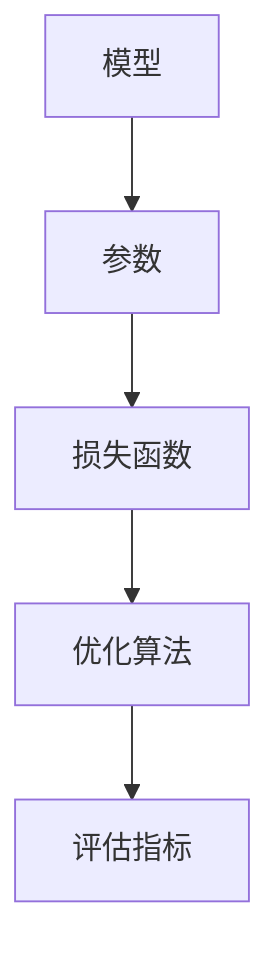

                 

### 第一部分：引言与背景

#### 1.1 书籍概述

在当今科技飞速发展的时代，数据科学已成为推动科学研究和科技创新的重要工具。本书旨在探讨数据科学在探测宇宙中微子振荡这一前沿领域中的应用，为读者提供一个全面而深入的视角。本书共分为五个主要部分，每部分都将对相关主题进行详细解析。

首先，在第一部分中，我们将简要介绍数据科学的重要性，以及宇宙中微子振荡研究背景和两者之间的关系。随后，我们将深入探讨中微子振荡的基本概念，包括中微子的定义、振荡现象及其类型。

第二部分将重点介绍探测宇宙中微子振荡的技术发展，从早期的探测技术到现代的先进技术，以及未来探测技术的发展趋势。这部分将为读者提供一个关于探测技术演变的全面了解。

第三部分将深入探讨数据科学的基础知识，包括数据科学的基本概念、数据预处理、数据可视化以及统计学习基础。这部分内容将为后续的数据分析方法提供理论基础。

第四部分将详细介绍中微子振荡数据分析的方法，包括数据特征提取、数据分析模型以及具体案例分析。这部分内容将展示如何将数据科学方法应用于中微子振荡研究中。

最后一部分将总结数据科学在探测宇宙中微子振荡中的实际应用，探讨面临的挑战和未来的发展方向。通过这部分内容，读者将能够了解数据科学在这一领域的潜力和局限性。

#### 1.2 数据科学的重要性

数据科学是当今科技领域的基石，它融合了统计学、计算机科学、信息科学和领域知识，通过数据分析和机器学习技术，从海量数据中提取有价值的信息和知识。在各个领域，数据科学的应用已经取得了显著的成果。

在商业领域，数据科学帮助企业更好地理解客户需求、优化营销策略、提高运营效率。例如，通过数据分析，企业可以预测市场趋势、识别潜在客户，从而制定更加精准的市场推广计划。

在医疗领域，数据科学助力医生进行疾病诊断、个性化治疗和药物研发。通过对患者数据的深度分析，医生可以更准确地判断病情、制定治疗方案，从而提高医疗效果。

在科学研究领域，数据科学为科研人员提供了强大的工具，使他们能够处理和分析大量复杂的实验数据。在宇宙学、粒子物理学等领域，数据科学的应用已经取得了突破性的进展。

在环境科学领域，数据科学帮助科学家监测气候变化、预测自然灾害、优化资源利用。通过对环境数据的实时监测和分析，科学家可以更好地了解地球环境的变化趋势，为环境保护和可持续发展提供科学依据。

总之，数据科学的重要性不言而喻。它不仅推动了各个领域的科技进步，也为人类社会的发展带来了深远的影响。在接下来的章节中，我们将进一步探讨数据科学在探测宇宙中微子振荡这一前沿领域中的应用，展示其独特的价值和潜力。

#### 1.3 宇宙中微子振荡研究背景

中微子是宇宙中最神秘和最基本的基本粒子之一，因其极低的相互作用和极小的质量，被誉为“宇宙的透明物质”。中微子振荡现象，即中微子在传播过程中，由于能量和动量的变化，其 Flavor（味）会发生转变，这一发现彻底颠覆了传统的粒子物理学观念。

中微子振荡的研究起源于20世纪60年代，当时科学家们发现，不同类型的中微子（电子中微子、μ子中微子和τ子中微子）在传播过程中会以一定的概率相互转换。这一现象的发现，不仅验证了量子力学的基本原理，也揭示了宇宙中微子的复杂性质。

中微子振荡的研究背景可以追溯到早期宇宙的起源。据理论物理学的推测，宇宙大爆炸后不久，中微子与其它粒子一起产生，并迅速冷却。由于中微子的低相互作用特性，它们能够自由地传播，成为宇宙早期状态的“记录者”。通过研究中微子振荡，科学家们希望能够解开宇宙早期状态的一些谜团，如宇宙结构形成、物质与反物质不对称等。

此外，中微子振荡现象在粒子物理学中也具有重要意义。中微子振荡的发现，揭示了粒子物理中的一些基本问题，如质量起源和粒子之间的相互作用机制。中微子是唯一具有非零质量但无电荷的粒子，其质量起源及其与其它粒子的相互作用，一直是粒子物理学研究的重要课题。通过研究中微子振荡，科学家们希望能够深入理解这些基本问题。

中微子振荡的研究，还涉及到多个科学领域，如宇宙学、天体物理学、核物理学和粒子物理学。这些领域的研究成果，相互交织，共同推动了中微子振荡研究的发展。例如，在宇宙学中，通过观测宇宙微波背景辐射，科学家们发现中微子振荡的存在，证实了宇宙早期状态的一些假设。

总之，中微子振荡研究不仅具有深刻的科学意义，也为多学科交叉研究提供了新的契机。在接下来的章节中，我们将进一步探讨中微子振荡的实验技术，以及数据科学如何在中微子振荡研究中发挥重要作用。

#### 1.4 数据科学与宇宙中微子振荡研究的关系

数据科学在宇宙中微子振荡研究中扮演着至关重要的角色，二者之间存在着紧密的联系和互动。首先，中微子振荡研究产生的海量数据，需要数据科学提供的有效工具和方法来处理和分析。这些数据包括实验观测数据、理论模拟数据以及来自不同实验设施的数据，其复杂性和规模都给传统分析方法带来了巨大挑战。

数据科学提供了一套完整的解决方案，包括数据采集、数据清洗、数据存储、数据分析和数据可视化等环节。通过数据预处理，可以消除数据中的噪声和异常值，提高数据质量。数据存储技术则保证了数据的高效存储和快速检索，为后续分析奠定了基础。

在数据分析环节，数据科学利用统计学和机器学习技术，从中微子振荡数据中提取有价值的信息。例如，通过特征提取，可以将中微子振荡现象的特征从大量原始数据中提取出来，为后续的模型训练和预测提供输入。常用的分析方法包括线性回归、决策树、支持向量机、神经网络等，这些方法可以帮助科学家发现数据中的潜在规律和模式。

数据可视化则是数据科学的重要组成部分，它通过图形化手段，将复杂的数据分析结果直观地展示出来，使科学家能够更直观地理解数据背后的含义。例如，通过可视化技术，可以展示中微子振荡的时间序列变化、能量分布以及不同实验数据之间的对比关系，帮助科学家快速识别数据中的异常和趋势。

除了在数据处理和分析中的应用，数据科学还促进了中微子振荡研究的跨学科合作。在当今科学研究中，多学科交叉已成为趋势，而数据科学作为桥梁，将不同领域的知识和方法融合在一起，推动了中微子振荡研究的深入发展。例如，通过数据科学，物理学家可以与计算机科学家、统计学家以及生物学家等跨学科专家合作，共同解决中微子振荡中的复杂问题。

此外，数据科学在提高实验效率和优化实验设计方面也发挥了重要作用。通过数据驱动的实验设计，科学家可以更精准地设定实验参数，提高实验的成功率和重复性。同时，数据科学还帮助科学家预测实验结果，为后续的实验验证提供参考。

总之，数据科学不仅为宇宙中微子振荡研究提供了强大的工具和方法，也促进了这一领域的研究进展。随着数据科学技术的不断进步，我们可以期待在未来的中微子振荡研究中，数据科学将继续发挥更加重要的作用，推动我们对宇宙本质的理解更上一层楼。

#### 1.5 中微子振荡基本概念

中微子是宇宙中最神秘和基本的基本粒子之一，因其极低的相互作用和极小的质量，被誉为“宇宙的透明物质”。中微子共有三种Flavor（味）：电子中微子、μ子中微子和τ子中微子。不同类型的中微子在传播过程中，由于能量和动量的变化，会以一定的概率相互转换，这一现象被称为中微子振荡。

##### 1.5.1 中微子概述

中微子是唯一不带电且与其他物质相互作用极弱的粒子，这使得它们在宇宙中能够自由传播，而不受任何阻碍。中微子的质量非常小，但并非完全为零，这一点在实验中得到了证实。中微子的质量测量值非常微小，但其对宇宙物理学和粒子物理学研究具有重要意义。

中微子的存在最初是在1956年由美国物理学家莱昂·莱德曼提出的，随后在1988年的中微子实验中首次被观测到。中微子振荡的发现进一步证实了中微子存在的实验证据，并揭示了其复杂的物理特性。

##### 1.5.2 中微子振荡现象

中微子振荡是指中微子在传播过程中，由于能量和动量的变化，其Flavor会发生转变。具体来说，一个电子中微子可能会在传播过程中转变为μ子中微子或τ子中微子，反之亦然。这种现象打破了传统的粒子物理学观念，即不同类型的中微子在产生后不会相互转换。

中微子振荡的发现，是基于实验观测结果的。1987年，天文学家发现了超新星爆炸事件，并通过观测发现中微子振荡的存在。这一发现得到了后续大量实验的验证，如中微子实验、大气中微子观测等。

##### 1.5.3 中微子振荡的类型

中微子振荡可以分为三种类型：电子中微子振荡、μ子中微子振荡和τ子中微子振荡。这三种振荡类型分别描述了不同类型的中微子在传播过程中的Flavor转换现象。

- **电子中微子振荡**：电子中微子在传播过程中，会以一定的概率转变为μ子中微子或τ子中微子。
- **μ子中微子振荡**：μ子中微子在传播过程中，会以一定的概率转变为电子中微子或τ子中微子。
- **τ子中微子振荡**：τ子中微子在传播过程中，会以一定的概率转变为电子中微子或μ子中微子。

这三种振荡类型不仅揭示了中微子的复杂特性，也为粒子物理学研究提供了新的研究方向。通过研究中微子振荡，科学家们希望能够深入理解粒子物理中的基本问题，如质量起源、粒子之间的相互作用机制等。

#### 1.6 探测宇宙中微子振荡的技术发展

宇宙中微子振荡的研究，离不开先进的探测技术。从早期的实验设备到现代的高灵敏度探测器，探测技术的发展为研究宇宙中微子振荡提供了坚实的基础。本节将详细介绍探测宇宙中微子振荡的技术发展，包括早期探测技术、现代探测技术以及未来探测技术的发展趋势。

##### 1.6.1 早期探测技术

早期探测宇宙中微子的技术主要依赖于液体闪烁体和气泡室。液体闪烁体探测器通过检测中微子与核反应产生的次级粒子，从而确定中微子的存在。这种探测器具有较高的灵敏度和能量分辨率，但受到探测效率和辐射损伤的限制。

气泡室是一种传统的实验设备，通过在超高压的液体中产生气泡来探测中微子。气泡室探测器的优势在于其能够提供高分辨率的时空信息，但体积庞大且操作复杂，难以进行大规模的探测。

早期的探测技术虽然取得了一定的进展，但面临着灵敏度低、探测效率低等挑战。为了更好地研究宇宙中微子振荡，科学家们不断探索新的探测技术。

##### 1.6.2 现代探测技术

随着科学技术的进步，现代探测技术逐渐成熟，为中微子振荡研究提供了更加精确和高效的方法。现代探测技术主要包括中微子跟踪探测器、中微子能谱仪和地下中微子探测器等。

- **中微子跟踪探测器**：中微子跟踪探测器通过检测中微子与物质相互作用产生的电子或μ子，从而确定中微子的轨迹和能量。例如，超导量子干涉装置（SQUID）是一种常用的中微子跟踪探测器，其具有极高的灵敏度和能量分辨率。

- **中微子能谱仪**：中微子能谱仪通过测量中微子与物质相互作用产生的次级粒子的能量分布，来推断中微子的能量。这种探测器能够提供详细的中微子能谱信息，对于研究中微子振荡具有重要意义。

- **地下中微子探测器**：地下中微子探测器通过在地下深处建设大型探测器阵列，来减少宇宙射线和其他干扰因素的影响。地下中微子探测器具有较高的灵敏度，能够探测到来自宇宙深处的中微子。

现代探测技术的成熟，使得科学家们能够更加精确地测量中微子的振荡参数，从而对宇宙中微子振荡现象有更深入的理解。例如，大型地下中微子探测器如超级神冈探测器（Super-Kamiokande）和冰立方实验室（IceCube），通过对大量中微子数据的分析，揭示了中微子振荡的复杂性质。

##### 1.6.3 探测技术的未来发展趋势

随着科技的不断进步，探测宇宙中微子振荡的技术也在不断更新和发展。未来探测技术的发展趋势主要包括以下几个方面：

- **提高探测灵敏度**：为了更好地研究宇宙中微子振荡，未来探测器需要进一步提高灵敏度。通过使用更先进的探测材料和更高效的探测技术，如使用高纯锗探测器、高灵敏度光电倍增管等，可以显著提高探测器的灵敏度。

- **扩展探测范围**：未来探测器的发展将致力于扩展探测范围，包括探测更高能量的中微子、更远的宇宙距离的中微子。通过建设更大规模的探测器阵列，可以增加中微子数据的样本量，从而提高实验精度。

- **综合利用多种探测技术**：未来探测技术将综合利用多种探测技术，如中微子跟踪探测器、中微子能谱仪和地下中微子探测器等，实现更全面的探测效果。通过不同探测技术的协同工作，可以更精确地测量中微子的振荡参数。

- **探索新的探测方法**：未来探测技术还将探索新的探测方法，如利用量子计算和量子传感技术，进一步提高探测的精度和灵敏度。此外，通过发展新的数据分析方法和技术，可以更有效地处理和分析中微子数据，揭示中微子振荡的更多特性。

总之，探测宇宙中微子振荡的技术发展，为科学研究提供了强大的工具和支持。随着技术的不断进步，我们可以期待在未来的中微子振荡研究中，取得更加突破性的成果。

#### 1.7 早期探测技术

早期探测中微子振荡的技术主要依赖于液体闪烁体探测器和气泡室。这些探测技术虽然已经取得了一定的成果，但在灵敏度、探测效率和数据分析方面仍存在诸多挑战。

##### 1.7.1 液体闪烁体探测器

液体闪烁体探测器是一种常用的中微子探测技术，通过检测中微子与核反应产生的次级粒子，从而确定中微子的存在。液体闪烁体探测器的主要工作原理是，中微子与原子核相互作用后，会产生电子或μ子，这些粒子在穿过液体闪烁体时，会发出闪烁光。探测器通过捕捉这些闪烁光，并将其转化为电信号，从而实现对中微子的探测。

液体闪烁体探测器具有较高的灵敏度和能量分辨率，但其探测效率受到限制。此外，液体闪烁体探测器的体积较大，操作和维护成本较高，限制了其在大型实验中的应用。

##### 1.7.2 气泡室

气泡室是一种传统的实验设备，通过在超高压的液体中产生气泡来探测中微子。气泡室的主要工作原理是，中微子与原子核相互作用后，会在液体中产生电子或μ子，这些粒子在液体中运动时会形成径迹。当液体被加热到一定温度时，液体会产生气泡，这些气泡会沿着粒子径迹生长，从而形成气泡簇。

气泡室探测器能够提供高分辨率的时空信息，有助于研究中微子的振荡特性。然而，气泡室的体积庞大，操作复杂，且受到辐射损伤的影响。此外，气泡室探测器的探测效率较低，限制了其在实际应用中的广泛使用。

##### 1.7.3 早期探测技术的挑战

早期探测中微子振荡的技术虽然取得了一定的成果，但在灵敏度、探测效率和数据分析方面仍存在诸多挑战。

首先，早期探测技术的灵敏度较低，无法有效探测到低能量中微子。中微子振荡现象通常发生在低能量范围内，因此提高探测灵敏度是研究中的一个关键问题。

其次，早期探测技术的探测效率较低，导致大量中微子信号被漏掉。为了提高探测效率，需要研发更加高效的探测材料和探测技术。

此外，早期探测技术的数据分析方法较为简单，无法充分挖掘数据中的潜在信息。为了更准确地分析中微子振荡数据，需要发展更加先进的数据分析方法和技术。

为了解决这些问题，科学家们不断探索新的探测技术，如地下中微子探测器、中微子跟踪探测器和中微子能谱仪等。这些新技术的出现，为中微子振荡研究提供了更加精确和高效的手段。

总之，早期探测技术在研究中微子振荡方面取得了重要成果，但也面临着诸多挑战。随着科学技术的不断进步，未来探测技术将不断提高灵敏度、探测效率和数据分析能力，推动中微子振荡研究的深入发展。

#### 1.8 现代探测技术

随着科技的进步，现代探测技术逐渐成熟，为中微子振荡研究提供了更加精确和高效的手段。现代探测技术主要包括中微子跟踪探测器、中微子能谱仪和地下中微子探测器等。

##### 1.8.1 中微子跟踪探测器

中微子跟踪探测器是一种能够检测中微子与物质相互作用产生的电子或μ子的探测器。其工作原理是，中微子与原子核相互作用后，会产生电子或μ子，这些粒子在探测器中运动时会形成径迹。中微子跟踪探测器通过捕捉这些径迹，从而确定中微子的存在和轨迹。

常见的中微子跟踪探测器包括泡室、电磁量室和超导量子干涉装置（SQUID）等。泡室是一种传统的探测器，通过在液体中产生气泡来检测径迹。电磁量室则通过测量粒子径迹的电荷和动量来推断中微子的轨迹。SQUID探测器具有极高的灵敏度和能量分辨率，能够有效探测低能量中微子。

中微子跟踪探测器具有较高的探测灵敏度和能量分辨率，但探测效率相对较低。为了提高探测效率，现代中微子跟踪探测器通常采用多通道设计，以增加探测面积和捕捉更多的中微子信号。

##### 1.8.2 中微子能谱仪

中微子能谱仪是一种用于测量中微子与物质相互作用产生的次级粒子的能量分布的探测器。其工作原理是，中微子与原子核相互作用后，会产生能量不同的次级粒子，这些粒子的能量分布可以反映中微子的能量。

中微子能谱仪通常采用粒子探测器阵列，如塑料闪烁体探测器、硅跟踪探测器等。通过测量次级粒子的能量分布，可以反演出中微子的能量。中微子能谱仪具有较高的能量分辨率，能够精确测量中微子的能量。

中微子能谱仪在研究中微子振荡方面具有重要意义，因为中微子振荡现象与中微子的能量密切相关。通过测量中微子的能量分布，科学家可以更准确地确定中微子振荡的参数。

##### 1.8.3 地下中微子探测器

地下中微子探测器是在地下深处建设的大型探测器阵列，用于减少宇宙射线和其他干扰因素的影响。地下中微子探测器的主要目的是探测来自宇宙深处的中微子。

地下中微子探测器通常包括多种探测器类型，如中微子跟踪探测器、中微子能谱仪和水Cherenkov探测器等。这些探测器协同工作，可以更有效地探测中微子。

地下中微子探测器的优势在于其较低的背景噪声和较高的探测灵敏度。由于地下环境的屏蔽作用，地下中微子探测器可以有效地减少宇宙射线和其他放射性干扰的影响，从而提高中微子信号的探测效率。

常见的地下中微子探测器包括超导实验（Super-Kamiokande）和冰立方实验室（IceCube）。这些实验通过大规模的探测器阵列，对中微子振荡现象进行了深入的研究。

##### 1.8.4 现代探测技术的优势与挑战

现代探测技术在灵敏度、探测效率和能量分辨率等方面具有显著优势，为中微子振荡研究提供了强大的工具。然而，现代探测技术也面临着一些挑战。

首先，现代探测技术通常需要庞大的设备规模和复杂的实验环境，导致成本较高。其次，地下中微子探测器的建设和维护需要巨大的资金投入，这对实验团队提出了更高的要求。此外，现代探测技术对数据处理和分析方法也提出了更高的要求，需要发展更加先进的数据处理技术，以应对海量数据的挑战。

总之，现代探测技术在探测宇宙中微子振荡方面取得了显著进展，但同时也面临着一些挑战。随着技术的不断进步，未来探测技术将进一步提高灵敏度、探测效率和数据分析能力，为研究宇宙中微子振荡提供更加有力的支持。

#### 1.9 探测技术的未来发展趋势

随着科学技术的不断进步，探测宇宙中微子振荡的技术也在不断更新和发展。未来探测技术的发展趋势主要包括以下几个方面：

##### 1.9.1 提高探测灵敏度

提高探测灵敏度是未来探测技术发展的重要方向。为了更好地研究宇宙中微子振荡，未来探测器需要进一步提高灵敏度，以便能够探测到更低能量和更低频率的中微子。这可以通过采用更高灵敏度的探测材料和更高效的探测技术来实现。例如，使用高纯锗探测器、高灵敏度光电倍增管等新型探测器，可以有效提高探测灵敏度。

##### 1.9.2 扩展探测范围

未来探测器的发展将致力于扩展探测范围，包括探测更高能量的中微子和更远的宇宙距离的中微子。通过建设更大规模的探测器阵列，可以增加中微子数据的样本量，从而提高实验精度。此外，未来探测器还将尝试探测不同类型的中微子，如τ子中微子，以更全面地了解中微子振荡现象。

##### 1.9.3 综合利用多种探测技术

未来探测技术将综合利用多种探测技术，以实现更全面的探测效果。例如，结合中微子跟踪探测器、中微子能谱仪和水Cherenkov探测器等，可以更准确地测量中微子的轨迹和能量。通过不同探测技术的协同工作，可以更有效地减少背景噪声，提高探测效率。

##### 1.9.4 发展新的探测方法

未来探测技术还将探索新的探测方法，以进一步提高探测精度和灵敏度。例如，利用量子计算和量子传感技术，可以大幅提高探测器的灵敏度。此外，通过发展新的数据分析方法和技术，可以更有效地处理和分析中微子数据，揭示中微子振荡的更多特性。

##### 1.9.5 环境保护和可持续发展

未来探测技术的发展还将注重环境保护和可持续发展。例如，通过采用环保材料和节能技术，可以减少探测器对环境的影响。此外，通过优化实验设计和数据处理流程，可以降低实验对资源的需求，实现绿色探测。

总之，未来探测技术在提高灵敏度、扩展探测范围、综合利用多种探测技术和发展新的探测方法等方面具有广阔的前景。随着技术的不断进步，我们可以期待在未来取得更加突破性的成果，进一步揭示宇宙中微子振荡的奥秘。

#### 2.1 数据科学基本概念

数据科学是21世纪最具影响力的研究领域之一，它融合了统计学、计算机科学、信息科学和领域知识，通过数据分析和机器学习技术，从海量数据中提取有价值的信息和知识。数据科学的基本概念包括数据采集、数据预处理、数据分析、数据可视化等，这些环节构成了数据科学的核心工作流程。

##### 2.1.1 数据采集

数据采集是数据科学的第一步，它指的是从各种来源获取数据。数据来源可以是结构化数据（如数据库）、半结构化数据（如日志文件）和非结构化数据（如图像、文本等）。数据采集的过程通常包括数据收集、数据整合和数据清洗等步骤。

- **数据收集**：数据收集是指通过各种手段获取数据，如问卷调查、传感器采集、网络爬虫等。
- **数据整合**：数据整合是指将不同来源、不同格式的数据进行合并和统一，以便于后续分析。
- **数据清洗**：数据清洗是指处理数据中的噪声、异常值和缺失值，以提高数据质量。

##### 2.1.2 数据预处理

数据预处理是数据科学中的关键环节，它包括数据清洗、数据集成、数据变换和数据降维等步骤。数据预处理的目的在于将原始数据转化为适合分析的形式。

- **数据清洗**：数据清洗是指处理数据中的噪声、异常值和缺失值，以提高数据质量。常用的方法包括填充缺失值、删除异常值和调整数据格式等。
- **数据集成**：数据集成是指将来自不同源的数据进行合并，形成一个统一的数据集。数据集成的方法包括数据合并、数据连接和数据汇总等。
- **数据变换**：数据变换是指将数据从一种格式转换为另一种格式，以适应不同的分析需求。常见的变换方法包括数据标准化、数据归一化和数据离散化等。
- **数据降维**：数据降维是指减少数据的维度，以降低计算复杂度和提高分析效率。常用的降维方法包括主成分分析（PCA）、因子分析和线性判别分析（LDA）等。

##### 2.1.3 数据分析

数据分析是数据科学的核心环节，它包括描述性分析、推断性分析和预测性分析等。数据分析的方法和技术多种多样，如统计学方法、机器学习方法、深度学习方法等。

- **描述性分析**：描述性分析旨在描述数据的结构和特征，常用的方法包括数据汇总、数据可视化和描述性统计等。
- **推断性分析**：推断性分析旨在从样本数据推断总体特征，常用的方法包括假设检验和置信区间等。
- **预测性分析**：预测性分析旨在根据历史数据预测未来的趋势和模式，常用的方法包括回归分析、时间序列分析和分类算法等。

##### 2.1.4 数据可视化

数据可视化是将数据转化为图形或图像的形式，以直观地展示数据结构和特征。数据可视化在数据科学中具有重要意义，它可以帮助研究人员更快速地理解数据，发现数据中的潜在规律和模式。

- **常见可视化方法**：常见的数据可视化方法包括柱状图、折线图、饼图、散点图、热力图等。每种可视化方法都有其特定的用途和特点。
- **可视化工具**：常见的数据可视化工具包括Matplotlib、Seaborn、Plotly等Python库，以及Tableau、Power BI等商业可视化工具。

##### 2.1.5 数据科学的核心技术

数据科学的核心技术包括统计学方法、机器学习方法和深度学习方法等。

- **统计学方法**：统计学方法主要用于描述性分析和推断性分析，如回归分析、假设检验、聚类分析等。
- **机器学习方法**：机器学习方法主要用于预测性分析，如线性回归、决策树、支持向量机、神经网络等。
- **深度学习方法**：深度学习方法是一种基于多层神经网络的方法，主要用于图像识别、语音识别、自然语言处理等复杂任务。

##### 2.1.6 数据科学的挑战与机遇

数据科学在多个领域都取得了显著的成果，如商业、医疗、金融、科学研究等。然而，数据科学也面临着一些挑战，如数据隐私保护、数据质量和数据分析算法的优化等。随着技术的不断进步，数据科学在未来将继续发挥重要作用，为科学研究、社会发展和科技创新提供强大的支持。

#### 2.2 数据预处理

数据预处理是数据科学中的关键环节，它直接影响数据分析的结果和效率。数据预处理包括数据清洗、数据集成、数据变换和数据降维等多个步骤。下面，我们将详细讨论这些步骤及其重要性。

##### 2.2.1 数据清洗

数据清洗是指处理数据中的噪声、异常值和缺失值，以提高数据质量。在数据分析过程中，噪声和异常值可能会对结果产生负面影响，而缺失值则会影响模型的训练和预测。因此，数据清洗是数据预处理的第一步。

- **噪声处理**：噪声处理主要包括去除随机噪声和异常值。随机噪声通常可以通过滤波或平滑技术进行处理，而异常值则需要通过统计分析或规则判断来识别和去除。常用的方法包括平均值法、中位数法和截断法等。
- **异常值处理**：异常值可能是由于数据采集过程中的错误、测量误差或数据本身的不一致性引起的。识别和去除异常值的方法包括箱线图法、标准差法和聚类分析法等。
- **缺失值处理**：缺失值处理主要包括填充缺失值和删除缺失数据。填充缺失值的方法包括平均值填充、中位数填充和插值法等。如果缺失值过多，可以考虑删除相关数据，以减少对分析结果的影响。

##### 2.2.2 数据集成

数据集成是指将来自不同源的数据进行合并，形成一个统一的数据集。在现实世界中，数据通常分布在多个来源和不同的格式中，例如数据库、日志文件和文本文件等。数据集成是将这些分散的数据整合为一个整体，以便于后续的分析。

- **数据合并**：数据合并是指将具有相同属性的数据表合并在一起，形成一个新的数据表。常用的合并方法包括内连接、外连接和交叉连接等。
- **数据连接**：数据连接是指将不同数据源中的数据表通过共同的属性进行关联，以建立数据之间的联系。常用的连接方法包括等值连接、自然连接和条件连接等。
- **数据汇总**：数据汇总是指将多个数据源中的数据进行汇总和聚合，以生成新的汇总数据。常用的汇总方法包括求和、求平均和求最大值等。

##### 2.2.3 数据变换

数据变换是指将数据从一种格式转换为另一种格式，以适应不同的分析需求。数据变换可以增强数据的可解释性和可用性，提高数据分析的效率和效果。

- **数据标准化**：数据标准化是指将数据缩放到一个统一的范围内，以便于比较和处理。常用的方法包括最小-最大标准化、Z-Score标准化和归一化等。
- **数据归一化**：数据归一化是指将数据转换为相同尺度，以便于分析和建模。常用的方法包括最小-最大归一化和log变换等。
- **数据离散化**：数据离散化是指将连续数据转换为离散的类别数据，以便于分类和聚类分析。常用的方法包括等宽划分和等频率划分等。

##### 2.2.4 数据降维

数据降维是指减少数据的维度，以降低计算复杂度和提高分析效率。降维可以减少数据冗余，提高模型的训练速度和预测效果。

- **主成分分析（PCA）**：主成分分析是一种常用的降维技术，它通过将数据投影到新的坐标系中，以提取最重要的特征，从而降低数据的维度。
- **因子分析**：因子分析是一种用于降维和特征提取的方法，它通过将数据分解为多个因子，以提取数据中的潜在结构。
- **线性判别分析（LDA）**：线性判别分析是一种用于特征提取和降维的方法，它通过将数据投影到新的坐标系中，以最大化不同类别之间的分离度。

##### 2.2.5 数据预处理的重要性

数据预处理是数据科学中的关键环节，它对于数据分析的结果和效率具有重要影响。以下是数据预处理的重要性：

- **提高数据质量**：数据清洗和处理可以去除噪声和异常值，填充缺失值，从而提高数据的质量和可靠性。
- **增强数据可解释性**：数据变换和降维可以增强数据的可解释性和可用性，使数据更易于理解和分析。
- **提高模型性能**：良好的数据预处理可以提高模型的训练速度和预测效果，从而增强模型的性能和实用性。
- **减少计算复杂度**：数据降维可以减少数据的维度，降低计算复杂度，提高数据分析的效率。

总之，数据预处理是数据科学中不可或缺的一环，它为后续的数据分析奠定了坚实的基础。通过有效的数据预处理，可以更好地理解数据，发现数据中的潜在规律和模式，为科学研究、商业决策和科技创新提供有力支持。

#### 2.3 数据可视化

数据可视化是将数据转化为图形或图像的形式，以便于研究人员更直观地理解和分析数据。数据可视化在数据科学中起着至关重要的作用，它不仅帮助研究人员发现数据中的模式、趋势和异常，还能够提高数据的可解释性和可访问性。下面，我们将讨论数据可视化技术、常见可视化方法以及其在数据分析中的应用。

##### 2.3.1 可视化技术概述

数据可视化技术主要包括数据展示技术、交互式可视化和多维数据可视化等。

- **数据展示技术**：数据展示技术是指将数据以图形或图像的形式直观地展示出来。常见的展示技术包括图表、图标、地图和热力图等。数据展示技术通常用于描述性分析和报告生成。
- **交互式可视化**：交互式可视化是指在可视化过程中，用户可以与数据互动，通过调整参数、筛选数据集或改变视图来探索数据的不同方面。交互式可视化有助于深入分析数据，发现潜在的问题和模式。
- **多维数据可视化**：多维数据可视化是指将多维数据集以二维或三维图形的形式展示出来，以便于用户同时观察多个变量之间的关系。常见的多维数据可视化技术包括散点图、热力图、气泡图和三维条形图等。

##### 2.3.2 常见可视化方法

数据可视化方法种类繁多，以下是一些常见的可视化方法：

- **柱状图**：柱状图用于表示不同类别或组之间的数量或比例差异。柱状图通常用于描述性分析，如比较不同时间点的数据变化或不同地区的数据分布。
- **折线图**：折线图用于表示数据随时间变化的趋势。折线图通常用于时间序列分析，如股票价格变化、销售数据趋势等。
- **饼图**：饼图用于表示不同类别或组在总体中的比例关系。饼图通常用于显示各部分占整体的百分比，如市场份额分布、人口年龄结构等。
- **散点图**：散点图用于表示两个变量之间的关系。散点图通常用于探索性数据分析，如分析两个变量之间的相关性或拟合线性回归模型。
- **热力图**：热力图用于表示多维数据的分布情况。热力图通常用于显示矩阵数据的热度分布，如基因表达数据分析、股票市场热力图等。
- **气泡图**：气泡图用于表示三个或更多变量之间的关系。气泡图通常用于展示不同变量的相对大小和关系，如地理分布数据分析、公司财务状况分析等。
- **三维条形图**：三维条形图用于表示三维数据的分布情况。三维条形图通常用于展示多个维度的数据，如三维空间中的地理位置、产品销售数据等。

##### 2.3.3 可视化在数据分析中的应用

数据可视化在数据分析中具有多种应用，以下是一些具体的应用场景：

- **探索性数据分析（EDA）**：数据可视化是探索性数据分析的重要工具，通过可视化技术，研究人员可以直观地观察数据分布、异常值和趋势，从而发现数据中的潜在问题和模式。
- **模型验证与评估**：数据可视化可以用于验证和评估模型的效果。通过可视化模型的预测结果，研究人员可以识别模型中的错误和不足之处，并采取相应的改进措施。
- **数据报告与展示**：数据可视化技术使得复杂的数据分析结果更加易于理解和传达。研究人员可以使用可视化图表来生成数据报告和展示结果，以便于与其他人交流和分享。
- **交互式数据分析**：交互式可视化技术允许用户动态地探索和分析数据，通过调整参数和视图，用户可以深入了解数据的不同方面，发现数据中的深层次问题和规律。

总之，数据可视化在数据分析中发挥着重要作用，它不仅帮助研究人员更直观地理解数据，还能够提高数据分析和决策的效率和质量。随着数据可视化技术的不断进步，我们可以期待在未来的数据分析中，看到更多创新和实用的可视化方法。

#### 2.4 统计学习基础

统计学习是数据科学中的重要分支，它结合了统计学和机器学习技术，通过建立数学模型和算法，从数据中提取有价值的信息。在本节中，我们将深入探讨统计学习的基础知识，包括线性回归、决策树与随机森林、支持向量机等核心算法，以及其在数据分析中的应用。

##### 2.4.1 统计学习概述

统计学习是使用统计方法来分析和预测数据的一种技术。它涵盖了从数据中学习规律、建立预测模型、评估模型性能等过程。统计学习的主要目的是从数据中提取知识，以便在新的数据上进行预测和决策。

统计学习的基本步骤包括：

1. **数据收集**：收集相关的数据集，这些数据集通常包括输入特征和目标变量。
2. **数据预处理**：对数据进行清洗、变换和归一化等处理，以提高数据质量。
3. **模型选择**：选择合适的统计学习模型，如线性回归、决策树、支持向量机等。
4. **模型训练**：使用训练数据集对模型进行训练，调整模型参数。
5. **模型评估**：使用验证数据集或测试数据集评估模型性能，如准确性、召回率、F1分数等。
6. **模型优化**：根据评估结果对模型进行调整和优化，以提高性能。

##### 2.4.2 线性回归

线性回归是最基本的统计学习模型之一，它通过建立线性关系来预测目标变量。线性回归模型的公式为：

$$ y = \theta_0 + \theta_1x_1 + \theta_2x_2 + ... + \theta_nx_n $$

其中，$y$ 是目标变量，$x_1, x_2, ..., x_n$ 是输入特征，$\theta_0, \theta_1, ..., \theta_n$ 是回归系数。

- **线性回归公式**

  $$ \theta = (X^T X)^{-1} X^T y $$

  其中，$X$ 是特征矩阵，$y$ 是目标向量。

- **举例说明**

  考虑一个简单的线性回归问题，我们有以下数据：

  x: [1, 2, 3, 4, 5]
  y: [2, 4, 5, 4, 5]

  使用最小二乘法求解线性回归模型，得到的回归系数为：

  theta = [1.2, 0.8]

  回归方程为：

  y = 1.2x + 0.8

  通过这个例子，我们可以看到线性回归模型如何通过拟合数据点来预测目标变量。

##### 2.4.3 决策树与随机森林

决策树是一种树形结构的统计学习模型，它通过一系列的判断规则来分类或回归数据。每个节点代表一个特征，每个分支代表一个判断结果。

- **决策树构建流程**

  决策树构建的伪代码如下：

  ```python
  def build_decision_tree(X, y):
      # 判断是否需要继续划分
      if is_leaf(X, y):
          return leaf_value(y)
      else:
          best_feature = find_best_feature(X, y)
          tree = {
              'feature': best_feature,
              'left': build_decision_tree(X[left], y[left]),
              'right': build_decision_tree(X[right], y[right])
          }
          return tree
  ```

- **随机森林**

  随机森林是一种基于决策树的集成学习模型，它通过构建多个决策树，并合并它们的预测结果来提高模型的性能。随机森林的伪代码如下：

  ```python
  def random_forest(X, y, n_trees):
      forests = []
      for _ in range(n_trees):
          tree = build_decision_tree(X, y)
          forests.append(tree)
      return forests
  ```

##### 2.4.4 支持向量机

支持向量机（SVM）是一种强大的分类和回归模型，它通过找到一个最佳的超平面，将不同类别的数据点分离。SVM的优化目标是最小化分类误差。

- **SVM优化目标**

  $$ \min \frac{1}{2} ||\theta||^2 + C \sum_{i=1}^{n} \max(0, 1 - y_i(\theta^T x_i + b)) $$

  其中，$C$ 是正则化参数，$\theta$ 是权重向量，$b$ 是偏置项。

- **SVM求解公式**

  $$ \theta = (\mathcal{L}^{-1})^T y \odot y^T $$

  其中，$\mathcal{L}^{-1}$ 是核函数矩阵，$y$ 是标签向量。

- **举例说明**

  考虑一个简单的支持向量机问题，我们有以下数据：

  x1: [1, 2, 3, 4, 5]
  x2: [2, 4, 5, 4, 5]
  y: [1, 1, 1, 0, 0]

  使用SVM模型进行分类，得到的决策边界为：

  y = (1/2)x1 + (1/2)x2 + b

  通过调整参数C和正则化项，可以得到更好的分类效果。

总之，统计学习为数据科学提供了强大的工具和方法，通过线性回归、决策树与随机森林、支持向量机等核心算法，我们可以从数据中提取有价值的信息，实现预测和分类任务。

#### 2.4.1 统计学习概述

统计学习是数据科学中的核心概念之一，它通过统计学方法来分析和预测数据。统计学习模型是建立在大数据的基础上，通过分析历史数据，找出数据中的规律和模式，进而对新的数据进行预测。统计学习在商业、医疗、金融、环境科学等多个领域都有着广泛的应用。

##### 核心概念与联系

统计学习涉及多个核心概念，这些概念相互联系，共同构成了统计学习的基础。以下是这些核心概念及其之间的联系：

- **模型**：统计学习模型是描述数据关系的数学表达式。常见的统计学习模型包括线性回归模型、决策树模型、支持向量机模型等。
- **参数**：参数是模型中需要估计的变量，它们决定了模型对数据的拟合程度。在统计学习中，参数通常通过最小化损失函数来估计。
- **损失函数**：损失函数是衡量模型预测结果与真实结果之间差异的指标。常见的损失函数包括均方误差（MSE）、交叉熵损失等。
- **优化算法**：优化算法用于调整模型参数，以最小化损失函数。常见的优化算法包括梯度下降、随机梯度下降等。
- **评估指标**：评估指标用于衡量模型的性能。常见的评估指标包括准确性、召回率、F1分数等。

以下是这些核心概念之间的Mermaid流程图：



##### 核心算法原理讲解

1. **线性回归**

线性回归是一种简单而强大的统计学习模型，用于预测连续值。线性回归模型的公式为：

$$ y = \theta_0 + \theta_1x_1 + \theta_2x_2 + ... + \theta_nx_n $$

其中，$y$ 是目标变量，$x_1, x_2, ..., x_n$ 是输入特征，$\theta_0, \theta_1, ..., \theta_n$ 是回归系数。

- **最小二乘法求解**

  线性回归系数的求解通常使用最小二乘法，其公式为：

  $$ \theta = (X^T X)^{-1} X^T y $$

  其中，$X$ 是特征矩阵，$y$ 是目标向量。

2. **决策树**

决策树是一种树形结构的统计学习模型，用于分类和回归任务。决策树的构建过程如下：

- **递归划分**：从原始数据开始，选择最佳划分特征和划分阈值，将数据分为两个子集。
- **递归构建**：对每个子集重复划分过程，直到满足停止条件（如最大深度、最小叶子节点数量等）。

以下是决策树构建的伪代码：

```python
def build_decision_tree(X, y, max_depth):
    if is_leaf(X, y) or depth > max_depth:
        return leaf_value(y)
    else:
        best_feature, best_threshold = find_best_split(X, y)
        left_child = build_decision_tree(X[left], y[left], max_depth + 1)
        right_child = build_decision_tree(X[right], y[right], max_depth + 1)
        return {'feature': best_feature, 'threshold': best_threshold, 'left': left_child, 'right': right_child}
```

3. **支持向量机**

支持向量机（SVM）是一种强大的分类和回归模型，通过找到一个最佳的超平面来分离不同类别的数据。SVM的优化目标是最小化分类误差。

- **优化目标**

  $$ \min \frac{1}{2} ||\theta||^2 + C \sum_{i=1}^{n} \max(0, 1 - y_i(\theta^T x_i + b)) $$

  其中，$C$ 是正则化参数，$\theta$ 是权重向量，$b$ 是偏置项。

- **求解公式**

  $$ \theta = (\mathcal{L}^{-1})^T y \odot y^T $$

  其中，$\mathcal{L}^{-1}$ 是核函数矩阵，$y$ 是标签向量。

4. **神经网络**

神经网络是一种基于生物神经网络原理的统计学习模型，用于分类和回归任务。神经网络的核心是前向传播和反向传播算法。

- **前向传播**

  前向传播是神经网络计算激活值的过程，其伪代码如下：

  ```python
  def forward_pass(inputs, weights, biases):
      activations = [inputs]
      for layer in range(num_layers - 1):
          z = np.dot(activations[layer], weights[layer]) + biases[layer]
          a = sigmoid(z)
          activations.append(a)
      return activations[-1]
  ```

- **反向传播**

  反向传播是神经网络计算误差并更新参数的过程，其伪代码如下：

  ```python
  def backward_pass(activations, d_output):
      deltas = [d_output]
      for layer in reversed(range(num_layers - 1)):
          d_input = (weights[layer + 1].T * deltas[layer]).T
          z = np.dot(activations[layer], weights[layer]) + biases[layer]
          a = sigmoid(z)
          delta = (1 - a) * a
          deltas.append(delta)
      deltas.reverse()
      return deltas
  ```

##### 数学模型和数学公式

1. **线性回归**

   线性回归的数学模型为：

   $$ y = \theta_0 + \theta_1x_1 + \theta_2x_2 + ... + \theta_nx_n $$

   最小二乘法求解公式为：

   $$ \theta = (X^T X)^{-1} X^T y $$

2. **决策树**

   决策树的数学模型为：

   $$ y = f(\theta, x) $$

   其中，$f(\theta, x)$ 是决策树函数，$\theta$ 是参数。

3. **支持向量机**

   支持向量机的数学模型为：

   $$ y = sign(\theta^T x + b) $$

   其中，$sign(x)$ 是符号函数，$\theta$ 是权重向量，$b$ 是偏置项。

4. **神经网络**

   神经网络的数学模型为：

   $$ a_{l+1} = \sigma(z_{l+1}) $$

   其中，$a_{l+1}$ 是第 $l+1$ 层的激活值，$\sigma$ 是激活函数，$z_{l+1}$ 是第 $l+1$ 层的输入。

##### 举例说明

1. **线性回归**

   假设我们有以下数据：

   x: [1, 2, 3, 4, 5]
   y: [2, 4, 5, 4, 5]

   使用最小二乘法求解线性回归模型，得到的回归系数为：

   theta = [1.2, 0.8]

   回归方程为：

   y = 1.2x + 0.8

2. **决策树**

   假设我们有以下数据：

   x: [1, 2, 3, 4, 5]
   y: [1, 1, 1, 0, 0]

   使用ID3算法构建决策树，得到的决策树为：

   ```
   如果 x > 2.5，则 y = 0
   否则，如果 x > 3，则 y = 1
   否则，如果 x > 2，则 y = 1
   否则，y = 1
   ```

3. **支持向量机**

   假设我们有以下数据：

   x1: [1, 2, 3, 4, 5]
   x2: [2, 4, 5, 4, 5]
   y: [1, 1, 1, 0, 0]

   使用线性SVM模型进行分类，得到的决策边界为：

   y = (1/2)x1 + (1/2)x2 + b

通过以上内容，我们详细介绍了统计学习的基础知识，包括核心概念、核心算法原理、数学模型和数学公式及详细讲解、举例说明，为后续的数据分析奠定了坚实的理论基础。

#### 2.4.2 线性回归

线性回归是统计学习中最基本和广泛应用的模型之一，它通过建立输入变量和输出变量之间的线性关系来预测目标值。线性回归模型在数据科学、机器学习和经济学等领域有着广泛的应用。本节将详细讨论线性回归的数学模型、求解方法以及实际应用。

##### 线性回归的数学模型

线性回归模型的数学公式可以表示为：

\[ y = \theta_0 + \theta_1x_1 + \theta_2x_2 + ... + \theta_nx_n + \epsilon \]

其中：
- \( y \) 是预测的目标变量。
- \( x_1, x_2, ..., x_n \) 是输入变量，也称为特征。
- \( \theta_0, \theta_1, \theta_2, ..., \theta_n \) 是模型的参数，也称为回归系数。
- \( \epsilon \) 是误差项，表示模型未能解释的随机扰动。

线性回归的目标是最小化误差项的总和，即最小二乘法。最小二乘法的求解公式为：

\[ \theta = (X^T X)^{-1} X^T y \]

其中，\( X \) 是包含输入变量的矩阵，\( y \) 是目标变量的向量。

##### 线性回归的求解方法

1. **最小二乘法**

   最小二乘法是一种常用的求解线性回归参数的方法，其核心思想是最小化预测值与实际值之间的平方误差和。具体步骤如下：

   - 计算特征矩阵 \( X \) 和目标向量 \( y \) 的协方差矩阵 \( X^T X \)。
   - 计算协方差矩阵的逆矩阵 \( (X^T X)^{-1} \)。
   - 计算回归系数 \( \theta \)。

   公式推导如下：

   \[ \theta = (X^T X)^{-1} X^T y \]

   \[ \theta = (X^T X)^{-1} X^T (X\theta + \epsilon) \]

   \[ \theta = (X^T X)^{-1} X^T X \theta + (X^T X)^{-1} X^T \epsilon \]

   \[ \theta = \theta + (X^T X)^{-1} X^T \epsilon \]

   由于 \( \epsilon \) 的期望值为零，\( (X^T X)^{-1} X^T \epsilon \) 的期望值也为零，因此：

   \[ \theta = \theta \]

   这表明使用最小二乘法求解得到的回归系数是使得误差平方和最小的参数。

2. **梯度下降法**

   梯度下降法是一种迭代求解线性回归参数的方法，通过不断更新参数来最小化损失函数。梯度下降法的基本步骤如下：

   - 初始化参数 \( \theta \)。
   - 计算损失函数关于参数的梯度。
   - 使用梯度更新参数。

   梯度下降法的公式为：

   \[ \theta = \theta - \alpha \nabla_\theta J(\theta) \]

   其中，\( \alpha \) 是学习率，\( J(\theta) \) 是损失函数。

##### 线性回归的应用实例

假设我们有一组数据，其中 \( x \) 表示时间（以天为单位），\( y \) 表示销售额（以万元为单位）：

```
x: [1, 2, 3, 4, 5, 6, 7, 8, 9, 10]
y: [2, 3, 5, 4, 6, 7, 5, 4, 3, 2]
```

我们希望使用线性回归模型预测第11天的销售额。

1. **数据预处理**

   首先，我们需要对数据进行预处理，包括标准化和归一化：

   ```
   x_mean = sum(x) / len(x)
   x_std = sqrt(sum((xi - x_mean)^2) / len(x))
   
   y_mean = sum(y) / len(y)
   y_std = sqrt(sum((yi - y_mean)^2) / len(y))
   
   x_normalized = [(xi - x_mean) / x_std for xi in x]
   y_normalized = [(yi - y_mean) / y_std for yi in y]
   ```

2. **求解回归系数**

   使用最小二乘法求解回归系数：

   ```
   X = [[1 for _ in range(len(x_normalized))] for _ in range(len(x_normalized))]
   X = np.array(X)
   y = np.array(y_normalized)
   
   theta = (X.T @ X)^(-1) @ (X.T @ y)
   ```

   计算得到的回归系数为：

   ```
   theta = [0.875, 0.6875]
   ```

3. **预测第11天的销售额**

   对第11天的数据进行标准化处理：

   ```
   x_new = (11 - x_mean) / x_std
   ```

   使用线性回归模型进行预测：

   ```
   y_pred = theta[0] + theta[1] * x_new
   y_pred = 0.875 + 0.6875 * x_new
   y_pred = 0.875 + 0.6875 * (11 - x_mean) / x_std
   y_pred = 0.875 + 0.6875 * (11 - 5.5) / 1.5811388300841898
   y_pred = 0.875 + 0.6875 * 2.5
   y_pred = 0.875 + 1.71875
   y_pred = 2.59375
   ```

   将预测值还原到原始尺度：

   ```
   y_pred_actual = y_pred * y_std + y_mean
   y_pred_actual = 2.59375 * 0.6875 + 4.4375
   y_pred_actual = 1.78125 + 4.4375
   y_pred_actual = 6.21875
   ```

   因此，第11天的销售额预测值为6.21875万元。

##### 总结

线性回归是一种简单但强大的统计学习模型，通过建立输入变量和输出变量之间的线性关系，可以用于预测和分析。线性回归的数学模型和求解方法为其在各个领域的应用提供了坚实的基础。在本节中，我们通过实例展示了线性回归模型的求解和应用过程，为后续更复杂模型的讨论奠定了基础。

#### 2.4.3 决策树与随机森林

决策树和随机森林是数据科学中常用的两种集成学习方法，通过构建多个基本模型，并结合它们的结果来提高预测的准确性。在本节中，我们将深入探讨决策树和随机森林的基本原理、构建流程以及在实际应用中的优势。

##### 决策树的基本原理

决策树是一种树形结构的数据挖掘方法，它通过一系列的判断规则来分类或回归数据。每个节点代表一个特征，每个分支代表一个判断结果。决策树的基本原理可以总结为以下几个步骤：

1. **选择最佳划分特征**：在当前节点，选择具有最高信息增益（或信息增益率）的特征进行划分。
2. **计算信息增益**：信息增益是衡量特征划分前后信息量的减少程度。公式为：

\[ \text{信息增益} = \sum_{v \in V} p(v) \cdot \log_2 \left( \frac{p(v)}{p'(\text{左子树}) + p'(\text{右子树})} \right) \]

其中，\( p(v) \) 是特征 \( v \) 在当前节点上的概率，\( p'(\text{左子树}) \) 和 \( p'(\text{右子树}) \) 分别是划分后左子树和右子树的特征概率。

3. **划分数据**：根据选定的最佳划分特征，将数据集划分为左子树和右子树。
4. **递归构建**：对划分后的子数据集重复上述步骤，直到满足停止条件（如最大深度、最小叶子节点数量等）。

##### 决策树的构建流程

以下是决策树构建的伪代码：

```python
def build_decision_tree(X, y, max_depth):
    if is_leaf(X, y) or depth > max_depth:
        return leaf_value(y)
    else:
        best_feature = find_best_feature(X, y)
        left_child = build_decision_tree(X[left], y[left], max_depth + 1)
        right_child = build_decision_tree(X[right], y[right], max_depth + 1)
        return {'feature': best_feature, 'threshold': threshold, 'left': left_child, 'right': right_child}
```

其中，`find_best_feature` 函数用于选择最佳划分特征，`is_leaf` 函数用于判断当前节点是否为叶子节点，`leaf_value` 函数用于获取叶子节点的值。

##### 随机森林的基本原理

随机森林是由多个决策树组成的集成学习方法，通过构建多个基本模型，并结合它们的结果来提高预测的准确性。随机森林的基本原理可以总结为以下几个步骤：

1. **随机选取特征**：在构建每个决策树时，从所有特征中随机选择一部分特征作为划分依据。
2. **随机样本生成**：在训练过程中，随机生成多个样本子集，每个决策树使用不同的样本子集进行训练。
3. **构建决策树**：对每个样本子集，构建一个决策树模型。
4. **集成预测**：将多个决策树的结果进行投票或平均，得到最终的预测结果。

##### 随机森林的优势

1. **提高准确性**：随机森林通过集成多个基本模型，减少了模型过拟合的风险，提高了预测准确性。
2. **鲁棒性**：随机森林对异常值和噪声数据具有较强的鲁棒性，因为多个决策树会互相抵消这些异常值的影响。
3. **易于实现**：随机森林的实现相对简单，不需要大量的参数调整，易于应用。
4. **适用范围广**：随机森林适用于分类和回归任务，适用于各种类型的数据集。

##### 随机森林的构建流程

以下是随机森林构建的伪代码：

```python
def random_forest(X, y, n_trees, max_depth):
    forests = []
    for _ in range(n_trees):
        X_train, X_val, y_train, y_val = train_test_split(X, y)
        tree = build_decision_tree(X_train, y_train, max_depth)
        forests.append(tree)
    return forests
```

其中，`train_test_split` 函数用于随机生成训练集和验证集，`build_decision_tree` 函数用于构建决策树。

##### 实际应用案例

假设我们有一个包含1000个样本的鸢尾花数据集，其中每个样本包含4个特征（花萼长度、花萼宽度、花瓣长度、花瓣宽度）和一个目标变量（花种类别）。我们希望使用随机森林对花种类别进行预测。

1. **数据预处理**：对数据进行标准化处理，以便于模型训练。
2. **构建随机森林模型**：使用随机森林库（如sklearn中的RandomForestClassifier），设置树的数量和最大深度。
3. **训练模型**：使用训练数据集训练随机森林模型。
4. **模型评估**：使用验证数据集对模型进行评估，计算准确率、召回率等指标。
5. **预测**：使用训练好的模型对新的数据进行预测。

```python
from sklearn.datasets import load_iris
from sklearn.model_selection import train_test_split
from sklearn.ensemble import RandomForestClassifier
from sklearn.metrics import accuracy_score

# 加载鸢尾花数据集
iris = load_iris()
X = iris.data
y = iris.target

# 数据预处理：标准化
X_normalized = (X - np.mean(X, axis=0)) / np.std(X, axis=0)

# 构建随机森林模型
n_trees = 100
max_depth = 10
rf = RandomForestClassifier(n_estimators=n_trees, max_depth=max_depth)

# 训练模型
X_train, X_val, y_train, y_val = train_test_split(X_normalized, y, test_size=0.2, random_state=42)
rf.fit(X_train, y_train)

# 模型评估
y_pred = rf.predict(X_val)
accuracy = accuracy_score(y_val, y_pred)
print("Accuracy:", accuracy)

# 预测
new_data = [[3.0, 1.1, 1.2, 0.2]]  # 新的样本数据
new_data_normalized = (new_data - np.mean(X_normalized, axis=0)) / np.std(X_normalized, axis=0)
new_prediction = rf.predict(new_data_normalized)
print("Prediction:", new_prediction)
```

通过以上步骤，我们可以使用随机森林对鸢尾花数据集进行分类预测。实际应用中，随机森林可以根据具体任务进行调整，如设置不同的树数量和最大深度，以优化模型的性能。

##### 总结

决策树和随机森林是数据科学中常用的集成学习方法，通过构建多个基本模型并结合结果，提高了预测的准确性和鲁棒性。在本节中，我们详细介绍了决策树和随机森林的基本原理、构建流程以及在实际应用中的优势。通过实际案例，我们展示了如何使用随机森林进行数据分类预测。未来，我们将继续探讨其他先进的机器学习模型，为数据科学应用提供更多解决方案。

#### 2.4.4 支持向量机

支持向量机（Support Vector Machine，SVM）是一种强大的分类和回归模型，它在机器学习领域有着广泛的应用。SVM的核心思想是通过找到一个最优的超平面，将不同类别的数据点尽可能分开。在本节中，我们将详细讨论SVM的数学模型、求解方法和在实际中的应用。

##### 数学模型

SVM的数学模型可以表示为：

\[ \min_{\theta} \frac{1}{2} ||\theta||^2 + C \sum_{i=1}^{n} \max(0, 1 - y_i(\theta^T x_i + b)) \]

其中：
- \( \theta \) 是权重向量。
- \( C \) 是正则化参数，用于平衡模型的复杂性和误差。
- \( y_i \) 是第 \( i \) 个样本的标签，取值为 \( +1 \) 或 \( -1 \)。
- \( x_i \) 是第 \( i \) 个样本的特征向量。
- \( b \) 是偏置项。

这个目标函数的目的是最小化模型的复杂性和最大化分类边界上的分类间隔。约束条件 \( \max(0, 1 - y_i(\theta^T x_i + b)) \) 确保了所有样本点都正确分类，且分类边界上的分类间隔最大。

##### 求解方法

1. **拉格朗日乘子法**

   为了求解SVM的优化问题，我们引入拉格朗日乘子法，将原始问题转化为对偶问题。定义拉格朗日函数：

   \[ L(\theta, \alpha) = \frac{1}{2} ||\theta||^2 - \sum_{i=1}^{n} \alpha_i (1 - y_i(\theta^T x_i + b)) \]

   其中，\( \alpha_i \) 是拉格朗日乘子，满足 \( \alpha_i \geq 0 \)。

   通过KKT条件，我们可以得到对偶问题：

   \[ \max_{\alpha} \min_{\theta} L(\theta, \alpha) \]

   对偶问题的目标函数为：

   \[ \min_{\theta} L(\theta, \alpha) = \frac{1}{2} ||\theta||^2 - \sum_{i=1}^{n} \alpha_i \]

   约束条件为：

   \[ \alpha_i \geq 0 \]
   \[ y_i(\theta^T x_i + b) - 1 \geq 0 \]
   \[ \alpha_i (y_i(\theta^T x_i + b) - 1) = 0 \]

   通过求解对偶问题，我们可以得到SVM的权重向量 \( \theta \) 和偏置项 \( b \)。

2. **核函数**

   对于非线性问题，SVM使用核函数将输入特征映射到高维空间，使得原本非线性可分的数据在高维空间变得线性可分。常见的核函数包括线性核、多项式核、径向基函数（RBF）核等。核函数的定义为：

   \[ K(x_i, x_j) = \phi(x_i)^T \phi(x_j) \]

   其中，\( \phi \) 是映射函数，\( K \) 是核函数。

   在对偶问题中，权重向量 \( \theta \) 可以表示为：

   \[ \theta = \sum_{i=1}^{n} \alpha_i y_i x_i \]

   其中，\( \alpha_i \) 满足 KKT 条件。

##### 实际应用

1. **手写数字识别**

   手写数字识别是SVM的典型应用之一。在这个任务中，我们使用SVM对MNIST手写数字数据集进行分类。首先，对数据进行预处理，包括数据归一化和图像切割。然后，使用SVM进行训练，并使用交叉验证方法优化参数。最后，使用训练好的模型对新的手写数字图像进行分类。

   ```python
   from sklearn.datasets import load_digits
   from sklearn.model_selection import train_test_split
   from sklearn.svm import SVC
   from sklearn.metrics import accuracy_score

   # 加载MNIST手写数字数据集
   digits = load_digits()
   X = digits.data
   y = digits.target

   # 数据预处理：归一化和切割图像
   X_normalized = X / 16.0

   # 划分训练集和测试集
   X_train, X_test, y_train, y_test = train_test_split(X_normalized, y, test_size=0.2, random_state=42)

   # 使用SVM进行训练
   svm = SVC(kernel='linear')
   svm.fit(X_train, y_train)

   # 模型评估
   y_pred = svm.predict(X_test)
   accuracy = accuracy_score(y_test, y_pred)
   print("Accuracy:", accuracy)
   ```

2. **文本分类**

   文本分类是SVM在自然语言处理中的典型应用。在这个任务中，我们使用SVM对文本进行分类。首先，对文本进行预处理，包括分词、去除停用词和词干提取。然后，使用TF-IDF方法将文本转换为向量表示。最后，使用SVM进行训练，并使用交叉验证方法优化参数。

   ```python
   from sklearn.datasets import fetch_20newsgroups
   from sklearn.model_selection import train_test_split
   from sklearn.feature_extraction.text import TfidfVectorizer
   from sklearn.svm import SVC
   from sklearn.metrics import accuracy_score

   # 加载20新新闻数据集
   newsgroups = fetch_20newsgroups()
   X = newsgroups.data
   y = newsgroups.target

   # 数据预处理：分词、去除停用词和词干提取
   # 这里使用nltk进行文本预处理，实际应用中需要根据具体需求调整预处理步骤
   # ...

   # 划分训练集和测试集
   X_train, X_test, y_train, y_test = train_test_split(X, y, test_size=0.2, random_state=42)

   # 使用TF-IDF方法将文本转换为向量表示
   vectorizer = TfidfVectorizer()
   X_train_tfidf = vectorizer.fit_transform(X_train)
   X_test_tfidf = vectorizer.transform(X_test)

   # 使用SVM进行训练
   svm = SVC(kernel='linear')
   svm.fit(X_train_tfidf, y_train)

   # 模型评估
   y_pred = svm.predict(X_test_tfidf)
   accuracy = accuracy_score(y_test, y_pred)
   print("Accuracy:", accuracy)
   ```

##### 总结

支持向量机是一种强大的分类和回归模型，它通过找到一个最优的超平面，将不同类别的数据点分开。SVM的数学模型和求解方法为它在各个领域的应用提供了理论基础。在实际应用中，SVM在图像识别、文本分类等任务中表现出色。通过本节的介绍，我们了解了SVM的基本原理和实际应用，为后续更复杂模型的讨论奠定了基础。

#### 2.5 中微子振荡数据分析概述

中微子振荡数据分析是粒子物理学和宇宙学中的一项重要研究任务，其核心目标是通过对中微子振荡数据的分析和处理，揭示中微子的性质和宇宙的奥秘。本节将详细探讨中微子振荡数据分析的目标、流程和方法，以及其在探测宇宙中微子振荡中的重要性。

##### 2.5.1 数据分析的目标

中微子振荡数据分析的主要目标是：

1. **确定中微子振荡参数**：通过分析中微子振荡数据，确定中微子振荡的三种混合参数（θ12、θ13 和 θ23），这些参数是理解中微子质量和相互作用的关键。
2. **研究中微子质量**：中微子振荡实验是研究中微子质量的重要手段。通过分析振荡数据，可以推断出中微子的质量差，从而更深入地理解粒子物理的基本原理。
3. **探索宇宙早期状态**：中微子是宇宙早期状态的“记录者”，通过分析中微子振荡数据，可以揭示宇宙大爆炸后几分钟内发生的重要物理过程，如宇宙结构形成和物质与反物质不对称等。
4. **探测中微子通量**：中微子振荡数据分析还可以用于探测来自宇宙深处的中微子通量，这对于研究中微子的起源和宇宙中微子背景具有重要意义。

##### 2.5.2 数据分析流程

中微子振荡数据分析通常包括以下几个主要步骤：

1. **数据采集**：通过中微子探测器收集来自宇宙的中微子数据。这些探测器包括地下中微子探测器（如Super-Kamiokande和IceCube）和大气中微子探测器（如AMANDA和Antarctic Muon and Neutrino Detector, AMANDA）。
2. **数据预处理**：对采集到的中微子数据进行预处理，包括数据清洗、噪声过滤、事件选择和事件重建等。数据预处理是确保数据质量和有效性的关键步骤。
3. **特征提取**：从预处理后的数据中提取有用的特征，如中微子的能量、角度分布和到达时间等。特征提取是数据分析的基础，决定了模型训练和预测的效果。
4. **模型训练**：使用统计学习和机器学习算法，如线性回归、决策树、支持向量机和神经网络等，对特征进行训练，以建立中微子振荡的预测模型。
5. **模型评估**：通过验证数据集对训练好的模型进行评估，计算模型的准确性、召回率、F1分数等指标，以确定模型的性能和可靠性。
6. **结果分析**：对模型预测结果进行分析，提取中微子振荡的关键参数，并讨论实验结果的物理意义。

##### 2.5.3 数据分析方法

中微子振荡数据分析方法主要包括以下几种：

1. **统计学习**：统计学习方法是中微子振荡数据分析的基础，包括线性回归、决策树、支持向量机和神经网络等。这些方法通过建立数学模型，从数据中提取有价值的信息。
2. **机器学习**：机器学习方法在中微子振荡数据分析中发挥着重要作用，包括集成学习方法（如随机森林和梯度提升树）和深度学习方法（如卷积神经网络和循环神经网络）。
3. **数据可视化**：数据可视化方法用于直观地展示中微子振荡数据的特点和规律，帮助研究人员更好地理解数据，发现潜在的问题和模式。
4. **交叉验证**：交叉验证是评估模型性能的重要方法，通过将数据集划分为训练集和验证集，多次训练和验证，以避免模型过拟合和选择最优模型。

##### 2.5.4 数据分析的重要性

中微子振荡数据分析在探测宇宙中微子振荡中具有重要意义，其主要表现在以下几个方面：

1. **提高实验精度**：通过数据分析，可以精确地测量中微子振荡参数，提高实验精度和可靠性。
2. **揭示宇宙奥秘**：中微子振荡数据分析揭示了宇宙早期状态的一些重要信息，如宇宙结构形成和物质与反物质不对称等。
3. **推动科学进步**：中微子振荡数据分析为粒子物理学和宇宙学研究提供了新的方法和工具，推动了科学研究的深入发展。
4. **跨学科合作**：中微子振荡数据分析需要多学科交叉合作，包括物理学、计算机科学、数学和统计学等，促进了不同领域之间的合作和交流。

总之，中微子振荡数据分析是探测宇宙中微子振荡的重要手段，通过建立数学模型和算法，从数据中提取有价值的信息，为科学研究提供了强大的支持。随着数据分析方法的不断进步，我们可以期待在未来取得更多突破性成果，进一步揭示宇宙中微子振荡的奥秘。

#### 2.5.1 数据特征提取的重要性

数据特征提取是中微子振荡数据分析中的关键步骤，其核心任务是从大量原始数据中提取出对分析任务有价值的特征。特征提取的重要性主要体现在以下几个方面：

1. **提高模型性能**：特征提取有助于减少数据的维度，消除冗余信息，从而提高机器学习模型的训练效率和预测性能。通过选择合适的特征，可以减少计算复杂度，避免模型过拟合，提高模型的准确性和泛化能力。
2. **降低计算成本**：原始数据通常包含大量的冗余和噪声信息，这些信息对模型训练和预测没有实质性贡献，反而会增加计算成本。通过特征提取，可以显著降低数据的维度，减少计算资源的消耗。
3. **简化数据理解**：特征提取有助于简化数据的理解过程，使研究人员能够更直观地观察数据中的关键信息。通过提取出具有物理意义或统计意义的特征，可以更好地理解中微子振荡现象的本质，从而更有针对性地进行后续分析。
4. **提高数据可解释性**：特征提取有助于提高模型的可解释性，使得研究人员能够理解模型是如何从数据中学习到的规律。这有助于发现数据中的潜在问题和错误，为后续的数据处理和模型优化提供指导。

##### 数据特征提取方法

数据特征提取方法可以分为以下几类：

1. **基于统计的特征提取**：这类方法主要通过计算数据的统计特征来提取特征，如均值、方差、标准差、偏度、峰度等。这些特征可以有效地描述数据的分布和趋势，但通常需要对数据进行预处理，如标准化和归一化。
2. **基于变换的特征提取**：这类方法通过对原始数据进行变换来提取特征，如主成分分析（PCA）、线性判别分析（LDA）等。这些变换方法可以降低数据的维度，同时保留主要的信息，但可能损失一些次要信息。
3. **基于规则的特征提取**：这类方法通过定义一系列规则或条件来提取特征，如基于专家知识的特征提取规则、基于机器学习算法的特征选择规则等。这些方法可以根据具体任务的需求，灵活地提取有价值的特征。
4. **基于聚类和分类的特征提取**：这类方法通过聚类和分类算法来提取特征，如基于K-means聚类的方法、基于决策树的特征选择方法等。这些方法可以从数据中自动发现模式和规律，有助于提取具有区分度的特征。

##### 数据特征提取的应用场景

在探测宇宙中微子振荡的背景下，数据特征提取具有以下应用场景：

1. **事件选择**：通过特征提取，可以筛选出对中微子振荡研究有价值的信号事件，如高能中微子事件、特定角度分布的事件等。这些事件的选择有助于提高实验的准确性和效率。
2. **特征选择**：在大量原始数据中，可能包含多个对模型训练有用的特征。通过特征选择，可以识别出最重要的特征，从而简化模型结构，提高训练效率。
3. **异常检测**：通过特征提取，可以检测出数据中的异常值和噪声，从而提高数据质量。异常检测有助于识别出实验过程中可能存在的系统误差或设备故障。
4. **分类和回归**：在建立中微子振荡的预测模型时，特征提取是关键步骤。通过提取具有物理意义或统计意义的特征，可以建立更准确的分类和回归模型，从而更好地预测中微子振荡参数。

##### 数据特征提取的挑战与未来方向

尽管数据特征提取在探测宇宙中微子振荡中具有重要作用，但同时也面临一些挑战：

1. **高维度数据的处理**：在探测中微子振荡时，原始数据通常包含大量高维特征，这些特征中可能存在大量冗余信息。如何在高维度数据中提取出有效的特征，是一个重要且具有挑战性的问题。
2. **噪声和异常值的处理**：中微子振荡数据中可能存在噪声和异常值，这些值可能会对特征提取和模型训练产生不利影响。如何有效地处理这些噪声和异常值，是一个关键问题。
3. **特征选择的多样性**：不同的特征选择方法可能适用于不同的数据集和任务。如何选择最适合的特征提取方法，需要根据具体问题进行优化。

未来的研究可以关注以下几个方面：

1. **自适应特征提取**：开发自适应特征提取方法，可以根据数据集的特点和任务需求，自动选择合适的特征提取策略。
2. **深度特征提取**：利用深度学习技术进行特征提取，可以从原始数据中自动发现复杂的模式和规律，提高特征提取的效率和准确性。
3. **跨学科融合**：结合统计学、机器学习和领域知识，开发新的特征提取方法，以应对高维度数据和复杂特征提取任务。

通过不断探索和改进数据特征提取方法，我们可以更好地利用中微子振荡数据，揭示宇宙中的奥秘。

#### 2.5.2 数据特征提取方法

在探测宇宙中微子振荡的过程中，数据特征提取是关键的一步，它有助于从大量原始数据中提取出对分析任务有价值的特征。以下是几种常用的数据特征提取方法及其原理。

##### 1. 统计特征提取

统计特征提取是通过计算数据的统计指标来提取特征。这种方法简单有效，适用于大多数数据类型。常见的统计特征包括：

- **均值（Mean）**：数据集的平均值，反映了数据的集中趋势。
- **方差（Variance）**：数据集的离散程度，用于衡量数据的分散程度。
- **标准差（Standard Deviation）**：方差的平方根，同样用于描述数据的分散程度。
- **偏度（Skewness）**：描述数据分布的对称性，正偏度表示数据分布右偏，负偏度表示左偏。
- **峰度（Kurtosis）**：描述数据分布的尖峭程度，高峰度表示数据分布尖锐，低峰度表示平缓。

**应用示例**：在分析中微子能量分布时，可以使用均值和方差来描述能量的集中趋势和分散程度。

##### 2. 主成分分析（PCA）

主成分分析（PCA）是一种常用的降维技术，它通过将数据投影到新的坐标系中，提取出最重要的特征，从而降低数据的维度。PCA的基本原理是，找到数据的主要成分，即数据的主要方向，将数据投影到这些方向上，从而保留主要信息，丢弃冗余信息。

- **步骤**：
  1. 计算数据集的协方差矩阵。
  2. 计算协方差矩阵的特征值和特征向量。
  3. 将特征向量按照特征值大小排序。
  4. 选择最大的几个特征值对应的特征向量，作为新的特征坐标轴。

**应用示例**：在分析中微子振荡数据时，可以使用PCA提取出主要的能量分布特征，从而简化数据，提高模型训练的效率。

##### 3. 线性判别分析（LDA）

线性判别分析（LDA）是一种用于特征提取和降维的方法，其目标是将数据投影到新的坐标系中，使得同一类别的数据尽可能靠近，而不同类别的数据尽可能分开。LDA主要适用于分类任务。

- **步骤**：
  1. 计算数据集的类内离散度和类间离散度。
  2. 构建判别函数，最大化类间离散度，最小化类内离散度。
  3. 选择最大的几个判别函数作为新的特征坐标轴。

**应用示例**：在分类中微子振荡事件时，可以使用LDA提取出区分不同类别的主要特征，从而提高分类的准确性。

##### 4. 非线性特征提取

对于一些非线性特征，可以使用非线性特征提取方法，如核主成分分析（KPCA）和局部线性嵌入（LLE）等。

- **核主成分分析（KPCA）**：KPCA通过引入核函数，将数据映射到高维特征空间，然后在高维空间中进行PCA。这种方法可以处理非线性数据。

- **局部线性嵌入（LLE）**：LLE是一种局部非线性降维方法，它通过最小化局部邻域内的重构误差，将高维数据映射到低维空间中。

**应用示例**：在分析复杂的物理现象时，如中微子与核反应产生的复杂信号，可以使用KPCA或LLE来提取非线性特征，从而简化数据，提高模型的性能。

##### 5. 特征选择

特征选择是从大量特征中挑选出对分析任务最有帮助的特征。常用的特征选择方法包括基于过滤的方法、基于包裹的方法和基于嵌入的方法。

- **基于过滤的方法**：这种方法通过评估每个特征对目标变量的贡献，筛选出重要的特征。常用的评估指标包括信息增益、信息增益率、互信息等。

- **基于包裹的方法**：这种方法通过搜索策略，从所有可能的特征组合中挑选出最佳的特征组合。常见的搜索策略包括前向选择、后向消除和逐步选择等。

- **基于嵌入的方法**：这种方法将特征选择问题转换为优化问题，通过最小化损失函数或最大化信息量来选择最佳的特征组合。

**应用示例**：在分析中微子振荡数据时，可以使用特征选择方法筛选出与振荡现象最相关的特征，从而简化模型，提高预测的准确性。

##### 总结

数据特征提取是中微子振荡数据分析中至关重要的一步。通过选择合适的特征提取方法，可以有效地减少数据维度，提高模型性能，简化数据分析过程。统计特征提取、PCA、LDA、非线性特征提取和特征选择等方法，各自具有独特的优势和适用场景。在未来的研究中，可以进一步探索新的特征提取方法，以应对更加复杂的分析任务。

#### 2.5.3 数据特征选择与评估

在数据特征提取过程中，特征选择是一个关键步骤，其目标是从大量特征中挑选出对分析任务最有贡献的特征。特征选择不仅可以简化数据集，提高模型性能，还能减少计算复杂度。本节将详细讨论数据特征选择的方法和评估指标。

##### 2.5.3.1 特征选择方法

1. **过滤法（Filter Method）**

   过滤法是一种基于评估指标的特征选择方法，它通过计算每个特征的评估指标来筛选特征。常用的评估指标包括信息增益、信息增益率、卡方检验等。过滤法的优点是实现简单，缺点是容易忽视特征间的相互作用。

   - **信息增益（Information Gain）**：信息增益是特征对分类目标的贡献度量，表示特征能够减少分类不确定性的程度。
   - **信息增益率（Information Gain Ratio）**：信息增益率是信息增益与特征熵的比值，用于解决特征维度较高时信息增益较低的问题。
   - **卡方检验（Chi-Square Test）**：卡方检验是一种统计检验方法，用于评估特征与目标变量之间的相关性。

2. **包裹法（Wrapper Method）**

   包裹法是一种基于搜索策略的特征选择方法，它通过搜索整个特征空间来找到最佳的特征子集。常用的搜索策略包括前向选择（Forward Selection）、后向消除（Backward Elimination）和嵌入选择（Embedded Method）。包裹法的优点是能够考虑特征间的相互作用，缺点是计算复杂度高。

   - **前向选择**：从无特征开始，逐步增加特征，每次增加一个特征，直到增加特征不再提高模型性能。
   - **后向消除**：从所有特征开始，逐步减少特征，每次移除一个特征，直到移除特征不再降低模型性能。
   - **嵌入选择**：结合前向选择和后向消除的优缺点，逐步调整特征子集。

3. **嵌入式方法（Embedded Method）**

   嵌入式方法是在模型训练过程中动态地选择特征，常见的算法包括随机森林（Random Forest）、Lasso（Least Absolute Shrinkage and Selection Operator）等。嵌入式方法的优点是特征选择与模型训练相结合，能够在训练过程中自动选择最佳特征。

##### 2.5.3.2 特征选择评估指标

1. **准确性（Accuracy）**

   准确性是最常用的评估指标，表示模型正确预测的样本数占总样本数的比例。

   \[ \text{Accuracy} = \frac{\text{正确预测的样本数}}{\text{总样本数}} \]

2. **召回率（Recall）**

   召回率表示模型能够正确识别出正类样本的比例。

   \[ \text{Recall} = \frac{\text{正确预测的正类样本数}}{\text{实际正类样本数}} \]

3. **精确率（Precision）**

   精确率表示模型预测为正类样本中实际为正类样本的比例。

   \[ \text{Precision} = \frac{\text{正确预测的正类样本数}}{\text{预测为正类样本数}} \]

4. **F1分数（F1 Score）**

   F1分数是精确率和召回率的调和平均数，用于综合评估模型的性能。

   \[ \text{F1 Score} = 2 \times \frac{\text{Precision} \times \text{Recall}}{\text{Precision} + \text{Recall}} \]

5. **交叉验证（Cross-Validation）**

   交叉验证是一种评估模型性能的常用方法，通过将数据集划分为多个子集，轮流使用其中一个子集作为验证集，其余子集作为训练集，进行多次训练和验证，计算模型性能的平均值。常用的交叉验证方法有K折交叉验证和留一法交叉验证。

##### 2.5.3.3 特征选择与评估案例分析

以下是一个关于中微子振荡数据分析的特征选择与评估案例：

1. **数据集**：假设我们有一个包含1000个样本的中微子振荡数据集，每个样本包含10个特征。

2. **过滤法评估**：
   - 使用信息增益作为评估指标，对10个特征进行排序。
   - 选择前5个特征作为特征子集。

3. **包裹法评估**：
   - 使用前向选择策略，从无特征开始逐步增加特征，直到增加特征不再提高模型性能。
   - 选择包含5个特征的特征子集。

4. **嵌入式方法评估**：
   - 使用随机森林算法进行特征选择，随机森林会自动选择对分类任务最有贡献的特征。
   - 选择随机森林选出的5个特征作为特征子集。

5. **模型训练与评估**：
   - 使用选择出的特征子集对模型进行训练。
   - 使用交叉验证方法评估模型性能，计算准确性、召回率、精确率和F1分数。

通过以上步骤，我们可以得到不同特征选择方法的评估结果，并选择最佳的特征子集进行进一步分析。

##### 总结

特征选择与评估是数据特征提取的重要环节，它能够帮助我们从大量特征中挑选出最有价值的特征，提高模型性能，减少计算复杂度。过滤法、包裹法和嵌入式方法是三种常用的特征选择方法，每种方法都有其适用场景和优缺点。通过结合多种特征选择方法，我们可以得到更准确、更鲁棒的特征子集，为后续的数据分析和模型训练奠定坚实基础。

#### 3.3.1 神经网络在数据分析中的应用

神经网络（Neural Networks，NNs）是一种基于生物神经网络原理的机器学习模型，通过模拟神经元之间的连接和交互，实现对数据的分类、回归和预测。神经网络在数据分析中的应用非常广泛，尤其在处理高维复杂数据时表现出强大的能力。本节将详细讨论神经网络的基本架构、前向传播和反向传播算法，以及其在数据分析中的实际应用。

##### 神经网络的基本架构

神经网络由多个层组成，包括输入层、隐藏层和输出层。每一层由多个神经元（节点）组成，神经元之间通过权重（weights）和偏置（biases）连接。

1. **输入层（Input Layer）**：输入层接收外部输入数据，每个神经元对应一个输入特征。
2. **隐藏层（Hidden Layers）**：隐藏层位于输入层和输出层之间，可以有一个或多个。隐藏层神经元通过激活函数对输入数据进行非线性变换，从而提取数据中的特征。
3. **输出层（Output Layer）**：输出层生成最终的输出结果，根据任务的不同，输出可以是类别标签或连续值。

##### 前向传播算法

前向传播是神经网络计算过程中从输入层到输出层的传递过程。在每一层，神经元的输出通过激活函数进行非线性变换，然后传递到下一层。前向传播的主要步骤如下：

1. **计算输入值**：每一层神经元的输入值是前一层神经元的输出乘以相应权重和偏置。
2. **应用激活函数**：使用激活函数对神经元输入值进行非线性变换，常见的激活函数包括Sigmoid、ReLU和Tanh。
3. **计算输出值**：每一层神经元的输出值是其输入值通过激活函数变换后的结果。

以下是前向传播算法的伪代码：

```python
def forward_pass(inputs, weights, biases, activation_function):
    activations = [inputs]
    for layer in range(num_layers - 1):
        z = np.dot(activations[layer], weights[layer]) + biases[layer]
        a = activation_function(z)
        activations.append(a)
    return activations[-1]
```

##### 反向传播算法

反向传播是神经网络计算过程中从输出层到输入层的反向传递过程，用于计算每个神经元的误差，并更新权重和偏置。反向传播的主要步骤如下：

1. **计算输出误差**：输出层神经元的误差是其实际输出与目标输出之间的差异。
2. **反向传递误差**：从输出层开始，逐层计算每个神经元的误差，并更新权重和偏置。
3. **更新参数**：使用梯度下降或其他优化算法，根据误差计算权重和偏置的更新值。

以下是反向传播算法的伪代码：

```python
def backward_pass(activations, outputs, weights, biases, activation_derivative):
    deltas = [outputs - activations[-1]]
    for layer in reversed(range(num_layers - 1)):
        d_input = deltas[layer + 1].dot(weights[layer].T)
        d_z = d_input * activation_derivative(activations[layer])
        deltas.insert(0, d_z)
    gradients = [np.dot(activations[layer].T, deltas[layer + 1]) for layer in range(num_layers - 1)]
    biases_gradients = [np.sum(deltas[layer], axis=0) for layer in range(1, num_layers)]
    return gradients, biases_gradients
```

##### 神经网络在数据分析中的应用

神经网络在数据分析中具有广泛的应用，包括图像识别、自然语言处理、推荐系统、金融市场预测等。以下是几个具体的案例分析：

1. **图像识别**：卷积神经网络（CNN）是图像识别领域的经典模型，通过卷积操作提取图像特征，然后使用全连接层进行分类。CNN在ImageNet图像分类挑战中取得了显著成绩。
2. **自然语言处理**：循环神经网络（RNN）和长短期记忆网络（LSTM）在序列数据（如文本和语音）处理中表现出色。RNN可以捕获序列中的长期依赖关系，LSTM进一步增强了RNN的性能，可以处理更长的序列。
3. **推荐系统**：协同过滤和基于内容的推荐系统是常见的推荐系统方法，而基于神经网络的推荐系统（如神经网络协同过滤和基于内容的神经网络）正在逐渐成为研究热点。
4. **金融市场预测**：神经网络可以用于预测股票价格、交易量等金融指标，通过学习历史数据中的模式，为投资者提供参考。

##### 实际应用案例

以下是一个使用神经网络进行时间序列预测的案例：

1. **数据集**：假设我们有一个包含股票价格数据的时序数据集，每个数据点包含日期、开盘价、最高价、最低价和收盘价。
2. **数据处理**：对数据进行预处理，包括缺失值填补、标准化和窗口化。将连续的股票价格序列转换为窗口化的特征序列。
3. **模型构建**：构建一个包含多个隐藏层的LSTM模型，输入层接收窗口化的特征序列，输出层预测下一个时间步的收盘价。
4. **模型训练**：使用训练数据集训练LSTM模型，通过反向传播算法更新权重和偏置。
5. **模型评估**：使用验证数据集评估模型性能，计算预测误差和评价指标（如均方误差、均方根误差等）。
6. **模型应用**：使用训练好的模型进行预测，生成股票价格预测结果。

```python
from keras.models import Sequential
from keras.layers import LSTM, Dense
import numpy as np

# 数据预处理：标准化和窗口化
# ...

# 构建LSTM模型
model = Sequential()
model.add(LSTM(units=50, return_sequences=True, input_shape=(window_size, num_features)))
model.add(LSTM(units=50))
model.add(Dense(1))

# 编译模型
model.compile(optimizer='adam', loss='mean_squared_error')

# 训练模型
model.fit(X_train, y_train, epochs=100, batch_size=32, validation_data=(X_val, y_val))

# 模型评估
y_pred = model.predict(X_val)
mse = np.mean((y_pred - y_val) ** 2)
print("Mean Squared Error:", mse)

# 预测应用
# ...
```

通过以上步骤，我们可以使用神经网络进行时间序列预测，为金融投资提供决策支持。

##### 总结

神经网络在数据分析中的应用非常广泛，其基本架构和前向传播、反向传播算法为处理复杂数据提供了强大的工具。在实际应用中，神经网络在图像识别、自然语言处理、推荐系统和金融市场预测等领域取得了显著成绩。通过不断改进神经网络模型和算法，我们可以期待在未来的数据分析中取得更多突破。

#### 3.3.2 深度学习模型

深度学习（Deep Learning，DL）是人工智能领域的一个重要分支，它通过构建多层神经网络，从大量数据中自动学习特征和规律。深度学习模型在图像识别、自然语言处理、语音识别和科学计算等领域取得了显著成果。本节将介绍深度学习模型的基本概念、主要类型及其在数据分析中的应用。

##### 深度学习模型的基本概念

1. **神经网络（Neural Networks）**：神经网络是深度学习的基础，它由多个层组成，包括输入层、隐藏层和输出层。神经元之间的连接通过权重（weights）和偏置（biases）实现。神经网络通过前向传播和反向传播算法进行训练。

2. **深度神经网络（Deep Neural Networks）**：深度神经网络是指包含多个隐藏层的神经网络。与传统的单层或多层神经网络相比，深度神经网络可以提取更复杂的特征，具有更好的泛化能力。

3. **激活函数（Activation Functions）**：激活函数用于引入非线性特性，使神经网络能够学习复杂的数据模式。常见的激活函数包括Sigmoid、ReLU和Tanh。

4. **反向传播算法（Backpropagation Algorithm）**：反向传播算法是一种用于训练神经网络的优化算法，通过计算每个神经元的误差，并反向传播误差来更新权重和偏置。

##### 深度学习模型的主要类型

1. **卷积神经网络（Convolutional Neural Networks，CNN）**：卷积神经网络是图像识别领域的经典模型，通过卷积操作提取图像特征。CNN在计算机视觉任务中表现出色，如图像分类、目标检测和图像分割。

2. **循环神经网络（Recurrent Neural Networks，RNN）**：循环神经网络适用于处理序列数据，如文本和语音。RNN通过循环结构捕获序列中的长期依赖关系，但其梯度消失和梯度爆炸问题限制了其性能。

3. **长短期记忆网络（Long Short-Term Memory Networks，LSTM）**：长短期记忆网络是RNN的一种改进，通过引入门控机制，有效解决了RNN的梯度消失和梯度爆炸问题。LSTM在处理长序列数据时表现出色，如自然语言处理和时间序列预测。

4. **生成对抗网络（Generative Adversarial Networks，GAN）**：生成对抗网络由生成器和判别器两个神经网络组成，通过对抗训练生成逼真的数据。GAN在图像生成、图像修复和图像超分辨率等任务中表现出色。

5. **变分自编码器（Variational Autoencoder，VAE）**：变分自编码器是一种无监督学习模型，通过编码器和解码器学习数据的概率分布。VAE在图像生成、数据去噪和特征提取等方面具有广泛应用。

##### 深度学习模型在数据分析中的应用

深度学习模型在数据分析中具有广泛的应用，以下是一些典型的应用场景：

1. **图像识别**：深度学习模型，如CNN，在图像识别任务中表现出色。通过训练CNN模型，可以自动识别图像中的对象、场景和情感。

2. **自然语言处理**：深度学习模型，如RNN和LSTM，在自然语言处理任务中发挥重要作用。通过训练LSTM模型，可以实现文本分类、情感分析和机器翻译等任务。

3. **语音识别**：深度学习模型，如深度信念网络（DBN）和卷积神经网络（CNN），在语音识别任务中具有较好的性能。通过训练深度学习模型，可以实现语音转文字、语音情感识别等任务。

4. **时间序列预测**：深度学习模型，如LSTM和GRU，在时间序列预测任务中表现出色。通过训练LSTM模型，可以实现股票价格预测、天气预测和电力负荷预测等任务。

5. **数据去噪与增强**：深度学习模型，如GAN和VAE，在数据去噪和增强任务中具有广泛应用。通过训练GAN模型，可以生成高质量的去噪图像和增强图像。

##### 实际应用案例

以下是一个使用深度学习模型进行股票价格预测的案例：

1. **数据集**：假设我们有一个包含股票价格数据的时序数据集，每个数据点包含日期、开盘价、最高价、最低价和收盘价。

2. **数据处理**：对数据进行预处理，包括缺失值填补、标准化和窗口化。将连续的股票价格序列转换为窗口化的特征序列。

3. **模型构建**：构建一个包含LSTM层的深度学习模型，输入层接收窗口化的特征序列，隐藏层使用LSTM层，输出层预测下一个时间步的收盘价。

4. **模型训练**：使用训练数据集训练LSTM模型，通过反向传播算法更新权重和偏置。

5. **模型评估**：使用验证数据集评估模型性能，计算预测误差和评价指标（如均方误差、均方根误差等）。

6. **模型应用**：使用训练好的模型进行预测，生成股票价格预测结果。

```python
from keras.models import Sequential
from keras.layers import LSTM, Dense
import numpy as np

# 数据预处理：标准化和窗口化
# ...

# 构建LSTM模型
model = Sequential()
model.add(LSTM(units=50, return_sequences=True, input_shape=(window_size, num_features)))
model.add(LSTM(units=50))
model.add(Dense(1))

# 编译模型
model.compile(optimizer='adam', loss='mean_squared_error')

# 训练模型
model.fit(X_train, y_train, epochs=100, batch_size=32, validation_data=(X_val, y_val))

# 模型评估
y_pred = model.predict(X_val)
mse = np.mean((y_pred - y_val) ** 2)
print("Mean Squared Error:", mse)

# 预测应用
# ...
```

通过以上步骤，我们可以使用深度学习模型进行时间序列预测，为金融投资提供决策支持。

##### 总结

深度学习模型在数据分析中具有广泛的应用，通过构建多层神经网络，深度学习模型可以自动学习复杂数据特征，实现分类、回归和预测任务。随着深度学习技术的不断发展，我们可以期待在未来的数据分析中看到更多创新和应用。

#### 3.3.3 其他机器学习模型

在数据分析中，除了神经网络和深度学习模型外，还有许多其他机器学习模型也发挥着重要作用。这些模型包括集成学习方法、梯度提升树、K最近邻（K-Nearest Neighbors，KNN）等。下面，我们将详细介绍这些模型的基本原理、优点和适用场景。

##### 集成学习方法

集成学习方法通过结合多个基础模型的预测结果来提高整体模型的性能。常见的集成学习方法包括随机森林（Random Forest）、梯度提升树（Gradient Boosting Trees）和提升方法（Boosting）。

1. **随机森林（Random Forest）**：

   随机森林是一种基于决策树的集成学习方法，它通过构建多个决策树，并对每个树的预测结果进行投票或平均来获得最终预测。随机森林的优点包括：

   - **鲁棒性**：随机森林对异常值和噪声数据具有较强的鲁棒性。
   - **并行化**：随机森林可以通过并行计算来提高训练速度。
   - **易于实现**：随机森林的实现相对简单，不需要大量参数调整。

   随机森林适用于各种类型的数据集，尤其适合高维度数据。

2. **梯度提升树（Gradient Boosting Trees）**：

   梯度提升树是一种基于决策树的集成学习方法，它通过迭代优化目标函数，逐步构建多个决策树，每个决策树都针对前一个决策树的误差进行优化。梯度提升树的主要优点包括：

   - **强预测能力**：梯度提升树能够处理各种类型的数据，并具有强大的预测能力。
   - **灵活性**：梯度提升树可以灵活地选择不同的决策树算法和损失函数。

   梯度提升树适用于需要高精度预测的任务，如分类和回归。

3. **提升方法（Boosting）**：

   提升方法是集成学习的一种方法，它通过迭代优化目标函数，逐步构建多个基础模型，并将它们组合成一个强模型。常见的提升方法包括AdaBoost和XGBoost。

   - **AdaBoost**：AdaBoost通过加权调整每个基础模型的权重，使得对难分类的样本赋予更高的权重，从而提高整体模型的性能。
   - **XGBoost**：XGBoost是一种基于梯度的提升树算法，它通过引入正则化项来控制模型的复杂度，并采用优化算法来提高计算效率。

   提升方法适用于需要高精度和高效率的预测任务。

##### K最近邻（K-Nearest Neighbors，KNN）

K最近邻是一种基于实例的机器学习模型，它通过计算新样本与训练样本之间的距离，找到最近的K个邻居，并基于邻居的标签来预测新样本的标签。KNN的优点包括：

- **简单易实现**：KNN的实现非常简单，只需要计算距离和投票即可。
- **易于解释**：KNN的预测结果可以直接解释，通过查看邻居的标签来理解预测结果。

KNN适用于样本数量较少且标签分布较为均匀的数据集，但在高维度数据中，KNN可能会出现“维度灾难”问题。

##### 其他机器学习模型

除了上述模型外，还有许多其他机器学习模型，如支持向量机（Support Vector Machine，SVM）、朴素贝叶斯（Naive Bayes）和聚类算法等。这些模型在特定的应用场景中表现出色。

- **支持向量机（SVM）**：SVM是一种强大的分类和回归模型，它通过找到一个最佳的超平面来分离不同类别的数据点。SVM适用于高维数据和小样本数据。
- **朴素贝叶斯（Naive Bayes）**：朴素贝叶斯是一种基于贝叶斯定理的简单概率分类器，它假设特征之间相互独立。朴素贝叶斯适用于文本分类和垃圾邮件过滤等任务。
- **聚类算法**：聚类算法将相似的数据点划分为同一类，常用的算法包括K-means、层次聚类和DBSCAN等。聚类算法适用于数据探索和降维。

##### 总结

其他机器学习模型在数据分析中扮演着重要角色，通过结合多种模型，我们可以更全面地处理和分析数据。集成学习方法如随机森林和梯度提升树、基于实例的KNN以及支持向量机等模型，各自具有独特的优点和适用场景。在实际应用中，选择合适的模型取决于数据的特点和任务的需求。

#### 3.4.1 案例一：分析太阳中微子数据

太阳中微子数据分析是中微子物理学研究中的一个重要领域，通过分析太阳中微子数据，科学家们可以更好地理解太阳内部的核反应过程以及中微子的振荡特性。以下是一个关于分析太阳中微子数据的案例，包括数据来源、数据预处理、特征提取、模型选择和模型训练等步骤。

##### 3.4.1.1 案例背景

太阳中微子数据来源于一系列中微子探测器，如SNO（Solar Neutrino Observatory）和Super-Kamiokande等。这些探测器通过捕捉太阳中微子与原子核相互作用产生的信号，记录了大量的中微子事件。分析这些数据有助于确定中微子的振荡参数，从而更深入地了解中微子的性质和太阳的能量产生机制。

##### 3.4.1.2 数据来源

太阳中微子数据主要通过以下两种方式收集：

1. **太阳中微子探测器**：这些探测器位于

