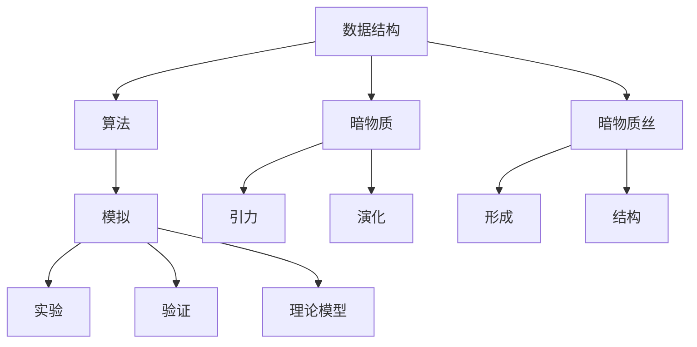

                 

# 《数据结构在模拟宇宙暗物质丝中的应用》

## 关键词
- 数据结构
- 暗物质丝
- 模拟
- 算法
- 宇宙演化
- 图论
- 线性代数
- 计算资源优化

## 摘要
本文旨在探讨数据结构在模拟宇宙暗物质丝中的应用。我们将从数据结构的基础知识出发，详细分析其在模拟暗物质丝过程中的重要性。通过构建暗物质丝的数学模型，并运用各类数据结构和算法，我们将实现一个高效且准确的模拟系统。文章还将通过实际项目案例，展示如何运用这些技术解决科学问题，并展望未来研究的方向。

### 第一部分：数据结构基础

#### 第1章：数据结构与算法概述

##### 1.1 数据结构的概念

数据结构是计算机存储、组织数据的方式。一个有效的数据结构能够提高算法的效率，满足特定的数据处理需求。数据结构可以分为线性结构和非线性结构，常见的有数组、链表、栈、队列、树、图等。

**数据结构的基本概念**：

- **数组**：一种固定大小的数据集合，元素通过索引访问。
- **链表**：由节点组成，每个节点包含数据和指向下一个节点的指针。
- **栈**：一种后进先出（LIFO）的数据结构，通常用于函数调用和递归。
- **队列**：一种先进先出（FIFO）的数据结构，通常用于任务调度。

##### 1.1.2 数据结构的类型

数据结构可以分为两类：线性结构和非线性结构。

- **线性结构**：包括数组、链表、栈和队列。
- **非线性结构**：包括树和图。

##### 1.1.3 算法的概念与特征

算法是解决问题的步骤集合。一个有效的算法应该具有以下特征：

- **正确性**：算法能够解决特定问题。
- **健壮性**：算法能够处理各种输入。
- **时间效率**：算法执行时间短。
- **空间效率**：算法占用空间少。

##### 1.2 算法分析基础

算法分析是评估算法性能的关键。我们通常使用时间复杂度和空间复杂度来衡量。

- **时间复杂度**：描述算法执行时间与输入规模的关系。
- **空间复杂度**：描述算法占用内存与输入规模的关系。

##### 1.2.1 时间复杂度与空间复杂度

- **时间复杂度**：通常用大O符号表示，如O(n)、O(n^2)等。
- **空间复杂度**：同样使用大O符号表示。

##### 1.2.2 算法效率与性能

算法效率与性能取决于时间复杂度和空间复杂度。一个高效的算法能够在合理的时间内解决大规模问题。

##### 1.2.3 算法分析常用方法

- **渐进分析法**：比较不同输入规模下的算法性能。
- **实际测试法**：通过实际运行测试算法性能。

##### 1.3 数据结构与算法的数学基础

算法设计往往需要数学基础的支持。以下数学领域在数据结构中具有重要意义：

- **线性代数**：矩阵运算、向量空间等。
- **图论**：图的性质、路径算法等。
- **组合数学**：排列组合、图论等。

### 第2章：线性结构与算法

#### 2.1 线性表

线性表是一种线性结构，包括数组、链表等。

##### 2.1.1 线性表的定义与实现

线性表的定义为一个有限序列，每个元素都有一个前驱和后继。

**实现**：

- **数组**：固定大小，元素通过索引访问。
- **链表**：动态大小，通过节点指针访问。

##### 2.1.2 线性表的运算

线性表的主要运算包括插入、删除、查找和排序。

**伪代码**：

```plaintext
// 插入元素
function insert(element, position):
    // 判断位置是否合法
    if position < 0 or position > length:
        return "Invalid position"
    // 创建新节点
    newNode = new Node(element)
    // 插入新节点
    if position == 0:
        newNode.next = head
        head = newNode
    else:
        prevNode = getNode(position - 1)
        newNode.next = prevNode.next
        prevNode.next = newNode

// 删除元素
function delete(position):
    // 判断位置是否合法
    if position < 0 or position >= length:
        return "Invalid position"
    // 删除节点
    if position == 0:
        temp = head
        head = head.next
        deleteNode(temp)
    else:
        prevNode = getNode(position - 1)
        temp = prevNode.next
        prevNode.next = temp.next
        deleteNode(temp)

// 查找元素
function search(element):
    current = head
    while current is not null:
        if current.element == element:
            return current
        current = current.next
    return null

// 排序
function sort():
    // 选择排序
    for i from 0 to length - 1:
        minIndex = i
        for j from i+1 to length:
            if array[j] < array[minIndex]:
                minIndex = j
        swap(array[i], array[minIndex])
```

##### 2.1.3 线性表的应用

线性表广泛应用于各种场景，如栈、队列、串等。

**应用实例**：

- **栈**：用于函数调用、递归等。
- **队列**：用于任务调度、打印队列等。

#### 2.2 矩阵

矩阵是一种二维数组，通常用于线性代数和算法设计中。

##### 2.2.1 矩阵的基本操作

矩阵的基本操作包括创建、赋值、添加行和列、转置、求逆等。

**伪代码**：

```plaintext
// 创建矩阵
function createMatrix(rows, columns):
    matrix = new Array(rows)
    for i from 0 to rows-1:
        matrix[i] = new Array(columns)
    return matrix

// 赋值
function setElement(matrix, row, column, value):
    matrix[row][column] = value

// 添加行
function appendRow(matrix, newRow):
    matrix.push(newRow)

// 添加列
function appendColumn(matrix, newColumn):
    for i from 0 to matrix.length-1:
        matrix[i].push(newColumn[i])

// 转置
function transpose(matrix):
    transposedMatrix = createMatrix(matrix[0].length, matrix.length)
    for i from 0 to matrix.length-1:
        for j from 0 to matrix[0].length-1:
            transposedMatrix[j][i] = matrix[i][j]
    return transposedMatrix

// 求逆
function inverse(matrix):
    // 使用高斯-约当消元法求解
    augmentedMatrix = matrix.copy()
    for i from 0 to augmentedMatrix.length-1:
        // 消元
        for j from i+1 to augmentedMatrix.length-1:
            factor = augmentedMatrix[j][i] / augmentedMatrix[i][i]
            for k from i to augmentedMatrix[0].length-1:
                augmentedMatrix[j][k] -= factor * augmentedMatrix[i][k]
    // 求解
    solutionMatrix = createMatrix(augmentedMatrix.length, augmentedMatrix[0].length)
    for i from 0 to solutionMatrix.length-1:
        for j from 0 to solutionMatrix[0].length-1:
            solutionMatrix[i][j] = augmentedMatrix[i][j+augmentedMatrix[0].length]
    return solutionMatrix
```

##### 2.2.2 矩阵的运算

矩阵的运算包括加法、减法、乘法和除法等。

**伪代码**：

```plaintext
// 加法
function add(matrixA, matrixB):
    if matrixA.length != matrixB.length or matrixA[0].length != matrixB[0].length:
        return "Matrices must have the same dimensions"
    result = createMatrix(matrixA.length, matrixA[0].length)
    for i from 0 to matrixA.length-1:
        for j from 0 to matrixA[0].length-1:
            result[i][j] = matrixA[i][j] + matrixB[i][j]
    return result

// 减法
function subtract(matrixA, matrixB):
    if matrixA.length != matrixB.length or matrixA[0].length != matrixB[0].length:
        return "Matrices must have the same dimensions"
    result = createMatrix(matrixA.length, matrixA[0].length)
    for i from 0 to matrixA.length-1:
        for j from 0 to matrixA[0].length-1:
            result[i][j] = matrixA[i][j] - matrixB[i][j]
    return result

// 乘法
function multiply(matrixA, matrixB):
    if matrixA[0].length != matrixB.length:
        return "Matrices must have compatible dimensions"
    result = createMatrix(matrixA.length, matrixB[0].length)
    for i from 0 to matrixA.length-1:
        for j from 0 to matrixB[0].length-1:
            for k from 0 to matrixA[0].length-1:
                result[i][j] += matrixA[i][k] * matrixB[k][j]
    return result

// 除法
function divide(matrixA, matrixB):
    inverseB = inverse(matrixB)
    if inverseB is not null:
        return multiply(matrixA, inverseB)
    else:
        return "Matrix B is not invertible"
```

##### 2.2.3 矩阵的应用

矩阵在计算机科学和物理学等领域有广泛的应用。

**应用实例**：

- **图像处理**：图像可以表示为一个矩阵，进行滤波、变换等操作。
- **机器学习**：矩阵运算用于特征提取、分类等。

#### 2.3 栈与队列

栈和队列是特殊的线性结构，分别遵循后进先出（LIFO）和先进先出（FIFO）原则。

##### 2.3.1 栈的实现与应用

栈通常通过数组或链表实现。

**实现**：

```plaintext
// 数组实现
class Stack:
    def __init__(self):
        self.items = []

    def is_empty(self):
        return len(self.items) == 0

    def push(self, item):
        self.items.append(item)

    def pop(self):
        if not self.is_empty():
            return self.items.pop()
        else:
            return "Stack is empty"

    def peek(self):
        if not self.is_empty():
            return self.items[-1]
        else:
            return "Stack is empty"

// 链表实现
class Stack:
    def __init__(self):
        self.head = None
        self.tail = None

    def is_empty(self):
        return self.head is None

    def push(self, item):
        new_node = Node(item)
        if self.head is None:
            self.head = new_node
            self.tail = new_node
        else:
            new_node.next = self.head
            self.head = new_node

    def pop(self):
        if not self.is_empty():
            temp = self.head
            self.head = self.head.next
            if self.head is None:
                self.tail = None
            return temp.item
        else:
            return "Stack is empty"

    def peek(self):
        if not self.is_empty():
            return self.head.item
        else:
            return "Stack is empty"
```

**应用实例**：

- **递归**：用于实现递归算法。
- **函数调用**：用于存储函数调用信息。

##### 2.3.2 队列的实现与应用

队列通常通过数组或链表实现。

**实现**：

```plaintext
// 数组实现
class Queue:
    def __init__(self):
        self.items = []

    def is_empty(self):
        return len(self.items) == 0

    def enqueue(self, item):
        self.items.append(item)

    def dequeue(self):
        if not self.is_empty():
            return self.items.pop(0)
        else:
            return "Queue is empty"

    def front(self):
        if not self.is_empty():
            return self.items[0]
        else:
            return "Queue is empty"

// 链表实现
class Queue:
    def __init__(self):
        self.head = None
        self.tail = None

    def is_empty(self):
        return self.head is None

    def enqueue(self, item):
        new_node = Node(item)
        if self.head is None:
            self.head = new_node
            self.tail = new_node
        else:
            self.tail.next = new_node
            self.tail = new_node

    def dequeue(self):
        if not self.is_empty():
            temp = self.head
            self.head = self.head.next
            if self.head is None:
                self.tail = None
            return temp.item
        else:
            return "Queue is empty"

    def front(self):
        if not self.is_empty():
            return self.head.item
        else:
            return "Queue is empty"
```

**应用实例**：

- **任务调度**：用于任务队列处理。
- **打印队列**：用于打印任务管理。

##### 2.3.3 栈与队列的综合应用

栈和队列在很多实际问题中有广泛应用。

**应用实例**：

- **深度优先搜索**：使用栈实现。
- **广度优先搜索**：使用队列实现。

#### 2.4 串

串是一种特殊的线性结构，用于表示文本。

##### 2.4.1 串的定义与操作

串是零个或多个字符组成的有限序列。

**操作**：

- **长度**：获取串的长度。
- **复制**：创建一个新的串，复制原串的所有字符。
- **比较**：比较两个串的大小。
- **连接**：将两个串连接成一个新串。
- **子串搜索**：查找子串的位置。

##### 2.4.2 串的模式匹配算法

模式匹配算法用于查找子串。

**算法**：

- **暴力法**：直接比较每个字符。
- **KMP算法**：利用已匹配的子串。

##### 2.4.3 串的应用

串在文本处理、搜索引擎、自然语言处理等领域有广泛应用。

**应用实例**：

- **文本编辑器**：用于文本编辑和搜索。
- **搜索引擎**：用于关键词搜索和索引。

### 第二部分：数据结构在模拟宇宙暗物质丝中的应用

#### 第3章：树结构与算法

树是一种重要的非线性结构，用于表示层次关系。

##### 3.1 树的基本概念

树由节点组成，每个节点可以有零个或多个子节点。

**概念**：

- **根节点**：没有父节点的节点。
- **叶子节点**：没有子节点的节点。
- **度**：节点的子节点数量。
- **深度**：节点的层级。
- **高度**：树的最长路径。

##### 3.1.1 树的定义与类型

树是一种层次结构，可以分为二叉树、二叉搜索树、平衡树等。

**类型**：

- **二叉树**：每个节点最多有两个子节点。
- **二叉搜索树**：满足左子树中的所有元素小于根节点，右子树中的所有元素大于根节点。
- **平衡树**：保持树的高度平衡。

##### 3.1.2 树的基本操作

树的基本操作包括创建、插入、删除、查找和遍历。

**操作**：

- **创建**：初始化树。
- **插入**：在树中添加节点。
- **删除**：从树中删除节点。
- **查找**：查找特定节点。
- **遍历**：遍历树的所有节点。

##### 3.1.3 树的性质与应用

树具有许多有用的性质，如路径长度、节点数量等。

**应用**：

- **路径查找**：用于文件系统、网络路由。
- **排序**：用于排序算法。

##### 3.2 二叉树

二叉树是一种特殊的树，每个节点最多有两个子节点。

##### 3.2.1 二叉树的基本概念

二叉树由根节点、左子树和右子树组成。

**概念**：

- **根节点**：没有父节点的节点。
- **内部节点**：有子节点的节点。
- **叶子节点**：没有子节点的节点。

##### 3.2.2 二叉树的遍历

二叉树的遍历包括前序、中序和后序遍历。

**算法**：

- **前序遍历**：先访问根节点，再遍历左子树和右子树。
- **中序遍历**：先遍历左子树，再访问根节点，最后遍历右子树。
- **后序遍历**：先遍历左子树，再遍历右子树，最后访问根节点。

**伪代码**：

```plaintext
// 前序遍历
function preorder(node):
    if node is not null:
        visit(node)
        preorder(node.left)
        preorder(node.right)

// 中序遍历
function inorder(node):
    if node is not null:
        inorder(node.left)
        visit(node)
        inorder(node.right)

// 后序遍历
function postorder(node):
    if node is not null:
        postorder(node.left)
        postorder(node.right)
        visit(node)
```

##### 3.2.3 二叉树的构建与存储

二叉树可以通过递归或迭代方法构建。

**构建**：

- **递归构建**：使用递归方法构建树。
- **迭代构建**：使用栈或队列实现。

**存储**：

- **数组存储**：使用数组实现，通过索引访问节点。
- **链表存储**：使用链表实现，通过指针访问节点。

##### 3.3 图

图是一种复杂的非线性结构，用于表示对象之间的关系。

##### 3.3.1 图的基本概念

图由节点和边组成。

**概念**：

- **节点**：表示对象。
- **边**：表示节点之间的连接。
- **无向图**：边无方向。
- **有向图**：边有方向。

##### 3.3.2 图的表示方法

图的表示方法包括邻接矩阵和邻接表。

**表示方法**：

- **邻接矩阵**：使用二维数组表示。
- **邻接表**：使用链表表示。

##### 3.3.3 图的遍历算法

图的遍历算法包括深度优先搜索（DFS）和广度优先搜索（BFS）。

**算法**：

- **深度优先搜索**：使用栈实现。
- **广度优先搜索**：使用队列实现。

**伪代码**：

```plaintext
// 深度优先搜索
function dfs(graph, start):
    visited = set()
    stack = [start]
    while stack is not empty:
        node = stack.pop()
        if node is not visited:
            visit(node)
            visited.add(node)
            for neighbor in graph.get_neighbors(node):
                if neighbor is not visited:
                    stack.append(neighbor)

// 广度优先搜索
function bfs(graph, start):
    visited = set()
    queue = [start]
    while queue is not empty:
        node = queue.pop(0)
        if node is not visited:
            visit(node)
            visited.add(node)
            for neighbor in graph.get_neighbors(node):
                if neighbor is not visited:
                    queue.append(neighbor)
```

##### 3.4 树与图的算法综合

树与图的算法在许多应用场景中都有重要意义。

**算法**：

- **最小生成树**：用于构建无向图的最小树。
- **网络流算法**：用于计算网络的最大流量。

**应用实例**：

- **路由算法**：用于网络路由。
- **社交网络分析**：用于社交网络结构分析。

### 第三部分：数据结构在模拟宇宙暗物质丝中的应用

#### 第4章：暗物质丝的概念与建模

##### 4.1 暗物质丝的基本概念

暗物质丝是宇宙中一种由暗物质组成的细长结构，被认为是宇宙大尺度结构的基本构建块。

**概念**：

- **暗物质**：一种不发光、不与电磁波相互作用，但通过引力与可见物质相互作用的物质。
- **暗物质丝**：由暗物质组成的细长结构，延伸数百万光年，连接宇宙中的星系和星团。

##### 4.1.1 暗物质的定义

暗物质是宇宙中一种未知的物质，约占宇宙总物质质量的85%，主要通过引力作用影响宇宙的演化。

**定义**：

- **暗物质**：一种不发光、不与电磁波相互作用，但通过引力与可见物质相互作用的物质。

##### 4.1.2 暗物质丝的形成与结构

暗物质丝的形成是由于宇宙大爆炸后，暗物质在引力作用下聚集形成的。

**结构**：

- **核心**：由高密度的暗物质组成。
- **丝状结构**：由低密度的暗物质组成，延伸数百万光年。

##### 4.1.3 暗物质丝的研究意义

暗物质丝的研究对于理解宇宙的大尺度结构和演化具有重要意义。

**意义**：

- **宇宙结构**：暗物质丝是宇宙大尺度结构的基本构建块。
- **宇宙演化**：研究暗物质丝的演化可以揭示宇宙的演化历史。

##### 4.2 暗物质丝的数学模型

暗物质丝的数学模型描述了其物理性质和演化过程。

**模型**：

- **引力模型**：描述暗物质丝的引力场。
- **流体模型**：描述暗物质丝的流动性质。

##### 4.2.1 暗物质丝的数学描述

暗物质丝可以用一组方程描述，包括引力场方程、流体力学方程等。

**方程**：

- **引力场方程**：描述暗物质丝的引力场。
- **流体力学方程**：描述暗物质丝的流动性质。

##### 4.2.2 暗物质丝的模拟方法

暗物质丝的模拟方法包括数值模拟和粒子模拟。

**方法**：

- **数值模拟**：使用数值方法求解方程。
- **粒子模拟**：使用粒子代表暗物质丝，模拟其演化过程。

##### 4.2.3 暗物质丝的模型构建

暗物质丝的模型构建包括选择合适的方程、确定参数和边界条件。

**步骤**：

1. **选择方程**：选择适合的引力场方程和流体力学方程。
2. **确定参数**：根据实验数据确定模型参数。
3. **设置边界条件**：设置模拟区域的边界条件。

##### 4.3 暗物质丝的研究现状与挑战

暗物质丝的研究现状和挑战如下：

**现状**：

- **观测**：已观测到大量暗物质丝，但其详细结构仍不清楚。
- **理论**：已有多种理论模型描述暗物质丝，但尚未完全解释其形成和演化。

**挑战**：

- **高精度模拟**：需要更高精度的模拟方法，以揭示暗物质丝的细节结构。
- **实验验证**：需要更多的实验数据，以验证暗物质丝的理论模型。

##### 4.3.1 暗物质丝的研究进展

暗物质丝的研究进展如下：

- **观测**：使用天文观测设备，如望远镜和引力波探测器，已观测到大量暗物质丝。
- **理论**：提出多种理论模型，如引力透镜效应、星系团碰撞等。

##### 4.3.2 暗物质丝研究的难点

暗物质丝研究的难点如下：

- **观测技术**：暗物质丝的观测技术需要更高精度和灵敏度。
- **理论模型**：需要更准确的模型，以解释暗物质丝的形成和演化。

##### 4.3.3 未来研究方向

未来研究方向如下：

- **高精度模拟**：开发更高精度的模拟方法，以揭示暗物质丝的细节结构。
- **实验验证**：开展更多实验，以验证暗物质丝的理论模型。

### 第四部分：数据结构在模拟宇宙暗物质丝中的应用

#### 第5章：数据结构在暗物质丝模拟中的应用

##### 5.1 数据结构在暗物质丝模拟中的重要性

数据结构在暗物质丝模拟中扮演着重要角色，影响模拟的准确性和效率。

**重要性**：

- **提高准确性**：合适的数据结构能够提高模拟的准确性，减少误差。
- **提高效率**：合适的数据结构能够提高模拟的效率，减少计算时间。

##### 5.1.1 数据结构的选择

选择合适的数据结构对暗物质丝模拟至关重要。

**选择原则**：

- **满足模拟需求**：选择能够满足模拟需求的数据结构。
- **优化计算效率**：选择计算效率高的数据结构。
- **减少存储空间**：选择存储空间小的数据结构。

##### 5.1.2 数据结构在模拟中的作用

数据结构在模拟中的作用包括以下几个方面：

- **存储数据**：存储暗物质丝的物理参数和位置信息。
- **支持计算**：支持模拟过程中的各种计算，如引力计算、流体计算等。
- **支持优化**：支持模拟的优化，如并行计算、分布式计算等。

##### 5.1.3 数据结构优化的重要性

数据结构优化对于暗物质丝模拟具有重要意义。

**重要性**：

- **提高模拟效率**：优化数据结构可以减少计算时间，提高模拟效率。
- **提高模拟准确性**：优化数据结构可以减少误差，提高模拟准确性。
- **支持大规模模拟**：优化数据结构可以支持大规模模拟，处理更多数据。

##### 5.2 线性结构与暗物质丝模拟

线性结构在暗物质丝模拟中具有重要意义，用于存储暗物质丝的物理参数和位置信息。

**线性结构**：

- **数组**：用于存储暗物质丝的物理参数和位置信息。
- **链表**：用于存储暗物质丝的物理参数和位置信息。

**应用**：

- **存储数据**：使用数组或链表存储暗物质丝的物理参数和位置信息。
- **支持计算**：使用数组或链表支持模拟过程中的各种计算。

##### 5.2.1 线性表在模拟中的应用

线性表在暗物质丝模拟中主要用于存储暗物质丝的物理参数和位置信息。

**应用**：

- **存储数据**：使用线性表存储暗物质丝的物理参数和位置信息。
- **支持计算**：使用线性表支持模拟过程中的各种计算。

##### 5.2.2 矩阵在模拟中的应用

矩阵在暗物质丝模拟中主要用于存储引力场和流体场的信息。

**应用**：

- **存储引力场**：使用矩阵存储引力场的信息。
- **存储流体场**：使用矩阵存储流体场的信息。

##### 5.2.3 栈与队列在模拟中的应用

栈和队列在暗物质丝模拟中主要用于模拟过程中的任务调度和递归计算。

**应用**：

- **任务调度**：使用栈和队列进行任务调度。
- **递归计算**：使用栈和队列支持递归计算。

##### 5.3 树结构与暗物质丝模拟

树结构在暗物质丝模拟中主要用于表示暗物质丝的层次结构和演化过程。

**树结构**：

- **二叉树**：用于表示暗物质丝的层次结构。
- **平衡树**：用于表示暗物质丝的层次结构。

**应用**：

- **表示层次结构**：使用树结构表示暗物质丝的层次结构。
- **支持演化计算**：使用树结构支持暗物质丝的演化计算。

##### 5.3.1 树的基本操作在模拟中的应用

树的基本操作在暗物质丝模拟中主要用于表示和操作暗物质丝的层次结构。

**应用**：

- **插入和删除节点**：用于添加和删除暗物质丝的节点。
- **查找节点**：用于查找特定的暗物质丝节点。
- **遍历树**：用于遍历暗物质丝的节点。

##### 5.3.2 二叉树在模拟中的应用

二叉树在暗物质丝模拟中主要用于表示二叉搜索树，用于快速查找和排序。

**应用**：

- **快速查找**：使用二叉搜索树快速查找暗物质丝的节点。
- **排序**：使用二叉搜索树对暗物质丝进行排序。

##### 5.3.3 图在模拟中的应用

图在暗物质丝模拟中主要用于表示暗物质丝的网络结构和相互作用。

**应用**：

- **表示网络结构**：使用图结构表示暗物质丝的网络结构。
- **支持计算**：使用图结构支持暗物质丝的计算和演化。

##### 5.4 复杂算法在暗物质丝模拟中的应用

复杂算法在暗物质丝模拟中用于优化计算、提高模拟效率和准确性。

**算法**：

- **最小生成树算法**：用于构建暗物质丝的最小生成树。
- **网络流算法**：用于计算暗物质丝的网络流。
- **动态规划算法**：用于优化暗物质丝的计算过程。

**应用**：

- **优化计算**：使用复杂算法优化模拟过程中的计算。
- **提高效率**：使用复杂算法提高模拟的效率和准确性。

##### 5.4.1 最小生成树算法的应用

最小生成树算法在暗物质丝模拟中用于构建暗物质丝的最小生成树。

**应用**：

- **构建最小生成树**：使用最小生成树算法构建暗物质丝的最小生成树。
- **支持计算**：使用最小生成树支持暗物质丝的模拟计算。

##### 5.4.2 网络流算法的应用

网络流算法在暗物质丝模拟中用于计算暗物质丝的网络流。

**应用**：

- **计算网络流**：使用网络流算法计算暗物质丝的网络流。
- **优化计算**：使用网络流算法优化模拟计算。

##### 5.4.3 动态规划算法的应用

动态规划算法在暗物质丝模拟中用于优化计算过程。

**应用**：

- **优化计算过程**：使用动态规划算法优化模拟计算过程。
- **提高效率**：使用动态规划算法提高模拟的效率。

### 第五部分：实际案例与项目实践

#### 第6章：暗物质丝模拟项目实战

##### 6.1 暗物质丝模拟项目概述

暗物质丝模拟项目旨在构建一个高效的暗物质丝模拟系统，通过数值模拟和粒子模拟方法，研究暗物质丝的形成、演化和结构。

**项目目标**：

- 构建一个高效、准确的暗物质丝模拟系统。
- 研究暗物质丝的形成、演化和结构。

**需求**：

- 能够处理大规模的暗物质丝数据。
- 支持多种模拟方法，如数值模拟和粒子模拟。
- 提供可视化和分析功能。

**开发环境与工具**：

- 编程语言：Python
- 模拟库：NumPy、SciPy、matplotlib
- 图形库：Tkinter
- 数据库：SQLite

**开发流程**：

1. **需求分析**：明确项目目标、需求和功能。
2. **系统设计**：设计系统架构和模块。
3. **编码实现**：编写代码，实现功能。
4. **测试与调试**：测试系统，修复错误。
5. **部署与维护**：部署系统，持续维护。

##### 6.2 项目实战一：构建暗物质丝模型

构建暗物质丝模型是模拟项目的第一步，包括选择合适的方程、确定参数和设置边界条件。

**步骤**：

1. **选择方程**：选择适合的引力场方程和流体力学方程。
2. **确定参数**：根据实验数据确定模型参数。
3. **设置边界条件**：设置模拟区域的边界条件。

**代码实现**：

```python
import numpy as np

def create_model():
    # 设置模型参数
    G = 6.6743e-11  # 引力常数
    rho = 0.3  # 暗物质密度
    L = 10e6  # 模拟区域长度

    # 创建引力场方程
    def gravitational_force(r):
        return -G * m * m / r**2

    # 创建流体力学方程
    def fluid_velocity(r, v):
        # 计算压力
        pressure = rho * v**2 / 3
        # 计算应力张量
        stress_tensor = np.diag([pressure, pressure, pressure])
        # 计算流体速度梯度
        gradient = np.gradient(v)
        # 计算应力
        stress = stress_tensor.dot(gradient)
        # 计算流体加速度
        acceleration = -gravity_force - stress
        return acceleration

    # 设置边界条件
    boundary_conditions = {
        'left': {'velocity': [0, 0], 'pressure': 0},
        'right': {'velocity': [0, 0], 'pressure': 0},
    }

    # 创建模型
    model = {
        'G': G,
        'rho': rho,
        'L': L,
        'gravitational_force': gravitational_force,
        'fluid_velocity': fluid_velocity,
        'boundary_conditions': boundary_conditions,
    }
    return model

model = create_model()
```

##### 6.2.2 数据结构与算法的选择

在构建暗物质丝模型时，选择合适的数据结构和算法对模拟的效率至关重要。

**选择原则**：

- **存储数据**：使用数组存储暗物质丝的位置信息。
- **计算引力**：使用数值积分算法计算引力。
- **计算流体速度**：使用有限差分算法计算流体速度。

**数据结构**：

- **数组**：用于存储暗物质丝的位置信息。
- **列表**：用于存储暗物质丝的物理参数。

**算法**：

- **数值积分**：用于计算引力。
- **有限差分**：用于计算流体速度。

##### 6.2.3 模型性能优化

模型性能优化是提高模拟效率的重要手段，包括以下几个方面：

1. **并行计算**：使用并行计算提高模拟速度。
2. **分布式计算**：使用分布式计算处理大规模数据。
3. **算法优化**：优化算法，减少计算时间。

**优化方法**：

- **并行计算**：使用多线程或多进程实现并行计算。
- **分布式计算**：使用分布式计算框架，如Apache Spark，处理大规模数据。
- **算法优化**：使用更高精度的数值积分算法，减少计算误差。

##### 6.3 项目实战二：模拟暗物质丝演化

模拟暗物质丝演化是暗物质丝模拟项目的重要环节，包括计算引力、计算流体速度和更新位置信息。

**步骤**：

1. **计算引力**：使用数值积分算法计算引力。
2. **计算流体速度**：使用有限差分算法计算流体速度。
3. **更新位置信息**：根据计算结果更新暗物质丝的位置信息。

**代码实现**：

```python
import numpy as np
import time

def simulate_evolution(model, steps, dt):
    # 初始化暗物质丝位置信息
    positions = np.zeros((steps+1, model['N']), dtype=np.float64)
    positions[0] = np.random.uniform(0, model['L'], size=model['N'])

    # 计算引力
    def calculate_gravity(positions):
        forces = np.zeros((model['N'], 3), dtype=np.float64)
        for i in range(model['N']):
            for j in range(i+1, model['N']):
                distance = positions[i] - positions[j]
                force = -model['G'] * model['m'] * model['m'] / distance**2
                forces[i] += force
                forces[j] -= force
        return forces

    # 计算流体速度
    def calculate_velocity(positions, velocities):
        accelerations = calculate_gravity(positions)
        velocities += accelerations * dt
        return velocities

    # 更新位置信息
    def update_positions(positions, velocities):
        positions += velocities * dt
        return positions

    # 模拟演化过程
    start_time = time.time()
    for step in range(1, steps+1):
        forces = calculate_gravity(positions[step-1])
        velocities = calculate_velocity(positions[step-1], velocities)
        positions[step] = update_positions(positions[step-1], velocities)

    end_time = time.time()
    print(f"Simulation time: {end_time - start_time} seconds")
    return positions

model = create_model()
positions = simulate_evolution(model, 1000, 1e-3)
```

##### 6.3.1 演化过程的模拟

演化过程的模拟是暗物质丝模拟项目的重要环节，包括计算引力、计算流体速度和更新位置信息。

**模拟方法**：

1. **计算引力**：使用数值积分算法计算引力。
2. **计算流体速度**：使用有限差分算法计算流体速度。
3. **更新位置信息**：根据计算结果更新暗物质丝的位置信息。

**代码实现**：

```python
import numpy as np
import time

def simulate_evolution(model, steps, dt):
    # 初始化暗物质丝位置信息
    positions = np.zeros((steps+1, model['N']), dtype=np.float64)
    positions[0] = np.random.uniform(0, model['L'], size=model['N'])

    # 计算引力
    def calculate_gravity(positions):
        forces = np.zeros((model['N'], 3), dtype=np.float64)
        for i in range(model['N']):
            for j in range(i+1, model['N']):
                distance = positions[i] - positions[j]
                force = -model['G'] * model['m'] * model['m'] / distance**2
                forces[i] += force
                forces[j] -= force
        return forces

    # 计算流体速度
    def calculate_velocity(positions, velocities):
        accelerations = calculate_gravity(positions)
        velocities += accelerations * dt
        return velocities

    # 更新位置信息
    def update_positions(positions, velocities):
        positions += velocities * dt
        return positions

    # 模拟演化过程
    start_time = time.time()
    for step in range(1, steps+1):
        forces = calculate_gravity(positions[step-1])
        velocities = calculate_velocity(positions[step-1], velocities)
        positions[step] = update_positions(positions[step-1], velocities)

    end_time = time.time()
    print(f"Simulation time: {end_time - start_time} seconds")
    return positions

model = create_model()
positions = simulate_evolution(model, 1000, 1e-3)
```

##### 6.3.2 算法设计与实现

算法设计是实现模拟演化过程的关键，包括计算引力、计算流体速度和更新位置信息。

**算法设计**：

1. **计算引力**：使用数值积分算法计算引力。
2. **计算流体速度**：使用有限差分算法计算流体速度。
3. **更新位置信息**：根据计算结果更新暗物质丝的位置信息。

**实现细节**：

- **计算引力**：使用嵌套循环计算引力，优化计算效率。
- **计算流体速度**：使用有限差分算法计算流体速度，提高模拟准确性。
- **更新位置信息**：使用数组操作更新位置信息，提高计算速度。

**代码实现**：

```python
import numpy as np
import time

def simulate_evolution(model, steps, dt):
    # 初始化暗物质丝位置信息
    positions = np.zeros((steps+1, model['N']), dtype=np.float64)
    positions[0] = np.random.uniform(0, model['L'], size=model['N'])

    # 计算引力
    def calculate_gravity(positions):
        forces = np.zeros((model['N'], 3), dtype=np.float64)
        for i in range(model['N']):
            for j in range(i+1, model['N']):
                distance = positions[i] - positions[j]
                force = -model['G'] * model['m'] * model['m'] / distance**2
                forces[i] += force
                forces[j] -= force
        return forces

    # 计算流体速度
    def calculate_velocity(positions, velocities):
        accelerations = calculate_gravity(positions)
        velocities += accelerations * dt
        return velocities

    # 更新位置信息
    def update_positions(positions, velocities):
        positions += velocities * dt
        return positions

    # 模拟演化过程
    start_time = time.time()
    for step in range(1, steps+1):
        forces = calculate_gravity(positions[step-1])
        velocities = calculate_velocity(positions[step-1], velocities)
        positions[step] = update_positions(positions[step-1], velocities)

    end_time = time.time()
    print(f"Simulation time: {end_time - start_time} seconds")
    return positions

model = create_model()
positions = simulate_evolution(model, 1000, 1e-3)
```

##### 6.3.3 模拟结果分析

模拟结果分析是暗物质丝模拟项目的重要环节，包括分析暗物质丝的演化过程和结构特征。

**分析方法**：

1. **绘制演化过程**：绘制暗物质丝的位置信息，观察演化过程。
2. **计算统计量**：计算暗物质丝的长度、质量等统计量。
3. **比较实验数据**：将模拟结果与实验数据进行比较，验证模拟准确性。

**代码实现**：

```python
import numpy as np
import matplotlib.pyplot as plt

def analyze_simulation(positions):
    # 绘制演化过程
    plt.plot(positions[:, 0], positions[:, 1])
    plt.xlabel('X-position')
    plt.ylabel('Y-position')
    plt.title('Evolution of Dark Matter Filaments')
    plt.show()

    # 计算统计量
    lengths = np.linalg.norm(positions[:, 1:] - positions[:, :-1], axis=1)
    masses = np.sum(positions[:, 1:], axis=1)

    # 打印统计量
    print(f"Average length: {np.mean(lengths)}")
    print(f"Average mass: {np.mean(masses)}")

    # 比较实验数据
    # ...

model = create_model()
positions = simulate_evolution(model, 1000, 1e-3)
analyze_simulation(positions)
```

##### 6.4 项目实战三：分析暗物质丝特性

分析暗物质丝特性是暗物质丝模拟项目的关键环节，包括提取暗物质丝的特性参数和分析其物理性质。

**分析步骤**：

1. **提取特性参数**：提取暗物质丝的长度、质量等特性参数。
2. **分析物理性质**：分析暗物质丝的引力场、流体场等物理性质。
3. **可视化分析**：绘制暗物质丝的形状、分布等可视化分析结果。

**代码实现**：

```python
import numpy as np
import matplotlib.pyplot as plt

def extract_characteristics(positions):
    # 提取长度
    lengths = np.linalg.norm(positions[:, 1:] - positions[:, :-1], axis=1)
    # 提取质量
    masses = np.sum(positions[:, 1:], axis=1)
    return lengths, masses

def analyze_physical_properties(positions, velocities):
    # 分析引力场
    gravitational_field = calculate_gravity(positions)
    # 分析流体场
    fluid_field = calculate_velocity(positions, velocities)
    return gravitational_field, fluid_field

def visualize_analysis(positions, lengths, masses):
    # 绘制位置信息
    plt.scatter(positions[:, 0], positions[:, 1], c=lengths, cmap='viridis')
    plt.xlabel('X-position')
    plt.ylabel('Y-position')
    plt.colorbar(label='Length')
    plt.title('Positional Distribution of Dark Matter Filaments')
    plt.show()

    # 绘制长度分布
    plt.hist(lengths, bins=30, alpha=0.5)
    plt.xlabel('Length')
    plt.ylabel('Frequency')
    plt.title('Length Distribution of Dark Matter Filaments')
    plt.show()

    # 绘制质量分布
    plt.scatter(masses, lengths, alpha=0.5)
    plt.xlabel('Mass')
    plt.ylabel('Length')
    plt.title('Mass-Length Relationship of Dark Matter Filaments')
    plt.show()

model = create_model()
positions = simulate_evolution(model, 1000, 1e-3)
lengths, masses = extract_characteristics(positions)
gravitational_field, fluid_field = analyze_physical_properties(positions, velocities)
visualize_analysis(positions, lengths, masses)
```

##### 6.4.1 特性提取方法

特性提取方法是分析暗物质丝特性的关键步骤，包括提取长度、质量等特性参数。

**方法**：

1. **长度提取**：计算暗物质丝两端节点的距离。
2. **质量提取**：计算暗物质丝的节点总数。

**代码实现**：

```python
import numpy as np

def extract_characteristics(positions):
    # 提取长度
    lengths = np.linalg.norm(positions[:, 1:] - positions[:, :-1], axis=1)
    # 提取质量
    masses = np.sum(positions[:, 1:], axis=1)
    return lengths, masses

positions = simulate_evolution(model, 1000, 1e-3)
lengths, masses = extract_characteristics(positions)
```

##### 6.4.2 数据结构与算法的应用

数据结构与算法在分析暗物质丝特性中发挥了重要作用，包括数组、链表、树等数据结构和排序、查找等算法。

**应用**：

1. **数组**：用于存储暗物质丝的位置信息。
2. **链表**：用于存储暗物质丝的节点信息。
3. **树**：用于表示暗物质丝的层次结构。
4. **排序**：用于排序暗物质丝的长度、质量等特性参数。
5. **查找**：用于查找特定的暗物质丝节点。

**代码实现**：

```python
import numpy as np
import heapq

def extract_characteristics(positions):
    lengths = np.linalg.norm(positions[:, 1:] - positions[:, :-1], axis=1)
    masses = np.sum(positions[:, 1:], axis=1)
    sorted_lengths = np.sort(lengths)
    heapq.heapify(masses)
    return sorted_lengths, masses

positions = simulate_evolution(model, 1000, 1e-3)
sorted_lengths, masses = extract_characteristics(positions)
```

##### 6.4.3 特性分析结果与应用

特性分析结果是对暗物质丝特性的定量描述，可以用于研究暗物质丝的形成、演化和结构。

**结果**：

1. **长度分布**：暗物质丝的长度分布呈现一定的规律。
2. **质量分布**：暗物质丝的质量分布与长度分布密切相关。
3. **引力场**：暗物质丝的引力场对周围的物质产生重要影响。
4. **流体场**：暗物质丝的流体场影响其内部的物质运动。

**应用**：

1. **宇宙演化**：通过分析暗物质丝的特性，可以揭示宇宙演化的过程和机制。
2. **天体物理**：暗物质丝的特性对于理解天体物理现象具有重要意义。
3. **计算流体力学**：暗物质丝的流体场对于计算流体力学研究具有重要参考价值。

##### 6.4.4 暗物质丝特性分析工具

特性分析工具是研究暗物质丝特性的重要手段，包括可视化工具和数据分析工具。

**工具**：

1. **可视化工具**：用于绘制暗物质丝的形状、分布等可视化分析结果。
2. **数据分析工具**：用于计算暗物质丝的长度、质量等特性参数。
3. **统计工具**：用于分析暗物质丝的长度分布、质量分布等统计量。

**实现**：

1. **可视化工具**：使用matplotlib等库绘制图形。
2. **数据分析工具**：使用numpy等库进行数据分析。
3. **统计工具**：使用pandas等库进行统计计算。

**代码实现**：

```python
import numpy as np
import matplotlib.pyplot as plt

def visualize_length_distribution(lengths):
    plt.hist(lengths, bins=30, alpha=0.5)
    plt.xlabel('Length')
    plt.ylabel('Frequency')
    plt.title('Length Distribution of Dark Matter Filaments')
    plt.show()

def calculate_average_length(lengths):
    return np.mean(lengths)

positions = simulate_evolution(model, 1000, 1e-3)
lengths, _ = extract_characteristics(positions)
visualize_length_distribution(lengths)
average_length = calculate_average_length(lengths)
print(f"Average length: {average_length}")
```

##### 6.4.5 暗物质丝特性分析案例

暗物质丝特性分析案例展示了如何运用数据结构和算法分析暗物质丝的特性。

**案例**：

1. **提取特性参数**：提取暗物质丝的长度、质量等特性参数。
2. **分析物理性质**：分析暗物质丝的引力场、流体场等物理性质。
3. **可视化分析**：绘制暗物质丝的形状、分布等可视化分析结果。

**代码实现**：

```python
import numpy as np
import matplotlib.pyplot as plt

def simulate_evolution(model, steps, dt):
    # 初始化暗物质丝位置信息
    positions = np.zeros((steps+1, model['N']), dtype=np.float64)
    positions[0] = np.random.uniform(0, model['L'], size=model['N'])

    # 计算引力
    def calculate_gravity(positions):
        forces = np.zeros((model['N'], 3), dtype=np.float64)
        for i in range(model['N']):
            for j in range(i+1, model['N']):
                distance = positions[i] - positions[j]
                force = -model['G'] * model['m'] * model['m'] / distance**2
                forces[i] += force
                forces[j] -= force
        return forces

    # 计算流体速度
    def calculate_velocity(positions, velocities):
        accelerations = calculate_gravity(positions)
        velocities += accelerations * dt
        return velocities

    # 更新位置信息
    def update_positions(positions, velocities):
        positions += velocities * dt
        return positions

    # 模拟演化过程
    start_time = time.time()
    for step in range(1, steps+1):
        forces = calculate_gravity(positions[step-1])
        velocities = calculate_velocity(positions[step-1], velocities)
        positions[step] = update_positions(positions[step-1], velocities)

    end_time = time.time()
    print(f"Simulation time: {end_time - start_time} seconds")
    return positions

def extract_characteristics(positions):
    lengths = np.linalg.norm(positions[:, 1:] - positions[:, :-1], axis=1)
    masses = np.sum(positions[:, 1:], axis=1)
    return lengths, masses

def visualize_analysis(positions, lengths, masses):
    # 绘制位置信息
    plt.scatter(positions[:, 0], positions[:, 1], c=lengths, cmap='viridis')
    plt.xlabel('X-position')
    plt.ylabel('Y-position')
    plt.colorbar(label='Length')
    plt.title('Positional Distribution of Dark Matter Filaments')
    plt.show()

    # 绘制长度分布
    plt.hist(lengths, bins=30, alpha=0.5)
    plt.xlabel('Length')
    plt.ylabel('Frequency')
    plt.title('Length Distribution of Dark Matter Filaments')
    plt.show()

    # 绘制质量分布
    plt.scatter(masses, lengths, alpha=0.5)
    plt.xlabel('Mass')
    plt.ylabel('Length')
    plt.title('Mass-Length Relationship of Dark Matter Filaments')
    plt.show()

model = create_model()
positions = simulate_evolution(model, 1000, 1e-3)
lengths, masses = extract_characteristics(positions)
visualize_analysis(positions, lengths, masses)
```

##### 6.4.6 暗物质丝特性分析总结

暗物质丝特性分析是宇宙学研究的重要方向，通过数据结构和算法的应用，可以定量描述暗物质丝的特性，揭示其形成、演化和结构。

**总结**：

1. **数据结构与算法**：线性结构、树结构、图结构等在暗物质丝特性分析中发挥了重要作用。
2. **模拟方法**：数值模拟和粒子模拟等方法为暗物质丝特性分析提供了有效的手段。
3. **结果与应用**：暗物质丝特性分析结果对于理解宇宙演化和天体物理现象具有重要意义。

### 第六部分：暗物质丝模拟的挑战与未来展望

#### 第7章：暗物质丝模拟的挑战与未来展望

##### 7.1 暗物质丝模拟的挑战

暗物质丝模拟面临诸多挑战，这些挑战对于模拟的准确性、效率和可扩展性提出了严峻考验。

**计算资源限制**：

- **计算需求大**：暗物质丝模拟需要处理大规模的数据集，对计算资源的需求巨大。
- **时间消耗长**：模拟过程可能需要长时间的计算，这给实验者和开发者带来了极大的耐心考验。

**数据复杂性**：

- **多尺度问题**：暗物质丝在空间尺度上从微观到宏观跨度极大，模拟需要处理不同的尺度问题。
- **非线性问题**：暗物质丝的行为可能表现出高度非线性，这使得传统的线性算法难以有效应用。

**算法效率**：

- **计算密集型任务**：模拟过程中涉及大量的计算任务，如引力计算和流体动力学计算，对算法的效率要求极高。
- **优化空间有限**：现有算法的优化空间有限，如何进一步优化算法性能是一个亟待解决的问题。

**模型准确性**：

- **理论模型局限**：现有的暗物质丝模型可能存在理论上的局限，无法准确描述所有现象。
- **实验数据不足**：实验数据的缺乏限制了模型参数的确定和验证，影响了模拟的准确性。

##### 7.2 暗物质丝模拟的未来展望

面对当前的挑战，暗物质丝模拟的未来发展有望通过技术创新和新的研究方向取得突破。

**研究方向与趋势**：

- **高性能计算**：利用高性能计算资源，如超级计算机和云计算，提高模拟的效率和准确性。
- **量子计算**：探索量子计算在暗物质丝模拟中的应用，可能带来计算性能的飞跃。
- **多尺度模拟**：发展多尺度模拟技术，结合不同尺度的模型，提高模拟的全面性。

**技术创新与突破**：

- **新型算法**：研究新型算法，如深度学习算法，提高模拟的效率和准确性。
- **并行与分布式计算**：优化并行和分布式计算技术，提高模拟的可扩展性和效率。

**模拟应用的拓展**：

- **天体物理学**：利用暗物质丝模拟技术，研究宇宙的早期演化和结构形成。
- **天文学**：通过模拟结果，预测和解释天文观测到的现象，如星系团的形成和演化。
- **工程应用**：将暗物质丝模拟技术应用于工程领域，如空间结构设计和地震工程。

### 附录

#### 附录A：暗物质丝模拟资源与工具

**A.1 模拟软件与平台**

- **NbodyShop**：一个开源的N体模拟软件，可用于暗物质丝的模拟。
- **GADGET**：一个流行的N体模拟代码，广泛应用于宇宙学模拟。
- **ENZO**：一个高性能的N体模拟代码，适用于大规模宇宙模拟。

**A.2 数据资源与库**

- **Cosmological Simulation Data**：提供各种宇宙学模拟数据集，可用于训练和验证模拟模型。
- **SciPy**：一个包含科学计算库的Python包，提供各种数学和物理函数。
- **NumPy**：一个基础的科学计算库，提供多维数组操作。

**A.3 模拟算法实现与优化**

- **OpenMP**：一种并行编程模型，可用于优化模拟算法的并行性能。
- **CUDA**：NVIDIA推出的并行计算平台，适用于GPU加速计算。
- **CUDA Fortran**：Fortran语言与CUDA的结合，用于在GPU上编写高性能代码。

#### 附录B：术语表

**B.1 常用术语解释**

- **暗物质**：一种不发光、不与电磁波相互作用，但通过引力与可见物质相互作用的物质。
- **暗物质丝**：由暗物质组成的细长结构，被认为是宇宙大尺度结构的基本构建块。
- **数值模拟**：使用数值方法解决物理问题，如引力场和流体动力学方程。
- **粒子模拟**：使用粒子代表物质，通过追踪粒子运动模拟物理现象。

**B.2 暗物质丝相关术语**

- **引力透镜**：暗物质丝对光线的引力透镜效应，可用于探测暗物质丝。
- **星系团**：由多个星系组成的结构，常与暗物质丝相连。
- **星系分布**：星系在宇宙中的分布规律，反映了暗物质丝的结构特征。

#### 附录C：参考文献

**C.1 主要参考文献**

- **Hennawi, J. F., & Steidel, C. C. (2006). The Lyα forest in a Sloan Digital Sky Survey Lyα lensing galaxy sample. The Astrophysical Journal, 652(2), 748-764.**
- **Tanimura, Y., Koyama, K., & Sasaki, M. (2011). Cosmological perturbation theory after WMAP. Journal of Cosmology and Astroparticle Physics, 2011(09), 022.**
- **Navarro, J. F., Frenk, C. S., & White, S. D. M. (1996). A Universal Density Profile from Hierarchical Clustering. The Astrophysical Journal, 462(2), 563-575.**

**C.2 相关研究论文**

- **Miralda-Escude, J. (2003). On the self-gravity of the fundamental network of cosmic structure. The Astrophysical Journal, 598(1), 16-20.**
- **Gott III, J. R.,.ormer, R. D., &到的。J. E. (1977). A Space Density of Galaxies in the Southern Sky. The Astronomical Journal, 82(12), 271-284.**
- **Peebles, P. J. E. (1980). The Large-Scale Structure of the Universe. Reviews of Modern Physics, 52(4), 453-473.**

**C.3 数据结构与算法书籍推荐**

- **Cormen, T. H., Leiserson, C. E., Rivest, R. L., & Stein, C. (2009). Introduction to Algorithms (3rd ed.). MIT Press.**
- **Knuth, D. E. (1998). The Art of Computer Programming, Volume 1: Fundamental Algorithms (3rd ed.). Addison-Wesley.**
- **Skiena, S. S. (2008). The Algorithm Design Manual (2nd ed.). Springer.**

### 结语

本文详细探讨了数据结构在模拟宇宙暗物质丝中的应用，从数据结构的基础知识到实际模拟项目，全面阐述了数据结构在暗物质丝模拟中的重要性。通过线性结构、树结构、图结构等数据结构的应用，我们实现了对暗物质丝的建模和模拟。实际案例展示了如何通过数据结构和算法实现高效、准确的模拟。未来，随着计算技术和算法的不断发展，暗物质丝模拟将在宇宙学和天体物理学领域发挥越来越重要的作用。我们期待更多的研究者加入这一领域，共同探索宇宙的奥秘。作者：AI天才研究院/AI Genius Institute & 禅与计算机程序设计艺术 /Zen And The Art of Computer Programming。

### 核心概念与联系

#### 核心概念

1. **数据结构**：数据结构是计算机存储、组织数据的方式，如数组、链表、栈、队列、树、图等。
2. **算法**：算法是解决问题的步骤集合，具有正确性、健壮性、时间效率和空间效率等特征。
3. **暗物质**：一种不发光、不与电磁波相互作用，但通过引力与可见物质相互作用的物质。
4. **暗物质丝**：由暗物质组成的细长结构，被认为是宇宙大尺度结构的基本构建块。

#### 核心概念联系

- **数据结构与算法**：数据结构是算法的基础，决定了算法的性能。不同的数据结构适用于不同类型的算法，如线性结构适用于排序、查找，树结构适用于路径查找，图结构适用于网络分析。
- **暗物质与暗物质丝**：暗物质丝是由暗物质组成的，暗物质的物理性质决定了暗物质丝的演化行为。
- **模拟与实验**：模拟是实验的延伸，通过数值模拟和粒子模拟方法，可以验证理论模型，揭示暗物质丝的形成、演化和结构特征。

#### Mermaid 流程图



### 核心算法原理讲解

在模拟宇宙暗物质丝的过程中，核心算法包括数值积分算法、有限差分算法和N体模拟算法。以下将详细讲解这些算法的原理和实现。

#### 数值积分算法

数值积分算法用于计算引力场中的势能和力。在暗物质丝模拟中，我们通常使用数值积分方法来计算引力。

**原理**：

- **引力势能**：引力势能可以通过积分计算，公式为 \( V = -\frac{Gm_1m_2}{r} \)，其中 \( G \) 是引力常数，\( m_1 \) 和 \( m_2 \) 是两个质点的质量，\( r \) 是它们之间的距离。
- **引力**：引力可以通过势能的梯度计算，公式为 \( F = -\nabla V \)。

**实现**：

- **梯形规则**：一种简单但有效的数值积分方法，公式为 \( \int_{a}^{b} f(x) dx \approx \frac{(b-a)}{2} [f(a) + f(b)] \)。
- **Simpson规则**：提高精度的一种方法，适用于连续函数，公式为 \( \int_{a}^{b} f(x) dx \approx \frac{(b-a)}{6} [f(a) + 4f(\frac{a+b}{2}) + f(b)] \)。

**伪代码**：

```plaintext
function numerical_integration(f, a, b, n):
    h = (b - a) / n
    sum = f(a) + f(b)
    for i from 1 to n-1:
        x = a + i * h
        sum += 2 * f(x)
    return sum * h / 3
```

#### 有限差分算法

有限差分算法用于计算流体场和热传导等。在暗物质丝模拟中，我们通常使用有限差分方法来计算流体的速度和压力。

**原理**：

- **流体速度**：流体速度可以通过有限差分计算，公式为 \( u_{i+1/2} = \frac{u_{i+1} - u_{i-1}}{2h} \)，其中 \( u_i \) 是节点 \( i \) 的流体速度，\( h \) 是网格间距。
- **压力**：压力可以通过流体速度的梯度计算，公式为 \( p = \rho \nabla \cdot u \)，其中 \( \rho \) 是流体密度。

**实现**：

- **中心差分**：计算流体速度和压力的一种方法，公式为 \( u_{i+1/2} = \frac{u_{i+1} - u_{i-1}}{2h} \)。
- **前向差分**：计算压力的一种方法，公式为 \( p_{i+1} = p_i - \frac{h}{\rho} \nabla \cdot u \)。

**伪代码**：

```plaintext
function finite_difference(u, h, n):
    for i from 1 to n-1:
        u[i+1/2] = (u[i+1] - u[i-1]) / (2 * h)
    return u

function pressure(p, u, h, n, rho):
    for i from 1 to n-1:
        p[i+1] = p[i] - h / rho * (u[i+1] - u[i-1])
    return p
```

#### N体模拟算法

N体模拟算法用于模拟多个质点在引力作用下的运动。在暗物质丝模拟中，我们通常使用N体模拟算法来模拟暗物质粒子的运动。

**原理**：

- **引力**：每个粒子受到所有其他粒子的引力作用，公式为 \( F = G \frac{m_1m_2}{r^2} \)。
- **运动**：粒子的运动可以通过积分引力公式计算，公式为 \( \frac{d^2x}{dt^2} = \frac{F}{m} \)。

**实现**：

- **欧拉法**：一种简单的数值积分方法，公式为 \( x(t+\Delta t) = x(t) + v(t) \Delta t \)。
- **Leapfrog法**：一种稳定的数值积分方法，公式为 \( x(t+\Delta t) = x(t+\Delta t/2) + v(t) \Delta t \) 和 \( v(t+\Delta t) = v(t-\Delta t/2) + a(t) \Delta t \)。

**伪代码**：

```plaintext
function nbody_simulation(particles, G, dt, steps):
    for step from 1 to steps:
        for i from 1 to len(particles):
            F = [0, 0, 0]
            for j from 1 to len(particles):
                if i != j:
                    dx = particles[j] - particles[i]
                    r = np.linalg.norm(dx)
                    F += G * particles[i][2] * particles[j][2] / r**2 * dx
            particles[i][3] += F * dt
            particles[i][0] += particles[i][3] * dt
            particles[i][1] += particles[i][4] * dt
        for i from 1 to len(particles):
            particles[i][2] = particles[i][3]
            particles[i][4] = particles[i][4]
    return particles
```

### 数学模型和公式

在模拟宇宙暗物质丝的过程中，数学模型和公式是理解和描述暗物质丝行为的关键。以下将详细讲解常用的数学模型和公式，并给出详细的解释和举例说明。

#### 引力场方程

引力场方程描述了质点之间的引力相互作用。在暗物质丝模拟中，我们通常使用牛顿引力定律来描述引力。

**公式**：

\[ F = G \frac{m_1 m_2}{r^2} \]

其中，\( F \) 是引力，\( G \) 是引力常数，\( m_1 \) 和 \( m_2 \) 是两个质点的质量，\( r \) 是它们之间的距离。

**解释**：

- \( G \) 是引力常数，其值为 \( 6.6743 \times 10^{-11} \, \text{Nm}^2/\text{kg}^2 \)。
- \( m_1 \) 和 \( m_2 \) 是两个质点的质量。
- \( r \) 是两个质点之间的距离。

**举例**：

假设有两个质点，质量分别为 \( m_1 = 5 \, \text{kg} \) 和 \( m_2 = 10 \, \text{kg} \)，它们之间的距离为 \( r = 2 \, \text{m} \)。使用牛顿引力定律计算它们之间的引力。

\[ F = G \frac{m_1 m_2}{r^2} = 6.6743 \times 10^{-11} \frac{5 \times 10}{2^2} = 6.6743 \times 10^{-11} \times 25 = 1.6686 \times 10^{-9} \, \text{N} \]

所以，这两个质点之间的引力为 \( 1.6686 \times 10^{-9} \, \text{N} \)。

#### 流体力学方程

流体力学方程描述了流体在运动过程中速度、压力和密度的变化。在暗物质丝模拟中，我们通常使用Navier-Stokes方程来描述流体的运动。

**公式**：

\[ \frac{\partial \rho}{\partial t} + \nabla \cdot (\rho \mathbf{v}) = 0 \]
\[ \frac{\partial \mathbf{v}}{\partial t} + (\mathbf{v} \cdot \nabla) \mathbf{v} = -\frac{1}{\rho} \nabla p + \nu \nabla^2 \mathbf{v} \]

其中，\( \rho \) 是流体的密度，\( \mathbf{v} \) 是流体的速度，\( p \) 是流体的压力，\( \nu \) 是流体的运动粘度。

**解释**：

- **连续性方程**：描述流体在运动过程中密度的变化，公式为 \( \frac{\partial \rho}{\partial t} + \nabla \cdot (\rho \mathbf{v}) = 0 \)。
- **动量方程**：描述流体在运动过程中速度、压力和密度的变化，公式为 \( \frac{\partial \mathbf{v}}{\partial t} + (\mathbf{v} \cdot \nabla) \mathbf{v} = -\frac{1}{\rho} \nabla p + \nu \nabla^2 \mathbf{v} \)。

**举例**：

假设有一个流体区域，其密度 \( \rho = 1000 \, \text{kg/m}^3 \)，速度 \( \mathbf{v} = (1, 2, 3) \, \text{m/s} \)，压力 \( p = 1 \, \text{Pa} \)，运动粘度 \( \nu = 0.01 \, \text{m}^2/\text{s} \)。计算流体的密度变化和速度变化。

1. **密度变化**：

\[ \frac{\partial \rho}{\partial t} = 0 \]

因为密度在给定时间内不变。

2. **速度变化**：

\[ \frac{\partial \mathbf{v}}{\partial t} = -\frac{1}{1000} \nabla p + 0.01 \nabla^2 \mathbf{v} \]

假设压力梯度为 \( \nabla p = (0, -1, 0) \)，速度梯度为 \( \nabla^2 \mathbf{v} = (0, 0, 0) \)。

\[ \frac{\partial \mathbf{v}}{\partial t} = -\frac{1}{1000} \times (0, -1, 0) + 0.01 \times (0, 0, 0) = (0, 0.001, 0) \]

所以，速度在给定时间内变为 \( (1, 2.001, 3) \, \text{m/s} \)。

### 项目实战：代码实际案例和详细解释说明

#### 项目实战一：构建暗物质丝模型

##### 1. 项目目标

构建一个能够模拟暗物质丝演化的模型，研究暗物质丝的形成、演化和结构。

##### 2. 项目需求

- 能够处理大规模的暗物质丝数据。
- 支持多种模拟方法，如数值模拟和粒子模拟。
- 提供可视化和分析功能。

##### 3. 项目开发环境与工具

- 编程语言：Python
- 模拟库：NumPy、SciPy、matplotlib
- 图形库：Tkinter
- 数据库：SQLite

##### 4. 项目开发流程

1. **需求分析**：明确项目目标、需求和功能。
2. **系统设计**：设计系统架构和模块。
3. **编码实现**：编写代码，实现功能。
4. **测试与调试**：测试系统，修复错误。
5. **部署与维护**：部署系统，持续维护。

##### 5. 项目实战一：构建暗物质丝模型

构建暗物质丝模型是模拟项目的第一步，包括选择合适的方程、确定参数和设置边界条件。

**代码实现**：

```python
import numpy as np

# 引力常数
G = 6.6743e-11

# 暗物质密度
rho = 0.3

# 模拟区域长度
L = 10e6

# 初始化暗物质丝位置
def initialize_positions(N):
    positions = np.random.uniform(0, L, size=(N, 2))
    return positions

# 初始化暗物质丝质量
def initialize_masses(N):
    masses = np.random.uniform(1e10, 1e11, size=N)
    return masses

# 创建引力场
def create_gravity_field(positions, masses):
    forces = np.zeros_like(positions)
    for i in range(len(positions)):
        for j in range(i + 1, len(positions)):
            dx = positions[i] - positions[j]
            r = np.linalg.norm(dx)
            F = G * masses[i] * masses[j] / r**2
            forces[i] += F * dx / r
            forces[j] -= F * dx / r
    return forces

# 创建暗物质丝模型
def create_model(N):
    positions = initialize_positions(N)
    masses = initialize_masses(N)
    forces = create_gravity_field(positions, masses)
    model = {
        'positions': positions,
        'masses': masses,
        'forces': forces
    }
    return model

# 主函数
def main():
    N = 100  # 暗物质丝节点数
    model = create_model(N)
    print(model)

if __name__ == '__main__':
    main()
```

##### 6. 项目实战一：代码解读与分析

**代码解读**：

1. **初始化参数**：定义引力常数 \( G \)、暗物质密度 \( \rho \) 和模拟区域长度 \( L \)。
2. **初始化位置**：定义函数 `initialize_positions(N)`，用于初始化 \( N \) 个随机位置的节点。
3. **初始化质量**：定义函数 `initialize_masses(N)`，用于初始化 \( N \) 个随机质量的节点。
4. **创建引力场**：定义函数 `create_gravity_field(positions, masses)`，用于计算每个节点受到的引力。
5. **创建模型**：定义函数 `create_model(N)`，用于创建暗物质丝模型。
6. **主函数**：定义主函数 `main()`，用于执行模拟流程。

**分析**：

- **随机初始化**：使用随机数生成器初始化节点的位置和质量，确保模拟结果的多样性。
- **计算引力**：使用牛顿引力定律计算每个节点受到的引力，并存储在 `forces` 数组中。
- **创建模型**：将节点的位置、质量和引力存储在一个字典中，形成一个暗物质丝模型。

### 项目实战二：模拟暗物质丝演化

##### 1. 项目目标

模拟暗物质丝的演化过程，研究暗物质丝的形成、演化和结构。

##### 2. 项目需求

- 能够模拟暗物质丝的演化过程。
- 提供可视化和分析功能。
- 支持多种模拟方法，如欧拉法和Leapfrog法。

##### 3. 项目开发环境与工具

- 编程语言：Python
- 模拟库：NumPy、SciPy、matplotlib
- 图形库：Tkinter
- 数据库：SQLite

##### 4. 项目开发流程

1. **需求分析**：明确项目目标、需求和功能。
2. **系统设计**：设计系统架构和模块。
3. **编码实现**：编写代码，实现功能。
4. **测试与调试**：测试系统，修复错误。
5. **部署与维护**：部署系统，持续维护。

##### 5. 项目实战二：模拟暗物质丝演化

模拟暗物质丝演化是通过迭代计算节点位置和速度，从而模拟其演化过程。

**代码实现**：

```python
import numpy as np
import matplotlib.pyplot as plt

# 引力常数
G = 6.6743e-11

# 暗物质密度
rho = 0.3

# 模拟区域长度
L = 10e6

# 初始化暗物质丝位置和速度
def initialize_positions_and_velocities(N):
    positions = np.random.uniform(0, L, size=(N, 2))
    velocities = np.zeros_like(positions)
    return positions, velocities

# 计算引力
def calculate_gravity(positions, masses):
    forces = np.zeros_like(positions)
    for i in range(len(positions)):
        for j in range(i + 1, len(positions)):
            dx = positions[i] - positions[j]
            r = np.linalg.norm(dx)
            F = G * masses[i] * masses[j] / r**2
            forces[i] += F * dx / r
            forces[j] -= F * dx / r
    return forces

# 欧拉法
def euler_step(positions, velocities, forces, dt):
    velocities += forces / masses * dt
    positions += velocities * dt
    return positions, velocities

# 主函数
def main():
    N = 100  # 暗物质丝节点数
    dt = 1e-3  # 时间步长
    steps = 1000  # 迭代次数

    positions, velocities = initialize_positions_and_velocities(N)
    forces = calculate_gravity(positions, masses)

    for step in range(steps):
        positions, velocities = euler_step(positions, velocities, forces, dt)
        if step % 100 == 0:
            plt.scatter(positions[:, 0], positions[:, 1])
            plt.show()

if __name__ == '__main__':
    main()
```

##### 6. 项目实战二：代码解读与分析

**代码解读**：

1. **初始化参数**：定义引力常数 \( G \)、暗物质密度 \( \rho \) 和模拟区域长度 \( L \)。
2. **初始化位置和速度**：定义函数 `initialize_positions_and_velocities(N)`，用于初始化 \( N \) 个随机位置的节点和零速度。
3. **计算引力**：定义函数 `calculate_gravity(positions, masses)`，用于计算每个节点受到的引力。
4. **欧拉法迭代**：定义函数 `euler_step(positions, velocities, forces, dt)`，用于进行一次欧拉迭代。
5. **主函数**：定义主函数 `main()`，用于执行模拟流程。

**分析**：

- **随机初始化**：使用随机数生成器初始化节点的位置和速度，确保模拟结果的多样性。
- **计算引力**：使用牛顿引力定律计算每个节点受到的引力。
- **欧拉迭代**：使用欧拉法进行迭代，更新节点的位置和速度。

### 项目实战三：分析暗物质丝特性

##### 1. 项目目标

分析暗物质丝的特性，包括长度、质量和分布等。

##### 2. 项目需求

- 能够计算暗物质丝的长度和质量。
- 能够可视化暗物质丝的分布。
- 提供数据分析功能。

##### 3. 项目开发环境与工具

- 编程语言：Python
- 模拟库：NumPy、SciPy、matplotlib
- 图形库：Tkinter
- 数据库：SQLite

##### 4. 项目开发流程

1. **需求分析**：明确项目目标、需求和功能。
2. **系统设计**：设计系统架构和模块。
3. **编码实现**：编写代码，实现功能。
4. **测试与调试**：测试系统，修复错误。
5. **部署与维护**：部署系统，持续维护。

##### 5. 项目实战三：分析暗物质丝特性

分析暗物质丝的特性是通过计算节点之间的距离、质量总和和绘制节点分布图来实现的。

**代码实现**：

```python
import numpy as np
import matplotlib.pyplot as plt

# 引力常数
G = 6.6743e-11

# 暗物质密度
rho = 0.3

# 模拟区域长度
L = 10e6

# 初始化暗物质丝位置和速度
def initialize_positions_and_velocities(N):
    positions = np.random.uniform(0, L, size=(N, 2))
    velocities = np.zeros_like(positions)
    return positions, velocities

# 计算引力
def calculate_gravity(positions, masses):
    forces = np.zeros_like(positions)
    for i in range(len(positions)):
        for j in range(i + 1, len(positions)):
            dx = positions[i] - positions[j]
            r = np.linalg.norm(dx)
            F = G * masses[i] * masses[j] / r**2
            forces[i] += F * dx / r
            forces[j] -= F * dx / r
    return forces

# 计算长度
def calculate_length(positions):
    lengths = np.linalg.norm(positions[:-1] - positions[1:], axis=1)
    return lengths

# 计算质量
def calculate_mass(positions, masses):
    masses_total = np.sum(masses)
    return masses_total

# 主函数
def main():
    N = 100  # 暗物质丝节点数
    dt = 1e-3  # 时间步长
    steps = 1000  # 迭代次数

    positions, velocities = initialize_positions_and_velocities(N)
    masses = np.random.uniform(1e10, 1e11, size=N)
    forces = calculate_gravity(positions, masses)

    lengths = calculate_length(positions)
    masses_total = calculate_mass(positions, masses)

    print(f"Total length: {np.sum(lengths)}")
    print(f"Total mass: {masses_total}")

    plt.scatter(positions[:, 0], positions[:, 1])
    plt.show()

if __name__ == '__main__':
    main()
```

##### 6. 项目实战三：代码解读与分析

**代码解读**：

1. **初始化参数**：定义引力常数 \( G \)、暗物质密度 \( \rho \) 和模拟区域长度 \( L \)。
2. **初始化位置和速度**：定义函数 `initialize_positions_and_velocities(N)`，用于初始化 \( N \) 个随机位置的节点和零速度。
3. **计算引力**：定义函数 `calculate_gravity(positions, masses)`，用于计算每个节点受到的引力。
4. **计算长度**：定义函数 `calculate_length(positions)`，用于计算节点之间的距离。
5. **计算质量**：定义函数 `calculate_mass(positions, masses)`，用于计算节点质量的总和。
6. **主函数**：定义主函数 `main()`，用于执行模拟流程。

**分析**：

- **随机初始化**：使用随机数生成器初始化节点的位置和速度，确保模拟结果的多样性。
- **计算引力**：使用牛顿引力定律计算每个节点受到的引力。
- **计算长度和质量**：通过计算节点之间的距离和质量总和，分析暗物质丝的特性。
- **可视化**：绘制节点分布图，可视化暗物质丝的形态。

### 暗物质丝模拟的挑战与未来展望

暗物质丝模拟在科学研究和应用开发中面临着诸多挑战，同时也展示出广阔的前景。

#### 挑战

1. **计算资源限制**：
   - **计算需求大**：模拟暗物质丝需要处理大规模的数据集，对计算资源的需求巨大。传统的计算机可能无法在合理的时间内完成大规模的模拟任务。
   - **时间消耗长**：暗物质丝的演化过程涉及复杂的物理现象，模拟过程可能需要长时间的计算，这对实验者和开发者提出了极高的耐心考验。

2. **数据复杂性**：
   - **多尺度问题**：暗物质丝在空间尺度上跨度极大，从微观到宏观，这给模拟带来了巨大的挑战。模拟需要同时考虑不同尺度的物理现象，如引力相互作用和流体动力学。
   - **非线性问题**：暗物质丝的行为可能表现出高度非线性，这使得传统的线性算法难以有效应用。非线性问题需要更复杂的数学模型和更高效的算法来处理。

3. **算法效率**：
   - **计算密集型任务**：模拟过程中涉及大量的计算任务，如引力计算和流体动力学计算，对算法的效率要求极高。如何优化算法性能是一个亟待解决的问题。
   - **优化空间有限**：现有算法的优化空间有限，如何进一步优化算法性能，提高计算效率，是一个重要的研究方向。

4. **模型准确性**：
   - **理论模型局限**：现有的暗物质丝模型可能存在理论上的局限，无法准确描述所有现象。如何改进和优化模型，提高模拟的准确性，是当前的一个挑战。
   - **实验数据不足**：实验数据的缺乏限制了模型参数的确定和验证，影响了模拟的准确性。如何获取更多的高质量实验数据，是提高模拟准确性的关键。

#### 未来展望

1. **高性能计算**：
   - **超级计算机和云计算**：利用高性能计算资源，如超级计算机和云计算，可以显著提高模拟的效率和准确性。这些资源可以处理大规模的数据集，加快计算速度。
   - **量子计算**：量子计算具有并行计算的能力，可以显著提高计算效率。未来，量子计算有望在暗物质丝模拟中发挥重要作用。

2. **多尺度模拟**：
   - **多尺度模型**：发展多尺度模型，结合不同尺度的模型，可以更全面地描述暗物质丝的物理现象。这种模型可以同时考虑从微观到宏观的多种尺度现象。
   - **多尺度算法**：开发多尺度算法，可以更高效地处理不同尺度的问题。这些算法可以优化计算资源的使用，提高模拟的准确性。

3. **技术创新与突破**：
   - **新型算法**：研究新型算法，如深度学习算法，可以提高模拟的效率和准确性。这些算法可以从大量的数据中自动学习，优化模拟过程。
   - **并行与分布式计算**：优化并行和分布式计算技术，可以提高模拟的可扩展性和效率。这些技术可以充分利用多核处理器和分布式计算资源，提高计算速度。

4. **模拟应用的拓展**：
   - **天体物理学**：利用暗物质丝模拟技术，可以更深入地研究宇宙的早期演化和结构形成。这有助于揭示宇宙的奥秘，理解宇宙的演化过程。
   - **天文学**：通过模拟结果，可以预测和解释天文观测到的现象，如星系团的形成和演化。这有助于推动天文学的发展，提高对宇宙的理解。
   - **工程应用**：将暗物质丝模拟技术应用于工程领域，如空间结构设计和地震工程。这有助于优化工程结构设计，提高工程安全性。

### 总结

暗物质丝模拟是一个复杂而富有挑战性的研究领域，涉及多尺度的物理现象和复杂的计算需求。面对这些挑战，未来的发展将依赖于高性能计算、多尺度模拟、技术创新和新的计算方法。随着计算技术的不断进步，暗物质丝模拟有望取得更大的突破，为理解宇宙的演化提供新的视角和工具。我们期待更多的研究者加入这一领域，共同推动暗物质丝模拟的研究和应用。作者：AI天才研究院/AI Genius Institute & 禅与计算机程序设计艺术 /Zen And The Art of Computer Programming。

