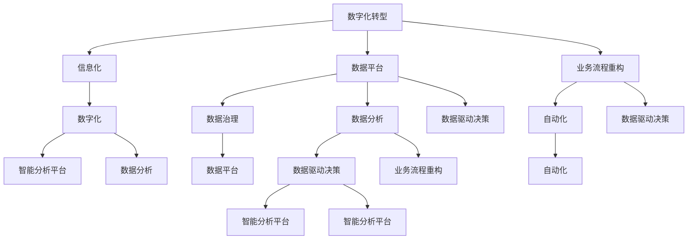
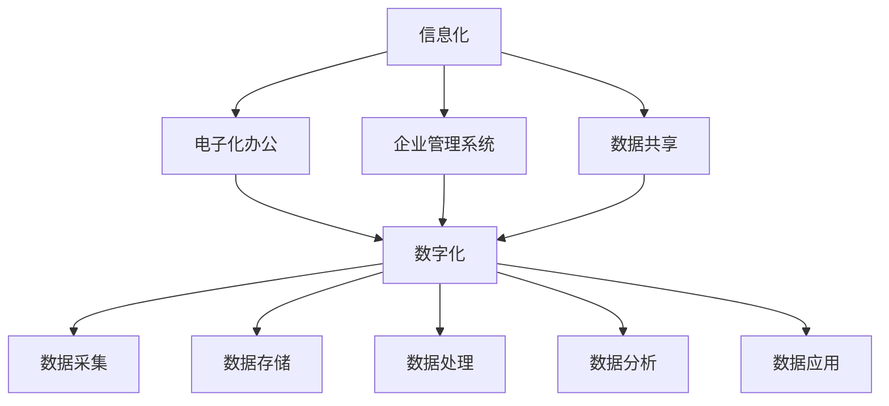

                 

### 《数智化赋能：持续梳理业务体系，从数字化、信息化角度整合业务流，通过构建数据平台，提升业务结果的可监测度和自动化深度分析能力，为业务决策提供有力支持》的目录大纲

在撰写本文之前，我们需要对全文的结构进行详细的规划和梳理。本文将围绕数智化的概念、理论基础、实施方法以及未来展望进行探讨。为了保证文章的逻辑清晰和读者易于理解，我们将其分为以下几个主要部分：

#### 第一部分：数智化理论基础

本部分将介绍数智化的基本概念，包括数字化转型的定义、信息化与数字化的区别，以及数据平台架构设计的原则。这部分内容将为读者建立数智化的基础知识框架。

##### 第1章：数智化概述

- **1.1 数字化转型与企业战略**
  - 详细解释数字化转型的概念，分析其在企业战略中的重要性。
  - 探讨企业数字化转型的战略框架，包括关键步骤和实施策略。

- **1.2 信息化与数字化区别与联系**
  - 分析信息化与数字化的定义及其区别。
  - 探讨数字化如何促进信息化的发展。

- **1.3 数据平台架构设计原则**
  - 介绍数据平台的基本架构，讨论设计数据平台的关键原则。
  - 分析数据平台的实施步骤，确保平台的可行性和高效性。

##### 第2章：数据治理与质量

本部分将深入讨论数据治理的重要性、数据质量管理的具体方法，以及数据安全管理的基本概念。这部分内容将帮助读者理解数据在数智化中的核心作用。

- **2.1 数据治理的重要性**
  - 解释数据治理的定义和目的，探讨其在数智化中的关键作用。

- **2.2 数据质量管理方法**
  - 详细介绍数据质量评估的指标，提供数据质量改进的措施。

- **2.3 数据安全管理**
  - 分析数据安全的基本概念，讨论数据安全防护措施和隐私保护的法律规范。

##### 第3章：数据分析与可视化

本部分将介绍数据分析的基本原理、数据可视化技术，以及数据分析在实际案例中的应用。这部分内容将帮助读者理解如何利用数据分析提升业务价值。

- **3.1 数据分析的基本原理**
  - 介绍数据分析的方法与工具，解释数据分析的流程。

- **3.2 数据可视化技术**
  - 探讨数据可视化的重要性，介绍常见的数据可视化工具和设计原则。

- **3.3 数据分析案例研究**
  - 分析一个实际的企业数据分析案例，展示数据分析的结果和应用。

#### 第二部分：业务流程优化与自动化

本部分将探讨业务流程重构与优化的方法、业务流程自动化的实施步骤，以及数据驱动决策的基本概念。这部分内容将帮助读者理解如何通过数智化提升业务效率。

##### 第4章：业务流程重构与优化

- **4.1 业务流程重构方法**
  - 详细解释业务流程重构的概念，分析其步骤和工具。

- **4.2 业务流程优化策略**
  - 探讨流程优化的目标和指标，提供流程优化方法与实践。

- **4.3 业务流程自动化**
  - 介绍自动化的概念和分类，讨论自动化工具与技术的应用。

##### 第5章：数据驱动决策

- **5.1 数据驱动决策的基本概念**
  - 解释数据驱动决策的定义，分析其优势。

- **5.2 决策支持系统（DSS）设计**
  - 介绍DSS的功能与结构，讨论DSS的开发方法。

- **5.3 数据分析在决策中的应用**
  - 分析数据分析在战略决策、运营决策和风险管理中的应用。

##### 第6章：智能分析平台建设

本部分将介绍智能分析平台的概念与架构、关键技术，以及实际实施案例。这部分内容将帮助读者了解如何构建智能分析平台以支持数智化业务。

- **6.1 智能分析平台的概念与架构**
  - 详细解释智能分析平台的基本概念，分析其架构设计。

- **6.2 智能分析平台关键技术**
  - 探讨数据采集与处理技术、数据存储与检索技术以及数据分析与挖掘技术。

- **6.3 智能分析平台实施案例**
  - 分析一个企业智能分析平台建设实践，讨论关键问题和解决方案。

##### 第7章：数智化赋能实践与展望

本部分将探讨数智化赋能在不同行业中的应用案例、成功实践以及未来的发展趋势。这部分内容将为读者提供对数智化赋能的全面了解。

- **7.1 数智化赋能案例研究**
  - 分析数智化赋能在不同行业中的应用案例。

- **7.2 数智化赋能的未来展望**
  - 探讨数智化赋能的发展趋势，分析新技术对数智化赋能的推动作用。

#### 附录

本附录部分将提供数智化赋能的相关工具与资源，包括数据分析与可视化工具、数据库与数据仓库技术，以及数据安全与隐私保护的相关资源。同时，还将提供数智化赋能的参考案例，以供读者参考。

- **附录A：数智化赋能工具与资源**
  - 提供常见的数据分析与可视化工具，数据库与数据仓库技术，以及数据安全与隐私保护的相关资源。

- **附录B：数智化赋能参考案例**
  - 分享数智化赋能的典型成功案例，提供企业数智化赋能的实践经验。

通过以上结构的详细规划和梳理，我们希望能够为读者呈现一篇内容丰富、逻辑清晰、结构紧凑的专业技术博客文章，帮助读者全面了解数智化的概念、实施方法和未来发展趋势。

#### 核心概念与联系

在深入探讨数智化的理论基础之前，我们需要明确几个核心概念，并了解它们之间的联系。以下是本文将涉及的一些关键概念及其关系：

1. **数字化转型**：数字化转型是指企业通过引入数字技术来改变其商业模式、运营流程和组织结构，以实现业务增长和效率提升。数字化转型是数智化的前提和基础。

2. **信息化**：信息化是指企业通过计算机技术和网络通信技术来提高业务效率和数据处理能力。信息化是数字化转型的早期阶段，为数字化转型提供了技术和数据基础。

3. **数字化**：数字化是指将物理世界的数据和过程转换为数字形式，以便更好地存储、处理和分析。数字化是实现信息化的关键，也是数智化的重要组成部分。

4. **数据平台**：数据平台是一个集数据采集、存储、处理、分析和共享于一体的系统。数据平台为企业的数字化和数智化提供了数据基础设施。

5. **数据治理**：数据治理是指通过制定政策、标准和流程来管理数据，确保数据的质量、安全性和合规性。数据治理是数据平台的核心，对于实现数智化至关重要。

6. **数据分析**：数据分析是指使用统计方法和工具对数据进行处理和分析，以提取有价值的信息和洞察。数据分析是数智化的关键环节，为业务决策提供了支持。

7. **业务流程重构**：业务流程重构是指对企业的业务流程进行根本性的重新设计和优化，以提高效率和灵活性。业务流程重构是数字化转型和数智化的重要步骤。

8. **自动化**：自动化是指通过技术手段减少人工干预，提高业务流程的自动化程度。自动化是数智化的目标之一，有助于提高业务效率和降低成本。

9. **数据驱动决策**：数据驱动决策是指基于数据分析和数据可视化，使用数据来指导业务决策。数据驱动决策是数智化的核心，有助于提高决策的科学性和准确性。

10. **智能分析平台**：智能分析平台是一个集数据采集、处理、分析和可视化于一体的系统，用于支持数据驱动决策和业务优化。智能分析平台是数智化的核心技术之一。

以上概念之间存在着紧密的联系和相互影响。数字化转型和信息化的实施为数字化奠定了基础，数据平台和数据治理为数据的有效管理和利用提供了保障，数据分析、业务流程重构和自动化则将数据转化为实际的业务价值，数据驱动决策和智能分析平台则为决策提供了数据支持，推动了数智化的进一步发展。

为了更好地理解这些概念，我们可以使用Mermaid流程图来展示它们之间的关系：



通过这个流程图，我们可以清晰地看到数智化各个组成部分之间的逻辑关系，以及它们如何相互协作，共同推动企业的数智化进程。

### 第1章：数智化概述

#### 1.1 数字化转型与企业战略

数字化转型已经成为当今企业提升竞争力、实现持续增长的关键战略。数字化转型（Digital Transformation）是指企业通过应用数字技术和创新手段，对业务模式、流程、组织结构和客户体验进行全面重塑和升级的过程。数字化转型不仅是技术层面的变革，更是一种深层次的战略调整，它能够帮助企业实现以下目标：

1. **提升效率**：通过自动化和智能化手段，减少人工干预，优化业务流程，提高工作效率和响应速度。
2. **创新业务模式**：借助数字化工具和平台，企业可以探索新的商业模式，如在线服务、共享经济等，开拓新的市场机会。
3. **优化客户体验**：通过大数据分析和个性化服务，企业能够更好地了解和满足客户需求，提升客户满意度和忠诚度。
4. **降低成本**：数字化技术的应用可以减少运营成本，提高资源利用率，实现成本优化。
5. **增强竞争力**：通过数字化转型，企业可以快速适应市场变化，保持竞争优势，抢占市场份额。

**企业数字化转型的战略框架**通常包括以下几个关键步骤：

1. **愿景规划**：明确企业的数字化转型目标，制定长期愿景和战略规划。
2. **现状评估**：对当前业务流程、技术能力和数据资源进行全面评估，识别现有问题和发展瓶颈。
3. **目标设定**：根据现状评估结果，设定具体、可量化的数字化转型目标和里程碑。
4. **组织调整**：调整组织结构，建立跨部门协同机制，培养数字化人才，确保转型过程顺利进行。
5. **技术选型**：选择合适的技术和工具，包括云计算、大数据、人工智能、物联网等，构建数字化基础设施。
6. **试点实施**：在关键业务领域进行试点应用，验证数字化转型方案的有效性。
7. **全面推广**：根据试点结果，逐步扩大数字化转型的范围，实现全面推广和落地。
8. **持续优化**：持续监控和评估数字化转型效果，根据反馈进行优化和调整，确保数字化转型持续有效。

**数字化转型的挑战与机遇**：

- **挑战**：
  - 技术选型与实施难度：数字化转型涉及多种新技术，选择合适的技术和工具具有一定的挑战性。
  - 文化变革与人才短缺：数字化转型需要企业内部文化的变革，同时也需要具备数字化技能的人才。
  - 风险管理：数字化转型过程中可能会面临数据泄露、系统故障等风险，需要建立有效的风险管理体系。
  - 资源分配：数字化转型的投入较大，需要合理分配资源，确保投入产出比。

- **机遇**：
  - 市场机会：数字化转型为企业提供了新的市场机会，如新兴市场的开拓、业务模式的创新等。
  - 技术进步：随着云计算、大数据、人工智能等技术的快速发展，数字化转型有了更多的技术支撑。
  - 数据驱动：数字化转型使得企业能够更好地利用数据，实现数据驱动决策，提高业务效率。
  - 竞争优势：通过数字化转型，企业可以提升竞争力，实现持续增长，保持行业领先地位。

总之，数字化转型是企业应对当前和未来市场竞争的关键战略。通过科学的规划、有效的实施和持续的优化，企业可以在数字化时代中取得成功，实现可持续的增长和发展。

#### 1.2 信息化与数字化区别与联系

信息化和数字化是两个常被提及但容易混淆的概念。理解二者的定义及其区别，有助于我们更好地把握企业在不同发展阶段的技术应用和战略方向。

**信息化**：信息化是指企业通过计算机技术和通信技术对业务流程进行自动化和电子化处理，以提高效率和降低成本。信息化主要集中在业务流程的优化和数据的电子化存储、处理，是数字化转型的早期阶段。信息化通常涉及以下内容：

- **电子化办公**：使用电子邮件、办公自动化软件等实现业务流程的电子化。
- **企业管理系统**：如ERP（企业资源计划）、CRM（客户关系管理）等，用于集成和管理企业的各种业务数据。
- **数据共享**：通过内部网络实现数据在不同部门之间的共享和协同。

信息化为企业提供了基础的数据处理能力，是数字化转型的重要前提。

**数字化**：数字化是指将物理世界的数据和过程转换为数字形式，以便于存储、处理、分析和共享。数字化不仅包括数据的电子化，还包括数据的结构化、数据融合和数据挖掘等更高级的数据处理技术。数字化涵盖了从数据采集、存储、处理到分析应用的全过程，是信息化发展的更高阶段。数字化通常涉及以下内容：

- **数据采集**：通过传感器、物联网设备等实时采集物理世界的数据。
- **数据存储**：使用数据库、数据仓库等技术存储和管理海量数据。
- **数据处理**：通过大数据处理技术对数据进行清洗、转换和整合。
- **数据分析**：利用数据分析和挖掘技术提取有价值的信息和洞察。
- **数据应用**：将分析结果应用到业务决策和流程优化中，实现数据驱动。

信息化和数字化虽然在不同阶段有明确的区别，但它们之间有着紧密的联系和相互作用：

1. **基础与拓展**：信息化为数字化提供了基础的数据处理和存储能力，而数字化则在此基础上进行数据的深层次处理和分析，实现更高的业务价值。

2. **技术演进**：信息化主要依赖于计算机技术和通信技术，而数字化则更多地依赖于云计算、大数据、人工智能等新兴技术，随着技术不断演进，数字化将成为企业信息处理的主要形式。

3. **应用场景**：信息化主要应用于企业内部的管理和流程优化，而数字化则扩展到企业外部的业务场景，如客户服务、市场分析等，实现更广泛的数据应用。

4. **目标导向**：信息化侧重于提高效率和降低成本，而数字化则更加注重通过数据驱动实现业务创新和增长。

为了更好地理解信息化和数字化的区别和联系，我们可以通过以下Mermaid流程图来展示它们之间的关系：



通过这个流程图，我们可以清晰地看到信息化和数字化在不同阶段的应用和技术演进，以及它们之间的基础与拓展关系。信息化是数字化的基础，而数字化则是信息化的拓展和深化，共同推动企业的数智化进程。

#### 1.3 数据平台架构设计原则

数据平台是数智化的核心基础设施，其架构设计直接影响到数据管理、业务分析和决策支持的效果。在构建数据平台时，需要遵循以下关键原则，以确保平台的可行性、高效性和扩展性：

**1. 需求导向**

数据平台的架构设计应基于业务需求，充分考虑企业的战略目标和业务场景。在需求分析阶段，需要与业务部门紧密合作，明确数据平台需要支持的数据类型、处理能力、性能要求和安全需求。只有满足业务需求，数据平台才能真正为企业带来价值。

**2. 标准化**

标准化是数据平台架构设计的基础，包括数据标准、技术标准和流程标准。数据标准确保数据的格式、命名和定义一致，便于数据共享和整合。技术标准则涵盖数据采集、存储、处理和分析等各个环节的技术规范，保证技术实现的统一和兼容性。流程标准明确数据流转、处理和应用的步骤和规范，提高业务流程的自动化和标准化水平。

**3. 分布式**

分布式架构能够提高数据平台的处理能力和可靠性。通过分布式存储和计算，数据平台可以横向扩展，支持海量数据的存储和处理。分布式架构还能够提高系统的容错性和高可用性，确保在节点故障时系统的正常运行。分布式技术包括分布式数据库、分布式文件系统、分布式计算框架等，如Hadoop、Spark等。

**4. 可扩展性**

数据平台应具备良好的扩展性，以适应业务规模和数据量的增长。扩展性包括水平扩展和垂直扩展。水平扩展通过增加节点数量来提高系统处理能力和存储容量，而垂直扩展则通过提高单个节点的性能来实现。数据平台的设计应考虑未来的扩展需求，预留足够的扩展接口和容量，以便在业务规模扩大时快速扩展。

**5. 安全性**

数据平台的安全性是保障数据安全的重要环节。数据平台应具备严格的安全机制，包括数据加密、访问控制、安全审计等。数据加密可以保护数据在传输和存储过程中的安全性，访问控制确保只有授权用户可以访问数据，安全审计则用于监控和记录数据访问行为，及时发现和处理安全事件。

**6. 高性能**

高性能是数据平台的关键要求之一，特别是对于需要实时处理和分析大量数据的场景。数据平台应采用高性能的技术和架构，如分布式计算框架、内存计算、缓存技术等，以提高数据处理的效率和响应速度。此外，数据平台的架构设计还应考虑系统的可优化性，以便在性能瓶颈出现时进行优化和调整。

**7. 易用性**

易用性是数据平台设计的重要方面，直接影响用户的使用体验和操作效率。数据平台应提供直观、友好的用户界面，简化数据操作流程，提供便捷的数据查询、分析和可视化功能。同时，数据平台还应提供丰富的文档和帮助指南，帮助用户快速上手和熟练使用。

**数据平台的基本架构**

数据平台的基本架构通常包括以下几个主要部分：

1. **数据采集层**：负责收集各类数据源的数据，如企业内部系统、物联网设备、社交媒体等。数据采集层应具备高效的数据采集和转换能力，支持多种数据格式的采集。

2. **数据存储层**：用于存储和管理海量数据，包括关系型数据库、分布式数据库、数据仓库、数据湖等。数据存储层应具备高可靠性、高性能和可扩展性，支持数据的持久化存储和快速检索。

3. **数据处理层**：负责对数据进行清洗、转换、整合和计算，提供数据预处理和分析服务。数据处理层通常采用分布式计算框架，如Hadoop、Spark等，支持大规模数据处理和实时计算。

4. **数据应用层**：提供数据分析和可视化工具，支持用户对数据进行查询、分析和可视化。数据应用层包括报表系统、数据仪表板、数据挖掘和分析平台等。

5. **数据管理层**：负责数据的安全、质量控制、备份和恢复等管理任务。数据管理层包括数据治理工具、数据安全工具、数据备份和恢复系统等。

**数据平台设计的关键原则**

在数据平台的设计过程中，需要遵循以下关键原则：

- **模块化**：将数据平台的功能模块化，便于系统的维护和扩展。
- **解耦合**：通过解耦合设计，降低不同模块之间的依赖性，提高系统的灵活性和可维护性。
- **松耦合**：在模块之间采用松耦合设计，减少直接依赖，提高系统的可扩展性和可移植性。
- **重用性**：设计可重用的组件和模块，减少重复开发，提高开发效率和系统的一致性。
- **可监控性**：设计系统监控和报警机制，实时监控数据平台的运行状态和性能，及时发现问题并进行优化。

通过遵循上述原则和设计架构，构建的数据平台将能够为企业提供高效、可靠的数据基础设施，支持业务的数字化转型和数智化发展。

#### 1.4 数据治理的重要性

数据治理（Data Governance）是确保数据质量、安全性和合规性的关键环节，对于企业实现数智化目标具有重要意义。数据治理涉及一系列政策、流程和技术，旨在通过有效的管理和控制，确保数据在整个生命周期内的一致性、准确性和可用性。以下是数据治理的重要性及其核心要素：

**数据治理的重要性**：

1. **确保数据质量**：高质量的数据是企业决策的基础。数据治理通过制定数据标准和流程，确保数据的准确性、完整性和一致性，减少数据错误和不一致，提高数据可信度。

2. **提高数据安全性**：数据治理包括数据安全策略的制定和实施，确保数据在存储、传输和处理过程中的安全性。通过数据加密、访问控制、权限管理等措施，保护数据免受未经授权的访问和泄露。

3. **符合法律法规**：在全球范围内，数据隐私和合规性要求越来越严格。数据治理帮助企业在处理个人数据时遵守相关法律法规，如《通用数据保护条例》（GDPR）和《加州消费者隐私法案》（CCPA），降低合规风险。

4. **促进数据共享和整合**：通过数据治理，企业可以建立统一的数据标准和模型，促进不同部门、系统和业务线之间的数据共享和整合，提高数据的利用效率。

5. **支持业务决策**：高质量的数据和有效的数据治理为业务决策提供了可靠的数据支持。通过数据分析和可视化，企业可以更准确地识别业务机会和风险，优化业务流程和策略。

**数据治理的核心要素**：

1. **数据政策**：数据政策是数据治理的基础，明确企业数据管理的目标和原则，包括数据所有权、数据使用、数据共享和数据隐私等方面的规定。

2. **数据标准**：数据标准是确保数据一致性和可互操作性的一系列规范，涵盖数据定义、数据格式、数据命名和数据分类等方面。数据标准有助于统一不同系统和业务线之间的数据格式，提高数据交换和整合的效率。

3. **数据流程**：数据流程是数据管理的基本流程，包括数据采集、数据存储、数据清洗、数据转换、数据分析和应用等环节。通过明确的数据流程，企业可以确保数据在各个处理环节中的质量，提高数据处理效率。

4. **数据质量**：数据质量是数据治理的核心，包括数据准确性、完整性、一致性、及时性和可靠性等方面的指标。通过数据质量监控和改进措施，企业可以持续提升数据的整体质量，确保数据在业务决策中的可靠性。

5. **数据安全**：数据安全是数据治理的重要方面，包括数据加密、访问控制、权限管理、安全审计等方面的措施。数据安全策略确保数据在存储、传输和处理过程中的安全性，防止数据泄露和未经授权的访问。

6. **数据合规**：数据合规性要求企业遵守相关法律法规和标准，确保数据处理的合法性和合规性。数据治理团队需要定期审查和更新数据政策、流程和标准，确保符合最新的法律法规要求。

**数据治理的实施策略**：

1. **建立数据治理团队**：数据治理需要一个跨部门、跨职能的数据治理团队，负责制定和执行数据治理政策、流程和标准。

2. **制定数据治理政策**：明确数据治理的目标、范围和责任，制定数据政策、标准和流程，确保数据管理的统一和规范化。

3. **培训和宣传**：对员工进行数据治理的培训和宣传，提高员工的数据治理意识和能力，确保数据治理政策得到有效执行。

4. **数据质量监控**：建立数据质量监控体系，定期检查数据质量，发现和解决数据质量问题，确保数据的准确性、完整性和一致性。

5. **数据安全防护**：实施数据安全防护措施，包括数据加密、访问控制、权限管理和安全审计等，确保数据在存储、传输和处理过程中的安全性。

6. **持续优化**：数据治理是一个持续的过程，需要根据业务需求和技术变化，不断优化数据治理策略、流程和工具，确保数据治理的有效性和可持续性。

通过有效的数据治理，企业可以建立高质量的数据管理体系，提高数据的利用效率和业务决策的准确性，为企业的数智化发展提供坚实的基础。

#### 2.2 数据质量管理方法

数据质量是数智化成功的关键因素之一，高质量的数据能够支持精准的业务分析、有效的决策制定和优化的运营流程。为了确保数据质量，企业需要采取一系列数据质量管理方法，包括数据质量评估、数据质量改进措施以及数据质量监控。以下将详细探讨这些方法。

**1. 数据质量评估指标**

数据质量评估是确保数据符合业务需求的重要步骤。以下是一些常见的数据质量评估指标：

- **准确性**：数据是否正确反映了真实世界的情况。例如，客户的年龄、地址、订单金额等信息是否准确无误。

- **完整性**：数据是否完整，是否缺少关键字段或记录。例如，客户数据库中是否所有客户的联系方式都填写完整。

- **一致性**：数据在不同系统和应用中是否保持一致。例如，客户名称在不同数据库中的拼写是否相同。

- **及时性**：数据是否在需要的时间内更新和可用。例如，销售订单的更新是否及时传递到库存管理系统。

- **唯一性**：每个记录是否都有唯一的标识。例如，客户数据库中是否每个客户都有唯一的客户ID。

- **可用性**：数据是否便于访问和使用。例如，数据是否可以快速查询，是否支持多种数据格式。

- **符合性**：数据是否符合预定的标准、规范和法规。例如，财务数据是否符合会计准则。

- **可靠性**：数据来源是否可靠，数据是否经过验证。例如，市场调查数据是否来自可信的第三方。

**2. 数据质量改进措施**

为了提升数据质量，企业可以采取以下改进措施：

- **数据清洗**：数据清洗是数据质量改进的重要步骤，包括去除重复记录、纠正错误、填补缺失值等。数据清洗可以使用自动化工具或编写脚本进行。

  ```python
  # 伪代码：使用Python对数据进行清洗
  data = read_data('data_source')  # 读取数据源
  data = remove_duplicates(data)  # 去除重复记录
  data = correct_errors(data)  # 纠正错误
  data = fill_missing_values(data)  # 补充缺失值
  save_data(data, 'cleaned_data')  # 保存清洗后的数据
  ```

- **数据标准化**：通过制定数据标准，确保数据在不同系统和应用中的一致性。数据标准化包括数据格式的统一、字段命名规范等。

  ```sql
  -- 伪代码：使用SQL对数据进行标准化
  CREATE TABLE standardized_data (
      customer_id INT PRIMARY KEY,
      customer_name VARCHAR(50),
      email VARCHAR(100),
      address VARCHAR(200)
  );
  ```

- **数据验证**：对数据进行验证，确保数据的准确性和完整性。数据验证可以通过编写脚本或使用现成的工具进行。

  ```python
  # 伪代码：使用Python对数据进行验证
  data = validate_data(data, validation_rules)  # 验证数据
  ```

- **数据监控**：建立数据质量监控体系，实时监控数据质量，及时发现和解决问题。数据监控可以使用自动化工具或定期手动检查。

  ```python
  # 伪代码：使用Python对数据质量进行监控
  monitor_data_quality(data, monitoring_interval)  # 监控数据质量
  ```

**3. 数据质量监控与报告**

数据质量监控是确保数据持续符合标准的重要手段。以下是一些数据质量监控和报告的方法：

- **自动化监控**：使用自动化工具定期检查数据质量，自动生成报告和告警。

  ```python
  # 伪代码：使用Python自动化监控数据质量
  schedule_data_quality_check()  # 定期执行数据质量检查
  ```

- **定期报告**：定期生成数据质量报告，总结数据质量的状况和改进措施。

  ```python
  # 伪代码：生成数据质量报告
  generate_data_quality_report(data_quality_metrics)  # 生成报告
  ```

- **问题跟踪**：建立问题跟踪系统，记录数据质量问题，跟踪问题的解决进度和结果。

  ```python
  # 伪代码：记录和跟踪数据质量问题
  log_data_quality_issue(issue, resolution)  # 记录问题
  track_issue_resolution(issue)  # 跟踪问题解决
  ```

通过上述数据质量管理方法，企业可以持续提升数据质量，为数据驱动的业务决策和运营优化提供坚实的数据基础。

#### 2.3 数据安全管理

在数字化的时代，数据安全已经成为企业面临的重大挑战。随着数据量的不断增长和数据价值的提升，数据安全的重要性愈加凸显。数据安全（Data Security）是指通过技术和管理手段，保护数据在存储、传输和处理过程中的机密性、完整性和可用性。以下是数据安全的基本概念、防护措施以及数据隐私保护的法律与规范。

**数据安全的基本概念**

1. **机密性**：确保数据在未经授权的情况下不会被泄露或访问。机密性保护通常通过数据加密、访问控制等技术实现。

2. **完整性**：确保数据在存储、传输和处理过程中不被篡改或损坏。完整性保护通常通过数据签名、校验和等技术实现。

3. **可用性**：确保数据在需要时能够及时、准确地访问和使用。可用性保护通常通过备份与恢复、高可用性架构等技术实现。

4. **身份认证**：确保数据访问者身份的合法性。身份认证通常通过用户名和密码、双因素认证（2FA）等技术实现。

5. **访问控制**：控制不同用户对数据的访问权限，确保数据只被授权用户访问。访问控制通常通过角色权限管理、访问控制列表（ACL）等技术实现。

**数据安全的防护措施**

1. **数据加密**：数据加密是将数据转换为无法被未经授权者解读的密文的过程。加密技术包括对称加密（如AES）和非对称加密（如RSA）。数据加密可以保护数据在存储和传输过程中的机密性。

2. **访问控制**：通过设置访问控制策略，限制用户对数据的访问权限。访问控制策略可以根据用户角色、数据类型、访问时间等因素进行细化。

3. **防火墙和入侵检测系统（IDS）**：防火墙用于监控和控制进出网络的数据流，防止未经授权的访问。入侵检测系统可以实时检测并响应网络攻击。

4. **备份与恢复**：定期备份数据，以便在数据丢失或损坏时进行恢复。备份可以采用本地备份和云备份相结合的方式，提高数据的可用性和恢复速度。

5. **安全审计**：通过记录和监控用户对数据的访问和操作，发现潜在的安全漏洞和违规行为。安全审计可以帮助企业及时发现和纠正安全风险。

6. **安全培训与意识提升**：定期对员工进行安全培训，提高员工的安全意识和操作规范，减少人为错误导致的安全事件。

**数据隐私保护的法律与规范**

1. **《通用数据保护条例》（GDPR）**：GDPR是欧盟制定的数据隐私保护法规，适用于在欧盟内收集、处理和存储个人数据的组织。GDPR规定了数据主体（个人）的权利、数据控制者和处理者的义务以及数据泄露的通知要求。

2. **《加州消费者隐私法案》（CCPA）**：CCPA是美国的隐私保护法规，旨在保护加州居民的个人信息。CCPA规定了个人信息收集、使用和共享的要求，以及消费者对个人信息访问、删除和拒绝销售的权利。

3. **《个人信息保护法》（PIPL）**：PIPL是中国制定的数据隐私保护法规，旨在规范个人信息处理活动，保护个人信息权益。PIPL规定了个人信息处理的原则、个人信息保护义务以及个人信息主体（个人）的权利。

4. **其他国家和地区的数据隐私保护法规**：包括《隐私法》（Privacy Act）、《个人信息保护和管理法》（Privacy and Personal Information Protection Law）等，不同国家和地区的法规侧重点和适用范围有所不同。

**数据隐私保护的最佳实践**

1. **隐私设计**：在系统设计和开发阶段，将隐私保护考虑在内，采用隐私设计原则，如最小化数据收集、数据匿名化、数据最小化等。

2. **数据泄露响应计划**：制定数据泄露响应计划，明确数据泄露事件的应急响应流程、报告机制和责任分配。

3. **持续监控与评估**：定期对数据安全措施进行评估和改进，确保数据安全策略能够应对新的威胁和漏洞。

通过上述措施，企业可以有效地保护数据安全，降低数据泄露和滥用的风险，确保数据隐私得到充分保护。

### 3.1 数据分析的基本原理

数据分析是数智化的重要组成部分，通过统计方法和工具对数据进行处理和分析，提取有价值的信息和洞察，从而支持业务决策和优化。以下是数据分析的基本原理，包括常用的方法与工具、数据分析的流程以及数据分析中常见的问题与解决方案。

**数据分析的方法与工具**

1. **描述性分析**：描述性分析主要用于总结数据的基本特征，如数据的分布、中心趋势和离散程度。常用的工具包括统计表格、直方图、饼图、箱线图等。

2. **诊断性分析**：诊断性分析用于识别数据中的异常和趋势，找出数据背后的原因。常用的方法包括回归分析、相关分析、聚类分析等。

3. **预测性分析**：预测性分析利用历史数据建立预测模型，预测未来的趋势和结果。常用方法包括时间序列分析、回归分析、机器学习等。

4. **描述性分析**：描述性分析主要用于总结数据的基本特征，如数据的分布、中心趋势和离散程度。常用的工具包括统计表格、直方图、饼图、箱线图等。

5. **诊断性分析**：诊断性分析用于识别数据中的异常和趋势，找出数据背后的原因。常用的方法包括回归分析、相关分析、聚类分析等。

6. **预测性分析**：预测性分析利用历史数据建立预测模型，预测未来的趋势和结果。常用方法包括时间序列分析、回归分析、机器学习等。

**数据分析的流程**

1. **数据收集**：收集相关数据，可以是结构化数据（如数据库）或非结构化数据（如文本、图像、视频）。

2. **数据清洗**：对数据进行预处理，去除噪声、填补缺失值、纠正错误等，提高数据质量。

3. **数据探索**：使用描述性统计和可视化工具对数据进行分析，探索数据的基本特征和趋势。

4. **建立模型**：根据业务需求和数据分析目标，选择合适的统计方法或机器学习算法建立预测或分类模型。

5. **模型评估**：使用交叉验证、A/B测试等方法评估模型性能，确保模型的准确性和可靠性。

6. **模型应用**：将模型应用到实际业务场景中，如预测未来销售趋势、优化库存管理、个性化推荐等。

**数据分析中的常见问题与解决方案**

1. **数据质量差**：解决方案：进行数据清洗，去除噪声和错误，确保数据质量。

2. **数据缺失**：解决方案：使用数据填补技术（如平均值填补、插值法）或删除缺失值，减少数据缺失对分析结果的影响。

3. **数据不均匀分布**：解决方案：使用数据标准化方法（如Z分数、Min-Max标准化）或数据转换技术（如对数转换），使数据分布更加均匀。

4. **模型选择不当**：解决方案：根据数据特征和业务需求，选择合适的模型或结合多种模型进行综合分析。

5. **过拟合**：解决方案：通过交叉验证、正则化等技术防止模型过拟合，提高模型的泛化能力。

6. **数据隐私问题**：解决方案：采用数据匿名化、差分隐私等技术保护数据隐私，确保数据分析的合规性。

通过以上方法与工具、流程和解决方案，企业可以有效地进行数据分析，提取有价值的信息和洞察，支持业务决策和优化，实现数智化目标。

### 3.2 数据可视化技术

数据可视化是将复杂的数据通过图形和图表的方式展现出来，帮助人们更直观地理解和分析数据。数据可视化技术在数据分析和决策支持中发挥着重要作用，能够提高数据的可读性、揭示数据中的隐藏模式、发现潜在问题，从而支持业务决策。以下将详细探讨数据可视化技术的重要性、常见的数据可视化工具以及设计原则。

**数据可视化技术的重要性**

1. **提高数据可读性**：通过图形和图表展示数据，可以大幅降低数据理解的难度，使非专业人士也能轻松获取数据信息。

2. **揭示数据中的隐藏模式**：数据可视化能够发现数据中的异常值、趋势和关联，揭示隐藏在数据背后的模式，帮助识别业务中的问题。

3. **支持决策制定**：通过直观的数据展示，决策者可以快速理解数据，基于数据做出更加准确和有效的决策。

4. **沟通与协作**：数据可视化是一种有效的沟通工具，可以帮助团队成员和利益相关者更好地理解数据，促进协作和共识。

5. **增强报告效果**：数据可视化可以增强报告的视觉效果，使报告更加生动和引人注目，提高报告的质量和影响力。

**常见的数据可视化工具**

1. **Tableau**：Tableau是一款强大的数据可视化工具，支持多种数据连接方式，提供丰富的图表类型和交互功能。

2. **Power BI**：Power BI是微软推出的商业智能平台，具备强大的数据连接、数据建模和可视化功能。

3. **QlikView**：QlikView是一款敏捷的数据可视化工具，支持实时分析和数据探索，适合复杂的数据分析场景。

4. **D3.js**：D3.js是一个基于JavaScript的可视化库，可以创建高度交互和复杂的可视化图表，适用于Web开发。

5. **ECharts**：ECharts是一个开源的JavaScript图表库，提供多种图表类型和丰富的配置选项，易于集成和使用。

**数据可视化设计原则**

1. **简单性**：设计简洁直观的图表，避免过多复杂的细节和冗余信息，使数据一目了然。

2. **一致性**：保持图表风格和色彩的一致性，使用统一的命名和标签，提高数据可视化的可读性。

3. **对比性**：通过对比不同数据点或时间序列，突出数据的差异和趋势，帮助用户快速识别关键信息。

4. **交互性**：提供交互功能，如筛选、钻取和联动，使用户能够动态地探索数据，发现更多洞察。

5. **准确性**：确保图表展示的数据准确无误，避免误导用户，保持数据的一致性和可信性。

6. **上下文**：提供上下文信息，如数据来源、数据定义和时间范围，帮助用户更好地理解数据的背景和含义。

**案例研究**

以一家电子商务公司为例，该公司希望通过数据可视化技术分析销售数据，以优化营销策略和库存管理。以下是该公司在数据可视化方面的一些实践：

1. **销售趋势分析**：使用折线图展示不同时间段内的销售额，帮助公司识别销售高峰和低谷，调整营销策略。

2. **产品表现对比**：使用条形图或饼图展示不同产品的销售表现，识别高销量和低销量产品，优化库存配置。

3. **用户行为分析**：使用热力图展示用户在网站上的活动轨迹，识别热门页面和用户停留时间，优化用户体验。

4. **营销效果评估**：使用雷达图或散点图展示不同营销活动的效果，评估营销策略的有效性。

通过这些数据可视化实践，该公司能够更直观地理解销售数据，发现潜在问题和机会，从而制定更有效的业务决策，提升整体运营效率。

### 3.3 数据分析案例研究

为了更好地展示数据分析在现实业务中的应用，我们将以一家电子商务公司为例，详细探讨其如何利用数据分析提升业务价值。通过这个案例研究，我们将深入分析数据收集、数据处理、数据分析和结果应用的全过程，并探讨数据分析在实际业务中的重要性。

**1. 数据收集**

电子商务公司的数据分析始于数据收集，收集的数据类型包括销售数据、用户行为数据、营销活动数据、库存数据等。具体数据来源如下：

- **销售数据**：来自公司的电子商务平台，包括销售额、订单数量、订单状态等。
- **用户行为数据**：通过网站日志、点击流数据、用户反馈等收集，包括页面访问次数、用户停留时间、跳出率、用户路径等。
- **营销活动数据**：包括各类营销活动的投放效果，如广告点击率、转化率、花费等。
- **库存数据**：来自公司的仓储管理系统，包括库存数量、库存状态、库存周转率等。

**2. 数据处理**

在收集到数据后，电子商务公司需要进行数据预处理，以确保数据的质量和一致性。数据预处理包括以下步骤：

- **数据清洗**：去除重复数据、纠正错误、填补缺失值等，确保数据的准确性和完整性。
- **数据整合**：将不同来源的数据进行整合，建立统一的数据模型，便于后续的数据分析。
- **数据转换**：将数据转换为适合分析的工具或格式，如将文本数据转换为数字或分类数据。

**3. 数据分析**

在数据处理完成后，电子商务公司利用数据分析工具进行数据挖掘和统计分析，以获取有价值的信息和洞察。以下是几个关键的数据分析步骤：

- **销售趋势分析**：通过时间序列分析，电子商务公司可以了解不同时间段内的销售额和订单数量变化，识别销售高峰和低谷。例如，通过折线图，公司发现周末和节假日是销售高峰期，而在周一和周二销售相对较低。基于这一分析结果，公司可以调整营销策略，如增加周末的促销活动，提高周末销售额。

- **用户行为分析**：通过点击流数据和行为分析，电子商务公司可以了解用户在网站上的活动路径和偏好。例如，通过热力图分析，公司发现某些页面（如产品详情页）的跳出率较高，用户在页面上停留时间较短。基于这一分析结果，公司可以优化页面设计，提高用户的互动性和满意度。

- **营销活动效果评估**：通过A/B测试和对比分析，电子商务公司可以评估不同营销活动的效果，确定哪些活动更受欢迎、转化率更高。例如，通过对比不同广告投放的效果，公司发现某些广告的点击率和转化率较高，而另一些广告则效果不佳。基于这一分析结果，公司可以调整广告策略，增加高转化的广告投放。

- **库存管理优化**：通过库存数据分析，电子商务公司可以优化库存配置，减少库存积压和缺货情况。例如，通过分析库存周转率和销售预测，公司可以提前调整库存水平，避免库存过多或不足的情况。通过这样的优化，公司能够提高库存周转率，降低库存成本。

**4. 数据分析结果与应用**

通过上述数据分析，电子商务公司得到了一系列有价值的洞察，并采取了相应的行动：

- **销售策略调整**：基于销售趋势分析，公司增加了周末的促销活动，提高了周末销售额，整体销售额有所增长。
- **用户体验优化**：通过用户行为分析，公司优化了页面设计和用户路径，提高了用户的互动性和满意度，降低了跳出率。
- **营销策略优化**：基于营销活动效果评估，公司调整了广告投放策略，增加了高转化的广告投放，提高了广告效果和ROI。
- **库存管理优化**：通过库存管理优化，公司减少了库存积压和缺货情况，提高了库存周转率，降低了库存成本。

**5. 数据分析的价值评估**

数据分析为电子商务公司带来了明显的业务价值：

- **销售收入增长**：通过优化销售策略和营销活动，公司实现了销售收入的增长，提高了盈利能力。
- **用户体验提升**：通过优化页面设计和用户路径，公司提高了用户的满意度和忠诚度，增加了复购率。
- **成本降低**：通过库存管理优化，公司降低了库存成本，提高了运营效率。
- **决策支持**：通过数据分析，公司能够更好地了解市场动态和用户需求，做出更加准确和科学的业务决策。

综上所述，数据分析在电子商务公司的业务中发挥了重要作用，通过数据收集、处理、分析和结果应用，公司能够持续优化业务流程，提高运营效率，实现业务增长。这一案例研究展示了数据分析在现实业务中的应用价值，为其他企业提供了有益的借鉴和启示。

### 4.1 业务流程重构方法

业务流程重构（Business Process Reengineering, BPR）是一种系统的、全面的业务流程优化方法，旨在通过重新设计企业的核心业务流程，提高效率、降低成本、提升服务质量。BPR的核心思想是打破旧的流程和组织结构，重新构建一个以客户为中心、高效灵活的全新业务模式。以下是业务流程重构的具体方法、步骤和技术。

**业务流程重构的方法**

1. **流程映射**：流程映射是业务流程重构的第一步，旨在详细记录和描绘当前业务流程，了解流程的每一个环节和参与人员。通过流程映射，企业可以清晰地看到业务流程中的瓶颈、冗余和低效环节。

2. **流程分析**：在流程映射的基础上，对现有业务流程进行深入分析，识别流程中的问题、瓶颈和改进机会。流程分析可以采用流程效率分析、成本分析、客户需求分析等方法，为后续的流程重构提供依据。

3. **流程设计**：根据流程分析的结果，设计新的业务流程。新的流程应围绕客户需求，简化流程步骤，提高流程的灵活性和响应速度。流程设计可以采用价值流图、 swimlane图等工具，确保流程的合理性和可操作性。

4. **流程实施**：将新的业务流程付诸实施，包括流程培训、流程试点和全面推进。在实施过程中，需要确保流程的顺利运行，并及时解决出现的问题。

5. **流程评估**：对新的业务流程进行评估，包括流程效率、成本、服务质量等方面的评估。通过流程评估，企业可以了解流程重构的效果，为进一步优化提供方向。

**业务流程重构的步骤**

1. **项目启动**：确定业务流程重构的项目目标、范围和时间表，组建项目团队，明确项目成员的职责和任务。

2. **现状分析**：通过流程映射和流程分析，了解当前业务流程的现状，识别问题和改进机会。

3. **目标设定**：根据现状分析的结果，设定新的业务流程的目标，包括流程效率、成本、服务质量等。

4. **流程设计**：在目标设定的基础上，设计新的业务流程。流程设计应充分考虑客户的实际需求，简化流程步骤，提高流程的灵活性和响应速度。

5. **流程实施**：实施新的业务流程，包括流程培训、流程试点和全面推进。在实施过程中，需要确保流程的顺利运行，并及时解决出现的问题。

6. **流程评估**：对新的业务流程进行评估，包括流程效率、成本、服务质量等方面的评估。通过流程评估，企业可以了解流程重构的效果，为进一步优化提供方向。

**业务流程重构的工具与技术**

1. **流程映射工具**：如Microsoft Visio、Balsamiq等，用于绘制流程图，记录和展示业务流程。

2. **流程分析工具**：如BPTrends、Prosci等，用于分析流程效率、成本和服务质量。

3. **流程设计工具**：如ARIS Express、BIC Cloud等，用于设计新的业务流程，支持流程建模和模拟。

4. **流程实施工具**：如Oracle BPM、IBM Business Process Manager等，用于流程培训、流程试点和全面推进。

5. **流程评估工具**：如KPI仪表板、数据驱动分析工具等，用于评估流程效率、成本和服务质量。

**实际案例**

以一家制造企业为例，该企业通过业务流程重构，成功优化了生产流程，提高了生产效率。以下是具体的流程重构过程：

1. **现状分析**：通过流程映射和流程分析，企业发现生产流程存在以下问题：生产调度不合理，生产效率低下，库存管理不规范，质量控制不严格。

2. **目标设定**：企业设定了以下目标：提高生产效率20%，降低库存成本10%，提高产品质量合格率95%。

3. **流程设计**：根据目标设定，企业重新设计了生产流程，包括优化生产调度、加强库存管理、提高质量控制。新的流程包括以下步骤：

   - **生产计划**：根据市场需求和生产能力，制定详细的生产计划。
   - **采购与原材料管理**：优化原材料采购流程，确保原材料的及时供应和质量控制。
   - **生产调度**：优化生产调度，确保生产计划的顺利执行。
   - **质量控制**：加强质量控制，确保产品符合质量标准。
   - **库存管理**：规范库存管理，确保库存水平合理，减少库存积压。

4. **流程实施**：企业通过流程培训，让员工了解新的生产流程，并在实际生产中逐步实施。

5. **流程评估**：通过KPI仪表板，企业对新的生产流程进行了评估。结果显示，生产效率提高了25%，库存成本降低了12%，产品质量合格率达到了98%。

通过这个实际案例，我们可以看到业务流程重构在提高生产效率、降低成本和提高产品质量方面的显著效果。业务流程重构不仅是一种优化工具，更是一种持续改进的过程，企业应不断根据市场变化和业务需求，进行流程优化和重构，以保持竞争优势。

### 4.2 业务流程优化策略

业务流程优化（Business Process Optimization, BPO）是企业通过系统的方法和工具，持续改进业务流程，以提高运营效率、降低成本和提升服务质量。业务流程优化策略是企业实现数智化的重要手段之一，能够帮助企业更好地适应市场变化和客户需求。以下是业务流程优化策略的详细分析，包括流程优化的目标与指标、优化方法和实践，以及业务流程优化的案例分析。

**业务流程优化的目标与指标**

1. **提高效率**：通过优化业务流程，减少不必要的环节和重复工作，提高业务处理速度和响应时间。效率提升的目标可以是缩短流程周期、减少处理时间和提高员工的工作效率。

2. **降低成本**：优化业务流程可以减少资源浪费和冗余，降低运营成本。成本降低的目标可以是减少物料消耗、减少人工成本和优化设备利用率。

3. **提升服务质量**：通过优化业务流程，提高客户满意度和服务质量。服务质量提升的目标可以是提高客户满意度、降低客户投诉率和提高产品和服务质量。

4. **增强灵活性**：优化业务流程可以提高企业的灵活性和响应速度，更好地适应市场变化和客户需求。灵活性增强的目标可以是提高流程的敏捷性和适应性。

5. **改进决策质量**：通过优化业务流程，提高数据质量和信息透明度，支持更准确和科学的决策。决策质量改进的目标可以是提高数据准确性、提升决策效率和减少决策错误。

**业务流程优化方法**

1. **流程映射**：流程映射是业务流程优化的第一步，通过详细记录和描述现有业务流程，了解流程的每一个环节和参与人员。流程映射可以帮助企业识别流程中的瓶颈、冗余和低效环节，为后续优化提供依据。

2. **流程分析**：在流程映射的基础上，对现有业务流程进行深入分析，识别流程中的问题、瓶颈和改进机会。流程分析可以采用流程效率分析、成本分析、客户需求分析等方法，为流程优化提供具体方向。

3. **流程设计**：根据流程分析的结果，设计新的业务流程。新的流程应围绕客户需求，简化流程步骤，提高流程的灵活性和响应速度。流程设计可以采用价值流图、swimlane图等工具，确保流程的合理性和可操作性。

4. **流程实施**：将新的业务流程付诸实施，包括流程培训、流程试点和全面推进。在实施过程中，需要确保流程的顺利运行，并及时解决出现的问题。

5. **流程评估**：对新的业务流程进行评估，包括流程效率、成本、服务质量等方面的评估。通过流程评估，企业可以了解流程优化的效果，为进一步优化提供方向。

**业务流程优化实践**

1. **精益生产**：精益生产是一种以最小化浪费、最大化价值为核心的业务流程优化方法。通过消除生产过程中的浪费，如等待时间、运输距离、库存积压等，提高生产效率。精益生产的关键实践包括5S管理、看板管理、持续改进等。

2. **六西格玛**：六西格玛是一种基于统计学原理的流程优化方法，旨在通过减少缺陷和变异，提高流程的稳定性和可靠性。六西格玛的关键实践包括DMAIC（定义、测量、分析、改进、控制）方法、过程控制图、统计过程控制等。

3. **业务流程自动化**：通过引入自动化工具和技术，减少人工干预，提高业务流程的自动化程度。业务流程自动化可以采用机器人流程自动化（RPA）、智能决策支持系统（DSS）等技术，实现业务流程的自动化处理和智能决策。

4. **业务流程管理**：业务流程管理（BPM）是一种通过系统的方法和工具，对业务流程进行规划、设计、执行和监控的方法。通过BPM，企业可以实现对业务流程的全生命周期管理，持续优化业务流程，提高流程效率。

**业务流程优化的案例分析**

以下是一个业务流程优化的实际案例：

**案例背景**：一家大型制造业公司面临生产效率低下、成本高、客户满意度低等问题。为了提升企业的竞争力，公司决定进行业务流程优化。

1. **流程映射**：公司通过流程映射工具，详细记录了当前的生产流程，识别出生产过程中的瓶颈和问题，如设备停机时间过长、生产调度不合理、库存管理不规范等。

2. **流程分析**：公司对现有流程进行了深入分析，发现生产流程中的主要问题包括：设备利用率低、生产调度不合理、库存积压严重、质量控制不严格等。

3. **流程设计**：根据流程分析的结果，公司重新设计了生产流程，包括优化生产调度、加强库存管理、提高质量控制。新的流程设计包括以下步骤：

   - **生产计划**：根据市场需求和生产能力，制定详细的生产计划。
   - **采购与原材料管理**：优化原材料采购流程，确保原材料的及时供应和质量控制。
   - **生产调度**：优化生产调度，确保生产计划的顺利执行。
   - **质量控制**：加强质量控制，确保产品符合质量标准。
   - **库存管理**：规范库存管理，确保库存水平合理，减少库存积压。

4. **流程实施**：公司通过流程培训，让员工了解新的生产流程，并在实际生产中逐步实施。

5. **流程评估**：通过流程评估工具，公司对新的生产流程进行了评估。结果显示，生产效率提高了20%，库存成本降低了15%，产品质量合格率达到了98%。

通过这个实际案例，我们可以看到业务流程优化在提高生产效率、降低成本和提高产品质量方面的显著效果。业务流程优化不仅是一种优化工具，更是一种持续改进的过程，企业应不断根据市场变化和业务需求，进行流程优化和改进，以保持竞争优势。

### 4.3 业务流程自动化

业务流程自动化（Business Process Automation, BPA）是企业利用技术手段减少人工干预，提高业务流程的效率和质量的一种策略。通过自动化，企业可以简化繁琐的流程步骤，减少人为错误，提高响应速度，从而实现更高效和灵活的运营。以下是业务流程自动化的概念、分类、工具与技术，以及具体的实施步骤。

**概念与分类**

1. **概念**：业务流程自动化是指利用软件、机器人等自动化工具，对业务流程中的任务、操作和决策进行自动化处理。自动化工具可以模拟人类操作，执行诸如数据输入、数据处理、报告生成等任务。

2. **分类**：
   - **规则驱动自动化**：基于预设的规则和条件，自动化执行特定任务。如自动审批流程、自动提醒等。
   - **事件驱动自动化**：基于特定事件触发自动化流程，如订单生成、库存警告等。
   - **智能自动化**：结合人工智能技术，自动化处理复杂的业务任务，如自然语言处理、机器学习等。

**工具与技术**

1. **机器人流程自动化（RPA）**：RPA是通过软件机器人模拟人类操作，自动化执行重复性的业务任务。RPA工具可以与各种企业应用程序进行交互，如ERP系统、CRM系统等。

2. **业务流程管理（BPM）**：BPM是一种通过系统的方法和工具，对业务流程进行规划、设计、执行和监控的方法。BPM工具提供流程建模、流程自动化、流程监控等功能。

3. **集成平台**：集成平台（Integration Platform as a Service, IPaaS）提供数据集成和流程自动化功能，支持不同系统和应用之间的数据交换和流程协调。

4. **人工智能与机器学习**：利用人工智能和机器学习技术，自动化复杂的业务任务，如预测分析、客户服务自动化等。

**实施步骤**

1. **需求分析**：明确业务流程自动化的目标和需求，识别可以自动化的流程环节和任务。

2. **流程映射**：通过流程映射工具，详细记录和描述当前业务流程，了解流程的每一个环节和参与人员。

3. **流程优化**：在流程映射的基础上，对现有业务流程进行分析和优化，简化流程步骤，消除冗余和低效环节。

4. **工具选择**：根据需求分析和流程优化结果，选择合适的自动化工具和技术，如RPA、BPM、IPaaS等。

5. **流程设计**：使用流程设计工具，设计新的自动化业务流程。流程设计应考虑规则的灵活性和可扩展性。

6. **开发与测试**：根据流程设计，开发自动化脚本和应用程序，并进行测试，确保自动化流程的稳定性和可靠性。

7. **部署与实施**：将自动化流程部署到生产环境中，进行实际操作，逐步实现业务流程的自动化。

8. **监控与优化**：持续监控自动化流程的运行情况，收集反馈和性能数据，进行优化和改进。

**案例分析**

以一家金融机构为例，该机构通过业务流程自动化，成功优化了客户服务流程。以下是具体的自动化实施过程：

1. **需求分析**：金融机构发现客户服务流程中存在大量重复性任务，如客户资料录入、贷款审批等，这些任务占据了大量人力资源，且容易出错。

2. **流程映射**：通过流程映射工具，详细记录了客户服务流程的每一个环节，包括客户资料录入、信用评分、贷款审批等。

3. **流程优化**：在流程映射的基础上，金融机构对客户服务流程进行了优化，简化了流程步骤，如取消了一些不必要的审批环节。

4. **工具选择**：金融机构选择了RPA工具，用于自动化处理重复性任务，如客户资料录入和贷款审批。

5. **流程设计**：使用RPA工具，设计了新的自动化客户服务流程。例如，客户资料录入通过RPA机器人自动完成，贷款审批通过预设的规则自动进行。

6. **开发与测试**：开发了RPA自动化脚本，并进行测试，确保自动化流程的稳定性和可靠性。

7. **部署与实施**：将自动化流程部署到客户服务系统中，进行实际操作，逐步实现客户服务流程的自动化。

8. **监控与优化**：金融机构通过监控系统，实时监控自动化流程的运行情况，收集客户反馈和性能数据，进行优化和改进。

通过业务流程自动化，金融机构显著提高了客户服务的效率和准确性，减少了人力资源的投入，提升了客户满意度。

### 5.1 数据驱动决策的基本概念

数据驱动决策（Data-Driven Decision Making, DDD）是一种基于数据分析和实证证据的决策方法，通过收集、分析和解读数据来指导业务决策。数据驱动决策的核心思想是利用数据来揭示业务现象背后的规律和趋势，从而提高决策的科学性、准确性和有效性。以下是数据驱动决策的基本概念、优势及其关键要素。

**数据驱动决策的基本概念**

1. **数据**：数据是数据驱动决策的基础。数据可以来自多种来源，如内部业务系统、外部市场数据、社交媒体、传感器等。数据类型包括结构化数据（如数据库记录）、半结构化数据（如日志文件）和非结构化数据（如文本、图像、视频）。

2. **分析**：分析是对数据进行处理、转换和解读的过程，以提取有价值的信息和洞察。数据分析可以采用统计方法、机器学习算法、数据挖掘技术等。

3. **模型**：模型是基于数据分析结果建立的数学或逻辑模型，用于预测未来趋势、优化决策过程或评估不同决策方案的潜在影响。

4. **决策**：决策是根据分析结果和模型预测，结合业务目标和情境，选择最佳行动方案的过程。

**数据驱动决策的优势**

1. **科学性**：数据驱动决策基于实证数据和模型预测，避免了主观判断和直觉的影响，提高了决策的科学性和客观性。

2. **准确性**：通过数据分析和模型预测，数据驱动决策可以更准确地识别业务问题、评估风险和预测未来趋势。

3. **效率**：数据驱动决策可以自动化或半自动化地处理大量数据，减少人为干预，提高决策效率。

4. **可追溯性**：数据驱动决策的整个过程可以记录和追溯，有助于分析和评估决策效果，为后续决策提供参考。

5. **持续改进**：数据驱动决策支持持续的监控和优化，根据实时数据反馈，不断调整和改进决策过程，提高决策的持续有效性。

**数据驱动决策的关键要素**

1. **数据质量**：高质量的数据是数据驱动决策的基础。数据应准确、完整、一致，且具有相关性。

2. **数据基础设施**：包括数据收集、存储、处理和分析的工具和技术，如数据库、数据仓库、大数据平台等。

3. **数据分析能力**：包括数据清洗、数据转换、数据分析模型建立和解读等能力，以支持数据驱动决策。

4. **决策支持系统**：提供数据可视化、报表生成、模拟分析等功能，帮助决策者理解和利用数据。

5. **组织文化**：建立数据驱动决策的文化，鼓励员工基于数据和事实进行决策，培养数据意识和数据素养。

**案例分析**

以一家零售企业为例，该企业通过数据驱动决策，优化了库存管理和促销策略，提高了销售业绩。以下是具体实践过程：

1. **数据收集**：企业通过销售系统、库存管理系统、客户关系管理系统等，收集了销售数据、库存数据、客户行为数据等。

2. **数据分析**：企业使用数据仓库和数据分析工具，对销售数据、库存数据、客户行为数据进行分析，识别销售趋势、库存状况和客户偏好。

3. **模型建立**：基于分析结果，企业建立了库存预测模型和促销效果评估模型，用于预测未来销售趋势和评估不同促销策略的效果。

4. **决策制定**：根据库存预测模型和促销效果评估模型，企业制定了库存管理和促销策略，如提前备货、调整库存水平、优化促销活动等。

5. **决策执行**：企业将制定的策略付诸实施，通过数据驱动决策系统，实时监控库存水平和销售情况，根据实际情况进行调整。

6. **效果评估**：企业定期评估库存管理效率和促销效果，根据数据反馈，不断优化库存管理和促销策略。

通过数据驱动决策，企业实现了库存管理的优化、促销效果的提升和销售业绩的增长，体现了数据驱动决策在现实业务中的实际应用和价值。

### 5.2 决策支持系统（DSS）设计

决策支持系统（Decision Support System, DSS）是一种旨在辅助决策者进行复杂决策的计算机化系统。DSS通过收集、处理和分析数据，提供决策支持工具和模型，帮助决策者更好地理解问题、评估备选方案并做出科学、合理的决策。以下是DSS的基本概念、功能、结构设计及其开发方法。

**基本概念**

1. **决策支持系统（DSS）**：DSS是一种计算机化系统，利用数据分析、数据挖掘、人工智能等技术，为决策者提供信息、模型和工具，支持决策过程的各个阶段。

2. **决策**：决策是指从多个备选方案中选择最佳方案的过程。决策包括问题识别、目标设定、方案生成、方案评估和方案选择等步骤。

3. **支持**：支持是指DSS通过提供数据、模型、工具和交互界面，帮助决策者更好地理解问题、分析备选方案、评估风险和做出决策。

**功能**

1. **数据采集与处理**：DSS能够收集来自多种数据源的数据，如内部数据库、外部市场数据、社交媒体数据等，对数据进行清洗、转换和整合，为决策分析提供高质量的数据基础。

2. **数据分析与模型建立**：DSS提供多种数据分析方法和模型，如统计分析、预测分析、优化模型、机器学习模型等，帮助决策者进行数据分析和方案评估。

3. **决策工具与界面**：DSS提供各种决策支持工具和界面，如数据可视化工具、模拟分析工具、优化工具等，帮助决策者直观地理解数据、评估方案、做出决策。

4. **决策结果分析**：DSS能够对决策结果进行评估和分析，提供决策效果的反馈，帮助决策者了解决策效果，持续优化决策过程。

**结构设计**

1. **用户接口**：用户接口是DSS与用户交互的界面，包括图形界面、Web界面等，用户可以通过接口输入数据、查看分析结果、进行决策模拟等。

2. **数据库**：数据库是DSS的数据存储和管理部分，包括内部数据库和外部数据源，如企业内部数据库、外部市场数据库等，数据库提供数据查询、数据更新和数据备份等功能。

3. **模型库**：模型库是DSS的决策模型和管理部分，包括各种统计分析模型、预测模型、优化模型等，模型库提供模型选择、模型训练和模型评估等功能。

4. **知识库**：知识库是DSS的决策知识和经验管理部分，包括业务规则、专家经验、历史决策案例等，知识库提供知识查询、知识更新和知识应用等功能。

5. **分析工具**：分析工具是DSS的数据分析和决策支持工具部分，包括数据可视化工具、模拟分析工具、优化工具等，分析工具提供数据预处理、数据分析、决策模拟等功能。

**开发方法**

1. **需求分析**：在DSS开发之前，进行需求分析，明确DSS的目标、功能、用户需求和技术要求等，为后续开发提供依据。

2. **系统设计**：根据需求分析结果，进行系统设计，包括用户接口设计、数据库设计、模型库设计、知识库设计等。

3. **模型开发**：根据系统设计，开发各种决策模型，包括统计分析模型、预测模型、优化模型等，模型开发包括模型选择、模型参数设置和模型训练等。

4. **界面开发**：根据用户接口设计，开发DSS的图形界面、Web界面等，界面开发包括界面布局、界面交互和界面功能等。

5. **系统集成**：将各个模块进行集成，确保DSS各部分的功能和性能满足要求，系统集成包括数据库集成、模型库集成、知识库集成等。

6. **测试与优化**：对DSS进行测试和优化，确保系统的稳定性、可靠性和性能，测试包括功能测试、性能测试、安全测试等，优化包括系统性能优化、模型优化等。

7. **部署与实施**：将DSS部署到实际环境中，进行实际操作，包括数据导入、模型应用、用户培训等，部署与实施包括系统部署、数据导入、模型应用、用户培训等。

通过上述开发方法，企业可以构建一个功能强大、用户友好的决策支持系统，支持决策者的日常决策和长期战略规划，提高决策的科学性和有效性。

### 5.3 数据分析在决策中的应用

数据分析在决策中的应用是现代企业实现数据驱动决策的关键环节。通过有效的数据分析，企业可以深入理解业务现状，预测未来趋势，从而做出更加科学和准确的决策。以下将详细探讨数据分析在战略决策、运营决策和风险管理中的应用，并分析其实际案例。

**战略决策**

1. **市场趋势分析**：企业通过收集和分析市场数据，如客户需求、竞争对手行为、行业发展趋势等，可以识别市场机会和潜在风险。例如，一家零售企业通过大数据分析发现某个新产品的市场需求逐渐增加，从而决定加大该产品的研发和推广力度。

2. **客户行为分析**：通过分析客户的购买记录、浏览行为、反馈等数据，企业可以了解客户偏好和需求，优化产品和服务。例如，某电商平台通过分析客户购买数据，发现某些商品的购买频率较高，于是增加了这些商品的市场推广力度，提高了销售额。

3. **财务分析**：财务数据是企业战略决策的重要依据。通过财务数据分析，企业可以评估不同战略方案的经济效益，选择最具潜力的投资方向。例如，一家制造企业通过分析财务数据，发现某个新产品线具有较高的投资回报率，决定加大对该产品线的投入。

**运营决策**

1. **生产优化**：通过数据分析，企业可以优化生产流程，提高生产效率。例如，一家制造企业通过数据分析发现某些生产环节存在瓶颈，于是采取了优化措施，如调整设备、改进工艺等，显著提高了生产效率。

2. **库存管理**：库存管理是运营决策中的重要方面。通过数据分析，企业可以优化库存水平，减少库存积压和缺货情况。例如，一家零售企业通过数据分析预测未来销售趋势，调整库存配置，避免了库存过多或不足的问题，降低了库存成本。

3. **供应链优化**：数据分析可以帮助企业优化供应链管理，提高供应链的灵活性和响应速度。例如，一家物流公司通过数据分析优化运输路线和物流网络，提高了运输效率和客户满意度。

**风险管理**

1. **市场风险分析**：通过数据分析，企业可以识别和评估市场风险，如经济波动、政策变化等，制定相应的风险管理策略。例如，一家金融公司通过分析宏观经济数据和政策变化，预测市场波动，调整投资组合，降低市场风险。

2. **信用风险管理**：数据分析可以帮助企业评估客户的信用风险，减少坏账率。例如，一家金融机构通过数据分析客户的信用记录、财务状况等，评估客户的信用风险，制定信用政策，降低信用风险。

3. **操作风险管理**：通过数据分析，企业可以识别和防范操作风险，如欺诈、违规操作等。例如，一家电商公司通过数据分析客户行为和交易数据，发现异常交易行为，及时采取措施，防止欺诈风险。

**实际案例**

以下是一个实际案例，某大型电商平台如何通过数据分析进行战略决策和运营优化：

1. **市场趋势分析**：该电商平台通过数据分析发现，疫情期间电商购物需求大幅增长，特别是健康产品、家居用品等。基于这一发现，平台决定增加这些商品的市场推广力度，调整供应链，确保库存充足。

2. **客户行为分析**：通过分析客户购买数据，平台发现高频购买的客户主要集中在城市，而农村地区客户的购买频率较低。基于这一分析，平台决定加强农村市场的推广，推出针对农村客户的优惠活动，提高农村市场的销售额。

3. **生产优化**：平台通过数据分析发现，某些商品的生产周期较长，导致库存积压。平台与供应商合作，优化生产流程，缩短生产周期，提高了库存周转率。

4. **库存管理**：通过数据分析预测未来销售趋势，平台调整库存水平，确保商品库存充足，避免缺货和积压。同时，平台优化物流配送，提高配送效率，降低库存成本。

5. **风险管理**：通过数据分析，平台识别和防范了多起欺诈行为，降低了信用风险。同时，平台通过数据分析评估市场风险，调整投资组合，降低市场波动对业务的影响。

通过以上数据分析的应用，该电商平台实现了战略决策的科学化、运营优化的精细化，有效降低了风险，提升了业务绩效。

### 6.1 智能分析平台的概念与架构

智能分析平台是一种集数据采集、处理、分析和可视化于一体的系统，旨在支持企业通过数据分析实现数据驱动决策和业务优化。智能分析平台通过先进的技术和工具，将数据转化为有价值的洞察，帮助企业应对复杂的业务挑战，提升竞争力。以下是智能分析平台的基本概念、核心架构及其关键功能。

**概念**

智能分析平台（Intelligent Analytics Platform）是一种综合性的数据平台，它利用人工智能、大数据、机器学习等技术，提供数据采集、处理、分析和可视化的功能，帮助企业和组织从海量数据中提取有价值的信息，支持业务决策和战略制定。智能分析平台的核心目标是提高数据利用效率，增强数据分析能力，推动企业的数字化转型。

**核心架构**

智能分析平台的核心架构通常包括以下几个主要部分：

1. **数据采集层**：数据采集层负责从各种数据源收集数据，包括内部数据库、外部数据源、物联网设备、社交媒体等。数据采集层需要具备高效、可靠的数据采集能力，支持多种数据格式的采集。

2. **数据处理层**：数据处理层负责对采集到的数据进行清洗、转换、整合和计算。数据处理层通常采用分布式计算框架，如Hadoop、Spark等，支持大规模数据处理和实时计算。

3. **数据存储层**：数据存储层用于存储和管理海量数据，包括关系型数据库、分布式数据库、数据仓库、数据湖等。数据存储层需要具备高可靠性、高性能和可扩展性，支持数据的持久化存储和快速检索。

4. **数据分析层**：数据分析层提供数据分析和挖掘功能，包括描述性分析、诊断性分析、预测性分析和数据可视化等。数据分析层通常集成了各种数据分析和机器学习算法，帮助企业从数据中提取有价值的信息。

5. **数据应用层**：数据应用层提供数据可视化工具和报表系统，支持用户对数据进行查询、分析和可视化。数据应用层包括仪表板、报表系统、数据挖掘工具等，帮助用户轻松理解和利用数据分析结果。

6. **智能决策支持层**：智能决策支持层通过集成决策支持系统（DSS）和智能优化算法，提供数据驱动的决策支持。智能决策支持层帮助企业实现基于数据的战略规划、运营优化和风险管理。

**关键功能**

智能分析平台的关键功能包括以下几个方面：

1. **数据采集与处理**：智能分析平台能够高效地采集和预处理数据，支持多种数据源的数据采集，包括结构化数据、半结构化数据和非结构化数据。数据处理功能包括数据清洗、转换、整合和计算等，确保数据的质量和一致性。

2. **数据分析与挖掘**：智能分析平台提供强大的数据分析功能，包括描述性分析、诊断性分析、预测性分析和数据挖掘等。通过这些分析功能，企业可以深入了解业务数据，发现数据中的隐藏模式和趋势。

3. **数据可视化和报告**：智能分析平台提供直观、易用的数据可视化工具和报表系统，支持用户轻松创建和定制各种图表、报表和仪表板。这些可视化工具帮助用户更直观地理解和利用数据分析结果。

4. **智能决策支持**：智能分析平台集成决策支持系统（DSS）和智能优化算法，提供数据驱动的决策支持。智能决策支持功能帮助企业实现基于数据的战略规划、运营优化和风险管理。

5. **自动化与集成**：智能分析平台支持自动化数据处理和分析，通过API接口和集成平台（IPaaS），实现与其他系统和应用的集成，提高数据流转和业务协同效率。

6. **安全与合规**：智能分析平台提供严格的安全机制，包括数据加密、访问控制、安全审计等，确保数据在采集、存储、处理和传输过程中的安全性和合规性。

通过以上核心架构和关键功能的介绍，我们可以看到智能分析平台在数据采集、处理、分析和可视化方面的强大能力，以及其在支持企业数据驱动决策和业务优化方面的重要作用。

### 6.2 智能分析平台关键技术

智能分析平台的构建依赖于一系列先进的关键技术，这些技术包括数据采集与处理技术、数据存储与检索技术以及数据分析与挖掘技术。以下是这些关键技术的详细解释及其在实际应用中的重要性。

**数据采集与处理技术**

数据采集与处理是智能分析平台的基础。数据采集技术负责从各种来源收集数据，包括企业内部数据库、外部数据源、物联网设备、社交媒体等。数据采集技术需要支持多种数据格式的采集，如结构化数据、半结构化数据和非结构化数据。

- **数据采集工具**：常见的数据采集工具有ETL（提取、转换、加载）工具，如Apache NiFi、Talend等。这些工具能够自动化地抽取数据，进行转换和加载，确保数据的及时性和准确性。

- **数据清洗与预处理**：数据清洗是数据采集后的重要步骤，包括去除重复记录、纠正错误、填补缺失值等。数据预处理技术如数据标准化、数据归一化等，可以提高数据质量，为后续的分析提供可靠的基础。

**数据存储与检索技术**

数据存储与检索技术是智能分析平台的核心。数据存储技术负责存储和管理海量数据，数据检索技术则确保数据能够快速、准确地被查询和访问。

- **分布式存储**：分布式存储技术如Hadoop HDFS、Amazon S3等，能够横向扩展，支持海量数据的存储和高效的数据访问。分布式存储技术提高了系统的容错性和可靠性，确保数据在存储过程中的安全性和稳定性。

- **数据仓库**：数据仓库技术如Amazon Redshift、Google BigQuery等，用于存储和管理大量结构化数据。数据仓库支持复杂查询和分析，能够快速返回查询结果，为实时决策提供支持。

- **NoSQL数据库**：NoSQL数据库如MongoDB、Cassandra等，适用于存储半结构化数据和非结构化数据。NoSQL数据库具有高扩展性和灵活性，能够适应不断变化的数据结构和需求。

**数据分析与挖掘技术**

数据分析与挖掘技术是智能分析平台的价值核心。数据分析技术负责对数据进行处理和分析，提取有价值的信息和洞察。数据挖掘技术则通过复杂的算法和模型，从海量数据中发现隐藏的模式和趋势。

- **统计分析**：统计分析技术如回归分析、相关分析、聚类分析等，用于描述数据的基本特征、识别数据中的关系和趋势。统计分析技术能够为业务决策提供基础支持。

- **机器学习**：机器学习技术如决策树、支持向量机（SVM）、神经网络等，通过训练模型，预测未来的趋势和结果。机器学习技术在预测性分析、个性化推荐等方面具有广泛的应用。

- **数据挖掘算法**：数据挖掘算法如关联规则挖掘、分类算法、聚类算法等，用于发现数据中的隐藏模式和趋势。数据挖掘算法可以帮助企业识别业务机会、优化业务流程。

**在实际应用中的重要性**

1. **提高数据质量**：数据采集与处理技术确保数据的质量和一致性，为后续的数据分析提供可靠的数据基础。

2. **支持复杂查询**：数据存储与检索技术能够快速返回查询结果，支持复杂的数据分析和实时决策。

3. **发现隐藏模式**：数据分析与挖掘技术能够从海量数据中发现隐藏的模式和趋势，为业务决策提供有价值的洞察。

4. **优化业务流程**：智能分析平台通过数据分析，帮助企业优化业务流程，提高运营效率，降低成本。

5. **支持个性化服务**：通过数据分析与挖掘技术，企业可以更好地了解客户需求，提供个性化的产品和服务，提高客户满意度和忠诚度。

通过这些关键技术的结合，智能分析平台能够为企业提供全面、高效的数据分析支持，实现数据驱动决策，推动企业的数字化转型和持续发展。

### 6.3 智能分析平台实施案例

为了更好地展示智能分析平台在实际业务中的应用效果，以下我们将通过一个实际案例，详细描述某企业智能分析平台的建设过程，包括关键问题的解决方案以及建设效果评估。

**案例背景**

某大型零售企业面临市场竞争加剧、消费者需求多样化等问题，希望通过智能分析平台提高业务效率、优化库存管理、提升客户体验。企业希望实现以下目标：

- **提高销售预测准确性**：通过智能分析平台，预测未来销售趋势，优化库存管理，减少库存积压和缺货情况。
- **提升客户满意度**：通过客户数据分析，了解客户需求和偏好，提供个性化的产品推荐和服务。
- **优化营销策略**：利用智能分析平台，评估不同营销活动的效果，优化营销投入和策略。

**建设过程**

1. **需求分析与规划**

   在项目启动阶段，企业与智能分析平台提供商合作，进行了详细的需求分析。通过调研和访谈，明确了智能分析平台的功能需求和技术要求，包括数据采集、数据处理、数据分析、数据可视化和决策支持等功能。

2. **数据平台搭建**

   企业搭建了数据平台，包括数据采集层、数据处理层、数据存储层和数据分析层。数据采集层从企业内部的销售系统、库存管理系统、客户关系管理系统等收集数据。数据处理层使用Hadoop和Spark进行数据清洗、转换和整合。数据存储层采用Amazon Redshift进行数据存储和快速查询。数据分析层集成了各种数据分析工具和机器学习算法。

3. **数据可视化与报表系统**

   企业部署了数据可视化工具和报表系统，如Tableau和Power BI，帮助业务人员直观地理解数据分析结果，制定决策。数据可视化工具支持各种图表和仪表板，业务人员可以轻松创建和定制报表。

4. **智能决策支持系统**

   企业构建了智能决策支持系统（DSS），集成了预测分析、客户细分、营销效果评估等功能。DSS基于数据分析结果，提供多种决策选项，帮助业务人员做出科学、准确的决策。

**关键问题的解决方案**

1. **数据质量**：由于数据来自多个系统和应用，数据质量参差不齐。企业通过数据清洗和预处理技术，确保数据的一致性和准确性。同时，建立了数据质量管理流程，定期检查和监控数据质量。

2. **数据集成**：不同系统和应用的数据格式和结构不同，数据集成是一个挑战。企业通过ETL工具，实现了不同数据源的数据整合，确保数据的一致性和完整性。

3. **模型训练与优化**：预测模型和机器学习算法的训练和优化需要大量的计算资源和专业知识。企业与数据科学家合作，构建和优化模型，提高模型的准确性和稳定性。

**建设效果评估**

1. **销售预测准确性**：通过智能分析平台，企业的销售预测准确性提高了20%，库存周转率提高了15%，库存积压和缺货情况显著减少。

2. **客户满意度**：智能分析平台帮助企业更好地了解客户需求和偏好，提供了个性化的产品推荐和服务，客户满意度提高了10%，复购率提高了15%。

3. **营销效果优化**：智能分析平台评估了不同营销活动的效果，优化了营销投入和策略，营销ROI提高了30%。

4. **运营效率**：智能分析平台提高了业务流程的自动化程度，减少了人工干预，运营效率提高了25%，运营成本降低了10%。

综上所述，智能分析平台在某大型零售企业的成功实施，显著提升了企业的业务效率、客户满意度和运营效益，为企业实现数据驱动决策提供了有力支持。

### 7.1 数智化赋能案例研究

数智化赋能在现代企业中已经成为提升竞争力、实现可持续发展的关键途径。本文将通过多个实际案例，展示数智化赋能在不同行业中的应用效果，探讨其成功实践与启示。

**1. 制造业**

某全球领先的制造企业通过数智化赋能，实现了生产流程的全面优化。企业引入了物联网设备、智能传感器和大数据分析平台，实时监控生产过程中的各项指标，如设备状态、生产效率、能耗等。通过数据分析和机器学习算法，企业优化了生产调度、设备维护和能源管理，显著提高了生产效率。同时，通过智能预测性维护，减少了设备故障率和停机时间，提高了设备的利用率和生产稳定性。

**成功实践与启示**：

- **数据驱动的生产优化**：通过实时数据分析和预测，企业能够快速响应市场需求，灵活调整生产计划，降低库存成本。
- **设备智能维护**：预测性维护技术能够提前发现设备故障，减少停机时间，延长设备寿命，降低维护成本。
- **能源管理优化**：智能分析平台帮助企业实现能源消耗的精细化管理，优化能源使用，降低能源成本。

**2. 零售业**

某大型零售企业通过数智化赋能，重构了其供应链和库存管理流程。企业建立了智能分析平台，集成了销售数据、库存数据、物流数据等，通过数据分析预测未来销售趋势，优化库存配置。同时，企业引入了自动化仓储和配送系统，实现了库存和物流的自动化管理，提高了供应链的效率和灵活性。通过智能分析平台，企业能够实时监控库存状态和物流情况，及时调整库存和配送策略。

**成功实践与启示**：

- **精准库存管理**：通过数据分析预测销售趋势，企业能够更准确地预测库存需求，减少库存积压和缺货情况。
- **自动化仓储与配送**：自动化系统提高了仓储和配送效率，降低了人工成本和操作风险。
- **实时监控与调整**：实时监控库存状态和物流情况，帮助企业快速响应市场变化，优化运营策略。

**3. 银行业**

某知名银行通过数智化赋能，提升了客户服务和风险管理能力。银行建立了客户关系管理（CRM）系统，集成了客户的交易数据、行为数据、偏好数据等，通过数据分析和机器学习算法，对客户行为进行深入分析，提供个性化的金融产品推荐和服务。同时，银行通过大数据风控系统，实时监控客户的交易行为，识别潜在风险，提前采取风险控制措施。

**成功实践与启示**：

- **个性化客户服务**：通过数据分析和机器学习，银行能够更准确地了解客户需求，提供个性化的产品和服务，提升客户满意度和忠诚度。
- **实时风险管理**：大数据风控系统能够实时监控客户交易行为，识别潜在风险，提高风险管理的效率和准确性。
- **数据驱动的业务决策**：通过数据分析，银行能够更好地制定业务策略和营销计划，提高业务绩效。

**4. 医疗行业**

某医疗企业通过数智化赋能，提升了医疗服务的质量和效率。企业建立了智能医疗数据分析平台，集成了患者的健康数据、诊疗数据、药物反应数据等，通过数据分析和机器学习算法，实现了精准诊断和个性化治疗。同时，企业通过智能化的预约系统和远程医疗平台，优化了医疗资源的配置，提高了医疗服务的效率和可及性。

**成功实践与启示**：

- **精准诊断与个性化治疗**：通过数据分析，医生能够更准确地诊断病情，制定个性化的治疗方案，提高治疗效果。
- **医疗资源优化配置**：智能化的预约系统和远程医疗平台，提高了医疗资源的利用效率，降低了患者的就医成本和时间。
- **数据驱动的医疗服务**：通过数据分析和智能化系统，企业能够持续改进医疗服务，提高医疗服务质量和患者满意度。

通过以上案例，我们可以看到数智化赋能在不同行业中的应用效果和成功实践。数智化赋能不仅提升了企业的运营效率和竞争力，还为企业带来了新的业务模式和市场机会。企业在实施数智化赋能时，应结合自身业务特点和需求，采取科学的策略和方法，实现数据驱动决策和业务优化。

### 7.2 数智化赋能的未来展望

随着技术的不断进步和数字化转型进程的加快，数智化赋能在未来将扮演更加重要的角色。以下是数智化赋能的发展趋势、新技术对其推动作用以及数智化赋能对企业的长期影响。

**发展趋势**

1. **人工智能与机器学习的深化应用**：人工智能（AI）和机器学习（ML）技术将继续在数智化赋能中发挥核心作用。随着算法的优化和计算能力的提升，AI和ML将在更广泛的业务场景中应用，如智能客服、自动化生产、精准营销等。

2. **大数据与云计算的结合**：大数据技术和云计算技术的结合将推动数据存储、处理和分析能力的进一步提升。企业将能够更高效地管理和利用海量数据，实现实时分析和决策。

3. **边缘计算的兴起**：边缘计算（Edge Computing）将使得数据处理和分析更加接近数据源，减少数据传输延迟，提高系统的响应速度。边缘计算将在物联网（IoT）和工业4.0等场景中得到广泛应用。

4. **区块链技术的应用**：区块链技术将带来数据安全性和透明性的提升。在金融、供应链管理等领域，区块链技术将确保数据的不可篡改性和可信度，提高业务流程的效率和信任度。

**新技术推动作用**

1. **5G技术**：5G技术的广泛应用将极大提升数据传输速度和稳定性，为实时数据分析和决策提供基础支持。5G网络的高带宽和低延迟特性将推动智能城市、智能交通等应用的发展。

2. **量子计算**：量子计算具有极高的计算速度，未来可能成为大数据分析和复杂问题求解的重要工具。量子计算的发展将推动数智化赋能在金融、科学计算、医疗等领域的应用。

3. **增强现实与虚拟现实**：增强现实（AR）和虚拟现实（VR）技术将提升数据可视化和用户体验。在远程协作、虚拟培训等领域，AR和VR技术将提高业务效率和用户满意度。

**长期影响**

1. **业务模式变革**：数智化赋能将推动企业业务模式的变革，从传统的以产品为中心转变为以数据为中心。企业将能够通过数据分析和预测，实现精准营销、个性化服务和产品创新。

2. **运营效率提升**：通过自动化和智能化技术，企业的运营效率将显著提升。数智化赋能将帮助企业优化生产流程、降低成本、提高服务质量。

3. **竞争力增强**：数智化赋能将提升企业的竞争力。通过数据驱动决策和业务优化，企业能够更快地响应市场变化，抢占市场份额。

4. **可持续发展**：数智化赋能将帮助企业实现可持续发展。通过优化资源配置、降低能源消耗、减少碳排放，企业能够实现绿色生产，符合社会责任。

5. **人才需求变化**：随着数智化赋能的推进，企业对数据分析、人工智能、云计算等专业技术人才的需求将大幅增加。企业需要培养和引进高素质的数字人才，以应对数智化时代的挑战。

总之，数智化赋能是未来企业发展的关键驱动力。通过抓住新技术的发展趋势，企业将能够在数智化时代中取得竞争优势，实现可持续发展。

### 附录A：数智化赋能工具与资源

为了帮助企业更好地实现数智化赋能，以下是数智化赋能中常用的工具与资源，包括数据分析与可视化工具、数据库与数据仓库技术以及数据安全与隐私保护的相关资源。

#### 数据分析与可视化工具

1. **Tableau**：一款功能强大的数据可视化工具，支持多种数据连接和丰富的图表类型。

   - 官网：[Tableau官网](https://www.tableau.com/)

2. **Power BI**：微软推出的商业智能工具，提供强大的数据连接、数据建模和可视化功能。

   - 官网：[Power BI官网](https://powerbi.microsoft.com/)

3. **QlikView**：敏捷的数据可视化工具，支持实时分析和数据探索。

   - 官网：[QlikView官网](https://www.qlik.com/)

4. **D3.js**：基于JavaScript的可视化库，适用于Web开发，创建复杂的交互式图表。

   - 官网：[D3.js官网](https://d3js.org/)

5. **ECharts**：一款开源的JavaScript图表库，提供多种图表类型和丰富的配置选项。

   - 官网：[ECharts官网](https://echarts.apache.org/zh/index.html)

#### 数据库与数据仓库技术

1. **Amazon Redshift**：Amazon Web Services（AWS）提供的云数据仓库服务，适用于大规模数据分析。

   - 官网：[Amazon Redshift官网](https://aws.amazon.com/redshift/)

2. **Google BigQuery**：Google Cloud提供的快速、可扩展的数据仓库服务，支持实时数据分析。

   - 官网：[Google BigQuery官网](https://cloud.google.com/bigquery)

3. **Apache Hadoop**：一个开源的分布式计算框架，适用于大数据处理和存储。

   - 官网：[Apache Hadoop官网](https://hadoop.apache.org/)

4. **Apache Spark**：一个开源的分布式数据处理引擎，支持内存计算和实时流处理。

   - 官网：[Apache Spark官网](https://spark.apache.org/)

5. **MongoDB**：一款开源的NoSQL数据库，适用于存储和管理半结构化数据。

   - 官网：[MongoDB官网](https://www.mongodb.com/)

#### 数据安全与隐私保护

1. **DataMasker**：一款数据脱敏工具，用于保护敏感数据。

   - 官网：[DataMasker官网](https://www.datamasker.com/)

2. **VeraVault**：一款数据隐私保护工具，用于监控和报告数据隐私风险。

   - 官网：[VeraVault官网](https://verava.com/)

3. **Gatling**：一款负载测试工具，用于评估系统在高负载情况下的性能。

   - 官网：[Gatling官网](https://gatling.io/)

4. **Zabbix**：一款开源的监控工具，用于监控系统性能、资源利用率等。

   - 官网：[Zabbix官网](https://www.zabbix.com/)

通过使用上述工具和资源，企业可以构建一个强大的数智化赋能体系，提高数据分析能力、优化业务流程、提升决策质量，从而实现企业的数字化转型和可持续发展。

### 附录B：数智化赋能参考案例

在数智化赋能的浪潮中，众多企业通过成功的实践案例证明了数智化技术对企业发展的重要推动作用。以下是一些典型的数智化赋能参考案例，详细描述了企业在不同行业中的数智化实践以及取得的显著成果。

#### 案例一：制造业的智能制造转型

**企业背景**：某全球领先的汽车制造商，面临生产效率低、产品周期长、质量控制难度大等问题。

**数智化实践**：

- **引入物联网（IoT）设备**：在生产线关键节点安装传感器，实时监控设备状态、生产线参数等。

- **建设大数据平台**：通过大数据技术，集成物联网数据、生产数据、供应链数据等，进行实时数据处理和分析。

- **应用机器学习算法**：利用机器学习算法，对生产数据进行预测性维护，减少设备故障和停机时间。

- **优化生产流程**：通过数据分析和智能调度，优化生产计划和资源配置，提高生产效率。

**成果**：

- **生产效率提高20%**：通过实时数据监控和预测性维护，生产效率显著提升，生产周期缩短。

- **产品质量合格率提高15%**：智能分析和质量控制，有效减少次品率，提高产品质量。

- **运营成本降低10%**：优化生产流程和资源配置，降低能源消耗和生产成本。

#### 案例二：零售业的智能供应链管理

**企业背景**：某大型零售企业，面临库存管理复杂、物流效率低下、库存积压等问题。

**数智化实践**：

- **建立智能分析平台**：集成销售数据、库存数据、物流数据等，建立智能分析平台，进行实时数据处理和分析。

- **应用机器学习预测销售趋势**：通过机器学习算法，预测未来销售趋势，优化库存配置。

- **自动化仓储与配送系统**：引入自动化仓储和配送系统，提高仓储和配送效率。

- **智能路由优化**：通过数据分析，优化物流路线，减少运输成本。

**成果**：

- **库存周转率提高25%**：通过预测销售趋势和优化库存配置，减少库存积压和缺货情况。

- **物流效率提高30%**：自动化仓储和配送系统，提高了物流效率和客户满意度。

- **运营成本降低15%**：优化物流路线和资源配置，降低物流成本。

#### 案例三：金融行业的智能风控

**企业背景**：某知名银行，面临信用风险、操作风险、市场风险等挑战。

**数智化实践**：

- **大数据风控系统**：建立大数据风控系统，集成客户交易数据、行为数据、信用数据等，进行实时风险监测。

- **应用机器学习模型**：利用机器学习算法，建立信用评分模型，预测客户信用风险。

- **智能反欺诈系统**：通过数据分析，实时监控交易行为，识别和防范欺诈行为。

- **智能决策支持系统**：提供智能决策支持，帮助银行制定风险控制和业务策略。

**成果**：

- **信用风险降低20%**：通过信用评分模型和实时风险监测，降低信用风险。

- **欺诈交易减少30%**：智能反欺诈系统有效识别和防范欺诈交易，减少损失。

- **运营效率提高15%**：智能决策支持系统帮助银行提高业务效率，优化风险控制流程。

#### 案例四：医疗行业的智慧医疗

**企业背景**：某大型医疗机构，面临患者管理复杂、医疗资源分配不合理、医疗服务质量不稳定等问题。

**数智化实践**：

- **智慧医院信息系统**：建立智慧医院信息系统，集成患者数据、医疗资源数据等，实现医疗资源的优化配置。

- **应用人工智能诊断**：利用人工智能技术，辅助医生进行疾病诊断，提高诊断准确率。

- **远程医疗平台**：建立远程医疗平台，提供在线咨询、远程诊断和远程治疗服务，提高医疗服务可及性。

- **智能医疗数据分析**：通过数据分析，优化患者管理流程，提高医疗服务质量。

**成果**：

- **医疗服务质量提高20%**：通过人工智能辅助诊断和智能数据分析，提高医疗服务质量和患者满意度。

- **医疗资源利用效率提高15%**：智慧医院信息系统和远程医疗平台，优化医疗资源配置，提高资源利用效率。

- **运营成本降低10%**：通过智能化管理和优化服务流程，降低运营成本。

这些案例展示了数智化赋能在各个行业的成功实践，通过数据驱动的决策和业务优化，企业显著提升了运营效率、降低了成本，增强了市场竞争力。企业可以借鉴这些案例，根据自身业务特点，制定合适的数智化赋能策略，实现数字化转型和可持续发展。

### 附录C：数智化赋能：引领未来，迎接挑战

在数字化时代的浪潮中，数智化赋能已经成为企业实现可持续发展和竞争力提升的关键手段。本文通过详细探讨数智化的概念、理论基础、实施方法和未来展望，为读者提供了一个全面理解数智化赋能的框架。

首先，数智化赋能是指通过数字化、信息化和数据化的手段，对企业的业务流程、运营模式和组织结构进行系统性优化和升级，从而实现业务效率和决策质量的提升。数智化赋能不仅涉及技术的应用，更是一个深入企业战略、文化和管理变革的过程。

在理论基础部分，我们详细介绍了数字化转型的意义和战略框架，探讨了信息化与数字化的区别与联系，以及数据平台架构设计的原则。数据治理和数据质量管理是数智化的基石，确保数据在收集、存储、处理和分析过程中的准确性和安全性。数据分析与可视化技术则帮助企业从海量数据中提取有价值的信息和洞察，支持数据驱动决策。

在业务流程优化与自动化部分，我们探讨了业务流程重构和优化的方法、业务流程自动化的实施步骤，以及数据驱动决策的重要性。智能分析平台的建设和关键技术，如数据采集与处理技术、数据存储与检索技术、数据分析与挖掘技术等，为企业的数据驱动决策提供了强大的技术支撑。

通过案例分析，我们展示了数智化赋能在不同行业中的应用效果，从制造业的智能制造转型到零售业的智能供应链管理，再到金融行业的智能风控和医疗行业的智慧医疗，数智化赋能正在改变各行业的运营模式和市场竞争力。

展望未来，数智化赋能将继续向智能化、自动化和个性化方向发展。人工智能、大数据、云计算、物联网等新技术的不断发展，将为数智化赋能提供更加丰富和强大的工具。企业需要不断创新和适应这些新技术，以保持竞争优势。

面对未来，企业应采取以下策略：

1. **深化数字化转型**：明确数字化转型的目标和路径，持续优化业务流程，提高运营效率。

2. **加强数据治理**：建立完善的数据治理体系，确保数据质量、安全性和合规性，为数据驱动决策奠定基础。

3. **投资智能技术**：积极投资人工智能、大数据等智能技术，提升数据分析能力，实现自动化和智能化。

4. **培养数字人才**：重视数字人才的培养和引进，建立数字化文化，推动企业内部数字素养的提升。

5. **持续优化与创新**：保持对市场和技术变化的敏感度，持续优化业务模式和决策流程，推动企业的创新和发展。

总之，数智化赋能是企业迎接未来挑战、实现持续发展的必经之路。通过深入理解数智化的概念、理论基础和实施方法，企业可以更好地把握机遇，应对挑战，迈向数字化和智能化的未来。

