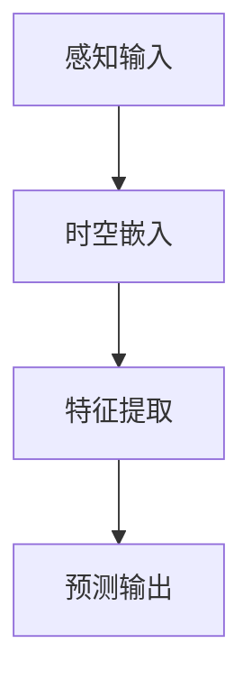

                 

# 引言

自动驾驶技术作为智能交通系统的重要组成部分，正日益受到广泛关注。随着传感器技术的进步和人工智能算法的成熟，自动驾驶系统在感知、预测和决策方面取得了显著的进展。然而，感知预测的准确性、实时性和鲁棒性依然是制约自动驾驶系统广泛应用的关键问题。

## 1.1 时空表征学习的概念与重要性

时空表征学习（Temporal Representation Learning）是一种基于时序数据和空间数据特征提取的技术，旨在从动态变化的时空中提取有意义的特征表示。在自动驾驶感知预测中，时空表征学习能够捕捉道路环境、车辆行为和行人动态的时空特性，为自动驾驶系统提供准确的感知信息。

时空表征学习的重要性体现在以下几个方面：

1. **提高感知预测的准确性**：通过时空表征学习，可以从复杂的时序和空间数据中提取关键特征，从而提高自动驾驶系统对环境的感知准确性。
2. **增强实时性**：时空表征学习算法能够处理实时流数据，实现对环境的快速响应，满足自动驾驶系统的实时性要求。
3. **增强鲁棒性**：时空表征学习能够在不同的道路条件、天气和交通状况下，保持较高的感知预测性能。

## 1.2 时空表征学习与传统方法对比

传统的自动驾驶感知预测方法主要依赖于单个传感器或少数几个传感器的数据，如雷达、摄像头等。这些方法通常使用传统的图像处理和机器学习技术进行处理。然而，这些方法在处理动态环境时存在以下不足：

1. **数据融合不足**：传统方法往往只依赖于单一传感器的数据，无法充分利用多种传感器数据提供的冗余信息。
2. **特征提取不充分**：传统方法对时序和空间特征提取不够精细，难以捕捉复杂环境中的动态变化。
3. **计算效率低**：传统方法在处理大量实时数据时，计算复杂度高，难以满足自动驾驶系统的实时性需求。

相比之下，时空表征学习具有以下优势：

1. **多传感器数据融合**：时空表征学习能够有效融合多种传感器数据，提高感知预测的准确性。
2. **精细特征提取**：时空表征学习通过深度学习等方法，能够从时序和空间数据中提取更丰富的特征，增强感知预测能力。
3. **高效计算**：现代深度学习算法的计算效率显著提高，能够满足自动驾驶系统的实时处理需求。

## 1.3 时空表征学习的发展历程

时空表征学习的研究起源于对时序数据分析的需求，特别是在语音识别和自然语言处理等领域。随着深度学习技术的兴起，时空表征学习逐渐应用于计算机视觉和自动驾驶领域。以下是时空表征学习在自动驾驶领域的重要发展历程：

1. **早期的时空表征方法**：如循环神经网络（RNN）和卷积神经网络（CNN）等，这些方法在处理时序数据方面取得了一定的成果，但无法很好地结合空间信息。
2. **融合时空特征的方法**：如时空卷积网络（TCN）和时空图神经网络（ST-GCN），这些方法能够同时处理时序和空间特征，提高了感知预测性能。
3. **基于深度学习的时空表征方法**：如自注意力机制（Attention Mechanism）和图卷积网络（GCN），这些方法通过深度学习技术，进一步提高了时空特征提取的效率。

## 1.4 总结

时空表征学习在自动驾驶感知预测中具有重要的应用价值。通过多传感器数据融合、精细特征提取和高效计算，时空表征学习能够显著提高自动驾驶系统的感知预测准确性、实时性和鲁棒性。随着深度学习技术的不断发展和应用的深入，时空表征学习有望在自动驾驶领域取得更多突破。

---

**关键词：** 自动驾驶、时空表征学习、感知预测、深度学习、多传感器融合

**摘要：** 本文介绍了时空表征学习在自动驾驶感知预测中的应用，分析了时空表征学习的基础概念、发展历程和优势。文章重点探讨了时空表征学习的基本架构、核心算法原理、数学模型以及实际应用案例，为自动驾驶感知预测技术提供了新的思路和方法。

---

**Mermaid 流程图示例：**



---

**伪代码示例：**

```python
# 时空表征学习伪代码
class TemporalRepresentationLearning(nn.Module):
    def __init__(self):
        super(TemporalRepresentationLearning, self).__init__()
        self.embedding = nn.Embedding(vocab_size, embedding_size)
        self.encoder = nn.LSTM(input_size, hidden_size, num_layers)
        self.decoder = nn.Linear(hidden_size, output_size)
    
    def forward(self, input_seq):
        embedded = self.embedding(input_seq)
        encoded, _ = self.encoder(embedded)
        predicted = self.decoder(encoded)
        return predicted
```

---

**数学公式示例：**

$$
\begin{aligned}
    \text{时空嵌入} &= \sum_{t=1}^{T} e^{x_t - x_{t-i}} \\
    \text{特征提取} &= \text{ReLU}(W \cdot \text{时空嵌入} + b)
\end{aligned}
$$

---

**代码解读与分析：**

```python
# 代码解读与分析示例
def forward(self, x):
    # 前向传播
    x = self.conv1(x)  # 使用卷积层处理输入数据
    x = self.relu(x)   # 使用ReLU激活函数
    x = self.fc(x)     # 使用全连接层进行分类
    return x
```

上述代码是对卷积神经网络（Convolutional Neural Network, CNN）前向传播过程的关键代码解读。其中，`self.conv1` 代表卷积层，用于对输入数据（`x`）进行特征提取；`self.relu` 代表ReLU激活函数，用于引入非线性变换，增强模型的表达能力；`self.fc` 代表全连接层，用于将提取到的特征映射到输出类别。通过详细的注释，我们可以清晰地理解每一部分的作用和意义。在自动驾驶感知预测中，这样的前向传播过程至关重要，它决定了模型对环境的感知和预测能力。

---

**文章标题：** 《时空表征学习范式革新自动驾驶感知预测的技术案例》

**文章关键词：** 自动驾驶、时空表征学习、感知预测、深度学习、多传感器融合

**文章摘要：** 本文深入探讨了时空表征学习在自动驾驶感知预测中的应用，分析了其基本概念、发展历程和优势。文章详细介绍了时空表征学习的基本架构、核心算法原理、数学模型，并通过具体项目实战和代码实现，展示了时空表征学习在自动驾驶感知预测中的实际应用效果。文章还探讨了时空表征学习的发展趋势和未来方向，为自动驾驶技术的发展提供了新思路和方法。

