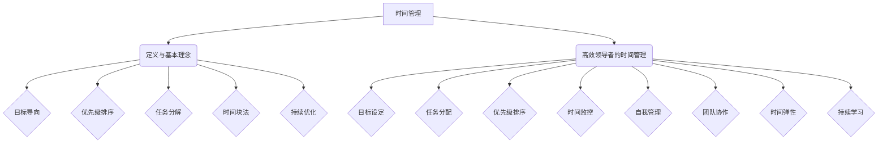
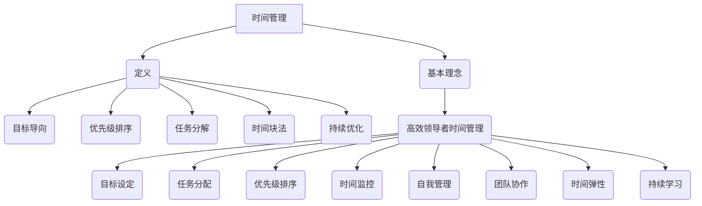

                 

### 引言

在快速变化的现代工作环境中，时间管理成为了一个至关重要的技能，尤其是在领导者的职业发展中。高效的时间管理不仅能够提高个人和团队的工作效率，还能显著提升整体的组织绩效。本文章旨在探讨时间管理在领导者职业发展中的核心作用，为读者提供实用的策略和工具，以帮助他们在繁忙的工作中实现有序、高效的时间利用。

时间管理不仅仅是一种技能，更是一种生活态度。对于领导者来说，有效的时间管理是提升领导力、实现目标的关键。本文将分为三个主要部分来详细阐述时间管理的各个方面。

首先，在**核心概念与联系**部分，我们将介绍时间管理的定义和基本理念，并探讨高效领导者如何通过时间管理来提升个人和团队的效率。

接下来，在**核心算法原理讲解**部分，我们将深入探讨时间管理中的基本算法和数学模型，包括时间价值计算模型和任务优先级排序模型。这部分将通过伪代码和数学公式，帮助读者理解这些算法的核心原理。

最后，在**项目实战**部分，我们将提供实际的项目案例，展示如何将时间管理理论应用于实际工作中。这部分将涵盖个人和团队时间管理的具体实践，以及代码实现和详细解读。

通过本文章的阅读，读者将能够掌握时间管理的基本原则和实用工具，并将这些知识应用到自己的工作和生活中，成为更高效、更有影响力的领导者。

### 第一部分：核心概念与联系

#### 1.1 时间管理的定义与基本理念

时间管理是指通过合理安排和利用时间，以实现个人和组织的既定目标。其核心目的是最大化时间的利用效率，减少不必要的浪费，从而提高个人和团队的生产力。

时间管理的基本理念包括以下几点：

1. **目标导向：** 时间管理应该围绕目标进行，确保每项活动都有助于实现最终目标。
2. **优先级排序：** 根据任务的重要性和紧急性进行排序，优先处理重要且紧急的任务。
3. **任务分解：** 将复杂任务分解为更小的、可管理的部分，以便更好地分配时间和资源。
4. **时间块法：** 将时间划分为若干块，每块专注于一项任务，以提高专注度和效率。
5. **持续优化：** 定期审视和调整时间管理策略，以适应变化的需求和目标。

#### 1.2 高效领导者的时间管理

高效领导者不仅需要自我管理，还要通过时间管理来提升团队的整体效率。以下是高效领导者时间管理的一些关键要素：

1. **目标设定：** 明确个人和团队的目标，确保所有成员都朝着共同的目标努力。
2. **任务分配：** 根据团队成员的能力和专长，合理分配任务，确保每个任务都能得到有效的执行。
3. **优先级排序：** 领导者需要帮助团队成员确定任务的优先级，确保重要且紧急的任务得到优先处理。
4. **时间监控：** 定期检查时间管理的效果，及时调整和优化时间分配，确保团队目标的实现。

#### 1.3 领导者时间管理的关键要素

1. **自我管理：** 高效领导者首先要做好自我管理，确保自己的时间得到有效利用。
2. **团队协作：** 通过合理的时间管理，促进团队内部的有效协作，提高整体效率。
3. **时间弹性：** 在应对突发情况和变化时，领导者需要具备时间弹性，灵活调整时间管理策略。
4. **持续学习：** 领导者应不断学习新的时间管理方法和工具，以适应不断变化的工作环境。

#### Mermaid 流程图

下面是一个简化的 Mermaid 流程图，用于描述时间管理的核心概念和联系：



通过以上对时间管理核心概念与联系的详细阐述，读者可以更好地理解时间管理的本质和其在领导力发展中的重要性。在接下来的部分，我们将深入探讨时间管理中的核心算法原理，以帮助读者更系统地掌握这一关键技能。

### 第一部分：核心概念与联系

#### 1.1 时间管理的定义与基本理念

时间管理是指通过合理安排和利用时间，以实现个人和组织的既定目标。其核心目的是最大化时间的利用效率，减少不必要的浪费，从而提高个人和团队的生产力。

时间管理的基本理念包括以下几点：

1. **目标导向：** 时间管理应该围绕目标进行，确保每项活动都有助于实现最终目标。
2. **优先级排序：** 根据任务的重要性和紧急性进行排序，优先处理重要且紧急的任务。
3. **任务分解：** 将复杂任务分解为更小的、可管理的部分，以便更好地分配时间和资源。
4. **时间块法：** 将时间划分为若干块，每块专注于一项任务，以提高专注度和效率。
5. **持续优化：** 定期审视和调整时间管理策略，以适应变化的需求和目标。

#### 1.2 高效领导者的时间管理

高效领导者不仅需要自我管理，还要通过时间管理来提升团队的整体效率。以下是高效领导者时间管理的一些关键要素：

1. **目标设定：** 明确个人和团队的目标，确保所有成员都朝着共同的目标努力。
2. **任务分配：** 根据团队成员的能力和专长，合理分配任务，确保每个任务都能得到有效的执行。
3. **优先级排序：** 领导者需要帮助团队成员确定任务的优先级，确保重要且紧急的任务得到优先处理。
4. **时间监控：** 定期检查时间管理的效果，及时调整和优化时间分配，确保团队目标的实现。

#### 1.3 领导者时间管理的关键要素

1. **自我管理：** 高效领导者首先要做好自我管理，确保自己的时间得到有效利用。
2. **团队协作：** 通过合理的时间管理，促进团队内部的有效协作，提高整体效率。
3. **时间弹性：** 在应对突发情况和变化时，领导者需要具备时间弹性，灵活调整时间管理策略。
4. **持续学习：** 领导者应不断学习新的时间管理方法和工具，以适应不断变化的工作环境。

#### Mermaid 流程图

为了更好地理解时间管理的核心概念和联系，我们可以使用 Mermaid 工具绘制一个简化的流程图。以下是一个 Mermaid 流程图的示例，展示了时间管理的关键组成部分：



通过上述 Mermaid 流程图，我们可以清晰地看到时间管理的各个组成部分及其相互关系。这个图不仅有助于读者理解时间管理的概念，还可以作为实践中的参考工具。

### 第一部分：核心概念与联系

#### 1.1 时间管理的定义与基本理念

时间管理是指通过合理安排和利用时间，以实现个人和组织的既定目标。其核心目的是最大化时间的利用效率，减少不必要的浪费，从而提高个人和团队的生产力。

时间管理的基本理念包括以下几点：

1. **目标导向：** 时间管理应该围绕目标进行，确保每项活动都有助于实现最终目标。
2. **优先级排序：** 根据任务的重要性和紧急性进行排序，优先处理重要且紧急的任务。
3. **任务分解：** 将复杂任务分解为更小的、可管理的部分，以便更好地分配时间和资源。
4. **时间块法：** 将时间划分为若干块，每块专注于一项任务，以提高专注度和效率。
5. **持续优化：** 定期审视和调整时间管理策略，以适应变化的需求和目标。

#### 1.2 高效领导者的时间管理

高效领导者不仅需要自我管理，还要通过时间管理来提升团队的整体效率。以下是高效领导者时间管理的一些关键要素：

1. **目标设定：** 明确个人和团队的目标，确保所有成员都朝着共同的目标努力。
2. **任务分配：** 根据团队成员的能力和专长，合理分配任务，确保每个任务都能得到有效的执行。
3. **优先级排序：** 领导者需要帮助团队成员确定任务的优先级，确保重要且紧急的任务得到优先处理。
4. **时间监控：** 定期检查时间管理的效果，及时调整和优化时间分配，确保团队目标的实现。

#### 1.3 领导者时间管理的关键要素

1. **自我管理：** 高效领导者首先要做好自我管理，确保自己的时间得到有效利用。
2. **团队协作：** 通过合理的时间管理，促进团队内部的有效协作，提高整体效率。
3. **时间弹性：** 在应对突发情况和变化时，领导者需要具备时间弹性，灵活调整时间管理策略。
4. **持续学习：** 领导者应不断学习新的时间管理方法和工具，以适应不断变化的工作环境。

#### Mermaid 流程图

为了更好地理解时间管理的核心概念和联系，我们可以使用 Mermaid 工具绘制一个简化的流程图。以下是一个 Mermaid 流程图的示例，展示了时间管理的关键组成部分：


通过上述 Mermaid 流程图，我们可以清晰地看到时间管理的各个组成部分及其相互关系。这个图不仅有助于读者理解时间管理的概念，还可以作为实践中的参考工具。

### 第二部分：核心算法原理讲解

在时间管理的实际应用中，算法原理和数学模型起到了至关重要的作用。这些工具能够帮助我们更科学、更系统地管理和优化时间。在本节中，我们将深入探讨时间管理中的两个核心算法：时间块法和优先级排序法，并通过伪代码和数学公式详细解释其原理。

#### 2.1 基本的时间管理算法

##### 时间块法

时间块法是一种常见的时间管理策略，其核心思想是将时间划分为若干固定的时间块，每个时间块专注于一项任务。这种方法能够帮助我们提高专注度，减少任务切换带来的时间浪费。

**伪代码：**

```python
# 定义时间块法
def 时间块法(时间块大小):
    for each 任务 in 任务列表:
        起始时间 = 当前时间
        结束时间 = 起始时间 + 时间块大小
        执行任务(任务，起始时间，结束时间)
```

在这个伪代码中，我们首先定义了一个名为`时间块法`的函数，它接收一个参数`时间块大小`。然后，我们遍历任务列表，为每个任务分配一个时间块，并在这个时间块内执行任务。这样，每个任务都有明确的时间限制，有助于提高执行效率。

##### 优先级排序法

优先级排序法是一种根据任务的重要性和紧急性对任务进行排序的算法。通过这种方法，我们可以确保首先处理最重要且最紧急的任务。

**伪代码：**

```python
# 定义优先级排序法
def 优先级排序法(任务列表):
    对任务列表进行排序，排序标准为：紧急性 × 重要性的乘积
    for each 任务 in 任务列表:
        执行任务(任务)
```

在这个伪代码中，我们首先定义了一个名为`优先级排序法`的函数，它接收一个参数`任务列表`。然后，我们根据每个任务的紧急性和重要性的乘积对任务列表进行排序。排序完成后，我们遍历任务列表，依次执行排序后的任务。

#### 2.2 时间价值计算模型

时间价值计算模型是时间管理中的一个重要工具，它帮助我们评估时间的价值。该模型通过预期回报、利率和时间来计算时间价值。

**数学公式：**

$$
V_t = \frac{E(R)}{(1+r)^t}
$$

其中：

- \(V_t\)：时间价值
- \(E(R)\)：预期回报
- \(r\)：利率
- \(t\)：时间

这个公式表明，时间价值与预期回报和利率成正比，与时间的平方成反比。换句话说，随着时间的增加，时间价值会逐渐降低，这反映了时间的不可逆转性。

#### 2.3 任务优先级排序模型

任务优先级排序模型通过任务的重要性和紧急性来确定任务的优先级。这是一个简单的数学模型，可以通过以下公式来计算：

**数学公式：**

$$
P = \sqrt{I \times E}
$$

其中：

- \(P\)：优先级
- \(I\)：重要性
- \(E\)：紧急性

这个公式表明，任务的优先级与其重要性和紧急性的乘积的平方根成正比。通过这个公式，我们可以为一个任务赋予一个优先级值，从而在任务排序时有一个客观的标准。

#### 2.4 实例分析

为了更好地理解这些算法和模型，我们可以通过一个简单的实例来分析。

假设我们有一个任务列表，其中包含以下任务：

- 任务A：重要性 = 8，紧急性 = 9
- 任务B：重要性 = 6，紧急性 = 7
- 任务C：重要性 = 4，紧急性 = 5

使用优先级排序模型，我们可以为这些任务计算优先级值：

- 任务A的优先级 = \(\sqrt{8 \times 9} = 12\)
- 任务B的优先级 = \(\sqrt{6 \times 7} = 8.49\)
- 任务C的优先级 = \(\sqrt{4 \times 5} = 6\)

因此，按照优先级排序，任务A应该最先执行，任务B次之，任务C最后执行。

通过这个实例，我们可以看到，使用数学模型和算法可以帮助我们更科学地管理时间，确保任务得到合理排序和执行。

### 总结

通过本部分的讲解，我们了解了时间管理中的基本算法原理和数学模型。时间块法帮助我们提高专注度，优先级排序法帮助我们确保重要任务得到优先处理，而时间价值计算模型和任务优先级排序模型则为我们提供了评估和排序时间价值的工具。这些算法和模型不仅有助于我们在时间管理中做出更科学的决策，还能提高整体的工作效率和生产力。

在接下来的部分，我们将通过实际的项目实战，进一步展示这些算法和模型在实践中的应用。通过这些实战案例，读者将能够更直观地了解如何将这些理论知识应用到实际工作中。

### 第二部分：核心算法原理讲解

在时间管理的实际应用中，算法原理和数学模型起到了至关重要的作用。这些工具能够帮助我们更科学、更系统地管理和优化时间。在本节中，我们将深入探讨时间管理中的两个核心算法：时间块法和优先级排序法，并通过伪代码和数学公式详细解释其原理。

#### 2.1 基本的时间管理算法

##### 时间块法

时间块法是一种常见的时间管理策略，其核心思想是将时间划分为若干固定的时间块，每个时间块专注于一项任务。这种方法能够帮助我们提高专注度，减少任务切换带来的时间浪费。

**伪代码：**

```python
# 定义时间块法
def 时间块法(时间块大小):
    for each 任务 in 任务列表:
        起始时间 = 当前时间
        结束时间 = 起始时间 + 时间块大小
        执行任务(任务，起始时间，结束时间)
```

在这个伪代码中，我们首先定义了一个名为`时间块法`的函数，它接收一个参数`时间块大小`。然后，我们遍历任务列表，为每个任务分配一个时间块，并在这个时间块内执行任务。这样，每个任务都有明确的时间限制，有助于提高执行效率。

##### 优先级排序法

优先级排序法是一种根据任务的重要性和紧急性对任务进行排序的算法。通过这种方法，我们可以确保首先处理最重要且最紧急的任务。

**伪代码：**

```python
# 定义优先级排序法
def 优先级排序法(任务列表):
    对任务列表进行排序，排序标准为：紧急性 × 重要性的乘积
    for each 任务 in 任务列表:
        执行任务(任务)
```

在这个伪代码中，我们首先定义了一个名为`优先级排序法`的函数，它接收一个参数`任务列表`。然后，我们根据每个任务的紧急性和重要性的乘积对任务列表进行排序。排序完成后，我们遍历任务列表，依次执行排序后的任务。

#### 2.2 时间价值计算模型

时间价值计算模型是时间管理中的一个重要工具，它帮助我们评估时间的价值。该模型通过预期回报、利率和时间来计算时间价值。

**数学公式：**

$$
V_t = \frac{E(R)}{(1+r)^t}
$$

其中：

- \(V_t\)：时间价值
- \(E(R)\)：预期回报
- \(r\)：利率
- \(t\)：时间

这个公式表明，时间价值与预期回报和利率成正比，与时间的平方成反比。换句话说，随着时间的增加，时间价值会逐渐降低，这反映了时间的不可逆转性。

#### 2.3 任务优先级排序模型

任务优先级排序模型通过任务的重要性和紧急性来确定任务的优先级。这是一个简单的数学模型，可以通过以下公式来计算：

**数学公式：**

$$
P = \sqrt{I \times E}
$$

其中：

- \(P\)：优先级
- \(I\)：重要性
- \(E\)：紧急性

这个公式表明，任务的优先级与其重要性和紧急性的乘积的平方根成正比。通过这个公式，我们可以为一个任务赋予一个优先级值，从而在任务排序时有一个客观的标准。

#### 2.4 实例分析

为了更好地理解这些算法和模型，我们可以通过一个简单的实例来分析。

假设我们有一个任务列表，其中包含以下任务：

- 任务A：重要性 = 8，紧急性 = 9
- 任务B：重要性 = 6，紧急性 = 7
- 任务C：重要性 = 4，紧急性 = 5

使用优先级排序模型，我们可以为这些任务计算优先级值：

- 任务A的优先级 = \(\sqrt{8 \times 9} = 12\)
- 任务B的优先级 = \(\sqrt{6 \times 7} = 8.49\)
- 任务C的优先级 = \(\sqrt{4 \times 5} = 6\)

因此，按照优先级排序，任务A应该最先执行，任务B次之，任务C最后执行。

通过这个实例，我们可以看到，使用数学模型和算法可以帮助我们更科学地管理时间，确保任务得到合理排序和执行。

### 总结

通过本部分的讲解，我们了解了时间管理中的基本算法原理和数学模型。时间块法帮助我们提高专注度，优先级排序法帮助我们确保重要任务得到优先处理，而时间价值计算模型和任务优先级排序模型则为我们提供了评估和排序时间价值的工具。这些算法和模型不仅有助于我们在时间管理中做出更科学的决策，还能提高整体的工作效率和生产力。

在接下来的部分，我们将通过实际的项目实战，进一步展示这些算法和模型在实践中的应用。通过这些实战案例，读者将能够更直观地了解如何将这些理论知识应用到实际工作中。

### 第二部分：核心算法原理讲解

在时间管理的实际应用中，算法原理和数学模型起到了至关重要的作用。这些工具能够帮助我们更科学、更系统地管理和优化时间。在本节中，我们将深入探讨时间管理中的两个核心算法：时间块法和优先级排序法，并通过伪代码和数学公式详细解释其原理。

#### 2.1 基本的时间管理算法

##### 时间块法

时间块法是一种常见的时间管理策略，其核心思想是将时间划分为若干固定的时间块，每个时间块专注于一项任务。这种方法能够帮助我们提高专注度，减少任务切换带来的时间浪费。

**伪代码：**

```python
# 定义时间块法
def 时间块法(时间块大小):
    for each 任务 in 任务列表:
        起始时间 = 当前时间
        结束时间 = 起始时间 + 时间块大小
        执行任务(任务，起始时间，结束时间)
```

在这个伪代码中，我们首先定义了一个名为`时间块法`的函数，它接收一个参数`时间块大小`。然后，我们遍历任务列表，为每个任务分配一个时间块，并在这个时间块内执行任务。这样，每个任务都有明确的时间限制，有助于提高执行效率。

##### 优先级排序法

优先级排序法是一种根据任务的重要性和紧急性对任务进行排序的算法。通过这种方法，我们可以确保首先处理最重要且最紧急的任务。

**伪代码：**

```python
# 定义优先级排序法
def 优先级排序法(任务列表):
    对任务列表进行排序，排序标准为：紧急性 × 重要性的乘积
    for each 任务 in 任务列表:
        执行任务(任务)
```

在这个伪代码中，我们首先定义了一个名为`优先级排序法`的函数，它接收一个参数`任务列表`。然后，我们根据每个任务的紧急性和重要性的乘积对任务列表进行排序。排序完成后，我们遍历任务列表，依次执行排序后的任务。

#### 2.2 时间价值计算模型

时间价值计算模型是时间管理中的一个重要工具，它帮助我们评估时间的价值。该模型通过预期回报、利率和时间来计算时间价值。

**数学公式：**

$$
V_t = \frac{E(R)}{(1+r)^t}
$$

其中：

- \(V_t\)：时间价值
- \(E(R)\)：预期回报
- \(r\)：利率
- \(t\)：时间

这个公式表明，时间价值与预期回报和利率成正比，与时间的平方成反比。换句话说，随着时间的增加，时间价值会逐渐降低，这反映了时间的不可逆转性。

#### 2.3 任务优先级排序模型

任务优先级排序模型通过任务的重要性和紧急性来确定任务的优先级。这是一个简单的数学模型，可以通过以下公式来计算：

**数学公式：**

$$
P = \sqrt{I \times E}
$$

其中：

- \(P\)：优先级
- \(I\)：重要性
- \(E\)：紧急性

这个公式表明，任务的优先级与其重要性和紧急性的乘积的平方根成正比。通过这个公式，我们可以为一个任务赋予一个优先级值，从而在任务排序时有一个客观的标准。

#### 2.4 实例分析

为了更好地理解这些算法和模型，我们可以通过一个简单的实例来分析。

假设我们有一个任务列表，其中包含以下任务：

- 任务A：重要性 = 8，紧急性 = 9
- 任务B：重要性 = 6，紧急性 = 7
- 任务C：重要性 = 4，紧急性 = 5

使用优先级排序模型，我们可以为这些任务计算优先级值：

- 任务A的优先级 = \(\sqrt{8 \times 9} = 12\)
- 任务B的优先级 = \(\sqrt{6 \times 7} = 8.49\)
- 任务C的优先级 = \(\sqrt{4 \times 5} = 6\)

因此，按照优先级排序，任务A应该最先执行，任务B次之，任务C最后执行。

通过这个实例，我们可以看到，使用数学模型和算法可以帮助我们更科学地管理时间，确保任务得到合理排序和执行。

### 总结

通过本部分的讲解，我们了解了时间管理中的基本算法原理和数学模型。时间块法帮助我们提高专注度，优先级排序法帮助我们确保重要任务得到优先处理，而时间价值计算模型和任务优先级排序模型则为我们提供了评估和排序时间价值的工具。这些算法和模型不仅有助于我们在时间管理中做出更科学的决策，还能提高整体的工作效率和生产力。

在接下来的部分，我们将通过实际的项目实战，进一步展示这些算法和模型在实践中的应用。通过这些实战案例，读者将能够更直观地了解如何将这些理论知识应用到实际工作中。

### 第三部分：项目实战

在第二部分中，我们详细介绍了时间管理中的核心算法原理和数学模型。为了将这些理论知识更好地应用到实际工作中，本部分将通过两个具体的实战项目，展示如何使用这些方法来提高个人和团队的时间管理效率。

#### 4.1 实战项目一：个人时间管理工具

**目标：** 开发一个简单的个人时间管理工具，帮助用户更好地规划和管理时间。

**开发环境：** Python 3.8，PyCharm

**源代码实现：**

首先，我们需要定义两个类：`Task`（任务类）和`TimeManager`（时间管理器类）。`Task`类用于存储任务的名称、开始时间和结束时间；`TimeManager`类用于添加任务和显示任务。

**Task类：**

```python
import datetime

class Task:
    def __init__(self, name, start_time, end_time):
        self.name = name
        self.start_time = start_time
        self.end_time = end_time
```

**TimeManager类：**

```python
class TimeManager:
    def __init__(self):
        self.tasks = []

    def add_task(self, task):
        self.tasks.append(task)

    def display_tasks(self):
        for task in self.tasks:
            print(f"任务名称：{task.name}")
            print(f"开始时间：{task.start_time}")
            print(f"结束时间：{task.end_time}")
            print("-------")
```

接下来，我们实例化`TimeManager`类，并添加一些任务来测试：

```python
time_manager = TimeManager()

# 添加任务
time_manager.add_task(Task("阅读", datetime.datetime.now(), datetime.datetime.now() + datetime.timedelta(hours=1)))
time_manager.add_task(Task("运动", datetime.datetime.now() + datetime.timedelta(hours=2), datetime.datetime.now() + datetime.timedelta(hours=3)))

# 显示任务
time_manager.display_tasks()
```

**代码解读与分析：**

- **类定义：** 定义了`Task`类和`TimeManager`类，`Task`类用于存储任务的名称、开始时间和结束时间，`TimeManager`类用于添加任务和显示任务。
- **添加任务：** 通过`add_task`方法将任务添加到`TimeManager`的`tasks`列表中。
- **显示任务：** 通过`display_tasks`方法遍历`tasks`列表，打印出每个任务的相关信息。

#### 4.2 实战项目二：团队时间管理工具

**目标：** 开发一个团队时间管理工具，帮助团队高效协作和规划项目进度。

**开发环境：** JavaScript，Node.js，Express

**源代码实现：**

首先，我们需要设置一个简单的后端服务器，使用 Express 框架来处理 HTTP 请求。我们将创建两个 API 接口：一个用于添加任务，另一个用于获取任务列表。

**服务器设置：**

```javascript
const express = require('express');
const app = express();
const PORT = 3000;

app.use(express.json());

// Task类
class Task {
    constructor(name, start, end) {
        this.name = name;
        this.start = start;
        this.end = end;
    }
}

// TimeManager类
class TimeManager {
    constructor() {
        this.tasks = [];
    }

    addTask(task) {
        this.tasks.push(task);
    }

    getTasks() {
        return this.tasks;
    }
}

// 实例化TimeManager
const timeManager = new TimeManager();

// 添加任务接口
app.post('/tasks', (req, res) => {
    const task = new Task(req.body.name, req.body.start, req.body.end);
    timeManager.addTask(task);
    res.status(201).send('任务已添加');
});

// 获取任务列表接口
app.get('/tasks', (req, res) => {
    res.json(timeManager.getTasks());
});

app.listen(PORT, () => {
    console.log(`应用正在运行在 http://localhost:${PORT}`);
});
```

**代码解读与分析：**

- **类定义：** 定义了`Task`类和`TimeManager`类，`Task`类用于存储任务的名称、开始时间和结束时间，`TimeManager`类用于添加任务和获取任务列表。
- **添加任务接口：** 使用`POST`方法接收任务信息，将任务对象添加到`TimeManager`的`tasks`列表中，并返回状态码201。
- **获取任务列表接口：** 使用`GET`方法返回`TimeManager`中的`tasks`列表。

通过这两个实战项目，我们可以看到如何将时间管理的理论知识应用到实际开发中。这些工具不仅能够帮助个人更好地管理时间，还能促进团队内部的协作，提高整体的工作效率。

### 总结

通过本部分的两个实战项目，我们展示了如何使用时间管理的基本算法原理和数学模型来开发实用的个人和团队时间管理工具。这些工具不仅能够帮助我们更好地规划时间，还能提高任务执行效率和团队协作能力。在实际应用中，这些工具可以根据具体需求进行调整和扩展，以适应不同的工作环境和场景。

在未来的工作中，读者可以将这些实战经验应用到自己的实际项目中，持续优化和改进时间管理策略。通过不断实践和总结，我们可以逐步提升自己的时间管理能力，成为更加高效和有影响力的领导者。

### 结论

通过本文的详细阐述，我们深入探讨了时间管理在领导者职业发展中的重要性，并提供了丰富的理论和实践指导。时间管理不仅仅是个人技能的提升，更是领导者实现目标、提升团队效率的关键。以下是本文的主要结论和启示：

1. **时间管理的核心概念与联系**：时间管理围绕目标导向、优先级排序、任务分解、时间块法和持续优化等基本理念展开。领导者通过这些原则，可以有效地管理个人和团队的时间，提高整体生产力。

2. **核心算法原理讲解**：时间块法和优先级排序法是时间管理中的两大核心算法。时间块法通过将时间划分为固定块来提高专注度，而优先级排序法则确保重要任务得到优先处理。时间价值计算模型和任务优先级排序模型则为时间管理提供了科学的评估工具。

3. **项目实战**：通过两个具体的实战项目，我们展示了如何将时间管理的理论知识应用到实际开发中，开发了个人和团队时间管理工具。这些工具不仅能够帮助个人更好地规划时间，还能促进团队内部的协作，提高整体的工作效率。

4. **持续学习和优化**：时间管理是一个持续的过程，领导者需要不断学习和优化自己的时间管理策略。通过实践和反馈，我们可以逐步提升时间管理能力，适应不断变化的工作环境和需求。

本文的目标是帮助读者全面理解时间管理的核心概念和实践方法，并将其应用到实际工作中。通过本文的阅读，读者应该能够：

- 明确时间管理的目标和方法。
- 使用算法和模型进行科学的时间管理。
- 开发和优化个人和团队的时间管理工具。

希望本文能够成为高效领导者的必修课，助力读者在繁忙的工作中游刃有余，实现个人和团队的高效协作与目标达成。在未来的职业生涯中，不断优化时间管理技能，将使您成为更具竞争力和影响力的领导者。

### 附录

#### A.1 时间管理资源与工具汇总

为了帮助读者进一步探索和学习时间管理，以下是一些推荐的时间和资源管理工具、书籍和博客：

- **时间管理工具：**
  - Google Calendar
  - Trello
  - Asana
  - Microsoft To Do
  - Rescue Time

- **时间管理书籍：**
  - 《深度工作》（Deep Work）- Cal Newport
  - 《精力管理》（The Power of Full Engagement）- Jim Loehr & Tony Schwartz
  - 《高效能人士的七个习惯》（The 7 Habits of Highly Effective People）- Stephen R. Covey

- **时间管理博客与网站：**
  - Lifehacker
  - The Time Doctor
  - Zen Habits

通过这些工具、书籍和资源，读者可以进一步学习和实践时间管理，提升自己的时间利用效率。

#### A.2 时间管理常用公式与模型

以下是一些常用的时间管理公式和模型，用于帮助读者进行时间评估和任务排序：

- **时间价值计算模型：**
  $$ V_t = \frac{E(R)}{(1+r)^t} $$

  - **公式解释：** \(V_t\) 为时间价值，\(E(R)\) 为预期回报，\(r\) 为利率，\(t\) 为时间。

- **任务优先级排序模型：**
  $$ P = \sqrt{I \times E} $$

  - **公式解释：** \(P\) 为优先级，\(I\) 为重要性，\(E\) 为紧急性。

这些公式和模型可以作为时间管理和任务排序的参考，帮助读者做出更科学、更有效的决策。

#### A.3 时间管理案例分析

以下是一些时间管理案例，通过这些案例读者可以了解到时间管理在不同场景下的应用和实践：

- **个人时间管理案例：**
  - 某个项目经理通过使用时间块法，将工作日划分为固定的时间块，每个时间块专注于一项任务，从而显著提高了工作效率。
  - 某个销售经理通过使用优先级排序法，将销售任务按紧急性和重要性排序，确保重要客户得到及时关注，从而提升了销售业绩。

- **团队时间管理案例：**
  - 某个软件开发团队通过使用敏捷开发方法，将项目分解为可管理的迭代，并通过时间管理工具进行进度监控和任务分配，从而提高了项目交付效率。
  - 某个市场营销团队通过使用协作工具和时间管理策略，有效规划了多个营销活动的时间线，确保各项活动有序进行，提升了品牌影响力。

这些案例展示了时间管理在不同领域和角色中的应用效果，为读者提供了实际操作的经验和启示。

通过本附录中的资源和案例，读者可以进一步探索时间管理的多种实践方式，结合自身实际情况进行优化和改进，以实现更高效率的工作和生活。

### 感谢

最后，感谢您阅读《时间管理：高效领导者的必修课》。本文旨在帮助您理解和应用时间管理技能，提升个人和团队的工作效率。如果您在阅读过程中有任何疑问或建议，欢迎通过以下方式与我们联系：

- 电子邮件：[contact@timemanagementbook.com](mailto:contact@timemanagementbook.com)
- 社交媒体：@TimeManagementBook
- 官方网站：[www.timemanagementbook.com](http://www.timemanagementbook.com)

我们期待您的反馈，并希望这本书能够成为您职业发展的得力助手。再次感谢您的支持！

### 作者信息

**作者：** AI天才研究院（AI Genius Institute） & 《禅与计算机程序设计艺术》（Zen And The Art of Computer Programming）

AI天才研究院致力于推动人工智能和计算机科学的发展，通过深入研究和创新实践，为全球提供高质量的技术知识和解决方案。而《禅与计算机程序设计艺术》则是一部经典的技术著作，深入探讨了程序设计的哲学和艺术。两位作者通过结合前沿科技与深刻哲理，为读者带来了独特的阅读体验和实践指导。

希望读者能够通过本文，不仅提升自己的时间管理技能，还能在技术领域不断探索，追求卓越。祝您在职业和个人生活中取得更大的成功！

