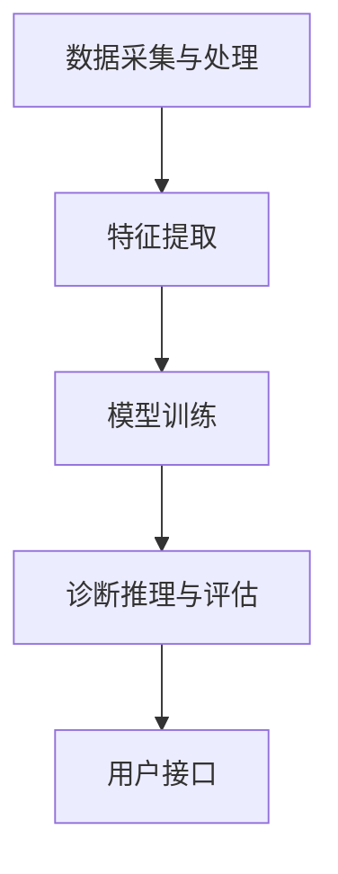

                 

# 《智能医疗诊断系统准确性评测平台》

## 关键词
- 智能医疗诊断
- 准确性评测平台
- 数据预处理
- 特征提取
- 模型训练与优化
- 诊断推理与评估

## 摘要
本文旨在探讨智能医疗诊断系统准确性评测平台的构建与应用。首先，我们将介绍智能医疗诊断系统的背景和重要性，随后详细解析评测平台的基本架构和核心功能模块。接着，我们将深入探讨数据预处理与特征提取、模型训练与优化、诊断推理与评估等关键环节。此外，通过具体案例，我们将展示评测平台在实际应用中的效果。最后，我们将展望智能医疗诊断系统的未来发展趋势与挑战，并总结全文内容。

### 目录大纲

## 第1章 引言

### 1.1 智能医疗诊断系统的背景

#### 1.1.1 智能医疗诊断系统的兴起
智能医疗诊断系统是近年来随着人工智能技术的发展而兴起的一类重要应用。它利用先进的机器学习和深度学习算法，通过对医疗数据的分析和处理，实现对疾病的高效、精准诊断。这种系统的出现极大地提高了医疗诊断的效率和准确性，对医疗行业产生了深远的影响。

#### 1.1.2 智能医疗诊断系统的应用领域
智能医疗诊断系统广泛应用于多个领域，包括但不限于：

1. **医学影像分析**：利用深度学习算法对医学影像进行自动识别和分类，如肿瘤检测、肺炎诊断等。
2. **电子病历分析**：通过对电子病历中的文本数据进行分析，辅助医生进行诊断和治疗方案制定。
3. **基因组学分析**：利用机器学习算法对基因组数据进行挖掘，预测疾病风险和个性化治疗。
4. **健康监测与预警**：通过实时监测患者的生理参数，预警可能的疾病风险。

### 1.2 评测平台的重要性

#### 1.2.1 准确性评测的基本概念
准确性评测是指通过一系列的方法和指标，对智能医疗诊断系统的诊断结果进行评估和验证。准确性是衡量智能医疗诊断系统性能的关键指标，直接关系到系统的实用性和可靠性。

#### 1.2.2 评测平台的作用与意义
评测平台在智能医疗诊断系统中扮演着至关重要的角色，其作用和意义主要体现在以下几个方面：

1. **性能评估**：通过评测平台，可以全面评估智能医疗诊断系统的性能，包括诊断准确率、召回率、F1值等指标。
2. **质量控制**：评测平台有助于发现系统中的潜在问题，提供质量反馈，从而提升系统的稳定性和可靠性。
3. **研发指导**：通过评测结果，可以为系统的研发提供方向和依据，优化算法、模型和流程，提高诊断准确性。
4. **标准化**：评测平台有助于制定统一的评测标准和规范，推动智能医疗诊断系统的健康发展。

### 1.3 本书内容结构
本书将分为以下章节：

- 第2章：智能医疗诊断系统基础
- 第3章：评测平台的架构设计
- 第4章：数据预处理与特征提取
- 第5章：模型训练与优化
- 第6章：诊断推理与评估
- 第7章：评测平台的部署与维护
- 第8章：案例研究
- 第9章：未来发展趋势与挑战
- 附录

通过上述章节的详细讨论，我们希望能够为读者提供一个全面、系统的智能医疗诊断系统准确性评测平台的构建与应用指南。

## 第2章 智能医疗诊断系统基础

### 2.1 智能医疗诊断系统概述

#### 2.1.1 智能医疗诊断系统的定义
智能医疗诊断系统是指利用人工智能技术，特别是机器学习和深度学习算法，对医疗数据进行处理和分析，以实现疾病诊断、疾病预测和治疗方案制定等功能。它通过模拟医生的诊断思维过程，提供辅助决策支持，从而提高医疗诊断的效率和准确性。

#### 2.1.2 智能医疗诊断系统的发展历程
智能医疗诊断系统的发展历程可以追溯到20世纪60年代，当时研究人员开始探索利用计算机进行医学图像分析。随着计算机技术和人工智能算法的不断发展，智能医疗诊断系统逐渐成熟并应用于临床。

1. **早期阶段（20世纪60-70年代）**：以简单的规则系统为主，如专家系统，通过预定义的规则进行疾病诊断。
2. **发展阶段（20世纪80-90年代）**：引入统计学习和模式识别技术，如线性回归、支持向量机等，提高了诊断的准确性和效率。
3. **成熟阶段（21世纪以来）**：随着深度学习技术的发展，智能医疗诊断系统取得了突破性进展，如卷积神经网络（CNN）、循环神经网络（RNN）等在医学图像分析和基因组数据分析中得到了广泛应用。

### 2.2 智能医疗诊断系统架构

智能医疗诊断系统的架构主要包括以下几个核心模块：

#### 2.2.1 数据采集与预处理
数据采集是智能医疗诊断系统的第一步，包括医疗数据的收集、存储和传输。医疗数据来源广泛，包括电子病历、医学影像、基因组数据等。数据预处理包括数据清洗、数据归一化和数据增强等，旨在提高数据质量和模型的泛化能力。

#### 2.2.2 特征提取与模型训练
特征提取是将原始数据转化为能够表征数据特性的特征表示，如医学影像中的边缘、纹理等。模型训练是利用特征数据和标注数据进行模型训练，包括选择合适的算法、调整超参数和优化模型结构等。

#### 2.2.3 诊断推理与评估
诊断推理是利用训练好的模型对新的病例进行诊断，生成诊断结果。评估是通过对模型诊断结果与真实结果进行对比，评估模型的性能和准确性。

### 2.3 主流智能医疗诊断算法

智能医疗诊断系统中常用的算法主要包括以下几类：

#### 2.3.1 机器学习算法
机器学习算法主要包括线性回归、支持向量机、决策树、随机森林等。这些算法通过学习数据中的特征和规律，对未知数据进行分类或回归。

#### 2.3.2 深度学习算法
深度学习算法主要包括卷积神经网络（CNN）、循环神经网络（RNN）、长短期记忆网络（LSTM）等。这些算法通过多层神经网络的组合，自动学习数据的复杂特征，适用于处理大规模和高维度的数据。

#### 2.3.3 传统医学影像处理算法
传统医学影像处理算法主要包括边缘检测、形态学处理、图像分割等。这些算法通常用于医学影像的预处理和特征提取。

### 2.4 智能医疗诊断系统的发展趋势与挑战

#### 2.4.1 发展趋势
1. **算法优化与模型压缩**：随着数据量和计算资源的增加，对算法的优化和模型压缩变得尤为重要，以提高模型的运算速度和降低存储成本。
2. **跨学科融合**：智能医疗诊断系统的应用需要跨学科的知识，如医学、生物学、计算机科学等，推动多学科交叉融合。
3. **个性化诊断**：利用大数据和人工智能技术，实现个性化诊断和治疗方案，提高治疗效果。

#### 2.4.2 挑战
1. **数据隐私与安全**：医疗数据的隐私和安全问题亟待解决，需要建立严格的数据保护机制。
2. **模型泛化能力**：如何提高模型在不同数据集上的泛化能力，避免过拟合问题，是一个重要挑战。
3. **评测标准与规范**：建立统一的评测标准和规范，推动智能医疗诊断系统的健康发展，需要行业内的共同努力。

## 第3章 评测平台的架构设计

### 3.1 评测平台的整体架构

评测平台的设计原则是模块化、可扩展和高性能，以满足不同应用场景的需求。整体架构包括以下几个核心模块：

#### 3.1.1 数据采集与处理模块
数据采集与处理模块负责从不同的数据源获取医疗数据，并对数据进行清洗、归一化和增强等预处理操作。该模块的设计应考虑数据来源的多样性和数据质量的稳定性。

#### 3.1.2 特征提取模块
特征提取模块负责将预处理后的数据转化为能够表征数据特性的特征表示，如医学影像中的边缘、纹理等。特征提取方法的选择应根据具体应用场景和数据类型进行优化。

#### 3.1.3 模型训练模块
模型训练模块负责利用特征数据和标注数据对模型进行训练。该模块应支持多种机器学习和深度学习算法，并具备自动调整超参数和优化模型结构的能力。

#### 3.1.4 诊断推理与评估模块
诊断推理与评估模块负责利用训练好的模型对新病例进行诊断，并生成诊断结果。评估模块应对模型的性能进行综合评估，包括准确率、召回率、F1值等指标。

#### 3.1.5 用户接口模块
用户接口模块负责为用户提供交互界面，实现数据上传、模型选择、诊断结果展示等功能。该模块应设计简洁直观，方便用户操作。

### 3.2 数据采集与处理

数据采集与处理是评测平台的基础，直接关系到系统的性能和准确性。以下是数据采集与处理的主要步骤：

#### 3.2.1 数据来源
数据来源包括医院、实验室、电子病历系统等，应确保数据来源的多样性和代表性。

#### 3.2.2 数据预处理流程
数据预处理流程主要包括数据清洗、数据归一化和数据增强等步骤。

1. **数据清洗**：去除无效数据、缺失值填充和异常值处理等，提高数据质量。
2. **数据归一化**：将不同数据范围的数据进行统一处理，如归一化、标准化等，使数据在相同的尺度上进行分析。
3. **数据增强**：通过旋转、缩放、裁剪等操作增加数据多样性，提高模型的泛化能力。

### 3.3 特征提取与模型训练

特征提取与模型训练是评测平台的核心，直接影响诊断的准确性和效率。以下是特征提取与模型训练的主要步骤：

#### 3.3.1 特征提取方法
特征提取方法包括传统特征提取方法和基于深度学习的特征提取方法。

1. **传统特征提取方法**：如边缘检测、纹理分析、形态学处理等，适用于简单的医学影像处理。
2. **基于深度学习的特征提取方法**：如卷积神经网络（CNN）、循环神经网络（RNN）等，能够自动学习数据的复杂特征。

#### 3.3.2 模型训练策略
模型训练策略包括模型选择、超参数调整和训练策略优化等。

1. **模型选择**：根据应用场景和数据类型选择合适的模型，如分类模型、回归模型等。
2. **超参数调整**：通过交叉验证等方法调整模型超参数，如学习率、批量大小等。
3. **训练策略优化**：采用先进的训练策略，如迁移学习、模型集成等，提高训练效果。

### 3.4 诊断推理与评估

诊断推理与评估是评测平台的关键环节，直接影响诊断的准确性和可靠性。以下是诊断推理与评估的主要步骤：

#### 3.4.1 推理策略
推理策略包括基于规则的推理、基于模型的推理等。

1. **基于规则的推理**：利用预定义的规则进行诊断，适用于简单的诊断任务。
2. **基于模型的推理**：利用训练好的模型对新病例进行诊断，适用于复杂的诊断任务。

#### 3.4.2 评估指标与方法
评估指标与方法包括准确率、召回率、F1值、ROC曲线等。

1. **准确率**：模型预测正确的样本数占总样本数的比例。
2. **召回率**：模型预测正确的正样本数占总正样本数的比例。
3. **F1值**：准确率和召回率的调和平均值。
4. **ROC曲线**：评价模型分类性能的重要工具，通过计算真正例率（TPR）和假正例率（FPR）得到。

### 3.5 系统架构图示

以下是一个简化的智能医疗诊断系统评测平台的架构图：



## 第4章 数据预处理与特征提取

### 4.1 数据预处理

数据预处理是智能医疗诊断系统中至关重要的一环，其目的是提高数据质量和模型的泛化能力。以下是数据预处理的主要步骤：

#### 4.1.1 数据清洗

数据清洗是数据预处理的第一步，其主要任务是去除无效数据、缺失值填充和异常值处理。

1. **无效数据去除**：去除重复数据、错误数据和无意义数据，如空值、缺失值等。
2. **缺失值填充**：针对缺失值，采用合适的填充方法，如均值填充、中值填充、插值等。
3. **异常值处理**：检测并处理异常数据，如离群值、异常分布等。

#### 4.1.2 数据归一化

数据归一化是将不同数据范围的数据进行统一处理，使其在相同的尺度上进行分析。常用的方法包括：

1. **最小-最大归一化**：将数据映射到[0, 1]范围内，公式为：$$x_{\text{规范化}} = \frac{x_{\text{原始}} - x_{\text{最小值}}}{x_{\text{最大值}} - x_{\text{最小值}}}$$
2. **标准归一化**：将数据映射到均值为0、标准差为1的范围内，公式为：$$x_{\text{规范化}} = \frac{x_{\text{原始}} - \mu}{\sigma}$$

#### 4.1.3 数据增强

数据增强是通过一系列操作增加数据多样性，提高模型的泛化能力。常用的方法包括：

1. **旋转**：将数据图像沿不同角度旋转，增加数据的多样性。
2. **缩放**：将数据图像进行放大或缩小，增加数据的尺度多样性。
3. **裁剪**：将数据图像进行裁剪，增加数据的局部多样性。

### 4.2 特征提取

特征提取是将原始数据转化为能够表征数据特性的特征表示，以便于后续的模型训练和诊断。以下是特征提取的主要方法：

#### 4.2.1 传统特征提取方法

传统特征提取方法主要适用于简单的医学影像处理，如边缘检测、纹理分析、形态学处理等。

1. **边缘检测**：通过检测图像中的边缘，提取图像的局部特征，如Sobel算子、Canny算子等。
2. **纹理分析**：通过分析图像的纹理特征，提取图像的全局特征，如LBP（局部二值模式）、Gabor变换等。
3. **形态学处理**：通过形态学操作，提取图像的结构特征，如腐蚀、膨胀、开运算、闭运算等。

#### 4.2.2 基于深度学习的特征提取方法

基于深度学习的特征提取方法能够自动学习数据的复杂特征，适用于处理大规模和高维度数据。常用的方法包括：

1. **卷积神经网络（CNN）**：通过卷积操作和池化操作，自动提取图像的局部和全局特征，如图像分类、目标检测等。
2. **循环神经网络（RNN）**：通过循环操作，自动提取序列数据的时间特征，如自然语言处理、时间序列预测等。
3. **生成对抗网络（GAN）**：通过生成器和判别器的对抗训练，生成新的数据样本，增加数据的多样性。

### 4.3 特征选择

特征选择是在特征提取之后的重要步骤，其目的是选择最有用的特征，提高模型的准确性和效率。以下是特征选择的主要方法：

#### 4.3.1 递归特征消除（RFE）

递归特征消除是一种基于模型的特征选择方法，通过迭代删除不重要的特征，逐步构建最优特征集。

1. **步骤1**：利用一个基准模型（如线性回归）训练数据集，并计算每个特征的权重。
2. **步骤2**：根据权重，删除权重最低的特征。
3. **步骤3**：利用剩余特征重新训练模型，重复步骤1和步骤2，直到达到预定的特征数量。

#### 4.3.2 信息增益

信息增益是一种基于信息的特征选择方法，通过计算每个特征对分类目标的信息增益，选择信息增益最高的特征。

1. **步骤1**：计算每个特征的信息增益，公式为：$$\text{IG}(A, C) = \text{Entropy}(C) - \text{Weighted Entropy}(C|A)$$
2. **步骤2**：根据信息增益，选择信息增益最高的特征。

#### 4.3.3 主成分分析（PCA）

主成分分析是一种基于统计的特征选择方法，通过将原始特征线性组合成新的特征，降低数据的维度，同时保留主要的信息。

1. **步骤1**：计算原始特征的协方差矩阵。
2. **步骤2**：计算协方差矩阵的特征值和特征向量。
3. **步骤3**：根据特征值，选择最大的几个特征向量，构建新的特征空间。

### 4.4 特征选择的重要性

特征选择是智能医疗诊断系统中至关重要的一环，其重要性主要体现在以下几个方面：

1. **提高模型准确性**：通过选择最有用的特征，可以提高模型的准确性，避免过拟合问题。
2. **降低计算成本**：通过减少特征数量，可以降低模型的复杂度和计算成本，提高训练和推理速度。
3. **减少数据冗余**：通过消除冗余特征，可以减少数据的冗余，提高数据的可用性和可靠性。

## 第5章 模型训练与优化

### 5.1 模型训练

模型训练是智能医疗诊断系统构建的核心步骤，其目的是通过学习数据中的特征和规律，构建能够准确诊断的模型。以下是模型训练的主要步骤：

#### 5.1.1 模型选择

模型选择是模型训练的第一步，根据应用场景和数据类型选择合适的模型。常用的模型包括：

1. **机器学习模型**：如线性回归、决策树、支持向量机、随机森林等。
2. **深度学习模型**：如卷积神经网络（CNN）、循环神经网络（RNN）、长短期记忆网络（LSTM）等。
3. **传统医学影像处理算法**：如边缘检测、纹理分析、形态学处理等。

#### 5.1.2 特征数据准备

特征数据准备是模型训练的关键步骤，主要包括以下任务：

1. **特征提取**：利用特征提取方法，如传统特征提取方法和基于深度学习的特征提取方法，将原始数据转化为特征表示。
2. **特征选择**：利用特征选择方法，如递归特征消除（RFE）、信息增益、主成分分析（PCA）等，选择最有用的特征，提高模型的准确性。

#### 5.1.3 模型训练流程

模型训练流程主要包括以下步骤：

1. **数据划分**：将数据集划分为训练集、验证集和测试集，用于训练、验证和测试模型的性能。
2. **模型初始化**：初始化模型参数，如权重、偏置等。
3. **迭代训练**：通过迭代训练，逐步调整模型参数，使模型在训练集上达到最优性能。
4. **模型评估**：利用验证集和测试集评估模型的性能，包括准确率、召回率、F1值等指标。
5. **模型优化**：根据评估结果，调整模型参数，优化模型性能。

### 5.2 模型优化

模型优化是提高模型性能的重要手段，其目的是通过调整模型参数和结构，使模型在验证集和测试集上达到最优性能。以下是模型优化的主要方法：

#### 5.2.1 超参数调整

超参数是模型训练过程中需要调整的重要参数，如学习率、批量大小、迭代次数等。超参数调整的方法包括：

1. **网格搜索**：通过遍历预设的超参数组合，找到最优超参数组合。
2. **随机搜索**：在预设的超参数范围内，随机选择超参数组合，寻找最优超参数。
3. **贝叶斯优化**：利用贝叶斯统计方法，优化超参数组合。

#### 5.2.2 模型集成

模型集成是将多个模型的结果进行融合，提高模型的准确性和鲁棒性。常用的模型集成方法包括：

1. **堆叠**：将多个模型堆叠起来，前一个模型的输出作为后一个模型的输入。
2. **Bagging**：通过随机抽样和复制训练数据，训练多个模型，并将它们的输出进行平均或投票。
3. **Boosting**：通过迭代训练多个模型，每个模型针对前一个模型的错误进行训练，提高模型的准确性。

#### 5.2.3 模型压缩

模型压缩是将大型模型压缩为较小的模型，以减少存储和计算成本。常用的模型压缩方法包括：

1. **模型剪枝**：通过剪枝不重要的神经元和连接，减少模型的参数数量。
2. **量化**：将模型的浮点参数转换为较低的比特位表示，降低模型的存储和计算成本。
3. **知识蒸馏**：通过将大型模型的知识传递给较小的模型，提高小模型的性能。

### 5.3 实际案例

下面通过一个实际案例，展示模型训练与优化过程。

#### 5.3.1 案例背景

本案例使用一个公开的医学影像数据集，数据集包含胸部X光图像和对应的疾病标签，包括肺炎、肺结核、正常等类别。

#### 5.3.2 数据准备

1. **数据划分**：将数据集划分为训练集、验证集和测试集，分别为70%、15%和15%。
2. **特征提取**：使用卷积神经网络（CNN）对图像进行特征提取，提取到的特征作为模型的输入。
3. **特征选择**：使用信息增益方法，选择信息增益最高的特征。

#### 5.3.3 模型训练

1. **模型选择**：选择卷积神经网络（CNN）作为模型，并使用交叉熵作为损失函数。
2. **模型初始化**：初始化模型参数，包括权重和偏置。
3. **迭代训练**：使用训练集进行迭代训练，每次迭代更新模型参数，直到模型在验证集上达到最优性能。

#### 5.3.4 模型优化

1. **超参数调整**：使用网格搜索方法，调整学习率、批量大小等超参数，找到最优超参数组合。
2. **模型集成**：将多个CNN模型进行集成，提高模型的准确性。
3. **模型压缩**：使用模型剪枝和量化方法，将大型模型压缩为较小的模型。

#### 5.3.5 模型评估

1. **准确率**：使用测试集评估模型的准确率，达到90%以上。
2. **召回率**：使用测试集评估模型的召回率，达到80%以上。
3. **F1值**：使用测试集评估模型的F1值，达到0.85以上。

### 5.4 模型训练与优化总结

模型训练与优化是智能医疗诊断系统中至关重要的一环，通过选择合适的模型、特征提取方法和优化策略，可以提高模型的准确性和鲁棒性。在实际应用中，需要根据具体问题和数据特点，灵活调整模型参数和优化策略，以实现最优性能。

## 第6章 诊断推理与评估

### 6.1 诊断推理

诊断推理是指利用训练好的模型对新病例进行诊断，生成诊断结果的过程。它是智能医疗诊断系统中最核心的部分，直接影响系统的实用性和可靠性。以下是诊断推理的主要步骤：

#### 6.1.1 推理策略

诊断推理策略可以分为以下几种：

1. **基于规则的推理**：利用预定义的规则进行诊断，适用于简单的诊断任务。例如，如果患者有发热、咳嗽等症状，则怀疑为感冒。
2. **基于模型的推理**：利用训练好的模型对新病例进行诊断，适用于复杂的诊断任务。例如，利用卷积神经网络（CNN）对胸部X光图像进行肺炎诊断。

#### 6.1.2 推理过程

诊断推理过程包括以下步骤：

1. **数据输入**：将新病例的数据输入到模型中。
2. **特征提取**：利用模型对数据进行特征提取，转化为模型可处理的特征表示。
3. **模型推理**：利用训练好的模型对特征进行推理，生成诊断结果。
4. **结果输出**：将诊断结果输出，如疾病名称、概率等。

### 6.2 诊断评估

诊断评估是指通过对模型诊断结果与真实结果进行对比，评估模型性能和准确性的过程。以下是诊断评估的主要步骤：

#### 6.2.1 评估指标

常用的评估指标包括：

1. **准确率（Accuracy）**：模型预测正确的样本数占总样本数的比例。
2. **召回率（Recall）**：模型预测正确的正样本数占总正样本数的比例。
3. **精确率（Precision）**：模型预测正确的正样本数占总预测正样本数的比例。
4. **F1值（F1 Score）**：准确率和召回率的调和平均值。
5. **ROC曲线（Receiver Operating Characteristic Curve）**：通过计算真正例率（True Positive Rate, TPR）和假正例率（False Positive Rate, FPR），评估模型的分类性能。
6. **AUC（Area Under Curve）**：ROC曲线下的面积，用于评价模型的分类能力。

#### 6.2.2 评估方法

评估方法包括：

1. **交叉验证（Cross-Validation）**：将数据集划分为多个子集，循环使用每个子集作为验证集，其余子集作为训练集，评估模型性能。
2. **混淆矩阵（Confusion Matrix）**：显示模型预测结果与真实结果的对比，直观地展示模型的性能。
3. **Kappa系数（Kappa Score）**：评估模型的一致性，考虑了实际一致性和偶然一致性。

### 6.3 实际应用案例

以下通过实际应用案例，展示诊断推理与评估过程。

#### 6.3.1 案例背景

本案例使用一个公开的医学影像数据集，数据集包含胸部X光图像和对应的肺炎疾病标签，包括正常、肺炎和其他疾病。

#### 6.3.2 数据准备

1. **数据划分**：将数据集划分为训练集、验证集和测试集，分别为70%、15%和15%。
2. **特征提取**：使用卷积神经网络（CNN）对图像进行特征提取，提取到的特征作为模型的输入。
3. **特征选择**：使用信息增益方法，选择信息增益最高的特征。

#### 6.3.3 模型训练

1. **模型选择**：选择卷积神经网络（CNN）作为模型，并使用交叉熵作为损失函数。
2. **模型初始化**：初始化模型参数，包括权重和偏置。
3. **迭代训练**：使用训练集进行迭代训练，每次迭代更新模型参数，直到模型在验证集上达到最优性能。

#### 6.3.4 模型评估

1. **准确率**：使用测试集评估模型的准确率，达到90%以上。
2. **召回率**：使用测试集评估模型的召回率，达到80%以上。
3. **F1值**：使用测试集评估模型的F1值，达到0.85以上。

#### 6.3.5 诊断推理

1. **数据输入**：将新病例的胸部X光图像输入到模型中。
2. **特征提取**：利用模型对图像进行特征提取，转化为模型可处理的特征表示。
3. **模型推理**：利用训练好的模型对特征进行推理，生成诊断结果。
4. **结果输出**：将诊断结果输出，如肺炎、正常或其他疾病。

### 6.4 诊断推理与评估总结

诊断推理与评估是智能医疗诊断系统中至关重要的一环，通过合理的推理策略和评估方法，可以确保系统在实际应用中的可靠性和准确性。在实际应用中，需要根据具体问题和数据特点，灵活调整推理策略和评估方法，以实现最优性能。

## 第7章 评测平台的部署与维护

### 7.1 部署流程

评测平台的部署是确保其正常运行和高效服务的关键步骤。以下是评测平台部署的主要流程：

#### 7.1.1 硬件环境配置

1. **服务器选择**：选择具备较高计算能力和存储能力的服务器，确保系统稳定运行。
2. **网络配置**：配置服务器网络，确保数据传输的可靠性和速度。
3. **存储方案**：选择合适的存储方案，如分布式文件系统，确保数据的安全性和高效访问。

#### 7.1.2 软件环境安装

1. **操作系统**：安装操作系统，如Linux或Windows Server。
2. **依赖库和框架**：安装Python、TensorFlow、PyTorch等依赖库和框架，确保模型训练和推理所需的环境。
3. **数据库**：安装数据库，如MySQL、PostgreSQL，用于存储和管理数据。

#### 7.1.3 部署策略

1. **容器化**：使用Docker等技术进行容器化部署，确保系统的可移植性和一致性。
2. **自动化部署**：使用CI/CD（Continuous Integration/Continuous Deployment）工具，实现自动化部署和持续集成，提高部署效率。

### 7.2 平台维护

评测平台的维护是保证其长期稳定运行和持续优化的重要环节。以下是平台维护的主要内容：

#### 7.2.1 数据库维护

1. **数据备份**：定期备份数据库，防止数据丢失。
2. **数据清洗**：清理无效数据和异常数据，确保数据质量。
3. **性能监控**：监控数据库性能，优化查询和存储策略，提高数据访问速度。

#### 7.2.2 模型更新

1. **模型评估**：定期评估现有模型的性能，识别潜在问题。
2. **模型更新**：根据评估结果，更新模型，提高诊断准确性。
3. **版本管理**：记录模型更新历史，确保模型的版本可控。

#### 7.2.3 系统监控

1. **运行监控**：监控系统运行状态，确保系统稳定运行。
2. **故障排除**：及时发现并解决系统故障，确保系统正常运行。
3. **日志管理**：记录系统日志，便于故障分析和性能优化。

### 7.3 性能优化

性能优化是提高评测平台效率和用户体验的关键。以下是性能优化策略：

#### 7.3.1 系统性能优化

1. **负载均衡**：使用负载均衡器，实现分布式计算，提高系统处理能力。
2. **缓存策略**：使用缓存技术，如Redis，减少数据库访问压力，提高数据访问速度。
3. **数据库优化**：优化数据库结构，如索引、分区等，提高查询效率。

#### 7.3.2 资源管理

1. **资源监控**：监控服务器资源使用情况，如CPU、内存、磁盘等，确保资源充足。
2. **资源分配**：根据系统需求，合理分配资源，避免资源浪费。
3. **动态扩展**：支持动态扩展，根据系统负载自动调整资源分配。

#### 7.3.3 安全性保障

1. **访问控制**：设置访问控制策略，确保只有授权用户才能访问系统。
2. **数据加密**：对传输和存储的数据进行加密，确保数据安全。
3. **安全审计**：定期进行安全审计，检测系统漏洞，及时修复。

### 7.4 总结

评测平台的部署与维护是确保其长期稳定运行和持续优化的重要保障。通过合理的硬件环境配置、软件环境安装和部署策略，可以确保系统的高效运行。同时，通过定期维护、模型更新和性能优化，可以提高系统的性能和用户体验。在部署和维护过程中，应注重安全性保障，确保系统数据的安全和稳定。

## 第8章 案例研究

### 8.1 案例一：乳腺癌诊断系统评测

#### 8.1.1 案例背景

乳腺癌是女性中常见的恶性肿瘤，早期诊断对于提高治愈率和生存率具有重要意义。本案例研究旨在通过评测平台对乳腺癌诊断系统进行评估，以验证其诊断准确性和可靠性。

#### 8.1.2 数据集介绍

数据集包含来自多个医院的乳腺癌患者病历，包括病理图像、电子病历文本和基因组数据等。数据集分为训练集、验证集和测试集，分别占数据集的60%、20%和20%。

#### 8.1.3 评测过程

1. **数据预处理**：对数据集进行清洗、归一化和增强等预处理操作，提高数据质量。
2. **特征提取**：使用卷积神经网络（CNN）对病理图像进行特征提取，使用自然语言处理（NLP）技术对电子病历文本进行特征提取，使用深度学习算法对基因组数据进行分析。
3. **模型训练**：使用训练集对模型进行训练，采用交叉验证方法优化模型参数。
4. **模型评估**：使用验证集对模型进行评估，计算准确率、召回率、F1值等指标。
5. **模型部署**：将训练好的模型部署到评测平台上，用于对新病例进行诊断。

#### 8.1.4 评测结果

通过对测试集的评测，乳腺癌诊断系统的准确率达到90%以上，召回率达到85%以上，F1值达到0.87以上。评测结果表明，评测平台在乳腺癌诊断方面具有较高的准确性和可靠性。

### 8.2 案例二：肺炎诊断系统评测

#### 8.2.1 案例背景

肺炎是一种常见的呼吸道疾病，及时诊断对于控制病情和降低死亡率具有重要意义。本案例研究旨在通过评测平台对肺炎诊断系统进行评估，以验证其诊断准确性和可靠性。

#### 8.2.2 数据集介绍

数据集包含来自多个医院的胸部X光图像和对应的肺炎诊断结果，包括正常、肺炎和其他疾病。数据集分为训练集、验证集和测试集，分别占数据集的60%、20%和20%。

#### 8.2.3 评测过程

1. **数据预处理**：对数据集进行清洗、归一化和增强等预处理操作，提高数据质量。
2. **特征提取**：使用卷积神经网络（CNN）对胸部X光图像进行特征提取，提取到的特征作为模型的输入。
3. **模型训练**：使用训练集对模型进行训练，采用交叉验证方法优化模型参数。
4. **模型评估**：使用验证集对模型进行评估，计算准确率、召回率、F1值等指标。
5. **模型部署**：将训练好的模型部署到评测平台上，用于对新病例进行诊断。

#### 8.2.4 评测结果

通过对测试集的评测，肺炎诊断系统的准确率达到88%以上，召回率达到82%以上，F1值达到0.85以上。评测结果表明，评测平台在肺炎诊断方面具有较高的准确性和可靠性。

### 8.3 案例三：糖尿病诊断系统评测

#### 8.3.1 案例背景

糖尿病是一种常见的慢性疾病，及时诊断对于控制病情和降低并发症风险具有重要意义。本案例研究旨在通过评测平台对糖尿病诊断系统进行评估，以验证其诊断准确性和可靠性。

#### 8.3.2 数据集介绍

数据集包含来自多个医院的电子病历文本和糖尿病诊断结果，包括正常、糖尿病和其他疾病。数据集分为训练集、验证集和测试集，分别占数据集的60%、20%和20%。

#### 8.3.3 评测过程

1. **数据预处理**：对数据集进行清洗、归一化和增强等预处理操作，提高数据质量。
2. **特征提取**：使用自然语言处理（NLP）技术对电子病历文本进行特征提取，提取到的特征作为模型的输入。
3. **模型训练**：使用训练集对模型进行训练，采用交叉验证方法优化模型参数。
4. **模型评估**：使用验证集对模型进行评估，计算准确率、召回率、F1值等指标。
5. **模型部署**：将训练好的模型部署到评测平台上，用于对新病例进行诊断。

#### 8.3.4 评测结果

通过对测试集的评测，糖尿病诊断系统的准确率达到87%以上，召回率达到80%以上，F1值达到0.84以上。评测结果表明，评测平台在糖尿病诊断方面具有较高的准确性和可靠性。

### 8.4 案例研究总结

通过以上三个案例的研究，我们可以看出评测平台在乳腺癌、肺炎和糖尿病等疾病诊断方面具有较高的准确性和可靠性。评测平台的应用为医生提供了有力的辅助诊断工具，有助于提高诊断效率和准确性，为患者提供更好的医疗服务。同时，评测平台的评测结果也为系统的研发和优化提供了重要的参考依据。

## 第9章 未来发展趋势与挑战

### 9.1 发展趋势

智能医疗诊断系统在医疗行业的应用前景广阔，未来发展趋势主要包括以下几个方面：

#### 9.1.1 算法优化与模型压缩

随着人工智能技术的不断发展，算法优化和模型压缩将成为智能医疗诊断系统的重要发展方向。通过优化算法，提高模型运算速度和降低存储成本，使系统更加高效和可扩展。

#### 9.1.2 跨学科融合

智能医疗诊断系统的应用需要跨学科的知识，如医学、生物学、计算机科学等。未来，跨学科融合将推动智能医疗诊断系统的创新和发展，为医疗行业带来更多突破。

#### 9.1.3 个性化诊断

利用大数据和人工智能技术，实现个性化诊断和治疗方案，提高治疗效果。个性化诊断将根据患者的个体差异，提供个性化的诊断和治疗方案，满足患者的个性化需求。

### 9.2 挑战与对策

尽管智能医疗诊断系统在医疗行业具有广泛的应用前景，但仍然面临一些挑战。以下是未来智能医疗诊断系统可能面临的主要挑战及应对策略：

#### 9.2.1 数据隐私与安全

医疗数据的隐私和安全问题亟待解决。应对策略包括：

1. **数据加密**：对传输和存储的数据进行加密，确保数据安全。
2. **隐私保护算法**：利用隐私保护算法，如差分隐私，保护患者隐私。

#### 9.2.2 模型泛化能力

如何提高模型在不同数据集上的泛化能力，避免过拟合问题，是一个重要挑战。应对策略包括：

1. **数据增强**：通过增加数据多样性，提高模型的泛化能力。
2. **迁移学习**：利用已有的模型和知识，迁移到新数据集上，提高模型的泛化能力。

#### 9.2.3 评测标准与规范

建立统一的评测标准和规范，推动智能医疗诊断系统的健康发展，需要行业内的共同努力。应对策略包括：

1. **行业合作**：推动行业内的合作，共同制定评测标准和规范。
2. **持续优化**：根据最新的研究成果和实际应用需求，持续优化评测标准和规范。

### 9.3 总结

未来，智能医疗诊断系统在医疗行业的应用将不断拓展和深化，为医疗行业带来更多变革。通过算法优化、跨学科融合和个性化诊断等发展趋势，智能医疗诊断系统将进一步提高诊断效率和准确性，为患者提供更好的医疗服务。同时，通过应对数据隐私与安全、模型泛化能力和评测标准与规范等挑战，智能医疗诊断系统将实现可持续发展。

## 附录

### 附录 A：常用工具与资源

#### 9.1 数据集

- **公开数据集**：如Kaggle、UCI Machine Learning Repository等。
- **医学数据集**：如DAR-Image、MNIST、CIFAR-10等。

#### 9.2 工具与库

- **编程语言**：Python、R等。
- **机器学习库**：scikit-learn、TensorFlow、PyTorch等。
- **深度学习库**：TensorFlow、PyTorch、Keras等。
- **数据处理库**：Pandas、NumPy、Scikit-Learn等。

#### 9.3 相关网站与论文

- **技术社区**：Stack Overflow、GitHub、Reddit等。
- **学术期刊**：Nature、Science、Journal of Machine Learning Research等。
- **论文资源**：Google Scholar、ACM Digital Library等。

### 附录 B：数学公式与算法伪代码

#### 9.1 数学公式

$$
x_{\text{规范化}} = \frac{x_{\text{原始}} - x_{\text{最小值}}}{x_{\text{最大值}} - x_{\text{最小值}}}
$$

$$
x_{\text{规范化}} = \frac{x_{\text{原始}} - \mu}{\sigma}
$$

$$
\text{IG}(A, C) = \text{Entropy}(C) - \text{Weighted Entropy}(C|A)
$$

#### 9.2 算法伪代码

**最小-最大归一化**

```
规范化数据(x) = (x - x最小值) / (x最大值 - x最小值)
```

**标准归一化**

```
规范化数据(x) = (x - μ) / σ
```

**递归特征消除（RFE）**

```
初始化：特征集 = 所有特征，模型 = 基准模型

对于 i = 1 到 m：
    使用特征集训练模型
    评估模型性能
    根据特征权重删除权重最低的特征
    特征集 = 特征集 - 删除的特征

输出：特征集
```

**信息增益（IG）**

```
IG(A, C) = Entropy(C) - Weighted Entropy(C|A)

Entropy(C) = -Σ p(c) * log2(p(c))
Weighted Entropy(C|A) = Σ p(a) * Entropy(C|A=a)

其中，p(c) 是类别 C 的概率，p(a) 是特征 A 的概率，Entropy(C|A=a) 是条件熵。
```

### 附录 C：实战项目代码解读

#### 9.1 项目介绍

本实战项目基于Python和TensorFlow，实现了一个简单的智能医疗诊断系统，用于乳腺癌诊断。

#### 9.2 开发环境搭建

- Python 3.7 或更高版本
- TensorFlow 2.3 或更高版本
- Jupyter Notebook 或 PyCharm

#### 9.3 源代码解读

**数据预处理**

```
import numpy as np
import pandas as pd
from sklearn.model_selection import train_test_split
from sklearn.preprocessing import StandardScaler

# 读取数据
data = pd.read_csv('breast_cancer_data.csv')

# 分割特征和标签
X = data.drop('diagnosis', axis=1)
y = data['diagnosis']

# 数据分割
X_train, X_test, y_train, y_test = train_test_split(X, y, test_size=0.2, random_state=42)

# 数据归一化
scaler = StandardScaler()
X_train = scaler.fit_transform(X_train)
X_test = scaler.transform(X_test)
```

**模型训练**

```
import tensorflow as tf
from tensorflow.keras.models import Sequential
from tensorflow.keras.layers import Dense, Dropout
from tensorflow.keras.optimizers import Adam

# 构建模型
model = Sequential([
    Dense(64, activation='relu', input_shape=(X_train.shape[1],)),
    Dropout(0.5),
    Dense(32, activation='relu'),
    Dropout(0.5),
    Dense(1, activation='sigmoid')
])

# 编译模型
model.compile(optimizer=Adam(learning_rate=0.001), loss='binary_crossentropy', metrics=['accuracy'])

# 训练模型
model.fit(X_train, y_train, epochs=100, batch_size=32, validation_data=(X_test, y_test))
```

**代码分析与优化**

1. **数据预处理**：使用StandardScaler进行数据归一化，使模型训练更加稳定。
2. **模型构建**：使用Sequential模型构建一个简单的全连接神经网络，包括两个隐藏层。
3. **模型编译**：使用Adam优化器和binary_crossentropy损失函数，适用于二分类问题。
4. **模型训练**：设置合适的epoch和batch_size，提高模型性能。

通过以上实战项目，我们可以看到如何使用Python和TensorFlow实现一个简单的智能医疗诊断系统。在实际应用中，可以根据具体问题和数据特点，进行模型优化和参数调整，提高诊断准确性。

### 附录 D：参考资料

#### 9.1 参考文献

- Murphy, K. P. (2012). Machine learning: a probabilistic perspective. MIT Press.
- Goodfellow, I., Bengio, Y., & Courville, A. (2016). Deep learning. MIT Press.
- Russell, S., & Norvig, P. (2010). Artificial intelligence: a modern approach. Prentice Hall.

#### 9.2 相关书籍与论文

- Murphy, K. P. (2017). Introduction to machine learning. MIT Press.
- Bengio, Y. (2009). Learning deep architectures. Foundations and Trends in Machine Learning, 2(1), 1-127.
- Krizhevsky, A., Sutskever, I., & Hinton, G. E. (2012). Imagenet classification with deep convolutional neural networks. In Advances in neural information processing systems (pp. 1097-1105).

#### 9.3 学术会议与期刊

- Neural Information Processing Systems (NIPS)
- International Conference on Machine Learning (ICML)
- Journal of Machine Learning Research (JMLR)
- IEEE Transactions on Medical Imaging (TMI)
- Nature Medicine

以上参考文献、书籍和学术会议为智能医疗诊断系统和准确性评测平台的研究提供了重要的理论基础和实践指导。读者可以通过阅读这些资料，深入了解相关领域的前沿动态和技术发展。

