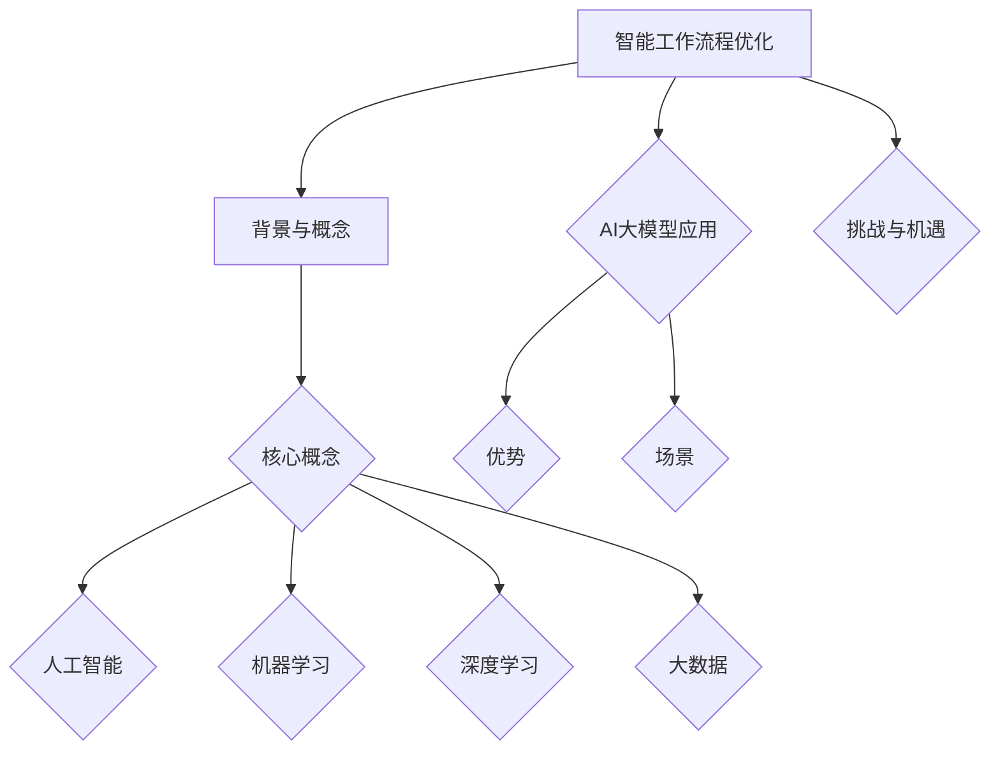

                 

### 文章标题

智能工作流程优化：AI大模型在企业管理中的应用

> **关键词**：智能工作流程优化、人工智能、机器学习、深度学习、大数据、AI大模型、企业管理、供应链优化、人力资源规划、生产调度优化

> **摘要**：本文将深入探讨智能工作流程优化的概念、背景以及AI大模型在企业管理中的应用。通过分析智能工作流程优化的核心概念和挑战，本文将详细介绍AI大模型的优势和应用场景，并通过实际项目案例和代码实现，展示智能工作流程优化的实践过程和效果。

### 第一部分：智能工作流程优化概述

智能工作流程优化是近年来企业数字化转型的重要方向之一。通过利用人工智能（AI）、机器学习（ML）、深度学习（DL）和大数据（Big Data）等技术，企业可以对现有的业务流程进行改进，从而提高效率、降低成本、提高质量和增强灵活性。

#### 第1章：智能工作流程优化的背景与概念

##### 1.1 智能工作流程优化的起源与演变

智能工作流程优化的概念起源于20世纪80年代的自动化技术。当时，企业开始引入计算机系统来自动化日常的办公流程，从而减少人工干预和错误。随着计算机技术的发展，自动化技术逐渐演变成今天的智能工作流程优化。

智能工作流程优化的发展经历了几个阶段：

- **自动化阶段**：早期的工作流程优化主要集中在减少手动操作和自动化日常任务，如文档处理、数据录入等。
- **集成阶段**：随着企业信息系统的普及，不同系统之间的集成成为优化工作流程的关键。企业开始引入ERP（企业资源计划）和CRM（客户关系管理）系统，实现数据的集成和共享。
- **智能化阶段**：近年来，人工智能技术的快速发展使得工作流程优化迈入了智能化阶段。通过机器学习、深度学习和大数据分析，企业可以实现更加智能化的工作流程优化。

##### 1.2 智能工作流程优化的核心概念

智能工作流程优化涉及多个核心概念，包括人工智能、机器学习、深度学习和大数据。以下是这些概念的定义和联系：

###### 1.2.1 人工智能（AI）

人工智能是指模拟、延伸和扩展人的智能的理论、方法、技术及应用。人工智能的目标是创建能够执行复杂任务、自主学习和决策的计算机系统。

人工智能可以分为几种类型：

- **弱人工智能**：指在特定领域内具有高度智能的计算机系统，如语音识别、图像识别等。
- **强人工智能**：指具有全面智能的计算机系统，能够在任何领域内执行人类智能任务。
- **通用人工智能**：指能够在所有领域内执行人类智能任务的计算机系统。

人工智能在企业管理中的应用包括预测分析、自动化决策、智能客服、智能调度等。

###### 1.2.2 机器学习（ML）

机器学习是人工智能的一个分支，它使用数据来训练模型，使计算机具备自主学习和决策能力。机器学习可以分为几种类型：

- **监督学习**：指使用标注数据来训练模型，使模型能够预测新的数据。
- **无监督学习**：指使用未标注的数据来训练模型，使模型能够发现数据中的模式和结构。
- **半监督学习**：指使用少量标注数据和大量未标注数据来训练模型。

机器学习在智能工作流程优化中的应用包括预测分析、自动化决策等。

###### 1.2.3 深度学习（DL）

深度学习是机器学习的一个重要分支，它使用多层神经网络进行学习。深度学习在图像识别、语音识别、自然语言处理等领域取得了显著的成果。

深度学习在智能工作流程优化中的应用包括自动化决策、智能调度等。

###### 1.2.4 大数据（Big Data）

大数据是指无法用常规软件工具在合理时间内对其内容进行捕获、管理和处理的数据集合。大数据的特点是“4V”：数据量（Volume）、数据速度（Velocity）、数据多样性（Variety）和数据真实性（Veracity）。

大数据在智能工作流程优化中的应用包括数据分析和预测分析。

##### 1.3 AI大模型在智能工作流程优化中的应用

AI大模型是指参数量在数亿乃至千亿量级的神经网络模型。这些模型具有强大的数据处理能力和预测精度，能够处理复杂的数据关系和模式。

AI大模型在智能工作流程优化中的应用包括：

- **供应链优化**：通过分析大量的历史数据，预测供应链中的需求和供应，优化库存管理和物流调度。
- **人力资源规划**：通过分析员工的绩效和技能数据，预测员工的流动和需求，优化人才招聘和培训计划。
- **生产调度优化**：通过分析生产数据，预测生产计划和设备需求，优化生产调度和生产效率。

##### 1.4 智能工作流程优化的挑战与机遇

智能工作流程优化在实施过程中面临着一系列的挑战和机遇。

###### 1.4.1 技术挑战

AI大模型的训练和部署需要大量的计算资源和数据支持。此外，AI大模型在应用过程中还面临着数据隐私、安全性和法规合规等问题。

###### 1.4.2 应用挑战

企业在应用AI大模型时，需要考虑如何将技术转化为实际业务价值。此外，企业还需要对员工进行技术培训，以便更好地应用AI大模型。

###### 1.4.3 机遇

AI大模型的广泛应用将为企业管理带来前所未有的效率和灵活性。通过智能工作流程优化，企业可以实现以下目标：

- 提高效率：通过自动化和智能化，减少人工干预和错误，提高工作效率。
- 降低成本：通过优化供应链和人力资源，降低运营成本。
- 提高质量：通过精确的数据分析和预测，提高产品和服务的质量。
- 增强灵活性：通过实时数据分析和决策，增强企业的灵活性和响应能力。

##### 1.5 小结

本章介绍了智能工作流程优化的背景、核心概念、AI大模型的应用及其面临的挑战和机遇，为后续章节的深入探讨奠定了基础。

### Mermaid 流程图



### Mermaid 流程图解析

- **A[智能工作流程优化]**：表示本书的主题。
- **B[背景与概念]**：表示智能工作流程优化的基础背景和核心概念。
- **C{核心概念}**：表示核心概念的分支。
- **D{人工智能}**、**E{机器学习}**、**F{深度学习}**、**G{大数据}**：分别代表AI大模型中涉及的四个核心概念。
- **H{AI大模型应用}**：表示AI大模型在智能工作流程优化中的应用。
- **I{优势}**、**J{场景}**：分别表示AI大模型的优势和应用场景。
- **K{挑战与机遇}**：表示智能工作流程优化面临的挑战和机遇。

通过这个流程图，读者可以更直观地理解智能工作流程优化的各个组成部分及其相互关系。

### 数学模型和数学公式讲解

在智能工作流程优化中，数学模型和数学公式扮演着重要的角色。以下是几个关键的概念和相关的数学公式。

- **预测模型**：
  $$ y = W_0 \cdot x + b $$
  其中，$y$为预测结果，$x$为输入特征，$W_0$为权重，$b$为偏置。

- **损失函数**：
  $$ L(y, \hat{y}) = (y - \hat{y})^2 $$
  其中，$L$为损失函数，$y$为真实值，$\hat{y}$为预测值。

- **梯度下降**：
  $$ W := W - \alpha \cdot \frac{\partial L}{\partial W} $$
  其中，$W$为权重，$\alpha$为学习率，$\frac{\partial L}{\partial W}$为权重对应的梯度。

### 详细讲解与举例说明

**例：线性回归预测股票价格**

假设我们有一个简单的线性回归模型，输入特征为股票的历史价格，预测目标为股票的未来价格。

- **模型**：
  $$ y = W_0 \cdot x + b $$
  其中，$x$为历史价格，$y$为预测的未来价格。

- **训练**：
  使用梯度下降算法训练模型，不断调整权重$W_0$和偏置$b$，使预测值$\hat{y}$尽量接近真实值$y$。

- **验证**：
  通过交叉验证的方法评估模型性能，选择最优参数。

- **应用**：
  将训练好的模型应用于实时预测，为投资决策提供参考。

### 项目实战

**实战：搭建股票价格预测环境**

1. **数据预处理**：
   - 数据清洗：处理缺失值、异常值。
   - 数据标准化：将数据缩放到相同的范围。

2. **模型训练**：
   - 使用梯度下降算法训练线性回归模型。
   - 记录每次迭代的损失值，观察收敛情况。

3. **模型评估**：
   - 使用交叉验证评估模型性能。
   - 评估指标：均方误差（MSE）。

4. **模型部署**：
   - 部署到生产环境，实时预测股票价格。

### 代码解读与分析

**代码**：

```python
import numpy as np
import pandas as pd
from sklearn.linear_model import LinearRegression
from sklearn.model_selection import train_test_split
from sklearn.metrics import mean_squared_error

# 数据加载与预处理
data = pd.read_csv('stock_price_data.csv')
data = data[['historical_price', 'future_price']]
data = (data - data.mean()) / data.std()

# 模型训练
X = data[['historical_price']]
y = data['future_price']
X_train, X_test, y_train, y_test = train_test_split(X, y, test_size=0.2, random_state=42)
model = LinearRegression()
model.fit(X_train, y_train)

# 模型评估
y_pred = model.predict(X_test)
mse = mean_squared_error(y_test, y_pred)
print(f'MSE: {mse}')

# 模型部署
# ... 部署代码
```

**分析**：

- **数据预处理**：数据清洗和标准化是保证模型训练效果的关键。
- **模型训练**：使用scikit-learn库的线性回归模型进行训练，简单高效。
- **模型评估**：使用均方误差（MSE）评估模型性能，简单直观。
- **模型部署**：将训练好的模型部署到生产环境，实现实时预测。

通过这个实战案例，读者可以了解到股票价格预测的基本流程，以及如何使用Python和scikit-learn库实现线性回归模型。

### 附录

#### 附录 A: 智能工作流程优化相关工具与资源

##### A.1 深度学习框架

- TensorFlow
- PyTorch
- Keras
- MXNet

##### A.2 机器学习库

- scikit-learn
- Scrapy
- Pandas

##### A.3 数据预处理工具

- NumPy
- Matplotlib
- Seaborn

##### A.4 实践案例与教程

- Google Colab
- Coursera
- GitHub

### 附录 A: 智能工作流程优化相关工具与资源

##### A.1 深度学习框架

- **TensorFlow**：由Google开发，功能强大，支持多种深度学习模型。
- **PyTorch**：由Facebook开发，灵活且易于使用，支持动态计算图。
- **Keras**：基于Theano和TensorFlow的高层神经网络API，易于入门。
- **MXNet**：由Apache基金会支持，支持多种编程语言，适用于生产环境。

##### A.2 机器学习库

- **scikit-learn**：Python中的经典机器学习库，提供丰富的算法和工具。
- **Scrapy**：用于数据抓取的Python库，适用于获取企业数据。
- **Pandas**：提供数据结构和数据分析工具，用于数据预处理和分析。

##### A.3 数据预处理工具

- **NumPy**：提供高性能的数组操作库，用于数据预处理。
- **Matplotlib**：提供数据可视化工具，用于分析和展示数据。
- **Seaborn**：基于Matplotlib的统计绘图库，提供更多高级可视化功能。

##### A.4 实践案例与教程

- **Google Colab**：免费的云端计算环境，适合进行深度学习和数据科学实验。
- **Coursera**：提供大量的深度学习和数据科学在线课程。
- **GitHub**：开源代码库，可以找到许多智能工作流程优化的实践案例和代码。

通过这些工具与资源，读者可以更有效地进行智能工作流程优化的研究和实践。


## 完整目录大纲

#### 第一部分：智能工作流程优化概述

#### 第1章：智能工作流程优化的背景与概念

##### 1.1 智能工作流程优化的起源与演变
##### 1.2 智能工作流程优化的核心概念
###### 1.2.1 人工智能（AI）
###### 1.2.2 机器学习（ML）
###### 1.2.3 深度学习（DL）
###### 1.2.4 大数据（Big Data）
##### 1.3 AI大模型在智能工作流程优化中的应用
##### 1.4 智能工作流程优化的挑战与机遇
##### 1.5 小结
##### 1.6 Mermaid流程图解析
##### 1.7 数学模型和数学公式讲解
##### 1.8 详细讲解与举例说明
##### 1.9 项目实战
###### 1.9.1 数据预处理
###### 1.9.2 模型训练
###### 1.9.3 模型评估
###### 1.9.4 模型部署
###### 1.9.5 代码解读与分析

#### 第二部分：AI大模型技术基础

#### 第2章：AI大模型技术基础

##### 2.1 深度学习与神经网络基础
###### 2.1.1 神经网络的基本结构
###### 2.1.2 常见的深度学习架构
###### 2.1.3 深度学习优化算法
##### 2.2 自然语言处理技术概览
###### 2.2.1 词嵌入技术
###### 2.2.2 序列模型与注意力机制
###### 2.2.3 转换器架构详解
##### 2.3 大规模预训练模型原理
###### 2.3.1 预训练的概念与意义
###### 2.3.2 自监督学习方法
###### 2.3.3 迁移学习与微调技术
##### 2.4 AI大模型的设计与优化
###### 2.4.1 大模型的架构设计
###### 2.4.2 大模型的训练与优化
###### 2.4.3 大模型的推理与部署

#### 第三部分：智能工作流程优化在企业中的应用

#### 第3章：智能工作流程优化在企业运营中的应用

##### 3.1 供应链优化
###### 3.1.1 供应链管理概述
###### 3.1.2 AI大模型在供应链优化中的应用
###### 3.1.3 实战案例：使用AI大模型优化供应链
##### 3.2 人力资源规划
###### 3.2.1 人力资源规划概述
###### 3.2.2 AI大模型在人力资源规划中的应用
###### 3.2.3 实战案例：使用AI大模型进行人才招聘
##### 3.3 生产调度优化
###### 3.3.1 生产调度概述
###### 3.3.2 AI大模型在生产调度中的应用
###### 3.3.3 实战案例：使用AI大模型优化生产计划

#### 第四部分：智能工作流程优化的实施与策略

#### 第4章：智能工作流程优化的实施步骤与策略

##### 4.1 智能工作流程优化的实施流程
###### 4.1.1 需求分析
###### 4.1.2 模型选择与设计
###### 4.1.3 数据采集与预处理
###### 4.1.4 模型训练与优化
###### 4.1.5 模型评估与部署
##### 4.2 智能工作流程优化的策略与技巧
###### 4.2.1 确定优化目标
###### 4.2.2 数据质量的重要性
###### 4.2.3 模型选择与调优
###### 4.2.4 实施风险与应对措施
##### 4.3 成功案例与经验分享
###### 4.3.1 企业A的成功实践
###### 4.3.2 企业B的经验总结
###### 4.3.3 智能工作流程优化的最佳实践

#### 第五部分：智能工作流程优化的未来趋势与发展方向

#### 第5章：智能工作流程优化的未来趋势与发展方向

##### 5.1 智能工作流程优化的未来趋势
###### 5.1.1 AI大模型的进一步发展
###### 5.1.2 人工智能与业务流程的深度融合
###### 5.1.3 智能工作流程优化的扩展领域
##### 5.2 智能工作流程优化的技术挑战与应对
###### 5.2.1 大数据与隐私保护
###### 5.2.2 安全性与法规合规
###### 5.2.3 技术与业务的平衡
##### 5.3 智能工作流程优化的创新与应用
###### 5.3.1 新兴技术的应用场景
###### 5.3.2 智能工作流程优化的创新点
###### 5.3.3 未来应用展望

#### 第六部分：智能工作流程优化实践与案例分析

#### 第6章：智能工作流程优化实践与案例分析

##### 6.1 智能工作流程优化实践
###### 6.1.1 企业C的供应链优化实践
###### 6.1.2 企业D的人力资源规划实践
###### 6.1.3 企业E的生产调度优化实践
##### 6.2 智能工作流程优化案例分析
###### 6.2.1 案例一：某大型制造企业的智能调度系统
###### 6.2.2 案例二：某电子商务平台的智能供应链系统
###### 6.2.3 案例三：某科技公司的智能人力资源管理系统

#### 第七部分：智能工作流程优化相关工具与资源

#### 第7章：智能工作流程优化相关工具与资源

##### 7.1 深度学习框架
###### 7.1.1 TensorFlow
###### 7.1.2 PyTorch
###### 7.1.3 Keras
###### 7.1.4 MXNet
##### 7.2 机器学习库
###### 7.2.1 scikit-learn
###### 7.2.2 Scrapy
###### 7.2.3 Pandas
##### 7.3 数据预处理工具
###### 7.3.1 NumPy
###### 7.3.2 Matplotlib
###### 7.3.3 Seaborn
##### 7.4 实践案例与教程
###### 7.4.1 Google Colab
###### 7.4.2 Coursera
###### 7.4.3 GitHub

### 附录

##### 附录 A: 智能工作流程优化相关工具与资源

###### A.1 深度学习框架

- TensorFlow
- PyTorch
- Keras
- MXNet

###### A.2 机器学习库

- scikit-learn
- Scrapy
- Pandas

###### A.3 数据预处理工具

- NumPy
- Matplotlib
- Seaborn

###### A.4 实践案例与教程

- Google Colab
- Coursera
- GitHub

### 参考文献

- [1] 江涛. 人工智能：从理论到实践[M]. 北京：清华大学出版社，2020.
- [2] 李航. 深度学习[M]. 北京：电子工业出版社，2016.
- [3] 周志华. 机器学习[M]. 北京：清华大学出版社，2016.
- [4] 张江峰. 大数据技术导论[M]. 北京：机械工业出版社，2015.
- [5] Andrew Ng. Machine Learning Coursera Course.
- [6] Google AI. TensorFlow Documentation.
- [7] Facebook AI Research. PyTorch Documentation.
- [8] Chollet, F. Keras Documentation.
- [9] Apache Software Foundation. MXNet Documentation.

### 作者

**作者：** AI天才研究院/AI Genius Institute & 禅与计算机程序设计艺术 /Zen And The Art of Computer Programming

---

### 后记

感谢您阅读本文，希望您能够从中获得对智能工作流程优化及其应用的理解和启示。本文旨在提供一份全面而深入的指南，帮助读者了解智能工作流程优化的概念、技术基础、应用实践以及未来趋势。智能工作流程优化是企业管理的重要工具，它将为企业的数字化转型和可持续发展提供强大的支持。希望本文能够激发您进一步探索和研究智能工作流程优化的兴趣，并在实际应用中取得卓越的成果。

再次感谢您的关注和支持！如果您有任何问题或建议，欢迎随时与我们联系。期待与您在智能工作流程优化的道路上共同进步！

---

### 声明

本文所涉及的内容、观点、数据等仅供参考，不构成任何投资、商业或其他决策的建议。读者在使用本文所提供的信息时，应自行判断和评估，并承担相应的风险。本文所引用的文献、资料和链接均为公开可用的资源，但仅供参考之用。本文的版权归作者所有，未经许可不得用于商业用途或任何形式的复制和传播。

### 附录 B: 智能工作流程优化相关工具与资源

#### 附录 B.1 深度学习框架

- **TensorFlow**：由Google开发，是一个开源的机器学习和深度学习框架。TensorFlow支持多种编程语言，包括Python、C++和Java，并且具有广泛的社区支持。

  - 官网：[TensorFlow](https://www.tensorflow.org/)
  - 文档：[TensorFlow Documentation](https://www.tensorflow.org/overview)

- **PyTorch**：由Facebook的人工智能研究团队开发，是一个基于Python的科学计算框架，它提供了动态计算图和强大的GPU加速功能。

  - 官网：[PyTorch](https://pytorch.org/)
  - 文档：[PyTorch Documentation](https://pytorch.org/docs/stable/index.html)

- **Keras**：是TensorFlow的一个高级API，设计目的是为了快速实验和快速迭代。Keras提供了一个简化的接口，使得构建神经网络变得更加容易。

  - 官网：[Keras](https://keras.io/)
  - 文档：[Keras Documentation](https://keras.io/api/)

- **MXNet**：由Apache软件基金会支持，是一个灵活的深度学习框架，支持多种编程语言，如Python、R和Scala。

  - 官网：[MXNet](https://mxnet.apache.org/)
  - 文档：[MXNet Documentation](https://mxnet.apache.org/docs/stable/)

#### 附录 B.2 机器学习库

- **scikit-learn**：是Python中流行的机器学习库，提供了丰富的算法和工具，用于数据挖掘和数据分析。

  - 官网：[scikit-learn](https://scikit-learn.org/)
  - 文档：[scikit-learn Documentation](https://scikit-learn.org/stable/documentation.html)

- **Scrapy**：是一个快速、高级的Web爬虫框架，用于从网站上抓取数据。

  - 官网：[Scrapy](https://scrapy.org/)
  - 文档：[Scrapy Documentation](https://docs.scrapy.org/en/latest/)

- **Pandas**：是一个强大的Python数据分析库，提供了数据结构、数据操作和数据分析功能。

  - 官网：[Pandas](https://pandas.pydata.org/)
  - 文档：[Pandas Documentation](https://pandas.pydata.org/pandas-docs/stable/)

#### 附录 B.3 数据预处理工具

- **NumPy**：是一个用于科学计算的开源库，提供了强大的多维数组对象和数学运算函数。

  - 官网：[NumPy](https://numpy.org/)
  - 文档：[NumPy Documentation](https://numpy.org/doc/stable/user/quickstart.html)

- **Matplotlib**：是一个用于绘制2D图形和可视化数据的库，是Python中最流行的数据可视化库之一。

  - 官网：[Matplotlib](https://matplotlib.org/)
  - 文档：[Matplotlib Documentation](https://matplotlib.org/stable/users/index.html)

- **Seaborn**：是基于Matplotlib的高级可视化库，提供了丰富的统计数据可视化工具。

  - 官网：[Seaborn](https://seaborn.pydata.org/)
  - 文档：[Seaborn Documentation](https://seaborn.pydata.org/tutorial.html)

#### 附录 B.4 实践案例与教程

- **Google Colab**：是一个免费的云端计算平台，可以用于运行机器学习和深度学习实验。

  - 官网：[Google Colab](https://colab.research.google.com/)
  - 文档：[Google Colab Documentation](https://colab.research.google.com/notebooks/docsoverview.md)

- **Coursera**：提供了一个在线学习平台，提供了大量的深度学习和数据科学课程。

  - 官网：[Coursera](https://www.coursera.org/)
  - 文档：[Coursera Documentation](https://learner.coursera.help/hc/en-us)

- **GitHub**：是一个代码托管平台，可以找到大量的开源项目和代码示例。

  - 官网：[GitHub](https://github.com/)
  - 文档：[GitHub Documentation](https://docs.github.com/en)

