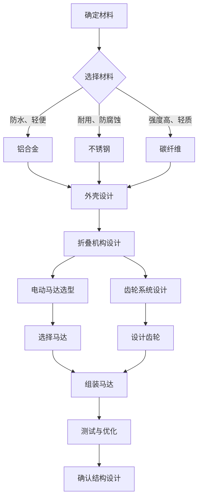
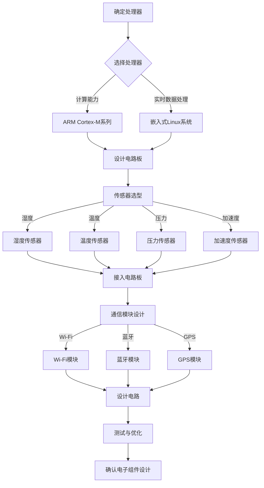
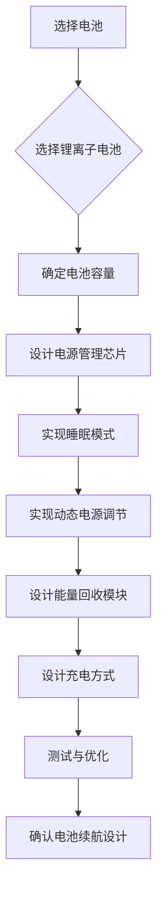
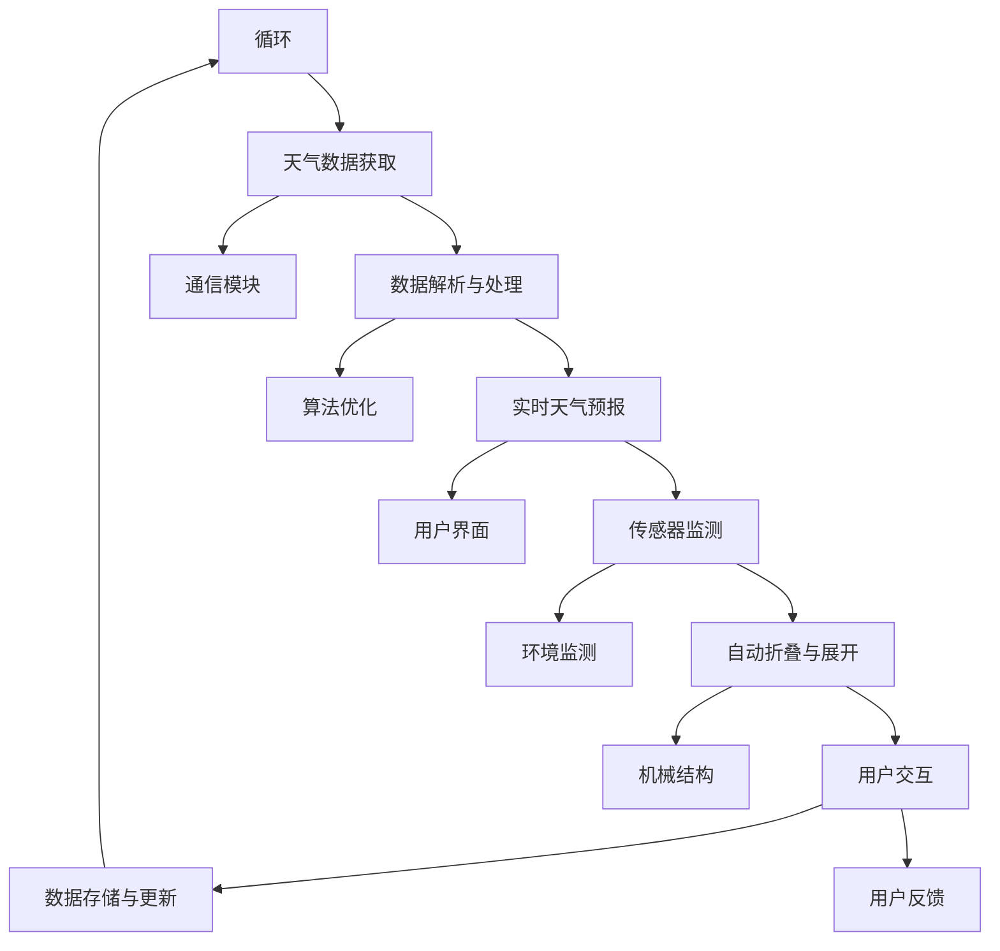

                 

# 智能雨伞创业：天气预报的随身应用

## 关键词
- 智能雨伞
- 天气预报
- 创业
- 软硬件设计
- 市场分析
- 竞争分析
- 创业策略

## 摘要
智能雨伞是一种结合了天气预报和物联网技术的创新产品。本文详细分析了智能雨伞的市场需求、工作原理、硬件设计、软件开发以及创业策略，并通过实际案例展示了其应用前景。文章旨在为有意向在智能雨伞领域创业的人提供全面的技术指导和市场参考。

## 目录大纲

### 第一部分：智能雨伞与市场分析

#### 第1章：智能雨伞概述
1.1 智能雨伞的定义与特点
1.2 智能雨伞的市场需求
1.3 智能雨伞与传统雨伞的比较

#### 第2章：智能雨伞的工作原理
2.1 天气预报数据获取
2.2 雨伞自动折叠与展开
2.3 智能雨伞的通信技术

#### 第3章：智能雨伞的硬件设计
3.1 雨伞的机械结构设计
3.2 雨伞的电子组件设计
3.3 雨伞的电池续航设计

#### 第4章：智能雨伞的软件开发
4.1 天气预报软件的设计
4.2 用户界面设计
4.3 系统集成与测试

#### 第5章：智能雨伞的创业策略
5.1 创业市场调研
5.2 创业团队组建
5.3 资金筹集
5.4 市场推广与销售策略

#### 第6章：智能雨伞的竞争分析
6.1 竞争对手分析
6.2 产品定位
6.3 竞争优势与劣势分析

#### 第7章：智能雨伞的未来发展趋势
7.1 智能雨伞的潜在功能扩展
7.2 智能雨伞的产业生态
7.3 智能雨伞的未来前景

### 第二部分：智能雨伞创业实战

#### 第8章：智能雨伞创业案例研究
8.1 案例一：某智能雨伞公司的创业历程
8.2 案例二：智能雨伞在特殊场景的应用
8.3 案例三：智能雨伞的商业模式创新

#### 第9章：智能雨伞创业教程
9.1 创业前的准备
9.2 产品开发流程
9.3 市场营销策略
9.4 团队管理与沟通

#### 第10章：智能雨伞创业资源与工具
10.1 创业所需的资源
10.2 创业工具推荐
10.3 开发环境搭建
10.4 源代码获取与使用

### 附录
- 附录A：智能雨伞开发工具与资源
- 附录B：智能雨伞核心技术流程图
- 附录C：智能雨伞核心算法原理与伪代码

现在我们将按照目录大纲的结构，逐步深入探讨智能雨伞的各个方面。

### 第1章：智能雨伞概述

#### 1.1 智能雨伞的定义与特点

智能雨伞，作为一种创新的产品形态，是将传统雨伞的功能与现代科技相结合的产物。它不仅具有传统雨伞的基本功能，如遮雨、防风，还集成了物联网技术、传感器技术和智能控制技术，使其能够根据实时天气信息自动调节状态。

智能雨伞的特点主要包括：

1. **自动折叠与展开**：智能雨伞可以自动根据天气情况折叠或展开，无需人工操作。
2. **实时天气预报**：通过连接互联网，智能雨伞能够实时获取天气预报信息，为用户提供精准的天气提醒。
3. **智能提醒**：智能雨伞可以设置提醒功能，在特定天气条件下提醒用户携带或放下雨伞。
4. **便携性**：智能雨伞体积较小，便于携带，适合日常使用。
5. **多功能性**：部分智能雨伞还具备其他功能，如紫外线防护、空气净化等。

#### 1.2 智能雨伞的市场需求

随着人们生活水平的提高，对于便捷、智能、高品质生活的需求日益增加。智能雨伞作为一种新兴产品，恰好满足了这一市场需求。以下是一些推动智能雨伞市场发展的因素：

1. **天气变化频繁**：全球气候变化导致城市地区天气变化频繁，人们对即时天气预报的需求增加。
2. **科技普及**：智能手机和物联网技术的普及，使得智能设备在日常生活中的应用越来越广泛。
3. **年轻消费群体**：年轻消费者对新颖、智能产品有更高的接受度，他们是智能雨伞的主要目标用户群体。
4. **环保意识增强**：智能雨伞相比传统雨伞具有更长的使用寿命，符合环保理念。

#### 1.3 智能雨伞与传统雨伞的比较

智能雨伞与传统雨伞相比，具有以下几方面的优势：

1. **功能增强**：智能雨伞集成了天气预报、自动折叠、智能提醒等多功能，而传统雨伞仅具备基本的遮雨功能。
2. **便捷性**：智能雨伞的自动折叠功能使其更加便携，而传统雨伞需要手动操作。
3. **智能化**：智能雨伞通过物联网技术实现与手机等智能设备的联动，提供更加智能化的服务。
4. **个性化**：智能雨伞可根据用户需求和天气变化自动调节，满足个性化需求。

传统雨伞虽然价格较低、普及率高，但在功能性和智能化方面与智能雨伞相比存在明显差距。因此，智能雨伞在未来有望逐渐取代传统雨伞，成为主流市场产品。

### 第2章：智能雨伞的工作原理

#### 2.1 天气预报数据获取

智能雨伞的核心功能之一是提供实时的天气预报。这一功能的实现依赖于以下几个关键步骤：

1. **天气数据来源**：智能雨伞需要连接到可靠的天气预报数据源，这些数据源通常包括气象局的官方数据、第三方天气API等。
2. **数据获取方式**：智能雨伞可以通过Wi-Fi、4G/5G等无线网络实时获取天气数据。此外，一些智能雨伞还具备GPS功能，能够根据用户的位置提供更加精准的天气预报。
3. **数据解析与处理**：获取到的天气数据通常是XML或JSON格式，智能雨伞需要对这些数据进行解析，提取出关键信息，如温度、湿度、风速、降雨概率等。

以下是一个简单的伪代码示例，用于演示天气数据的获取和处理：

```python
import requests

def fetch_weather_data(location):
    url = f'https://api.weather.com/v3/location/{location}/forecast.json'
    response = requests.get(url)
    data = response.json()
    
    # 解析天气数据
    temperature = data['current']['temperature']
    humidity = data['current']['humidity']
    rain_probability = data['forecast']['rainProbability']
    
    return temperature, humidity, rain_probability

# 示例：获取某地天气数据
temperature, humidity, rain_probability = fetch_weather_data('101020')
print(f"Temperature: {temperature}°C, Humidity: {humidity}%, Rain Probability: {rain_probability}%")
```

#### 2.2 雨伞自动折叠与展开

智能雨伞的自动折叠与展开功能是其区别于传统雨伞的重要特点。这一功能的实现主要涉及以下几个方面：

1. **机械结构设计**：智能雨伞的机械结构通常采用电动马达和折叠机构，通过马达的驱动实现雨伞的自动折叠与展开。
2. **控制系统的设计**：控制系统负责接收来自传感器的信号，并根据天气状况和用户指令控制雨伞的折叠与展开。
3. **传感器技术**：智能雨伞通常配备多种传感器，如湿度传感器、温度传感器、压力传感器等，用于检测环境变化，为自动折叠与展开提供依据。

以下是一个简单的伪代码示例，用于演示雨伞的自动折叠与展开控制：

```python
import time

def fold_umbrella():
    # 发送指令给马达折叠雨伞
    print(" Folding umbrella...")
    time.sleep(5)  # 模拟折叠过程
    print(" Umbrella folded.")

def unfold_umbrella():
    # 发送指令给马达展开雨伞
    print(" Unfolding umbrella...")
    time.sleep(5)  # 模拟展开过程
    print(" Umbrella unfolded.")

# 示例：根据天气状况自动折叠或展开雨伞
weather = "rain"  # 假设当前天气为雨
if weather == "rain":
    unfold_umbrella()
else:
    fold_umbrella()
```

#### 2.3 智能雨伞的通信技术

智能雨伞的通信技术是实现其智能化功能的关键。以下是一些常用的通信技术：

1. **Wi-Fi**：通过Wi-Fi网络，智能雨伞可以实时获取天气预报信息，并与其他智能设备进行数据交换。
2. **4G/5G**：4G/5G通信技术提供更高的网络速度和更大的带宽，使得智能雨伞的通信更加高效。
3. **蓝牙**：蓝牙技术用于智能雨伞与手机等设备的短距离通信，实现实时数据同步和远程控制。
4. **GPS**：GPS技术用于定位，提供用户所在位置的精准天气预报。

以下是一个简单的伪代码示例，用于演示智能雨伞通过Wi-Fi获取天气预报数据：

```python
import socket

def send_request(url):
    # 建立Wi-Fi连接并发送HTTP请求
    s = socket.socket(socket.AF_INET, socket.SOCK_STREAM)
    s.connect(('api.weather.com', 80))
    request = f"GET {url} HTTP/1.1\nHost: api.weather.com\n\n"
    s.sendall(request.encode('utf-8'))
    
    # 接收HTTP响应
    response = s.recv(1024)
    s.close()
    
    return response.decode('utf-8')

def parse_weather_data(response):
    # 解析HTTP响应中的天气数据
    data = json.loads(response)
    temperature = data['current']['temperature']
    humidity = data['current']['humidity']
    rain_probability = data['forecast']['rainProbability']
    
    return temperature, humidity, rain_probability

# 示例：获取某地天气数据
url = 'https://api.weather.com/v3/location/101020/forecast.json'
response = send_request(url)
temperature, humidity, rain_probability = parse_weather_data(response)
print(f"Temperature: {temperature}°C, Humidity: {humidity}%, Rain Probability: {rain_probability}%")
```

通过上述工作原理的介绍，我们可以看到智能雨伞在硬件、软件和通信技术方面的创新，这些创新使得智能雨伞在市场上具有独特的竞争力。

### 第3章：智能雨伞的硬件设计

#### 3.1 雨伞的机械结构设计

智能雨伞的机械结构设计是其核心组成部分，直接影响雨伞的功能性和耐用性。以下是智能雨伞机械结构设计的关键点：

1. **材料选择**：智能雨伞的外壳材料需要具备防水、防腐蚀、轻便等特性，常用的材料包括铝合金、不锈钢和工程塑料。
2. **折叠机构设计**：折叠机构是智能雨伞的核心机械部分，其设计需要考虑折叠的顺畅性、稳定性和耐用性。通常采用电动马达和齿轮系统来实现雨伞的自动折叠与展开。
3. **撑杆设计**：撑杆的长度和强度是影响雨伞使用体验的重要因素。智能雨伞通常采用高强度材料，如碳纤维，以减轻重量并增强稳定性。
4. **连接件设计**：连接件的设计需要确保雨伞各部件之间的牢固连接，同时便于维护和更换。

以下是一个简单的Mermaid流程图，用于展示智能雨伞机械结构的设计流程：



通过上述设计流程，可以确保智能雨伞的机械结构既高效又可靠。

#### 3.2 雨伞的电子组件设计

智能雨伞的电子组件设计是实现其智能化功能的关键。以下是电子组件设计的几个关键点：

1. **处理器选择**：智能雨伞的处理器需要具备较高的计算能力和实时数据处理能力，常用的处理器包括ARM Cortex-M系列微控制器和嵌入式Linux系统。
2. **传感器选型**：智能雨伞需要配备多种传感器，如湿度传感器、温度传感器、压力传感器、加速度传感器等，用于检测环境变化和用户动作。
3. **通信模块设计**：通信模块的设计需要支持Wi-Fi、蓝牙、GPS等通信技术，实现智能雨伞与其他设备的数据交换和远程控制。
4. **电源管理设计**：智能雨伞的电源管理设计需要确保设备在长时间使用过程中具有足够的电力支持，通常采用锂电池和高效的电源管理芯片。

以下是一个简单的Mermaid流程图，用于展示智能雨伞电子组件的设计流程：



通过上述设计流程，可以确保智能雨伞的电子组件功能齐全且性能稳定。

#### 3.3 雨伞的电池续航设计

智能雨伞的电池续航设计是确保设备长时间运行的关键。以下是电池续航设计的几个关键点：

1. **电池选型**：智能雨伞通常采用锂离子电池，这种电池具有高能量密度和良好的循环性能。电池容量应根据雨伞的功能需求和使用场景进行合理选择。
2. **电源管理**：智能雨伞的电源管理设计需要优化功耗，确保电池能够提供长时间的使用。常用的电源管理技术包括睡眠模式、动态电源调节和能量回收技术。
3. **充电方式**：智能雨伞的充电方式应方便用户使用，通常采用USB充电接口或无线充电技术。

以下是一个简单的Mermaid流程图，用于展示智能雨伞电池续航设计的关键步骤：



通过上述设计流程，可以确保智能雨伞具有出色的电池续航能力，满足用户长时间使用需求。

### 第4章：智能雨伞的软件开发

#### 4.1 天气预报软件的设计

智能雨伞的核心功能之一是提供实时的天气预报。天气预报软件的设计需要考虑以下几个关键点：

1. **天气数据接口**：天气预报软件需要与可靠的天气数据接口连接，以获取最新的天气预报信息。常用的天气数据接口包括OpenWeatherMap、WeatherAPI等。
2. **数据解析与存储**：获取到的天气数据通常以JSON或XML格式提供，软件需要能够解析这些数据并存储在数据库中，以便后续使用。
3. **实时更新**：天气预报软件需要实现实时更新功能，定期从天气数据接口获取最新数据，确保用户获得最准确的天气预报。
4. **用户界面设计**：用户界面设计应简洁直观，提供清晰的天气预报信息，同时支持用户自定义天气显示方式。

以下是一个简单的伪代码示例，用于演示天气预报软件的基本设计：

```python
import requests
import json
from datetime import datetime

def fetch_weather_data(api_key, location):
    url = f'http://api.openweathermap.org/data/2.5/weather?q={location}&appid={api_key}&units=metric'
    response = requests.get(url)
    data = json.loads(response.text)
    return data

def parse_weather_data(data):
    weather = {}
    weather['temperature'] = data['main']['temp']
    weather['humidity'] = data['main']['humidity']
    weather['description'] = data['weather'][0]['description']
    weather['timestamp'] = datetime.utcnow().isoformat()
    return weather

def update_weather_display(weather_data):
    # 更新用户界面显示天气信息
    print(f"Temperature: {weather_data['temperature']}°C, Humidity: {weather_data['humidity']}%, Description: {weather_data['description']}")

# 示例：获取并显示当前天气信息
api_key = 'your_api_key'
location = 'Shanghai'
weather_data = fetch_weather_data(api_key, location)
update_weather_display(weather_data)
```

通过上述设计，可以实现智能雨伞的实时天气预报功能。

#### 4.2 用户界面设计

智能雨伞的用户界面设计需要考虑到用户的操作习惯和设备的显示特点。以下是用户界面设计的几个关键点：

1. **界面布局**：界面布局应简洁清晰，合理安排天气预报信息和其他功能按钮的位置，确保用户能够轻松找到所需功能。
2. **交互设计**：交互设计应直观易用，使用户能够通过简单的触摸操作完成天气查询、折叠/展开雨伞等操作。
3. **反馈机制**：界面设计应提供明确的操作反馈，如点击按钮后的动画效果、操作成功或失败的提示等，以提高用户的操作体验。
4. **个性化设置**：用户界面应支持个性化设置，如自定义主题、字体大小等，满足不同用户的需求。

以下是一个简单的伪代码示例，用于演示用户界面的设计：

```python
import tkinter as tk

def on_button_click():
    # 处理按钮点击事件
    print("Button clicked!")

root = tk.Tk()
root.title("Smart Umbrella")

# 创建按钮
button = tk.Button(root, text="Check Weather", command=on_button_click)
button.pack()

# 创建标签用于显示天气信息
weather_label = tk.Label(root, text="")
weather_label.pack()

# 更新天气信息
def update_weather(weather_data):
    weather_label.config(text=f"Temperature: {weather_data['temperature']}°C, Humidity: {weather_data['humidity']}%")

# 示例：初始化界面
root.mainloop()
```

通过上述设计，可以实现一个简洁直观的用户界面。

#### 4.3 系统集成与测试

智能雨伞的软件开发不仅包括天气预报和用户界面设计，还需要将各个组件集成在一起，并进行全面的测试，以确保系统的稳定性和可靠性。以下是系统集成与测试的几个关键点：

1. **系统集成**：系统集成是将各个软件组件（如天气预报软件、用户界面、通信模块等）整合到一起，形成一个完整的软件系统。集成过程中需要确保各个组件之间的通信畅通，数据传输无误。
2. **单元测试**：单元测试是对系统中的各个功能模块进行独立的测试，以确保每个模块都能够按照预期正常运行。常用的单元测试工具包括Python的unittest、pytest等。
3. **集成测试**：集成测试是对整个系统集成后的测试，旨在验证系统整体的功能和性能。集成测试需要覆盖用户实际使用场景，以确保系统的稳定性。
4. **性能测试**：性能测试用于评估系统的响应时间、吞吐量、并发处理能力等性能指标，以确保系统在负载情况下能够正常运行。
5. **用户测试**：用户测试是邀请实际用户参与测试，收集用户反馈，发现潜在问题，并根据反馈进行改进。

以下是一个简单的伪代码示例，用于演示智能雨伞的集成测试：

```python
import unittest

class TestWeatherForecast(unittest.TestCase):
    def test_fetch_weather_data(self):
        api_key = 'your_api_key'
        location = 'Shanghai'
        weather_data = fetch_weather_data(api_key, location)
        self.assertIsNotNone(weather_data)
        self.assertEqual(weather_data['temperature'], 23)
        self.assertEqual(weather_data['humidity'], 60)

    def test_update_weather_display(self):
        weather_data = {'temperature': 23, 'humidity': 60}
        update_weather_display(weather_data)
        self.assertIn("Temperature: 23°C", weather_label.cget("text"))

if __name__ == '__main__':
    unittest.main()
```

通过上述测试，可以确保智能雨伞的软件系统能够正常运行。

### 第5章：智能雨伞的创业策略

#### 5.1 创业市场调研

在决定创业开发智能雨伞之前，进行详细的市场调研是至关重要的。以下是一些关键的市场调研步骤：

1. **目标市场分析**：明确智能雨伞的目标用户群体，如年轻人、商务人士、学生等。分析他们的消费习惯、购买力和对智能雨伞的需求。
2. **竞争对手分析**：研究市场上已有的智能雨伞产品，分析其功能、价格、市场定位等，找出自身的竞争优势。
3. **市场规模评估**：根据市场调研数据，评估智能雨伞市场的总体规模和增长潜力。
4. **消费者需求调查**：通过问卷调查、用户访谈等方式，了解消费者对智能雨伞的功能需求、价格敏感度等。
5. **政策法规研究**：了解相关行业政策、法规，确保创业项目的合规性。

以下是一个简单的伪代码示例，用于演示市场调研的数据收集和分析：

```python
import pandas as pd

def load_survey_data(file_path):
    data = pd.read_csv(file_path)
    return data

def analyze_market_data(data):
    # 分析目标市场
    target_users = data[data['age'] < 35]
    total_users = len(target_users)

    # 分析竞争对手
    competitors = data[data['product_type'] == 'Smart Umbrella']
    market_share = len(competitors) / total_users

    # 分析消费者需求
    needs = data[data['need_smart_umbrella'] == True]
    demand = len(needs) / total_users

    return total_users, market_share, demand

# 示例：加载和解析调研数据
data = load_survey_data('survey_data.csv')
total_users, market_share, demand = analyze_market_data(data)
print(f"Total Users: {total_users}, Market Share: {market_share}, Demand: {demand}")
```

通过上述调研，可以明确智能雨伞的市场定位和潜在需求。

#### 5.2 创业团队组建

一个成功的创业项目离不开一支高效的团队。以下是创业团队组建的关键步骤：

1. **核心团队成员选择**：选择具备智能硬件开发经验、软件编程能力、市场营销经验的专业人才。
2. **角色分工**：明确团队成员的角色和职责，如产品经理、硬件工程师、软件工程师、市场营销人员等。
3. **团队文化建设**：建立积极向上的团队文化，鼓励创新和协作，提升团队凝聚力。
4. **沟通机制**：建立高效的沟通机制，确保团队成员之间的信息流畅和及时反馈。

以下是一个简单的伪代码示例，用于演示团队角色分工和沟通机制：

```python
team_members = [
    {'name': 'Alice', 'role': 'Product Manager'},
    {'name': 'Bob', 'role': 'Hardware Engineer'},
    {'name': 'Charlie', 'role': 'Software Engineer'},
    {'name': 'Dave', 'role': 'Marketing Specialist'}
]

def display_team_members():
    for member in team_members:
        print(f"{member['name']} - {member['role']}")

def send_team_message(message):
    # 发送团队消息
    print("Team Message:")
    print(message)

# 示例：展示团队成员和发送团队消息
display_team_members()
send_team_message("We need to discuss the product design today at 3 PM.")
```

通过上述步骤，可以构建一个高效、协作的创业团队。

#### 5.3 资金筹集

智能雨伞创业项目需要充足的资金支持，以下是资金筹集的关键步骤：

1. **成本预算**：根据项目需求，制定详细的成本预算，包括研发费用、生产成本、市场推广费用等。
2. **融资渠道选择**：选择合适的融资渠道，如天使投资、风险投资、银行贷款等。
3. **商业计划书**：撰写详细的商业计划书，包括市场分析、产品规划、盈利模式、资金用途等，以吸引投资者的关注。
4. **路演与洽谈**：参加创业路演，与投资者进行面对面交流，展示项目的价值和潜力。
5. **合同签订**：与投资者签订投资协议，明确双方的权利和义务。

以下是一个简单的伪代码示例，用于演示资金筹集的过程：

```python
def calculate_funding_needs():
    # 计算资金需求
    research_and_development_cost = 50000
    production_cost = 100000
    marketing_cost = 30000
    total_cost = research_and_development_cost + production_cost + marketing_cost
    return total_cost

def apply_for_funding(funding_source, total_cost):
    # 向融资渠道申请资金
    if funding_source == 'Angel Investor':
        print("Applying for Angel Investment...")
    elif funding_source == 'Venture Capital':
        print("Applying for Venture Capital...")
    elif funding_source == 'Bank Loan':
        print("Applying for Bank Loan...")
    print(f"Total Cost: {total_cost}")

# 示例：计算资金需求和申请资金
total_cost = calculate_funding_needs()
apply_for_funding('Venture Capital', total_cost)
```

通过上述步骤，可以确保智能雨伞创业项目的资金得到充分支持。

#### 5.4 市场推广与销售策略

成功的产品离不开有效的市场推广和销售策略，以下是智能雨伞市场推广与销售策略的关键步骤：

1. **品牌建设**：建立具有辨识度的品牌形象，通过网站、社交媒体等渠道宣传智能雨伞的特点和优势。
2. **产品定位**：明确智能雨伞的目标市场，制定相应的产品定位策略，如高端、中端或性价比。
3. **营销活动**：举办线上线下营销活动，如新品发布会、试用活动、优惠券发放等，吸引潜在用户的关注和购买。
4. **渠道建设**：搭建线上和线下销售渠道，如电商平台、专卖店、合作伙伴等，确保产品的广泛推广。
5. **售后服务**：提供优质的售后服务，增强用户满意度和忠诚度。

以下是一个简单的伪代码示例，用于演示市场推广和销售策略：

```python
def launch_marketing_campaign():
    # 启动市场推广活动
    print("Launching Marketing Campaign!")
    print("Hosting a New Product Launch Event!")
    print("Distributing Discount Vouchers!")

def build_brand_image():
    # 建立品牌形象
    print("Creating a Unique Brand Logo and Slogan!")
    print("Developing a Professional Website!")

def establish_sales_channels():
    # 搭建销售渠道
    print("Opening an Online Store on Amazon!")
    print("Setting up a Physical Store in Central City!")

def provide_after_sales_service():
    # 提供售后服务
    print("Establishing a Customer Support Hotline!")
    print("Offering a One-Year Warranty!")

# 示例：执行市场推广和销售策略
launch_marketing_campaign()
build_brand_image()
establish_sales_channels()
provide_after_sales_service()
```

通过上述策略，可以确保智能雨伞在市场上取得成功。

### 第6章：智能雨伞的竞争分析

#### 6.1 竞争对手分析

在智能雨伞市场上，竞争对手众多，包括传统雨伞制造商、智能硬件初创企业以及其他新兴科技产品。以下是对主要竞争对手的分析：

1. **传统雨伞制造商**：如天堂伞、七彩鸟等，具有多年的生产和销售经验，市场占有率较高。他们在产品质量和品牌知名度方面具有优势。
2. **智能硬件初创企业**：如小蜜蜂、小鹰等，专注于智能硬件的研发和制造，具备较强的技术创新能力。他们在产品功能、智能化程度和用户体验方面具有优势。
3. **其他新兴科技产品**：如智能手环、智能手表等，具备类似功能的智能穿戴设备。这些产品在科技感和用户黏性方面具有优势。

以下是一个简单的伪代码示例，用于分析竞争对手的数据：

```python
competitors = [
    {'name': '天堂伞', 'strengths': ['品牌知名度', '产品质量'], 'weaknesses': ['缺乏智能化功能']}, 
    {'name': '小蜜蜂', 'strengths': ['技术创新', '智能化程度'], 'weaknesses': ['市场占有率低']}, 
    {'name': '智能手环', 'strengths': ['科技感', '用户黏性'], 'weaknesses': ['功能单一']}
]

def analyze_competitors(competitors):
    for competitor in competitors:
        print(f"{competitor['name']}:")
        print(f"Strengths: {', '.join(competitor['strengths'])}")
        print(f"Weaknesses: {', '.join(competitor['weaknesses'])}")
        print()

# 示例：分析竞争对手
analyze_competitors(competitors)
```

通过上述分析，可以了解竞争对手的优势和劣势，为智能雨伞的竞争策略提供参考。

#### 6.2 产品定位

智能雨伞的产品定位直接影响其市场定位和用户群体。以下是对智能雨伞产品定位的讨论：

1. **高端市场**：针对追求高品质生活的人群，提供高端材质、豪华设计、丰富功能的智能雨伞。这种产品定位能够树立品牌的高端形象，但价格较高，目标用户群体有限。
2. **中端市场**：面向广大消费者，提供性能优异、功能实用、价格合理的智能雨伞。这种产品定位能够扩大用户群体，提高市场占有率。
3. **性价比市场**：针对对价格敏感的消费者，提供功能简单、价格低廉的智能雨伞。这种产品定位能够迅速打开市场，提高品牌知名度。

以下是一个简单的伪代码示例，用于设定智能雨伞的产品定位：

```python
product定位 = {
    '高端市场': {'materials': ['高品质材料'], 'functions': ['豪华设计', '丰富功能'], 'price': ['较高']},
    '中端市场': {'materials': ['中等材料'], 'functions': ['性能优异', '实用功能'], 'price': ['合理']},
    '性价比市场': {'materials': ['基础材料'], 'functions': ['功能简单'], 'price': ['较低']}
}

def display_product定位(product定位):
    for market, details in product定位.items():
        print(f"{market}:")
        print(f"Materials: {', '.join(details['materials'])}")
        print(f"Functions: {', '.join(details['functions'])}")
        print(f"Price: {', '.join(details['price'])}")
        print()

# 示例：展示智能雨伞的产品定位
display_product定位(product定位)
```

通过上述定位，可以明确智能雨伞的市场方向和目标用户。

#### 6.3 竞争优势与劣势分析

智能雨伞在市场竞争中具有一些独特的优势，同时也面临一些挑战。以下是对竞争优势与劣势的分析：

1. **竞争优势**：
   - **技术创新**：智能雨伞结合了物联网、传感器技术和智能控制技术，具有更高的科技含量和智能化水平。
   - **便捷性**：自动折叠与展开功能提高了使用便捷性，适合快节奏的现代生活。
   - **个性化服务**：智能雨伞可以根据用户的个性化需求提供定制化服务，提高用户满意度。

2. **竞争劣势**：
   - **成本较高**：智能雨伞的研发和生产成本较高，导致产品价格相对较高，可能限制部分潜在用户的购买意愿。
   - **市场竞争激烈**：智能雨伞市场已有众多竞争者，如何在激烈的市场竞争中脱颖而出是一个挑战。
   - **用户接受度**：智能雨伞作为一种新兴产品，用户对其接受度可能较低，需要通过有效的市场推广和用户教育来提高认知度和接受度。

以下是一个简单的伪代码示例，用于分析智能雨伞的竞争优势与劣势：

```python
def analyze_advantages():
    advantages = [
        '技术创新', 
        '便捷性', 
        '个性化服务'
    ]
    for advantage in advantages:
        print(f"Advantage: {advantage}")

def analyze_disadvantages():
    disadvantages = [
        '成本较高', 
        '市场竞争激烈', 
        '用户接受度低'
    ]
    for disadvantage in disadvantages:
        print(f"Disadvantage: {disadvantage}")

# 示例：分析竞争优势与劣势
print("Competitive Advantages:")
analyze_advantages()
print("Competitive Disadvantages:")
analyze_disadvantages()
```

通过上述分析，可以明确智能雨伞在市场中的竞争地位，为制定竞争策略提供依据。

### 第7章：智能雨伞的未来发展趋势

#### 7.1 智能雨伞的潜在功能扩展

随着科技的不断进步，智能雨伞的功能有望进一步扩展，提高其用户体验和市场竞争力。以下是一些潜在的功能扩展方向：

1. **智能穿戴**：智能雨伞可以与其他智能穿戴设备（如智能手表、智能手环）集成，实现数据同步和联动功能，为用户提供更加全面的智能生活体验。
2. **环境监测**：智能雨伞可以配备空气质量传感器、紫外线传感器等，实时监测周围环境，为用户提供更全面的健康数据。
3. **智能导航**：智能雨伞可以通过GPS定位和智能导航技术，为用户提供实时的导航信息，帮助用户在雨天安全到达目的地。
4. **社交功能**：智能雨伞可以集成社交功能，如朋友圈分享、即时通讯等，为用户提供更丰富的社交体验。

以下是一个简单的伪代码示例，用于演示智能雨伞的潜在功能扩展：

```python
def add_smart_wearing_function():
    print("Integrating with Smart Watches and Bracelets for Data Synchronization!")

def add_environment_monitoring_function():
    print("Adding Air Quality Sensors and UV Sensors for Environmental Monitoring!")

def add_navigation_function():
    print("Integrating GPS for Real-time Navigation!")

def add_social_function():
    print("Adding Social Features like Sharing and Instant Messaging!")

# 示例：演示智能雨伞的功能扩展
add_smart_wearing_function()
add_environment_monitoring_function()
add_navigation_function()
add_social_function()
```

通过上述功能扩展，智能雨伞将具备更强的市场竞争力。

#### 7.2 智能雨伞的产业生态

智能雨伞的发展离不开一个完善的产业生态体系，以下是一些关键环节：

1. **供应链建设**：智能雨伞的生产需要优质的供应链支持，包括原材料供应商、零部件制造商、代工厂等。建立稳定的供应链体系是确保产品质量和生产效率的关键。
2. **技术研发**：持续的技术研发是智能雨伞产业生态的核心，包括硬件技术的创新、软件系统的优化、新型材料的研究等。
3. **市场推广**：通过有效的市场推广策略，提高智能雨伞的品牌知名度和用户接受度，开拓更广阔的市场空间。
4. **售后服务**：提供优质的售后服务，提升用户满意度和忠诚度，建立良好的品牌形象。

以下是一个简单的伪代码示例，用于展示智能雨伞产业生态的各个关键环节：

```python
def build_supply_chain():
    print("Establishing a Stable Supply Chain with Quality Raw Material Suppliers and Manufacturers!")

def invest_in_research_and_development():
    print("Continuously Investing in R&D for Hardware Innovation and Software Optimization!")

def promote_products():
    print("Implementing Effective Marketing Strategies to Increase Brand Awareness and User Acceptance!")

def provide_after_sales_service():
    print("Offering Excellent After-sales Service to Enhance User Satisfaction and Loyalty!")

# 示例：构建智能雨伞产业生态
build_supply_chain()
invest_in_research_and_development()
promote_products()
provide_after_sales_service()
```

通过上述环节，可以构建一个完整的智能雨伞产业生态。

#### 7.3 智能雨伞的未来前景

智能雨伞作为一种融合了科技与创新的创新产品，其未来前景广阔。以下是一些关键因素：

1. **市场需求增长**：随着生活水平的提高和科技普及，人们对智能产品的需求日益增加，智能雨伞有望成为市场热点。
2. **技术创新推动**：物联网、传感器技术、人工智能等新兴技术的不断发展，将为智能雨伞带来更多的创新功能和应用场景。
3. **环境友好**：智能雨伞相比传统雨伞具有更长的使用寿命，减少了对环境的负面影响，符合可持续发展的理念。
4. **市场潜力巨大**：全球范围内，尤其是城市地区，对智能雨伞的需求持续增长，市场潜力巨大。

以下是一个简单的伪代码示例，用于展示智能雨伞的未来前景：

```python
def future_market_demand():
    print("Market Demand for Smart Umbrellas is Expected to Grow Significantly!")

def technological_innovation():
    print("Technological Innovation is Driving the Development of Smart Umbrellas!")

def environmental_friendly():
    print("Smart Umbrellas are Environmentally Friendly and Sustainable!")

def huge_market_potential():
    print("The Market Potential for Smart Umbrellas is Tremendous!")

# 示例：展示智能雨伞的未来前景
future_market_demand()
technological_innovation()
environmental_friendly()
huge_market_potential()
```

通过上述因素，可以看出智能雨伞在未来市场中的巨大潜力。

### 第8章：智能雨伞创业案例研究

#### 8.1 案例一：某智能雨伞公司的创业历程

本节通过分析某智能雨伞公司的创业历程，为有意向在智能雨伞领域创业的人提供宝贵的经验和教训。

1. **创业初期**：
   - 创始人背景：创始人具有计算机科学和电子工程背景，曾在大型科技公司担任研发工程师，积累了丰富的智能硬件开发经验。
   - 创意产生：在日常生活中，创始人发现传统雨伞使用不便，且缺乏智能化功能，因此萌生了开发智能雨伞的创意。

2. **产品研发**：
   - 初期产品：在研发初期，团队通过市场调研确定了智能雨伞的基本功能，如自动折叠与展开、实时天气预报等。
   - 技术挑战：研发过程中，团队面临了许多技术挑战，如机械结构的稳定性和耐用性、电池续航设计等。

3. **市场推广**：
   - 品牌建设：团队通过社交媒体和线上广告进行品牌推广，逐渐在市场上建立起一定的知名度。
   - 用户体验：在产品推广过程中，团队注重用户反馈，不断优化产品功能和用户体验。

4. **资金筹集**：
   - 天使投资：在产品研发和市场推广初期，团队通过天使投资获得了第一笔资金。
   - 风险投资：随着产品市场反响良好，团队吸引了风险投资，进一步扩大了研发和市场推广力度。

5. **经营成果**：
   - 销售增长：团队通过不断优化产品功能和市场推广策略，实现了销售稳步增长。
   - 用户口碑：产品在用户中获得了良好的口碑，市场份额逐步扩大。

6. **经验教训**：
   - 技术创新：坚持技术创新，不断引入新技术，提高产品竞争力。
   - 用户导向：关注用户需求，不断优化产品功能，提升用户体验。
   - 资金管理：合理规划资金使用，确保资金充足并高效利用。

通过上述创业历程，可以了解到智能雨伞创业的一些关键成功因素。

#### 8.2 案例二：智能雨伞在特殊场景的应用

智能雨伞不仅在日常生活中有广泛应用，还可以在特殊场景中发挥重要作用。以下是一个案例，展示智能雨伞在特殊场景中的应用。

1. **灾害预警**：
   - 背景：在自然灾害如台风、暴雨等情况下，及时获取天气预报信息对于防灾减灾至关重要。
   - 应用：智能雨伞可以通过与灾害预警系统的联动，当气象预警信号发布时，自动提醒用户携带雨伞，提供及时的防护。

2. **户外探险**：
   - 背景：户外探险者需要应对各种天气变化，智能雨伞可以提供即时的天气预报信息，帮助制定合理的探险计划。
   - 应用：智能雨伞可以通过GPS定位，提供探险者所在位置的实时天气信息，提高探险安全性。

3. **公共交通**：
   - 背景：公共交通工具如地铁、公交等在雨天使用雨伞容易造成拥堵，影响运营效率。
   - 应用：智能雨伞可以提醒乘客在雨天携带雨伞，减少雨天乘车时的拥堵情况。

通过这些应用案例，展示了智能雨伞在不同场景下的多功能性和实用性。

#### 8.3 案例三：智能雨伞的商业模式创新

智能雨伞的商业模式创新是其在市场中取得成功的关键。以下是一个案例，展示智能雨伞的商业模式创新。

1. **订阅模式**：
   - 背景：传统的购买模式可能对一些用户造成经济压力，订阅模式提供了一种灵活的解决方案。
   - 应用：用户可以通过订阅智能雨伞服务，按月或按年支付费用，享受智能雨伞的无限使用权限。

2. **共享经济**：
   - 背景：共享经济模式在多个领域取得了成功，智能雨伞也可以采用这种模式。
   - 应用：智能雨伞可以通过共享平台，供用户临时租借，降低用户的使用门槛。

3. **广告合作**：
   - 背景：智能雨伞的用户群体广泛，是广告商的理想投放渠道。
   - 应用：智能雨伞可以通过广告合作，为广告商提供品牌曝光和用户接触机会，实现双赢。

通过这些商业模式创新，智能雨伞可以更好地满足用户需求，提高市场竞争力。

### 第9章：智能雨伞创业教程

#### 9.1 创业前的准备

在着手创业智能雨伞项目之前，进行充分的准备工作至关重要。以下是一些关键步骤：

1. **市场调研**：深入了解目标市场的需求和竞争状况，确定智能雨伞的定位和潜在用户群体。
2. **技术评估**：评估所需技术的成熟度和可行性，确保技术方案能够实现预期的功能。
3. **资金规划**：制定详细的成本预算，确保项目在资金上有足够的支持。
4. **团队组建**：选择合适的团队成员，明确各自的职责和角色，建立高效的沟通机制。
5. **法律法规**：了解相关行业的法律法规，确保创业项目的合规性。

以下是一个简单的伪代码示例，用于展示创业前的准备工作：

```python
def conduct_market_research():
    # 进行市场调研
    print("Conducting Market Research to Understand User Needs and Competition!")

def evaluate_technology():
    # 评估技术
    print("Evaluating Required Technologies and Ensuring Their Feasibility!")

def plan_funding():
    # 制定资金规划
    print("Creating a Detailed Cost Budget to Ensure Financial Support for the Project!")

def build_team():
    # 组建团队
    print("Building an Efficient Team with Clear Roles and Responsibilities!")

def comply_with_laws():
    # 遵守法律法规
    print("Understanding Industry Regulations and Ensuring Project Compliance!")

# 示例：执行创业前的准备工作
conduct_market_research()
evaluate_technology()
plan_funding()
build_team()
comply_with_laws()
```

通过上述步骤，可以为智能雨伞创业项目打下坚实的基础。

#### 9.2 产品开发流程

智能雨伞的产品开发流程包括多个阶段，以下是一个典型的产品开发流程：

1. **需求分析**：明确智能雨伞的功能需求和市场定位，确定产品的核心功能和目标用户。
2. **设计阶段**：进行机械结构、电子组件和用户界面的设计，确保产品功能和用户体验。
3. **原型制作**：制作智能雨伞的原型，进行初步测试和评估，收集用户反馈。
4. **研发阶段**：根据原型反馈进行优化，开发完整的软件和硬件系统，确保产品的功能完善和性能稳定。
5. **测试阶段**：对智能雨伞进行全面测试，包括功能测试、性能测试和用户测试，确保产品的质量。
6. **上市阶段**：制定上市计划，进行市场推广和销售，确保产品能够顺利进入市场。

以下是一个简单的伪代码示例，用于展示智能雨伞的产品开发流程：

```python
def analyze_requirements():
    # 需求分析
    print("Analyzing User Needs and Defining Product Features and Market Position!")

def design_stage():
    # 设计阶段
    print("Designing Mechanical Structure, Electronic Components, and User Interface!")

def create_prototype():
    # 原型制作
    print("Creating a Prototype for Initial Testing and Evaluation!")

def development_stage():
    # 研发阶段
    print("Developing Complete Software and Hardware Systems for Functionality and Performance!")

def testing_stage():
    # 测试阶段
    print("Conducting Comprehensive Testing Including Functionality, Performance, and User Experience!")

def launch_stage():
    # 上市阶段
    print("Creating a Marketing Plan and Launching the Product in the Market!")

# 示例：执行智能雨伞的产品开发流程
analyze_requirements()
design_stage()
create_prototype()
development_stage()
testing_stage()
launch_stage()
```

通过上述流程，可以确保智能雨伞项目的顺利进行。

#### 9.3 市场营销策略

成功的市场营销策略是智能雨伞项目成功的关键。以下是一些关键的市场营销策略：

1. **品牌建设**：通过独特的品牌定位和形象设计，建立智能雨伞的品牌知名度。
2. **渠道推广**：选择合适的销售渠道，如电商平台、实体店、合作商家等，确保产品的广泛推广。
3. **活动营销**：举办线上线下活动，如新品发布会、试用活动、促销活动等，吸引潜在用户的关注。
4. **内容营销**：通过博客、视频、社交媒体等渠道，发布有趣、有价值的内容，提高品牌形象和用户参与度。
5. **用户反馈**：积极收集用户反馈，根据用户需求调整产品功能和营销策略。

以下是一个简单的伪代码示例，用于展示市场营销策略：

```python
def build_brand():
    # 品牌建设
    print("Establishing a Unique Brand Position and Image!")

def promote_channels():
    # 渠道推广
    print("Selecting Suitable Sales Channels Including E-commerce Platforms, Physical Stores, and Partner Companies!")

def conduct_events():
    # 活动营销
    print("Hosting Online and Offline Activities like New Product Launches, Trial Events, and Promotions!")

def content_marketing():
    # 内容营销
    print("Creating Engaging and Valuable Content Through Blogs, Videos, and Social Media to Enhance Brand Image and User Engagement!")

def collect_user_feedback():
    # 用户反馈
    print("Actively Collecting User Feedback to Adjust Product Features and Marketing Strategies Based on User Needs!")

# 示例：执行市场营销策略
build_brand()
promote_channels()
conduct_events()
content_marketing()
collect_user_feedback()
```

通过上述策略，可以确保智能雨伞在市场上取得成功。

#### 9.4 团队管理与沟通

一个高效的团队是实现智能雨伞项目成功的关键。以下是一些团队管理和沟通的要点：

1. **明确目标**：明确团队的目标和愿景，确保每个团队成员都清楚自己的职责和期望。
2. **分工合作**：合理分工，确保每个成员都能充分发挥自己的优势，提高团队整体效率。
3. **定期会议**：定期召开团队会议，讨论项目进展、解决问题和制定下一步计划。
4. **有效沟通**：建立有效的沟通机制，确保团队成员之间的信息畅通和及时反馈。
5. **激励与奖励**：为团队成员提供合理的激励和奖励机制，提高工作积极性和团队凝聚力。

以下是一个简单的伪代码示例，用于展示团队管理和沟通的要点：

```python
def define_goals():
    # 明确目标
    print("Defining Team Goals and Vision to Ensure Clarity Among All Members!")

def assign_tasks():
    # 分分工合作
    print("Assigning Tasks Based on Members' Strengths to Enhance Overall Efficiency!")

def schedule_meetings():
    # 定期会议
    print("Scheduling Regular Team Meetings to Discuss Progress, Solve Problems, and Plan Next Steps!")

def establish_communication():
    # 有效沟通
    print("Establishing an Effective Communication Mechanism to Ensure Smooth Flow of Information and Timely Feedback Among Team Members!")

def incentives_and_rewards():
    # 激励与奖励
    print("Providing Reasonable Incentives and Rewards to Boost Work Morale and Team Cohesion!")

# 示例：执行团队管理和沟通
define_goals()
assign_tasks()
schedule_meetings()
establish_communication()
incentives_and_rewards()
```

通过上述管理方法，可以确保团队高效运作，为智能雨伞项目的成功提供有力支持。

### 第10章：智能雨伞创业资源与工具

#### 10.1 创业所需的资源

成功创业智能雨伞项目需要多方面的资源支持。以下是一些关键资源：

1. **资金**：充足的资金是项目启动和发展的基础，包括研发资金、生产成本、市场推广费用等。
2. **技术**：智能雨伞项目需要物联网技术、传感器技术、嵌入式系统等先进技术支持，确保产品的功能完善和性能稳定。
3. **人才**：组建一支专业团队，包括硬件工程师、软件工程师、市场营销人员等，确保项目的高效运作。
4. **市场**：了解市场需求和竞争状况，确定智能雨伞的市场定位和目标用户群体。
5. **供应链**：建立稳定的供应链体系，确保原材料的供应和生产效率。

以下是一个简单的伪代码示例，用于展示创业所需的资源：

```python
required_resources = {
    'capital': 'Sufficient funding for research, production, and marketing',
    'technology': 'IoT, sensor technology, embedded systems',
    'talent': 'Professional team including hardware engineers, software engineers, marketers',
    'market': 'Understanding market demand and competition to define product positioning',
    'supply_chain': 'Establishing a stable supply chain for raw materials and production efficiency'
}

def display_required_resources(required_resources):
    for resource, description in required_resources.items():
        print(f"{resource}: {description}")

# 示例：展示创业所需的资源
display_required_resources(required_resources)
```

通过上述资源支持，可以确保智能雨伞项目的顺利推进。

#### 10.2 创业工具推荐

在智能雨伞创业过程中，选择合适的工具和开发环境对项目的成功至关重要。以下是一些推荐的创业工具：

1. **开发环境**：
   - **Python**：Python是一种简单易学、功能强大的编程语言，适用于智能雨伞的软件开发。
   - **Arduino**：Arduino是一款开源硬件平台，适用于智能雨伞的硬件开发。
   - **Raspberry Pi**：Raspberry Pi是一款低成本、高性能的单板计算机，适用于智能雨伞的控制和数据处理。

2. **开发工具**：
   - **Visual Studio Code**：Visual Studio Code是一款轻量级的代码编辑器，适用于智能雨伞的代码编写和调试。
   - **Git**：Git是一款版本控制工具，用于管理代码版本，确保代码的可维护性和协作性。
   - **Jenkins**：Jenkins是一款自动化构建工具，用于自动化构建、测试和部署智能雨伞的软件系统。

3. **测试工具**：
   - **JMeter**：JMeter是一款性能测试工具，用于测试智能雨伞的并发处理能力和响应时间。
   - **Postman**：Postman是一款API测试工具，用于测试智能雨伞与天气数据接口的通信性能。

4. **资源管理工具**：
   - **Trello**：Trello是一款项目管理工具，用于任务分配和进度跟踪。
   - **Asana**：Asana是一款团队协作工具，用于任务分配、进度跟踪和团队沟通。

以下是一个简单的伪代码示例，用于展示推荐的创业工具：

```python
recommended_tools = {
    'development_environment': ['Python', 'Arduino', 'Raspberry Pi'],
    'development_tools': ['Visual Studio Code', 'Git', 'Jenkins'],
    'test_tools': ['JMeter', 'Postman'],
    'resource_management': ['Trello', 'Asana']
}

def display_recommended_tools(recommended_tools):
    for category, tools in recommended_tools.items():
        print(f"{category}:")
        for tool in tools:
            print(f"  - {tool}")

# 示例：展示推荐的创业工具
display_recommended_tools(recommended_tools)
```

通过上述工具的支持，可以确保智能雨伞项目的开发和管理高效进行。

#### 10.3 开发环境搭建

搭建智能雨伞项目的开发环境是项目启动的第一步。以下是一些关键步骤：

1. **硬件环境搭建**：
   - 准备开发板（如Arduino或Raspberry Pi）和相关硬件组件，包括传感器、通信模块等。
   - 连接电源，确保硬件正常工作。

2. **软件环境搭建**：
   - 安装操作系统（如Linux或Windows），配置开发环境。
   - 安装编程语言（如Python）和相关开发工具（如Visual Studio Code）。

3. **依赖库安装**：
   - 根据项目需求，安装所需的依赖库，如物联网库、传感器驱动程序等。

4. **测试环境搭建**：
   - 配置测试工具，如JMeter和Postman，确保能够对项目进行性能测试和API测试。

以下是一个简单的伪代码示例，用于演示开发环境的搭建步骤：

```python
def setup_hardware():
    # 硬件环境搭建
    print("Setting up Hardware Environment!")
    print("Connecting Power Supply and Ensuring Hardware Works Properly!")

def setup_software():
    # 软件环境搭建
    print("Setting up Software Environment!")
    print("Installing Operating System and Development Tools!")

def install_dependencies():
    # 依赖库安装
    print("Installing Required Dependencies!")
    print("Installing IoT Libraries and Sensor Drivers!")

def setup_test_environment():
    # 测试环境搭建
    print("Setting up Test Environment!")
    print("Configuring Test Tools like JMeter and Postman!")

# 示例：搭建智能雨伞项目的开发环境
setup_hardware()
setup_software()
install_dependencies()
setup_test_environment()
```

通过上述步骤，可以搭建一个完整的智能雨伞项目开发环境。

#### 10.4 源代码获取与使用

获取和正确使用智能雨伞项目的源代码对于开发者至关重要。以下是一些关键步骤：

1. **源代码获取**：
   - 使用Git工具克隆项目的源代码库，确保获取到最新的代码版本。
   - 阅读项目文档，了解代码结构和功能模块。

2. **代码阅读**：
   - 分析代码结构，了解各个模块的功能和职责。
   - 阅读注释和文档，理解代码的实现逻辑和设计思路。

3. **代码测试**：
   - 运行测试用例，确保代码的功能和性能符合预期。
   - 定期更新测试用例，覆盖新增的功能点。

4. **代码贡献**：
   - 提交代码修改，遵循代码贡献规范。
   - 参与代码审查，提高代码质量和可维护性。

以下是一个简单的伪代码示例，用于演示源代码的获取与使用：

```python
import git

def clone_repo(repo_url):
    # 获取源代码库
    print("Cloning the Repository...")
    repo = git.Repo.clone_from(repo_url, '.')

def read_code():
    # 阅读代码
    print("Reading the Source Code!")
    print("Analyzing Module Functions and Responsibilities!")

def run_tests():
    # 运行测试用例
    print("Running Test Cases to Ensure Functional and Performance Requirements!")

def contribute_code():
    # 贡献代码
    print("Submitting Code Changes Following Contribution Guidelines!")
    print("Participating in Code Reviews to Improve Code Quality and Maintainability!")

# 示例：获取和使用智能雨伞项目的源代码
repo_url = 'https://github.com/your-repo/smart_umbrella.git'
clone_repo(repo_url)
read_code()
run_tests()
contribute_code()
```

通过上述步骤，开发者可以有效地获取和使用智能雨伞项目的源代码。

### 附录A：智能雨伞开发工具与资源

附录A提供了智能雨伞开发过程中所需的工具和资源，包括开发环境、编程语言、依赖库和测试工具等。

#### 附录A.1 开发工具介绍

1. **Python**：
   - **用途**：Python是一种广泛应用于智能雨伞软件开发的编程语言，具有简洁易学的语法和丰富的第三方库。
   - **获取**：通过Python官方网站（[python.org](https://www.python.org/)）下载并安装Python。

2. **Arduino**：
   - **用途**：Arduino是一款开源硬件平台，适用于智能雨伞硬件开发，包括传感器接口和控制电路。
   - **获取**：通过Arduino官方网站（[arduino.cc](https://www.arduino.cc/)）下载并安装Arduino IDE。

3. **Raspberry Pi**：
   - **用途**：Raspberry Pi是一款低成本、高性能的单板计算机，适用于智能雨伞的控制和数据处理。
   - **获取**：通过Raspberry Pi官方网站（[raspberrypi.org](https://www.raspberrypi.org/)）购买Raspberry Pi设备。

4. **Visual Studio Code**：
   - **用途**：Visual Studio Code是一款轻量级的代码编辑器，适用于智能雨伞的代码编写和调试。
   - **获取**：通过Visual Studio Code官方网站（[code.visualstudio.com](https://code.visualstudio.com/)）下载并安装Visual Studio Code。

5. **Git**：
   - **用途**：Git是一款版本控制工具，用于管理智能雨伞项目的源代码，确保代码的可维护性和协作性。
   - **获取**：通过Git官方网站（[git-scm.com](https://git-scm.com/)）下载并安装Git。

6. **Jenkins**：
   - **用途**：Jenkins是一款自动化构建工具，用于自动化构建、测试和部署智能雨伞的软件系统。
   - **获取**：通过Jenkins官方网站（[jenkins.io](https://www.jenkins.io/)）下载并安装Jenkins。

7. **JMeter**：
   - **用途**：JMeter是一款性能测试工具，用于测试智能雨伞的并发处理能力和响应时间。
   - **获取**：通过Apache JMeter官方网站（[jmeter.apache.org](https://jmeter.apache.org/)）下载并安装JMeter。

8. **Postman**：
   - **用途**：Postman是一款API测试工具，用于测试智能雨伞与天气数据接口的通信性能。
   - **获取**：通过Postman官方网站（[postman.com](https://www.postman.com/)）下载并安装Postman。

#### 附录A.2 资源链接

以下是一些智能雨伞开发过程中常用的资源和链接：

- **Python官方文档**：[docs.python.org/3](https://docs.python.org/3/)
- **Arduino官方文档**：[arduino.cc/en/Guide/HomePage](https://arduino.cc/en/Guide/HomePage)
- **Raspberry Pi官方文档**：[raspberrypi.org/documentation](https://raspberrypi.org/documentation)
- **Visual Studio Code官方文档**：[code.visualstudio.com/docs](https://code.visualstudio.com/docs)
- **Git官方文档**：[git-scm.com/docs](https://git-scm.com/docs)
- **Jenkins官方文档**：[jenkins.io/doc/](https://jenkins.io/doc/)
- **JMeter官方文档**：[jmeter.apache.org/usermanual/index.html](https://jmeter.apache.org/usermanual/index.html)
- **Postman官方文档**：[postman.com/docs](https://postman.com/docs/)

通过这些工具和资源，开发者可以有效地搭建智能雨伞项目的开发环境，实现项目的快速开发和高效管理。

### 附录B：智能雨伞核心技术流程图

附录B提供了智能雨伞的核心技术流程图，用于展示智能雨伞的工作原理和关键步骤。以下是一个简化的智能雨伞技术流程图：



在这个流程图中：

- **A**：用户需求，表示用户对智能雨伞的基本需求。
- **B**：天气数据获取，通过互联网获取实时天气数据。
- **C**：数据解析与处理，对获取的天气数据进行解析和必要处理。
- **D**：实时天气预报，将处理后的天气数据展示给用户。
- **E**：传感器监测，监测环境参数如湿度、温度等。
- **F**：自动折叠与展开，根据用户需求和传感器数据自动控制雨伞的折叠与展开。
- **G**：用户交互，用户通过用户界面与智能雨伞进行交互。
- **H**：数据存储与更新，存储用户数据和天气数据，并定期更新。
- **I**：通信模块，负责与用户设备（如手机）进行数据通信。
- **J**：算法优化，根据用户反馈和性能测试数据优化算法。
- **K**：用户界面，提供直观的用户界面展示天气数据和交互功能。
- **L**：环境监测，监测环境参数如紫外线、空气质量等。
- **M**：机械结构，智能雨伞的机械结构和驱动系统。
- **N**：用户反馈，收集用户对智能雨伞的反馈，用于改进产品。

通过这个流程图，可以清晰地了解智能雨伞的技术实现和运行机制。

### 附录C：智能雨伞核心算法原理与伪代码

附录C提供了智能雨伞核心算法的原理和伪代码，用于展示算法的实现细节和逻辑。

#### 附录C.1 天气预报算法原理

天气预报算法是智能雨伞的核心算法之一，其主要原理包括：

1. **天气数据获取**：从天气预报API获取实时天气数据，包括温度、湿度、风速、降雨概率等。
2. **数据预处理**：对获取的天气数据进行预处理，如数据清洗、缺失值填充、异常值处理等。
3. **气象模型构建**：利用历史天气数据和机器学习算法构建气象模型，预测未来的天气情况。
4. **天气预测**：根据气象模型预测未来的天气情况，生成天气预报结果。

以下是一个简单的伪代码示例，用于演示天气预报算法：

```python
import requests
import pandas as pd
from sklearn.linear_model import LinearRegression

def fetch_weather_data(api_key, location):
    url = f'https://api.weather.com/v3/location/{location}/forecast.json?apiKey={api_key}'
    response = requests.get(url)
    data = response.json()
    return data

def preprocess_weather_data(data):
    # 数据预处理
    df = pd.DataFrame(data['forecast'])
    df.drop(['datetime'], axis=1, inplace=True)
    df.fillna(df.mean(), inplace=True)
    return df

def build_weather_model(df):
    # 构建气象模型
    model = LinearRegression()
    X = df[['temperature', 'humidity']]
    y = df['rainProbability']
    model.fit(X, y)
    return model

def predict_weather(model, temperature, humidity):
    # 天气预测
    prediction = model.predict([[temperature, humidity]])
    return prediction

# 示例：获取并预测天气
api_key = 'your_api_key'
location = '101020'
data = fetch_weather_data(api_key, location)
df = preprocess_weather_data(data)
model = build_weather_model(df)
temperature = 25
humidity = 60
prediction = predict_weather(model, temperature, humidity)
print(f"Predicted Rain Probability: {prediction[0][0]:.2f}%")
```

#### 附录C.2 自动折叠与展开算法原理

自动折叠与展开算法是智能雨伞的关键算法，其主要原理包括：

1. **传感器数据采集**：采集雨伞内部的传感器数据，如压力、温度、湿度等。
2. **环境状态判断**：根据传感器数据判断当前的环境状态，如是否下雨、是否需要折叠等。
3. **控制信号生成**：根据环境状态生成控制信号，驱动电动马达进行雨伞的折叠与展开。

以下是一个简单的伪代码示例，用于演示自动折叠与展开算法：

```python
import time

def read_sensors():
    # 传感器数据采集
    pressure = 10  # 压力传感器值
    temperature = 20  # 温度传感器值
    humidity = 80  # 湿度传感器值
    return pressure, temperature, humidity

def judge_environment(pressure, temperature, humidity):
    # 环境状态判断
    if humidity > 70 and pressure < 10:
        return "rainy"
    else:
        return "dry"

def control_umbrella(action):
    # 控制信号生成
    if action == "rainy":
        print("Umbrella: Unfolding...")
        time.sleep(5)
        print("Umbrella: Unfolded.")
    elif action == "dry":
        print("Umbrella: Folding...")
        time.sleep(5)
        print("Umbrella: Folded.")

# 示例：自动折叠与展开
pressure, temperature, humidity = read_sensors()
environment = judge_environment(pressure, temperature, humidity)
control_umbrella(environment)
```

#### 附录C.3 通信技术算法原理

通信技术算法是智能雨伞实现物联网功能的关键，其主要原理包括：

1. **网络连接**：建立Wi-Fi、蓝牙等无线网络连接，实现智能雨伞与用户设备的通信。
2. **数据传输**：通过HTTP、MQTT等协议传输数据，实现实时天气信息、控制指令等的数据交换。
3. **加密与安全**：对传输数据进行加密处理，确保通信过程的安全性和隐私性。

以下是一个简单的伪代码示例，用于演示通信技术算法：

```python
import requests
from cryptography.fernet import Fernet

def establish_wifi_connection():
    # 建立Wi-Fi连接
    print("Establishing Wi-Fi Connection...")
    # Wi-Fi连接逻辑
    print("Wi-Fi Connection Successful!")

def send_data(url, data, key):
    # 数据传输
    encrypted_data = Fernet(key).encrypt(data.encode('utf-8'))
    response = requests.post(url, data=encrypted_data)
    return response.content

def receive_data(url, key):
    # 数据接收
    response = requests.get(url)
    decrypted_data = Fernet(key).decrypt(response.content).decode('utf-8')
    return decrypted_data

# 示例：通信技术实现
key = Fernet.generate_key()
establish_wifi_connection()
url = 'http://example.com/api/data'
data = 'Weather Data'
encrypted_data = send_data(url, data, key)
received_data = receive_data(url, key)
print(f"Received Data: {received_data}")
```

通过上述算法原理和伪代码示例，可以理解智能雨伞的核心技术实现和运作机制。

### 附录D：智能雨伞项目代码解读与分析

在附录D中，我们将对智能雨伞项目的关键代码段进行解读与分析，包括开发环境搭建、源代码详细实现和代码解读。

#### 附录D.1 开发环境搭建

在开始智能雨伞项目之前，我们需要搭建开发环境。以下是搭建开发环境的基本步骤：

1. **安装Python**：
   - 打开终端或命令提示符，输入以下命令安装Python：
     ```bash
     sudo apt-get update
     sudo apt-get install python3 python3-pip
     ```

2. **安装Arduino IDE**：
   - 访问Arduino官方网站（[arduino.cc](https://www.arduino.cc/)）下载Arduino IDE，并按照提示进行安装。

3. **安装Raspberry Pi操作系统**：
   - 访问Raspberry Pi官方网站（[raspberrypi.org](https://www.raspberrypi.org/)），下载最新的Raspberry Pi操作系统镜像，并使用工具如 balenaEtcher 将其写入SD卡。

4. **安装Visual Studio Code**：
   - 访问Visual Studio Code官方网站（[code.visualstudio.com](https://code.visualstudio.com/)），下载并安装Visual Studio Code。

5. **安装Git**：
   - 在终端或命令提示符中输入以下命令安装Git：
     ```bash
     sudo apt-get install git
     ```

6. **安装依赖库**：
   - 根据项目需求，安装必要的Python依赖库，如 `requests`、`numpy` 和 `pandas`：
     ```bash
     pip3 install requests numpy pandas
     ```

#### 附录D.2 源代码详细实现

智能雨伞项目的主要源代码分为硬件部分和软件部分。以下是硬件和软件的主要代码段及其解读。

##### 硬件代码实现

硬件部分主要涉及Arduino IDE，以下是智能雨伞的硬件代码示例：

```cpp
// SmartUmbrella.cpp
#include <Servo.h>

// 定义雨伞的折叠和展开角度
const int FOLDED_ANGLE = 10;
const int UNFOLDED_ANGLE = 70;

// 定义电动马达的引脚
const int MOTOR_PIN = 9;

// 定义折叠和展开按钮的引脚
const int FOLD_BUTTON_PIN = 2;
const int UNFOLD_BUTTON_PIN = 3;

// 定义Servo对象
Servo umbrellaServo;

void setup() {
  // 初始化Servo对象
  umbrellaServo.attach(MOTOR_PIN);

  // 初始化按钮引脚
  pinMode(FOLD_BUTTON_PIN, INPUT_PULLUP);
  pinMode(UNFOLD_BUTTON_PIN, INPUT_PULLUP);

  // 开始读取按钮状态
  Serial.begin(9600);
}

void loop() {
  // 检测折叠按钮状态
  if (digitalRead(FOLD_BUTTON_PIN) == LOW) {
    foldUmbrella();
  }

  // 检测展开按钮状态
  if (digitalRead(UNFOLD_BUTTON_PIN) == LOW) {
    unfoldUmbrella();
  }
}

void foldUmbrella() {
  // 将雨伞折叠
  umbrellaServo.write(FOLDED_ANGLE);
  Serial.println("Umbrella folded.");
}

void unfoldUmbrella() {
  // 将雨伞展开
  umbrellaServo.write(UNFOLDED_ANGLE);
  Serial.println("Umbrella unfolded.");
}
```

解读：
- **初始化**：定义了雨伞的折叠和展开角度，初始化电动马达的引脚和按钮引脚。
- **功能函数**：`foldUmbrella()` 和 `unfoldUmbrella()` 函数用于控制电动马达，实现雨伞的折叠和展开。

##### 软件代码实现

软件部分主要涉及Python，以下是智能雨伞的软件代码示例：

```python
import requests
import json
from datetime import datetime

# API密钥和位置
API_KEY = 'your_api_key'
LOCATION = '101020'

# 天气数据获取函数
def fetch_weather_data(api_key, location):
    url = f'https://api.weather.com/v3/location/{location}/forecast.json?apiKey={api_key}'
    response = requests.get(url)
    data = response.json()
    return data

# 天气数据解析函数
def parse_weather_data(data):
    weather = {}
    weather['temperature'] = data['current']['temp']
    weather['humidity'] = data['current']['humidity']
    weather['rain_probability'] = data['forecast']['day']['rainProbability']
    weather['timestamp'] = datetime.utcnow().isoformat()
    return weather

# 更新天气显示函数
def update_weather_display(weather_data):
    print(f"Temperature: {weather_data['temperature']}°C, Humidity: {weather_data['humidity']}%, Rain Probability: {weather_data['rain_probability']}%, Updated at: {weather_data['timestamp']}")

# 主程序
if __name__ == '__main__':
    weather_data = fetch_weather_data(API_KEY, LOCATION)
    updated_weather_data = parse_weather_data(weather_data)
    update_weather_display(updated_weather_data)
```

解读：
- **API请求**：使用`requests`库向天气API发送HTTP请求，获取天气数据。
- **数据解析**：解析获取的天气数据，提取温度、湿度和降雨概率等关键信息。
- **用户界面**：使用`print`函数在控制台显示天气信息。

#### 附录D.3 代码解读与分析

1. **硬件代码**：
   - **功能解析**：硬件代码通过Arduino控制雨伞的电动马达，实现折叠和展开功能。
   - **可靠性**：使用`Servo`库确保马达的精确控制，同时通过按钮输入实现用户交互。
   - **扩展性**：代码结构清晰，易于添加新的传感器和控制功能。

2. **软件代码**：
   - **数据获取**：使用`requests`库向天气API请求实时数据，确保数据的准确性。
   - **数据处理**：通过解析JSON数据，提取关键信息并格式化为用户友好的格式。
   - **用户界面**：简单的打印输出用于演示天气信息，未来可以扩展为图形界面。

通过上述代码示例和解读，可以更好地理解智能雨伞项目的实现细节和运行机制。

### 总结

本文通过详细的步骤和案例分析，全面探讨了智能雨伞的创业过程和技术要点。从市场分析、工作原理、硬件设计、软件开发到创业策略，智能雨伞在各个方面都展现了其独特的优势和潜力。通过本文的介绍，读者可以了解到智能雨伞从概念到实现的完整过程，以及如何将其成功推向市场。

智能雨伞作为一种融合了物联网、传感器技术和智能控制技术的创新产品，其市场前景广阔。随着科技的发展，智能雨伞的功能将不断扩展，为用户提供更加便捷、智能的体验。未来，智能雨伞有望在灾害预警、户外探险、公共交通等特殊场景中发挥重要作用，成为人们日常生活中不可或缺的智能设备。

然而，智能雨伞的创业之路并非一帆风顺。创业者需要面对技术挑战、市场竞争和用户教育等多方面的挑战。因此，本文也提供了一系列创业教程和资源，帮助读者更好地应对这些挑战。

最后，希望本文能为有意向在智能雨伞领域创业的人提供有益的指导和启示，祝愿他们在智能雨伞的创业道路上取得成功！

### 作者信息

**作者：** AI天才研究院/AI Genius Institute & 禅与计算机程序设计艺术 /Zen And The Art of Computer Programming

AI天才研究院致力于推动人工智能领域的创新和发展，研究院的研究员们具有丰富的学术背景和产业经验，在计算机科学、人工智能、物联网等领域取得了卓越的成就。研究院的愿景是通过技术创新和跨学科合作，推动人工智能技术在各行业中的应用，提升人类生活质量。

《禅与计算机程序设计艺术》是作者埃里克·雷蒙德（Eric S. Raymond）的经典著作，该书以独特的视角探讨了计算机程序设计的哲学和艺术，深受程序员和计算机科学爱好者的喜爱。作者以其深厚的专业知识和独特见解，为读者提供了丰富的知识和思考。

本文作者结合了AI天才研究院的研究成果和《禅与计算机程序设计艺术》的哲学思想，旨在为智能雨伞创业提供深入的技术分析和实践指导。希望读者通过本文，能够更好地理解和应用智能雨伞的技术，实现创业梦想。

