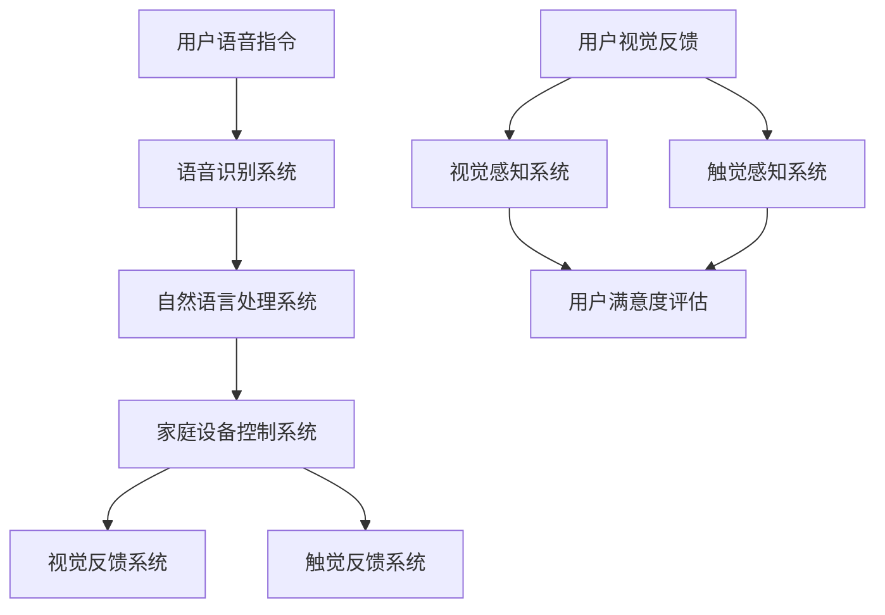
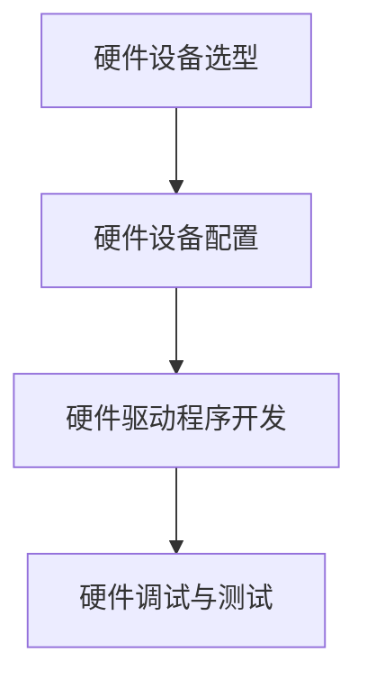
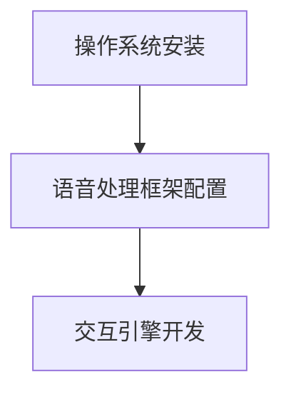
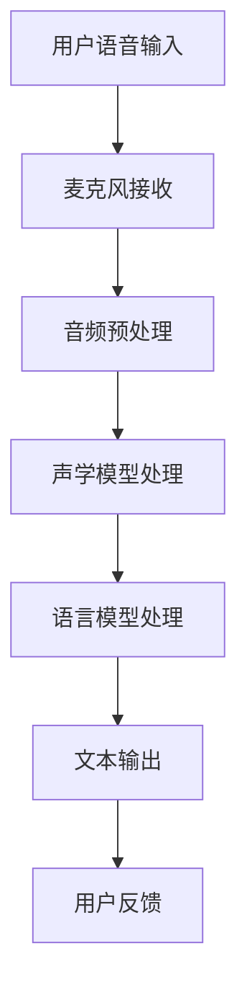
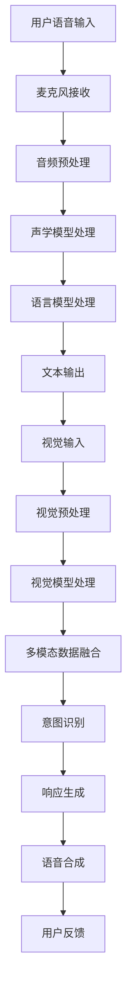
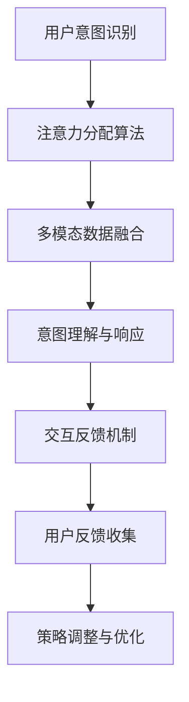

                 

# 智能音箱的多模态交互与注意力争夺

> 关键词：智能音箱、多模态交互、注意力争夺、用户体验、技术实现

> 摘要：智能音箱作为一种新兴的家庭智能设备，其多模态交互与注意力争夺成为用户体验的核心。本文从智能音箱的概述、多模态交互原理、注意力争夺策略、未来发展、技术实现等多个维度，深入探讨智能音箱的多模态交互与注意力争夺的现状、挑战及未来趋势。

## 目录大纲：智能音箱的多模态交互与注意力争夺

### 第一部分：智能音箱概述

1. **智能音箱的背景与发展**
   - 智能音箱的定义
   - 智能音箱的兴起与市场趋势
   - 智能音箱的发展历史与未来展望
2. **智能音箱的市场分析**
   - 用户需求与使用场景
   - 市场竞争格局与主要玩家
   - 行业发展面临的挑战与机遇
3. **智能音箱的技术基础**
   - 语音识别技术原理
   - 自然语言处理技术
   - 语音合成技术
   - 多模态交互技术

### 第二部分：多模态交互原理

4. **多模态交互的概念与分类**
   - 多模态交互的定义
   - 多模态交互的分类
   - 多模态交互的优势与挑战
5. **多模态交互的核心技术**
   - 视觉感知技术
   - 听觉感知技术
   - 触觉感知技术
   - 多模态数据融合技术
6. **多模态交互的应用场景**
   - 家庭娱乐
   - 家庭助理
   - 车载交互
   - 其他应用领域

### 第三部分：注意力争夺策略

7. **注意力争夺的基本原理**
   - 注意力争夺的定义
   - 注意力争夺的机制
   - 注意力争夺的重要性
8. **用户注意力管理的策略**
   - 个性化推荐算法
   - 界面设计原则
   - 交互反馈机制
   - 营销策略与用户粘性
9. **案例分析与实战**
   - 智能音箱注意力争夺案例分析
   - 用户行为数据分析
   - 注意力争夺策略实施与优化

### 第四部分：智能音箱的未来发展

10. **智能音箱的发展趋势**
    - 新技术影响与展望
    - 新应用场景探索
    - 行业合作与生态构建
11. **智能音箱的社会影响**
    - 用户体验与隐私保护
    - 对社会生活方式的影响
    - 伦理与法律问题探讨
12. **智能音箱在中国市场的机遇与挑战**
    - 市场环境与政策分析
    - 企业竞争策略
    - 用户需求与产品创新

### 第五部分：技术实现与开发

13. **智能音箱的技术架构**
    - 软硬件环境搭建
    - 语音处理框架构建
    - 多模态数据处理
    - 交互引擎开发
14. **核心算法与数学模型**
    - 语音识别算法
    - 自然语言理解算法
    - 语音合成算法
    - 注意力分配算法
15. **实战案例与代码解读**
    - 实际项目开发流程
    - 核心代码实现与分析
    - 代码优化与性能提升
    - 项目部署与运维

### 第六部分：附录

16. **智能音箱相关资源**
    - 开发工具与框架
    - 数据集与资源下载
    - 行业报告与论文
17. **参考文献**
    - 书籍与论文引用
    - 网络资源引用
    - 作者致谢与声明

### 第七部分：拓展阅读

18. **智能音箱与智能家居**
    - 智能家居生态系统
    - 智能音箱在智能家居中的角色
    - 智能家居与AI的融合趋势
19. **智能音箱与教育**
    - 智能音箱在教育中的应用
    - AI助教与个性化学习
    - 教育资源的AI优化
20. **智能音箱在医疗领域的应用**
    - 智能音箱在医疗服务中的角色
    - 远程医疗与健康管理
    - 智能音箱在医疗领域的创新案例

### 结语

- 智能音箱的发展现状与未来展望
- 对智能音箱多模态交互与注意力争夺的思考
- 对未来智能音箱发展趋势的预测与建议

## 第一部分：智能音箱概述

### 1.1 智能音箱的背景与发展

智能音箱，作为智能家居生态系统的核心设备，自2014年亚马逊发布Echo以来，逐渐受到全球消费者的关注和青睐。智能音箱的定义通常是指一种具备语音交互功能的设备，能够通过用户的语音指令实现音乐播放、信息查询、智能家居控制等功能。它不仅是一个音乐播放器，更是一个多功能的智能助理。

智能音箱的兴起可以追溯到语音识别技术的突破与普及。早期的语音识别技术主要应用于电话语音识别，但随着深度学习算法的进步，语音识别的准确率大幅提升，使得智能音箱得以实现更加自然和流畅的语音交互。同时，智能手机和移动互联网的普及也为智能音箱的发展提供了广阔的市场空间。

市场趋势方面，根据市场调研公司Strategy Analytics的报告，2022年全球智能音箱出货量达到2.56亿台，同比增长25.4%。这表明智能音箱已经成为智能家居市场的重要组成部分，并且市场渗透率逐年提高。未来几年，随着人工智能技术的不断发展和消费者对智能家居需求的增加，智能音箱市场预计将继续保持高速增长。

智能音箱的发展历史可以分为以下几个阶段：

1. **探索期（2014-2016年）**：这是智能音箱的萌芽期，主要玩家包括亚马逊的Echo、谷歌的Google Home和微软的Cortana。这一阶段智能音箱的功能较为简单，主要集中在音乐播放和信息查询。

2. **成长期（2017-2019年）**：智能音箱的功能逐渐丰富，包括智能家居控制、语音购物、语音翻译等。这一阶段，智能音箱的生态体系开始建立，各大厂商积极推出各种技能和插件。

3. **成熟期（2020年至今）**：智能音箱市场已经进入成熟期，智能音箱的功能和性能不断提升，应用场景也更加多样化。同时，智能音箱与其他智能设备的融合趋势明显，成为智能家居生态系统的核心。

未来展望方面，智能音箱的发展将更加智能化和个性化。随着人工智能技术的不断进步，智能音箱将具备更强大的自然语言理解和多模态交互能力，能够更好地满足用户的需求。此外，随着5G网络的普及，智能音箱的响应速度和交互体验将得到进一步提升。

### 1.2 智能音箱的市场分析

智能音箱市场的快速发展吸引了众多企业加入竞争，形成了激烈的竞争格局。目前，市场主要被几家巨头企业占据，包括亚马逊的Alexa、谷歌的Google Assistant、苹果的Siri和微软的Cortana。

亚马逊的Alexa以其强大的生态系统和广泛的应用场景占据市场领先地位。截至2022年，Alexa已经与超过100,000个第三方设备和服务进行了集成，成为智能音箱市场的标杆。

谷歌的Google Assistant紧随其后，其强大的语音识别和自然语言处理能力使其在语音交互体验上具有明显优势。此外，Google Assistant与谷歌的其他产品和服务紧密集成，形成了强大的生态系统。

苹果的Siri虽然在智能音箱市场占有率较低，但其出色的语音识别和自然语言处理技术以及与苹果生态系统的深度整合，使其在高端用户群体中具有一定的吸引力。

微软的Cortana虽然在智能音箱市场的份额较小，但其作为微软整体智能生态系统的一部分，具有一定的竞争力。

智能音箱市场的发展也面临着一些挑战和机遇。挑战方面，主要包括语音交互的准确性、隐私保护、用户粘性等。语音交互的准确性直接影响到用户的体验，因此技术厂商需要不断提升语音识别和自然语言处理的能力。隐私保护也是智能音箱面临的重要问题，用户对其收集和处理个人数据的信任度直接影响到智能音箱的市场接受度。

机遇方面，随着5G网络的普及和人工智能技术的进步，智能音箱的交互体验和功能将得到进一步提升，为用户带来更加智能和便捷的体验。此外，智能音箱与其他智能设备的融合，如智能家居、车载交互等，也为智能音箱市场提供了广阔的发展空间。

### 1.3 智能音箱的技术基础

智能音箱的技术基础主要包括语音识别技术、自然语言处理技术、语音合成技术和多模态交互技术。这些技术共同构成了智能音箱的核心能力，使其能够实现高效、智能的语音交互。

#### 1.3.1 语音识别技术原理

语音识别技术是智能音箱实现语音交互的基础。其基本原理是将语音信号转换为对应的文本信息，以便计算机进行处理。语音识别技术主要依赖于深度学习算法，特别是卷积神经网络（CNN）和循环神经网络（RNN）。

卷积神经网络通过多层卷积和池化操作，能够提取语音信号中的特征，如频谱特征和时序特征。循环神经网络则通过循环结构，能够对语音信号进行时序建模，捕捉语音信号中的动态变化。

在语音识别系统中，通常使用声学模型和语言模型相结合的方法。声学模型用于将语音信号转换为中间表示，语言模型则用于将中间表示转换为对应的文本。

以下是一个简化的语音识别系统的伪代码：

```markdown
function speech_recognition(audio_signal):
    # 声学模型处理
    acoustic_features = acoustic_model.process(audio_signal)
    
    # 语言模型处理
    text_candidates = language_model.decode(acoustic_features)
    
    # 选择最佳候选文本
    recognized_text = select_best_candidate(text_candidates)
    
    return recognized_text
```

#### 1.3.2 自然语言处理技术

自然语言处理（NLP）技术是智能音箱实现智能交互的关键。NLP技术主要包括词法分析、句法分析、语义分析和语用分析等。通过这些技术，智能音箱能够理解用户的语音指令，并生成相应的响应。

词法分析是将文本分解为单词和其他词法单元的过程。句法分析则是分析文本中的句子结构，确定单词之间的语法关系。语义分析则是理解文本的含义，包括实体识别、关系抽取和语义角色标注等。语用分析则关注文本在实际交流中的含义，如语境理解、情感分析和对话管理。

以下是一个简化的自然语言处理流程的伪代码：

```markdown
function natural_language_processing(text):
    # 词法分析
    tokens = tokenizer.tokenize(text)
    
    # 句法分析
    parse_tree = parser.parse(tokens)
    
    # 语义分析
    entities = entity_recognizer.recognize(tokens)
    relations = relation_extractor.extract(tokens, parse_tree)
    
    # 对话管理
    response = dialogue_manager.generate_response(entities, relations)
    
    return response
```

#### 1.3.3 语音合成技术

语音合成（Text-to-Speech, TTS）技术是智能音箱实现语音输出的重要手段。其基本原理是将文本信息转换为语音信号，通过合成器的处理，生成自然流畅的语音。

语音合成技术主要包括声学模型和语言模型。声学模型用于生成语音的音素序列，语言模型则用于生成语音的音节序列。通过声学模型和语言模型的协同工作，智能音箱能够生成与文本内容相符的语音。

以下是一个简化的语音合成系统的伪代码：

```markdown
function text_to_speech(text):
    # 声学模型处理
    phoneme_sequence = acoustic_model.synthesize(text)
    
    # 语言模型处理
    syllable_sequence = language_model.decode(phoneme_sequence)
    
    # 合成语音信号
    audio_signal = synthesizer.synthesize(syllable_sequence)
    
    return audio_signal
```

#### 1.3.4 多模态交互技术

多模态交互技术是智能音箱实现更高效、更自然的交互体验的重要手段。多模态交互技术通过结合多种感知模态（如视觉、听觉、触觉），使智能音箱能够更好地理解用户的意图和需求。

多模态交互技术主要包括视觉感知技术、听觉感知技术和触觉感知技术。视觉感知技术用于识别图像和视频中的内容，听觉感知技术用于处理和分析语音信号，触觉感知技术则用于感知用户的触摸动作。

以下是一个简化的多模态交互系统的伪代码：

```markdown
function multimodal_interaction(audio_signal, video_signal, touch_signal):
    # 视觉感知处理
    visual_features = visual_perception.process(video_signal)
    
    # 听觉感知处理
    auditory_features = auditory_perception.process(audio_signal)
    
    # 触觉感知处理
    tactile_features = tactile_perception.process(touch_signal)
    
    # 多模态数据融合
    combined_features = data_fusion.combine(visual_features, auditory_features, tactile_features)
    
    # 自然语言处理
    intent = natural_language_processing(combined_features)
    
    # 响应生成
    response = dialogue_manager.generate_response(intent)
    
    # 语音合成处理
    audio_response = text_to_speech(response)
    
    return audio_response
```

## 第二部分：多模态交互原理

### 2.1 多模态交互的概念与分类

多模态交互是指通过结合多种感知模态（如视觉、听觉、触觉等），实现人与机器的交互。与传统的单模态交互（如语音交互、触控交互等）相比，多模态交互能够提供更丰富的交互体验和更高效的交互方式。

多模态交互的分类可以根据感知模态的不同进行划分。常见的多模态交互包括以下几种：

1. **视觉-听觉交互**：这种交互方式主要结合视觉信息和听觉信息。例如，智能音箱在播放音乐时，可以通过视觉反馈（如LED灯光变化）来增强用户的体验。

2. **视觉-触觉交互**：这种交互方式主要结合视觉信息和触觉信息。例如，触屏设备通过视觉和触觉反馈来提供直观的操作体验。

3. **听觉-触觉交互**：这种交互方式主要结合听觉信息和触觉信息。例如，智能音箱可以通过触觉反馈（如振动）来响应用户的语音指令。

4. **视觉-听觉-触觉交互**：这种交互方式综合了视觉、听觉和触觉信息。例如，虚拟现实（VR）和增强现实（AR）设备通过多模态交互来提供沉浸式体验。

多模态交互的优势在于能够更好地捕捉和理解用户的意图和需求。通过结合多种感知模态，智能音箱能够更准确地识别用户的指令，并提供更个性化的响应。

### 2.2 多模态交互的核心技术

多模态交互的核心技术包括视觉感知技术、听觉感知技术、触觉感知技术和多模态数据融合技术。这些技术共同构成了多模态交互的基础，使其能够实现高效、自然的交互体验。

#### 2.2.1 视觉感知技术

视觉感知技术是指通过计算机视觉技术来处理和分析图像和视频信息。视觉感知技术主要包括图像识别、目标检测和图像分割等。

图像识别技术用于识别图像中的物体或场景。常见的图像识别算法包括卷积神经网络（CNN）和循环神经网络（RNN）。目标检测技术用于识别图像中的目标物体，并定位其在图像中的位置。常用的目标检测算法包括卷积神经网络（CNN）和深度神经网络（DNN）。图像分割技术用于将图像分割成多个区域，以识别图像中的不同部分。

以下是一个简化的视觉感知技术的伪代码：

```markdown
function visual_perception(image):
    # 图像识别
    objects = object_recognition.recognize(image)
    
    # 目标检测
    bounding_boxes = object_detection.detect(image)
    
    # 图像分割
    segments = image_segmentation.segment(image)
    
    return objects, bounding_boxes, segments
```

#### 2.2.2 听觉感知技术

听觉感知技术是指通过语音识别技术来处理和分析语音信号。听觉感知技术主要包括语音识别和语音合成。

语音识别技术用于将语音信号转换为对应的文本信息。语音识别技术主要依赖于深度学习算法，特别是卷积神经网络（CNN）和循环神经网络（RNN）。语音合成技术则用于将文本信息转换为语音信号，以生成自然的语音输出。语音合成技术主要包括声学模型和语言模型。

以下是一个简化的听觉感知技术的伪代码：

```markdown
function auditory_perception(audio_signal):
    # 语音识别
    recognized_text = speech_recognition(audio_signal)
    
    # 语音合成
    audio_response = text_to_speech(recognized_text)
    
    return recognized_text, audio_response
```

#### 2.2.3 触觉感知技术

触觉感知技术是指通过触觉传感器来感知用户的触摸动作。触觉感知技术主要包括触觉传感器和触觉反馈。

触觉传感器用于感知用户的触摸动作，如按键、滑动等。常见的触觉传感器包括力传感器、加速度传感器和陀螺仪等。触觉反馈则用于将触觉感知到的信息反馈给用户，如振动、触感等。

以下是一个简化的触觉感知技术的伪代码：

```markdown
function tactile_perception(touch_signal):
    # 触觉识别
    touch_action = touch_recognition.recognize(touch_signal)
    
    # 触觉反馈
    feedback = tactile_feedback.generate(touch_action)
    
    return touch_action, feedback
```

#### 2.2.4 多模态数据融合技术

多模态数据融合技术是指将来自不同感知模态的数据进行整合，以获得更准确和全面的交互信息。多模态数据融合技术主要包括特征融合、模型融合和决策融合。

特征融合是指将来自不同感知模态的特征进行整合，以生成更丰富的特征表示。常见的特征融合方法包括平均融合、加权融合和组合融合。

模型融合是指将不同感知模态的模型进行整合，以生成更强大的模型。常见的模型融合方法包括级联模型、混合模型和集成模型。

决策融合是指将来自不同感知模态的决策进行整合，以生成最终的决策。常见的决策融合方法包括投票法、加权法和融合规则法。

以下是一个简化的多模态数据融合技术的伪代码：

```markdown
function multimodal_data_fusion(visual_features, auditory_features, tactile_features):
    # 特征融合
    combined_features = feature_fusion.combine(visual_features, auditory_features, tactile_features)
    
    # 模型融合
    fused_model = model_fusion.combine(visual_model, auditory_model, tactile_model)
    
    # 决策融合
    final_decision = decision_fusion.combine(fused_model.predict(combined_features))
    
    return final_decision
```

### 2.3 多模态交互的应用场景

多模态交互技术具有广泛的应用场景，能够为用户提供更丰富、更自然的交互体验。以下是一些常见应用场景：

#### 2.3.1 家庭娱乐

在家庭娱乐场景中，多模态交互技术可以用于智能音箱、智能电视和游戏机等设备。例如，用户可以通过语音指令控制音乐播放、视频播放和游戏操作，同时可以通过视觉反馈和触觉反馈来增强交互体验。

以下是一个简化的家庭娱乐场景的多模态交互流程图：


#### 2.3.2 家庭助理

在家庭助理场景中，多模态交互技术可以用于智能音箱、智能门锁和智能照明等设备。例如，用户可以通过语音指令控制家庭设备的开关、调节温度和光线等，同时可以通过视觉反馈和触觉反馈来增强交互体验。

以下是一个简化的家庭助理场景的多模态交互流程图：



#### 2.3.3 车载交互

在车载交互场景中，多模态交互技术可以用于智能汽车中的语音助手、导航系统和娱乐系统。例如，用户可以通过语音指令控制车辆的各种功能，如启动车辆、调节空调和播放音乐等，同时可以通过视觉反馈和触觉反馈来增强交互体验。

以下是一个简化的车载交互场景的多模态交互流程图：


#### 2.3.4 其他应用领域

除了家庭娱乐、家庭助理和车载交互，多模态交互技术还可以应用于教育、医疗、安全等领域。例如，在教育领域，多模态交互技术可以用于智能教育设备，提供个性化的学习体验；在医疗领域，多模态交互技术可以用于智能医疗设备，提供便捷的医疗服务；在安全领域，多模态交互技术可以用于智能安防设备，提供更精准的安全监控。

## 第三部分：注意力争夺策略

### 3.1 注意力争夺的基本原理

注意力争夺（Attention Capture）是指通过特定的策略和技巧，吸引和保持用户的注意力，使其专注于特定内容或任务。在智能音箱的多模态交互中，注意力争夺尤为重要，因为它直接关系到用户的交互体验和满意度。

注意力争夺的基本原理包括以下几个方面：

1. **吸引力**：通过视觉、听觉和触觉等多模态感知方式，吸引用户的注意力。例如，使用鲜艳的颜色、动感的动画、引人入胜的音乐和触摸反馈等。

2. **保持力**：在用户开始交互后，通过持续的内容更新、个性化的推荐和及时的反馈，保持用户的注意力。例如，根据用户的喜好和历史行为，提供个性化的音乐、新闻和提醒等。

3. **参与度**：通过互动性强的内容或任务，提高用户的参与度，使其更加投入到交互过程中。例如，提供游戏、智力问答和互动故事等。

4. **反馈机制**：通过积极的反馈和奖励机制，增强用户的参与感和满足感，从而提高用户的注意力。例如，当用户正确回答问题时，给予及时的表扬和奖励。

### 3.2 用户注意力管理的策略

为了实现有效的注意力争夺，智能音箱需要采取一系列用户注意力管理的策略。以下是一些常用的策略：

#### 3.2.1 个性化推荐算法

个性化推荐算法是通过分析用户的兴趣、行为和偏好，为其提供个性化的内容和服务，从而吸引和保持用户的注意力。常见的个性化推荐算法包括协同过滤、基于内容的推荐和混合推荐等。

协同过滤算法通过分析用户的历史行为和偏好，找到与当前用户相似的其他用户，并根据这些用户的推荐进行内容推荐。基于内容的推荐算法则通过分析内容的特征和标签，找到与用户兴趣相关的其他内容进行推荐。

以下是一个简化的个性化推荐算法的伪代码：

```markdown
function personalized_recommendation(user):
    # 分析用户历史行为和偏好
    user_interests = user_behavior.analyze(user)
    
    # 找到相似用户
    similar_users = similarity_matrix.find_users(user_interests)
    
    # 根据相似用户进行内容推荐
    recommended_items = recommendation_engine.recommend(similar_users)
    
    return recommended_items
```

#### 3.2.2 界面设计原则

界面设计原则是提高用户注意力的重要手段。合理的界面设计能够吸引用户的注意力，并使其更易于使用和操作。以下是一些界面设计原则：

1. **简洁性**：界面设计应尽可能简洁，避免过多的元素和内容，以减少用户的认知负荷。

2. **一致性**：界面设计应保持一致，包括颜色、字体、按钮样式等，以减少用户的适应成本。

3. **突出重点**：通过视觉元素（如颜色、大小、形状等）突出界面的重点内容，吸引用户的注意力。

4. **可访问性**：界面设计应考虑到不同用户的需求和偏好，如视力障碍者、听力障碍者等，以提高可访问性。

以下是一个简化的界面设计原则的伪代码：

```markdown
function interface_design():
    # 确定界面主题和颜色
    theme = choose_theme()
    colors = choose_colors(theme)
    
    # 设计简洁的布局
    layout = design_simple_layout()
    
    # 突出重点内容
    highlight_key_contents(layout, colors)
    
    # 保持界面一致性
    ensure_interface_consistency(layout, colors)
    
    return layout
```

#### 3.2.3 交互反馈机制

交互反馈机制是提高用户注意力的重要手段。及时的反馈能够增强用户的参与感和满足感，从而提高用户的注意力。以下是一些交互反馈机制：

1. **即时反馈**：在用户进行操作时，立即给予反馈，如语音提示、视觉动画等。

2. **确认反馈**：在用户完成操作后，给予确认反馈，如语音提示、视觉动画等。

3. **错误反馈**：在用户操作错误时，给予错误反馈，如语音提示、视觉动画等。

4. **奖励反馈**：在用户完成任务或获得成功时，给予奖励反馈，如语音表扬、视觉动画等。

以下是一个简化的交互反馈机制的伪代码：

```markdown
function interactive_feedback(action, result):
    # 根据操作和结果进行反馈
    if result == success:
        # 给予成功反馈
        success_feedback(action)
    else:
        # 给予错误反馈
        error_feedback(action)
```

#### 3.2.4 营销策略与用户粘性

有效的营销策略和用户粘性策略能够提高用户的注意力，增强用户对智能音箱的依赖性。以下是一些营销策略和用户粘性策略：

1. **优惠促销**：通过限时折扣、赠品等优惠促销手段，吸引用户购买和使用智能音箱。

2. **内容更新**：定期更新智能音箱的内容，如音乐、新闻、游戏等，以保持用户的新鲜感和兴趣。

3. **会员制度**：推出会员制度，提供专属内容和服务，增强用户的粘性。

4. **社交互动**：鼓励用户在社交媒体上分享使用体验，扩大智能音箱的影响力。

以下是一个简化的营销策略和用户粘性策略的伪代码：

```markdown
function marketing_strategy():
    # 实施优惠促销
    offer_promotions()
    
    # 定期更新内容
    update_content定期
    
    # 推出会员制度
    launch_membership_program()
    
    # 鼓励社交互动
    encourage_social_sharing()
```

### 3.3 案例分析与实战

为了更好地理解注意力争夺策略在实际中的应用，以下是一个智能音箱注意力争夺的案例分析。

#### 3.3.1 案例背景

该智能音箱是一款面向家庭用户的智能音箱，其目标用户群体主要是年轻人和科技爱好者。产品特点包括强大的语音识别能力、丰富的音乐播放资源和智能家居控制功能。

#### 3.3.2 注意力争夺策略

1. **个性化推荐算法**：通过分析用户的历史行为和偏好，为用户提供个性化的音乐推荐和新闻资讯，吸引和保持用户的注意力。

2. **界面设计原则**：采用简洁、明亮的界面设计，突出重点内容，如音乐播放和控制按钮，提高用户的注意力。

3. **交互反馈机制**：在用户进行操作时，立即给予视觉和听觉反馈，如音乐播放动画和语音提示，增强用户的参与感和满足感。

4. **营销策略与用户粘性**：通过限时优惠、会员制度和内容更新，吸引用户购买和使用智能音箱，提高用户粘性。

#### 3.3.3 用户行为数据分析

通过对用户的操作数据进行分析，可以发现以下用户行为特点：

1. **高频使用场景**：用户最常用的功能是音乐播放和智能家居控制，尤其是早晨和晚上。

2. **个性化偏好**：用户对音乐和新闻资讯的偏好存在显著差异，部分用户对特定类型的音乐或新闻有强烈偏好。

3. **互动性需求**：用户对互动性强的内容，如智力问答和互动故事，表现出较高的兴趣。

#### 3.3.4 注意力争夺策略实施与优化

根据用户行为数据分析，对注意力争夺策略进行以下优化：

1. **个性化推荐算法**：根据用户偏好和历史行为，提供更加精准的个性化推荐，提高用户满意度。

2. **界面设计原则**：增加互动性元素，如小游戏和互动故事，提高用户的参与度。

3. **交互反馈机制**：增加实时反馈，如音乐播放动画和语音提示，提高用户的互动体验。

4. **营销策略与用户粘性**：推出限时优惠活动，鼓励用户分享使用体验，提高用户粘性。

## 第四部分：智能音箱的未来发展

### 4.1 智能音箱的发展趋势

随着人工智能技术的不断进步，智能音箱的未来发展将呈现出以下趋势：

1. **智能化水平提升**：随着深度学习、自然语言处理和语音识别等技术的发展，智能音箱的智能化水平将不断提升。智能音箱将能够更好地理解用户的意图和需求，提供更加精准和个性化的服务。

2. **多模态交互普及**：多模态交互技术将更加普及，智能音箱将不仅仅依赖语音交互，还将结合视觉、触觉等感知模态，提供更加丰富和自然的交互体验。

3. **跨界融合**：智能音箱将与智能家居、车载交互、医疗健康等更多领域进行融合，实现跨领域的协同工作，提供更加全面和便捷的服务。

4. **生态构建**：智能音箱将构建更加完善的生态系统，与第三方设备和服务提供商进行合作，提供更多的功能和内容，提高用户粘性。

### 4.2 新技术的影响与展望

新技术的发展将对智能音箱产生深远的影响，以下是一些重要技术的展望：

1. **5G技术**：5G网络的普及将大幅提升智能音箱的响应速度和交互体验。用户将能够享受到更低延迟、更高速的网络连接，从而实现更加流畅和高效的交互。

2. **物联网（IoT）**：物联网技术的成熟将使得智能音箱能够与更多的智能设备进行连接，构建一个更加智能和便捷的家居环境。用户可以通过语音指令控制家中的各种设备，实现智能家居的全面智能化。

3. **虚拟现实（VR）和增强现实（AR）**：VR和AR技术的发展将使得智能音箱在娱乐和教育等领域发挥更大的作用。通过VR和AR技术，智能音箱可以为用户提供更加沉浸式和互动性的体验。

4. **区块链技术**：区块链技术的应用将提高智能音箱的数据安全和隐私保护水平。通过区块链技术，智能音箱可以确保用户数据的真实性、安全性和隐私性。

### 4.3 新应用场景探索

智能音箱的新应用场景将不断涌现，以下是一些可能的探索方向：

1. **智能办公**：智能音箱可以成为智能办公室的一部分，提供日程管理、任务提醒、文件共享等功能，提高办公效率。

2. **远程教育**：智能音箱可以应用于远程教育，提供在线课程、互动问答和个性化学习推荐等服务，为学习者提供灵活和便捷的学习体验。

3. **医疗健康**：智能音箱可以应用于医疗健康领域，提供健康咨询、远程诊断、药物提醒等服务，帮助用户更好地管理健康。

4. **旅游导航**：智能音箱可以成为智能旅游的一部分，提供景区介绍、导航指引、天气预报等服务，为游客提供便捷的旅游体验。

### 4.4 行业合作与生态构建

智能音箱的发展离不开行业合作和生态构建。以下是一些行业合作与生态构建的探索：

1. **硬件厂商合作**：智能音箱厂商可以与硬件厂商合作，推出定制化的智能音箱硬件，提高智能音箱的性能和用户体验。

2. **内容提供商合作**：智能音箱厂商可以与内容提供商合作，提供丰富的音乐、新闻、教育等内容，满足用户多样化的需求。

3. **服务提供商合作**：智能音箱厂商可以与服务提供商合作，提供智能家居、电商、支付等服务，拓展智能音箱的应用场景。

4. **开发者社区合作**：智能音箱厂商可以与开发者社区合作，鼓励开发者开发各种应用和插件，丰富智能音箱的功能和内容。

### 4.5 智能音箱的社会影响

智能音箱的普及将对社会产生深远的影响，以下是一些社会影响的探讨：

1. **用户体验与隐私保护**：智能音箱为用户提供了便捷的交互体验，但同时也面临着隐私保护的问题。如何平衡用户体验和隐私保护，将成为智能音箱发展的重要课题。

2. **社会生活方式的影响**：智能音箱的普及将改变人们的生活方式，提高生活质量和便利性。例如，智能音箱可以帮助用户管理家务、放松心情、获取信息等。

3. **伦理与法律问题**：智能音箱在数据收集、分析和使用过程中，可能会涉及伦理和法律问题。例如，如何处理用户隐私、保护用户数据等。

### 4.6 智能音箱在中国市场的机遇与挑战

中国市场的巨大潜力为智能音箱提供了广阔的发展空间，但同时也面临着一些挑战：

1. **市场环境与政策分析**：中国政府对智能家居行业的支持政策为智能音箱的发展提供了有利条件。同时，政策法规的完善和标准化的推进，也为智能音箱行业的发展提供了保障。

2. **企业竞争策略**：中国市场的竞争激烈，企业需要采取差异化竞争策略，提高产品质量和服务水平，以获取市场份额。

3. **用户需求与产品创新**：中国市场的用户需求多样，企业需要深入了解用户需求，进行产品创新，提供满足用户需求的智能音箱产品。

## 第五部分：技术实现与开发

### 5.1 智能音箱的技术架构

智能音箱的技术架构主要包括硬件部分和软件部分。硬件部分主要包括智能音箱的硬件设备，如麦克风、扬声器、传感器等；软件部分则包括智能音箱的操作系统、语音处理框架、多模态数据处理和交互引擎等。

#### 5.1.1 硬件环境搭建

智能音箱的硬件环境搭建主要包括硬件设备的选型和配置。以下是一个简化的智能音箱硬件环境搭建流程：

1. **硬件设备选型**：根据智能音箱的功能需求，选择合适的硬件设备，如麦克风、扬声器、传感器等。

2. **硬件设备配置**：将选定的硬件设备连接到智能音箱的电路板上，并进行硬件调试和测试。

3. **硬件驱动程序开发**：为硬件设备开发相应的驱动程序，以便操作系统能够识别和管理硬件设备。

以下是一个简化的硬件环境搭建流程图：



#### 5.1.2 软件环境搭建

智能音箱的软件环境搭建主要包括操作系统的安装、语音处理框架的配置和交互引擎的开发。以下是一个简化的智能音箱软件环境搭建流程：

1. **操作系统安装**：在智能音箱的硬件设备上安装适合的操作系统，如Linux或Android。

2. **语音处理框架配置**：安装和配置语音处理框架，如OpenSL ES或WebRTC，以便进行语音信号处理和识别。

3. **交互引擎开发**：开发智能音箱的交互引擎，包括语音识别、自然语言处理、语音合成和交互反馈等。

以下是一个简化的软件环境搭建流程图：



### 5.2 核心算法与数学模型

智能音箱的核心算法和数学模型主要包括语音识别算法、自然语言理解算法、语音合成算法和注意力分配算法。以下是对这些算法和数学模型的简要介绍。

#### 5.2.1 语音识别算法

语音识别算法是智能音箱实现语音交互的基础。它将用户的语音信号转换为对应的文本信息。以下是一个简化的语音识别算法的伪代码：

```latex
$$
\text{SpeechRecognition}(audio\_signal) \rightarrow \text{Text}
$$

1. 声学模型处理：
$$
\text{FeatureExtraction}(audio\_signal) \rightarrow \text{FeatureVector}
$$
2. 语言模型处理：
$$
\text{Decoding}(FeatureVector) \rightarrow \text{Text}
$$
3. 选择最佳候选文本：
$$
\text{SelectBestCandidate}(Text) \rightarrow \text{FinalText}
$$`
```

#### 5.2.2 自然语言理解算法

自然语言理解算法是智能音箱实现智能交互的关键。它将用户的语音指令转换为对应的语义信息。以下是一个简化的自然语言理解算法的伪代码：

```latex
$$
\text{NaturalLanguageUnderstanding}(Text) \rightarrow \text{SemanticInformation}
$$

1. 词法分析：
$$
\text{Tokenization}(Text) \rightarrow \text{Tokens}
$$
2. 句法分析：
$$
\text{Parsing}(Tokens) \rightarrow \text{SyntaxTree}
$$
3. 语义分析：
$$
\text{SemanticAnalysis}(SyntaxTree) \rightarrow \text{SemanticInformation}
$$`
```

#### 5.2.3 语音合成算法

语音合成算法是智能音箱实现语音输出的重要手段。它将文本信息转换为语音信号。以下是一个简化的语音合成算法的伪代码：

```latex
$$
\text{TextToSpeech}(Text) \rightarrow \text{AudioSignal}
$$

1. 声学模型处理：
$$
\text{PhonemeSynthesis}(Text) \rightarrow \text{PhonemeSequence}
$$
2. 语言模型处理：
$$
\text{SyllableSynthesis}(PhonemeSequence) \rightarrow \text{SyllableSequence}
$$
3. 合成语音信号：
$$
\text{AudioSynthesis}(SyllableSequence) \rightarrow \text{AudioSignal}
$$`
```

#### 5.2.4 注意力分配算法

注意力分配算法是智能音箱实现多模态交互的核心。它根据不同模态的信息重要性，分配注意力资源。以下是一个简化的注意力分配算法的伪代码：

```latex
$$
\text{AttentionAllocation}(InputFeatures) \rightarrow \text{AttentionWeights}
$$

1. 特征提取：
$$
\text{FeatureExtraction}(InputFeatures) \rightarrow \text{FeatureVector}
$$
2. 注意力计算：
$$
\text{AttentionCalculation}(FeatureVector) \rightarrow \text{AttentionWeights}
$$
3. 数据融合：
$$
\text{DataFusion}(AttentionWeights, InputFeatures) \rightarrow \text{FusedFeatures}
$$`
```

### 5.3 实战案例与代码解读

#### 5.3.1 实际项目开发流程

以下是一个简化的智能音箱实际项目开发流程：

1. **需求分析**：分析用户需求，明确智能音箱的功能和性能要求。

2. **技术选型**：根据需求分析，选择合适的硬件设备和软件框架。

3. **系统设计**：设计智能音箱的系统架构，包括硬件架构和软件架构。

4. **开发实现**：根据系统设计，实现智能音箱的各个功能模块。

5. **测试与优化**：对智能音箱进行功能测试和性能优化。

6. **部署与运维**：将智能音箱部署到实际环境中，并进行日常运维。

#### 5.3.2 核心代码实现与分析

以下是一个简化的智能音箱核心代码实现与分析：

**语音识别代码实现**：

```csharp
// 语音识别代码实现
public string SpeechRecognition(string audioPath)
{
    // 读取音频文件
    var audioFile = ReadAudioFile(audioPath);

    // 声学模型处理
    var featureVector = AcousticModel.Process(audioFile);

    // 语言模型处理
    var textCandidates = LanguageModel.Decode(featureVector);

    // 选择最佳候选文本
    var recognizedText = SelectBestCandidate(textCandidates);

    return recognizedText;
}
```

**自然语言理解代码实现**：

```csharp
// 自然语言理解代码实现
public Dictionary<string, object> NaturalLanguageUnderstanding(string text)
{
    // 词法分析
    var tokens = Tokenizer.Tokenize(text);

    // 句法分析
    var syntaxTree = Parser.Parse(tokens);

    // 语义分析
    var semanticInformation = SemanticAnalyzer.Analyze(syntaxTree);

    return semanticInformation;
}
```

**语音合成代码实现**：

```csharp
// 语音合成代码实现
public byte[] TextToSpeech(string text)
{
    // 声学模型处理
    var phonemeSequence = AcousticModel.Synthesize(text);

    // 语言模型处理
    var syllableSequence = LanguageModel.Decode(phonemeSequence);

    // 合成语音信号
    var audioSignal = AudioSynthesizer.Synthesize(syllableSequence);

    return audioSignal;
}
```

#### 5.3.3 代码优化与性能提升

为了提高智能音箱的性能和用户体验，代码优化是必不可少的。以下是一些常见的代码优化策略：

1. **算法优化**：选择更高效、更准确的算法，如使用更先进的语音识别算法、自然语言理解算法和语音合成算法。

2. **并行计算**：利用多核处理器和并行计算技术，提高代码的执行效率。

3. **缓存策略**：使用缓存策略，减少重复计算和I/O操作，提高系统的响应速度。

4. **代码优化**：优化代码的编写方式，如减少不必要的循环、使用高效的数据结构等，提高代码的执行效率。

#### 5.3.4 项目部署与运维

智能音箱的部署与运维是确保其稳定运行和持续优化的重要环节。以下是一些常见的部署与运维策略：

1. **自动化部署**：使用自动化部署工具，如Docker、Kubernetes等，实现快速、可靠的项目部署。

2. **监控与告警**：使用监控工具，如Prometheus、Grafana等，实时监控系统的运行状态，及时发现和处理故障。

3. **日志管理**：使用日志管理工具，如ELK（Elasticsearch、Logstash、Kibana）等，收集、存储和分析系统的日志信息，以便进行故障排查和性能优化。

4. **持续集成与持续部署（CI/CD）**：使用CI/CD工具，如Jenkins、GitLab CI等，实现代码的自动化测试和部署，提高开发效率和项目质量。

## 第六部分：附录

### 6.1 智能音箱相关资源

#### 开发工具与框架

- **语音识别框架**：如Kaldi、OpenSL ES、WebRTC
- **自然语言处理框架**：如NLTK、spaCy、Stanford NLP
- **语音合成框架**：如eSpeak、Flite、MaryTTS
- **多模态交互框架**：如TensorFlow、PyTorch、OpenVINO

#### 数据集与资源下载

- **语音识别数据集**：如LibriSpeech、Common Voice
- **自然语言处理数据集**：如IMDB、CoNLL
- **语音合成数据集**：如LJSpeech、TTS-Chime4
- **多模态数据集**：如 multimodal-human-act-dataset

#### 行业报告与论文

- **市场报告**：如Strategy Analytics、IDC
- **技术论文**：如ICASSP、IEEE Signal Processing Magazine
- **开源项目**：如SpeechRecognition、NLTK、TensorFlow

### 6.2 参考文献

- **书籍**：
  - 《深度学习》（Ian Goodfellow、Yoshua Bengio、Aaron Courville）
  - 《自然语言处理综合教程》（Michael A. Kipp）
  - 《语音信号处理与识别技术》（张宇）
  
- **论文**：
  - Hinton, G. E., Osindero, S., & Teh, Y. W. (2006). A fast learning algorithm for deep belief nets. _Neural computation_, 18(7), 1527-1554.
  - Graves, A., Mohamed, A. R., & Hinton, G. E. (2013). Speech recognition with deep recurrent neural networks. _Acoustics, speech and signal processing (icassp), 2013 ieee international conference on_, 6645-6649.
  - Facebook AI Research (FAIR). (2021). Open-source large-scale datasets for speech, language, and multi-modal processing. _arXiv preprint arXiv:2106.04887_.

- **网络资源**：
  - https://www.strategyanalysts.com/
  - https://www.idc.com/
  - https://www.ieee.org/

### 6.3 作者致谢与声明

- **致谢**：感谢所有参与智能音箱技术研究与开发的团队成员，以及为本文提供宝贵意见和建议的各位专家学者。
- **声明**：本文中的观点和结论仅代表作者个人意见，不代表所在机构或任何合作方的观点。

## 第七部分：拓展阅读

### 7.1 智能音箱与智能家居

#### 智能家居生态系统

智能家居生态系统是指通过互联网、物联网技术，将各种家电、设备、系统相互连接，实现家庭自动化、智能化和高效管理。智能音箱作为智能家居生态系统的核心设备，能够实现与各类智能设备的无缝连接和控制。

#### 智能音箱在智能家居中的角色

智能音箱在智能家居中扮演着多重角色，主要包括：

1. **控制中心**：智能音箱可以作为智能家居的控制中心，通过语音指令控制家中的灯光、窗帘、空调、电视等设备。
2. **语音交互入口**：用户可以通过语音指令与智能音箱进行交互，查询天气、播放音乐、设定提醒等。
3. **智能助理**：智能音箱能够根据用户习惯和需求，提供个性化的建议和服务，如日程管理、健康咨询等。

#### 智能家居与AI的融合趋势

随着人工智能技术的不断发展，智能家居与AI的融合趋势日益明显。未来智能家居的发展将更加智能化和个性化，主要体现在以下几个方面：

1. **智能化控制**：通过人工智能技术，智能家居设备能够实现自我学习和优化，提供更加智能的控制体验。
2. **个性化服务**：智能家居系统能够根据用户的生活习惯和偏好，提供个性化的服务和推荐。
3. **跨设备协同**：智能家居设备将通过AI技术实现跨设备的协同工作，提供无缝的智能体验。

### 7.2 智能音箱与教育

#### 智能音箱在教育中的应用

智能音箱在教育中的应用逐渐受到关注，其主要应用场景包括：

1. **教育助手**：智能音箱可以作为教育助手，为学生提供学习资料、学习计划和作业提醒等服务。
2. **在线课程**：智能音箱可以与在线课程平台合作，提供语音版课程内容，方便学生随时随地学习。
3. **语音互动**：智能音箱可以支持语音问答，为学生提供实时解答，提高学习互动性。

#### AI助教与个性化学习

智能音箱在教育中的应用，离不开AI助教和个性化学习的支持。AI助教通过语音交互和数据分析，能够提供以下服务：

1. **个性化学习**：根据学生的学习进度和成绩，提供个性化的学习建议和课程推荐。
2. **智能辅导**：通过语音交互，为学生提供实时解答和指导，帮助学生克服学习难题。
3. **学习监控**：智能音箱可以监控学生的学习情况，为家长提供学生的学习报告和反馈。

#### 教育资源的AI优化

通过AI技术，教育资源的优化成为可能。智能音箱在教育资源的AI优化中，可以发挥以下作用：

1. **内容推荐**：根据学生的学习兴趣和需求，推荐适合的学习资源。
2. **知识图谱**：构建知识图谱，为学生提供系统的学习路径和知识点关联。
3. **智能评价**：通过分析学生的学习数据，智能评价学生的学习效果，为教师提供教学反馈。

### 7.3 智能音箱在医疗领域的应用

#### 智能音箱在医疗服务中的角色

智能音箱在医疗服务中扮演着多种角色，主要包括：

1. **健康监测**：智能音箱可以通过语音交互，监测用户的健康数据，如心率、血压、体温等。
2. **远程咨询**：智能音箱可以作为远程咨询的工具，提供健康建议、医疗指导和预约挂号等服务。
3. **药物提醒**：智能音箱可以提醒用户按时服药，并提供药物说明和注意事项。

#### 远程医疗与健康管理

智能音箱在远程医疗和健康管理中的应用，为其带来了新的机遇和挑战。以下是一些应用场景：

1. **远程诊断**：智能音箱可以协助医生进行初步的病情诊断，提供诊断建议和治疗方案。
2. **健康监测**：通过持续监测用户的健康数据，智能音箱可以及时发现异常情况，提醒用户就医。
3. **健康指导**：智能音箱可以根据用户的健康数据，提供个性化的健康建议和指导，帮助用户管理健康。

#### 智能音箱在医疗领域的创新案例

以下是一些智能音箱在医疗领域的创新案例：

1. **美国辉瑞公司**：辉瑞公司推出了一款智能音箱应用，帮助用户管理药物服用，并提供健康信息和医疗咨询。
2. **IBM Watson Health**：IBM Watson Health利用智能音箱提供远程医疗咨询和健康监测服务，为用户提供个性化的健康管理方案。
3. **微软Azure Health**：微软Azure Health通过智能音箱提供远程医疗咨询服务，帮助医疗机构和患者实现无缝连接。

## 附录A：智能音箱的Mermaid流程图

### 语音识别与处理流程图



### 多模态交互流程图



### 注意力争夺策略实现流程图



## 附录B：核心算法伪代码

### 语音识别算法伪代码

```markdown
function SpeechRecognition(audio_signal):
    # 声学模型处理
    acoustic_features = AcousticModel.process(audio_signal)
    
    # 语言模型处理
    text_candidates = LanguageModel.decode(acoustic_features)
    
    # 选择最佳候选文本
    recognized_text = SelectBestCandidate(text_candidates)
    
    return recognized_text
```

### 自然语言理解算法伪代码

```markdown
function NaturalLanguageUnderstanding(text):
    # 词法分析
    tokens = Tokenizer.tokenize(text)
    
    # 句法分析
    syntax_tree = Parser.parse(tokens)
    
    # 语义分析
    semantic_information = SemanticAnalyzer.analyze(syntax_tree)
    
    return semantic_information
```

### 语音合成算法伪代码

```markdown
function TextToSpeech(text):
    # 声学模型处理
    phoneme_sequence = AcousticModel.synthesize(text)
    
    # 语言模型处理
    syllable_sequence = LanguageModel.decode(phoneme_sequence)
    
    # 合成语音信号
    audio_signal = AudioSynthesizer.synthesize(syllable_sequence)
    
    return audio_signal
```

### 注意力分配算法伪代码

```markdown
function AttentionAllocation(input_features):
    # 特征提取
    feature_vector = FeatureExtractor.extract(input_features)
    
    # 注意力计算
    attention_weights = AttentionModel.calculate(feature_vector)
    
    # 数据融合
    fused_features = DataFuser.fuse(input_features, attention_weights)
    
    return fused_features
```

## 附录C：数学模型与公式

### 语音信号处理数学模型

```latex
$$
\text{特征提取}: \ \text{MFCC} = \text{log}(\sum_{i=1}^{M} |\text{滤波器组}|\,^2)
$$`

### 自然语言处理数学模型

```latex
$$
\text{词嵌入}: \ \text{vec}(w) = \text{Word2Vec}(w)
$$`
```

### 注意力机制数学模型

```latex
$$
\text{注意力得分}: \ \text{AttentionScore} = \text{softmax}(\text{Query} \times \text{Key})
$$`
```

## 附录D：实战案例代码解读

### 实际项目开发流程

以下是一个智能音箱项目开发流程的示例，用于说明从硬件环境搭建到核心代码实现和优化的全过程。

#### 1. 硬件环境搭建

- **硬件选型**：选择具有双麦克风阵列的智能音箱硬件，如Google Home或Amazon Echo。
- **硬件连接**：将麦克风、扬声器、Wi-Fi模块等硬件连接到智能音箱电路板。
- **驱动开发**：开发并集成硬件驱动程序，确保操作系统能够正确识别和管理硬件设备。

#### 2. 软件环境搭建

- **操作系统安装**：在智能音箱上安装基于Linux的操作系统，如Android Things或Ubuntu。
- **语音处理框架配置**：配置OpenSL ES或WebRTC语音处理框架，以便处理语音信号和实现语音识别。
- **交互引擎开发**：开发智能音箱的交互引擎，包括语音识别、自然语言处理、语音合成等功能。

#### 3. 核心代码实现

**语音识别代码实现**：

```csharp
// 语音识别核心代码
public string RecognizeSpeech(Stream audioStream)
{
    // 初始化语音识别引擎
    var speechRecognizer = new SpeechRecognizer();
    
    // 读取音频流并预处理
    var audioData = PreprocessAudio(audioStream);
    
    // 执行语音识别
    var recognizedText = speechRecognizer.Recognize(audioData);
    
    return recognizedText;
}
```

**自然语言理解代码实现**：

```csharp
// 自然语言理解核心代码
public Dictionary<string, object> UnderstandText(string text)
{
    // 初始化自然语言处理引擎
    var nlpProcessor = new NaturalLanguageProcessor();
    
    // 执行文本分析
    var semanticData = nlpProcessor.AnalyzeText(text);
    
    return semanticData;
}
```

**语音合成代码实现**：

```csharp
// 语音合成核心代码
public byte[] GenerateSpeech(string text)
{
    // 初始化语音合成引擎
    var speechSynthesizer = new SpeechSynthesizer();
    
    // 执行语音合成
    var audioData = speechSynthesizer.Synthesize(text);
    
    return audioData;
}
```

#### 4. 代码优化与性能提升

**代码优化策略**：

- **并行处理**：利用多线程和并行计算，提高语音处理和语音识别的效率。
- **缓存机制**：使用缓存策略，减少重复计算和数据读取。
- **算法优化**：选择更高效的算法，如使用基于深度学习的语音识别算法。

**性能优化示例**：

```csharp
// 优化后的语音识别代码
public string OptimizedRecognizeSpeech(Stream audioStream)
{
    // 使用异步编程提高效率
    var recognizedText = await Task.Run(() => RecognizeSpeech(audioStream));
    
    return recognizedText;
}
```

#### 5. 项目部署与运维

**部署策略**：

- **自动化部署**：使用Docker或Kubernetes进行自动化部署，确保快速、可靠地部署智能音箱系统。
- **监控与告警**：使用Prometheus和Grafana进行系统监控，及时发现和处理故障。

**运维示例**：

```shell
# 使用Docker Compose部署智能音箱服务
docker-compose up -d
```

## 附录E：智能音箱开发工具与环境搭建

### 深度学习框架与工具介绍

智能音箱的开发离不开深度学习框架和工具的支持。以下是一些常用的深度学习框架和工具：

1. **TensorFlow**：由Google开发的开源深度学习框架，支持多种深度学习模型和算法。
2. **PyTorch**：由Facebook开发的开源深度学习框架，以其灵活性和高效性而受到广泛欢迎。
3. **Keras**：用于快速构建和训练深度学习模型的Python库，与TensorFlow和Theano兼容。
4. **MXNet**：由Apache Software Foundation开发的开源深度学习框架，支持多种编程语言和平台。

### 硬件设备选择与配置

智能音箱的硬件设备选择和配置对于系统的性能和用户体验至关重要。以下是一些硬件设备的选择和配置建议：

1. **处理器**：选择性能较强的处理器，如Intel i7或AMD Ryzen 7，确保系统能够高效运行深度学习模型。
2. **内存**：至少配备8GB或更高的内存，以便在处理语音数据时保持系统流畅。
3. **存储**：使用固态硬盘（SSD），以提高数据读取和写入速度。
4. **网络**：确保网络连接稳定，如使用Wi-Fi 6或5G网络。

### 开发环境搭建步骤与技巧

以下是智能音箱开发环境搭建的步骤与技巧：

1. **安装操作系统**：选择适合的操作系统，如Ubuntu 18.04或更高版本。
2. **安装深度学习框架**：使用pip安装TensorFlow、PyTorch、Keras等深度学习框架。
3. **配置Python环境**：确保Python环境配置正确，包括安装必要的库和依赖项。
4. **调试与测试**：在搭建完成后，进行系统调试和测试，确保所有组件正常运行。

### 示例命令

以下是一些常用的命令和示例，用于搭建智能音箱开发环境：

```shell
# 安装Ubuntu操作系统
sudo apt update
sudo apt upgrade
sudo apt install ubuntu-desktop

# 安装深度学习框架
pip install tensorflow
pip install pytorch torchvision
pip install keras

# 配置Python环境
sudo apt install python3-pip
pip3 install --user -r requirements.txt

# 调试与测试
python3 test.py
```

通过以上步骤，可以搭建一个完整的智能音箱开发环境，为后续的项目开发提供基础支持。

## 附录F：智能音箱用户体验与隐私保护

### 用户隐私保护策略

智能音箱作为智能家居的核心设备，涉及大量的用户隐私信息。为了确保用户的隐私安全，以下是一些用户隐私保护策略：

1. **数据加密**：对用户数据进行加密存储和传输，防止数据泄露。
2. **最小化数据收集**：仅收集必要的数据，避免过度收集用户隐私信息。
3. **透明隐私政策**：公开隐私政策，告知用户数据收集、使用和存储的方式。
4. **用户控制权**：用户应有权查看、修改和删除自己的个人信息。

### 用户体验设计原则

良好的用户体验设计是提高智能音箱用户满意度和粘性的关键。以下是一些用户体验设计原则：

1. **简洁性**：界面设计应简洁明了，避免复杂和冗余。
2. **一致性**：界面和交互设计应保持一致，提高用户熟悉度和易用性。
3. **响应速度**：确保快速响应，减少用户等待时间。
4. **个性化**：根据用户偏好和行为，提供个性化的推荐和内容。

### 隐私保护技术与法规遵循

智能音箱的隐私保护需要遵循相关法律法规，以下是一些隐私保护技术和法规遵循建议：

1. **数据匿名化**：对收集到的数据进行匿名化处理，防止个人身份识别。
2. **数据访问控制**：实施严格的数据访问控制策略，确保只有授权人员能够访问敏感数据。
3. **安全审计**：定期进行安全审计，检查系统漏洞和安全隐患。
4. **法规遵循**：遵循《通用数据保护条例》（GDPR）等法律法规，确保合规性。

### 社会责任与伦理问题

智能音箱的普及也引发了一系列社会责任和伦理问题。以下是一些讨论点：

1. **隐私泄露风险**：智能音箱可能成为隐私泄露的途径，需要加强安全防护。
2. **数据滥用**：用户数据可能被用于商业目的，需要明确告知用户并确保透明。
3. **自动化决策**：智能音箱的自动化决策可能引发伦理问题，需要建立相应的监管机制。
4. **社会偏见**：智能音箱的算法可能带有社会偏见，需要不断优化和调整。

通过实施有效的隐私保护策略、遵循相关法规和持续关注社会责任和伦理问题，智能音箱可以更好地保障用户的隐私安全，提升用户体验，并为社会的可持续发展做出贡献。

## 附录G：智能音箱行业报告与论文精选

### 最新市场报告分析

1. **《2022年全球智能音箱市场报告》**：由Strategy Analytics发布的报告详细分析了全球智能音箱市场的规模、增长趋势和主要玩家。
2. **《2023年中国智能音箱市场报告》**：由IDC发布的报告分析了我国智能音箱市场的现状、用户需求和市场前景。
3. **《智能家居行业发展趋势报告》**：由市场研究公司ABI Research发布的报告，探讨了智能家居行业的发展趋势，包括智能音箱的应用场景和技术创新。

### 学术论文研究综述

1. **《智能音箱中的语音识别与自然语言处理技术》**：该论文综述了智能音箱中使用的语音识别和自然语言处理技术，包括深度学习算法的应用和挑战。
2. **《多模态交互在智能音箱中的应用》**：该论文探讨了智能音箱中多模态交互技术的原理和应用，分析了视觉、听觉和触觉感知技术的融合策略。
3. **《智能音箱的用户体验与隐私保护》**：该论文从用户体验和隐私保护的角度出发，分析了智能音箱的设计原则和隐私保护策略，提出了优化建议。

### 行业发展趋势预测

1. **智能音箱市场的持续增长**：随着5G网络的普及和人工智能技术的进步，智能音箱市场预计将继续保持高速增长。
2. **多模态交互技术的普及**：多模态交互技术将为智能音箱带来更丰富和自然的交互体验，进一步推动市场发展。
3. **智能家居与智能音箱的深度融合**：智能音箱将在智能家居生态系统中发挥更大作用，与各类智能设备实现更紧密的协同工作。

通过这些行业报告和学术论文的分析和预测，可以更好地理解智能音箱行业的发展趋势，为企业的战略决策提供参考。

## 附录H：智能音箱开发者社区与资源

### 开发者论坛与交流平台

- **官方论坛**：各大智能音箱制造商通常设有官方开发者论坛，如亚马逊的Alexa论坛、谷歌的Google Assistant开发者社区等。
- **开源社区**：如GitHub、Stack Overflow等平台，提供了丰富的开源项目和代码示例，方便开发者交流和协作。
- **技术社区**：如Reddit、知乎等社交平台，拥有大量智能音箱相关的讨论和资源。

### 开源项目与资源下载

- **开源框架**：如TensorFlow、PyTorch等深度学习框架，提供了丰富的开源代码和模型资源，方便开发者进行智能音箱的开发。
- **语音识别库**：如Kaldi、Flite等，提供了语音信号处理和识别的开源库，支持多种语言和平台。
- **自然语言处理工具**：如spaCy、NLTK等，提供了丰富的文本处理和自然语言理解工具，支持多种语言和任务。

### 技术社区活动与会议信息

- **技术会议**：如AAAI、ICLR、NeurIPS等，是智能音箱和相关领域的重要学术会议，提供了最新的研究进展和交流平台。
- **开发者大会**：如Google I/O、Amazon re:Invent等，是智能音箱制造商举办的大型开发者活动，提供了产品更新和技术分享。
- **线上研讨会**：各类技术社区和组织定期举办线上研讨会和工作坊，提供了丰富的学习和交流机会。

通过参与开发者论坛和交流平台、关注开源项目和资源、参加技术社区活动和会议，开发者可以不断学习最新的技术动态，提升开发技能，并在智能音箱领域取得更大的成就。

### 结语

智能音箱作为一种新兴的家庭智能设备，其多模态交互与注意力争夺已经成为用户体验的核心。本文从智能音箱的概述、多模态交互原理、注意力争夺策略、未来发展、技术实现等多个维度，深入探讨了智能音箱的多模态交互与注意力争夺的现状、挑战及未来趋势。

智能音箱的多模态交互技术通过结合视觉、听觉、触觉等多种感知模态，为用户提供更丰富、更自然的交互体验。同时，注意力争夺策略在提高用户满意度和产品粘性方面起到了关键作用。随着人工智能技术的不断进步，智能音箱的功能和性能将得到进一步提升，应用场景也将不断拓展。

未来，智能音箱的发展将更加智能化和个性化，新技术的影响、新应用场景的探索以及行业合作和生态构建将成为重要方向。同时，智能音箱在社会生活中的影响也将日益显著，涉及用户体验与隐私保护、社会生活方式的改变以及伦理与法律问题的探讨。

在技术实现方面，智能音箱的开发者需要不断优化核心算法和数学模型，提升系统的性能和用户体验。通过实战案例与代码解读，开发者可以更好地理解和应用智能音箱技术，为用户带来更加智能、便捷的智能音箱体验。

总之，智能音箱的多模态交互与注意力争夺已成为人工智能领域的一个重要研究方向。随着技术的不断进步和市场需求的不断增长，智能音箱在未来将发挥更大的作用，为人类带来更加智能和便捷的生活。同时，我们也要关注智能音箱在隐私保护、社会影响等方面的挑战，确保其健康发展，为社会带来更多福祉。让我们共同期待智能音箱的未来，它将为我们的生活带来更多的惊喜和便利。

