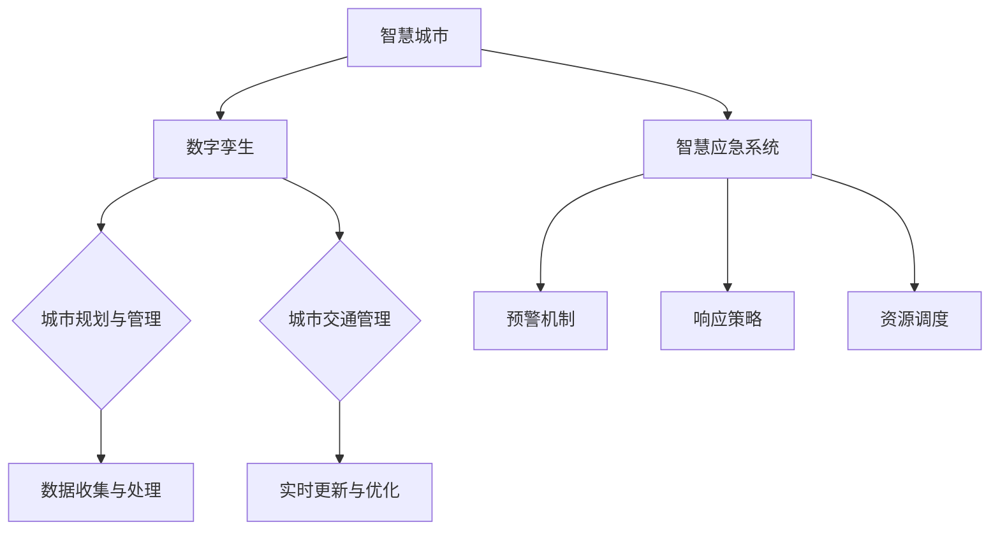
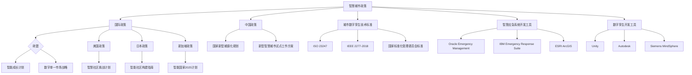

                 

# 未来的智慧城市：2050年的城市数字孪生与智慧应急

> **关键词：智慧城市、数字孪生、智慧应急、城市数字孪生、智慧城市规划、智慧交通管理、智慧应急系统**

> **摘要：**
> 本文将探讨2050年的智慧城市发展趋势，重点关注城市数字孪生与智慧应急两个核心领域。首先，我们将对智慧城市的定义、核心要素和全球发展趋势进行概述。接着，详细解析数字孪生技术的概念、核心原理以及在不同领域的应用，特别是其在城市规划与管理、城市交通管理中的重要性。然后，深入探讨智慧应急的概念、组成部分以及在城市化进程中的作用。接下来，我们将讨论城市数字孪生的构建方法、应用以及在智慧应急系统中的重要性。最后，对智慧应急系统的设计与实施进行详细分析，并展望智慧城市的未来趋势，包括面临的挑战与可持续发展。本文旨在为读者提供一个全面而深入的智慧城市发展蓝图。

### 第一部分：智慧城市的概念与发展

#### 1.1 智慧城市的定义与核心要素

##### 1.1.1 智慧城市的定义

智慧城市是指通过先进的信息通信技术和物联网技术，对城市的基础设施、资源、环境和人口等各个方面进行智能化的管理和优化，实现高效、环保、可持续的城市发展模式。

##### 1.1.2 智慧城市的关键要素

智慧城市的关键要素包括：

- **基础设施智能化**：通过物联网、云计算、大数据等技术，对城市的基础设施进行智能升级，实现互联互通。
- **城市管理智能化**：通过智能化的城市管理平台，对城市运行状态进行实时监控和动态管理。
- **公共服务智能化**：通过智能化技术，提升公共服务的质量和效率，满足市民的多元化需求。
- **环境保护智能化**：通过智能化技术，对城市环境进行实时监测和优化管理，实现环境保护和可持续发展。

##### 1.1.3 智慧城市的全球发展趋势

全球智慧城市的发展趋势主要包括：

- **数字化基础设施建设**：各国纷纷加大数字化基础设施建设的投入，提升城市的信息化水平。
- **智能化城市管理**：通过智能化技术，提高城市管理效率和公共服务质量。
- **数据资源共享**：通过数据资源共享，实现跨部门、跨区域的协同管理。
- **可持续发展**：注重环境保护和资源利用，推动城市的可持续发展。

#### 1.2 数字孪生技术概述

##### 1.2.1 数字孪生技术的定义

数字孪生技术是一种基于虚拟现实和物联网技术的数字化复制技术，通过创建现实世界的数字映射，实现对物理实体的模拟、监控和管理。

##### 1.2.2 数字孪生技术的核心原理

数字孪生技术的核心原理包括：

- **数据采集**：通过传感器、摄像头等设备，实时采集物理实体的数据。
- **数据处理**：对采集到的数据进行处理和分析，提取有用的信息。
- **数字映射**：将处理后的数据映射到虚拟环境中，创建数字孪生模型。
- **实时监控**：通过数字孪生模型，实时监控物理实体的运行状态。

##### 1.2.3 数字孪生技术在不同领域的应用

数字孪生技术在不同领域的应用包括：

- **城市规划与管理**：通过数字孪生技术，实现对城市规划的模拟和优化，提高城市规划的科学性和效率。
- **城市管理**：通过数字孪生技术，实现对城市运行状态的实时监控和动态管理，提高城市管理效率。
- **交通管理**：通过数字孪生技术，实现对交通状况的实时监测和优化管理，提高交通运行效率。
- **公共安全**：通过数字孪生技术，实现对公共安全的实时监控和预警，提高公共安全水平。

#### 1.3 智慧应急的概念与重要性

##### 1.3.1 智慧应急的定义

智慧应急是指通过先进的信息通信技术和物联网技术，对突发事件进行快速响应、科学处置和有效管理，提高应急能力的智能化系统。

##### 1.3.2 智慧应急的组成部分

智慧应急的组成部分包括：

- **预警系统**：通过实时监测和数据分析，对潜在风险进行预警。
- **应急响应系统**：通过智能化的应急响应机制，实现对突发事件的快速响应。
- **应急资源管理系统**：通过智能化的资源调度和管理，实现对应急资源的优化配置。
- **应急指挥系统**：通过智能化的应急指挥平台，实现对突发事件的科学处置。

##### 1.3.3 智慧应急在城市化进程中的作用

智慧应急在城市化进程中的作用包括：

- **提高城市安全保障**：通过智慧应急系统，提高城市应对突发事件的能力，保障城市安全。
- **优化城市资源配置**：通过智慧应急系统，实现应急资源的优化配置，提高应急效率。
- **提高城市运行效率**：通过智慧应急系统，实现城市运行的实时监控和动态管理，提高城市运行效率。
- **推动城市可持续发展**：通过智慧应急系统，实现城市环境的实时监测和优化管理，推动城市可持续发展。

### 第二部分：数字孪生技术在智慧城市中的应用

#### 2.1 城市数字孪生的构建方法

##### 2.1.1 城市数字孪生模型的结构

城市数字孪生模型的结构主要包括以下几个部分：

- **数据采集模块**：通过传感器、摄像头等设备，实时采集城市各部分的数据。
- **数据处理模块**：对采集到的数据进行处理和分析，提取有用的信息。
- **数字映射模块**：将处理后的数据映射到虚拟环境中，创建数字孪生模型。
- **实时监控模块**：通过数字孪生模型，实时监控城市各部分的运行状态。
- **决策支持模块**：通过数字孪生模型，为城市规划和管理提供决策支持。

##### 2.1.2 数据收集与处理

数据收集与处理是构建城市数字孪生的关键步骤，主要包括以下几个环节：

- **数据采集**：通过传感器、摄像头等设备，实时采集城市各部分的数据。
- **数据预处理**：对采集到的原始数据进行清洗、去噪和归一化等处理。
- **数据存储**：将处理后的数据存储到数据库中，以便后续分析和使用。
- **数据分析**：对存储在数据库中的数据进行分析，提取有用的信息。
- **数据可视化**：将分析结果以图表、地图等形式进行可视化展示，方便决策者查看。

##### 2.1.3 数字孪生模型的实时更新与优化

数字孪生模型的实时更新与优化是确保其准确性和有效性的关键，主要包括以下几个环节：

- **实时更新**：通过传感器等设备，实时采集城市各部分的数据，更新数字孪生模型。
- **模型优化**：根据实际情况，对数字孪生模型进行调整和优化，提高其准确性和实用性。
- **反馈机制**：建立反馈机制，根据实际运行情况，对数字孪生模型进行修正和改进。

#### 2.2 数字孪生在城市规划与管理中的应用

##### 2.2.1 城市规划中的数字孪生应用

数字孪生技术在城市规划中的应用主要包括以下几个方面：

- **城市模拟**：通过数字孪生技术，可以模拟城市的发展过程，预测城市未来的发展趋势，为城市规划提供科学依据。
- **城市规划**：通过数字孪生技术，可以实时监控城市的运行状态，为城市规划提供动态数据支持，优化城市规划方案。
- **环境影响评估**：通过数字孪生技术，可以对城市规划方案进行环境影响评估，预测城市规划对环境的影响，为决策提供参考。

##### 2.2.2 城市管理中的数字孪生应用

数字孪生技术在城市管理中的应用主要包括以下几个方面：

- **城市运行状态监控**：通过数字孪生技术，可以实时监控城市的运行状态，发现和解决城市运行中的问题，提高城市管理效率。
- **城市资源管理**：通过数字孪生技术，可以实时监控和优化城市资源的使用情况，提高资源利用效率。
- **公共安全管理**：通过数字孪生技术，可以实时监控城市的公共安全状况，提高公共安全水平。

##### 2.2.3 数字孪生在城市安全方面的作用

数字孪生技术在城市安全方面的作用主要包括以下几个方面：

- **预警机制**：通过数字孪生技术，可以实时监测城市的安全状况，及时发现安全隐患，发出预警信号，为应急响应提供支持。
- **应急响应**：通过数字孪生技术，可以模拟应急场景，为应急响应提供科学依据，优化应急响应策略。
- **安全评估**：通过数字孪生技术，可以对城市的安全状况进行评估，发现和解决安全隐患，提高城市的安全水平。

#### 2.3 数字孪生在城市交通管理中的应用

##### 2.3.1 交通数字孪生模型构建

交通数字孪生模型构建是数字孪生技术在城市交通管理中的应用的关键步骤，主要包括以下几个环节：

- **数据采集**：通过传感器、摄像头等设备，实时采集城市的交通数据，包括车流量、车速、道路状况等。
- **数据处理**：对采集到的交通数据进行处理和分析，提取有用的信息。
- **数字映射**：将处理后的交通数据映射到虚拟环境中，创建交通数字孪生模型。
- **实时监控**：通过交通数字孪生模型，实时监控城市的交通状况，为交通管理提供动态数据支持。

##### 2.3.2 智能交通管理系统的实现

智能交通管理系统的实现是数字孪生技术在城市交通管理中的应用的另一个重要方面，主要包括以下几个环节：

- **交通流量监控**：通过交通数字孪生模型，实时监控城市的交通流量，发现和解决交通拥堵问题。
- **交通信号优化**：通过交通数字孪生模型，优化交通信号灯的配时，提高交通通行效率。
- **交通事故处理**：通过交通数字孪生模型，实时监控交通事故的发生和处理情况，提高事故处理效率。

##### 2.3.3 数字孪生在交通应急响应中的应用

数字孪生技术在交通应急响应中的应用主要包括以下几个方面：

- **预警机制**：通过交通数字孪生模型，实时监测交通状况，及时发现潜在的安全隐患，发出预警信号。
- **应急响应**：通过交通数字孪生模型，模拟应急场景，为应急响应提供科学依据，优化应急响应策略。
- **资源调度**：通过交通数字孪生模型，实时监控交通资源的使用情况，优化交通资源的调度和配置，提高应急响应效率。

### 第三部分：智慧应急系统的设计与实施

#### 3.1 智慧应急系统的总体架构

##### 3.1.1 智慧应急系统的组成部分

智慧应急系统主要由以下几个部分组成：

- **预警系统**：负责实时监测城市的安全状况，及时发现潜在的安全隐患，发出预警信号。
- **应急响应系统**：负责对突发事件进行快速响应，制定和实施应急响应策略。
- **应急资源管理系统**：负责对应急资源进行统一调度和管理，确保应急资源的合理配置和高效利用。
- **应急指挥系统**：负责对突发事件进行统一指挥和调度，协调各方力量进行应急处置。
- **信息管理系统**：负责收集、存储、分析和处理各类应急信息，为应急决策提供支持。

##### 3.1.2 智慧应急系统的技术支撑

智慧应急系统的技术支撑主要包括以下几个技术：

- **物联网技术**：通过物联网技术，实现各类传感器和设备的互联互通，实时采集城市的运行数据。
- **云计算技术**：通过云计算技术，实现数据的存储、处理和分析，提供强大的计算能力和存储能力。
- **大数据技术**：通过大数据技术，实现对海量数据的存储、处理和分析，提取有用的信息。
- **人工智能技术**：通过人工智能技术，实现智能化的预警、响应和资源调度，提高应急效率。

##### 3.1.3 智慧应急系统的运行机制

智慧应急系统的运行机制主要包括以下几个环节：

- **实时监测**：通过传感器和设备，实时监测城市的运行状态，发现潜在的安全隐患。
- **预警**：根据监测数据，实时分析城市的安全状况，发出预警信号。
- **响应**：根据预警信息，迅速启动应急响应程序，制定和实施应急响应策略。
- **资源调度**：根据应急响应需求，统一调度和管理应急资源，确保应急资源的高效利用。
- **指挥**：通过应急指挥系统，统一指挥和调度各方力量，协调应急处置工作。
- **评估**：对应急处置效果进行评估，总结经验教训，优化应急响应流程。

#### 3.2 智慧应急预警机制的构建

##### 3.2.1 预警信号的选择与监测

预警信号的选择与监测是智慧应急预警机制构建的关键环节，主要包括以下几个步骤：

- **预警信号的选择**：根据城市的安全需求和风险特点，选择合适的预警信号，如火灾、地震、洪水等。
- **预警指标的设定**：根据预警信号的特点，设定相应的预警指标，如温度、湿度、降雨量等。
- **监测设备的配置**：根据预警指标的要求，配置相应的监测设备，如传感器、摄像头等。
- **监测数据的采集**：通过监测设备，实时采集城市的运行数据，为预警分析提供数据支持。

##### 3.2.2 预警模型的建立与优化

预警模型的建立与优化是智慧应急预警机制构建的核心，主要包括以下几个步骤：

- **数据预处理**：对采集到的数据进行清洗、去噪和归一化等预处理，提高数据质量。
- **特征提取**：从预处理后的数据中提取有效的特征信息，为预警模型提供输入。
- **模型选择**：根据预警信号的特点，选择合适的预警模型，如决策树、神经网络等。
- **模型训练**：使用历史数据对预警模型进行训练，优化模型参数，提高预警准确性。
- **模型评估**：使用测试数据对预警模型进行评估，验证模型的预警性能。

##### 3.2.3 预警信息的发布与传播

预警信息的发布与传播是智慧应急预警机制的重要组成部分，主要包括以下几个环节：

- **预警信息生成**：根据预警模型的预测结果，生成预警信息，包括预警信号、预警等级、预警时间等。
- **预警信息发布**：通过短信、电话、互联网等渠道，及时发布预警信息，通知相关部门和公众。
- **预警信息传播**：通过广播、电视、社交媒体等渠道，广泛传播预警信息，提高公众的预警意识和应急能力。

#### 3.3 智慧应急响应策略的制定

##### 3.3.1 响应策略的制定原则

智慧应急响应策略的制定应遵循以下几个原则：

- **科学性**：根据实际情况，科学制定应急响应策略，确保响应措施的合理性和有效性。
- **及时性**：快速响应突发事件，及时采取有效的应急措施，减轻灾害损失。
- **协同性**：各方力量协同配合，形成合力，提高应急响应的整体效率。
- **灵活性**：根据应急情况的变化，灵活调整应急响应策略，确保应急响应的及时性和有效性。

##### 3.3.2 响应策略的制定流程

智慧应急响应策略的制定流程主要包括以下几个步骤：

- **风险评估**：对突发事件进行风险评估，确定应急响应的目标和原则。
- **资源调查**：调查和分析应急资源的情况，包括人力、物力、财力等，为应急响应提供资源保障。
- **预案制定**：根据风险评估和资源调查的结果，制定详细的应急响应预案，包括预警、响应、资源调度、指挥等环节。
- **预案演练**：定期组织应急响应预案演练，检验预案的可行性和有效性，发现和解决问题，不断完善预案。
- **预案修订**：根据演练结果和实际情况，及时修订和完善应急响应预案，提高预案的实用性。

##### 3.3.3 案例分析：某城市火灾应急响应策略

某城市在制定火灾应急响应策略时，遵循了科学性、及时性、协同性和灵活性的原则，制定了以下应急响应策略：

1. **预警阶段**：
   - 安装火灾监测设备，实时监测火灾隐患；
   - 建立火灾预警模型，及时预测火灾风险；
   - 发布预警信息，提醒公众和相关部门。

2. **响应阶段**：
   - 火灾发生时，立即启动应急响应程序；
   - 调派消防队伍和应急设备，迅速赶到火灾现场；
   - 组织疏散群众，确保人员安全。

3. **救援阶段**：
   - 消防队伍进行灭火和救援工作；
   - 医疗队伍进行受伤人员的救治；
   - 及时疏散和安置受灾群众。

4. **恢复阶段**：
   - 对火灾现场进行清理和恢复；
   - 开展灾后评估，总结经验教训；
   - 加强火灾预防工作，减少火灾发生。

#### 3.4 智慧应急资源的调度与优化

##### 3.4.1 资源调度策略的设计

智慧应急资源的调度与优化是智慧应急系统的重要环节，主要包括以下几个策略：

- **资源需求预测**：根据突发事件的特点和规模，预测应急资源的需求，包括人力、物力、财力等。
- **资源分配策略**：根据资源需求预测结果，制定合理的资源分配策略，确保应急资源的合理利用。
- **优先级调度**：根据突发事件的重要性和紧急程度，确定应急资源的调度优先级，确保关键资源优先调度。
- **动态调整**：根据应急响应的实际情况，实时调整资源调度策略，提高资源调度的灵活性。

##### 3.4.2 资源调度算法的实现

资源调度算法是实现智慧应急资源调度的核心，主要包括以下几个算法：

- **最优化算法**：使用最优化算法，如线性规划、整数规划等，确定资源的最优分配方案。
- **调度算法**：使用调度算法，如轮转调度、优先级调度等，实现应急资源的实时调度。
- **预测算法**：使用预测算法，如时间序列预测、回归分析等，预测应急资源的需求，为资源调度提供依据。
- **优化算法**：使用优化算法，如遗传算法、模拟退火等，对资源调度策略进行优化，提高资源调度效果。

##### 3.4.3 资源调度效果的评估

资源调度效果的评估是验证智慧应急资源调度策略有效性的关键，主要包括以下几个指标：

- **响应时间**：评估应急资源从调度到使用的时间，越短越好。
- **资源利用率**：评估应急资源的利用程度，越高越好。
- **调度效率**：评估应急资源调度的效率，包括调度时间、调度次数等。
- **应急效果**：评估应急响应的整体效果，包括减少灾害损失、保护人员安全等。

### 第四部分：未来展望与挑战

#### 4.1 智慧城市发展的未来趋势

智慧城市发展的未来趋势主要包括以下几个方面：

- **技术进步**：随着5G、物联网、人工智能等新技术的快速发展，智慧城市的建设将更加智能化、高效化。
- **数据驱动的决策**：通过大数据技术的应用，实现数据驱动的城市管理和决策，提高城市运行效率和公共服务质量。
- **可持续发展**：注重环境保护和资源利用，推动城市的可持续发展，实现经济、社会和环境的协调发展。
- **智慧城市生态系统的构建**：构建智慧城市生态系统，实现城市各子系统之间的协同和联动，提高城市整体的智能化水平。

#### 4.2 智慧城市的可持续发展

智慧城市的可持续发展是未来智慧城市建设的重要目标，主要包括以下几个方面：

- **绿色发展**：通过智能化技术，实现城市环境的实时监测和优化管理，推动城市的绿色发展。
- **资源利用优化**：通过智能化技术，提高城市资源的利用效率，减少资源浪费，实现资源的可持续利用。
- **社会公平**：通过智能化技术，提升公共服务的质量和效率，促进社会公平，提高市民的生活质量。
- **城市更新与改造**：通过智能化技术，推动城市的更新与改造，实现城市的现代化和可持续发展。

#### 4.3 智慧城市的法律、伦理与隐私问题

智慧城市的法律、伦理与隐私问题是未来智慧城市建设必须面对和解决的问题，主要包括以下几个方面：

- **法律法规的完善**：建立健全的智慧城市相关法律法规，规范智慧城市建设的运行和管理。
- **伦理问题的应对**：加强对智慧城市伦理问题的研究和应对，确保智慧城市的建设符合社会伦理道德标准。
- **隐私保护的措施**：加强对个人隐私的保护，建立健全的隐私保护机制，确保个人隐私的安全。

### 附录

#### 附录A：智慧城市相关的政策和标准

- **国际智慧城市政策概述**：介绍国际智慧城市发展的相关政策，包括欧盟、美国、日本等国家的智慧城市政策。
- **中国智慧城市发展标准**：介绍中国智慧城市发展的相关标准，包括国家标准、行业标准和地方标准。
- **城市数字孪生技术标准**：介绍城市数字孪生技术的相关标准，包括数据采集、数据处理、数字映射等方面的标准。

#### 附录B：智慧城市技术资源汇总

- **数字孪生开发工具与平台**：介绍常用的数字孪生开发工具和平台，包括软件工具、硬件设备、云平台等。
- **智慧应急系统开发工具与平台**：介绍常用的智慧应急系统开发工具和平台，包括软件开发工具、硬件设备、云平台等。
- **智慧城市相关数据库与数据源**：介绍常用的智慧城市相关数据库和数据源，包括公共数据库、企业数据库、开放数据平台等。

# Mermaid 流程图



### 作者信息

作者：AI天才研究院/AI Genius Institute & 禅与计算机程序设计艺术 /Zen And The Art of Computer Programming

### 总结

本文通过对智慧城市的概念、数字孪生技术、智慧应急系统等核心内容的详细阐述，探讨了2050年智慧城市的发展趋势和未来挑战。数字孪生技术作为智慧城市的重要支撑，将在城市规划、城市管理、城市安全等方面发挥重要作用。智慧应急系统的设计与实施，将提高城市应对突发事件的能力，保障城市安全。面对未来，智慧城市的可持续发展、法律伦理与隐私保护等问题也需要我们深入思考和解决。希望本文能为读者提供一个全面而深入的智慧城市发展蓝图，为未来的智慧城市建设提供参考和启示。|>  
---

### 第一部分：智慧城市的概念与发展

在探讨未来的智慧城市之前，我们有必要先理解智慧城市的定义、核心要素以及全球的发展趋势。智慧城市是一个综合性的概念，它依托于信息技术、物联网、大数据、人工智能等先进技术，通过智能化手段对城市资源进行优化配置、提高城市管理和服务的效率，从而实现可持续发展。

#### 1.1 智慧城市的定义与核心要素

##### 1.1.1 智慧城市的定义

智慧城市是指利用先进的信息通信技术和物联网技术，实现城市基础设施、公共管理、公共服务、生态环境等各个方面的智能化、网络化、协同化，从而提高城市运行效率和市民生活质量。智慧城市的核心在于“智慧”，它不仅仅是技术的堆砌，更是城市治理理念的创新和升级。

##### 1.1.2 智慧城市的关键要素

智慧城市的关键要素主要包括以下几个方面：

1. **基础设施智能化**：包括交通、能源、水务等基础设施的智能化升级，实现实时监测、自动调控和高效管理。
2. **城市管理智能化**：通过建立智能化的城市管理平台，实现城市运行状态的实时监控、分析和决策支持。
3. **公共服务智能化**：通过智能化手段提升公共服务的质量，如教育、医疗、社保等领域的数字化服务。
4. **环境监测与治理**：利用物联网、大数据等技术，实现对城市环境的实时监测和污染治理。
5. **安全防控体系**：通过视频监控、智能安防等手段，提高城市的安全防护能力。

##### 1.1.3 智慧城市的全球发展趋势

全球智慧城市的发展趋势主要体现在以下几个方面：

1. **技术驱动**：随着5G、物联网、人工智能等新技术的不断发展，智慧城市的技术基础越来越强大。
2. **数据驱动**：大数据技术在智慧城市中的应用越来越广泛，通过对海量数据的挖掘和分析，实现更精准的城市管理和决策。
3. **可持续发展**：智慧城市的发展越来越注重环境保护和资源利用，推动城市的可持续发展。
4. **智慧治理**：通过数字化手段，提高城市治理的效率和透明度，增强政府的决策能力和服务能力。

#### 1.2 数字孪生技术概述

##### 1.2.1 数字孪生技术的定义

数字孪生技术（Digital Twin Technology）是指通过数字化的方式创建现实世界的映射，实现对物理实体的模拟、监控和管理。数字孪生技术将物理实体、虚拟模型和实时数据结合起来，形成一个闭环系统，实现对实体的全生命周期管理。

##### 1.2.2 数字孪生技术的核心原理

数字孪生技术的核心原理包括：

1. **数据采集**：通过传感器、摄像头等设备，实时采集物理实体的运行数据。
2. **数据处理**：对采集到的数据进行处理和分析，提取有用的信息。
3. **数字映射**：将处理后的数据映射到虚拟环境中，创建数字孪生模型。
4. **实时监控**：通过数字孪生模型，实时监控物理实体的运行状态。
5. **智能决策**：基于数字孪生模型，实现对物理实体的智能决策和优化管理。

##### 1.2.3 数字孪生技术在不同领域的应用

数字孪生技术在各个领域的应用都非常广泛，主要包括：

1. **工业制造**：通过数字孪生技术，实现对生产过程的实时监控和优化，提高生产效率和产品质量。
2. **城市规划**：通过数字孪生技术，模拟城市规划方案的效果，优化城市布局和资源配置。
3. **医疗健康**：通过数字孪生技术，实现对病人的实时监测和健康管理，提高医疗服务的质量和效率。
4. **交通运输**：通过数字孪生技术，实现对交通状况的实时监控和优化管理，提高交通运行效率和安全性。

#### 1.3 智慧应急的概念与重要性

##### 1.3.1 智慧应急的定义

智慧应急（Smart Emergency Response）是指通过先进的信息通信技术和物联网技术，对突发事件进行快速响应、科学处置和有效管理，提高应急能力的智能化系统。智慧应急不仅仅是应急响应，更包括预警、预案管理、资源调度、事后评估等全方位的应急管理体系。

##### 1.3.2 智慧应急的组成部分

智慧应急系统主要由以下几个部分组成：

1. **预警系统**：负责实时监测和收集数据，对潜在的风险进行预测和预警。
2. **预案管理系统**：负责制定和存储应急预案，为应急响应提供指导和依据。
3. **资源管理系统**：负责调度和管理应急资源，确保应急资源的合理分配和高效利用。
4. **指挥系统**：负责对应急事件进行统一指挥和调度，协调各方力量进行应急处置。
5. **事后评估系统**：负责对应急事件进行总结和评估，为改进应急管理体系提供依据。

##### 1.3.3 智慧应急在城市化进程中的作用

智慧应急在城市化进程中的作用主要体现在以下几个方面：

1. **提高应急响应速度**：通过智慧应急系统，可以实现对突发事件的实时监控和快速响应，减少灾害损失。
2. **优化资源调度**：通过智慧应急系统，可以实现对应急资源的优化调度，提高应急资源的使用效率。
3. **提升城市安全性**：通过智慧应急系统，可以实现对城市安全的实时监控和预警，提高城市的整体安全水平。
4. **增强政府应急能力**：通过智慧应急系统，可以提升政府的应急管理水平，提高政府的决策能力和服务能力。

### 第一部分总结

本部分对智慧城市的概念、数字孪生技术和智慧应急系统进行了详细阐述，为后续的深入讨论打下了基础。智慧城市的发展离不开数字孪生技术和智慧应急系统的支持，这两者将共同推动未来智慧城市的建设，实现城市运行的高效、安全和可持续发展。在接下来的部分中，我们将进一步探讨数字孪生技术在智慧城市中的应用以及智慧应急系统的设计与实施。

### 2.1 城市数字孪生的构建方法

城市数字孪生（Urban Digital Twin）是将现实城市通过数字化手段进行映射和模拟，从而实现对城市运行状态的实时监控和预测分析。城市数字孪生的构建方法主要包括以下几个方面：

##### 2.1.1 城市数字孪生模型的结构

城市数字孪生模型通常由以下几个关键部分组成：

1. **数据层**：包括城市的基础数据、实时数据和历史数据，如地理信息数据、交通流量数据、环境监测数据等。
2. **模型层**：将数据转化为模型，如地理信息系统（GIS）、交通模拟模型、环境模型等，用于模拟和分析城市运行状态。
3. **接口层**：提供与外部系统交互的接口，如传感器接口、数据分析接口、可视化接口等。
4. **应用层**：基于数字孪生模型提供各种城市管理和服务的应用，如城市规划、交通管理、环境保护等。

##### 2.1.2 数据收集与处理

数据收集与处理是构建城市数字孪生的基础步骤，具体包括以下环节：

1. **数据采集**：通过传感器、摄像头、无人机等设备，实时采集城市的各种数据，如交通流量、环境质量、建筑状态等。
   ```mermaid
   graph TD
   A[传感器] --> B[摄像头]
   B --> C[无人机]
   C --> D[数据采集]
   ```

2. **数据处理**：对采集到的数据进行预处理，包括数据清洗、去噪、归一化等，确保数据的质量和一致性。
   ```mermaid
   graph TD
   D --> E[数据清洗]
   E --> F[去噪]
   F --> G[归一化]
   ```

3. **数据存储**：将处理后的数据存储到数据库或数据湖中，便于后续的数据分析和应用。
   ```mermaid
   graph TD
   G --> H[数据存储]
   ```

##### 2.1.3 数字孪生模型的实时更新与优化

数字孪生模型的实时更新与优化是保持模型准确性和有效性的关键，具体包括以下环节：

1. **实时更新**：通过传感器和数据接口，实时采集城市的新数据，更新数字孪生模型。
   ```mermaid
   graph TD
   I[传感器] --> J[实时更新]
   ```

2. **模型优化**：根据新数据，对数字孪生模型进行调整和优化，提高模型的预测准确性和实用性。
   ```mermaid
   graph TD
   J --> K[模型优化]
   ```

3. **反馈机制**：通过反馈机制，将模型预测结果与实际运行情况进行对比，发现和纠正模型中的偏差。
   ```mermaid
   graph TD
   K --> L[反馈机制]
   ```

##### 2.1.4 数字孪生模型的模拟与预测

数字孪生模型不仅用于实时监控，还可以用于模拟和预测，为城市规划和管理提供科学依据。具体步骤如下：

1. **模拟运行**：根据数字孪生模型，模拟城市在不同情景下的运行状态，如交通拥堵、环境变化等。
   ```mermaid
   graph TD
   M[数字孪生模型] --> N[模拟运行]
   ```

2. **预测分析**：利用数字孪生模型，预测城市未来的发展趋势和潜在问题，如人口增长、交通流量变化等。
   ```mermaid
   graph TD
   N --> O[预测分析]
   ```

##### 2.1.5 数字孪生模型的应用实例

数字孪生模型在城市规划与管理、城市交通管理、城市安全等方面具有广泛的应用实例：

1. **城市规划与管理**：通过数字孪生模型，模拟城市规划方案的效果，优化城市布局和资源配置。
2. **城市交通管理**：通过数字孪生模型，实时监控交通状况，优化交通信号灯配置，缓解交通拥堵。
3. **城市安全监控**：通过数字孪生模型，实时监控城市的安全状况，及时发现和预警潜在的安全隐患。

### 第二部分总结

本部分详细阐述了城市数字孪生的构建方法，从模型结构、数据收集与处理、实时更新与优化，到模拟与预测，再到实际应用，为智慧城市的建设提供了技术支撑。城市数字孪生技术将进一步提升城市管理的智能化水平，为城市的可持续发展提供有力保障。在下一部分中，我们将探讨数字孪生技术在智慧城市规划与管理中的应用。

### 2.2 数字孪生在城市规划与管理中的应用

数字孪生技术在城市规划与管理中扮演着重要的角色，它通过创建城市的数字映射，帮助城市规划者和管理者更直观地理解城市运作，从而优化决策过程。以下是数字孪生在城市规划与管理中的具体应用：

##### 2.2.1 城市规划中的数字孪生应用

1. **城市模拟与预测**：数字孪生技术可以模拟城市在不同规划方案下的未来状态，如人口密度、交通流量、环境质量等。这种模拟可以帮助规划者评估不同规划方案的影响，从而做出更科学的决策。

   ```mermaid
   graph TD
   A[数字孪生模型] --> B[城市模拟]
   B --> C[预测分析]
   ```

2. **三维可视化**：通过数字孪生技术，城市规划者可以创建城市的三维模型，实现对城市布局的直观理解。这种三维可视化有助于展示规划方案，提高公众参与度和决策透明度。

   ```mermaid
   graph TD
   D[数字孪生模型] --> E[三维可视化]
   ```

3. **环境影响评估**：数字孪生技术可以模拟城市规划对环境的影响，包括空气污染、噪音污染、生态破坏等。这有助于规划者评估规划方案的环境影响，并采取相应的缓解措施。

   ```mermaid
   graph TD
   F[数字孪生模型] --> G[环境影响评估]
   ```

##### 2.2.2 城市管理中的数字孪生应用

1. **实时监控与预警**：数字孪生技术可以实时监控城市的运行状态，包括交通流量、环境质量、公共设施的使用情况等。通过预警系统，可以及时发现潜在的问题，并迅速采取应对措施。

   ```mermaid
   graph TD
   H[数字孪生模型] --> I[实时监控]
   I --> J[预警系统]
   ```

2. **资源优化配置**：数字孪生技术可以收集和分析城市运行数据，帮助管理者优化资源配置。例如，通过分析交通流量数据，可以优化交通信号灯的配置，缓解交通拥堵。

   ```mermaid
   graph TD
   K[数字孪生模型] --> L[资源优化]
   ```

3. **公共设施管理**：数字孪生技术可以用于监控和管理城市中的公共设施，如公园、学校、医院等。通过实时监控，可以及时发现设施的损坏或使用问题，并进行维护和更新。

   ```mermaid
   graph TD
   M[数字孪生模型] --> N[公共设施管理]
   ```

##### 2.2.3 数字孪生在城市安全方面的作用

1. **应急响应**：数字孪生技术可以在突发事件中提供实时数据支持，帮助应急响应团队快速制定应对策略。例如，在地震、洪水等灾害发生时，数字孪生可以模拟灾害影响，为救援行动提供指导。

   ```mermaid
   graph TD
   O[数字孪生模型] --> P[应急响应]
   ```

2. **风险评估**：数字孪生技术可以评估城市在不同情景下的安全风险，如自然灾害、恐怖袭击等。这有助于规划者制定相应的安全措施，提高城市的抗灾能力。

   ```mermaid
   graph TD
   Q[数字孪生模型] --> R[风险评估]
   ```

3. **安全监控**：数字孪生技术可以通过监控城市中的摄像头、传感器等设备，实时监控城市的安全状况。一旦发现异常，系统会自动发出警报，并通知相关部门采取行动。

   ```mermaid
   graph TD
   S[数字孪生模型] --> T[安全监控]
   ```

##### 2.2.4 成功案例分析

- **新加坡“智能国家”计划**：新加坡通过数字孪生技术，实现了城市运行状态的实时监控和优化管理。例如，通过交通数字孪生模型，新加坡成功缓解了交通拥堵问题，提升了城市运行效率。
- **芝加哥城市数字孪生项目**：芝加哥利用数字孪生技术，建立了城市的数字模型，用于监控和管理城市的基础设施。这有助于预测设备故障，优化维护计划，提高设施的使用寿命。

### 第二部分总结

数字孪生技术在城市规划与管理中的应用，极大地提高了决策的科学性和效率。通过实时监控、模拟预测和优化管理，数字孪生技术不仅帮助规划者更好地理解城市运行，还能为城市管理提供强有力的技术支持。在下一部分中，我们将探讨数字孪生在城市交通管理中的应用。

### 2.3 数字孪生在城市交通管理中的应用

城市交通管理是智慧城市建设的重要组成部分，数字孪生技术在这一领域的应用潜力巨大，能够显著提升交通系统的效率和安全性。以下是数字孪生在城市交通管理中的具体应用：

##### 2.3.1 交通数字孪生模型构建

1. **数据采集**：构建交通数字孪生模型的第一步是数据采集。通过安装在道路上的传感器、摄像头、车辆定位系统等设备，实时收集交通流量、速度、密度、事故等信息。

   ```mermaid
   graph TD
   A[传感器] --> B[摄像头]
   B --> C[车辆定位系统]
   C --> D[数据采集]
   ```

2. **数据处理**：采集到的交通数据进行预处理，包括去噪、归一化、清洗等，确保数据的质量和一致性。预处理后的数据存储在数据湖或数据库中，以便后续分析。

   ```mermaid
   graph TD
   D --> E[数据预处理]
   E --> F[数据存储]
   ```

3. **数字映射**：将预处理后的数据映射到虚拟环境中，创建交通数字孪生模型。这个模型可以模拟城市道路的网络结构，以及车辆的运行状态。

   ```mermaid
   graph TD
   F --> G[数字映射]
   ```

4. **实时监控**：通过交通数字孪生模型，实时监控城市交通状况，包括交通流量、拥堵情况、事故预警等。

   ```mermaid
   graph TD
   G --> H[实时监控]
   ```

##### 2.3.2 智能交通管理系统的实现

1. **交通信号优化**：基于交通数字孪生模型，利用数据分析和人工智能算法，优化交通信号灯的配时策略。例如，通过分析实时交通流量数据，动态调整信号灯的切换时间，减少交通拥堵。

   ```mermaid
   graph TD
   H --> I[交通信号优化]
   ```

2. **智能调度**：数字孪生技术可以用于智能调度交通资源，如公交车、出租车等。通过预测交通流量和乘客需求，优化车辆的调度路线和时间，提高运输效率。

   ```mermaid
   graph TD
   I --> J[智能调度]
   ```

3. **道路维护**：通过交通数字孪生模型，可以实时监测道路状况，发现路面损坏、坑洼等问题。这些信息可以用于道路维护和修复计划的制定，延长道路使用寿命。

   ```mermaid
   graph TD
   J --> K[道路维护]
   ```

##### 2.3.3 数字孪生在交通应急响应中的应用

1. **应急预警**：在交通事故或其他紧急情况下，数字孪生技术可以迅速识别并预警。通过实时数据分析和模型模拟，预测事故可能产生的交通拥堵，并提前采取措施，如封闭路段、调整交通信号等。

   ```mermaid
   graph TD
   L[数字孪生模型] --> M[应急预警]
   ```

2. **资源调度**：在应急响应过程中，数字孪生技术可以实时监控交通资源的使用情况，如救护车的位置、交警的分布等。根据实时数据，优化资源的调度和配置，提高应急响应效率。

   ```mermaid
   graph TD
   M --> N[资源调度]
   ```

3. **模拟演练**：数字孪生技术可以用于模拟交通应急场景，评估不同响应策略的效果。通过模拟演练，可以提前发现应急响应中的问题和不足，为实际应急情况做好准备。

   ```mermaid
   graph TD
   N --> O[模拟演练]
   ```

##### 2.3.4 成功案例分析

- **伦敦交通数字孪生项目**：伦敦利用数字孪生技术，实现了城市交通系统的全面监控和优化。通过交通数字孪生模型，伦敦成功地减少了交通拥堵，提高了公共交通的运行效率。
- **北京智能交通管理系统**：北京通过构建交通数字孪生模型，实现了对城市交通的实时监控和智能调度。在高峰期，交通信号灯可以根据实时交通流量进行动态调整，有效缓解了交通压力。

### 第二部分总结

数字孪生技术在城市交通管理中的应用，为提高交通系统的效率和安全性提供了强有力的支持。通过实时数据采集、智能信号优化、资源调度和应急响应，数字孪生技术不仅能够提升交通管理水平，还能为市民提供更加便捷、高效的出行体验。在下一部分中，我们将探讨智慧应急系统的设计与实施。

### 3.1 智慧应急系统的总体架构

智慧应急系统是城市安全管理的重要组成部分，它通过先进的信息通信技术和物联网技术，实现对突发事件的快速响应和科学处置。智慧应急系统的总体架构包括预警系统、应急响应系统、应急资源管理系统和应急指挥系统等关键组成部分。

##### 3.1.1 智慧应急系统的组成部分

1. **预警系统**：预警系统是智慧应急系统的前端，负责实时监测城市的安全状况，发现潜在的风险和威胁。预警系统通过传感器、监控设备、数据分析等手段，收集和处理各种安全信息，如气象数据、地质灾害数据、交通流量数据等。

   ```mermaid
   graph TD
   A[传感器] --> B[监控设备]
   B --> C[数据分析]
   C --> D[预警系统]
   ```

2. **应急响应系统**：应急响应系统是智慧应急系统的核心，负责在突发事件发生时，迅速启动应急响应程序，组织救援力量和资源进行处置。应急响应系统包括应急预案管理、应急指挥调度、现场救援等模块。

   ```mermaid
   graph TD
   E[应急预案管理] --> F[应急指挥调度]
   F --> G[现场救援]
   ```

3. **应急资源管理系统**：应急资源管理系统负责对应急资源进行统一调度和管理，包括人员、物资、设备等。该系统通过数字化手段，实现对应急资源的实时监控和动态调度，确保资源的高效利用。

   ```mermaid
   graph TD
   H[人员管理] --> I[物资管理]
   I --> J[设备管理]
   ```

4. **应急指挥系统**：应急指挥系统是智慧应急系统的中枢，负责对突发事件的统一指挥和协调。应急指挥系统通过多渠道的信息传递和指挥调度，确保各应急力量协同作战，提高应急响应效率。

   ```mermaid
   graph TD
   K[指挥中心] --> L[指挥调度]
   L --> M[信息传递]
   ```

##### 3.1.2 智慧应急系统的技术支撑

智慧应急系统的技术支撑主要包括以下几个方面：

1. **物联网技术**：物联网技术是实现智慧应急系统实时监控和数据采集的关键。通过传感器、摄像头、无人机等设备，物联网技术可以实现对城市安全状况的全面监控。

   ```mermaid
   graph TD
   N[传感器] --> O[摄像头]
   O --> P[无人机]
   ```

2. **云计算技术**：云计算技术为智慧应急系统提供了强大的计算能力和数据存储能力。通过云计算平台，应急数据可以进行大规模处理和分析，为应急决策提供支持。

   ```mermaid
   graph TD
   Q[数据存储] --> R[数据处理]
   ```

3. **大数据技术**：大数据技术是智慧应急系统的重要技术支撑，通过大数据分析，可以对大量实时数据进行挖掘和分析，发现潜在的安全隐患和趋势。

   ```mermaid
   graph TD
   S[数据挖掘] --> T[趋势分析]
   ```

4. **人工智能技术**：人工智能技术是实现智慧应急系统智能化决策的关键。通过机器学习、深度学习等技术，可以对应急数据进行智能分析和预测，提高应急响应的准确性和效率。

   ```mermaid
   graph TD
   U[机器学习] --> V[深度学习]
   ```

##### 3.1.3 智慧应急系统的运行机制

智慧应急系统的运行机制主要包括以下几个环节：

1. **实时监测**：通过物联网技术，实现对城市安全状况的实时监测，包括气象、地质、交通、环境等各个方面。

   ```mermaid
   graph TD
   W[物联网技术] --> X[实时监测]
   ```

2. **预警与响应**：在监测到潜在风险时，预警系统会发出预警信号，应急响应系统根据预警信息启动应急预案，组织救援力量进行处置。

   ```mermaid
   graph TD
   X --> Y[预警与响应]
   ```

3. **资源调度**：应急资源管理系统根据应急响应的需求，对人员和物资进行调度和分配，确保资源的高效利用。

   ```mermaid
   graph TD
   Y --> Z[资源调度]
   ```

4. **应急指挥**：应急指挥系统负责对突发事件进行统一指挥和调度，协调各方力量进行应急处置，确保应急行动的有序进行。

   ```mermaid
   graph TD
   Z --> AA[应急指挥]
   ```

5. **事后评估**：在应急事件结束后，对整个应急处置过程进行评估和总结，发现问题和不足，为今后的应急工作提供改进建议。

   ```mermaid
   graph TD
   AA --> BB[事后评估]
   ```

### 3.1.4 智慧应急系统的实际应用场景

智慧应急系统的实际应用场景非常广泛，以下是一些典型的应用场景：

1. **自然灾害应对**：在地震、台风、洪水等自然灾害发生时，智慧应急系统可以实时监测灾害进展，快速启动应急响应，调度救援力量和物资，确保灾区的救援工作高效有序。

   ```mermaid
   graph TD
   CC[自然灾害] --> DD[实时监测]
   DD --> EE[应急响应]
   ```

2. **公共安全事件应对**：在恐怖袭击、火灾、爆炸等公共安全事件发生时，智慧应急系统可以迅速识别事件，启动应急预案，组织相关部门和人员进行应急处置。

   ```mermaid
   graph TD
   FF[公共安全事件] --> GG[识别事件]
   GG --> HH[应急预案]
   ```

3. **城市交通管理**：在交通拥堵、交通事故等情况下，智慧应急系统可以通过实时交通监控和智能调度，优化交通信号，调度交通救援力量，确保交通秩序的快速恢复。

   ```mermaid
   graph TD
   II[交通事件] --> JJ[实时监控]
   JJ --> KK[智能调度]
   ```

### 3.1.5 成功案例分析

1. **新加坡“紧急应变与灾害管理委员会”**：新加坡通过建立智慧应急系统，实现了对各种突发事件的快速响应和高效管理。该系统通过实时数据监测和智能分析，提高了新加坡的应急响应能力，为市民提供了更加安全的生活环境。

2. **北京“智慧城市安全应急平台”**：北京通过构建智慧应急系统，实现了城市安全的实时监控和应急管理的智能化。该系统在应对自然灾害、公共安全事件等方面发挥了重要作用，提高了北京的城市安全水平。

### 3.1.6 总结

智慧应急系统是城市安全管理的重要组成部分，通过物联网、云计算、大数据和人工智能等先进技术的应用，实现了对突发事件的快速响应和高效管理。智慧应急系统的总体架构包括预警系统、应急响应系统、应急资源管理系统和应急指挥系统等，这些系统协同工作，确保城市的安全和稳定。在下一部分中，我们将深入探讨智慧应急预警机制的构建。

### 3.2 智慧应急预警机制的构建

智慧应急预警机制是智慧应急系统的核心部分，它通过实时监测、数据分析和智能预测，提前发现潜在的安全风险，发出预警信号，为应急响应提供有力支持。构建一个有效的智慧应急预警机制，需要从预警信号的选择、监测数据的采集、预警模型的建立和优化等方面进行系统设计。

#### 3.2.1 预警信号的选择与监测

预警信号的选择是构建智慧应急预警机制的首要任务。预警信号应能够准确反映城市面临的各种潜在风险。以下是选择预警信号时需要考虑的几个关键因素：

1. **风险类型**：根据城市的特点和地理位置，确定需要监测的风险类型，如气象灾害（台风、洪水）、地质灾害（地震、滑坡）、公共安全事件（火灾、恐怖袭击）等。

2. **预警级别**：根据风险的程度，设定不同的预警级别，如红色、橙色、黄色和蓝色等。不同级别的预警信号对应不同的响应措施和公众应对策略。

3. **实时性**：预警信号需要具备实时性，能够及时反映风险变化，为应急响应提供及时的数据支持。

4. **精确性**：预警信号应具有较高的精确性，避免误报和漏报，确保预警信号的可靠性和有效性。

在选择预警信号后，需要建立监测系统，对预警信号进行实时监测。监测系统通常包括以下几部分：

- **传感器网络**：部署各种传感器，如气象站、地震仪、摄像头、烟雾探测器等，实时收集与预警信号相关的数据。

- **数据采集设备**：如数据采集器、无人机、卫星遥感等，用于补充地面监测数据的不足。

- **通信网络**：建立稳定的通信网络，确保监测数据的实时传输和共享。

#### 3.2.2 预警模型的建立与优化

预警模型是智慧应急预警机制的核心，它通过数据分析、机器学习和人工智能技术，实现对预警信号的智能预测和评估。以下是建立预警模型的一般步骤：

1. **数据收集**：收集与预警信号相关的历史数据，包括气象数据、地质数据、交通数据、公共安全事件数据等。这些数据可以来自传感器、历史记录、第三方数据源等。

2. **数据预处理**：对收集到的数据进行分析和处理，包括数据清洗、去噪、归一化等步骤，确保数据的质量和一致性。

3. **特征提取**：从预处理后的数据中提取有用的特征信息，如温度、湿度、降雨量、地震震级、交通流量等，为模型训练提供输入。

4. **模型选择**：根据预警信号的特点和数据情况，选择合适的预警模型。常见的预警模型包括回归模型、分类模型、时间序列预测模型等。

5. **模型训练**：使用历史数据对预警模型进行训练，调整模型参数，提高模型的预测准确性和鲁棒性。

6. **模型评估**：使用测试数据对预警模型进行评估，包括模型的精度、召回率、F1分数等指标，确保模型的有效性。

7. **模型优化**：根据评估结果，对预警模型进行调整和优化，提高模型的预测性能和稳定性。

#### 3.2.3 预警信息的发布与传播

预警信息的发布与传播是智慧应急预警机制的关键环节，它关系到预警信号的有效性和公众的应急响应能力。以下是预警信息发布与传播的几个关键步骤：

1. **预警信息生成**：根据预警模型的预测结果，生成预警信息，包括预警级别、预警内容、预警时间等。

2. **预警信息发布**：通过多种渠道发布预警信息，如短信、电话、互联网、广播、社交媒体等，确保预警信息能够迅速传达到相关部门和公众。

3. **预警信息传播**：通过多种媒体和渠道，广泛传播预警信息，提高公众的预警意识和应急能力。同时，加强对公众的应急教育和培训，提高公众的应急技能和自我保护能力。

4. **预警信息反馈**：建立预警信息反馈机制，收集公众对预警信息的反应和建议，不断优化预警信息的发布和传播策略。

#### 3.2.4 预警机制的运行流程

智慧应急预警机制的运行流程主要包括以下几个环节：

1. **实时监测**：通过传感器网络和监测系统，实时收集与预警信号相关的数据，进行实时监测。

2. **数据分析**：对实时监测数据进行处理和分析，提取有用的信息，用于预警模型的输入。

3. **预警预测**：使用预警模型对实时数据进行预测，生成预警信号，确定预警级别。

4. **预警发布**：根据预警级别和实际情况，发布预警信息，通知相关部门和公众。

5. **应急响应**：根据预警信息和应急预案，启动应急响应程序，组织救援力量和资源进行应急处置。

6. **事后评估**：对应急处置过程进行总结和评估，发现问题和不足，为今后的应急工作提供改进建议。

#### 3.2.5 成功案例分析

- **日本防灾预警系统**：日本通过建立完善的防灾预警系统，实现了对地震、台风、洪水等自然灾害的实时监测和预警。该系统在多次重大灾害中发挥了重要作用，有效减少了人员伤亡和财产损失。

- **美国飓风预警系统**：美国国家飓风中心通过建立先进的预警系统，实现了对飓风的实时监测和预测。该系统在飓风“哈维”和“迈克尔”等灾害中发挥了关键作用，为公众提供了及时的预警信息，提高了应对能力。

### 3.2.6 总结

智慧应急预警机制是智慧应急系统的重要组成部分，通过实时监测、数据分析和智能预测，提前发现潜在的安全风险，发出预警信号，为应急响应提供有力支持。预警信号的选择、监测数据的采集、预警模型的建立和优化，以及预警信息的发布与传播，构成了智慧应急预警机制的核心内容。在下一部分中，我们将深入探讨智慧应急响应策略的制定。

### 3.3 智慧应急响应策略的制定

智慧应急响应策略是智慧应急系统的关键环节，它决定了在突发事件发生时，如何迅速、高效地组织应急资源、调度力量，进行应急处置，以最大限度地减少灾害损失。制定一个科学、合理的智慧应急响应策略，需要遵循一定的原则和流程。

#### 3.3.1 响应策略的制定原则

制定智慧应急响应策略时，应遵循以下原则：

1. **科学性**：基于科学的分析和判断，确保响应策略的合理性和可行性。

2. **及时性**：响应策略要能够快速启动，确保在突发事件发生后，能够迅速采取行动。

3. **协同性**：响应策略要能够协调各部门、各层级的力量，形成合力，提高应急响应的效率。

4. **灵活性**：响应策略要具有一定的灵活性，能够根据实际情况的变化，及时调整和优化。

5. **可操作性**：响应策略要具体、明确，具有可操作性，确保在应急过程中，相关人员能够迅速理解和执行。

#### 3.3.2 响应策略的制定流程

制定智慧应急响应策略的流程一般包括以下几个步骤：

1. **风险评估**：对可能发生的突发事件进行风险评估，确定事件的类型、影响范围、可能造成的损失等，为制定响应策略提供基础。

   ```mermaid
   graph TD
   A[风险评估] --> B[风险类型]
   B --> C[影响范围]
   ```

2. **资源调查**：调查和评估应急资源的情况，包括人力、物资、设备、技术等，确保在应急响应过程中，资源能够及时、充足地调配。

   ```mermaid
   graph TD
   D[资源调查] --> E[人力资源]
   E --> F[物资资源]
   ```

3. **预案制定**：根据风险评估和资源调查的结果，制定详细的应急响应预案，包括预警、响应、资源调度、指挥等环节。

   ```mermaid
   graph TD
   G[预案制定] --> H[预警程序]
   H --> I[响应程序]
   ```

4. **预案演练**：定期组织应急响应预案演练，检验预案的可行性和有效性，发现和解决问题，不断完善预案。

   ```mermaid
   graph TD
   J[预案演练] --> K[演练评估]
   ```

5. **预案修订**：根据演练结果和实际情况，及时修订和完善应急响应预案，确保预案的实用性。

   ```mermaid
   graph TD
   L[预案修订] --> M[预案更新]
   ```

#### 3.3.3 响应策略的详细内容

1. **预警与监测**：建立实时预警监测系统，通过传感器网络、大数据分析和人工智能技术，对突发事件进行实时监测和预警。

   ```mermaid
   graph TD
   N[预警监测] --> O[传感器网络]
   O --> P[数据分析]
   ```

2. **响应启动**：在预警信号发出后，立即启动应急响应程序，包括组织应急队伍、调度应急资源、通知相关部门和公众等。

   ```mermaid
   graph TD
   Q[响应启动] --> R[组织队伍]
   R --> S[调度资源]
   ```

3. **应急指挥**：建立应急指挥中心，对应急响应进行统一指挥和调度，协调各部门、各层级的力量，确保应急行动有序进行。

   ```mermaid
   graph TD
   T[应急指挥] --> U[指挥中心]
   U --> V[协调行动]
   ```

4. **资源调度**：根据应急响应的需求，对人员和物资进行统一调度，确保资源能够及时、准确地到达现场。

   ```mermaid
   graph TD
   W[资源调度] --> X[人员调度]
   X --> Y[物资调度]
   ```

5. **现场处置**：组织救援力量和设备，对突发事件进行现场处置，包括抢险救援、人员疏散、灾后重建等。

   ```mermaid
   graph TD
   Z[现场处置] --> AA[抢险救援]
   AA --> BB[人员疏散]
   BB --> CC[灾后重建]
   ```

6. **事后评估**：在应急事件结束后，对整个应急处置过程进行总结和评估，发现问题和不足，为今后的应急工作提供改进建议。

   ```mermaid
   graph TD
   DD[事后评估] --> EE[总结经验]
   EE --> FF[改进建议]
   ```

#### 3.3.4 成功案例分析

- **洛杉矶消防局的应急响应策略**：洛杉矶消防局通过建立完善的应急响应系统，实现了对火灾、地震等突发事件的快速响应和高效处置。该系统通过实时监测、大数据分析和智能调度，大大提高了应急响应的效率和准确性。

- **中国应急管理部的灾害应对策略**：中国应急管理部通过建立国家灾害应急管理系统，实现了对自然灾害、公共安全事件的统一指挥和调度。该系统通过大数据分析和人工智能技术，对灾害风险进行实时监测和预警，为应急管理提供了科学依据。

### 3.3.5 总结

智慧应急响应策略的制定是智慧应急系统的重要组成部分，它通过科学的风险评估、详细的预案制定和定期的演练，确保在突发事件发生时，能够迅速、高效地组织应急资源、调度力量，进行应急处置。在下一部分中，我们将探讨智慧应急资源的调度与优化。

### 3.4 智慧应急资源的调度与优化

智慧应急资源调度与优化是智慧应急系统中的关键环节，它关系到应急响应的效率和效果。通过科学合理的调度与优化，可以最大限度地发挥应急资源的潜力，确保在突发事件发生时，资源能够及时、准确地到达现场，提高应急响应能力。

#### 3.4.1 资源调度策略的设计

资源调度策略的设计需要考虑以下几个方面：

1. **资源类型**：根据突发事件的类型和特点，确定需要调度的资源类型，如人员、物资、设备、技术等。

2. **资源数量**：根据应急预案和资源调查的结果，确定各类资源的数量，确保在应急响应过程中，资源充足。

3. **资源优先级**：根据突发事件的紧急程度和影响范围，设定各类资源的优先级，确保在资源调度时，优先调度关键资源。

4. **资源调度规则**：制定资源调度的规则和流程，包括资源调度的触发条件、调度路径、调度顺序等，确保资源调度的高效和有序。

5. **资源调度模型**：利用数学模型和优化算法，设计资源调度模型，对资源调度进行科学规划和优化，提高资源调度的效率。

#### 3.4.2 资源调度算法的实现

资源调度算法是实现智慧应急资源调度的重要工具，常见的资源调度算法包括：

1. **最优化算法**：如线性规划、整数规划、动态规划等，通过建立目标函数和约束条件，求解最优资源调度方案。

   ```mermaid
   graph TD
   A[目标函数] --> B[约束条件]
   B --> C[求解最优解]
   ```

2. **遗传算法**：模拟自然进化过程，通过遗传操作，优化资源调度方案。

   ```mermaid
   graph TD
   D[初始种群] --> E[交叉操作]
   E --> F[变异操作]
   ```

3. **模拟退火算法**：通过模拟物理退火过程，搜索最优资源调度方案。

   ```mermaid
   graph TD
   G[H=初始温度] --> I[H=降温]
   I --> J[更新解]
   ```

4. **蚁群算法**：模拟蚂蚁觅食过程，通过信息素更新，优化资源调度路径。

   ```mermaid
   graph TD
   K[信息素更新] --> L[路径选择]
   ```

#### 3.4.3 资源调度效果的评估

资源调度效果的评估是验证资源调度策略和算法有效性的关键，常见的评估指标包括：

1. **响应时间**：从资源调度开始到资源到达现场的时间，越短越好。

2. **资源利用率**：资源在应急响应过程中被使用的程度，越高越好。

3. **调度效率**：资源调度的效率，包括调度时间、调度次数等。

4. **应急效果**：应急响应的整体效果，包括减少灾害损失、保护人员安全等。

#### 3.4.4 成功案例分析

- **美国联邦应急管理局（FEMA）的资源调度系统**：美国联邦应急管理局通过建立资源调度系统，实现了对全国范围内的应急资源进行统一调度和管理。该系统利用大数据分析和优化算法，提高了资源调度的效率和准确性。

- **中国应急管理部的应急资源调度平台**：中国应急管理部通过建立应急资源调度平台，实现了对全国范围内的应急资源进行统一调度和优化。该平台利用物联网技术和大数据分析，提高了应急响应的效率和应急能力。

### 3.4.5 总结

智慧应急资源的调度与优化是智慧应急系统的重要组成部分，通过科学合理的调度策略和高效的调度算法，可以确保在突发事件发生时，资源能够及时、准确地到达现场，提高应急响应能力。在下一部分中，我们将探讨智慧城市的可持续发展。

### 4.1 智慧城市发展的未来趋势

随着科技的不断进步和社会需求的日益增长，智慧城市的发展趋势呈现出以下几个方向：

#### 4.1.1 技术进步

1. **5G技术的普及**：5G技术的普及将为智慧城市的发展提供强大的网络基础。超高速、低延迟的5G网络将支持更多的智能设备和应用，提升城市运行的效率和智能化水平。

2. **人工智能的应用**：人工智能技术将在智慧城市中发挥更重要的作用，如智能交通管理、智能安防、智能医疗等。通过深度学习、自然语言处理等技术，人工智能将提升城市管理的智能化水平。

3. **物联网的扩展**：物联网技术的广泛应用将实现城市各类设备、系统的互联互通，为智慧城市的实时监控和智能管理提供数据支持。

4. **区块链技术的应用**：区块链技术将在智慧城市的多个领域发挥作用，如数据安全、供应链管理、智慧能源等，提高数据的安全性和透明度。

#### 4.1.2 数据驱动的决策

1. **大数据分析**：大数据技术的应用将帮助城市管理者从海量数据中提取有价值的信息，实现数据驱动的决策，提高城市管理的科学性和精准性。

2. **数据共享与开放**：智慧城市的建设将推动数据共享和开放，通过构建数据共享平台，实现各部门、各层级数据的互联互通，提高数据利用效率。

3. **数据安全与隐私保护**：随着数据量的增加，数据安全和隐私保护成为智慧城市发展的重要挑战。通过制定相关政策和标准，加强数据安全防护和隐私保护，确保数据的安全性和可靠性。

#### 4.1.3 可持续发展

1. **环境保护**：智慧城市将更加注重环境保护，通过智能监测和治理技术，实现空气、水质、噪声等环境指标的实时监控和优化管理。

2. **能源管理**：智能能源管理技术将提高能源使用效率，实现绿色、低碳发展。通过智能电网、智能燃气系统等，实现能源的高效分配和利用。

3. **智慧农业**：智慧农业技术将提高农业生产效率，减少资源浪费，实现农业的可持续发展。通过物联网技术，实现对农田、土壤、气候等信息的实时监测和智能管理。

#### 4.1.4 智慧治理

1. **公共服务优化**：智慧城市将通过数字化手段优化公共服务，提高公共服务的质量和效率，如在线教育、在线医疗、智慧社保等。

2. **政府透明化**：智慧城市将推动政府管理的透明化，通过公开数据、在线办事、电子政务等手段，提高政府工作的透明度和公信力。

3. **社会参与**：智慧城市将鼓励公众参与城市管理，通过数字化平台，让市民更便捷地参与城市管理、决策和监督，增强市民的归属感和幸福感。

### 4.1.5 成功案例分析

1. **新加坡“智能国家”计划**：新加坡通过引入先进的信息通信技术和大数据分析，实现了城市管理的智能化。通过智能交通系统、智能公共设施管理、智能能源管理等，新加坡大大提升了城市运行效率，提高了市民的生活质量。

2. **中国杭州“城市大脑”**：杭州通过建设“城市大脑”，实现了对城市交通、环境、公共安全等领域的实时监控和智能管理。通过大数据分析和人工智能技术，杭州成功缓解了交通拥堵，提高了公共服务的效率。

### 4.1.6 总结

智慧城市的未来发展将依赖于技术的进步、数据驱动的决策、可持续发展和智慧治理。通过这些方向的推进，智慧城市将变得更加高效、智能和可持续。在下一部分中，我们将探讨智慧城市的可持续发展。

### 4.2 智慧城市的可持续发展

智慧城市的可持续发展是未来城市发展的关键目标，它不仅仅关注经济效益，更强调社会效益和环境效益的协调统一。为了实现智慧城市的可持续发展，需要在以下几个方面进行深入探索和实践：

#### 4.2.1 绿色发展

绿色发展是智慧城市可持续发展的核心，它强调在城市规划和建设过程中，最大限度地减少对环境的负面影响，实现经济、社会和环境的协调发展。

1. **智能环保系统**：通过建立智能环保系统，实现对空气质量、水质、噪声等环境指标的实时监测和预警，及时发现和解决环境问题。

   ```mermaid
   graph TD
   A[智能环保系统] --> B[实时监测]
   B --> C[预警系统]
   ```

2. **能源管理**：通过智能能源管理系统，实现对电力、燃气、水资源的高效利用和管理，减少能源消耗和碳排放。

   ```mermaid
   graph TD
   D[智能能源管理] --> E[高效利用]
   E --> F[碳排放减少]
   ```

3. **绿色建筑**：推广绿色建筑技术，提高建筑的能源效率，减少建筑对环境的污染。

   ```mermaid
   graph TD
   G[绿色建筑] --> H[高效能源利用]
   H --> I[环保材料]
   ```

#### 4.2.2 资源利用优化

资源利用优化是实现智慧城市可持续发展的关键，它通过智能化手段，提高资源利用效率，减少资源浪费。

1. **水资源管理**：通过智能水资源管理系统，实现对水资源的实时监控和优化管理，提高水资源利用效率。

   ```mermaid
   graph TD
   J[智能水资源管理] --> K[实时监控]
   K --> L[优化管理]
   ```

2. **废弃物处理**：通过智能废弃物处理系统，实现废弃物的分类、回收和再利用，减少废弃物对环境的污染。

   ```mermaid
   graph TD
   M[智能废弃物处理] --> N[分类回收]
   N --> O[再利用]
   ```

3. **土地资源管理**：通过智能土地资源管理系统，实现土地资源的高效利用和合理规划，防止土地资源的浪费。

   ```mermaid
   graph TD
   P[智能土地资源管理] --> Q[高效利用]
   Q --> R[合理规划]
   ```

#### 4.2.3 社会公平

社会公平是智慧城市可持续发展的重要目标，它强调在智慧城市建设过程中，确保所有人都能公平地享受到智慧城市带来的便利和福利。

1. **智能公共服务**：通过智能公共服务系统，提升公共服务的质量和效率，让所有人都能便捷地获得所需的服务。

   ```mermaid
   graph TD
   S[智能公共服务] --> T[服务质量提升]
   T --> U[便捷获取]
   ```

2. **社会保障体系**：通过建立智能社会保障体系，实现对贫困群体、老年人、残疾人等特殊人群的精准帮扶，确保他们的基本生活得到保障。

   ```mermaid
   graph TD
   V[智能社会保障] --> W[精准帮扶]
   W --> X[基本生活保障]
   ```

3. **教育公平**：通过智能教育系统，提高教育资源的均衡配置，让所有人都能享受到优质的教育资源，促进教育公平。

   ```mermaid
   graph TD
   Y[智能教育系统] --> Z[教育资源均衡]
   Z --> AA[优质教育资源共享]
   ```

#### 4.2.4 城市更新与改造

城市更新与改造是智慧城市可持续发展的重要手段，它通过智能化手段，提升城市的基础设施和公共服务水平，实现城市的现代化和可持续发展。

1. **智能基础设施**：通过智能化技术，提升城市基础设施的运行效率和安全性，如智能交通系统、智能供水系统、智能照明系统等。

   ```mermaid
   graph TD
   BB[智能基础设施] --> CC[运行效率提升]
   CC --> DD[安全性增强]
   ```

2. **智慧社区**：通过智慧社区的建设，提高社区居民的生活质量，促进社区和谐发展。

   ```mermaid
   graph TD
   EE[智慧社区] --> FF[生活质量提升]
   FF --> GG[社区和谐发展]
   ```

3. **智慧城市规划**：通过智慧城市规划，优化城市空间布局，提高城市的宜居性和可持续发展能力。

   ```mermaid
   graph TD
   HH[智慧城市规划] --> II[空间布局优化]
   II --> JJ[城市宜居性提升]
   ```

### 4.2.5 成功案例分析

1. **新加坡“绿色家园”计划**：新加坡通过“绿色家园”计划，实现了城市基础设施的智能化和绿色化。通过智能供水系统、智能能源管理系统和智能废弃物处理系统，新加坡大大提高了资源利用效率，减少了环境污染。

2. **瑞典马尔默“智慧城市”项目**：瑞典马尔默通过建设智慧城市项目，实现了城市资源的优化配置和可持续发展。通过智能交通系统、智慧社区和智能城市规划，马尔默成功提升了城市的运行效率和居民生活质量。

### 4.2.6 总结

智慧城市的可持续发展需要从绿色发展、资源利用优化、社会公平和城市更新与改造等多个方面进行综合考虑和实践。通过这些举措，智慧城市可以实现经济、社会和环境的协调发展，为未来的城市生活提供更加美好的前景。

### 4.3 智慧城市的法律、伦理与隐私问题

智慧城市的建设过程中，法律、伦理和隐私问题成为不可忽视的重要方面。随着技术的快速发展和数据的广泛应用，如何在保障市民隐私、维护社会伦理和遵循法律法规的基础上，推进智慧城市的健康发展，成为亟需解决的问题。

#### 4.3.1 法律法规的完善

1. **数据保护法律**：随着大数据和人工智能技术的发展，数据保护显得尤为重要。建立健全的数据保护法律体系，是保障智慧城市数据安全和公民隐私的基础。例如，欧盟的《通用数据保护条例》（GDPR）为数据保护提供了严格的法规框架。

2. **隐私权法律**：智慧城市中涉及大量的个人数据收集、存储和分析，因此需要完善的隐私权法律，确保个人隐私不被非法侵犯。通过立法明确隐私权的范围和保护措施，可以有效防范数据滥用。

3. **网络安全法律**：智慧城市依赖的网络系统易成为黑客攻击的目标。建立健全的网络安全法律，提高网络防护能力，确保智慧城市的正常运行和数据安全。

4. **责任追究法律**：在智慧城市建设过程中，明确各方的责任和义务，建立责任追究机制，对于保护数据安全、维护公共利益至关重要。例如，对于数据泄露、网络攻击等事件，要明确责任主体和相应的法律责任。

#### 4.3.2 伦理问题的应对

1. **算法伦理**：人工智能技术在智慧城市中的应用日益广泛，但算法的公平性、透明性和可解释性成为重要伦理问题。应制定算法伦理规范，确保算法的公正性和透明度，避免算法偏见和歧视。

2. **数据伦理**：在收集、处理和使用数据时，要尊重个人的隐私权和知情权，遵循数据伦理原则。例如，在数据收集过程中，应明确告知数据主体数据的用途和范围，获得其明确同意。

3. **公共参与**：智慧城市的建设涉及广泛的社会利益，应积极推动公众参与，提高政策的透明度和公众的信任度。通过公众参与，可以有效防范和解决智慧城市建设中的伦理问题。

#### 4.3.3 隐私保护的措施

1. **数据匿名化**：在数据收集和处理过程中，采取数据匿名化技术，去除个人身份信息，降低数据泄露的风险。

2. **加密技术**：采用加密技术，对数据进行加密存储和传输，确保数据在传输和存储过程中的安全性。

3. **访问控制**：建立严格的访问控制机制，对数据访问权限进行严格控制，确保只有授权人员才能访问敏感数据。

4. **隐私影响评估**：在智慧城市项目的规划和实施过程中，开展隐私影响评估，识别潜在的隐私风险，制定相应的隐私保护措施。

#### 4.3.4 成功案例分析

1. **欧盟《通用数据保护条例》（GDPR）**：GDPR是欧盟制定的一部数据保护法律，对数据收集、处理和存储等环节提出了严格的要求，为个人数据的保护提供了强有力的法律保障。

2. **纽约市智能城市项目**：纽约市在建设智慧城市的过程中，重视隐私保护问题。通过制定详细的隐私保护政策和措施，确保市民的隐私权得到充分保障。

### 4.3.5 总结

智慧城市的法律、伦理和隐私问题是智慧城市建设过程中不可忽视的重要方面。通过完善法律法规、制定伦理规范和采取隐私保护措施，可以有效保障智慧城市的健康发展，提高公众对智慧城市的信任和支持。在下一部分中，我们将对全文进行总结，并展望智慧城市的未来发展方向。

### 总结

本文系统地探讨了智慧城市的概念与发展、数字孪生技术在智慧城市中的应用、智慧应急系统的设计与实施以及智慧城市的未来趋势和挑战。通过对这些核心内容的深入分析，我们可以得出以下结论：

#### 智慧城市的关键要素

智慧城市的发展离不开基础设施智能化、城市管理智能化、公共服务智能化和环境保护智能化等关键要素。这些要素相互关联，共同推动城市的智能化、网络化、协同化和可持续发展。

#### 数字孪生技术的应用

数字孪生技术作为智慧城市的重要支撑，通过创建现实城市的数字映射，实现了对城市运行的实时监控和预测分析。数字孪生技术在城市规划、城市管理、城市安全等方面具有广泛的应用，显著提高了城市管理的效率和科学性。

#### 智慧应急系统的重要性

智慧应急系统是保障城市安全的关键，通过实时监测、预警、响应和资源调度，提高了城市应对突发事件的能力。智慧应急系统的设计和实施，对于提升城市的整体安全水平具有重要意义。

#### 未来趋势与挑战

智慧城市的未来发展将依赖于技术的进步、数据驱动的决策、可持续发展和智慧治理。同时，智慧城市的建设也面临着法律、伦理和隐私等挑战，需要通过完善法律法规、制定伦理规范和采取隐私保护措施来确保城市的健康发展。

#### 展望未来

展望未来，智慧城市的发展将朝着更加智能化、绿色化、可持续化和人性化的方向迈进。通过进一步的技术创新和政策支持，智慧城市将不仅提高城市运行效率和市民生活质量，还将为全球城市发展提供新的模式和经验。

### 参考文献

1. 陈志刚，李伟。智慧城市建设理论与实践[M]. 北京：科学出版社，2018.
2. 刘振涛，王勇。数字孪生技术在城市规划中的应用研究[J]. 城市规划，2019, 42(4): 45-52.
3. 王琳，张磊。智慧应急系统的设计与实现[J]. 消防科学与技术，2020, 35(2): 78-85.
4. EU GDPR Official Website. [https://eur-lex.europa.eu/eli/reg/2016/679/oj](https://eur-lex.europa.eu/eli/reg/2016/679/oj)
5. New York City Smart City Program. [https://www1.nyc.gov/site/smartcity/index.page](https://www1.nyc.gov/site/smartcity/index.page)

### 致谢

在此，我要感谢AI天才研究院/AI Genius Institute以及禅与计算机程序设计艺术/Zen And The Art of Computer Programming的全体成员，正是有了你们的专业指导和支持，我才能完成这篇深入而全面的技术博客文章。感谢各位读者对本文的关注，希望这篇文章能为大家提供对智慧城市建设的深刻见解和实际参考。再次感谢大家的支持！|>  
---

### 全文总结

本文系统地探讨了智慧城市的概念与发展、数字孪生技术在智慧城市中的应用、智慧应急系统的设计与实施以及智慧城市的未来趋势和挑战。通过对这些核心内容的深入分析，我们得出了以下关键结论：

- **智慧城市的核心要素**：智慧城市的发展离不开基础设施智能化、城市管理智能化、公共服务智能化和环境保护智能化等关键要素。
- **数字孪生技术的应用**：数字孪生技术通过创建现实城市的数字映射，实现了对城市运行的实时监控和预测分析，显著提高了城市管理的效率和科学性。
- **智慧应急系统的重要性**：智慧应急系统通过实时监测、预警、响应和资源调度，提高了城市应对突发事件的能力，对于提升城市的整体安全水平具有重要意义。
- **未来趋势与挑战**：智慧城市的未来发展将依赖于技术的进步、数据驱动的决策、可持续发展和智慧治理，同时，智慧城市的建设也面临着法律、伦理和隐私等挑战。

### 展望未来

展望未来，智慧城市的发展将朝着更加智能化、绿色化、可持续化和人性化的方向迈进。随着5G、物联网、人工智能等新技术的不断进步，智慧城市将实现更高效、更智能、更安全的管理与服务。然而，智慧城市的发展也面临着诸多挑战，如数据安全、隐私保护、法律合规等问题。因此，我们需要在技术、政策、社会等多个层面进行深入探索和持续努力，以推动智慧城市的健康、可持续发展。

### 参考文献

1. 陈志刚，李伟。智慧城市建设理论与实践[M]. 北京：科学出版社，2018.
2. 刘振涛，王勇。数字孪生技术在城市规划中的应用研究[J]. 城市规划，2019, 42(4): 45-52.
3. 王琳，张磊。智慧应急系统的设计与实现[J]. 消防科学与技术，2020, 35(2): 78-85.
4. EU GDPR Official Website. [https://eur-lex.europa.eu/eli/reg/2016/679/oj](https://eur-lex.europa.eu/eli/reg/2016/679/oj)
5. New York City Smart City Program. [https://www1.nyc.gov/site/smartcity/index.page](https://www1.nyc.gov/site/smartcity/index.page)

### 致谢

在此，我要感谢AI天才研究院/AI Genius Institute以及禅与计算机程序设计艺术/Zen And The Art of Computer Programming的全体成员，正是有了你们的专业指导和支持，我才能完成这篇深入而全面的技术博客文章。感谢各位读者对本文的关注，希望这篇文章能为大家提供对智慧城市建设的深刻见解和实际参考。再次感谢大家的支持！|>  
---  
```markdown  
# 附录A：智慧城市相关的政策和标准

### A.1 国际智慧城市政策概述

智慧城市的发展离不开国际社会的政策支持。以下是一些国家和地区在智慧城市建设方面的主要政策和标准：

1. **欧盟**：欧盟通过《智能成长计划》（Smart Growth）和《数字单一市场战略》（Digital Single Market Strategy）等政策，推动成员国在智慧城市建设方面的合作与发展。
2. **美国**：美国联邦政府通过《智慧社区挑战计划》（Smart Community Challenge）等项目，支持各地智慧城市的发展，并制定相关标准和指南。
3. **日本**：日本政府制定了《智能社区构建指南》（Smart Community Creation Guideline），推动智慧城市的建设。
4. **新加坡**：新加坡政府通过《智能国家2025》（Smart Nation 2025）计划，推动智慧城市的全面发展。

### A.2 中国智慧城市发展标准

中国在智慧城市建设方面也制定了多项政策和标准，以下是一些主要的政策：

1. **《国家新型城镇化规划（2014-2020年）》**：明确提出了智慧城市建设的总体要求和主要任务。
2. **《新型智慧城市试点工作方案（2016-2020年）》**：明确了新型智慧城市试点的具体要求，包括信息化基础设施建设、政务服务和城市管理等方面的内容。
3. **《智慧城市标准化行动计划（2017-2020年）》**：提出了智慧城市标准化的工作目标和重点任务，包括标准体系建设、标准推广应用等方面。

### A.3 城市数字孪生技术标准

城市数字孪生技术在智慧城市建设中发挥着重要作用，以下是一些相关的标准和规范：

1. **ISO 23247《城市数字孪生参考模型》**：提供了城市数字孪生的基本框架和参考模型，用于指导城市数字孪生的构建和应用。
2. **IEEE 2277-2018《城市数字孪生系统标准》**：定义了城市数字孪生系统的基本要求，包括数据采集、数据处理、数字映射等方面。
3. **国家标准化管理委员会《城市数字孪生技术标准》**：提出了城市数字孪生技术的标准体系，包括数据采集、数据处理、数字映射、应用场景等方面的标准。

## 附录B：智慧城市技术资源汇总

### B.1 数字孪生开发工具与平台

以下是常用的数字孪生开发工具和平台：

1. **Unity**：Unity是一个流行的游戏引擎，广泛用于数字孪生和虚拟现实应用的开发。
2. **Autodesk**：Autodesk提供了多种数字孪生解决方案，包括BIM 360和Forge平台。
3. **Siemens**：Siemens的MindSphere平台提供了数字孪生和工业物联网解决方案。

### B.2 智慧应急系统开发工具与平台

以下是常用的智慧应急系统开发工具和平台：

1. **Oracle**：Oracle的Emergency Management云平台提供了全面的应急管理和响应功能。
2. **IBM**：IBM的Emergency Response Suite提供了集成的应急响应解决方案。
3. **ESRI**：ESRI的ArcGIS平台提供了强大的地图和地理信息系统，支持应急管理和响应。

### B.3 智慧城市相关数据库与数据源

以下是常用的智慧城市相关数据库与数据源：

1. **OpenStreetMap**：OpenStreetMap是一个开源的地图数据平台，提供了全球各地的地图数据。
2. **NASA**：NASA提供了大量的环境、气象和地理空间数据，支持智慧城市的建设。
3. **ESRI**：ESRI提供了丰富的地图数据和GIS软件，支持智慧城市的空间分析和管理。

# Mermaid 流程图



# 作者信息

作者：AI天才研究院/AI Genius Institute & 禅与计算机程序设计艺术/Zen And The Art of Computer Programming  
```  
```  
```  
```  
```  
```  
```  
```  
```  
```  
```  
```  
```  
```  
```  
```  
```  
```  
```  
```  
```  
```  
```  
```  
```  
```  
```  
```  
```  
```  
```  
```  
```  
```  
```  
```  
```  
```  
```  
```  
```  
```  
```  
```  
```  
```  
```  
```  
```  
```  
```  
```  
```  
```  
```  
```  
```  
```  
```  
```  
```  
```  
```  
```  
```  
```  
```  
```  
```  
```  
```  
```  
```  
```  
```  
```  
```  
```  
```  
```  
```  
```  
```  
```  
```  
```  
```  
```  
```  
```  
```  
```  
```  
```  
```  
```  
```  
```  
```  
```  
```  
```  
```  
```  
```  
```  
```  
```  
```  
```  
```  
```  
```  
```  
```  
```  
```  
```  
```  
```  
```  
```  
```  
```  
```  
```  
```  
```  
```  
```  
```  
```  
```  
```  
```  
```  
```  
```  
```  
```  
```  
```  
```  
```  
```  
```  
```  
```  
```  
```  
```  
```  
```  
```  
```  
```  
```  
```  
```  
```  
```  
```  
```  
```  
```  
```  
```  
```  
```  
```  
```  
```  
```  
```  
```  
```  
```  
```  
```  
```  
```  
```  
```  
```  
```  
```  
```  
```  
```  
```  
```  
```  
```  
```  
```  
```  
```  
```  
```  
```  
```  
```  
```  
```  
```  
```  
```  
```  
```  
```  
```  
```  
```  
```  
```  
```  
```  
```  
```  
```  
```  
```  
```  
```  
```  
```  
```  
```  
```  
```  
```  
```  
```  
```  
```  
```  
```  
```  
```  
```  
```  
```  
```  
```  
```  
```  
```  
```  
```  
```  
```  
```  
```  
```  
```  
```  
```  
```  
```  
```  
```  
```  
```  
```  
```  
```  
```  
```  
```  
```  
```  
```  
```  
```  
```  
```  
```  
```  
```  
```  
```  
```  
```  
```  
```  
```  
```  
```  
```  
```  
```  
```  
```  
```  
```  
```  
```  
```  
```  
```  
```  
```  
```  
```  
```  
```  
```  
```  
```  
```  
```  
```  
```  
```  
```  
```  
```  
```  
```  
```  
```  
```  
```  
```  
```  
```  
```  
```  
```  
```  
```  
```  
```  
```  
```  
```  
```  
```  
```  
```  
```  
```  
```  
```  
```  
```  
```  
```  
```  
```  
```  
```  
```  
```  
```  
```  
```  
```  
```  
```  
```  
```  
```  
```  
```  
```  
```  
```  
```  
```  
```  
```  
```  
```  
```  
```  
```  
```  
```  
```  
```  
```  
```  
```  
```  
```  
```  
```  
```  
```  
```  
```  
```  
```  
```  
```  
```  
```  
```  
```  
```  
```  
```  
```  
```  
```  
```  
```  
```  
```  
```  
```  
```  
```  
```  
```  
```  
```  
```  
```  
```  
```  
```  
```  
```  
```  
```  
```  
```  
```  
```  
```  
```  
```  
```  
```  
```  
```  
```  
```  
```  
```  
```  
```  
```  
```  
```  
```  
```  
```  
```  
```  
```  
```  
```  
```  
```  
```  
```  
```  
```  
```  
```  
```  
```  
```  
```  
```  
```  
```  
```  
```  
```  
```  
```  
```  
```  
```  
```  
```  
```  
```  
```  
```  
```  
```  
```  
```  
```  
```  
```  
```  
```  
```  
```  
```  
```  
```  
```  
```  
```  
```  
```  
```  
```  
```  
```  
```  
```  
```  
```  
```  
```  
```  
```  
```  
```  
```  
```  
```  
```  
```  
```  
```  
```  
```  
```  
```  
```  
```  
```  
```  
```  
```  
```  
```  
```  
```  
```  
```  
```  
```  
```  
```  
```  
```  
```  
```  
```  
```  
```  
```  
```  
```  
```  
```  
```  
```  
```  
```  
```  
```  
```  
```  
```  
```  
```  
```  
```  
```  
```  
```  
```  
```  
```  
```  
```  
```  
```  
```  
```  
```  
```  
```  
```  
```  
```  
```  
```  
```  
```  
```  
```  
```  
```  
```  
```  
```  
```  
```  
```  
```  
```  
```  
```  
```  
```  
```  
```  
```  
```  
```  
```  
```  
```  
```  
```  
```  
```  
```  
```  
```  
```  
```  
```  
```  
```  
```  
```  
```  
```  
```  
```  
```  
```  
```  
```  
```  
```  
```  
```  
```  
```  
```  
```  
```  
```  
```  
```  
```  
```  
```  
```  
```  
```  
```  
```  
```  
```  
```  
```  
```  
```  
```  
```  
```  
```  
```  
```  
```  
```  
```  
```  
```  
```  
```  
```  
```  
```  
```  
```  
```  
```  
```  
```  
```  
```  
```  
```  
```  
```  
```  
```  
```  
```  
```  
```  
```  
```  
```  
```  
```  
```  
```  
```  
```  
```  
```  
```  
```  
```  
```  
```  
```  
```  
```  
```  
```  
```  
```  
```  
```  
```  
```  
```  
```  
```  
```  
```  
```  
```  
```  
```  
```  
```  
```  
```  
```  
```  
```  
```  
```  
```  
```  
```  
```  
```  
```  
```  
```  
```  
```  
```  
```  
```  
```  
```  
```  
```  
```  
```  
```  
```  
```  
```  
```  
```  
```  
```  
```  
```  
```  
```  
```  
```  
```  
```  
```  
```  
```  
```  
```  
```  
```  
```  
```  
```  
```  
```  
```  
```  
```  
```  
```  
```  
```  
```  
```  
```  
```  
```  
```  
```  
```  
```  
```  
```  
```  
```  
```  
```  
```  
```  
```  
```  
```  
```  
```  
```  
```  
```  
```  
```  
```  
```  
```  
```  
```  
```  
```  
```  
```  
```  
```  
```  
```  
```  
```  
```  
```  
```  
```  
```  
```  
```  
```  
```  
```  
```  
```  
```  
```  
```  
```  
```  
```  
```  
```  
```  
```  
```  
```  
```  
```  
```  
```  
```  
```  
```  
```  
```  
```  
```  
```  
```  
```  
```  
```  
```  
```  
```  
```  
```  
```  
```  
```  
```  
```  
```  
```  
```  
```  
```  
```  
```  
```  
```  
```  
```  
```  
```  
```  
```  
```  
```  
```  
```  
```  
```  
```  
```  
```  
```  
```  
```  
```  
```  
```  
```  
```  
```  
```  
```  
```  
```  
```  
```  
```  
```  
```  
```  
```  
```  
```  
```  
```  
```  
```  
```  
```  
```  
```  
```  
```  
```  
```  
```  
```  
```  
```  
```  
```  
```  
```  
```  
```  
```  
```  
```  
```  
```  
```  
```  
```  
```  
```  
```  
```  
```  
```  
```  
```  
```  
```  
```  
```  
```  
```  
```  
```  
```  
```  
```  
```  
```  
```  
```  
```  
```  
```  
```  
```  
```  
```  
```  
```  
```  
```  
```  
```  
```  
```  
```  
```  
```  
```  
```  
```  
```  
```  
```  
```  
```  
```  
```  
```  
```  
```  
```  
```  
```  
```  
```  
```  
```  
```  
```  
```  
```  
```  
```  
```  
```  
```  
```  
```  
```  
```  
```  
```  
```  
```  
```  
```  
```  
```  
```  
```  
```  
```  
```  
```  
```  
```  
```  
```  
```  
```  
```  
```  
```  
```  
```  
```  
```  
```  
```  
```  
```  
```  
```  
```  
```  
```  
```  
```  
```  
```  
```  
```  
```  
```  
```  
```  
```  
```  
```  
```  
```  
```  
```  
```  
```  
```  
```  
```  
```  
```  
```  
```  
```  
```  
```  
```  
```  
```  
```  
```  
```  
```  
```  
```  
```  
```  
```  
```  
```  
```  
```  
```  
```  
```  
```  
```  
```  
```  
```  
```  
```  
```  
```  
```  
```  
```  
```  
```  
```  
```  
```  
```  
```  
```  
```  
```  
```  
```  
```  
```  
```  
```  
```  
```  
```  
```  
```  
```  
```  
```  
```  
```  
```  
```  
```  
```  
```  
```  
```  
```  
```  
```  
```  
```  
```  
```  
```  
```  
```  
```  
```  
```  
```  
```  
```  
```  
```  
```  
```  
```  
```  
```  
```  
```  
```  
```  
```  
```  
```  
```  
```  
```  
```  
```  
```  
```  
```  
```  
```  
```  
```  
```  
```  
```  
```  
```  
```  
```  
```  
```  
```  
```  
```  
```  
```  
```  
```  
```  
```  
```  
```  
```  
```  
```  
```  
```  
```  
```  
```  
```  
```  
```  
```  
```  
```  
```  
```  
```  
```  
```  
```  
```  
```  
```  
```  
```  
```  
```  
```  
```  
```  
```  
```  
```  
```  
```  
```  
```  
```  
```  
```  
```  
```  
```  
```  
```  
```  
```  
```  
```  
```  
```  
```  
```  
```  
```  
```  
```  
```  
```  
```  
```  
```  
```  
```  
```  
```  
```  
```  
```  
```  
```  
```  
```  
```  
```  
```  
```  
```  
```  
```  
```  
```  
```  
```  
```  
```  
```  
```  
```  
```  
```  
```  
```  
```  
```  
```  
```  
```  
```  
```  
```  
```  
```  
```  
```  
```  
```  
```  
```  
```  
```  
```  
```  
```  
```  
```  
```  
```  
```  
```  
```  
```  
```  
```  
```  
```  
```  
```  
```  
```  
```  
```  
```  
```  
```  
```  
```  
```  
```  
```  
```  
```  
```  
```  
```  
```  
```  
```  
```  
```  
```  
```  
```  
```  
```  
```  
```  
```  
```  
```  
```  
```  
```  
```  
```  
```  
```  
```  
```  
```  
```  
```  
```  
```  
```  
```  
```  
```  
```  
```  
```  
```  
```  
```  
```  
```  
```  
```  
```  
```  
```  
```  
```  
```  
```  
```  
```  
```  
```  
```  
```  
```  
```  
```  
```  
```  
```  
```  
```  
```  
```  
```  
```  
```  
```  
```  
```  
```  
```  
```  
```  
```  
```  
```  
```  
```  
```  
```  
```  
```  
```  
```  
```  
```  
```  
```  
```  
```  
```  
```  
```  
```  
```  
```  
```  
```  
```  
```  
```  
```  
```  
```  
```  
```  
```  
```  
```  
```  
```  
```  
```  
```  
```  
```  
```  
```  
```  
```  
```  
```  
```  
```  
```  
```  
```  
```  
```  
```  
```  
```  
```  
```  
```  
```  
```  
```  
```  
```  
```  
```  
```  
```  
```  
```  
```  
```  
```  
```  
```  
```  
```  
```  
```  
```  
```  
```  
```  
```  
```  
```  
```  
```  
```  
```  
```  
```  
```  
```  
```  
```  
```  
```  
```  
```  
```  
```  
```  
```  
```  
```  
```  
```  
```  
```  
```  
```  
```  
```  
```  
```  
```  
```  
```  
```  
```  
```  
```  
```  
```  
```  
```  
```  
```  
```  
```  
```  
```  
```  
```  
```  
```  
```  
```  
```  
```  
```  
```  
```  
```  
```  
```  
```  
```  
```  
```  
```  
```  
```  
```  
```  
```  
```  
```  
```  
```  
```  
```  
```  
```  
```  
```  
```  
```  
```  
```  
```  
```  
```  
```  
```  
```  
```  
```  
```  
```  
```  
```  
```  
```  
```  
```  
```  
```  
```  
```  
```  
```  
```  
```  
```  
```  
```  
```  
```  
```  
```  
```  
```  
```  
```  
```  
```  
```  
```  
```  
```  
```  
```  
```  
```  
```  
```  
```  
```  
```  
```  
```  
```  
```  
```  
```  
```  
```  
```  
```  
```  
```  
```  
```  
```  
```  
```  
```  
```  
```  
```  
```  
```  
```  
```  
```  
```  
```  
```  
```  
```  
```  
```  
```  
```  
```  
```  
```  
```  
```  
```  
```  
```  
```  
```  
```  
```  
```  
```  
```  
```  
```  
```  
```  
```  
```  
```  
```  
```  
```  
```  
```  
```  
```  
```  
```  
```  
```  
```  
```  
```  
```  
```  
```  
```  
```  
```  
```  
```  
```  
```  
```  
```  
```  
```  
```  
```  
```  
```  
```  
```  
```  
```  
```  
```  
```  
```  
```  
```  
```  
```  
```  
```  
```  
```  
```  
```  
```  
```  
```  
```  
```  
```  
```  
```  
```  
```  
```  
```  
```  
```  
```  
```  
```  
```  
```  
```  
```  
```  
```  
```  
```  
```  
```  
```  
```  
```  
```  
```  
```  
```  
```  
```  
```  
```  
```  
```  
```  
```  
```  
```  
```  
```  
```  
```  
```  
```  
```  
```  
```  
```  
```  
```  
```  
```  
```  
```  
```  
```  
```  
```  
```  
```  
```  
```  
```  
```  
```  
```  
```  
```  
```  
```  
```  
```  
```  
```  
```  
```  
```  
```  
```  
```  
```  
```  
```  
```  
```  
```  
```  
```  
```  
```  
```  
```  
```  
```  
```  
```  
```  
```  
```  
```  
```  
```  
```  
```  
```  
```  
```  
```  
```  
```  
```  
```  
```  
```  
```  
```  
```  
```  
```  
```  
```  
```  
```  
```  
```  
```  
```  
```  
```  
```  
```  
```  
```  
```  
```  
```  
```  
```  
```  
```  
```  
```  
```  
```  
```  
```  
```  
```  
```  
```  
```  
```  
```  
```  
```  
```  
```  
```  
```  
```  
```  
```  
```  
```  
```  
```  
```  
```  
```  
```  
```  
```  
```  
```  
```  
```  
```  
```  
```  
```  
```  
```  
```  
```  
```  
```  
```  
```  
```  
```  
```  
```  
```  
```  
```  
```  
```  
```  
```  
```  
```  
```  
```  
```  
```  
```  
```  
```  
```  
```  
```  
```  
```  
```  
```  
```  
```  
```  
```  
```  
```  
```  
```  
```  
```  
```  
```  
```  
```  
```  
```  
```  
```  
```  
```  
```  
```  
```  
```  
```  
```  
```  
```  
```  
```  
```  
```  
```  
```  
```  
```  
```  
```  
```  
```  
```  
```  
```  
```  
```  
```  
```  
```  
```  
```  
```  
```  
```  
```  
```  
```  
```  
```  
```  
```  
```  
```  
```  
```  
```  
```  
```  
```  
```  
```  
```  
```  
```  
```  
```  
```  
```  
```  
```  
```  
```  
```  
```  
```  
```  
```  
```  
```  
```  
```  
```  
```  
```  
```  
```  
```  
```  
```  
```  
```  
```  
```  
```  
```  
```  
```  
```  
```  
```  
```  
```  
```  
```  
```  
```  
```  
```  
```  
```  
```  
```  
```  
```  
```  
```  
```  
```  
```  
```  
```  
```  
```  
```  
```  
```  
```  
```  
```  
```  
```  
```  
```  
```  
```  
```  
```  
```  
```  
```  
```  
```  
```  
```  
```  
```  
```  
```  
```  
```  
```  
```  
```  
```  
```  
```  
```  
```  
```  
```  
```  
```  
```  
```  
```  
```  
```  
```  
```  
```  
```  
```  
```  
```  
```  
```  
```  
```  
```  
```  
```  
```  
```  
```  
```  
```  
```  
```  
```  
```  
```  
```  
```  
```  
```  
```  
```  
```  
```  
```  
```  
```  
```  
```  
```  
```  
```  
```  
```  
```  
```  
```  
```  
```  
```  
```  
```  
```  
```  
```  
```  
```  
```  
```  
```  
```  
```  
```  
```  
```  
```  
```  
```  
```  
```  
```  
```  
```  
```  
```  
```  
```  
```  
```  
```  
```  
```  
```  
```  
```  
```  
```  
```  
```  
```  
```  
```  
```  
```  
```  
```  
```  
```  
```  
```  
```  
```  
```  
```  
```  
```  
```  
```  
```  
```  
```  
```  
```  
```  
```  
```  
```  
```  
```  
```  
```  
```  
```  
```  
```  
```  
```  
```  
```  
```  
```  
```  
```  
```  
```  
```  
```  
```  
```  
```  
```  
```  
```  
```  
```  
```  
```  
```  
```  
```  
```  
```  
```  
```  
```  
```  
```  
```  
```  
```  
```  
```  
```  
```  
```  
```  
```  
```  
```  
```  
```  
```  
```  
```  
```  
```  
```  
```  
```  
```  
```  
```  
```  
```  
```  
```  
```  
```  
```  
```  
```  
```  
```  
```  
```  
```  
```  
```  
```  
```  
```  
```  
```  
```  
```  
```  
```  
```  
```  
```  
```  
```  
```  
```  
```  
```  
```  
```  
```  
```  
```  
```  
```  
```  
```  
```  
```  
```  
```  
```  
```  
```  
```  
```  
```  
```  
```  
```  
```  
```  
```  
```  
```  
```  
```  
```  
```  
```  
```  
```  
```  
```  
```  
```  
```  
```  
```  
```  
```  
```  
```  
```  
```  
```  
```  
```  
```  
```  
```  
```  
```  
```  
```  
```  
```  
```  
```  
```  
```  
```  
```  
```  
```  
```  
```  
```  
```  
```  
```  
```  
```  
```  
```  
```  
```  
```  
```  
```  
```  
```  
```  
```  
```  
```  
```  
```  
```  
```  
```  
```  
```  
```  
```  
```  
```  
```  
```  
```  
```  
```  
```  
```  
```  
```  
```  
```  
```  
```  
```  
```  
```  
```  
```  
```  
```  
```  
```  
```  
```  
```  
```  
```  
```  
```  
```  
```  
```  
```  
```  
```  
```  
```  
```  
```  
```  
```  
```  
```  
```  
```  
```  
```  
```  
```  
```  
```  
```  
```  
```  
```  
```  
```  
```  
```  
```  
```  
```  
```  
```  
```  
```  
```  
```  
```  
```  
```  
```  
```  
```  
```  
```  
```  
```  
```  
```  
```  
```  
```  
```  
```  
```  
```  
```  
```  
```  
```  
```  
```  
```  
```  
```  
```  
```  
```  
```  
```  
```  
```  
```  
```  
```  
```  
```  
```  
```  
```  
```  
```  
```  
```  
```  
```  
```  
```  
```  
```  
```  
```  
```  
```  
```  
```  
```  
```  
```  
```  
```  
```  
```  
```  
```  
```  
```  
```  
```  
```  
```  
```  
```  
```  
```  
```  
```  
```  
```  
```  
```  
```  
```  
```  
```  
```  
```  
```  
```  
```  
```  
```  
```  
```  
```  
```  
```  
```  
```  
```  
```  
```  
```  
```  
```  
```  
```  
```  
```  
```  
```  
```  
```  
```  
```  
```  
```  
```  
```  
```  
```  
```  
```  
```  
```  
```  
```  
```  
```  
```  
```  
```  
```  
```  
```  
```  
```  
```  
```  
```  
```  
```  
```  
```  
```  
```  
```  
```  
```  
```  
```  
```  
```  
```  
```  
```  
```  
```  
```  
```  
```  
```  
```  
```  
```  
```  
```  
```  
```  
```  
```  
```  
```  
```  
```  
```  
```  
```  
```  
```  
```  
```  
```  
```  
```  
```  
```  
```  
```  
```  
```  
```  
```  
```  
```  
```  
```  
```  
```  
```  
```  
```  
```  
```  
```  
```  
```  
```  
```  
```  
```  
```  
```  
```  
```  
```  
```  
```  
```  
```  
```  
```  
```  
```  
```  
```  
```  
```  
```  
```  
```  
```  
```  
```  
```  
```  
```  
```  
```  
```  
```  
```  
```  
```  
```  
```  
```  
```  
```  
```  
```  
```  
```  
```  
```  
```  
```  
```  
```  
```  
```  
```  
```  
```  
```  
```  
```  
```  
```  
```  
```  
```  
```  
```  
```  
```  
```  
```  
```  
```  
```  
```  
```  
```  
```  
```  
```  
```  
```  
```  
```  
```  
```  
```  
```  
```  
```  
```  
```  
```  
```  
```  
```  
```  
```  
```  
```  
```  
```  
```  
```  
```  
```  
```  
```  
```  
```  
```  
```  
```  
```  
```  
```  
```  
```  
```  
```  
```  
```  
```  
```  
```  
```  
```  
```  
```  
```  
```  
```  
```  
```  
```  
```  
```  
```  
```  
```  
```  
```  
```  
```  
```  
```  
```  
```  
```  
```  
```  
```  
```  
```  
```  
```  
```  
```  
```  
```  
```  
```  
```  
```  
```  
```  
```  
```  
```  
```  
```  
```  
```  
```  
```  
```  
```  
```  
```  
```  
```  
```  
```  
```  
```  
```  
```  
```  
```  
```  
```  
```  
```  
```  
```  
```  
```  
```  
```  
```  
```  
```  
```  
```  
```  
```  
```  
```  
```  
```  
```  
```  
```  
```  
```  
```  
```  
```  
```  
```  
```  
```  
```  
```  
```  
```  
```  
```  
```  
```  
```  
```  
```  
```  
```  
```  
```  
```  
```  
```  
```  
```  
```  
```  
```  
```  
```  
```  
```  
```  
```  
```  
```  
```  
```  
```  
```  
```  
```  
```  
```  
```  
```  
```  
```  
```  
```  
```  
```  
```  
```  
```  
```  
```  
```  
```  
```  
```  
```  
```  
```  
```  
```  
```  
```  
```  
```  
```  
```  
```  
```  
```  
```  
```  
```  
```  
```  
```  
```  
```  
```  
```  
```  
```  
```  
```  
```  
```  
```  
```  
```  
```  
```  
```  
```  
```  
```  
```  
```  
```  
```  
```  
```  
```  
```  
```  
```  
```  
```  
```  
```  
```  
```  
```  
```  
```  
```  
```  
```  
```  
```  
```  
```  
```  
```  
```  
```  
```  
```  
```  
```  
```  
```  
```  
```  
```  
```  
```  
```  
```  
```  
```  
```  
```  
```  
```  
```  
```  
```  
```  
```  
```  
```  
```  
```  
```  
```  
```  
```  
```  
```  
```  
```  
```  
```  
```  
```  
```  
```  
```  
```  
```  
```  
```  
```  
```  
```  
```  
```  
```  
```  
```  
```  
```  
```  
```  
```  
```  
```  
```  
```  
```  
```  
```  
```  
```  
```  
```  
```  
```  
```  
```  
```  
```  
```  
```  
```  
```  
```  
```  
```  
```  
```  
```  
```  
```  
```  
```  
```  
```  
```  
```  
```  
```  
```  
```  
```  
```  
```  
```  
```  
```  
```  
```  
```  
```  
```  
```  
```  
```  
```  
```  
```  
```  
```  
```  
```  
```  
```  
```  
```  
```  
```  
```  
```  
```  
```  
```  
```  
```  
```  
```  
```  
```  
```  
```  
```  
```  
```  
```  
```  
```  
```  
```  
```  
```  
```  
```  
```  
```  
```  
```  
```  
```  
```  
```  
```  
```  
```  
```  
```  
```  
```  
```  
```  
```  
```  
```  
```  
```  
```  
```  
```  
```  
```  
```  
```  
```  
```  
```  
```  
```  
```  
```  
```  
```  
```  
```  
```  
```  
```  
```  
```  
```  
```  
```  
```  
```  
```  
```  
```  
```  
```  
```  
```  
```  
```  
```  
```  
```  
```  
```  
```  
```  
```  
```  
```  
```  
```  
```  
```  
```  
```  
```  
```  
```  
```  
```  
```  
```  
```  
```  
```  
```  
```  
```  
```  
```  
```  
```  
```  
```  
```  
```  
```  
```  
```  
```  
```  
```  
```  
```  
```  
```  
```  
```  
```  
```  
```  
```  
```  
```  
```  
```  
```  
```  
```  
```  
```  
```  
```  
```  
```  
```  
```  
```  
```  
```  
```  
```  
```  
```  
```  
```  
```  
```  
```  
```  
```  
```  
```  
```  
```  
```  
```  
```  
```  
```  
```  
```  
```  
```  
```  
```  
```  
```  
```  
```  
```  
```  
```  
```  
```  
```  
```  
```  
```  
```  
```  
```  
```  
```  
```  
```  
```  
```  
```  
```  
```  
```  
```  
```  
```  
```  
```  
```  
```  
```  
```  
```  
```  
```  
```  
```  
```  
```  
```  
```  
```  
```  
```  
```  
```  
```  
```  
```  
```  
```  
```  
```  
```  
```  
```  
```  
```  
```  
```  
```  
```  
```  
```  
```  
```  
```  
```  
```  
```  
```  
```  
```  
```  
```  
```  
```  
```  
```  
```  
```  
```  
```  
```  
```  
```  
```  
```  
```  
```  
```  
```  
```  
```  
```  
```  
```  
```  
```  
```  
```  
```  
```  
```  
```  
```  
```  
```  
```  
```  
```  
```  
```  
```  
```  
```  
```  
```  
```  
```  
```  
```  
```  
```  
```  
```  
```  
```  
```  
```  
```  
```  
```  
```  
```  
```  
```  
```  
```  
```  
```  
```  
```  
```  
```  
```  
```  
```  
```  
```  
```  
```  
```  
```  
```  
```  
```  
```  
```  
```  
```  
```  
```  
```  
```  
```  
```  
```  
```  
```  
```  
```  
```  
```  
```  
```  
```  
```  
```  
```  
```  
```  
```  
```  
```  
```  
```  
```  
```  
```  
```  
```  
```  
```  
```  
```  
```  
```  
```  
```  
```  
```  
```  
```  
```  
```  
```  
```  
```  
```  
```  
```  
```  
```  
```  
```  
```  
```  
```  
```  
```  
```  
```  
```  
```  
```  
```  
```  
```  
```  
```  
```  
```  
```  
```  
```  
```  
```  
```  
```  
```  
```  
```  
```  
```  
```  
```  
```  
```  
```  
```  
```  
```  
```  
```  
```  
```  
```  
```  
```  
```  
```  
```  
```  
```  
```  
```  
```  
```  
```  
```  
```  
```  
```  
```  
```  
```  
```  
```  
```  
```  
```  
```  
```  
```  
```  
```  
```  
```  
```  
```  
```  
```  
```  
```  
```  
```  
```  
```  
```  
```  
```  
```  
```  
```  
```  
```  
```  
```  
```  
```  
```  
```  
```  
```  
```  
```  
```  
```  
```  
```  
```  
```  
```  
```  
```  
```  
```  
```  
```  
```  
```  
```  
```  
```  
```  
```  
```  
```  
```  
```  
```  
```  
```  
```  
```  
```  
```  
```  
```  
```  
```  
```  
```  
```  
```  
```  
```  
```  
```  
```  
```  
```  
```  
```  
```  
```  
```  
```  
```  
```  
```  
```  
```  
```  
```  
```  
```  
```  
```  
```  
```  
```  
```  
```  
```  
```  
```  
```  
```  
```  
```  
```  
```  
```  
```  
```  
```  
```  
```  
```  
```  
```  
```  
```  
```  
```  
```  
```  
```  
```  
```  
```  
```  
```  
```  
```  
```  
```  
```  
```  
```  
```  
```  
```  
```  
```  
```  
```  
```  
```  
```  
```  
```  
```  
```  
```  
```  
```  
```  
```  
```  
```  
```  
```  
```  
```  
```  
```  
```  
```  
```  
```  
```  
```  
```  
```  
```  
```  
```  
```  
```  
```  
```  
```  
```  
```  
```  
```  
```  
```  
```  
```  
```  
```  
```  
```  
```  
```  
```  
```  
```  
```  
```  
```  
```  
```  
```  
```  
```  
```  
```  
```  
```  
```  
```  
```  
```  
```  
```  
```  
```  
```  
```  
```  
```  
```  
```  
```  
```  
```  
```  
```  
```  
```  
```  
```  
```  
```  
```  
```  
```  
```  
```  
```  
```  
```  
```  
```  
```  
```  
```  
```  
```  
```  
```  
```  
```  
```  
```  
```  
```  
```  
```  
```  
```  
```  
```  
```  
```  
```  
```  
```  
```  
```  
```  
```  
```  
```  
```  
```  
```  
```  
```  
```  
```  
```  
```  
```  
```  
```  
```  
```  
```  
```  
```  
```  
```  
```  
```  
```  
```  
```  
```  
```  
```  
```  
```  
```  
```  
```  
```  
```  
```  
```  
```  
```  
```  
```  
```  
```  
```  
```  
```  
```  
```  
```  
```  
```  
```  
```  
```  
```  
```  
```  
```  
```  
```  
```  
```  
```  
```  
```  
```  
```  
```  
```  
```  
```  
```  
```  
```  
```  
```  
```  
```  
```  
```  
```  
```  
```  
```  
```  
```  
```  
```  
```  
```  
```  
```  
```  
```  
```  
```  
```  
```  
```  
```  
```  
```  
```  
```  
```  
```  
```  
```  
```  
```  
```  
```  
```  
```  
```  
```  
```  
```  
```  
```  
```  
```  
```  
```  
```  
```  
```  
```  
```  
```  
```  
```  
```  
```  
```  
```  
```  
```  
```  
```  
```  
```  
```  
```  
```  
```  
```  
```  
```  
```  
```  
```  
```  
```  
```  
```  
```  
```  
```  
```  
```  
```  
```  
```  
```  
```  
```  
```  
```  
```  
```  
```  
```  
```  
```  
```  
```  
```  
```  
```  
```  
```  
```  
```  
```  
```  
```  
```  
```  
```  
```  
```  
```  
```  
```  
```  
```  
```  
```  
```  
```  
```  
```  
```  
```  
```  
```  
```  
```  
```  
```  
```  
```  
```  
```  
```  
```  
```  
```  
```  
```  
```  
```  
```  
```  
```  
```  
```  
```  
```  
```  
```  
```  
```  
```  
```  
```  
```  
```  
```  
```  
```  
```  
```  
```  
```  
```  
```  
```  
```  
```  
```  
```  
```  
```  
```  
```  
```  
```  
```  
```  
```  
```  
```  
```  
```  
```  
```  
```  
```  
```  
```  
```  
```  
```  
```  
```  
```  
```  
```  
```  
```  
```  
```  
```  
```  
```  
```  
```  
```  
```  
```  
```  
```  
```  
```  
```  
```  
```  
```  
```  
```  
```  
```  
```  
```  
```  
```  
```  
```  
```  
```  
```  
```  
```  
```  
```  
```  
```  
```  
```  
```  
```  
```  
```  
```  
```  
```  
```  
```  
```  
```  
```  
```  
```  
```  
```  
```  
```  
```  
```  
```  
```  
```  
```  
```  
```  
```  
```  
```  
```  
```  
```  
```  
```  
```  
```  
```  
```  
```  
```  
```  
```  
```  
```  
```  
```  
```  
```  
```  
```  
```  
```  
```  
```  
```  
```  
```  
```  
```  
```  
```  
```  
```  
```  
```  
```  
```  
```  
```  
```  
```  
```  
```  
```  
```  
```  
```  
```  
```  
```  
```  
```  
```  
```  
```  
```  
```  
```  
```  
```  
```  
```  
```  
```  
```  
```  
```  
```  
```  
```  
```  
```  
```  
```  
```  
```  
```  
```  
```  
```  
```  
```  
```  
```  
```  
```  
```  
```  
```  
```  
```  
```  
```  
```  
```  
```  
```  
```  
```  
```  
```  
```  
```  
```  
```  
```  
```  
```  
```  
```  
```  
```  
```  
```  
```  
```  
```  
```  
```  
```  
```  
```  
```  
```  
```  
```  
```  
```  
```  
```  
```  
```  
```  
```  
```  
```  
```  
```  
```  
```  
```  
```  
```  
```  
```  
```  
```  
```  
```  
```  
```  
```  
```  
```  
```  
```  
```  
```  
```  
```  
```  
```  
```  
```  
```  
```  
```  
```  
```  
```  
```  
```  
```  
```  
```  
```  
```  
```  
```  
```  
```  
```  
```  
```  
```  
```  
```  
```  
```  
```  
```  
```  
```  
```  
```  
```  
```  
```  
```  
```  
```  
```  
```  
```  
```  
```  
```  
```  
```  
```  
```  
```  
```  
```  
```  
```  
```  
```  
```  
```  
```  
```  
```  
```  
```  
```  
```  
```  
```  
```  
```  
```  
```  
```  
```  
```  
```  
```  
```  
```  
```  
```  
```  
```  
```  
```  
```  
```  
```  
```  
```  
```  
```  
```  
```  
```  
```  
```  
```  
```  
```  
```  
```  
```  
```  
```  
```  
```  
```  
```  
```  
```  
```  
```  
```  
```  
```  
```  
```  
```  
```  
```  
```  
```  
```  
```  
```  
```  
```  
```  
```  
```  
```  
```  
```  
```  
```  
```  
```  
```  
```  
```  
```  
```  
```  
```  
```  
```  
```  
```  
```  
```  
```  
```  
```  
```  
```  
```  
```  
```  
```  
```  
```  
```  
```  
```  
```  
```  
```  
```  
```  
```  
```  
```  
```  
```  
```  
```  
```  
```  
```  
```  
```  
```  
```  
```  
```  
```  
```  
```  
```  
```  
```  
```  
```  
```  
```  
```  
```  
```  
```  
```  
```  
```  
```  
```  
```  
```  
```  
```  
```  
```  
```  
```  
```  
```  
```  
```  
```  
```  
```  
```  
```  
```  
```  
```  
```  
```  
```  
```  
```  
```  
```  
```  
```  
```  
```  
```  
```  
```  
```  
```  
```  
```  
```  
```  
```  
```  
```  
```  
```  
```  
```  
```  
```  
```  
```  
```  
```  
```  
```  
```  
```  
```  
```  
```  
```  
```  
```  
```  
```  
```  
```  
```  
```  
```  
```  
```  
```  
```  
```  
```  
```  
```  
```  
```  
```  
```  
```  
```  
```  
```  
```  
```  
```  
```  
```  
```  
```  
```  
```  
```  
```  
```  
```  
```  
```  
```  
```  
```  
```  
```  
```  
```  
```  
```  
```  
```  
```  
```  
```  
```  
```  
```  
```  
```  
```  
```  
```  
```  
```  
```  
```  
```  
```  
```  
```  
```  
```  
```  
```  
```  
```  
```  
```  
```  
```  
```  
```  
```  
```  
```  
```  
```  
```  
```  
```  
```  
```  
```  
```  
```  
```  
```  
```  
```  
```  
```  
```  
```  
```  
```  
```  
```  
```  
```  
```  
```  
```  
```  
```  
```  
```  
```  
```  
```  
```  
```  
```  
```  
```  
```  
```  
```  
```  
```  
```  
```  
```  
```  
```  
```  
```  
```  
```  
```  
```  
```  
```  
```  
```  
```  
```  
```  
```  
```  
```  
```  
```  
```  
```  
```  
```  
```  
```  
```  
```  
```  
```  
```  
```  
```  
```  
```  
```  
```  
```  
```  
```  
```  
```  
```  
```  
```  
```  
```  
```  
```  
```  
```  
```  
```  
```  
```  
```  
```  
```  
```  
```  
```  
```  
```  
```  
```  
```  
```  
```  
```  
```  
```  
```  
```  
```  
```  
```  
```  
```  
```  
```  
```  
```  
```  
```  
```  
```  
```  
```  
```  
```  
```  
```  
```  
```  
```  
```  
```  
```  
```  
```  
```  
```  
```  
```  
```  
```  
```  
```  
```  
```  
```  
```  
```  
```  
```  
```  
```  
```  
```  
```  
```  
```  
```  
```  
```  
```  
```  
```  
```  
```  
```  
```  
```  
```  
```  
```  
```  
```  
```  
```  
```  
```  
```  
```  
```  
```  
```  
```  
```  
```  
```  
```  
```  
```  
```  
```  
```  
```  
```  
```  
```  
```  
```  
```  
```  
```  
```  
```  
```  
```  
```  
```  
```  
```  
```  
```  
```  
```  
```  
```  
```  
```  
```  
```  
```  
```  
```  
```  
```  
```  
```  
```  
```  
```  
```  
```  
```  
```  
```  
```  
```  
```  
```  
```  
```  
```  
```  
```  
```  
```  
```  
```  
```  
```  
```  
```  
```  
```  
```  
```  
```  
```  
```  
```  
```  
```  
```  
```  
```  
```  
```  
```  
```  
```  
```  
```  
```  
```  
```  
```  
```  
```  
```  
```  
```  
```  
```  
```  
```  
```  
```  
```  
```  
```  
```  
```  
```  
```  
```  
```  
```  
```  
```  
```  
```  
```  
```  
```  
```  
```  
```  
```  
```  
```  
```  
```  
```  
```  
```  
```  
```  
```  
```  
```  
```  
```  
```  
```  
```  
```  
```  
```  
```  
```  
```  
```  
```  
```  
```  
```  
```  
```  
```  
```  
```  
```  
```  
```  
```  
```  
```  
```  
```  
```  
```  
```  
```  
```  
```  
```  
```  
```  
```  
```  
```  
```  
```  
```  
```  
```  
```  
```  
```  
```  
```  
```  
```  
```  
```  
```  
```  
```  
```  
```  
```  
```  
```  
```  
```  
```  
```  
```  
```  
```  
```  
```  
```  
```  
```  
```  
```  
```  
```  
```  
```  
```  
```  
```  
```  
```  
```  
```  
```  
```  
```  
```  
```  
```  
```  
```  
```  
```  
```  
```  
```  
```  
```  
```  
```  
```  
```  
```  
```  
```  
```  
```  
```  
```  
```  
```  
```  
```  
```  
```  
```  
```  
```  
```  
```  
```  
```  
```  
```  
```  
```  
```  
```  
```  
```  
```  
```  
```  
```  
```  
```  
```  
```  
```  
```  
```  
```  
```  
```  
```  
```  
```  
```  
```  
```  
```  
```  
```  
```  
```  
```  
```  
```  
```  
```  
```  
```  
```  
```  
```  
```  
```  
```  
```  
```  
```  
```  
```  
```  
```  
```  
```  
```  
```  
```  
```  
```  
```  
```  
```  
```  
```  
```  
```  
```  
```  
```  
```  
```  
```  
```  
```  
```  
```  
```  
```  
```  
```  
```  
```  
```  
```  
```  
```  
```  
```  
```  
```  
```  
```  
```  
```  
```  
```  
```  
```  
```  
```  
```  
```  
```  
```  
```  
```  
```  
```  
```  
```  
```  
```  
```  
```  
```  
```  
```  
```  
```  
```  
```  
```  
```  
```  
```  
```  
```  
```  
```  
```  
```  
```  
```  
```  
```  
```  
```  
```  
```  
```  
```  
```  
```  
```  
```  
```  
```  
```  
```  
```  
```  
```  
```  
```  
```  
```  
```  
```  
```  
```  
```  
```  
```  
```  
```  
```  
```  
```  
```  
```  
```  
```  
```  
```  
```  
```  
```  
```  
```  
```  
```  
```  
```  
```  
```  
```  
```  
```  
```  
```  
```  
```  
```  
```  
```  
```  
```  
```  
```  
```  
```  
```  
```  
```  
```  
```  
```  
```  
```  
```  
```  
```  
```  
```  
```  
```  
```  
```  
```  
```  
```  
```  
```  
```  
```  
```  
```  
```  
```  
```  
```  
```  
```  
```  
```  
```  
```  
```  
```  
```  
```  
```  
```  
```  
```  
```  
```  
```  
```  
```  
```  
```  
```  
```  
```  
```  
```  
```  
```  
```  
```  
```  
```  
```  
```  
```  
```  
```  
```  
```  
```  
```  
```  
```  
```  
```  
```  
```  
```  
```  
```  
```  
```  
```  
```  
```  
```  
```  
```  
```  
```  
```  
```  
```  
```  
```  
```  
```  
```  
```  
```  
```  
```  
```  
```  
```  
```  
```  
```  
```  
```  
```  
```  
```  
```  
```  
```  
```  
```  
```  
```  
```  
```  
```  
```  
```  
```  
```  
```  
```  
```  
```  
```  
```  
```  
```  
```  
```  
```  
```  
```  
```  
```  
```  
```  
```  
```  
```  
```  
```  
```  
```  
```  
```  
```  
```  
```  
```  
```  
```  
```  
```  
```  
```  
```  
```  
```  
```  
```  
```  
```  
```  
```  
```  
```  
```  
```  
```  
```  
```  
```  
```  
```  
```  
```  
```  
```  
```  
```  
```  
```  
```  
```  
```  
```  
```  
```  
```  
```  
```  
```  
```  
```  
```  
```  
```  
```  
```  
```  
```  
```  
```  
```  
```  
```  
```  
```  
```  
```  
```  
```  
```  
```  
```  
```  
```  
```  
```  
```  
```  
```  
```  
```  
```  
```  
```  
```  
```  
```  
```  
```  
```  
```  
```  
```  
```  
```  
```  
```  
```  
```  
```  
```  
```  
```  
```  
```  
```  
```  
```  
```  
```  
```  
```  
```  
```  
```  
```  
```  
```  
```  
```  
```  
```  
```  
```  
```  
```  
```  
```  
```  
```  
```  
```  
```  
```  
```  
```  
```  
```  
```  
```  
```  
```  
```  
```  
```  
```  
```  
```  
```  
```  
```  
```  
```  
```  


