                 

### 文章标题

《权力平衡：在利益相关者之间取舍》

### 关键词

- 权力平衡
- 利益相关者
- 谈判策略
- 利益交换
- 风险管理
- 可持续发展

### 摘要

本文深入探讨了权力平衡的概念、重要性以及在IT领域的实际应用。我们首先介绍了权力平衡的理论基础，包括其概念、理论框架和历史演变。接着，我们分析了利益相关者的识别与评估方法，并提出了权力平衡的策略与实践。文章还详细讨论了权力平衡中的风险与挑战，并给出了应对策略。通过多个经典和新兴领域的案例分析，我们展示了权力平衡的实践应用。最后，我们展望了权力平衡的未来趋势，探讨了其可持续发展路径。

---

### 目录大纲

- 第一部分：权力平衡的基础理论
  - 1.1 权力平衡的概念与重要性
  - 1.2 权力平衡的理论框架
  - 1.3 权力平衡的历史演变
  - 1.4 权力平衡的原则与方法

- 第二部分：利益相关者的识别与评估
  - 2.1 利益相关者的分类
  - 2.2 利益相关者的影响力评估
  - 2.3 利益相关者需求的识别

- 第三部分：权力平衡的策略与实践
  - 3.1 权力平衡的谈判策略
  - 3.2 权力平衡的利益交换机制
  - 3.3 权力平衡的项目实践

- 第四部分：权力平衡中的风险与挑战
  - 4.1 权力平衡中的风险识别
  - 4.2 权力平衡中的挑战与应对

- 第五部分：权力平衡的案例分析
  - 5.1 权力平衡的经典案例
  - 5.2 权力平衡的新兴领域实践

- 第六部分：权力平衡的未来趋势
  - 6.1 权力平衡的未来挑战
  - 6.2 权力平衡的未来策略
  - 6.3 权力平衡的可持续发展

- 附录
  - 附录 A：权力平衡研究工具与资源
  - 附录 B：权力平衡案例研究指南

---

### 第一部分：权力平衡的基础理论

#### 1.1 权力平衡的概念与重要性

权力平衡是指在多个利益相关者之间，通过某种机制或策略，实现各方权力的相互制约与协调，以达到共同利益的最大化。在信息技术领域，随着技术的发展和应用的广泛，权力平衡变得越来越重要。

**核心概念与联系**

首先，我们需要理解几个关键概念：利益相关者、权力、平衡。

- **利益相关者**：指的是与某一事物有直接或间接利益关系的人或组织。在信息技术领域，常见的利益相关者包括企业、政府、用户、供应商等。
- **权力**：指的是影响他人行为或决策的能力。在信息技术领域，权力通常体现在技术控制、资金分配、决策制定等方面。
- **平衡**：指的是各方权力相互制约，避免任何一方过度强大或弱势，从而实现稳定和持续的发展。

我们可以用以下Mermaid流程图来展示这些概念之间的联系：

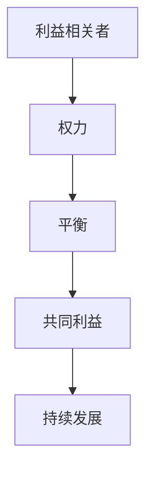

**重要性**

权力平衡在信息技术领域的重要性主要体现在以下几个方面：

1. **避免垄断与滥用**：在信息技术领域，某些企业或组织可能通过技术优势获得垄断地位，从而滥用权力，损害其他利益相关者的利益。权力平衡可以防止这种情况的发生。
2. **促进创新与进步**：权力平衡鼓励各方积极参与，共同推动技术的创新与发展。当各方权力均衡时，更可能产生创新的想法和解决方案。
3. **保障用户权益**：权力平衡可以确保用户的需求得到充分考虑，从而提供更好的产品和服务。
4. **促进合作与共赢**：权力平衡有助于建立多方合作的关系，实现共赢。

#### 1.2 权力平衡的理论框架

权力平衡的理论框架是理解和应用权力平衡的基础。以下是几个关键理论框架：

1. **博弈论**：博弈论是一种研究决策和策略的数学理论。在权力平衡中，博弈论可以帮助我们分析各方在决策过程中的互动和策略选择。
2. **利益相关者理论**：利益相关者理论强调在决策过程中要充分考虑各方利益相关者的需求和期望。
3. **系统动力学**：系统动力学是一种分析复杂系统的动态行为的理论。在权力平衡中，系统动力学可以帮助我们理解权力平衡的动态变化和长期效果。
4. **战略管理**：战略管理是一种制定和实施长期战略的理论。在权力平衡中，战略管理可以帮助我们制定权力平衡的策略和行动计划。

以下是这些理论框架的Mermaid流程图：

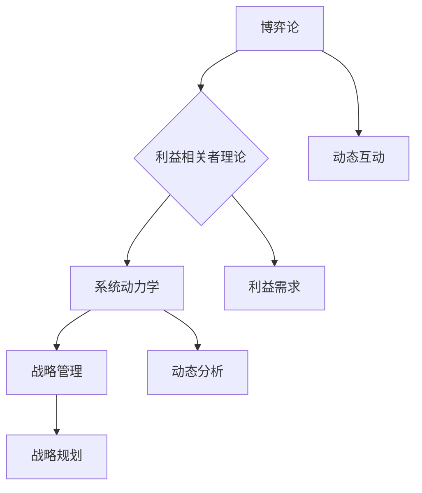

#### 1.3 权力平衡的历史演变

权力平衡的历史演变可以追溯到古代社会。在不同的历史时期，权力平衡的形式和机制有所不同。以下是权力平衡的历史演变流程图：

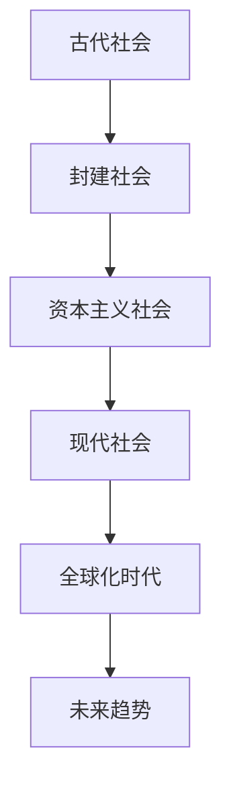

- **古代社会**：在古代社会，权力平衡主要依靠血缘关系、宗族制度等来实现。这些机制在一定程度上保证了社会的稳定。
- **封建社会**：在封建社会，权力平衡主要体现在君主与封建领主之间的权力分配。这种权力分配机制有助于维持社会的稳定和秩序。
- **资本主义社会**：在资本主义社会，权力平衡主要依靠市场机制和法治来实现。市场机制通过竞争和供需关系来调节各方权力，法治通过法律来保障各方权益。
- **现代社会**：在现代社会，权力平衡面临着新的挑战，如全球化、信息化等。这些挑战要求我们不断创新权力平衡的机制和策略。
- **全球化时代**：在全球化时代，权力平衡的机制和策略需要更加多元化和全球化。跨国公司和政府之间的权力平衡变得更加复杂。
- **未来趋势**：未来的权力平衡将更加注重技术创新、可持续发展和社会责任。这些趋势将促使我们不断调整和优化权力平衡的机制和策略。

#### 1.4 权力平衡的原则与方法

为了实现有效的权力平衡，我们需要遵循一些核心原则和方法。以下是几个重要的原则和方法：

1. **利益最大化原则**：在权力平衡中，各方利益相关者的利益都应该得到充分考虑。通过优化资源配置和利益分配，实现各方利益的最大化。
2. **权力分散原则**：权力分散可以避免权力过度集中，减少滥用权力的风险。通过建立多个权力中心，实现权力的分散和制衡。
3. **动态调整原则**：权力平衡是一个动态的过程，需要根据实际情况不断调整。通过实时监控和反馈机制，及时调整权力平衡的策略和方案。

以下是这些原则和方法的伪代码表示：

```plaintext
// 利益最大化原则
function maximizeUtilities(stakeholders) {
    // 计算各方的利益
    utilities = calculateUtilities(stakeholders)
    
    // 优化资源配置和利益分配
    optimizedAllocation = optimizeAllocation(utilities)
    
    // 实施优化方案
    implementAllocation(optimizedAllocation)
}

// 权力分散原则
function distributePower(stakeholders) {
    // 确定权力分配方案
    powerScheme = definePowerScheme(stakeholders)
    
    // 实施权力分散
    distributePowerCenters(powerScheme)
}

// 动态调整原则
function adjustPowerBalance() {
    // 监控权力平衡状态
    balanceState = monitorBalanceState()
    
    // 根据状态调整权力平衡
    adjustedScheme = adjustPowerScheme(balanceState)
    
    // 实施调整方案
    implementAdjustedScheme(adjustedScheme)
}
```

**谈判策略**

谈判策略是实现权力平衡的重要手段。以下是几种常见的谈判策略：

1. **双赢谈判**：通过寻求双方都能接受的解决方案，实现双方利益的最大化。
2. **妥协谈判**：通过各方妥协，达成一个相对公平的解决方案。
3. **权力制衡谈判**：通过建立权力制衡机制，确保各方权力的平衡。

以下是双赢谈判的伪代码表示：

```plaintext
// 双赢谈判
function negotiateWinWin(stakeholder1, stakeholder2) {
    // 确定各方利益
    interest1 = defineInterest(stakeholder1)
    interest2 = defineInterest(stakeholder2)
    
    // 寻找共同利益
    commonInterest = findCommonInterest(interest1, interest2)
    
    // 达成解决方案
    solution = defineSolution(commonInterest)
    
    // 实施解决方案
    implementSolution(solution)
}
```

**利益交换机制**

利益交换机制是实现权力平衡的另一种重要手段。以下是几种常见的利益交换机制：

1. **资源交换**：通过交换资源（如资金、技术、人力等）来实现各方权力的平衡。
2. **服务交换**：通过提供服务（如技术支持、咨询服务等）来实现各方权力的平衡。
3. **知识交换**：通过交换知识（如技术知识、管理知识等）来实现各方权力的平衡。

以下是资源交换的利益交换模型的Mermaid流程图：

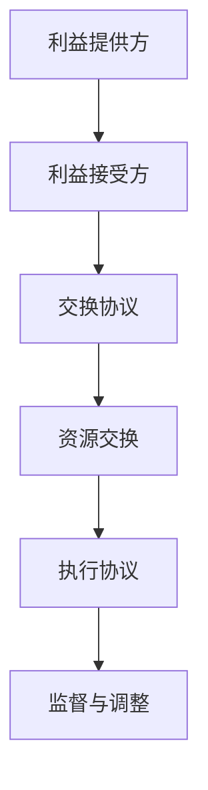

通过以上对权力平衡的基础理论的介绍，我们为理解和应用权力平衡提供了坚实的理论基础。在接下来的部分，我们将进一步探讨利益相关者的识别与评估方法，以及权力平衡的策略与实践。

#### 1.5 权力平衡的案例分析

为了更好地理解权力平衡在信息技术领域的实际应用，我们可以通过几个经典案例进行分析。

##### 案例1：苹果公司的供应链管理

苹果公司是全球最大的科技公司之一，其供应链管理堪称典范。苹果公司通过与其供应商建立稳定的合作关系，实现了权力平衡。以下是苹果公司供应链管理的几个关键点：

1. **长期合同**：苹果公司与供应商签订长期合同，确保供应链的稳定性和可预测性。
2. **信息共享**：苹果公司与供应商共享市场需求和销售数据，帮助供应商更好地规划生产和库存。
3. **质量监管**：苹果公司对供应商的产品质量进行严格监管，确保产品的一致性和可靠性。
4. **利益共享**：苹果公司与供应商共同投资于新技术和生产工艺，实现共同发展。

以下是苹果公司供应链管理的Mermaid流程图：

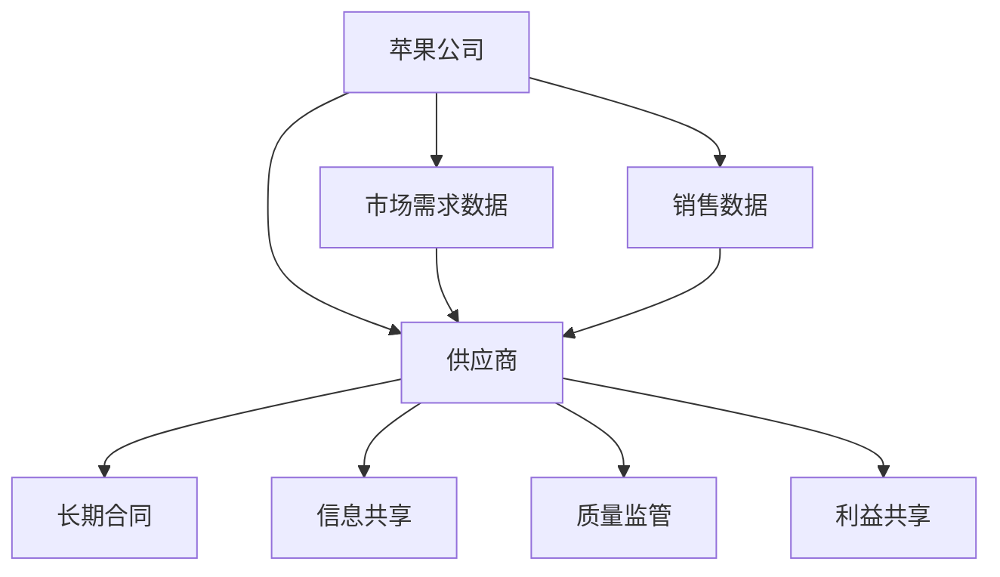

##### 案例2：谷歌公司的员工管理

谷歌公司以其独特的员工管理模式而著称。谷歌通过多种策略实现了员工权力的平衡，从而保持公司的创新活力。以下是谷歌公司的员工管理关键点：

1. **员工自主权**：谷歌赋予员工较大的自主权，鼓励他们自主探索和尝试新项目。
2. **团队合作**：谷歌强调团队合作，通过团队内部权力平衡来避免个人英雄主义。
3. **绩效评估**：谷歌采用多维度的绩效评估体系，确保绩效评估的公正性和透明性。
4. **激励机制**：谷歌通过股票期权、奖金等多种激励机制，平衡员工利益。

以下是谷歌公司员工管理的Mermaid流程图：

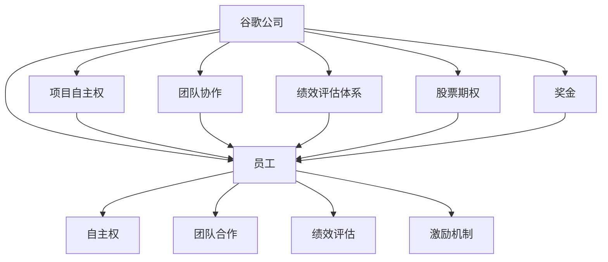

##### 案例3：亚马逊公司的客户服务

亚马逊公司以其卓越的客户服务而闻名。亚马逊通过多种策略实现了客户服务的权力平衡，从而提升了客户满意度。以下是亚马逊公司客户服务的几个关键点：

1. **客户反馈**：亚马逊重视客户反馈，通过多种渠道收集客户意见和建议。
2. **快速响应**：亚马逊建立了一套高效的客户服务系统，确保能够快速响应客户需求。
3. **个性化服务**：亚马逊利用大数据和人工智能技术，为客户提供个性化的服务和推荐。
4. **客户权益保护**：亚马逊制定了严格的客户权益保护政策，确保客户的合法权益得到保障。

以下是亚马逊公司客户服务的Mermaid流程图：

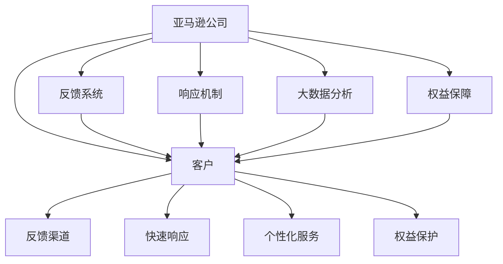

通过以上案例分析，我们可以看到权力平衡在信息技术领域的实际应用。无论是在供应链管理、员工管理还是客户服务方面，权力平衡都是实现持续发展和成功的关键。在接下来的部分，我们将进一步探讨利益相关者的识别与评估方法，以及权力平衡的策略与实践。

### 第二部分：利益相关者的识别与评估

在实现权力平衡的过程中，识别和评估利益相关者是非常重要的。利益相关者的影响力、需求和期望对于制定有效的权力平衡策略具有决定性作用。以下是利益相关者的分类、影响力评估和需求识别的方法。

#### 2.1 利益相关者的分类

利益相关者的分类是识别不同利益群体的重要步骤。以下是一些常见的利益相关者分类方法：

1. **内部利益相关者**：包括企业的员工、管理层和股东。这些利益相关者直接参与企业的运营和管理，对企业的权力平衡具有直接影响。
   
2. **外部利益相关者**：包括客户、供应商、合作伙伴、政府机构和社区。这些利益相关者虽然不直接参与企业的运营，但他们的利益和期望会影响企业的决策和行为。

3. **直接利益相关者**：这些利益相关者的利益直接受到企业的决策和运营影响。例如，客户、供应商和合作伙伴。

4. **间接利益相关者**：这些利益相关者的利益间接受到企业的决策和运营影响。例如，社区和环境。

以下是利益相关者分类的Mermaid流程图：

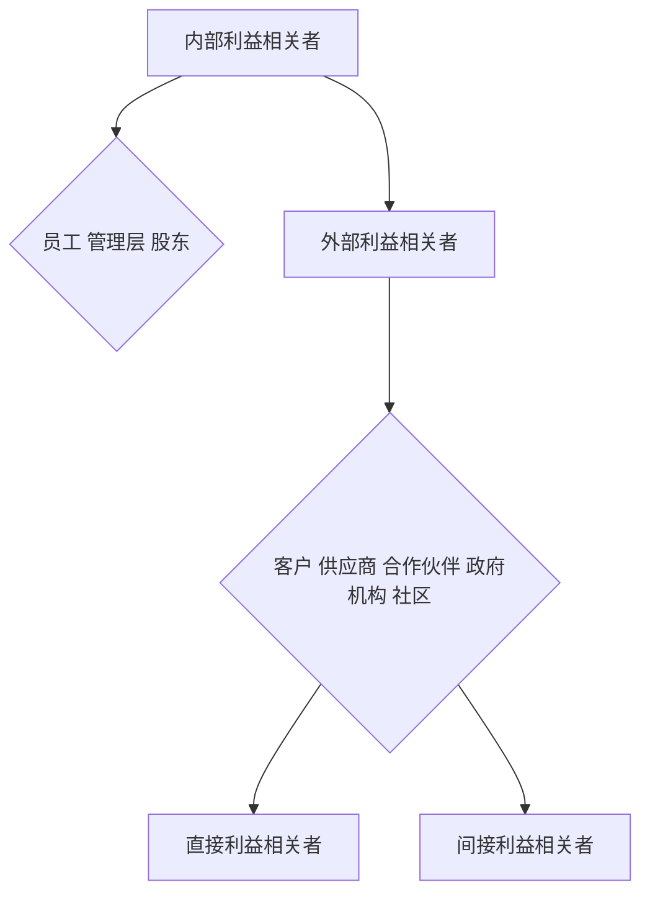

#### 2.2 利益相关者的影响力评估

评估利益相关者的影响力是制定有效权力平衡策略的关键。以下是一些常用的评估方法：

1. **影响力矩阵**：通过分析利益相关者的权力、资源和信息控制能力，评估其影响力。以下是影响力矩阵的示例：

   ```mermaid
   graph TD
       A[权力] --> B{强 高 中 弱}
       A --> C[资源]
       C --> D{多 高 中 少}
       C --> E[信息控制]
       E --> F{高 中 低}
       B --> G[多 高 中 少]
       C --> H[多 高 中 少]
       E --> I[高 中 低]
   ```

2. **利益相关者分析模型**：如利益相关者权力/利益模型（POWER）和利益相关者影响力模型（CII）。以下是POWER模型的示例：

   ```mermaid
   graph TD
       A[权力] --> B{高 中 低}
       B --> C[权势]
       B --> D[合法性]
       B --> E[依赖性]
       B --> F[投资]
       C --> G[高 中 低]
       D --> H[高 中 低]
       E --> I[高 中 低]
       F --> J[高 中 低]
   ```

#### 2.3 利益相关者需求的识别

识别利益相关者的需求是确保权力平衡策略有效性的关键。以下是一些常用的需求识别方法：

1. **问卷调查**：通过设计问卷，收集利益相关者的意见和建议，分析他们的需求。

2. **深度访谈**：与利益相关者进行一对一访谈，深入了解他们的需求和期望。

3. **SWOT分析**：通过分析利益相关者的优势（Strengths）、劣势（Weaknesses）、机会（Opportunities）和威胁（Threats），识别他们的需求。

以下是问卷调查的示例：

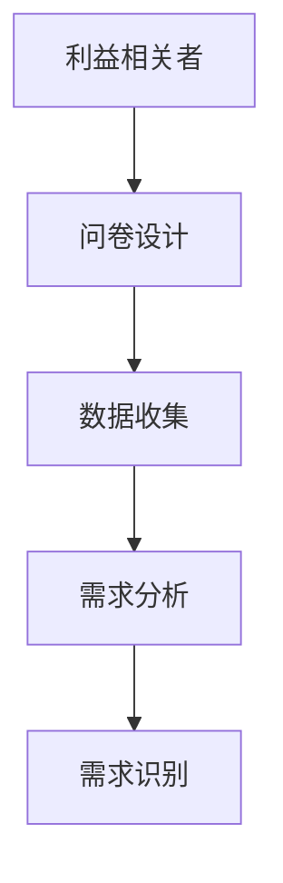

通过以上对利益相关者的识别与评估方法的介绍，我们可以更好地理解如何识别和评估不同利益相关者的需求和影响力。在接下来的部分，我们将进一步探讨权力平衡的策略与实践。

### 第三部分：权力平衡的策略与实践

在信息技术领域，实现权力平衡是一项复杂且关键的任务。有效的权力平衡策略不仅能够确保各方利益的最大化，还能促进创新和持续发展。以下是一些具体的权力平衡策略和实践方法。

#### 3.1 权力平衡的谈判策略

谈判是实现权力平衡的重要手段。以下是几种常用的谈判策略：

1. **双赢谈判**：通过寻求双方都能接受的解决方案，实现双方利益的最大化。以下是双赢谈判的步骤：

   ```mermaid
   graph TD
       A[确定谈判目标] --> B[收集信息]
       B --> C[制定谈判方案]
       C --> D[执行谈判]
       D --> E[评估谈判结果]
   ```

2. **妥协谈判**：通过各方妥协，达成一个相对公平的解决方案。以下是妥协谈判的步骤：

   ```mermaid
   graph TD
       A[确定利益冲突] --> B[分析利益差异]
       B --> C[寻求共同利益]
       C --> D[制定妥协方案]
       D --> E[执行妥协方案]
       E --> F[评估妥协效果]
   ```

3. **权力制衡谈判**：通过建立权力制衡机制，确保各方权力的平衡。以下是权力制衡谈判的步骤：

   ```mermaid
   graph TD
       A[识别权力中心] --> B[建立制衡机制]
       B --> C[制定权力分配方案]
       C --> D[执行权力分配方案]
       D --> E[监督与调整]
   ```

#### 3.2 权力平衡的利益交换机制

利益交换是实现权力平衡的重要手段。以下是几种常见的利益交换机制：

1. **资源交换**：通过交换资源（如资金、技术、人力等）来实现各方权力的平衡。以下是资源交换的步骤：

   ```mermaid
   graph TD
       A[利益提供方] --> B[利益接受方]
       B --> C[交换协议]
       C --> D[资源交换]
       D --> E[执行协议]
       E --> F[监督与调整]
   ```

2. **服务交换**：通过提供服务（如技术支持、咨询服务等）来实现各方权力的平衡。以下是服务交换的步骤：

   ```mermaid
   graph TD
       A[利益提供方] --> B[利益接受方]
       B --> C[服务协议]
       C --> D[服务交换]
       D --> E[执行协议]
       E --> F[监督与调整]
   ```

3. **知识交换**：通过交换知识（如技术知识、管理知识等）来实现各方权力的平衡。以下是知识交换的步骤：

   ```mermaid
   graph TD
       A[利益提供方] --> B[利益接受方]
       B --> C[知识协议]
       C --> D[知识交换]
       D --> E[执行协议]
       E --> F[监督与调整]
   ```

#### 3.3 权力平衡的项目实践

在信息技术项目中，实现权力平衡是确保项目成功的关键。以下是几个项目实践案例：

1. **跨国企业并购**：在跨国企业并购中，权力平衡至关重要。以下是跨国企业并购中的权力平衡策略：

   ```mermaid
   graph TD
       A[确定并购目标] --> B[评估利益相关者]
       B --> C[制定并购方案]
       C --> D[谈判与协商]
       D --> E[执行并购方案]
       E --> F[监督与调整]
   ```

2. **公司内部权力分配调整**：在公司内部，权力分配的调整是实现权力平衡的重要手段。以下是公司内部权力分配调整的策略：

   ```mermaid
   graph TD
       A[识别权力失衡] --> B[分析权力结构]
       B --> C[制定调整方案]
       C --> D[实施调整方案]
       D --> E[监督与反馈]
   ```

3. **社会企业与政府关系的权力平衡**：在社会企业与政府的关系中，实现权力平衡对于实现社会目标至关重要。以下是社会企业与政府关系的权力平衡策略：

   ```mermaid
   graph TD
       A[确定社会目标] --> B[评估政府关系]
       B --> C[制定合作方案]
       C --> D[谈判与协商]
       D --> E[实施合作方案]
       E --> F[监督与调整]
   ```

通过以上权力平衡的策略与实践，我们可以在信息技术领域实现有效的权力平衡，促进各方利益的最大化。在接下来的部分，我们将探讨权力平衡中的风险与挑战。

### 第四部分：权力平衡中的风险与挑战

在实现权力平衡的过程中，不可避免地会遇到各种风险与挑战。这些风险不仅会影响权力平衡的稳定性，还可能对项目的成功产生重大影响。以下是我们需要识别和应对的几个关键风险与挑战。

#### 4.1 权力平衡中的风险识别

识别权力平衡中的风险是制定有效应对策略的第一步。以下是几种常见的风险：

1. **信息不对称**：在利益相关者之间，可能存在信息不对称的问题，导致部分利益相关者无法做出全面和准确的决策。

2. **利益冲突**：不同利益相关者之间可能存在利益冲突，导致权力平衡策略难以实施。

3. **权力滥用**：在权力分配过程中，可能存在权力滥用的风险，导致权力失衡。

4. **法律和监管风险**：不同国家和地区可能有不同的法律和监管环境，这可能会对权力平衡策略的制定和实施产生影响。

以下是风险识别矩阵的Mermaid流程图：

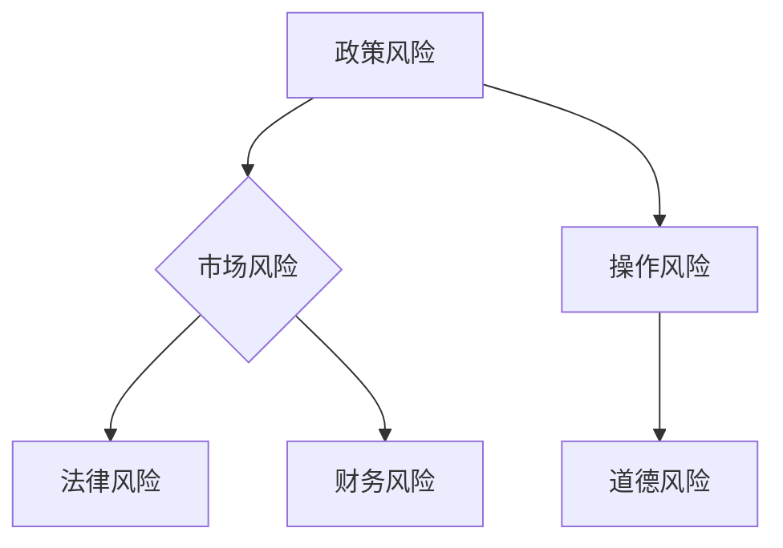

#### 4.2 权力平衡中的挑战与应对

针对上述风险，我们需要制定相应的应对策略。以下是一些常见的挑战与应对策略：

1. **挑战1：信息不对称**
   - **应对策略**：提高信息透明度，建立信息共享平台，确保各方能够及时获取所需信息。

2. **挑战2：利益冲突**
   - **应对策略**：建立利益冲突管理机制，明确利益冲突的处理流程和规则，确保各方利益得到公平对待。

3. **挑战3：权力滥用**
   - **应对策略**：加强权力监督和问责制度，建立内部审计和外部监督机制，确保权力的正当行使。

4. **挑战4：法律和监管风险**
   - **应对策略**：了解和遵守相关法律法规，与监管机构保持沟通，及时调整策略以应对监管变化。

以下是挑战与应对策略的Mermaid流程图：

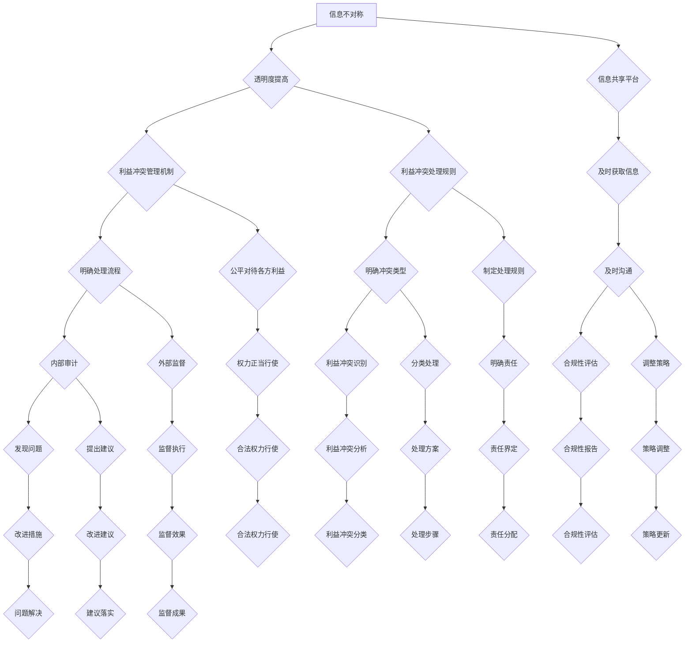

通过上述风险识别和应对策略，我们可以在权力平衡过程中有效识别和管理潜在风险，确保权力平衡的稳定性和可持续性。在接下来的部分，我们将通过案例分析进一步探讨权力平衡的具体实践。

### 第五部分：权力平衡的案例分析

通过分析权力平衡的经典案例和新兴领域的实践，我们可以更深入地理解权力平衡在信息技术领域的实际应用和效果。以下是几个具有代表性的案例。

#### 5.1 权力平衡的经典案例

**案例1：苹果公司的供应链管理**

苹果公司是全球最具影响力的科技公司之一，其供应链管理在全球范围内享有盛誉。苹果公司通过与其供应商建立长期合作关系，实现了权力平衡。以下是苹果公司供应链管理的几个关键点：

1. **长期合同**：苹果公司与供应商签订长期合同，确保供应链的稳定性和可预测性。

2. **信息共享**：苹果公司与供应商共享市场需求和销售数据，帮助供应商更好地规划生产和库存。

3. **质量监管**：苹果公司对供应商的产品质量进行严格监管，确保产品的一致性和可靠性。

4. **利益共享**：苹果公司与供应商共同投资于新技术和生产工艺，实现共同发展。

**案例分析**：

苹果公司的供应链管理通过长期合同和信息共享实现了权力平衡，使得供应商在供应链中具有更大的话语权，同时也能够保障苹果公司的产品质量和市场竞争力。这一策略的成功在于苹果公司能够与供应商建立互信关系，实现双赢。

**Mermaid流程图**：


**案例2：谷歌公司的员工管理**

谷歌公司以其独特的员工管理模式而著称，通过多种策略实现了员工权力的平衡，从而保持公司的创新活力。以下是谷歌公司员工管理的几个关键点：

1. **员工自主权**：谷歌赋予员工较大的自主权，鼓励他们自主探索和尝试新项目。

2. **团队合作**：谷歌强调团队合作，通过团队内部权力平衡来避免个人英雄主义。

3. **绩效评估**：谷歌采用多维度的绩效评估体系，确保绩效评估的公正性和透明性。

4. **激励机制**：谷歌通过股票期权、奖金等多种激励机制，平衡员工利益。

**案例分析**：

谷歌公司通过赋予员工自主权、强调团队合作和建立公平的绩效评估体系，实现了员工权力的平衡。这一策略不仅提升了员工的工作积极性，还保持了公司的创新活力。谷歌的成功在于其能够充分尊重员工的权益，激发员工的创造力和潜力。

**Mermaid流程图**：


#### 5.2 权力平衡的新兴领域实践

**案例1：区块链技术下的权力平衡**

区块链技术作为一种新兴技术，在金融、供应链管理等领域得到了广泛应用。区块链技术通过去中心化的方式实现了权力平衡。以下是区块链技术下的权力平衡特点：

1. **去中心化**：区块链技术通过去中心化的方式，减少了传统中心化系统中可能存在的权力滥用问题。

2. **透明性**：区块链上的数据是公开透明的，任何利益相关者都可以查看和验证数据。

3. **不可篡改性**：区块链上的数据一旦记录，就难以篡改，确保了数据的真实性和完整性。

**案例分析**：

区块链技术通过去中心化、透明性和不可篡改性，实现了权力平衡。这一特点使得区块链在金融、供应链管理等领域具有巨大的应用潜力。例如，在供应链管理中，区块链技术可以确保供应链的透明性和可追溯性，从而实现各方利益的平衡。

**Mermaid流程图**：

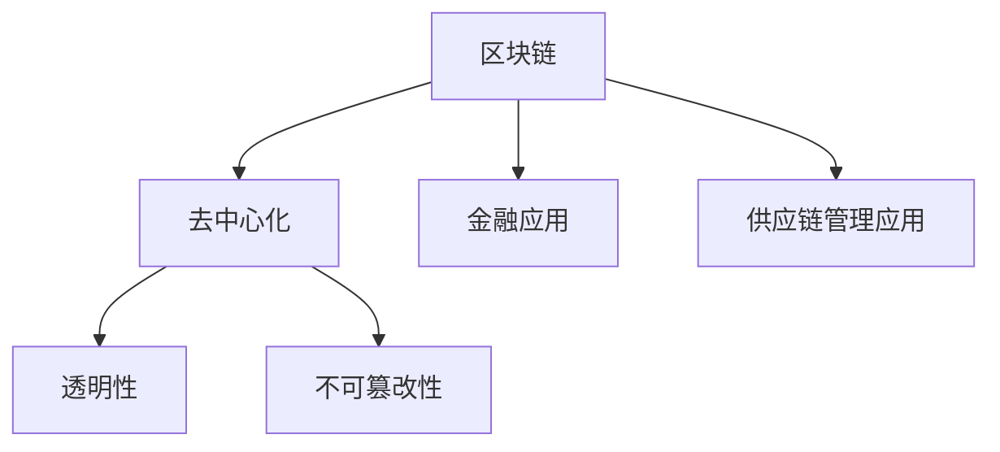

**案例2：人工智能与权力平衡**

人工智能技术的发展对各个行业产生了深远影响。在人工智能领域，实现权力平衡对于确保技术的公平性和道德性具有重要意义。以下是人工智能与权力平衡的几个关键点：

1. **算法透明性**：人工智能算法的透明性对于实现权力平衡至关重要。确保算法的透明性，可以减少算法偏见和滥用。

2. **数据隐私**：在人工智能应用中，数据隐私保护是确保权力平衡的关键。确保数据的隐私性和安全性，可以避免数据滥用和侵犯用户权益。

3. **伦理监管**：建立人工智能伦理监管机制，确保人工智能技术的应用符合伦理和道德标准。

**案例分析**：

人工智能技术通过算法透明性、数据隐私保护和伦理监管，实现了权力平衡。这一策略不仅确保了技术的公平性和道德性，还增强了公众对人工智能技术的信任。

**Mermaid流程图**：

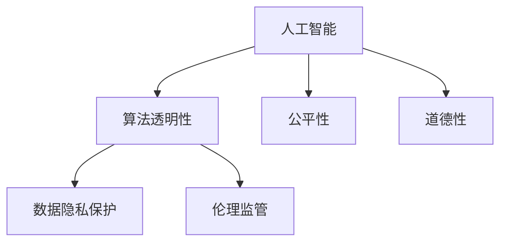

通过以上案例分析，我们可以看到权力平衡在信息技术领域的实际应用和效果。无论是在经典领域还是新兴领域，实现权力平衡都是确保技术发展和社会进步的关键。在接下来的部分，我们将探讨权力平衡的未来趋势。

### 第六部分：权力平衡的未来趋势

随着技术的发展和社会的变革，权力平衡也面临着新的挑战和机遇。以下是我们对未来权力平衡趋势的探讨。

#### 6.1 权力平衡的未来挑战

1. **全球政治经济格局的变化**：全球政治经济格局的不断变化，如地缘政治紧张、经济制裁、全球化逆流等，将对权力平衡产生重大影响。

2. **新兴技术的崛起**：人工智能、区块链、虚拟现实等新兴技术的崛起，将带来新的权力格局，挑战传统的权力平衡。

3. **环境与资源的压力**：环境恶化、资源短缺等问题，将加剧利益相关者之间的权力斗争，影响权力平衡。

#### 6.2 权力平衡的未来策略

1. **多元化利益相关者参与**：未来的权力平衡将更加注重多元化利益相关者的参与，包括非政府组织、非营利组织、公众等，确保各方利益得到充分体现。

2. **建立全球性权力平衡框架**：随着全球化的发展，建立全球性的权力平衡框架将成为必然趋势。这一框架应涵盖国际法律、规则和规范，确保全球范围内的权力平衡。

3. **利用大数据与人工智能提高决策效率**：大数据和人工智能技术的发展，将为权力平衡提供强大的工具。通过数据分析，可以更准确地识别利益相关者的需求和影响力，从而制定更有效的权力平衡策略。

#### 6.3 权力平衡的可持续发展

1. **社会责任投资（SRI）**：社会责任投资强调将社会责任纳入投资决策，通过投资于具有社会责任感的企业，推动权力平衡和可持续发展。

2. **企业社会责任（CSR）**：企业社会责任是指企业在经营过程中考虑社会和环境的影响，通过履行社会责任，实现权力平衡和可持续发展。

3. **环境、社会和治理（ESG）投资**：环境、社会和治理投资关注企业在环境、社会和治理方面的表现，通过投资于具有良好ESG表现的企业，推动权力平衡和可持续发展。

### 结论

通过本文的探讨，我们系统地介绍了权力平衡的概念、重要性、理论框架、实践方法以及未来趋势。在信息技术领域，实现权力平衡是确保各方利益最大化、促进创新和持续发展的关键。随着全球化和新兴技术的发展，权力平衡将面临新的挑战和机遇。我们需要不断探索和创新，建立多元化的利益相关者参与机制，利用大数据和人工智能提高决策效率，推动权力平衡的可持续发展。

### 附录

#### 附录 A：权力平衡研究工具与资源

1. **利益相关者分析软件**：如 stakeholdermapper、stakeholdermatrix 等，这些软件可以帮助我们更系统地识别和评估利益相关者。

2. **权力平衡模型库**：如 powerbalance-models.org，提供了各种权力平衡模型和工具，方便我们进行研究和应用。

3. **国际权威报告**：如联合国《全球契约》报告、世界经济论坛《全球风险报告》等，这些报告提供了全球范围内的权力平衡分析和趋势预测。

4. **学术期刊论文**：如《管理学报》、《系统工程理论与实践》等，这些期刊发表了大量关于权力平衡的研究论文，为我们提供了丰富的理论资源。

#### 附录 B：权力平衡案例研究指南

1. **案例选择标准**：选择具有代表性的案例，涵盖不同行业和领域，确保案例的多样性和全面性。

2. **案例研究方法**：采用文献分析、访谈、问卷调查等方法，全面收集和分析案例数据，确保案例研究的科学性和可靠性。

3. **案例报告撰写技巧**：遵循结构化、逻辑清晰的原则，结合图表和数据分析，使案例报告更具说服力和可读性。

### 作者信息

作者：AI天才研究院/AI Genius Institute & 禅与计算机程序设计艺术 /Zen And The Art of Computer Programming

通过本文，我们希望读者能够对权力平衡在信息技术领域的应用有更深入的理解，并在实际工作中运用这些理论和方法，实现更加有效的权力平衡。

