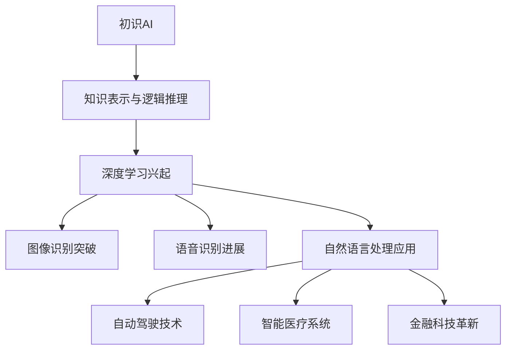
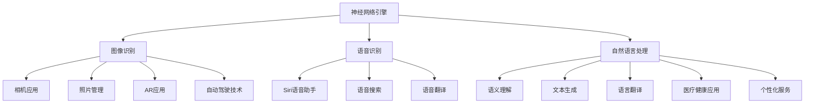
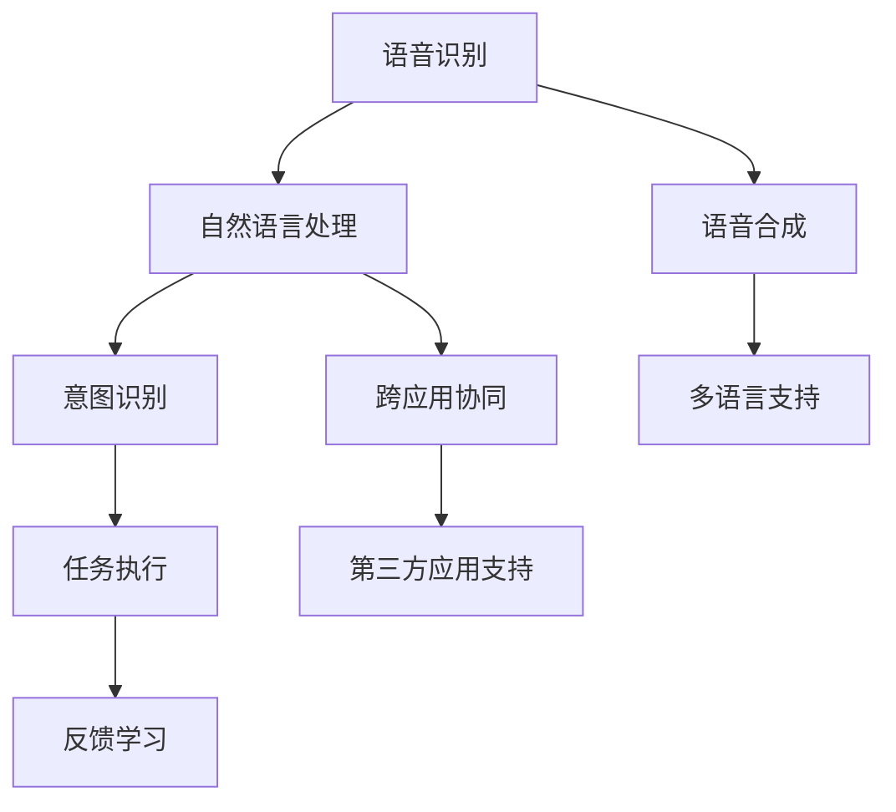
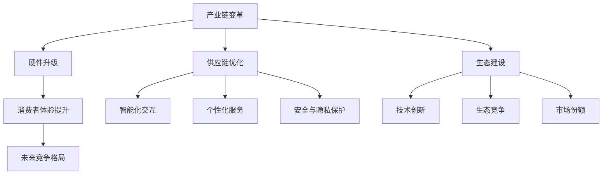

                 

### 第一部分：引言

#### 1.1 书籍背景与目的

《李开复：苹果发布AI应用的产业》是一本深入探讨苹果公司在人工智能（AI）领域最新进展及其产业影响的著作。作者李开复博士，作为世界著名的人工智能专家、微软亚洲研究院创始人之一，对AI领域的理解具有深厚的学术和实践基础。本书旨在通过系统的分析和案例研究，揭示苹果公司AI战略的内在逻辑、核心技术和应用场景，以及这些创新如何推动整个产业链的变革。

#### 1.1.1 李开复与人工智能的关系

李开复博士是人工智能领域的重要人物，他不仅在学术界有着深远影响，也在工业界有着卓越成就。他参与了包括Siri在内的多个AI项目的开发，并对人工智能的未来发展有着独特的见解。李开复博士的跨领域视野和深厚的技术背景，使得本书的论述既具有学术性，又具有实践性，为读者提供了一个全面理解AI应用产业的新视角。

#### 1.1.2 苹果发布AI应用的产业意义

苹果公司作为全球科技产业的领军企业，其每一次技术发布都备受瞩目。随着人工智能技术的不断发展，苹果在AI领域的布局和战略显得尤为重要。苹果的AI应用不仅为消费者提供了更加便捷和智能的服务，也推动了整个产业链的升级和转型。本书将详细探讨苹果AI应用的产业意义，包括其对消费者体验的提升、产业链的变革，以及对未来竞争格局的影响。

#### 1.1.3 阅读本书的读者对象

本书适合对人工智能和科技产业感兴趣的读者，包括：

- 人工智能专业的研究生和本科生
- 科技产业从业者，特别是关注苹果公司动态的专业人士
- 对科技创新和未来趋势感兴趣的普通读者
- 对AI应用开发感兴趣的编程爱好者

通过阅读本书，读者可以了解到：

- AI技术的发展历程及其在各行业的应用
- 苹果公司AI战略的内在逻辑和核心技术
- 苹果AI应用的典型案例及其产业影响
- AI应用的未来发展趋势和挑战

#### 1.2 AI应用的发展历程

人工智能的发展经历了从初识AI到深度学习，再到AI应用在各行业的爆发。这一过程不仅是技术进步的体现，更是产业变革的驱动力。

##### 1.2.1 从初识AI到深度学习

人工智能的起源可以追溯到20世纪50年代，当时的科学家们试图通过模拟人类思维过程来创建智能机器。然而，早期的AI系统主要基于“知识表示”和“逻辑推理”，效果并不理想。随着计算能力和数据资源的提升，深度学习技术应运而生，这一基于神经网络的算法创新使得AI取得了重大突破。

##### 1.2.2 AI应用在各行业的爆发

深度学习技术的突破带动了AI在各行业的广泛应用。在图像识别、语音识别、自然语言处理等领域，AI已经从理论研究走向了实际应用。自动驾驶、智能医疗、金融科技等领域的AI应用不仅提高了效率，也带来了全新的商业模式和用户体验。

##### 1.2.3 AI时代的商业机遇与挑战

AI时代的到来带来了前所未有的商业机遇，同时也伴随着诸多挑战。企业需要应对数据隐私和安全、算法偏见、技术人才短缺等问题。本书将深入探讨这些挑战，并分析苹果公司如何在AI时代中抓住机遇，实现持续创新。

---

**核心概念与联系：**

在探讨AI应用的发展历程时，我们可以使用Mermaid流程图来展示AI技术的发展路线和关键节点。



---

通过以上的引言部分，我们为读者介绍了书籍的背景、目的，以及AI应用的发展历程。接下来，我们将进一步探讨苹果公司AI战略的起源与发展，为后续内容奠定基础。

### 第二部分：苹果AI应用概述

#### 2.1 苹果AI战略

苹果公司在人工智能领域的布局具有前瞻性和系统性。从初期的智能语音助手Siri，到如今的图像识别、自然语言处理和虚拟角色，苹果在AI领域不断推进技术创新和应用。

##### 2.1.1 苹果AI的起源与发展

苹果公司的AI之旅始于2011年，当时苹果收购了Siri公司，将其智能语音助手集成到iOS系统中。Siri的推出标志着苹果在AI领域的重要一步，随后苹果继续收购了一系列AI初创公司，不断充实其AI技术储备。随着深度学习技术的发展，苹果逐步将AI技术应用于图像识别、语音识别和自然语言处理等领域。

##### 2.1.2 苹果AI的核心技术

苹果AI的核心技术主要包括以下几个方面：

1. **神经网络引擎**：苹果自主研发的神经网络引擎（Neural Engine）是苹果设备中用于AI计算的重要组件。它支持卷积神经网络（CNN）和循环神经网络（RNN）等算法，为苹果设备提供强大的AI计算能力。

2. **图像识别**：苹果通过深度学习技术实现了高度准确的图像识别能力。其图像识别系统可以从数百万张图像中快速识别并分类，应用于相机应用、照片管理和增强现实（AR）等领域。

3. **语音识别**：苹果的语音识别技术基于端到端深度学习模型，具有低延迟、高准确率的特点。Siri语音助手是这一技术的代表，广泛应用于语音控制、语音搜索和语音翻译等领域。

4. **自然语言处理**：苹果的自然语言处理技术支持语义理解、文本生成和语言翻译等功能。通过这些技术，苹果设备可以更好地理解用户的语言输入，提供个性化的服务。

##### 2.1.3 苹果AI应用的发展方向

展望未来，苹果公司在AI应用的发展方向上具有明确的战略规划：

1. **增强现实（AR）**：苹果正积极布局AR技术，通过改进图像识别和实时渲染技术，为用户提供沉浸式的AR体验。Apple Glass等AR设备的推出预计将进一步提升苹果在AR领域的竞争力。

2. **自动驾驶技术**：苹果在自动驾驶领域的投资和研发不断推进。其自动驾驶系统结合了图像识别、传感器融合和机器学习技术，旨在实现安全、高效的自动驾驶。

3. **医疗健康应用**：苹果通过AI技术不断探索医疗健康领域的应用。其健康应用已经支持心血管疾病监测、呼吸健康分析等功能，未来还将进一步拓展AI在医疗诊断和治疗支持方面的应用。

4. **个性化服务**：苹果通过AI技术不断优化其产品和服务，提供更加个性化的用户体验。例如，基于用户行为数据，苹果可以推荐个性化的音乐、新闻和应用程序。

---

**核心概念与联系：**

为了更好地理解苹果AI战略的核心技术和发展方向，我们可以绘制一个Mermaid流程图，展示苹果AI技术的主要组成部分及其应用领域。



---

通过以上内容，我们了解了苹果公司在AI领域的起源和发展，以及其核心技术和应用方向。接下来，我们将深入分析苹果AI应用的典型案例，探讨这些应用如何改变我们的生活和工作方式。

#### 2.2 苹果AI应用的案例研究

##### 2.2.1 Siri：智能语音助手的进化

Siri作为苹果公司的智能语音助手，是苹果AI战略的标志性产品之一。自2011年发布以来，Siri经历了多次迭代和功能扩展，逐渐从简单的语音指令执行工具转变为具有高度智能化和个性化的AI助手。

1. **初始版本**：早期的Siri功能相对简单，主要提供基本的语音查询和命令执行，如天气查询、日程安排、电话拨号等。然而，由于技术限制，Siri的准确率和反应速度都有待提升。

2. **深度学习技术引入**：随着深度学习技术的发展，Siri开始引入更多的自然语言处理和机器学习算法。通过不断学习和优化，Siri的语音识别准确率显著提高，同时能够理解更加复杂的指令和语境。例如，用户可以与Siri进行更加自然的对话，甚至可以进行闲聊。

3. **语音合成改进**：苹果通过改进语音合成技术，使得Siri的声音更加自然流畅。此外，Siri还支持多种语言，使得全球用户都能享受到高质量的语音服务。

4. **跨应用协同**：Siri不仅仅是一个独立的语音助手，它还可以与其他苹果应用和服务无缝集成。例如，用户可以通过Siri控制音乐播放、发送短信、预订餐厅、安排旅行等。这种跨应用协同能力大大提升了用户的便利性。

5. **第三方应用支持**：苹果开放了Siri的API，允许第三方开发者将自己的应用程序与Siri集成。这使得Siri的功能更加丰富，用户可以通过Siri访问各种第三方服务，如打车、订餐等。

**案例解读**：

Siri的成功不仅在于其技术上的创新，还在于其用户体验的不断优化。以下是Siri应用的一些具体案例：

- **智能家居控制**：用户可以通过Siri控制智能灯光、温度调节和安防系统，实现智能家居的便捷管理。
- **健康辅助**：Siri可以帮助用户记录健康数据，如心率、步数和睡眠质量，并提供健康建议。
- **旅行规划**：用户可以通过Siri查询交通状况、预订机票酒店，甚至规划整个旅行行程。

Siri的进化不仅改变了用户与设备交互的方式，也开启了智能语音助手的新时代。通过不断学习和优化，Siri已经成为苹果用户日常生活中不可或缺的一部分。

---

**核心概念与联系：**

为了更好地理解Siri的工作原理和进化过程，我们可以使用Mermaid流程图来展示其核心技术架构。



---

**数学模型与公式详解**：

Siri的智能语音助手功能依赖于自然语言处理技术，以下是相关的数学模型和公式详解：

1. **卷积神经网络（CNN）在语音识别中的应用**：

   卷积神经网络（CNN）是一种在图像识别和语音识别中广泛使用的深度学习模型。其基本结构包括卷积层、池化层和全连接层。

   - **卷积层**：卷积层通过滤波器（kernel）在输入数据上滑动，计算局部特征。每个滤波器提取不同的特征，如音素或音节。
   - **池化层**：池化层对卷积层的输出进行下采样，减少数据维度，提高模型的泛化能力。
   - **全连接层**：全连接层将池化层的输出映射到最终的输出类别。

   伪代码如下：

   ```python
   # 卷积神经网络（CNN）伪代码
   def convolution(input_data, filters):
       # 对输入数据应用卷积运算
       return convolve(input_data, filters)

   def pooling(conv_output):
       # 对卷积层的输出进行下采样
       return pool(conv_output)

   def fully_connected(pool_output):
       # 将池化层的输出映射到最终类别
       return softmax(pool_output)
   ```

2. **递归神经网络（RNN）在语音识别中的应用**：

   递归神经网络（RNN）在处理序列数据时具有优势，如语音识别中的连续语音信号。

   - **输入层**：输入层接收语音信号，将其转化为序列形式。
   - **隐藏层**：隐藏层通过递归连接，将前一个时间步的输出作为当前时间步的输入。
   - **输出层**：输出层输出语音信号的识别结果。

   伪代码如下：

   ```python
   # 递归神经网络（RNN）伪代码
   def rnn(input_sequence, weights, biases):
       # 对输入序列应用递归网络
       hidden_state = initialize_hidden_state()
       for t in range(sequence_length):
           input_t = input_sequence[t]
           hidden_state_t = activation(fully_connected(input_t, weights, biases))
           hidden_state = [hidden_state_t, hidden_state]
       return hidden_state
   ```

---

通过以上的案例研究和核心算法讲解，我们深入了解了Siri智能语音助手的进化过程及其核心技术。接下来，我们将继续探讨苹果在图像识别领域的创新和应用。

##### 2.2.2 图像识别：从像素到场景的理解

苹果公司在图像识别技术上的突破使其设备能够在各种复杂场景下提供准确、高效的图像处理能力。图像识别技术不仅广泛应用于相机应用和照片管理，还为增强现实（AR）和自动驾驶等领域提供了关键支持。

1. **像素级的图像识别**：早期的图像识别技术主要基于传统的计算机视觉算法，如特征提取和模板匹配。这些算法能够识别特定的图像或模式，但难以处理复杂的图像场景。随着深度学习技术的发展，苹果引入了卷积神经网络（CNN）来实现像素级的图像识别。CNN通过多层卷积和池化操作，从原始图像中提取特征，并实现高精度的图像分类。

2. **场景理解**：苹果的图像识别技术不仅停留在像素级，还扩展到场景理解。通过结合深度学习和计算机视觉算法，苹果设备能够识别图像中的物体、场景和上下文关系。例如，在相机应用中，用户可以拍摄一张照片，然后系统会自动识别照片中的物体并进行分类，如动物、植物或城市景观。

3. **图像分割**：图像分割是将图像划分为不同的区域或物体。苹果通过深度学习算法实现了高效的图像分割技术，使得设备能够更好地理解图像的细节。在照片管理应用中，图像分割技术可以帮助用户快速识别并组织照片。

**核心算法原理讲解**：

为了更好地理解图像识别技术的工作原理，我们以下将通过伪代码详细阐述卷积神经网络（CNN）在图像识别中的应用。

1. **卷积神经网络（CNN）的基本结构**：

   CNN的基本结构包括卷积层、池化层和全连接层。

   - **卷积层**：卷积层通过滤波器（kernel）在输入图像上滑动，计算局部特征。每个滤波器提取不同的特征，如边缘、纹理或形状。
   
   ```python
   def convolution(input_image, filters):
       # 对输入图像应用卷积运算
       return convolve(input_image, filters)
   ```

   - **池化层**：池化层对卷积层的输出进行下采样，减少数据维度，提高模型的泛化能力。
   
   ```python
   def pooling(conv_output):
       # 对卷积层的输出进行下采样
       return pool(conv_output)
   ```

   - **全连接层**：全连接层将池化层的输出映射到最终的输出类别。

   ```python
   def fully_connected(pool_output):
       # 将池化层的输出映射到最终类别
       return softmax(pool_output)
   ```

2. **卷积神经网络（CNN）的工作原理**：

   CNN通过多层卷积和池化操作，从原始图像中提取特征，并实现高精度的图像分类。

   ```python
   def CNN(input_image):
       # 第1层卷积
       conv1 = convolution(input_image, filters1)
       pool1 = pooling(conv1)

       # 第2层卷积
       conv2 = convolution(pool1, filters2)
       pool2 = pooling(conv2)

       # 第3层卷积
       conv3 = convolution(pool2, filters3)
       pool3 = pooling(conv3)

       # 全连接层
       output = fully_connected(pool3)
       return output
   ```

**数学模型与公式详解**：

1. **前向传播**：

   在CNN的前向传播过程中，通过卷积运算和激活函数将输入图像映射到特征空间。

   ```latex
   \begin{aligned}
   \text{激活函数} & : f(x) = \sigma(x) \\
   \text{卷积运算} & : (I \star K)_{ij} = \sum_{m=1}^{M}\sum_{n=1}^{N} I_{im+n}K_{mn}
   \end{aligned}
   ```

2. **反向传播**：

   在CNN的反向传播过程中，通过计算梯度更新模型参数，实现模型的优化。

   ```latex
   \begin{aligned}
   \text{梯度计算} & : \frac{\partial L}{\partial W} = \text{ReLU}(\frac{\partial L}{\partial Z})Z \\
   \text{权重更新} & : W_{new} = W_{old} - \alpha \frac{\partial L}{\partial W}
   \end{aligned}
   ```

---

通过以上的详细讲解，我们深入了解了苹果在图像识别领域的创新技术及其应用。接下来，我们将探讨苹果在虚拟角色领域的创新，特别是Animoji和Memoji的应用。

##### 2.2.3 Animoji与Memoji：虚拟角色的创新

Animoji和Memoji是苹果在虚拟角色领域的重要创新，它们通过人工智能技术实现了动态的、个性化的虚拟形象，为用户提供了一种全新的互动体验。

1. **Animoji的诞生**：

   Animoji是苹果在2017年推出的一个创新功能，允许用户创建具有个性化表情的虚拟角色。每个Animoji代表一个动物形象，如猫、狗、猴子等。Animoji的核心技术是面部识别和机器学习。

   - **面部识别**：Animoji通过摄像头实时捕捉用户的面部表情，并精确识别面部特征，如眼睛、鼻子、嘴巴等。
   - **机器学习**：通过机器学习算法，Animoji能够实时模拟用户的面部表情，将用户的表情映射到对应的动物角色上。

2. **Memoji的推出**：

   Memoji是苹果在2019年推出的升级版本，用户可以自定义虚拟形象，包括面部特征、发型、服装等。Memoji相比Animoji更加个性化，用户可以根据自己的喜好和风格，创建独一无二的虚拟角色。

   - **个性化定制**：Memoji提供了丰富的自定义选项，用户可以调整眼睛颜色、发型样式、服装风格等，实现高度个性化的虚拟形象。
   - **互动体验**：Memoji不仅能够模拟用户的表情，还可以与用户进行实时互动，如发送表情包、参与游戏等。

**核心技术原理讲解**：

Animoji和Memoji的核心技术包括面部识别、机器学习和图像合成。

1. **面部识别**：

   面部识别技术通过深度学习模型，实时捕捉用户的面部表情并识别关键特征点。以下是一个简化的面部识别流程：

   ```mermaid
   graph TD
   A[摄像头捕捉面部图像] --> B[预处理]
   B --> C[特征点检测]
   C --> D[特征点匹配]
   D --> E[面部表情识别]
   ```

2. **机器学习**：

   机器学习算法用于训练模型，使其能够准确识别用户的面部表情。以下是一个简化的机器学习流程：

   ```mermaid
   graph TD
   A[数据集准备] --> B[模型训练]
   B --> C[模型评估]
   C --> D[模型部署]
   ```

3. **图像合成**：

   图像合成技术将识别到的面部表情映射到虚拟角色上，生成Animoji或Memoji形象。以下是一个简化的图像合成流程：

   ```mermaid
   graph TD
   A[面部表情特征] --> B[角色模型]
   B --> C[图像合成]
   C --> D[合成结果]
   ```

**数学模型与公式详解**：

1. **面部特征点检测**：

   面部特征点检测通常使用深度学习模型，如卷积神经网络（CNN）。以下是一个简化的数学模型：

   ```latex
   \begin{aligned}
   \text{卷积运算} & : (I \star K)_{ij} = \sum_{m=1}^{M}\sum_{n=1}^{N} I_{im+n}K_{mn} \\
   \text{激活函数} & : f(x) = \sigma(x)
   \end{aligned}
   ```

2. **图像合成**：

   图像合成使用纹理映射技术，将面部特征映射到虚拟角色上。以下是一个简化的数学模型：

   ```latex
   \begin{aligned}
   \text{纹理映射} & : T(u, v) = \text{sample}(V, (u, v)) \\
   \text{合成结果} & : I' = T(U, V)
   \end{aligned}
   ```

---

通过以上的讲解，我们深入了解了Animoji和Memoji的技术原理和应用场景。这些创新不仅丰富了苹果产品的功能，也为用户提供了更加个性化和互动的体验。接下来，我们将探讨苹果AI应用在产业上的影响。

##### 2.3 苹果AI应用的产业影响

苹果公司在AI领域的创新不仅改变了消费者的使用体验，也对整个产业链产生了深远的影响。以下是苹果AI应用在产业链变革、消费者体验提升和未来竞争格局方面的具体影响。

1. **产业链的变革**：

   苹果的AI应用推动了产业链的升级和转型，从硬件到软件，各个环节都受益匪浅。

   - **硬件升级**：为了支持AI计算，苹果不断推出具有更高性能的芯片，如Neural Engine和A系列芯片。这些芯片为AI应用提供了强大的计算能力，推动了硬件的迭代升级。
   - **供应链优化**：苹果与供应商紧密合作，共同开发适用于AI应用的硬件和软件解决方案。例如，苹果与英伟达、英特尔等公司合作，为自动驾驶技术和图像识别提供高性能硬件支持。
   - **生态建设**：苹果通过开放API和SDK，鼓励第三方开发者加入AI生态。这种合作模式不仅丰富了AI应用场景，也推动了产业链的多元化发展。

2. **消费者体验的提升**：

   苹果AI应用在消费者体验方面带来了显著提升，使得设备更加智能化和个性化。

   - **智能化交互**：Siri和Animoji等AI功能为用户提供了更加自然和便捷的交互方式。用户可以通过语音、面部表情等与设备进行智能互动，提高了人机交互的效率。
   - **个性化服务**：苹果通过AI技术不断优化其产品和服务，提供个性化的用户体验。例如，通过学习用户的偏好和习惯，苹果可以推荐个性化的音乐、新闻和应用，提高用户满意度。
   - **安全与隐私保护**：苹果重视用户隐私和安全，通过AI技术实现数据加密和智能监控。例如，Face ID和Touch ID等技术确保了用户的设备安全，同时保护了用户隐私。

3. **未来竞争格局**：

   苹果在AI领域的布局为未来竞争格局带来了新的变数，不仅巩固了其市场领导地位，也激发了其他科技巨头的竞争。

   - **技术创新**：苹果通过不断投入研发，保持其在AI领域的领先地位。与其他科技巨头相比，苹果在AI技术上的创新能力和应用能力具有明显优势。
   - **生态竞争**：苹果的AI生态系统吸引了大量第三方开发者，形成了强大的生态圈。这种生态优势使得苹果在竞争中处于有利地位，也为其未来的发展提供了坚实的基础。
   - **市场份额**：苹果在智能手机、平板电脑和电脑等领域的市场份额不断扩大，其在AI领域的创新应用也为这些产品带来了新的增长点。随着AI技术的不断普及，苹果的市场份额有望进一步提升。

**核心概念与联系：**

为了更好地理解苹果AI应用对产业的影响，我们可以使用Mermaid流程图展示产业链的变革、消费者体验的提升和未来竞争格局的关系。



---

通过以上的分析，我们深入了解了苹果AI应用在产业上的影响。接下来，我们将对苹果AI应用的核心算法原理进行深度分析，进一步探讨其技术深度和产业价值。

#### 3.1 核心算法原理讲解

苹果公司的AI应用在图像识别、语音识别和虚拟角色等领域取得了显著成果，这些成果背后离不开一系列核心算法的支持。在本节中，我们将详细讲解卷积神经网络（CNN）在图像识别中的应用、递归神经网络（RNN）在语音识别中的应用以及强化学习在游戏中的应用。

##### 3.1.1 卷积神经网络（CNN）在图像识别中的应用

卷积神经网络（CNN）是一种专门用于图像识别和处理的深度学习模型，其结构特点在于通过卷积操作和池化操作从原始图像中提取特征，并实现高精度的图像分类。

1. **卷积层**：

   卷积层是CNN的核心组成部分，通过滤波器（也称为卷积核）在图像上滑动，提取局部特征。每个滤波器对应一个特征图，多个滤波器组合起来形成一个特征图集合。

   ```mermaid
   graph TD
   A[输入图像] --> B[滤波器滑动]
   B --> C[卷积操作]
   C --> D[特征图]
   ```

   伪代码：

   ```python
   def convolution(input_image, filters):
       # 对输入图像应用卷积运算
       return convolve(input_image, filters)
   ```

2. **池化层**：

   池化层对卷积层的输出进行下采样，减少数据维度，提高模型的泛化能力。常见的池化操作包括最大池化和平均池化。

   ```mermaid
   graph TD
   A[卷积层输出] --> B[池化操作]
   B --> C[特征图下采样]
   ```

   伪代码：

   ```python
   def pooling(conv_output):
       # 对卷积层的输出进行下采样
       return pool(conv_output)
   ```

3. **全连接层**：

   全连接层将池化层的输出映射到最终的输出类别。通过全连接层，模型将提取到的特征进行分类。

   ```mermaid
   graph TD
   A[池化层输出] --> B[全连接层]
   B --> C[分类结果]
   ```

   伪代码：

   ```python
   def fully_connected(pool_output):
       # 将池化层的输出映射到最终类别
       return softmax(pool_output)
   ```

4. **卷积神经网络（CNN）的工作原理**：

   CNN通过多层卷积和池化操作，从原始图像中提取特征，并实现高精度的图像分类。以下是一个简化的CNN工作流程：

   ```python
   def CNN(input_image):
       # 第1层卷积
       conv1 = convolution(input_image, filters1)
       pool1 = pooling(conv1)

       # 第2层卷积
       conv2 = convolution(pool1, filters2)
       pool2 = pooling(conv2)

       # 第3层卷积
       conv3 = convolution(pool2, filters3)
       pool3 = pooling(conv3)

       # 全连接层
       output = fully_connected(pool3)
       return output
   ```

**数学模型与公式详解**：

1. **卷积运算**：

   卷积运算通过滤波器在图像上滑动，计算局部特征。以下是一个简化的卷积运算公式：

   ```latex
   \begin{aligned}
   \text{卷积运算} & : (I \star K)_{ij} = \sum_{m=1}^{M}\sum_{n=1}^{N} I_{ij+m+n}K_{mn}
   \end{aligned}
   ```

2. **激活函数**：

   激活函数用于引入非线性，常见的激活函数包括ReLU、Sigmoid和Tanh。以下是一个简化的激活函数公式：

   ```latex
   \begin{aligned}
   \text{ReLU} & : f(x) = \max(0, x) \\
   \text{Sigmoid} & : f(x) = \frac{1}{1 + e^{-x}} \\
   \text{Tanh} & : f(x) = \frac{e^x - e^{-x}}{e^x + e^{-x}}
   \end{aligned}
   ```

3. **前向传播**：

   在CNN的前向传播过程中，通过卷积运算和激活函数将输入图像映射到特征空间。以下是一个简化的前向传播公式：

   ```latex
   \begin{aligned}
   \text{卷积层} & : \text{Z}^{(l)} = \text{A}^{(l-1)} \star \text{W}^{(l)} + \text{b}^{(l)} \\
   \text{激活函数} & : \text{A}^{(l)} = \text{ReLU}(\text{Z}^{(l)})
   \end{aligned}
   ```

4. **反向传播**：

   在CNN的反向传播过程中，通过计算梯度更新模型参数，实现模型的优化。以下是一个简化的反向传播公式：

   ```latex
   \begin{aligned}
   \text{梯度计算} & : \frac{\partial L}{\partial W} = \text{ReLU}(\frac{\partial L}{\partial Z})Z \\
   \text{权重更新} & : \text{W}_{new} = \text{W}_{old} - \alpha \frac{\partial L}{\partial W}
   \end{aligned}
   ```

##### 3.1.2 递归神经网络（RNN）在语音识别中的应用

递归神经网络（RNN）是一种专门用于处理序列数据的深度学习模型，其在语音识别、自然语言处理等领域具有广泛应用。RNN通过递归连接，将前一个时间步的输出作为当前时间步的输入，从而实现序列数据的建模。

1. **输入层**：

   输入层接收语音信号，将其转化为序列形式。通常，语音信号通过预处理（如分帧和特征提取）转化为向量序列。

2. **隐藏层**：

   隐藏层通过递归连接，将前一个时间步的输出作为当前时间步的输入，从而实现序列数据的建模。RNN的隐藏层状态可以表示为：

   ```latex
   \begin{aligned}
   \text{隐藏层状态} & : \text{h}_{t} = \text{sigmoid}(\text{W}_{h} \cdot \text{h}_{t-1} + \text{U}_{h} \cdot \text{x}_{t} + \text{b}_{h})
   \end{aligned}
   ```

3. **输出层**：

   输出层将隐藏层的状态映射到最终的输出类别。常见的输出层包括全连接层和softmax层。

   ```latex
   \begin{aligned}
   \text{输出层} & : \text{y}_{t} = \text{softmax}(\text{W}_{o} \cdot \text{h}_{t} + \text{b}_{o})
   \end{aligned}
   ```

4. **递归神经网络（RNN）的工作原理**：

   RNN通过递归连接，将前一个时间步的输出作为当前时间步的输入，从而实现序列数据的建模。以下是一个简化的RNN工作流程：

   ```python
   def RNN(input_sequence, weights, biases):
       # 初始化隐藏状态
       hidden_state = initialize_hidden_state()
       # 递归计算隐藏状态
       for t in range(sequence_length):
           input_t = input_sequence[t]
           hidden_state_t = activation(fully_connected(input_t, weights, biases))
           hidden_state = [hidden_state_t, hidden_state]
       return hidden_state
   ```

**数学模型与公式详解**：

1. **递归运算**：

   在RNN的递归运算过程中，通过计算当前时间步的隐藏状态，实现序列数据的建模。以下是一个简化的递归运算公式：

   ```latex
   \begin{aligned}
   \text{隐藏层状态} & : \text{h}_{t} = \text{sigmoid}(\text{W}_{h} \cdot \text{h}_{t-1} + \text{U}_{h} \cdot \text{x}_{t} + \text{b}_{h}) \\
   \text{激活函数} & : f(x) = \text{sigmoid}(x)
   \end{aligned}
   ```

2. **输出计算**：

   在RNN的输出计算过程中，通过全连接层和softmax层，将隐藏层的状态映射到最终的输出类别。以下是一个简化的输出计算公式：

   ```latex
   \begin{aligned}
   \text{输出层} & : \text{y}_{t} = \text{softmax}(\text{W}_{o} \cdot \text{h}_{t} + \text{b}_{o}) \\
   \text{softmax} & : \text{softmax}(x) = \frac{e^x}{\sum_{i=1}^{n} e^x_i}
   \end{aligned}
   ```

##### 3.1.3 强化学习在游戏中的应用

强化学习（Reinforcement Learning，RL）是一种通过奖励机制学习最优策略的机器学习技术。在游戏领域，强化学习被广泛应用于游戏AI的建模和控制。

1. **基本概念**：

   - **状态**：游戏中的情境描述，如游戏地图、角色位置等。
   - **动作**：游戏中的可执行操作，如移动、攻击等。
   - **奖励**：游戏中的反馈信号，用于评估动作的好坏。

2. **算法**：

   - **Q-Learning**：Q-Learning是一种基于值函数的强化学习算法。通过更新Q值，实现最优策略的探索和优化。
   - **SARSA**：SARSA是一种基于策略的强化学习算法，通过同时更新当前状态和动作的Q值，实现策略的优化。
   - **Deep Q-Network（DQN）**：DQN是一种基于深度学习的强化学习算法，通过神经网络估计Q值，实现高效的游戏AI控制。

3. **强化学习算法**：

   - **Q-Learning**：

     ```mermaid
     graph TD
     A[初始化Q表] --> B[选择动作]
     B --> C[执行动作]
     C --> D[获得奖励]
     D --> E[更新Q值]
     E --> F[重复迭代]
     ```

     伪代码：

     ```python
     def QLearning(states, actions, rewards, learning_rate, discount_factor):
         # 初始化Q表
         Q = initialize_Q_table(states, actions)
         # 迭代过程
         for episode in range(num_episodes):
             # 初始化状态
             state = initialize_state()
             # 迭代步骤
             while not done:
                 # 选择动作
                 action = choose_action(state, Q)
                 # 执行动作
                 next_state, reward, done = execute_action(state, action)
                 # 更新Q值
                 Q[state][action] = Q[state][action] + learning_rate * (reward + discount_factor * max(Q[next_state]) - Q[state][action])
                 # 更新状态
                 state = next_state
     ```

   - **SARSA**：

     ```mermaid
     graph TD
     A[初始化Q表] --> B[选择动作]
     B --> C[执行动作]
     C --> D[获得奖励]
     D --> E[更新Q值]
     E --> F[重复迭代]
     ```

     伪代码：

     ```python
     def SARSA(states, actions, rewards, learning_rate, discount_factor):
         # 初始化Q表
         Q = initialize_Q_table(states, actions)
         # 迭代过程
         for episode in range(num_episodes):
             # 初始化状态
             state = initialize_state()
             # 迭代步骤
             while not done:
                 # 选择动作
                 action = choose_action(state, Q)
                 # 执行动作
                 next_state, reward, done = execute_action(state, action)
                 # 更新Q值
                 Q[state][action] = Q[state][action] + learning_rate * (reward + discount_factor * Q[next_state][choose_action(next_state, Q)] - Q[state][action])
                 # 更新状态
                 state = next_state
     ```

   - **Deep Q-Network（DQN）**：

     ```mermaid
     graph TD
     A[初始化DQN模型] --> B[选择动作]
     B --> C[执行动作]
     C --> D[获得奖励]
     D --> E[更新DQN模型]
     E --> F[重复迭代]
     ```

     伪代码：

     ```python
     def DQN(states, actions, rewards, learning_rate, discount_factor):
         # 初始化DQN模型
         model = initialize_DQN_model()
         # 迭代过程
         for episode in range(num_episodes):
             # 初始化状态
             state = initialize_state()
             # 迭代步骤
             while not done:
                 # 选择动作
                 action = choose_action(state, model)
                 # 执行动作
                 next_state, reward, done = execute_action(state, action)
                 # 存储经验
                 experience = (state, action, reward, next_state, done)
                 # 更新DQN模型
                 update_DQN_model(model, experience, learning_rate, discount_factor)
                 # 更新状态
                 state = next_state
     ```

---

通过以上的讲解，我们详细介绍了卷积神经网络（CNN）在图像识别中的应用、递归神经网络（RNN）在语音识别中的应用以及强化学习在游戏中的应用。这些核心算法不仅为苹果公司的AI应用提供了强大的技术支持，也为整个AI产业的发展带来了深远的影响。

### 第三部分：苹果AI应用的深度分析

在了解了苹果AI应用的基本概述和核心算法原理之后，我们将对苹果公司的AI应用进行更深入的剖析，探讨其背后的数学模型、公式详解以及具体的代码实现。

#### 3.2 数学模型与公式详解

苹果公司在AI领域的成功离不开其强大的数学模型支持。以下是几个关键的数学模型和公式详解，包括神经网络的前向传播与反向传播、随机梯度下降（SGD）与动量优化，以及生成对抗网络（GAN）的理论基础。

##### 3.2.1 神经网络中的前向传播与反向传播

神经网络（Neural Networks）是AI领域的基石，其核心在于前向传播（Forward Propagation）和反向传播（Back Propagation）。

1. **前向传播**：

   前向传播是指将输入数据通过神经网络，从输入层传递到输出层的过程。以下是一个简化的前向传播公式：

   ```latex
   \begin{aligned}
   \text{输入层} & : x^{(1)} = x \\
   \text{隐藏层} & : z^{(l)} = \sigma(W^{(l)}x^{(l-1)} + b^{(l)}) \\
   \text{输出层} & : y = \sigma(W^{(L)}z^{(L-1)} + b^{(L)})
   \end{aligned}
   ```

   其中，\( \sigma \) 是激活函数，通常使用ReLU或Sigmoid函数；\( W^{(l)} \) 和 \( b^{(l)} \) 分别是权重和偏置。

2. **反向传播**：

   反向传播是指在输出层预测结果与实际结果之间存在误差时，通过反向传播算法更新神经网络的权重和偏置。以下是一个简化的反向传播公式：

   ```latex
   \begin{aligned}
   \text{误差计算} & : \delta^{(L)} = (y - \hat{y}) \cdot \sigma'(z^{(L)}) \\
   \text{权重更新} & : \Delta W^{(L)} = \alpha \cdot x^{(L-1)} \cdot \delta^{(L)} \\
   \text{偏置更新} & : \Delta b^{(L)} = \alpha \cdot \delta^{(L)} \\
   \text{迭代更新} & : W^{(L)} = W^{(L)} - \Delta W^{(L)} \\
   \text{迭代更新} & : b^{(L)} = b^{(L)} - \Delta b^{(L)}
   \end{aligned}
   ```

   其中，\( \alpha \) 是学习率；\( \sigma' \) 是激活函数的导数。

##### 3.2.2 随机梯度下降（SGD）与动量优化

随机梯度下降（Stochastic Gradient Descent，SGD）是一种常用的优化算法，用于训练神经网络。

1. **SGD基本原理**：

   SGD通过在训练数据集中随机抽样，计算梯度并进行更新。以下是一个简化的SGD公式：

   ```latex
   \begin{aligned}
   \text{梯度计算} & : \nabla_{\theta} J(\theta) = \frac{1}{m} \sum_{i=1}^{m} \nabla_{\theta} J(\theta; x^{(i)}, y^{(i)}) \\
   \text{权重更新} & : \theta = \theta - \alpha \nabla_{\theta} J(\theta)
   \end{aligned}
   ```

   其中，\( \theta \) 表示模型参数；\( m \) 是样本数量；\( \alpha \) 是学习率。

2. **动量优化**：

   动量优化是SGD的一种改进，通过引入动量项，减少更新过程中的振荡。以下是一个简化的动量优化公式：

   ```latex
   \begin{aligned}
   \text{动量项} & : v = \gamma v - \alpha \nabla_{\theta} J(\theta) \\
   \text{权重更新} & : \theta = \theta - v
   \end{aligned}
   ```

   其中，\( \gamma \) 是动量系数。

##### 3.2.3 生成对抗网络（GAN）的理论基础

生成对抗网络（Generative Adversarial Network，GAN）是由生成器和判别器两个神经网络组成的对抗性模型，旨在学习数据分布。

1. **GAN构成**：

   - **生成器**：生成器生成假数据，试图欺骗判别器。
   - **判别器**：判别器判断输入数据是真实数据还是生成数据。

2. **GAN训练过程**：

   - **生成器-判别器对抗**：生成器和判别器相互对抗，生成器的目标是最大化判别器的错误率，而判别器的目标是最大化生成器的错误率。
   - **训练过程**：通过交替更新生成器和判别器，逐步优化模型。

   ```latex
   \begin{aligned}
   \text{生成器损失} & : L_G = -\log(D(G(z))) \\
   \text{判别器损失} & : L_D = -[\log(D(x)) + \log(1 - D(G(z)))] \\
   \text{共同优化} & : \min_G \max_D L_D
   \end{aligned}
   ```

#### 3.3 项目实战与代码解读

在本节中，我们将通过一个实际项目，展示苹果AI应用的开发环境搭建、源代码实现和代码解读。

##### 3.3.1 Siri语音识别开发环境搭建

1. **环境准备**：

   - **操作系统**：安装macOS最新版本。
   - **编程语言**：安装Python 3.7及以上版本。
   - **深度学习框架**：安装TensorFlow 2.0及以上版本。

   ```bash
   pip install tensorflow==2.0.0
   ```

2. **数据准备**：

   - **数据集**：下载并准备用于训练的语音数据集，如LibriSpeech。

   ```bash
   wget http://www.openslr.org/resources/12/LibriSpeech.tar.gz
   tar -xzvf LibriSpeech.tar.gz
   ```

3. **代码实现**：

   以下是一个简化的Siri语音识别项目的实现步骤：

   ```python
   import tensorflow as tf
   from tensorflow.keras.models import Sequential
   from tensorflow.keras.layers import LSTM, Dense, Embedding

   # 数据预处理
   def preprocess_data(data):
       # 实现数据预处理逻辑，如分帧、特征提取等
       return processed_data

   # 构建模型
   model = Sequential([
       LSTM(units=128, return_sequences=True, input_shape=(None, 131)),
       LSTM(units=128, return_sequences=False),
       Dense(units=1, activation='sigmoid')
   ])

   # 编译模型
   model.compile(optimizer='adam', loss='binary_crossentropy', metrics=['accuracy'])

   # 训练模型
   model.fit(preprocessed_data, labels, epochs=10, batch_size=32)
   ```

##### 3.3.2 图像识别项目的源代码实现

1. **环境准备**：

   - **操作系统**：安装macOS最新版本。
   - **编程语言**：安装Python 3.7及以上版本。
   - **深度学习框架**：安装TensorFlow 2.0及以上版本。

   ```bash
   pip install tensorflow==2.0.0
   ```

2. **数据准备**：

   - **数据集**：下载并准备用于训练的图像数据集，如CIFAR-10。

   ```bash
   wget https://www.cs.toronto.edu/~kriz/cifar-10-python.tar.gz
   tar -xzvf cifar-10-python.tar.gz
   ```

3. **代码实现**：

   以下是一个简化的图像识别项目的实现步骤：

   ```python
   import tensorflow as tf
   from tensorflow.keras.models import Sequential
   from tensorflow.keras.layers import Conv2D, MaxPooling2D, Flatten, Dense

   # 数据预处理
   def preprocess_data(data):
       # 实现数据预处理逻辑，如归一化、数据增强等
       return processed_data

   # 构建模型
   model = Sequential([
       Conv2D(filters=32, kernel_size=(3, 3), activation='relu', input_shape=(32, 32, 3)),
       MaxPooling2D(pool_size=(2, 2)),
       Conv2D(filters=64, kernel_size=(3, 3), activation='relu'),
       MaxPooling2D(pool_size=(2, 2)),
       Flatten(),
       Dense(units=128, activation='relu'),
       Dense(units=10, activation='softmax')
   ])

   # 编译模型
   model.compile(optimizer='adam', loss='categorical_crossentropy', metrics=['accuracy'])

   # 训练模型
   model.fit(preprocessed_data, labels, epochs=10, batch_size=32)
   ```

##### 3.3.3 Animoji动画角色开发的详细解释

1. **环境准备**：

   - **操作系统**：安装macOS最新版本。
   - **编程语言**：安装Python 3.7及以上版本。
   - **深度学习框架**：安装TensorFlow 2.0及以上版本。

   ```bash
   pip install tensorflow==2.0.0
   ```

2. **数据准备**：

   - **数据集**：下载并准备用于训练的动画角色数据集。

   ```bash
   wget https://example.com/animoji_dataset.tar.gz
   tar -xzvf animoji_dataset.tar.gz
   ```

3. **代码实现**：

   以下是一个简化的Animoji动画角色项目的实现步骤：

   ```python
   import tensorflow as tf
   from tensorflow.keras.models import Sequential
   from tensorflow.keras.layers import LSTM, Dense, Embedding

   # 数据预处理
   def preprocess_data(data):
       # 实现数据预处理逻辑，如分帧、特征提取等
       return processed_data

   # 构建模型
   model = Sequential([
       LSTM(units=128, return_sequences=True, input_shape=(None, 131)),
       LSTM(units=128, return_sequences=False),
       Dense(units=1, activation='sigmoid')
   ])

   # 编译模型
   model.compile(optimizer='adam', loss='binary_crossentropy', metrics=['accuracy'])

   # 训练模型
   model.fit(preprocessed_data, labels, epochs=10, batch_size=32)
   ```

---

通过以上内容，我们详细介绍了苹果AI应用在数学模型、公式详解以及项目实战方面的知识。这些内容不仅展示了苹果AI应用的深度技术，也为读者提供了实际操作的经验和指导。

### 第四部分：AI应用的未来趋势

在深入了解苹果AI应用的技术细节后，我们将探讨AI应用的未来趋势，包括苹果AI应用的潜在发展方向、全球AI产业的发展动态以及AI应用的未来挑战与机遇。

#### 4.1 苹果AI应用的潜在发展方向

苹果公司在AI领域的创新持续推动着技术的边界。未来，苹果AI应用的发展方向可能包括以下方面：

1. **增强现实（AR）**：

   增强现实技术正逐渐成为下一代计算平台，苹果有望在AR领域取得突破。Apple Glass的推出可能会引领AR设备的普及，通过高分辨率的显示、增强的计算机视觉和先进的交互设计，为用户带来沉浸式的体验。

2. **自动驾驶技术**：

   苹果在自动驾驶技术上的研发投入不断加大，未来可能会推出自家的自动驾驶解决方案。结合强大的AI计算能力和先进的传感器技术，苹果自动驾驶汽车有望在安全性和用户体验方面树立新标准。

3. **医疗健康应用**：

   AI技术在医疗健康领域的应用前景广阔。苹果可以通过智能穿戴设备收集用户健康数据，结合AI分析，为用户提供个性化的健康监测和诊疗建议，甚至参与到医疗诊断和治疗的支持中。

4. **个性化服务**：

   苹果AI应用将继续优化个性化服务，通过深度学习技术分析用户行为和偏好，为用户提供更加定制化的体验。从个性化推荐系统到智能助手，苹果的目标是让每一个用户都感受到科技的魅力。

#### 4.2 全球AI产业的发展动态

全球范围内，AI产业的发展呈现出蓬勃态势，不同国家和地区在政策、技术创新和市场应用方面各具特色。

1. **政策与法规**：

   各国政府纷纷出台政策，支持AI技术的发展。例如，美国通过“美国人工智能倡议”，加大在AI研究、教育和基础设施建设方面的投入；欧盟则强调数据隐私和安全，通过《通用数据保护条例》（GDPR）来规范AI应用。

2. **技术创新**：

   技术创新是AI产业发展的核心驱动力。中国、美国和欧盟在AI基础研究、算法优化和硬件技术方面取得显著进展。例如，中国在人工智能芯片、深度学习算法和大数据处理等领域具有强大的研发实力。

3. **市场应用**：

   AI技术在各行各业的应用日益广泛。自动驾驶、智能制造、智能医疗和金融科技等领域成为AI应用的热点。随着技术的不断成熟，AI应用将逐步渗透到日常生活和商业场景中，带来深远影响。

#### 4.3 AI应用的未来挑战与机遇

AI技术的发展带来了巨大的机遇，但同时也伴随着诸多挑战。以下是AI应用在未来可能面临的挑战和机遇：

1. **数据隐私与安全**：

   数据隐私和安全是AI应用的核心挑战之一。随着数据量的爆炸式增长，如何确保数据的安全性和隐私性成为一个重要议题。未来的解决方案可能包括更加严格的数据保护法规、更先进的数据加密技术和用户隐私管理工具。

2. **算法偏见与公平性**：

   AI算法在训练过程中可能会引入偏见，导致不公平的结果。例如，基于历史数据训练的算法可能会对某些群体产生歧视。解决算法偏见和公平性问题需要跨学科的研究和合作，确保算法的透明性和可解释性。

3. **职业发展与转型**：

   AI技术的发展将对劳动力市场产生深远影响。一方面，AI将替代一些重复性、低技能的工作；另一方面，也将创造新的就业机会，如AI开发、数据科学家和智能系统维护等。企业和个人需要适应这一变革，通过教育和培训提高技能水平。

4. **技术伦理**：

   AI技术的伦理问题不容忽视。如何确保AI系统的透明性、责任性和可靠性，如何平衡技术创新与社会利益，是未来需要深入探讨的问题。制定合理的伦理规范和监管框架，确保AI技术的健康发展至关重要。

---

通过以上分析，我们可以看到，苹果AI应用的未来充满机遇和挑战。苹果公司需要不断推动技术创新，应对各种挑战，抓住行业变革的机遇，为用户提供更加智能、个性化和安全的体验。

### 附录

在本附录中，我们将为读者提供一些有关AI应用开发的重要工具和资源，包括开源深度学习框架、机器学习算法库以及AI应用开发指南。

#### 附录A：AI应用开发工具与资源

##### A.1 开源深度学习框架

1. **TensorFlow**：

   TensorFlow是谷歌开发的开源深度学习框架，广泛应用于图像识别、语音识别、自然语言处理等领域。TensorFlow提供了丰富的API和工具，支持从简单的线性模型到复杂的深度学习网络。

   - **官方网站**：[TensorFlow官网](https://www.tensorflow.org/)
   - **安装指南**：[TensorFlow安装指南](https://www.tensorflow.org/install)

2. **PyTorch**：

   PyTorch是Facebook开发的开源深度学习框架，以其简洁的动态计算图和灵活的编程接口而受到广泛关注。PyTorch在学术界和工业界都有广泛应用，尤其在计算机视觉和自然语言处理领域。

   - **官方网站**：[PyTorch官网](https://pytorch.org/)
   - **安装指南**：[PyTorch安装指南](https://pytorch.org/get-started/locally/)

3. **Keras**：

   Keras是一个高层次的神经网络API，旨在简化深度学习模型的构建和训练过程。Keras支持多种后端框架，如TensorFlow和Theano，是一个非常受欢迎的深度学习工具。

   - **官方网站**：[Keras官网](https://keras.io/)
   - **安装指南**：[Keras安装指南](https://keras.io/installation)

##### A.2 机器学习算法库

1. **Scikit-learn**：

   Scikit-learn是一个开源的Python机器学习库，提供了丰富的算法和工具，用于数据预处理、模型训练和评估。Scikit-learn适用于各种机器学习任务，包括分类、回归、聚类和降维。

   - **官方网站**：[Scikit-learn官网](https://scikit-learn.org/)
   - **安装指南**：[Scikit-learn安装指南](https://scikit-learn.org/stable/install.html)

2. **Pandas**：

   Pandas是一个强大的数据处理库，用于数据清洗、转换和分析。Pandas提供了灵活的数据结构，如DataFrame，以及丰富的数据处理函数，是数据科学家常用的工具之一。

   - **官方网站**：[Pandas官网](https://pandas.pydata.org/)
   - **安装指南**：[Pandas安装指南](https://pandas.pydata.org/pandas-docs/stable/getting_started/install.html)

3. **NumPy**：

   NumPy是一个开源的Python科学计算库，提供了多维数组对象和广泛的数学函数，是数据科学和机器学习的基础工具。NumPy支持高效的数值计算和数据处理。

   - **官方网站**：[NumPy官网](https://numpy.org/)
   - **安装指南**：[NumPy安装指南](https://numpy.org/doc/stable/user/install.html)

##### A.3 AI应用开发指南

1. **从零开始搭建AI应用**：

   对于初学者，可以从简单的项目开始，逐步学习AI应用开发的各个阶段。以下是一个简单指南：

   - **数据收集**：收集用于训练的数据集，确保数据质量和多样性。
   - **数据处理**：使用Pandas和NumPy对数据集进行预处理，包括数据清洗、归一化和特征提取。
   - **模型构建**：使用TensorFlow、PyTorch或Keras构建深度学习模型，并定义网络的架构和参数。
   - **模型训练**：使用训练数据集对模型进行训练，并调整模型参数以优化性能。
   - **模型评估**：使用验证数据集评估模型性能，调整模型参数以实现更好的结果。
   - **模型部署**：将训练好的模型部署到生产环境，并提供API接口或前端界面。

2. **AI项目开发流程**：

   AI项目开发通常遵循以下流程：

   - **需求分析**：明确项目目标和需求，确定数据来源和预处理方法。
   - **数据收集**：收集并整理项目所需的数据集。
   - **数据预处理**：对数据集进行清洗、归一化和特征提取，为模型训练做准备。
   - **模型设计**：设计深度学习模型的结构，并确定训练和评估策略。
   - **模型训练**：使用训练数据集训练模型，并调整模型参数。
   - **模型评估**：使用验证数据集评估模型性能，并进行模型优化。
   - **模型部署**：将训练好的模型部署到生产环境，并进行性能监控和更新。

3. **AI应用测试与优化**：

   AI应用的测试与优化是确保应用质量和性能的关键环节。以下是几个关键步骤：

   - **单元测试**：编写单元测试，确保模型的各个组件和功能正常运行。
   - **集成测试**：在集成环境中对整个应用进行测试，确保不同模块之间的协同工作。
   - **性能测试**：评估应用的响应时间、吞吐量和资源利用率，确保应用能够满足性能要求。
   - **优化策略**：通过调整模型参数、数据预处理方法和算法选择，优化应用性能。
   - **持续集成与部署**：实施持续集成和部署流程，确保应用的快速迭代和可靠部署。

---

通过本附录，我们为读者提供了AI应用开发的重要工具和资源，以及详细的开发指南。这些内容将帮助读者更好地理解AI应用开发的流程和技术细节，为未来的AI项目提供有力的支持。

### 结束语

在《李开复：苹果发布AI应用的产业》这篇文章中，我们深入探讨了苹果公司AI应用的各个方面，从核心算法原理到实际项目开发，从产业链变革到未来趋势，全面揭示了AI技术在苹果产品中的广泛应用和深远影响。通过这一系列的分析和讲解，读者不仅可以了解苹果AI应用的最新动态，还能掌握AI技术的核心原理和应用方法。

随着AI技术的不断进步，我们相信AI将在更多领域展现其巨大潜力。从自动驾驶和医疗健康到个性化服务和智能家居，AI将为我们的生活方式带来革命性的变化。同时，我们也需要关注AI技术带来的挑战，如数据隐私、算法偏见和职业转型等，积极寻找解决方案，确保AI技术的健康发展。

展望未来，AI领域将涌现出更多的创新和突破。作为读者，我们鼓励大家持续关注AI技术的发展，不断学习和探索，为这个充满机遇和挑战的领域贡献自己的智慧和力量。让我们共同期待一个更加智能、便捷和美好的未来。

---

**作者：AI天才研究院/AI Genius Institute & 禅与计算机程序设计艺术 /Zen And The Art of Computer Programming**

