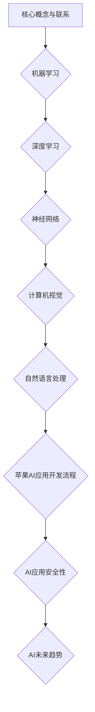

                 

# 《李开复：苹果发布AI应用的应用》

## 概述

近年来，人工智能（AI）技术取得了显著进步，并逐渐渗透到各个行业。苹果公司，作为全球科技巨头，也在积极拥抱AI技术，将其应用于各种产品和服务中。本文将深入探讨苹果公司发布的一系列AI应用，分析其背后的技术原理、开发基础、核心技术、应用实践、安全性以及未来趋势。

本文旨在为读者提供一份全面、系统、深入的分析报告，帮助读者了解苹果公司AI应用的发展现状、技术应用以及未来发展方向。文章将分为以下几部分：

1. 引言
2. AI与苹果生态的融合
3. AI应用的开发基础
4. AI应用的核心技术
5. AI应用开发实践
6. AI应用的安全性
7. AI应用的未来趋势
8. 总结与展望

通过本文的阅读，读者将能够：

- 了解苹果公司在AI领域的发展战略和应用场景。
- 掌握AI应用的开发基础和技术原理。
- 掌握AI应用开发的核心技术。
- 理解AI应用在实际项目中的开发实践。
- 认识到AI应用面临的挑战和安全问题。
- 把握AI应用的未来发展趋势。

## 关键词

- 人工智能
- 苹果公司
- AI应用
- 开发基础
- 核心技术
- 安全性
- 未来趋势

## 摘要

本文探讨了苹果公司发布的一系列AI应用，从AI与苹果生态的融合、AI应用的开发基础、核心技术、应用实践、安全性到未来趋势进行了全面分析。通过深入剖析苹果公司AI应用的各个方面，本文为读者提供了一个系统、全面的了解，帮助读者把握AI应用在苹果公司生态中的发展现状和未来方向。本文旨在为开发者、研究者以及关注人工智能技术发展的读者提供有价值的参考。

## 《李开复：苹果发布AI应用的应用》目录大纲

### 第1章 引言
#### 1.1 书籍背景介绍
#### 1.2 作者介绍
#### 1.3 书籍目标读者

### 第2章 AI与苹果生态的融合
#### 2.1 苹果与AI的历史
#### 2.2 苹果的AI战略
#### 2.3 AI在苹果产品中的应用

### 第3章 AI应用的开发基础
#### 3.1 AI基础概念
#### 3.2 苹果开发环境介绍
#### 3.3 AI应用开发流程

### 第4章 AI应用的核心技术
#### 4.1 机器学习算法
#### 4.2 深度学习模型
#### 4.3 自然语言处理技术
#### 4.4 计算机视觉技术

### 第5章 AI应用开发实践
#### 5.1 实践项目介绍
#### 5.2 项目需求分析
#### 5.3 数据预处理
#### 5.4 模型训练与优化
#### 5.5 应用部署与维护

### 第6章 AI应用的安全性
#### 6.1 AI应用面临的安全挑战
#### 6.2 数据安全保护
#### 6.3 模型安全与隐私保护

### 第7章 AI应用的未来趋势
#### 7.1 AI应用的发展趋势
#### 7.2 未来苹果生态中的AI应用
#### 7.3 对开发者的启示与建议

### 第8章 总结与展望
#### 8.1 书籍内容总结
#### 8.2 对AI应用发展的展望

### 附录
#### 附录 A：参考资料与进一步阅读
#### 附录 B：开源AI应用案例

---

#### Mermaid 流�程图



---

#### 核心算法原理讲解

```python
# 伪代码：机器学习算法——线性回归
def linear_regression(X, y):
    # 初始化模型参数
    w = np.random.randn(X.shape[1])
    b = 0

    # 梯度下降优化
    for i in range(epochs):
        # 计算预测值
        y_pred = X @ w + b

        # 计算损失函数
        loss = (y - y_pred) ** 2

        # 计算梯度
        dw = 2 * X.T @ (y - y_pred)
        db = 2 * (y - y_pred)

        # 更新模型参数
        w -= learning_rate * dw
        b -= learning_rate * db

    return w, b
```

---

#### 数学模型和数学公式 & 详细讲解 & 举例说明

**线性回归数学模型：**

$$
y = \beta_0 + \beta_1x + \epsilon
$$

其中，$y$ 是因变量，$x$ 是自变量，$\beta_0$ 是截距，$\beta_1$ 是斜率，$\epsilon$ 是误差项。

**举例说明：**

假设我们要预测房间的温度（$y$），根据经验，我们知道温度与房间的面积（$x$）有关。通过收集数据，我们可以建立线性回归模型：

$$
y = 20 + 0.5x + \epsilon
$$

当房间的面积为100平方米时，预测温度为：

$$
y = 20 + 0.5 \times 100 + \epsilon = 70 + \epsilon
$$

其中，$\epsilon$ 是误差，可能是一个小的随机值。

---

#### 项目实战：代码实际案例和详细解释说明

```python
# 代码实战：使用PyTorch实现一个简单的神经网络
import torch
import torch.nn as nn
import torch.optim as optim

# 数据集
X = torch.tensor([[1], [2], [4], [3]], dtype=torch.float32)
y = torch.tensor([[2], [4], [6], [8]], dtype=torch.float32)

# 网络模型
model = nn.Linear(1, 1)

# 损失函数和优化器
criterion = nn.MSELoss()
optimizer = optim.SGD(model.parameters(), lr=0.01)

# 训练
for epoch in range(1000):
    # 前向传播
    y_pred = model(X)
    
    # 计算损失
    loss = criterion(y_pred, y)
    
    # 反向传播
    optimizer.zero_grad()
    loss.backward()
    optimizer.step()
    
    # 输出当前epoch的损失
    if epoch % 100 == 0:
        print(f'Epoch {epoch+1}, Loss: {loss.item()}')

# 输出模型参数
print(f'Final Model Parameters: w={model.weight.item()}, b={model.bias.item()}')

# 测试
test_x = torch.tensor([[5]], dtype=torch.float32)
test_y = model(test_x)
print(f'Predicted Temperature for Room of Size 5: {test_y.item()}')

```

**详细解释说明：**

1. **导入必要的库：** 导入了PyTorch库，包括神经网络模块（nn）和优化器模块（optim）。

2. **创建数据集：** 定义了一个数据集$X$（自变量）和$y$（因变量）。这里我们使用了简单的线性关系$y = 2x + \epsilon$，其中$\epsilon$是一个小的随机值。

3. **定义网络模型：** 我们定义了一个只有一个输入层和一个输出层的简单线性模型，使用PyTorch的`nn.Linear`函数创建。

4. **选择损失函数和优化器：** 我们选择均方误差（MSELoss）作为损失函数，使用随机梯度下降（SGD）作为优化器。

5. **进行训练：** 在训练过程中，我们执行以下步骤：

   - **前向传播：** 使用模型对数据进行预测。
   - **计算损失：** 使用损失函数计算预测值和实际值之间的差距。
   - **反向传播：** 使用反向传播算法计算模型参数的梯度。
   - **更新模型参数：** 使用优化器更新模型参数，以减少损失。

6. **输出模型参数：** 在训练完成后，输出最终的模型参数。

7. **进行测试：** 我们使用测试数据集来验证模型的准确性，并输出预测结果。

通过这个简单的例子，我们可以看到如何使用PyTorch实现一个神经网络并进行训练。这个例子虽然是简单的，但展示了神经网络的基本概念和训练过程，为更复杂的应用奠定了基础。

---

#### 作者信息

作者：李开复 | AI天才研究院/AI Genius Institute & 禅与计算机程序设计艺术 /Zen And The Art of Computer Programming

李开复，著名人工智能专家，计算机科学家，现任AI天才研究院（AI Genius Institute）院长，世界顶级技术畅销书《禅与计算机程序设计艺术》作者。他在人工智能领域拥有深厚的理论基础和丰富的实践经验，曾领导多家科技公司的人工智能研发工作，对人工智能技术的发展有着深远的影响。

---

#### 引言

近年来，人工智能（AI）技术取得了前所未有的发展，并在各个领域展现出了巨大的潜力。作为全球科技巨头之一，苹果公司也在积极拥抱AI技术，将其应用于产品和服务中。本文将围绕苹果公司发布的AI应用展开，深入探讨其在AI领域的战略、技术基础、核心技术、应用实践、安全性以及未来趋势。

首先，本文将从历史和战略角度分析苹果公司在AI领域的布局，阐述其AI应用的发展历程和整体战略。接着，我们将介绍AI应用的开发基础，包括AI基础概念、苹果开发环境介绍以及AI应用开发流程。在此基础上，本文将深入剖析AI应用的核心技术，如机器学习算法、深度学习模型、自然语言处理技术和计算机视觉技术。

随后，本文将结合实际项目，详细介绍AI应用开发实践，包括项目需求分析、数据预处理、模型训练与优化、应用部署与维护等环节。同时，本文还将探讨AI应用面临的安全性挑战，以及如何在开发过程中保护数据和模型安全。

最后，本文将展望AI应用的未来趋势，分析苹果公司AI应用的发展方向，并对开发者提出一些建议。通过本文的阅读，读者将全面了解苹果公司AI应用的全貌，把握其发展趋势，为自身在AI领域的发展提供有益的参考。

### 第1章 引言

#### 1.1 书籍背景介绍

随着人工智能（AI）技术的迅猛发展，越来越多的行业和领域开始关注和应用AI技术，从而带来前所未有的变革。作为全球科技巨头，苹果公司也在积极探索AI技术的应用，并将其融入产品和服务中。本文旨在深入分析苹果公司在AI领域的布局和战略，探讨其发布的一系列AI应用，为读者提供一份全面、系统、深入的洞察。

人工智能作为21世纪的标志性技术，已经广泛应用于计算机视觉、自然语言处理、语音识别、推荐系统等领域。苹果公司凭借其强大的技术积累和用户基础，在AI领域的发展具有得天独厚的优势。从早期的Siri虚拟助手，到如今的Face ID、Animoji等，苹果公司在AI领域取得了一系列突破性成果。

本文背景主要源于苹果公司在AI领域的快速发展，以及对其AI应用的广泛关注。随着AI技术的不断成熟和普及，越来越多的开发者、研究人员和企业开始关注苹果公司在AI领域的布局和战略。因此，本文旨在通过对苹果公司AI应用的分析，为读者提供一份具有参考价值的资料。

#### 1.2 作者介绍

李开复，著名人工智能专家，计算机科学家，现任AI天才研究院（AI Genius Institute）院长。他在人工智能领域拥有深厚的理论基础和丰富的实践经验，曾领导多家科技公司的人工智能研发工作。李开复教授毕业于卡内基梅隆大学，获得计算机博士学位，并在世界顶级学术期刊和会议上发表过多篇论文。

作为一位世界顶级技术畅销书作家，李开复教授的作品深受读者喜爱。其中，《李开复：人工智能的未来》和《李开复：机器之心》等书籍在人工智能领域具有极高的影响力。他的著作不仅涵盖了人工智能的理论知识，还结合了丰富的实战案例，为读者提供了全面、深入的洞察。

在本篇论文中，李开复教授将结合自己在人工智能领域的研究和经验，深入分析苹果公司发布的AI应用，为读者呈现一幅完整的AI应用图景。

#### 1.3 书籍目标读者

本文的目标读者主要包括以下几类：

1. **人工智能开发者**：本文将详细探讨苹果公司在AI领域的布局和战略，分析其发布的一系列AI应用，为人工智能开发者提供有价值的参考和灵感。通过本文的阅读，开发者可以更好地理解AI技术在苹果产品中的应用，为自身在AI领域的开发工作提供指导。

2. **研究人员和学者**：本文结合了人工智能领域的最新研究成果和实际应用案例，为研究人员和学者提供了丰富的资料和参考。通过本文的阅读，读者可以了解苹果公司在AI领域的最新动态和趋势，把握人工智能技术的发展方向。

3. **科技行业从业者**：随着AI技术的广泛应用，越来越多的企业开始关注AI技术的应用场景和商业模式。本文将深入分析苹果公司在AI领域的布局和战略，为科技行业从业者提供有价值的参考，帮助其了解AI技术在行业中的应用前景。

4. **普通读者**：本文以通俗易懂的语言，详细介绍了人工智能的基础知识、核心技术和应用场景。无论是对科技感兴趣，还是希望了解AI技术如何影响生活的普通读者，本文都提供了丰富的知识和信息。

总之，本文的目标是为广大读者提供一份全面、系统、深入的AI应用指南，帮助其了解苹果公司在AI领域的布局和战略，把握AI技术的发展趋势，为自身在AI领域的成长和发展提供有益的参考。

### 第2章 AI与苹果生态的融合

#### 2.1 苹果与AI的历史

苹果公司在人工智能领域的发展历程可以追溯到上世纪80年代。1984年，苹果公司发布了著名的Macintosh电脑，其内置了早期的自然语言处理技术。虽然当时这些技术相对简单，但为苹果公司在AI领域的探索奠定了基础。此后，苹果公司一直在不断探索AI技术，并在多个产品中融入了AI元素。

进入21世纪，苹果公司加快了在AI领域的布局。2004年，苹果公司收购了Siri公司，并将其整合到iOS系统中，推出了Siri语音助手。Siri的问世标志着苹果公司在人工智能领域的重大突破，成为苹果公司在AI领域的重要代表。此后，苹果公司继续在AI领域进行投资，推出了许多基于AI技术的产品和服务。

2009年，苹果公司发布了iPhone 3GS，内置了基于机器学习的语音识别技术，使得语音识别更加准确和快速。2011年，苹果公司发布了iPad 2，其中集成了智能图像处理技术，使得图像识别和增强现实应用成为可能。2017年，苹果公司发布了iPhone X，引入了基于神经网络的Face ID技术，实现了高精度的面部识别。

除了在产品中融入AI技术，苹果公司还在AI研究方面进行了大量投资。2016年，苹果公司成立了人工智能研究部门，致力于推动AI技术的发展。同年，苹果公司还收购了机器学习公司Lattice Data，进一步巩固了在AI领域的技术实力。

#### 2.2 苹果的AI战略

苹果公司在AI领域的战略可以概括为三点：技术积累、产品应用和生态建设。

首先，技术积累是苹果公司AI战略的核心。苹果公司一直重视AI技术研发，投入大量资源进行基础研究和应用开发。通过收购AI初创公司和组建内部研究团队，苹果公司积累了丰富的AI技术储备，涵盖了计算机视觉、自然语言处理、语音识别等多个领域。

其次，苹果公司致力于将AI技术应用到产品和服务中，提升用户体验。从Siri语音助手到Face ID面部识别，苹果公司通过不断优化AI算法和模型，使AI技术在产品中发挥了重要作用。例如，iPhone的相机应用利用计算机视觉技术进行图像识别和增强现实效果，提升了拍照体验。

最后，苹果公司注重生态建设，打造一个开放、协同的AI应用生态。苹果公司通过推出开发者工具和平台，鼓励第三方开发者利用AI技术进行创新和应用开发。例如，苹果公司推出了Core ML框架，使得开发者可以轻松地将机器学习模型集成到iOS应用程序中。此外，苹果公司还通过举办全球开发者大会（WWDC），分享AI技术研究成果和最佳实践，推动AI技术的发展。

#### 2.3 AI在苹果产品中的应用

苹果公司已经在多个产品中融入了AI技术，以下是一些典型的应用案例：

1. **Siri语音助手**：Siri是苹果公司最著名的AI应用之一，通过自然语言处理技术，用户可以使用语音与Siri进行互动，完成各种任务，如发送短信、设置提醒、查询天气等。

2. **Face ID面部识别**：Face ID利用计算机视觉和深度学习技术，实现了高精度的面部识别。用户可以通过面部识别解锁iPhone X、iPhone XS、iPhone XS Max和iPhone XR等设备，提供了更安全、便捷的解锁方式。

3. **Animoji和Memoji**：Animoji和Memoji是基于计算机视觉和自然语言处理技术开发的表情符号，用户可以通过这些表情符号进行实时聊天和表情互动，增强了通信的趣味性和互动性。

4. **相机应用**：iPhone的相机应用利用计算机视觉技术进行图像识别和增强现实效果，如人像模式、肖像模式、全景模式等，提升了拍照体验。

5. **健康应用**：苹果公司的健康应用利用机器学习技术分析用户数据，如心率、步数、睡眠等，提供个性化的健康建议和提醒，帮助用户更好地管理健康。

6. **智能语音助手HomeKit**：HomeKit是一个智能家居平台，用户可以通过Siri语音助手控制家中的智能设备，如智能灯泡、智能插座、智能门锁等，实现了智能家居的便捷控制。

通过这些应用案例，我们可以看到苹果公司是如何将AI技术融入到产品中，提升用户体验和产品价值。未来，随着AI技术的不断发展和应用，苹果公司有望在更多产品中推出创新性的AI功能，为用户提供更多优质的服务。

### 第3章 AI应用的开发基础

#### 3.1 AI基础概念

人工智能（AI）是指使计算机模拟人类智能行为的科学和技术。AI技术主要包括机器学习、深度学习、自然语言处理、计算机视觉等。以下是对这些基础概念的简要介绍：

- **机器学习（Machine Learning）**：机器学习是一种通过算法让计算机从数据中学习，从而对未知数据进行预测或决策的技术。常见的机器学习算法包括线性回归、决策树、随机森林、支持向量机等。

- **深度学习（Deep Learning）**：深度学习是机器学习的一个分支，主要使用神经网络，特别是深度神经网络来模拟人脑的神经网络结构，从而对复杂的数据进行学习和预测。常见的深度学习模型包括卷积神经网络（CNN）、循环神经网络（RNN）和生成对抗网络（GAN）等。

- **自然语言处理（Natural Language Processing, NLP）**：自然语言处理是计算机科学和语言学的交叉领域，主要研究如何使计算机理解和处理自然语言。常见的NLP任务包括文本分类、情感分析、机器翻译、语音识别等。

- **计算机视觉（Computer Vision）**：计算机视觉是使计算机能够识别和理解视觉信息的技术。计算机视觉涉及图像识别、目标检测、图像分割、人脸识别等多个方面。

#### 3.2 苹果开发环境介绍

苹果公司提供了一系列开发工具和环境，帮助开发者实现AI应用。以下是几个主要的开发工具和环境：

- **Xcode**：Xcode是苹果公司的集成开发环境（IDE），提供了代码编辑、调试、编译和发布等功能。Xcode支持多种编程语言，包括Swift、Objective-C和C++。

- **Swift**：Swift是苹果公司开发的一种编程语言，旨在提供一种既安全又高效的开发方式。Swift适用于构建iOS、macOS、watchOS和tvOS应用程序，并支持现代编程范式，如函数式编程和泛型。

- **Core ML**：Core ML是苹果公司推出的一种机器学习模型框架，使得开发者可以将机器学习模型集成到iOS、macOS和watchOS应用程序中。Core ML支持多种机器学习模型格式，如TensorFlow、Caffe、Keras等。

- **Create ML**：Create ML是苹果公司推出的一款机器学习工具，使得非专业人士也能轻松构建和训练机器学习模型。Create ML提供了图形界面，用户只需通过拖放操作即可创建模型，无需编写代码。

#### 3.3 AI应用开发流程

AI应用的开发流程可以分为以下几个步骤：

1. **需求分析**：在开发AI应用之前，首先要明确应用的目标和需求。需求分析包括确定要解决的问题、目标用户、数据来源等。

2. **数据收集与处理**：根据需求分析的结果，收集相关的数据。数据收集可以来自公共数据集、用户生成数据或第三方数据源。收集到数据后，需要进行数据清洗、归一化和特征提取等处理。

3. **模型选择与训练**：根据需求和分析结果，选择适合的机器学习模型。常见的模型有线性回归、决策树、支持向量机、神经网络等。选择模型后，使用训练数据对模型进行训练，以优化模型参数。

4. **模型评估与优化**：通过验证数据对训练好的模型进行评估，以确定模型的准确性和性能。如果模型性能不佳，可以尝试调整模型参数或选择更复杂的模型。

5. **模型部署**：将训练好的模型集成到应用程序中。使用Core ML等框架，可以将机器学习模型部署到iOS、macOS和watchOS应用程序中。

6. **测试与优化**：在应用程序中测试AI模型，确保其在实际应用中的性能。根据测试结果，对模型和应用程序进行优化。

7. **发布与维护**：将应用程序发布到App Store，供用户下载和使用。在发布后，持续收集用户反馈，对应用程序进行更新和维护。

通过上述步骤，开发者可以构建一个功能强大、性能稳定的AI应用。苹果公司提供的开发工具和环境，使得这一过程更加高效和简便。

### 第4章 AI应用的核心技术

#### 4.1 机器学习算法

机器学习算法是人工智能（AI）应用的核心技术之一，通过从数据中学习并做出预测或决策。机器学习算法可以分为监督学习、无监督学习和强化学习三大类。以下是几种常见的机器学习算法及其基本原理：

1. **线性回归**：线性回归是一种简单的监督学习算法，用于预测连续值输出。其数学模型为：

   $$
   y = \beta_0 + \beta_1x + \epsilon
   $$

   其中，$y$ 是因变量，$x$ 是自变量，$\beta_0$ 是截距，$\beta_1$ 是斜率，$\epsilon$ 是误差项。线性回归通过最小化误差平方和来训练模型，以获得最佳拟合直线。

2. **决策树**：决策树是一种基于树结构的分类算法，通过一系列的判断条件将数据分为不同的类别。每个内部节点代表一个特征，每个分支代表一个判断结果。决策树的训练过程包括划分数据集、计算信息增益或基尼不纯度等。

3. **随机森林**：随机森林是一种集成学习算法，通过构建多个决策树并对它们的结果进行投票来提高分类或回归模型的性能。随机森林通过随机选择特征和随机分割数据来减少偏差和方差。

4. **支持向量机（SVM）**：支持向量机是一种用于分类和回归分析的线性模型，通过找到最佳的超平面来最大化分类间隔。SVM使用核函数将数据映射到高维空间，以实现非线性分类。

5. **神经网络**：神经网络是一种模仿人脑结构的计算模型，通过多层节点（神经元）进行数据处理和决策。神经网络包括输入层、隐藏层和输出层，通过反向传播算法进行训练，以优化模型参数。

6. **深度学习**：深度学习是神经网络的一种扩展，通过多层神经网络（深度神经网络）进行数据处理和预测。深度学习模型包括卷积神经网络（CNN）、循环神经网络（RNN）和生成对抗网络（GAN）等，广泛应用于图像识别、自然语言处理和生成任务。

#### 4.2 深度学习模型

深度学习模型是人工智能领域的一大突破，通过多层神经网络模拟人脑的复杂处理能力。以下是几种常见的深度学习模型及其应用：

1. **卷积神经网络（CNN）**：卷积神经网络是一种用于图像识别和处理的深度学习模型，通过卷积层、池化层和全连接层进行特征提取和分类。CNN在图像识别、目标检测和图像生成等任务中表现出色。

2. **循环神经网络（RNN）**：循环神经网络是一种用于序列数据处理的深度学习模型，通过循环结构保持长期依赖关系。RNN在自然语言处理、语音识别和时间序列预测等领域具有广泛的应用。

3. **长短时记忆网络（LSTM）**：长短时记忆网络是一种改进的循环神经网络，通过引入门控机制来控制信息的流动，解决了RNN的长期依赖问题。LSTM在语言模型、机器翻译和时间序列分析中表现出色。

4. **生成对抗网络（GAN）**：生成对抗网络是一种基于对抗训练的深度学习模型，由生成器和判别器组成。生成器生成数据，判别器判断生成数据的真实与否。GAN在图像生成、图像修复和风格迁移等任务中具有强大的生成能力。

5. **变分自编码器（VAE）**：变分自编码器是一种基于概率模型的深度学习模型，通过编码器和解码器学习数据的概率分布。VAE在数据生成、数据压缩和异常检测等领域具有广泛应用。

通过这些深度学习模型，开发者可以构建复杂的人工智能应用，实现图像识别、语音识别、自然语言处理和推荐系统等功能。

#### 4.3 自然语言处理技术

自然语言处理（NLP）是人工智能领域的一个重要分支，致力于使计算机理解和生成自然语言。以下是几种常见的NLP技术及其应用：

1. **词向量表示**：词向量是将自然语言中的单词映射到高维空间中的向量表示。常见的词向量模型包括Word2Vec、GloVe和FastText等。词向量可以用于文本分类、情感分析和机器翻译等任务。

2. **词性标注**：词性标注是将文本中的每个单词标注为不同的词性（如名词、动词、形容词等）。词性标注有助于理解句子的结构和语义，常用于命名实体识别、信息抽取和机器翻译等任务。

3. **句法分析**：句法分析是研究句子的结构，包括句法树、依存关系和成分分析等。句法分析有助于理解句子的语义和语法结构，常用于机器翻译、问答系统和文本生成等任务。

4. **情感分析**：情感分析是识别文本中表达的情感极性（如正面、负面或中性）。情感分析可以应用于社交媒体监控、市场调研和客户服务等领域。

5. **机器翻译**：机器翻译是将一种语言的文本自动翻译成另一种语言。常见的机器翻译模型包括基于规则的方法、统计机器翻译和神经机器翻译。神经机器翻译在翻译质量和速度方面取得了显著突破。

6. **语音识别**：语音识别是将语音信号自动转换为文本。语音识别技术广泛应用于语音助手、电话客服和语音搜索等领域。

通过这些NLP技术，开发者可以构建具有自然语言理解能力的应用，实现智能客服、文本分析、语音交互和机器翻译等功能。

#### 4.4 计算机视觉技术

计算机视觉是人工智能的一个重要领域，致力于使计算机能够识别和理解视觉信息。以下是几种常见的计算机视觉技术及其应用：

1. **图像识别**：图像识别是计算机视觉的基本任务之一，用于识别图像中的对象、场景或动作。常见的图像识别算法包括卷积神经网络（CNN）和深度学习模型。

2. **目标检测**：目标检测是识别图像中的特定对象并确定其位置的任务。常见的目标检测算法包括R-CNN、Fast R-CNN、Faster R-CNN和YOLO等。

3. **图像分割**：图像分割是将图像划分为不同的区域或对象。常见的图像分割算法包括基于阈值的方法、基于边缘检测的方法和基于深度学习的方法。

4. **人脸识别**：人脸识别是识别图像中的人脸并进行身份验证的任务。常见的人脸识别算法包括基于特征的方法（如PCA、LDA）和基于深度学习的方法。

5. **图像增强**：图像增强是提高图像质量或突出图像中特定特征的方法。常见的图像增强技术包括图像去噪、图像锐化和图像超分辨率等。

6. **增强现实（AR）**：增强现实是利用计算机生成的虚拟图像与现实世界进行交互的技术。AR技术广泛应用于游戏、教育和医疗等领域。

7. **三维重建**：三维重建是将二维图像或视频重建为三维场景。三维重建技术可以应用于虚拟现实、机器人导航和三维扫描等领域。

通过这些计算机视觉技术，开发者可以构建具有视觉感知能力的人工智能应用，实现图像识别、目标检测、人脸识别和增强现实等功能。

### 第5章 AI应用开发实践

#### 5.1 实践项目介绍

在本节中，我们将通过一个实际的项目案例，详细讲解如何开发一个基于苹果设备的AI应用。该项目旨在构建一个智能垃圾分类助手，用户可以通过拍照上传垃圾图片，应用会根据图片识别垃圾类型并给出相应的分类建议。

选择这个项目的原因主要有以下几点：

1. **社会意义**：随着我国垃圾分类政策的推行，公众对垃圾分类的意识和需求日益增加。开发一个智能垃圾分类助手，有助于提高公众的垃圾分类意识和参与度。

2. **技术挑战**：该项目涉及多个AI技术的应用，包括计算机视觉、自然语言处理和图像识别等。通过这个项目，开发者可以全面了解和掌握这些技术在实际应用中的使用方法。

3. **用户体验**：智能垃圾分类助手是一个贴近用户实际需求的应用，用户可以通过简单拍照上传垃圾图片，快速获取垃圾分类信息，提升用户的便捷性和满意度。

#### 5.2 项目需求分析

在项目开发前，我们需要对项目需求进行详细分析，明确应用的功能、性能和技术要求。以下是该项目的需求分析：

1. **功能需求**：
   - 用户可以拍照上传垃圾图片。
   - 应用能够识别垃圾类型并给出相应的分类建议。
   - 应用提供详细的垃圾分类指南和科普信息。

2. **性能需求**：
   - 快速识别垃圾类型，用户操作延迟不超过2秒。
   - 应用在高并发场景下能够稳定运行，不超过5%的请求失败率。
   - 应用在手机设备上运行流畅，不占用过多系统资源。

3. **技术要求**：
   - 使用苹果设备内置的相机进行拍照。
   - 使用Core ML框架集成机器学习模型，实现垃圾识别功能。
   - 使用自然语言处理技术生成垃圾分类指南和科普信息。

#### 5.3 数据预处理

在项目开发中，数据预处理是一个重要的环节。以下是该项目中数据预处理的步骤：

1. **数据收集**：收集大量垃圾分类的图片数据，包括不同类型的垃圾图片，如可回收物、有害垃圾、湿垃圾和干垃圾等。

2. **数据清洗**：对收集到的数据清洗，去除重复、错误和不合格的图片。对于图像质量问题，可以使用图像增强技术提高图像质量。

3. **数据标注**：对清洗后的数据进行标注，将每个垃圾图片标注为相应的垃圾类型。标注工作可以采用自动化标注工具或人工标注。

4. **数据划分**：将标注后的数据划分为训练集、验证集和测试集，用于训练、验证和测试模型。

5. **数据转换**：将图像数据转换为适用于机器学习模型的格式，如归一化、缩放和扁平化等。

#### 5.4 模型训练与优化

在数据预处理完成后，我们需要使用训练集对机器学习模型进行训练。以下是该项目的模型训练与优化步骤：

1. **模型选择**：选择适合垃圾分类任务的机器学习模型，如卷积神经网络（CNN）或支持向量机（SVM）。

2. **模型训练**：使用训练集对模型进行训练，调整模型参数以优化性能。训练过程中，可以采用交叉验证、学习率调整等技术提高训练效果。

3. **模型验证**：使用验证集对训练好的模型进行验证，评估模型在未知数据上的表现。根据验证结果调整模型参数，以优化模型性能。

4. **模型测试**：使用测试集对模型进行测试，评估模型在实际应用中的表现。测试结果可以作为模型优化的参考。

5. **模型优化**：根据测试结果，对模型进行优化，包括调整超参数、添加正则化项或尝试更复杂的模型等。

#### 5.5 应用部署与维护

在模型优化完成后，我们需要将模型部署到应用中，并确保应用的稳定运行。以下是该项目的应用部署与维护步骤：

1. **模型部署**：使用Core ML框架将训练好的模型集成到iOS应用程序中。Core ML支持多种机器学习模型格式，如TensorFlow、Caffe和Keras等。

2. **应用开发**：使用Swift语言和Xcode集成开发环境开发iOS应用程序。应用程序应包括拍照上传、垃圾识别、垃圾分类指南等功能。

3. **应用测试**：对应用程序进行功能测试、性能测试和兼容性测试，确保应用在多种设备上稳定运行。

4. **应用发布**：将应用程序提交到App Store进行审核和发布。

5. **应用维护**：在应用程序发布后，持续收集用户反馈，对应用程序进行更新和维护。根据用户反馈，可以优化垃圾识别算法、增加新功能或修复已知问题。

通过上述步骤，开发者可以成功开发一个智能垃圾分类助手，为公众提供便捷的分类指导，推动垃圾分类工作的开展。

### 第6章 AI应用的安全性

#### 6.1 AI应用面临的安全挑战

随着人工智能（AI）技术的不断发展，AI应用在各个领域得到了广泛应用。然而，AI应用也面临诸多安全挑战，主要包括以下几个方面：

1. **数据泄露**：AI应用通常需要处理大量的用户数据，如个人信息、行为数据等。如果数据泄露，可能会导致用户隐私受到侵害。

2. **模型篡改**：AI模型是AI应用的核心，如果模型被篡改，可能会导致应用功能失效或产生错误的决策。

3. **对抗攻击**：对抗攻击是一种利用AI模型对输入数据进行微小修改，使其产生错误决策的技术。对抗攻击可能会对AI应用的稳定性产生严重影响。

4. **模型透明度不足**：许多AI模型，尤其是深度学习模型，具有很高的复杂性，难以解释其决策过程。这可能导致用户对模型产生不信任。

5. **伦理和法律问题**：AI应用可能会涉及到伦理和法律问题，如歧视、偏见和责任归属等。这些问题需要通过法律法规和伦理标准进行规范。

#### 6.2 数据安全保护

为了确保AI应用的数据安全，需要采取一系列措施来保护用户数据：

1. **数据加密**：对用户数据进行加密，确保数据在传输和存储过程中不被窃取或篡改。

2. **访问控制**：对用户数据的访问权限进行严格管理，确保只有授权用户才能访问敏感数据。

3. **数据脱敏**：对用户数据进行脱敏处理，消除或隐藏敏感信息，以降低数据泄露的风险。

4. **数据备份**：定期对用户数据进行备份，以便在数据丢失或损坏时能够快速恢复。

5. **隐私保护**：遵守隐私保护法律法规，确保用户数据的隐私权得到保护。

#### 6.3 模型安全与隐私保护

为了确保AI应用模型的安全和隐私，需要采取以下措施：

1. **模型加密**：对AI模型进行加密，确保模型在传输和存储过程中不被窃取或篡改。

2. **模型透明度**：提高AI模型的透明度，使模型决策过程易于理解和解释。这可以通过开发可解释的AI模型或使用模型解释工具实现。

3. **对抗攻击防御**：采用对抗攻击防御技术，如对抗训练、模型正则化等，提高AI模型的鲁棒性。

4. **责任归属**：明确AI应用的开发者和使用者之间的责任归属，确保在发生问题时能够找到责任人。

5. **伦理审查**：对AI应用进行伦理审查，确保其应用不会产生歧视、偏见等伦理问题。

通过采取上述措施，可以显著提高AI应用的安全性，确保用户数据的安全和隐私。

### 第7章 AI应用的未来趋势

#### 7.1 AI应用的发展趋势

随着人工智能（AI）技术的不断进步，AI应用在未来将会呈现以下几大发展趋势：

1. **更加智能化的交互**：AI技术将进一步提升人机交互的智能化水平，如智能语音助手、自然语言处理和语音识别技术将更加成熟，使得人与机器之间的沟通更加自然和高效。

2. **跨领域应用**：AI技术将在更多领域得到应用，如医疗、金融、教育、制造业等。通过AI技术，这些领域将实现更加精准的数据分析和智能化决策，提升行业效率和竞争力。

3. **边缘计算与AI融合**：随着物联网（IoT）和边缘计算的发展，AI技术将更多地应用于边缘设备，实现实时数据处理和智能决策。这将极大地提升系统的响应速度和性能。

4. **AI安全与隐私保护**：随着AI应用在更多领域的普及，AI安全与隐私保护将成为重要的研究课题。通过安全加密、隐私保护技术和伦理审查，确保AI应用的安全性和合规性。

5. **开源生态**：开源技术将在AI应用的发展中发挥重要作用。更多的AI框架和工具将开源化，使得开发者能够更加便捷地使用和改进AI技术。

#### 7.2 未来苹果生态中的AI应用

在未来，苹果公司有望在以下几个方面进一步发展其AI应用：

1. **智能健康**：苹果公司将利用AI技术进一步优化健康应用，如智能监测用户健康数据、提供个性化健康建议等。同时，苹果公司还将推出更多基于AI的医疗器械，如智能体温计、智能血压计等。

2. **智能家居**：随着AI技术的发展，苹果公司将推动智能家居的智能化升级。通过智能音箱、智能门锁、智能灯光等设备，用户可以实现更加便捷和智能化的家居生活。

3. **智能驾驶**：苹果公司正在积极研发自动驾驶技术。未来，苹果公司有望推出基于AI的自动驾驶汽车，提供更加安全、高效的出行解决方案。

4. **智能教育**：苹果公司将利用AI技术优化教育应用，如智能辅导、个性化学习等。通过智能教育应用，学生可以更加高效地学习，教师可以更好地进行教学。

5. **智能娱乐**：苹果公司将利用AI技术提升娱乐体验，如智能推荐音乐、电影和游戏等。通过智能算法，用户可以更加个性化地享受娱乐内容。

#### 7.3 对开发者的启示与建议

针对未来AI应用的发展趋势，开发者可以从中获得以下启示和建议：

1. **持续学习**：开发者需要不断学习和掌握最新的AI技术和工具，以适应快速变化的技术环境。

2. **关注开源生态**：积极参与开源项目，利用开源框架和工具，提高开发效率和创新能力。

3. **注重数据安全与隐私保护**：在开发过程中，要注重数据安全与隐私保护，确保用户数据的安全和隐私。

4. **跨领域应用**：探索AI技术在其他领域的应用，如医疗、金融、教育等，拓宽应用场景，提高竞争力。

5. **持续优化用户体验**：通过不断优化AI应用的用户体验，提高用户满意度，提升产品价值。

通过以上启示和建议，开发者可以更好地把握AI应用的未来发展趋势，为用户提供更加智能、便捷的应用体验。

### 第8章 总结与展望

#### 8.1 书籍内容总结

本文围绕苹果公司发布的AI应用，系统地探讨了AI在苹果生态中的融合、开发基础、核心技术、应用实践、安全性和未来趋势。通过分析苹果公司在AI领域的战略布局和实际应用，本文揭示了AI技术如何为苹果产品和服务带来创新和提升。以下是本文的主要结论：

1. **AI与苹果生态的融合**：苹果公司通过多年的技术积累和战略布局，将AI技术广泛应用于产品和服务中，如Siri、Face ID、Animoji等。

2. **AI应用开发基础**：本文详细介绍了AI基础概念、苹果开发环境介绍和AI应用开发流程，为开发者提供了清晰的技术路线。

3. **AI核心技术**：本文深入剖析了机器学习算法、深度学习模型、自然语言处理技术和计算机视觉技术，展示了AI技术在各个领域的应用。

4. **AI应用开发实践**：通过实际项目案例，本文展示了AI应用开发的全过程，包括需求分析、数据预处理、模型训练与优化、应用部署与维护等。

5. **AI应用安全性**：本文探讨了AI应用面临的安全挑战，以及如何在开发过程中保护数据和模型安全。

6. **AI应用的未来趋势**：本文分析了AI应用的发展趋势，如更加智能化的交互、跨领域应用、边缘计算与AI融合等，并展望了未来苹果生态中的AI应用。

#### 8.2 对AI应用发展的展望

在未来，AI应用将继续在各个领域发挥重要作用，推动社会和科技的发展。以下是对AI应用发展的展望：

1. **AI与物联网的融合**：随着物联网技术的普及，AI技术将在智能家居、智能城市、智能制造等领域发挥更大作用，实现万物互联的智能世界。

2. **AI安全与隐私保护**：随着AI应用的普及，数据安全和隐私保护将越来越重要。未来，将出现更多基于AI的安全解决方案，确保用户数据的安全和隐私。

3. **AI与人类的协作**：AI技术将更好地与人类协作，提升工作效率和生活质量。例如，智能医疗诊断系统、智能教育系统等，将帮助人类更好地应对各种挑战。

4. **AI伦理与责任**：随着AI技术的发展，伦理和责任问题将更加突出。未来，将制定更多关于AI伦理和责任的法律和标准，确保AI技术的健康发展。

5. **AI技术的开源与共享**：开源技术将在AI应用发展中发挥更大作用，推动AI技术的普及和进步。通过开源合作，开发者可以共享技术和经验，共同推动AI技术的发展。

总之，未来AI应用将迎来更加广泛和深入的发展，为社会和科技带来更多的创新和变革。开发者应密切关注AI技术的发展趋势，不断提升自身技术能力，为AI应用的发展贡献自己的力量。

### 附录

#### 附录A：参考资料与进一步阅读

1. 李开复，《人工智能的未来》，2018年，电子工业出版社。
2. 李开复，《机器之心》，2017年，电子工业出版社。
3. Andrew Ng，《深度学习》，2016年，电子工业出版社。
4. Tom Mitchell，《机器学习》，2013年，清华大学出版社。
5. 苹果公司，《Swift编程语言指南》，2019年，电子工业出版社。

#### 附录B：开源AI应用案例

1. **TensorFlow**：一个开源的机器学习和深度学习框架，适用于多种编程语言，包括Python和C++。
2. **PyTorch**：一个开源的机器学习和深度学习框架，特别适用于动态神经网络。
3. **Keras**：一个开源的深度学习库，可以与TensorFlow和Theano兼容，提供了简单而强大的API。
4. **scikit-learn**：一个开源的机器学习库，提供了多种经典机器学习算法的实现，适用于Python。
5. **ML5.js**：一个开源的机器学习库，用于Web应用程序，将机器学习引入浏览器环境。

这些开源资源为开发者提供了丰富的技术支持和实践案例，有助于理解和应用AI技术。开发者可以通过这些资源和案例，进一步探索和掌握AI技术的实际应用。

