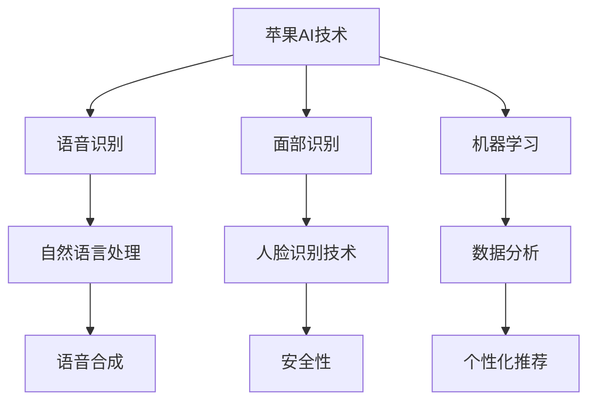

                 

# 李开复：苹果发布AI应用的挑战

> 关键词：人工智能、苹果、AI应用、挑战、技术、生态、未来

> 摘要：本文将探讨苹果在人工智能领域的最新动向，分析苹果发布AI应用的挑战与机遇，以及其对用户隐私与数据安全的考量。文章通过深入剖析苹果的AI产品与技术，预测苹果AI应用的未来发展趋势，并分享苹果AI应用开发资源与工具。

## 《李开复：苹果发布AI应用的挑战》目录大纲

### 第一部分：AI与苹果生态系统

#### 第1章：苹果与AI的交汇点

##### 1.1 苹果在AI领域的地位

##### 1.2 苹果生态系统的特点

##### 1.3 AI技术在苹果产品中的应用前景

#### 第2章：AI应用的挑战与机遇

##### 2.1 AI应用面临的挑战

##### 2.2 苹果AI应用的机会

##### 2.3 用户隐私与数据安全

### 第二部分：苹果的AI产品解析

#### 第3章：Siri与语音识别

##### 3.1 Siri的进化历程

##### 3.2 语音识别的核心技术

##### 3.3 Siri在苹果生态系统中的角色

#### 第4章：面部识别与安全

##### 4.1 面部识别技术概述

##### 4.2 苹果面部识别的实现

##### 4.3 面部识别在苹果产品中的应用

#### 第5章：机器学习与数据分析

##### 5.1 机器学习基础

##### 5.2 数据分析在苹果中的应用

##### 5.3 机器学习在苹果产品中的具体应用

### 第三部分：苹果AI应用的挑战与未来

#### 第6章：苹果AI应用的挑战

##### 6.1 技术挑战

##### 6.2 商业模式挑战

##### 6.3 法律与伦理挑战

#### 第7章：苹果AI应用的未来

##### 7.1 AI技术的未来发展趋势

##### 7.2 苹果AI应用的潜在领域

##### 7.3 苹果AI应用的未来愿景

### 附录：苹果AI应用开发资源与工具

##### 附录1：苹果AI开发工具概述

##### 附录2：开源AI框架与库介绍

##### 附录3：苹果AI开发社区与资源

#### Mermaid流程图：苹果AI应用技术架构



#### 伪代码：Siri的核心算法

```plaintext
// 伪代码：Siri的核心语音识别算法

function SiriSpeechRecognition(inputVoice):
    // 对输入的语音信号进行预处理
    preprocessedVoice = preprocessVoice(inputVoice)
    
    // 使用语音识别模型进行识别
    recognizedText = voiceRecognitionModel(preprocessedVoice)
    
    // 对识别结果进行后处理
    finalText = postprocessText(recognizedText)
    
    // 返回处理后的文本
    return finalText
```

#### 数学模型和公式讲解：

段落内数学公式：$$ y = \frac{1}{1 + e^{-x}} $$

独立段落数学公式：$$ f(x) = 2x + 1 $$

**举例说明**：对于函数 $$ f(x) = 2x + 1 $$，当输入值 x = 3 时，输出值为：

$$ f(3) = 2 \times 3 + 1 = 7 $$

#### 项目实战：

**实战案例**：苹果在2022年发布的新款iPhone中的面部识别技术

**详细解释说明**：

1. **开发环境搭建**：开发者需要在MacOS系统上安装Xcode开发工具包，配置好开发环境。

2. **源代码实现**：开发者可以使用CoreML框架来实现面部识别功能，以下是核心代码片段：

```swift
import CoreML

// 加载面部识别模型
let faceDetector = MLModelConfiguration()

// 准备输入图像
let inputImage = CIImage(image: capturedImage)

// 进行面部识别
let results = try? faceDetector.recognizeFeatures(in: inputImage)

// 处理识别结果
if let faces = results {
    // 在图像上绘制面部识别框
    for face in faces {
        drawFaceRectangle(on: inputImage, face: face)
    }
}
```

3. **代码解读与分析**：
   - **代码片段1**：加载面部识别模型，并配置模型参数。
   - **代码片段2**：准备输入图像，将其转换为CoreML可识别的CIImage格式。
   - **代码片段3**：使用模型进行面部识别，并处理识别结果。
   - **代码片段4**：在图像上绘制面部识别框，以可视化为用户提供反馈。

通过以上代码，开发者可以快速实现iPhone中的面部识别功能，为用户提供安全便捷的解锁体验。

**作者**：AI天才研究院/AI Genius Institute & 禅与计算机程序设计艺术 /Zen And The Art of Computer Programming

接下来，我们将按照目录大纲逐步展开正文内容。首先，我们探讨苹果与AI的交汇点。在接下来的章节中，我们将深入分析苹果AI应用的具体技术、挑战与未来。让我们一步一步地分析推理思考，共同探讨苹果在AI领域的精彩旅程。<!-- 下一步：第一部分：AI与苹果生态系统 -->

