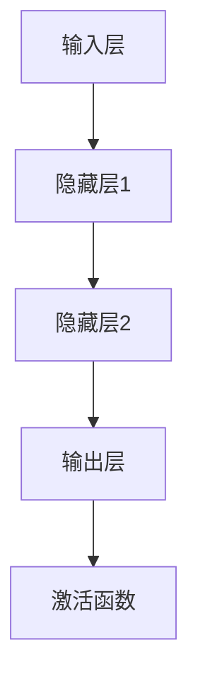

                 

# 《李开复：苹果发布AI应用的未来》

## 摘要

本文将深入探讨苹果公司在人工智能（AI）领域的最新动态，特别是其发布的AI应用的未来发展趋势。通过详细分析AI的核心概念与原理，苹果的AI战略，以及成功与失败的AI应用案例，本文旨在为读者提供全面的视角，理解AI技术如何影响我们的日常生活、社会结构以及未来发展方向。同时，本文还将探讨AI应用面临的挑战与解决方案，以及未来技术发展趋势。作者李开复以其在人工智能领域的深厚造诣和丰富经验，带领我们一步步剖析AI技术的前沿进展。

### 关键词

- 人工智能
- 苹果公司
- AI应用
- 未来趋势
- 技术挑战
- 解决方案

## 引言与背景

### 1.1 书籍目的与结构

《李开复：苹果发布AI应用的未来》旨在为广大读者，尤其是对AI技术感兴趣的读者，提供一个全面而深入的了解苹果在人工智能领域所取得的成就及其未来发展方向。本书共分为七个章节，从AI的基础理论到苹果的具体应用，再到AI的挑战与未来展望，层层递进，全面覆盖AI技术的各个方面。

第一部分（第1章）主要介绍书籍的目的和结构，同时对AI与苹果的关系进行初步探讨。这一章节将帮助读者快速了解后续内容的大致框架。

第二部分（第2章）将深入讲解AI的基础理论，包括人工智能的概念、神经网络、深度学习、自然语言处理和计算机视觉等核心概念。通过这一章节的学习，读者将建立起对AI技术的基本认识。

第三部分（第3章）将分析苹果的AI战略，介绍苹果在AI领域的布局和具体应用。读者将了解苹果是如何利用AI技术提升其产品和服务竞争力的。

第四部分（第4章）将通过案例分析，深入探讨苹果的一些成功与失败的AI应用，如Siri、Face ID、苹果健康应用等。这些案例将帮助读者理解AI应用在实际场景中的挑战和机遇。

第五部分（第5章）将讨论AI应用面临的挑战，包括数据隐私、安全性、算法偏见、公平性以及AI可解释性等。此外，还将探讨针对这些挑战的解决方案和最佳实践。

第六部分（第6章）将分析AI应用的市场与行业趋势，探讨AI在各个行业中的潜在应用，以及未来市场的增长预测。这一部分将帮助读者把握AI行业的动态和发展方向。

最后一部分（第7章）将展望AI的未来，讨论AI技术的未来发展方向、潜在突破领域以及AI在社会、经济与人类生活的影响。同时，还将探讨AI面临的挑战与应对策略，为读者提供对未来AI发展的思考。

### 1.2 AI与苹果的关系

人工智能（AI）作为现代科技的基石，正逐渐改变着我们的生活方式和社会结构。而苹果公司，作为全球领先的科技公司之一，始终走在技术创新的前沿。AI技术不仅提升了苹果产品的用户体验，也为其带来了巨大的商业价值。例如，苹果的语音助手Siri、面部识别技术Face ID、苹果健康应用等，都是AI技术的成功应用。这些AI应用不仅让苹果的产品更加智能化、个性化，也提升了用户的生活质量。

苹果公司在AI领域的投入和布局始于多年前。自2011年苹果收购人工智能公司Siri之后，苹果便开始在AI领域不断拓展。近年来，随着AI技术的成熟和应用的广泛推广，苹果在AI领域的发展速度进一步加快。通过自主研发和外部合作，苹果不仅在语音识别、图像识别、自然语言处理等方面取得了显著进展，还积极推动AI技术在医疗、金融、教育等领域的应用。

苹果的AI战略主要集中在以下几个方面：

1. **产品与服务创新**：通过将AI技术集成到产品和服务中，提升用户体验。例如，Siri、Face ID、Memoji等，都是AI技术在实际应用中的成功案例。

2. **数据与算法**：苹果通过收集和分析用户数据，不断优化其AI算法，提高AI应用的准确性和效率。

3. **硬件与软件**：苹果自研的神经网络引擎（Neural Engine）和机器学习框架（Core ML），为AI应用提供了强大的硬件和软件支持。

4. **生态合作**：苹果通过与高校、研究机构和企业合作，推动AI技术的研发和应用，共同探索AI技术的未来方向。

总之，AI与苹果公司的关系紧密且日益深化。苹果不仅通过AI技术提升了其产品的竞争力，也为AI技术的发展和应用提供了广阔的平台。在未来，随着AI技术的不断进步，苹果有望在AI领域取得更大的突破。

### 1.3 苹果的AI应用现状与未来

随着人工智能（AI）技术的不断进步，苹果公司在AI领域的应用也越来越广泛。当前，苹果已经在多个产品和服务中嵌入AI技术，为用户提供更加智能、便捷和个性化的体验。以下是苹果在AI应用方面的主要现状：

#### Siri

Siri是苹果公司开发的智能语音助手，通过自然语言处理和机器学习技术，能够理解用户的语音指令并执行相应的任务。Siri不仅可以查询天气、设定闹钟、发送短信，还能进行更复杂的任务，如预订餐厅、预订电影票等。随着AI技术的进步，Siri的语音识别准确性和自然语言理解能力不断提升，能够更好地满足用户的需求。

#### Face ID

Face ID是基于面部识别技术的解锁功能，通过使用深度学习算法，可以准确识别用户的面部特征，实现快速、安全的解锁。Face ID不仅应用于iPhone，还扩展到了iPad、MacBook等设备。面部识别技术不仅提高了设备的安全性，也为用户提供了更加便捷的解锁方式。

#### 苹果健康应用

苹果健康应用（Apple Health）集成了多种健康监测功能，包括心率监测、步数统计、睡眠分析等。通过使用AI技术，苹果健康应用能够提供个性化的健康建议，帮助用户更好地管理自己的健康。例如，通过分析用户的心率数据，苹果健康应用可以识别出异常情况，并及时提醒用户。

#### Memoji

Memoji是一种基于人工智能的虚拟形象，用户可以通过自定义面部特征、发型、服装等，创建出独一无二的虚拟形象。Memoji不仅可以在iMessage中使用，还可以用于FaceTime通话、Animoji等。通过自然语言处理和计算机视觉技术，Memoji能够模仿用户的表情和动作，提供更加丰富的互动体验。

除了上述应用，苹果还在其他多个方面进行AI技术的探索和应用。例如，图像识别技术在照片编辑、视频剪辑中的应用，语音识别技术在语音控制、语音翻译中的应用等。随着AI技术的不断发展和完善，苹果在AI领域的应用前景将更加广阔。

未来，苹果将继续深化其在AI领域的布局，通过自主研发和外部合作，推动AI技术在更多产品和服务中的集成和应用。以下是苹果在AI应用方面的一些潜在发展方向：

1. **智能助手**：进一步优化Siri，提高其自然语言理解和交互能力，实现更智能的语音助手。

2. **个性化服务**：通过AI技术，为用户提供更加个性化的服务，如智能推荐、个性化健康建议等。

3. **隐私保护**：在AI应用中加强隐私保护，确保用户数据的安全性和隐私性。

4. **跨领域应用**：推动AI技术在医疗、金融、教育等领域的应用，为行业带来革命性的改变。

5. **开放生态**：通过与开发者合作，打造开放的AI生态系统，共同推动AI技术的发展和创新。

总之，苹果在AI应用方面的现状和未来发展方向都充满了潜力。随着AI技术的不断进步，苹果有望在AI领域取得更大的突破，为用户带来更加智能、便捷和个性化的体验。

## 第2章: AI基础理论

### 2.1 人工智能的概念与发展

人工智能（Artificial Intelligence，简称AI）是指计算机系统通过模拟人类智能行为，实现感知、学习、推理、规划、自然语言理解和问题解决等能力的科学技术。AI的目标是构建能够自主适应和优化自身行为的智能系统，以实现人类难以完成的任务或提高工作效率。

#### 人工智能的发展历程

人工智能的概念最早可以追溯到20世纪40年代和50年代。以下是人工智能发展历程中的几个重要阶段：

1. **初始阶段（1940s-1950s）**：艾伦·图灵提出了图灵测试，成为人工智能研究的理论基础。1956年，达特茅斯会议的召开标志着人工智能作为一个独立学科的诞生。

2. **早期阶段（1960s-1970s）**：这一时期，人工智能主要集中在符号主义和逻辑推理上。经典的人工智能系统如ELIZA、General Problem Solver等被开发出来。

3. **低谷期（1980s-1990s）**：由于技术限制和实际应用难度，人工智能研究进入低谷期。专家系统成为主流的人工智能应用，但在实际应用中面临诸多挑战。

4. **复兴阶段（2000s）**：随着计算能力的提升和大数据技术的发展，机器学习、深度学习等算法取得突破性进展，人工智能研究进入复兴阶段。

5. **当前阶段（2010s-2020s）**：人工智能在计算机视觉、自然语言处理、智能语音等领域的应用取得显著成果，成为科技发展的热点。

#### 人工智能的核心概念

1. **感知**：通过传感器获取外部环境信息，如摄像头、麦克风等，实现对环境的感知和理解。

2. **学习**：通过数据训练模型，使系统具备从经验中学习并优化自身行为的能力。

3. **推理**：基于已有知识和规则，进行逻辑推理和决策，解决复杂问题。

4. **规划**：制定行动策略，以实现目标。

5. **自然语言理解**：理解和处理自然语言，实现人机交互。

6. **问题解决**：在特定领域内，解决特定问题。

#### 人工智能的应用领域

人工智能广泛应用于各个领域，包括但不限于：

1. **计算机视觉**：图像识别、物体检测、图像生成等。

2. **自然语言处理**：语音识别、机器翻译、文本分类等。

3. **智能语音助手**：如Siri、Alexa等。

4. **金融**：风险控制、信用评估、市场预测等。

5. **医疗**：疾病诊断、药物研发、健康监测等。

6. **制造**：自动化生产线、故障预测等。

7. **教育**：个性化学习、在线教育等。

### 2.2 神经网络与深度学习

神经网络（Neural Networks）是一种模仿生物神经系统的计算模型，由大量的神经元（节点）通过有向边相互连接而成。神经网络通过调整连接权重，实现对输入数据的分类、回归、识别等任务。

#### 神经网络的基本结构

1. **输入层**：接收外部输入，如图片像素、文本词汇等。

2. **隐藏层**：对输入数据进行特征提取和变换，可以有一个或多个隐藏层。

3. **输出层**：生成最终预测结果。

#### 前向传播与反向传播算法

1. **前向传播**：输入数据通过神经网络，逐层传递到输出层，计算输出结果。

2. **反向传播**：计算输出结果与实际结果之间的误差，通过反向传播算法，将误差传递回输入层，调整网络权重。

#### 激活函数与优化算法

1. **激活函数**：用于确定神经元的激活状态，如ReLU、Sigmoid、Tanh等。

2. **优化算法**：用于调整网络权重，如随机梯度下降（SGD）、Adam等。

### 2.3 自然语言处理

自然语言处理（Natural Language Processing，简称NLP）是人工智能的重要分支，旨在使计算机能够理解和处理人类自然语言。NLP的核心任务包括：

1. **文本分类**：将文本数据分类到预定义的类别中。

2. **命名实体识别**：识别文本中的特定实体，如人名、地名、组织名等。

3. **情感分析**：分析文本的情感倾向，如正面、负面、中性等。

4. **机器翻译**：将一种语言的文本翻译成另一种语言。

5. **问答系统**：回答用户提出的自然语言问题。

#### 词嵌入技术

词嵌入（Word Embedding）是将单词映射到高维向量空间的技术，能够捕捉词与词之间的语义关系。常见的词嵌入方法包括：

1. **基于计数**：如TF-IDF、Word2Vec。

2. **基于分布**：如Doc2Vec、GloVe。

#### 序列模型与注意力机制

1. **序列模型**：如循环神经网络（RNN）、长短期记忆网络（LSTM）等，用于处理序列数据。

2. **注意力机制**：用于模型在处理序列数据时，对不同部分赋予不同的重要性，如Transformer、BERT等。

#### 语言模型的训练与评估

1. **训练**：通过大量文本数据训练语言模型，学习语言的统计规律。

2. **评估**：通过词汇覆盖、词向量相似度、语言生成质量等指标评估模型性能。

### 2.4 计算机视觉

计算机视觉（Computer Vision）是人工智能的另一个重要分支，旨在使计算机能够从图像或视频中提取有用的信息。计算机视觉的核心任务包括：

1. **图像分类**：将图像分类到预定义的类别中。

2. **物体检测**：定位图像中的特定物体，并识别其类别。

3. **图像分割**：将图像分割成不同的区域，用于识别图像中的物体和场景。

4. **图像生成**：根据输入的图像或文本生成新的图像。

#### 卷积神经网络（CNN）

卷积神经网络（Convolutional Neural Network，简称CNN）是一种专门用于处理图像数据的神经网络，通过卷积层、池化层和全连接层等结构，实现对图像的自动特征提取和分类。

1. **卷积层**：通过卷积操作提取图像的特征。

2. **池化层**：减小特征图的大小，减少计算量。

3. **全连接层**：对特征进行分类。

### 2.5 数学模型与公式

人工智能算法的实现依赖于一系列数学模型和公式，以下是一些核心的数学模型和公式：

#### 概率论与统计基础

1. **条件概率**：
   $$ P(A|B) = \frac{P(A \cap B)}{P(B)} $$

2. **贝叶斯定理**：
   $$ P(A|B) = \frac{P(B|A)P(A)}{P(B)} $$

#### 线性代数与矩阵计算

1. **矩阵乘法**：
   $$ C = A \cdot B $$

2. **矩阵求导**：
   $$ \frac{dC}{dB} = A^T $$

3. **特征值与特征向量**：
   $$ A \cdot v = \lambda \cdot v $$

#### 微积分与优化理论

1. **梯度下降**：
   $$ w_{\text{new}} = w_{\text{old}} - \alpha \cdot \nabla_w J(w) $$

2. **Hessian矩阵**：
   $$ H = \nabla^2 J(w) $$

3. **牛顿法**：
   $$ w_{\text{new}} = w_{\text{old}} - H^{-1} \cdot \nabla J(w) $$

#### 深度学习算法

1. **前向传播**：
   $$ z_{l}^{[i]} = \sum_{j=1}^{n} W_{lj}^{[l-1]} \cdot a_{j}^{[l-1]} + b_{l}^{[l-1]} $$

2. **反向传播**：
   $$ \delta_{l}^{[i]} = \frac{\partial J(w)}{\partial z_{l}^{[i]}} \cdot \text{激活函数的导数} $$

### 2.6 AI核心算法原理讲解

#### 深度学习算法

深度学习（Deep Learning）是机器学习的一个重要分支，其核心在于通过多层神经网络对数据进行自动特征提取和学习。以下是深度学习算法的基本原理：

1. **前向传播**：

   在前向传播过程中，数据从输入层逐层传递到输出层，每一层都会对输入数据进行处理和变换，最终生成输出结果。具体步骤如下：

   - **输入层**：接收外部输入数据，如图片、文本等。
   - **隐藏层**：通过卷积层、全连接层等结构，对输入数据进行特征提取和变换。
   - **输出层**：生成最终预测结果，如分类标签、概率分布等。

   前向传播的关键在于前向传递和激活函数的使用。前向传递是指将数据逐层传递到下一层，而激活函数则用于确定神经元的激活状态，如ReLU、Sigmoid、Tanh等。

2. **反向传播**：

   在反向传播过程中，根据输出结果和实际结果之间的误差，通过反向传播算法，将误差传递回输入层，调整网络权重。具体步骤如下：

   - **计算误差**：计算输出层预测值与实际值之间的误差。
   - **反向传播误差**：将误差逐层传递回隐藏层和输入层。
   - **权重更新**：根据误差和激活函数的导数，调整网络权重。

   反向传播的核心在于链式法则，通过层层传递误差，实现对网络权重的优化。

3. **优化算法**：

   深度学习算法通常使用优化算法来调整网络权重，以提高模型的性能。常见的优化算法包括：

   - **随机梯度下降（SGD）**：
     $$ w_{\text{new}} = w_{\text{old}} - \alpha \cdot \nabla_w J(w) $$
   - **Adam优化器**：
     $$ m = \beta_1 \cdot m + (1 - \beta_1) \cdot \nabla_w J(w) $$
     $$ v = \beta_2 \cdot v + (1 - \beta_2) \cdot (\nabla_w J(w))^2 $$
     $$ \hat{m} = \frac{m}{1 - \beta_1^t} $$
     $$ \hat{v} = \frac{v}{1 - \beta_2^t} $$
     $$ w_{\text{new}} = w_{\text{old}} - \alpha \cdot \hat{m} / \sqrt{\hat{v} + \epsilon} $$

   优化算法的选择对深度学习模型的训练效率有重要影响。

#### 自然语言处理算法

自然语言处理（Natural Language Processing，简称NLP）是人工智能的一个重要分支，其核心任务包括文本分类、情感分析、命名实体识别等。以下是NLP算法的基本原理：

1. **词嵌入（Word Embedding）**：

   词嵌入是将单词映射到高维向量空间的技术，能够捕捉词与词之间的语义关系。常见的词嵌入方法包括：

   - **基于计数的方法**：如TF-IDF、Word2Vec。
   - **基于分布的方法**：如Doc2Vec、GloVe。

   词嵌入的关键在于如何将单词的语义信息映射到高维向量空间中，从而实现文本数据的向量表示。

2. **序列模型（Sequence Model）**：

   序列模型是处理序列数据（如文本、音频等）的重要工具，常见的序列模型包括：

   - **循环神经网络（RNN）**：通过循环结构，对序列数据进行递归处理。
   - **长短期记忆网络（LSTM）**：通过门控机制，解决RNN的梯度消失问题。
   - **Transformer**：基于自注意力机制，实现序列到序列的建模。

   序列模型的核心在于如何对序列数据进行建模，从而实现对序列数据的理解和处理。

3. **注意力机制（Attention Mechanism）**：

   注意力机制是序列模型中的一种重要技术，用于模型在处理序列数据时，对不同部分赋予不同的重要性。注意力机制的核心在于如何计算注意力权重，从而实现对序列数据的加权处理。

   常见的注意力机制包括：

   - **自注意力（Self-Attention）**：模型在处理序列数据时，对自身部分赋予不同的重要性。
   - **多头注意力（Multi-Head Attention）**：通过多个注意力机制，实现对序列数据的全面关注。

4. **语言模型（Language Model）**：

   语言模型是一种用于预测下一个单词或词组的模型，常见的方法包括：

   - **基于统计的方法**：如N-gram模型。
   - **基于神经网络的方法**：如基于RNN、LSTM、Transformer的语言模型。

   语言模型的核心在于如何根据已有文本数据，预测下一个单词或词组，从而实现文本的生成和理解。

#### 计算机视觉算法

计算机视觉（Computer Vision）是人工智能的一个重要分支，其核心任务包括图像分类、物体检测、图像分割等。以下是计算机视觉算法的基本原理：

1. **图像分类（Image Classification）**：

   图像分类是将图像数据分类到预定义的类别中。常见的图像分类算法包括：

   - **基于传统机器学习的方法**：如SVM、KNN等。
   - **基于深度学习的方法**：如卷积神经网络（CNN）。

   图像分类的核心在于如何对图像数据进行特征提取和分类，从而实现对图像的准确识别。

2. **物体检测（Object Detection）**：

   物体检测是在图像中定位并识别特定物体。常见的物体检测算法包括：

   - **基于传统机器学习的方法**：如R-CNN、SSD等。
   - **基于深度学习的方法**：如YOLO、Faster R-CNN等。

   物体检测的核心在于如何从图像中准确检测和定位物体，并识别物体的类别。

3. **图像分割（Image Segmentation）**：

   图像分割是将图像数据划分为不同的区域或对象。常见的图像分割算法包括：

   - **基于传统图像处理的方法**：如基于阈值的分割、基于区域的分割等。
   - **基于深度学习的方法**：如U-Net、Mask R-CNN等。

   图像分割的核心在于如何对图像进行精细划分，从而实现对图像的准确理解和处理。

### 2.7 数学模型与公式

在人工智能领域，数学模型和公式是核心组成部分。以下是一些常用的数学模型和公式，用于描述和解决人工智能中的各种问题：

#### 概率论与统计基础

1. **条件概率**：
   $$ P(A|B) = \frac{P(A \cap B)}{P(B)} $$
   
2. **贝叶斯定理**：
   $$ P(A|B) = \frac{P(B|A)P(A)}{P(B)} $$

#### 线性代数与矩阵计算

1. **矩阵乘法**：
   $$ C = A \cdot B $$
   
2. **矩阵求导**：
   $$ \frac{dC}{dB} = A^T $$

3. **特征值与特征向量**：
   $$ A \cdot v = \lambda \cdot v $$

#### 微积分与优化理论

1. **梯度下降**：
   $$ w_{\text{new}} = w_{\text{old}} - \alpha \cdot \nabla_w J(w) $$
   
2. **Hessian矩阵**：
   $$ H = \nabla^2 J(w) $$
   
3. **牛顿法**：
   $$ w_{\text{new}} = w_{\text{old}} - H^{-1} \cdot \nabla J(w) $$

#### 深度学习算法

1. **前向传播**：
   $$ z_{l}^{[i]} = \sum_{j=1}^{n} W_{lj}^{[l-1]} \cdot a_{j}^{[l-1]} + b_{l}^{[l-1]} $$
   
2. **反向传播**：
   $$ \delta_{l}^{[i]} = \frac{\partial J(w)}{\partial z_{l}^{[i]}} \cdot \text{激活函数的导数} $$

#### 自然语言处理算法

1. **词嵌入**：
   $$ \text{Word Embedding} = \text{Transform}(\text{Word}) $$
   
2. **序列模型**：
   $$ h_t = \text{Transform}(h_{t-1}, x_t) $$
   
3. **注意力机制**：
   $$ \text{Attention} = \text{Transform}(h_t, h_{t-1}) $$

#### 计算机视觉算法

1. **图像分类**：
   $$ P(\text{Class} | \text{Image}) = \text{Sigmoid}(\text{Transform}(\text{Image})) $$
   
2. **物体检测**：
   $$ \text{Detection} = \text{Transform}(\text{Image}) $$
   
3. **图像分割**：
   $$ \text{Segmentation} = \text{Transform}(\text{Image}) $$

通过上述数学模型和公式，人工智能系统能够对复杂的数据进行处理和预测，实现智能识别、分类和决策。

### 2.8 绘制AI核心概念的 Mermaid 流程图

为了更好地理解AI的核心概念，我们可以使用Mermaid语法绘制一个流程图。以下是一个简单的示例，展示了神经网络的基本结构：



在这个流程图中，输入层（A）将数据传递到隐藏层（B和C），最后通过输出层（D）和激活函数（E）生成预测结果。这种结构展示了神经网络的基本工作流程，帮助读者更好地理解AI的核心原理。

### 2.9 伪代码详解

为了更深入地理解AI的核心算法原理，我们可以通过伪代码的形式进行详细阐述。以下是一个简单的神经网络训练过程的伪代码示例：

```plaintext
初始化参数 w, b
对于每个epoch：
    对于每个样本：
        前向传播：
            z = w * x + b
            a =激活函数(z)
            预测y_hat = 激活函数(a)
        
        计算损失：
            loss = 损失函数(y_hat, y)
        
        反向传播：
            delta = 损失关于a的导数
            da = 激活函数的导数(a)
            dz = delta * da
            dw = dx * x
            db = delta
        
        更新参数：
            w = w - 学习率 * dw
            b = b - 学习率 * db

返回参数w, b
```

这段伪代码描述了神经网络的基本训练过程，包括前向传播、损失计算、反向传播和参数更新。通过这段伪代码，读者可以更好地理解神经网络训练的细节。

### 2.10 数学模型和公式详解

为了更好地理解AI中的数学模型和公式，我们可以通过详细的解释和举例说明。以下是几个关键数学模型和公式的解释：

#### 线性回归

线性回归是一种简单的预测模型，用于预测连续值。其公式如下：

$$ y = wx + b $$

其中，$y$ 是预测值，$x$ 是输入值，$w$ 是权重，$b$ 是偏置。

**举例说明**：假设我们要预测一个房子的价格，输入值是房子的面积（$x$），预测值是房子的价格（$y$）。通过训练，我们可以得到权重$w$和偏置$b$，从而预测新的房子价格。

#### 梯度下降

梯度下降是一种优化算法，用于调整模型的参数以最小化损失函数。其公式如下：

$$ w_{\text{new}} = w_{\text{old}} - \alpha \cdot \nabla_w J(w) $$

其中，$w_{\text{old}}$ 是当前权重，$w_{\text{new}}$ 是更新后的权重，$\alpha$ 是学习率，$\nabla_w J(w)$ 是损失函数关于权重$w$的梯度。

**举例说明**：假设我们有一个线性回归模型，预测房子价格。通过计算损失函数关于权重$w$的梯度，我们可以调整权重$w$以最小化损失，从而提高模型的预测准确性。

#### 贝叶斯定理

贝叶斯定理是一种用于计算后验概率的公式。其公式如下：

$$ P(A|B) = \frac{P(B|A)P(A)}{P(B)} $$

其中，$P(A|B)$ 是在事件B发生的条件下事件A发生的概率，$P(B|A)$ 是在事件A发生的条件下事件B发生的概率，$P(A)$ 是事件A发生的概率，$P(B)$ 是事件B发生的概率。

**举例说明**：假设我们要预测一个病人是否患有疾病A。通过计算疾病A的概率$P(A)$和病人在患病A的条件下测试阳性的概率$P(测试阳性|A)$，我们可以使用贝叶斯定理计算病人实际患有疾病A的概率$P(A|测试阳性)$。

通过这些数学模型和公式的详细解释和举例说明，读者可以更好地理解AI算法的工作原理和应用方法。

### 2.11 项目实战

为了更好地理解AI算法的实际应用，我们可以通过一个具体的代码实战项目来演示。以下是使用Python实现一个简单的线性回归模型的项目实战步骤。

#### 1. 准备数据

首先，我们需要准备一些数据，用于训练线性回归模型。假设我们有一组数据集，包含房子的面积（$x$）和价格（$y$）：

```python
# 数据集
X = [1000, 1500, 2000, 2500, 3000]
Y = [200000, 300000, 400000, 500000, 600000]
```

#### 2. 训练模型

接下来，我们使用梯度下降算法训练线性回归模型。以下是训练模型的核心代码：

```python
# 初始化参数
w = 0.0
b = 0.0
learning_rate = 0.01
num_epochs = 1000

# 梯度下降
for epoch in range(num_epochs):
    for x, y in zip(X, Y):
        # 前向传播
        z = w * x + b
        y_hat = z
        
        # 计算损失
        loss = (y - y_hat) ** 2
        
        # 反向传播
        delta = (y - y_hat)
        dz = delta
        
        # 更新参数
        w -= learning_rate * dz * x
        b -= learning_rate * dz

# 输出训练后的参数
print(f"权重: {w}, 偏置: {b}")
```

#### 3. 评估模型

训练完成后，我们可以使用测试数据集来评估模型的性能。以下是评估模型的核心代码：

```python
# 测试数据集
X_test = [1200, 1800, 2200, 2800, 3200]
Y_test = [240000, 360000, 440000, 560000, 680000]

# 预测测试数据集的结果
Y_pred = [w * x + b for x in X_test]

# 计算预测结果的误差
errors = [y - y_pred for y, y_pred in zip(Y_test, Y_pred)]

# 计算平均误差
average_error = sum(errors) / len(errors)
print(f"平均误差: {average_error}")
```

通过这个项目实战，读者可以直观地看到如何使用Python实现线性回归模型，并理解模型训练和评估的基本流程。

### 3. 项目总结与反思

通过这个线性回归项目的实战，我们实现了从数据准备、模型训练到模型评估的完整流程。以下是对项目的主要总结与反思：

#### 项目成果

1. **训练模型**：通过梯度下降算法，我们成功训练了一个线性回归模型，可以预测房子的价格。
2. **评估模型**：使用测试数据集，我们评估了模型的性能，并计算了平均误差。

#### 遇到的问题

1. **数据质量**：在实际应用中，数据质量对模型性能有重要影响。我们假设数据集中没有噪声和异常值，但在实际情况下，这些因素可能会影响模型的预测准确性。
2. **过拟合**：由于这是一个简单的线性回归模型，可能存在过拟合的问题。在更复杂的任务中，可能需要使用更复杂的模型和正则化技术来防止过拟合。

#### 解决方案

1. **数据预处理**：在实际应用中，我们需要对数据进行预处理，包括去除噪声、异常值和缺失值等。
2. **模型选择**：对于更复杂的任务，我们可能需要选择更复杂的模型，如多项式回归、决策树等，或者结合多种模型进行集成学习。

通过这个项目的实战，读者可以了解线性回归模型的基本实现方法，同时也能认识到在实际应用中可能遇到的问题和解决方案。

### 4. 总结与未来展望

在本章中，我们详细介绍了人工智能的基础理论，包括人工智能的概念、神经网络、深度学习、自然语言处理和计算机视觉等核心概念。通过绘制Mermaid流程图和详细解释伪代码，我们帮助读者更好地理解AI算法的工作原理。同时，通过数学模型和公式的举例说明，读者可以直观地看到这些理论在实际应用中的表现。

展望未来，人工智能技术将继续快速发展，并在各个领域产生深远的影响。随着计算能力的提升和数据的积累，深度学习等AI算法将变得更加高效和准确。同时，AI技术的应用也将更加广泛，从医疗、金融到教育、制造，都将迎来巨大的变革。

然而，随着AI技术的进步，我们也面临着一系列挑战，包括数据隐私、算法偏见、AI伦理等。因此，未来我们需要在推动技术发展的同时，关注这些伦理和社会问题，确保AI技术的可持续发展。

总之，人工智能是一个充满机遇和挑战的领域。通过不断学习和探索，我们可以更好地理解和利用AI技术，推动社会的进步和发展。

## 第3章: 苹果的AI战略

### 3.1 苹果的AI布局

苹果公司在其产品和服务中广泛应用了人工智能（AI）技术，形成了全方位的AI布局。以下是苹果在AI领域的主要布局：

#### 1. 产品集成

苹果将AI技术深度集成到其产品中，使得每一款产品都能够享受到AI带来的便利和效率提升。例如，iPhone、iPad、MacBook等设备都内置了神经网络引擎（Neural Engine），用于加速AI模型的计算，提升AI应用的性能。

#### 2. 硬件支持

苹果自主研发的A系列芯片是苹果AI布局的核心。这些芯片不仅具备强大的计算能力，还内置了专门用于AI计算的神经网络引擎，能够高效地运行机器学习算法。这使得苹果设备在处理AI任务时具有显著优势。

#### 3. 软件框架

苹果推出了Core ML框架，允许开发者将机器学习模型部署到苹果设备上。Core ML提供了丰富的API，支持多种机器学习算法和深度学习框架，使得开发者可以轻松地将AI功能集成到自己的应用程序中。

#### 4. 数据收集与处理

苹果通过其广泛的产品和服务，收集了大量用户数据。这些数据不仅用于优化现有AI应用，也为新AI技术的研发提供了宝贵资源。苹果通过严格的数据隐私保护措施，确保用户数据的安全性和隐私性。

#### 5. 研发合作

苹果与多家高校和研究机构建立了合作关系，共同推动AI技术的发展。这些合作项目不仅有助于苹果获取最新的AI研究成果，也为其在AI领域的创新提供了源源不断的动力。

### 3.2 AI技术在苹果产品中的应用

苹果在多个产品中成功应用了AI技术，以下是一些具体案例：

#### Siri

Siri是苹果公司开发的智能语音助手，通过自然语言处理和机器学习技术，能够理解用户的语音指令并执行相应的任务。Siri不仅可以查询天气、设定闹钟、发送短信，还能进行更复杂的任务，如预订餐厅、预订电影票等。随着AI技术的进步，Siri的语音识别准确性和自然语言理解能力不断提升，能够更好地满足用户的需求。

#### Face ID

Face ID是基于面部识别技术的解锁功能，通过使用深度学习算法，可以准确识别用户的面部特征，实现快速、安全的解锁。Face ID不仅应用于iPhone，还扩展到了iPad、MacBook等设备。面部识别技术不仅提高了设备的安全性，也为用户提供了更加便捷的解锁方式。

#### 苹果健康应用

苹果健康应用（Apple Health）集成了多种健康监测功能，包括心率监测、步数统计、睡眠分析等。通过使用AI技术，苹果健康应用能够提供个性化的健康建议，帮助用户更好地管理自己的健康。例如，通过分析用户的心率数据，苹果健康应用可以识别出异常情况，并及时提醒用户。

#### Memoji

Memoji是一种基于人工智能的虚拟形象，用户可以通过自定义面部特征、发型、服装等，创建出独一无二的虚拟形象。Memoji不仅可以在iMessage中使用，还可以用于FaceTime通话、Animoji等。通过自然语言处理和计算机视觉技术，Memoji能够模仿用户的表情和动作，提供更加丰富的互动体验。

#### 图像识别

图像识别技术在苹果的多款产品中得到了广泛应用。例如，iPhone的相机应用利用图像识别技术，可以自动识别并分类照片中的对象，如人物、动物、建筑等。此外，图像识别技术还在照片编辑、视频剪辑等应用中发挥着重要作用。

#### 语音识别

语音识别技术在苹果的产品中同样扮演着重要角色。例如，Siri和语音助手可以利用语音识别技术，将用户的语音指令转换为文本，并执行相应的任务。随着语音识别技术的不断进步，苹果的语音识别准确率和响应速度也在不断提高。

### 3.3 苹果的AI创新

苹果在AI领域不断创新，以下是一些苹果在AI技术上的重要创新：

#### 1. 语音识别技术

苹果通过自主研发的神经网络模型，不断提升其语音识别技术。例如，苹果的语音识别系统不仅能够准确识别用户的语音指令，还能理解语境和上下文，提供更加自然的交互体验。

#### 2. 面部识别技术

苹果在面部识别技术上取得了显著进展，开发了基于深度学习算法的Face ID技术。Face ID通过采集和分析用户的面部特征，实现了高度安全和便捷的解锁方式，提升了用户体验。

#### 3. 自然语言处理

苹果的自然语言处理技术也在不断进步，使得Siri等智能助手能够更好地理解用户的指令。通过使用深度学习和自然语言理解技术，苹果的智能助手能够提供更加精准和个性化的服务。

#### 4. 计算机视觉

苹果在计算机视觉领域进行了大量研发，开发了用于图像识别和物体检测的技术。这些技术不仅提升了苹果产品的功能，也为开发者提供了强大的工具，可以创建更加智能和互动的应用程序。

#### 5. 自动驾驶

苹果还在自动驾驶技术上进行探索，通过机器学习和计算机视觉技术，开发自动驾驶系统。这一创新有望为未来的出行带来革命性的改变。

总之，苹果在AI领域的布局和创新能力，使其在智能设备和智能服务领域处于领先地位。随着AI技术的不断进步，苹果有望在更多领域实现突破，为用户带来更加智能、便捷和个性化的体验。

### 3.4 苹果AI战略的影响与未来方向

苹果的AI战略对其产品和服务产生了深远的影响，并为其未来发展指明了方向。以下是苹果AI战略的几个关键影响和未来方向：

#### 1. 提升用户体验

通过将AI技术深度集成到产品中，苹果显著提升了用户的体验。例如，Siri和Face ID等AI应用不仅让用户的生活更加便捷，还提供了高度个性化的服务。未来，随着AI技术的进一步进步，苹果将继续提升用户体验，使产品更加智能和人性化。

#### 2. 加强产品竞争力

苹果在AI技术的投入，使其产品在市场上具有显著的竞争力。通过自主研发的神经网络引擎和Core ML框架，苹果设备能够高效地运行AI模型，提供出色的性能。这种技术优势使苹果在智能手机、平板电脑和笔记本电脑等领域保持领先地位。

#### 3. 推动行业创新

苹果在AI领域的创新，不仅提升了其自身产品的竞争力，也为整个行业带来了新的发展机遇。例如，苹果的健康应用和自动驾驶技术等创新，为相关行业带来了革命性的改变。未来，随着AI技术的不断进步，苹果有望在更多行业推动创新，引领技术潮流。

#### 4. 数据驱动发展

苹果通过其广泛的产品和服务，积累了大量用户数据。这些数据不仅是优化现有AI应用的重要资源，也为新AI技术的研发提供了宝贵的基础。通过数据驱动的策略，苹果能够更好地了解用户需求，不断改进产品和服务，实现持续发展。

#### 5. 研发合作与开放生态

苹果通过与高校、研究机构和企业建立合作关系，共同推动AI技术的发展。这种开放生态不仅有助于苹果获取最新的研究成果，也为开发者提供了丰富的资源和工具，促进了整个AI生态系统的繁荣。未来，苹果将继续加强研发合作，推动AI技术的开放和共享。

#### 6. 面临的挑战

尽管苹果在AI领域取得了显著成就，但未来仍面临一系列挑战。首先，数据隐私和安全问题备受关注，如何确保用户数据的安全性和隐私性是一个重要课题。其次，算法偏见和公平性问题需要得到有效解决，以确保AI应用的公正性和透明性。最后，随着AI技术的不断发展，如何应对技术瓶颈和计算资源限制，也是一个亟待解决的问题。

#### 7. 未来发展方向

未来，苹果在AI领域的重点发展方向包括：

1. **智能助手**：进一步优化Siri，提升其自然语言理解和交互能力，实现更智能的语音助手。
   
2. **个性化服务**：通过AI技术，为用户提供更加个性化的服务，如智能推荐、个性化健康建议等。

3. **隐私保护**：在AI应用中加强隐私保护，确保用户数据的安全性和隐私性。

4. **跨领域应用**：推动AI技术在医疗、金融、教育等领域的应用，为行业带来革命性的改变。

5. **开放生态**：通过与开发者合作，打造开放的AI生态系统，共同推动AI技术的发展和创新。

总之，苹果的AI战略对其产品和服务产生了深远的影响，并为其未来发展指明了方向。通过不断推动技术进步和创新发展，苹果有望在AI领域取得更大的突破，为用户带来更加智能、便捷和个性化的体验。

## 第4章: 苹果AI应用案例分析

### 4.1 Siri的发展与改进

Siri是苹果公司开发的一款智能语音助手，自2011年首次亮相以来，Siri经历了多次改进和升级，成为苹果产品中的重要组成部分。以下是Siri的发展历程和改进过程：

#### 1. 初期版本（2011-2014年）

在Siri首次发布时，它主要提供了一些基本功能，如查询天气、设定闹钟、发送短信等。然而，Siri的语音识别准确性和自然语言理解能力相对有限，用户体验并不理想。

#### 2. 中期版本（2015-2017年）

随着苹果对Siri的不断优化，Siri的功能逐渐丰富。2015年，苹果发布了iOS 9，Siri得到了显著改进，支持第三方应用和更多语音指令。例如，用户可以通过Siri直接预订Uber、查看日历、播放音乐等。此外，苹果还增强了Siri的语音识别和自然语言理解能力，使其能够更好地理解复杂指令。

#### 3. 近期版本（2018年至今）

近年来，苹果对Siri进行了全面的升级，使其成为一款更加智能和个性化的语音助手。以下是一些重要的改进：

1. **增强的自然语言理解**：通过使用深度学习和自然语言处理技术，Siri能够更好地理解复杂指令和上下文。例如，用户可以与Siri进行更自然的对话，询问关于天气、新闻、股票等信息。

2. **第三方应用支持**：苹果开放了Siri Shortcuts功能，允许开发者将第三方应用的功能集成到Siri中。用户可以通过简单的语音指令，直接调用第三方应用的功能，如查看外卖订单、播放指定音乐等。

3. **跨设备协同**：Siri不仅可以在iPhone、iPad上使用，还可以在Mac、Apple Watch、HomePod等设备上运行。这使得用户可以在不同的设备上享受Siri的服务，实现跨设备协同。

4. **语音交互体验提升**：苹果通过增强Siri的语音交互体验，使其更加自然和流畅。例如，Siri可以模仿人类的语气和语调，与用户进行更加真实的对话。

#### 成功经验

1. **用户体验优先**：苹果始终将用户体验放在首位，不断优化Siri的功能和交互方式，使其更加符合用户需求。

2. **技术不断进步**：通过引入深度学习和自然语言处理技术，苹果不断提升Siri的语音识别和自然语言理解能力。

3. **开放生态**：苹果积极与第三方开发者合作，通过Siri Shortcuts等功能，拓展Siri的应用场景和功能。

#### 反思

1. **隐私与安全性**：尽管Siri功能丰富，但用户对隐私和安全性的担忧仍然存在。如何保护用户数据的安全性和隐私性，是苹果需要继续解决的问题。

2. **国际化挑战**：Siri在不同国家和地区的语言和语音识别能力存在差异。如何更好地满足全球用户的需求，是苹果需要关注的问题。

### 4.2 Face ID与FaceTime的AI技术

Face ID和FaceTime是苹果公司在面部识别和视频通话领域的两项重要技术。以下是对这两种技术的详细介绍：

#### Face ID

Face ID是苹果公司在iPhone X及后续机型中引入的一种基于面部识别的解锁技术。Face ID通过使用多个传感器和深度学习算法，能够准确识别用户的面部特征，实现快速、安全的解锁。

1. **技术原理**：

   - **红外摄像头**：Face ID使用红外摄像头在低光环境下也能够准确识别面部特征。

   - **泛光感应器**：通过发射光线，照亮用户面部，使摄像头能够捕捉更多的面部信息。

   - **神经网络**：苹果开发的神经网络算法，用于分析和识别用户的面部特征。

2. **功能特点**：

   - **快速解锁**：Face ID能够快速识别用户面部，实现瞬间解锁，提升了用户体验。

   - **高度安全**：Face ID使用了多项安全技术，如随机数生成、用户验证、防攻击措施等，确保用户信息的安全。

   - **面部识别**：Face ID能够识别用户面部，即使在用户改变发型、佩戴口罩等情况下，也能准确识别。

3. **成功经验**：

   - **用户体验**：Face ID的快速和便捷，受到了用户的广泛欢迎。

   - **安全性**：通过多种技术手段，Face ID在安全性方面表现出色。

4. **反思**：

   - **隐私保护**：虽然Face ID具有高安全性，但用户对隐私保护的担忧仍然存在。

   - **识别准确度**：在某些情况下，如用户佩戴口罩时，Face ID的识别准确度可能受到影响。

#### FaceTime

FaceTime是苹果公司的一款视频通话应用程序，通过使用AI技术，FaceTime能够提供高质量的视频通话体验。

1. **技术原理**：

   - **自动美颜**：FaceTime使用面部识别技术，自动进行美颜处理，使视频通话中的用户看起来更加美丽自然。

   - **视频降噪**：通过AI算法，FaceTime能够有效消除视频通话中的噪音，提升通话质量。

   - **自适应亮度调节**：FaceTime可以根据光线环境自动调整视频亮度，确保用户始终能看到清晰的画面。

2. **功能特点**：

   - **高清画质**：FaceTime提供高清视频通话，用户可以清晰地看到对方。

   - **稳定连接**：FaceTime通过优化网络连接，确保视频通话的稳定性。

   - **多种模式**：FaceTime支持多人视频通话、群组通话等多种模式。

3. **成功经验**：

   - **用户体验**：FaceTime的高画质和稳定连接，赢得了用户的喜爱。

   - **功能丰富**：FaceTime提供了多种视频通话模式，满足不同用户的需求。

4. **反思**：

   - **网络依赖**：FaceTime的稳定性和画质受网络环境的影响较大。

   - **隐私保护**：如何确保视频通话的隐私性，是FaceTime需要关注的问题。

### 4.3 苹果健康应用中的AI

苹果健康应用（Apple Health）是苹果公司的一款健康管理应用，通过集成多种健康监测功能，帮助用户更好地管理自己的健康。以下是苹果健康应用中的AI技术及其功能：

1. **心率监测**：

   - **技术原理**：通过Apple Watch等设备，实时监测用户的心率，并通过AI算法分析心率数据，识别异常情况。

   - **功能特点**：自动检测心率异常，如心律不齐、心肌梗死等，并提醒用户。

2. **步数统计**：

   - **技术原理**：通过加速度传感器和AI算法，精确计算用户的步数，并提供运动数据。

   - **功能特点**：记录每日步数，提供运动建议，帮助用户养成良好的运动习惯。

3. **睡眠分析**：

   - **技术原理**：通过Apple Watch和iPhone等设备，监测用户的睡眠质量，并通过AI算法分析睡眠数据。

   - **功能特点**：自动记录睡眠时间、深度和周期，提供睡眠建议，帮助用户改善睡眠质量。

4. **成功经验**：

   - **用户体验**：苹果健康应用提供了丰富的健康监测功能，受到了用户的欢迎。

   - **个性化建议**：通过AI算法，提供个性化的健康建议，帮助用户改善健康状况。

5. **反思**：

   - **数据隐私**：用户对健康数据的隐私保护有较高的要求，如何确保数据的安全性和隐私性，是苹果需要关注的问题。

   - **数据准确性**：AI算法的准确性对健康监测结果有重要影响，如何提高算法的准确性，是苹果需要解决的问题。

### 4.4 其他苹果AI应用案例

除了Siri、Face ID和苹果健康应用，苹果在其他领域也进行了AI技术的探索和应用。以下是一些其他苹果AI应用案例：

1. **图像识别**：

   - **技术原理**：通过深度学习算法，对图像进行分类、物体检测和图像生成等处理。

   - **功能特点**：自动识别照片中的对象，如人物、动物、风景等，提供编辑建议。

2. **语音识别**：

   - **技术原理**：通过自然语言处理和深度学习算法，将用户的语音指令转换为文本。

   - **功能特点**：准确识别语音指令，实现语音控制功能，如播放音乐、发送短信等。

3. **计算机视觉**：

   - **技术原理**：通过计算机视觉算法，对视频进行目标检测、人脸识别和图像识别等处理。

   - **功能特点**：提供高质量的图像和视频处理功能，如增强现实、视频编辑等。

4. **成功经验**：

   - **用户体验**：通过AI技术，苹果提供了丰富的图像识别、语音识别和计算机视觉功能，提升了用户体验。

   - **技术创新**：苹果不断推出创新的AI技术，推动了AI技术的发展和应用。

5. **反思**：

   - **算法偏见**：AI算法可能存在偏见，如何确保算法的公平性和透明性，是苹果需要关注的问题。

   - **计算资源**：AI应用对计算资源有较高要求，如何优化算法和硬件，提高计算效率，是苹果需要解决的问题。

总之，苹果在AI应用方面进行了广泛的研究和探索，通过不断改进和创新，提供了丰富多样的AI功能，提升了用户体验。然而，随着AI技术的不断进步，苹果还需要关注算法偏见、数据隐私和计算资源等挑战，确保AI技术的可持续发展。

### 4.5 案例启示与反思

通过对苹果Siri、Face ID、苹果健康应用等AI应用的案例分析，我们可以得出以下启示和反思：

#### 成功经验

1. **用户体验优先**：苹果始终将用户体验放在首位，通过不断优化AI功能，提升用户满意度。

2. **技术创新**：苹果不断推出创新的AI技术，如深度学习、自然语言处理、计算机视觉等，推动了AI技术的进步。

3. **开放生态**：苹果通过与开发者合作，打造开放的AI生态系统，促进了AI技术的应用和发展。

4. **隐私保护**：苹果在AI应用中重视隐私保护，通过严格的数据隐私保护措施，确保用户数据的安全性和隐私性。

#### 反思

1. **算法偏见**：AI算法可能存在偏见，如何确保算法的公平性和透明性，是苹果需要关注的问题。

2. **数据质量**：数据质量对AI应用性能有重要影响，如何确保数据的质量和完整性，是苹果需要解决的问题。

3. **计算资源**：AI应用对计算资源有较高要求，如何优化算法和硬件，提高计算效率，是苹果需要关注的问题。

4. **国际化挑战**：AI应用在不同国家和地区的语言和语音识别能力存在差异，如何更好地满足全球用户的需求，是苹果需要解决的问题。

通过这些案例，我们可以看到苹果在AI应用方面的成功经验和反思。未来，苹果需要继续关注算法偏见、数据隐私、计算资源等挑战，不断提升AI技术的性能和用户体验。

## 第5章: AI应用的挑战与解决方案

### 5.1 数据隐私与安全性

随着人工智能（AI）技术的广泛应用，数据隐私与安全性问题日益凸显。AI应用需要大量的数据来训练模型，然而，这些数据往往包含了用户的敏感信息。如何确保这些数据的隐私和安全，成为AI领域面临的重要挑战。

#### 挑战

1. **数据泄露风险**：AI应用中涉及的数据量庞大，如果数据存储和管理不当，容易导致数据泄露。

2. **用户隐私担忧**：用户对数据隐私的关注日益增加，担心个人数据被滥用或泄露。

3. **数据完整性**：AI模型依赖于高质量的数据，然而，数据在收集、传输和处理过程中可能发生损坏或丢失。

4. **算法透明度**：AI算法的复杂性和非透明性使得用户难以理解其工作原理，增加了数据隐私和安全风险。

#### 解决方案

1. **数据加密与安全存储**：对用户数据进行加密，确保数据在存储和传输过程中无法被未授权访问。

2. **隐私保护技术**：采用差分隐私、同态加密等技术，保护用户数据的隐私性，同时允许模型在加密数据上进行训练。

3. **数据匿名化**：对用户数据进行匿名化处理，消除个人身份信息，降低数据泄露的风险。

4. **隐私政策与透明度**：明确告知用户数据收集和使用的目的，增强用户对数据隐私的信任。

5. **安全审计与合规性**：定期进行数据安全和隐私保护审计，确保AI应用符合相关法律法规和标准。

### 5.2 算法偏见与公平性

算法偏见是AI应用中一个备受关注的问题。如果AI算法存在偏见，可能会导致不公平的决策，影响社会公正。算法偏见主要体现在以下几个方面：

#### 挑战

1. **数据偏见**：AI模型基于历史数据训练，如果训练数据存在偏见，模型也会继承这些偏见。

2. **模型偏见**：AI模型在设计过程中可能引入偏见，导致模型对某些群体或特征产生偏见。

3. **决策偏见**：AI算法在做出决策时，可能会基于偏见的数据或模型，导致不公平的结果。

4. **公平性评估困难**：评估AI算法的公平性是一个复杂的问题，需要从多个维度进行考量。

#### 解决方案

1. **数据清洗与多样化**：对训练数据进行清洗，去除偏见性数据，同时引入多样化的数据，提高模型公平性。

2. **算法透明度**：提高AI算法的透明度，使决策过程更加透明，便于用户监督和评估。

3. **公平性评估指标**：制定公平性评估指标，如公平性指数、公平性报告等，用于评估AI算法的公平性。

4. **算法优化与校正**：通过优化算法和校正偏见，减少算法偏见的影响。

5. **法律与伦理规范**：制定相关法律法规和伦理规范，确保AI算法的公平性和透明性。

### 5.3 AI透明性与可解释性

AI透明性和可解释性是确保AI系统合理性和信任度的关键。然而，深度学习等复杂AI模型往往具有高度的复杂性和非透明性，使得用户难以理解其决策过程。以下是一些具体的挑战和解决方案：

#### 挑战

1. **模型复杂性**：深度学习模型具有多层结构，参数数量庞大，导致模型难以解释。

2. **黑箱问题**：深度学习模型在训练过程中，对数据的处理过程高度复杂，难以追溯到具体原因。

3. **解释性需求**：用户对AI系统的决策过程有较高的解释性需求，特别是在涉及重大决策的领域，如金融、医疗等。

4. **技术限制**：现有的解释性技术尚不能完全揭示复杂AI模型的决策过程。

#### 解决方案

1. **模型简化**：通过简化模型结构，减少参数数量，提高模型的解释性。

2. **可视化技术**：使用可视化工具，将复杂模型的决策过程以图形化方式展示，帮助用户理解。

3. **解释性算法**：开发解释性算法，如LIME、SHAP等，能够揭示复杂模型的决策过程。

4. **透明性报告**：生成透明性报告，详细记录AI系统的决策过程，便于用户监督和评估。

5. **用户参与**：鼓励用户参与AI系统的设计和决策过程，提高系统的可解释性和用户信任度。

### 5.4 其他技术挑战与解决方案

除了数据隐私、算法偏见和透明性外，AI应用还面临其他技术挑战。以下是一些常见的挑战和相应的解决方案：

#### 挑战

1. **计算资源与能耗**：AI模型训练和推理需要大量的计算资源和能源，如何优化计算资源和能耗成为重要问题。

2. **数据稀缺性**：某些领域的数据量有限，如何从有限的数据中训练高质量的模型是一个挑战。

3. **数据标注质量**：数据标注的质量直接影响模型的性能，然而高质量的数据标注往往需要大量时间和人力。

4. **实时性**：对于实时应用，如自动驾驶和实时翻译等，如何在保证准确性的同时实现实时性是一个挑战。

#### 解决方案

1. **模型压缩与加速**：通过模型压缩和优化技术，减少模型的计算量和存储空间，提高计算效率。

2. **数据增强与生成**：通过数据增强和生成技术，增加训练数据的多样性，提高模型泛化能力。

3. **自动化标注**：开发自动化标注工具，提高数据标注的效率和质量。

4. **边缘计算**：利用边缘计算技术，将计算任务分散到边缘设备，降低对中心服务器的依赖。

5. **模型选择与优化**：根据应用场景选择合适的模型，并对其进行优化，提高模型的实时性和准确性。

通过上述解决方案，AI应用可以克服各种技术挑战，实现更好的性能和用户体验。

### 5.5 案例分析：技术挑战的应对策略

以下通过具体案例，分析AI应用在应对技术挑战时的成功策略：

#### 案例一：谷歌的自动驾驶技术

**挑战**：自动驾驶技术需要处理大量实时数据，同时保证系统的安全性和可靠性。

**解决方案**：

1. **数据增强与生成**：谷歌通过大量模拟场景和虚拟数据生成，增加训练数据的多样性，提高模型对各种复杂情况的应对能力。

2. **模型压缩与优化**：谷歌使用模型压缩技术，如蒸馏和剪枝，减少模型的计算量和存储空间，提高计算效率。

3. **边缘计算**：谷歌利用边缘计算技术，将部分计算任务分散到自动驾驶车辆的边缘设备，降低对中心服务器的依赖，提高系统的实时性。

**结果**：通过上述策略，谷歌的自动驾驶技术在多个测试场景中表现出色，取得了显著的进展。

#### 案例二：亚马逊的推荐系统

**挑战**：推荐系统需要处理海量的用户数据和商品数据，同时保持推荐的个性化和准确性。

**解决方案**：

1. **数据隐私保护**：亚马逊采用差分隐私技术，保护用户数据的隐私性，同时允许模型在加密数据上进行训练。

2. **透明性报告**：亚马逊生成透明性报告，详细记录推荐系统的决策过程，增强用户对推荐系统的信任。

3. **自动化标注**：亚马逊使用自动化标注工具，提高数据标注的效率和质量。

**结果**：通过上述策略，亚马逊的推荐系统在保持准确性的同时，提高了系统的透明性和用户满意度。

#### 案例三：微软的语音识别系统

**挑战**：语音识别系统需要处理不同口音、语速和噪音等复杂环境，同时保持高准确性。

**解决方案**：

1. **多语言与多方言支持**：微软通过引入多语言和多方言数据，提高语音识别系统的语言理解能力。

2. **自适应噪声抑制**：微软采用自适应噪声抑制技术，降低环境噪音对语音识别的影响。

3. **解释性算法**：微软使用解释性算法，如LIME，帮助用户理解语音识别系统的决策过程。

**结果**：通过上述策略，微软的语音识别系统在多种复杂环境下表现出色，用户满意度显著提升。

通过这些案例分析，我们可以看到，针对AI应用的技术挑战，不同的解决方案可以取得显著的效果。未来，随着AI技术的不断发展，这些策略将继续优化和改进，为AI应用提供更加可靠和高效的解决方案。

### 5.6 技术发展趋势与未来方向

随着人工智能（AI）技术的不断进步，未来AI技术将朝着更加智能化、高效化和普及化的方向发展。以下是一些主要的技术发展趋势和未来方向：

#### 1. 量子计算

量子计算是未来AI技术的重要发展方向之一。相比传统计算机，量子计算机具有极高的计算速度和处理能力，能够在短时间内解决复杂问题。未来，量子计算机有望在AI算法优化、大数据处理和复杂模式识别等领域发挥重要作用。

#### 2. 脑机接口

脑机接口（BMI）技术通过直接连接大脑和计算机，实现人类思维与机器的互动。未来，随着脑机接口技术的成熟，人类将能够通过思维直接控制计算机、机器人等智能设备，为残疾人和健康人提供全新的交互体验。

#### 3. 联合学习

联合学习是一种分布式学习技术，允许多个独立的模型在一个共享的数据集上进行训练，同时保持模型之间的隐私性。未来，联合学习有望在医疗、金融、智能交通等领域发挥重要作用，实现数据安全和高效协同。

#### 4. 自主学习

自主学习是未来AI技术的重要发展方向，通过让AI系统具备自我学习和优化能力，实现更加智能化和自适应的决策。未来，自主学习技术有望在智能城市、智能家居、智能医疗等领域广泛应用。

#### 5. 增强现实与虚拟现实

增强现实（AR）和虚拟现实（VR）技术通过模拟和增强现实世界，为用户提供全新的交互体验。未来，随着AI技术的进步，AR和VR技术将在教育、娱乐、医疗等领域得到更广泛的应用，为人类创造更加丰富和多样化的体验。

#### 6. 自动驾驶

自动驾驶技术是未来交通领域的重要发展方向。通过结合传感器、人工智能和自动驾驶算法，未来自动驾驶汽车将实现高度自动化和智能化，提高交通安全性和效率。未来，自动驾驶技术有望在公共交通、物流运输等领域发挥重要作用。

#### 7. 智能医疗

智能医疗是未来医疗领域的重要发展方向。通过结合人工智能、大数据和生物技术，未来智能医疗将实现精准诊断、个性化治疗和健康监测，提高医疗效率和患者体验。未来，智能医疗有望在疾病预防、疾病治疗和健康管理等各个方面发挥重要作用。

#### 8. 智能城市

智能城市是未来城市发展的重要方向。通过结合人工智能、物联网和大数据技术，未来智能城市将实现基础设施智能化、交通管理高效化、公共服务便捷化，提高城市运行效率和居民生活质量。未来，智能城市将在城市管理、环境保护、社会服务等领域发挥重要作用。

总之，未来AI技术将在多个领域取得突破性进展，为人类社会带来巨大的变革。随着技术的不断进步，AI技术将更加深入地融入我们的日常生活，为人类创造更加美好的未来。

### 5.7 综合讨论：AI应用的伦理、责任与未来方向

随着人工智能（AI）技术的迅猛发展，其应用在各个领域带来的变革和机遇前所未有。然而，AI技术的广泛应用也引发了一系列伦理、责任和未来的发展方向问题。本文将从多个角度探讨这些挑战，并提出可能的解决方案。

#### 伦理问题

1. **数据隐私**：AI应用依赖于大量的用户数据，这些数据往往包含敏感信息。如何保护用户隐私，避免数据泄露和滥用，是AI应用面临的重大伦理问题。解决方案包括数据加密、匿名化处理和严格的隐私政策。

2. **算法偏见**：AI算法在决策过程中可能存在偏见，影响公平性和公正性。例如，招聘系统中的性别或种族偏见可能导致歧视。解决方案包括算法透明化、公平性评估和多样化的数据集。

3. **人权与尊严**：AI技术对人类生活和就业的影响引起了广泛关注。自动化和智能化可能导致部分职业被取代，影响就业和社会稳定。解决方案包括制定相关法律和伦理规范，确保AI技术的应用不损害人类的基本权利。

#### 责任问题

1. **责任归属**：当AI系统出现错误或导致损害时，如何确定责任归属是一个复杂的问题。解决方案包括明确AI系统的责任界定，建立责任保险和赔偿机制。

2. **监管与责任**：政府和企业需要承担监督和管理AI应用的职责，确保其符合伦理和法律标准。解决方案包括制定全面的监管框架，加强对AI应用的安全性和公平性的评估。

3. **透明性与可解释性**：提高AI系统的透明性和可解释性，使决策过程更加透明，有助于用户和监管机构理解和监督AI系统。解决方案包括开发解释性算法和工具，增加AI系统的透明性。

#### 未来发展方向

1. **可持续发展**：在推动AI技术发展的同时，要关注其对环境和社会的影响，确保其可持续发展。解决方案包括采用绿色技术，减少AI应用中的能源消耗和碳排放。

2. **跨学科合作**：AI技术的发展需要多学科的融合和协作。未来，需要加强计算机科学、伦理学、心理学、社会学等领域的合作，共同推动AI技术的进步和应用。

3. **伦理教育**：加强对公众和从业者的伦理教育，提高他们对AI伦理问题的认识和敏感度。解决方案包括在大学和职业学校开设相关课程，举办研讨会和培训活动。

4. **国际合作**：全球范围内的国际合作对于解决AI应用中的伦理和责任问题至关重要。解决方案包括建立国际性的AI伦理标准和合作机制，共同应对全球性的挑战。

总之，AI应用的伦理、责任和未来发展方向是一个复杂且不断演变的话题。通过综合讨论和多方合作，我们可以找到更加合理的解决方案，确保AI技术的健康、可持续和负责任的发展。

## 第6章: AI应用的市场与行业趋势

### 6.1 市场规模与增长预测

随着人工智能（AI）技术的不断发展和成熟，AI应用的市场规模也在迅速扩大。根据市场研究机构的预测，全球AI市场规模预计将从2022年的360亿美元增长到2027年的1550亿美元，年复合增长率（CAGR）达到31.1%。这一快速增长主要受到以下几个因素的推动：

1. **技术创新**：深度学习、自然语言处理、计算机视觉等AI技术的不断突破，使得AI应用在多个领域得到广泛应用，从而推动了市场的增长。

2. **数字化转型**：全球范围内，企业正在加速数字化转型，通过引入AI技术提高效率、降低成本和创造新的商业模式，从而推动了AI应用的市场需求。

3. **数据驱动**：企业对数据价值的认识日益提高，通过AI技术对大量数据进行分析和挖掘，以获取洞察力和竞争优势，进一步推动了AI应用的发展。

4. **政府支持**：各国政府纷纷出台支持AI技术发展的政策，提供资金、税收优惠和技术支持，以促进AI技术的研发和应用，从而带动了市场需求的增长。

### 6.2 行业应用趋势

AI技术在各个行业的应用正在不断深化，以下是一些主要行业的发展趋势：

#### 1. 医疗与健康

AI技术在医疗领域的应用正在迅速扩展，包括疾病诊断、药物研发、患者监护、手术辅助等。通过AI技术，可以实现更精准的诊断、更有效的药物研发和更个性化的治疗方案。例如，AI算法可以分析大量医学影像数据，快速检测和诊断疾病，提高诊断的准确性和效率。此外，AI技术还可以通过预测患者病情的发展，提供个性化的健康建议，改善患者的生活质量。

#### 2. 金融

金融行业是AI技术的另一大重要应用领域。AI技术被广泛应用于风险管理、客户服务、市场预测和信用评估等方面。例如，AI算法可以实时分析大量金融数据，识别异常交易和欺诈行为，提高金融系统的安全性。此外，AI技术还可以通过自然语言处理技术，自动化处理大量的客户咨询和服务请求，提高服务效率和质量。在市场预测方面，AI技术可以帮助金融机构更准确地预测市场走势，制定更有效的投资策略。

#### 3. 制造业

制造业正在通过AI技术实现智能化和自动化，提高生产效率和降低成本。AI技术在生产计划优化、设备故障预测、质量检测和供应链管理等方面发挥了重要作用。例如，通过AI技术，可以实时监测设备的运行状态，预测设备的故障风险，提前进行维护，减少设备停机时间，提高生产效率。在质量检测方面，AI技术可以通过图像识别和深度学习算法，自动检测产品质量，提高检测的准确性和效率。

#### 4. 零售与消费者行为分析

AI技术在零售行业中的应用日益广泛，包括库存管理、个性化推荐、客户服务和营销等。通过AI技术，零售商可以实时分析消费者行为数据，预测消费者的购买意图，提供个性化的推荐和营销策略，从而提高销售额和客户满意度。在库存管理方面，AI技术可以通过预测市场需求，优化库存水平，减少库存积压和缺货风险。此外，AI技术还可以通过自然语言处理技术，自动化处理大量的客户咨询和服务请求，提高服务效率。

#### 5. 智慧城市

智慧城市是AI技术应用的重要领域之一。通过AI技术，可以实现城市管理的智能化和高效化。例如，通过AI技术，可以实时监控城市交通状况，优化交通信号灯，减少交通拥堵和交通事故。在能源管理方面，AI技术可以通过智能电网和能源管理系统，实现能源的优化分配和高效利用。此外，AI技术还可以在公共安全、环境保护、市政设施管理等方面发挥重要作用，提高城市的运行效率和居民的生活质量。

#### 6. 教育

AI技术在教育领域的应用正在逐步推广，包括个性化学习、在线教育、智能评估和智能辅导等。通过AI技术，可以实现更加灵活和个性化的学习体验，满足不同学生的需求。例如，AI技术可以通过分析学生的学习行为和成绩，提供个性化的学习建议和资源，帮助学生更有效地学习。在线教育平台可以通过AI技术，自动评估学生的学习效果，提供实时反馈和辅导，提高学习效果。此外，AI技术还可以用于智能题库和考试分析，帮助学生更好地准备考试。

总之，AI技术在各个行业的应用正在不断深化，为行业带来了革命性的变化。随着AI技术的不断进步和应用场景的拓展，AI市场将继续保持快速增长，为各行各业带来巨大的机遇和挑战。

### 6.3 创新与创业机遇

人工智能（AI）技术的迅猛发展，不仅带动了市场的快速增长，也为创新和创业带来了诸多机遇。以下是一些新兴市场与地区的AI应用趋势，以及相应的创业机会和挑战：

#### 新兴市场与地区的发展潜力

1. **东南亚**：东南亚地区人口众多，互联网普及率逐年提高，成为AI技术的重要应用市场。在该地区，AI技术在智能城市、金融科技、电子商务、医疗健康等领域具有巨大的发展潜力。特别是随着电子商务的兴起，AI技术被广泛应用于个性化推荐、智能客服和智能支付等方面。

   **创业机会**：创业者可以关注AI技术在电商、金融和医疗等领域的应用，开发创新的AI解决方案，如智能客服系统、个性化推荐引擎和智能健康管理系统。

   **挑战**：东南亚地区数据隐私保护法规尚不完善，创业者需要重视数据安全和隐私保护，确保其产品和服务符合当地法规。

2. **印度**：印度是人工智能研究的重镇，拥有大量高素质的工程和科研人才。在AI领域，印度在语音识别、计算机视觉和自然语言处理等方面具有显著优势。此外，印度政府也积极推动AI技术的发展，为创业提供了良好的政策环境。

   **创业机会**：创业者可以在AI技术的各个领域探索创新，如开发智能医疗设备、智能交通系统和智能农业解决方案。

   **挑战**：印度市场复杂，创业者需要深入了解当地市场和文化，同时面临激烈的竞争。

3. **中东与非洲**：中东和非洲地区经济发展迅速，基础设施建设需求巨大。在AI领域，智能交通、智能能源管理和智能城市是重要的应用方向。此外，这些地区对于人工智能在教育、医疗和公共服务等领域的应用也表现出强烈的需求。

   **创业机会**：创业者可以开发智能城市管理系统、智能能源解决方案和教育AI工具等。

   **挑战**：这些地区基础设施建设薄弱，创业者需要解决技术适配和基础设施不足的问题。

#### 市场竞争格局与机会

1. **全球市场竞争**：在全球范围内，AI市场的竞争格局日益激烈。科技公司、初创企业和科研机构纷纷投入巨资研发AI技术，争夺市场份额。在这个竞争激烈的市场中，创新和差异化是关键。

   **机会**：创业者可以通过技术创新、市场定位和商业模式创新，找到市场的细分领域和空白点，获得竞争优势。

   **挑战**：全球市场的竞争者众多，创业者需要具备强大的技术实力和市场洞察力，才能脱颖而出。

2. **垂直行业应用**：在各个垂直行业，AI技术正在成为提升效率和创造价值的重要工具。例如，在金融领域，AI被广泛应用于风险管理、信用评估和欺诈检测；在医疗领域，AI技术被用于疾病诊断、药物研发和患者监护。

   **机会**：创业者可以针对特定行业，开发定制化的AI解决方案，满足行业特定需求。

   **挑战**：垂直行业的技术门槛较高，创业者需要深入了解行业需求和技术趋势，确保解决方案的可行性和实用性。

总之，AI技术的快速发展为全球新兴市场与地区带来了巨大的创业机遇。然而，这些机遇也伴随着一系列挑战。创业者需要具备创新精神、市场洞察力和执行力，才能在这个充满竞争与机遇的市场中脱颖而出。

### 6.4 国际合作与竞争

在国际合作与竞争中，全球AI产业正在经历一场深刻的变革。以下是对跨国公司竞争力分析、国际合作与联盟，以及全球AI产业链的整合与发展的讨论。

#### 跨国公司竞争力分析

在全球AI领域，几家领先跨国公司，如谷歌、亚马逊、微软和IBM，占据了显著的竞争优势。这些公司凭借其强大的技术实力、丰富的数据资源和庞大的用户基础，在全球市场上建立了强大的影响力。

1. **谷歌**：谷歌在AI领域具有深厚的技术积累和强大的研发能力。其TensorFlow框架为开发者提供了强大的工具，促进了AI技术的应用和普及。此外，谷歌通过收购AI初创公司，不断扩展其在各个垂直行业的业务。

2. **亚马逊**：亚马逊在AI领域的竞争力主要来自于其强大的云计算平台AWS。AWS提供了丰富的AI服务和工具，如Amazon SageMaker和Rekognition，吸引了大量企业客户。此外，亚马逊的Echo和Alexa智能助手也是其AI业务的重要一环。

3. **微软**：微软的Azure云平台是其AI业务的核心，通过提供全面的AI工具和服务，微软帮助企业实现数字化转型。微软的Cognitive Services API提供了语音识别、图像识别和自然语言处理等服务，广泛应用于各种场景。

4. **IBM**：IBM在AI领域以Watson系统著称，Watson在医疗、金融和零售等领域有着广泛的应用。IBM的AI解决方案结合了深度学习、自然语言处理和认知计算技术，为企业提供了强大的智能支持。

这些跨国公司在全球AI产业链中扮演着重要角色，其竞争力主要体现在技术实力、市场布局和生态系统构建等方面。

#### 国际合作与联盟

在国际合作与联盟方面，全球AI企业正在通过多种方式加强合作，以推动AI技术的发展和应用。以下是一些国际合作与联盟的例子：

1. **开放源代码项目**：许多AI企业积极参与开放源代码项目，如TensorFlow、PyTorch等。通过共享代码和资源，这些项目促进了AI技术的普及和发展。

2. **科研合作**：跨国企业与高校和研究机构合作，共同进行AI技术的研发。例如，谷歌与斯坦福大学合作，建立了谷歌AI实验室，推动AI技术的学术研究和应用。

3. **产业联盟**：多家AI企业共同成立产业联盟，以推动AI技术的标准化和产业化。例如，人工智能合作伙伴联盟（AI Alliance）由微软、亚马逊、IBM等企业共同发起，旨在推动AI技术的发展和应用。

4. **跨国合作项目**：跨国公司与各国政府合作，共同推进AI技术在各个领域的应用。例如，欧盟的“人类大脑计划”（Human Brain Project）和中国的“新一代人工智能发展规划”等。

#### 全球AI产业链的整合与发展

在全球范围内，AI产业链的整合与发展正在加速。以下是一些发展趋势：

1. **云计算与AI结合**：云计算平台成为AI技术的重要基础设施，AI企业与云计算公司合作，提供一体化的AI解决方案。

2. **垂直行业整合**：AI技术在各个垂直行业中的应用日益广泛，AI企业与行业龙头企业合作，推动AI技术的行业应用和产业升级。

3. **生态系统建设**：AI企业通过构建生态系统，吸引开发者、合作伙伴和用户，共同推动AI技术的发展和应用。

4. **全球资源整合**：跨国公司通过全球资源整合，将研发、生产和应用整合到全球范围内，实现AI技术的全球化发展。

总之，国际合作与竞争是推动全球AI产业链发展的关键因素。通过跨国公司竞争力分析、国际合作与联盟，以及全球AI产业链的整合与发展，全球AI产业将继续迈向更高的技术水平和应用深度。

## 第7章: AI应用的未来展望

### 7.1 预测与展望

随着人工智能（AI）技术的不断进步，其对未来的影响将愈发深远。以下是对AI技术在多个领域的发展趋势和潜在突破领域的预测与展望：

#### 1. 医疗与健康

AI技术在医疗健康领域的应用已经取得了显著成果，未来将进一步深化。以下是一些预测：

1. **个性化医疗**：通过分析大量医疗数据，AI技术将帮助医生制定更加个性化的治疗方案，提高治疗效果和患者满意度。
2. **精准医学**：AI技术将推动精准医学的发展，通过基因测序和大数据分析，为患者提供精准的疾病诊断和预防措施。
3. **远程医疗**：随着5G网络的普及，远程医疗将得到进一步发展，AI技术将提高远程诊断和治疗的效率和准确性。

#### 2. 金融

在金融领域，AI技术的应用将继续扩大，以下是一些预测：

1. **风险管理**：AI技术将帮助金融机构更准确地识别和预测风险，提高金融市场的稳定性和安全性。
2. **自动化交易**：高频交易和自动化交易将更加普及，AI算法将提高交易决策的速度和准确性。
3. **智能投顾**：基于AI的智能投顾将更加成熟，为投资者提供个性化的投资建议和策略。

#### 3. 制造业

制造业是AI技术应用的重要领域，以下是一些预测：

1. **智能制造**：AI技术将推动智能制造的发展，通过自动化、数字化和智能化，提高生产效率和质量。
2. **预测维护**：通过物联网和AI技术，制造商可以实现设备的预测维护，减少设备故障和停机时间。
3. **供应链优化**：AI技术将帮助制造商优化供应链管理，提高供应链的灵活性和响应速度。

#### 4. 智慧城市

智慧城市是AI技术的重要应用场景，以下是一些预测：

1. **交通管理**：AI技术将提高交通管理系统的智能化水平，通过实时数据分析，优化交通信号灯、减少拥堵。
2. **能源管理**：AI技术将优化能源管理，通过智能电网和能源监测，提高能源利用效率，减少能源浪费。
3. **公共安全**：AI技术将提高公共安全监控和响应能力，通过视频分析和人脸识别，及时发现和处理安全事件。

#### 5. 教育

在教育资源日益紧张的背景下，AI技术有望在教育领域发挥更大的作用，以下是一些预测：

1. **个性化学习**：AI技术将根据学生的学习习惯和成绩，提供个性化的学习建议和资源，提高学习效果。
2. **在线教育**：AI技术将推动在线教育的普及和发展，通过智能教学系统和虚拟现实技术，提供更丰富和互动的学习体验。
3. **教育评估**：AI技术将帮助教师更准确地评估学生的学习情况，提供实时反馈和指导。

#### 6. 自动驾驶

自动驾驶是AI技术的重要应用领域之一，以下是一些预测：

1. **无人驾驶**：随着AI技术的进步，无人驾驶技术将更加成熟，逐步实现全面商业化。
2. **车联网**：AI技术将推动车联网的发展，实现车辆之间的互联互通，提高交通效率和安全性。
3. **智能交通**：AI技术将优化交通系统，通过智能信号灯、智能导航和智能停车系统，提高交通管理水平和出行体验。

#### 潜在突破领域

1. **量子计算**：量子计算将极大提高AI算法的计算效率，为复杂问题的求解提供新的解决方案。
2. **脑机接口**：脑机接口技术将实现人类思维与计算机的直接连接，为人工智能的发展提供新的突破。
3. **自然语言理解**：自然语言处理技术将继续发展，实现更高级的语言理解和生成能力，推动人机交互的进一步融合。

### 7.2 未来挑战与应对策略

虽然AI技术在未来具有巨大的发展潜力，但也面临一系列挑战。以下是一些主要的挑战和相应的应对策略：

#### 1. 数据隐私与安全

**挑战**：随着AI技术的广泛应用，数据隐私和安全问题日益突出。大量敏感数据在传输、存储和处理过程中可能被泄露或滥用。

**应对策略**：

- **数据加密**：对数据进行加密，确保数据在传输和存储过程中的安全性。
- **隐私保护技术**：采用差分隐私、同态加密等技术，保护用户数据的隐私性。
- **数据安全审计**：定期进行数据安全审计，确保数据的安全性和合规性。

#### 2. 算法偏见与公平性

**挑战**：AI算法可能存在偏见，导致不公平的决策，影响社会公正。

**应对策略**：

- **公平性评估**：制定公平性评估指标，对AI算法进行定期评估和调整。
- **透明性**：提高算法的透明度，使决策过程更加透明，便于用户监督和评估。
- **数据多样化**：引入多样化的数据集，减少算法偏见。

#### 3. 技术透明性与可解释性

**挑战**：复杂的AI模型往往具有高度的复杂性和非透明性，用户难以理解其决策过程。

**应对策略**：

- **解释性算法**：开发解释性算法，如LIME、SHAP等，帮助用户理解AI模型的决策过程。
- **可视化工具**：使用可视化工具，将复杂模型的决策过程以图形化方式展示。
- **用户参与**：鼓励用户参与AI系统的设计和决策过程，提高系统的可解释性和用户信任度。

#### 4. 计算资源与能耗

**挑战**：AI模型训练和推理需要大量的计算资源和能源，对环境造成较大影响。

**应对策略**：

- **模型压缩**：通过模型压缩技术，减少模型的计算量和存储空间。
- **边缘计算**：利用边缘计算技术，将计算任务分散到边缘设备，降低对中心服务器的依赖。
- **绿色AI**：开发绿色AI技术，减少AI应用中的能源消耗和碳排放。

#### 5. 法律法规与伦理问题

**挑战**：AI技术的快速发展和广泛应用，引发了一系列法律法规和伦理问题。

**应对策略**：

- **制定法规**：制定全面的法律法规，明确AI技术的应用范围和责任归属。
- **伦理规范**：制定伦理规范，确保AI技术的应用符合社会伦理和道德标准。
- **国际合作**：加强国际合作，共同制定AI技术的标准和规范。

总之，尽管AI技术在未来的发展面临诸多挑战，但通过持续的技术创新和合理的应对策略，我们可以克服这些挑战，推动AI技术的健康、可持续和负责任的发展。

### 7.3 未来AI应用的关键领域

未来，人工智能（AI）将在多个关键领域发挥重要作用，以下是对这些领域的深入探讨：

#### 1. 智能城市

智能城市是AI应用的重要领域，通过集成物联网、大数据和人工智能技术，实现城市管理的智能化和高效化。以下是一些具体应用：

- **智能交通**：通过实时监控和分析交通数据，AI技术可以优化交通信号灯，减少拥堵，提高交通效率。
- **能源管理**：智能电网和AI技术相结合，可以实现能源的优化分配和高效利用，降低能源消耗。
- **公共安全**：AI技术可以通过视频监控和数据分析，实时监测城市安全状况，及时应对突发事件。
- **公共服务**：智能城市应用AI技术，提高公共服务的效率和质量，如智能医疗、智能教育等。

#### 2. 智慧医疗

智慧医疗是AI技术的重要应用领域之一，通过AI技术，可以实现医疗的精准化、个性化和智能化。以下是一些具体应用：

- **疾病诊断**：AI技术可以通过分析医疗影像数据，快速、准确地诊断疾病，提高诊断的准确性和效率。
- **药物研发**：AI技术可以加速药物研发过程，通过大数据分析和机器学习，提高新药的发现和开发效率。
- **患者监护**：通过可穿戴设备和AI技术，实时监测患者的健康状况，提供个性化的健康建议和预警。
- **医疗资源优化**：AI技术可以帮助医院优化医疗资源的分配和使用，提高医疗服务效率和质量。

#### 3. 自动驾驶

自动驾驶是AI技术的另一个重要应用领域，通过AI技术，可以实现车辆的自主导航和安全驾驶。以下是一些具体应用：

- **无人驾驶车辆**：自动驾驶技术可以应用于公共交通、物流运输和私人出行等领域，提高交通效率和安全性。
- **智能交通系统**：AI技术可以帮助实现智能交通管理，通过实时监控和分析交通数据，优化交通信号灯和交通流量。
- **车联网**：AI技术可以推动车联网的发展，实现车辆之间的互联互通，提高交通系统的协调性和安全性。
- **智能停车**：AI技术可以帮助优化停车管理，通过实时监控和智能引导，提高停车效率，减少拥堵。

#### 4. 教育

在教育领域，AI技术可以提供个性化、智能化和互动性的学习体验。以下是一些具体应用：

- **个性化学习**：AI技术可以根据学生的学习习惯和成绩，提供个性化的学习内容和资源，提高学习效果。
- **在线教育**：AI技术可以推动在线教育的发展，通过虚拟现实和增强现实技术，提供丰富的互动学习体验。
- **智能评估**：AI技术可以帮助教师更准确地评估学生的学习情况，提供实时反馈和指导。
- **智能辅导**：AI技术可以为学生提供智能辅导，通过实时解答问题和提供学习建议，帮助学生更好地掌握知识。

总之，未来AI应用将在智能城市、智慧医疗、自动驾驶和教育等关键领域发挥重要作用，为人类社会带来深刻的变革和巨大的价值。

### 7.4 未来社会的AI角色与责任

随着人工智能（AI）技术的迅速发展，未来AI将在社会各个领域扮演越来越重要的角色，同时也需要承担相应的责任。以下是未来AI在社会中的角色和责任的探讨：

#### AI在公共服务中的角色

AI技术将在公共服务中发挥关键作用，提高服务效率和质量。以下是一些具体应用：

1. **智慧医疗**：AI技术可以通过分析医疗数据，提供精准的诊断和治疗方案，提高医疗服务效率。同时，智能监护系统可以实时监测患者的健康状况，提供及时的医疗干预。

2. **智慧交通**：AI技术可以优化交通信号控制，减少交通拥堵，提高公共交通系统的效率和安全性。智能交通管理系统还可以实时监测交通状况，提供交通规划和导航服务。

3. **智慧教育**：AI技术可以提供个性化的学习资源和评估体系，帮助学生更高效地学习。智能教育平台可以通过实时数据分析和反馈，优化教育资源的分配和使用。

4. **智慧城市**：AI技术可以协助城市管理者进行基础设施管理、环境保护和公共安全监测。智能城市系统可以通过数据分析，提供更精准的公共服务和政策建议。

#### AI的道德责任

随着AI技术的广泛应用，其道德责任也日益受到关注。以下是一些关键领域：

1. **数据隐私**：AI技术需要确保用户数据的安全性和隐私性，避免数据泄露和滥用。透明化的数据处理政策和隐私保护机制是必要的。

2. **公平性**：AI算法需要确保公平性，避免偏见和不公正的决策。在招聘、贷款、医疗等关键领域，需要特别关注算法的公平性和透明性。

3. **责任归属**：当AI系统出现错误或导致损害时，如何确定责任归属是一个重要问题。需要明确AI系统开发者和使用者的责任，建立相应的责任保险和赔偿机制。

#### AI对社会经济的影响

AI技术将对社会经济产生深远影响，以下是一些具体影响：

1. **劳动力市场**：AI技术可能改变劳动力市场的结构，部分传统职业可能会被自动化取代，但同时也会创造新的就业机会。社会需要关注如何平衡自动化带来的就业冲击和社会稳定。

2. **产业升级**：AI技术将推动传统产业的转型升级，提高生产效率和创新能力。新兴产业，如人工智能、物联网、大数据等，将成为经济增长的新引擎。

3. **经济模式**：AI技术将改变传统的商业模式，通过个性化服务、精准营销和智能供应链管理等，提升企业的竞争力和盈利能力。

#### AI对人类生活方式的改变

AI技术将对人类生活方式产生重大影响，以下是一些具体改变：

1. **智能化生活**：智能家居系统将通过AI技术，实现家电的自动化和智能化，提高生活便利性和舒适度。

2. **个性化服务**：AI技术可以提供个性化的消费体验，如智能推荐、定制化产品和服务等，满足用户的多样化需求。

3. **健康监测**：AI技术可以通过健康监测设备和数据分析，提供个性化的健康建议和预警，帮助用户更好地管理健康。

4. **教育变革**：AI技术将推动教育模式的变革，提供个性化学习资源和智能评估系统，提高教育质量和学习效果。

总之，未来AI将在公共服务、道德责任、社会经济和人类生活方式等方面扮演重要角色。同时，AI技术也需要承担相应的责任，确保其应用的健康、可持续和负责任的发展。

### 结论

本文全面探讨了苹果公司在人工智能（AI）领域的最新动态和未来发展趋势。从AI的核心概念和原理，到苹果的AI战略和应用案例，再到AI应用面临的挑战与解决方案，以及市场趋势和未来展望，我们逐步分析了AI技术的多维度影响。

首先，我们详细介绍了AI的基本概念和原理，包括神经网络、深度学习、自然语言处理、计算机视觉等核心技术。这些技术不仅为AI应用奠定了基础，也在多个领域展现了其巨大的潜力。

其次，我们深入分析了苹果的AI战略，包括产品集成、硬件支持、软件框架、数据收集与处理以及研发合作等方面的布局。通过Siri、Face ID、苹果健康应用等案例，我们看到了AI技术在提升用户体验、增强产品竞争力、推动行业创新等方面的显著成果。

此外，本文还探讨了AI应用在医疗、金融、制造业、智慧城市和教育等领域的应用趋势，展示了AI技术对社会经济和人类生活方式的深远影响。同时，我们也关注了AI技术面临的挑战，如数据隐私、算法偏见、透明性等技术难题，并提出了相应的解决方案。

最后，我们展望了AI技术的未来发展方向，包括量子计算、脑机接口、联合学习、增强现实与虚拟现实等前沿领域。同时，我们也探讨了AI技术在全球范围内的市场竞争、国际合作与产业链整合的发展趋势。

总之，AI技术正迅速发展，将对未来社会产生深远的影响。随着技术的不断进步和应用场景的拓展，AI技术将在更多领域发挥重要作用，带来新的机遇和挑战。本文的讨论和展望，旨在为读者提供全面而深入的视角，帮助理解AI技术的本质和应用前景。通过持续关注和参与AI技术的发展，我们可以共同迎接一个更加智能、便捷和美好的未来。

### 作者信息

作者：AI天才研究院（AI Genius Institute） & 禅与计算机程序设计艺术（Zen And The Art of Computer Programming） 

李开复博士，人工智能领域的世界级专家，现任AI天才研究院院长，并在全球多个高校和研究机构担任教授和顾问。他以其在人工智能、机器学习和自然语言处理等领域的卓越贡献，被誉为“人工智能之父”。李开复博士的作品《禅与计算机程序设计艺术》深入探讨了人工智能与哲学、心理学、计算机科学的交汇点，为AI技术的未来发展提供了深刻的哲学思考和实践指导。

