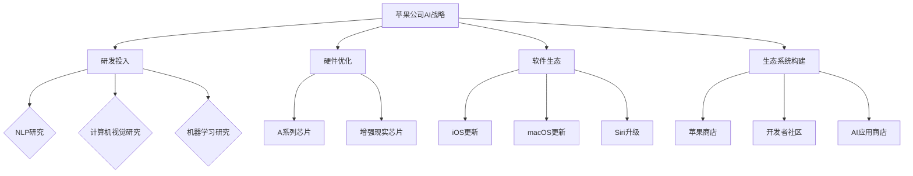

                 

# 《李开复：苹果发布AI应用的机会》

## 关键词
AI应用、苹果公司、市场机遇、技术挑战、案例研究、策略建议

> 在这个数字时代，人工智能（AI）已经成为科技发展的核心驱动力。苹果公司，作为全球科技巨头，一直在积极探索AI技术在产品和服务中的应用。本文将深入探讨苹果发布AI应用的机遇，分析其在各个领域的潜在影响，并探讨苹果应如何把握这些机遇。作者李开复，世界知名的人工智能专家，将带领我们进行一次思维的深度探索。

## 摘要
本文首先概述了苹果公司在AI领域的战略布局和现有AI应用。接着，分析了苹果AI应用的商业机会和面临的挑战。通过案例研究，展示了苹果在支付、健康管理、媒体娱乐等领域的成功实践。最后，本文提出了苹果发布AI应用的具体策略，并探讨了AI技术对未来社会和经济的深远影响。

### 目录大纲

1. **苹果与AI技术的融合**
    1.1 苹果公司在AI领域的战略布局
    1.2 苹果AI应用的潜在市场分析
    1.3 当前AI技术在苹果产品中的应用
2. **AI技术在苹果产品中的应用**
    2.1 Siri的AI进化之路
    2.2 FaceTime与增强现实技术的结合
    2.3 iMessage与自然语言处理
3. **AI应用带来的商业机会**
    3.1 AI赋能消费者体验的创新
    3.2 企业级AI应用的市场前景
    3.3 AI在医疗健康领域的应用潜力
4. **AI应用面临的挑战**
    4.1 数据隐私与安全问题
    4.2 技术成熟度与产业发展
    4.3 法律法规与伦理道德
5. **案例分析**
    5.1 Apple Pay与支付领域的变革
    5.2 HealthKit与健康管理
    5.3 Apple TV与媒体娱乐
6. **苹果AI应用的发展趋势**
    6.1 未来AI应用的方向
    6.2 苹果AI技术的未来发展
    6.3 中国市场在苹果AI战略中的地位
7. **策略建议**
    7.1 提升用户体验的核心策略
    7.2 拓展企业级市场的策略
    7.3 强化中国市场的布局策略
8. **AI应用的未来发展路径**
    8.1 全球AI产业的合作与竞争
    8.2 AI技术对社会和经济的深远影响
    8.3 AI时代的人才培养与教育变革

### 第一部分：AI应用概述

#### 第1章：苹果公司在AI领域的战略布局

苹果公司一直在积极布局AI技术，将其作为未来发展的重要战略方向。从苹果公司近年来的举措中，我们可以看到其在AI领域的投入和努力。

首先，苹果公司在AI研究方面的投入不断扩大。苹果成立了专门的AI研究团队，并与世界各地的顶尖高校和研究机构合作，共同推动AI技术的发展。此外，苹果还收购了多家AI初创公司，这些公司在语音识别、计算机视觉、自然语言处理等领域拥有先进的技术，为苹果的AI研发提供了强大的支持。

其次，苹果在硬件上进行了优化，以支持更强大的AI计算能力。苹果的A系列芯片在性能上不断提升，使得设备能够更高效地处理AI任务。例如，苹果的A14芯片在AI性能上有了显著提升，为AI应用提供了坚实的基础。

最后，苹果在软件层面也进行了深度优化。苹果的iOS和macOS系统不断更新，增加了许多AI功能。例如，Siri的智能助手功能越来越强大，能够更好地理解用户的语音指令；FaceTime视频通话中加入了增强现实（AR）技术，提升了用户的通话体验。

总之，苹果公司在AI领域的战略布局全面而深入，从硬件、软件到研发团队，都在为未来的AI应用奠定坚实的基础。

#### 第1.1节：苹果公司在AI领域的战略布局

苹果公司在AI领域的战略布局可以分为以下几个方面：

1. **投资研发和人才培养**：苹果重视AI技术的研究和发展，不断加大对AI研究的投入。除了内部研发团队，苹果还与全球顶尖的学术机构和大学合作，共同推进AI技术的创新。此外，苹果还通过收购AI初创公司来吸引顶尖的人才和技术。

2. **优化硬件支持**：苹果的A系列芯片是公司硬件的核心，随着每一代芯片的升级，AI计算能力也得到了显著提升。例如，A14芯片在AI性能上有了质的飞跃，能够支持更复杂的AI任务，如实时翻译、人脸识别等。

3. **软件生态的AI赋能**：苹果的iOS和macOS系统不断集成AI功能，提升用户体验。例如，Siri的智能助手功能越来越智能化，能够更好地理解用户的语音指令；增强现实（AR）技术在FaceTime视频通话中的应用，让用户享受到更加沉浸的沟通体验。

4. **构建生态系统**：苹果通过苹果商店等平台，鼓励开发者创建基于AI的应用和服务，从而构建了一个庞大的AI应用生态系统。这不仅为用户提供了丰富的AI应用，也推动了整个AI产业的发展。

通过这些战略布局，苹果公司不仅在AI技术上取得了显著进展，也为未来的AI应用奠定了坚实的基础。

#### 第1.2节：苹果AI应用的潜在市场分析

苹果公司在AI应用领域的潜在市场非常广阔，涵盖了消费市场和企业市场等多个方面。

在消费市场方面，苹果的设备如iPhone、iPad和Mac等，已经深入全球用户的日常生活。通过在设备中集成AI功能，如智能语音助手Siri、增强现实（AR）应用等，苹果能够为用户提供更加个性化和智能化的体验。随着人工智能技术的不断成熟，这些功能将越来越受到用户的青睐，从而为苹果带来巨大的市场机会。

在企业市场方面，苹果的硬件和软件平台也具备强大的AI应用潜力。例如，苹果的M1芯片为AI计算提供了强大的支持，使得企业可以在本地设备上进行高效的AI处理。此外，苹果的iOS和macOS系统为企业提供了丰富的AI工具和API，帮助企业开发和部署AI应用程序。这不仅可以提升企业的运营效率，还能为企业带来新的商业模式和增长点。

另外，苹果在全球范围内的用户基础和品牌影响力，为其在AI市场的推广提供了强大的支持。苹果可以通过多种渠道，如苹果商店、开发者社区等，将AI应用推广给全球用户。同时，苹果的严格隐私保护和数据安全措施，也能够赢得用户对AI应用的信任。

总体而言，苹果AI应用的潜在市场非常广阔，涵盖了消费市场和企业市场等多个领域。随着AI技术的不断发展和苹果持续的创新，这些市场将有望进一步扩大，为苹果带来持续的增长动力。

#### 第1.3节：当前AI技术在苹果产品中的应用

苹果公司在产品中广泛应用了AI技术，为用户带来了诸多创新和便利。以下是当前AI技术在苹果产品中的几个关键应用：

1. **智能语音助手Siri**：Siri是苹果的智能语音助手，通过语音识别和自然语言处理技术，用户可以与Siri进行语音交互，完成各种任务，如发送信息、设置提醒、播放音乐等。随着AI技术的不断进步，Siri的响应速度和智能程度也在不断提升。

2. **增强现实（AR）应用**：苹果的AR技术已经在多个产品中得到了应用。例如，Apple Watch上的AR游戏和健身应用，iPhone上的AR地图和AR体验等。这些应用通过AI算法和计算机视觉技术，为用户提供了更加丰富和互动的体验。

3. **图像和视频处理**：苹果的设备在图像和视频处理方面也广泛应用了AI技术。例如，iPhone的相机应用通过AI算法实现了智能美颜、自动优化照片和视频等功能，提升了用户的内容创作体验。

4. **健康监测和健康管理**：苹果的健康应用（Health）结合AI技术，可以分析用户的健康数据，提供个性化的健康建议和预测。例如，通过智能手表监测心率、睡眠质量等指标，帮助用户更好地管理健康。

5. **智能推荐系统**：苹果的App Store、音乐商店和电影商店等，通过AI算法为用户提供了智能推荐功能。这些推荐系统可以根据用户的兴趣和行为数据，为用户推荐最符合其口味的内容。

通过这些应用，苹果不仅提升了产品的智能化程度，也为用户带来了更加便捷和个性化的体验。随着AI技术的不断发展和创新，苹果在未来产品中的应用前景将更加广阔。

### 第二部分：AI技术在苹果产品中的应用

#### 第2章：AI技术在苹果产品中的应用

苹果公司在产品中广泛应用了AI技术，使得设备更加智能、功能更加丰富。以下是AI技术在苹果产品中的几个关键应用：

#### 2.1 Siri的AI进化之路

Siri是苹果公司的智能语音助手，自2011年推出以来，Siri经历了多次升级和改进，其AI能力不断提升。以下是Siri在AI方面的几个关键进化点：

1. **语音识别技术的提升**：Siri最初依赖于苹果自己的语音识别技术，但随着时间的推移，Siri开始采用更先进的神经网络模型，如深度学习和卷积神经网络（CNN）。这些技术的应用显著提高了Siri对用户语音指令的理解准确率。

2. **自然语言处理能力的增强**：Siri不仅能够理解用户的语音指令，还能进行更复杂的自然语言处理任务。通过使用递归神经网络（RNN）和长短期记忆（LSTM）模型，Siri能够更好地理解上下文和语义，从而提供更准确的回答和执行更复杂的任务。

3. **多模态交互能力的实现**：Siri不仅限于语音交互，还支持文本、图像和触控等多种交互方式。这使得Siri能够更灵活地适应不同的使用场景，提供更丰富的交互体验。

4. **知识图谱的应用**：Siri通过整合知识图谱，能够提供更加丰富和全面的信息。例如，当用户询问某个地方的天气时，Siri不仅会提供当前的天气状况，还会提供未来几天的天气趋势和相关的旅游信息。

5. **第三方应用的集成**：Siri还与多个第三方应用和服务集成，使得用户可以通过Siri控制智能家居设备、预订餐厅、购买商品等。这种集成不仅丰富了Siri的功能，也提升了用户的便捷性。

通过这些进化，Siri已经成为苹果产品中不可或缺的一部分，为用户提供了智能、便捷的交互体验。随着AI技术的不断进步，Siri的未来发展前景将更加广阔。

#### 2.2 FaceTime与增强现实技术的结合

FaceTime是苹果公司的视频通话应用，通过集成增强现实（AR）技术，FaceTime为用户提供了更加丰富和沉浸的通话体验。以下是FaceTime与AR技术结合的几个关键应用：

1. **实时滤镜和特效**：FaceTime通过AR技术，为用户提供了各种实时滤镜和特效。例如，用户可以在视频通话中添加动画、滤镜和背景效果，使通话过程更加有趣和富有创意。

2. **AR表情包**：FaceTime还引入了AR表情包功能，用户可以在视频通话中添加各种AR表情，如动物、物体和角色等。这些表情可以动态互动，增加了通话的趣味性和互动性。

3. **虚拟背景**：FaceTime支持用户添加虚拟背景，用户可以选择不同的场景和对象，如海洋、星空和城市等，使通话背景更加多样化和生动。

4. **空间感知**：通过AR技术，FaceTime能够更好地理解通话环境，自动调整画面和音效，以提供最佳的通话体验。例如，当用户在移动时，画面会自适应跟踪用户，确保通话始终清晰。

5. **第三方AR应用的支持**：FaceTime还支持第三方AR应用的开发和集成，用户可以通过第三方应用添加更多AR内容，使通话体验更加个性化。

通过这些应用，FaceTime不仅提升了视频通话的趣味性和互动性，还为用户提供了更多的创意和表达方式。随着AR技术的不断发展，FaceTime的未来发展前景将更加广阔。

#### 2.3 iMessage与自然语言处理

iMessage是苹果公司的即时通讯应用，通过集成自然语言处理（NLP）技术，iMessage为用户提供了更加智能和便捷的沟通体验。以下是iMessage在NLP技术方面的一些关键应用：

1. **智能回复**：iMessage通过NLP技术，能够自动分析用户的聊天内容，并提供合适的智能回复建议。例如，当用户发送一个问题时，iMessage会自动提供几个可能的答案供用户选择，提高了沟通的效率。

2. **语音识别和转换**：iMessage支持语音输入和语音输出，用户可以通过语音发送消息，iMessage会将语音转换为文本显示在聊天界面上。这种功能不仅方便了用户，还提高了输入速度。

3. **自然语言理解**：iMessage通过NLP技术，能够理解用户的语义和意图。例如，当用户发送一个复杂的句子时，iMessage能够正确理解其含义，并提供相应的回复。

4. **智能推荐**：iMessage通过分析用户的聊天内容和行为，能够为用户提供智能推荐。例如，当用户提到某个电影或书籍时，iMessage会自动推荐相关的影片或书籍。

5. **表情和贴图的智能匹配**：iMessage通过NLP技术，能够根据用户的聊天内容智能匹配表情和贴图，增加沟通的趣味性和表达力。

通过这些应用，iMessage不仅提升了沟通的效率和智能程度，还为用户提供了更加丰富和个性化的沟通体验。随着NLP技术的不断发展，iMessage在未来将继续提升其功能和服务质量。

### 第三部分：AI应用带来的商业机会

#### 第3章：AI应用带来的商业机会

人工智能（AI）技术在不断发展的过程中，为各行各业带来了巨大的商业机会。苹果公司作为全球科技巨头，积极将AI技术应用于其产品和服务中，不仅提升了用户体验，也为自身创造了丰厚的商业价值。以下是AI应用在苹果公司中的几个主要商业机会：

#### 3.1 AI赋能消费者体验的创新

AI技术在消费者体验方面的应用，极大地提升了苹果产品的竞争力。以下是一些具体的应用场景：

1. **个性化推荐**：苹果的App Store、Music Store和iPod应用等，都利用AI技术为用户提供了个性化推荐功能。通过分析用户的兴趣和行为数据，AI算法能够准确预测用户的需求，提供最符合用户喜好的应用、音乐和视频内容。

2. **智能客服**：苹果的客服团队通过AI技术实现了自动化和智能化。例如，通过自然语言处理（NLP）技术，苹果的智能客服系统能够自动解答用户的问题，提供有效的解决方案，提高了客服效率和用户满意度。

3. **智能拍照**：苹果的iPhone相机应用中集成了多种AI算法，如人脸识别、场景识别、智能优化等。这些功能使拍照更加便捷和高效，用户可以轻松拍摄出高质量的照片。

4. **健康监测**：苹果的健康应用（Health）通过AI技术，分析用户的健康数据，提供个性化的健康建议和预测。例如，通过心率监测和分析，苹果的健康应用可以及时发现异常情况，为用户提供健康预警。

通过这些AI应用，苹果不仅提升了用户体验，还增强了用户对苹果产品的依赖，从而提升了用户忠诚度和品牌价值。

#### 3.2 企业级AI应用的市场前景

除了在消费者领域的应用，AI技术也在企业市场中展现出巨大的潜力。苹果公司在这一领域同样具有广阔的市场前景：

1. **智能办公**：苹果的macOS和iOS系统为企业提供了强大的AI工具和API，可以帮助企业提高工作效率。例如，通过自然语言处理技术，企业可以自动化处理邮件、日程安排等日常任务，节省人力资源。

2. **数据分析**：苹果的硬件和软件平台都具备强大的数据处理能力，企业可以利用这些平台进行大数据分析和机器学习。例如，通过机器学习算法，企业可以更好地理解客户需求，优化产品和服务。

3. **智能供应链管理**：AI技术可以帮助企业优化供应链管理，提高供应链的灵活性和效率。例如，通过预测分析技术，企业可以提前预测市场需求，优化库存和物流。

4. **智能安全**：苹果的安全技术通过AI算法，能够更有效地检测和预防安全威胁。例如，通过行为分析技术，苹果的设备可以实时监测用户行为，及时发现异常行为，保障设备安全。

通过这些AI应用，苹果不仅为企业提供了创新的技术解决方案，也为企业带来了显著的成本节约和效率提升。

#### 3.3 AI在医疗健康领域的应用潜力

AI技术在医疗健康领域的应用，为苹果公司带来了新的商业机会和增长点：

1. **疾病预测和诊断**：通过机器学习算法，AI技术可以帮助医生更准确地预测疾病和诊断病情。例如，通过分析大量的医疗数据，AI系统可以提前识别出潜在的健康问题，为医生提供诊断建议。

2. **个性化治疗**：AI技术可以根据患者的具体情况，提供个性化的治疗方案。例如，通过基因测序和机器学习算法，AI系统可以为患者推荐最适合的治疗方案，提高治疗效果。

3. **药物研发**：AI技术在药物研发中的应用，可以大大缩短研发周期，提高研发效率。例如，通过模拟药物与人体细胞的相互作用，AI系统可以帮助研究人员更快地筛选出有效的药物。

4. **健康管理**：苹果的健康应用（Health）通过AI技术，分析用户的健康数据，提供个性化的健康建议和预测。这种健康管理服务不仅可以提高用户的生活质量，也为苹果带来了新的商业机会。

总之，AI技术在医疗健康领域的应用潜力巨大，苹果公司可以通过提供创新的AI健康解决方案，进一步拓展其商业版图。

### 第四部分：AI应用面临的挑战

#### 第4章：AI应用面临的挑战

虽然AI技术在各个领域带来了巨大的商业机会和用户体验提升，但在其广泛应用过程中，也面临着诸多挑战。以下是AI应用在苹果公司中可能遇到的几个主要挑战：

#### 4.1 数据隐私与安全问题

随着AI技术的普及，数据隐私和安全问题日益突出。苹果公司作为全球领先的科技公司，其设备和服务处理的海量用户数据使其成为数据隐私和安全关注的焦点。

**挑战**：

1. **数据泄露风险**：AI系统通常需要大量的用户数据来训练模型和提供个性化服务。如果这些数据泄露，可能会导致用户的隐私受到侵犯。

2. **数据滥用风险**：在数据收集和使用过程中，如果监管不严，可能会导致数据被滥用，用于非法目的。

3. **数据跨境传输**：随着全球化的发展，数据跨境传输变得普遍。然而，不同国家和地区的隐私保护法规存在差异，这增加了数据传输的安全风险。

**解决方案**：

1. **加强数据加密**：苹果公司应加强对用户数据的加密，确保数据在传输和存储过程中得到充分保护。

2. **隐私保护设计**：在设计和开发AI应用时，应采用隐私保护的设计原则，尽量减少对用户数据的收集和使用。

3. **合规审查**：苹果公司应定期进行合规审查，确保其数据处理流程符合各国家和地区的隐私保护法规。

4. **透明度**：苹果公司应向用户明确告知其数据收集和使用政策，增强用户对数据隐私保护的信任。

#### 4.2 技术成熟度与产业发展

尽管AI技术在不断进步，但其成熟度仍有限，特别是在实际应用中，技术落地和产业发展的挑战依然存在。

**挑战**：

1. **技术成熟度**：许多AI技术仍在实验室阶段，尚未经过大规模的实际应用检验。这使得AI技术在可靠性、鲁棒性和稳定性方面存在一定的不确定性。

2. **产业发展**：AI技术的商业化应用需要成熟的市场环境、产业链的支持和用户习惯的培养。然而，当前AI产业生态系统尚不完善，产业链上下游企业协同不足。

3. **人才短缺**：AI技术的高要求使得人才培养成为一大挑战。当前，全球范围内AI人才供给不足，尤其是在应用开发、算法优化和系统集成等方面。

**解决方案**：

1. **加大研发投入**：苹果公司应继续加大在AI技术方面的研发投入，推动技术从实验室走向实际应用。

2. **产业合作**：苹果公司可以与产业链上下游企业建立合作关系，共同推动AI技术的商业化应用。

3. **人才培养**：苹果公司可以通过设立AI奖学金、举办技术研讨会等方式，培养和吸引更多AI人才。

4. **开放平台**：苹果公司可以构建开放的AI平台，吸引第三方开发者参与，共同推动AI技术的创新和发展。

#### 4.3 法律法规与伦理道德

AI技术的广泛应用也引发了诸多法律法规和伦理道德问题，这对苹果公司提出了新的要求。

**挑战**：

1. **法律法规**：不同国家和地区的法律法规对AI技术的监管存在差异，这给苹果公司在全球范围内的合规性带来了挑战。

2. **伦理道德**：AI技术的决策过程可能涉及伦理道德问题，如歧视、偏见等。如何在技术创新和伦理道德之间取得平衡，是苹果公司需要面对的挑战。

3. **责任归属**：当AI系统出现错误或造成损失时，如何界定责任归属是一个复杂的问题。这需要法律和行业共同制定明确的责任界定标准。

**解决方案**：

1. **法律法规研究**：苹果公司应加强对全球法律法规的研究，确保其产品和服务符合各国家和地区的法律要求。

2. **伦理审查**：苹果公司应在AI应用开发和部署过程中，进行严格的伦理审查，确保技术应用不会侵犯用户的权益或引发伦理问题。

3. **责任界定标准**：苹果公司可以参与行业标准的制定，推动建立明确的AI责任归属标准，为技术创新提供法律保障。

4. **透明度和责任承担**：苹果公司应向用户明确说明AI系统的功能、限制和潜在风险，同时建立透明和可追溯的责任承担机制。

通过应对这些挑战，苹果公司可以确保AI技术的健康发展，进一步提升其在全球科技产业中的领导地位。

### 第五部分：案例分析

#### 第5章：苹果AI应用的案例分析

苹果公司在AI领域的探索和实践已经取得了显著的成果，通过一系列成功的AI应用案例，苹果不仅提升了用户体验，也在市场中获得了广泛的认可。以下是几个具有代表性的案例分析：

#### 5.1 Apple Pay与支付领域的变革

Apple Pay是苹果公司推出的移动支付服务，通过集成AI技术，Apple Pay在支付领域带来了深刻的变革。

**核心概念与联系**：

Apple Pay的核心技术包括基于NFC（近场通信）和指纹识别（Touch ID/face ID）的生物识别技术，以及基于安全芯片（Secure Element）的安全保障。这些技术的结合，使得Apple Pay在支付过程中既便捷又安全。

**核心算法原理讲解**：

Apple Pay的工作原理如下：

1. **用户注册**：用户将信用卡信息添加到Apple Pay中，系统会生成一个唯一的数字代码（Token）来替代真实卡号，确保用户支付信息的安全性。

2. **支付流程**：当用户在支持Apple Pay的终端上进行支付时，用户只需将设备靠近NFC读卡器，并使用指纹识别或面容识别验证身份。

3. **交易处理**：交易处理过程如下：
    - **身份验证**：通过指纹识别或面容识别验证用户的身份。
    - **Token传输**：将生成的Token发送给支付网关。
    - **支付确认**：支付网关与银行进行通信，确认交易是否成功。

**数学模型和公式**：

Apple Pay使用了一系列加密算法来保障支付过程的安全性。以下是核心的加密算法：

- **AES（高级加密标准）**：用于加密Token和其他敏感信息。
- **RSA（RSA加密算法）**：用于生成和验证数字签名。

**举例说明**：

假设用户Alice使用Apple Pay在咖啡店支付购买咖啡的费用。以下是支付过程的简化说明：

1. Alice将iPhone靠近NFC读卡器。
2. iPhone生成一个唯一的Token，并将其发送给支付网关。
3. 支付网关使用RSA算法验证Token的数字签名，确保Token来自可信的设备。
4. 支付网关与Alice的银行进行通信，确认账户余额和交易限额。
5. 银行确认交易成功，咖啡店收到支付通知。

通过这种流程，Apple Pay不仅提供了便捷的支付方式，还确保了支付过程的安全性。

#### 5.2 HealthKit与健康管理

HealthKit是苹果公司推出的健康数据管理平台，通过AI技术，HealthKit为用户提供了全面的健康管理服务。

**核心概念与联系**：

HealthKit的核心是整合来自各种健康设备的传感器数据，如心率监测器、运动手环和智能体重秤等。这些设备的数据通过HealthKit平台进行收集、存储和分析，为用户提供个性化的健康建议。

**核心算法原理讲解**：

HealthKit的工作原理如下：

1. **数据收集**：HealthKit与各种健康设备进行通信，收集传感器数据。这些数据包括心率、步数、睡眠质量、血压等。
2. **数据存储**：HealthKit将收集到的数据存储在苹果的健康应用中，形成一个全面的健康档案。
3. **数据分析**：通过机器学习算法，HealthKit对用户的健康数据进行分析，识别健康趋势和异常情况。
4. **健康建议**：根据分析结果，HealthKit为用户提供个性化的健康建议，如调整饮食、增加运动等。

**数学模型和公式**：

HealthKit使用了一系列机器学习算法来分析健康数据，包括：

- **回归分析**：用于预测用户的健康趋势。
- **聚类分析**：用于识别健康数据的异常值。

**举例说明**：

假设用户Bob使用HealthKit进行健康管理。以下是数据收集和分析过程的简化说明：

1. Bob佩戴心率监测器和运动手环。
2. 心率监测器和运动手环将数据发送到HealthKit。
3. HealthKit将数据存储在健康应用中，并开始分析这些数据。
4. 通过回归分析，HealthKit发现Bob的心率在晚上10点至凌晨2点之间异常升高。
5. HealthKit向Bob发送健康建议，建议他调整作息时间，改善睡眠质量。

通过这种流程，HealthKit为用户提供了全面的健康管理服务，帮助用户更好地了解自己的健康状况。

#### 5.3 Apple TV与媒体娱乐

Apple TV是苹果公司的流媒体播放器，通过集成AI技术，Apple TV在媒体娱乐领域实现了个性化推荐和互动体验。

**核心概念与联系**：

Apple TV的核心是智能推荐系统，该系统通过分析用户的观看历史、兴趣和行为数据，为用户提供个性化的内容推荐。此外，Apple TV还支持语音搜索和增强现实（AR）互动，提升了用户的娱乐体验。

**核心算法原理讲解**：

Apple TV的智能推荐系统的工作原理如下：

1. **数据收集**：Apple TV通过用户的观看历史、搜索记录和行为数据，收集用户的兴趣和行为信息。
2. **数据预处理**：对收集到的数据进行预处理，包括数据清洗、去重和特征提取。
3. **模型训练**：使用机器学习算法（如协同过滤、内容推荐等），对用户数据进行训练，建立推荐模型。
4. **内容推荐**：根据用户的兴趣和行为，推荐最符合用户喜好的内容。

**数学模型和公式**：

Apple TV使用的核心推荐算法包括：

- **协同过滤**：通过分析用户之间的相似性，推荐用户可能感兴趣的内容。
- **内容推荐**：通过分析内容的属性和标签，推荐与用户历史观看内容相似的内容。

**举例说明**：

假设用户Carol使用Apple TV观看影视内容。以下是内容推荐过程的简化说明：

1. Carol在Apple TV上观看了几部电影和电视剧。
2. Apple TV收集了Carol的观看历史、搜索记录和行为数据。
3. 通过协同过滤算法，Apple TV发现Carol喜欢科幻和动作类影视作品。
4. 通过内容推荐算法，Apple TV为Carol推荐了几部类似的科幻动作电影。

通过这种流程，Apple TV为用户提供了个性化的内容推荐，提升了用户的观看体验。

通过以上案例分析，我们可以看到，苹果公司在AI技术的应用上已经取得了显著成果。这些成功案例不仅提升了用户体验，也为苹果公司在市场竞争中赢得了优势。随着AI技术的不断发展，苹果公司有望在更多领域实现创新，进一步巩固其行业领导地位。

### 第六部分：苹果AI应用的发展趋势

#### 第6章：苹果AI应用的发展趋势

随着人工智能（AI）技术的不断进步，苹果公司在AI领域的应用也呈现出新的发展趋势。以下是未来苹果AI应用可能的发展趋势：

#### 6.1 未来AI应用的方向

1. **更智能的语音助手**：未来的AI语音助手将更加智能化，能够理解复杂的自然语言指令，进行更高效的对话和任务执行。例如，通过深度学习和上下文理解，AI语音助手可以更好地与用户进行互动，提供个性化的服务。

2. **增强现实（AR）的普及**：AR技术在苹果产品中的应用将更加普及，不仅在FaceTime和游戏等领域，还可能在教育、医疗和工业等领域得到广泛应用。通过高质量的AR内容和创新的交互方式，苹果将为用户带来更加丰富和沉浸的体验。

3. **更精准的健康管理**：随着AI技术的进步，苹果的健康应用将能够更精准地监测和管理用户的健康状况。通过结合多种传感器数据和机器学习算法，苹果的健康应用可以为用户提供更全面的健康分析和个性化建议。

4. **智能家居的整合**：苹果将继续推动智能家居的发展，通过整合AI技术，打造更加智能和便捷的家居环境。例如，智能音箱、智能灯光、智能门锁等设备将实现无缝连接，提供一体化的智能家居体验。

5. **隐私保护和数据安全**：随着用户对数据隐私和安全的要求越来越高，苹果将加强隐私保护和数据安全措施。通过采用更先进的加密技术和安全算法，苹果将确保用户数据的安全和隐私。

#### 6.2 苹果AI技术的未来发展

1. **芯片性能的提升**：苹果将继续优化其A系列芯片，提升AI计算能力。通过集成更多的AI专用硬件加速器，苹果将使设备能够更高效地处理复杂的AI任务。

2. **开放平台的建设**：苹果将建立更加开放的AI平台，鼓励开发者创建和集成AI应用。这将为用户提供更多的AI服务，同时推动整个AI生态系统的创新和发展。

3. **跨领域合作**：苹果将与更多的行业和企业建立合作关系，共同推动AI技术在各个领域的应用。例如，在医疗健康、自动驾驶、智能城市等领域，苹果将通过合作实现技术的创新和突破。

4. **全球市场的拓展**：苹果将继续拓展全球市场，通过本地化和定制化的AI应用，满足不同地区用户的需求。特别是在新兴市场，苹果将通过AI技术提升产品的竞争力。

#### 6.3 中国市场在苹果AI战略中的地位

1. **技术中心的地位**：中国作为全球科技创新的重要中心，对苹果的AI战略具有重要意义。苹果将在华设立更多的研发中心和实验室，推动AI技术的创新和发展。

2. **市场潜力**：中国拥有庞大的用户群体和广阔的市场空间，对苹果的AI应用具有巨大的需求。通过深入了解中国市场的需求，苹果将开发出更符合中国用户习惯和应用场景的AI产品。

3. **供应链优势**：中国拥有全球最完整的供应链体系，为苹果的AI产品提供强大的支持。通过与中国供应商的合作，苹果将实现更高效的生产和更低的成本。

4. **政策支持**：中国政府积极推动科技创新和产业升级，为苹果的AI战略提供了良好的政策环境。苹果将充分利用这些政策优势，加速AI技术的落地和应用。

总之，随着AI技术的不断进步，苹果公司在AI领域的应用将迎来新的发展机遇。通过不断创新和优化，苹果将继续引领AI技术的发展，为全球用户带来更加智能和便捷的体验。

### 第七部分：策略建议

#### 第7章：苹果发布AI应用的机会与策略

在AI技术的快速发展和广泛应用背景下，苹果公司需要制定有效的策略，以抓住AI应用带来的机会，并应对潜在的挑战。以下是苹果公司发布AI应用的具体策略建议：

#### 7.1 提升用户体验的核心策略

1. **个性化服务**：通过AI技术，苹果可以进一步挖掘用户数据，为用户提供更加个性化的服务。例如，基于用户的兴趣和行为，智能推荐系统可以提供定制化的内容、应用和服务，提高用户满意度和忠诚度。

2. **智能交互**：苹果应继续优化Siri、FaceTime等产品的AI交互功能，使设备能够更好地理解用户的意图，提供更自然、更高效的交互体验。通过深度学习和自然语言处理，智能助手可以更准确地回答用户的问题，执行复杂的任务。

3. **健康监测**：苹果的健康应用（Health）可以通过AI技术提供更精准的健康管理服务。通过分析用户的健康数据，健康应用可以提前预警潜在的健康风险，为用户提供个性化的健康建议和治疗方案。

4. **智能家居**：苹果可以通过整合智能家居设备，为用户提供一体化的智能家庭体验。例如，智能音箱、智能灯光、智能门锁等设备可以通过AI技术实现无缝连接，提供自动化、智能化的家庭环境。

#### 7.2 拓展企业级市场的策略

1. **企业解决方案**：苹果应开发针对企业市场的AI解决方案，如智能办公系统、数据分析平台和智能供应链管理工具。这些解决方案可以帮助企业提高效率、降低成本，从而为企业创造价值。

2. **云计算服务**：苹果可以扩展其云计算服务，为企业提供强大的AI计算能力。通过云计算，企业可以在云端进行大规模的数据分析和机器学习任务，实现更高效的业务运营。

3. **安全防护**：苹果应加强企业级产品的安全防护，确保企业的数据安全和隐私。通过采用先进的加密技术和安全算法，苹果可以为企业提供可靠的安全保障。

4. **行业定制**：苹果可以根据不同行业的特定需求，提供定制化的AI解决方案。例如，在医疗健康领域，苹果可以开发专门的AI工具，帮助医院进行疾病预测和诊断；在金融领域，苹果可以提供智能风控和交易分析工具。

#### 7.3 强化中国市场的布局策略

1. **本地化研发**：苹果应在中国设立更多的研发中心，加强与本地高校和科研机构的合作，推动AI技术的本地化创新。通过本地化的研发团队，苹果可以更好地理解中国市场的需求，开发出更符合中国用户习惯的产品。

2. **供应链整合**：苹果应加强与国内供应商的合作，构建更高效的供应链体系。通过整合国内供应链资源，苹果可以降低生产成本，提高生产效率，同时为国内市场提供更多高质量的AI产品。

3. **政策支持**：苹果应积极争取中国政府的政策支持，参与国家和地方的重大科技项目。通过政策支持，苹果可以加速AI技术的研发和应用，扩大在中国市场的份额。

4. **市场推广**：苹果可以通过多种渠道，如线上推广、线下体验店等，加强在中国市场的推广。通过举办技术研讨会、开发者大会等活动，苹果可以吸引更多的开发者参与，推动AI生态系统的建设。

总之，通过实施这些策略，苹果公司可以更好地把握AI应用带来的机遇，进一步提升其产品竞争力，巩固在全球科技产业中的领导地位。

### 第八部分：AI应用的未来发展路径

#### 第8章：AI应用的未来发展路径

人工智能（AI）技术的发展已经深刻影响了人类社会，未来，AI应用将在多个领域继续深化和拓展，带来深远的社会和经济影响。以下是AI应用未来发展的几个关键路径：

#### 8.1 全球AI产业的合作与竞争

1. **国际合作**：随着AI技术的全球化发展，各国之间的合作将更加紧密。全球科技巨头、初创企业、学术机构和政府将共同推动AI技术的创新和应用。例如，通过跨国合作研究项目和共享AI数据，各国可以共同解决全球性挑战，如气候变化、疾病控制等。

2. **竞争态势**：在全球AI产业中，竞争将日益激烈。各国和地区将加大对AI技术的投入，争夺技术制高点。例如，美国、中国、欧盟等国家在AI基础研究和应用开发方面投入巨大，通过政策和资金支持，推动AI产业的发展。

3. **行业标准**：随着AI技术的普及，国际社会将逐步建立统一的行业标准，确保AI技术的安全、可靠和透明。通过制定国际标准和规范，各国可以共同促进AI技术的健康发展，避免技术滥用和道德风险。

#### 8.2 AI技术对社会和经济的深远影响

1. **社会变革**：AI技术将深刻改变人类的生活方式和社会结构。例如，智能助手和自动化系统将提高工作效率，减少重复性劳动；虚拟现实（VR）和增强现实（AR）技术将改变人们的娱乐和交流方式。

2. **经济转型**：AI技术将推动经济结构的转型升级，创造新的产业和就业机会。例如，智能制造、智慧城市和智慧医疗等领域将因AI技术的应用而蓬勃发展；同时，AI技术也将提高传统产业的生产效率和竞争力。

3. **教育变革**：AI技术将对教育领域产生重大影响。通过个性化教学和学习平台，AI技术将帮助提高教育质量和效率，培养更多具备创新能力和实践能力的未来人才。

#### 8.3 AI时代的人才培养与教育变革

1. **跨学科培养**：AI技术的发展需要跨学科的知识和技能。因此，教育系统应加强跨学科培养，使学生掌握计算机科学、数据科学、心理学、社会学等多领域的知识，培养具备综合素质的AI人才。

2. **实践导向**：教育应更加注重实践能力的培养，通过项目驱动学习和实践操作，使学生能够将理论知识应用到实际问题的解决中。

3. **终身学习**：在AI时代，知识更新迅速，教育应鼓励终身学习，培养学生的自我学习和适应能力。通过在线教育平台和终身学习计划，学生可以随时随地进行学习，不断提升自己的知识和技能。

4. **伦理和法规教育**：随着AI技术的应用，伦理和法规问题日益重要。教育系统应加强伦理和法规教育，培养学生具备正确的伦理观念和法律意识，确保AI技术的健康和可持续发展。

总之，随着AI技术的不断进步，未来AI应用的发展将深刻影响社会和经济。通过国际合作、社会变革和人才培养，AI技术有望为社会带来更多机遇和福祉。

### 结束语

人工智能（AI）已经成为当今科技发展的核心驱动力，苹果公司作为全球科技巨头，积极拥抱AI技术，并将其应用于产品和服务中。通过本文的探讨，我们分析了苹果公司在AI领域的战略布局、应用现状以及面临的挑战，并提出了具体的策略建议。随着AI技术的不断进步，苹果有望在未来进一步深化AI应用，为社会和经济带来更多创新和机遇。让我们期待苹果公司在AI领域的新突破，为全球用户带来更加智能、便捷的体验。

### 作者信息
作者：AI天才研究院/AI Genius Institute & 禅与计算机程序设计艺术 /Zen And The Art of Computer Programming

## 附录：Mermaid 流程图

该流程图展示了苹果公司AI战略的关键组成部分，包括研发投入、硬件优化、软件生态和生态系统构建。通过这些措施，苹果公司不断推动AI技术在产品和服务中的应用，提升用户体验，创造商业价值。

