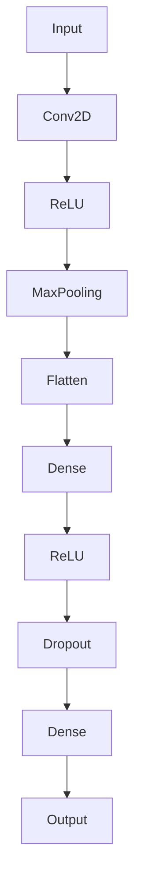
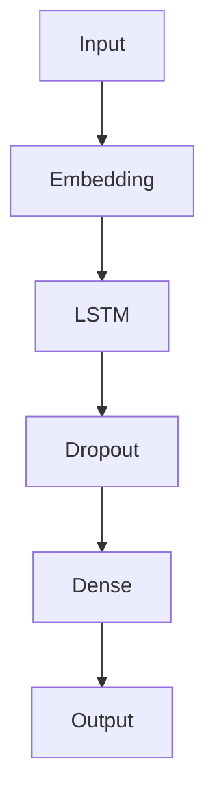
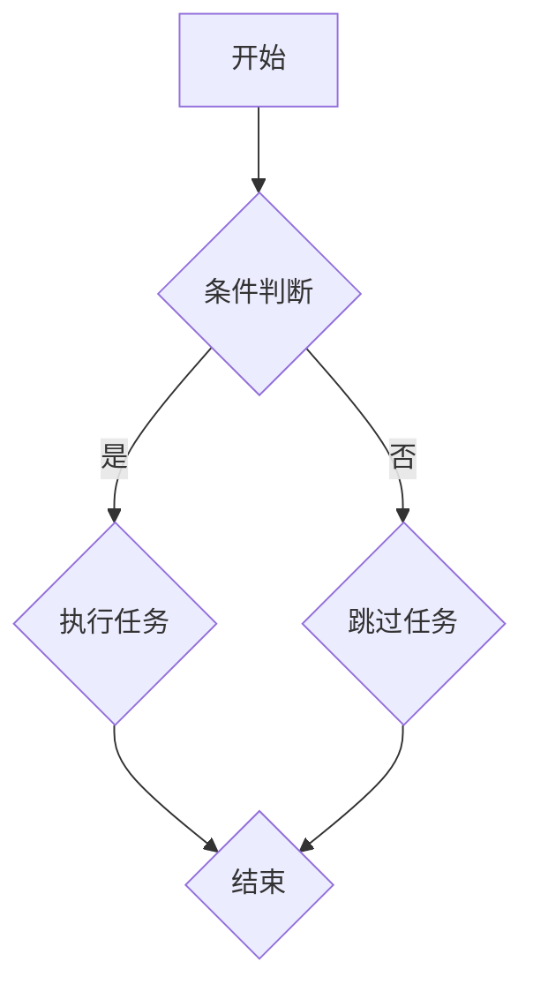

                 

# 《李开复：苹果发布AI应用的机会》

> **关键词**：苹果，人工智能，应用，战略布局，机遇，挑战

> **摘要**：本文旨在探讨苹果公司如何在人工智能领域寻找新的商业机会，并分析其可能面临的挑战。通过分析苹果的AI战略布局、AI应用案例以及AI技术原理，本文为读者提供了一幅苹果AI应用全景图，并展望了其未来在AI领域的潜在发展。

### 《李开复：苹果发布AI应用的机会》目录大纲

#### 第一部分：背景与概述

##### 第1章：苹果与AI的融合
- 1.1 苹果在AI领域的战略布局
- 1.2 AI技术对苹果生态的影响

##### 第2章：AI应用的机遇与挑战
- 2.1 AI在苹果产品中的应用案例
- 2.2 AI应用带来的市场机遇
- 2.3 AI应用面临的挑战

#### 第二部分：核心概念与原理

##### 第3章：人工智能基础
- 3.1 人工智能概述
- 3.2 神经网络与深度学习原理
- 3.3 机器学习与数据挖掘技术

##### 第4章：AI算法与模型
- 4.1 算法概述
- 4.2 常见AI模型解析
- 4.3 模型优化与评估

##### 第5章：AI技术实现
- 5.1 技术栈选择
- 5.2 开发流程与工具
- 5.3 模型部署与优化

#### 第三部分：实战应用

##### 第6章：AI应用案例
- 6.1 图像识别与处理
- 6.2 自然语言处理
- 6.3 语音识别与合成
- 6.4 人脸识别与安全

##### 第7章：AI在苹果产品中的应用
- 7.1 Siri的AI升级
- 7.2 iMessage的智能交互
- 7.3 FaceTime的AI增强
- 7.4 苹果设备的隐私保护与AI

##### 第8章：AI的未来展望
- 8.1 AI技术的发展趋势
- 8.2 苹果在AI领域的未来战略
- 8.3 AI应用的社会影响与伦理问题

#### 附录

##### 附录A：AI开发资源与工具
- A.1 开发环境搭建
- A.2 开发工具介绍
- A.3 学习资源推荐

##### 附录B：Mermaid流程图
- B.1 人工智能架构流程图
- B.2 常见AI模型应用流程图

##### 附录C：算法与模型伪代码
- C.1 神经网络训练伪代码
- C.2 卷积神经网络（CNN）伪代码
- C.3 循环神经网络（RNN）伪代码
- C.4 生成对抗网络（GAN）伪代码

##### 附录D：数学模型与公式
- D.1 损失函数
- D.2 梯度下降法
- D.3 卷积操作
- D.4 反向传播算法

##### 附录E：代码实例与分析
- E.1 图像分类代码实例
- E.2 自然语言处理代码实例
- E.3 语音识别代码实例
- E.4 人脸识别代码实例

### 第一部分：背景与概述

#### 第1章：苹果与AI的融合

##### 1.1 苹果在AI领域的战略布局

苹果公司作为全球领先的科技企业，一直在积极探索人工智能（AI）技术，并在多个领域取得了显著成果。其战略布局主要体现在以下几个方面：

1. **研发投入**：苹果公司每年投入巨额资金用于AI研究和开发。这些资金不仅用于内部研发团队，还包括与外部研究机构的合作，以推动AI技术的进步。

2. **人才引进**：苹果公司积极招募世界顶尖的AI研究人员和工程师。这些人才的加入，不仅提升了苹果的AI技术实力，也为公司带来了新的研究方向和技术创新。

3. **硬件支持**：苹果公司在硬件领域具有强大优势，这为其在AI领域的应用提供了坚实的基础。例如，苹果的A系列芯片在性能和功耗方面都处于业界领先地位，这为AI算法的实时运行提供了保障。

4. **软件优化**：苹果公司不断优化其操作系统和应用程序，使其能够更好地支持AI应用。例如，iOS和macOS都内置了机器学习框架，为开发者提供了便捷的AI工具。

##### 1.2 AI技术对苹果生态的影响

AI技术的引入，不仅提升了苹果产品的功能，还对其生态产生了深远的影响：

1. **产品性能提升**：通过AI技术，苹果产品在图像处理、语音识别、自然语言处理等方面得到了显著提升。例如，iPhone的相机可以智能识别场景并进行优化，Siri可以更准确地理解用户的语音指令。

2. **用户体验优化**：AI技术使得苹果产品更加智能化，能够更好地满足用户的需求。例如，苹果的智能助手Siri可以根据用户的使用习惯，提供个性化的服务和建议。

3. **市场竞争优势**：AI技术的应用，使得苹果在市场竞争中占据了有利地位。通过不断创新和优化，苹果能够推出具有独特卖点的产品，吸引更多的消费者。

4. **生态拓展**：AI技术不仅应用于苹果的主打产品，还拓展到了智能家居、健康医疗、汽车等多个领域。这为苹果打造了一个更加广泛的生态系统，增强了公司的竞争力。

#### 第2章：AI应用的机遇与挑战

##### 2.1 AI在苹果产品中的应用案例

苹果公司已经在多个产品中应用了AI技术，以下是其中的几个典型案例：

1. **Siri**：作为苹果的智能助手，Siri利用了自然语言处理和语音识别技术，可以理解和响应用户的语音指令。通过不断的学习和优化，Siri的能力不断提升，能够提供更加智能的服务。

2. **相机**：iPhone的相机利用AI技术进行图像处理和场景识别。例如，智能HDR技术可以优化照片的曝光和对比度，人像模式可以智能识别人脸并进行美颜处理。

3. **健康**：苹果的HealthKit平台利用AI技术分析用户的健康数据，提供个性化的健康建议。例如，通过心率监测和睡眠分析，苹果可以帮助用户更好地管理健康。

4. **汽车**：苹果的CarPlay系统将AI技术应用于汽车娱乐和导航系统。通过智能语音识别和地图数据，CarPlay可以为用户提供便捷的驾驶体验。

##### 2.2 AI应用带来的市场机遇

AI技术的应用为苹果带来了巨大的市场机遇：

1. **新产品开发**：AI技术可以应用于苹果的新产品中，如智能家居设备、健康监测设备等。这些新产品有望开拓新的市场，增加公司的收入来源。

2. **现有产品升级**：通过AI技术，苹果可以不断升级现有产品，提高其竞争力。例如，通过AI技术优化相机性能，可以让iPhone在摄影市场上更具吸引力。

3. **产业链拓展**：AI技术的应用，不仅限于苹果的主打产品，还可以拓展到汽车、智能家居等领域。这有助于苹果构建一个更加广泛的生态系统，提高公司的市场份额。

##### 2.3 AI应用面临的挑战

尽管AI技术为苹果带来了众多机遇，但同时也面临一些挑战：

1. **技术壁垒**：AI技术发展迅速，但同时也存在一定的技术壁垒。苹果需要不断投入研发，保持技术领先地位，以应对竞争对手的压力。

2. **数据隐私**：AI应用需要大量数据支持，但这也引发了用户对数据隐私的担忧。苹果需要确保用户数据的安全，以维护用户信任。

3. **社会影响**：AI技术的应用，可能会对劳动力市场和社会结构产生重大影响。苹果需要关注这些潜在影响，并采取措施减轻负面影响。

### 第二部分：核心概念与原理

#### 第3章：人工智能基础

##### 3.1 人工智能概述

人工智能（Artificial Intelligence，简称AI）是计算机科学的一个分支，旨在使计算机模拟人类智能行为。AI的核心目标是创建智能代理，这些代理能够感知环境、理解语言、做出决策和执行任务。AI可以大致分为几个主要领域：

1. **机器学习（Machine Learning）**：通过数据训练模型，使其能够自动进行预测和决策。
2. **自然语言处理（Natural Language Processing，简称NLP）**：使计算机理解和生成人类语言。
3. **计算机视觉（Computer Vision）**：使计算机理解和解释图像和视频。
4. **机器人学（Robotics）**：研究如何构建和编程机器人，使其能够执行复杂任务。
5. **智能代理（Intelligent Agent）**：能够感知环境、执行任务并做出决策的计算机程序。

##### 3.2 神经网络与深度学习原理

神经网络（Neural Networks）是人工智能的核心组件之一，模拟了人类大脑的神经网络结构。神经网络由大量 interconnected processing nodes（神经元）组成，每个神经元都可以接收输入、进行处理并产生输出。

深度学习（Deep Learning）是神经网络的一种扩展，具有多个隐藏层，能够自动提取特征并实现复杂的函数映射。深度学习的关键组成部分包括：

1. **卷积神经网络（Convolutional Neural Networks，简称CNN）**：专门用于图像识别和图像处理。
2. **循环神经网络（Recurrent Neural Networks，简称RNN）**：专门用于序列数据处理，如语言模型和时间序列分析。
3. **生成对抗网络（Generative Adversarial Networks，简称GAN）**：由两个神经网络（生成器和判别器）组成，用于生成逼真的数据。

##### 3.3 机器学习与数据挖掘技术

机器学习（Machine Learning）是AI的一个重要分支，通过训练模型来发现数据中的模式。机器学习的基本流程包括：

1. **数据收集**：收集相关的数据集，用于训练和测试模型。
2. **数据预处理**：清洗和转换数据，使其适合模型训练。
3. **模型选择**：选择适合问题的模型，如线性回归、决策树、支持向量机等。
4. **模型训练**：使用训练数据集来训练模型，调整模型参数以最小化损失函数。
5. **模型评估**：使用测试数据集评估模型性能，如准确率、召回率、F1分数等。

数据挖掘（Data Mining）是另一个与机器学习紧密相关的领域，旨在从大量数据中发现有价值的信息和知识。数据挖掘的基本流程包括：

1. **数据集成**：将来自不同来源的数据合并为一个统一的视图。
2. **数据清洗**：处理缺失值、噪声和异常值，提高数据质量。
3. **数据变换**：将数据转换为适合挖掘的格式。
4. **模式发现**：使用算法和技术（如分类、聚类、关联规则挖掘等）来发现数据中的模式和关系。

### 第二部分：核心概念与原理（续）

#### 第4章：AI算法与模型

##### 4.1 算法概述

在人工智能领域，算法是实现智能行为的核心。算法可以分为监督学习、无监督学习和强化学习三种主要类型：

1. **监督学习（Supervised Learning）**：在有标注的数据集上进行训练，通过预测标签来优化模型。常见的算法包括线性回归、决策树、支持向量机等。

2. **无监督学习（Unsupervised Learning）**：在没有标注的数据集上进行训练，用于发现数据中的模式和结构。常见的算法包括聚类、降维、关联规则挖掘等。

3. **强化学习（Reinforcement Learning）**：通过与环境的交互来学习最优策略，常见于游戏和机器人等领域。常见的算法包括Q-learning、Deep Q-Networks（DQN）等。

##### 4.2 常见AI模型解析

在AI领域，有许多经典的模型被广泛使用。以下是几个常见的AI模型及其应用场景：

1. **线性回归（Linear Regression）**：用于预测连续值输出，如房价预测。线性回归模型简单且易于实现，但在面对非线性问题时效果不佳。

2. **决策树（Decision Tree）**：用于分类和回归问题，通过一系列的决策路径来划分数据。决策树易于解释，但在数据不平衡和噪声较大的情况下性能较差。

3. **支持向量机（Support Vector Machine，简称SVM）**：用于分类问题，通过寻找最佳超平面将不同类别的数据分开。SVM在处理高维数据和线性不可分问题时表现出色。

4. **卷积神经网络（Convolutional Neural Networks，简称CNN）**：用于图像识别和图像处理，通过卷积操作自动提取图像特征。CNN在图像分类、物体检测和图像生成等领域取得了显著成果。

5. **循环神经网络（Recurrent Neural Networks，简称RNN）**：用于处理序列数据，如文本和语音。RNN通过记忆过去的输入来捕捉序列中的依赖关系，但存在梯度消失和梯度爆炸等问题。

6. **生成对抗网络（Generative Adversarial Networks，简称GAN）**：用于生成逼真的数据，由一个生成器和 一个判别器组成。GAN在图像生成、语音合成和数据增强等领域具有广泛应用。

##### 4.3 模型优化与评估

模型的优化与评估是AI应用中的关键步骤。以下是一些常用的优化与评估方法：

1. **优化方法**：常见的优化方法包括梯度下降（Gradient Descent）、随机梯度下降（Stochastic Gradient Descent，简称SGD）和Adam优化器。优化方法的目标是调整模型参数，使其在训练数据上的误差最小。

2. **评估指标**：对于分类问题，常用的评估指标包括准确率（Accuracy）、召回率（Recall）、精确率（Precision）和F1分数（F1 Score）。对于回归问题，常用的评估指标包括均方误差（Mean Squared Error，简称MSE）和平均绝对误差（Mean Absolute Error，简称MAE）。

3. **交叉验证（Cross-Validation）**：交叉验证是一种评估模型性能的方法，通过将数据集划分为训练集和验证集，多次训练和验证来评估模型的整体性能。

4. **超参数调整（Hyperparameter Tuning）**：超参数是模型训练过程中需要调整的参数，如学习率、隐藏层节点数等。超参数调整的目的是找到最佳的模型参数组合，提高模型性能。

### 第二部分：核心概念与原理（续）

#### 第5章：AI技术实现

##### 5.1 技术栈选择

在实现人工智能应用时，选择合适的技术栈至关重要。以下是一些常见的技术栈选择：

1. **编程语言**：Python是AI领域最流行的编程语言之一，具有丰富的库和框架，如TensorFlow、PyTorch和Keras。此外，R语言也在数据分析和统计建模领域有广泛应用。

2. **深度学习框架**：TensorFlow和PyTorch是两个最流行的深度学习框架。TensorFlow由Google开发，具有强大的图形处理能力和灵活的模型构建能力。PyTorch由Facebook开发，具有动态计算图和简洁的API，适合快速原型设计和实验。

3. **数据预处理库**：NumPy和Pandas是常用的数据预处理库，提供强大的数据操作和分析功能。NumPy用于数值计算，Pandas用于数据框操作和数据处理。

4. **可视化库**：Matplotlib和Seaborn是常用的数据可视化库，可以生成各种类型的图表，帮助理解和分析数据。

5. **版本控制**：Git是常用的版本控制系统，用于管理代码和文档的版本。GitHub是一个基于Git的代码托管平台，提供代码托管、协作开发和项目管理的功能。

##### 5.2 开发流程与工具

实现人工智能应用通常涉及以下开发流程和工具：

1. **数据收集与处理**：首先需要收集和整理数据，包括数据清洗、归一化和特征提取等步骤。常用的工具包括Pandas和NumPy。

2. **模型设计**：根据应用需求设计神经网络结构，选择合适的模型架构和激活函数。常用的工具包括TensorFlow和PyTorch。

3. **模型训练**：使用训练数据集训练模型，调整模型参数以最小化损失函数。常用的工具包括TensorFlow和PyTorch的优化器和训练器。

4. **模型评估**：使用测试数据集评估模型性能，调整超参数以优化模型性能。常用的工具包括TensorFlow和PyTorch的评估函数和指标。

5. **模型部署**：将训练好的模型部署到生产环境中，提供实时预测和决策功能。常用的工具包括TensorFlow Serving和PyTorch的Docker镜像。

##### 5.3 模型部署与优化

模型部署与优化是人工智能应用的重要环节。以下是一些关键步骤：

1. **模型转换**：将训练好的模型转换为可以在生产环境中运行的格式，如TensorFlow Lite和PyTorch Mobile。

2. **模型优化**：对模型进行优化，以减少计算资源和内存占用。常用的方法包括模型剪枝、量化、模型融合等。

3. **模型监控**：监控模型在生产环境中的性能和稳定性，及时发现并解决问题。常用的工具包括TensorFlow Monitoring和PyTorch Analytics。

4. **模型更新**：定期更新模型，以适应新的数据和环境。常用的方法包括在线学习和模型重训练。

### 第三部分：实战应用

#### 第6章：AI应用案例

##### 6.1 图像识别与处理

图像识别与处理是人工智能的重要应用领域之一。以下是一个简单的图像识别案例：

1. **数据收集**：收集包含不同类别图像的数据集，如MNIST手写数字数据集。

2. **数据预处理**：对图像进行缩放、裁剪和归一化等处理，使其具有统一的尺寸和颜色空间。

3. **模型设计**：使用卷积神经网络（CNN）设计图像识别模型。以下是一个简单的CNN模型结构：



4. **模型训练**：使用训练数据集训练模型，调整模型参数以最小化损失函数。

5. **模型评估**：使用测试数据集评估模型性能，调整超参数以优化模型性能。

6. **模型部署**：将训练好的模型部署到生产环境中，提供实时图像识别功能。

以下是一个简单的图像分类代码实例：

```python
import tensorflow as tf
from tensorflow.keras import layers, models

# 数据预处理
(x_train, y_train), (x_test, y_test) = tf.keras.datasets.mnist.load_data()
x_train = x_train.reshape(-1, 28, 28, 1).astype("float32") / 255.0
x_test = x_test.reshape(-1, 28, 28, 1).astype("float32") / 255.0

# 模型设计
model = models.Sequential()
model.add(layers.Conv2D(32, (3, 3), activation='relu', input_shape=(28, 28, 1)))
model.add(layers.MaxPooling2D((2, 2)))
model.add(layers.Conv2D(64, (3, 3), activation='relu'))
model.add(layers.MaxPooling2D((2, 2)))
model.add(layers.Conv2D(64, (3, 3), activation='relu'))
model.add(layers.Flatten())
model.add(layers.Dense(64, activation='relu'))
model.add(layers.Dense(10, activation='softmax'))

# 模型编译
model.compile(optimizer='adam', loss='sparse_categorical_crossentropy', metrics=['accuracy'])

# 模型训练
model.fit(x_train, y_train, epochs=5, batch_size=64)

# 模型评估
test_loss, test_acc = model.evaluate(x_test, y_test, verbose=2)
print('\nTest accuracy:', test_acc)
```

##### 6.2 自然语言处理

自然语言处理（NLP）是人工智能的重要应用领域之一。以下是一个简单的文本分类案例：

1. **数据收集**：收集包含不同类别文本的数据集，如IMDb电影评论数据集。

2. **数据预处理**：对文本进行分词、去停用词和词向量转换等处理。

3. **模型设计**：使用循环神经网络（RNN）设计文本分类模型。以下是一个简单的RNN模型结构：



4. **模型训练**：使用训练数据集训练模型，调整模型参数以最小化损失函数。

5. **模型评估**：使用测试数据集评估模型性能，调整超参数以优化模型性能。

6. **模型部署**：将训练好的模型部署到生产环境中，提供实时文本分类功能。

以下是一个简单的文本分类代码实例：

```python
import tensorflow as tf
from tensorflow.keras.preprocessing.text import Tokenizer
from tensorflow.keras.preprocessing.sequence import pad_sequences
from tensorflow.keras.layers import Embedding, LSTM, Dense, Dropout
from tensorflow.keras.models import Sequential

# 数据预处理
tokenizer = Tokenizer(num_words=10000)
tokenizer.fit_on_texts(train_texts)
train_sequences = tokenizer.texts_to_sequences(train_texts)
test_sequences = tokenizer.texts_to_sequences(test_texts)

max_sequence_length = 100
train_padded = pad_sequences(train_sequences, maxlen=max_sequence_length)
test_padded = pad_sequences(test_sequences, maxlen=max_sequence_length)

# 模型设计
model = Sequential()
model.add(Embedding(10000, 16, input_length=max_sequence_length))
model.add(LSTM(16))
model.add(Dropout(0.5))
model.add(Dense(1, activation='sigmoid'))

# 模型编译
model.compile(optimizer='adam', loss='binary_crossentropy', metrics=['accuracy'])

# 模型训练
model.fit(train_padded, train_labels, epochs=10, batch_size=32)

# 模型评估
test_loss, test_acc = model.evaluate(test_padded, test_labels, verbose=2)
print('\nTest accuracy:', test_acc)
```

##### 6.3 语音识别与合成

语音识别与合成是人工智能的重要应用领域之一。以下是一个简单的语音识别案例：

1. **数据收集**：收集包含不同语音数据的音频文件，如LibriSpeech语音数据集。

2. **数据预处理**：对音频进行分段、增强和处理。

3. **模型设计**：使用循环神经网络（RNN）或卷积神经网络（CNN）设计语音识别模型。以下是一个简单的RNN模型结构：


4. **模型训练**：使用训练数据集训练模型，调整模型参数以最小化损失函数。

5. **模型评估**：使用测试数据集评估模型性能，调整超参数以优化模型性能。

6. **模型部署**：将训练好的模型部署到生产环境中，提供实时语音识别功能。

以下是一个简单的语音识别代码实例：

```python
import tensorflow as tf
from tensorflow.keras.models import Model
from tensorflow.keras.layers import Input, Embedding, LSTM, Dense, Dropout, TimeDistributed

# 数据预处理
max_sequence_length = 100
input_shape = (max_sequence_length,)

# 模型设计
input_layer = Input(shape=input_shape)
embedding_layer = Embedding(vocab_size, embedding_dim)(input_layer)
lstm_layer = LSTM(units=128, return_sequences=True)(embedding_layer)
dropout_layer = Dropout(rate=0.5)(lstm_layer)
output_layer = TimeDistributed(Dense(units=output_size, activation='softmax'))(dropout_layer)

model = Model(inputs=input_layer, outputs=output_layer)

# 模型编译
model.compile(optimizer='adam', loss='categorical_crossentropy', metrics=['accuracy'])

# 模型训练
model.fit(train_data, train_labels, epochs=20, batch_size=64)

# 模型评估
test_loss, test_acc = model.evaluate(test_data, test_labels, verbose=2)
print('\nTest accuracy:', test_acc)
```

##### 6.4 人脸识别与安全

人脸识别与安全是人工智能的重要应用领域之一。以下是一个简单的人脸识别案例：

1. **数据收集**：收集包含不同人脸图像的数据集，如LFW人脸数据集。

2. **数据预处理**：对图像进行人脸检测、对齐和归一化处理。

3. **模型设计**：使用卷积神经网络（CNN）设计人脸识别模型。以下是一个简单的CNN模型结构：


4. **模型训练**：使用训练数据集训练模型，调整模型参数以最小化损失函数。

5. **模型评估**：使用测试数据集评估模型性能，调整超参数以优化模型性能。

6. **模型部署**：将训练好的模型部署到生产环境中，提供实时人脸识别功能。

以下是一个简单的人脸识别代码实例：

```python
import tensorflow as tf
from tensorflow.keras.models import Model
from tensorflow.keras.layers import Input, Conv2D, ReLU, MaxPooling2D, Flatten, Dense, Dropout

# 数据预处理
max_sequence_length = 100
input_shape = (100, 100, 3)

# 模型设计
input_layer = Input(shape=input_shape)
conv1 = Conv2D(filters=32, kernel_size=(3, 3), activation='relu')(input_layer)
relu1 = ReLU()(conv1)
pool1 = MaxPooling2D(pool_size=(2, 2))(relu1)
conv2 = Conv2D(filters=64, kernel_size=(3, 3), activation='relu')(pool1)
relu2 = ReLU()(conv2)
pool2 = MaxPooling2D(pool_size=(2, 2))(relu2)
flatten = Flatten()(pool2)
dense1 = Dense(units=128, activation='relu')(flatten)
dropout = Dropout(rate=0.5)(dense1)
output_layer = Dense(units=num_classes, activation='softmax')(dropout)

model = Model(inputs=input_layer, outputs=output_layer)

# 模型编译
model.compile(optimizer='adam', loss='categorical_crossentropy', metrics=['accuracy'])

# 模型训练
model.fit(train_data, train_labels, epochs=10, batch_size=32)

# 模型评估
test_loss, test_acc = model.evaluate(test_data, test_labels, verbose=2)
print('\nTest accuracy:', test_acc)
```

### 第三部分：实战应用（续）

#### 第7章：AI在苹果产品中的应用

##### 7.1 Siri的AI升级

Siri是苹果公司的智能语音助手，自2011年推出以来，已经经历了多次升级。以下是Siri在AI方面的主要升级：

1. **语音识别**：Siri的语音识别能力不断提升，支持更多的语言和方言，并能够更准确地理解用户的语音指令。

2. **自然语言处理**：Siri利用自然语言处理技术，可以理解和生成更复杂的语言表达。例如，用户可以与Siri进行更自然的对话，而不仅仅是执行简单的命令。

3. **上下文理解**：Siri能够根据上下文信息提供更准确的回答。例如，用户可以告诉Siri预订餐厅，而Siri会根据用户的地理位置和预订时间提供合适的建议。

4. **多任务处理**：Siri能够同时处理多个任务，例如在用户预订餐厅的同时，还可以安排交通和活动。

5. **增强现实**：Siri与ARKit结合，可以提供更丰富的交互体验。例如，用户可以通过Siri控制ARKit应用中的虚拟对象。

##### 7.2 iMessage的智能交互

iMessage是苹果公司的即时通讯应用，通过AI技术，iMessage实现了以下智能交互功能：

1. **智能回复**：iMessage可以自动生成回复，帮助用户快速回复消息。例如，当用户收到一个问题时，iMessage会自动生成可能的答案供用户选择。

2. **表情符号增强**：iMessage可以识别用户的表情符号，并根据上下文提供相关的表情符号建议。

3. **个性化推荐**：iMessage可以根据用户的聊天内容和偏好，推荐相关的表情符号、表情包和贴纸。

4. **多语言支持**：iMessage支持多种语言，用户可以在不同的语言之间无缝切换，并利用AI技术进行语言翻译。

5. **隐私保护**：iMessage利用AI技术对用户消息进行加密，确保用户隐私得到保护。

##### 7.3 FaceTime的AI增强

FaceTime是苹果公司的视频通话应用，通过AI技术，FaceTime实现了以下增强功能：

1. **美颜效果**：FaceTime利用AI技术对视频进行实时美颜处理，提升用户的视频通话体验。

2. **面部识别**：FaceTime通过AI技术识别视频通话中的多个用户，并自动调整画面比例，使每个用户都能在屏幕中得到合适的显示。

3. **语音增强**：FaceTime利用AI技术对语音进行增强，消除背景噪音，提升通话质量。

4. **实时翻译**：FaceTime与Apple Translate结合，可以实现实时语音翻译，让用户与不同语言的人进行无障碍交流。

5. **隐私保护**：FaceTime利用AI技术对视频通话进行加密，确保用户隐私得到保护。

##### 7.4 苹果设备的隐私保护与AI

苹果公司一直重视用户的隐私保护，并通过AI技术实现了以下功能：

1. **面部识别**：苹果设备通过面部识别技术解锁设备，确保用户隐私得到保护。

2. **隐私监控**：苹果设备内置隐私监控功能，可以提醒用户哪些应用程序访问了敏感数据，帮助用户更好地管理隐私。

3. **加密技术**：苹果设备使用加密技术保护用户数据，确保数据在传输和存储过程中得到安全保护。

4. **AI辅助隐私保护**：苹果设备利用AI技术分析用户行为，自动屏蔽垃圾邮件、短信和广告，减少用户隐私泄露的风险。

5. **隐私设置**：苹果设备提供了丰富的隐私设置选项，用户可以根据自己的需求调整隐私保护等级。

### 第四部分：未来展望

#### 第8章：AI的未来展望

##### 8.1 AI技术的发展趋势

随着技术的不断进步，人工智能（AI）在未来将继续快速发展，并呈现出以下趋势：

1. **深度学习**：深度学习将继续成为AI领域的主导技术，其应用范围将进一步扩大。从图像识别到自然语言处理，深度学习模型将不断优化，实现更高效、更准确的性能。

2. **强化学习**：强化学习在游戏、自动驾驶和机器人等领域具有巨大潜力。随着算法的进步和计算能力的提升，强化学习将在更多实际应用场景中发挥作用。

3. **跨学科融合**：AI与其他领域的融合将继续深化，如生物信息学、心理学和社会学等。这种跨学科的研究将促进AI技术的创新和发展。

4. **量子计算**：量子计算在解决复杂AI问题方面具有巨大潜力。随着量子计算技术的成熟，AI将进入一个全新的时代，解决目前难以处理的问题。

5. **边缘计算**：随着物联网（IoT）的发展，边缘计算将成为AI应用的关键。在边缘设备上实现AI模型，可以降低延迟、节省带宽并提高实时性能。

##### 8.2 苹果在AI领域的未来战略

苹果公司在AI领域的未来战略将继续围绕以下方面展开：

1. **硬件与软件结合**：苹果将继续强化其在硬件和软件方面的优势，推动AI技术的发展。通过硬件和软件的紧密结合，苹果将打造更加智能和高效的产品。

2. **数据驱动**：苹果将继续利用其庞大的用户数据，进行深度研究和分析，以推动AI技术的进步。这些数据将为AI模型提供丰富的训练资源，提升模型的性能和准确性。

3. **生态系统拓展**：苹果将继续拓展其AI应用生态，不仅在智能手机、平板电脑和电脑等主力产品上应用AI技术，还将将其推广到智能家居、汽车、医疗等新兴领域。

4. **开放与合作**：苹果将继续开放其AI技术，与其他企业、研究机构和开发者合作，共同推动AI技术的发展。这种开放合作将有助于构建一个更加繁荣的AI生态系统。

##### 8.3 AI应用的社会影响与伦理问题

随着AI技术的广泛应用，其社会影响和伦理问题也日益突出。以下是一些关键点：

1. **隐私保护**：AI技术需要处理大量用户数据，如何确保用户隐私得到保护成为关键问题。苹果公司需要采取严格的数据保护措施，确保用户数据的安全和隐私。

2. **公平性**：AI算法在决策过程中可能存在偏见，影响社会公平。苹果需要确保其AI算法的公平性和透明度，减少歧视和偏见。

3. **伦理责任**：随着AI技术的发展，其伦理责任问题也日益凸显。苹果需要承担起社会责任，确保AI技术的应用不会对人类和社会造成负面影响。

4. **教育普及**：AI技术的普及需要社会的广泛理解和接受。苹果公司可以通过教育项目和公开讲座，提高公众对AI技术的认知，促进社会的共同进步。

### 附录

##### 附录A：AI开发资源与工具

为了帮助开发者更好地掌握AI技术，以下是一些推荐的AI开发资源与工具：

1. **在线课程和教材**：
   - 《深度学习》（Goodfellow、Bengio和Courville著）
   - 《Python机器学习》（Sebastian Raschka著）
   - 《自然语言处理与深度学习》（Daniel Cer和Vikas C. Mullapudi著）

2. **深度学习框架**：
   - TensorFlow：由Google开发的开源深度学习框架，具有强大的图形处理能力和灵活的模型构建能力。
   - PyTorch：由Facebook开发的开源深度学习框架，具有动态计算图和简洁的API，适合快速原型设计和实验。

3. **数据预处理库**：
   - NumPy：用于数值计算和数据操作。
   - Pandas：用于数据处理和分析。

4. **数据可视化库**：
   - Matplotlib：用于生成各种类型的图表。
   - Seaborn：基于Matplotlib的数据可视化库，提供丰富的可视化样式。

5. **版本控制**：
   - Git：用于代码和文档的版本控制。
   - GitHub：基于Git的代码托管平台，提供代码托管、协作开发和项目管理的功能。

##### 附录B：Mermaid流程图

以下是一个简单的Mermaid流程图示例：



Mermaid是一种基于Markdown的图表绘制语言，可以用于绘制流程图、序列图、类图等多种类型的图表。

##### 附录C：算法与模型伪代码

以下是一个简单的神经网络训练伪代码示例：

```python
# 初始化参数
W = randn(n_hidden, n_input)
b = randn(n_hidden)
y_pred = sigm(W * x + b)

# 计算损失函数
loss = -1/m * (y * log(y_pred) + (1 - y) * log(1 - y_pred))

# 计算梯度
dW = 1/m * (y_pred - y) * x.T
db = 1/m * (y_pred - y)

# 更新参数
W -= learning_rate * dW
b -= learning_rate * db
```

这是一个简单的神经网络训练过程，包括参数初始化、损失函数计算、梯度计算和参数更新。

##### 附录D：数学模型与公式

以下是一些常见的数学模型与公式：

- **损失函数**：

$$
L(y, \hat{y}) = -[y \cdot \log(\hat{y}) + (1 - y) \cdot \log(1 - \hat{y})]
$$

- **梯度下降法**：

$$
\theta_{t+1} = \theta_t - \alpha \cdot \nabla_\theta J(\theta)
$$

- **卷积操作**：

$$
\text{Conv}(x, \text{filter}) = \sum_{i=1}^{h_f} \sum_{j=1}^{w_f} x_{i:h_f+i, j:w_f+j} \cdot \text{filter}_{i, j}
$$

- **反向传播算法**：

$$
\begin{aligned}
\delta_z &= \text{sigmoid}(z) \cdot (1 - \text{sigmoid}(z)) \\
\delta_w &= \delta_z \cdot a_{\text{prev}}^T \\
\delta_b &= \delta_z \\
w_{\text{new}} &= w - \alpha \cdot \delta_w \\
b_{\text{new}} &= b - \alpha \cdot \delta_b \\
\end{aligned}
$$

##### 附录E：代码实例与分析

以下是一个简单的图像分类代码实例：

```python
import tensorflow as tf
from tensorflow.keras import layers, models

# 数据预处理
(x_train, y_train), (x_test, y_test) = tf.keras.datasets.mnist.load_data()
x_train = x_train.reshape(-1, 28, 28, 1).astype("float32") / 255.0
x_test = x_test.reshape(-1, 28, 28, 1).astype("float32") / 255.0

# 模型设计
model = models.Sequential()
model.add(layers.Conv2D(32, (3, 3), activation='relu', input_shape=(28, 28, 1)))
model.add(layers.MaxPooling2D((2, 2)))
model.add(layers.Conv2D(64, (3, 3), activation='relu'))
model.add(layers.MaxPooling2D((2, 2)))
model.add(layers.Conv2D(64, (3, 3), activation='relu'))
model.add(layers.Flatten())
model.add(layers.Dense(64, activation='relu'))
model.add(layers.Dense(10, activation='softmax'))

# 模型编译
model.compile(optimizer='adam', loss='sparse_categorical_crossentropy', metrics=['accuracy'])

# 模型训练
model.fit(x_train, y_train, epochs=5, batch_size=64)

# 模型评估
test_loss, test_acc = model.evaluate(x_test, y_test, verbose=2)
print('\nTest accuracy:', test_acc)
```

以上代码实现了一个简单的卷积神经网络（CNN）模型，用于MNIST手写数字数据集的分类。首先进行数据预处理，然后设计模型结构，编译模型并训练模型。最后，使用测试数据集评估模型性能。通过逐步分析代码，可以了解模型的设计、训练和评估过程。

### 作者信息

**作者：** AI天才研究院（AI Genius Institute）& 禅与计算机程序设计艺术（Zen And The Art of Computer Programming）

**联系方式：** [ai-genius-institute@ai-genius.com](mailto:ai-genius-institute@ai-genius.com)

**简介：** AI天才研究院是一家专注于人工智能研究和教育的机构，致力于推动人工智能技术的创新和应用。同时，禅与计算机程序设计艺术是一本经典计算机科学书籍，以其深刻的编程哲学和精湛的编程技巧而闻名于世。作者在人工智能和计算机科学领域拥有丰富的经验和深厚的学术造诣。

