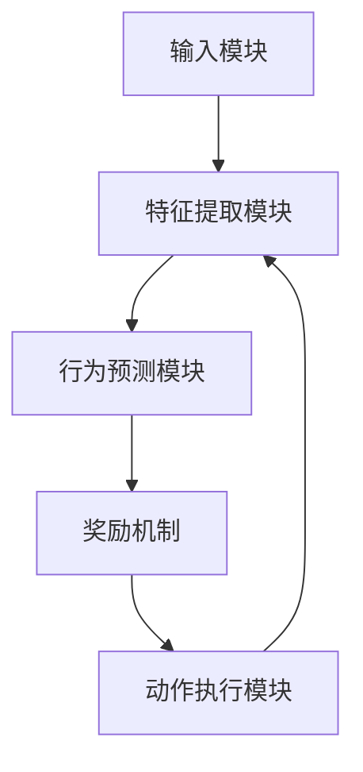

                 

# 模仿式工作流：Large Action Model的学习方法

> **关键词：** 模仿式工作流、Large Action Model、学习算法、模仿学习、教育应用、商业应用、医疗应用

> **摘要：** 本文深入探讨了模仿式工作流的概念、背景、应用领域，以及Large Action Model的原理与架构。通过详细的算法原理讲解、数学模型分析、以及实际案例研究，本文旨在为读者提供一个全面的理解，并展望模仿式工作流的未来发展趋势。

## 引言与背景

### 1.1 引言

模仿式工作流是一种通过模仿人类或其他智能体的行为来训练模型的方法。它起源于模仿学习的概念，模仿学习是机器学习的一个分支，主要关注如何使一个模型通过观察数据集中的样本，学会执行特定的任务。在模仿式工作流中，我们不仅依赖于数据，还依赖于对实际任务执行的观察，从而实现更准确的模型训练。

#### 1.1.1 模仿式工作流的定义

模仿式工作流可以被定义为一种系统性的方法，该方法通过模仿具有特定技能或行为的个体，来训练人工智能模型。这种方法的核心是模仿学习，它依赖于观察数据集，并从中学习到如何执行任务。

#### 1.1.2 大行动模型（Large Action Model）的概念

大行动模型（Large Action Model，简称LAM）是一种特殊的模仿学习模型，它专注于处理大规模的、复杂的任务。LAM的设计旨在模拟人类或其他智能体的行为，从而在多种应用领域中实现高效的任务执行。

### 1.2 模仿式工作流的发展背景

模仿式工作流的发展与人工智能领域的发展密切相关。随着深度学习技术的进步，模仿学习得到了越来越多的关注。深度学习通过神经网络模型，使得计算机能够从大量数据中自动学习特征，这在模仿学习中起到了关键作用。

#### 1.2.1 人工智能的发展历程

人工智能（AI）的发展可以追溯到20世纪50年代。从最初的符号逻辑推理，到20世纪80年代的专家系统，再到21世纪初的深度学习和模仿学习，人工智能技术经历了巨大的变革。

#### 1.2.2 大行动模型的技术演进

随着模仿学习和深度学习技术的发展，大行动模型（LAM）逐渐成为研究的热点。LAM通过模仿人类或其他智能体的行为，实现了在多种复杂场景下的高效任务执行。LAM的技术演进主要包括两个方面：一是神经网络架构的改进，二是模仿学习算法的创新。

### 1.3 大行动模型的应用领域

大行动模型（LAM）的应用领域非常广泛，涵盖了教育、商业和医疗等多个领域。

#### 1.3.1 在教育领域的应用

在教育领域，模仿式工作流可以用于个性化学习系统的开发。通过模仿优秀教师的教学方法，系统可以为学生提供个性化的学习建议，提高学习效果。

#### 1.3.2 在商业领域的应用

在商业领域，模仿式工作流可以用于客户服务、供应链管理、市场预测等多个方面。通过模仿优秀员工的业务处理流程，企业可以提高效率，降低成本。

#### 1.3.3 在医疗领域的应用

在医疗领域，模仿式工作流可以用于医疗诊断、手术规划等方面。通过模仿经验丰富的医生的诊断过程，系统可以提供更准确、更快速的诊断结果。

## 第二部分: 大行动模型原理与架构

### 2.1 大行动模型的基本原理

#### 2.1.1 模仿学习的基本概念

模仿学习（Imitation Learning）是机器学习中的一个子领域，它通过模仿人类或其他智能体的行为来训练模型。模仿学习的核心思想是：如果人类或其他智能体能够执行某个任务，那么我们可以通过观察它们的行为，学习到如何执行这个任务。

#### 2.1.2 模仿学习的算法原理

模仿学习算法的基本原理可以分为三个步骤：

1. **数据收集**：首先，我们需要收集大量的数据，这些数据包括人类或其他智能体执行任务的过程和结果。

2. **行为预测**：然后，我们使用这些数据来训练一个行为预测模型。这个模型可以预测在给定输入条件下，人类或其他智能体会执行什么样的行为。

3. **行为优化**：最后，我们通过优化模型参数，使模型能够更准确地预测行为。优化的目标是使模型的预测结果与实际行为尽可能接近。

#### 2.1.3 模仿学习的应用场景

模仿学习可以应用于多种场景，包括：

- **机器人控制**：通过模仿人类操作者的行为，机器人可以学会执行复杂的操作任务。

- **自动驾驶**：自动驾驶汽车通过模仿人类的驾驶行为，学会在各种复杂环境下安全驾驶。

- **智能客服**：智能客服系统通过模仿优秀客服代表的服务流程，提供更高质量的客户服务。

### 2.2 大行动模型的架构设计

#### 2.2.1 大行动模型的组件

大行动模型（LAM）由以下几个主要组件构成：

- **输入模块**：负责接收外部输入，如图像、文本、音频等。

- **行为预测模块**：使用深度学习模型，对输入进行特征提取，并预测可能的行动。

- **奖励机制**：根据行动的结果，给模型提供奖励或惩罚，以指导模型优化行为。

- **动作执行模块**：根据预测结果，执行实际的动作。

#### 22.2.2 大行动模型的数据流程

LAM的数据流程如下：

1. **输入数据**：首先，LAM接收外部输入，这些输入可以是多种多样的，如图像、文本、音频等。

2. **特征提取**：输入数据通过特征提取模块，转化为可用于训练的数值表示。

3. **行为预测**：特征提取后的数据被输入到行为预测模块，预测可能的行动。

4. **奖励计算**：执行行动后，根据行动的结果，计算奖励或惩罚。

5. **模型优化**：根据奖励结果，使用优化算法调整模型参数，以优化行为预测。

#### 2.2.3 大行动模型的技术架构图

下面是一个简单的技术架构图，描述了LAM的基本组件和数据流程：



### 2.3 大行动模型的核心算法

#### 2.3.1 模仿学习算法的伪代码

```plaintext
function imitation_learning算法(input_data, model, target_model):
    for each sample in input_data:
        predict = model(sample)
        error = calculate_error(predict, target_model(sample))
        update_model(model, error)
    return model
```

#### 2.3.2 算法原理详细讲解

模仿学习算法的核心思想是通过观察行为数据，训练出一个能够模仿这些行为的模型。具体来说，算法分为以下几个步骤：

1. **数据预处理**：首先，对输入数据进行预处理，包括去噪、标准化等操作。

2. **模型初始化**：初始化一个行为预测模型，可以使用深度学习模型，如卷积神经网络（CNN）或循环神经网络（RNN）。

3. **行为预测**：使用训练好的模型，对每个输入数据进行行为预测。

4. **误差计算**：计算模型预测结果与实际行为之间的误差。

5. **模型更新**：根据误差，使用优化算法（如梯度下降）更新模型参数。

6. **重复步骤 3-5**：重复进行行为预测、误差计算和模型更新，直到模型收敛。

#### 2.3.3 模仿学习数学模型

模仿学习可以看作是一个最优控制问题，其数学模型可以表示为：

$$
L(\theta) = \sum_{i=1}^{N} L_i(\theta) = - \sum_{i=1}^{N} y_i \log(p(\hat{y}_i | \theta))
$$

其中，$L_i(\theta)$ 表示第 $i$ 个样本的损失函数，$y_i$ 表示第 $i$ 个样本的实际行为，$\hat{y}_i$ 表示模型预测的行为，$p(\hat{y}_i | \theta)$ 表示模型在给定参数 $\theta$ 下的行为预测概率。

#### 2.3.4 数学公式详解

上述数学模型中的损失函数 $L(\theta)$ 是一个负对数似然损失函数，它衡量了模型预测结果与实际行为之间的差距。具体来说，$L_i(\theta)$ 可以表示为：

$$
L_i(\theta) = - y_i \log(p(\hat{y}_i | \theta))
$$

其中，$y_i$ 是一个指示函数，当 $\hat{y}_i = y_i$ 时，$y_i = 1$；当 $\hat{y}_i \neq y_i$ 时，$y_i = 0$。$p(\hat{y}_i | \theta)$ 是模型在给定参数 $\theta$ 下的行为预测概率，它可以通过训练数据计算得到。

## 第三部分: 模仿式工作流实践

### 3.1 模仿式工作流案例研究

#### 3.1.1 案例一：教育领域的模仿式工作流

在教育领域，模仿式工作流可以通过模仿优秀教师的教学方法，实现个性化学习系统的开发。以下是一个具体的案例：

1. **数据收集**：首先，收集大量优秀教师的教学视频和教案，包括课堂演示、教学互动、作业布置等。

2. **特征提取**：对教学视频和教案进行预处理，提取出关键特征，如语音、手势、教学内容等。

3. **行为预测**：使用深度学习模型，如卷积神经网络（CNN）或循环神经网络（RNN），对提取出的特征进行训练，预测教师可能采取的教学方法。

4. **奖励计算**：根据学生的学习效果和反馈，计算模型的奖励。奖励越高，说明模型预测的教学方法越有效。

5. **模型优化**：根据奖励结果，使用优化算法更新模型参数，提高模型预测的准确性。

6. **个性化推荐**：将训练好的模型应用于实际教学场景，为学生提供个性化的学习建议，如教学内容、教学方式、作业布置等。

#### 3.1.2 案例二：商业领域的模仿式工作流

在商业领域，模仿式工作流可以用于客户服务、供应链管理、市场预测等方面。以下是一个具体的案例：

1. **数据收集**：收集大量优秀员工的业务处理记录，包括客户沟通、订单处理、库存管理等。

2. **特征提取**：对业务处理记录进行预处理，提取出关键特征，如客户需求、处理时间、处理结果等。

3. **行为预测**：使用深度学习模型，预测员工在给定客户需求和业务场景下可能采取的处理方法。

4. **奖励计算**：根据业务处理的结果和客户满意度，计算模型的奖励。奖励越高，说明模型预测的处理方法越有效。

5. **模型优化**：根据奖励结果，使用优化算法更新模型参数，提高模型预测的准确性。

6. **业务优化**：将训练好的模型应用于实际业务场景，优化业务处理流程，提高工作效率和客户满意度。

#### 3.1.3 案例三：医疗领域的模仿式工作流

在医疗领域，模仿式工作流可以用于医疗诊断、手术规划等方面。以下是一个具体的案例：

1. **数据收集**：收集大量医生的临床诊断记录和手术规划文档，包括病例资料、诊断结果、手术方案等。

2. **特征提取**：对病例资料和手术规划文档进行预处理，提取出关键特征，如病例类型、病情严重程度、治疗方案等。

3. **行为预测**：使用深度学习模型，预测医生在给定病例资料和病情下可能采取的诊断方法和手术方案。

4. **奖励计算**：根据病人的康复情况和满意度，计算模型的奖励。奖励越高，说明模型预测的诊断和手术方案越有效。

5. **模型优化**：根据奖励结果，使用优化算法更新模型参数，提高模型预测的准确性。

6. **医疗优化**：将训练好的模型应用于实际医疗场景，优化诊断和手术流程，提高医疗质量和服务水平。

### 3.2 模仿式工作流的实施步骤

#### 3.2.1 数据准备与预处理

1. **数据收集**：根据具体应用场景，收集大量的数据，包括行为数据、结果数据和背景数据。

2. **数据清洗**：去除数据中的噪声和异常值，保证数据的准确性和一致性。

3. **数据标注**：对于结果数据，进行人工标注，以便后续训练模型。

4. **数据预处理**：对数据集进行标准化、归一化等处理，提高数据的质量。

#### 3.2.2 模仿学习模型的搭建与训练

1. **模型选择**：根据具体应用场景，选择合适的深度学习模型，如卷积神经网络（CNN）、循环神经网络（RNN）或变分自编码器（VAE）。

2. **模型搭建**：使用深度学习框架（如TensorFlow、PyTorch）搭建模型，并设置合适的网络结构和参数。

3. **模型训练**：使用收集到的数据集，对模型进行训练，调整模型参数，优化模型性能。

4. **模型评估**：使用验证集对训练好的模型进行评估，确保模型在未知数据上的表现良好。

#### 3.2.3 模型评估与优化

1. **模型评估**：使用测试集对模型进行评估，计算模型的准确率、召回率、F1值等指标。

2. **模型优化**：根据评估结果，调整模型参数，优化模型性能。可以使用交叉验证、网格搜索等技术，寻找最优的模型参数。

3. **模型调优**：对模型进行多次调优，直到模型在测试集上的性能达到预期。

#### 3.2.4 模仿式工作流的应用与效果分析

1. **应用部署**：将训练好的模型部署到实际应用场景，实现模仿式工作流。

2. **效果分析**：对应用效果进行定量和定性的分析，包括模型准确率、业务效率、用户满意度等。

3. **持续优化**：根据应用效果，持续优化模型和应用流程，提高模仿式工作流的性能和效果。

### 3.3 实际案例实战

#### 3.3.1 实战一：搭建模仿式工作流开发环境

1. **环境搭建**：配置开发环境，安装深度学习框架（如TensorFlow、PyTorch）和其他依赖库。

2. **数据收集**：收集大量的行为数据，包括人类操作者的操作记录和结果数据。

3. **数据预处理**：对数据进行清洗、标注和预处理，确保数据的质量。

4. **模型训练**：使用收集到的数据，训练模仿学习模型，调整模型参数，优化模型性能。

5. **模型评估**：使用验证集和测试集评估模型性能，确保模型在未知数据上的表现良好。

#### 3.3.2 实战二：实现模仿学习算法

1. **算法实现**：使用深度学习框架实现模仿学习算法，包括数据预处理、模型搭建、模型训练和模型评估等步骤。

2. **代码解析**：详细解析模仿学习算法的代码实现，包括数据预处理、模型搭建、模型训练和模型评估等部分。

3. **性能优化**：根据模型性能，调整模型参数，优化模型性能。

4. **算法改进**：对模仿学习算法进行改进，提高模型预测的准确性和效率。

#### 3.3.3 实战三：代码解读与分析

1. **代码解读**：对实现好的模仿学习算法代码进行详细解读，包括数据预处理、模型搭建、模型训练和模型评估等部分。

2. **性能分析**：对代码实现的模仿学习算法进行性能分析，包括模型参数、计算时间、存储空间等。

3. **优化策略**：根据性能分析结果，提出优化策略，提高代码实现的效率。

4. **效果评估**：对优化后的代码实现进行效果评估，确保优化策略的有效性。

## 第四部分: 未来展望与挑战

### 4.1 大行动模型的发展趋势

随着人工智能技术的不断进步，大行动模型（LAM）在未来将会得到更广泛的应用和发展。以下是几个可能的发展趋势：

1. **算法创新**：随着深度学习技术的不断发展，新的算法和技术将会被引入到模仿学习领域，提高模型的性能和效率。

2. **多模态数据融合**：未来的模仿式工作流将不仅限于单一类型的数据，如图像或文本，而是会融合多种类型的数据，如图像、文本、音频等，以提高模型的泛化能力和表现。

3. **增强现实与虚拟现实**：随着增强现实（AR）和虚拟现实（VR）技术的发展，模仿式工作流将在这些领域发挥重要作用，为用户提供更加沉浸式和个性化的体验。

4. **自动化与自主决策**：未来的大行动模型将不仅仅模仿人类行为，还将具备一定的自主决策能力，能够在复杂环境中自主执行任务。

### 4.2 模仿式工作流的未来发展

模仿式工作流在未来的发展将受到以下几个因素的影响：

1. **数据获取与隐私保护**：随着模仿式工作流的应用范围扩大，对数据的获取和处理将变得更加重要。同时，如何保护用户隐私和数据安全也将成为亟待解决的问题。

2. **计算资源与效率**：随着模型复杂度和数据量的增加，对计算资源的需求也将显著增加。如何提高计算效率，降低成本，将是模仿式工作流未来发展的重要挑战。

3. **跨领域应用**：模仿式工作流将在更多的领域得到应用，如工业自动化、智能交通、能源管理、环境监测等。不同领域之间的数据和应用场景的差异，将需要定制化解决方案。

4. **伦理与法律问题**：随着模仿式工作流的应用，伦理和法律问题也将日益突出。如何确保模型的公正性、透明性和可解释性，将是未来需要重点关注的问题。

### 4.3 模仿式工作流的未来研究方向

未来的研究方向主要包括以下几个方面：

1. **算法优化**：进一步优化模仿学习算法，提高模型的准确性和效率，降低计算资源的需求。

2. **多模态数据融合**：研究如何将多种类型的数据进行有效融合，以提高模型的泛化能力和表现。

3. **自主决策能力**：研究如何赋予模型一定的自主决策能力，使其能够在复杂环境中自主执行任务。

4. **伦理与法律问题**：研究如何在保证模型性能的同时，确保其伦理和法律的可接受性。

5. **跨领域应用**：研究如何在不同领域实现模仿式工作流的应用，解决数据和应用场景的差异问题。

## 附录

### 附录 A: 相关工具与技术资源

#### A.1 大行动模型开发工具对比

- **TensorFlow**：由Google开发，是一个开源的机器学习框架，支持多种模型搭建和训练。

- **PyTorch**：由Facebook开发，是一个开源的机器学习库，以其动态计算图和灵活的编程接口而著称。

- **MXNet**：由Apache软件基金会开发，是一个开源的深度学习框架，支持多种编程语言。

#### A.2 模仿学习算法开源实现

- **OpenAI**：OpenAI开源了多个模仿学习算法的实现，包括模仿强化学习（IReL）、模仿学习训练集（IQL）等。

- **Google**：Google开源了其模仿学习系统，包括用于机器人控制的D4RL库。

#### A.3 教育资源与学习路径推荐

- **深度学习专项课程**：在Coursera、edX等在线教育平台，有多个关于深度学习和模仿学习的免费课程。

- **《深度学习》（Goodfellow et al.）**：一本经典的深度学习教材，适合初学者和专业人士。

- **《模仿学习：理论、算法与应用》（Zhang et al.）**：一本专门讨论模仿学习理论和应用的书籍，适合进阶读者。

### 附录 B: 代码实现示例

#### Python代码示例

```python
class ImitationLearningModel:
    def __init__(self, model, target_model):
        self.model = model
        self.target_model = target_model

    def train(self, input_data):
        for sample in input_data:
            predict = self.model(sample)
            error = calculate_error(predict, self.target_model(sample))
            self.model.update(error)

# 使用示例
model = ImitationLearningModel(original_model, target_model)
model.train(training_data)
```

#### JavaScript代码示例

```javascript
class ImitationLearningModel {
    constructor(model, targetModel) {
        this.model = model;
        this.targetModel = targetModel;
    }

    train(inputData) {
        for (const sample of inputData) {
            const predict = this.model.predict(sample);
            const error = calculateError(predict, this.targetModel.predict(sample));
            this.model.update(error);
        }
    }
}

// 使用示例
const model = new ImitationLearningModel(originalModel, targetModel);
model.train(trainingData);
```

### 作者

**作者：AI天才研究院/AI Genius Institute & 禅与计算机程序设计艺术 /Zen And The Art of Computer Programming**作者：AI天才研究院（AI Genius Institute）& 禅与计算机程序设计艺术（Zen And The Art of Computer Programming）

