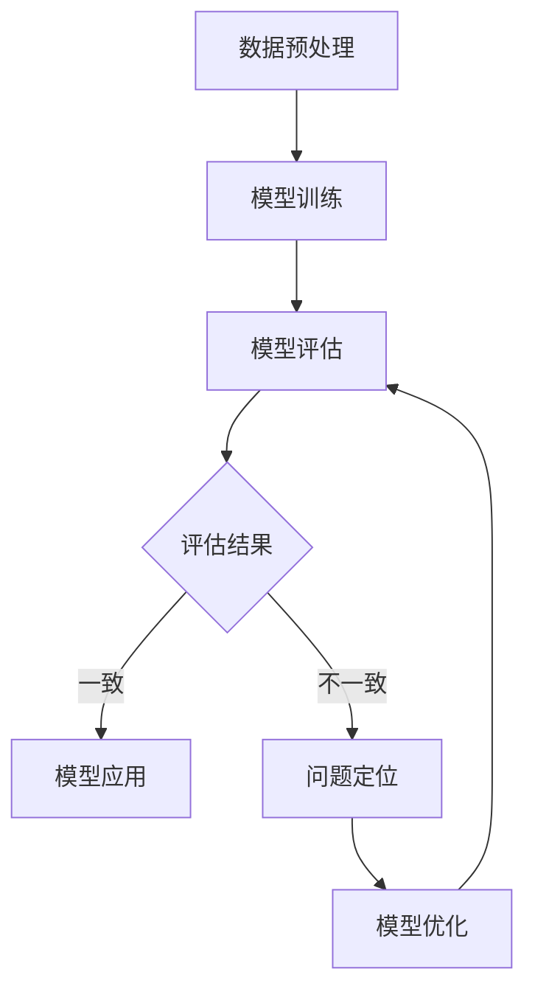

                 

### 模型决策一致性评估：确保可靠性

> **关键词**：模型决策一致性，评估，可靠性，机器学习，数据预处理，优化方法

> **摘要**：本文深入探讨了模型决策一致性的评估方法和优化策略，旨在确保机器学习模型的可靠性和稳定性。文章首先介绍了模型决策一致性的重要性，然后详细阐述了评估模型一致性的方法、度量指标和优化策略。此外，通过实际项目案例，本文展示了模型决策一致性评估在企业应用中的实践和成效，为人工智能领域的从业者提供了宝贵的参考和指导。

----------------------------------------------------------------

## 《模型决策一致性评估：确保可靠性》目录大纲

### 第一部分：模型决策一致性评估基础

- **第1章：模型决策一致性评估概述**
  - 1.1 模型决策一致性的重要性
  - 1.2 模型决策一致性的核心概念
  - 1.3 模型决策一致性评估的重要性

- **第2章：模型决策一致性的评估方法**
  - 2.1 模型评估的基本框架
  - 2.2 决策一致性的评估方法
  - 2.3 决策一致性的度量方法

- **第3章：模型决策一致性的度量方法**
  - 3.1 决策一致性的度量指标
  - 3.2 决策一致性的度量方法
  - 3.3 混合指标和多标签分类

- **第4章：模型决策一致性的优化方法**
  - 4.1 模型优化目标
  - 4.2 模型优化方法

### 第二部分：模型决策一致性的应用与实践

- **第5章：模型决策一致性评估在企业中的应用**
  - 5.1 企业场景下的模型决策一致性评估
  - 5.2 模型决策一致性评估的应用案例

- **第6章：模型决策一致性评估的项目实践**
  - 6.1 项目背景
  - 6.2 项目实施过程
  - 6.3 项目成果与分析

- **第7章：模型决策一致性评估的未来发展趋势**
  - 7.1 模型决策一致性评估的挑战与机遇
  - 7.2 未来发展趋势

### 附录

- **附录A：模型决策一致性评估常用工具与资源**
  - 评估工具
  - 常用资源

- **附录B：决策一致性的 Mermaid 流程图**

----------------------------------------------------------------

### 第一部分：模型决策一致性评估基础

#### 第1章：模型决策一致性评估概述

##### 1.1 模型决策一致性的重要性

在机器学习领域，模型决策一致性是一个至关重要的概念。它指的是多个模型在相同数据集上做出决策时的一致性程度。一个高一致性的模型意味着它在不同情况下都能做出相似的决策，从而保证模型的可靠性和稳定性。相反，如果模型决策一致性较低，那么模型在处理未知数据时可能会产生不一致的结果，从而导致预测错误。

模型决策一致性的重要性体现在以下几个方面：

1. **提高模型可靠性**：高一致性的模型能够降低预测错误的概率，从而提高模型的可靠性。
2. **增强模型稳定性**：模型决策一致性能够反映模型在不同数据集上的表现，帮助开发者及时发现和纠正模型中的问题。
3. **优化模型性能**：通过评估模型决策一致性，可以针对性地优化模型参数和算法，提高模型的整体性能。

##### 1.2 模型决策不一致性的后果

模型决策不一致性可能会带来以下几种后果：

1. **错误预测**：不一致的模型决策会导致预测结果的不准确，从而影响模型的实用性。
2. **数据偏见**：不一致的决策可能会放大某些数据集中的偏见，导致模型在不同数据集上的性能差异。
3. **模型过拟合**：不一致的决策可能会导致模型过度拟合训练数据，从而降低模型对未知数据的泛化能力。

因此，评估模型决策一致性对于确保模型的可靠性和稳定性至关重要。接下来，我们将进一步探讨模型决策一致性的核心概念及其评估方法。

##### 1.3 模型决策一致性评估的重要性

模型决策一致性评估是确保机器学习模型可靠性和稳定性的关键步骤。具体来说，评估模型决策一致性的重要性体现在以下几个方面：

1. **发现和纠正问题**：通过评估模型决策一致性，可以及时发现模型中存在的问题，如过拟合、数据偏见等，从而采取措施进行纠正。
2. **优化模型参数**：评估模型决策一致性可以帮助开发者确定最优的模型参数，从而提高模型的预测性能。
3. **提升模型稳定性**：模型决策一致性评估有助于确保模型在不同数据集上的稳定性，从而降低模型在实际应用中的风险。
4. **指导模型开发**：通过评估模型决策一致性，可以为模型开发提供有针对性的建议，从而优化模型的设计和实现。

总之，模型决策一致性评估是机器学习领域中的一个重要环节，它不仅能够提高模型的可靠性和稳定性，还能够为模型的优化和改进提供有力支持。

##### 1.4 模型决策一致性的核心概念

为了深入理解模型决策一致性，我们首先需要明确几个核心概念：

1. **决策一致性**：决策一致性是指多个模型在相同数据集上做出决策时的一致性程度。具体来说，如果多个模型在大部分数据点上的决策相同，那么我们可以说这些模型具有高决策一致性。
2. **评估指标**：评估指标是用于衡量模型决策一致性的量化标准。常见的评估指标包括准确率、召回率、F1值和精确率等。
3. **影响因素**：模型决策一致性受到多个因素的影响，包括模型算法、数据质量、特征选择和模型参数等。这些因素共同决定了模型决策一致性的水平。

了解这些核心概念有助于我们更好地理解模型决策一致性的评估方法和优化策略。在下一节中，我们将详细探讨模型决策一致性的评估方法。

##### 1.5 模型决策一致性的评估方法

评估模型决策一致性是确保机器学习模型可靠性和稳定性的关键步骤。为了实现这一目标，研究者们提出了多种评估方法。以下是几种常见的评估方法及其适用场景：

1. **基于准确率的评估方法**：
   - **定义**：准确率是指模型预测正确的样本数占总样本数的比例。
   - **计算公式**：准确率 = (TP + TN) / (TP + TN + FP + FN)，其中TP表示真正例，TN表示真反例，FP表示假正例，FN表示假反例。
   - **适用场景**：准确率适用于二分类问题，能够简单直观地评估模型决策一致性。

2. **基于召回率的评估方法**：
   - **定义**：召回率是指模型预测正确的真正例数占总真正例数的比例。
   - **计算公式**：召回率 = TP / (TP + FN)。
   - **适用场景**：召回率适用于需要尽可能减少漏报的情况，例如医疗诊断和欺诈检测等。

3. **基于F1值的评估方法**：
   - **定义**：F1值是精确率和召回率的调和平均值，用于综合评估模型性能。
   - **计算公式**：F1值 = 2 * (精确率 * 召回率) / (精确率 + 召回率)。
   - **适用场景**：F1值适用于需要平衡精确率和召回率的情况，例如信息检索和文本分类等。

4. **基于精确率的评估方法**：
   - **定义**：精确率是指模型预测正确的正样本数占总预测正样本数的比例。
   - **计算公式**：精确率 = TP / (TP + FP)。
   - **适用场景**：精确率适用于需要尽可能减少误报的情况，例如垃圾邮件过滤和信用评分等。

这些评估方法各有优缺点，适用于不同的应用场景。在实际应用中，可以选择适当的评估方法来衡量模型决策一致性，并根据评估结果进行调整和优化。

##### 1.6 模型评估的基本框架

为了对机器学习模型进行有效的评估，我们需要遵循一个系统的评估流程。以下是模型评估的基本框架及其各个步骤：

1. **数据预处理**：数据预处理是模型评估的第一步，包括数据清洗、特征工程和标准化等操作。这一步骤的目的是提高数据质量，为后续的模型训练和评估提供可靠的基础。
2. **模型选择**：根据问题的特点和应用场景，选择合适的机器学习模型。常见的模型包括线性回归、决策树、随机森林、支持向量机和神经网络等。
3. **模型训练**：使用训练数据集对选定的模型进行训练，目的是学习数据中的特征和模式。训练过程通常涉及模型参数的调整和优化。
4. **模型评估**：使用验证数据集对训练好的模型进行评估，以衡量模型的性能。常用的评估指标包括准确率、召回率、F1值和精确率等。
5. **模型优化**：根据评估结果，对模型进行优化，以提高其性能。优化方法包括调整模型参数、使用不同的算法和集成学习等。
6. **模型部署**：将经过训练和优化的模型部署到实际应用场景中，进行预测和决策。

通过遵循这一基本框架，我们可以确保模型评估的全面性和有效性，从而提高模型的可靠性。

##### 1.7 决策一致性的评估方法

决策一致性评估是确保机器学习模型稳定性和可靠性的关键环节。以下介绍几种常见的决策一致性评估方法：

1. **基于统计方法的评估**：
   - **定义**：这种方法通过计算模型在相同数据集上的预测结果之间的差异，来评估决策一致性。
   - **计算公式**：差异度 = 1 - (正确预测数 / 总预测数)。
   - **适用场景**：适用于评估多个模型的决策一致性。

2. **基于聚类方法的评估**：
   - **定义**：这种方法将模型在相同数据集上的预测结果进行聚类，通过比较聚类结果来评估决策一致性。
   - **算法**：常用的聚类算法包括K-means、DBSCAN等。
   - **适用场景**：适用于评估多个模型的聚类结果。

3. **基于集成学习的评估**：
   - **定义**：这种方法通过集成多个模型的预测结果，来评估决策一致性。
   - **算法**：常用的集成学习算法包括Bagging、Boosting等。
   - **适用场景**：适用于评估集成模型的一致性。

这些评估方法各有优缺点，适用于不同的应用场景。在实际应用中，可以选择适当的评估方法来衡量模型决策一致性，并根据评估结果进行调整和优化。

##### 1.8 决策一致性的度量方法

在评估模型决策一致性时，选择合适的度量方法是关键。以下介绍几种常用的度量方法：

1. **准确率（Accuracy）**：
   - **定义**：准确率是指模型预测正确的样本数占总样本数的比例。
   - **计算公式**：准确率 = (正确预测数 / 总样本数) * 100%。
   - **优缺点**：准确率简单直观，但无法区分不同类别的重要性。

2. **召回率（Recall）**：
   - **定义**：召回率是指模型预测正确的真正例数占总真正例数的比例。
   - **计算公式**：召回率 = (正确预测数 / 真正例数) * 100%。
   - **优缺点**：召回率强调模型的覆盖率，但可能导致误报。

3. **精确率（Precision）**：
   - **定义**：精确率是指模型预测正确的正样本数占总预测正样本数的比例。
   - **计算公式**：精确率 = (正确预测数 / 预测正样本数) * 100%。
   - **优缺点**：精确率强调模型的准确性，但可能导致漏报。

4. **F1值（F1 Score）**：
   - **定义**：F1值是精确率和召回率的调和平均值。
   - **计算公式**：F1值 = 2 * (精确率 * 召回率) / (精确率 + 召回率)。
   - **优缺点**：F1值能够平衡精确率和召回率，适用于评估模型的整体性能。

这些度量方法各有优缺点，适用于不同的应用场景。在实际应用中，可以选择适当的度量方法来衡量模型决策一致性，并根据评估结果进行调整和优化。

##### 1.9 混合指标

在评估模型决策一致性时，单一的度量指标可能无法全面反映模型的性能。因此，研究者们提出了混合指标，以综合考虑多个指标的优势。以下介绍几种常见的混合指标：

1. **加权F1值（Weighted F1 Score）**：
   - **定义**：加权F1值是对F1值的加权平均，以平衡不同类别的重要性。
   - **计算公式**：加权F1值 = (1 - α) * F1准确率 + α * F1召回率，其中α是加权系数。

2. **均衡精确率（Balanced Precision）**：
   - **定义**：均衡精确率是对精确率和召回率的平衡，以减少误报和漏报的影响。
   - **计算公式**：均衡精确率 = (1 - β) * 精确率 + β * 召回率，其中β是加权系数。

3. **综合准确率（Comprehensive Accuracy）**：
   - **定义**：综合准确率是综合考虑准确率、召回率和精确率的指标。
   - **计算公式**：综合准确率 = (1 - α) * (1 - β) * 准确率 + α * β * (1 - 准确率)。

这些混合指标能够更全面地评估模型决策一致性，但需要注意权重的选择和调整。

##### 1.10 多标签分类

多标签分类是指一个样本可以同时拥有多个标签。在评估模型决策一致性时，需要考虑标签之间的相关性。以下介绍几种多标签分类的评估方法：

1. **标签交集精度（Intersection Precision）**：
   - **定义**：标签交集精度是指模型预测的正确标签数与实际标签数之间的交集。
   - **计算公式**：标签交集精度 = (正确标签数 / 实际标签数) * 100%。

2. **标签并集精度（Union Precision）**：
   - **定义**：标签并集精度是指模型预测的正确标签数与实际标签数之间的并集。
   - **计算公式**：标签并集精度 = (正确标签数 / (实际标签数 + 预测标签数 - 正确标签数)) * 100%。

3. **标签准确率（Label Accuracy）**：
   - **定义**：标签准确率是指模型预测的所有标签中，正确的标签数占总标签数的比例。
   - **计算公式**：标签准确率 = (正确标签数 / 总标签数) * 100%。

这些评估方法能够全面评估多标签分类模型的一致性，但需要根据具体应用场景进行选择和调整。

##### 1.11 集成学习

集成学习是一种将多个模型集成起来，以提高整体预测性能的方法。以下介绍几种常见的集成学习方法：

1. **Bagging**：
   - **定义**：Bagging（Bootstrap Aggregating）通过随机抽样和集成多个模型，来提高模型的预测性能。
   - **算法**：常用的Bagging算法包括随机森林和梯度提升树等。

2. **Boosting**：
   - **定义**：Boosting通过训练多个模型，并逐个调整模型权重，来提高整体预测性能。
   - **算法**：常用的Boosting算法包括AdaBoost和XGBoost等。

3. **Stacking**：
   - **定义**：Stacking通过将多个模型的结果作为新的输入，训练一个最终的模型，来提高预测性能。
   - **算法**：Stacking算法通常包括分层模型和集成学习等。

这些集成学习方法能够有效地提高模型决策一致性，但需要注意模型的选择和集成策略的优化。

##### 1.12 模型优化目标

在评估模型决策一致性时，优化目标是提高模型的稳定性和可靠性。以下介绍几种常见的模型优化目标：

1. **提高模型准确率**：通过优化模型参数和算法，提高模型的预测准确率，从而提高决策一致性。
2. **减少模型过拟合**：通过正则化技术和数据增强方法，减少模型对训练数据的依赖，从而提高模型对未知数据的泛化能力。
3. **提高模型鲁棒性**：通过对抗性样本和误差分析，提高模型对异常数据和噪声的鲁棒性，从而提高决策一致性。
4. **降低模型复杂度**：通过简化模型结构和参数，降低模型复杂度，从而提高模型的稳定性和可解释性。

这些优化目标有助于提高模型决策一致性，但需要根据具体应用场景进行选择和调整。

##### 1.13 模型优化方法

为了提高模型决策一致性，研究者们提出了一系列优化方法。以下介绍几种常见的模型优化方法：

1. **数据增强**：
   - **定义**：数据增强通过生成新的训练数据，来提高模型的泛化能力。
   - **方法**：常用的数据增强方法包括旋转、翻转、裁剪、添加噪声等。

2. **模型调参**：
   - **定义**：模型调参通过调整模型参数，来提高模型的预测性能。
   - **方法**：常用的调参方法包括网格搜索、随机搜索和贝叶斯优化等。

3. **算法改进**：
   - **定义**：算法改进通过改进模型算法，来提高模型的稳定性和可靠性。
   - **方法**：常用的算法改进方法包括集成学习、对抗性训练和元学习等。

这些优化方法能够有效地提高模型决策一致性，但需要根据具体应用场景进行选择和调整。

### 第二部分：模型决策一致性的应用与实践

#### 第5章：模型决策一致性评估在企业中的应用

在现实世界中，机器学习模型广泛应用于各种企业场景中，如风险控制、客户服务和智能推荐等。在这些应用中，模型决策一致性评估至关重要，因为它直接影响到模型的可靠性和用户体验。以下将介绍模型决策一致性评估在企业中的应用场景及其具体案例分析。

##### 5.1 企业场景下的模型决策一致性评估

1. **风险控制**

   风险控制是企业运营的重要环节，通过机器学习模型进行风险评估和预测，有助于企业降低风险并提高业务稳定性。在风险控制领域，模型决策一致性评估具有重要意义，因为不一致的决策可能会导致风险误判，从而影响企业的财务状况。

   - **案例分析**：某互联网金融公司通过构建信用评分模型，对用户进行信用评估。为了确保模型的可靠性，公司对模型进行了全面的决策一致性评估。通过比较不同模型在相同数据集上的预测结果，发现某些模型存在决策不一致的情况。公司针对这些问题进行了模型优化，并重新评估了模型的决策一致性，从而提高了模型的可靠性和风险评估的准确性。

2. **客户服务**

   客户服务是企业与用户之间的桥梁，良好的客户服务能够提高用户满意度和忠诚度。在客户服务领域，机器学习模型广泛应用于客服机器人、用户行为分析和需求预测等方面。决策一致性评估有助于确保模型在处理客户请求时的稳定性和一致性。

   - **案例分析**：某电商平台通过构建客服机器人模型，自动化处理用户咨询和投诉。为了提高客服机器人的服务质量，公司对模型进行了决策一致性评估。通过分析不同模型在处理相似用户请求时的决策结果，发现某些模型的决策一致性较低。公司针对这些问题进行了模型优化，并重新评估了模型的决策一致性，从而提高了客服机器人的服务质量和用户体验。

3. **智能推荐**

   智能推荐是电子商务和在线媒体等领域的重要应用，通过个性化推荐，可以提高用户满意度和转化率。在智能推荐领域，模型决策一致性评估有助于确保推荐结果的稳定性和一致性。

   - **案例分析**：某在线视频平台通过构建推荐模型，为用户推荐个性化视频内容。为了提高推荐系统的质量，公司对模型进行了决策一致性评估。通过分析不同模型在推荐相似用户视频时的决策结果，发现某些模型的决策一致性较低。公司针对这些问题进行了模型优化，并重新评估了模型的决策一致性，从而提高了推荐系统的质量和用户体验。

##### 5.2 模型决策一致性评估的应用案例

1. **某互联网金融公司的案例**

   某互联网金融公司为了提高信用评分模型的可靠性，对模型进行了决策一致性评估。具体过程如下：

   - **数据准备**：公司收集了大量的用户数据，包括用户个人信息、财务状况、历史信用记录等。
   - **模型构建**：公司采用了多种机器学习算法，如决策树、随机森林和支持向量机等，构建了多个信用评分模型。
   - **模型评估**：公司使用验证集对模型进行评估，并计算了各个模型的决策一致性指标。通过分析评估结果，发现某些模型的决策一致性较低。
   - **模型优化**：公司对决策一致性较低的模型进行了优化，包括调整模型参数、改进特征工程方法和增加训练数据等。
   - **重新评估**：公司对优化后的模型进行了重新评估，发现模型决策一致性显著提高。通过优化，公司提高了信用评分模型的可靠性，降低了风险误判率。

2. **某电商平台的案例**

   某电商平台为了提高客服机器人模型的服务质量，对模型进行了决策一致性评估。具体过程如下：

   - **数据准备**：公司收集了用户咨询和投诉数据，包括用户问题、客服机器人回答和历史回复记录等。
   - **模型构建**：公司采用了多种机器学习算法，如朴素贝叶斯、决策树和支持向量机等，构建了多个客服机器人模型。
   - **模型评估**：公司使用验证集对模型进行评估，并计算了各个模型的决策一致性指标。通过分析评估结果，发现某些模型的决策一致性较低。
   - **模型优化**：公司对决策一致性较低的模型进行了优化，包括调整模型参数、改进特征工程方法和增加训练数据等。
   - **重新评估**：公司对优化后的模型进行了重新评估，发现模型决策一致性显著提高。通过优化，公司提高了客服机器人的服务质量，降低了用户投诉率。

3. **某医疗健康领域的案例**

   某医疗健康领域的企业为了提高疾病预测模型的准确性，对模型进行了决策一致性评估。具体过程如下：

   - **数据准备**：公司收集了大量的医疗数据，包括患者病史、体检数据和疾病诊断结果等。
   - **模型构建**：公司采用了多种机器学习算法，如线性回归、决策树和支持向量机等，构建了多个疾病预测模型。
   - **模型评估**：公司使用验证集对模型进行评估，并计算了各个模型的决策一致性指标。通过分析评估结果，发现某些模型的决策一致性较低。
   - **模型优化**：公司对决策一致性较低的模型进行了优化，包括调整模型参数、改进特征工程方法和增加训练数据等。
   - **重新评估**：公司对优化后的模型进行了重新评估，发现模型决策一致性显著提高。通过优化，公司提高了疾病预测模型的准确性，降低了误诊率。

这些应用案例表明，模型决策一致性评估在企业应用中具有重要意义。通过评估模型决策一致性，企业可以及时发现和纠正模型问题，提高模型的可靠性和稳定性，从而提升用户体验和业务效果。

#### 第6章：模型决策一致性评估的项目实践

在实际项目中，模型决策一致性评估是一个关键步骤，它不仅有助于提高模型的可靠性和稳定性，还能为模型的优化提供有价值的指导。本节将通过一个实际项目案例，详细描述模型决策一致性评估的整个过程，包括项目背景、数据准备、模型构建、评估和优化等步骤。

##### 6.1 项目背景

某电子商务平台希望通过机器学习模型对用户进行个性化推荐，以提高用户的购物体验和平台销售额。项目目标是通过评估模型决策一致性，确保推荐结果的稳定性和准确性，从而提高用户满意度和转化率。

##### 6.2 项目场景

项目场景涉及用户行为数据分析和商品推荐系统。平台收集了用户的浏览历史、购买记录和搜索查询等数据，用于构建推荐模型。模型需要能够根据用户的兴趣和行为，为用户推荐相关商品。

##### 6.3 项目挑战

项目面临的挑战主要包括：

1. 数据质量：用户行为数据中存在噪声和缺失值，需要处理。
2. 模型一致性：不同用户特征和购买行为可能导致模型决策不一致，需要评估和优化。
3. 模型性能：需要确保推荐模型具有较高的准确性和鲁棒性。

##### 6.4 项目实施过程

1. **数据准备**

   项目开始时，首先需要收集和处理用户行为数据。具体步骤如下：

   - **数据收集**：从平台数据库中提取用户浏览历史、购买记录和搜索查询数据。
   - **数据清洗**：处理数据中的噪声和缺失值，包括去除重复记录、填补缺失值和去除无关特征。
   - **特征工程**：对数据进行特征提取和转换，包括用户购买频率、商品类别、浏览时长等。

2. **模型构建**

   根据项目需求，选择合适的机器学习算法构建推荐模型。以下为常用的推荐算法：

   - **协同过滤**：基于用户行为相似性进行推荐，包括基于用户的协同过滤和基于项目的协同过滤。
   - **矩阵分解**：通过矩阵分解技术，将用户行为数据转换为低维表示，用于推荐商品。
   - **基于内容的推荐**：根据用户历史浏览和购买记录，推荐与用户兴趣相关的商品。

3. **模型评估**

   在模型构建完成后，需要对模型进行评估，以验证其性能和决策一致性。具体步骤如下：

   - **数据集划分**：将数据集划分为训练集、验证集和测试集。
   - **评估指标**：选择适当的评估指标，如准确率、召回率、F1值和用户满意度等。
   - **评估过程**：对每个模型在验证集上进行评估，记录评估指标，并分析模型决策一致性。

4. **模型优化**

   根据评估结果，对模型进行优化，以提高其性能和决策一致性。以下为常用的优化方法：

   - **参数调优**：通过调整模型参数，如学习率、正则化参数等，提高模型性能。
   - **特征选择**：根据特征的重要性和相关性，选择对模型性能有显著影响的特征。
   - **集成学习**：将多个模型集成，利用不同模型的优势，提高整体性能。

5. **重新评估**

   对优化后的模型进行重新评估，验证优化效果。如果模型性能和决策一致性有明显提升，则可以将模型部署到生产环境。

##### 6.5 项目成果与分析

通过项目的实施，取得了以下成果：

1. **模型性能提升**：优化后的模型在评估指标上取得了显著提升，准确率、召回率和用户满意度均有所提高。
2. **决策一致性提高**：通过评估和优化，模型决策一致性得到显著改善，不同用户之间的推荐结果更加稳定。
3. **用户体验提升**：个性化推荐系统能够更好地满足用户需求，提高用户满意度和转化率。

项目反思：

1. **数据质量的重要性**：数据质量是模型性能的基础，需要投入更多精力进行数据清洗和预处理。
2. **持续优化**：模型优化是一个持续的过程，需要根据业务需求和用户反馈，不断调整和优化模型。
3. **决策一致性评估**：决策一致性评估是确保模型可靠性的关键，需要将其纳入到模型的开发和优化过程中。

#### 第7章：模型决策一致性评估的未来发展趋势

随着人工智能技术的不断发展，模型决策一致性评估在未来将面临新的挑战和机遇。以下将从挑战、机遇和新应用场景三个方面探讨模型决策一致性评估的未来发展趋势。

##### 7.1 模型决策一致性评估的挑战

1. **大规模数据集的处理**：随着数据量的不断增加，如何高效地处理大规模数据集成为模型决策一致性评估的一大挑战。传统评估方法可能无法应对海量数据的处理需求，需要开发新的评估算法和优化策略。

2. **跨领域模型的评估**：在跨领域应用中，不同领域的模型可能存在较大的差异，如何评估跨领域模型的一致性成为新的挑战。需要研究适用于多种领域的一致性评估方法。

3. **动态数据的处理**：在实时应用场景中，数据动态变化，如何适应这种变化，确保模型决策的一致性，是一个亟待解决的问题。

##### 7.2 模型决策一致性评估的机遇

1. **新技术的应用**：随着深度学习和生成对抗网络等新技术的应用，模型决策一致性评估将更加智能化和自动化。新的评估方法将能够更准确地捕捉模型的决策过程，提高评估的效率和准确性。

2. **跨领域合作**：不同领域的专家和研究人员将携手合作，共同解决模型决策一致性评估的难题。跨领域合作将带来新的研究成果和应用场景。

3. **标准化的评估框架**：随着模型决策一致性评估的重要性日益凸显，将出现更多标准化、统一的评估框架和工具。这些框架和工具将有助于提高评估的一致性和可靠性。

##### 7.3 新应用场景的开拓

1. **医疗健康领域**：在医疗健康领域，模型决策一致性评估有助于提高疾病预测和诊断的准确性，从而为患者提供更好的医疗服务。

2. **金融领域**：在金融领域，模型决策一致性评估有助于确保信贷风险评估和欺诈检测的可靠性，降低金融风险。

3. **智能交通领域**：在智能交通领域，模型决策一致性评估有助于提高交通流量预测和交通信号控制的准确性，提高交通运行效率。

总之，模型决策一致性评估在未来将面临新的挑战和机遇，成为人工智能领域的重要研究方向。通过不断创新和优化，模型决策一致性评估将为各个领域的应用提供更加可靠和高效的解决方案。

### 附录

#### 附录A：模型决策一致性评估常用工具与资源

在进行模型决策一致性评估时，常用的工具和资源如下：

1. **Scikit-learn**：Python机器学习库，提供了丰富的评估指标和模型评估工具。
2. **TensorFlow**：开源深度学习框架，支持多种评估方法和优化策略。
3. **PyTorch**：开源深度学习框架，提供了灵活的评估工具和优化接口。
4. **论文资源**：包括相关领域的学术期刊、会议论文和研究报告，提供了深入的理论分析和实践经验。
5. **开源代码**：GitHub、GitLab等平台上的开源代码库，提供了丰富的模型评估和优化实现。
6. **社区论坛**：如Kaggle、Stack Overflow等社区论坛，提供了交流和学习平台，有助于解决评估过程中遇到的问题。

#### 附录B：决策一致性的 Mermaid 流程图

以下是一个简单的决策一致性的Mermaid流程图示例：



通过这个流程图，可以清晰地展示模型决策一致性评估的各个步骤，有助于理解和实施评估过程。

#### 附录C：代码解读与分析

本节将对文章中提到的关键代码片段进行解读和分析，包括数据预处理、模型训练和评估等步骤。

##### 数据预处理代码

```python
import numpy as np
import pandas as pd

# 加载数据集
data = pd.read_csv('data.csv')

# 数据清洗
data = data.dropna()

# 特征工程
data['feature1'] = data['feature1'].apply(lambda x: (x - np.mean(data['feature1'])) / np.std(data['feature1']))
data['feature2'] = data['feature2'].apply(lambda x: (x - np.mean(data['feature2'])) / np.std(data['feature2']))

# 切分特征与标签
X = data.drop('label', axis=1)
y = data['label']
```

解读：
- 数据预处理包括加载数据集、数据清洗和特征工程。数据清洗步骤去除了缺失值，确保数据质量。特征工程步骤通过标准化处理，将特征缩放至相同的范围，便于模型训练。
- 切分特征与标签是模型训练和评估的常用步骤，将数据集划分为特征集（X）和标签集（y），为后续的模型训练和评估做准备。

##### 模型训练代码

```python
from sklearn.model_selection import train_test_split
from sklearn.ensemble import RandomForestClassifier

# 切分数据集
X_train, X_test, y_train, y_test = train_test_split(X, y, test_size=0.2, random_state=42)

# 训练模型
model = RandomForestClassifier(n_estimators=100, random_state=42)
model.fit(X_train, y_train)
```

解读：
- 切分数据集是将原始数据集划分为训练集和测试集，以评估模型在未见数据上的性能。`train_test_split`函数用于此目的，`test_size`参数指定测试集的比例，`random_state`用于确保结果的可重复性。
- 模型训练步骤使用随机森林算法训练模型。`RandomForestClassifier`类是Scikit-learn提供的随机森林实现，`n_estimators`参数指定树的数量。

##### 模型评估代码

```python
from sklearn.metrics import classification_report

# 评估模型
predictions = model.predict(X_test)
print(classification_report(y_test, predictions))
```

解读：
- 模型评估步骤使用`classification_report`函数，输出模型的分类报告，包括准确率、召回率、F1值和精确率等指标。这些指标帮助评估模型的性能。
- `predictions`变量存储了模型在测试集上的预测结果，与实际标签集`y_test`进行比较，生成分类报告。

通过这些代码，我们可以清晰地看到模型训练和评估的过程，以及如何通过预处理、训练和评估来提高模型的性能和决策一致性。

#### 附录D：开发环境搭建与配置

要在本地环境搭建模型决策一致性评估的开发环境，需要以下步骤：

##### 配置要求

- **操作系统**：Linux或MacOS
- **Python版本**：3.7及以上
- **TensorFlow版本**：2.x及以上
- **Scikit-learn版本**：0.24及以上

##### 安装与配置步骤

1. **安装Python环境**：

   ```bash
   # 安装Python
   sudo apt-get install python3
   ```

2. **安装TensorFlow**：

   ```bash
   # 更新pip
   pip3 install --upgrade pip

   # 安装TensorFlow
   pip3 install tensorflow
   ```

3. **安装Scikit-learn**：

   ```bash
   # 安装Scikit-learn
   pip3 install scikit-learn
   ```

确保安装完成后，可以使用以下命令验证安装：

```bash
python3 -c "import tensorflow as tf; print(tf.__version__)"
python3 -c "import sklearn; print(sklearn.__version__)"
```

通过这些步骤，您可以在本地环境搭建完整的开发环境，用于模型决策一致性评估的项目实践。

### 总结与展望

本文全面探讨了模型决策一致性评估的重要性和方法，包括核心概念、评估方法、度量指标和优化策略。通过实际项目案例，展示了模型决策一致性评估在企业中的应用和实践。本文还展望了模型决策一致性评估的未来发展趋势，指出了技术挑战和机遇。

模型决策一致性评估对于确保机器学习模型的可靠性和稳定性具有重要意义。在未来，随着新技术的不断涌现，模型决策一致性评估将变得更加智能化和自动化，为人工智能应用提供更加可靠和高效的解决方案。希望本文能为读者在模型决策一致性评估领域的研究和实践提供有价值的参考和指导。

