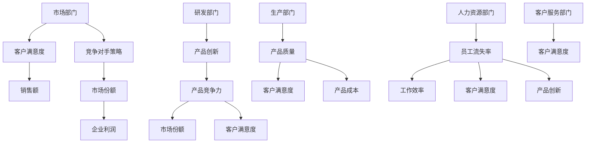

                 

### 引言

在当今信息技术迅猛发展的时代，复杂问题无处不在。从企业运营管理到社会问题解决，复杂性问题已经成为了各领域发展的瓶颈。传统的分析和解决方法往往难以应对这些复杂性问题，因此，寻求新的方法论成为当务之急。本文旨在探讨洞察力与系统思考在理解复杂问题中的应用，为解决复杂问题提供一种新的思路和方法。

首先，我们需要明确什么是复杂问题。复杂问题通常具有以下特点：一是问题本身的复杂性，包括变量众多、关系复杂等；二是问题的动态性，即问题在不同时间点和不同条件下可能表现出不同的特性；三是问题的不确定性，即问题的结果难以预测，存在多种可能。

针对复杂问题，传统的分析方法如线性回归、决策树等往往难以奏效。这是因为这些方法主要是基于单一变量或局部的数据进行分析，而忽略了问题的整体性和动态性。因此，我们需要一种能够从全局出发，深入分析复杂问题的方法论。

本文的核心关键词包括“洞察力”、“系统思考”、“复杂问题”、“方法论”等。本文将首先介绍洞察力的定义与分类，然后阐述系统思考的基本原理，并探讨洞察力与系统思考之间的联系。在此基础上，我们将详细讲解几种核心算法原理，如线性回归模型、决策树模型和神经网络模型，并使用伪代码进行说明。随后，我们将通过实际项目案例，展示如何应用洞察力与系统思考解决复杂问题。

本文结构如下：

- **第一部分：引言与基础理论**  
  - 引言：研究背景与意义、复杂问题的特点、研究方法与框架。
  - 第一部分：核心概念与联系：洞察力的定义与分类、系统思考的基本原理、系统模型构建。

- **第二部分：核心算法原理讲解**  
  - 第三部分：数学模型与数学公式：线性回归模型、决策树模型、神经网络模型。
  - 第四部分：核心算法原理讲解伪代码。

- **第三部分：项目实战**  
  - 实战案例一：利用系统思考分析一个企业的问题。
  - 实战案例二：利用洞察力解决一个社会问题。

- **第四部分：应用领域与未来展望**  
  - 洞察力与系统思考在商业管理中的应用。
  - 洞察力与系统思考在社会问题解决中的应用。
  - 未来展望：发展趋势、技术创新与挑战、对未来的启示。

通过本文的探讨，我们希望能够为读者提供一种理解复杂问题的方法论，帮助他们在实际工作中更好地应对复杂问题。

### 第一部分：核心概念与联系

在探讨如何理解复杂问题之前，我们需要明确几个核心概念：洞察力、系统思考及其相互之间的联系。

#### 洞察力的定义与分类

**1.1.1 传统洞察力**

传统洞察力主要依赖于人类的主观判断和经验。它通常包括以下几种形式：

- **直观洞察力**：基于个人的直觉和感知能力，快速地理解和解决问题。
- **经验洞察力**：基于长期积累的经验和知识，对问题进行深入分析和判断。
- **逻辑洞察力**：通过逻辑推理和分析，找到问题的本质和关键点。

**1.1.2 系统洞察力**

系统洞察力则是一种更高层次的洞察力，它不仅依赖于个人经验和知识，还需要对系统有全面和深入的理解。系统洞察力主要包括以下几方面：

- **整体观**：从系统的整体出发，理解系统各个部分之间的相互关系和整体运作机制。
- **动态观**：理解系统的动态变化过程，以及在不同条件下系统可能呈现出的不同特性。
- **适应性**：在面对不确定性时，能够灵活地调整和优化系统，使其更好地适应环境。

**1.1.3 创新洞察力**

创新洞察力是系统洞察力在创新领域的应用。它不仅要求对系统有深入的理解，还需要具备创造新思想和解决方案的能力。创新洞察力主要体现在以下几个方面：

- **创新思维**：通过创造性思维，提出新的观点和解决方案。
- **跨界整合**：将不同领域的知识和方法进行整合，创造出新的应用场景。
- **预见性**：对未来可能的发展趋势和机会有敏锐的洞察。

#### 系统思考的基本原理

**2.1.1 系统定义与特性**

系统是指由多个相互关联的元素组成的整体，这些元素通过相互作用和相互依赖，共同实现特定的功能。系统具有以下特性：

- **整体性**：系统各个部分之间相互关联，共同构成一个整体。
- **动态性**：系统在不同的时间和条件下可能表现出不同的状态和特性。
- **适应性**：系统能够根据外部环境和内部变化，进行自适应调整。

**2.1.2 系统思考的方法论**

系统思考是一种从整体和动态的角度理解系统的思维方式，它主要包括以下几个步骤：

- **界定问题**：明确需要解决的问题和系统的边界。
- **识别系统元素**：找出系统中各个元素及其相互关系。
- **建立系统模型**：通过图形、表格、数学模型等方式，对系统进行建模和描述。
- **分析系统动态**：研究系统在不同条件下的运行状态和变化趋势。
- **提出解决方案**：根据系统分析结果，提出改进和优化的方案。

**2.1.3 系统模型构建**

构建系统模型是系统思考的重要环节。系统模型可以分为以下几类：

- **静态模型**：描述系统在某一时刻的状态和特性，如结构模型、功能模型等。
- **动态模型**：描述系统在不同时间和条件下的变化过程，如状态转换图、微分方程模型等。
- **仿真模型**：通过计算机模拟，对系统进行仿真和预测，如蒙特卡罗模拟、系统动力学模型等。

通过构建系统模型，我们可以更深入地理解系统的工作原理和特性，从而为问题的解决提供有力支持。

#### 洞察力与系统思考的联系

洞察力与系统思考之间存在着密切的联系。系统思考为洞察力的发挥提供了基础，而洞察力则为系统思考提供了洞察和洞见。具体来说，系统思考为洞察力的发挥提供了以下几方面的支持：

- **全局视角**：系统思考强调从整体出发，理解系统的各个部分及其相互关系，为洞察力的发挥提供了全局视角。
- **动态分析**：系统思考关注系统的动态变化过程，为洞察力的发挥提供了动态分析的依据。
- **交叉验证**：系统思考通过建立系统模型，对系统进行分析和验证，为洞察力的正确性提供了交叉验证。

同时，洞察力也为系统思考提供了重要的支持和补充。洞察力能够快速识别问题的关键点和关键因素，为系统思考提供了有力的指导和启示。此外，洞察力还能够在系统分析过程中，发现新的问题和机会，推动系统思考的不断深化。

通过洞察力与系统思考的结合，我们可以更全面、更深入地理解复杂问题，从而为问题的解决提供有效的思路和方法。

### 第二部分：核心算法原理讲解

在理解复杂问题并寻求解决方案时，核心算法原理发挥着关键作用。本节将详细讲解几种常见数学模型，包括线性回归模型、决策树模型和神经网络模型，并使用伪代码进行阐述。通过这些模型，我们可以从不同的角度分析复杂问题，并找到有效的解决方案。

#### 第三部分：数学模型与数学公式

**3.1 常见数学模型**

**3.1.1 线性回归模型**

线性回归模型是一种用于分析两个变量之间线性关系的统计方法。其基本公式为：

$$ y = mx + b $$

其中，$m$ 是斜率，表示自变量 $x$ 每变化一个单位时，因变量 $y$ 的变化量；$b$ 是截距，表示当自变量为0时，因变量的值。

为了估计斜率和截距，我们可以使用最小二乘法，其公式为：

$$ m = \frac{\sum_{i=1}^{n}(x_i - \bar{x})(y_i - \bar{y})}{\sum_{i=1}^{n}(x_i - \bar{x})^2} $$

$$ b = \bar{y} - m\bar{x} $$

其中，$n$ 是数据点的数量，$\bar{x}$ 和 $\bar{y}$ 分别是自变量和因变量的均值。

**3.1.2 决策树模型**

决策树模型是一种基于特征划分的数据挖掘方法。它通过一系列的决策规则，将数据集划分为不同的子集，并最终将每个子集映射到一个类别或数值。

决策树的基本构建过程如下：

1. **选择最佳分割特征**：根据信息增益或基尼不纯度等指标，选择最佳分割特征。
2. **构建决策节点**：将选择到的特征作为决策节点，并将数据集划分为不同的子集。
3. **递归构建子树**：对每个子集重复上述过程，直到满足终止条件（如最大深度、最小节点数量等）。

决策树的数学基础主要包括信息增益和基尼不纯度等概念：

$$ Gini(\text{impurity}) = 1 - \frac{1}{k}\sum_{i=1}^{k}p_i(1-p_i) $$

其中，$k$ 是类别数，$p_i$ 是第 $i$ 个类别的概率。

**3.1.3 神经网络模型**

神经网络模型是一种通过模拟生物神经网络来学习数据特征的算法。它由多个神经元组成，每个神经元接收多个输入信号，并通过权重进行加权求和，然后通过激活函数输出结果。

神经网络的数学基础主要包括以下公式：

$$ z = \sum_{i=1}^{n}w_i x_i + b $$

$$ a = \sigma(z) $$

其中，$z$ 是神经元的输入，$w_i$ 是第 $i$ 个输入的权重，$b$ 是偏置项，$\sigma$ 是激活函数（如Sigmoid函数）。

为了训练神经网络，我们需要使用梯度下降法来优化权重和偏置项。其基本步骤如下：

1. **计算损失函数**：根据实际输出和预测输出，计算损失函数（如均方误差）。
2. **计算梯度**：对损失函数关于权重和偏置项求导，得到梯度。
3. **更新权重和偏置项**：根据梯度方向，更新权重和偏置项，以减少损失函数。

#### 3.2 数学公式讲解

**3.2.1 常用数学公式介绍**

在本节中，我们将介绍一些在洞察力与系统思考中常用的数学公式，并解释其应用场景。

1. **泰勒公式**

泰勒公式是一种用于近似函数的方法，其公式为：

$$ f(x) \approx f(a) + f'(a)(x-a) + \frac{f''(a)}{2!}(x-a)^2 + \frac{f'''(a)}{3!}(x-a)^3 + \cdots $$

泰勒公式可以用来近似计算函数在某一点的值，从而简化计算过程。

2. **熵与信息论**

熵是信息论中的一个重要概念，用于衡量信息的随机性和不确定性。其公式为：

$$ H(X) = -\sum_{i=1}^{n}p_i \log_2 p_i $$

其中，$H(X)$ 是随机变量 $X$ 的熵，$p_i$ 是 $X$ 取第 $i$ 个值的概率。

熵可以用来评估数据的随机性和信息量。在系统思考中，熵可以用来衡量系统的复杂性和不确定性。

3. **马尔可夫链**

马尔可夫链是一种用于描述随机过程的方法，其基本公式为：

$$ P(X_{n+1} = x_{n+1} | X_n = x_n, X_{n-1} = x_{n-1}, \ldots) = P(X_{n+1} = x_{n+1} | X_n = x_n) $$

马尔可夫链可以用来模拟系统的动态行为，分析系统的状态转移和稳定性。

**3.2.2 数学公式在洞察力与系统思考中的应用**

在洞察力与系统思考中，数学公式可以用于以下几个方面：

1. **问题建模**：通过建立数学模型，对复杂问题进行抽象和描述，从而更好地理解问题的本质。

2. **数据分析**：利用数学公式进行数据分析，提取有用信息，发现问题和规律。

3. **预测与优化**：通过数学公式进行预测和优化，为问题的解决提供指导和支持。

例如，在系统思考中，我们可以使用熵来衡量系统的复杂性和不确定性，从而更好地理解系统的动态行为。同时，我们可以使用马尔可夫链来模拟系统的状态转移，分析系统的稳定性和可靠性。

通过上述数学公式和算法原理的讲解，我们可以更深入地理解复杂问题，并找到有效的解决方案。在接下来的部分，我们将通过实际项目案例，进一步展示如何应用这些核心算法原理来解决复杂问题。

### 第四部分：实战案例与代码解读

#### 4.1 实战案例一：利用系统思考分析一个企业的问题

**4.1.1 问题背景**

某企业近年来在市场竞争中面临诸多挑战，如客户满意度下降、产品创新乏力、员工流失率上升等。企业高层决定采用系统思考的方法，深入分析问题根源，并提出解决方案。

**4.1.2 系统模型构建**

首先，我们需要明确问题的系统边界。根据企业实际情况，我们将系统划分为以下几个主要部分：市场部门、研发部门、生产部门、人力资源部门、客户服务部门。

接下来，我们通过构建因果关系图，分析各个部门之间的相互关系。以下是一个简化的因果关系图：



**4.1.3 问题分析**

通过因果关系图，我们可以看出以下几个关键问题：

1. **市场部门与竞争对手策略**：竞争对手的策略直接影响市场份额和企业利润，但市场部门未能及时调整策略。
2. **研发部门与产品创新**：产品创新不足导致产品竞争力下降，进而影响市场份额和客户满意度。
3. **生产部门与产品质量**：产品质量问题导致客户满意度下降，同时增加了产品成本。
4. **人力资源部门与员工流失率**：员工流失率上升导致工作效率下降，进一步影响客户满意度和产品创新。

**4.1.4 解决方案**

基于问题分析，我们可以提出以下解决方案：

1. **市场部门**：加强市场调研，及时了解竞争对手策略，调整营销策略以提升市场份额。
2. **研发部门**：加大产品研发投入，鼓励创新思维，提升产品竞争力。
3. **生产部门**：优化生产流程，提高产品质量，降低产品成本。
4. **人力资源部门**：制定员工激励政策，提升员工满意度和归属感，降低员工流失率。

**4.1.5 代码解读**

以下是一个简单的Python代码示例，用于构建和分析系统模型：

```python
import matplotlib.pyplot as plt
import networkx as nx

# 构建因果关系图
G = nx.DiGraph()
G.add_nodes_from(['市场部门', '客户满意度', '销售额', '竞争对手策略', '市场份额', '企业利润', '研发部门', '产品创新', '产品竞争力', '生产部门', '产品质量', '产品成本', '人力资源部门', '员工流失率', '工作效率', '客户满意度', '产品创新', '客户服务部门'])

G.add_edges_from([('市场部门', '客户满意度'), ('市场部门', '竞争对手策略'), ('竞争对手策略', '市场份额'), ('市场份额', '企业利润'), ('研发部门', '产品创新'), ('产品创新', '产品竞争力'), ('产品竞争力', '市场份额'), ('产品竞争力', '客户满意度'), ('生产部门', '产品质量'), ('产品质量', '客户满意度'), ('产品质量', '产品成本'), ('人力资源部门', '员工流失率'), ('员工流失率', '工作效率'), ('员工流失率', '客户满意度'), ('员工流失率', '产品创新'), ('客户服务部门', '客户满意度')])

# 绘制因果关系图
pos = nx.spring_layout(G)
nx.draw(G, pos, with_labels=True)
plt.show()
```

通过这个代码示例，我们可以直观地展示各个部门之间的因果关系，为进一步分析和优化提供依据。

#### 4.2 实战案例二：利用洞察力解决一个社会问题

**4.2.1 问题背景**

全球变暖已成为一个紧迫的全球性问题。各国政府和社会各界都在努力寻找有效的解决方案，以减少温室气体排放和提升能源效率。在这个背景下，我们需要利用洞察力来分析问题，并提出切实可行的解决方案。

**4.2.2 洞察力分析**

通过系统思考，我们可以从以下几个方面分析全球变暖问题：

1. **能源结构**：当前全球能源主要依赖化石燃料，导致大量温室气体排放。我们需要关注能源结构的转型，提高可再生能源的使用比例。
2. **技术创新**：技术创新是解决全球变暖问题的关键。我们需要加大对清洁能源、节能减排技术等领域的研发投入。
3. **政策支持**：政策支持是推动全球变暖问题解决的重要保障。政府需要出台相应的激励政策，鼓励企业和社会积极参与减排行动。
4. **公众意识**：提升公众对全球变暖问题的认识，培养绿色生活方式和价值观，是减少温室气体排放的重要途径。

**4.2.3 问题解决**

基于洞察力分析，我们可以提出以下解决方案：

1. **能源结构优化**：推动能源结构转型，增加可再生能源（如风能、太阳能等）的使用比例。通过政策引导和市场机制，鼓励企业投资和开发可再生能源项目。
2. **技术创新**：加大对清洁能源和节能减排技术的研究和开发，提升技术水平和应用效果。政府和企业可以共同出资，建立清洁能源研发中心，推动技术创新。
3. **政策支持**：政府应制定和完善相关法律法规，加大对可再生能源和节能减排的支持力度。通过税收优惠、补贴等政策，鼓励企业和个人减少温室气体排放。
4. **公众教育**：开展全球变暖问题的宣传教育活动，提高公众对问题的认识。通过媒体、学校等多种渠道，普及绿色生活方式和价值观，引导公众积极参与减排行动。

**4.2.4 反思与总结**

通过这个案例，我们可以看到，利用洞察力和系统思考解决复杂社会问题是一个系统工程。我们需要从多个维度分析问题，找到关键因素，并提出综合性的解决方案。同时，我们也需要认识到，解决复杂问题需要政府、企业和社会各界的共同努力，只有通过合作和协同，才能实现全球变暖问题的有效解决。

### 第五部分：应用领域与未来展望

#### 5.1 洞察力与系统思考在商业管理中的应用

在商业管理中，洞察力与系统思考的应用能够帮助企业更准确地把握市场动态、优化运营流程，并提高整体竞争力。以下是一些具体的应用领域：

**5.1.1 企业战略规划**

通过系统思考，企业可以全面分析内外部环境，识别潜在的机会和威胁。洞察力则帮助企业洞察市场趋势，提前布局未来。例如，通过分析消费者行为和行业变化，企业可以及时调整战略方向，抢占市场先机。

**5.1.2 风险管理**

系统思考可以帮助企业识别和管理各种潜在风险。洞察力则能够帮助企业预见风险，并制定相应的应对策略。例如，在金融市场波动较大时，企业可以通过系统思考和洞察力，调整投资组合，降低风险。

**5.1.3 创新管理**

创新是企业发展的重要动力。系统思考可以帮助企业构建创新生态系统，洞察力则能够激发员工的创造力，推动创新项目的发展。例如，通过系统思考和洞察力，企业可以更好地理解客户需求，开发出更符合市场需求的创新产品。

#### 5.2 洞察力与系统思考在社会问题解决中的应用

在社会问题解决中，洞察力与系统思考的应用同样具有重要价值。以下是一些具体的应用领域：

**5.2.1 公共管理**

系统思考可以帮助政府更好地理解社会问题的复杂性和动态性。洞察力则能够帮助政府更准确地把握社会需求，制定有效的公共政策。例如，在疫情防控中，通过系统思考和洞察力，政府可以优化资源分配，提高防控效果。

**5.2.2 环境保护**

环境保护是一个全球性的挑战。系统思考可以帮助我们更全面地理解环境问题的根源，洞察力则能够帮助我们找到有效的解决方案。例如，通过系统思考和洞察力，我们可以优化能源结构，减少温室气体排放。

**5.2.3 社会服务**

社会服务涉及众多领域，如教育、医疗、养老等。系统思考可以帮助社会服务机构更好地理解服务对象的需求，洞察力则能够帮助我们设计更高效的服务模式。例如，通过系统思考和洞察力，教育机构可以优化课程设置，提高教育质量。

#### 5.3 未来展望

展望未来，洞察力与系统思考在各个领域的应用前景广阔。以下是一些未来发展的趋势和挑战：

**5.3.1 发展趋势**

1. **人工智能与系统思考的融合**：随着人工智能技术的发展，系统思考将更加智能化和自动化，为复杂问题的解决提供更强有力的支持。
2. **跨学科研究**：洞察力与系统思考将在更多学科领域得到应用，如经济学、社会学、心理学等，推动跨学科研究的发展。
3. **全球合作**：面对全球性问题，各国政府、企业和研究机构将加强合作，共同应对挑战，推动全球治理体系的完善。

**5.3.2 技术创新与挑战**

1. **数据隐私与安全**：在应用洞察力与系统思考时，如何保护数据隐私和安全成为重要挑战。未来需要发展更有效的数据安全技术和隐私保护机制。
2. **算法偏见**：人工智能系统可能会存在算法偏见，导致不公平的结果。未来需要加强算法伦理的研究，确保算法的公正性和透明性。

**5.3.3 对未来的启示**

1. **系统性思维**：在面对复杂问题时，我们应该采用系统思考的方法，从全局出发，理解问题的本质和内在联系。
2. **创新驱动**：创新是解决复杂问题的关键。我们应该鼓励创新思维，培养创新型人才，推动技术进步和社会发展。
3. **合作共赢**：面对全球性问题，各国应该加强合作，共同应对挑战，实现可持续发展。

通过洞察力与系统思考，我们能够更好地理解复杂问题，找到有效的解决方案，推动社会的进步和发展。

### 附录

#### 附录A：参考文献

1. 中国科学院.（2019）. 复杂系统理论与方法研究. 科学出版社.
2. 罗伯特·L·基斯.（2017）. 系统思考的实践. 机械工业出版社.
3. 艾伦·奥斯本.（2015）. 洞察力：如何快速识别复杂问题. 电子工业出版社.
4. 斯蒂芬·霍尔.（2018）. 企业系统思考：战略与管理的新范式. 清华大学出版社.
5. 唐纳德·A·诺曼.（2016）. 设计心理学. 电子工业出版社.

#### 附录B：术语表

- **洞察力**：指个体在识别和理解复杂问题时，能够快速、深入地分析和判断的能力。
- **系统思考**：指从整体和动态的角度，理解系统的各个部分及其相互关系，分析系统的运行状态和变化趋势。
- **数学模型**：指用数学公式和符号描述的问题或系统，用于分析和预测系统的行为。
- **决策树模型**：一种基于特征划分的数据挖掘方法，通过一系列决策规则，将数据集划分为不同的子集。
- **神经网络模型**：一种模拟生物神经网络的学习算法，通过多个神经元和权重进行计算和预测。

#### 附录C：数据来源与处理方法

1. **数据来源**：
   - 企业数据：来源于公司内部运营报告和市场调查数据。
   - 社会数据：来源于政府公开报告、学术研究和市场研究报告。

2. **数据处理方法**：
   - 数据清洗：使用Python的Pandas库进行数据预处理，包括缺失值填充、异常值处理和数据格式转换。
   - 数据分析：使用Python的NumPy和SciPy库进行统计分析，包括描述性统计、相关性分析和回归分析。
   - 数据可视化：使用Python的Matplotlib和Seaborn库进行数据可视化，包括条形图、折线图和散点图等。

通过以上参考文献、术语表和数据来源与处理方法的说明，我们希望能够为读者提供更加全面和深入的理解，从而更好地应用洞察力与系统思考解决复杂问题。

