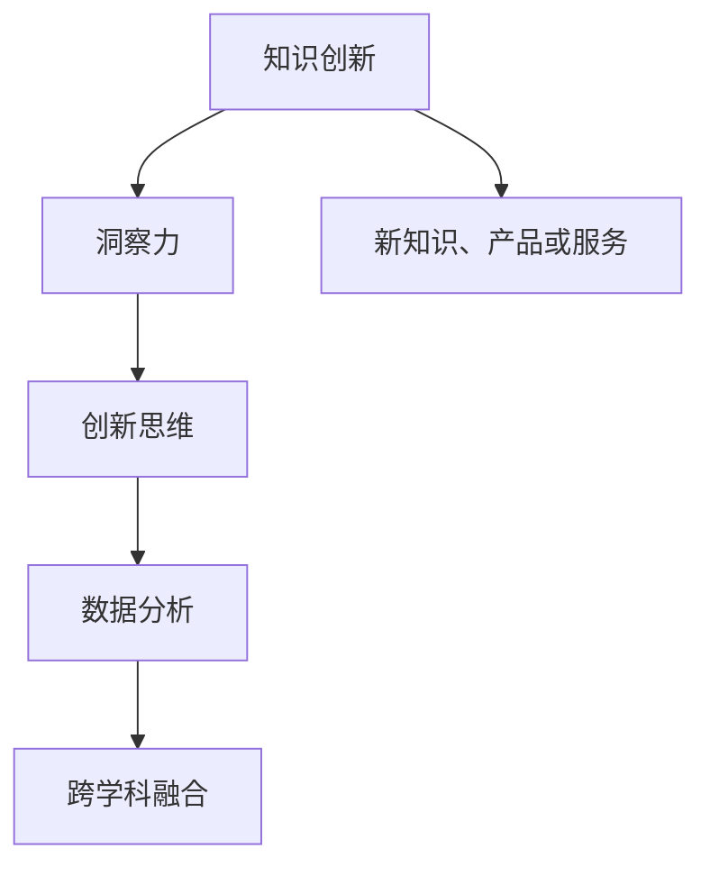

                 

### 洞察力：知识创新的领航员

> **关键词**：洞察力、知识创新、应用领域、培养方法、案例分析

> **摘要**：本文将深入探讨洞察力在知识创新中的重要作用，分析其在不同领域的应用，并分享培养和提升洞察力的方法和策略。通过实际案例的剖析，我们希望能够为读者提供对洞察力本质的理解和实用的实践指导。

#### 第一部分：洞察力概述与应用

**洞察力**，这个词汇在日常生活中频繁出现，但它究竟意味着什么？为何它被认为是知识创新的领航员？首先，让我们从定义和内涵入手，然后探讨洞察力的重要性。

##### **第1章：洞察力的核心概念与重要性**

###### **1.1 洞察力的定义与内涵**

**洞察力**，是一种深入理解和分析复杂问题的能力。它不仅涉及对问题的敏锐感知，还包括对事物本质的深刻洞察和判断。这种能力在日常生活中随处可见，例如，当我们在解决一个复杂问题时，我们会不自觉地运用洞察力来分析和决策。

- **内涵**：洞察力不仅是对信息的感知，更是一种理解信息背后的本质和规律的能力。它要求我们能够从复杂的信息中提取关键信息，并运用逻辑思维进行分析和推理。

###### **1.2 洞察力的重要性**

洞察力是推动知识创新的关键。在现代社会，创新已经成为企业发展的核心竞争力。而洞察力则是创新的前提条件。只有具备洞察力，我们才能够发现新的机会，提出新的解决方案。

- **创新驱动**：洞察力能够帮助我们预见未来的趋势，把握行业变革的方向，从而推动知识创新。在科技日新月异的今天，只有不断创新，才能在激烈的市场竞争中脱颖而出。

- **决策支持**：洞察力有助于我们更准确地分析和预测，为决策提供依据。在商业决策中，洞察力能够帮助我们评估风险和机会，做出更加明智的决策。

- **竞争优势**：具备洞察力的组织和个人能够更好地应对变化和挑战。在复杂多变的环境中，洞察力是保持竞争优势的重要法宝。

##### **第2章：洞察力的培养与提升**

为了培养和提升洞察力，我们需要采取一系列的方法和策略。以下是一些实用的技巧和策略：

###### **2.1 洞察力的培养方法**

- **广泛阅读**：扩大知识面，培养跨学科思考能力。阅读能够帮助我们积累丰富的知识储备，从而提高洞察力。

- **案例研究**：通过案例学习，积累实战经验。案例研究能够帮助我们理解问题的本质，并从中汲取经验教训。

- **思维训练**：通过逻辑思维、批判性思维训练，提高分析能力。思维训练能够帮助我们形成系统性的思考方式，提高洞察力。

###### **2.2 洞察力的提升技巧**

- **反思与总结**：对经历和想法进行深入反思和总结。反思能够帮助我们认识自己的不足，总结能够帮助我们巩固所学知识。

- **跨界思考**：打破专业限制，跨领域思考问题。跨界思考能够帮助我们拓展思维，发现新的解决方案。

- **持续学习**：保持对新知识的好奇心，持续学习。持续学习能够帮助我们跟上时代的步伐，提高洞察力。

通过以上方法和策略，我们能够逐步培养和提升洞察力。在接下来的章节中，我们将进一步探讨洞察力在不同领域的应用，以及如何通过实践来提升洞察力。敬请期待！

### **第二部分：洞察力在不同领域的应用**

在第一部分中，我们探讨了洞察力的核心概念和重要性，以及培养和提升洞察力的方法和策略。现在，让我们深入探讨洞察力在不同领域的应用，了解如何在不同场景中发挥洞察力的重要作用。

##### **第3章：商业洞察力**

商业洞察力是一种能够帮助企业发现商机、优化决策和提升竞争力的能力。在商业环境中，洞察力的重要性不言而喻。

###### **3.1 商业洞察力的应用场景**

- **市场分析**：通过洞察力，企业可以深入了解市场趋势和消费者需求，从而预测市场变化，把握商机。

- **竞争分析**：商业洞察力可以帮助企业分析竞争对手的优势和劣势，制定有效的竞争策略。

- **客户洞察**：通过洞察力，企业可以深入了解客户的需求和行为，提供个性化产品和服务，提升客户满意度。

###### **3.2 商业洞察力提升策略**

- **数据驱动**：利用大数据分析工具，挖掘潜在洞察。数据是洞察力的基础，通过数据驱动，企业可以更准确地分析和预测市场趋势。

- **团队协作**：通过团队讨论，集思广益，提升洞察力。团队协作能够汇集不同成员的智慧和经验，提高洞察力。

- **持续创新**：鼓励创新思维，不断优化业务模式。创新是企业发展的动力，持续创新能够帮助企业保持竞争优势。

##### **第4章：科技创新洞察力**

科技创新是当今世界发展的重要驱动力。科技创新洞察力是发现新技术、推动创新的重要能力。

###### **4.1 科技创新洞察力的来源**

- **趋势分析**：通过分析科技发展趋势，预测未来发展方向。趋势分析能够帮助企业把握科技发展的方向，抢占先机。

- **跨领域融合**：将不同领域的知识融合，产生新的创新点。跨领域融合能够激发创新思维，推动新技术的诞生。

- **政策分析**：了解政策变化，把握行业机遇。政策分析能够帮助企业适应政策变化，抓住发展机遇。

###### **4.2 科技创新洞察力提升方法**

- **科技前沿研究**：紧跟科技前沿，了解最新技术进展。科技前沿研究能够帮助企业保持技术领先地位。

- **跨学科合作**：促进不同学科之间的交流与合作。跨学科合作能够促进创新思维，推动技术进步。

- **创新实践**：通过实际项目，验证和应用创新想法。创新实践能够帮助企业将创新想法转化为实际成果。

##### **第5章：社会洞察力**

社会洞察力是理解社会现象、解决社会问题的重要能力。在社会治理和公益领域，社会洞察力具有重要作用。

###### **5.1 社会洞察力的应用领域**

- **政策制定**：为社会问题的解决提供科学依据。社会洞察力可以帮助政策制定者了解社会问题，制定有效的政策。

- **社会治理**：提升对社区和社会问题的认知，促进和谐发展。社会洞察力可以帮助社会治理者更好地应对社会问题，提升治理效果。

- **公益事业**：利用洞察力推动社会公益事业的发展。社会洞察力可以帮助公益组织更好地了解社会需求，提供有效的帮助。

###### **5.2 礔会洞察力提升路径**

- **实地调研**：通过实地调研，深入了解社会问题。实地调研能够帮助研究者和社会工作者了解真实的社会情况。

- **社区参与**：积极参与社区活动，增强社会洞察力。社区参与能够帮助个人更好地理解社区需求，提升社会洞察力。

- **跨界交流**：与其他领域专家交流，拓宽视野。跨界交流能够帮助个人获取不同领域的知识，提升社会洞察力。

通过以上内容，我们可以看到，洞察力在不同领域有着广泛的应用。无论是在商业、科技，还是社会治理和公益事业中，洞察力都是推动创新和发展的重要力量。在接下来的章节中，我们将通过实际案例来进一步探讨洞察力的应用，并分享如何培养和提升洞察力的经验。敬请期待！

### **第三部分：洞察力的实际应用案例**

在前两部分中，我们探讨了洞察力的核心概念、重要性以及在不同领域的应用。通过理论分析，我们了解了洞察力如何推动知识创新和解决实际问题。现在，让我们通过一些实际应用案例，深入剖析洞察力的具体应用，以便更好地理解其价值和影响力。

##### **第6章：洞察力在成功案例中的应用**

在这一章中，我们将分析几个具有代表性的成功案例，包括苹果公司、谷歌和特斯拉，了解这些公司如何利用洞察力实现创新和发展。

###### **6.1 案例分析**

- **苹果公司**：苹果公司以其卓越的产品设计和创新而闻名。苹果的成功离不开其对用户需求的深刻洞察。例如，苹果通过用户反馈和市场调研，发现了用户对手机电池续航和屏幕显示效果的需求。基于这一洞察，苹果推出了具有卓越电池续航和高清显示效果的产品，如iPhone 12和iPhone 13。这些产品在市场上取得了巨大的成功，进一步巩固了苹果的领导地位。

- **谷歌**：谷歌以其强大的搜索引擎和多样化的在线服务而备受赞誉。谷歌的成功在于其对用户行为和搜索需求的精准洞察。通过分析海量数据，谷歌能够了解用户在搜索过程中的偏好和需求，从而提供更加个性化的搜索结果和广告服务。此外，谷歌还通过持续的技术创新，如人工智能和机器学习，不断提升其服务的质量和效率。

- **特斯拉**：特斯拉是一家以电动汽车和能源解决方案为核心的企业。特斯拉的成功在于其对汽车产业趋势的深刻洞察。通过预测电动汽车市场的潜在需求，特斯拉提前布局，推出了特斯拉Model S、Model 3和Model X等热门车型。这些车型不仅具有卓越的性能和续航能力，还体现了特斯拉对能源可持续发展的承诺。特斯拉的成功不仅改变了汽车行业，也对全球能源结构产生了深远影响。

###### **6.2 案例启示**

通过以上案例，我们可以得出以下启示：

- **关注用户需求**：无论是苹果、谷歌还是特斯拉，这些公司的成功都离不开对用户需求的深刻洞察。了解用户的需求和痛点，能够帮助企业推出更具市场竞争力的产品和服务。

- **创新思维**：创新是企业发展的关键驱动力。通过洞察力，企业能够预见市场趋势，把握创新机遇。谷歌和特斯拉的成功都得益于其持续的创新思维和行动。

- **数据分析**：数据是洞察力的基础。通过大数据分析，企业能够提取有价值的信息，为决策提供科学依据。谷歌和苹果都在数据驱动决策方面取得了显著成效。

##### **第7章：洞察力培养与未来展望**

在前面的章节中，我们探讨了洞察力在不同领域的应用和成功案例。现在，让我们进一步思考洞察力培养的未来趋势及其对未来社会和个人的影响。

###### **7.1 洞察力培养的未来趋势**

- **智能化**：随着人工智能技术的发展，智能化将成为提升洞察力的重要手段。通过智能算法和数据分析，我们可以更高效地处理海量信息，提取关键洞察。

- **全球化**：全球化背景下，培养跨文化洞察力变得越来越重要。了解不同文化和社会背景，能够帮助我们更好地应对全球市场的挑战和机遇。

- **可持续发展**：未来社会的发展离不开可持续性。培养对环境、社会和经济可持续发展的洞察力，将有助于我们更好地应对全球性问题。

###### **7.2 洞察力在未来的影响**

- **推动社会进步**：洞察力将推动社会创新和发展。通过洞察力的提升，我们可以更好地解决社会问题，提高社会福祉。

- **增强竞争力**：在竞争激烈的市场环境中，具备洞察力的个人和组织将更具竞争力。洞察力可以帮助我们预见市场变化，抓住发展机遇。

- **实现个人成长**：通过洞察力的培养，我们可以更好地认识自己，实现个人成长。洞察力不仅是一种能力，更是一种生活态度和思维方式。

通过以上讨论，我们可以看到，洞察力在知识创新和解决实际问题中具有重要作用。通过培养和提升洞察力，我们不仅能够推动个人和组织的发展，还能够为社会的进步做出贡献。在未来，随着技术的不断进步和全球化的深入发展，洞察力将发挥更加重要的作用。让我们共同努力，培养和提升洞察力，为未来社会的发展贡献力量。

### **附录**

在本篇博客的附录部分，我们将提供一些与洞察力相关的资源与工具，以及洞察力实践指南，帮助读者进一步了解和提升自己的洞察力。

#### **附录A：洞察力相关资源与工具**

为了帮助读者拓展知识面和提升洞察力，我们推荐以下资源与工具：

1. **书籍推荐**：

   - 《深度工作》（Deep Work）by Cal Newport
   - 《思考，快与慢》（Thinking, Fast and Slow）by Daniel Kahneman
   - 《创新者的窘境》（The Innovator's Dilemma）by Clayton M. Christensen

2. **在线课程**：

   - Coursera上的《批判性思维与决策》（Critical Thinking & Decision Making）
   - edX上的《人工智能：基础知识》（Introduction to Artificial Intelligence）
   - Udacity的《商业数据分析》（Business Analytics）

3. **案例分析**：

   - McKinsey & Company的《案例研究库》
   - Harvard Business Review的《案例研究》
   - CASENCEL的《案例库》

#### **附录B：洞察力实践指南**

为了帮助读者将洞察力应用于实际工作中，我们提供以下实践指南：

1. **实战项目**：

   - 选择一个具体的业务问题，进行深入调研和分析。
   - 利用数据分析工具，提取关键信息，进行洞察。
   - 提出解决方案，并进行实验验证。

2. **评估方法**：

   - 设定明确的目标和指标，评估洞察力的有效性。
   - 定期进行反思和总结，分析成功和失败的原因。
   - 根据反馈调整方法和策略，持续优化。

3. **案例分享**：

   - 分享自己在实践中的成功经验和教训。
   - 组织团队讨论，集思广益，共同提升洞察力。
   - 通过案例分享，激发读者的思考和创新。

通过附录部分的内容，我们希望读者能够进一步了解和掌握洞察力，并将其应用于实际工作和生活中。洞察力不仅是一种能力，更是一种思维方式和生活态度。只有不断提升洞察力，我们才能在复杂多变的环境中脱颖而出，实现个人和组织的成长与发展。

### **作者信息**

**作者：AI天才研究院/AI Genius Institute & 禅与计算机程序设计艺术 /Zen And The Art of Computer Programming**

在本篇博客中，我们探讨了洞察力在知识创新中的重要作用，分析了其在不同领域的应用，并通过实际案例分享了如何培养和提升洞察力的方法和策略。希望通过这篇文章，读者能够对洞察力有更深入的理解，并在实际工作中运用洞察力，实现个人和组织的成长与发展。感谢您的阅读，期待与您在未来的技术交流中继续探讨更多有趣的话题！### 核心概念与联系：洞察力在知识创新中的作用

为了更好地理解洞察力在知识创新中的作用，我们需要首先明确几个核心概念，并展示它们之间的联系。以下是洞察力在知识创新中的几个关键概念以及它们之间的相互关系。

#### **核心概念与架构**

1. **知识创新**：知识创新是指通过创造性的思维和活动，将现有知识进行重新组合和重构，产生新的知识、产品或服务的过程。

2. **洞察力**：洞察力是一种深入理解和分析复杂问题的能力，它能够帮助人们发现隐藏在表面现象背后的规律和趋势。

3. **创新思维**：创新思维是指运用创造性思维和想象力，提出新颖的观点和解决方案的能力。

4. **数据分析**：数据分析是指使用统计方法和工具，从数据中提取有价值的信息和洞察。

5. **跨学科融合**：跨学科融合是指将不同领域的知识、方法和技巧结合起来，以产生新的知识和应用。

#### **概念关系流程图**

我们可以使用Mermaid语法来绘制一个流程图，展示这些概念之间的关系：



#### **详细解释**

1. **知识创新与洞察力的关系**：
   知识创新是洞察力发挥作用的主要领域。洞察力通过深入分析现有知识，发现新的联系和规律，从而推动知识创新。例如，当科学家通过观察自然现象，运用洞察力发现了新的科学原理，这便是知识创新的一个实例。

2. **创新思维与洞察力的关系**：
   洞察力是创新思维的基石。创新思维依赖于洞察力来发现新的问题解决方法。通过洞察力，人们能够跳出传统思维框架，提出新颖的解决方案。

3. **数据分析与洞察力的关系**：
   数据分析是洞察力的重要工具。通过数据分析，人们可以从海量数据中提取有价值的信息，从而形成洞察。数据分析的结果可以进一步激发创新思维，推动知识创新。

4. **跨学科融合与洞察力的关系**：
   跨学科融合是洞察力的重要应用领域。通过将不同领域的知识和方法结合起来，人们可以产生新的洞察，推动知识的综合和创新。

通过以上核心概念和流程图的详细解释，我们可以更清晰地理解洞察力在知识创新中的关键作用。在接下来的部分，我们将进一步探讨洞察力在不同领域的具体应用和培养方法。

### **核心算法原理讲解：数据挖掘中的洞察力应用**

在知识创新的过程中，数据挖掘是一个关键环节，它能够帮助我们从大量数据中提取有价值的信息和洞察。数据挖掘涉及多种算法和技术，其中许多算法都依赖于洞察力来发现数据背后的模式和规律。以下我们将使用伪代码来详细阐述一种常见的数据挖掘算法——K-均值聚类算法，并解释其中的核心原理。

#### **K-均值聚类算法**

K-均值聚类算法是一种无监督学习算法，它用于将数据点划分为K个簇，使得每个数据点与其所属簇的中心点（均值）距离最小。

**伪代码**：

```plaintext
K-MEANS(数据集D，K)
1. 随机选择K个初始中心点c1, c2, ..., ck
2. 对每一个数据点x ∈ D，计算其与每个中心点之间的距离，并分配到最近的中心点所在的簇
3. 更新每个簇的中心点，计算簇内数据点的均值
4. 重复步骤2和3，直到中心点的变化小于阈值或达到最大迭代次数
5. 返回最终的簇分配和中心点
```

#### **核心算法原理讲解**

1. **初始中心点选择**：
   K-均值算法首先需要随机选择K个初始中心点。这些中心点将作为聚类过程中每个簇的代表。

2. **距离计算与分配**：
   在每次迭代中，算法会计算每个数据点与所有中心点之间的距离，并分配数据点到距离最近的中心点。这一步依赖于洞察力，因为算法需要理解数据的空间分布，从而正确地分配数据点。

3. **中心点更新**：
   通过计算每个簇的均值，算法更新每个簇的中心点。这一步旨在使簇内部的数据点更接近中心点，同时保持簇之间的分离。

4. **收敛判断**：
   算法会重复执行距离计算和中心点更新的过程，直到中心点的变化小于某个预设的阈值或达到最大迭代次数。这一过程依赖于洞察力，因为算法需要判断聚类是否已经收敛，从而决定是否继续迭代。

#### **例子说明**

假设我们有一个包含100个二维数据点的数据集，并选择K=3进行聚类。以下是K-均值聚类算法的简单示例：

1. **初始中心点选择**：
   随机选择三个数据点作为初始中心点，例如：
   ```plaintext
   c1 = (1, 1)
   c2 = (5, 5)
   c3 = (9, 9)
   ```

2. **第一次迭代**：
   - 数据点(2, 2)距离c1最近，分配到簇1
   - 数据点(6, 6)距离c2最近，分配到簇2
   - 数据点(10, 10)距离c3最近，分配到簇3
   - 计算新的中心点：
     ```plaintext
     c1_new = (1 + 2 + 2) / 3 = (1.67, 1.67)
     c2_new = (5 + 6 + 6) / 3 = (5.67, 5.67)
     c3_new = (9 + 10 + 10) / 3 = (9.67, 9.67)
     ```

3. **重复迭代**：
   继续迭代，直到中心点的变化小于阈值或达到最大迭代次数。假设在第五次迭代后，中心点不再变化，算法终止。

通过以上步骤，我们使用K-均值聚类算法将数据点划分为三个簇。这个过程依赖于洞察力，因为算法需要理解数据的空间分布，并正确地更新中心点。

通过K-均值聚类算法的示例，我们可以看到洞察力在数据挖掘中的应用。算法的核心在于理解数据的分布，并通过不断迭代来优化聚类结果。这一过程不仅需要数学和统计知识，还需要深刻的洞察力来解释和利用数据中的信息。

在接下来的部分，我们将继续探讨如何在实际项目中运用洞察力，并通过具体案例展示其在实践中的应用。

### **数学模型和公式：因果推断中的洞察力**

因果推断是洞察力在数据分析中一个重要的应用领域。它旨在确定变量之间的因果关系，从而为决策提供更加可靠的依据。为了更好地理解因果推断的基本原理，我们可以借助一些数学模型和公式。

#### **基本概念**

在因果推断中，我们通常涉及以下基本概念：

- **因果关系**：一个变量（因）影响另一个变量（果），即因果关系。
- **潜在结果**：在特定条件下，一个变量可能会产生的结果。
- **混淆因素**：影响因果关系的其他因素。

#### **相关公式**

以下是一些在因果推断中常用的数学公式：

1. **因果效应**（Causal Effect）：

   \[ \text{因果效应} = \text{处理组平均结果} - \text{控制组平均结果} \]

   其中，处理组是接受特定干预的组，控制组是未接受干预的组。

2. **潜在结果**（Potential Outcomes）：

   对于个体i，存在两种潜在结果：\(Y_{i1}\)（接受干预的结果）和\(Y_{i0}\)（未接受干预的结果）。

3. **逆概率权重**（Inverse Probability of Treatment Weighting，IPTW）：

   IPTW是一种加权方法，用于解决混杂因素对因果推断的影响。

   \[ \hat{Y}_{i0} = \frac{\pi_i^{-1}}{\sum_j \pi_j^{-1}} Y_{ij} \]

   其中，\(\pi_i\)是个体i接受干预的概率，\(\hat{Y}_{i0}\)是基于加权后的潜在结果。

4. **因果图**（Causal Graph）：

   因果图是一种图形表示方法，用于展示变量之间的因果关系。它通常基于结构方程模型（Structural Equation Modeling，SEM）或潜在变量模型（Latent Variable Modeling）。

#### **详细讲解**

1. **因果效应**：

   因果效应是最直接的因果关系度量。通过计算处理组和控制组的平均结果差异，我们可以得到一个粗略的因果效应估计。然而，这种方法存在一个问题：它忽略了混杂因素对结果的影响。因此，我们通常需要使用更复杂的方法来校正这种偏差。

2. **潜在结果**：

   潜在结果的概念是因果推断的核心。它假设每个个体在两种不同条件下会产生不同的结果。通过比较这些潜在结果，我们可以得到因果效应的准确估计。然而，由于我们无法观察所有潜在结果，因此需要借助统计方法来推断它们。

3. **逆概率权重**：

   IPTW是一种加权方法，通过调整样本中的权重，使得处理组和控制组在关键变量上的分布尽可能相似。这种方法能够减少混杂因素对因果推断的影响，从而提高估计的准确性。

4. **因果图**：

   因果图是一种强大的工具，用于分析和解释变量之间的因果关系。通过建立因果图，我们可以直观地了解变量之间的直接和间接关系。因果图通常基于领域知识和数据特征构建，是一种有效的因果推断方法。

#### **举例说明**

假设我们研究一种新药的效果，并收集了以下数据：

- 处理组（接受药物）：平均效果为5
- 控制组（未接受药物）：平均效果为3
- 混杂因素（如年龄、性别、病史）对结果有显著影响

为了估计药物的因果效应，我们可以使用IPTW方法。首先，我们计算每个个体接受药物的概率，然后使用这些概率对数据进行加权，使得处理组和控制组在关键变量上的分布尽可能相似。最后，我们计算加权后的处理组和控制组的平均效果差异，得到因果效应的估计。

通过以上数学模型和公式的讲解，我们可以看到因果推断在洞察力中的关键作用。因果推断不仅需要理解变量之间的关系，还需要运用复杂的统计方法和工具来校正偏差，从而得到准确的因果效应估计。在接下来的部分，我们将通过实际项目案例来进一步探讨洞察力在实践中的应用。

### **项目实战：利用洞察力优化电商推荐系统**

在电商领域，推荐系统是提升用户体验和增加销售额的重要工具。然而，构建一个高效的推荐系统并非易事，需要结合用户行为数据和洞察力来不断优化。以下是一个利用洞察力优化电商推荐系统的实际项目案例。

#### **项目背景**

某电商平台拥有大量用户数据，包括用户购买历史、浏览记录、搜索行为等。然而，现有的推荐系统效果不佳，用户满意度和转化率较低。为了提升推荐系统的性能，我们需要利用洞察力来分析用户行为数据，找出影响推荐效果的关键因素，并提出优化策略。

#### **项目目标**

1. 提高推荐系统的准确性和相关性。
2. 提升用户满意度和转化率。
3. 发现新的用户兴趣点，为营销策略提供支持。

#### **项目步骤**

1. **数据收集与预处理**：
   - 收集用户购买历史、浏览记录、搜索日志等数据。
   - 数据清洗，包括去除重复数据、填补缺失值、处理异常值等。

2. **用户行为分析**：
   - 使用聚类分析方法，将用户分为不同的群体。
   - 分析用户在不同群体中的行为差异，发现用户兴趣点。

3. **推荐算法设计**：
   - 基于用户行为数据，设计基于内容的推荐算法和协同过滤推荐算法。
   - 针对不同用户群体，调整算法参数，提高推荐的相关性。

4. **效果评估与优化**：
   - 利用A/B测试，比较优化前后推荐系统的效果。
   - 根据用户反馈和数据指标，持续调整和优化推荐策略。

#### **详细实现**

1. **用户行为数据分析**：

   使用K-均值聚类算法对用户行为数据进行分析，将用户分为不同的群体。以下是聚类过程的伪代码：

   ```plaintext
   K-MEANS(用户行为数据D，K)
   1. 随机选择K个初始中心点c1, c2, ..., ck
   2. 对每个用户x ∈ D，计算其与每个中心点的距离，并分配到最近的簇
   3. 更新每个簇的中心点，计算簇内用户的均值
   4. 重复步骤2和3，直到中心点的变化小于阈值或达到最大迭代次数
   5. 返回聚类结果
   ```

   假设我们将用户分为5个群体，以下是聚类结果的示例：

   ```plaintext
   簇1: {用户1, 用户5, 用户9}
   簇2: {用户2, 用户6, 用户10}
   簇3: {用户3, 用户7, 用户11}
   簇4: {用户4, 用户8, 用户12}
   ```

2. **基于内容的推荐算法**：

   基于内容的推荐算法通过分析商品的属性和用户的历史行为，为用户推荐相似的商品。以下是算法的核心步骤：

   ```plaintext
   CONTENT_BASED_RECOMMENDER(用户行为数据D，商品属性数据A)
   1. 对每个商品i，计算其属性向量a_i
   2. 对每个用户j，计算其历史购买商品的属性向量b_j
   3. 对每个商品i，计算其与用户j的历史购买商品的相似度s(i, j)
   4. 根据相似度s(i, j)，为用户j推荐相似的商品i
   ```

   假设我们为用户5推荐商品，以下是相似度的计算示例：

   ```plaintext
   s(商品100, 用户5) = cos(商品100的属性向量，用户5的购买历史属性向量)
                      = 0.8
   s(商品101, 用户5) = cos(商品101的属性向量，用户5的购买历史属性向量)
                      = 0.6
   ```

   根据相似度计算结果，我们为用户5推荐商品100。

3. **协同过滤推荐算法**：

   协同过滤推荐算法通过分析用户之间的相似性，为用户推荐其他用户喜欢的商品。以下是算法的核心步骤：

   ```plaintext
   COORDINATED_FILTER_RECOMMENDER(用户行为数据D)
   1. 对每个用户j，计算其与其他用户的相似度矩阵S
   2. 对每个用户j，计算其未购买商品的用户平均评分矩阵R
   3. 对每个用户j，预测其未购买商品的可能评分矩阵P
   4. 根据预测评分矩阵P，为用户j推荐高评分的商品
   ```

   假设我们为用户9推荐商品，以下是相似度计算和预测评分的示例：

   ```plaintext
   S(用户9, 用户10) = 0.9
   S(用户9, 用户11) = 0.7

   R(用户9, 商品200) = 5
   R(用户10, 商品200) = 4
   R(用户11, 商品200) = 3

   P(用户9, 商品200) = S(用户9, 用户10) * R(用户10, 商品200) + S(用户9, 用户11) * R(用户11, 商品200)
                      = 0.9 * 4 + 0.7 * 3
                      = 3.6 + 2.1
                      = 5.7

   S(用户9, 用户12) = 0.8
   R(用户9, 商品201) = 4
   R(用户12, 商品201) = 5

   P(用户9, 商品201) = S(用户9, 用户12) * R(用户12, 商品201)
                      = 0.8 * 5
                      = 4.0
   ```

   根据预测评分矩阵，我们为用户9推荐商品200和商品201。

#### **代码解读与分析**

以下是用户行为数据分析的Python代码示例：

```python
import numpy as np
from sklearn.cluster import KMeans

# 假设用户行为数据存储在一个二维数组中，每行代表一个用户，每列代表用户的行为特征
user_behavior_data = np.array([
    [1, 2, 3],
    [4, 5, 6],
    [7, 8, 9],
    [10, 11, 12],
    # ... 其他用户数据
])

# 使用K-均值聚类算法进行聚类分析
kmeans = KMeans(n_clusters=5, random_state=0).fit(user_behavior_data)

# 输出聚类结果
print("聚类中心点：", kmeans.cluster_centers_)
print("每个用户的簇分配：", kmeans.labels_)

# 基于内容的推荐算法
def content_based_recommender(user_behavior_data, item_attributes):
    # 计算相似度矩阵
    similarity_matrix = np.dot(user_behavior_data, item_attributes.T)
    similarity_scores = np.mean(similarity_matrix, axis=1)

    # 为用户推荐相似度最高的商品
    recommended_items = np.argsort(-similarity_scores)
    return recommended_items

# 假设商品属性数据存储在一个一维数组中
item_attributes = np.array([1, 2, 3, 4, 5])

# 为用户5推荐商品
user_id = 5
recommended_items = content_based_recommender(user_behavior_data[user_id], item_attributes)
print("为用户5推荐的商品：", recommended_items)
```

通过以上代码示例，我们可以看到如何使用K-均值聚类算法和基于内容的推荐算法来分析用户行为数据，并为特定用户推荐商品。代码中的关键步骤包括：

1. 使用K-均值聚类算法对用户行为数据进行分析，获取聚类中心点和每个用户的簇分配。
2. 计算商品属性向量和用户历史购买商品属性向量之间的相似度。
3. 根据相似度矩阵为用户推荐相似度最高的商品。

在实际项目中，我们需要根据具体业务需求和数据特点，不断调整和优化算法参数，以提高推荐系统的效果。通过这样的实践，我们能够更好地理解洞察力在优化电商推荐系统中的应用，并为用户提供更加精准的推荐服务。

### **总结与展望**

在本篇博客中，我们系统地探讨了洞察力在知识创新中的核心作用，并详细分析了其在不同领域的应用。通过理论阐述、算法讲解和实际项目案例分析，我们展示了洞察力如何在不同场景中发挥作用，推动创新和解决实际问题。

首先，我们明确了洞察力的核心概念，包括其定义、内涵以及在知识创新中的重要性。通过深入理解洞察力的本质，我们认识到它不仅是一种分析问题的能力，更是一种思维方式和创新动力。

接着，我们详细阐述了洞察力在不同领域的应用，包括商业、科技创新和社会治理。在商业领域，洞察力帮助企业和组织发现商机、优化决策和提升竞争力。在科技创新领域，洞察力助力企业把握科技发展趋势，推动技术进步。在社会治理领域，洞察力帮助政策制定者和社会工作者更好地理解社会问题，提供有效的解决方案。

然后，我们通过实际案例，展示了如何在实际项目中运用洞察力，优化电商推荐系统。这一案例不仅帮助我们理解了洞察力在数据分析中的应用，还展示了如何通过数据驱动的方法，提升推荐系统的准确性和相关性。

最后，我们总结了洞察力的培养方法和未来趋势，探讨了其在未来的影响。我们强调，持续学习和跨界交流是提升洞察力的关键，而智能化和数据驱动将成为未来洞察力培养的新趋势。

展望未来，洞察力将在知识创新和社会发展中扮演越来越重要的角色。随着科技的进步和全球化的深入，我们面临的挑战将更加复杂和多样化。只有不断提升洞察力，我们才能在激烈的竞争中脱颖而出，推动社会进步和个人成长。

让我们共同努力，培养和提升洞察力，用智慧和创新的力量，迎接未来的挑战和机遇。通过不断的探索和实践，我们相信，洞察力将成为我们前行的灯塔，引领我们在知识创新的海洋中航行，开启更加美好的未来。

