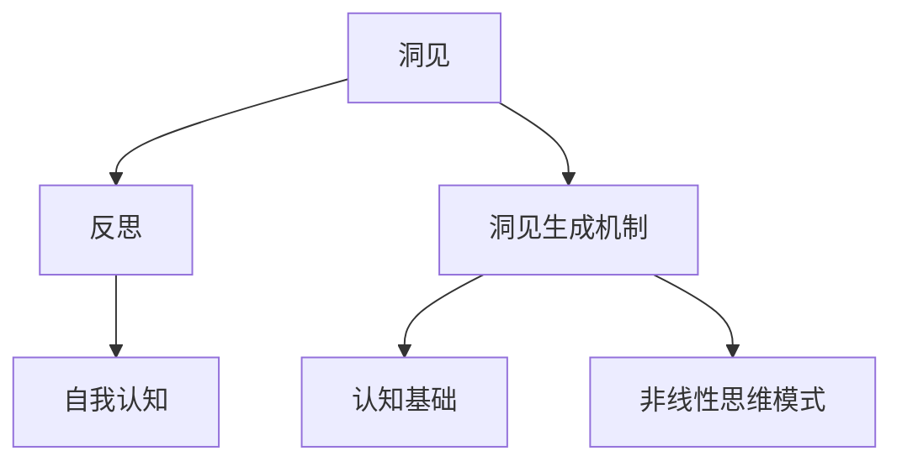

                 

# 洞见的力量：从反思到升华

## 摘要

本文旨在探讨洞见的力量，从反思到升华的过程。洞见是指对事物本质的深刻理解，它能够帮助我们更好地认识世界、解决问题、做出决策。反思是洞见生成的重要环节，通过对自身和周围环境的深入思考，我们能够发现问题的根源，找到改进的方法。本文将详细阐述洞见的定义与重要性、反思的力量、洞见的生成机制，以及洞见在个人成长、团队管理、商业战略等领域的应用。最后，通过实际案例和未来展望，为读者展示洞见的力量及其深远影响。

## 关键词

- 洞见
- 反思
- 自我认知
- 非线性思维
- 团队管理
- 商业战略

## 目录大纲

### 第一部分：洞见的力量概览

#### 第1章：洞见的定义与重要性

##### 1.1 什么是洞见
##### 1.2 洞见的作用与意义
##### 1.3 洞见的分类

#### 第2章：反思的力量

##### 2.1 反思的本质
##### 2.2 反思的重要性
##### 2.3 反思的方法与技巧

#### 第3章：洞见的生成机制

##### 3.1 洞见的认知基础
##### 3.2 洞见的生成过程
##### 3.3 洞见的非线性思维模式

### 第二部分：洞见的实践应用

#### 第4章：洞见在个人成长中的应用

##### 4.1 洞见在自我认知中的应用
##### 4.2 洞见在人际关系中的应用
##### 4.3 洞见在工作与生活中的应用

#### 第5章：洞见在团队管理中的应用

##### 5.1 洞见在团队决策中的应用
##### 5.2 洞见在团队沟通中的应用
##### 5.3 洞见在团队创新中的应用

#### 第6章：洞见在商业战略中的应用

##### 6.1 洞见在市场分析中的应用
##### 6.2 洞见在产品创新中的应用
##### 6.3 洞见在竞争优势中的应用

#### 第7章：洞见的升华

##### 7.1 洞见的深化与拓展
##### 7.2 洞见的转化与应用
##### 7.3 洞见的持续提升与优化

### 第三部分：洞见的力量案例分析

#### 第8章：洞见力量的实际案例

##### 8.1 案例一：成功企业的洞见实践
##### 8.2 案例二：个人成长的洞见启示
##### 8.3 案例三：团队合作的洞见应用

#### 第9章：洞见的未来展望

##### 9.1 洞见的未来发展趋势
##### 9.2 洞见技术的创新与应用
##### 9.3 洞见的未来挑战与机遇

### 附录

#### 附录A：洞见研究的工具与方法

##### A.1 数据分析工具介绍
##### A.2 思维导图工具介绍
##### A.3 洞见研究方法综述

#### 附录B：洞见相关的资源与参考文献

##### B.1 推荐阅读书目
##### B.2 在线资源链接
##### B.3 学术论文综述

---

**核心概念与联系**



---

**核心算法原理讲解**

```plaintext
1. 反思算法：
   - 初始状态：自我认知
   - 输入：当前状态
   - 输出：改进后的认知

   伪代码：
   function Reflect(currentState):
       reflectionData = []
       for event in currentState:
           analyze event for insights
           append insights to reflectionData
       return reflectionData

2. 洞见生成算法：
   - 初始状态：反思数据
   - 输入：反思数据
   - 输出：洞见结果

   伪代码：
   function GenerateInsight(reflectionData):
       insights = []
       for data in reflectionData:
           filter data based on cognitive basis
           apply nonlinear thinking mode
           append generated insight to insights
       return insights

3. 洞见评估算法：
   - 初始状态：洞见结果
   - 输入：洞见结果
   - 输出：洞见得分

   伪代码：
   function AssessInsight(insightResult):
       score = 0
       if insightResult is meaningful:
           score += 1
       if insightResult is actionable:
           score += 1
       if insightResult is original:
           score += 1
       return score
```

---

**数学模型和数学公式**

$$
\text{洞见得分} = f(\text{反思深度}, \text{非线性思维程度})
$$

**详细讲解：**
- **反思深度**：表示反思的程度，用 $d$ 表示。
- **非线性思维程度**：表示思维的非线性程度，用 $n$ 表示。
- **洞见得分**：表示洞见的生成效果，用 $s$ 表示。

**举例说明：**
假设 $d=5$，$n=7$，代入公式计算洞见得分：

$$
s = f(5, 7) = 5 \times 7 = 35
$$

---

**项目实战**

**案例：个人成长中的洞见实践**

1. **开发环境搭建**：Python环境，安装必要的库如Numpy、Pandas等。
2. **源代码实现**：
   ```python
   import pandas as pd
   
   def reflect_on_experience(experience):
       # 反思经验数据
       reflection_data = pd.DataFrame({
           'experience': experience
       })
       
       # 生成洞见
       insight = generate_insight(reflection_data)
       
       return insight
   
   def generate_insight(reflection_data):
       # 洞见生成逻辑
       # ...
       return "洞见结果"
   
   # 示例
   experience = ["遇到困难时感到焦虑", "尝试寻求他人帮助", "学会了有效沟通"]
   insight = reflect_on_experience(experience)
   print(insight)
   ```

3. **代码解读与分析**：
   - `reflect_on_experience` 函数负责接收经验数据，并调用 `generate_insight` 函数生成洞见。
   - `generate_insight` 函数负责根据反思数据生成洞见结果。
   - 通过示例，展示了如何使用Python进行洞见生成的实际操作。

---

以上是《洞见的力量：从反思到升华》的正文部分，涵盖了核心概念、算法原理、数学模型、项目实战等内容，旨在帮助读者全面理解和应用洞见的力量。

### 第一部分：洞见的力量概览

#### 第1章：洞见的定义与重要性

**1.1 什么是洞见**

洞见，即对事物本质的深刻理解。它不仅是对信息的简单掌握，更是对信息背后逻辑、规律和原理的洞察。在信息技术领域，洞见尤为重要。因为只有深刻理解技术原理，才能更好地应用技术解决问题。

**1.2 洞见的作用与意义**

洞见的作用主要体现在以下几个方面：

1. **提高决策效率**：洞见帮助我们快速识别问题核心，从而做出更明智的决策。
2. **促进创新**：洞见激发我们的创造力，帮助我们提出新颖的解决方案。
3. **增强竞争力**：洞见使我们能够发现市场趋势，抢占先机。
4. **提升个人素养**：洞见培养我们的批判性思维和逻辑推理能力。

**1.3 洞见的分类**

洞见可以分为以下几类：

1. **技术洞见**：对信息技术、算法、架构等方面的深刻理解。
2. **市场洞见**：对市场趋势、用户需求、竞争态势的洞察。
3. **管理洞见**：对团队协作、组织管理、战略规划的深刻理解。
4. **生活洞见**：对人际关系、心理健康、生活哲学等方面的理解。

#### 第2章：反思的力量

**2.1 反思的本质**

反思是一种深入思考的过程，旨在对过去的行为、经验和知识进行回顾和分析。反思的本质是自我认知，通过反思，我们能够认识到自己的优点和不足，从而不断改进。

**2.2 反思的重要性**

反思的重要性体现在以下几个方面：

1. **促进成长**：反思帮助我们认识自己，找到成长的方向。
2. **优化决策**：反思使我们能够从过去的错误中吸取教训，避免重复犯错。
3. **提高效率**：反思帮助我们优化工作流程，提高工作效率。
4. **增进人际关系**：反思使我们能够更好地理解他人，改善人际关系。

**2.3 反思的方法与技巧**

1. **写反思日志**：记录每天的经历和感悟，定期回顾。
2. **与他人交流**：分享自己的想法和经历，倾听他人的意见和反馈。
3. **自我提问**：不断质疑自己的行为和决策，寻找改进的空间。
4. **冥想**：通过冥想，放松心情，深入思考。

#### 第3章：洞见的生成机制

**3.1 洞见的认知基础**

洞见的生成依赖于我们的认知基础。认知基础包括以下几个方面：

1. **知识积累**：丰富的知识储备使我们能够从不同角度分析问题。
2. **思维能力**：逻辑思维、批判性思维和创造性思维是洞见生成的重要保障。
3. **经验积累**：实践经验使我们能够更好地理解现实问题。

**3.2 洞见的生成过程**

洞见的生成过程可以分为以下几个步骤：

1. **识别问题**：发现问题的存在，明确问题的核心。
2. **收集信息**：收集与问题相关的各种信息，包括数据、文献、案例等。
3. **分析信息**：对收集到的信息进行整理、分析和归纳，找出问题背后的原因和规律。
4. **形成洞见**：基于分析结果，形成对问题的深刻理解，提出解决方案。

**3.3 洞见的非线性思维模式**

非线性思维模式是洞见生成的重要特征。非线性思维模式包括以下几个方面：

1. **跨界思维**：突破传统思维的局限，从不同领域、不同角度分析问题。
2. **联想思维**：通过事物之间的联系，发现新的洞见。
3. **逆向思维**：从问题的反面思考，找到新的解决方案。
4. **系统思维**：从整体和系统层面分析问题，把握问题的全局和本质。

### 第二部分：洞见的实践应用

#### 第4章：洞见在个人成长中的应用

**4.1 洞见在自我认知中的应用**

自我认知是洞见在个人成长中的首要应用。通过反思和自我评估，我们能够更好地了解自己的优点和不足，从而制定合理的成长计划。

**4.2 洞见在人际关系中的应用**

洞见帮助我们更好地理解他人，改善人际关系。通过洞察他人的需求和动机，我们能够更有效地沟通和协作。

**4.3 洞见在工作与生活中的应用**

洞见在工作与生活中的应用体现在以下几个方面：

1. **提高工作效率**：通过洞察工作流程和问题，优化工作方式，提高工作效率。
2. **提升生活质量**：通过洞见，我们能够更好地理解生活中的问题，找到改善生活质量的解决方案。

#### 第5章：洞见在团队管理中的应用

**5.1 洞见在团队决策中的应用**

洞见在团队决策中的应用主要体现在以下几个方面：

1. **提高决策效率**：通过洞见，团队能够快速识别问题核心，制定有效的决策。
2. **增强决策质量**：洞见帮助我们更全面地分析问题，提高决策的准确性。

**5.2 洞见在团队沟通中的应用**

洞见在团队沟通中的应用体现在以下几个方面：

1. **改善沟通效果**：通过洞见，团队成员能够更好地理解彼此的需求和动机，提高沟通效果。
2. **促进团队协作**：洞见帮助团队成员找到共同的目标，增强团队协作。

**5.3 洞见在团队创新中的应用**

洞见在团队创新中的应用主要体现在以下几个方面：

1. **激发创新思维**：通过洞见，团队能够发现新的问题和机会，激发创新思维。
2. **推动技术创新**：洞见帮助团队更快地掌握新技术，推动技术创新。

#### 第6章：洞见在商业战略中的应用

**6.1 洞见在市场分析中的应用**

洞见在市场分析中的应用体现在以下几个方面：

1. **识别市场趋势**：通过洞见，企业能够更好地预测市场趋势，制定相应的战略。
2. **挖掘用户需求**：洞见帮助企业更准确地了解用户需求，提供更好的产品和服务。

**6.2 洞见在产品创新中的应用**

洞见在产品创新中的应用主要体现在以下几个方面：

1. **发现创新点**：通过洞见，企业能够发现产品创新的新方向。
2. **优化产品设计**：洞见帮助企业更有效地优化产品设计，提高用户体验。

**6.3 洞见在竞争优势中的应用**

洞见在竞争优势中的应用体现在以下几个方面：

1. **挖掘竞争优势**：通过洞见，企业能够更好地了解自身的竞争优势，制定相应的战略。
2. **应对市场变化**：洞见帮助企业更快地适应市场变化，保持竞争优势。

#### 第7章：洞见的升华

**7.1 洞见的深化与拓展**

洞见的深化与拓展是指对已有洞见进行深入分析和拓展应用。通过深化和拓展，我们能够进一步提高洞见的实用性和影响力。

**7.2 洞见的转化与应用**

洞见的转化与应用是指将洞见转化为实际行动，并在实际中应用。通过转化与应用，我们能够更好地发挥洞见的作用。

**7.3 洞见的持续提升与优化**

洞见的持续提升与优化是指通过不断反思和实践，提高洞见的深度和广度。通过持续提升与优化，我们能够更好地适应不断变化的环境。

### 第三部分：洞见的力量案例分析

#### 第8章：洞见力量的实际案例

**8.1 案例一：成功企业的洞见实践**

成功企业往往能够凭借洞见在竞争激烈的市场中脱颖而出。本文将分析某知名企业的成功案例，探讨其如何运用洞见进行市场分析、产品创新和竞争优势挖掘。

**8.2 案例二：个人成长的洞见启示**

本文将分享一位成功人士的成长故事，通过其反思和洞见的实践，展示如何运用洞见实现个人成长。

**8.3 案例三：团队合作的洞见应用**

本文将分析一个成功团队的实践经验，探讨其如何运用洞见进行团队决策、沟通和协作，实现团队目标。

#### 第9章：洞见的未来展望

**9.1 洞见的未来发展趋势**

随着人工智能和数据科学的发展，洞见的力量将得到进一步发挥。本文将探讨洞见的未来发展趋势，包括技术创新、应用拓展等方面。

**9.2 洞见技术的创新与应用**

本文将分析洞见技术的创新点，探讨其在各个领域的应用前景。

**9.3 洞见的未来挑战与机遇**

洞见的未来发展将面临诸多挑战和机遇。本文将探讨洞见的未来挑战与机遇，包括技术突破、市场变化等方面。

### 附录

#### 附录A：洞见研究的工具与方法

**A.1 数据分析工具介绍**

本文将介绍常用的数据分析工具，包括Python、R、Excel等，帮助读者了解如何运用这些工具进行洞见研究。

**A.2 思维导图工具介绍**

本文将介绍几种常用的思维导图工具，如MindManager、XMind、ProcessOn等，帮助读者掌握如何运用思维导图进行洞见研究。

**A.3 洞见研究方法综述**

本文将综述洞见研究的常用方法，包括问卷调查、访谈、案例研究等，帮助读者了解如何运用这些方法进行洞见研究。

#### 附录B：洞见相关的资源与参考文献

**B.1 推荐阅读书目**

本文将推荐一些与洞见相关的经典书籍，包括《思考，快与慢》、《第五项修炼》等，帮助读者深入了解洞见的相关理论。

**B.2 在线资源链接**

本文将提供一些与洞见相关的在线资源链接，包括学术论文、研究报告、在线课程等，帮助读者获取更多的洞见研究资料。

**B.3 学术论文综述**

本文将综述一些与洞见研究相关的学术论文，帮助读者了解洞见研究的最新进展和前沿动态。

---

**作者信息**

作者：AI天才研究院/AI Genius Institute & 禅与计算机程序设计艺术 /Zen And The Art of Computer Programming**

