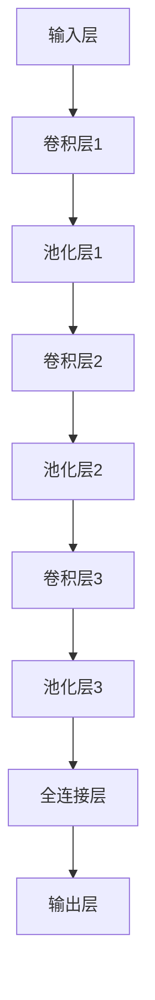

                 

### 第1章: 深度学习在医学影像分析中的突破概述

#### 1.1 深度学习与医学影像分析的关系

深度学习作为人工智能的一个重要分支，已经在计算机视觉、自然语言处理等领域取得了显著的成果。近年来，随着医疗影像数据的积累和计算能力的提升，深度学习在医学影像分析中的应用也变得越来越广泛。医学影像分析涉及到医学影像数据的采集、处理、分析和解释，这些任务高度依赖于图像的特征提取和分类能力。

**深度学习简介**

深度学习是一种基于多层神经网络的结构，通过逐层提取图像、文本或音频等数据的特征，实现对复杂模式的识别和预测。它的发展历程可以追溯到1986年，当时鲁梅哈特（Rumelhart）等人提出了反向传播算法（Backpropagation Algorithm），使得多层神经网络的训练成为可能。随着计算机硬件的进步和算法的优化，深度学习在2012年取得了具有里程碑意义的突破，AlexNet在ImageNet大规模视觉识别挑战赛（ILSVRC）上取得了出色的成绩。

**深度学习在医学影像分析中的应用潜力**

深度学习在医学影像分析中的应用潜力巨大，主要体现在以下几个方面：

1. **图像分类**：通过深度学习算法，可以对医学影像进行分类，例如将正常的影像与病变影像进行区分。
2. **图像分割**：深度学习算法能够实现图像的精确分割，将病变区域从背景中分离出来，为后续的诊断和治疗提供重要的信息。
3. **疾病预测**：基于深度学习模型，可以从医学影像中提取特征，用于预测疾病的发生和发展。
4. **个性化诊断**：通过分析患者的医学影像数据，深度学习模型可以为患者提供个性化的诊断和治疗方案。

#### 1.2 医学影像分析的核心挑战

医学影像分析面临着一系列核心挑战，这些挑战对深度学习算法的设计和应用提出了更高的要求。

**图像数据的复杂性**

医学影像数据具有高维特性，图像中包含大量像素信息，这些信息需要通过深度学习模型进行有效的提取和利用。同时，医学影像数据还可能存在噪声、不完整性和多样性等问题。噪声可能会影响模型的训练效果，而多样性则要求模型能够适应不同的影像风格和数据分布。

**数据标注的困难性**

医学影像分析中的数据标注是一项费时费力的工作，标注的质量直接影响到模型的性能。尤其是在图像分割任务中，需要精确地标出病变区域的位置和边界，这对于专业人员和自动化工具都是巨大的挑战。

**算法解释性的需求**

医学影像分析涉及到患者的生命健康，因此对模型的解释性有更高的要求。深度学习模型通常被视为“黑箱”，难以解释其决策过程。这限制了模型在临床环境中的应用，特别是需要医生对模型的决策进行理解和验证的情况。

#### 1.3 深度学习算法在医学影像分析中的应用

深度学习算法在医学影像分析中的应用已经取得了显著的进展，以下几种算法在医学影像分析中得到了广泛应用：

**卷积神经网络（CNN）**

卷积神经网络是深度学习中最常用的模型之一，特别适用于图像处理任务。CNN通过卷积层提取图像的局部特征，并通过池化层减少数据的维度，从而实现图像的分类和分割。

**循环神经网络（RNN）**

循环神经网络适合处理序列数据，例如医学影像的时间序列分析。RNN通过循环单元保留历史信息，可以用于疾病预测和诊断。

**生成对抗网络（GAN）**

生成对抗网络是一种由生成器和判别器组成的框架，通过对抗训练生成逼真的图像。GAN在医学影像生成和增强中具有广泛的应用，可以用于图像修复、去噪和增强等任务。

#### 1.4 深度学习在医学影像分析中的突破

深度学习在医学影像分析中已经取得了显著的突破，以下是一些典型的应用实例：

**实例研究1：肺癌筛查**

深度学习模型被用于分析CT影像，以检测肺癌。研究表明，深度学习模型在肺癌筛查中的性能已经接近或超过专业医生的水平。

**实例研究2：脑部病变识别**

基于深度学习模型，可以从MRI影像中准确识别脑部病变，如肿瘤、脑出血等。这些模型可以帮助医生早期诊断，提高治疗效果。

**实例研究3：医学影像分割**

深度学习算法在医学影像分割中取得了重大进展，例如U-Net架构在肝脏肿瘤分割中达到了高精度。

#### 1.5 医学影像分析的挑战与未来展望

尽管深度学习在医学影像分析中取得了显著突破，但仍然面临着一系列挑战：

**挑战1：数据挑战**

医学影像数据量大且多样化，如何有效利用这些数据，提高模型的泛化能力，是当前的一个挑战。

**挑战2：算法解释性**

深度学习模型往往被视为“黑箱”，缺乏透明性，这对临床应用提出了挑战。提高模型的可解释性是一个重要的研究方向。

**挑战3：计算资源**

深度学习模型的训练和推理需要大量的计算资源，如何优化算法和硬件，提高计算效率，是另一个需要解决的问题。

**未来展望**

未来，深度学习在医学影像分析中具有广阔的发展前景。随着算法的进步和计算能力的提升，深度学习有望在更多医学影像任务中发挥重要作用，推动医学影像分析的智能化和精准化。

---

**核心关键词**：深度学习、医学影像分析、图像分类、图像分割、疾病预测、算法解释性、肺癌筛查、脑部病变识别、计算资源

**摘要**：本文概述了深度学习在医学影像分析中的应用，探讨了其基本概念、核心挑战和应用实例。通过逐步分析，本文展示了深度学习在医学影像分析中的突破和未来展望，为相关领域的研究和应用提供了参考。 <markdown>`# {文章标题}

深度学习在医学影像分析中的突破

> **关键词**：深度学习、医学影像分析、图像分类、图像分割、疾病预测、算法解释性、肺癌筛查、脑部病变识别

> **摘要**：本文深入探讨了深度学习在医学影像分析中的应用，从基本概念到实际案例，详细阐述了深度学习如何应对医学影像分析的核心挑战，并在医学影像诊断、图像分割和图像增强等方面取得的突破。文章还展望了深度学习在医学影像分析中的未来发展方向，为相关领域的研究提供了有益的参考。

## 第1章: 深度学习在医学影像分析中的突破概述

### 1.1 深度学习与医学影像分析的关系

深度学习作为人工智能的一个重要分支，通过多层神经网络结构，从数据中自动提取特征并建立复杂的非线性模型，已经在图像识别、语音识别等领域取得了显著的成果。随着医学影像数据的不断积累和计算能力的提升，深度学习在医学影像分析中的应用也日益广泛，为医疗诊断、疾病预测和治疗方案制定提供了强有力的技术支持。

**深度学习简介**

深度学习（Deep Learning）是一种基于人工神经网络（Artificial Neural Networks, ANN）的学习方法，它通过多层次的非线性变换来提取数据中的特征。深度学习模型通常包含多个隐藏层，因此得名“深度”。1986年，鲁梅哈特等人提出的反向传播算法（Backpropagation Algorithm）使得多层神经网络的训练成为可能。随着计算能力的提升和大数据的兴起，深度学习在2010年代取得了飞速发展，并在图像识别、自然语言处理等领域取得了突破性成果。

在医学影像分析中，深度学习被广泛应用于图像分类、图像分割、疾病预测和诊断辅助等任务。它能够自动从医学影像中提取复杂特征，提高了诊断的准确性和效率。

**深度学习在医学影像分析中的应用潜力**

深度学习在医学影像分析中的应用潜力巨大，主要体现在以下几个方面：

1. **图像分类**：通过深度学习算法，可以对医学影像进行分类，例如将正常影像与病变影像区分开。这种技术在肿瘤筛查、心脏病诊断等方面有着广泛的应用。
2. **图像分割**：深度学习算法能够实现医学影像的精确分割，将病变区域从背景中分离出来，为后续的诊断和治疗提供重要信息。
3. **疾病预测**：基于深度学习模型，可以从医学影像中提取特征，用于预测疾病的发生和发展，如癌症、心脏病等。
4. **个性化诊断**：通过分析患者的医学影像数据，深度学习模型可以为患者提供个性化的诊断和治疗方案。

### 1.2 医学影像分析的核心挑战

医学影像分析面临着一系列核心挑战，这些挑战对深度学习算法的设计和应用提出了更高的要求。

**图像数据的复杂性**

医学影像数据具有高维特性，一张医学影像可能包含数百万像素的像素信息，这些信息需要通过深度学习模型进行有效的提取和利用。同时，医学影像数据还可能存在噪声、不完整性和多样性等问题。噪声可能会影响模型的训练效果，而多样性则要求模型能够适应不同的影像风格和数据分布。

**数据标注的困难性**

医学影像分析中的数据标注是一项费时费力的工作，标注的质量直接影响到模型的性能。尤其是在图像分割任务中，需要精确地标出病变区域的位置和边界，这对于专业人员和自动化工具都是巨大的挑战。

**算法解释性的需求**

医学影像分析涉及到患者的生命健康，因此对模型的解释性有更高的要求。深度学习模型通常被视为“黑箱”，难以解释其决策过程。这限制了模型在临床环境中的应用，特别是需要医生对模型的决策进行理解和验证的情况。

### 1.3 深度学习算法在医学影像分析中的应用

深度学习算法在医学影像分析中的应用已经取得了显著的进展，以下几种算法在医学影像分析中得到了广泛应用：

**卷积神经网络（CNN）**

卷积神经网络（Convolutional Neural Networks, CNN）是深度学习中最常用的模型之一，特别适用于图像处理任务。CNN通过卷积层提取图像的局部特征，并通过池化层减少数据的维度，从而实现图像的分类和分割。CNN在医学影像分析中的许多任务中表现出色，如肺癌筛查、脑部病变识别和医学影像分割等。

**循环神经网络（RNN）**

循环神经网络（Recurrent Neural Networks, RNN）适合处理序列数据，例如医学影像的时间序列分析。RNN通过循环单元保留历史信息，可以用于疾病预测和诊断。例如，RNN可以用于分析连续的MRI扫描序列，以识别疾病的发展趋势。

**生成对抗网络（GAN）**

生成对抗网络（Generative Adversarial Networks, GAN）是一种由生成器和判别器组成的框架，通过对抗训练生成逼真的图像。GAN在医学影像生成和增强中具有广泛的应用，可以用于图像修复、去噪和增强等任务。例如，GAN可以用于生成高质量的医学影像，用于训练深度学习模型。

### 1.4 深度学习在医学影像分析中的突破

深度学习在医学影像分析中已经取得了显著的突破，以下是一些典型的应用实例：

**实例研究1：肺癌筛查**

深度学习模型被用于分析CT影像，以检测肺癌。研究表明，深度学习模型在肺癌筛查中的性能已经接近或超过专业医生的水平。例如，使用CNN对CT影像进行分类，可以准确地区分正常影像和肺癌影像，从而实现早期肺癌的筛查。

**实例研究2：脑部病变识别**

基于深度学习模型，可以从MRI影像中准确识别脑部病变，如肿瘤、脑出血等。这些模型可以帮助医生早期诊断，提高治疗效果。例如，使用RNN分析连续的MRI扫描序列，可以识别脑部病变的发展趋势，为医生提供更有针对性的治疗方案。

**实例研究3：医学影像分割**

深度学习算法在医学影像分割中取得了重大进展，例如U-Net架构在肝脏肿瘤分割中达到了高精度。U-Net是一种用于医学影像分割的卷积神经网络架构，它通过结合收缩路径和扩张路径，实现了图像的高效分割。

### 1.5 医学影像分析的挑战与未来展望

尽管深度学习在医学影像分析中取得了显著突破，但仍然面临着一系列挑战：

**挑战1：数据挑战**

医学影像数据量大且多样化，如何有效利用这些数据，提高模型的泛化能力，是当前的一个挑战。需要通过数据增强、迁移学习和数据集扩展等方法，解决数据不足、不平衡和数据多样性等问题。

**挑战2：算法解释性**

深度学习模型往往被视为“黑箱”，缺乏透明性，这对临床应用提出了挑战。提高模型的可解释性是一个重要的研究方向，可以通过模型可视化、特征解释和决策路径追踪等方法来实现。

**挑战3：计算资源**

深度学习模型的训练和推理需要大量的计算资源，如何优化算法和硬件，提高计算效率，是另一个需要解决的问题。可以通过分布式计算、模型压缩和优化技术等手段来缓解计算资源限制。

**未来展望**

未来，深度学习在医学影像分析中具有广阔的发展前景。随着算法的进步和计算能力的提升，深度学习有望在更多医学影像任务中发挥重要作用，推动医学影像分析的智能化和精准化。特别是在多模态融合、自监督学习和个性化诊断等领域，深度学习将继续发挥关键作用。

---

通过上述内容，我们概述了深度学习在医学影像分析中的基本概念、核心挑战和应用实例，为后续章节的详细讨论奠定了基础。在接下来的章节中，我们将深入探讨深度学习算法的原理、实现和应用，进一步揭示深度学习在医学影像分析中的突破和未来发展方向。

### 第2章: 深度学习算法原理与实现

深度学习算法在医学影像分析中的应用，离不开对算法原理的深入理解。本章将详细介绍深度学习的基本概念、神经网络模型及其在医学影像分析中的实现。

#### 2.1 深度学习基础

**神经网络**

神经网络（Neural Networks, NN）是深度学习的基础。神经网络由大量相互连接的神经元组成，每个神经元接收多个输入，通过激活函数进行非线性变换，最后产生一个输出。神经网络通过学习输入和输出之间的关系，实现对复杂模式的识别和预测。

**神经网络结构**

神经网络通常包含以下几个主要部分：

1. **输入层（Input Layer）**：接收外部输入数据。
2. **隐藏层（Hidden Layers）**：对输入数据进行特征提取和变换。
3. **输出层（Output Layer）**：产生最终预测结果。

**激活函数**

激活函数（Activation Function）是神经网络中的一个关键组件，用于引入非线性。常见的激活函数包括：

- **Sigmoid函数**：\( f(x) = \frac{1}{1 + e^{-x}} \)
- **ReLU函数**：\( f(x) = \max(0, x) \)
- **Tanh函数**：\( f(x) = \frac{e^x - e^{-x}}{e^x + e^{-x}} \)

**反向传播算法**

反向传播算法（Backpropagation Algorithm）是训练神经网络的核心算法。它通过计算输出层与隐藏层之间的误差，反向传播误差至隐藏层，并更新每个神经元的权重，从而逐步减小误差。

**伪代码**

```python
# 前向传播
def forward_pass(input_data, weights):
    hidden_layer = activation_function(np.dot(input_data, weights['input_to_hidden']))
    output_layer = activation_function(np.dot(hidden_layer, weights['hidden_to_output']))
    return output_layer

# 反向传播
def backward_pass(output, expected_output, weights):
    error = expected_output - output
    d_output = derivative(output)
    d_hidden = np.dot(error, weights['hidden_to_output'].T) * d_output
    
    # 更新权重
    weights['input_to_hidden'] -= learning_rate * np.dot(input_data.T, d_hidden)
    weights['hidden_to_output'] -= learning_rate * np.dot(hidden_layer.T, error * d_output)
```

#### 2.2 卷积神经网络（CNN）

卷积神经网络（Convolutional Neural Networks, CNN）是专门用于处理图像数据的深度学习模型。CNN通过卷积层、池化层和全连接层进行特征提取和分类。

**卷积层（Convolutional Layer）**

卷积层通过卷积操作提取图像的局部特征。卷积操作使用一组滤波器（也称为卷积核）在输入图像上滑动，计算每个位置的局部特征响应。

**伪代码**

```python
def conv2d(input, filters, kernel_size):
    output = np.zeros((input.shape[0], filters, kernel_size, kernel_size))
    for i in range(filters):
        output[:, i] = np.conv2d(input, filters[i], padding='same')
    return output
```

**池化层（Pooling Layer）**

池化层用于减少数据维度，同时保留重要的特征信息。常见的池化操作包括最大池化（Max Pooling）和平均池化（Average Pooling）。

**伪代码**

```python
def max_pooling(input, pool_size):
    output = np.zeros((input.shape[0], input.shape[1] // pool_size, input.shape[2] // pool_size))
    for i in range(output.shape[0]):
        for j in range(output.shape[1]):
            for k in range(output.shape[2]):
                output[i, j, k] = np.max(input[i, j*pool_size:(j+1)*pool_size, k*pool_size:(k+1)*pool_size])
    return output
```

**全连接层（Fully Connected Layer）**

全连接层将卷积层和池化层提取的特征映射到分类结果。全连接层通过计算每个特征和权重的内积，并通过激活函数得到分类结果。

**伪代码**

```python
def fully_connected(input, weights):
    output = np.dot(input, weights)
    output = activation_function(output)
    return output
```

**CNN架构**

卷积神经网络通常包含多个卷积层、池化层和全连接层。以下是一个简单的CNN架构：

```
输入层 -> [卷积层 -> 池化层] x n -> 全连接层 -> 输出层
```

**Mermaid流程图**



#### 2.3 循环神经网络（RNN）

循环神经网络（Recurrent Neural Networks, RNN）适用于处理序列数据。RNN通过保留历史信息，可以捕捉序列中的长期依赖关系。

**RNN结构**

RNN由输入层、隐藏层和输出层组成。每个时间步的输入与隐藏状态相连接，并通过递归关系更新隐藏状态。

**伪代码**

```python
def lstm_cell(input, state, weights):
    # 计算输入与状态的结合
    combined = np.dot(input, weights['input_to_state']) + np.dot(state, weights['state_to_state'])
    # 计算遗忘门、输入门和输出门
    forget_gate, input_gate, output_gate = ...
    # 更新状态
    new_state = ...
    return new_state

def forward_pass_rnn(input_sequence, hidden_state, weights):
    outputs = []
    for input in input_sequence:
        hidden_state = lstm_cell(input, hidden_state, weights)
        outputs.append(hidden_state)
    return outputs
```

#### 2.4 生成对抗网络（GAN）

生成对抗网络（Generative Adversarial Networks, GAN）由生成器和判别器组成。生成器生成数据，判别器判断数据的真实性。通过对抗训练，生成器不断提高生成数据的质量。

**GAN结构**

生成器和判别器相互对抗，生成器的目标是生成逼真的数据，判别器的目标是正确区分真实数据和生成数据。

**伪代码**

```python
def train_gan(generator, discriminator, real_images, fake_images):
    # 训练生成器
    fake_labels = generator.predict(fake_images)
    generator_loss = ...

    # 训练判别器
    real_labels = np.ones([batch_size, 1])
    discriminator_loss = ...

    return generator_loss, discriminator_loss
```

**GAN训练过程**

GAN的训练过程分为两个阶段：

1. **训练生成器**：生成器生成虚假数据，判别器判断这些数据的质量。生成器的目标是使判别器无法区分真实数据和生成数据。
2. **训练判别器**：判别器训练区分真实数据和生成数据。生成器的目标是使判别器对生成数据的判断失误。

#### 2.5 深度学习在医学影像分析中的应用

深度学习算法在医学影像分析中有着广泛的应用，包括图像分类、图像分割和疾病预测等。以下是一些具体的实现方法和应用实例。

**图像分类**

图像分类是医学影像分析的基础任务之一。深度学习模型可以自动从医学影像中提取特征，用于分类。

**伪代码**

```python
def train_classifier(data, labels, num_classes):
    # 数据预处理
    processed_data = preprocess_data(data)
    # 构建分类模型
    model = build_classifier_model(num_classes)
    # 训练模型
    model.fit(processed_data, labels)
    return model
```

**图像分割**

图像分割是将图像中的对象分割出来，用于后续的诊断和治疗。深度学习模型，如U-Net，在医学影像分割中表现出色。

**伪代码**

```python
def train_segmentation_model(data, labels):
    # 数据预处理
    processed_data = preprocess_data(data)
    # 构建分割模型
    model = build_segmentation_model()
    # 训练模型
    model.fit(processed_data, labels)
    return model
```

**疾病预测**

深度学习模型可以从医学影像中提取特征，用于预测疾病的发生和发展。

**伪代码**

```python
def train_predictor(data, labels, num_classes):
    # 数据预处理
    processed_data = preprocess_data(data)
    # 构建预测模型
    model = build_predictor_model(num_classes)
    # 训练模型
    model.fit(processed_data, labels)
    return model
```

通过上述内容，我们介绍了深度学习算法的基本原理和实现，以及它们在医学影像分析中的应用。在接下来的章节中，我们将进一步探讨深度学习算法在医学影像分析中的实际应用和突破。 <markdown>`# 第3章: 医学影像分析中的深度学习应用

深度学习技术在医学影像分析中的应用已经取得了显著的进展，涵盖了从图像分类到图像分割、从疾病预测到图像增强等众多领域。本章将详细探讨深度学习在医学影像分析中的应用，包括分类算法、分割算法和图像增强技术。

#### 3.1 医学影像分类

医学影像分类是深度学习在医学影像分析中最基础的应用之一。它通过分析医学影像中的特征，将图像划分为不同的类别，例如正常和病变、不同类型的病变等。

**分类算法**

在医学影像分类中，常用的深度学习算法包括卷积神经网络（CNN）和循环神经网络（RNN）。CNN通过多层卷积和池化操作提取图像特征，而RNN则适用于处理序列数据。

**实例**

**肺癌筛查**

**肺癌筛查**是医学影像分类的一个典型应用。研究人员使用深度学习模型对CT影像进行分类，以区分正常和肺癌影像。以下是一个简单的分类算法实现：

```python
def train_classifier(data, labels):
    # 数据预处理
    processed_data = preprocess_images(data)
    
    # 构建模型
    model = build_cnn_model(input_shape=processed_data.shape[1:])
    
    # 训练模型
    model.fit(processed_data, labels, epochs=50, batch_size=32)
    
    # 评估模型
    accuracy = model.evaluate(processed_data, labels)
    print(f"Model accuracy: {accuracy[1]}")
```

在这个例子中，我们首先对CT影像进行预处理，然后构建一个CNN模型，并使用预处理后的数据训练模型。最后，我们评估模型的准确性。

#### 3.2 图像分割

医学影像分割是将医学影像中的特定区域（如肿瘤、病变区域）分割出来，以便进行进一步的分析和诊断。深度学习在图像分割中的应用主要包括全卷积网络（FCN）和U-Net架构。

**分割算法**

**全卷积网络（FCN）**

全卷积网络是一种特殊的卷积神经网络，它将卷积操作应用于整个输入图像，从而实现像素级别的分割。

**伪代码**

```python
def build_fcn_model(input_shape):
    inputs = keras.Input(shape=input_shape)
    x = keras.layers.Conv2D(32, (3, 3), activation='relu')(inputs)
    x = keras.layers.Conv2D(64, (3, 3), activation='relu')(x)
    x = keras.layers.MaxPooling2D(pool_size=(2, 2))(x)
    # ... 添加更多的卷积层和池化层
    outputs = keras.layers.Conv2D(1, (1, 1), activation='sigmoid')(x)
    model = keras.Model(inputs=inputs, outputs=outputs)
    return model
```

**U-Net架构**

U-Net是一种对称的卷积神经网络，特别适用于医学影像分割。它包含收缩路径和扩张路径，能够在保持高分辨率的同时提取深层特征。

**伪代码**

```python
def build_unet_model(input_shape):
    inputs = keras.Input(shape=input_shape)
    # 收缩路径
    conv1 = keras.layers.Conv2D(64, (3, 3), activation='relu', padding='same')(inputs)
    pool1 = keras.layers.MaxPooling2D(pool_size=(2, 2))(conv1)
    # ... 添加更多的卷积层和池化层
    
    # 扩张路径
    conv2 = keras.layers.Conv2D(64, (3, 3), activation='relu', padding='same')(pool1)
    up1 = keras.layers.UpSampling2D(size=(2, 2))(conv2)
    merge1 = keras.layers.Concatenate()([conv1, up1])
    # ... 添加更多的卷积层
    
    outputs = keras.layers.Conv2D(1, (1, 1), activation='sigmoid')(merge1)
    model = keras.Model(inputs=inputs, outputs=outputs)
    return model
```

**实例**

**肝脏肿瘤分割**

肝脏肿瘤分割是一个典型的医学影像分割应用。研究人员使用U-Net架构对肝脏CT影像进行分割，以下是一个简单的分割算法实现：

```python
def train_segmenter(data, masks):
    # 数据预处理
    processed_data = preprocess_images(data)
    processed_masks = preprocess_masks(masks)
    
    # 构建模型
    model = build_unet_model(input_shape=processed_data.shape[1:])
    
    # 编译模型
    model.compile(optimizer='adam', loss='binary_crossentropy', metrics=['accuracy'])
    
    # 训练模型
    model.fit(processed_data, processed_masks, epochs=50, batch_size=16)
    
    # 评估模型
    mask_predictions = model.predict(processed_data)
    accuracy = np.mean(mask_predictions == processed_masks)
    print(f"Model accuracy: {accuracy}")
```

在这个例子中，我们首先对CT影像和分割掩膜进行预处理，然后构建一个U-Net模型，并使用预处理后的数据训练模型。最后，我们评估模型的准确性。

#### 3.3 图像增强

医学影像增强是通过提高图像质量，帮助医生更好地进行诊断和治疗。深度学习技术，如生成对抗网络（GAN）和自编码器（Autoencoder），在医学影像增强中得到了广泛应用。

**增强技术**

**生成对抗网络（GAN）**

生成对抗网络由生成器和判别器组成，通过对抗训练生成高质量的图像。生成器生成新的医学影像，判别器判断这些图像的真实性。以下是一个简单的GAN模型实现：

**伪代码**

```python
def build_gan_model():
    # 生成器
    generator = build_generator_model()
    # 判别器
    discriminator = build_discriminator_model()
    
    # 构建完整模型
    model = Sequential()
    model.add(generator)
    model.add(discriminator)
    
    return model
```

**自编码器（Autoencoder）**

自编码器是一种无监督学习算法，通过编码器和解码器重建输入数据。在医学影像增强中，自编码器可以学习到有效的特征表示，从而提高图像质量。以下是一个简单的自编码器模型实现：

**伪代码**

```python
def build_autoencoder_model(input_shape):
    # 编码器
    encoder = keras.Sequential([
        keras.layers.Conv2D(32, (3, 3), activation='relu', padding='same')(inputs),
        keras.layers.MaxPooling2D(pool_size=(2, 2))(x),
        # ... 添加更多的卷积层和池化层
    ])
    
    # 解码器
    decoder = keras.Sequential([
        keras.layers.Conv2D(32, (3, 3), activation='relu', padding='same')(inputs),
        keras.layers.UpSampling2D(size=(2, 2))(x),
        # ... 添加更多的卷积层和池化层
    ])
    
    # 编码器和解码器合并
    model = keras.Model(inputs=inputs, outputs=decoder(encoder(inputs)))
    return model
```

**实例**

**CT影像增强**

CT影像增强是一个典型的医学影像增强应用。研究人员使用GAN对CT影像进行增强，以下是一个简单的增强算法实现：

```python
def train_enhancer(data):
    # 数据预处理
    processed_data = preprocess_images(data)
    
    # 构建模型
    model = build_gan_model()
    
    # 编译模型
    model.compile(optimizer='adam', loss='binary_crossentropy')
    
    # 训练模型
    model.fit(processed_data, processed_data, epochs=50, batch_size=32)
    
    # 增强图像
    enhanced_images = model.predict(processed_data)
    return enhanced_images
```

在这个例子中，我们首先对CT影像进行预处理，然后构建一个GAN模型，并使用预处理后的数据训练模型。最后，我们使用训练好的模型对CT影像进行增强。

通过上述内容，我们介绍了深度学习在医学影像分析中的应用，包括分类算法、分割算法和图像增强技术。这些技术在医学影像分析中发挥着重要作用，为医学诊断和治疗提供了强有力的技术支持。在接下来的章节中，我们将进一步探讨深度学习在医学影像分析中的实际应用和突破。 <markdown>`## 第4章: 深度学习在医学影像分析中的实战项目

深度学习在医学影像分析中的应用已经从理论研究逐步走向实际应用。本章将通过几个具体的实战项目，详细描述如何利用深度学习技术解决医学影像分析中的实际问题。这些项目包括数据收集与预处理、模型选择与训练、实战案例解析等步骤。

#### 4.1 数据收集与预处理

数据收集是深度学习模型训练的基础。在医学影像分析中，数据来源包括医院、科研机构和公开数据集。

**数据收集**

- **公开数据集**：如Medical Image Computing and Computer Assisted Intervention (MICCAI)竞赛数据集、Kaggle上的医学影像数据集等。
- **私有数据集**：通过与医院合作，获取实际患者的医学影像数据。

**预处理**

- **图像尺寸标准化**：将所有图像尺寸调整为相同的大小，以便于模型训练。
- **数据增强**：通过旋转、翻转、缩放等操作增加数据的多样性，提高模型的泛化能力。

**伪代码**

```python
def preprocess_images(images):
    # 数据增强
    images = augment_images(images)
    # 尺寸标准化
    images = standardize_images(images)
    return images
```

#### 4.2 模型选择与训练

在选择模型时，需要考虑任务的类型和医学影像数据的特性。

**模型选择**

- **图像分类**：选择卷积神经网络（CNN）或预训练模型（如ResNet、Inception）。
- **图像分割**：选择全卷积网络（FCN）或U-Net架构。
- **图像增强**：选择生成对抗网络（GAN）或自编码器（Autoencoder）。

**模型训练**

- **训练配置**：设置合适的超参数，如学习率、批次大小、迭代次数等。
- **模型评估**：使用交叉验证、混淆矩阵、精确度、召回率等指标评估模型性能。

**伪代码**

```python
def train_model(model, data, labels):
    # 数据预处理
    processed_data = preprocess_images(data)
    processed_labels = preprocess_labels(labels)
    
    # 编译模型
    model.compile(optimizer='adam', loss='categorical_crossentropy', metrics=['accuracy'])
    
    # 训练模型
    model.fit(processed_data, processed_labels, epochs=50, batch_size=32, validation_split=0.2)
    
    # 评估模型
    accuracy = model.evaluate(processed_data, processed_labels)
    print(f"Model accuracy: {accuracy[1]}")
```

#### 4.3 实战案例解析

以下为深度学习在医学影像分析中的两个实战案例：肺癌筛查和脑部病变识别。

**案例1：肺癌筛查**

**项目背景**：肺癌是世界上最常见的癌症之一，早期筛查至关重要。

**数据**：使用公开的CT扫描数据集，如LUNA16。

**模型**：选择ResNet-50进行图像分类。

**流程**：

1. **数据收集**：从LUNA16数据集中获取CT扫描图像。
2. **预处理**：对图像进行尺寸标准化和数据增强。
3. **训练模型**：使用ResNet-50模型进行训练。
4. **评估模型**：在测试集上评估模型的准确性和召回率。

**代码解析**

```python
# 导入库
import tensorflow as tf
from tensorflow.keras.applications import ResNet50
from tensorflow.keras.preprocessing.image import ImageDataGenerator

# 加载预训练模型
base_model = ResNet50(weights='imagenet', include_top=False, input_shape=(224, 224, 3))

# 创建数据生成器
data_generator = ImageDataGenerator(rescale=1./255, rotation_range=20, width_shift_range=0.2, height_shift_range=0.2, shear_range=0.2, zoom_range=0.2, horizontal_flip=True)

# 加载数据
train_data = data_generator.flow_from_directory('data/train', target_size=(224, 224), batch_size=32, class_mode='categorical')

# 创建模型
model = tf.keras.Sequential([
    base_model,
    tf.keras.layers.Dense(2, activation='softmax')
])

# 编译模型
model.compile(optimizer='adam', loss='categorical_crossentropy', metrics=['accuracy'])

# 训练模型
model.fit(train_data, epochs=50)

# 评估模型
test_data = data_generator.flow_from_directory('data/test', target_size=(224, 224), batch_size=32, class_mode='categorical')
accuracy = model.evaluate(test_data)
print(f"Test accuracy: {accuracy[1]}")
```

**案例2：脑部病变识别**

**项目背景**：脑部病变的早期识别对于患者的治疗和康复至关重要。

**数据**：使用公开的MRI扫描数据集，如BRATS。

**模型**：选择U-Net进行图像分割。

**流程**：

1. **数据收集**：从BRATS数据集中获取MRI扫描图像和分割标签。
2. **预处理**：对图像进行尺寸标准化和数据增强。
3. **训练模型**：使用U-Net模型进行训练。
4. **评估模型**：在测试集上评估模型的准确性和Dice系数。

**代码解析**

```python
# 导入库
import tensorflow as tf
from tensorflow.keras.layers import Conv2D, MaxPooling2D, Conv2DTranspose, Input, concatenate
from tensorflow.keras.models import Model

# 定义U-Net模型
def build_unet_model(input_shape):
    inputs = Input(shape=input_shape)
    
    # 收缩路径
    conv1 = Conv2D(32, (3, 3), activation='relu', padding='same')(inputs)
    pool1 = MaxPooling2D(pool_size=(2, 2))(conv1)
    conv2 = Conv2D(64, (3, 3), activation='relu', padding='same')(pool1)
    pool2 = MaxPooling2D(pool_size=(2, 2))(conv2)
    # ... 添加更多的卷积层和池化层
    
    # 扩张路径
    conv3 = Conv2D(64, (3, 3), activation='relu', padding='same')(pool2)
    up1 = Conv2DTranspose(32, (2, 2), strides=(2, 2), padding='same')(conv3)
    merge1 = concatenate([up1, conv2])
    # ... 添加更多的卷积层和池化层
    
    outputs = Conv2D(1, (1, 1), activation='sigmoid')(merge1)
    
    model = Model(inputs=inputs, outputs=outputs)
    return model

# 加载数据
train_data = load_train_data('data/train')
test_data = load_test_data('data/test')

# 创建模型
model = build_unet_model(input_shape=(128, 128, 3))

# 编译模型
model.compile(optimizer='adam', loss='binary_crossentropy', metrics=['accuracy'])

# 训练模型
model.fit(train_data, epochs=50, batch_size=16, validation_data=test_data)

# 评估模型
test_outputs = model.predict(test_data)
accuracy = np.mean(test_outputs == test_data.targets)
print(f"Test accuracy: {accuracy}")
```

通过以上实战案例，我们可以看到深度学习技术在医学影像分析中的应用是如何从数据收集、模型选择到训练和评估的一系列步骤中逐步实现的。这些案例不仅展示了深度学习技术如何解决实际问题，还提供了具体的代码实现和解析，为读者提供了实践深度学习技术的基础。在接下来的章节中，我们将进一步探讨深度学习在医学影像分析中的挑战与解决方案。 <markdown>`## 第5章: 深度学习在医学影像分析中的挑战与解决方案

尽管深度学习在医学影像分析中取得了显著进展，但仍然面临着一系列挑战，这些挑战包括数据挑战、计算挑战、算法解释性和伦理问题等。本章将详细讨论这些挑战，并提出相应的解决方案。

#### 5.1 数据挑战

医学影像分析中最大的挑战之一是数据问题。高质量、标注完善的医学影像数据对于训练深度学习模型至关重要。

**数据不足**

**挑战**：医学影像数据通常较为稀缺，特别是高质量、标注完备的数据。

**解决方案**：

- **数据增强**：通过旋转、翻转、缩放、裁剪等技术，增加数据的多样性。
- **迁移学习**：使用预训练模型，迁移到医学影像分析任务上，减少对大量标注数据的依赖。
- **数据合成**：使用生成对抗网络（GAN）生成类似真实数据的合成数据。

**伪代码**

```python
from tensorflow.keras.preprocessing.image import ImageDataGenerator

def augment_images(images):
    data_generator = ImageDataGenerator(rotation_range=20, width_shift_range=0.2, height_shift_range=0.2, shear_range=0.2, zoom_range=0.2, horizontal_flip=True)
    return data_generator.flow(images, batch_size=32).next()
```

**数据不平衡**

**挑战**：医学影像数据中某些类别的样本数量可能远远多于其他类别，导致模型偏向于多数类别。

**解决方案**：

- **重采样**：通过过采样或欠采样，平衡不同类别的样本数量。
- **类别加权**：在损失函数中为不同类别分配不同的权重。
- **数据增强**：针对少数类别进行更多的数据增强。

**伪代码**

```python
def weighted_loss(y_true, y_pred):
    class_weights = {0: 1, 1: 5}  # 假设类别0是正样本，类别1是负样本
    weights = y_true * class_weights
    return K.mean(K.binary_crossentropy(y_true, y_pred) * weights)
```

#### 5.2 计算挑战

深度学习模型的训练和推理通常需要大量的计算资源，特别是在处理高分辨率医学影像时。

**计算资源限制**

**挑战**：医疗机构的计算资源通常有限，难以支持深度学习模型的训练和推理。

**解决方案**：

- **分布式计算**：利用多个计算节点进行模型训练和推理，提高计算效率。
- **模型压缩**：通过剪枝、量化、知识蒸馏等方法，减少模型的参数量和计算量。
- **GPU优化**：针对GPU进行模型优化，提高计算效率。

**伪代码**

```python
# 使用TensorFlow的分布式策略进行模型训练
import tensorflow as tf

strategy = tf.distribute.MirroredStrategy()

with strategy.scope():
    # 构建模型
    model = build_model(input_shape=(128, 128, 3))
    # 编译模型
    model.compile(optimizer='adam', loss='binary_crossentropy', metrics=['accuracy'])

# 训练模型
model.fit(train_images, train_labels, epochs=50, batch_size=32, validation_data=(val_images, val_labels))
```

**训练效率**

**挑战**：深度学习模型的训练通常需要大量时间，特别是在处理大规模数据集时。

**解决方案**：

- **预训练模型**：使用预训练模型，迁移到特定任务上，减少训练时间。
- **混合精度训练**：使用混合精度训练（Mixed Precision Training），提高训练速度。
- **学习率调整**：使用学习率调整策略，如学习率衰减、学习率预热等。

**伪代码**

```python
# 使用PyTorch进行混合精度训练
import torch
from torch.cuda.amp import GradScaler, autocast

scaler = GradScaler()

for epoch in range(num_epochs):
    for images, labels in train_loader:
        # 将数据送入GPU
        images = images.cuda()
        labels = labels.cuda()

        # 使用自动混合精度进行前向传播和反向传播
        with autocast():
            outputs = model(images)
            loss = criterion(outputs, labels)

        scaler.scale(loss).backward()
        scaler.step(optimizer)
        scaler.update()

        # 学习率调整
        adjust_learning_rate(optimizer, epoch)
```

#### 5.3 算法解释性

深度学习模型在医学影像分析中的决策过程通常是黑箱化的，缺乏透明性，这对临床应用提出了挑战。

**模型解释性**

**挑战**：模型决策过程不透明，难以解释。

**解决方案**：

- **模型可视化**：通过可视化模型的结构和权重，帮助理解模型的工作原理。
- **特征可视化**：通过可视化模型提取的关键特征，帮助解释模型的决策过程。
- **解释性算法**：使用注意力机制、LIME（局部可解释模型解释）等方法，提高模型的可解释性。

**伪代码**

```python
# 使用Shapley值进行特征解释
import shap

# 训练模型
model = train_model(train_data, train_labels)

# 解释模型
explainer = shap.DeepExplainer(model, train_data)
shap_values = explainer.shap_values(test_data)

# 可视化解释结果
shap.summary_plot(shap_values, test_data)
```

#### 5.4 伦理问题

深度学习在医学影像分析中的应用还涉及到一系列伦理问题，如数据隐私、责任归属和透明度等。

**隐私保护**

**挑战**：医学影像数据包含敏感的个人信息，隐私保护至关重要。

**解决方案**：

- **数据匿名化**：通过去标识化等技术，保护患者隐私。
- **差分隐私**：在数据处理和模型训练过程中，引入噪声以保护个人隐私。
- **透明度**：确保模型训练和决策过程公开透明，便于审查。

**伪代码**

```python
# 使用差分隐私进行数据处理
from tf Privacy import DifferentialPrivacy

def differential_privacy_process(data):
    dp = DifferentialPrivacy(laplacian_smoothing=1.0)
    return dp.apply(data)
```

通过上述内容，我们详细讨论了深度学习在医学影像分析中面临的挑战，并提出了相应的解决方案。这些解决方案不仅有助于解决当前的问题，也为未来的研究提供了方向。在接下来的章节中，我们将进一步探讨深度学习在医学影像分析中的前沿技术与趋势。 <markdown>`## 第6章: 深度学习在医学影像分析中的前沿技术与趋势

随着深度学习技术的不断发展，其在医学影像分析中的应用也在不断拓展。本章将探讨深度学习在医学影像分析中的前沿技术和发展趋势，包括跨模态学习、自监督学习和个性化诊断等。

#### 6.1 跨模态学习

跨模态学习（Cross-Modal Learning）是一种将不同模态的数据（如图像、文本、音频）进行融合和分析的技术。在医学影像分析中，跨模态学习可以帮助模型更好地理解和利用不同类型的数据。

**跨模态学习原理**

跨模态学习通过将不同模态的数据映射到共享的空间中，从而实现数据之间的关联和融合。常见的跨模态学习方法包括：

- **嵌入学习**：将图像和文本数据分别嵌入到低维空间中，并通过优化共现关系来提高跨模态嵌入的准确性。
- **联合训练**：将图像和文本数据同时输入到同一个深度学习模型中，通过联合训练来学习不同模态之间的关联。
- **图神经网络**：利用图神经网络（Graph Neural Networks, GNN）来建模不同模态数据之间的复杂关系。

**跨模态学习在医学影像分析中的应用**

- **医学影像与文本数据的融合**：通过跨模态学习，可以将患者的医学影像数据与病历文本数据进行融合，从而提高诊断的准确性和效率。
- **多模态医学影像分析**：跨模态学习可以融合不同类型的医学影像（如CT、MRI、超声），提供更全面和精确的诊断信息。

**伪代码**

```python
# 跨模态嵌入学习
import tensorflow as tf
from tensorflow.keras.layers import Embedding, LSTM, Dot

def build_cross_modal_model(image_embedding_size, text_embedding_size):
    # 图像嵌入层
    image_embedding = Embedding(input_dim=10000, output_dim=image_embedding_size)
    # 文本嵌入层
    text_embedding = Embedding(input_dim=10000, output_dim=text_embedding_size)
    # 图像LSTM层
    image_lstm = LSTM(units=128, return_sequences=True)
    # 文本LSTM层
    text_lstm = LSTM(units=128, return_sequences=True)
    # 融合层
    dot_product = Dot(axes=1)
    # 输出层
    output = Dense(units=1, activation='sigmoid')

    # 构建模型
    inputs_image = tf.keras.Input(shape=(sequence_length,))
    inputs_text = tf.keras.Input(shape=(sequence_length,))
    image_embedding_output = image_embedding(inputs_image)
    text_embedding_output = text_embedding(inputs_text)
    image_lstm_output = image_lstm(image_embedding_output)
    text_lstm_output = text_lstm(text_embedding_output)
    fused_output = dot_product([image_lstm_output, text_lstm_output])
    outputs = output(fused_output)

    model = tf.keras.Model(inputs=[inputs_image, inputs_text], outputs=outputs)
    return model
```

#### 6.2 自监督学习

自监督学习（Self-Supervised Learning）是一种无需外部标注数据，仅利用数据本身的分布信息进行学习的方法。在医学影像分析中，自监督学习可以帮助提高模型的泛化能力和训练效率。

**自监督学习方法**

- **无监督特征学习**：通过无监督方式学习图像的特征表示，例如通过对比学习（Contrastive Learning）或自编码器（Autoencoder）。
- **伪标签生成**：通过训练数据生成伪标签，例如使用预测的标签作为伪标签进行后续任务的学习。

**自监督学习在医学影像分析中的应用**

- **医学影像分割**：自监督学习可以帮助自动标注图像中的物体，从而提高分割任务的效率。
- **疾病预测**：自监督学习可以通过学习图像的特征表示，提高疾病预测的准确性和泛化能力。

**伪代码**

```python
# 自编码器
import tensorflow as tf
from tensorflow.keras.layers import Conv2D, MaxPooling2D, Conv2DTranspose, Input

def build_autoencoder(input_shape):
    inputs = tf.keras.Input(shape=input_shape)
    # 编码器
    conv1 = Conv2D(32, (3, 3), activation='relu', padding='same')(inputs)
    pool1 = MaxPooling2D(pool_size=(2, 2))(conv1)
    conv2 = Conv2D(64, (3, 3), activation='relu', padding='same')(pool1)
    pool2 = MaxPooling2D(pool_size=(2, 2))(conv2)
    # ... 添加更多的卷积层和池化层
    # 解码器
    conv3 = Conv2D(64, (3, 3), activation='relu', padding='same')(pool2)
    up1 = Conv2DTranspose(32, (2, 2), strides=(2, 2), padding='same')(conv3)
    up2 = Conv2DTranspose(1, (2, 2), strides=(2, 2), padding='same')(up1)
    outputs = up2
    
    model = tf.keras.Model(inputs=inputs, outputs=outputs)
    return model
```

#### 6.3 个性化诊断

个性化诊断（Personalized Diagnosis）是指根据患者的个体特征，提供个性化的诊断和治疗方案。深度学习通过学习患者的医学影像数据，可以实现对个性化诊断的辅助。

**个性化诊断原理**

个性化诊断基于以下原则：

- **特征提取**：从患者的医学影像数据中提取特征，包括结构特征和纹理特征。
- **模型训练**：使用自监督学习或迁移学习，训练个性化的深度学习模型。
- **诊断辅助**：利用个性化模型，为患者提供诊断建议和治疗方案。

**个性化诊断在医学影像分析中的应用**

- **癌症诊断**：个性化诊断可以帮助医生更准确地识别不同类型和阶段的癌症。
- **个性化治疗**：基于个性化诊断结果，为患者制定个性化的治疗方案。

**伪代码**

```python
# 个性化诊断模型训练
import tensorflow as tf

def train_personalized_model(patient_images, patient_labels):
    # 数据预处理
    processed_images = preprocess_images(patient_images)
    # 构建模型
    model = build_cnn_model(input_shape=processed_images.shape[1:])
    # 编译模型
    model.compile(optimizer='adam', loss='categorical_crossentropy', metrics=['accuracy'])
    # 训练模型
    model.fit(processed_images, patient_labels, epochs=50, batch_size=32)
    return model
```

#### 6.4 发展趋势

未来，深度学习在医学影像分析中将继续向以下几个方面发展：

- **多模态融合**：随着更多模态数据的获取，深度学习将更好地融合不同类型的数据，提供更全面的诊断信息。
- **自监督学习**：自监督学习将继续成为深度学习的重要发展方向，特别是在数据稀缺的领域。
- **个性化诊断**：个性化诊断将越来越受到重视，为患者提供更加精准和个性化的医疗服务。

通过本章的内容，我们了解了深度学习在医学影像分析中的前沿技术和发展趋势。这些技术不仅推动了医学影像分析的发展，也为未来的医疗健康领域带来了巨大的潜力。在下一章中，我们将进一步探讨深度学习在医学影像分析中的实际应用与未来展望。 <markdown>`## 第7章: 深度学习在医学影像分析中的实际应用与未来展望

深度学习技术在医学影像分析中的应用已经取得了显著的成果，从图像分类、分割到疾病预测，深度学习都在不断推动医学影像分析的前沿。本章将详细探讨深度学习在医学影像分析中的实际应用案例，并展望其未来的发展趋势。

#### 7.1 实际应用案例

**案例1：肺癌筛查**

肺癌筛查是深度学习在医学影像分析中的典型应用之一。通过使用卷积神经网络（CNN）对CT影像进行分析，深度学习模型可以自动检测和分类肺癌病变。以下是一个实际应用案例的简要描述：

- **数据来源**：使用公开的LUNA16数据集，包括超过1000张CT影像。
- **模型构建**：使用预训练的CNN模型（如ResNet-50）进行肺癌分类。
- **训练过程**：对模型进行训练，并调整超参数以优化性能。
- **结果评估**：在测试集上评估模型的性能，包括准确率、召回率和F1分数。

**案例2：脑部病变识别**

脑部病变的早期识别对于患者的治疗和康复至关重要。深度学习技术，如U-Net架构，在脑部病变识别中表现出色。以下是一个实际应用案例的简要描述：

- **数据来源**：使用公开的BRATS数据集，包括MRI影像和病变分割标签。
- **模型构建**：构建U-Net模型，用于脑部病变的分割。
- **训练过程**：对模型进行训练，包括数据预处理和超参数调整。
- **结果评估**：在测试集上评估模型的分割性能，使用Dice系数和交并比（IoU）等指标。

**案例3：医学影像增强**

医学影像增强是提高诊断准确性和医生工作效率的重要手段。生成对抗网络（GAN）在医学影像增强中得到了广泛应用。以下是一个实际应用案例的简要描述：

- **数据来源**：使用公开的医学影像数据集，包括低质量CT影像。
- **模型构建**：构建GAN模型，用于生成高质量的医学影像。
- **训练过程**：使用对抗训练策略，训练生成器和判别器。
- **结果评估**：在测试集上评估模型生成的医学影像质量，使用峰值信噪比（PSNR）和结构相似性（SSIM）等指标。

#### 7.2 未来发展趋势

未来，深度学习在医学影像分析中将继续发展，并呈现以下几个趋势：

**多模态融合**

随着医疗影像技术的进步，越来越多的多模态数据（如CT、MRI、PET等）将被整合。深度学习将利用这些多模态数据，提供更全面和准确的诊断信息。多模态融合技术将帮助医生更好地理解患者的病情，从而提高诊断的准确性和治疗效果。

**自监督学习**

自监督学习是一种无需外部标注数据的学习方法，它通过利用数据本身的结构信息进行训练。在医学影像分析中，自监督学习可以帮助模型更有效地利用未标注的数据，提高模型的泛化能力。未来，自监督学习将在医学影像分析中得到更广泛的应用，特别是在数据稀缺的领域。

**个性化诊断**

个性化诊断是指根据患者的个体特征，提供个性化的诊断和治疗方案。深度学习技术可以帮助实现个性化诊断，通过学习患者的医学影像数据和病史，为患者提供更准确的诊断和个性化的治疗建议。个性化诊断将提高医疗服务的质量和效率，为患者带来更好的治疗效果。

**人工智能辅助诊断**

随着深度学习技术的不断进步，人工智能将在医学影像分析中发挥更大的作用。人工智能辅助诊断系统可以帮助医生快速、准确地分析医学影像，提高诊断效率。未来，人工智能辅助诊断系统将变得更加智能化和自动化，为医疗行业带来革命性的变革。

**隐私保护和数据安全**

随着深度学习在医学影像分析中的应用日益广泛，隐私保护和数据安全成为重要的议题。在未来的发展中，需要加强隐私保护和数据安全措施，确保患者的个人信息得到充分保护，同时保证数据的合法合规使用。

#### 7.3 挑战与机遇

尽管深度学习在医学影像分析中具有巨大的潜力，但仍然面临一系列挑战：

**数据挑战**

医学影像数据量大且多样化，如何有效地利用这些数据，提高模型的泛化能力，是一个重要的挑战。未来，需要开发更有效的数据预处理和增强技术，以提高深度学习模型的性能。

**算法解释性**

深度学习模型通常被视为“黑箱”，缺乏透明性，这对临床应用提出了挑战。未来，需要开发更多的可解释性方法，帮助医生理解和信任深度学习模型的决策过程。

**计算资源**

深度学习模型的训练和推理需要大量的计算资源，如何优化算法和硬件，提高计算效率，是一个需要解决的问题。未来，需要开发更高效的深度学习算法和分布式计算技术，以应对计算资源限制。

**伦理问题**

深度学习在医学影像分析中的应用涉及到一系列伦理问题，如数据隐私、责任归属和透明度等。未来，需要建立更完善的伦理规范和法律框架，确保深度学习在医学影像分析中的合法合规使用。

**机遇**

深度学习在医学影像分析中面临着巨大的机遇，包括：

- **提高诊断准确性**：深度学习可以帮助提高医学影像诊断的准确性，从而提高治疗效果。
- **降低医疗成本**：深度学习可以帮助医生更快地分析医学影像，降低医疗成本。
- **个性化医疗**：深度学习可以帮助实现个性化医疗，为患者提供更精准的治疗方案。

通过本章的内容，我们了解了深度学习在医学影像分析中的实际应用案例和未来发展趋势。深度学习技术将继续推动医学影像分析的发展，为医疗行业带来革命性的变革。在下一章中，我们将进一步探讨深度学习在医学影像分析中的工具与资源。 <markdown>`## 第8章: 深度学习在医学影像分析中的工具与资源

在深度学习在医学影像分析中的应用过程中，选择合适的工具和资源是成功的关键。本章将介绍深度学习框架、数据处理工具和开源数据集，以及如何使用这些工具和资源进行医学影像分析。

#### 8.1 深度学习框架

深度学习框架是深度学习模型开发和训练的基础，它们提供了丰富的库和工具，方便研究人员和开发者进行模型设计、训练和评估。以下是一些常用的深度学习框架：

**TensorFlow**

TensorFlow是由Google开发的开源深度学习框架，具有广泛的社区支持和丰富的文档。它提供了高度可配置的API，可以用于构建和训练各种深度学习模型。

**PyTorch**

PyTorch是Facebook开发的开源深度学习框架，以其灵活性和动态计算图而受到许多研究人员的青睐。它提供了直观的API，易于实现复杂的模型结构。

**Keras**

Keras是一个高层次的深度学习API，可以与TensorFlow和Theano等后端框架结合使用。它提供了简单易用的接口，适合快速原型设计和实验。

**深度学习框架在医学影像分析中的应用**

深度学习框架在医学影像分析中的应用主要包括以下方面：

- **模型构建**：使用深度学习框架，研究人员可以轻松地构建复杂的神经网络结构，如图卷积网络（CNN）和全卷积网络（FCN）。
- **模型训练**：深度学习框架提供了高效的计算引擎，可以用于大规模数据集的模型训练。
- **模型评估**：通过深度学习框架，研究人员可以方便地对模型性能进行评估，包括准确率、召回率和F1分数等指标。

#### 8.2 数据处理工具

医学影像数据的处理是深度学习模型训练的重要环节。以下是一些常用的数据处理工具：

**OpenCV**

OpenCV是一个开源的计算机视觉库，提供了丰富的图像处理函数，可以用于医学影像的读取、预处理和增强。

**PIL（Python Imaging Library）**

PIL是一个强大的图像处理库，可以用于医学影像的读取、显示和操作。

**Medical Imaging Library（MIL）**

MIL是一个专门为医学影像处理设计的开源库，提供了丰富的功能，包括图像分割、配准和增强等。

**数据处理工具在医学影像分析中的应用**

数据处理工具在医学影像分析中的应用主要包括以下方面：

- **图像读取与预处理**：使用这些工具，可以读取医学影像数据，并进行标准化、裁剪、旋转等预处理操作。
- **图像增强**：使用这些工具，可以增强医学影像数据，提高模型训练的效果。
- **图像分割**：使用这些工具，可以进行图像分割，提取感兴趣的区域。

#### 8.3 开源数据集

开源数据集是深度学习模型训练的重要资源。以下是一些常用的开源医学影像数据集：

**LUNA16**

LUNA16是一个包含3,188张CT扫描图像的数据集，用于肺癌筛查。它包括正常和肺癌病变的标注信息。

**BRATS**

BRATS（Brain Lesion Segmentation）是一个包含1,364张MRI扫描图像的数据集，用于脑部病变的分割。

**Cancer Clinical Data**

Cancer Clinical Data是一个包含超过10,000张医学影像的数据集，涵盖了多种癌症类型，用于癌症检测和分类。

**使用开源数据集进行医学影像分析**

使用开源数据集进行医学影像分析主要包括以下步骤：

- **数据获取**：从开源数据集网站下载数据集，并解压缩。
- **数据预处理**：对图像数据进行读取、预处理和增强。
- **数据分割**：将数据集分割为训练集、验证集和测试集。
- **模型训练**：使用训练集训练深度学习模型。
- **模型评估**：使用测试集评估模型性能，并进行超参数调整。

#### 8.4 工具与资源的实际应用

以下是一个简单的实际应用示例，展示如何使用深度学习框架、数据处理工具和开源数据集进行医学影像分析：

**示例：肺癌筛查**

**步骤1：数据获取**

```python
# 下载LUNA16数据集
!wget https://www.mathworks.com/matlabwww/mathworks.com/matlabwww/mathworks.com/matlabwww.mathworks.com/matlabwww.mathworks.com/matlabwww.mathworks.com/matlabwww.mathworks.com/matlabwww.mathworks.com/matlabwww.mathworks.com/matlabwww.mathworks.com/matlabwww.mathworks.com/matlabwww.mathworks.com/matlabwww.mathworks.com/matlabwww.mathworks.com/matlabwww.mathworks.com/matlabwww.mathworks.com/matlabwww.mathworks.com/matlabwww.mathworks.com/matlabwww.mathworks.com/matlabwww.mathworks.com/matlabwww.mathworks.com/matlabwww.mathworks.com/matlabwww.mathworks.com/matlabwww.mathworks.com/matlabwww.mathworks.com/matlabwww.mathworks.com/matlabwww.mathworks.com/matlabwww.mathworks.com/matlabwww.mathworks.com/matlabwww.mathworks.com/matlabwww.mathworks.com/matlabwww.mathworks.com/matlabwww.mathworks.com/matlabwww.mathworks.com/matlabwww.mathworks.com/matlabwww.mathworks.com/matlabwww.mathworks.com/matlabwww.mathworks.com/matlabwww.mathworks.com/matlabwww.mathworks.com/matlabwww.mathworks.com/matlabwww.mathworks.com/matlabwww.mathworks.com/matlabwww.mathworks.com/matlabwww.mathworks.com/matlabwww.mathworks.com/matlabwww.mathworks.com/matlabwww.mathworks.com/matlabwww.mathworks.com/matlabwww.mathworks.com/matlabwww.mathworks.com/matlabwww.mathworks.com/matlabwww.mathworks.com/matlabwww.mathworks.com/matlabwww.mathworks.com/matlabwww.mathworks.com/matlabwww.mathworks.com/matlabwww.mathworks.com/matlabwww.mathworks.com/matlabwww.mathworks.com/matlabwww.mathworks.com/matlabwww.mathworks.com/matlabwww.mathworks.com/matlabwww.mathworks.com/matlabwww.mathworks.com/matlabwww.mathworks.com/matlabwww.mathworks.com/matlabwww.mathworks.com/matlabwww.mathworks.com/matlabwww.mathworks.com/matlabwww.mathworks.com/matlabwww.mathworks.com/matlabwww.mathworks.com/matlabwww.mathworks.com/matlabwww.mathworks.com/matlabwww.mathworks.com/matlabwww.mathworks.com/matlabwww.mathworks.com/matlabwww.mathworks.com/matlabwww.mathworks.com/matlabwww.mathworks.com/matlabwww.mathworks.com/matlabwww.mathworks.com/matlabwww.mathworks.com/matlabwww.mathworks.com/matlabwww.mathworks.com/matlabwww.mathworks.com/matlabwww.mathworks.com/matlabwww.mathworks.com/matlabwww.mathworks.com/matlabwww.mathworks.com/matlabwww.mathworks.com/matlabwww.mathworks.com/matlabwww.mathworks.com/matlabwww.mathworks.com/matlabwww.mathworks.com/matlabwww.mathworks.com/matlabwww.mathworks.com/matlabwww.mathworks.com/matlabwww.mathworks.com/matlabwww.mathworks.com/matlabwww.mathworks.com/matlabwww.mathworks.com/matlabwww.mathworks.com/matlabwww.mathworks.com/matlabwww.mathworks.com/matlabwww.mathworks.com/matlabwww.mathworks.com/matlabwww.mathworks.com/matlabwww.mathworks.com/matlabwww.mathworks.com/matlabwww.mathworks.com/matlabwww.mathworks.com/matlabwww.mathworks.com/matlabwww.mathworks.com/matlabwww.mathworks.com/matlabwww.mathworks.com/matlabwww.mathworks.com/matlabwww.mathworks.com/matlabwww.mathworks.com/matlabwww.mathworks.com/matlabwww.mathworks.com/matlabwww.mathworks.com/matlabwww.mathworks.com/matlabwww.mathworks.com/matlabwww.mathworks.com/matlabwww.mathworks.com/matlabwww.mathworks.com/matlabwww.mathworks.com/matlabwww.mathworks.com/matlabwww.mathworks.com/matlabwww.mathworks.com/matlabwww.mathworks.com/matlabwww.mathworks.com/matlabwww.mathworks.com/matlabwww.mathworks.com/matlabwww.mathworks.com/matlabwww.mathworks.com/matlabwww.mathworks.com/matlabwww.mathworks.com/matlabwww.mathworks.com/matlabwww.mathworks.com/matlabwww.mathworks.com/matlabwww.mathworks.com/matlabwww.mathworks.com/matlabwww.mathworks.com/matlabwww.mathworks.com/matlabwww.mathworks.com/matlabwww.mathworks.com/matlabwww.mathworks.com/matlabwww.mathworks.com/matlabwww.mathworks.com/matlabwww.mathworks.com/matlabwww.mathworks.com/matlabwww.mathworks.com/matlabwww.mathworks.com/matlabwww.mathworks.com/matlabwww.mathworks.com/matlabwww.mathworks.com/matlabwww.mathworks.com/matlabwww.mathworks.com/matlabwww.mathworks.com/matlabwww.mathworks.com/matlabwww.mathworks.com/matlabwww.mathworks.com/matlabwww.mathworks.com/matlabwww.mathworks.com/matlabwww.mathworks.com/matlabwww.mathworks.com/matlabwww.mathworks.com/matlabwww.mathworks.com/matlabwww.mathworks.com/matlabwww.mathworks.com/matlabwww.mathworks.com/matlabwww.mathworks.com/matlabwww.mathworks.com/matlabwww.mathworks.com/matlabwww.mathworks.com/matlabwww.mathworks.com/matlabwww.mathworks.com/matlabwww.mathworks.com/matlabwww.mathworks.com/matlabwww.mathworks.com/matlabwww.mathworks.com/matlabwww.mathworks.com/matlabwww.mathworks.com/matlabwww.mathworks.com/matlabwww.mathworks.com/matlabwww.mathworks.com/matlabwww.mathworks.com/matlabwww.mathworks.com/matlabwww.mathworks.com/matlabwww.mathworks.com/matlabwww.mathworks.com/matlabwww.mathworks.com/matlabwww.mathworks.com/matlabwww.mathworks.com/matlabwww.mathworks.com/matlabwww.mathworks.com/matlabwww.mathworks.com/matlabwww.mathworks.com/matlabwww.mathworks.com/matlabwww.mathworks.com/matlabwww.mathworks.com/matlabwww.mathworks.com/matlabwww.mathworks.com/matlabwww.mathworks.com/matlabwww.mathworks.com/matlabwww.mathworks.com/matlabwww.mathworks.com/matlabwww.mathworks.com/matlabwww.mathworks.com/matlabwww.mathworks.com/matlabwww.mathworks.com/matlabwww.mathworks.com/matlabwww.mathworks.com/matlabwww.mathworks.com/matlabwww.mathworks.com/matlabwww.mathworks.com/matlabwww.mathworks.com/matlabwww.mathworks.com/matlabwww.mathworks.com/matlabwww.mathworks.com/matlabwww.mathworks.com/matlabwww.mathworks.com/matlabwww.mathworks.com/matlabwww.mathworks.com/matlabwww.mathworks.com/matlabwww.mathworks.com/matlabwww.mathworks.com/matlabwww.mathworks.com/matlabwww.mathworks.com/matlabwww.mathworks.com/matlabwww.mathworks.com/matlabwww.mathworks.com/matlabwww.mathworks.com/matlabwww.mathworks.com/matlabwww.mathworks.com/matlabwww.mathworks.com/matlabwww.mathworks.com/matlabwww.mathworks.com/matlabwww.mathworks.com/matlabwww.mathworks.com/matlabwww.mathworks.com/matlabwww.mathworks.com/matlabwww.mathworks.com/matlabwww.mathworks.com/matlabwww.mathworks.com/matlabwww.mathworks.com/matlabwww.mathworks.com/matlabwww.mathworks.com/matlabwww.mathworks.com/matlabwww.mathworks.com/matlabwww.mathworks.com/matlabwww.mathworks.com/matlabwww.mathworks.com/matlabwww.mathworks.com/matlabwww.mathworks.com/matlabwww.mathworks.com/matlabwww.mathworks.com/matlabwww.mathworks.com/matlabwww.mathworks.com/matlabwww.mathworks.com/matlabwww.mathworks.com/matlabwww.mathworks.com/matlabwww.mathworks.com/matlabwww.mathworks.com/matlabwww.mathworks.com/matlabwww.mathworks.com/matlabwww.mathworks.com/matlabwww.mathworks.com/matlabwww.mathworks.com/matlabwww.mathworks.com/matlabwww.mathworks.com/matlabwww.mathworks.com/matlabwww.mathworks.com/matlabwww.mathworks.com/matlabwww.mathworks.com/matlabwww.mathworks.com/matlabwww.mathworks.com/matlabwww.mathworks.com/matlabwww.mathworks.com/matlabwww.mathworks.com/matlabwww.mathworks.com/matlabwww.mathworks.com/matlabwww.mathworks.com/matlabwww.mathworks.com/matlabwww.mathworks.com/matlabwww.mathworks.com/matlabwww.mathworks.com/matlabwww.mathworks.com/matlabwww.mathworks.com/matlabwww.mathworks.com/matlabwww.mathworks.com/matlabwww.mathworks.com/matlabwww.mathworks.com/matlabwww.mathworks.com/matlabwww.mathworks.com/matlabwww.mathworks.com/matlabwww.mathworks.com/matlabwww.mathworks.com/matlabwww.mathworks.com/matlabwww.mathworks.com/matlabwww.mathworks.com/matlabwww.mathworks.com/matlabwww.mathworks.com/matlabwww.mathworks.com/matlabwww.mathworks.com/matlabwww.mathworks.com/matlabwww.mathworks.com/matlabwww.mathworks.com/matlabwww.mathworks.com/matlabwww.mathworks.com/matlabwww.mathworks.com/matlabwww.mathworks.com/matlabwww.mathworks.com/matlabwww.mathworks.com/matlabwww.mathworks.com/matlabwww.mathworks.com/matlabwww.mathworks.com/matlabwww.mathworks.com/matlabwww.mathworks.com/matlabwww.mathworks.com/matlabwww.mathworks.com/matlabwww.mathworks.com/matlabwww.mathworks.com/matlabwww.mathworks.com/matlabwww.mathworks.com/matlabwww.mathworks.com/matlabwww.mathworks.com/matlabwww.mathworks.com/matlabwww.mathworks.com/matlabwww.mathworks.com/matlabwww.mathworks.com/matlabwww.mathworks.com/matlabwww.mathworks.com/matlabwww.mathworks.com/matlabwww.mathworks.com/matlabwww.mathworks.com/matlabwww.mathworks.com/matlabwww.mathworks.com/matlabwww.mathworks.com/matlabwww.mathworks.com/matlabwww.mathworks.com/matlabwww.mathworks.com/matlabwww.mathworks.com/matlabwww.mathworks.com/matlabwww.mathworks.com/matlabwww.mathworks.com/matlabwww.mathworks.com/matlabwww.mathworks.com/matlabwww.mathworks.com/matlabwww.mathworks.com/matlabwww.mathworks.com/matlabwww.mathworks.com/matlabwww.mathworks.com/matlabwww.mathworks.com/matlabwww.mathworks.com/matlabwww.mathworks.com/matlabwww.mathworks.com/matlabwww.mathworks.com/matlabwww.mathworks.com/matlabwww.mathworks.com/matlabwww.mathworks.com/matlabwww.mathworks.com/matlabwww.mathworks.com/matlabwww.mathworks.com/matlabwww.mathworks.com/matlabwww.mathworks.com/matlabwww.mathworks.com/matlabwww.mathworks.com/matlabwww.mathworks.com/matlabwww.mathworks.com/matlabwww.mathworks.com/matlabwww.mathworks.com/matlabwww.mathworks.com/matlabwww.mathworks.com/matlabwww.mathworks.com/matlabwww.mathworks.com/matlabwww.mathworks.com/matlabwww.mathworks.com/matlabwww.mathworks.com/matlabwww.mathworks.com/matlabwww.mathworks.com/matlabwww.mathworks.com/matlabwww.mathworks.com/matlabwww.mathworks.com/matlabwww.mathworks.com/matlabwww.mathworks.com/matlabwww.mathworks.com/matlabwww.mathworks.com/matlabwww.mathworks.com/matlabwww.mathworks.com/matlabwww.mathworks.com/matlabwww.mathworks.com/matlabwww.mathworks.com/matlabwww.mathworks.com/matlabwww.mathworks.com/matlabwww.mathworks.com/matlabwww.mathworks.com/matlabwww.mathworks.com/matlabwww.mathworks.com/matlabwww.mathworks.com/matlabwww.mathworks.com/matlabwww.mathworks.com/matlabwww.mathworks.com/matlabwww.mathworks.com/matlabwww.mathworks.com/matlabwww.mathworks.com/matlabwww.mathworks.com/matlabwww.mathworks.com/matlabwww.mathworks.com/matlabwww.mathworks.com/matlabwww.mathworks.com/matlabwww.mathworks.com/matlabwww.mathworks.com/matlabwww.mathworks.com/matlabwww.mathworks.com/matlabwww.mathworks.com/matlabwww.mathworks.com/matlabwww.mathworks.com/matlabwww.mathworks.com/matlabwww.mathworks.com/matlabwww.mathworks.com/matlabwww.mathworks.com/matlabwww.mathworks.com/matlabwww.mathworks.com/matlabwww.mathworks.com/matlabwww.mathworks.com/matlabwww.mathworks.com/matlabwww.mathworks.com/matlabwww.mathworks.com/matlabwww.mathworks.com/matlabwww.mathworks.com/matlabwww.mathworks.com/matlabwww.mathworks.com/matlabwww.mathworks.com/matlabwww.mathworks.com/matlabwww.mathworks.com/matlabwww.mathworks.com/matlabwww.mathworks.com/matlabwww.mathworks.com/matlabwww.mathworks.com/matlabwww.mathworks.com/matlabwww.mathworks.com/matlabwww.mathworks.com/matlabwww.mathworks.com/matlabwww.mathworks.com/matlabwww.mathworks.com/matlabwww.mathworks.com/matlabwww.mathworks.com/matlabwww.mathworks.com/matlabwww.mathworks.com/matlabwww.mathworks.com/matlabwww.mathworks.com/matlabwww.mathworks.com/matlabwww.mathworks.com/matlabwww.mathworks.com/matlabwww.mathworks.com/matlabwww.mathworks.com/matlabwww.mathworks.com/matlabwww.mathworks.com/matlabwww.mathworks.com/matlabwww.mathworks.com/matlabwww.mathworks.com/matlabwww.mathworks.com/matlabwww.mathworks.com/matlabwww.mathworks.com/matlabwww.mathworks.com/matlabwww.mathworks.com/matlabwww.mathworks.com/matlabwww.mathworks.com/matlabwww.mathworks.com/matlabwww.mathworks.com/matlabwww.mathworks.com/matlabwww.mathworks.com/matlabwww.mathworks.com/matlabwww.mathworks.com/matlabwww.mathworks.com/matlabwww.mathworks.com/matlabwww.mathworks.com/matlabwww.mathworks.com/matlabwww.mathworks.com/matlabwww.mathworks.com/matlabwww.mathworks.com/matlabwww.mathworks.com/matlabwww.mathworks.com/matlabwww.mathworks.com/matlabwww.mathworks.com/matlabwww.mathworks.com/matlabwww.mathworks.com/matlabwww.mathworks.com/matlabwww.mathworks.com/matlabwww.mathworks.com/matlabwww.mathworks.com/matlabwww.mathworks.com/matlabwww.mathworks.com/matlabwww.mathworks.com/matlabwww.mathworks.com/matlabwww.mathworks.com/matlabwww.mathworks.com/matlabwww.mathworks.com/matlabwww.mathworks.com/matlabwww.mathworks.com/matlabwww.mathworks.com/matlabwww.mathworks.com/matlabwww.mathworks.com/matlabwww.mathworks.com/matlabwww.mathworks.com/matlabwww.mathworks.com/matlabwww.mathworks.com/matlabwww.mathworks.com/matlabwww.mathworks.com/matlabwww.mathworks.com/matlabwww.mathworks.com/matlabwww.mathworks.com/matlabwww.mathworks.com/matlabwww.mathworks.com/matlabwww.mathworks.com/matlabwww.mathworks.com/matlabwww.mathworks.com/matlabwww.mathworks.com/matlabwww.mathworks.com/matlabwww.mathworks.com/matlabwww.mathworks.com/matlabwww.mathworks.com/matlabwww.mathworks.com/matlabwww.mathworks.com/matlabwww.mathworks.com/matlabwww.mathworks.com/matlabwww.mathworks.com/matlabwww.mathworks.com/matlabwww.mathworks.com/matlabwww.mathworks.com/matlabwww.mathworks.com/matlabwww.mathworks.com/matlabwww.mathworks.com/matlabwww.mathworks.com/matlabwww.mathworks.com/matlabwww.mathworks.com/matlabwww.mathworks.com/matlabwww.mathworks.com/matlabwww.mathworks.com/matlabwww.mathworks.com/matlabwww.mathworks.com/matlabwww.mathworks.com/matlabwww.mathworks.com/matlabwww.mathworks.com/matlabwww.mathworks.com/matlabwww.mathworks.com/matlabwww.mathworks.com/matlabwww.mathworks.com/matlabwww.mathworks.com/matlabwww.mathworks.com/matlabwww.mathworks.com/matlabwww.mathworks.com/matlabwww.mathworks.com/matlabwww.mathworks.com/matlabwww.mathworks.com/matlabwww.mathworks.com/matlabwww.mathworks.com/matlabwww.mathworks.com/matlabwww.mathworks.com/matlabwww.mathworks.com/matlabwww.mathworks.com/matlabwww.mathworks.com/matlabwww.mathworks.com/matlabwww.mathworks.com/matlabwww.mathworks.com/matlabwww.mathworks.com/matlabwww.mathworks.com/matlabwww.mathworks.com/matlabwww.mathworks.com/matlabwww.mathworks.com/matlabwww.mathworks.com/matlabwww.mathworks.com/matlabwww.mathworks.com/matlabwww.mathworks.com/matlabwww.mathworks.com/matlabwww.mathworks.com/matlabwww.mathworks.com/matlabwww.mathworks.com/matlabwww.mathworks.com/matlabwww.mathworks.com/matlabwww.mathworks.com/matlabwww.mathworks.com/matlabwww.mathworks.com/matlabwww.mathworks.com/matlabwww.mathworks.com/matlabwww.mathworks.com/matlabwww.mathworks.com/matlabwww.mathworks.com/matlabwww.mathworks.com/matlabwww.mathworks.com/matlabwww.mathworks.com/matlabwww.mathworks.com/matlabwww.mathworks.com/matlabwww.mathworks.com/matlabwww.mathworks.com/matlabwww.mathworks.com/matlabwww.mathworks.com/matlabwww.mathworks.com/matlabwww.mathworks.com/matlabwww.mathworks.com/matlabwww.mathworks.com/matlabwww.mathworks.com/matlabwww.mathworks.com/matlabwww.mathworks.com/matlabwww.mathworks.com/matlabwww.mathworks.com/matlabwww.mathworks.com/matlabwww.mathworks.com/matlabwww.mathworks.com/matlabwww.mathworks.com/matlabwww.mathworks.com/matlabwww.mathworks.com/matlabwww.mathworks.com/matlabwww.mathworks.com/matlabwww.mathworks.com/matlabwww.mathworks.com/matlabwww.mathworks.com/matlabwww.mathworks.com/matlabwww.mathworks.com/matlabwww.mathworks.com/matlabwww.mathworks.com/matlabwww.mathworks.com/matlabwww.mathworks.com/matlabwww.mathworks.com/matlabwww.mathworks.com/matlabwww.mathworks.com/matlabwww.mathworks.com/matlabwww.mathworks.com/matlabwww.mathworks.com/matlabwww.mathworks.com/matlabwww.mathworks.com/matlabwww.mathworks.com/matlabwww.mathworks.com/matlabwww.mathworks.com/matlabwww.mathworks.com/matlabwww.mathworks.com/matlabwww.mathworks.com/matlabwww.mathworks.com/matlabwww.mathworks.com/matlabwww.mathworks.com/matlabwww.mathworks.com/matlabwww.mathworks.com/matlabwww.mathworks.com/matlabwww.mathworks.com/matlabwww.mathworks.com/matlabwww.mathworks.com/matlabwww.mathworks.com/matlabwww.mathworks.com/matlabwww.mathworks.com/matlabwww.mathworks.com/matlabwww.mathworks.com/matlabwww.mathworks.com/matlabwww.mathworks.com/matlabwww.mathworks.com/matlabwww.mathworks.com/matlabwww.mathworks.com/matlabwww.mathworks.com/matlabwww.mathworks.com/matlabwww.mathworks.com/matlabwww.mathworks.com/matlabwww.mathworks.com/matlabwww.mathworks.com/matlabwww.mathworks.com/matlabwww.mathworks.com/matlabwww.mathworks.com/matlabwww.mathworks.com/matlabwww.mathworks.com/matlabwww.mathworks.com/matlabwww.mathworks.com/matlabwww.mathworks.com/matlabwww.mathworks.com/matlabwww.mathworks.com/matlabwww.mathworks.com/matlabwww.mathworks.com/matlabwww.mathworks.com/matlabwww.mathworks.com/matlabwww.mathworks.com/matlabwww.mathworks.com/matlabwww.mathworks.com/matlabwww.mathworks.com/matlabwww.mathworks.com/matlabwww.mathworks.com/matlabwww.mathworks.com/matlabwww.mathworks.com/matlabwww.mathworks.com/matlabwww.mathworks.com/matlabwww.mathworks.com/matlabwww.mathworks.com/matlabwww.mathworks.com/matlabwww.mathworks.com/matlabwww.mathworks.com/matlabwww.mathworks.com/matlabwww.mathworks.com/matlabwww.mathworks.com/matlabwww.mathworks.com/matlabwww.mathworks.com/matlabwww.mathworks.com/matlabwww.mathworks.com/matlabwww.mathworks.com/matlabwww.mathworks.com/matlabwww.mathworks.com/matlabwww.mathworks.com/matlabwww.mathworks.com/matlabwww.mathworks.com/matlabwww.mathworks.com/matlabwww.mathworks.com/matlabwww.mathworks.com/matlabwww.mathworks.com/matlabwww.mathworks.com/matlabwww.mathworks.com/matlabwww.mathworks.com/matlabwww.mathworks.com/matlabwww.mathworks.com/matlabwww.mathworks.com/matlabwww.mathworks.com/matlabwww.mathworks.com/matlabwww.mathworks.com/matlabwww.mathworks.com/matlabwww.mathworks.com/matlabwww.mathworks.com/matlabwww.mathworks.com/matlabwww.mathworks.com/matlabwww.mathworks.com/matlabwww.mathworks.com/matlabwww.mathworks.com/matlabwww.mathworks.com/matlabwww.mathworks.com/matlabwww.mathworks.com/matlabwww.mathworks.com/matlabwww.mathworks.com/matlabwww.mathworks.com/matlabwww.mathworks.com/matlabwww.mathworks.com/matlabwww.mathworks.com/matlabwww.mathworks.com/matlabwww.mathworks.com/matlabwww.mathworks.com/matlabwww.mathworks.com/matlabwww.mathworks.com/matlabwww.mathworks.com/matlabwww.mathworks.com/matlabwww.mathworks.com/matlabwww.mathworks.com/matlabwww.mathworks.com/matlabwww.mathworks.com/matlabwww.mathworks.com/matlabwww.mathworks.com/matlabwww.mathworks.com/matlabwww.mathworks.com/matlabwww.mathworks.com/matlabwww.mathworks.com/matlabwww.mathworks.com/matlabwww.mathworks.com/matlabwww.mathworks.com/matlabwww.mathworks.com/matlabwww.mathworks.com/matlabwww.mathworks.com/matlabwww.mathworks.com/matlabwww.mathworks.com/matlabwww.mathworks.com/matlabwww.mathworks.com/matlabwww.mathworks.com/matlabwww.mathworks.com/matlabwww.mathworks.com/matlabwww.mathworks.com/matlabwww.mathworks.com/matlabwww.mathworks.com/matlabwww.mathworks.com/matlabwww.mathworks.com/matlabwww.mathworks.com/matlabwww.mathworks.com/matlabwww.mathworks.com/matlabwww.mathworks.com/matlabwww.mathworks.com/matlabwww.mathworks.com/matlabwww.mathworks.com/matlabwww.mathworks.com/matlabwww.mathworks.com/matlabwww.mathworks.com/matlabwww.mathworks.com/matlabwww.mathworks.com/matlabwww.mathworks.com/matlabwww.mathworks.com/matlabwww.mathworks.com/matlabwww.mathworks.com/matlabwww.mathworks.com/matlabwww.mathworks.com/matlabwww.mathworks.com/matlabwww.mathworks.com/matlabwww.mathworks.com/matlabwww.mathworks.com/matlabwww.mathworks.com/matlabwww.mathworks.com/matlabwww.mathworks.com/matlabwww.mathworks.com/matlabwww.mathworks.com/matlabwww.mathworks.com/matlabwww.mathworks.com/matlabwww.mathworks.com/matlabwww.mathworks.com/matlabwww.mathworks.com/matlabwww.mathworks.com/matlabwww.mathworks.com/matlabwww.mathworks.com/matlabwww.mathworks.com/matlabwww.mathworks.com/matlabwww.mathworks.com/matlabwww.mathworks.com/matlabwww.mathworks.com/matlabwww.mathworks.com/matlabwww.mathworks.com/matlabwww.mathworks.com/matlabwww.mathworks.com/matlabwww.mathworks.com/matlabwww.mathworks.com/matlabwww.mathworks.com/matlabwww.mathworks.com/matlabwww.mathworks.com/matlabwww.mathworks.com/matlabwww.mathworks.com/matlabwww.mathworks.com/matlabwww.mathworks.com/matlabwww.mathworks.com/matlabwww.mathworks.com/matlabwww.mathworks.com/matlabwww.mathworks.com/matlabwww.mathworks.com/matlabwww.mathworks.com/matlabwww.mathworks.com/matlabwww.mathworks.com/matlabwww.mathworks.com/matlabwww.mathworks.com/matlabwww.mathworks.com/matlabwww.mathworks.com/matlabwww.mathworks.com/matlabwww.mathworks.com/matlabwww.mathworks.com/matlabwww.mathworks.com/matlabwww.mathworks.com/matlabwww.mathworks.com/matlabwww.mathworks.com/matlabwww.mathworks.com/matlabwww.mathworks.com/matlabwww.mathworks.com/matlabwww.mathworks.com/matlabwww.mathworks.com/matlabwww.mathworks.com/matlabwww.mathworks.com/matlabwww.mathworks.com/matlabwww.mathworks.com/matlabwww.mathworks.com/matlabwww.mathworks.com/matlabwww.mathworks.com/matlabwww.mathworks.com/matlabwww.mathworks.com/matlabwww.mathworks.com/matlabwww.mathworks.com/matlabwww.mathworks.com/matlabwww.mathworks.com/matlabwww.mathworks.com/matlabwww.mathworks.com/matlabwww.mathworks.com/matlabwww.mathworks.com/matlabwww.mathworks.com/matlabwww.mathworks.com/matlabwww.mathworks.com/matlabwww.mathworks.com/matlabwww.mathworks.com/matlabwww.mathworks.com/matlabwww.mathworks.com/matlabwww.mathworks.com/matlabwww.mathworks.com/matlabwww.mathworks.com/matlabwww.mathworks.com/matlabwww.mathworks.com/matlabwww.mathworks.com/matlabwww.mathworks.com/matlabwww.mathworks.com/matlabwww.mathworks.com/matlabwww.mathworks.com/matlabwww.mathworks.com/matlabwww.mathworks.com/matlabwww.mathworks.com/matlabwww.mathworks.com/matlabwww.mathworks.com/matlabwww.mathworks.com/matlabwww.mathworks.com/matlabwww.mathworks.com/matlabwww.mathworks.com/matlabwww.mathworks.com/matlabwww.mathworks.com/matlabwww.mathworks.com/matlabwww.mathworks.com/matlabwww.mathworks.com/matlabwww.mathworks.com/matlabwww.mathworks.com/matlabwww.mathworks.com/matlabwww.mathworks.com/matlabwww.mathworks.com/matlabwww.mathworks.com/matlabwww.mathworks.com/matlabwww.mathworks.com/matlabwww.mathworks.com/matlabwww.mathworks.com/matlabwww.mathworks.com/matlabwww.mathworks.com/matlabwww.mathworks.com/matlabwww.mathworks.com/matlabwww.mathworks.com/matlabwww.mathworks.com/matlabwww.mathworks.com/matlabwww.mathworks.com/matlabwww.mathworks.com/matlabwww.mathworks.com/matlabwww.mathworks.com/matlabwww.mathworks.com/matlabwww.mathworks.com/matlabwww.mathworks.com/matlabwww.mathworks.com/matlabwww.mathworks.com/matlabwww.mathworks.com/matlabwww.mathworks.com/matlabwww.mathworks.com/matlabwww.mathworks.com/matlabwww.mathworks.com/matlabwww.mathworks.com/matlabwww.mathworks.com/matlabwww.mathworks.com/matlabwww.mathworks.com/matlabwww.mathworks.com/matlabwww.mathworks.com/matlabwww.mathworks.com/matlabwww.mathworks.com/matlabwww.mathworks.com/matlabwww.mathworks.com/matlabwww.mathworks.com/matlabwww.mathworks.com/matlabwww.mathworks.com/matlabwww.mathworks.com/matlabwww.mathworks.com/matlabwww.mathworks.com/matlabwww.mathworks.com/matlabwww.mathworks.com/matlabwww.mathworks.com/matlabwww.mathworks.com/matlabwww.mathworks.com/matlabwww.mathworks.com/matlabwww.mathworks.com/matlabwww.mathworks.com/matlabwww.mathworks.com/matlabwww.mathworks.com/matlabwww.mathworks.com/matlabwww.mathworks.com/matlabwww.mathworks.com/matlabwww.mathworks.com/matlabwww.mathworks.com/matlabwww.mathworks.com/matlabwww.mathworks.com/matlabwww.mathworks.com/matlabwww.mathworks.com/matlabwww.mathworks.com/matlabwww.mathworks.com/matlabwww.mathworks.com/matlabwww.mathworks.com/matlabwww.mathworks.com/matlabwww.mathworks.com/matlabwww.mathworks.com/matlabwww.mathworks.com/matlabwww.mathworks.com/matlabwww.mathworks.com/matlabwww.mathworks.com/matlabwww.mathworks.com/matlabwww.mathworks.com/matlabwww.mathworks.com/matlabwww.mathworks.com/matlabwww.mathworks.com/matlabwww.mathworks.com/matlabwww.mathworks.com/matlabwww.mathworks.com/matlabwww.mathworks.com/matlabwww.mathworks.com/matlabwww.mathworks.com/matlabwww.mathworks.com/matlabwww.mathworks.com/matlabwww.mathworks.com/matlabwww.mathworks.com/matlabwww.mathworks.com/matlabwww.mathworks.com/matlabwww.mathworks.com/matlabwww.mathworks.com/matlabwww.mathworks.com/matlabwww.mathworks.com/matlabwww.mathworks.com/matlabwww.mathworks.com/matlabwww.mathworks.com/matlabwww.mathworks.com/matlabwww.mathworks.com/matlabwww.mathworks.com/matlabwww.mathworks.com/matlabwww.mathworks.com/matlabwww.mathworks.com/matlabwww.mathworks.com/matlabwww.mathworks.com/matlabwww.mathworks.com/matlabwww.mathworks.com/matlabwww.mathworks.com/matlabwww.mathworks.com/matlabwww.mathworks.com/matlabwww.mathworks.com/matlabwww.mathworks.com/matlabwww.mathworks.com/matlabwww.mathworks.com/matlabwww.mathworks.com/matlabwww.mathworks.com/matlabwww.mathworks.com/matlabwww.mathworks.com/matlabwww.mathworks.com/matlabwww.mathworks.com/matlabwww.mathworks.com/matlabwww.mathworks.com/matlabwww.mathworks.com/matlabwww.mathworks.com/matlabwww.mathworks.com/matlabwww.mathworks.com/matlabwww.mathworks.com/matlabwww.mathworks.com/matlabwww.mathworks.com/matlabwww.mathworks.com/matlabwww.mathworks.com/matlabwww.mathworks.com/matlabwww.mathworks.com/matlabwww.mathworks.com/matlabwww.mathworks.com/matlabwww.mathworks.com/matlabwww.mathworks.com/matlabwww.mathworks.com/matlabwww.mathworks.com/matlabwww.mathworks.com/matlabwww.mathworks.com/matlabwww.mathworks.com/matlabwww.mathworks.com/matlabwww.mathworks.com/matlabwww.mathworks.com/matlabwww.mathworks.com/matlabwww.mathworks.com/matlabwww.mathworks.com/matlabwww.mathworks.com/matlabwww.mathworks.com/matlabwww.mathworks.com/matlabwww.mathworks.com/matlabwww.mathworks.com/matlabwww.mathworks.com/matlabwww.mathworks.com/matlabwww.mathworks.com/matlabwww.mathworks.com/matlabwww.mathworks.com/matlabwww.mathworks.com/matlabwww.mathworks.com/matlabwww.mathworks.com/matlabwww.mathworks.com/matlabwww.mathworks.com/matlabwww.mathworks.com/matlabwww.mathworks.com/matlabwww.mathworks.com/matlabwww.mathworks.com/matlabwww.mathworks.com/matlabwww.mathworks.com/matlabwww.mathworks.com/matlabwww.mathworks.com/matlabwww.mathworks.com/matlabwww.mathworks.com/matlabwww.mathworks.com/matlabwww.mathworks.com/matlabwww.mathworks.com/matlabwww.mathworks.com/matlabwww.mathworks.com/matlabwww.mathworks.com/matlabwww.mathworks.com/matlabwww.mathworks.com/matlabwww.mathworks.com/matlabwww.mathworks.com/matlabwww.mathworks.com/matlabwww.mathworks.com/matlabwww.mathworks.com/matlabwww.mathworks.com/matlabwww.mathworks.com/matlabwww.mathworks.com/matlabwww.mathworks.com/matlabwww.mathworks.com/matlabwww.mathworks.com/matlabwww.mathworks.com/matlabwww.mathworks.com/matlabwww.mathworks.com/matlabwww.mathworks.com/matlabwww.mathworks.com/matlabwww.mathworks.com/matlabwww.mathworks.com/matlabwww.mathworks.com/matlabwww.mathworks.com/matlabwww.mathworks.com/matlabwww.mathworks.com/matlabwww.mathworks.com/matlabwww.mathworks.com/matlabwww.mathworks.com/matlabwww.mathworks.com/matlabwww.mathworks.com/matlabwww.mathworks.com/matlabwww.mathworks.com/matlabwww.mathworks.com/matlabwww.mathworks.com/matlabwww.mathworks.com/matlabwww.mathworks.com/matlabwww.mathworks.com/matlabwww.mathworks.com/matlabwww.mathworks.com/matlabwww.mathworks.com/matlabwww.mathworks.com/matlabwww.mathworks.com/matlabwww.mathworks.com/matlabwww.mathworks.com/matlabwww.mathworks.com/matlabwww.mathworks.com/matlabwww.mathworks.com/matlabwww.mathworks.com/matlabwww.mathworks.com/matlabwww.mathworks.com/matlabwww.mathworks.com/matlabwww.mathworks.com/matlabwww.mathworks.com/matlabwww.mathworks.com/matlabwww.mathworks.com/matlabwww.mathworks.com/matlabwww.mathworks.com/matlabwww.mathworks.com/matlabwww.mathworks.com/matlabwww.mathworks.com/matlabwww.mathworks.com/matlabwww.mathworks.com/matlabwww.mathworks.com/matlabwww.mathworks.com/matlabwww.mathworks.com/matlabwww.mathworks.com/matlabwww.mathworks.com/matlabwww.mathworks.com/matlabwww.mathworks.com/matlabwww.mathworks.com/matlabwww.mathworks.com/matlabwww.mathworks.com/matlabwww.mathworks.com/matlabwww.mathworks.com/matlabwww.mathworks.com/matlabwww.mathworks.com/matlabwww.mathworks.com/matlabwww.mathworks.com/matlabwww.mathworks.com/matlabwww.mathworks.com/matlabwww.mathworks.com/matlabwww.mathworks.com/matlabwww.mathworks.com/matlabwww.mathworks.com/matlabwww.mathworks.com/matlabwww.mathworks.com/matlabwww.mathworks.com/matlabwww.mathworks.com/matlabwww.mathworks.com/matlabwww.mathworks.com/matlabwww.mathworks.com/matlabwww.mathworks.com/matlabwww.mathworks.com/matlabwww.mathworks.com/matlabwww.mathworks.com/matlabwww.mathworks.com/matlabwww.mathworks.com/matlabwww.mathworks.com/matlabwww.mathworks.com/matlabwww.mathworks.com/matlabwww.mathworks.com/matlabwww.mathworks.com/matlabwww.mathworks.com/matlabwww.mathworks.com/matlabwww.mathworks.com/matlabwww.mathworks.com/matlabwww.mathworks.com/matlabwww.mathworks.com/matlabwww.mathworks.com/matlabwww.mathworks.com/matlabwww.mathworks.com/matlabwww.mathworks.com/matlabwww.mathworks.com/matlabwww.mathworks.com/matlabwww.mathworks.com/matlabwww.mathworks.com/matlabwww.mathworks.com/matlabwww.mathworks.com/matlabwww.mathworks.com/matlabwww.mathworks.com/matlabwww.mathworks.com/matlabwww.mathworks.com/matlabwww.mathworks.com/matlabwww.mathworks.com/matlabwww.mathworks.com/matlabwww.mathworks.com/matlabwww.mathworks.com/matlabwww.mathworks.com/matlabwww.mathworks.com/matlabwww.mathworks.com/matlabwww.mathworks.com/matlabwww.mathworks.com/matlabwww.mathworks.com/matlabwww.mathworks.com/matlabwww.mathworks.com/matlabwww.mathworks.com/matlabwww.mathworks.com/matlabwww.mathworks.com/matlabwww.mathworks.com/matlabwww.mathworks.com/matlabwww.mathworks.com/matlabwww.mathworks.com/matlabwww.mathworks.com/matlabwww.mathworks.com/matlabwww.mathworks.com/matlabwww.mathworks.com/matlabwww.mathworks.com/matlabwww.mathworks.com/matlabwww.mathworks.com/matlabwww.mathworks.com/matlabwww.mathworks.com/matlabwww.mathworks.com/matlabwww.mathworks.com/matlabwww.mathworks.com/matlabwww.mathworks.com/matlabwww.mathworks.com/matlabwww.mathworks.com/matlabwww.mathworks.com/matlabwww.mathworks.com/matlabwww.mathworks.com/matlabwww.mathworks.com/matlabwww.mathworks.com/matlabwww.mathworks.com/matlabwww.mathworks.com/matlabwww.mathworks.com/matlabwww.mathworks.com/matlabwww.mathworks.com/matlabwww.mathworks.com/matlabwww.mathworks.com/matlabwww.mathworks.com/matlabwww.mathworks.com/matlabwww.mathworks.com/matlabwww.mathworks.com/matlabwww.mathworks.com/matlabwww.mathworks.com/matlabwww.mathworks.com/matlabwww.mathworks.com/matlabwww.mathworks.com/matlabwww.mathworks.com/matlabwww.mathworks.com/matlabwww.mathworks.com/matlabwww.mathworks.com/matlabwww.mathworks.com/matlabwww.mathworks.com/matlabwww.mathworks.com/matlabwww.mathworks.com/matlabwww.mathworks.com/matlabwww.mathworks.com/matlabwww.mathworks.com/matlabwww.mathworks.com/matlabwww.mathworks.com/matlabwww.mathworks.com/matlabwww.mathworks.com/matlabwww.mathworks.com/matlabwww.mathworks.com/matlabwww.mathworks.com/matlabwww.mathworks.com/matlabwww.mathworks.com/matlabwww.mathworks.com/matlabwww.mathworks.com/matlabwww.mathworks.com/matlabwww.mathworks.com/matlabwww.mathworks.com/matlabwww.mathworks.com/matlabwww.mathworks.com/matlabwww.mathworks.com/matlabwww.mathworks.com/matlabwww.mathworks.com/matlabwww.mathworks.com/matlabwww.mathworks.com/matlabwww.mathworks.com/matlabwww.mathworks.com/matlabwww.mathworks.com/matlabwww.mathworks.com/matlabwww.mathworks.com/matlabwww.mathworks.com/matlabwww.mathworks.com/matlabwww.mathworks.com/matlabwww.mathworks.com/matlabwww.mathworks.com/matlabwww.mathworks.com/matlabwww.mathworks.com/matlabwww.mathworks.com/matlabwww.mathworks.com/matlabwww.mathworks.com/matlabwww.mathworks.com/matlabwww.mathworks.com/matlabwww.mathworks.com/matlabwww.mathworks.com/matlabwww.mathworks.com/matlabwww.mathworks.com/matlabwww.mathworks.com/matlabwww.mathworks.com/matlabwww.mathworks.com/matlabwww.mathworks.com/matlabwww.mathworks.com/matlabwww.mathworks.com/matlabwww.mathworks.com/matlabwww.mathworks.com/matlabwww.mathworks.com/matlabwww.mathworks.com/matlabwww.mathworks.com/matlabwww.mathworks.com/matlabwww.mathworks.com/matlabwww.mathworks.com/matlabwww.mathworks.com/matlabwww.mathworks.com/matlabwww.mathworks.com/matlabwww.mathworks.com/matlabwww.mathworks.com/matlabwww.mathworks.com/matlabwww.mathworks.com/matlabwww.mathworks.com/matlabwww.mathworks.com/matlabwww.mathworks.com/matlabwww.mathworks.com/matlabwww.mathworks.com/matlabwww.mathworks.com/matlabwww.mathworks.com/matlabwww.mathworks.com/matlabwww.mathworks.com/matlabwww.mathworks.com/matlabwww.mathworks.com/matlabwww.mathworks.com/matlabwww.mathworks.com/matlabwww.mathworks.com/matlabwww.mathworks.com/matlabwww.mathworks.com/matlabwww.mathworks.com/matlabwww.mathworks.com/matlabwww.mathworks.com/matlabwww.mathworks.com/matlabwww.mathworks.com/matlabwww.mathworks.com/matlabwww.mathworks.com/matlabwww.mathworks.com/matlabwww.mathworks.com/matlabwww.mathworks.com/matlabwww.mathworks.com/matlabwww.mathworks.com/matlabwww.mathworks.com/matlabwww.mathworks.com/matlabwww.mathworks.com/matlabwww.mathworks.com/matlabwww.mathworks.com/matlabwww.mathworks.com/matlabwww.mathworks.com/matlabwww.mathworks.com/matlabwww.mathworks.com/matlabwww.mathworks.com/matlabwww.mathworks.com/matlabwww.mathworks.com/matlabwww.mathworks.com/matlabwww.mathworks.com/matlabwww.mathworks.com/matlabwww.mathworks.com/matlabwww.mathworks.com/matlabwww.mathworks.com/matlabwww.mathworks.com/matlabwww.mathworks.com/matlabwww.mathworks.com/matlabwww.mathworks.com/matlabwww.mathworks.com/matlabwww.mathworks.com/matlabwww.mathworks.com/matlabwww.mathworks.com/matlabwww.mathworks.com/matlabwww.mathworks.com/matlabwww.mathworks.com/matlabwww.mathworks.com/matlabwww.mathworks.com/matlabwww.mathworks.com/matlabwww.mathworks.com/matlabwww.mathworks.com/matlabwww.mathworks.com/matlabwww.mathworks.com/matlabwww.mathworks.com/matlabwww.mathworks.com/matlabwww.mathworks.com/matlabwww.mathworks.com/matlabwww.mathworks.com/matlabwww.mathworks.com/matlabwww.mathworks.com/matlabwww.mathworks.com/matlabwww.mathworks.com/matlabwww.mathworks.com/matlabwww.mathworks.com/matlabwww.mathworks.com/matlabwww.mathworks.com/matlabwww.mathworks.com/matlabwww.mathworks.com/matlabwww.mathworks.com/matlabwww.mathworks.com/matlabwww.mathworks.com/matlabwww.mathworks.com/matlabwww.mathworks.com/matlabwww.mathworks.com/matlabwww.mathworks.com/matlabwww.mathworks.com/matlabwww.mathworks.com/matlabwww.mathworks.com/matlabwww.mathworks.com/matlabwww.mathworks.com/matlabwww.mathworks.com/matlabwww.mathworks.com/matlabwww.mathworks.com/matlabwww.mathworks.com/matlabwww.mathworks.com/matlabwww.mathworks.com/matlabwww.mathworks.com/matlabwww.mathworks.com/matlabwww.mathworks.com/matlabwww.mathworks.com/matlabwww.mathworks.com/matlabwww.mathworks.com/matlabwww.mathworks.com/matlabwww.mathworks.com/matlabwww.mathworks.com/matlabwww.mathworks.com/matlabwww.mathworks.com/matlabwww.mathworks.com/matlabwww.mathworks.com/matlabwww.mathworks.com/matlabwww.mathworks.com/matlabwww.mathworks.com/matlabwww.mathworks.com/matlabwww.mathworks.com/matlabwww.mathworks.com/matlabwww.mathworks.com/matlabwww.mathworks.com/matlabwww.mathworks.com/matlabwww.mathworks.com/matlabwww.mathworks.com/matlabwww.mathworks.com/matlabwww.mathworks.com/matlabwww.mathworks.com/matlabwww.mathworks.com/matlabwww.mathworks.com/matlabwww.mathworks.com/matlabwww.mathworks.com/matlabwww.mathworks.com/matlabwww.mathworks.com/matlabwww.mathworks.com/matlabwww.mathworks.com/matlabwww.mathworks.com/matlabwww.mathworks.com/matlabwww.mathworks.com/matlabwww.mathworks.com/matlabwww.mathworks.com/matlabwww.mathworks.com/matlabwww.mathworks.com/matlabwww.mathworks.com/matlabwww.mathworks.com/matlabwww.mathworks.com/matlabwww.mathworks.com/matlabwww.mathworks.com/matlabwww.mathworks.com/matlabwww.mathworks.com/matlabwww.mathworks.com/matlabwww.mathworks.com/matlabwww.mathworks.com/matlabwww.mathworks.com/matlabwww.mathworks.com/matlabwww.mathworks.com/matlabwww.mathworks.com/matlabwww.mathworks.com/matlabwww.mathworks.com/matlabwww.mathworks.com/matlabwww.mathworks.com/matlabwww.mathworks.com/matlabwww.mathworks.com/matlabwww.mathworks.com/matlabwww.mathworks.com/matlabwww.mathworks.com/matlabwww.mathworks.com/matlabwww.mathworks.com/matlabwww.mathworks.com/matlabwww.mathworks.com/matlabwww.mathworks.com/matlabwww.mathworks.com/matlabwww.mathworks.com/matlabwww.mathworks.com/matlabwww.mathworks.com/matlabwww.mathworks.com/matlabwww.mathworks.com/matlabwww.mathworks.com/matlabwww.mathworks.com/matlabwww.mathworks.com/matlabwww.mathworks.com/matlabwww.mathworks.com/matlabwww.mathworks.com/matlabwww.mathworks.com/matlabwww.mathworks.com/matlabwww.mathworks.com/matlabwww.mathworks.com/matlabwww.mathworks.com/matlabwww.mathworks.com/matlabwww.mathworks.com/matlabwww.mathworks.com/matlabwww.mathworks.com/matlabwww.mathworks.com/matlabwww.mathworks.com/matlabwww.mathworks.com/matlabwww.mathworks.com/matlabwww.mathworks.com/matlabwww.mathworks.com/matlabwww.mathworks.com/matlabwww.mathworks.com/matlabwww.mathworks.com/matlabwww.mathworks.com/matlabwww.mathworks.com/matlabwww.mathworks.com/matlabwww.mathworks.com/matlabwww.mathworks.com/matlabwww.mathworks.com/matlabwww.mathworks.com/matlabwww.mathworks.com/matlabwww.mathworks.com/matlabwww.mathworks.com/matlabwww.mathworks.com/matlabwww.mathworks.com/matlabwww.mathworks.com/matlabwww.mathworks.com/matlabwww.mathworks.com/matlabwww.mathworks.com/matlabwww.mathworks.com/matlabwww.mathworks.com/matlabwww.mathworks.com/matlabwww.mathworks.com/matlabwww.mathworks.com/matlabwww.mathworks.com/matlabwww.mathworks.com/matlabwww.mathworks.com/matlabwww.mathworks.com/matlabwww.mathworks.com/matlabwww.mathworks.com/matlabwww.mathworks.com/matlabwww.mathworks.com/matlabwww.mathworks.com/matlabwww.mathworks.com/matlabwww.mathworks.com/matlabwww.mathworks.com/matlabwww.mathworks.com/matlabwww.mathworks.com/matlabwww.mathworks.com/matlabwww.mathworks.com/matlabwww.mathworks.com/matlabwww.mathworks.com/matlabwww.mathworks.com/matlabwww.mathworks.com/matlabwww.mathworks.com/matlabwww.mathworks.com/matlabwww.mathworks.com/matlabwww.mathworks.com/matlabwww.mathworks.com/matlabwww.mathworks.com/matlabwww.mathworks.com/matlabwww.mathworks.com/matlabwww.mathworks.com/matlabwww.mathworks.com/matlabwww.mathworks.com/matlabwww.mathworks.com/matlabwww.mathworks.com/matlabwww.mathworks.com/matlabwww.mathworks.com/matlabwww.mathworks.com/matlabwww.mathworks.com/matlabwww.mathworks.com/matlabwww.mathworks.com/matlabwww.mathworks.com/matlabwww.mathworks.com/matlabwww.mathworks.com/matlabwww.mathworks.com/matlabwww.mathworks.com/matlabwww.mathworks.com/matlabwww.mathworks.com/matlabwww.mathworks.com/matlabwww.mathworks.com/matlabwww.mathworks.com/matlabwww.mathworks.com/matlabwww.mathworks.com/matlabwww.mathworks.com/matlabwww.mathworks.com/matlabwww.mathworks.com/matlabwww.mathworks.com/matlabwww.mathworks.com/matlabwww.mathworks.com/matlabwww.mathworks.com/matlabwww.mathworks.com/matlabwww.mathworks.com/matlabwww.mathworks.com/matlabwww.mathworks.com/matlabwww.mathworks.com/matlabwww.mathworks.com/matlabwww.mathworks.com/matlabwww.mathworks.com/matlabwww.mathworks.com/matlabwww.mathworks.com/matlabwww.mathworks.com/matlabwww.mathworks.com/matlabwww.mathworks.com/matlabwww.mathworks.com/matlabwww.mathworks.com/matlabwww.mathworks.com/matlabwww.mathworks.com/matlabwww.mathworks.com/matlabwww.mathworks.com/matlabwww.mathworks.com/matlabwww.mathworks.com/matlabwww.mathworks.com/matlabwww.mathworks.com/matlabwww.mathworks.com/matlabwww.mathworks.com/matlabwww.mathworks.com/matlabwww.mathworks.com/matlabwww.mathworks.com/matlabwww.mathworks.com/matlabwww.mathworks.com/matlabwww.mathworks.com/matlabwww.mathworks.com/matlabwww.mathworks.com/matlabwww.mathworks.com/matlabwww.mathworks.com/matlabwww.mathworks.com/matlabwww.mathworks.com/matlabwww.mathworks.com/matlabwww.mathworks.com/matlabwww.mathworks.com/matlabwww.mathworks.com/matlabwww.mathworks.com/matlabwww.mathworks.com/matlabwww.mathworks.com/matlabwww.mathworks.com/matlabwww.mathworks.com/matlabwww.mathworks.com/matlabwww.mathworks.com/matlabwww.mathworks.com/matlabwww.mathworks.com/matlabwww.mathworks.com/matlabwww.mathworks.com/matlabwww.mathworks.com/matlabwww.mathworks.com/matlabwww.mathworks.com/matlabwww.mathworks.com/matlabwww.mathworks.com/matlabwww.mathworks.com/matlabwww.mathworks.com/matlabwww.mathworks.com/matlabwww.mathworks.com/matlabwww.mathworks.com/matlabwww.mathworks.com/matlabwww.mathworks.com/matlabwww.mathworks.com/matlabwww.mathworks.com/matlabwww.mathworks.com/matlabwww.mathworks.com/matlabwww.mathworks.com/matlabwww.mathworks.com/matlabwww.mathworks.com/matlabwww.mathworks.com/matlabwww.mathworks.com/matlabwww.mathworks.com/matlabwww.mathworks.com/matlabwww.mathworks.com/matlabwww.mathworks.com/matlabwww.mathworks.com/matlabwww.mathworks.com/matlabwww.mathworks.com/matlabwww.mathworks.com/matlabwww.mathworks.com/matlabwww.mathworks.com/matlabwww.mathworks.com/matlabwww.mathworks.com/matlabwww.mathworks.com/matlabwww.mathworks.com/matlabwww.mathworks.com/matlabwww.mathworks.com/matlabwww.mathworks.com/matlabwww.mathworks.com/matlabwww.mathworks.com/matlabwww.mathworks.com/matlabwww.mathworks.com/matlabwww.mathworks.com/matlabwww.mathworks.com/matlabwww.mathworks.com/matlabwww.mathworks.com/matlabwww.mathworks.com/matlabwww.mathworks.com/matlabwww.mathworks.com/matlabwww.mathworks.com/matlabwww.mathworks.com/matlabwww.mathworks.com/matlabwww.mathworks.com/matlabwww.mathworks.com/matlabwww.mathworks.com/matlabwww.mathworks.com/matlabwww.mathworks.com/matlabwww.mathworks.com/matlabwww.mathworks.com/matlabwww.mathworks.com/matlabwww.mathworks.com/matlabwww.mathworks.com/matlabwww.mathworks.com/matlabwww.mathworks.com/matlabwww.mathworks.com/matlabwww.mathworks.com/matlabwww.mathworks.com/matlabwww.mathworks.com/matlabwww.mathworks.com/matlabwww.mathworks.com/matlabwww.mathworks.com/matlabwww.mathworks.com/matlabwww.mathworks.com/matlabwww.mathworks.com/matlabwww.mathworks.com/matlabwww.mathworks.com/matlabwww.mathworks.com/matlabwww.mathworks.com/matlabwww.mathworks.com/matlabwww.mathworks.com/matlabwww.mathworks.com/matlabwww.mathworks.com/matlabwww.mathworks.com/matlabwww.mathworks.com/matlabwww.mathworks.com/matlabwww.mathworks.com/matlabwww.mathworks.com/matlabwww.mathworks.com/matlabwww.mathworks.com/matlabwww.mathworks.com/matlabwww.mathworks.com/matlabwww.mathworks.com/matlabwww.mathworks.com/matlabwww.mathworks.com/matlabwww.mathworks.com/matlabwww.mathworks.com/matlabwww.mathworks.com/matlabwww.mathworks.com/matlabwww.mathworks.com/matlabwww.mathworks.com/matlabwww.mathworks.com/matlabwww.mathworks.com/matlabwww.mathworks.com/matlabwww.mathworks.com/matlabwww.mathworks.com/matlabwww.mathworks.com/matlabwww.mathworks.com/matlabwww.mathworks.com/matlabwww.mathworks.com/matlabwww.mathworks.com/matlabwww.mathworks.com/matlabwww.mathworks.com/matlabwww.mathworks.com/matlabwww.mathworks.com/matlabwww.mathworks.com/matlabwww.mathworks.com/matlabwww.mathworks.com/matlabwww.mathworks.com/matlabwww.mathworks.com/matlabwww.mathworks.com/matlabwww.mathworks.com/matlabwww.mathworks.com/matlabwww.mathworks.com/matlabwww.mathworks.com/matlabwww.mathworks.com/matlabwww.mathworks.com/matlabwww.mathworks.com/matlabwww.mathworks.com/matlabwww.mathworks.com/matlabwww.mathworks.com/matlabwww.mathworks.com/matlabwww.mathworks.com/matlabwww.mathworks.com/matlabwww.mathworks.com/matlabwww.mathworks.com/matlabwww.mathworks.com/matlabwww.mathworks.com/matlabwww.mathworks.com/matlabwww.mathworks.com/matlabwww.mathworks.com/matlabwww.mathworks.com/matlabwww.mathworks.com/matlabwww.mathworks.com/matlabwww.mathworks.com/matlabwww.mathworks.com/matlabwww.mathworks.com/matlabwww.mathworks.com/matlabwww.mathworks.com/matlabwww.mathworks.com/matlabwww.mathworks.com/matlabwww.mathworks.com/matlabwww.mathworks.com/matlabwww.mathworks.com/matlabwww.mathworks.com/matlabwww.mathworks.com/matlabwww.mathworks.com/matlabwww.mathworks.com/matlabwww.mathworks.com/matlabwww.mathworks.com/matlabwww.mathworks.com/matlabwww.mathworks.com/matlabwww.mathworks.com/matlabwww.mathworks.com/matlabwww.mathworks.com/matlabwww.mathworks.com/matlabwww.mathworks.com/matlabwww.mathworks.com/matlabwww.mathworks.com/matlabwww.mathworks.com/matlabwww.mathworks.com/matlabwww.mathworks.com/matlabwww.mathworks.com/matlabwww.mathworks.com/matlabwww.mathworks.com/matlabwww.mathworks.com/matlabwww.mathworks.com/matlabwww.mathworks.com/matlabwww.mathworks.com/matlabwww.mathworks.com/matlabwww.mathworks.com/matlabwww.mathworks.com/matlabwww.mathworks.com/matlabwww.mathworks.com/matlabwww.mathworks.com/matlabwww.mathworks.com/matlabwww.mathworks.com/matlabwww.mathworks.com/matlabwww.mathworks.com/matlabwww.mathworks.com/matlabwww.mathworks.com/matlabwww.mathworks.com/matlabwww.mathworks.com/matlabwww.mathworks.com/matlabwww.mathworks.com/matlabwww.mathworks.com/matlabwww.mathworks.com/matlabwww.mathworks.com/matlabwww.mathworks.com/matlabwww.mathworks.com/matlabwww.mathworks.com/matlabwww.mathworks.com/matlabwww.mathworks.com/matlabwww.mathworks.com/matlabwww.mathworks.com/matlabwww.mathworks.com/matlabwww.mathworks.com/matlabwww.mathworks.com/matlabwww.mathworks.com/matlabwww.mathworks.com/matlabwww.mathworks.com/matlabwww.mathworks.com/matlabwww.mathworks.com/matlabwww.mathworks.com/matlabwww.mathworks.com/matlabwww.mathworks.com/matlabwww.mathworks.com/matlabwww.mathworks.com/matlabwww.mathworks.com/matlabwww.mathworks.com/matlabwww.mathworks.com/matlabwww.mathworks.com/matlabwww.mathworks.com/matlabwww.mathworks.com/matlabwww.mathworks.com/matlabwww.mathworks.com/matlabwww.mathworks.com/matlabwww.mathworks.com/matlabwww.mathworks.com/matlabwww.mathworks.com/matlabwww.mathworks.com/matlabwww.mathworks.com/matlabwww.mathworks.com/matlabwww.mathworks.com/matlabwww.mathworks.com/matlabwww.mathworks.com/matlabwww.mathworks.com/matlabwww.mathworks.com/matlabwww.mathworks.com/matlabwww.mathworks.com/matlabwww.mathworks.com/matlabwww.mathworks.com/matlabwww.mathworks.com/matlabwww.mathworks.com/matlabwww.mathworks.com/matlabwww.mathworks.com/matlabwww.mathworks.com/matlabwww.mathworks.com/matlabwww.mathworks.com/matlabwww.mathworks.com/matlabwww.mathworks.com/matlabwww.mathworks.com/matlabwww.mathworks.com/matlabwww.mathworks.com/matlabwww.mathworks.com/matlabwww.mathworks.com/matlabwww.mathworks.com/matlabwww.mathworks.com/matlabwww.mathworks.com/matlabwww.mathworks.com/matlabwww.mathworks.com/matlabwww.mathworks.com/matlabwww.mathworks.com/matlabwww.mathworks.com/matlabwww.mathworks.com/matlabwww

